# 🎨 我的設計素材庫
這是一個全自動更新的素材導覽系統。

<!-- thumbnails-start -->
## 📂 素材目錄樹狀導覽

| 目錄路徑 | 封面預覽 | 統計 |
| :--- | :---: | :---: |
| [　┗ `3Ds`](images/3Ds/README.md) | 📁 (導覽層) | - |
| [　　┗ `3D Avatars`](images/3Ds/3D%20Avatars/README.md) | &nbsp;&nbsp;&nbsp; <a href="images/3Ds/3D%20Avatars/README.md">(+17)</a> | `21 Items` |
| [　　┗ `3D Characternurse`](images/3Ds/3D%20Characternurse/README.md) | &nbsp;&nbsp;&nbsp; <a href="images/3Ds/3D%20Characternurse/README.md">(+26)</a> | `30 Items` |
| [　　┗ `3D Ecommercia`](images/3Ds/3D%20Ecommercia/README.md) | &nbsp;&nbsp;&nbsp; <a href="images/3Ds/3D%20Ecommercia/README.md">(+25)</a> | `29 Items` |
| [　　┗ `3D Education`](images/3Ds/3D%20Education/README.md) | &nbsp;&nbsp;&nbsp; <a href="images/3Ds/3D%20Education/README.md">(+18)</a> | `22 Items` |
| [　　┗ `3D Educations`](images/3Ds/3D%20Educations/README.md) | &nbsp;&nbsp;&nbsp; <a href="images/3Ds/3D%20Educations/README.md">(+36)</a> | `40 Items` |
| [　　┗ `3D Emojis`](images/3Ds/3D%20Emojis/README.md) | &nbsp;&nbsp;&nbsp; <a href="images/3Ds/3D%20Emojis/README.md">(+21)</a> | `25 Items` |
| [　　┗ `3D Emojis Gestures`](images/3Ds/3D%20Emojis%20Gestures/README.md) | &nbsp;&nbsp;&nbsp; <a href="images/3Ds/3D%20Emojis%20Gestures/README.md">(+29)</a> | `33 Items` |
| [　　┗ `3D Finacially`](images/3Ds/3D%20Finacially/README.md) | &nbsp;&nbsp;&nbsp; <a href="images/3Ds/3D%20Finacially/README.md">(+72)</a> | `76 Items` |
| [　　┗ `3D Hands`](images/3Ds/3D%20Hands/README.md) | &nbsp;  | `2 Items` |
| [　　┗ `3D Heros`](images/3Ds/3D%20Heros/README.md) | &nbsp;&nbsp;&nbsp; <a href="images/3Ds/3D%20Heros/README.md">(+20)</a> | `24 Items` |
| [　　┗ `3D Illustration Nikuu`](images/3Ds/3D%20Illustration%20Nikuu/README.md) | &nbsp;&nbsp;&nbsp; <a href="images/3Ds/3D%20Illustration%20Nikuu/README.md">(+39)</a> | `43 Items` |
| [　　┗ `3D Illustration Saly`](images/3Ds/3D%20Illustration%20Saly/README.md) | &nbsp;&nbsp;&nbsp; <a href="images/3Ds/3D%20Illustration%20Saly/README.md">(+86)</a> | `90 Items` |
| [　　┗ `3D Illustration V1`](images/3Ds/3D%20Illustration%20V1/README.md) | &nbsp;&nbsp;&nbsp; <a href="images/3Ds/3D%20Illustration%20V1/README.md">(+2)</a> | `6 Items` |
| [　　┗ `3D Illustration V2`](images/3Ds/3D%20Illustration%20V2/README.md) | &nbsp;&nbsp;&nbsp; <a href="images/3Ds/3D%20Illustration%20V2/README.md">(+116)</a> | `120 Items` |
| [　　┗ `3D Web V1`](images/3Ds/3D%20Web%20V1/README.md) | &nbsp;&nbsp;&nbsp; <a href="images/3Ds/3D%20Web%20V1/README.md">(+36)</a> | `40 Items` |
| [　　┗ `3D Web V2`](images/3Ds/3D%20Web%20V2/README.md) | &nbsp;&nbsp;&nbsp; <a href="images/3Ds/3D%20Web%20V2/README.md">(+36)</a> | `40 Items` |
| [　┗ `Animations`](images/Animations/README.md) | &nbsp;&nbsp;&nbsp; <a href="images/Animations/README.md">(+33)</a> | `37 Items` |
| [　┗ `Design System`](images/Design%20System/README.md) | &nbsp;&nbsp;&nbsp; <a href="images/Design%20System/README.md">(+67)</a> | `71 Items` |
| [　　┗ `Components`](images/Design%20System/Components/README.md) | &nbsp;  | `2 Items` |
| [　　┗ `Design System iCons`](images/Design%20System/Design%20System%20iCons/README.md) | 📁 (導覽層) | - |
| [　　　┗ `Guideline iCon`](images/Design%20System/Design%20System%20iCons/Guideline%20iCon/README.md) | &nbsp;&nbsp;&nbsp; <a href="images/Design%20System/Design%20System%20iCons/Guideline%20iCon/README.md">(+3)</a> | `7 Items` |
| [　　　┗ `Square iCon`](images/Design%20System/Design%20System%20iCons/Square%20iCon/README.md) | &nbsp;&nbsp;&nbsp; <a href="images/Design%20System/Design%20System%20iCons/Square%20iCon/README.md">(+83)</a> | `87 Items` |
| [　┗ `Dicebear`](images/Dicebear/README.md) | 📁 (導覽層) | - |
| [　　┗ `Adventurer`](images/Dicebear/Adventurer/README.md) | &nbsp;&nbsp;&nbsp; <a href="images/Dicebear/Adventurer/README.md">(+19)</a> | `23 Items` |
| [　　┗ `Adventurer Neutral`](images/Dicebear/Adventurer%20Neutral/README.md) | &nbsp;&nbsp;&nbsp; <a href="images/Dicebear/Adventurer%20Neutral/README.md">(+16)</a> | `20 Items` |
| [　　┗ `Avataaars`](images/Dicebear/Avataaars/README.md) | &nbsp;&nbsp;&nbsp; <a href="images/Dicebear/Avataaars/README.md">(+16)</a> | `20 Items` |
| [　　┗ `Avataaars Neutral`](images/Dicebear/Avataaars%20Neutral/README.md) | &nbsp;&nbsp;&nbsp; <a href="images/Dicebear/Avataaars%20Neutral/README.md">(+16)</a> | `20 Items` |
| [　　┗ `Big Ears`](images/Dicebear/Big%20Ears/README.md) | &nbsp;&nbsp;&nbsp; <a href="images/Dicebear/Big%20Ears/README.md">(+16)</a> | `20 Items` |
| [　　┗ `Big Ears Neutral`](images/Dicebear/Big%20Ears%20Neutral/README.md) | &nbsp;&nbsp;&nbsp; <a href="images/Dicebear/Big%20Ears%20Neutral/README.md">(+16)</a> | `20 Items` |
| [　　┗ `Big Smile`](images/Dicebear/Big%20Smile/README.md) | &nbsp;&nbsp;&nbsp; <a href="images/Dicebear/Big%20Smile/README.md">(+16)</a> | `20 Items` |
| [　　┗ `Bottts`](images/Dicebear/Bottts/README.md) | &nbsp;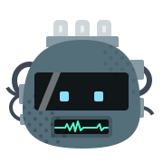&nbsp;&nbsp; <a href="images/Dicebear/Bottts/README.md">(+16)</a> | `20 Items` |
| [　　┗ `Bottts Neutral`](images/Dicebear/Bottts%20Neutral/README.md) | &nbsp;&nbsp;&nbsp; <a href="images/Dicebear/Bottts%20Neutral/README.md">(+16)</a> | `20 Items` |
| [　　┗ `Croodles`](images/Dicebear/Croodles/README.md) | &nbsp;&nbsp;&nbsp; <a href="images/Dicebear/Croodles/README.md">(+16)</a> | `20 Items` |
| [　　┗ `Croodles Netral`](images/Dicebear/Croodles%20Netral/README.md) | &nbsp;&nbsp;&nbsp; <a href="images/Dicebear/Croodles%20Netral/README.md">(+16)</a> | `20 Items` |
| [　　┗ `Dylan`](images/Dicebear/Dylan/README.md) | &nbsp;&nbsp;&nbsp; <a href="images/Dicebear/Dylan/README.md">(+15)</a> | `19 Items` |
| [　　┗ `Fun Emoji`](images/Dicebear/Fun%20Emoji/README.md) | &nbsp;&nbsp;&nbsp; <a href="images/Dicebear/Fun%20Emoji/README.md">(+16)</a> | `20 Items` |
| [　　┗ `Glass`](images/Dicebear/Glass/README.md) | &nbsp;&nbsp;&nbsp; <a href="images/Dicebear/Glass/README.md">(+16)</a> | `20 Items` |
| [　　┗ `Identicon`](images/Dicebear/Identicon/README.md) | &nbsp;&nbsp;&nbsp; <a href="images/Dicebear/Identicon/README.md">(+16)</a> | `20 Items` |
| [　　┗ `Lorelei`](images/Dicebear/Lorelei/README.md) | &nbsp;&nbsp;&nbsp; <a href="images/Dicebear/Lorelei/README.md">(+16)</a> | `20 Items` |
| [　　┗ `Lorelei Netral`](images/Dicebear/Lorelei%20Netral/README.md) | &nbsp;&nbsp;&nbsp; <a href="images/Dicebear/Lorelei%20Netral/README.md">(+16)</a> | `20 Items` |
| [　　┗ `Micah`](images/Dicebear/Micah/README.md) | &nbsp;&nbsp;&nbsp; <a href="images/Dicebear/Micah/README.md">(+16)</a> | `20 Items` |
| [　　┗ `Miniavs`](images/Dicebear/Miniavs/README.md) | &nbsp;&nbsp;&nbsp; <a href="images/Dicebear/Miniavs/README.md">(+16)</a> | `20 Items` |
| [　　┗ `Notionists`](images/Dicebear/Notionists/README.md) | 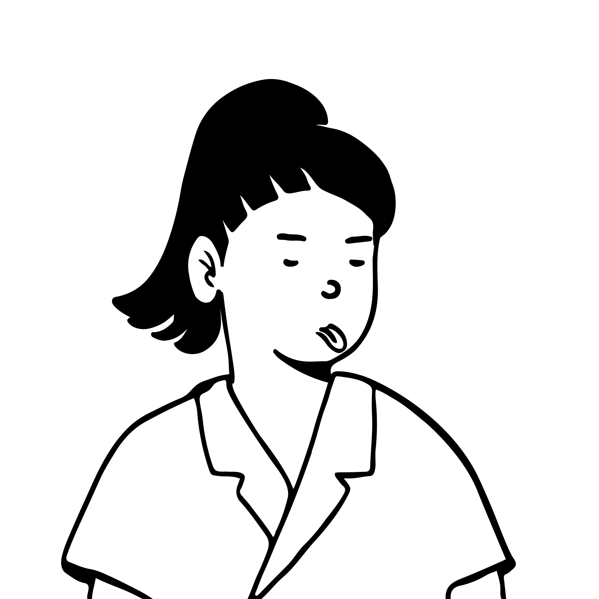&nbsp;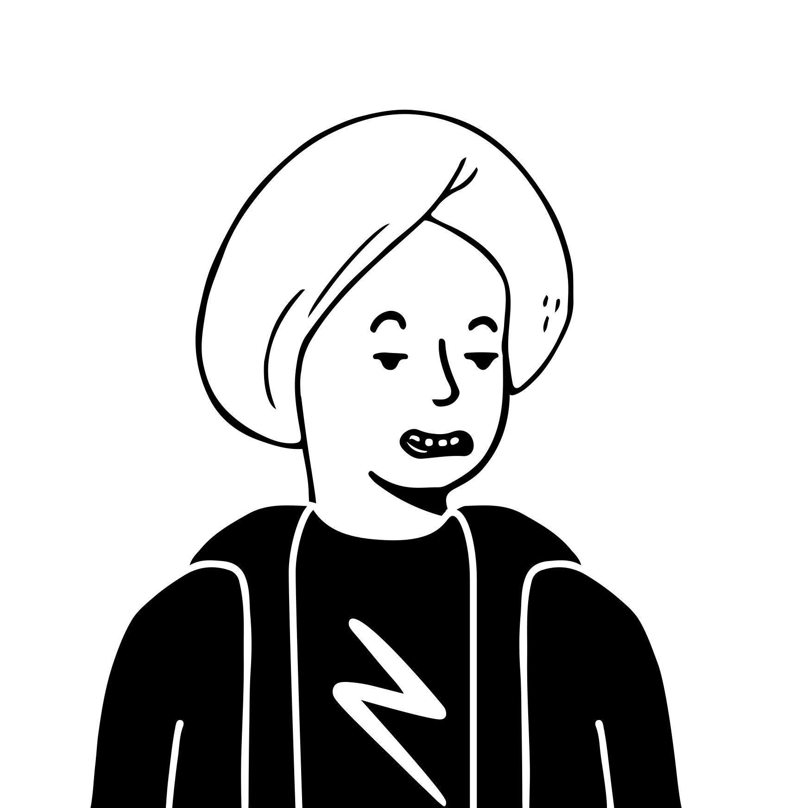&nbsp;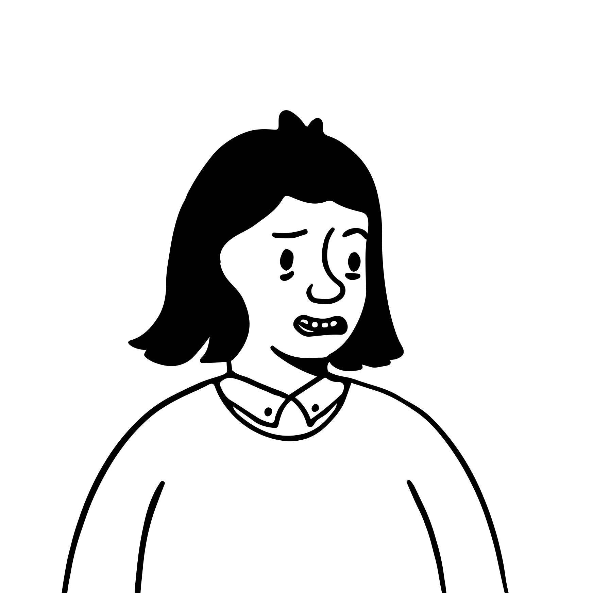&nbsp;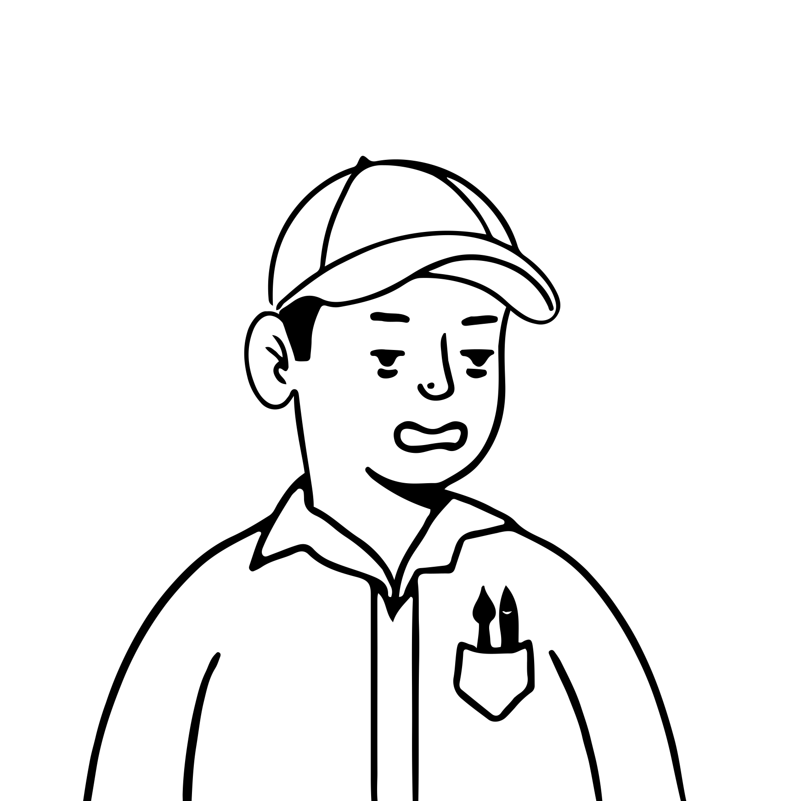 <a href="images/Dicebear/Notionists/README.md">(+13)</a> | `17 Items` |
| [　　┗ `Notionists Netral`](images/Dicebear/Notionists%20Netral/README.md) | &nbsp;&nbsp;&nbsp; <a href="images/Dicebear/Notionists%20Netral/README.md">(+16)</a> | `20 Items` |
| [　　┗ `Openpeeps`](images/Dicebear/Openpeeps/README.md) | 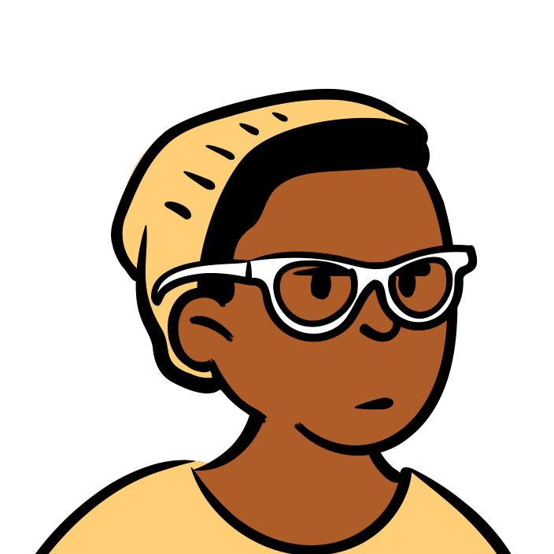&nbsp;&nbsp;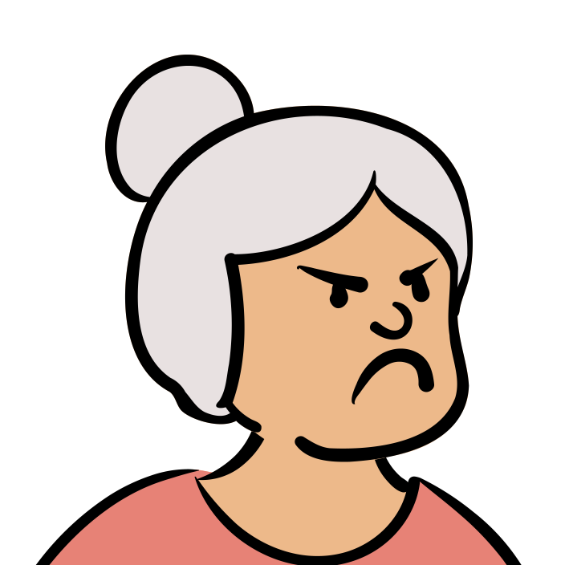&nbsp;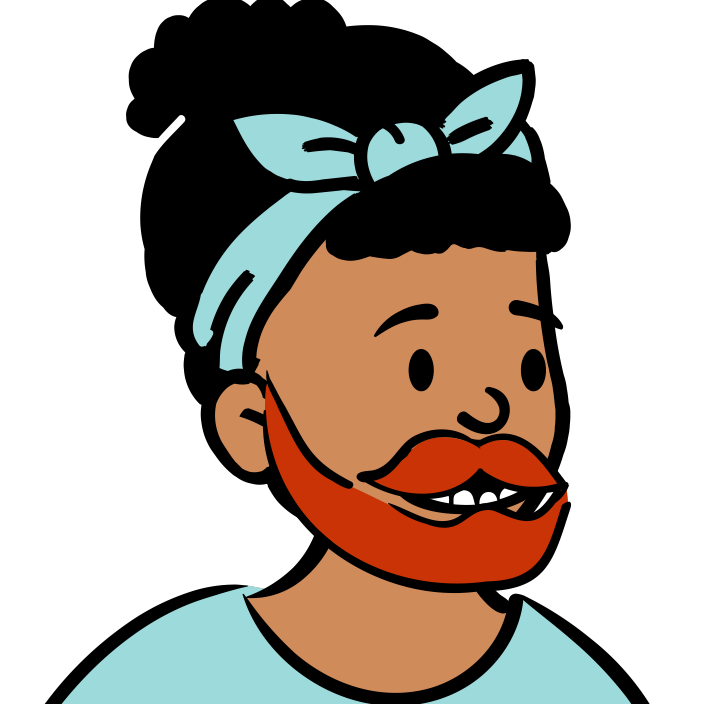 <a href="images/Dicebear/Openpeeps/README.md">(+16)</a> | `20 Items` |
| [　　┗ `Personas`](images/Dicebear/Personas/README.md) | &nbsp;&nbsp;&nbsp; <a href="images/Dicebear/Personas/README.md">(+16)</a> | `20 Items` |
| [　　┗ `Pixelart`](images/Dicebear/Pixelart/README.md) | 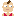&nbsp;&nbsp;&nbsp; <a href="images/Dicebear/Pixelart/README.md">(+16)</a> | `20 Items` |
| [　　┗ `Pixelart Netral`](images/Dicebear/Pixelart%20Netral/README.md) | &nbsp;&nbsp;&nbsp; <a href="images/Dicebear/Pixelart%20Netral/README.md">(+16)</a> | `20 Items` |
| [　　┗ `Shapes`](images/Dicebear/Shapes/README.md) | &nbsp;&nbsp;&nbsp; <a href="images/Dicebear/Shapes/README.md">(+16)</a> | `20 Items` |
| [　　┗ `Thumbs`](images/Dicebear/Thumbs/README.md) | &nbsp;&nbsp;&nbsp; <a href="images/Dicebear/Thumbs/README.md">(+15)</a> | `19 Items` |
| [　　┗ `Toonhead`](images/Dicebear/Toonhead/README.md) | 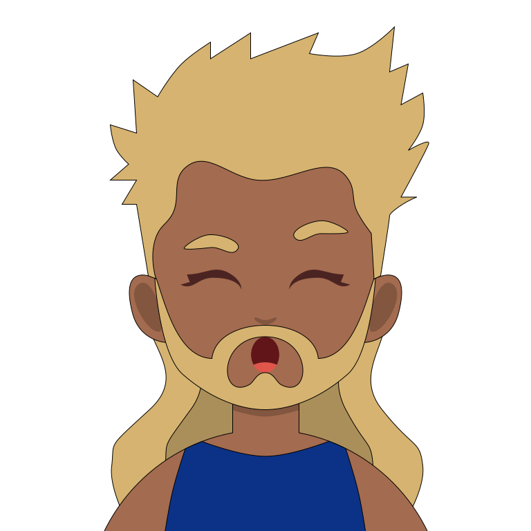&nbsp;&nbsp;&nbsp; <a href="images/Dicebear/Toonhead/README.md">(+16)</a> | `20 Items` |
| [　┗ `Font Styles`](images/Font%20Styles/README.md) | &nbsp;&nbsp;&nbsp; <a href="images/Font%20Styles/README.md">(+19)</a> | `23 Items` |
| [　┗ `Illustrations`](images/Illustrations/README.md) | 📁 (導覽層) | - |
| [　　┗ `Amazing Cat Illustrations`](images/Illustrations/Amazing%20Cat%20Illustrations/README.md) | 📁 (導覽層) | - |
| [　　　┗ `SVG`](images/Illustrations/Amazing%20Cat%20Illustrations/SVG/README.md) | &nbsp;&nbsp;&nbsp; <a href="images/Illustrations/Amazing%20Cat%20Illustrations/SVG/README.md">(+16)</a> | `20 Items` |
| [　　┗ `Byte Dance`](images/Illustrations/Byte%20Dance/README.md) | &nbsp;&nbsp;&nbsp; <a href="images/Illustrations/Byte%20Dance/README.md">(+11)</a> | `15 Items` |
| [　　┗ `Circuitill`](images/Illustrations/Circuitill/README.md) | 📁 (導覽層) | - |
| [　　　┗ `SVG`](images/Illustrations/Circuitill/SVG/README.md) | &nbsp;&nbsp;&nbsp; <a href="images/Illustrations/Circuitill/SVG/README.md">(+25)</a> | `29 Items` |
| [　　┗ `Corporate Scenesillustration Octet Design Studio`](images/Illustrations/Corporate%20Scenesillustration%20Octet%20Design%20Studio/README.md) |   | `1 Items` |
| [　　┗ `Desk Dudes illustration`](images/Illustrations/Desk%20Dudes%20illustration/README.md) | &nbsp;&nbsp;&nbsp; <a href="images/Illustrations/Desk%20Dudes%20illustration/README.md">(+16)</a> | `20 Items` |
| [　　┗ `Doozy Pro Svg`](images/Illustrations/Doozy%20Pro%20Svg/README.md) | &nbsp;&nbsp;&nbsp; <a href="images/Illustrations/Doozy%20Pro%20Svg/README.md">(+16)</a> | `20 Items` |
| [　　┗ `Error Stateillustrations Pixel True`](images/Illustrations/Error%20Stateillustrations%20Pixel%20True/README.md) | &nbsp;&nbsp;&nbsp; <a href="images/Illustrations/Error%20Stateillustrations%20Pixel%20True/README.md">(+26)</a> | `30 Items` |
| [　　┗ `Growww Kit 01`](images/Illustrations/Growww%20Kit%2001/README.md) | &nbsp;&nbsp;&nbsp; <a href="images/Illustrations/Growww%20Kit%2001/README.md">(+4)</a> | `8 Items` |
| [　　┗ `Growww Kit 02`](images/Illustrations/Growww%20Kit%2002/README.md) | &nbsp;&nbsp;&nbsp; <a href="images/Illustrations/Growww%20Kit%2002/README.md">(+8)</a> | `12 Items` |
| [　　┗ `Life & Work Flat`](images/Illustrations/Life%20%26%20Work%20Flat/README.md) | 📁 (導覽層) | - |
| [　　　┗ `Business Team`](images/Illustrations/Life%20%26%20Work%20Flat/Business%20Team/README.md) | &nbsp;&nbsp;&nbsp; <a href="images/Illustrations/Life%20%26%20Work%20Flat/Business%20Team/README.md">(+5)</a> | `9 Items` |
| [　　　┗ `Discover`](images/Illustrations/Life%20%26%20Work%20Flat/Discover/README.md) | &nbsp;&nbsp;&nbsp; <a href="images/Illustrations/Life%20%26%20Work%20Flat/Discover/README.md">(+1)</a> | `5 Items` |
| [　　　┗ `Dolty Christmas`](images/Illustrations/Life%20%26%20Work%20Flat/Dolty%20Christmas/README.md) | &nbsp;&nbsp;&nbsp; <a href="images/Illustrations/Life%20%26%20Work%20Flat/Dolty%20Christmas/README.md">(+11)</a> | `15 Items` |
| [　　　┗ `Education & E-Learning`](images/Illustrations/Life%20%26%20Work%20Flat/Education%20%26%20E-Learning/README.md) | &nbsp;&nbsp;&nbsp; <a href="images/Illustrations/Life%20%26%20Work%20Flat/Education%20%26%20E-Learning/README.md">(+7)</a> | `11 Items` |
| [　　　┗ `Emotration`](images/Illustrations/Life%20%26%20Work%20Flat/Emotration/README.md) | &nbsp;&nbsp;&nbsp; <a href="images/Illustrations/Life%20%26%20Work%20Flat/Emotration/README.md">(+5)</a> | `9 Items` |
| [　　　┗ `Frosty`](images/Illustrations/Life%20%26%20Work%20Flat/Frosty/README.md) | &nbsp;&nbsp;&nbsp; <a href="images/Illustrations/Life%20%26%20Work%20Flat/Frosty/README.md">(+8)</a> | `12 Items` |
| [　　　┗ `Her adventure`](images/Illustrations/Life%20%26%20Work%20Flat/Her%20adventure/README.md) | &nbsp;&nbsp;&nbsp; <a href="images/Illustrations/Life%20%26%20Work%20Flat/Her%20adventure/README.md">(+2)</a> | `6 Items` |
| [　　　┗ `Merry`](images/Illustrations/Life%20%26%20Work%20Flat/Merry/README.md) | &nbsp;&nbsp;&nbsp; <a href="images/Illustrations/Life%20%26%20Work%20Flat/Merry/README.md">(+8)</a> | `12 Items` |
| [　　　┗ `Peace StopWar`](images/Illustrations/Life%20%26%20Work%20Flat/Peace%20StopWar/README.md) | &nbsp;  | `2 Items` |
| [　　　┗ `Rock inaround`](images/Illustrations/Life%20%26%20Work%20Flat/Rock%20inaround/README.md) | &nbsp;&nbsp;&nbsp; <a href="images/Illustrations/Life%20%26%20Work%20Flat/Rock%20inaround/README.md">(+6)</a> | `10 Items` |
| [　　　┗ `Travel`](images/Illustrations/Life%20%26%20Work%20Flat/Travel/README.md) | &nbsp;&nbsp;&nbsp; <a href="images/Illustrations/Life%20%26%20Work%20Flat/Travel/README.md">(+6)</a> | `10 Items` |
| [　　　┗ `Virtual Reality`](images/Illustrations/Life%20%26%20Work%20Flat/Virtual%20Reality/README.md) | &nbsp;&nbsp;&nbsp; <a href="images/Illustrations/Life%20%26%20Work%20Flat/Virtual%20Reality/README.md">(+6)</a> | `10 Items` |
| [　　┗ `Sigma Pro Svg`](images/Illustrations/Sigma%20Pro%20Svg/README.md) | &nbsp;&nbsp;&nbsp;  | `4 Items` |
| [　　┗ `Sketchy Pro Svg`](images/Illustrations/Sketchy%20Pro%20Svg/README.md) | &nbsp;&nbsp;&nbsp; <a href="images/Illustrations/Sketchy%20Pro%20Svg/README.md">(+17)</a> | `21 Items` |
| [　　┗ `Social Media Marketing Illustratio`](images/Illustrations/Social%20Media%20Marketing%20Illustratio/README.md) | &nbsp;&nbsp;&nbsp; <a href="images/Illustrations/Social%20Media%20Marketing%20Illustratio/README.md">(+8)</a> | `12 Items` |
| [　　┗ `Workspace Activity`](images/Illustrations/Workspace%20Activity/README.md) | &nbsp;&nbsp;&nbsp; <a href="images/Illustrations/Workspace%20Activity/README.md">(+8)</a> | `12 Items` |
| [　　┗ `illustrations Simplicity`](images/Illustrations/illustrations%20Simplicity/README.md) | &nbsp;&nbsp;&nbsp; <a href="images/Illustrations/illustrations%20Simplicity/README.md">(+28)</a> | `32 Items` |
| [　　　┗ `Bgs`](images/Illustrations/illustrations%20Simplicity/Bgs/README.md) | &nbsp;&nbsp;&nbsp; <a href="images/Illustrations/illustrations%20Simplicity/Bgs/README.md">(+94)</a> | `98 Items` |
| [　┗ `Resumes`](images/Resumes/README.md) | 📁 (導覽層) | - |
| [　　┗ `Backgrounds`](images/Resumes/Backgrounds/README.md) | &nbsp;&nbsp;&nbsp;  | `4 Items` |
| [　　┗ `Barr Y`](images/Resumes/Barr%20Y/README.md) | &nbsp;&nbsp;&nbsp; <a href="images/Resumes/Barr%20Y/README.md">(+7)</a> | `11 Items` |
| [　　┗ `Px Cursots`](images/Resumes/Px%20Cursots/README.md) | &nbsp;&nbsp;&nbsp; <a href="images/Resumes/Px%20Cursots/README.md">(+3)</a> | `7 Items` |
| [　　┗ `Px Group`](images/Resumes/Px%20Group/README.md) | &nbsp;&nbsp;&nbsp; <a href="images/Resumes/Px%20Group/README.md">(+667)</a> | `671 Items` |
| [　┗ `Svg Samples`](images/Svg%20Samples/README.md) |   | `1 Items` |
| [　　┗ `Brands`](images/Svg%20Samples/Brands/README.md) | &nbsp;&nbsp;&nbsp;  | `4 Items` |
| [　　┗ `Patterns`](images/Svg%20Samples/Patterns/README.md) | &nbsp;&nbsp;&nbsp; <a href="images/Svg%20Samples/Patterns/README.md">(+16)</a> | `20 Items` |
| [　　┗ `Prints`](images/Svg%20Samples/Prints/README.md) | &nbsp;&nbsp;  | `3 Items` |
| [　　┗ `Ui`](images/Svg%20Samples/Ui/README.md) | &nbsp;&nbsp;&nbsp;  | `4 Items` |
| [　┗ `Svgs`](images/Svgs/README.md) | 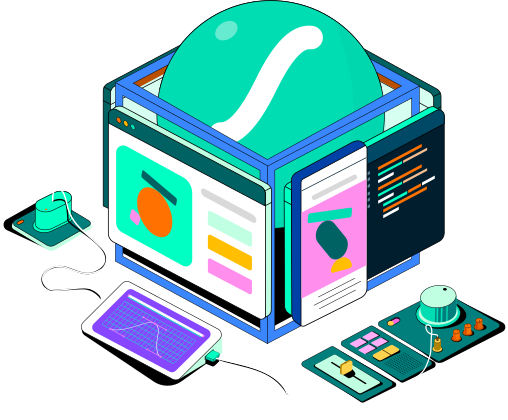&nbsp;  | `2 Items` |
| [　┗ `Ux meme`](images/Ux%20meme/README.md) | &nbsp;&nbsp;&nbsp;  | `4 Items` |
| [　┗ `iCons`](images/iCons/README.md) | 📁 (導覽層) | - |
| [　　┗ `3D Hand Emojis`](images/iCons/3D%20Hand%20Emojis/README.md) | 📁 (導覽層) | - |
| [　　　┗ `Black`](images/iCons/3D%20Hand%20Emojis/Black/README.md) | &nbsp;&nbsp;&nbsp; <a href="images/iCons/3D%20Hand%20Emojis/Black/README.md">(+28)</a> | `32 Items` |
| [　　　┗ `Default`](images/iCons/3D%20Hand%20Emojis/Default/README.md) | &nbsp;&nbsp;&nbsp; <a href="images/iCons/3D%20Hand%20Emojis/Default/README.md">(+27)</a> | `31 Items` |
| [　　　┗ `Light`](images/iCons/3D%20Hand%20Emojis/Light/README.md) | &nbsp;&nbsp;&nbsp; <a href="images/iCons/3D%20Hand%20Emojis/Light/README.md">(+27)</a> | `31 Items` |
| [　　┗ `Adobe Creative Software iCons`](images/iCons/Adobe%20Creative%20Software%20iCons/README.md) | &nbsp;&nbsp;&nbsp; <a href="images/iCons/Adobe%20Creative%20Software%20iCons/README.md">(+23)</a> | `27 Items` |
| [　　┗ `Ai Icons Text And Image Generation`](images/iCons/Ai%20Icons%20Text%20And%20Image%20Generation/README.md) | &nbsp;&nbsp;&nbsp; <a href="images/iCons/Ai%20Icons%20Text%20And%20Image%20Generation/README.md">(+78)</a> | `82 Items` |
| [　　┗ `Banking Isometric 3D Vectors`](images/iCons/Banking%20Isometric%203D%20Vectors/README.md) | &nbsp;&nbsp;&nbsp; <a href="images/iCons/Banking%20Isometric%203D%20Vectors/README.md">(+16)</a> | `20 Items` |
| [　　┗ `Bowtie iCons Collection`](images/iCons/Bowtie%20iCons%20Collection/README.md) | &nbsp;&nbsp;&nbsp; <a href="images/iCons/Bowtie%20iCons%20Collection/README.md">(+153)</a> | `157 Items` |
| [　　┗ `Bpmn`](images/iCons/Bpmn/README.md) | &nbsp;&nbsp;&nbsp; <a href="images/iCons/Bpmn/README.md">(+109)</a> | `113 Items` |
| [　　┗ `Brands`](images/iCons/Brands/README.md) | &nbsp;&nbsp;&nbsp; <a href="images/iCons/Brands/README.md">(+1748)</a> | `1752 Items` |
| [　　　┗ `App`](images/iCons/Brands/App/README.md) |   | `1 Items` |
| [　　　┗ `County`](images/iCons/Brands/County/README.md) | 📁 (導覽層) | - |
| [　　　　┗ `Flags`](images/iCons/Brands/County/Flags/README.md) |   | `1 Items` |
| [　　　　┗ `flagSq`](images/iCons/Brands/County/flagSq/README.md) | &nbsp;&nbsp;&nbsp;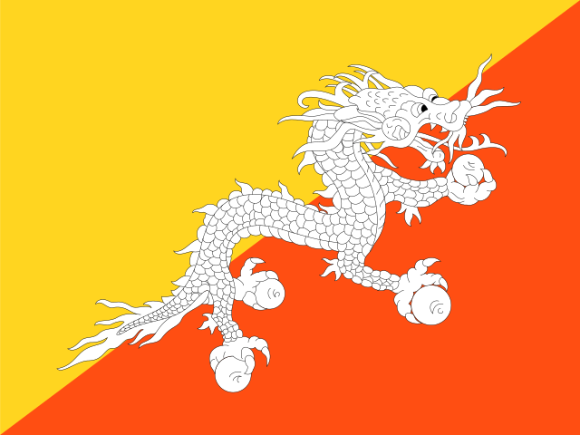 <a href="images/iCons/Brands/County/flagSq/README.md">(+17)</a> | `21 Items` |
| [　　┗ `Browsers`](images/iCons/Browsers/README.md) | &nbsp;&nbsp;&nbsp; <a href="images/iCons/Browsers/README.md">(+14)</a> | `18 Items` |
| [　　┗ `Bytesize iCons`](images/iCons/Bytesize%20iCons/README.md) | &nbsp;&nbsp;&nbsp; <a href="images/iCons/Bytesize%20iCons/README.md">(+109)</a> | `113 Items` |
| [　　┗ `CRM`](images/iCons/CRM/README.md) | &nbsp;&nbsp;&nbsp; <a href="images/iCons/CRM/README.md">(+181)</a> | `185 Items` |
| [　　┗ `Calcite Sharp Line iCons`](images/iCons/Calcite%20Sharp%20Line%20iCons/README.md) | &nbsp;&nbsp;&nbsp; <a href="images/iCons/Calcite%20Sharp%20Line%20iCons/README.md">(+860)</a> | `864 Items` |
| [　　┗ `CandyiCons`](images/iCons/CandyiCons/README.md) | 📁 (導覽層) | - |
| [　　　┗ `apps`](images/iCons/CandyiCons/apps/README.md) | &nbsp;&nbsp;&nbsp; <a href="images/iCons/CandyiCons/apps/README.md">(+547)</a> | `551 Items` |
| [　　　┗ `devices`](images/iCons/CandyiCons/devices/README.md) | &nbsp;&nbsp;&nbsp; <a href="images/iCons/CandyiCons/devices/README.md">(+8)</a> | `12 Items` |
| [　　　┗ `mimetypes`](images/iCons/CandyiCons/mimetypes/README.md) | &nbsp;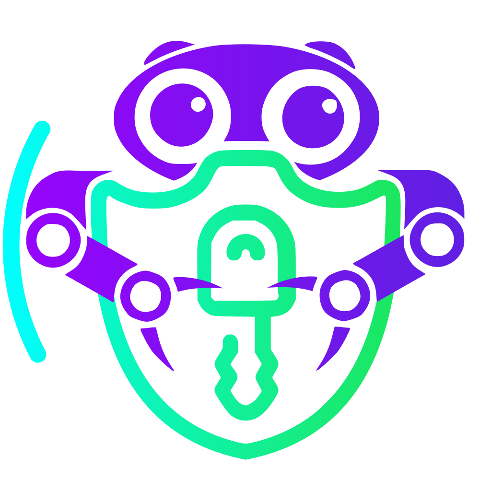&nbsp;&nbsp; <a href="images/iCons/CandyiCons/mimetypes/README.md">(+28)</a> | `32 Items` |
| [　　　┗ `places`](images/iCons/CandyiCons/places/README.md) | 📁 (導覽層) | - |
| [　　　　┗ `16`](images/iCons/CandyiCons/places/16/README.md) | &nbsp;&nbsp;&nbsp; <a href="images/iCons/CandyiCons/places/16/README.md">(+42)</a> | `46 Items` |
| [　　　　┗ `48`](images/iCons/CandyiCons/places/48/README.md) |   | `1 Items` |
| [　　　┗ `preferences`](images/iCons/CandyiCons/preferences/README.md) | &nbsp;&nbsp;&nbsp; <a href="images/iCons/CandyiCons/preferences/README.md">(+19)</a> | `23 Items` |
| [　　┗ `CapitaineCursors`](images/iCons/CapitaineCursors/README.md) | 📁 (導覽層) | - |
| [　　　┗ `Dark`](images/iCons/CapitaineCursors/Dark/README.md) | &nbsp;&nbsp;&nbsp; <a href="images/iCons/CapitaineCursors/Dark/README.md">(+90)</a> | `94 Items` |
| [　　　┗ `Light`](images/iCons/CapitaineCursors/Light/README.md) | &nbsp;&nbsp;&nbsp; <a href="images/iCons/CapitaineCursors/Light/README.md">(+14)</a> | `18 Items` |
| [　　┗ `Chunk iCons`](images/iCons/Chunk%20iCons/README.md) | &nbsp;&nbsp;&nbsp; <a href="images/iCons/Chunk%20iCons/README.md">(+637)</a> | `641 Items` |
| [　　┗ `Circum`](images/iCons/Circum/README.md) | 📁 (導覽層) | - |
| [　　　┗ `Communication`](images/iCons/Circum/Communication/README.md) | &nbsp;&nbsp;&nbsp; <a href="images/iCons/Circum/Communication/README.md">(+12)</a> | `16 Items` |
| [　　　┗ `Design`](images/iCons/Circum/Design/README.md) | &nbsp;&nbsp;&nbsp; <a href="images/iCons/Circum/Design/README.md">(+10)</a> | `14 Items` |
| [　　　┗ `Devices & Electronics`](images/iCons/Circum/Devices%20%26%20Electronics/README.md) | &nbsp;&nbsp;&nbsp; <a href="images/iCons/Circum/Devices%20%26%20Electronics/README.md">(+32)</a> | `36 Items` |
| [　　　┗ `Finances & Payments`](images/iCons/Circum/Finances%20%26%20Payments/README.md) | &nbsp;&nbsp;&nbsp; <a href="images/iCons/Circum/Finances%20%26%20Payments/README.md">(+11)</a> | `15 Items` |
| [　　　┗ `Food & Drinks`](images/iCons/Circum/Food%20%26%20Drinks/README.md) | &nbsp;&nbsp;&nbsp; <a href="images/iCons/Circum/Food%20%26%20Drinks/README.md">(+7)</a> | `11 Items` |
| [　　　┗ `Formattings`](images/iCons/Circum/Formattings/README.md) | &nbsp;&nbsp;&nbsp; <a href="images/iCons/Circum/Formattings/README.md">(+4)</a> | `8 Items` |
| [　　　┗ `Media Controls`](images/iCons/Circum/Media%20Controls/README.md) | &nbsp;&nbsp;&nbsp; <a href="images/iCons/Circum/Media%20Controls/README.md">(+7)</a> | `11 Items` |
| [　　　┗ `Navigations & Travels`](images/iCons/Circum/Navigations%20%26%20Travels/README.md) | &nbsp;&nbsp;&nbsp; <a href="images/iCons/Circum/Navigations%20%26%20Travels/README.md">(+13)</a> | `17 Items` |
| [　　　┗ `Shopping & Ecommerce`](images/iCons/Circum/Shopping%20%26%20Ecommerce/README.md) | &nbsp;&nbsp;&nbsp; <a href="images/iCons/Circum/Shopping%20%26%20Ecommerce/README.md">(+6)</a> | `10 Items` |
| [　　　┗ `User Interface`](images/iCons/Circum/User%20Interface/README.md) | &nbsp;&nbsp;&nbsp; <a href="images/iCons/Circum/User%20Interface/README.md">(+2)</a> | `6 Items` |
| [　　　┗ `Weather`](images/iCons/Circum/Weather/README.md) | &nbsp;&nbsp;&nbsp; <a href="images/iCons/Circum/Weather/README.md">(+5)</a> | `9 Items` |
| [　　┗ `Company`](images/iCons/Company/README.md) | &nbsp;&nbsp;&nbsp; <a href="images/iCons/Company/README.md">(+77)</a> | `81 Items` |
| [　　┗ `Coolicons`](images/iCons/Coolicons/README.md) | 📁 (導覽層) | - |
| [　　　┗ `Arrow`](images/iCons/Coolicons/Arrow/README.md) | &nbsp;&nbsp;&nbsp; <a href="images/iCons/Coolicons/Arrow/README.md">(+68)</a> | `72 Items` |
| [　　　┗ `Calendar`](images/iCons/Coolicons/Calendar/README.md) | &nbsp;&nbsp;&nbsp; <a href="images/iCons/Coolicons/Calendar/README.md">(+10)</a> | `14 Items` |
| [　　　┗ `Communication`](images/iCons/Coolicons/Communication/README.md) | &nbsp;&nbsp;&nbsp; <a href="images/iCons/Coolicons/Communication/README.md">(+21)</a> | `25 Items` |
| [　　　┗ `Edit`](images/iCons/Coolicons/Edit/README.md) | &nbsp;&nbsp;&nbsp; <a href="images/iCons/Coolicons/Edit/README.md">(+68)</a> | `72 Items` |
| [　　　┗ `Environment`](images/iCons/Coolicons/Environment/README.md) | &nbsp;&nbsp;&nbsp; <a href="images/iCons/Coolicons/Environment/README.md">(+9)</a> | `13 Items` |
| [　　　┗ `File`](images/iCons/Coolicons/File/README.md) | &nbsp;&nbsp;&nbsp; <a href="images/iCons/Coolicons/File/README.md">(+35)</a> | `39 Items` |
| [　　　┗ `Interface`](images/iCons/Coolicons/Interface/README.md) | &nbsp;&nbsp;&nbsp; <a href="images/iCons/Coolicons/Interface/README.md">(+69)</a> | `73 Items` |
| [　　　┗ `Media`](images/iCons/Coolicons/Media/README.md) | &nbsp;&nbsp;&nbsp; <a href="images/iCons/Coolicons/Media/README.md">(+18)</a> | `22 Items` |
| [　　　┗ `Menu`](images/iCons/Coolicons/Menu/README.md) | &nbsp;&nbsp;&nbsp; <a href="images/iCons/Coolicons/Menu/README.md">(+12)</a> | `16 Items` |
| [　　　┗ `Navigation`](images/iCons/Coolicons/Navigation/README.md) | &nbsp;&nbsp;&nbsp; <a href="images/iCons/Coolicons/Navigation/README.md">(+14)</a> | `18 Items` |
| [　　　┗ `Shape`](images/iCons/Coolicons/Shape/README.md) | &nbsp;&nbsp;&nbsp; <a href="images/iCons/Coolicons/Shape/README.md">(+2)</a> | `6 Items` |
| [　　　┗ `System`](images/iCons/Coolicons/System/README.md) | &nbsp;&nbsp;&nbsp; <a href="images/iCons/Coolicons/System/README.md">(+33)</a> | `37 Items` |
| [　　　┗ `User`](images/iCons/Coolicons/User/README.md) | &nbsp;&nbsp;&nbsp; <a href="images/iCons/Coolicons/User/README.md">(+9)</a> | `13 Items` |
| [　　　┗ `Warning`](images/iCons/Coolicons/Warning/README.md) | &nbsp;&nbsp;&nbsp; <a href="images/iCons/Coolicons/Warning/README.md">(+16)</a> | `20 Items` |
| [　　┗ `Cryptocurrency`](images/iCons/Cryptocurrency/README.md) | 📁 (導覽層) | - |
| [　　　┗ `Color`](images/iCons/Cryptocurrency/Color/README.md) | &nbsp;&nbsp;&nbsp; <a href="images/iCons/Cryptocurrency/Color/README.md">(+219)</a> | `223 Items` |
| [　　　┗ `Dark`](images/iCons/Cryptocurrency/Dark/README.md) | &nbsp;&nbsp;&nbsp; <a href="images/iCons/Cryptocurrency/Dark/README.md">(+216)</a> | `220 Items` |
| [　　　┗ `White`](images/iCons/Cryptocurrency/White/README.md) | &nbsp;&nbsp;&nbsp; <a href="images/iCons/Cryptocurrency/White/README.md">(+216)</a> | `220 Items` |
| [　　┗ `Css.Gg`](images/iCons/Css.Gg/README.md) | &nbsp;&nbsp;&nbsp; <a href="images/iCons/Css.Gg/README.md">(+700)</a> | `704 Items` |
| [　　┗ `Daily Life Vectors`](images/iCons/Daily%20Life%20Vectors/README.md) | &nbsp;&nbsp;&nbsp; <a href="images/iCons/Daily%20Life%20Vectors/README.md">(+16)</a> | `20 Items` |
| [　　┗ `Dashicons`](images/iCons/Dashicons/README.md) | &nbsp;&nbsp;&nbsp; <a href="images/iCons/Dashicons/README.md">(+330)</a> | `334 Items` |
| [　　┗ `Dazzle Ui iCons`](images/iCons/Dazzle%20Ui%20iCons/README.md) | &nbsp;&nbsp;&nbsp; <a href="images/iCons/Dazzle%20Ui%20iCons/README.md">(+1662)</a> | `1666 Items` |
| [　　┗ `Denali Line Interface iCons`](images/iCons/Denali%20Line%20Interface%20iCons/README.md) | &nbsp;&nbsp;&nbsp; <a href="images/iCons/Denali%20Line%20Interface%20iCons/README.md">(+663)</a> | `667 Items` |
| [　　┗ `Dencar Icon Pack`](images/iCons/Dencar%20Icon%20Pack/README.md) | 📁 (導覽層) | - |
| [　　　┗ `Bold Duotone`](images/iCons/Dencar%20Icon%20Pack/Bold%20Duotone/README.md) | 📁 (導覽層) | - |
| [　　　　┗ `Actions`](images/iCons/Dencar%20Icon%20Pack/Bold%20Duotone/Actions/README.md) | &nbsp;&nbsp;&nbsp; <a href="images/iCons/Dencar%20Icon%20Pack/Bold%20Duotone/Actions/README.md">(+44)</a> | `48 Items` |
| [　　　　┗ `Arrows`](images/iCons/Dencar%20Icon%20Pack/Bold%20Duotone/Arrows/README.md) | &nbsp;&nbsp;&nbsp; <a href="images/iCons/Dencar%20Icon%20Pack/Bold%20Duotone/Arrows/README.md">(+44)</a> | `48 Items` |
| [　　　　┗ `Business`](images/iCons/Dencar%20Icon%20Pack/Bold%20Duotone/Business/README.md) | &nbsp;&nbsp;&nbsp; <a href="images/iCons/Dencar%20Icon%20Pack/Bold%20Duotone/Business/README.md">(+27)</a> | `31 Items` |
| [　　　　┗ `Communication`](images/iCons/Dencar%20Icon%20Pack/Bold%20Duotone/Communication/README.md) | &nbsp;&nbsp;&nbsp; <a href="images/iCons/Dencar%20Icon%20Pack/Bold%20Duotone/Communication/README.md">(+27)</a> | `31 Items` |
| [　　　　┗ `Content`](images/iCons/Dencar%20Icon%20Pack/Bold%20Duotone/Content/README.md) | &nbsp;&nbsp;&nbsp; <a href="images/iCons/Dencar%20Icon%20Pack/Bold%20Duotone/Content/README.md">(+20)</a> | `24 Items` |
| [　　　　┗ `Currency`](images/iCons/Dencar%20Icon%20Pack/Bold%20Duotone/Currency/README.md) | &nbsp;&nbsp;&nbsp; <a href="images/iCons/Dencar%20Icon%20Pack/Bold%20Duotone/Currency/README.md">(+19)</a> | `23 Items` |
| [　　　　┗ `Design`](images/iCons/Dencar%20Icon%20Pack/Bold%20Duotone/Design/README.md) | &nbsp;&nbsp;&nbsp; <a href="images/iCons/Dencar%20Icon%20Pack/Bold%20Duotone/Design/README.md">(+82)</a> | `86 Items` |
| [　　　　┗ `Hardware & Software`](images/iCons/Dencar%20Icon%20Pack/Bold%20Duotone/Hardware%20%26%20Software/README.md) | &nbsp;&nbsp;&nbsp; <a href="images/iCons/Dencar%20Icon%20Pack/Bold%20Duotone/Hardware%20%26%20Software/README.md">(+38)</a> | `42 Items` |
| [　　　　┗ `Location & Transport`](images/iCons/Dencar%20Icon%20Pack/Bold%20Duotone/Location%20%26%20Transport/README.md) | &nbsp;&nbsp;&nbsp; <a href="images/iCons/Dencar%20Icon%20Pack/Bold%20Duotone/Location%20%26%20Transport/README.md">(+44)</a> | `48 Items` |
| [　　　　┗ `Media`](images/iCons/Dencar%20Icon%20Pack/Bold%20Duotone/Media/README.md) | &nbsp;&nbsp;&nbsp; <a href="images/iCons/Dencar%20Icon%20Pack/Bold%20Duotone/Media/README.md">(+26)</a> | `30 Items` |
| [　　　　┗ `Shapes`](images/iCons/Dencar%20Icon%20Pack/Bold%20Duotone/Shapes/README.md) | &nbsp;&nbsp;&nbsp; <a href="images/iCons/Dencar%20Icon%20Pack/Bold%20Duotone/Shapes/README.md">(+25)</a> | `29 Items` |
| [　　　　┗ `Weather & Time`](images/iCons/Dencar%20Icon%20Pack/Bold%20Duotone/Weather%20%26%20Time/README.md) | &nbsp;&nbsp;&nbsp; <a href="images/iCons/Dencar%20Icon%20Pack/Bold%20Duotone/Weather%20%26%20Time/README.md">(+32)</a> | `36 Items` |
| [　　　┗ `Bold Linear`](images/iCons/Dencar%20Icon%20Pack/Bold%20Linear/README.md) | 📁 (導覽層) | - |
| [　　　　┗ `Actions`](images/iCons/Dencar%20Icon%20Pack/Bold%20Linear/Actions/README.md) | &nbsp;&nbsp;&nbsp; <a href="images/iCons/Dencar%20Icon%20Pack/Bold%20Linear/Actions/README.md">(+49)</a> | `53 Items` |
| [　　　　┗ `Arrows`](images/iCons/Dencar%20Icon%20Pack/Bold%20Linear/Arrows/README.md) | &nbsp;&nbsp;&nbsp; <a href="images/iCons/Dencar%20Icon%20Pack/Bold%20Linear/Arrows/README.md">(+44)</a> | `48 Items` |
| [　　　　┗ `Business`](images/iCons/Dencar%20Icon%20Pack/Bold%20Linear/Business/README.md) | &nbsp;&nbsp;&nbsp; <a href="images/iCons/Dencar%20Icon%20Pack/Bold%20Linear/Business/README.md">(+28)</a> | `32 Items` |
| [　　　　┗ `Communication`](images/iCons/Dencar%20Icon%20Pack/Bold%20Linear/Communication/README.md) | &nbsp;&nbsp;&nbsp; <a href="images/iCons/Dencar%20Icon%20Pack/Bold%20Linear/Communication/README.md">(+27)</a> | `31 Items` |
| [　　　　┗ `Content`](images/iCons/Dencar%20Icon%20Pack/Bold%20Linear/Content/README.md) | &nbsp;&nbsp;&nbsp; <a href="images/iCons/Dencar%20Icon%20Pack/Bold%20Linear/Content/README.md">(+36)</a> | `40 Items` |
| [　　　　┗ `Currency`](images/iCons/Dencar%20Icon%20Pack/Bold%20Linear/Currency/README.md) | &nbsp;&nbsp;&nbsp; <a href="images/iCons/Dencar%20Icon%20Pack/Bold%20Linear/Currency/README.md">(+20)</a> | `24 Items` |
| [　　　　┗ `Design`](images/iCons/Dencar%20Icon%20Pack/Bold%20Linear/Design/README.md) | &nbsp;&nbsp;&nbsp; <a href="images/iCons/Dencar%20Icon%20Pack/Bold%20Linear/Design/README.md">(+83)</a> | `87 Items` |
| [　　　　┗ `Hardware & Software`](images/iCons/Dencar%20Icon%20Pack/Bold%20Linear/Hardware%20%26%20Software/README.md) | &nbsp;&nbsp;&nbsp; <a href="images/iCons/Dencar%20Icon%20Pack/Bold%20Linear/Hardware%20%26%20Software/README.md">(+38)</a> | `42 Items` |
| [　　　　┗ `Location & Transport`](images/iCons/Dencar%20Icon%20Pack/Bold%20Linear/Location%20%26%20Transport/README.md) | &nbsp;&nbsp;&nbsp; <a href="images/iCons/Dencar%20Icon%20Pack/Bold%20Linear/Location%20%26%20Transport/README.md">(+44)</a> | `48 Items` |
| [　　　　┗ `Media`](images/iCons/Dencar%20Icon%20Pack/Bold%20Linear/Media/README.md) | &nbsp;&nbsp;&nbsp; <a href="images/iCons/Dencar%20Icon%20Pack/Bold%20Linear/Media/README.md">(+26)</a> | `30 Items` |
| [　　　　┗ `Shapes`](images/iCons/Dencar%20Icon%20Pack/Bold%20Linear/Shapes/README.md) | &nbsp;&nbsp;&nbsp; <a href="images/iCons/Dencar%20Icon%20Pack/Bold%20Linear/Shapes/README.md">(+25)</a> | `29 Items` |
| [　　　　┗ `Weather & Time`](images/iCons/Dencar%20Icon%20Pack/Bold%20Linear/Weather%20%26%20Time/README.md) | &nbsp;&nbsp;&nbsp; <a href="images/iCons/Dencar%20Icon%20Pack/Bold%20Linear/Weather%20%26%20Time/README.md">(+33)</a> | `37 Items` |
| [　　　┗ `Duotone`](images/iCons/Dencar%20Icon%20Pack/Duotone/README.md) | 📁 (導覽層) | - |
| [　　　　┗ `Actions`](images/iCons/Dencar%20Icon%20Pack/Duotone/Actions/README.md) | &nbsp;&nbsp;&nbsp; <a href="images/iCons/Dencar%20Icon%20Pack/Duotone/Actions/README.md">(+45)</a> | `49 Items` |
| [　　　　┗ `Arrows`](images/iCons/Dencar%20Icon%20Pack/Duotone/Arrows/README.md) | &nbsp;&nbsp;&nbsp; <a href="images/iCons/Dencar%20Icon%20Pack/Duotone/Arrows/README.md">(+44)</a> | `48 Items` |
| [　　　　┗ `Business`](images/iCons/Dencar%20Icon%20Pack/Duotone/Business/README.md) | &nbsp;&nbsp;&nbsp; <a href="images/iCons/Dencar%20Icon%20Pack/Duotone/Business/README.md">(+27)</a> | `31 Items` |
| [　　　　┗ `Communication`](images/iCons/Dencar%20Icon%20Pack/Duotone/Communication/README.md) | &nbsp;&nbsp;&nbsp; <a href="images/iCons/Dencar%20Icon%20Pack/Duotone/Communication/README.md">(+27)</a> | `31 Items` |
| [　　　　┗ `Content`](images/iCons/Dencar%20Icon%20Pack/Duotone/Content/README.md) | &nbsp;&nbsp;&nbsp; <a href="images/iCons/Dencar%20Icon%20Pack/Duotone/Content/README.md">(+22)</a> | `26 Items` |
| [　　　　┗ `Currency`](images/iCons/Dencar%20Icon%20Pack/Duotone/Currency/README.md) | &nbsp;&nbsp;&nbsp; <a href="images/iCons/Dencar%20Icon%20Pack/Duotone/Currency/README.md">(+19)</a> | `23 Items` |
| [　　　　┗ `Design`](images/iCons/Dencar%20Icon%20Pack/Duotone/Design/README.md) | &nbsp;&nbsp;&nbsp; <a href="images/iCons/Dencar%20Icon%20Pack/Duotone/Design/README.md">(+82)</a> | `86 Items` |
| [　　　　┗ `Hardware & Software`](images/iCons/Dencar%20Icon%20Pack/Duotone/Hardware%20%26%20Software/README.md) | &nbsp;&nbsp;&nbsp; <a href="images/iCons/Dencar%20Icon%20Pack/Duotone/Hardware%20%26%20Software/README.md">(+38)</a> | `42 Items` |
| [　　　　┗ `Location & Transport`](images/iCons/Dencar%20Icon%20Pack/Duotone/Location%20%26%20Transport/README.md) | &nbsp;&nbsp;&nbsp; <a href="images/iCons/Dencar%20Icon%20Pack/Duotone/Location%20%26%20Transport/README.md">(+44)</a> | `48 Items` |
| [　　　　┗ `Media`](images/iCons/Dencar%20Icon%20Pack/Duotone/Media/README.md) | &nbsp;&nbsp;&nbsp; <a href="images/iCons/Dencar%20Icon%20Pack/Duotone/Media/README.md">(+26)</a> | `30 Items` |
| [　　　　┗ `Shapes`](images/iCons/Dencar%20Icon%20Pack/Duotone/Shapes/README.md) | &nbsp;&nbsp;&nbsp; <a href="images/iCons/Dencar%20Icon%20Pack/Duotone/Shapes/README.md">(+25)</a> | `29 Items` |
| [　　　　┗ `Weather & Time`](images/iCons/Dencar%20Icon%20Pack/Duotone/Weather%20%26%20Time/README.md) | &nbsp;&nbsp;&nbsp; <a href="images/iCons/Dencar%20Icon%20Pack/Duotone/Weather%20%26%20Time/README.md">(+32)</a> | `36 Items` |
| [　　　┗ `Filled`](images/iCons/Dencar%20Icon%20Pack/Filled/README.md) | 📁 (導覽層) | - |
| [　　　　┗ `Actions`](images/iCons/Dencar%20Icon%20Pack/Filled/Actions/README.md) | &nbsp;&nbsp;&nbsp; <a href="images/iCons/Dencar%20Icon%20Pack/Filled/Actions/README.md">(+49)</a> | `53 Items` |
| [　　　　┗ `Arrows`](images/iCons/Dencar%20Icon%20Pack/Filled/Arrows/README.md) | &nbsp;&nbsp;&nbsp; <a href="images/iCons/Dencar%20Icon%20Pack/Filled/Arrows/README.md">(+44)</a> | `48 Items` |
| [　　　　┗ `Business`](images/iCons/Dencar%20Icon%20Pack/Filled/Business/README.md) | &nbsp;&nbsp;&nbsp; <a href="images/iCons/Dencar%20Icon%20Pack/Filled/Business/README.md">(+28)</a> | `32 Items` |
| [　　　　┗ `Communication`](images/iCons/Dencar%20Icon%20Pack/Filled/Communication/README.md) | &nbsp;&nbsp;&nbsp; <a href="images/iCons/Dencar%20Icon%20Pack/Filled/Communication/README.md">(+27)</a> | `31 Items` |
| [　　　　┗ `Content`](images/iCons/Dencar%20Icon%20Pack/Filled/Content/README.md) | &nbsp;&nbsp;&nbsp; <a href="images/iCons/Dencar%20Icon%20Pack/Filled/Content/README.md">(+36)</a> | `40 Items` |
| [　　　　┗ `Currency`](images/iCons/Dencar%20Icon%20Pack/Filled/Currency/README.md) | &nbsp;&nbsp;&nbsp; <a href="images/iCons/Dencar%20Icon%20Pack/Filled/Currency/README.md">(+20)</a> | `24 Items` |
| [　　　　┗ `Design`](images/iCons/Dencar%20Icon%20Pack/Filled/Design/README.md) | &nbsp;&nbsp;&nbsp; <a href="images/iCons/Dencar%20Icon%20Pack/Filled/Design/README.md">(+83)</a> | `87 Items` |
| [　　　　┗ `Hardware & Software`](images/iCons/Dencar%20Icon%20Pack/Filled/Hardware%20%26%20Software/README.md) | &nbsp;&nbsp;&nbsp; <a href="images/iCons/Dencar%20Icon%20Pack/Filled/Hardware%20%26%20Software/README.md">(+38)</a> | `42 Items` |
| [　　　　┗ `Location & Transport`](images/iCons/Dencar%20Icon%20Pack/Filled/Location%20%26%20Transport/README.md) | &nbsp;&nbsp;&nbsp; <a href="images/iCons/Dencar%20Icon%20Pack/Filled/Location%20%26%20Transport/README.md">(+44)</a> | `48 Items` |
| [　　　　┗ `Media`](images/iCons/Dencar%20Icon%20Pack/Filled/Media/README.md) | &nbsp;&nbsp;&nbsp; <a href="images/iCons/Dencar%20Icon%20Pack/Filled/Media/README.md">(+26)</a> | `30 Items` |
| [　　　　┗ `Shapes`](images/iCons/Dencar%20Icon%20Pack/Filled/Shapes/README.md) | &nbsp;&nbsp;&nbsp; <a href="images/iCons/Dencar%20Icon%20Pack/Filled/Shapes/README.md">(+25)</a> | `29 Items` |
| [　　　　┗ `Weather & Time`](images/iCons/Dencar%20Icon%20Pack/Filled/Weather%20%26%20Time/README.md) | &nbsp;&nbsp;&nbsp; <a href="images/iCons/Dencar%20Icon%20Pack/Filled/Weather%20%26%20Time/README.md">(+33)</a> | `37 Items` |
| [　　　┗ `Linear`](images/iCons/Dencar%20Icon%20Pack/Linear/README.md) | 📁 (導覽層) | - |
| [　　　　┗ `Actions`](images/iCons/Dencar%20Icon%20Pack/Linear/Actions/README.md) | &nbsp;&nbsp;&nbsp; <a href="images/iCons/Dencar%20Icon%20Pack/Linear/Actions/README.md">(+49)</a> | `53 Items` |
| [　　　　┗ `Arrows`](images/iCons/Dencar%20Icon%20Pack/Linear/Arrows/README.md) | &nbsp;&nbsp;&nbsp; <a href="images/iCons/Dencar%20Icon%20Pack/Linear/Arrows/README.md">(+44)</a> | `48 Items` |
| [　　　　┗ `Business`](images/iCons/Dencar%20Icon%20Pack/Linear/Business/README.md) | &nbsp;&nbsp;&nbsp; <a href="images/iCons/Dencar%20Icon%20Pack/Linear/Business/README.md">(+28)</a> | `32 Items` |
| [　　　　┗ `Communication`](images/iCons/Dencar%20Icon%20Pack/Linear/Communication/README.md) | &nbsp;&nbsp;&nbsp; <a href="images/iCons/Dencar%20Icon%20Pack/Linear/Communication/README.md">(+27)</a> | `31 Items` |
| [　　　　┗ `Content`](images/iCons/Dencar%20Icon%20Pack/Linear/Content/README.md) | &nbsp;&nbsp;&nbsp; <a href="images/iCons/Dencar%20Icon%20Pack/Linear/Content/README.md">(+36)</a> | `40 Items` |
| [　　　　┗ `Currency`](images/iCons/Dencar%20Icon%20Pack/Linear/Currency/README.md) | &nbsp;&nbsp;&nbsp; <a href="images/iCons/Dencar%20Icon%20Pack/Linear/Currency/README.md">(+20)</a> | `24 Items` |
| [　　　　┗ `Design`](images/iCons/Dencar%20Icon%20Pack/Linear/Design/README.md) | &nbsp;&nbsp;&nbsp; <a href="images/iCons/Dencar%20Icon%20Pack/Linear/Design/README.md">(+83)</a> | `87 Items` |
| [　　　　┗ `Hardware & Software`](images/iCons/Dencar%20Icon%20Pack/Linear/Hardware%20%26%20Software/README.md) | &nbsp;&nbsp;&nbsp; <a href="images/iCons/Dencar%20Icon%20Pack/Linear/Hardware%20%26%20Software/README.md">(+38)</a> | `42 Items` |
| [　　　　┗ `Location & Transport`](images/iCons/Dencar%20Icon%20Pack/Linear/Location%20%26%20Transport/README.md) | &nbsp;&nbsp;&nbsp; <a href="images/iCons/Dencar%20Icon%20Pack/Linear/Location%20%26%20Transport/README.md">(+44)</a> | `48 Items` |
| [　　　　┗ `Media`](images/iCons/Dencar%20Icon%20Pack/Linear/Media/README.md) | &nbsp;&nbsp;&nbsp; <a href="images/iCons/Dencar%20Icon%20Pack/Linear/Media/README.md">(+26)</a> | `30 Items` |
| [　　　　┗ `Shapes`](images/iCons/Dencar%20Icon%20Pack/Linear/Shapes/README.md) | &nbsp;&nbsp;&nbsp; <a href="images/iCons/Dencar%20Icon%20Pack/Linear/Shapes/README.md">(+25)</a> | `29 Items` |
| [　　　　┗ `Weather & Time`](images/iCons/Dencar%20Icon%20Pack/Linear/Weather%20%26%20Time/README.md) | &nbsp;&nbsp;&nbsp; <a href="images/iCons/Dencar%20Icon%20Pack/Linear/Weather%20%26%20Time/README.md">(+33)</a> | `37 Items` |
| [　　　┗ `Monochrome`](images/iCons/Dencar%20Icon%20Pack/Monochrome/README.md) | 📁 (導覽層) | - |
| [　　　　┗ `Actions`](images/iCons/Dencar%20Icon%20Pack/Monochrome/Actions/README.md) | &nbsp;&nbsp;&nbsp; <a href="images/iCons/Dencar%20Icon%20Pack/Monochrome/Actions/README.md">(+49)</a> | `53 Items` |
| [　　　　┗ `Arrow`](images/iCons/Dencar%20Icon%20Pack/Monochrome/Arrow/README.md) | &nbsp;&nbsp;&nbsp; <a href="images/iCons/Dencar%20Icon%20Pack/Monochrome/Arrow/README.md">(+44)</a> | `48 Items` |
| [　　　　┗ `Business`](images/iCons/Dencar%20Icon%20Pack/Monochrome/Business/README.md) | &nbsp;&nbsp;&nbsp; <a href="images/iCons/Dencar%20Icon%20Pack/Monochrome/Business/README.md">(+28)</a> | `32 Items` |
| [　　　　┗ `Communication`](images/iCons/Dencar%20Icon%20Pack/Monochrome/Communication/README.md) | &nbsp;&nbsp;&nbsp; <a href="images/iCons/Dencar%20Icon%20Pack/Monochrome/Communication/README.md">(+27)</a> | `31 Items` |
| [　　　　┗ `Content`](images/iCons/Dencar%20Icon%20Pack/Monochrome/Content/README.md) | &nbsp;&nbsp;&nbsp; <a href="images/iCons/Dencar%20Icon%20Pack/Monochrome/Content/README.md">(+36)</a> | `40 Items` |
| [　　　　┗ `Currency`](images/iCons/Dencar%20Icon%20Pack/Monochrome/Currency/README.md) | &nbsp;&nbsp;&nbsp; <a href="images/iCons/Dencar%20Icon%20Pack/Monochrome/Currency/README.md">(+20)</a> | `24 Items` |
| [　　　　┗ `Design`](images/iCons/Dencar%20Icon%20Pack/Monochrome/Design/README.md) | &nbsp;&nbsp;&nbsp; <a href="images/iCons/Dencar%20Icon%20Pack/Monochrome/Design/README.md">(+83)</a> | `87 Items` |
| [　　　　┗ `Hardware & Software`](images/iCons/Dencar%20Icon%20Pack/Monochrome/Hardware%20%26%20Software/README.md) | &nbsp;&nbsp;&nbsp; <a href="images/iCons/Dencar%20Icon%20Pack/Monochrome/Hardware%20%26%20Software/README.md">(+38)</a> | `42 Items` |
| [　　　　┗ `Location & Transport`](images/iCons/Dencar%20Icon%20Pack/Monochrome/Location%20%26%20Transport/README.md) | &nbsp;&nbsp;&nbsp; <a href="images/iCons/Dencar%20Icon%20Pack/Monochrome/Location%20%26%20Transport/README.md">(+44)</a> | `48 Items` |
| [　　　　┗ `Media`](images/iCons/Dencar%20Icon%20Pack/Monochrome/Media/README.md) | &nbsp;&nbsp;&nbsp; <a href="images/iCons/Dencar%20Icon%20Pack/Monochrome/Media/README.md">(+26)</a> | `30 Items` |
| [　　　　┗ `Shapes`](images/iCons/Dencar%20Icon%20Pack/Monochrome/Shapes/README.md) | &nbsp;&nbsp;&nbsp; <a href="images/iCons/Dencar%20Icon%20Pack/Monochrome/Shapes/README.md">(+25)</a> | `29 Items` |
| [　　　　┗ `Weather & Time`](images/iCons/Dencar%20Icon%20Pack/Monochrome/Weather%20%26%20Time/README.md) | &nbsp;&nbsp;&nbsp; <a href="images/iCons/Dencar%20Icon%20Pack/Monochrome/Weather%20%26%20Time/README.md">(+33)</a> | `37 Items` |
| [　　┗ `Elusive iCons`](images/iCons/Elusive%20iCons/README.md) | &nbsp;&nbsp;&nbsp; <a href="images/iCons/Elusive%20iCons/README.md">(+300)</a> | `304 Items` |
| [　　┗ `Eos iCons`](images/iCons/Eos%20iCons/README.md) | &nbsp;&nbsp;&nbsp; <a href="images/iCons/Eos%20iCons/README.md">(+249)</a> | `253 Items` |
| [　　┗ `Fabulous`](images/iCons/Fabulous/README.md) | &nbsp;&nbsp;&nbsp; <a href="images/iCons/Fabulous/README.md">(+105)</a> | `109 Items` |
| [　　┗ `File Type`](images/iCons/File%20Type/README.md) | &nbsp;&nbsp;&nbsp; <a href="images/iCons/File%20Type/README.md">(+16)</a> | `20 Items` |
| [　　┗ `Files`](images/iCons/Files/README.md) | &nbsp;&nbsp;&nbsp; <a href="images/iCons/Files/README.md">(+16)</a> | `20 Items` |
| [　　┗ `Files And Document`](images/iCons/Files%20And%20Document/README.md) | &nbsp;&nbsp;&nbsp; <a href="images/iCons/Files%20And%20Document/README.md">(+2)</a> | `6 Items` |
| [　　　┗ `Style 01`](images/iCons/Files%20And%20Document/Style%2001/README.md) | &nbsp;&nbsp;&nbsp; <a href="images/iCons/Files%20And%20Document/Style%2001/README.md">(+44)</a> | `48 Items` |
| [　　　┗ `Style 02`](images/iCons/Files%20And%20Document/Style%2002/README.md) | &nbsp;&nbsp;&nbsp; <a href="images/iCons/Files%20And%20Document/Style%2002/README.md">(+46)</a> | `50 Items` |
| [　　　┗ `Style 03`](images/iCons/Files%20And%20Document/Style%2003/README.md) | &nbsp;&nbsp;&nbsp; <a href="images/iCons/Files%20And%20Document/Style%2003/README.md">(+46)</a> | `50 Items` |
| [　　　┗ `Style 04`](images/iCons/Files%20And%20Document/Style%2004/README.md) | &nbsp;&nbsp;&nbsp; <a href="images/iCons/Files%20And%20Document/Style%2004/README.md">(+66)</a> | `70 Items` |
| [　　　┗ `Style 05`](images/iCons/Files%20And%20Document/Style%2005/README.md) | &nbsp;&nbsp;&nbsp; <a href="images/iCons/Files%20And%20Document/Style%2005/README.md">(+66)</a> | `70 Items` |
| [　　┗ `Flat Color iCons`](images/iCons/Flat%20Color%20iCons/README.md) | &nbsp;&nbsp;&nbsp; <a href="images/iCons/Flat%20Color%20iCons/README.md">(+325)</a> | `329 Items` |
| [　　┗ `Flat Ui iCons`](images/iCons/Flat%20Ui%20iCons/README.md) | &nbsp;&nbsp;&nbsp; <a href="images/iCons/Flat%20Ui%20iCons/README.md">(+96)</a> | `100 Items` |
| [　　┗ `Fontaudio Line iCons`](images/iCons/Fontaudio%20Line%20iCons/README.md) | &nbsp;&nbsp;&nbsp; <a href="images/iCons/Fontaudio%20Line%20iCons/README.md">(+148)</a> | `152 Items` |
| [　　┗ `Gaming`](images/iCons/Gaming/README.md) | 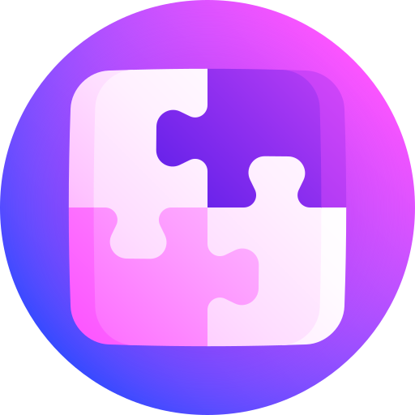&nbsp;&nbsp;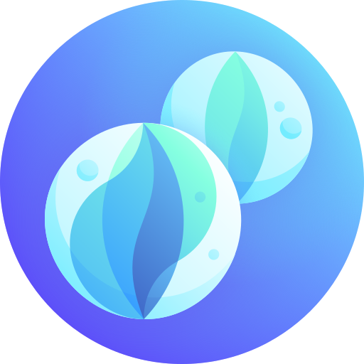&nbsp;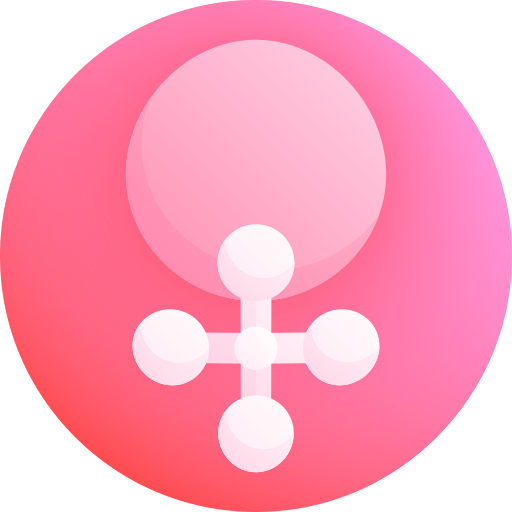 <a href="images/iCons/Gaming/README.md">(+46)</a> | `50 Items` |
| [　　┗ `Geo Glyphs`](images/iCons/Geo%20Glyphs/README.md) | 📁 (導覽層) | - |
| [　　┗ `Geo Glyphssss`](images/iCons/Geo%20Glyphssss/README.md) | &nbsp;&nbsp;&nbsp; <a href="images/iCons/Geo%20Glyphssss/README.md">(+25)</a> | `29 Items` |
| [　　┗ `Glassmorphism`](images/iCons/Glassmorphism/README.md) | &nbsp;&nbsp;&nbsp; <a href="images/iCons/Glassmorphism/README.md">(+29)</a> | `33 Items` |
| [　　　┗ `Glass `](images/iCons/Glassmorphism/Glass%20/README.md) | &nbsp;&nbsp;&nbsp; <a href="images/iCons/Glassmorphism/Glass%20/README.md">(+94)</a> | `98 Items` |
| [　　　　┗ `Hicon (Free icon pack) - Glass Icons`](images/iCons/Glassmorphism/Glass%20/Hicon%20%28Free%20icon%20pack%29%20-%20Glass%20Icons/README.md) | 📁 (導覽層) | - |
| [　　　　　┗ `Bold`](images/iCons/Glassmorphism/Glass%20/Hicon%20%28Free%20icon%20pack%29%20-%20Glass%20Icons/Bold/README.md) | &nbsp;&nbsp;&nbsp;  | `4 Items` |
| [　　　　　┗ `Glass`](images/iCons/Glassmorphism/Glass%20/Hicon%20%28Free%20icon%20pack%29%20-%20Glass%20Icons/Glass/README.md) | &nbsp;&nbsp;&nbsp; <a href="images/iCons/Glassmorphism/Glass%20/Hicon%20%28Free%20icon%20pack%29%20-%20Glass%20Icons/Glass/README.md">(+13)</a> | `17 Items` |
| [　　┗ `GoogleCloud`](images/iCons/GoogleCloud/README.md) | &nbsp;&nbsp;&nbsp; <a href="images/iCons/GoogleCloud/README.md">(+212)</a> | `216 Items` |
| [　　┗ `Grid iCons`](images/iCons/Grid%20iCons/README.md) | &nbsp;&nbsp;&nbsp; <a href="images/iCons/Grid%20iCons/README.md">(+197)</a> | `201 Items` |
| [　　┗ `Hand iCons Collection`](images/iCons/Hand%20iCons%20Collection/README.md) | &nbsp;&nbsp;&nbsp; <a href="images/iCons/Hand%20iCons%20Collection/README.md">(+332)</a> | `336 Items` |
| [　　┗ `Helium Dashed iCons`](images/iCons/Helium%20Dashed%20iCons/README.md) | &nbsp;&nbsp;&nbsp; <a href="images/iCons/Helium%20Dashed%20iCons/README.md">(+67)</a> | `71 Items` |
| [　　┗ `Hicon`](images/iCons/Hicon/README.md) | 📁 (導覽層) | - |
| [　　　┗ `Bold`](images/iCons/Hicon/Bold/README.md) | &nbsp;&nbsp;&nbsp; <a href="images/iCons/Hicon/Bold/README.md">(+403)</a> | `407 Items` |
| [　　　┗ `Linear`](images/iCons/Hicon/Linear/README.md) | &nbsp;&nbsp;&nbsp; <a href="images/iCons/Hicon/Linear/README.md">(+452)</a> | `456 Items` |
| [　　　┗ `Outline`](images/iCons/Hicon/Outline/README.md) | &nbsp;&nbsp;&nbsp; <a href="images/iCons/Hicon/Outline/README.md">(+441)</a> | `445 Items` |
| [　　┗ `Interface Vector`](images/iCons/Interface%20Vector/README.md) | 📁 (導覽層) | - |
| [　　　┗ `Plump`](images/iCons/Interface%20Vector/Plump/README.md) | &nbsp;&nbsp;&nbsp; <a href="images/iCons/Interface%20Vector/Plump/README.md">(+217)</a> | `221 Items` |
| [　　┗ `Isometric 3D Interface iCons`](images/iCons/Isometric%203D%20Interface%20iCons/README.md) | &nbsp;&nbsp;&nbsp; <a href="images/iCons/Isometric%203D%20Interface%20iCons/README.md">(+46)</a> | `50 Items` |
| [　　┗ `Krita Sharp Interface iCons`](images/iCons/Krita%20Sharp%20Interface%20iCons/README.md) | &nbsp;&nbsp;&nbsp; <a href="images/iCons/Krita%20Sharp%20Interface%20iCons/README.md">(+187)</a> | `191 Items` |
| [　　┗ `KritaiCon`](images/iCons/KritaiCon/README.md) | &nbsp;&nbsp;&nbsp; <a href="images/iCons/KritaiCon/README.md">(+279)</a> | `283 Items` |
| [　　┗ `Lawn iCons`](images/iCons/Lawn%20iCons/README.md) | &nbsp;&nbsp;&nbsp; <a href="images/iCons/Lawn%20iCons/README.md">(+8536)</a> | `8540 Items` |
| [　　┗ `Learns`](images/iCons/Learns/README.md) | &nbsp;&nbsp;&nbsp; <a href="images/iCons/Learns/README.md">(+46)</a> | `50 Items` |
| [　　┗ `Mac iCns`](images/iCons/Mac%20iCns/README.md) | 📁 (導覽層) | - |
| [　　┗ `Macos Big Sur`](images/iCons/Macos%20Big%20Sur/README.md) | &nbsp;&nbsp;&nbsp; <a href="images/iCons/Macos%20Big%20Sur/README.md">(+66)</a> | `70 Items` |
| [　　┗ `Majest iCons`](images/iCons/Majest%20iCons/README.md) | 📁 (導覽層) | - |
| [　　　┗ `Duotone`](images/iCons/Majest%20iCons/Duotone/README.md) | &nbsp;&nbsp;&nbsp; <a href="images/iCons/Majest%20iCons/Duotone/README.md">(+630)</a> | `634 Items` |
| [　　　┗ `Line`](images/iCons/Majest%20iCons/Line/README.md) | &nbsp;&nbsp;&nbsp; <a href="images/iCons/Majest%20iCons/Line/README.md">(+653)</a> | `657 Items` |
| [　　　┗ `Solid`](images/iCons/Majest%20iCons/Solid/README.md) | &nbsp;&nbsp;&nbsp; <a href="images/iCons/Majest%20iCons/Solid/README.md">(+653)</a> | `657 Items` |
| [　　┗ `Medical iCons`](images/iCons/Medical%20iCons/README.md) | &nbsp;&nbsp;&nbsp; <a href="images/iCons/Medical%20iCons/README.md">(+140)</a> | `144 Items` |
| [　　┗ `Memoji Full`](images/iCons/Memoji%20Full/README.md) | &nbsp;&nbsp;&nbsp; <a href="images/iCons/Memoji%20Full/README.md">(+1647)</a> | `1651 Items` |
| [　　┗ `Mingcute iCon`](images/iCons/Mingcute%20iCon/README.md) | 📁 (導覽層) | - |
| [　　　┗ `arrow`](images/iCons/Mingcute%20iCon/arrow/README.md) | &nbsp;&nbsp;&nbsp; <a href="images/iCons/Mingcute%20iCon/arrow/README.md">(+36)</a> | `40 Items` |
| [　　　┗ `building`](images/iCons/Mingcute%20iCon/building/README.md) | &nbsp;&nbsp;&nbsp; <a href="images/iCons/Mingcute%20iCon/building/README.md">(+52)</a> | `56 Items` |
| [　　　┗ `business`](images/iCons/Mingcute%20iCon/business/README.md) | &nbsp;&nbsp;&nbsp; <a href="images/iCons/Mingcute%20iCon/business/README.md">(+108)</a> | `112 Items` |
| [　　　┗ `contact`](images/iCons/Mingcute%20iCon/contact/README.md) | &nbsp;&nbsp;&nbsp; <a href="images/iCons/Mingcute%20iCon/contact/README.md">(+36)</a> | `40 Items` |
| [　　　┗ `design`](images/iCons/Mingcute%20iCon/design/README.md) | &nbsp;&nbsp;&nbsp; <a href="images/iCons/Mingcute%20iCon/design/README.md">(+60)</a> | `64 Items` |
| [　　　┗ `device`](images/iCons/Mingcute%20iCon/device/README.md) | &nbsp;&nbsp;&nbsp; <a href="images/iCons/Mingcute%20iCon/device/README.md">(+94)</a> | `98 Items` |
| [　　　┗ `editor`](images/iCons/Mingcute%20iCon/editor/README.md) | &nbsp;&nbsp;&nbsp; <a href="images/iCons/Mingcute%20iCon/editor/README.md">(+94)</a> | `98 Items` |
| [　　　┗ `education`](images/iCons/Mingcute%20iCon/education/README.md) | &nbsp;&nbsp;&nbsp; <a href="images/iCons/Mingcute%20iCon/education/README.md">(+30)</a> | `34 Items` |
| [　　　┗ `file`](images/iCons/Mingcute%20iCon/file/README.md) | &nbsp;&nbsp;&nbsp; <a href="images/iCons/Mingcute%20iCon/file/README.md">(+86)</a> | `90 Items` |
| [　　　┗ `food`](images/iCons/Mingcute%20iCon/food/README.md) | &nbsp;&nbsp;&nbsp; <a href="images/iCons/Mingcute%20iCon/food/README.md">(+16)</a> | `20 Items` |
| [　　　┗ `logo`](images/iCons/Mingcute%20iCon/logo/README.md) | &nbsp;&nbsp;&nbsp; <a href="images/iCons/Mingcute%20iCon/logo/README.md">(+56)</a> | `60 Items` |
| [　　　┗ `map`](images/iCons/Mingcute%20iCon/map/README.md) | &nbsp;&nbsp;&nbsp; <a href="images/iCons/Mingcute%20iCon/map/README.md">(+40)</a> | `44 Items` |
| [　　　┗ `media`](images/iCons/Mingcute%20iCon/media/README.md) | &nbsp;&nbsp;&nbsp; <a href="images/iCons/Mingcute%20iCon/media/README.md">(+80)</a> | `84 Items` |
| [　　　┗ `part`](images/iCons/Mingcute%20iCon/part/README.md) | &nbsp;&nbsp;&nbsp; <a href="images/iCons/Mingcute%20iCon/part/README.md">(+16)</a> | `20 Items` |
| [　　　┗ `shape`](images/iCons/Mingcute%20iCon/shape/README.md) | &nbsp;&nbsp;&nbsp; <a href="images/iCons/Mingcute%20iCon/shape/README.md">(+16)</a> | `20 Items` |
| [　　　┗ `system`](images/iCons/Mingcute%20iCon/system/README.md) | &nbsp;&nbsp;&nbsp; <a href="images/iCons/Mingcute%20iCon/system/README.md">(+112)</a> | `116 Items` |
| [　　　┗ `transport`](images/iCons/Mingcute%20iCon/transport/README.md) | &nbsp;&nbsp;&nbsp; <a href="images/iCons/Mingcute%20iCon/transport/README.md">(+42)</a> | `46 Items` |
| [　　　┗ `user`](images/iCons/Mingcute%20iCon/user/README.md) | &nbsp;&nbsp;&nbsp; <a href="images/iCons/Mingcute%20iCon/user/README.md">(+24)</a> | `28 Items` |
| [　　　┗ `weather`](images/iCons/Mingcute%20iCon/weather/README.md) | &nbsp;&nbsp;&nbsp; <a href="images/iCons/Mingcute%20iCon/weather/README.md">(+32)</a> | `36 Items` |
| [　　┗ `Monstars`](images/iCons/Monstars/README.md) | &nbsp;&nbsp;&nbsp; <a href="images/iCons/Monstars/README.md">(+24)</a> | `28 Items` |
| [　　┗ `Neuicons Oval iCons`](images/iCons/Neuicons%20Oval%20iCons/README.md) | 📁 (導覽層) | - |
| [　　　┗ `Line`](images/iCons/Neuicons%20Oval%20iCons/Line/README.md) | &nbsp;&nbsp;&nbsp; <a href="images/iCons/Neuicons%20Oval%20iCons/Line/README.md">(+1054)</a> | `1058 Items` |
| [　　　┗ `Solid`](images/iCons/Neuicons%20Oval%20iCons/Solid/README.md) | &nbsp;&nbsp;&nbsp; <a href="images/iCons/Neuicons%20Oval%20iCons/Solid/README.md">(+444)</a> | `448 Items` |
| [　　┗ `Palse Illustrations`](images/iCons/Palse%20Illustrations/README.md) | 📁 (導覽層) | - |
| [　　　┗ `Pulse Illustration Kit`](images/iCons/Palse%20Illustrations/Pulse%20Illustration%20Kit/README.md) | 📁 (導覽層) | - |
| [　　　　┗ `Background`](images/iCons/Palse%20Illustrations/Pulse%20Illustration%20Kit/Background/README.md) | &nbsp;&nbsp;&nbsp; <a href="images/iCons/Palse%20Illustrations/Pulse%20Illustration%20Kit/Background/README.md">(+3)</a> | `7 Items` |
| [　　　　┗ `Characters`](images/iCons/Palse%20Illustrations/Pulse%20Illustration%20Kit/Characters/README.md) | &nbsp;&nbsp;&nbsp; <a href="images/iCons/Palse%20Illustrations/Pulse%20Illustration%20Kit/Characters/README.md">(+12)</a> | `16 Items` |
| [　　　　┗ `Nature`](images/iCons/Palse%20Illustrations/Pulse%20Illustration%20Kit/Nature/README.md) | &nbsp;&nbsp;&nbsp; <a href="images/iCons/Palse%20Illustrations/Pulse%20Illustration%20Kit/Nature/README.md">(+33)</a> | `37 Items` |
| [　　　　┗ `UI`](images/iCons/Palse%20Illustrations/Pulse%20Illustration%20Kit/UI/README.md) | &nbsp;&nbsp;&nbsp; <a href="images/iCons/Palse%20Illustrations/Pulse%20Illustration%20Kit/UI/README.md">(+39)</a> | `43 Items` |
| [　　　┗ `Pulse Illustration Scenes`](images/iCons/Palse%20Illustrations/Pulse%20Illustration%20Scenes/README.md) | &nbsp;&nbsp;&nbsp; <a href="images/iCons/Palse%20Illustrations/Pulse%20Illustration%20Scenes/README.md">(+16)</a> | `20 Items` |
| [　　　┗ `Pulse Illustration Scenes Outline Style`](images/iCons/Palse%20Illustrations/Pulse%20Illustration%20Scenes%20Outline%20Style/README.md) | &nbsp;&nbsp;&nbsp; <a href="images/iCons/Palse%20Illustrations/Pulse%20Illustration%20Scenes%20Outline%20Style/README.md">(+16)</a> | `20 Items` |
| [　　┗ `Payment And Credit Card`](images/iCons/Payment%20And%20Credit%20Card/README.md) | &nbsp;&nbsp;&nbsp; <a href="images/iCons/Payment%20And%20Credit%20Card/README.md">(+103)</a> | `107 Items` |
| [　　┗ `Pixel`](images/iCons/Pixel/README.md) | 📁 (導覽層) | - |
| [　　　┗ `16Pxls Tiny Sharp iCons`](images/iCons/Pixel/16Pxls%20Tiny%20Sharp%20iCons/README.md) | &nbsp;&nbsp;&nbsp; <a href="images/iCons/Pixel/16Pxls%20Tiny%20Sharp%20iCons/README.md">(+122)</a> | `126 Items` |
| [　　　　┗ `16px`](images/iCons/Pixel/16Pxls%20Tiny%20Sharp%20iCons/16px/README.md) | 📁 (導覽層) | - |
| [　　　　　┗ `fonts`](images/iCons/Pixel/16Pxls%20Tiny%20Sharp%20iCons/16px/fonts/README.md) |   | `1 Items` |
| [　　　┗ `Action`](images/iCons/Pixel/Action/README.md) | 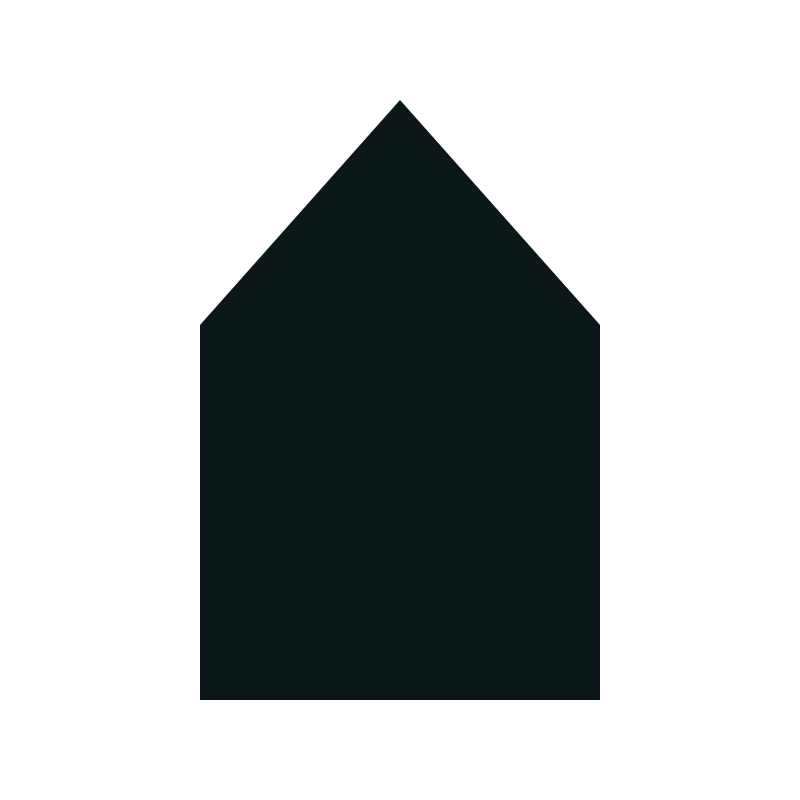&nbsp;&nbsp;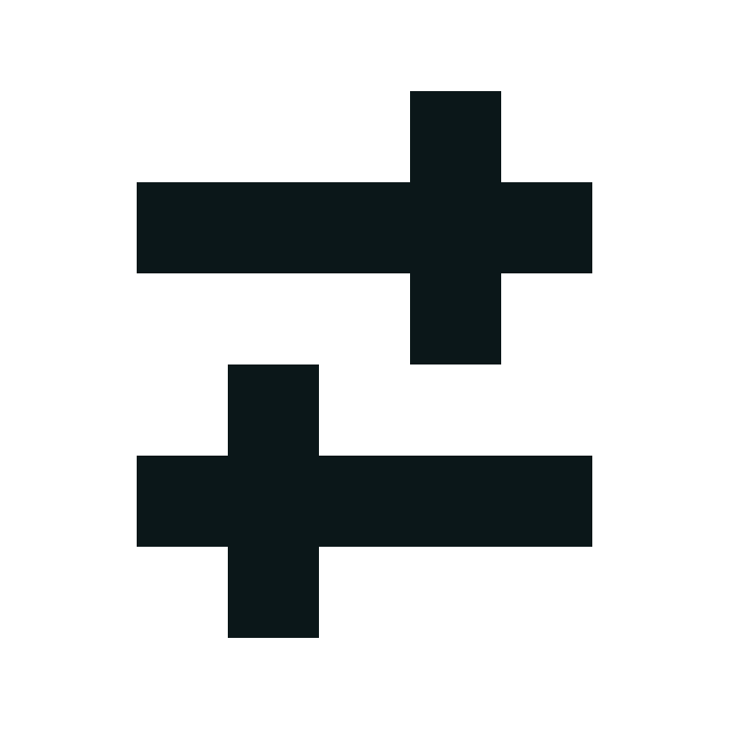&nbsp; <a href="images/iCons/Pixel/Action/README.md">(+158)</a> | `162 Items` |
| [　　　┗ `Afiado Sharp Pixel iCons`](images/iCons/Pixel/Afiado%20Sharp%20Pixel%20iCons/README.md) | &nbsp;&nbsp;&nbsp; <a href="images/iCons/Pixel/Afiado%20Sharp%20Pixel%20iCons/README.md">(+162)</a> | `166 Items` |
| [　　　┗ `Animal Pixel Art Vectors`](images/iCons/Pixel/Animal%20Pixel%20Art%20Vectors/README.md) | 📁 (導覽層) | - |
| [　　　┗ `Base`](images/iCons/Pixel/Base/README.md) | &nbsp;&nbsp;&nbsp; <a href="images/iCons/Pixel/Base/README.md">(+185)</a> | `189 Items` |
| [　　　　┗ `baseicons`](images/iCons/Pixel/Base/baseicons/README.md) | 📁 (導覽層) | - |
| [　　　　　┗ `fonts`](images/iCons/Pixel/Base/baseicons/fonts/README.md) |   | `1 Items` |
| [　　　┗ `Breeze`](images/iCons/Pixel/Breeze/README.md) | 📁 (導覽層) | - |
| [　　　　┗ `Actions `](images/iCons/Pixel/Breeze/Actions%20/README.md) | 📁 (導覽層) | - |
| [　　　　　┗ `12`](images/iCons/Pixel/Breeze/Actions%20/12/README.md) |   | `1 Items` |
| [　　　　　┗ `16`](images/iCons/Pixel/Breeze/Actions%20/16/README.md) | &nbsp;&nbsp;&nbsp; <a href="images/iCons/Pixel/Breeze/Actions%20/16/README.md">(+794)</a> | `798 Items` |
| [　　　　　┗ `22`](images/iCons/Pixel/Breeze/Actions%20/22/README.md) | &nbsp;&nbsp;&nbsp; <a href="images/iCons/Pixel/Breeze/Actions%20/22/README.md">(+1204)</a> | `1208 Items` |
| [　　　　　┗ `32`](images/iCons/Pixel/Breeze/Actions%20/32/README.md) | &nbsp;&nbsp;&nbsp; <a href="images/iCons/Pixel/Breeze/Actions%20/32/README.md">(+217)</a> | `221 Items` |
| [　　　　　┗ `48`](images/iCons/Pixel/Breeze/Actions%20/48/README.md) | &nbsp;&nbsp;&nbsp;  | `4 Items` |
| [　　　　　┗ `64`](images/iCons/Pixel/Breeze/Actions%20/64/README.md) | &nbsp;&nbsp;&nbsp;  | `4 Items` |
| [　　　　┗ `Animations `](images/iCons/Pixel/Breeze/Animations%20/README.md) | 📁 (導覽層) | - |
| [　　　　　┗ `16`](images/iCons/Pixel/Breeze/Animations%20/16/README.md) |   | `1 Items` |
| [　　　　　┗ `22`](images/iCons/Pixel/Breeze/Animations%20/22/README.md) |   | `1 Items` |
| [　　　　┗ `Applets `](images/iCons/Pixel/Breeze/Applets%20/README.md) | 📁 (導覽層) | - |
| [　　　　　┗ `128`](images/iCons/Pixel/Breeze/Applets%20/128/README.md) | &nbsp;&nbsp;&nbsp; <a href="images/iCons/Pixel/Breeze/Applets%20/128/README.md">(+13)</a> | `17 Items` |
| [　　　　　┗ `16`](images/iCons/Pixel/Breeze/Applets%20/16/README.md) |   | `1 Items` |
| [　　　　　┗ `22`](images/iCons/Pixel/Breeze/Applets%20/22/README.md) | &nbsp;&nbsp;&nbsp;  | `4 Items` |
| [　　　　　┗ `256`](images/iCons/Pixel/Breeze/Applets%20/256/README.md) | &nbsp;&nbsp;&nbsp; <a href="images/iCons/Pixel/Breeze/Applets%20/256/README.md">(+40)</a> | `44 Items` |
| [　　　　　┗ `32`](images/iCons/Pixel/Breeze/Applets%20/32/README.md) | &nbsp;&nbsp;&nbsp; <a href="images/iCons/Pixel/Breeze/Applets%20/32/README.md">(+5)</a> | `9 Items` |
| [　　　　　┗ `48`](images/iCons/Pixel/Breeze/Applets%20/48/README.md) | &nbsp;&nbsp;&nbsp; <a href="images/iCons/Pixel/Breeze/Applets%20/48/README.md">(+113)</a> | `117 Items` |
| [　　　　　┗ `64`](images/iCons/Pixel/Breeze/Applets%20/64/README.md) | &nbsp;&nbsp;&nbsp; <a href="images/iCons/Pixel/Breeze/Applets%20/64/README.md">(+46)</a> | `50 Items` |
| [　　　　┗ `Apps `](images/iCons/Pixel/Breeze/Apps%20/README.md) | 📁 (導覽層) | - |
| [　　　　　┗ `16`](images/iCons/Pixel/Breeze/Apps%20/16/README.md) | &nbsp;&nbsp;&nbsp; <a href="images/iCons/Pixel/Breeze/Apps%20/16/README.md">(+19)</a> | `23 Items` |
| [　　　　　┗ `22`](images/iCons/Pixel/Breeze/Apps%20/22/README.md) | &nbsp;&nbsp;&nbsp; <a href="images/iCons/Pixel/Breeze/Apps%20/22/README.md">(+33)</a> | `37 Items` |
| [　　　　　┗ `32`](images/iCons/Pixel/Breeze/Apps%20/32/README.md) | &nbsp;&nbsp;&nbsp; <a href="images/iCons/Pixel/Breeze/Apps%20/32/README.md">(+22)</a> | `26 Items` |
| [　　　　　┗ `48`](images/iCons/Pixel/Breeze/Apps%20/48/README.md) | &nbsp;&nbsp;&nbsp; <a href="images/iCons/Pixel/Breeze/Apps%20/48/README.md">(+331)</a> | `335 Items` |
| [　　　　　┗ `64`](images/iCons/Pixel/Breeze/Apps%20/64/README.md) | &nbsp;&nbsp;&nbsp; <a href="images/iCons/Pixel/Breeze/Apps%20/64/README.md">(+4)</a> | `8 Items` |
| [　　　　┗ `Categories `](images/iCons/Pixel/Breeze/Categories%20/README.md) | 📁 (導覽層) | - |
| [　　　　　┗ `22`](images/iCons/Pixel/Breeze/Categories%20/22/README.md) |   | `1 Items` |
| [　　　　　┗ `32`](images/iCons/Pixel/Breeze/Categories%20/32/README.md) | &nbsp;&nbsp;&nbsp; <a href="images/iCons/Pixel/Breeze/Categories%20/32/README.md">(+11)</a> | `15 Items` |
| [　　　　┗ `Devices `](images/iCons/Pixel/Breeze/Devices%20/README.md) | 📁 (導覽層) | - |
| [　　　　　┗ `16`](images/iCons/Pixel/Breeze/Devices%20/16/README.md) | &nbsp;&nbsp;&nbsp; <a href="images/iCons/Pixel/Breeze/Devices%20/16/README.md">(+53)</a> | `57 Items` |
| [　　　　　┗ `22`](images/iCons/Pixel/Breeze/Devices%20/22/README.md) | &nbsp;&nbsp;&nbsp; <a href="images/iCons/Pixel/Breeze/Devices%20/22/README.md">(+45)</a> | `49 Items` |
| [　　　　　┗ `32`](images/iCons/Pixel/Breeze/Devices%20/32/README.md) | &nbsp;&nbsp;&nbsp; <a href="images/iCons/Pixel/Breeze/Devices%20/32/README.md">(+3)</a> | `7 Items` |
| [　　　　　┗ `64`](images/iCons/Pixel/Breeze/Devices%20/64/README.md) | &nbsp;&nbsp;&nbsp; <a href="images/iCons/Pixel/Breeze/Devices%20/64/README.md">(+43)</a> | `47 Items` |
| [　　　　┗ `Emblems `](images/iCons/Pixel/Breeze/Emblems%20/README.md) | 📁 (導覽層) | - |
| [　　　　　┗ `16`](images/iCons/Pixel/Breeze/Emblems%20/16/README.md) | &nbsp;&nbsp;&nbsp; <a href="images/iCons/Pixel/Breeze/Emblems%20/16/README.md">(+36)</a> | `40 Items` |
| [　　　　　┗ `22`](images/iCons/Pixel/Breeze/Emblems%20/22/README.md) | &nbsp;&nbsp;&nbsp; <a href="images/iCons/Pixel/Breeze/Emblems%20/22/README.md">(+25)</a> | `29 Items` |
| [　　　　　┗ `8`](images/iCons/Pixel/Breeze/Emblems%20/8/README.md) | &nbsp;&nbsp;&nbsp; <a href="images/iCons/Pixel/Breeze/Emblems%20/8/README.md">(+23)</a> | `27 Items` |
| [　　　　┗ `Emotes `](images/iCons/Pixel/Breeze/Emotes%20/README.md) | 📁 (導覽層) | - |
| [　　　　　┗ `22`](images/iCons/Pixel/Breeze/Emotes%20/22/README.md) | &nbsp;&nbsp;&nbsp; <a href="images/iCons/Pixel/Breeze/Emotes%20/22/README.md">(+30)</a> | `34 Items` |
| [　　　　┗ `Mimetypes `](images/iCons/Pixel/Breeze/Mimetypes%20/README.md) | 📁 (導覽層) | - |
| [　　　　　┗ `16`](images/iCons/Pixel/Breeze/Mimetypes%20/16/README.md) | &nbsp;&nbsp;&nbsp; <a href="images/iCons/Pixel/Breeze/Mimetypes%20/16/README.md">(+200)</a> | `204 Items` |
| [　　　　　┗ `22`](images/iCons/Pixel/Breeze/Mimetypes%20/22/README.md) | &nbsp;&nbsp;&nbsp; <a href="images/iCons/Pixel/Breeze/Mimetypes%20/22/README.md">(+200)</a> | `204 Items` |
| [　　　　　┗ `32`](images/iCons/Pixel/Breeze/Mimetypes%20/32/README.md) | &nbsp;&nbsp;&nbsp; <a href="images/iCons/Pixel/Breeze/Mimetypes%20/32/README.md">(+202)</a> | `206 Items` |
| [　　　　　┗ `64`](images/iCons/Pixel/Breeze/Mimetypes%20/64/README.md) | &nbsp;&nbsp;&nbsp; <a href="images/iCons/Pixel/Breeze/Mimetypes%20/64/README.md">(+202)</a> | `206 Items` |
| [　　　　┗ `Places `](images/iCons/Pixel/Breeze/Places%20/README.md) | 📁 (導覽層) | - |
| [　　　　　┗ `16`](images/iCons/Pixel/Breeze/Places%20/16/README.md) | &nbsp;&nbsp;&nbsp; <a href="images/iCons/Pixel/Breeze/Places%20/16/README.md">(+71)</a> | `75 Items` |
| [　　　　　┗ `22`](images/iCons/Pixel/Breeze/Places%20/22/README.md) | &nbsp;&nbsp;&nbsp; <a href="images/iCons/Pixel/Breeze/Places%20/22/README.md">(+68)</a> | `72 Items` |
| [　　　　　┗ `32`](images/iCons/Pixel/Breeze/Places%20/32/README.md) | &nbsp;&nbsp;&nbsp; <a href="images/iCons/Pixel/Breeze/Places%20/32/README.md">(+79)</a> | `83 Items` |
| [　　　　　┗ `48`](images/iCons/Pixel/Breeze/Places%20/48/README.md) | &nbsp;&nbsp;&nbsp; <a href="images/iCons/Pixel/Breeze/Places%20/48/README.md">(+47)</a> | `51 Items` |
| [　　　　　┗ `64`](images/iCons/Pixel/Breeze/Places%20/64/README.md) | &nbsp;&nbsp;&nbsp; <a href="images/iCons/Pixel/Breeze/Places%20/64/README.md">(+78)</a> | `82 Items` |
| [　　　　　┗ `96`](images/iCons/Pixel/Breeze/Places%20/96/README.md) | &nbsp;&nbsp;&nbsp; <a href="images/iCons/Pixel/Breeze/Places%20/96/README.md">(+78)</a> | `82 Items` |
| [　　　　┗ `Preferences `](images/iCons/Pixel/Breeze/Preferences%20/README.md) | 📁 (導覽層) | - |
| [　　　　　┗ `22`](images/iCons/Pixel/Breeze/Preferences%20/22/README.md) | &nbsp;&nbsp;&nbsp; <a href="images/iCons/Pixel/Breeze/Preferences%20/22/README.md">(+91)</a> | `95 Items` |
| [　　　　　┗ `32`](images/iCons/Pixel/Breeze/Preferences%20/32/README.md) | &nbsp;&nbsp;&nbsp; <a href="images/iCons/Pixel/Breeze/Preferences%20/32/README.md">(+130)</a> | `134 Items` |
| [　　　　┗ `Status `](images/iCons/Pixel/Breeze/Status%20/README.md) | 📁 (導覽層) | - |
| [　　　　　┗ `16`](images/iCons/Pixel/Breeze/Status%20/16/README.md) | &nbsp;&nbsp;&nbsp; <a href="images/iCons/Pixel/Breeze/Status%20/16/README.md">(+98)</a> | `102 Items` |
| [　　　　　┗ `22`](images/iCons/Pixel/Breeze/Status%20/22/README.md) | &nbsp;&nbsp;&nbsp; <a href="images/iCons/Pixel/Breeze/Status%20/22/README.md">(+378)</a> | `382 Items` |
| [　　　　　┗ `32`](images/iCons/Pixel/Breeze/Status%20/32/README.md) | &nbsp;&nbsp;&nbsp; <a href="images/iCons/Pixel/Breeze/Status%20/32/README.md">(+50)</a> | `54 Items` |
| [　　　　　┗ `48`](images/iCons/Pixel/Breeze/Status%20/48/README.md) |   | `1 Items` |
| [　　　　　┗ `64`](images/iCons/Pixel/Breeze/Status%20/64/README.md) | &nbsp;&nbsp;&nbsp; <a href="images/iCons/Pixel/Breeze/Status%20/64/README.md">(+9)</a> | `13 Items` |
| [　　　┗ `Business`](images/iCons/Pixel/Business/README.md) | &nbsp;&nbsp;&nbsp; <a href="images/iCons/Pixel/Business/README.md">(+46)</a> | `50 Items` |
| [　　　┗ `Commerceand Shopping`](images/iCons/Pixel/Commerceand%20Shopping/README.md) | &nbsp;&nbsp;&nbsp; <a href="images/iCons/Pixel/Commerceand%20Shopping/README.md">(+96)</a> | `100 Items` |
| [　　　┗ `Cursor`](images/iCons/Pixel/Cursor/README.md) | &nbsp;&nbsp;&nbsp; <a href="images/iCons/Pixel/Cursor/README.md">(+36)</a> | `40 Items` |
| [　　　┗ `Emoji 1997`](images/iCons/Pixel/Emoji%201997/README.md) | &nbsp;&nbsp;&nbsp; <a href="images/iCons/Pixel/Emoji%201997/README.md">(+176)</a> | `180 Items` |
| [　　　┗ `Emojis`](images/iCons/Pixel/Emojis/README.md) | &nbsp;&nbsp;&nbsp; <a href="images/iCons/Pixel/Emojis/README.md">(+33)</a> | `37 Items` |
| [　　　┗ `File`](images/iCons/Pixel/File/README.md) | &nbsp;&nbsp;&nbsp; <a href="images/iCons/Pixel/File/README.md">(+27)</a> | `31 Items` |
| [　　　┗ `Fontaudi`](images/iCons/Pixel/Fontaudi/README.md) | &nbsp;&nbsp;&nbsp; <a href="images/iCons/Pixel/Fontaudi/README.md">(+48)</a> | `52 Items` |
| [　　　┗ `Fruit`](images/iCons/Pixel/Fruit/README.md) | &nbsp;&nbsp;&nbsp; <a href="images/iCons/Pixel/Fruit/README.md">(+16)</a> | `20 Items` |
| [　　　┗ `Games`](images/iCons/Pixel/Games/README.md) | &nbsp;&nbsp;&nbsp; <a href="images/iCons/Pixel/Games/README.md">(+8)</a> | `12 Items` |
| [　　　┗ `Handgesture`](images/iCons/Pixel/Handgesture/README.md) | &nbsp;&nbsp;&nbsp; <a href="images/iCons/Pixel/Handgesture/README.md">(+16)</a> | `20 Items` |
| [　　　┗ `Highquality`](images/iCons/Pixel/Highquality/README.md) | &nbsp;&nbsp;&nbsp; <a href="images/iCons/Pixel/Highquality/README.md">(+346)</a> | `350 Items` |
| [　　　┗ `Industrial Sharp`](images/iCons/Pixel/Industrial%20Sharp/README.md) | &nbsp;&nbsp;&nbsp; <a href="images/iCons/Pixel/Industrial%20Sharp/README.md">(+148)</a> | `152 Items` |
| [　　　　┗ `industrialsharp`](images/iCons/Pixel/Industrial%20Sharp/industrialsharp/README.md) | 📁 (導覽層) | - |
| [　　　　　┗ `fonts`](images/iCons/Pixel/Industrial%20Sharp/industrialsharp/fonts/README.md) |   | `1 Items` |
| [　　　┗ `Interface`](images/iCons/Pixel/Interface/README.md) | &nbsp;&nbsp;&nbsp; <a href="images/iCons/Pixel/Interface/README.md">(+17)</a> | `21 Items` |
| [　　　　┗ `oupput`](images/iCons/Pixel/Interface/oupput/README.md) | &nbsp;&nbsp;&nbsp; <a href="images/iCons/Pixel/Interface/oupput/README.md">(+17)</a> | `21 Items` |
| [　　　┗ `Library`](images/iCons/Pixel/Library/README.md) | 📁 (導覽層) | - |
| [　　　　┗ `brands`](images/iCons/Pixel/Library/brands/README.md) | &nbsp;&nbsp;&nbsp; <a href="images/iCons/Pixel/Library/brands/README.md">(+34)</a> | `38 Items` |
| [　　　　┗ `regular`](images/iCons/Pixel/Library/regular/README.md) | &nbsp;&nbsp;&nbsp; <a href="images/iCons/Pixel/Library/regular/README.md">(+176)</a> | `180 Items` |
| [　　　　┗ `solid`](images/iCons/Pixel/Library/solid/README.md) | &nbsp;&nbsp;&nbsp; <a href="images/iCons/Pixel/Library/solid/README.md">(+176)</a> | `180 Items` |
| [　　　┗ `Line`](images/iCons/Pixel/Line/README.md) | &nbsp;&nbsp;&nbsp; <a href="images/iCons/Pixel/Line/README.md">(+71)</a> | `75 Items` |
| [　　　　┗ `pixel-line`](images/iCons/Pixel/Line/pixel-line/README.md) | 📁 (導覽層) | - |
| [　　　　　┗ `fonts`](images/iCons/Pixel/Line/pixel-line/fonts/README.md) |   | `1 Items` |
| [　　　┗ `Memory iCons`](images/iCons/Pixel/Memory%20iCons/README.md) | &nbsp;&nbsp;&nbsp; <a href="images/iCons/Pixel/Memory%20iCons/README.md">(+867)</a> | `871 Items` |
| [　　　　┗ `memorypixel`](images/iCons/Pixel/Memory%20iCons/memorypixel/README.md) | 📁 (導覽層) | - |
| [　　　　　┗ `fonts`](images/iCons/Pixel/Memory%20iCons/memorypixel/fonts/README.md) |   | `1 Items` |
| [　　　┗ `Nes`](images/iCons/Pixel/Nes/README.md) | 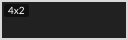&nbsp;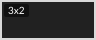&nbsp;&nbsp;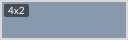 <a href="images/iCons/Pixel/Nes/README.md">(+85)</a> | `89 Items` |
| [　　　┗ `Offices`](images/iCons/Pixel/Offices/README.md) | 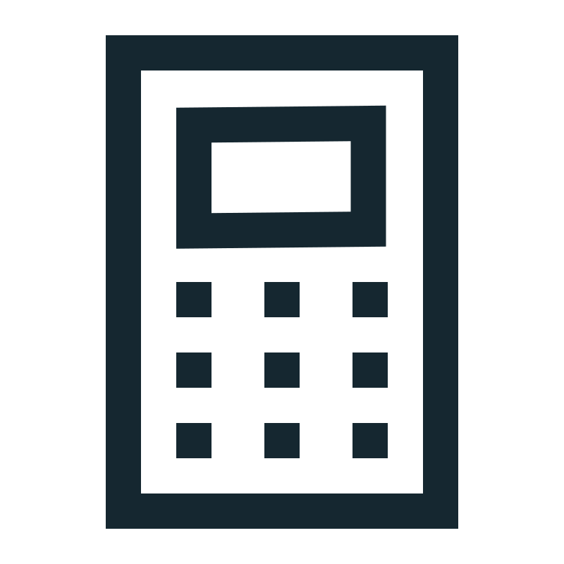&nbsp;&nbsp;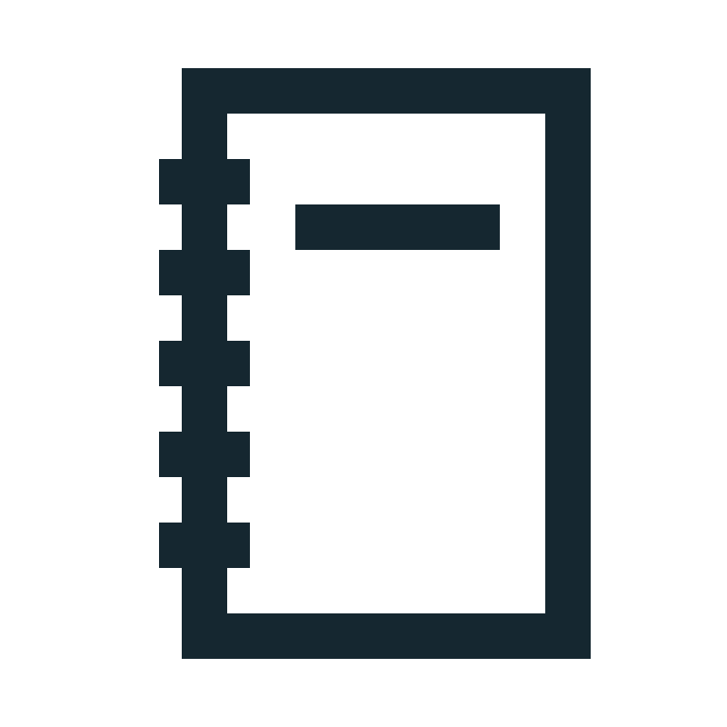&nbsp;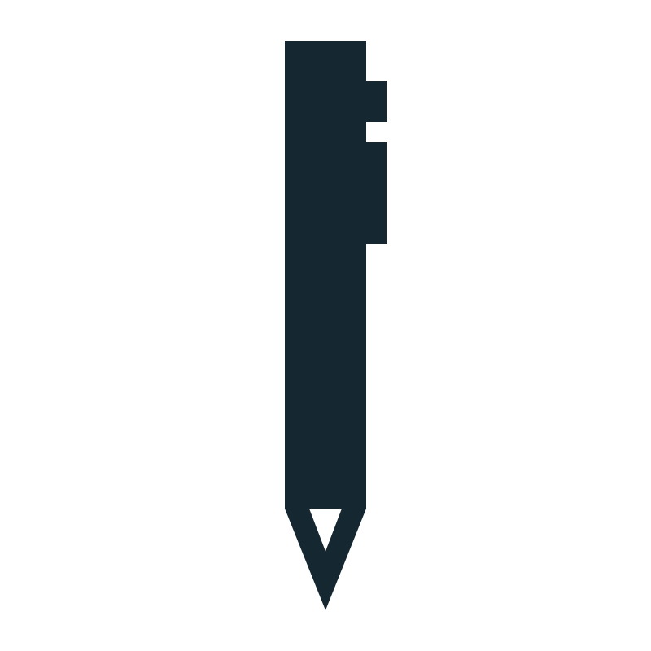 <a href="images/iCons/Pixel/Offices/README.md">(+21)</a> | `25 Items` |
| [　　　┗ `Pixel iCons Library`](images/iCons/Pixel/Pixel%20iCons%20Library/README.md) | 📁 (導覽層) | - |
| [　　　　┗ `Brand`](images/iCons/Pixel/Pixel%20iCons%20Library/Brand/README.md) | &nbsp;&nbsp;&nbsp; <a href="images/iCons/Pixel/Pixel%20iCons%20Library/Brand/README.md">(+41)</a> | `45 Items` |
| [　　　　┗ `PurrCat`](images/iCons/Pixel/Pixel%20iCons%20Library/PurrCat/README.md) | &nbsp;&nbsp;&nbsp; <a href="images/iCons/Pixel/Pixel%20iCons%20Library/PurrCat/README.md">(+20)</a> | `24 Items` |
| [　　　　┗ `Regular`](images/iCons/Pixel/Pixel%20iCons%20Library/Regular/README.md) | &nbsp;&nbsp;&nbsp; <a href="images/iCons/Pixel/Pixel%20iCons%20Library/Regular/README.md">(+186)</a> | `190 Items` |
| [　　　　┗ `Solid`](images/iCons/Pixel/Pixel%20iCons%20Library/Solid/README.md) | &nbsp;&nbsp;&nbsp; <a href="images/iCons/Pixel/Pixel%20iCons%20Library/Solid/README.md">(+186)</a> | `190 Items` |
| [　　　┗ `Pixel iCons Pixtober 2025`](images/iCons/Pixel/Pixel%20iCons%20Pixtober%202025/README.md) | &nbsp;&nbsp;&nbsp; <a href="images/iCons/Pixel/Pixel%20iCons%20Pixtober%202025/README.md">(+27)</a> | `31 Items` |
| [　　　┗ `Pixel iCons Set`](images/iCons/Pixel/Pixel%20iCons%20Set/README.md) | 📁 (導覽層) | - |
| [　　　　┗ `Commerce`](images/iCons/Pixel/Pixel%20iCons%20Set/Commerce/README.md) | 📁 (導覽層) | - |
| [　　　　　┗ `Linear`](images/iCons/Pixel/Pixel%20iCons%20Set/Commerce/Linear/README.md) | 📁 (導覽層) | - |
| [　　　　　┗ `Solid`](images/iCons/Pixel/Pixel%20iCons%20Set/Commerce/Solid/README.md) | 📁 (導覽層) | - |
| [　　　　┗ `Contacts`](images/iCons/Pixel/Pixel%20iCons%20Set/Contacts/README.md) | 📁 (導覽層) | - |
| [　　　　　┗ `Linear`](images/iCons/Pixel/Pixel%20iCons%20Set/Contacts/Linear/README.md) | 📁 (導覽層) | - |
| [　　　　　┗ `Outline`](images/iCons/Pixel/Pixel%20iCons%20Set/Contacts/Outline/README.md) | 📁 (導覽層) | - |
| [　　　　　┗ `Solid`](images/iCons/Pixel/Pixel%20iCons%20Set/Contacts/Solid/README.md) | 📁 (導覽層) | - |
| [　　　　┗ `Food`](images/iCons/Pixel/Pixel%20iCons%20Set/Food/README.md) | 📁 (導覽層) | - |
| [　　　　　┗ `Linear`](images/iCons/Pixel/Pixel%20iCons%20Set/Food/Linear/README.md) | 📁 (導覽層) | - |
| [　　　　　┗ `Outline`](images/iCons/Pixel/Pixel%20iCons%20Set/Food/Outline/README.md) | 📁 (導覽層) | - |
| [　　　　　┗ `Solid`](images/iCons/Pixel/Pixel%20iCons%20Set/Food/Solid/README.md) | 📁 (導覽層) | - |
| [　　　　┗ `Interface`](images/iCons/Pixel/Pixel%20iCons%20Set/Interface/README.md) | 📁 (導覽層) | - |
| [　　　　　┗ `Linear`](images/iCons/Pixel/Pixel%20iCons%20Set/Interface/Linear/README.md) | 📁 (導覽層) | - |
| [　　　　　┗ `Outline`](images/iCons/Pixel/Pixel%20iCons%20Set/Interface/Outline/README.md) | 📁 (導覽層) | - |
| [　　　　　┗ `Solid`](images/iCons/Pixel/Pixel%20iCons%20Set/Interface/Solid/README.md) | 📁 (導覽層) | - |
| [　　　　┗ `Text-editor`](images/iCons/Pixel/Pixel%20iCons%20Set/Text-editor/README.md) | 📁 (導覽層) | - |
| [　　　　　┗ `Linear`](images/iCons/Pixel/Pixel%20iCons%20Set/Text-editor/Linear/README.md) | &nbsp;&nbsp;&nbsp; <a href="images/iCons/Pixel/Pixel%20iCons%20Set/Text-editor/Linear/README.md">(+36)</a> | `40 Items` |
| [　　　　　┗ `Outline`](images/iCons/Pixel/Pixel%20iCons%20Set/Text-editor/Outline/README.md) | &nbsp;&nbsp;&nbsp; <a href="images/iCons/Pixel/Pixel%20iCons%20Set/Text-editor/Outline/README.md">(+30)</a> | `34 Items` |
| [　　　　　┗ `Solid`](images/iCons/Pixel/Pixel%20iCons%20Set/Text-editor/Solid/README.md) | &nbsp;&nbsp;&nbsp; <a href="images/iCons/Pixel/Pixel%20iCons%20Set/Text-editor/Solid/README.md">(+35)</a> | `39 Items` |
| [　　　　┗ `Weather`](images/iCons/Pixel/Pixel%20iCons%20Set/Weather/README.md) | 📁 (導覽層) | - |
| [　　　　　┗ `Linear`](images/iCons/Pixel/Pixel%20iCons%20Set/Weather/Linear/README.md) | &nbsp;&nbsp;&nbsp; <a href="images/iCons/Pixel/Pixel%20iCons%20Set/Weather/Linear/README.md">(+26)</a> | `30 Items` |
| [　　　　　┗ `Outline`](images/iCons/Pixel/Pixel%20iCons%20Set/Weather/Outline/README.md) | &nbsp;&nbsp;&nbsp; <a href="images/iCons/Pixel/Pixel%20iCons%20Set/Weather/Outline/README.md">(+26)</a> | `30 Items` |
| [　　　　　┗ `Solid`](images/iCons/Pixel/Pixel%20iCons%20Set/Weather/Solid/README.md) | &nbsp;&nbsp;&nbsp; <a href="images/iCons/Pixel/Pixel%20iCons%20Set/Weather/Solid/README.md">(+26)</a> | `30 Items` |
| [　　　┗ `Pixelarticons`](images/iCons/Pixel/Pixelarticons/README.md) | 📁 (導覽層) | - |
| [　　　　┗ `24px`](images/iCons/Pixel/Pixelarticons/24px/README.md) | &nbsp;&nbsp;&nbsp; <a href="images/iCons/Pixel/Pixelarticons/24px/README.md">(+147)</a> | `151 Items` |
| [　　　　┗ `48px`](images/iCons/Pixel/Pixelarticons/48px/README.md) | &nbsp;&nbsp;&nbsp; <a href="images/iCons/Pixel/Pixelarticons/48px/README.md">(+2220)</a> | `2224 Items` |
| [　　　　┗ `Cursors`](images/iCons/Pixel/Pixelarticons/Cursors/README.md) | &nbsp;&nbsp;&nbsp; <a href="images/iCons/Pixel/Pixelarticons/Cursors/README.md">(+47)</a> | `51 Items` |
| [　　　┗ `Pixelated Emoji Pack Emoji`](images/iCons/Pixel/Pixelated%20Emoji%20Pack%20Emoji/README.md) | &nbsp;&nbsp;&nbsp; <a href="images/iCons/Pixel/Pixelated%20Emoji%20Pack%20Emoji/README.md">(+19)</a> | `23 Items` |
| [　　　┗ `Pixelated Nft Vectors`](images/iCons/Pixel/Pixelated%20Nft%20Vectors/README.md) | &nbsp;&nbsp;&nbsp; <a href="images/iCons/Pixel/Pixelated%20Nft%20Vectors/README.md">(+12)</a> | `16 Items` |
| [　　　┗ `Pixicon`](images/iCons/Pixel/Pixicon/README.md) | &nbsp;&nbsp;&nbsp; <a href="images/iCons/Pixel/Pixicon/README.md">(+320)</a> | `324 Items` |
| [　　　┗ `Plump`](images/iCons/Pixel/Plump/README.md) | &nbsp;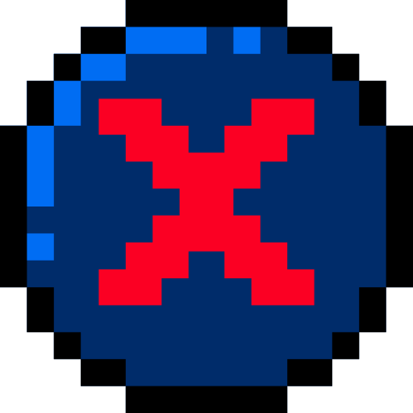&nbsp;&nbsp; <a href="images/iCons/Pixel/Plump/README.md">(+16)</a> | `20 Items` |
| [　　　　┗ `Plump`](images/iCons/Pixel/Plump/Plump/README.md) | &nbsp;&nbsp;&nbsp; <a href="images/iCons/Pixel/Plump/Plump/README.md">(+121)</a> | `125 Items` |
| [　　　┗ `Property`](images/iCons/Pixel/Property/README.md) | &nbsp;&nbsp;&nbsp; <a href="images/iCons/Pixel/Property/README.md">(+6)</a> | `10 Items` |
| [　　　┗ `Pxl`](images/iCons/Pixel/Pxl/README.md) | &nbsp;&nbsp;&nbsp; <a href="images/iCons/Pixel/Pxl/README.md">(+40)</a> | `44 Items` |
| [　　　┗ `Raster iCons`](images/iCons/Pixel/Raster%20iCons/README.md) | &nbsp;&nbsp;&nbsp; <a href="images/iCons/Pixel/Raster%20iCons/README.md">(+242)</a> | `246 Items` |
| [　　　┗ `Retro Gadget Pixel iCons`](images/iCons/Pixel/Retro%20Gadget%20Pixel%20iCons/README.md) | &nbsp;&nbsp;&nbsp; <a href="images/iCons/Pixel/Retro%20Gadget%20Pixel%20iCons/README.md">(+5)</a> | `9 Items` |
| [　　　┗ `Retro Pixel iCons`](images/iCons/Pixel/Retro%20Pixel%20iCons/README.md) | &nbsp;&nbsp;&nbsp; <a href="images/iCons/Pixel/Retro%20Pixel%20iCons/README.md">(+176)</a> | `180 Items` |
| [　　　┗ `Simple Line Action iCons`](images/iCons/Pixel/Simple%20Line%20Action%20iCons/README.md) | &nbsp;&nbsp;&nbsp; <a href="images/iCons/Pixel/Simple%20Line%20Action%20iCons/README.md">(+297)</a> | `301 Items` |
| [　　　┗ `Skware`](images/iCons/Pixel/Skware/README.md) | &nbsp;&nbsp;&nbsp; <a href="images/iCons/Pixel/Skware/README.md">(+96)</a> | `100 Items` |
| [　　　　┗ `pixel`](images/iCons/Pixel/Skware/pixel/README.md) | 📁 (導覽層) | - |
| [　　　　　┗ `fonts`](images/iCons/Pixel/Skware/pixel/fonts/README.md) |   | `1 Items` |
| [　　　┗ `Textures`](images/iCons/Pixel/Textures/README.md) | &nbsp;&nbsp;&nbsp; <a href="images/iCons/Pixel/Textures/README.md">(+10)</a> | `14 Items` |
| [　　　┗ `Tintin Pixel iCons Collection`](images/iCons/Pixel/Tintin%20Pixel%20iCons%20Collection/README.md) | &nbsp;&nbsp;&nbsp; <a href="images/iCons/Pixel/Tintin%20Pixel%20iCons%20Collection/README.md">(+27)</a> | `31 Items` |
| [　　　┗ `Tiny Pixel iCons`](images/iCons/Pixel/Tiny%20Pixel%20iCons/README.md) | 📁 (導覽層) | - |
| [　　　　┗ `Arrows`](images/iCons/Pixel/Tiny%20Pixel%20iCons/Arrows/README.md) | &nbsp;&nbsp;&nbsp; <a href="images/iCons/Pixel/Tiny%20Pixel%20iCons/Arrows/README.md">(+32)</a> | `36 Items` |
| [　　　　　┗ `essentials `](images/iCons/Pixel/Tiny%20Pixel%20iCons/Arrows/essentials%20/README.md) | &nbsp;&nbsp;&nbsp;  | `4 Items` |
| [　　　　┗ `Basic actions`](images/iCons/Pixel/Tiny%20Pixel%20iCons/Basic%20actions/README.md) | &nbsp;&nbsp;&nbsp; <a href="images/iCons/Pixel/Tiny%20Pixel%20iCons/Basic%20actions/README.md">(+39)</a> | `43 Items` |
| [　　　　┗ `E-commerce`](images/iCons/Pixel/Tiny%20Pixel%20iCons/E-commerce/README.md) | &nbsp;&nbsp;&nbsp; <a href="images/iCons/Pixel/Tiny%20Pixel%20iCons/E-commerce/README.md">(+17)</a> | `21 Items` |
| [　　　　┗ `Editing`](images/iCons/Pixel/Tiny%20Pixel%20iCons/Editing/README.md) | &nbsp;&nbsp;&nbsp; <a href="images/iCons/Pixel/Tiny%20Pixel%20iCons/Editing/README.md">(+37)</a> | `41 Items` |
| [　　　　┗ `Essentials`](images/iCons/Pixel/Tiny%20Pixel%20iCons/Essentials/README.md) | &nbsp;&nbsp;&nbsp; <a href="images/iCons/Pixel/Tiny%20Pixel%20iCons/Essentials/README.md">(+52)</a> | `56 Items` |
| [　　　　┗ `Graphs`](images/iCons/Pixel/Tiny%20Pixel%20iCons/Graphs/README.md) | &nbsp;&nbsp;&nbsp; <a href="images/iCons/Pixel/Tiny%20Pixel%20iCons/Graphs/README.md">(+3)</a> | `7 Items` |
| [　　　　┗ `Locations & Travel`](images/iCons/Pixel/Tiny%20Pixel%20iCons/Locations%20%26%20Travel/README.md) | &nbsp;&nbsp;&nbsp; <a href="images/iCons/Pixel/Tiny%20Pixel%20iCons/Locations%20%26%20Travel/README.md">(+21)</a> | `25 Items` |
| [　　　　┗ `Media`](images/iCons/Pixel/Tiny%20Pixel%20iCons/Media/README.md) | &nbsp;&nbsp;&nbsp; <a href="images/iCons/Pixel/Tiny%20Pixel%20iCons/Media/README.md">(+44)</a> | `48 Items` |
| [　　　　┗ `Medical`](images/iCons/Pixel/Tiny%20Pixel%20iCons/Medical/README.md) | &nbsp;&nbsp;&nbsp; <a href="images/iCons/Pixel/Tiny%20Pixel%20iCons/Medical/README.md">(+10)</a> | `14 Items` |
| [　　　　┗ `Menus`](images/iCons/Pixel/Tiny%20Pixel%20iCons/Menus/README.md) | &nbsp;&nbsp;&nbsp; <a href="images/iCons/Pixel/Tiny%20Pixel%20iCons/Menus/README.md">(+16)</a> | `20 Items` |
| [　　　　┗ `Messages and documents`](images/iCons/Pixel/Tiny%20Pixel%20iCons/Messages%20and%20documents/README.md) | &nbsp;&nbsp;&nbsp; <a href="images/iCons/Pixel/Tiny%20Pixel%20iCons/Messages%20and%20documents/README.md">(+54)</a> | `58 Items` |
| [　　　　┗ `Miscellaneous`](images/iCons/Pixel/Tiny%20Pixel%20iCons/Miscellaneous/README.md) | &nbsp;&nbsp;&nbsp; <a href="images/iCons/Pixel/Tiny%20Pixel%20iCons/Miscellaneous/README.md">(+25)</a> | `29 Items` |
| [　　　　┗ `Rewards`](images/iCons/Pixel/Tiny%20Pixel%20iCons/Rewards/README.md) | &nbsp;&nbsp;&nbsp; <a href="images/iCons/Pixel/Tiny%20Pixel%20iCons/Rewards/README.md">(+5)</a> | `9 Items` |
| [　　　　┗ `Security`](images/iCons/Pixel/Tiny%20Pixel%20iCons/Security/README.md) | &nbsp;&nbsp;&nbsp; <a href="images/iCons/Pixel/Tiny%20Pixel%20iCons/Security/README.md">(+23)</a> | `27 Items` |
| [　　　　┗ `Space`](images/iCons/Pixel/Tiny%20Pixel%20iCons/Space/README.md) | &nbsp;&nbsp;&nbsp; <a href="images/iCons/Pixel/Tiny%20Pixel%20iCons/Space/README.md">(+3)</a> | `7 Items` |
| [　　　　┗ `Technology`](images/iCons/Pixel/Tiny%20Pixel%20iCons/Technology/README.md) | &nbsp;&nbsp;&nbsp; <a href="images/iCons/Pixel/Tiny%20Pixel%20iCons/Technology/README.md">(+56)</a> | `60 Items` |
| [　　　　┗ `Time & Date`](images/iCons/Pixel/Tiny%20Pixel%20iCons/Time%20%26%20Date/README.md) | &nbsp;&nbsp;&nbsp; <a href="images/iCons/Pixel/Tiny%20Pixel%20iCons/Time%20%26%20Date/README.md">(+12)</a> | `16 Items` |
| [　　　　┗ `Weather`](images/iCons/Pixel/Tiny%20Pixel%20iCons/Weather/README.md) | &nbsp;&nbsp;&nbsp; <a href="images/iCons/Pixel/Tiny%20Pixel%20iCons/Weather/README.md">(+14)</a> | `18 Items` |
| [　　　┗ `Travel Edition Pixel iCons`](images/iCons/Pixel/Travel%20Edition%20Pixel%20iCons/README.md) | &nbsp;&nbsp;&nbsp; <a href="images/iCons/Pixel/Travel%20Edition%20Pixel%20iCons/README.md">(+17)</a> | `21 Items` |
| [　　　┗ `Userinterface`](images/iCons/Pixel/Userinterface/README.md) | 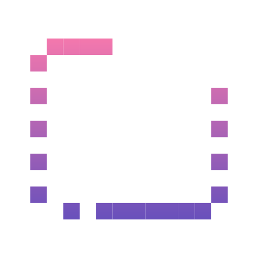&nbsp;&nbsp;&nbsp; <a href="images/iCons/Pixel/Userinterface/README.md">(+79)</a> | `83 Items` |
| [　　　┗ `Vcr iCons V1.1`](images/iCons/Pixel/Vcr%20iCons%20V1.1/README.md) | &nbsp;&nbsp;&nbsp; <a href="images/iCons/Pixel/Vcr%20iCons%20V1.1/README.md">(+241)</a> | `245 Items` |
| [　　　┗ `Vector Pixel iCons`](images/iCons/Pixel/Vector%20Pixel%20iCons/README.md) | 📁 (導覽層) | - |
| [　　　　┗ `Building & Real Estate`](images/iCons/Pixel/Vector%20Pixel%20iCons/Building%20%26%20Real%20Estate/README.md) | &nbsp;&nbsp;&nbsp; <a href="images/iCons/Pixel/Vector%20Pixel%20iCons/Building%20%26%20Real%20Estate/README.md">(+16)</a> | `20 Items` |
| [　　　　┗ `Business`](images/iCons/Pixel/Vector%20Pixel%20iCons/Business/README.md) | &nbsp;&nbsp;&nbsp; <a href="images/iCons/Pixel/Vector%20Pixel%20iCons/Business/README.md">(+25)</a> | `29 Items` |
| [　　　　┗ `Coding & App & Websites`](images/iCons/Pixel/Vector%20Pixel%20iCons/Coding%20%26%20App%20%26%20Websites/README.md) | &nbsp;&nbsp;&nbsp; <a href="images/iCons/Pixel/Vector%20Pixel%20iCons/Coding%20%26%20App%20%26%20Websites/README.md">(+23)</a> | `27 Items` |
| [　　　　┗ `Computers & Devices & Electronic`](images/iCons/Pixel/Vector%20Pixel%20iCons/Computers%20%26%20Devices%20%26%20Electronic/README.md) | &nbsp;&nbsp;&nbsp; <a href="images/iCons/Pixel/Vector%20Pixel%20iCons/Computers%20%26%20Devices%20%26%20Electronic/README.md">(+26)</a> | `30 Items` |
| [　　　　┗ `Content & Files`](images/iCons/Pixel/Vector%20Pixel%20iCons/Content%20%26%20Files/README.md) | &nbsp;&nbsp;&nbsp; <a href="images/iCons/Pixel/Vector%20Pixel%20iCons/Content%20%26%20Files/README.md">(+23)</a> | `27 Items` |
| [　　　　┗ `Design`](images/iCons/Pixel/Vector%20Pixel%20iCons/Design/README.md) | &nbsp;&nbsp;&nbsp; <a href="images/iCons/Pixel/Vector%20Pixel%20iCons/Design/README.md">(+18)</a> | `22 Items` |
| [　　　　┗ `Ecology`](images/iCons/Pixel/Vector%20Pixel%20iCons/Ecology/README.md) | 📁 (導覽層) | - |
| [　　　　┗ `Email`](images/iCons/Pixel/Vector%20Pixel%20iCons/Email/README.md) | &nbsp;&nbsp;&nbsp; <a href="images/iCons/Pixel/Vector%20Pixel%20iCons/Email/README.md">(+12)</a> | `16 Items` |
| [　　　　┗ `Entertainment & Events & Hobbies`](images/iCons/Pixel/Vector%20Pixel%20iCons/Entertainment%20%26%20Events%20%26%20Hobbies/README.md) | &nbsp;&nbsp;&nbsp; <a href="images/iCons/Pixel/Vector%20Pixel%20iCons/Entertainment%20%26%20Events%20%26%20Hobbies/README.md">(+18)</a> | `22 Items` |
| [　　　　┗ `Food & Drinks`](images/iCons/Pixel/Vector%20Pixel%20iCons/Food%20%26%20Drinks/README.md) | &nbsp;&nbsp;&nbsp; <a href="images/iCons/Pixel/Vector%20Pixel%20iCons/Food%20%26%20Drinks/README.md">(+16)</a> | `20 Items` |
| [　　　　┗ `Hand Signs`](images/iCons/Pixel/Vector%20Pixel%20iCons/Hand%20Signs/README.md) | &nbsp;&nbsp;&nbsp; <a href="images/iCons/Pixel/Vector%20Pixel%20iCons/Hand%20Signs/README.md">(+16)</a> | `20 Items` |
| [　　　　┗ `Interface Essentials`](images/iCons/Pixel/Vector%20Pixel%20iCons/Interface%20Essentials/README.md) | &nbsp;&nbsp;&nbsp; <a href="images/iCons/Pixel/Vector%20Pixel%20iCons/Interface%20Essentials/README.md">(+186)</a> | `190 Items` |
| [　　　　┗ `Internet & Network`](images/iCons/Pixel/Vector%20Pixel%20iCons/Internet%20%26%20Network/README.md) | &nbsp;&nbsp;&nbsp; <a href="images/iCons/Pixel/Vector%20Pixel%20iCons/Internet%20%26%20Network/README.md">(+6)</a> | `10 Items` |
| [　　　　┗ `Logos`](images/iCons/Pixel/Vector%20Pixel%20iCons/Logos/README.md) | &nbsp;&nbsp;&nbsp; <a href="images/iCons/Pixel/Vector%20Pixel%20iCons/Logos/README.md">(+17)</a> | `21 Items` |
| [　　　　┗ `Macosicons`](images/iCons/Pixel/Vector%20Pixel%20iCons/Macosicons/README.md) | 📁 (導覽層) | - |
| [　　　　┗ `Maps & Navigation`](images/iCons/Pixel/Vector%20Pixel%20iCons/Maps%20%26%20Navigation/README.md) | &nbsp;&nbsp;&nbsp; <a href="images/iCons/Pixel/Vector%20Pixel%20iCons/Maps%20%26%20Navigation/README.md">(+1)</a> | `5 Items` |
| [　　　　┗ `Money & Payments`](images/iCons/Pixel/Vector%20Pixel%20iCons/Money%20%26%20Payments/README.md) | &nbsp;&nbsp;&nbsp; <a href="images/iCons/Pixel/Vector%20Pixel%20iCons/Money%20%26%20Payments/README.md">(+9)</a> | `13 Items` |
| [　　　　┗ `Music & Audio`](images/iCons/Pixel/Vector%20Pixel%20iCons/Music%20%26%20Audio/README.md) | &nbsp;&nbsp;&nbsp; <a href="images/iCons/Pixel/Vector%20Pixel%20iCons/Music%20%26%20Audio/README.md">(+10)</a> | `14 Items` |
| [　　　　┗ `Pet & Animals`](images/iCons/Pixel/Vector%20Pixel%20iCons/Pet%20%26%20Animals/README.md) | &nbsp;&nbsp;&nbsp; <a href="images/iCons/Pixel/Vector%20Pixel%20iCons/Pet%20%26%20Animals/README.md">(+8)</a> | `12 Items` |
| [　　　　┗ `Phone`](images/iCons/Pixel/Vector%20Pixel%20iCons/Phone/README.md) | &nbsp;&nbsp;&nbsp; <a href="images/iCons/Pixel/Vector%20Pixel%20iCons/Phone/README.md">(+7)</a> | `11 Items` |
| [　　　　┗ `Photography`](images/iCons/Pixel/Vector%20Pixel%20iCons/Photography/README.md) | &nbsp;&nbsp;&nbsp; <a href="images/iCons/Pixel/Vector%20Pixel%20iCons/Photography/README.md">(+7)</a> | `11 Items` |
| [　　　　┗ `Romance`](images/iCons/Pixel/Vector%20Pixel%20iCons/Romance/README.md) | &nbsp;  | `2 Items` |
| [　　　　┗ `School`](images/iCons/Pixel/Vector%20Pixel%20iCons/School/README.md) | &nbsp;&nbsp;&nbsp;  | `4 Items` |
| [　　　　┗ `Shopping & Shipping`](images/iCons/Pixel/Vector%20Pixel%20iCons/Shopping%20%26%20Shipping/README.md) | &nbsp;&nbsp;&nbsp; <a href="images/iCons/Pixel/Vector%20Pixel%20iCons/Shopping%20%26%20Shipping/README.md">(+15)</a> | `19 Items` |
| [　　　　┗ `Social & Rewards`](images/iCons/Pixel/Vector%20Pixel%20iCons/Social%20%26%20Rewards/README.md) | &nbsp;&nbsp;&nbsp; <a href="images/iCons/Pixel/Vector%20Pixel%20iCons/Social%20%26%20Rewards/README.md">(+7)</a> | `11 Items` |
| [　　　　┗ `Technology`](images/iCons/Pixel/Vector%20Pixel%20iCons/Technology/README.md) | &nbsp;&nbsp;&nbsp; <a href="images/iCons/Pixel/Vector%20Pixel%20iCons/Technology/README.md">(+1)</a> | `5 Items` |
| [　　　　┗ `Transportation`](images/iCons/Pixel/Vector%20Pixel%20iCons/Transportation/README.md) | &nbsp;&nbsp;&nbsp; <a href="images/iCons/Pixel/Vector%20Pixel%20iCons/Transportation/README.md">(+3)</a> | `7 Items` |
| [　　　　┗ `Travel & Wayfinding`](images/iCons/Pixel/Vector%20Pixel%20iCons/Travel%20%26%20Wayfinding/README.md) | &nbsp;&nbsp;&nbsp;  | `4 Items` |
| [　　　　┗ `Users`](images/iCons/Pixel/Vector%20Pixel%20iCons/Users/README.md) | &nbsp;&nbsp;&nbsp; <a href="images/iCons/Pixel/Vector%20Pixel%20iCons/Users/README.md">(+8)</a> | `12 Items` |
| [　　　　┗ `Videos & Movies`](images/iCons/Pixel/Vector%20Pixel%20iCons/Videos%20%26%20Movies/README.md) | &nbsp;&nbsp;&nbsp; <a href="images/iCons/Pixel/Vector%20Pixel%20iCons/Videos%20%26%20Movies/README.md">(+4)</a> | `8 Items` |
| [　　　　┗ `Weather`](images/iCons/Pixel/Vector%20Pixel%20iCons/Weather/README.md) | &nbsp;&nbsp;&nbsp; <a href="images/iCons/Pixel/Vector%20Pixel%20iCons/Weather/README.md">(+6)</a> | `10 Items` |
| [　　　┗ `Virtual Pet 8Bit Vectors`](images/iCons/Pixel/Virtual%20Pet%208Bit%20Vectors/README.md) | &nbsp;&nbsp;&nbsp; <a href="images/iCons/Pixel/Virtual%20Pet%208Bit%20Vectors/README.md">(+17)</a> | `21 Items` |
| [　　　┗ `Zodiacsigns`](images/iCons/Pixel/Zodiacsigns/README.md) | &nbsp;&nbsp;&nbsp; <a href="images/iCons/Pixel/Zodiacsigns/README.md">(+18)</a> | `22 Items` |
| [　　┗ `Pro Emoji Pack`](images/iCons/Pro%20Emoji%20Pack/README.md) | &nbsp;&nbsp;&nbsp; <a href="images/iCons/Pro%20Emoji%20Pack/README.md">(+137)</a> | `141 Items` |
| [　　┗ `Radix iCons`](images/iCons/Radix%20iCons/README.md) | &nbsp;&nbsp;&nbsp; <a href="images/iCons/Radix%20iCons/README.md">(+301)</a> | `305 Items` |
| [　　┗ `Remix`](images/iCons/Remix/README.md) | 📁 (導覽層) | - |
| [　　┗ `Remix iCon`](images/iCons/Remix%20iCon/README.md) | &nbsp;&nbsp;&nbsp; <a href="images/iCons/Remix%20iCon/README.md">(+980)</a> | `984 Items` |
| [　　　┗ `fill`](images/iCons/Remix/fill/README.md) | 📁 (導覽層) | - |
| [　　　　┗ `buildings`](images/iCons/Remix/fill/buildings/README.md) | &nbsp;&nbsp;&nbsp; <a href="images/iCons/Remix/fill/buildings/README.md">(+23)</a> | `27 Items` |
| [　　　　┗ `business`](images/iCons/Remix/fill/business/README.md) | &nbsp;&nbsp;&nbsp; <a href="images/iCons/Remix/fill/business/README.md">(+81)</a> | `85 Items` |
| [　　　　┗ `communication`](images/iCons/Remix/fill/communication/README.md) | &nbsp;&nbsp;&nbsp; <a href="images/iCons/Remix/fill/communication/README.md">(+26)</a> | `30 Items` |
| [　　　　┗ `design`](images/iCons/Remix/fill/design/README.md) | &nbsp;&nbsp;&nbsp; <a href="images/iCons/Remix/fill/design/README.md">(+78)</a> | `82 Items` |
| [　　　　┗ `development`](images/iCons/Remix/fill/development/README.md) | &nbsp;&nbsp;&nbsp; <a href="images/iCons/Remix/fill/development/README.md">(+19)</a> | `23 Items` |
| [　　　　┗ `device`](images/iCons/Remix/fill/device/README.md) | &nbsp;&nbsp;&nbsp; <a href="images/iCons/Remix/fill/device/README.md">(+76)</a> | `80 Items` |
| [　　　　┗ `document`](images/iCons/Remix/fill/document/README.md) | &nbsp;&nbsp;&nbsp; <a href="images/iCons/Remix/fill/document/README.md">(+96)</a> | `100 Items` |
| [　　　　┗ `finance`](images/iCons/Remix/fill/finance/README.md) | &nbsp;&nbsp;&nbsp; <a href="images/iCons/Remix/fill/finance/README.md">(+62)</a> | `66 Items` |
| [　　　　┗ `health`](images/iCons/Remix/fill/health/README.md) | &nbsp;&nbsp;&nbsp; <a href="images/iCons/Remix/fill/health/README.md">(+26)</a> | `30 Items` |
| [　　　　┗ `logos`](images/iCons/Remix/fill/logos/README.md) | &nbsp;&nbsp;&nbsp; <a href="images/iCons/Remix/fill/logos/README.md">(+91)</a> | `95 Items` |
| [　　　　┗ `map`](images/iCons/Remix/fill/map/README.md) | &nbsp;&nbsp;&nbsp; <a href="images/iCons/Remix/fill/map/README.md">(+81)</a> | `85 Items` |
| [　　　　┗ `media`](images/iCons/Remix/fill/media/README.md) | &nbsp;&nbsp;&nbsp; <a href="images/iCons/Remix/fill/media/README.md">(+94)</a> | `98 Items` |
| [　　　　┗ `others`](images/iCons/Remix/fill/others/README.md) | &nbsp;&nbsp;&nbsp; <a href="images/iCons/Remix/fill/others/README.md">(+41)</a> | `45 Items` |
| [　　　　┗ `system`](images/iCons/Remix/fill/system/README.md) | &nbsp;&nbsp;&nbsp; <a href="images/iCons/Remix/fill/system/README.md">(+145)</a> | `149 Items` |
| [　　　　┗ `user`](images/iCons/Remix/fill/user/README.md) | &nbsp;&nbsp;&nbsp; <a href="images/iCons/Remix/fill/user/README.md">(+51)</a> | `55 Items` |
| [　　　　┗ `weather`](images/iCons/Remix/fill/weather/README.md) | &nbsp;&nbsp;&nbsp; <a href="images/iCons/Remix/fill/weather/README.md">(+31)</a> | `35 Items` |
| [　　　┗ `line`](images/iCons/Remix/line/README.md) | 📁 (導覽層) | - |
| [　　　　┗ `buildings`](images/iCons/Remix/line/buildings/README.md) | &nbsp;&nbsp;&nbsp; <a href="images/iCons/Remix/line/buildings/README.md">(+23)</a> | `27 Items` |
| [　　　　┗ `business`](images/iCons/Remix/line/business/README.md) | &nbsp;&nbsp;&nbsp; <a href="images/iCons/Remix/line/business/README.md">(+83)</a> | `87 Items` |
| [　　　　┗ `communication`](images/iCons/Remix/line/communication/README.md) | &nbsp;&nbsp;&nbsp; <a href="images/iCons/Remix/line/communication/README.md">(+26)</a> | `30 Items` |
| [　　　　┗ `design`](images/iCons/Remix/line/design/README.md) | &nbsp;&nbsp;&nbsp; <a href="images/iCons/Remix/line/design/README.md">(+78)</a> | `82 Items` |
| [　　　　┗ `development`](images/iCons/Remix/line/development/README.md) | &nbsp;&nbsp;&nbsp; <a href="images/iCons/Remix/line/development/README.md">(+19)</a> | `23 Items` |
| [　　　　┗ `device`](images/iCons/Remix/line/device/README.md) | &nbsp;&nbsp;&nbsp; <a href="images/iCons/Remix/line/device/README.md">(+76)</a> | `80 Items` |
| [　　　　┗ `document`](images/iCons/Remix/line/document/README.md) | &nbsp;&nbsp;&nbsp; <a href="images/iCons/Remix/line/document/README.md">(+96)</a> | `100 Items` |
| [　　　　┗ `editor`](images/iCons/Remix/line/editor/README.md) | &nbsp;&nbsp;&nbsp; <a href="images/iCons/Remix/line/editor/README.md">(+95)</a> | `99 Items` |
| [　　　　┗ `finance`](images/iCons/Remix/line/finance/README.md) | &nbsp;&nbsp;&nbsp; <a href="images/iCons/Remix/line/finance/README.md">(+62)</a> | `66 Items` |
| [　　　　┗ `health`](images/iCons/Remix/line/health/README.md) | &nbsp;&nbsp;&nbsp; <a href="images/iCons/Remix/line/health/README.md">(+26)</a> | `30 Items` |
| [　　　　┗ `logos`](images/iCons/Remix/line/logos/README.md) | &nbsp;&nbsp;&nbsp; <a href="images/iCons/Remix/line/logos/README.md">(+91)</a> | `95 Items` |
| [　　　　┗ `map`](images/iCons/Remix/line/map/README.md) | &nbsp;&nbsp;&nbsp; <a href="images/iCons/Remix/line/map/README.md">(+81)</a> | `85 Items` |
| [　　　　┗ `media`](images/iCons/Remix/line/media/README.md) | &nbsp;&nbsp;&nbsp; <a href="images/iCons/Remix/line/media/README.md">(+94)</a> | `98 Items` |
| [　　　　┗ `others`](images/iCons/Remix/line/others/README.md) | &nbsp;&nbsp;&nbsp; <a href="images/iCons/Remix/line/others/README.md">(+41)</a> | `45 Items` |
| [　　　　┗ `system`](images/iCons/Remix/line/system/README.md) | &nbsp;&nbsp;&nbsp; <a href="images/iCons/Remix/line/system/README.md">(+145)</a> | `149 Items` |
| [　　　　┗ `user`](images/iCons/Remix/line/user/README.md) | &nbsp;&nbsp;&nbsp; <a href="images/iCons/Remix/line/user/README.md">(+51)</a> | `55 Items` |
| [　　　　┗ `weather`](images/iCons/Remix/line/weather/README.md) | &nbsp;&nbsp;&nbsp; <a href="images/iCons/Remix/line/weather/README.md">(+31)</a> | `35 Items` |
| [　　┗ `Scarlab iCons`](images/iCons/Scarlab%20iCons/README.md) | 📁 (導覽層) | - |
| [　　　┗ `Line`](images/iCons/Scarlab%20iCons/Line/README.md) | &nbsp;&nbsp;&nbsp; <a href="images/iCons/Scarlab%20iCons/Line/README.md">(+436)</a> | `440 Items` |
| [　　　┗ `Solid`](images/iCons/Scarlab%20iCons/Solid/README.md) | &nbsp;&nbsp;&nbsp; <a href="images/iCons/Scarlab%20iCons/Solid/README.md">(+309)</a> | `313 Items` |
| [　　┗ `Servers Isometric iCons`](images/iCons/Servers%20Isometric%20iCons/README.md) | &nbsp;&nbsp;&nbsp; <a href="images/iCons/Servers%20Isometric%20iCons/README.md">(+16)</a> | `20 Items` |
| [　　┗ `Shopicon iCons`](images/iCons/Shopicon%20iCons/README.md) | 📁 (導覽層) | - |
| [　　　┗ `Fill`](images/iCons/Shopicon%20iCons/Fill/README.md) | &nbsp;&nbsp;&nbsp; <a href="images/iCons/Shopicon%20iCons/Fill/README.md">(+199)</a> | `203 Items` |
| [　　　┗ `Line`](images/iCons/Shopicon%20iCons/Line/README.md) | &nbsp;&nbsp;&nbsp; <a href="images/iCons/Shopicon%20iCons/Line/README.md">(+236)</a> | `240 Items` |
| [　　┗ `Sitemap Cards`](images/iCons/Sitemap%20Cards/README.md) | &nbsp;&nbsp;&nbsp; <a href="images/iCons/Sitemap%20Cards/README.md">(+116)</a> | `120 Items` |
| [　　┗ `Sketch`](images/iCons/Sketch/README.md) | 📁 (導覽層) | - |
| [　　　┗ `color`](images/iCons/Sketch/color/README.md) | &nbsp;&nbsp;&nbsp; <a href="images/iCons/Sketch/color/README.md">(+194)</a> | `198 Items` |
| [　　　┗ `simple`](images/iCons/Sketch/simple/README.md) | &nbsp;&nbsp;&nbsp; <a href="images/iCons/Sketch/simple/README.md">(+468)</a> | `472 Items` |
| [　　┗ `Socialicious`](images/iCons/Socialicious/README.md) | &nbsp;&nbsp;&nbsp; <a href="images/iCons/Socialicious/README.md">(+70)</a> | `74 Items` |
| [　　┗ `Solar iCons`](images/iCons/Solar%20iCons/README.md) | 📁 (導覽層) | - |
| [　　　┗ `Arrow`](images/iCons/Solar%20iCons/Arrow/README.md) | 📁 (導覽層) | - |
| [　　　　┗ `bold`](images/iCons/Solar%20iCons/Arrow/bold/README.md) | &nbsp;&nbsp;&nbsp; <a href="images/iCons/Solar%20iCons/Arrow/bold/README.md">(+63)</a> | `67 Items` |
| [　　　　┗ `bold duotone`](images/iCons/Solar%20iCons/Arrow/bold%20duotone/README.md) | &nbsp;&nbsp;&nbsp; <a href="images/iCons/Solar%20iCons/Arrow/bold%20duotone/README.md">(+63)</a> | `67 Items` |
| [　　　　┗ `broken`](images/iCons/Solar%20iCons/Arrow/broken/README.md) | &nbsp;&nbsp;&nbsp; <a href="images/iCons/Solar%20iCons/Arrow/broken/README.md">(+63)</a> | `67 Items` |
| [　　　　┗ `line duotone`](images/iCons/Solar%20iCons/Arrow/line%20duotone/README.md) | &nbsp;&nbsp;&nbsp; <a href="images/iCons/Solar%20iCons/Arrow/line%20duotone/README.md">(+63)</a> | `67 Items` |
| [　　　　┗ `linear`](images/iCons/Solar%20iCons/Arrow/linear/README.md) | &nbsp;&nbsp;&nbsp; <a href="images/iCons/Solar%20iCons/Arrow/linear/README.md">(+63)</a> | `67 Items` |
| [　　　　┗ `outline`](images/iCons/Solar%20iCons/Arrow/outline/README.md) | &nbsp;&nbsp;&nbsp; <a href="images/iCons/Solar%20iCons/Arrow/outline/README.md">(+63)</a> | `67 Items` |
| [　　　┗ `Arrows Action`](images/iCons/Solar%20iCons/Arrows%20Action/README.md) | 📁 (導覽層) | - |
| [　　　　┗ `bold`](images/iCons/Solar%20iCons/Arrows%20Action/bold/README.md) | &nbsp;&nbsp;&nbsp; <a href="images/iCons/Solar%20iCons/Arrows%20Action/bold/README.md">(+38)</a> | `42 Items` |
| [　　　　┗ `bold duotone`](images/iCons/Solar%20iCons/Arrows%20Action/bold%20duotone/README.md) | &nbsp;&nbsp;&nbsp; <a href="images/iCons/Solar%20iCons/Arrows%20Action/bold%20duotone/README.md">(+53)</a> | `57 Items` |
| [　　　　┗ `broken`](images/iCons/Solar%20iCons/Arrows%20Action/broken/README.md) | &nbsp;&nbsp;&nbsp; <a href="images/iCons/Solar%20iCons/Arrows%20Action/broken/README.md">(+51)</a> | `55 Items` |
| [　　　　┗ `line duotone`](images/iCons/Solar%20iCons/Arrows%20Action/line%20duotone/README.md) | &nbsp;&nbsp;&nbsp; <a href="images/iCons/Solar%20iCons/Arrows%20Action/line%20duotone/README.md">(+53)</a> | `57 Items` |
| [　　　　┗ `linear`](images/iCons/Solar%20iCons/Arrows%20Action/linear/README.md) | &nbsp;&nbsp;&nbsp; <a href="images/iCons/Solar%20iCons/Arrows%20Action/linear/README.md">(+53)</a> | `57 Items` |
| [　　　　┗ `outline`](images/iCons/Solar%20iCons/Arrows%20Action/outline/README.md) | &nbsp;&nbsp;&nbsp; <a href="images/iCons/Solar%20iCons/Arrows%20Action/outline/README.md">(+53)</a> | `57 Items` |
| [　　　┗ `Astronomy`](images/iCons/Solar%20iCons/Astronomy/README.md) | 📁 (導覽層) | - |
| [　　　　┗ `bold`](images/iCons/Solar%20iCons/Astronomy/bold/README.md) | &nbsp;&nbsp;&nbsp; <a href="images/iCons/Solar%20iCons/Astronomy/bold/README.md">(+26)</a> | `30 Items` |
| [　　　　┗ `bold duotone`](images/iCons/Solar%20iCons/Astronomy/bold%20duotone/README.md) | &nbsp;&nbsp;&nbsp; <a href="images/iCons/Solar%20iCons/Astronomy/bold%20duotone/README.md">(+28)</a> | `32 Items` |
| [　　　　┗ `broken`](images/iCons/Solar%20iCons/Astronomy/broken/README.md) | &nbsp;&nbsp;&nbsp; <a href="images/iCons/Solar%20iCons/Astronomy/broken/README.md">(+25)</a> | `29 Items` |
| [　　　　┗ `line duotone`](images/iCons/Solar%20iCons/Astronomy/line%20duotone/README.md) | &nbsp;&nbsp;&nbsp; <a href="images/iCons/Solar%20iCons/Astronomy/line%20duotone/README.md">(+27)</a> | `31 Items` |
| [　　　　┗ `linear`](images/iCons/Solar%20iCons/Astronomy/linear/README.md) | &nbsp;&nbsp;&nbsp; <a href="images/iCons/Solar%20iCons/Astronomy/linear/README.md">(+27)</a> | `31 Items` |
| [　　　　┗ `outline`](images/iCons/Solar%20iCons/Astronomy/outline/README.md) | &nbsp;&nbsp;&nbsp; <a href="images/iCons/Solar%20iCons/Astronomy/outline/README.md">(+28)</a> | `32 Items` |
| [　　　┗ `Building, Infrastructure`](images/iCons/Solar%20iCons/Building%2C%20Infrastructure/README.md) | 📁 (導覽層) | - |
| [　　　　┗ `bold`](images/iCons/Solar%20iCons/Building%2C%20Infrastructure/bold/README.md) | &nbsp;&nbsp;&nbsp; <a href="images/iCons/Solar%20iCons/Building%2C%20Infrastructure/bold/README.md">(+3)</a> | `7 Items` |
| [　　　　┗ `bold duotone`](images/iCons/Solar%20iCons/Building%2C%20Infrastructure/bold%20duotone/README.md) | &nbsp;&nbsp;&nbsp; <a href="images/iCons/Solar%20iCons/Building%2C%20Infrastructure/bold%20duotone/README.md">(+3)</a> | `7 Items` |
| [　　　　┗ `broken`](images/iCons/Solar%20iCons/Building%2C%20Infrastructure/broken/README.md) | &nbsp;&nbsp;&nbsp; <a href="images/iCons/Solar%20iCons/Building%2C%20Infrastructure/broken/README.md">(+3)</a> | `7 Items` |
| [　　　　┗ `line duotone`](images/iCons/Solar%20iCons/Building%2C%20Infrastructure/line%20duotone/README.md) | &nbsp;&nbsp;&nbsp; <a href="images/iCons/Solar%20iCons/Building%2C%20Infrastructure/line%20duotone/README.md">(+3)</a> | `7 Items` |
| [　　　　┗ `linear`](images/iCons/Solar%20iCons/Building%2C%20Infrastructure/linear/README.md) | &nbsp;&nbsp;&nbsp; <a href="images/iCons/Solar%20iCons/Building%2C%20Infrastructure/linear/README.md">(+3)</a> | `7 Items` |
| [　　　　┗ `outline`](images/iCons/Solar%20iCons/Building%2C%20Infrastructure/outline/README.md) | &nbsp;&nbsp;&nbsp; <a href="images/iCons/Solar%20iCons/Building%2C%20Infrastructure/outline/README.md">(+3)</a> | `7 Items` |
| [　　　┗ `Business, Statistic`](images/iCons/Solar%20iCons/Business%2C%20Statistic/README.md) | 📁 (導覽層) | - |
| [　　　　┗ `bold`](images/iCons/Solar%20iCons/Business%2C%20Statistic/bold/README.md) | &nbsp;&nbsp;&nbsp; <a href="images/iCons/Solar%20iCons/Business%2C%20Statistic/bold/README.md">(+13)</a> | `17 Items` |
| [　　　　┗ `bold duotone`](images/iCons/Solar%20iCons/Business%2C%20Statistic/bold%20duotone/README.md) | &nbsp;&nbsp;&nbsp; <a href="images/iCons/Solar%20iCons/Business%2C%20Statistic/bold%20duotone/README.md">(+15)</a> | `19 Items` |
| [　　　　┗ `broken`](images/iCons/Solar%20iCons/Business%2C%20Statistic/broken/README.md) | &nbsp;&nbsp;&nbsp; <a href="images/iCons/Solar%20iCons/Business%2C%20Statistic/broken/README.md">(+15)</a> | `19 Items` |
| [　　　　┗ `line duotone`](images/iCons/Solar%20iCons/Business%2C%20Statistic/line%20duotone/README.md) | &nbsp;&nbsp;&nbsp; <a href="images/iCons/Solar%20iCons/Business%2C%20Statistic/line%20duotone/README.md">(+15)</a> | `19 Items` |
| [　　　　┗ `linear`](images/iCons/Solar%20iCons/Business%2C%20Statistic/linear/README.md) | &nbsp;&nbsp;&nbsp; <a href="images/iCons/Solar%20iCons/Business%2C%20Statistic/linear/README.md">(+15)</a> | `19 Items` |
| [　　　　┗ `outline`](images/iCons/Solar%20iCons/Business%2C%20Statistic/outline/README.md) | &nbsp;&nbsp;&nbsp; <a href="images/iCons/Solar%20iCons/Business%2C%20Statistic/outline/README.md">(+15)</a> | `19 Items` |
| [　　　┗ `Call`](images/iCons/Solar%20iCons/Call/README.md) | 📁 (導覽層) | - |
| [　　　　┗ `bold`](images/iCons/Solar%20iCons/Call/bold/README.md) | &nbsp;&nbsp;&nbsp; <a href="images/iCons/Solar%20iCons/Call/bold/README.md">(+17)</a> | `21 Items` |
| [　　　　┗ `bold duotone`](images/iCons/Solar%20iCons/Call/bold%20duotone/README.md) | &nbsp;&nbsp;&nbsp; <a href="images/iCons/Solar%20iCons/Call/bold%20duotone/README.md">(+17)</a> | `21 Items` |
| [　　　　┗ `broken`](images/iCons/Solar%20iCons/Call/broken/README.md) | &nbsp;&nbsp;&nbsp; <a href="images/iCons/Solar%20iCons/Call/broken/README.md">(+17)</a> | `21 Items` |
| [　　　　┗ `line duotone`](images/iCons/Solar%20iCons/Call/line%20duotone/README.md) | &nbsp;&nbsp;&nbsp; <a href="images/iCons/Solar%20iCons/Call/line%20duotone/README.md">(+17)</a> | `21 Items` |
| [　　　　┗ `linear`](images/iCons/Solar%20iCons/Call/linear/README.md) | &nbsp;&nbsp;&nbsp; <a href="images/iCons/Solar%20iCons/Call/linear/README.md">(+17)</a> | `21 Items` |
| [　　　　┗ `outline`](images/iCons/Solar%20iCons/Call/outline/README.md) | &nbsp;&nbsp;&nbsp; <a href="images/iCons/Solar%20iCons/Call/outline/README.md">(+17)</a> | `21 Items` |
| [　　　┗ `Design, Tools`](images/iCons/Solar%20iCons/Design%2C%20Tools/README.md) | 📁 (導覽層) | - |
| [　　　　┗ `bold`](images/iCons/Solar%20iCons/Design%2C%20Tools/bold/README.md) | &nbsp;&nbsp;&nbsp; <a href="images/iCons/Solar%20iCons/Design%2C%20Tools/bold/README.md">(+25)</a> | `29 Items` |
| [　　　　┗ `bold duotone`](images/iCons/Solar%20iCons/Design%2C%20Tools/bold%20duotone/README.md) | &nbsp;&nbsp;&nbsp; <a href="images/iCons/Solar%20iCons/Design%2C%20Tools/bold%20duotone/README.md">(+25)</a> | `29 Items` |
| [　　　　┗ `broken`](images/iCons/Solar%20iCons/Design%2C%20Tools/broken/README.md) | &nbsp;&nbsp;&nbsp; <a href="images/iCons/Solar%20iCons/Design%2C%20Tools/broken/README.md">(+25)</a> | `29 Items` |
| [　　　　┗ `line duotone`](images/iCons/Solar%20iCons/Design%2C%20Tools/line%20duotone/README.md) | &nbsp;&nbsp;&nbsp; <a href="images/iCons/Solar%20iCons/Design%2C%20Tools/line%20duotone/README.md">(+25)</a> | `29 Items` |
| [　　　　┗ `linear`](images/iCons/Solar%20iCons/Design%2C%20Tools/linear/README.md) | &nbsp;&nbsp;&nbsp; <a href="images/iCons/Solar%20iCons/Design%2C%20Tools/linear/README.md">(+25)</a> | `29 Items` |
| [　　　　┗ `outline`](images/iCons/Solar%20iCons/Design%2C%20Tools/outline/README.md) | &nbsp;&nbsp;&nbsp; <a href="images/iCons/Solar%20iCons/Design%2C%20Tools/outline/README.md">(+25)</a> | `29 Items` |
| [　　　┗ `Electronic, Devices`](images/iCons/Solar%20iCons/Electronic%2C%20Devices/README.md) | 📁 (導覽層) | - |
| [　　　　┗ `bold`](images/iCons/Solar%20iCons/Electronic%2C%20Devices/bold/README.md) | &nbsp;&nbsp;&nbsp; <a href="images/iCons/Solar%20iCons/Electronic%2C%20Devices/bold/README.md">(+84)</a> | `88 Items` |
| [　　　　┗ `bold duotone`](images/iCons/Solar%20iCons/Electronic%2C%20Devices/bold%20duotone/README.md) | &nbsp;&nbsp;&nbsp; <a href="images/iCons/Solar%20iCons/Electronic%2C%20Devices/bold%20duotone/README.md">(+84)</a> | `88 Items` |
| [　　　　┗ `broken`](images/iCons/Solar%20iCons/Electronic%2C%20Devices/broken/README.md) | &nbsp;&nbsp;&nbsp; <a href="images/iCons/Solar%20iCons/Electronic%2C%20Devices/broken/README.md">(+84)</a> | `88 Items` |
| [　　　　┗ `line duotone`](images/iCons/Solar%20iCons/Electronic%2C%20Devices/line%20duotone/README.md) | &nbsp;&nbsp;&nbsp; <a href="images/iCons/Solar%20iCons/Electronic%2C%20Devices/line%20duotone/README.md">(+84)</a> | `88 Items` |
| [　　　　┗ `linear`](images/iCons/Solar%20iCons/Electronic%2C%20Devices/linear/README.md) | &nbsp;&nbsp;&nbsp; <a href="images/iCons/Solar%20iCons/Electronic%2C%20Devices/linear/README.md">(+84)</a> | `88 Items` |
| [　　　　┗ `outline`](images/iCons/Solar%20iCons/Electronic%2C%20Devices/outline/README.md) | &nbsp;&nbsp;&nbsp; <a href="images/iCons/Solar%20iCons/Electronic%2C%20Devices/outline/README.md">(+84)</a> | `88 Items` |
| [　　　┗ `Essentional, UI`](images/iCons/Solar%20iCons/Essentional%2C%20UI/README.md) | 📁 (導覽層) | - |
| [　　　　┗ `bold`](images/iCons/Solar%20iCons/Essentional%2C%20UI/bold/README.md) | &nbsp;&nbsp;&nbsp; <a href="images/iCons/Solar%20iCons/Essentional%2C%20UI/bold/README.md">(+138)</a> | `142 Items` |
| [　　　　┗ `bold duotone`](images/iCons/Solar%20iCons/Essentional%2C%20UI/bold%20duotone/README.md) | &nbsp;&nbsp;&nbsp; <a href="images/iCons/Solar%20iCons/Essentional%2C%20UI/bold%20duotone/README.md">(+141)</a> | `145 Items` |
| [　　　　┗ `broken`](images/iCons/Solar%20iCons/Essentional%2C%20UI/broken/README.md) | &nbsp;&nbsp;&nbsp; <a href="images/iCons/Solar%20iCons/Essentional%2C%20UI/broken/README.md">(+142)</a> | `146 Items` |
| [　　　　┗ `line duotone`](images/iCons/Solar%20iCons/Essentional%2C%20UI/line%20duotone/README.md) | &nbsp;&nbsp;&nbsp; <a href="images/iCons/Solar%20iCons/Essentional%2C%20UI/line%20duotone/README.md">(+138)</a> | `142 Items` |
| [　　　　┗ `linear`](images/iCons/Solar%20iCons/Essentional%2C%20UI/linear/README.md) | &nbsp;&nbsp;&nbsp; <a href="images/iCons/Solar%20iCons/Essentional%2C%20UI/linear/README.md">(+142)</a> | `146 Items` |
| [　　　　┗ `outline`](images/iCons/Solar%20iCons/Essentional%2C%20UI/outline/README.md) | &nbsp;&nbsp;&nbsp; <a href="images/iCons/Solar%20iCons/Essentional%2C%20UI/outline/README.md">(+142)</a> | `146 Items` |
| [　　　┗ `Faces, Emotions, Stickers`](images/iCons/Solar%20iCons/Faces%2C%20Emotions%2C%20Stickers/README.md) | 📁 (導覽層) | - |
| [　　　　┗ `bold`](images/iCons/Solar%20iCons/Faces%2C%20Emotions%2C%20Stickers/bold/README.md) | &nbsp;&nbsp;&nbsp; <a href="images/iCons/Solar%20iCons/Faces%2C%20Emotions%2C%20Stickers/bold/README.md">(+17)</a> | `21 Items` |
| [　　　　┗ `bold duotone`](images/iCons/Solar%20iCons/Faces%2C%20Emotions%2C%20Stickers/bold%20duotone/README.md) | &nbsp;&nbsp;&nbsp; <a href="images/iCons/Solar%20iCons/Faces%2C%20Emotions%2C%20Stickers/bold%20duotone/README.md">(+17)</a> | `21 Items` |
| [　　　　┗ `broken`](images/iCons/Solar%20iCons/Faces%2C%20Emotions%2C%20Stickers/broken/README.md) | &nbsp;&nbsp;&nbsp; <a href="images/iCons/Solar%20iCons/Faces%2C%20Emotions%2C%20Stickers/broken/README.md">(+15)</a> | `19 Items` |
| [　　　　┗ `line duotone`](images/iCons/Solar%20iCons/Faces%2C%20Emotions%2C%20Stickers/line%20duotone/README.md) | &nbsp;&nbsp;&nbsp; <a href="images/iCons/Solar%20iCons/Faces%2C%20Emotions%2C%20Stickers/line%20duotone/README.md">(+17)</a> | `21 Items` |
| [　　　　┗ `linear`](images/iCons/Solar%20iCons/Faces%2C%20Emotions%2C%20Stickers/linear/README.md) | &nbsp;&nbsp;&nbsp; <a href="images/iCons/Solar%20iCons/Faces%2C%20Emotions%2C%20Stickers/linear/README.md">(+17)</a> | `21 Items` |
| [　　　　┗ `outline`](images/iCons/Solar%20iCons/Faces%2C%20Emotions%2C%20Stickers/outline/README.md) | &nbsp;&nbsp;&nbsp; <a href="images/iCons/Solar%20iCons/Faces%2C%20Emotions%2C%20Stickers/outline/README.md">(+17)</a> | `21 Items` |
| [　　　┗ `Files`](images/iCons/Solar%20iCons/Files/README.md) | 📁 (導覽層) | - |
| [　　　　┗ `bold`](images/iCons/Solar%20iCons/Files/bold/README.md) | &nbsp;&nbsp;&nbsp; <a href="images/iCons/Solar%20iCons/Files/bold/README.md">(+11)</a> | `15 Items` |
| [　　　　┗ `bold duotone`](images/iCons/Solar%20iCons/Files/bold%20duotone/README.md) | &nbsp;&nbsp;&nbsp; <a href="images/iCons/Solar%20iCons/Files/bold%20duotone/README.md">(+11)</a> | `15 Items` |
| [　　　　┗ `broken`](images/iCons/Solar%20iCons/Files/broken/README.md) | &nbsp;&nbsp;&nbsp; <a href="images/iCons/Solar%20iCons/Files/broken/README.md">(+11)</a> | `15 Items` |
| [　　　　┗ `line duotone`](images/iCons/Solar%20iCons/Files/line%20duotone/README.md) | &nbsp;&nbsp;&nbsp; <a href="images/iCons/Solar%20iCons/Files/line%20duotone/README.md">(+11)</a> | `15 Items` |
| [　　　　┗ `linear`](images/iCons/Solar%20iCons/Files/linear/README.md) | &nbsp;&nbsp;&nbsp; <a href="images/iCons/Solar%20iCons/Files/linear/README.md">(+11)</a> | `15 Items` |
| [　　　　┗ `outline`](images/iCons/Solar%20iCons/Files/outline/README.md) | &nbsp;&nbsp;&nbsp; <a href="images/iCons/Solar%20iCons/Files/outline/README.md">(+11)</a> | `15 Items` |
| [　　　┗ `Folders`](images/iCons/Solar%20iCons/Folders/README.md) | 📁 (導覽層) | - |
| [　　　　┗ `bold`](images/iCons/Solar%20iCons/Folders/bold/README.md) | &nbsp;&nbsp;&nbsp; <a href="images/iCons/Solar%20iCons/Folders/bold/README.md">(+10)</a> | `14 Items` |
| [　　　　┗ `bold duotone`](images/iCons/Solar%20iCons/Folders/bold%20duotone/README.md) | &nbsp;&nbsp;&nbsp; <a href="images/iCons/Solar%20iCons/Folders/bold%20duotone/README.md">(+10)</a> | `14 Items` |
| [　　　　┗ `broken`](images/iCons/Solar%20iCons/Folders/broken/README.md) | &nbsp;&nbsp;&nbsp; <a href="images/iCons/Solar%20iCons/Folders/broken/README.md">(+10)</a> | `14 Items` |
| [　　　　┗ `line duotone`](images/iCons/Solar%20iCons/Folders/line%20duotone/README.md) | &nbsp;&nbsp;&nbsp; <a href="images/iCons/Solar%20iCons/Folders/line%20duotone/README.md">(+10)</a> | `14 Items` |
| [　　　　┗ `linear`](images/iCons/Solar%20iCons/Folders/linear/README.md) | &nbsp;&nbsp;&nbsp; <a href="images/iCons/Solar%20iCons/Folders/linear/README.md">(+10)</a> | `14 Items` |
| [　　　　┗ `outline`](images/iCons/Solar%20iCons/Folders/outline/README.md) | &nbsp;&nbsp;&nbsp; <a href="images/iCons/Solar%20iCons/Folders/outline/README.md">(+10)</a> | `14 Items` |
| [　　　┗ `Food, Kitchen`](images/iCons/Solar%20iCons/Food%2C%20Kitchen/README.md) | 📁 (導覽層) | - |
| [　　　　┗ `bold`](images/iCons/Solar%20iCons/Food%2C%20Kitchen/bold/README.md) | &nbsp;&nbsp;&nbsp; <a href="images/iCons/Solar%20iCons/Food%2C%20Kitchen/bold/README.md">(+14)</a> | `18 Items` |
| [　　　　┗ `bold duotone`](images/iCons/Solar%20iCons/Food%2C%20Kitchen/bold%20duotone/README.md) | &nbsp;&nbsp;&nbsp; <a href="images/iCons/Solar%20iCons/Food%2C%20Kitchen/bold%20duotone/README.md">(+14)</a> | `18 Items` |
| [　　　　┗ `broken`](images/iCons/Solar%20iCons/Food%2C%20Kitchen/broken/README.md) | &nbsp;&nbsp;&nbsp; <a href="images/iCons/Solar%20iCons/Food%2C%20Kitchen/broken/README.md">(+14)</a> | `18 Items` |
| [　　　　┗ `line duotone`](images/iCons/Solar%20iCons/Food%2C%20Kitchen/line%20duotone/README.md) | &nbsp;&nbsp;&nbsp; <a href="images/iCons/Solar%20iCons/Food%2C%20Kitchen/line%20duotone/README.md">(+14)</a> | `18 Items` |
| [　　　　┗ `linear`](images/iCons/Solar%20iCons/Food%2C%20Kitchen/linear/README.md) | &nbsp;&nbsp;&nbsp; <a href="images/iCons/Solar%20iCons/Food%2C%20Kitchen/linear/README.md">(+14)</a> | `18 Items` |
| [　　　　┗ `outline`](images/iCons/Solar%20iCons/Food%2C%20Kitchen/outline/README.md) | &nbsp;&nbsp;&nbsp; <a href="images/iCons/Solar%20iCons/Food%2C%20Kitchen/outline/README.md">(+14)</a> | `18 Items` |
| [　　　┗ `Hands`](images/iCons/Solar%20iCons/Hands/README.md) | 📁 (導覽層) | - |
| [　　　　┗ `bold`](images/iCons/Solar%20iCons/Hands/bold/README.md) | &nbsp;&nbsp;&nbsp; <a href="images/iCons/Solar%20iCons/Hands/bold/README.md">(+1)</a> | `5 Items` |
| [　　　　┗ `bold duotone`](images/iCons/Solar%20iCons/Hands/bold%20duotone/README.md) | &nbsp;&nbsp;&nbsp; <a href="images/iCons/Solar%20iCons/Hands/bold%20duotone/README.md">(+1)</a> | `5 Items` |
| [　　　　┗ `broken`](images/iCons/Solar%20iCons/Hands/broken/README.md) | &nbsp;&nbsp;&nbsp; <a href="images/iCons/Solar%20iCons/Hands/broken/README.md">(+1)</a> | `5 Items` |
| [　　　　┗ `line duotone`](images/iCons/Solar%20iCons/Hands/line%20duotone/README.md) | &nbsp;&nbsp;&nbsp; <a href="images/iCons/Solar%20iCons/Hands/line%20duotone/README.md">(+1)</a> | `5 Items` |
| [　　　　┗ `linear`](images/iCons/Solar%20iCons/Hands/linear/README.md) | &nbsp;&nbsp;&nbsp; <a href="images/iCons/Solar%20iCons/Hands/linear/README.md">(+1)</a> | `5 Items` |
| [　　　　┗ `outline`](images/iCons/Solar%20iCons/Hands/outline/README.md) | &nbsp;&nbsp;&nbsp; <a href="images/iCons/Solar%20iCons/Hands/outline/README.md">(+1)</a> | `5 Items` |
| [　　　┗ `Home, Furniture`](images/iCons/Solar%20iCons/Home%2C%20Furniture/README.md) | 📁 (導覽層) | - |
| [　　　　┗ `bold`](images/iCons/Solar%20iCons/Home%2C%20Furniture/bold/README.md) | &nbsp;&nbsp;&nbsp; <a href="images/iCons/Solar%20iCons/Home%2C%20Furniture/bold/README.md">(+31)</a> | `35 Items` |
| [　　　　┗ `bold duotone`](images/iCons/Solar%20iCons/Home%2C%20Furniture/bold%20duotone/README.md) | &nbsp;&nbsp;&nbsp; <a href="images/iCons/Solar%20iCons/Home%2C%20Furniture/bold%20duotone/README.md">(+31)</a> | `35 Items` |
| [　　　　┗ `broken`](images/iCons/Solar%20iCons/Home%2C%20Furniture/broken/README.md) | &nbsp;&nbsp;&nbsp; <a href="images/iCons/Solar%20iCons/Home%2C%20Furniture/broken/README.md">(+29)</a> | `33 Items` |
| [　　　　┗ `line duotone`](images/iCons/Solar%20iCons/Home%2C%20Furniture/line%20duotone/README.md) | &nbsp;&nbsp;&nbsp; <a href="images/iCons/Solar%20iCons/Home%2C%20Furniture/line%20duotone/README.md">(+31)</a> | `35 Items` |
| [　　　　┗ `linear`](images/iCons/Solar%20iCons/Home%2C%20Furniture/linear/README.md) | &nbsp;&nbsp;&nbsp; <a href="images/iCons/Solar%20iCons/Home%2C%20Furniture/linear/README.md">(+31)</a> | `35 Items` |
| [　　　　┗ `outline`](images/iCons/Solar%20iCons/Home%2C%20Furniture/outline/README.md) | &nbsp;&nbsp;&nbsp; <a href="images/iCons/Solar%20iCons/Home%2C%20Furniture/outline/README.md">(+31)</a> | `35 Items` |
| [　　　┗ `Like`](images/iCons/Solar%20iCons/Like/README.md) | 📁 (導覽層) | - |
| [　　　　┗ `bold`](images/iCons/Solar%20iCons/Like/bold/README.md) | &nbsp;&nbsp;&nbsp; <a href="images/iCons/Solar%20iCons/Like/bold/README.md">(+13)</a> | `17 Items` |
| [　　　　┗ `bold duotone`](images/iCons/Solar%20iCons/Like/bold%20duotone/README.md) | &nbsp;&nbsp;&nbsp; <a href="images/iCons/Solar%20iCons/Like/bold%20duotone/README.md">(+13)</a> | `17 Items` |
| [　　　　┗ `broken`](images/iCons/Solar%20iCons/Like/broken/README.md) | &nbsp;&nbsp;&nbsp; <a href="images/iCons/Solar%20iCons/Like/broken/README.md">(+11)</a> | `15 Items` |
| [　　　　┗ `line duotone`](images/iCons/Solar%20iCons/Like/line%20duotone/README.md) | &nbsp;&nbsp;&nbsp; <a href="images/iCons/Solar%20iCons/Like/line%20duotone/README.md">(+12)</a> | `16 Items` |
| [　　　　┗ `linear`](images/iCons/Solar%20iCons/Like/linear/README.md) | &nbsp;&nbsp;&nbsp; <a href="images/iCons/Solar%20iCons/Like/linear/README.md">(+13)</a> | `17 Items` |
| [　　　　┗ `outline`](images/iCons/Solar%20iCons/Like/outline/README.md) | &nbsp;&nbsp;&nbsp; <a href="images/iCons/Solar%20iCons/Like/outline/README.md">(+13)</a> | `17 Items` |
| [　　　┗ `List`](images/iCons/Solar%20iCons/List/README.md) | 📁 (導覽層) | - |
| [　　　　┗ `bold`](images/iCons/Solar%20iCons/List/bold/README.md) | &nbsp;&nbsp;&nbsp; <a href="images/iCons/Solar%20iCons/List/bold/README.md">(+12)</a> | `16 Items` |
| [　　　　┗ `bold duotone`](images/iCons/Solar%20iCons/List/bold%20duotone/README.md) | &nbsp;&nbsp;&nbsp; <a href="images/iCons/Solar%20iCons/List/bold%20duotone/README.md">(+23)</a> | `27 Items` |
| [　　　　┗ `broken`](images/iCons/Solar%20iCons/List/broken/README.md) | &nbsp;&nbsp;&nbsp; <a href="images/iCons/Solar%20iCons/List/broken/README.md">(+17)</a> | `21 Items` |
| [　　　　┗ `line duotone`](images/iCons/Solar%20iCons/List/line%20duotone/README.md) | &nbsp;&nbsp;&nbsp; <a href="images/iCons/Solar%20iCons/List/line%20duotone/README.md">(+23)</a> | `27 Items` |
| [　　　　┗ `linear`](images/iCons/Solar%20iCons/List/linear/README.md) | &nbsp;&nbsp;&nbsp; <a href="images/iCons/Solar%20iCons/List/linear/README.md">(+23)</a> | `27 Items` |
| [　　　　┗ `outline`](images/iCons/Solar%20iCons/List/outline/README.md) | &nbsp;&nbsp;&nbsp; <a href="images/iCons/Solar%20iCons/List/outline/README.md">(+23)</a> | `27 Items` |
| [　　　┗ `Map & Location`](images/iCons/Solar%20iCons/Map%20%26%20Location/README.md) | 📁 (導覽層) | - |
| [　　　　┗ `bold`](images/iCons/Solar%20iCons/Map%20%26%20Location/bold/README.md) | &nbsp;&nbsp;&nbsp; <a href="images/iCons/Solar%20iCons/Map%20%26%20Location/bold/README.md">(+33)</a> | `37 Items` |
| [　　　　┗ `bold duotone`](images/iCons/Solar%20iCons/Map%20%26%20Location/bold%20duotone/README.md) | &nbsp;&nbsp;&nbsp; <a href="images/iCons/Solar%20iCons/Map%20%26%20Location/bold%20duotone/README.md">(+33)</a> | `37 Items` |
| [　　　　┗ `broken`](images/iCons/Solar%20iCons/Map%20%26%20Location/broken/README.md) | &nbsp;&nbsp;&nbsp; <a href="images/iCons/Solar%20iCons/Map%20%26%20Location/broken/README.md">(+33)</a> | `37 Items` |
| [　　　　┗ `line duotone`](images/iCons/Solar%20iCons/Map%20%26%20Location/line%20duotone/README.md) | &nbsp;&nbsp;&nbsp; <a href="images/iCons/Solar%20iCons/Map%20%26%20Location/line%20duotone/README.md">(+32)</a> | `36 Items` |
| [　　　　┗ `linear`](images/iCons/Solar%20iCons/Map%20%26%20Location/linear/README.md) | &nbsp;&nbsp;&nbsp; <a href="images/iCons/Solar%20iCons/Map%20%26%20Location/linear/README.md">(+33)</a> | `37 Items` |
| [　　　　┗ `outline`](images/iCons/Solar%20iCons/Map%20%26%20Location/outline/README.md) | &nbsp;&nbsp;&nbsp; <a href="images/iCons/Solar%20iCons/Map%20%26%20Location/outline/README.md">(+33)</a> | `37 Items` |
| [　　　┗ `Medicine`](images/iCons/Solar%20iCons/Medicine/README.md) | 📁 (導覽層) | - |
| [　　　　┗ `bold`](images/iCons/Solar%20iCons/Medicine/bold/README.md) | &nbsp;&nbsp;&nbsp; <a href="images/iCons/Solar%20iCons/Medicine/bold/README.md">(+27)</a> | `31 Items` |
| [　　　　┗ `bold duotone`](images/iCons/Solar%20iCons/Medicine/bold%20duotone/README.md) | &nbsp;&nbsp;&nbsp; <a href="images/iCons/Solar%20iCons/Medicine/bold%20duotone/README.md">(+28)</a> | `32 Items` |
| [　　　　┗ `broken`](images/iCons/Solar%20iCons/Medicine/broken/README.md) | &nbsp;&nbsp;&nbsp; <a href="images/iCons/Solar%20iCons/Medicine/broken/README.md">(+28)</a> | `32 Items` |
| [　　　　┗ `line duotone`](images/iCons/Solar%20iCons/Medicine/line%20duotone/README.md) | &nbsp;&nbsp;&nbsp; <a href="images/iCons/Solar%20iCons/Medicine/line%20duotone/README.md">(+28)</a> | `32 Items` |
| [　　　　┗ `linear`](images/iCons/Solar%20iCons/Medicine/linear/README.md) | &nbsp;&nbsp;&nbsp; <a href="images/iCons/Solar%20iCons/Medicine/linear/README.md">(+28)</a> | `32 Items` |
| [　　　　┗ `outline`](images/iCons/Solar%20iCons/Medicine/outline/README.md) | &nbsp;&nbsp;&nbsp; <a href="images/iCons/Solar%20iCons/Medicine/outline/README.md">(+28)</a> | `32 Items` |
| [　　　┗ `Messages, conversation`](images/iCons/Solar%20iCons/Messages%2C%20conversation/README.md) | 📁 (導覽層) | - |
| [　　　　┗ `bold`](images/iCons/Solar%20iCons/Messages%2C%20conversation/bold/README.md) | &nbsp;&nbsp;&nbsp; <a href="images/iCons/Solar%20iCons/Messages%2C%20conversation/bold/README.md">(+42)</a> | `46 Items` |
| [　　　　┗ `bold duotone`](images/iCons/Solar%20iCons/Messages%2C%20conversation/bold%20duotone/README.md) | &nbsp;&nbsp;&nbsp; <a href="images/iCons/Solar%20iCons/Messages%2C%20conversation/bold%20duotone/README.md">(+43)</a> | `47 Items` |
| [　　　　┗ `broken`](images/iCons/Solar%20iCons/Messages%2C%20conversation/broken/README.md) | &nbsp;&nbsp;&nbsp; <a href="images/iCons/Solar%20iCons/Messages%2C%20conversation/broken/README.md">(+44)</a> | `48 Items` |
| [　　　　┗ `line duotone`](images/iCons/Solar%20iCons/Messages%2C%20conversation/line%20duotone/README.md) | &nbsp;&nbsp;&nbsp; <a href="images/iCons/Solar%20iCons/Messages%2C%20conversation/line%20duotone/README.md">(+40)</a> | `44 Items` |
| [　　　　┗ `linear`](images/iCons/Solar%20iCons/Messages%2C%20conversation/linear/README.md) | &nbsp;&nbsp;&nbsp; <a href="images/iCons/Solar%20iCons/Messages%2C%20conversation/linear/README.md">(+43)</a> | `47 Items` |
| [　　　　┗ `outline`](images/iCons/Solar%20iCons/Messages%2C%20conversation/outline/README.md) | &nbsp;&nbsp;&nbsp; <a href="images/iCons/Solar%20iCons/Messages%2C%20conversation/outline/README.md">(+44)</a> | `48 Items` |
| [　　　┗ `Money`](images/iCons/Solar%20iCons/Money/README.md) | 📁 (導覽層) | - |
| [　　　　┗ `bold`](images/iCons/Solar%20iCons/Money/bold/README.md) | &nbsp;&nbsp;&nbsp; <a href="images/iCons/Solar%20iCons/Money/bold/README.md">(+31)</a> | `35 Items` |
| [　　　　┗ `bold duotone`](images/iCons/Solar%20iCons/Money/bold%20duotone/README.md) | &nbsp;&nbsp;&nbsp; <a href="images/iCons/Solar%20iCons/Money/bold%20duotone/README.md">(+31)</a> | `35 Items` |
| [　　　　┗ `broken`](images/iCons/Solar%20iCons/Money/broken/README.md) | &nbsp;&nbsp;&nbsp; <a href="images/iCons/Solar%20iCons/Money/broken/README.md">(+30)</a> | `34 Items` |
| [　　　　┗ `line duotone`](images/iCons/Solar%20iCons/Money/line%20duotone/README.md) | &nbsp;&nbsp;&nbsp; <a href="images/iCons/Solar%20iCons/Money/line%20duotone/README.md">(+31)</a> | `35 Items` |
| [　　　　┗ `linear`](images/iCons/Solar%20iCons/Money/linear/README.md) | &nbsp;&nbsp;&nbsp; <a href="images/iCons/Solar%20iCons/Money/linear/README.md">(+30)</a> | `34 Items` |
| [　　　　┗ `outline`](images/iCons/Solar%20iCons/Money/outline/README.md) | &nbsp;&nbsp;&nbsp; <a href="images/iCons/Solar%20iCons/Money/outline/README.md">(+31)</a> | `35 Items` |
| [　　　┗ `Nature, Travel`](images/iCons/Solar%20iCons/Nature%2C%20Travel/README.md) | 📁 (導覽層) | - |
| [　　　　┗ `bold`](images/iCons/Solar%20iCons/Nature%2C%20Travel/bold/README.md) | &nbsp;&nbsp;&nbsp; <a href="images/iCons/Solar%20iCons/Nature%2C%20Travel/bold/README.md">(+5)</a> | `9 Items` |
| [　　　　┗ `bold duotone`](images/iCons/Solar%20iCons/Nature%2C%20Travel/bold%20duotone/README.md) | &nbsp;&nbsp;&nbsp; <a href="images/iCons/Solar%20iCons/Nature%2C%20Travel/bold%20duotone/README.md">(+5)</a> | `9 Items` |
| [　　　　┗ `broken`](images/iCons/Solar%20iCons/Nature%2C%20Travel/broken/README.md) | &nbsp;&nbsp;&nbsp; <a href="images/iCons/Solar%20iCons/Nature%2C%20Travel/broken/README.md">(+5)</a> | `9 Items` |
| [　　　　┗ `line duotone`](images/iCons/Solar%20iCons/Nature%2C%20Travel/line%20duotone/README.md) | &nbsp;&nbsp;&nbsp; <a href="images/iCons/Solar%20iCons/Nature%2C%20Travel/line%20duotone/README.md">(+4)</a> | `8 Items` |
| [　　　　┗ `linear`](images/iCons/Solar%20iCons/Nature%2C%20Travel/linear/README.md) | &nbsp;&nbsp;&nbsp; <a href="images/iCons/Solar%20iCons/Nature%2C%20Travel/linear/README.md">(+5)</a> | `9 Items` |
| [　　　　┗ `outline`](images/iCons/Solar%20iCons/Nature%2C%20Travel/outline/README.md) | &nbsp;&nbsp;&nbsp; <a href="images/iCons/Solar%20iCons/Nature%2C%20Travel/outline/README.md">(+5)</a> | `9 Items` |
| [　　　┗ `Network, IT, Programming`](images/iCons/Solar%20iCons/Network%2C%20IT%2C%20Programming/README.md) | 📁 (導覽層) | - |
| [　　　　┗ `bold`](images/iCons/Solar%20iCons/Network%2C%20IT%2C%20Programming/bold/README.md) | &nbsp;&nbsp;&nbsp; <a href="images/iCons/Solar%20iCons/Network%2C%20IT%2C%20Programming/bold/README.md">(+25)</a> | `29 Items` |
| [　　　　┗ `bold duotone`](images/iCons/Solar%20iCons/Network%2C%20IT%2C%20Programming/bold%20duotone/README.md) | &nbsp;&nbsp;&nbsp; <a href="images/iCons/Solar%20iCons/Network%2C%20IT%2C%20Programming/bold%20duotone/README.md">(+27)</a> | `31 Items` |
| [　　　　┗ `broken`](images/iCons/Solar%20iCons/Network%2C%20IT%2C%20Programming/broken/README.md) | &nbsp;&nbsp;&nbsp; <a href="images/iCons/Solar%20iCons/Network%2C%20IT%2C%20Programming/broken/README.md">(+27)</a> | `31 Items` |
| [　　　　┗ `line duotone`](images/iCons/Solar%20iCons/Network%2C%20IT%2C%20Programming/line%20duotone/README.md) | &nbsp;&nbsp;&nbsp; <a href="images/iCons/Solar%20iCons/Network%2C%20IT%2C%20Programming/line%20duotone/README.md">(+27)</a> | `31 Items` |
| [　　　　┗ `linear`](images/iCons/Solar%20iCons/Network%2C%20IT%2C%20Programming/linear/README.md) | &nbsp;&nbsp;&nbsp; <a href="images/iCons/Solar%20iCons/Network%2C%20IT%2C%20Programming/linear/README.md">(+27)</a> | `31 Items` |
| [　　　　┗ `outline`](images/iCons/Solar%20iCons/Network%2C%20IT%2C%20Programming/outline/README.md) | &nbsp;&nbsp;&nbsp; <a href="images/iCons/Solar%20iCons/Network%2C%20IT%2C%20Programming/outline/README.md">(+27)</a> | `31 Items` |
| [　　　┗ `Notes`](images/iCons/Solar%20iCons/Notes/README.md) | 📁 (導覽層) | - |
| [　　　　┗ `bold`](images/iCons/Solar%20iCons/Notes/bold/README.md) | &nbsp;&nbsp;&nbsp; <a href="images/iCons/Solar%20iCons/Notes/bold/README.md">(+17)</a> | `21 Items` |
| [　　　　┗ `bold duotone`](images/iCons/Solar%20iCons/Notes/bold%20duotone/README.md) | &nbsp;&nbsp;&nbsp; <a href="images/iCons/Solar%20iCons/Notes/bold%20duotone/README.md">(+17)</a> | `21 Items` |
| [　　　　┗ `broken`](images/iCons/Solar%20iCons/Notes/broken/README.md) | &nbsp;&nbsp;&nbsp; <a href="images/iCons/Solar%20iCons/Notes/broken/README.md">(+17)</a> | `21 Items` |
| [　　　　┗ `line duotone`](images/iCons/Solar%20iCons/Notes/line%20duotone/README.md) | &nbsp;&nbsp;&nbsp; <a href="images/iCons/Solar%20iCons/Notes/line%20duotone/README.md">(+17)</a> | `21 Items` |
| [　　　　┗ `linear`](images/iCons/Solar%20iCons/Notes/linear/README.md) | &nbsp;&nbsp;&nbsp; <a href="images/iCons/Solar%20iCons/Notes/linear/README.md">(+17)</a> | `21 Items` |
| [　　　　┗ `outline`](images/iCons/Solar%20iCons/Notes/outline/README.md) | &nbsp;&nbsp;&nbsp; <a href="images/iCons/Solar%20iCons/Notes/outline/README.md">(+17)</a> | `21 Items` |
| [　　　┗ `Notifications`](images/iCons/Solar%20iCons/Notifications/README.md) | 📁 (導覽層) | - |
| [　　　　┗ `bold`](images/iCons/Solar%20iCons/Notifications/bold/README.md) | &nbsp;&nbsp;&nbsp; <a href="images/iCons/Solar%20iCons/Notifications/bold/README.md">(+3)</a> | `7 Items` |
| [　　　　┗ `bold duotone`](images/iCons/Solar%20iCons/Notifications/bold%20duotone/README.md) | &nbsp;&nbsp;&nbsp; <a href="images/iCons/Solar%20iCons/Notifications/bold%20duotone/README.md">(+3)</a> | `7 Items` |
| [　　　　┗ `broken`](images/iCons/Solar%20iCons/Notifications/broken/README.md) | &nbsp;&nbsp;&nbsp; <a href="images/iCons/Solar%20iCons/Notifications/broken/README.md">(+3)</a> | `7 Items` |
| [　　　　┗ `line duotone`](images/iCons/Solar%20iCons/Notifications/line%20duotone/README.md) | &nbsp;&nbsp;&nbsp; <a href="images/iCons/Solar%20iCons/Notifications/line%20duotone/README.md">(+3)</a> | `7 Items` |
| [　　　　┗ `linear`](images/iCons/Solar%20iCons/Notifications/linear/README.md) | &nbsp;&nbsp;&nbsp; <a href="images/iCons/Solar%20iCons/Notifications/linear/README.md">(+3)</a> | `7 Items` |
| [　　　　┗ `outline`](images/iCons/Solar%20iCons/Notifications/outline/README.md) | &nbsp;&nbsp;&nbsp; <a href="images/iCons/Solar%20iCons/Notifications/outline/README.md">(+3)</a> | `7 Items` |
| [　　　┗ `School`](images/iCons/Solar%20iCons/School/README.md) | 📁 (導覽層) | - |
| [　　　　┗ `bold`](images/iCons/Solar%20iCons/School/bold/README.md) | &nbsp;&nbsp;&nbsp; <a href="images/iCons/Solar%20iCons/School/bold/README.md">(+24)</a> | `28 Items` |
| [　　　　┗ `bold duotone`](images/iCons/Solar%20iCons/School/bold%20duotone/README.md) | &nbsp;&nbsp;&nbsp; <a href="images/iCons/Solar%20iCons/School/bold%20duotone/README.md">(+24)</a> | `28 Items` |
| [　　　　┗ `broken`](images/iCons/Solar%20iCons/School/broken/README.md) | &nbsp;&nbsp;&nbsp; <a href="images/iCons/Solar%20iCons/School/broken/README.md">(+24)</a> | `28 Items` |
| [　　　　┗ `line duotone`](images/iCons/Solar%20iCons/School/line%20duotone/README.md) | &nbsp;&nbsp;&nbsp; <a href="images/iCons/Solar%20iCons/School/line%20duotone/README.md">(+24)</a> | `28 Items` |
| [　　　　┗ `linear`](images/iCons/Solar%20iCons/School/linear/README.md) | &nbsp;&nbsp;&nbsp; <a href="images/iCons/Solar%20iCons/School/linear/README.md">(+24)</a> | `28 Items` |
| [　　　　┗ `outline`](images/iCons/Solar%20iCons/School/outline/README.md) | &nbsp;&nbsp;&nbsp; <a href="images/iCons/Solar%20iCons/School/outline/README.md">(+24)</a> | `28 Items` |
| [　　　┗ `Search`](images/iCons/Solar%20iCons/Search/README.md) | 📁 (導覽層) | - |
| [　　　　┗ `bold`](images/iCons/Solar%20iCons/Search/bold/README.md) | &nbsp;&nbsp;&nbsp; <a href="images/iCons/Solar%20iCons/Search/bold/README.md">(+8)</a> | `12 Items` |
| [　　　　┗ `bold duotone`](images/iCons/Solar%20iCons/Search/bold%20duotone/README.md) | &nbsp;&nbsp;&nbsp; <a href="images/iCons/Solar%20iCons/Search/bold%20duotone/README.md">(+8)</a> | `12 Items` |
| [　　　　┗ `broken`](images/iCons/Solar%20iCons/Search/broken/README.md) | &nbsp;&nbsp;&nbsp; <a href="images/iCons/Solar%20iCons/Search/broken/README.md">(+8)</a> | `12 Items` |
| [　　　　┗ `line duotone`](images/iCons/Solar%20iCons/Search/line%20duotone/README.md) | &nbsp;&nbsp;&nbsp; <a href="images/iCons/Solar%20iCons/Search/line%20duotone/README.md">(+8)</a> | `12 Items` |
| [　　　　┗ `linear`](images/iCons/Solar%20iCons/Search/linear/README.md) | &nbsp;&nbsp;&nbsp; <a href="images/iCons/Solar%20iCons/Search/linear/README.md">(+8)</a> | `12 Items` |
| [　　　　┗ `outline`](images/iCons/Solar%20iCons/Search/outline/README.md) | &nbsp;&nbsp;&nbsp; <a href="images/iCons/Solar%20iCons/Search/outline/README.md">(+8)</a> | `12 Items` |
| [　　　┗ `Security`](images/iCons/Solar%20iCons/Security/README.md) | 📁 (導覽層) | - |
| [　　　　┗ `bold`](images/iCons/Solar%20iCons/Security/bold/README.md) | &nbsp;&nbsp;&nbsp; <a href="images/iCons/Solar%20iCons/Security/bold/README.md">(+42)</a> | `46 Items` |
| [　　　　┗ `bold duotone`](images/iCons/Solar%20iCons/Security/bold%20duotone/README.md) | &nbsp;&nbsp;&nbsp; <a href="images/iCons/Solar%20iCons/Security/bold%20duotone/README.md">(+42)</a> | `46 Items` |
| [　　　　┗ `broken`](images/iCons/Solar%20iCons/Security/broken/README.md) | &nbsp;&nbsp;&nbsp; <a href="images/iCons/Solar%20iCons/Security/broken/README.md">(+41)</a> | `45 Items` |
| [　　　　┗ `line duotone`](images/iCons/Solar%20iCons/Security/line%20duotone/README.md) | &nbsp;&nbsp;&nbsp; <a href="images/iCons/Solar%20iCons/Security/line%20duotone/README.md">(+42)</a> | `46 Items` |
| [　　　　┗ `linear`](images/iCons/Solar%20iCons/Security/linear/README.md) | &nbsp;&nbsp;&nbsp; <a href="images/iCons/Solar%20iCons/Security/linear/README.md">(+42)</a> | `46 Items` |
| [　　　　┗ `outline`](images/iCons/Solar%20iCons/Security/outline/README.md) | &nbsp;&nbsp;&nbsp; <a href="images/iCons/Solar%20iCons/Security/outline/README.md">(+42)</a> | `46 Items` |
| [　　　┗ `Settings, Fine Tuning`](images/iCons/Solar%20iCons/Settings%2C%20Fine%20Tuning/README.md) | 📁 (導覽層) | - |
| [　　　　┗ `bold`](images/iCons/Solar%20iCons/Settings%2C%20Fine%20Tuning/bold/README.md) | &nbsp;&nbsp;&nbsp; <a href="images/iCons/Solar%20iCons/Settings%2C%20Fine%20Tuning/bold/README.md">(+11)</a> | `15 Items` |
| [　　　　┗ `bold duotone`](images/iCons/Solar%20iCons/Settings%2C%20Fine%20Tuning/bold%20duotone/README.md) | &nbsp;&nbsp;&nbsp; <a href="images/iCons/Solar%20iCons/Settings%2C%20Fine%20Tuning/bold%20duotone/README.md">(+11)</a> | `15 Items` |
| [　　　　┗ `broken`](images/iCons/Solar%20iCons/Settings%2C%20Fine%20Tuning/broken/README.md) | &nbsp;&nbsp;&nbsp; <a href="images/iCons/Solar%20iCons/Settings%2C%20Fine%20Tuning/broken/README.md">(+11)</a> | `15 Items` |
| [　　　　┗ `line duotone`](images/iCons/Solar%20iCons/Settings%2C%20Fine%20Tuning/line%20duotone/README.md) | &nbsp;&nbsp;&nbsp; <a href="images/iCons/Solar%20iCons/Settings%2C%20Fine%20Tuning/line%20duotone/README.md">(+11)</a> | `15 Items` |
| [　　　　┗ `linear`](images/iCons/Solar%20iCons/Settings%2C%20Fine%20Tuning/linear/README.md) | &nbsp;&nbsp;&nbsp; <a href="images/iCons/Solar%20iCons/Settings%2C%20Fine%20Tuning/linear/README.md">(+11)</a> | `15 Items` |
| [　　　　┗ `outline`](images/iCons/Solar%20iCons/Settings%2C%20Fine%20Tuning/outline/README.md) | &nbsp;&nbsp;&nbsp; <a href="images/iCons/Solar%20iCons/Settings%2C%20Fine%20Tuning/outline/README.md">(+11)</a> | `15 Items` |
| [　　　┗ `Shopping, Ecommerce`](images/iCons/Solar%20iCons/Shopping%2C%20Ecommerce/README.md) | 📁 (導覽層) | - |
| [　　　　┗ `bold`](images/iCons/Solar%20iCons/Shopping%2C%20Ecommerce/bold/README.md) | &nbsp;&nbsp;&nbsp; <a href="images/iCons/Solar%20iCons/Shopping%2C%20Ecommerce/bold/README.md">(+23)</a> | `27 Items` |
| [　　　　┗ `bold duotone`](images/iCons/Solar%20iCons/Shopping%2C%20Ecommerce/bold%20duotone/README.md) | &nbsp;&nbsp;&nbsp; <a href="images/iCons/Solar%20iCons/Shopping%2C%20Ecommerce/bold%20duotone/README.md">(+23)</a> | `27 Items` |
| [　　　　┗ `broken`](images/iCons/Solar%20iCons/Shopping%2C%20Ecommerce/broken/README.md) | &nbsp;&nbsp;&nbsp; <a href="images/iCons/Solar%20iCons/Shopping%2C%20Ecommerce/broken/README.md">(+23)</a> | `27 Items` |
| [　　　　┗ `line duotone`](images/iCons/Solar%20iCons/Shopping%2C%20Ecommerce/line%20duotone/README.md) | &nbsp;&nbsp;&nbsp; <a href="images/iCons/Solar%20iCons/Shopping%2C%20Ecommerce/line%20duotone/README.md">(+23)</a> | `27 Items` |
| [　　　　┗ `linear`](images/iCons/Solar%20iCons/Shopping%2C%20Ecommerce/linear/README.md) | &nbsp;&nbsp;&nbsp; <a href="images/iCons/Solar%20iCons/Shopping%2C%20Ecommerce/linear/README.md">(+23)</a> | `27 Items` |
| [　　　　┗ `outline`](images/iCons/Solar%20iCons/Shopping%2C%20Ecommerce/outline/README.md) | &nbsp;&nbsp;&nbsp; <a href="images/iCons/Solar%20iCons/Shopping%2C%20Ecommerce/outline/README.md">(+23)</a> | `27 Items` |
| [　　　┗ `Sports`](images/iCons/Solar%20iCons/Sports/README.md) | 📁 (導覽層) | - |
| [　　　　┗ `bold`](images/iCons/Solar%20iCons/Sports/bold/README.md) | &nbsp;&nbsp;&nbsp; <a href="images/iCons/Solar%20iCons/Sports/bold/README.md">(+36)</a> | `40 Items` |
| [　　　　┗ `bold duotone`](images/iCons/Solar%20iCons/Sports/bold%20duotone/README.md) | &nbsp;&nbsp;&nbsp; <a href="images/iCons/Solar%20iCons/Sports/bold%20duotone/README.md">(+36)</a> | `40 Items` |
| [　　　　┗ `broken`](images/iCons/Solar%20iCons/Sports/broken/README.md) | &nbsp;&nbsp;&nbsp; <a href="images/iCons/Solar%20iCons/Sports/broken/README.md">(+36)</a> | `40 Items` |
| [　　　　┗ `line duotone`](images/iCons/Solar%20iCons/Sports/line%20duotone/README.md) | &nbsp;&nbsp;&nbsp; <a href="images/iCons/Solar%20iCons/Sports/line%20duotone/README.md">(+36)</a> | `40 Items` |
| [　　　　┗ `linear`](images/iCons/Solar%20iCons/Sports/linear/README.md) | &nbsp;&nbsp;&nbsp; <a href="images/iCons/Solar%20iCons/Sports/linear/README.md">(+37)</a> | `41 Items` |
| [　　　　┗ `outline`](images/iCons/Solar%20iCons/Sports/outline/README.md) | &nbsp;&nbsp;&nbsp; <a href="images/iCons/Solar%20iCons/Sports/outline/README.md">(+37)</a> | `41 Items` |
| [　　　┗ `Text Formatting`](images/iCons/Solar%20iCons/Text%20Formatting/README.md) | 📁 (導覽層) | - |
| [　　　　┗ `bold`](images/iCons/Solar%20iCons/Text%20Formatting/bold/README.md) | &nbsp;&nbsp;&nbsp; <a href="images/iCons/Solar%20iCons/Text%20Formatting/bold/README.md">(+22)</a> | `26 Items` |
| [　　　　┗ `bold duotone`](images/iCons/Solar%20iCons/Text%20Formatting/bold%20duotone/README.md) | &nbsp;&nbsp;&nbsp; <a href="images/iCons/Solar%20iCons/Text%20Formatting/bold%20duotone/README.md">(+30)</a> | `34 Items` |
| [　　　　┗ `broken`](images/iCons/Solar%20iCons/Text%20Formatting/broken/README.md) | &nbsp;&nbsp;&nbsp; <a href="images/iCons/Solar%20iCons/Text%20Formatting/broken/README.md">(+30)</a> | `34 Items` |
| [　　　　┗ `line duotone`](images/iCons/Solar%20iCons/Text%20Formatting/line%20duotone/README.md) | &nbsp;&nbsp;&nbsp; <a href="images/iCons/Solar%20iCons/Text%20Formatting/line%20duotone/README.md">(+30)</a> | `34 Items` |
| [　　　　┗ `linear`](images/iCons/Solar%20iCons/Text%20Formatting/linear/README.md) | &nbsp;&nbsp;&nbsp; <a href="images/iCons/Solar%20iCons/Text%20Formatting/linear/README.md">(+30)</a> | `34 Items` |
| [　　　　┗ `outline`](images/iCons/Solar%20iCons/Text%20Formatting/outline/README.md) | &nbsp;&nbsp;&nbsp; <a href="images/iCons/Solar%20iCons/Text%20Formatting/outline/README.md">(+30)</a> | `34 Items` |
| [　　　┗ `Time`](images/iCons/Solar%20iCons/Time/README.md) | 📁 (導覽層) | - |
| [　　　　┗ `bold`](images/iCons/Solar%20iCons/Time/bold/README.md) | &nbsp;&nbsp;&nbsp; <a href="images/iCons/Solar%20iCons/Time/bold/README.md">(+21)</a> | `25 Items` |
| [　　　　┗ `bold duotone`](images/iCons/Solar%20iCons/Time/bold%20duotone/README.md) | &nbsp;&nbsp;&nbsp; <a href="images/iCons/Solar%20iCons/Time/bold%20duotone/README.md">(+23)</a> | `27 Items` |
| [　　　　┗ `broken`](images/iCons/Solar%20iCons/Time/broken/README.md) | &nbsp;&nbsp;&nbsp; <a href="images/iCons/Solar%20iCons/Time/broken/README.md">(+23)</a> | `27 Items` |
| [　　　　┗ `line duotone`](images/iCons/Solar%20iCons/Time/line%20duotone/README.md) | &nbsp;&nbsp;&nbsp; <a href="images/iCons/Solar%20iCons/Time/line%20duotone/README.md">(+23)</a> | `27 Items` |
| [　　　　┗ `linear`](images/iCons/Solar%20iCons/Time/linear/README.md) | &nbsp;&nbsp;&nbsp; <a href="images/iCons/Solar%20iCons/Time/linear/README.md">(+23)</a> | `27 Items` |
| [　　　　┗ `outline`](images/iCons/Solar%20iCons/Time/outline/README.md) | &nbsp;&nbsp;&nbsp; <a href="images/iCons/Solar%20iCons/Time/outline/README.md">(+23)</a> | `27 Items` |
| [　　　┗ `Transport, Parts, Service`](images/iCons/Solar%20iCons/Transport%2C%20Parts%2C%20Service/README.md) | 📁 (導覽層) | - |
| [　　　　┗ `bold`](images/iCons/Solar%20iCons/Transport%2C%20Parts%2C%20Service/bold/README.md) | &nbsp;&nbsp;&nbsp; <a href="images/iCons/Solar%20iCons/Transport%2C%20Parts%2C%20Service/bold/README.md">(+15)</a> | `19 Items` |
| [　　　　┗ `bold duotone`](images/iCons/Solar%20iCons/Transport%2C%20Parts%2C%20Service/bold%20duotone/README.md) | &nbsp;&nbsp;&nbsp; <a href="images/iCons/Solar%20iCons/Transport%2C%20Parts%2C%20Service/bold%20duotone/README.md">(+15)</a> | `19 Items` |
| [　　　　┗ `broken`](images/iCons/Solar%20iCons/Transport%2C%20Parts%2C%20Service/broken/README.md) | &nbsp;&nbsp;&nbsp; <a href="images/iCons/Solar%20iCons/Transport%2C%20Parts%2C%20Service/broken/README.md">(+14)</a> | `18 Items` |
| [　　　　┗ `line duotone`](images/iCons/Solar%20iCons/Transport%2C%20Parts%2C%20Service/line%20duotone/README.md) | &nbsp;&nbsp;&nbsp; <a href="images/iCons/Solar%20iCons/Transport%2C%20Parts%2C%20Service/line%20duotone/README.md">(+15)</a> | `19 Items` |
| [　　　　┗ `linear`](images/iCons/Solar%20iCons/Transport%2C%20Parts%2C%20Service/linear/README.md) | &nbsp;&nbsp;&nbsp; <a href="images/iCons/Solar%20iCons/Transport%2C%20Parts%2C%20Service/linear/README.md">(+15)</a> | `19 Items` |
| [　　　　┗ `outline`](images/iCons/Solar%20iCons/Transport%2C%20Parts%2C%20Service/outline/README.md) | &nbsp;&nbsp;&nbsp; <a href="images/iCons/Solar%20iCons/Transport%2C%20Parts%2C%20Service/outline/README.md">(+15)</a> | `19 Items` |
| [　　　┗ `Users`](images/iCons/Solar%20iCons/Users/README.md) | 📁 (導覽層) | - |
| [　　　　┗ `bold`](images/iCons/Solar%20iCons/Users/bold/README.md) | &nbsp;&nbsp;&nbsp; <a href="images/iCons/Solar%20iCons/Users/bold/README.md">(+18)</a> | `22 Items` |
| [　　　　┗ `bold duotone`](images/iCons/Solar%20iCons/Users/bold%20duotone/README.md) | &nbsp;&nbsp;&nbsp; <a href="images/iCons/Solar%20iCons/Users/bold%20duotone/README.md">(+18)</a> | `22 Items` |
| [　　　　┗ `broken`](images/iCons/Solar%20iCons/Users/broken/README.md) | &nbsp;&nbsp;&nbsp; <a href="images/iCons/Solar%20iCons/Users/broken/README.md">(+18)</a> | `22 Items` |
| [　　　　┗ `line duotone`](images/iCons/Solar%20iCons/Users/line%20duotone/README.md) | &nbsp;&nbsp;&nbsp; <a href="images/iCons/Solar%20iCons/Users/line%20duotone/README.md">(+18)</a> | `22 Items` |
| [　　　　┗ `linear`](images/iCons/Solar%20iCons/Users/linear/README.md) | &nbsp;&nbsp;&nbsp; <a href="images/iCons/Solar%20iCons/Users/linear/README.md">(+18)</a> | `22 Items` |
| [　　　　┗ `outline`](images/iCons/Solar%20iCons/Users/outline/README.md) | &nbsp;&nbsp;&nbsp; <a href="images/iCons/Solar%20iCons/Users/outline/README.md">(+18)</a> | `22 Items` |
| [　　　┗ `Video, Audio, Sound`](images/iCons/Solar%20iCons/Video%2C%20Audio%2C%20Sound/README.md) | 📁 (導覽層) | - |
| [　　　　┗ `bold`](images/iCons/Solar%20iCons/Video%2C%20Audio%2C%20Sound/bold/README.md) | &nbsp;&nbsp;&nbsp; <a href="images/iCons/Solar%20iCons/Video%2C%20Audio%2C%20Sound/bold/README.md">(+91)</a> | `95 Items` |
| [　　　　┗ `bold duotone`](images/iCons/Solar%20iCons/Video%2C%20Audio%2C%20Sound/bold%20duotone/README.md) | &nbsp;&nbsp;&nbsp; <a href="images/iCons/Solar%20iCons/Video%2C%20Audio%2C%20Sound/bold%20duotone/README.md">(+95)</a> | `99 Items` |
| [　　　　┗ `broken`](images/iCons/Solar%20iCons/Video%2C%20Audio%2C%20Sound/broken/README.md) | &nbsp;&nbsp;&nbsp; <a href="images/iCons/Solar%20iCons/Video%2C%20Audio%2C%20Sound/broken/README.md">(+95)</a> | `99 Items` |
| [　　　　┗ `line duotone`](images/iCons/Solar%20iCons/Video%2C%20Audio%2C%20Sound/line%20duotone/README.md) | &nbsp;&nbsp;&nbsp; <a href="images/iCons/Solar%20iCons/Video%2C%20Audio%2C%20Sound/line%20duotone/README.md">(+94)</a> | `98 Items` |
| [　　　　┗ `linear`](images/iCons/Solar%20iCons/Video%2C%20Audio%2C%20Sound/linear/README.md) | &nbsp;&nbsp;&nbsp; <a href="images/iCons/Solar%20iCons/Video%2C%20Audio%2C%20Sound/linear/README.md">(+96)</a> | `100 Items` |
| [　　　　┗ `outline`](images/iCons/Solar%20iCons/Video%2C%20Audio%2C%20Sound/outline/README.md) | &nbsp;&nbsp;&nbsp; <a href="images/iCons/Solar%20iCons/Video%2C%20Audio%2C%20Sound/outline/README.md">(+96)</a> | `100 Items` |
| [　　　┗ `Weather `](images/iCons/Solar%20iCons/Weather%20/README.md) | 📁 (導覽層) | - |
| [　　　　┗ `bold`](images/iCons/Solar%20iCons/Weather%20/bold/README.md) | &nbsp;&nbsp;&nbsp; <a href="images/iCons/Solar%20iCons/Weather%20/bold/README.md">(+29)</a> | `33 Items` |
| [　　　　┗ `bold duotone`](images/iCons/Solar%20iCons/Weather%20/bold%20duotone/README.md) | &nbsp;&nbsp;&nbsp; <a href="images/iCons/Solar%20iCons/Weather%20/bold%20duotone/README.md">(+31)</a> | `35 Items` |
| [　　　　┗ `broken`](images/iCons/Solar%20iCons/Weather%20/broken/README.md) | &nbsp;&nbsp;&nbsp; <a href="images/iCons/Solar%20iCons/Weather%20/broken/README.md">(+29)</a> | `33 Items` |
| [　　　　┗ `line duotone`](images/iCons/Solar%20iCons/Weather%20/line%20duotone/README.md) | &nbsp;&nbsp;&nbsp; <a href="images/iCons/Solar%20iCons/Weather%20/line%20duotone/README.md">(+30)</a> | `34 Items` |
| [　　　　┗ `linear`](images/iCons/Solar%20iCons/Weather%20/linear/README.md) | &nbsp;&nbsp;&nbsp; <a href="images/iCons/Solar%20iCons/Weather%20/linear/README.md">(+30)</a> | `34 Items` |
| [　　　　┗ `outline`](images/iCons/Solar%20iCons/Weather%20/outline/README.md) | &nbsp;&nbsp;&nbsp; <a href="images/iCons/Solar%20iCons/Weather%20/outline/README.md">(+31)</a> | `35 Items` |
| [　　┗ `Tabler iCons`](images/iCons/Tabler%20iCons/README.md) | &nbsp;&nbsp;&nbsp; <a href="images/iCons/Tabler%20iCons/README.md">(+995)</a> | `999 Items` |
| [　　┗ `Teeny iCons`](images/iCons/Teeny%20iCons/README.md) | &nbsp;&nbsp;&nbsp; <a href="images/iCons/Teeny%20iCons/README.md">(+996)</a> | `1000 Items` |
| [　　┗ `Toe Basic Line Interface iCons`](images/iCons/Toe%20Basic%20Line%20Interface%20iCons/README.md) | &nbsp;&nbsp;&nbsp; <a href="images/iCons/Toe%20Basic%20Line%20Interface%20iCons/README.md">(+116)</a> | `120 Items` |
| [　　┗ `Ui Ux Graphic Design`](images/iCons/Ui%20Ux%20Graphic%20Design/README.md) | &nbsp;&nbsp;&nbsp; <a href="images/iCons/Ui%20Ux%20Graphic%20Design/README.md">(+1022)</a> | `1026 Items` |
| [　　┗ `Unicons`](images/iCons/Unicons/README.md) | &nbsp;&nbsp;&nbsp; <a href="images/iCons/Unicons/README.md">(+1892)</a> | `1896 Items` |
| [　　┗ `Vscode iCons`](images/iCons/Vscode%20iCons/README.md) | &nbsp;&nbsp;&nbsp; <a href="images/iCons/Vscode%20iCons/README.md">(+994)</a> | `998 Items` |
| [　　┗ `Web Hosting Hub Glyphs`](images/iCons/Web%20Hosting%20Hub%20Glyphs/README.md) | &nbsp;&nbsp;&nbsp; <a href="images/iCons/Web%20Hosting%20Hub%20Glyphs/README.md">(+2093)</a> | `2097 Items` |
| [　　┗ `Web Symbols Liga`](images/iCons/Web%20Symbols%20Liga/README.md) | &nbsp;&nbsp;&nbsp; <a href="images/iCons/Web%20Symbols%20Liga/README.md">(+81)</a> | `85 Items` |
| [　　┗ `WebSkills`](images/iCons/WebSkills/README.md) | 📁 (導覽層) | - |
| [　　　┗ `accessibility`](images/iCons/WebSkills/accessibility/README.md) | &nbsp;&nbsp;&nbsp; <a href="images/iCons/WebSkills/accessibility/README.md">(+10)</a> | `14 Items` |
| [　　　┗ `fundamentals`](images/iCons/WebSkills/fundamentals/README.md) | 📁 (導覽層) | - |
| [　　　　┗ `css`](images/iCons/WebSkills/fundamentals/css/README.md) | &nbsp;&nbsp;&nbsp; <a href="images/iCons/WebSkills/fundamentals/css/README.md">(+16)</a> | `20 Items` |
| [　　　　┗ `html`](images/iCons/WebSkills/fundamentals/html/README.md) | &nbsp;&nbsp;&nbsp; <a href="images/iCons/WebSkills/fundamentals/html/README.md">(+3)</a> | `7 Items` |
| [　　　　┗ `javascript`](images/iCons/WebSkills/fundamentals/javascript/README.md) | &nbsp;&nbsp;&nbsp; <a href="images/iCons/WebSkills/fundamentals/javascript/README.md">(+17)</a> | `21 Items` |
| [　　　　┗ `the-browser`](images/iCons/WebSkills/fundamentals/the-browser/README.md) | &nbsp;&nbsp;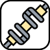&nbsp; <a href="images/iCons/WebSkills/fundamentals/the-browser/README.md">(+12)</a> | `16 Items` |
| [　　　┗ `testing`](images/iCons/WebSkills/testing/README.md) | &nbsp;&nbsp;&nbsp; <a href="images/iCons/WebSkills/testing/README.md">(+17)</a> | `21 Items` |
| [　　┗ `Webskills`](images/iCons/Webskills/README.md) | 📁 (導覽層) | - |
| [　　　┗ `Algorithms And Data Structures`](images/iCons/Webskills/Algorithms%20And%20Data%20Structures/README.md) | 📁 (導覽層) | - |
| [　　　　┗ `algorithms`](images/iCons/Webskills/Algorithms%20And%20Data%20Structures/algorithms/README.md) | &nbsp;&nbsp;&nbsp; <a href="images/iCons/Webskills/Algorithms%20And%20Data%20Structures/algorithms/README.md">(+8)</a> | `12 Items` |
| [　　　　┗ `analysis`](images/iCons/Webskills/Algorithms%20And%20Data%20Structures/analysis/README.md) | &nbsp;&nbsp;&nbsp; <a href="images/iCons/Webskills/Algorithms%20And%20Data%20Structures/analysis/README.md">(+1)</a> | `5 Items` |
| [　　　　┗ `data-structures`](images/iCons/Webskills/Algorithms%20And%20Data%20Structures/data-structures/README.md) | &nbsp;&nbsp;&nbsp; <a href="images/iCons/Webskills/Algorithms%20And%20Data%20Structures/data-structures/README.md">(+7)</a> | `11 Items` |
| [　　　┗ `Architecture And Paradigms`](images/iCons/Webskills/Architecture%20And%20Paradigms/README.md) | 📁 (導覽層) | - |
| [　　　　┗ `architecture`](images/iCons/Webskills/Architecture%20And%20Paradigms/architecture/README.md) | &nbsp;&nbsp;&nbsp; <a href="images/iCons/Webskills/Architecture%20And%20Paradigms/architecture/README.md">(+8)</a> | `12 Items` |
| [　　　　┗ `paradigms`](images/iCons/Webskills/Architecture%20And%20Paradigms/paradigms/README.md) | &nbsp;&nbsp;&nbsp; <a href="images/iCons/Webskills/Architecture%20And%20Paradigms/paradigms/README.md">(+4)</a> | `8 Items` |
| [　　　┗ `Build Tools`](images/iCons/Webskills/Build%20Tools/README.md) | &nbsp;&nbsp;&nbsp; <a href="images/iCons/Webskills/Build%20Tools/README.md">(+17)</a> | `21 Items` |
| [　　　┗ `Databases And Servers`](images/iCons/Webskills/Databases%20And%20Servers/README.md) | 📁 (導覽層) | - |
| [　　　　┗ `databases`](images/iCons/Webskills/Databases%20And%20Servers/databases/README.md) | &nbsp;&nbsp;&nbsp; <a href="images/iCons/Webskills/Databases%20And%20Servers/databases/README.md">(+19)</a> | `23 Items` |
| [　　　　┗ `servers`](images/iCons/Webskills/Databases%20And%20Servers/servers/README.md) | &nbsp;&nbsp;&nbsp; <a href="images/iCons/Webskills/Databases%20And%20Servers/servers/README.md">(+12)</a> | `16 Items` |
| [　　　┗ `Design And Ux`](images/iCons/Webskills/Design%20And%20Ux/README.md) | &nbsp;&nbsp;&nbsp; <a href="images/iCons/Webskills/Design%20And%20Ux/README.md">(+18)</a> | `22 Items` |
| [　　　┗ `Frameworks And Libraries`](images/iCons/Webskills/Frameworks%20And%20Libraries/README.md) | &nbsp;&nbsp;&nbsp; <a href="images/iCons/Webskills/Frameworks%20And%20Libraries/README.md">(+2)</a> | `6 Items` |
| [　　　┗ `Progressive Webapps`](images/iCons/Webskills/Progressive%20Webapps/README.md) | 📁 (導覽層) | - |
| [　　　　┗ `apis`](images/iCons/Webskills/Progressive%20Webapps/apis/README.md) | &nbsp;&nbsp;&nbsp; <a href="images/iCons/Webskills/Progressive%20Webapps/apis/README.md">(+6)</a> | `10 Items` |
| [　　　　┗ `audits`](images/iCons/Webskills/Progressive%20Webapps/audits/README.md) | &nbsp;&nbsp;  | `3 Items` |
| [　　　　┗ `loading-performance`](images/iCons/Webskills/Progressive%20Webapps/loading-performance/README.md) | &nbsp;&nbsp;&nbsp; <a href="images/iCons/Webskills/Progressive%20Webapps/loading-performance/README.md">(+14)</a> | `18 Items` |
| [　　　　┗ `rendering-performance`](images/iCons/Webskills/Progressive%20Webapps/rendering-performance/README.md) | &nbsp;&nbsp;&nbsp; <a href="images/iCons/Webskills/Progressive%20Webapps/rendering-performance/README.md">(+14)</a> | `18 Items` |
| [　　　　┗ `security`](images/iCons/Webskills/Progressive%20Webapps/security/README.md) | &nbsp;&nbsp;&nbsp; <a href="images/iCons/Webskills/Progressive%20Webapps/security/README.md">(+2)</a> | `6 Items` |
| [　　　┗ `Team Collaboration`](images/iCons/Webskills/Team%20Collaboration/README.md) | 📁 (導覽層) | - |
| [　　　　┗ `management`](images/iCons/Webskills/Team%20Collaboration/management/README.md) | &nbsp;&nbsp;&nbsp; <a href="images/iCons/Webskills/Team%20Collaboration/management/README.md">(+1)</a> | `5 Items` |
| [　　　　┗ `version-control`](images/iCons/Webskills/Team%20Collaboration/version-control/README.md) | &nbsp;&nbsp;  | `3 Items` |
| [　　　┗ `The Modern Web`](images/iCons/Webskills/The%20Modern%20Web/README.md) | &nbsp;&nbsp;&nbsp; <a href="images/iCons/Webskills/The%20Modern%20Web/README.md">(+41)</a> | `45 Items` |
| [　　　┗ `Web Components`](images/iCons/Webskills/Web%20Components/README.md) | &nbsp;&nbsp;&nbsp; <a href="images/iCons/Webskills/Web%20Components/README.md">(+4)</a> | `8 Items` |
| [　　┗ `Xnix iCon`](images/iCons/Xnix%20iCon/README.md) | &nbsp;&nbsp;&nbsp; <a href="images/iCons/Xnix%20iCon/README.md">(+539)</a> | `543 Items` |
| [　　┗ `Yandex Ui Filled iCons`](images/iCons/Yandex%20Ui%20Filled%20iCons/README.md) | &nbsp;&nbsp;&nbsp; <a href="images/iCons/Yandex%20Ui%20Filled%20iCons/README.md">(+136)</a> | `140 Items` |
| [　　┗ `iCon Park`](images/iCons/iCon%20Park/README.md) | &nbsp;&nbsp;&nbsp; <a href="images/iCons/iCon%20Park/README.md">(+2412)</a> | `2416 Items` |
| [　　┗ `iConbrew`](images/iCons/iConbrew/README.md) | &nbsp;&nbsp;&nbsp; <a href="images/iCons/iConbrew/README.md">(+1130)</a> | `1134 Items` |
| [　　　┗ `bg`](images/iCons/iConbrew/bg/README.md) | &nbsp;&nbsp;&nbsp; <a href="images/iCons/iConbrew/bg/README.md">(+356)</a> | `360 Items` |
| [　　┗ `iConly`](images/iCons/iConly/README.md) | 📁 (導覽層) | - |
| [　　┗ `iConly Negative Space iCons`](images/iCons/iConly%20Negative%20Space%20iCons/README.md) | &nbsp;&nbsp;&nbsp; <a href="images/iCons/iConly%20Negative%20Space%20iCons/README.md">(+11)</a> | `15 Items` |
| [　　　┗ `Curved`](images/iCons/iConly/Curved/README.md) | 📁 (導覽層) | - |
| [　　　　┗ `Bold`](images/iCons/iConly/Curved/Bold/README.md) | &nbsp;&nbsp;&nbsp; <a href="images/iCons/iConly/Curved/Bold/README.md">(+96)</a> | `100 Items` |
| [　　　　┗ `Broken`](images/iCons/iConly/Curved/Broken/README.md) | &nbsp;&nbsp;&nbsp; <a href="images/iCons/iConly/Curved/Broken/README.md">(+96)</a> | `100 Items` |
| [　　　　┗ `Bulk`](images/iCons/iConly/Curved/Bulk/README.md) | &nbsp;&nbsp;&nbsp; <a href="images/iCons/iConly/Curved/Bulk/README.md">(+96)</a> | `100 Items` |
| [　　　　┗ `Light`](images/iCons/iConly/Curved/Light/README.md) | &nbsp;&nbsp;&nbsp; <a href="images/iCons/iConly/Curved/Light/README.md">(+92)</a> | `96 Items` |
| [　　　　┗ `Outline`](images/iCons/iConly/Curved/Outline/README.md) | &nbsp;&nbsp;&nbsp; <a href="images/iCons/iConly/Curved/Outline/README.md">(+96)</a> | `100 Items` |
| [　　　　┗ `Two-tone`](images/iCons/iConly/Curved/Two-tone/README.md) | &nbsp;&nbsp;&nbsp; <a href="images/iCons/iConly/Curved/Two-tone/README.md">(+96)</a> | `100 Items` |
| [　　　┗ `Regular`](images/iCons/iConly/Regular/README.md) | 📁 (導覽層) | - |
| [　　　　┗ `Bold`](images/iCons/iConly/Regular/Bold/README.md) | &nbsp;&nbsp;&nbsp; <a href="images/iCons/iConly/Regular/Bold/README.md">(+95)</a> | `99 Items` |
| [　　　　┗ `Broken`](images/iCons/iConly/Regular/Broken/README.md) | &nbsp;&nbsp;&nbsp; <a href="images/iCons/iConly/Regular/Broken/README.md">(+96)</a> | `100 Items` |
| [　　　　┗ `Bulk`](images/iCons/iConly/Regular/Bulk/README.md) | &nbsp;&nbsp;&nbsp; <a href="images/iCons/iConly/Regular/Bulk/README.md">(+96)</a> | `100 Items` |
| [　　　　┗ `Light`](images/iCons/iConly/Regular/Light/README.md) | &nbsp;&nbsp;&nbsp; <a href="images/iCons/iConly/Regular/Light/README.md">(+90)</a> | `94 Items` |
| [　　　　┗ `Outline`](images/iCons/iConly/Regular/Outline/README.md) | &nbsp;&nbsp;&nbsp; <a href="images/iCons/iConly/Regular/Outline/README.md">(+96)</a> | `100 Items` |
| [　　　　┗ `Two-tone`](images/iCons/iConly/Regular/Two-tone/README.md) | &nbsp;&nbsp;&nbsp; <a href="images/iCons/iConly/Regular/Two-tone/README.md">(+96)</a> | `100 Items` |
| [　　　┗ `Sharp`](images/iCons/iConly/Sharp/README.md) | 📁 (導覽層) | - |
| [　　　　┗ `Bold`](images/iCons/iConly/Sharp/Bold/README.md) | &nbsp;&nbsp;&nbsp; <a href="images/iCons/iConly/Sharp/Bold/README.md">(+121)</a> | `125 Items` |
| [　　　　┗ `Broken`](images/iCons/iConly/Sharp/Broken/README.md) | &nbsp;&nbsp;&nbsp; <a href="images/iCons/iConly/Sharp/Broken/README.md">(+116)</a> | `120 Items` |
| [　　　　┗ `Bulk`](images/iCons/iConly/Sharp/Bulk/README.md) | &nbsp;&nbsp;&nbsp; <a href="images/iCons/iConly/Sharp/Bulk/README.md">(+121)</a> | `125 Items` |
| [　　　　┗ `Light`](images/iCons/iConly/Sharp/Light/README.md) | &nbsp;&nbsp;&nbsp; <a href="images/iCons/iConly/Sharp/Light/README.md">(+120)</a> | `124 Items` |
| [　　　　┗ `Outline`](images/iCons/iConly/Sharp/Outline/README.md) | &nbsp;&nbsp;&nbsp; <a href="images/iCons/iConly/Sharp/Outline/README.md">(+121)</a> | `125 Items` |
| [　　　　┗ `Two-tone`](images/iCons/iConly/Sharp/Two-tone/README.md) | &nbsp;&nbsp;&nbsp; <a href="images/iCons/iConly/Sharp/Two-tone/README.md">(+121)</a> | `125 Items` |
| [　　┗ `iConos Ikon`](images/iCons/iConos%20Ikon/README.md) | &nbsp;&nbsp;&nbsp; <a href="images/iCons/iConos%20Ikon/README.md">(+732)</a> | `736 Items` |
<!-- thumbnails-end -->

---
*Last Sync: 2026-02-27 04:47*