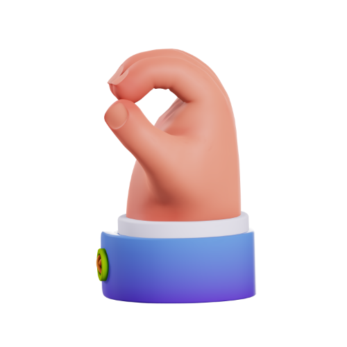
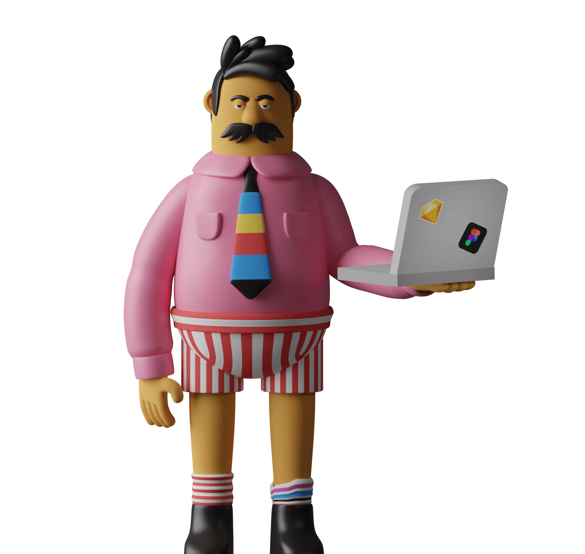
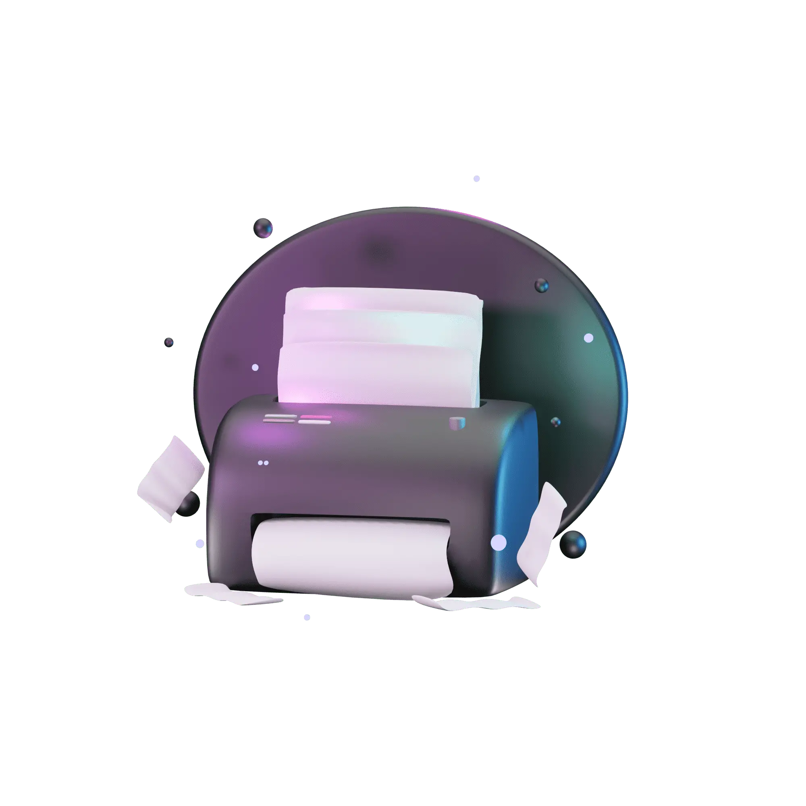
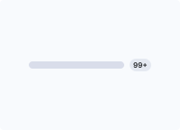
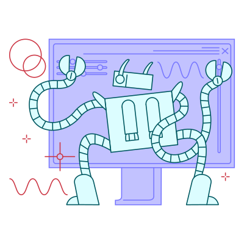
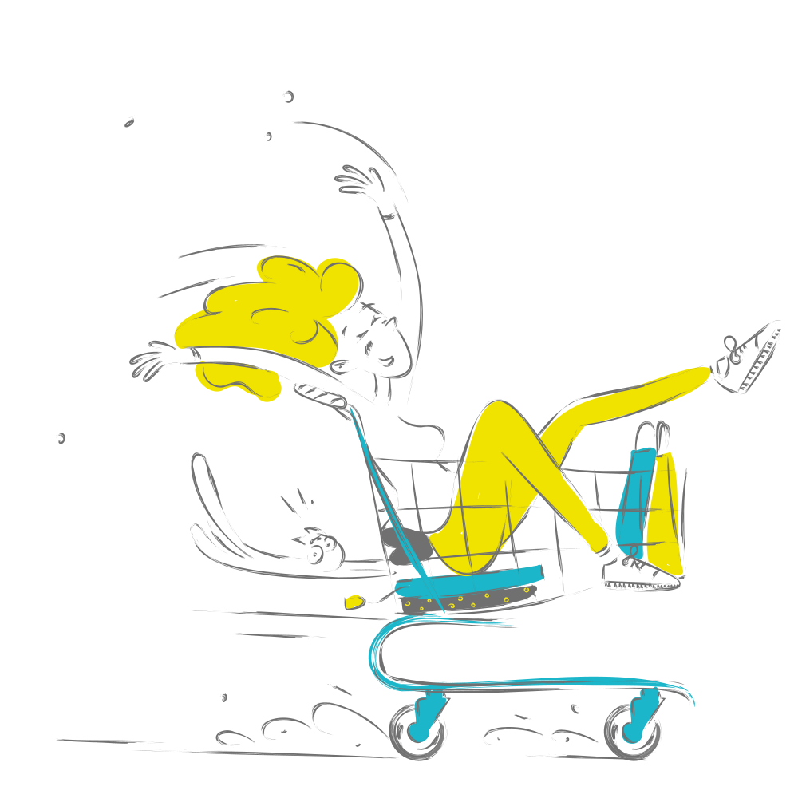
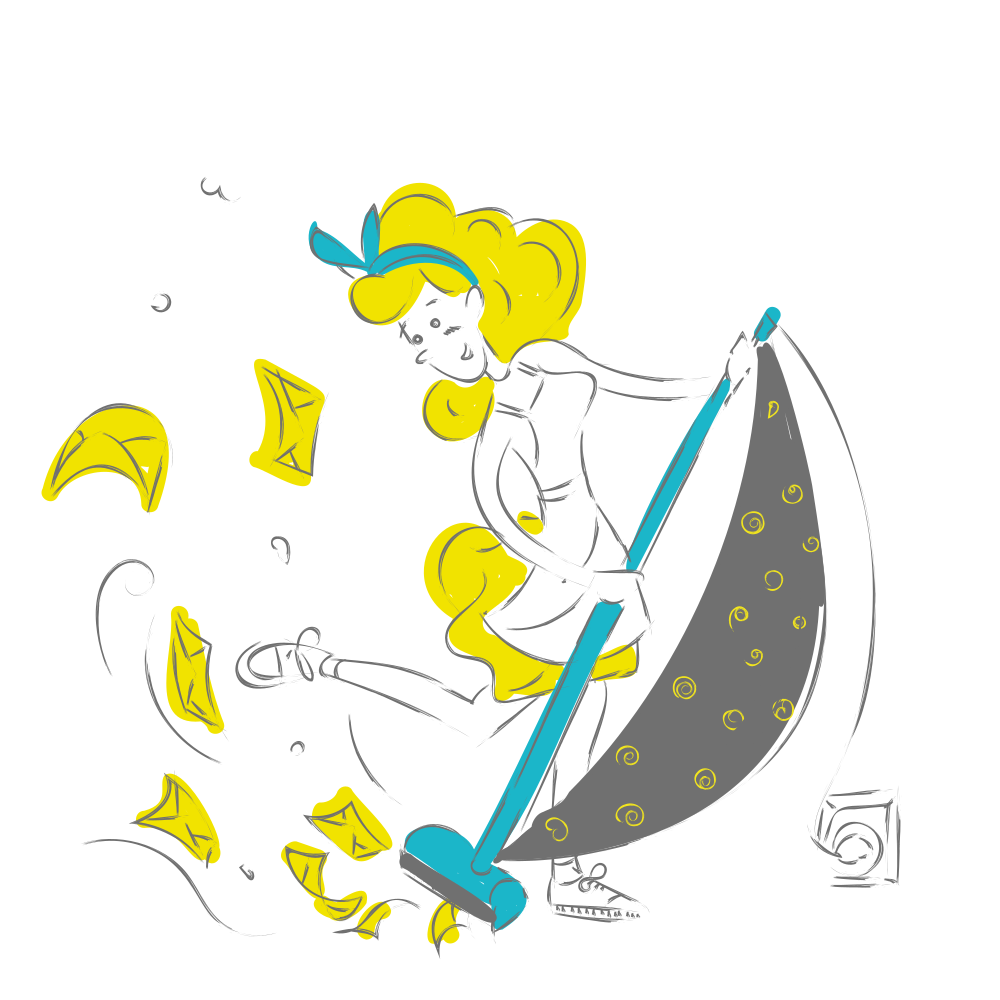
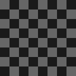

# 🎨 我的設計素材庫
這是一個全自動更新的素材導覽。

<!-- thumbnails-start -->
## 📂 素材目錄樹狀導覽

| 目錄路徑 | 封面預覽 | 統計 |
| :--- | :---: | :---: |
| 　┗ `3Ds` | 📁 (資料夾) | - |
| [　　┗ `3D_Avatars`](images/3Ds/3D_Avatars/README.md) | <a href="images/3Ds/3D_Avatars/README.md" style="white-space:nowrap;">+16</a>  | `21 Items` |
| [　　┗ `3D_CharacterNurse`](images/3Ds/3D_CharacterNurse/README.md) | <a href="images/3Ds/3D_CharacterNurse/README.md" style="white-space:nowrap;">+25</a>  | `30 Items` |
| [　　┗ `3D_Ecommercia`](images/3Ds/3D_Ecommercia/README.md) | <a href="images/3Ds/3D_Ecommercia/README.md" style="white-space:nowrap;">+24</a>  | `29 Items` |
| [　　┗ `3D_Education`](images/3Ds/3D_Education/README.md) | <a href="images/3Ds/3D_Education/README.md" style="white-space:nowrap;">+17</a>  | `22 Items` |
| [　　┗ `3D_Educations`](images/3Ds/3D_Educations/README.md) | <a href="images/3Ds/3D_Educations/README.md" style="white-space:nowrap;">+35</a>  | `40 Items` |
| [　　┗ `3D_Emojis`](images/3Ds/3D_Emojis/README.md) | <a href="images/3Ds/3D_Emojis/README.md" style="white-space:nowrap;">+20</a>  | `25 Items` |
| [　　┗ `3D_EmojisGestures`](images/3Ds/3D_EmojisGestures/README.md) | <a href="images/3Ds/3D_EmojisGestures/README.md" style="white-space:nowrap;">+28</a>  | `33 Items` |
| [　　┗ `3D_Finacially`](images/3Ds/3D_Finacially/README.md) | <a href="images/3Ds/3D_Finacially/README.md" style="white-space:nowrap;">+71</a>  | `76 Items` |
| [　　┗ `3D_Hands`](images/3Ds/3D_Hands/README.md) |   | `2 Items` |
| [　　┗ `3D_Heros`](images/3Ds/3D_Heros/README.md) | <a href="images/3Ds/3D_Heros/README.md" style="white-space:nowrap;">+19</a>  | `24 Items` |
| [　　┗ `3D_Illustration-Nikuu`](images/3Ds/3D_Illustration-Nikuu/README.md) | <a href="images/3Ds/3D_Illustration-Nikuu/README.md" style="white-space:nowrap;">+38</a>  | `43 Items` |
| [　　┗ `3D_Illustration-Saly`](images/3Ds/3D_Illustration-Saly/README.md) | <a href="images/3Ds/3D_Illustration-Saly/README.md" style="white-space:nowrap;">+85</a>  | `90 Items` |
| [　　┗ `3D_Illustration-V1`](images/3Ds/3D_Illustration-V1/README.md) | <a href="images/3Ds/3D_Illustration-V1/README.md" style="white-space:nowrap;">+1</a>  | `6 Items` |
| [　　┗ `3D_Illustration-V2`](images/3Ds/3D_Illustration-V2/README.md) | <a href="images/3Ds/3D_Illustration-V2/README.md" style="white-space:nowrap;">+115</a>  | `120 Items` |
| [　　┗ `3D_Web-V1`](images/3Ds/3D_Web-V1/README.md) | <a href="images/3Ds/3D_Web-V1/README.md" style="white-space:nowrap;">+35</a>  | `40 Items` |
| [　　┗ `3D_Web-V2`](images/3Ds/3D_Web-V2/README.md) | <a href="images/3Ds/3D_Web-V2/README.md" style="white-space:nowrap;">+35</a>  | `40 Items` |
| [　┗ `Animations`](images/Animations/README.md) | <a href="images/Animations/README.md" style="white-space:nowrap;">+32</a>  | `37 Items` |
| [　┗ `DesignSystem`](images/DesignSystem/README.md) | <a href="images/DesignSystem/README.md" style="white-space:nowrap;">+66</a>  | `71 Items` |
| [　　┗ `Components`](images/DesignSystem/Components/README.md) |   | `2 Items` |
| 　　┗ `DesignSystemiCons` | 📁 (資料夾) | - |
| [　　　┗ `Guideline-iCon`](images/DesignSystem/DesignSystemiCons/Guideline-iCon/README.md) | <a href="images/DesignSystem/DesignSystemiCons/Guideline-iCon/README.md" style="white-space:nowrap;">+2</a>  | `7 Items` |
| [　　　┗ `Square-iCon`](images/DesignSystem/DesignSystemiCons/Square-iCon/README.md) | <a href="images/DesignSystem/DesignSystemiCons/Square-iCon/README.md" style="white-space:nowrap;">+82</a>  | `87 Items` |
| 　┗ `Dicebear` | 📁 (資料夾) | - |
| [　　┗ `Adventurer`](images/Dicebear/Adventurer/README.md) | <a href="images/Dicebear/Adventurer/README.md" style="white-space:nowrap;">+18</a>  | `23 Items` |
| [　　┗ `Adventurer Neutral `](images/Dicebear/Adventurer%20Neutral%20/README.md) | <a href="images/Dicebear/Adventurer%20Neutral%20/README.md" style="white-space:nowrap;">+15</a>  | `20 Items` |
| [　　┗ `Avataaars `](images/Dicebear/Avataaars%20/README.md) | <a href="images/Dicebear/Avataaars%20/README.md" style="white-space:nowrap;">+15</a>  | `20 Items` |
| [　　┗ `Avataaars Neutral `](images/Dicebear/Avataaars%20Neutral%20/README.md) | <a href="images/Dicebear/Avataaars%20Neutral%20/README.md" style="white-space:nowrap;">+15</a>  | `20 Items` |
| [　　┗ `Big Ears `](images/Dicebear/Big%20Ears%20/README.md) | <a href="images/Dicebear/Big%20Ears%20/README.md" style="white-space:nowrap;">+15</a>  | `20 Items` |
| [　　┗ `Big Ears Neutral `](images/Dicebear/Big%20Ears%20Neutral%20/README.md) | <a href="images/Dicebear/Big%20Ears%20Neutral%20/README.md" style="white-space:nowrap;">+15</a>  | `20 Items` |
| [　　┗ `Big Smile `](images/Dicebear/Big%20Smile%20/README.md) | <a href="images/Dicebear/Big%20Smile%20/README.md" style="white-space:nowrap;">+15</a>  | `20 Items` |
| [　　┗ `Bottts `](images/Dicebear/Bottts%20/README.md) | <a href="images/Dicebear/Bottts%20/README.md" style="white-space:nowrap;">+15</a>  | `20 Items` |
| [　　┗ `Bottts Neutral `](images/Dicebear/Bottts%20Neutral%20/README.md) | <a href="images/Dicebear/Bottts%20Neutral%20/README.md" style="white-space:nowrap;">+15</a>  | `20 Items` |
| [　　┗ `Croodles `](images/Dicebear/Croodles%20/README.md) | <a href="images/Dicebear/Croodles%20/README.md" style="white-space:nowrap;">+15</a>  | `20 Items` |
| [　　┗ `Croodles Netral `](images/Dicebear/Croodles%20Netral%20/README.md) | <a href="images/Dicebear/Croodles%20Netral%20/README.md" style="white-space:nowrap;">+15</a>  | `20 Items` |
| [　　┗ `Dylan `](images/Dicebear/Dylan%20/README.md) | <a href="images/Dicebear/Dylan%20/README.md" style="white-space:nowrap;">+14</a>  | `19 Items` |
| [　　┗ `Fun Emoji `](images/Dicebear/Fun%20Emoji%20/README.md) | <a href="images/Dicebear/Fun%20Emoji%20/README.md" style="white-space:nowrap;">+15</a>  | `20 Items` |
| [　　┗ `Glass `](images/Dicebear/Glass%20/README.md) | <a href="images/Dicebear/Glass%20/README.md" style="white-space:nowrap;">+15</a>  | `20 Items` |
| [　　┗ `Identicon `](images/Dicebear/Identicon%20/README.md) | <a href="images/Dicebear/Identicon%20/README.md" style="white-space:nowrap;">+15</a>  | `20 Items` |
| [　　┗ `Lorelei `](images/Dicebear/Lorelei%20/README.md) | <a href="images/Dicebear/Lorelei%20/README.md" style="white-space:nowrap;">+15</a>  | `20 Items` |
| [　　┗ `Lorelei Netral `](images/Dicebear/Lorelei%20Netral%20/README.md) | <a href="images/Dicebear/Lorelei%20Netral%20/README.md" style="white-space:nowrap;">+15</a>  | `20 Items` |
| [　　┗ `Micah `](images/Dicebear/Micah%20/README.md) | <a href="images/Dicebear/Micah%20/README.md" style="white-space:nowrap;">+15</a>  | `20 Items` |
| [　　┗ `Miniavs `](images/Dicebear/Miniavs%20/README.md) | <a href="images/Dicebear/Miniavs%20/README.md" style="white-space:nowrap;">+15</a>  | `20 Items` |
| [　　┗ `Notionists `](images/Dicebear/Notionists%20/README.md) | <a href="images/Dicebear/Notionists%20/README.md" style="white-space:nowrap;">+12</a>  | `17 Items` |
| [　　┗ `Notionists Netral `](images/Dicebear/Notionists%20Netral%20/README.md) | <a href="images/Dicebear/Notionists%20Netral%20/README.md" style="white-space:nowrap;">+15</a>  | `20 Items` |
| [　　┗ `Openpeeps `](images/Dicebear/Openpeeps%20/README.md) | <a href="images/Dicebear/Openpeeps%20/README.md" style="white-space:nowrap;">+15</a>  | `20 Items` |
| [　　┗ `Personas `](images/Dicebear/Personas%20/README.md) | <a href="images/Dicebear/Personas%20/README.md" style="white-space:nowrap;">+15</a>  | `20 Items` |
| [　　┗ `Pixelart `](images/Dicebear/Pixelart%20/README.md) | <a href="images/Dicebear/Pixelart%20/README.md" style="white-space:nowrap;">+15</a>  | `20 Items` |
| [　　┗ `Pixelart Netral `](images/Dicebear/Pixelart%20Netral%20/README.md) | <a href="images/Dicebear/Pixelart%20Netral%20/README.md" style="white-space:nowrap;">+15</a>  | `20 Items` |
| [　　┗ `Shapes `](images/Dicebear/Shapes%20/README.md) | <a href="images/Dicebear/Shapes%20/README.md" style="white-space:nowrap;">+15</a>  | `20 Items` |
| [　　┗ `Thumbs `](images/Dicebear/Thumbs%20/README.md) | <a href="images/Dicebear/Thumbs%20/README.md" style="white-space:nowrap;">+14</a>  | `19 Items` |
| [　　┗ `Toonhead `](images/Dicebear/Toonhead%20/README.md) | <a href="images/Dicebear/Toonhead%20/README.md" style="white-space:nowrap;">+15</a>  | `20 Items` |
| [　┗ `FontStyles`](images/FontStyles/README.md) | <a href="images/FontStyles/README.md" style="white-space:nowrap;">+18</a>  | `23 Items` |
| 　┗ `Illustrations` | 📁 (資料夾) | - |
| 　　┗ `AmazingCatIllustrations` | 📁 (資料夾) | - |
| [　　　┗ `SVG`](images/Illustrations/AmazingCatIllustrations/SVG/README.md) | <a href="images/Illustrations/AmazingCatIllustrations/SVG/README.md" style="white-space:nowrap;">+15</a>  | `20 Items` |
| [　　┗ `Byte Dance`](images/Illustrations/Byte%20Dance/README.md) | <a href="images/Illustrations/Byte%20Dance/README.md" style="white-space:nowrap;">+10</a>  | `15 Items` |
| 　　┗ `Circuitill` | 📁 (資料夾) | - |
| [　　　┗ `SVG`](images/Illustrations/Circuitill/SVG/README.md) | <a href="images/Illustrations/Circuitill/SVG/README.md" style="white-space:nowrap;">+24</a>  | `29 Items` |
| [　　┗ `CorporateScenesillustrationOctetDesignStudio`](images/Illustrations/CorporateScenesillustrationOctetDesignStudio/README.md) |   | `1 Items` |
| [　　┗ `DeskDudes-illustration`](images/Illustrations/DeskDudes-illustration/README.md) | <a href="images/Illustrations/DeskDudes-illustration/README.md" style="white-space:nowrap;">+15</a>  | `20 Items` |
| [　　┗ `DoozyProSvg`](images/Illustrations/DoozyProSvg/README.md) | <a href="images/Illustrations/DoozyProSvg/README.md" style="white-space:nowrap;">+15</a>  | `20 Items` |
| [　　┗ `ErrorStateillustrationsPixelTrue`](images/Illustrations/ErrorStateillustrationsPixelTrue/README.md) | <a href="images/Illustrations/ErrorStateillustrationsPixelTrue/README.md" style="white-space:nowrap;">+25</a>  | `30 Items` |
| [　　┗ `GrowwwKit 01`](images/Illustrations/GrowwwKit%2001/README.md) | <a href="images/Illustrations/GrowwwKit%2001/README.md" style="white-space:nowrap;">+3</a>  | `8 Items` |
| [　　┗ `GrowwwKit 02`](images/Illustrations/GrowwwKit%2002/README.md) | <a href="images/Illustrations/GrowwwKit%2002/README.md" style="white-space:nowrap;">+7</a>  | `12 Items` |
| 　　┗ `Life & Work Flat` | 📁 (資料夾) | - |
| [　　　┗ `Business Team`](images/Illustrations/Life%20%26%20Work%20Flat/Business%20Team/README.md) | <a href="images/Illustrations/Life%20%26%20Work%20Flat/Business%20Team/README.md" style="white-space:nowrap;">+4</a>  | `9 Items` |
| [　　　┗ `Discover`](images/Illustrations/Life%20%26%20Work%20Flat/Discover/README.md) |   | `5 Items` |
| [　　　┗ `Dolty Christmas`](images/Illustrations/Life%20%26%20Work%20Flat/Dolty%20Christmas/README.md) | <a href="images/Illustrations/Life%20%26%20Work%20Flat/Dolty%20Christmas/README.md" style="white-space:nowrap;">+10</a>  | `15 Items` |
| [　　　┗ `Education & E-Learning`](images/Illustrations/Life%20%26%20Work%20Flat/Education%20%26%20E-Learning/README.md) | <a href="images/Illustrations/Life%20%26%20Work%20Flat/Education%20%26%20E-Learning/README.md" style="white-space:nowrap;">+6</a>  | `11 Items` |
| [　　　┗ `Emotration`](images/Illustrations/Life%20%26%20Work%20Flat/Emotration/README.md) | <a href="images/Illustrations/Life%20%26%20Work%20Flat/Emotration/README.md" style="white-space:nowrap;">+4</a>  | `9 Items` |
| [　　　┗ `Frosty`](images/Illustrations/Life%20%26%20Work%20Flat/Frosty/README.md) | <a href="images/Illustrations/Life%20%26%20Work%20Flat/Frosty/README.md" style="white-space:nowrap;">+7</a>  | `12 Items` |
| [　　　┗ `Her adventure`](images/Illustrations/Life%20%26%20Work%20Flat/Her%20adventure/README.md) | <a href="images/Illustrations/Life%20%26%20Work%20Flat/Her%20adventure/README.md" style="white-space:nowrap;">+1</a>  | `6 Items` |
| [　　　┗ `Merry`](images/Illustrations/Life%20%26%20Work%20Flat/Merry/README.md) | <a href="images/Illustrations/Life%20%26%20Work%20Flat/Merry/README.md" style="white-space:nowrap;">+7</a>  | `12 Items` |
| [　　　┗ `Peace StopWar`](images/Illustrations/Life%20%26%20Work%20Flat/Peace%20StopWar/README.md) |   | `2 Items` |
| [　　　┗ `Rock inaround`](images/Illustrations/Life%20%26%20Work%20Flat/Rock%20inaround/README.md) | <a href="images/Illustrations/Life%20%26%20Work%20Flat/Rock%20inaround/README.md" style="white-space:nowrap;">+5</a>  | `10 Items` |
| [　　　┗ `Travel`](images/Illustrations/Life%20%26%20Work%20Flat/Travel/README.md) | <a href="images/Illustrations/Life%20%26%20Work%20Flat/Travel/README.md" style="white-space:nowrap;">+5</a>  | `10 Items` |
| [　　　┗ `Virtual Reality`](images/Illustrations/Life%20%26%20Work%20Flat/Virtual%20Reality/README.md) | <a href="images/Illustrations/Life%20%26%20Work%20Flat/Virtual%20Reality/README.md" style="white-space:nowrap;">+5</a>  | `10 Items` |
| [　　┗ `SigmaProSvg`](images/Illustrations/SigmaProSvg/README.md) |   | `4 Items` |
| [　　┗ `SketchyProSvg`](images/Illustrations/SketchyProSvg/README.md) | <a href="images/Illustrations/SketchyProSvg/README.md" style="white-space:nowrap;">+16</a>  | `21 Items` |
| [　　┗ `Social Media Marketing Illustratio`](images/Illustrations/Social%20Media%20Marketing%20Illustratio/README.md) | <a href="images/Illustrations/Social%20Media%20Marketing%20Illustratio/README.md" style="white-space:nowrap;">+7</a>  | `12 Items` |
| [　　┗ `Workspace Activity`](images/Illustrations/Workspace%20Activity/README.md) | <a href="images/Illustrations/Workspace%20Activity/README.md" style="white-space:nowrap;">+7</a>  | `12 Items` |
| [　　┗ `illustrations-Simplicity`](images/Illustrations/illustrations-Simplicity/README.md) | <a href="images/Illustrations/illustrations-Simplicity/README.md" style="white-space:nowrap;">+27</a>  | `32 Items` |
| [　　　┗ `Bgs`](images/Illustrations/illustrations-Simplicity/Bgs/README.md) | <a href="images/Illustrations/illustrations-Simplicity/Bgs/README.md" style="white-space:nowrap;">+93</a>  | `98 Items` |
| 　┗ `Resumes` | 📁 (資料夾) | - |
| [　　┗ `Backgrounds`](images/Resumes/Backgrounds/README.md) |   | `4 Items` |
| [　　┗ `BarrY`](images/Resumes/BarrY/README.md) | <a href="images/Resumes/BarrY/README.md" style="white-space:nowrap;">+6</a>  | `11 Items` |
| [　　┗ `Px-Cursots`](images/Resumes/Px-Cursots/README.md) | <a href="images/Resumes/Px-Cursots/README.md" style="white-space:nowrap;">+2</a>  | `7 Items` |
| [　　┗ `Px-Group`](images/Resumes/Px-Group/README.md) | <a href="images/Resumes/Px-Group/README.md" style="white-space:nowrap;">+666</a>  | `671 Items` |
| [　┗ `Svg-Samples`](images/Svg-Samples/README.md) |   | `1 Items` |
| [　　┗ `Brands`](images/Svg-Samples/Brands/README.md) |   | `4 Items` |
| [　　┗ `Patterns`](images/Svg-Samples/Patterns/README.md) | <a href="images/Svg-Samples/Patterns/README.md" style="white-space:nowrap;">+15</a>  | `20 Items` |
| [　　┗ `Prints`](images/Svg-Samples/Prints/README.md) |   | `3 Items` |
| [　　┗ `Ui`](images/Svg-Samples/Ui/README.md) |   | `4 Items` |
| [　┗ `Svgs`](images/Svgs/README.md) |   | `2 Items` |
| [　┗ `Ux-meme`](images/Ux-meme/README.md) |   | `4 Items` |
| 　┗ `iCons` | 📁 (資料夾) | - |
| 　　┗ `3D Hand Emojis` | 📁 (資料夾) | - |
| [　　　┗ `Black`](images/iCons/3D%20Hand%20Emojis/Black/README.md) | <a href="images/iCons/3D%20Hand%20Emojis/Black/README.md" style="white-space:nowrap;">+27</a>  | `32 Items` |
| [　　　┗ `Default`](images/iCons/3D%20Hand%20Emojis/Default/README.md) | <a href="images/iCons/3D%20Hand%20Emojis/Default/README.md" style="white-space:nowrap;">+26</a>  | `31 Items` |
| [　　　┗ `Light`](images/iCons/3D%20Hand%20Emojis/Light/README.md) | <a href="images/iCons/3D%20Hand%20Emojis/Light/README.md" style="white-space:nowrap;">+26</a>  | `31 Items` |
| [　　┗ `AdobeCreativeSoftwareiiCons`](images/iCons/AdobeCreativeSoftwareiiCons/README.md) | <a href="images/iCons/AdobeCreativeSoftwareiiCons/README.md" style="white-space:nowrap;">+22</a>  | `27 Items` |
| [　　┗ `Ai Icons Text And Image Generation`](images/iCons/Ai%20Icons%20Text%20And%20Image%20Generation/README.md) | <a href="images/iCons/Ai%20Icons%20Text%20And%20Image%20Generation/README.md" style="white-space:nowrap;">+77</a>  | `82 Items` |
| [　　┗ `Brands`](images/iCons/Brands/README.md) | <a href="images/iCons/Brands/README.md" style="white-space:nowrap;">+1747</a>  | `1752 Items` |
| [　　　┗ `App`](images/iCons/Brands/App/README.md) |   | `1 Items` |
| 　　　┗ `County` | 📁 (資料夾) | - |
| [　　　　┗ `Flags`](images/iCons/Brands/County/Flags/README.md) |   | `1 Items` |
| [　　　　┗ `flagSq`](images/iCons/Brands/County/flagSq/README.md) | <a href="images/iCons/Brands/County/flagSq/README.md" style="white-space:nowrap;">+16</a>  | `21 Items` |
| [　　┗ `Browsers`](images/iCons/Browsers/README.md) | <a href="images/iCons/Browsers/README.md" style="white-space:nowrap;">+13</a>  | `18 Items` |
| [　　┗ `CRM`](images/iCons/CRM/README.md) | <a href="images/iCons/CRM/README.md" style="white-space:nowrap;">+180</a>  | `185 Items` |
| 　　┗ `CandyiCons` | 📁 (資料夾) | - |
| [　　　┗ `apps`](images/iCons/CandyiCons/apps/README.md) | <a href="images/iCons/CandyiCons/apps/README.md" style="white-space:nowrap;">+546</a>  | `551 Items` |
| [　　　┗ `devices`](images/iCons/CandyiCons/devices/README.md) | <a href="images/iCons/CandyiCons/devices/README.md" style="white-space:nowrap;">+7</a>  | `12 Items` |
| [　　　┗ `mimetypes`](images/iCons/CandyiCons/mimetypes/README.md) | <a href="images/iCons/CandyiCons/mimetypes/README.md" style="white-space:nowrap;">+27</a>  | `32 Items` |
| 　　　┗ `places` | 📁 (資料夾) | - |
| [　　　　┗ `16`](images/iCons/CandyiCons/places/16/README.md) | <a href="images/iCons/CandyiCons/places/16/README.md" style="white-space:nowrap;">+41</a>  | `46 Items` |
| [　　　　┗ `48`](images/iCons/CandyiCons/places/48/README.md) |   | `1 Items` |
| [　　　┗ `preferences`](images/iCons/CandyiCons/preferences/README.md) | <a href="images/iCons/CandyiCons/preferences/README.md" style="white-space:nowrap;">+18</a>  | `23 Items` |
| 　　┗ `CapitaineCursors` | 📁 (資料夾) | - |
| [　　　┗ `Dark`](images/iCons/CapitaineCursors/Dark/README.md) | <a href="images/iCons/CapitaineCursors/Dark/README.md" style="white-space:nowrap;">+89</a>  | `94 Items` |
| [　　　┗ `Light`](images/iCons/CapitaineCursors/Light/README.md) | <a href="images/iCons/CapitaineCursors/Light/README.md" style="white-space:nowrap;">+13</a>  | `18 Items` |
| 　　┗ `Circum` | 📁 (資料夾) | - |
| [　　　┗ `Communication`](images/iCons/Circum/Communication/README.md) | <a href="images/iCons/Circum/Communication/README.md" style="white-space:nowrap;">+11</a>  | `16 Items` |
| [　　　┗ `Design`](images/iCons/Circum/Design/README.md) | <a href="images/iCons/Circum/Design/README.md" style="white-space:nowrap;">+9</a>  | `14 Items` |
| [　　　┗ `Devices & Electronics`](images/iCons/Circum/Devices%20%26%20Electronics/README.md) | <a href="images/iCons/Circum/Devices%20%26%20Electronics/README.md" style="white-space:nowrap;">+31</a>  | `36 Items` |
| [　　　┗ `Finances & Payments`](images/iCons/Circum/Finances%20%26%20Payments/README.md) | <a href="images/iCons/Circum/Finances%20%26%20Payments/README.md" style="white-space:nowrap;">+10</a>  | `15 Items` |
| [　　　┗ `Food & Drinks`](images/iCons/Circum/Food%20%26%20Drinks/README.md) | <a href="images/iCons/Circum/Food%20%26%20Drinks/README.md" style="white-space:nowrap;">+6</a>  | `11 Items` |
| [　　　┗ `Formattings`](images/iCons/Circum/Formattings/README.md) | <a href="images/iCons/Circum/Formattings/README.md" style="white-space:nowrap;">+3</a>  | `8 Items` |
| [　　　┗ `Media Controls`](images/iCons/Circum/Media%20Controls/README.md) | <a href="images/iCons/Circum/Media%20Controls/README.md" style="white-space:nowrap;">+6</a>  | `11 Items` |
| [　　　┗ `Navigations & Travels`](images/iCons/Circum/Navigations%20%26%20Travels/README.md) | <a href="images/iCons/Circum/Navigations%20%26%20Travels/README.md" style="white-space:nowrap;">+12</a>  | `17 Items` |
| [　　　┗ `Shopping & Ecommerce`](images/iCons/Circum/Shopping%20%26%20Ecommerce/README.md) | <a href="images/iCons/Circum/Shopping%20%26%20Ecommerce/README.md" style="white-space:nowrap;">+5</a>  | `10 Items` |
| [　　　┗ `User Interface`](images/iCons/Circum/User%20Interface/README.md) | <a href="images/iCons/Circum/User%20Interface/README.md" style="white-space:nowrap;">+1</a>  | `6 Items` |
| [　　　┗ `Weather`](images/iCons/Circum/Weather/README.md) | <a href="images/iCons/Circum/Weather/README.md" style="white-space:nowrap;">+4</a>  | `9 Items` |
| [　　┗ `Company `](images/iCons/Company%20/README.md) | <a href="images/iCons/Company%20/README.md" style="white-space:nowrap;">+76</a>  | `81 Items` |
| 　　┗ `Coolicons ` | 📁 (資料夾) | - |
| [　　　┗ `Arrow`](images/iCons/Coolicons%20/Arrow/README.md) | <a href="images/iCons/Coolicons%20/Arrow/README.md" style="white-space:nowrap;">+67</a>  | `72 Items` |
| [　　　┗ `Calendar`](images/iCons/Coolicons%20/Calendar/README.md) | <a href="images/iCons/Coolicons%20/Calendar/README.md" style="white-space:nowrap;">+9</a>  | `14 Items` |
| [　　　┗ `Communication`](images/iCons/Coolicons%20/Communication/README.md) | <a href="images/iCons/Coolicons%20/Communication/README.md" style="white-space:nowrap;">+20</a>  | `25 Items` |
| [　　　┗ `Edit`](images/iCons/Coolicons%20/Edit/README.md) | <a href="images/iCons/Coolicons%20/Edit/README.md" style="white-space:nowrap;">+67</a>  | `72 Items` |
| [　　　┗ `Environment`](images/iCons/Coolicons%20/Environment/README.md) | <a href="images/iCons/Coolicons%20/Environment/README.md" style="white-space:nowrap;">+8</a>  | `13 Items` |
| [　　　┗ `File`](images/iCons/Coolicons%20/File/README.md) | <a href="images/iCons/Coolicons%20/File/README.md" style="white-space:nowrap;">+34</a>  | `39 Items` |
| [　　　┗ `Interface`](images/iCons/Coolicons%20/Interface/README.md) | <a href="images/iCons/Coolicons%20/Interface/README.md" style="white-space:nowrap;">+68</a>  | `73 Items` |
| [　　　┗ `Media`](images/iCons/Coolicons%20/Media/README.md) | <a href="images/iCons/Coolicons%20/Media/README.md" style="white-space:nowrap;">+17</a>  | `22 Items` |
| [　　　┗ `Menu`](images/iCons/Coolicons%20/Menu/README.md) | <a href="images/iCons/Coolicons%20/Menu/README.md" style="white-space:nowrap;">+11</a>  | `16 Items` |
| [　　　┗ `Navigation`](images/iCons/Coolicons%20/Navigation/README.md) | <a href="images/iCons/Coolicons%20/Navigation/README.md" style="white-space:nowrap;">+13</a>  | `18 Items` |
| [　　　┗ `Shape`](images/iCons/Coolicons%20/Shape/README.md) | <a href="images/iCons/Coolicons%20/Shape/README.md" style="white-space:nowrap;">+1</a>  | `6 Items` |
| [　　　┗ `System`](images/iCons/Coolicons%20/System/README.md) | <a href="images/iCons/Coolicons%20/System/README.md" style="white-space:nowrap;">+32</a>  | `37 Items` |
| [　　　┗ `User`](images/iCons/Coolicons%20/User/README.md) | <a href="images/iCons/Coolicons%20/User/README.md" style="white-space:nowrap;">+8</a>  | `13 Items` |
| [　　　┗ `Warning`](images/iCons/Coolicons%20/Warning/README.md) | <a href="images/iCons/Coolicons%20/Warning/README.md" style="white-space:nowrap;">+15</a>  | `20 Items` |
| 　　┗ `Cryptocurrency ` | 📁 (資料夾) | - |
| [　　　┗ `Cryptocurrency`](images/iCons/Cryptocurrency%20/Cryptocurrency/README.md) | <a href="images/iCons/Cryptocurrency%20/Cryptocurrency/README.md" style="white-space:nowrap;">+218</a>  | `223 Items` |
| [　　　┗ `Cryptocurrency 2`](images/iCons/Cryptocurrency%20/Cryptocurrency%202/README.md) | <a href="images/iCons/Cryptocurrency%20/Cryptocurrency%202/README.md" style="white-space:nowrap;">+215</a>  | `220 Items` |
| [　　　┗ `Cryptocurrency 3`](images/iCons/Cryptocurrency%20/Cryptocurrency%203/README.md) | <a href="images/iCons/Cryptocurrency%20/Cryptocurrency%203/README.md" style="white-space:nowrap;">+215</a>  | `220 Items` |
| [　　┗ `DuoTune`](images/iCons/DuoTune/README.md) | <a href="images/iCons/DuoTune/README.md" style="white-space:nowrap;">+280</a>  | `285 Items` |
| [　　┗ `Fabulous`](images/iCons/Fabulous/README.md) | <a href="images/iCons/Fabulous/README.md" style="white-space:nowrap;">+104</a>  | `109 Items` |
| [　　┗ `Files`](images/iCons/Files/README.md) | <a href="images/iCons/Files/README.md" style="white-space:nowrap;">+15</a>  | `20 Items` |
| [　　┗ `Folders`](images/iCons/Folders/README.md) | <a href="images/iCons/Folders/README.md" style="white-space:nowrap;">+1</a>  | `6 Items` |
| [　　　┗ `files-and-document-01`](images/iCons/Folders/files-and-document-01/README.md) | <a href="images/iCons/Folders/files-and-document-01/README.md" style="white-space:nowrap;">+43</a>  | `48 Items` |
| [　　　┗ `files-and-document-02`](images/iCons/Folders/files-and-document-02/README.md) | <a href="images/iCons/Folders/files-and-document-02/README.md" style="white-space:nowrap;">+45</a>  | `50 Items` |
| [　　　┗ `files-and-document-03`](images/iCons/Folders/files-and-document-03/README.md) | <a href="images/iCons/Folders/files-and-document-03/README.md" style="white-space:nowrap;">+45</a>  | `50 Items` |
| [　　　┗ `files-and-document-04`](images/iCons/Folders/files-and-document-04/README.md) | <a href="images/iCons/Folders/files-and-document-04/README.md" style="white-space:nowrap;">+65</a>  | `70 Items` |
| [　　　┗ `files-and-document-05`](images/iCons/Folders/files-and-document-05/README.md) | <a href="images/iCons/Folders/files-and-document-05/README.md" style="white-space:nowrap;">+65</a>  | `70 Items` |
| [　　┗ `Gaming`](images/iCons/Gaming/README.md) | <a href="images/iCons/Gaming/README.md" style="white-space:nowrap;">+45</a>  | `50 Items` |
| [　　┗ `Glassmorphism `](images/iCons/Glassmorphism%20/README.md) | <a href="images/iCons/Glassmorphism%20/README.md" style="white-space:nowrap;">+28</a>  | `33 Items` |
| [　　　┗ `Glass `](images/iCons/Glassmorphism%20/Glass%20/README.md) | <a href="images/iCons/Glassmorphism%20/Glass%20/README.md" style="white-space:nowrap;">+93</a>  | `98 Items` |
| 　　　　┗ `Hicon (Free icon pack) - Glass Icons` | 📁 (資料夾) | - |
| [　　　　　┗ `Bold`](images/iCons/Glassmorphism%20/Glass%20/Hicon%20%28Free%20icon%20pack%29%20-%20Glass%20Icons/Bold/README.md) |   | `4 Items` |
| [　　　　　┗ `Glass`](images/iCons/Glassmorphism%20/Glass%20/Hicon%20%28Free%20icon%20pack%29%20-%20Glass%20Icons/Glass/README.md) | <a href="images/iCons/Glassmorphism%20/Glass%20/Hicon%20%28Free%20icon%20pack%29%20-%20Glass%20Icons/Glass/README.md" style="white-space:nowrap;">+12</a>  | `17 Items` |
| [　　┗ `GoogleCloud`](images/iCons/GoogleCloud/README.md) | <a href="images/iCons/GoogleCloud/README.md" style="white-space:nowrap;">+211</a>  | `216 Items` |
| 　　┗ `Hicon ` | 📁 (資料夾) | - |
| [　　　┗ `Bold`](images/iCons/Hicon%20/Bold/README.md) | <a href="images/iCons/Hicon%20/Bold/README.md" style="white-space:nowrap;">+402</a>  | `407 Items` |
| [　　　┗ `Linear`](images/iCons/Hicon%20/Linear/README.md) | <a href="images/iCons/Hicon%20/Linear/README.md" style="white-space:nowrap;">+451</a>  | `456 Items` |
| [　　　┗ `Outline`](images/iCons/Hicon%20/Outline/README.md) | <a href="images/iCons/Hicon%20/Outline/README.md" style="white-space:nowrap;">+440</a>  | `445 Items` |
| 　　　┗ `w` | 📁 (資料夾) | - |
| [　　　　┗ `Bold`](images/iCons/Hicon%20/w/Bold/README.md) | <a href="images/iCons/Hicon%20/w/Bold/README.md" style="white-space:nowrap;">+403</a>  | `408 Items` |
| [　　　　┗ `Linear`](images/iCons/Hicon%20/w/Linear/README.md) | <a href="images/iCons/Hicon%20/w/Linear/README.md" style="white-space:nowrap;">+451</a>  | `456 Items` |
| [　　　　┗ `Outline`](images/iCons/Hicon%20/w/Outline/README.md) | <a href="images/iCons/Hicon%20/w/Outline/README.md" style="white-space:nowrap;">+439</a>  | `444 Items` |
| [　　┗ `Iconbrew `](images/iCons/Iconbrew%20/README.md) | <a href="images/iCons/Iconbrew%20/README.md" style="white-space:nowrap;">+1129</a>  | `1134 Items` |
| [　　　┗ `Icon pack - IconBrew (Community) 2`](images/iCons/Iconbrew%20/Icon%20pack%20-%20IconBrew%20%28Community%29%202/README.md) | <a href="images/iCons/Iconbrew%20/Icon%20pack%20-%20IconBrew%20%28Community%29%202/README.md" style="white-space:nowrap;">+355</a>  | `360 Items` |
| 　　┗ `Iconly ` | 📁 (資料夾) | - |
| 　　　┗ `Curved` | 📁 (資料夾) | - |
| [　　　　┗ `Bold`](images/iCons/Iconly%20/Curved/Bold/README.md) | <a href="images/iCons/Iconly%20/Curved/Bold/README.md" style="white-space:nowrap;">+95</a>  | `100 Items` |
| [　　　　┗ `Broken`](images/iCons/Iconly%20/Curved/Broken/README.md) | <a href="images/iCons/Iconly%20/Curved/Broken/README.md" style="white-space:nowrap;">+95</a>  | `100 Items` |
| [　　　　┗ `Bulk`](images/iCons/Iconly%20/Curved/Bulk/README.md) | <a href="images/iCons/Iconly%20/Curved/Bulk/README.md" style="white-space:nowrap;">+95</a>  | `100 Items` |
| [　　　　┗ `Light`](images/iCons/Iconly%20/Curved/Light/README.md) | <a href="images/iCons/Iconly%20/Curved/Light/README.md" style="white-space:nowrap;">+91</a>  | `96 Items` |
| [　　　　┗ `Outline`](images/iCons/Iconly%20/Curved/Outline/README.md) | <a href="images/iCons/Iconly%20/Curved/Outline/README.md" style="white-space:nowrap;">+95</a>  | `100 Items` |
| [　　　　┗ `Two-tone`](images/iCons/Iconly%20/Curved/Two-tone/README.md) | <a href="images/iCons/Iconly%20/Curved/Two-tone/README.md" style="white-space:nowrap;">+95</a>  | `100 Items` |
| 　　　┗ `Regular` | 📁 (資料夾) | - |
| [　　　　┗ `Bold`](images/iCons/Iconly%20/Regular/Bold/README.md) | <a href="images/iCons/Iconly%20/Regular/Bold/README.md" style="white-space:nowrap;">+94</a>  | `99 Items` |
| [　　　　┗ `Broken`](images/iCons/Iconly%20/Regular/Broken/README.md) | <a href="images/iCons/Iconly%20/Regular/Broken/README.md" style="white-space:nowrap;">+95</a>  | `100 Items` |
| [　　　　┗ `Bulk`](images/iCons/Iconly%20/Regular/Bulk/README.md) | <a href="images/iCons/Iconly%20/Regular/Bulk/README.md" style="white-space:nowrap;">+95</a>  | `100 Items` |
| [　　　　┗ `Light`](images/iCons/Iconly%20/Regular/Light/README.md) | <a href="images/iCons/Iconly%20/Regular/Light/README.md" style="white-space:nowrap;">+89</a>  | `94 Items` |
| [　　　　┗ `Outline`](images/iCons/Iconly%20/Regular/Outline/README.md) | <a href="images/iCons/Iconly%20/Regular/Outline/README.md" style="white-space:nowrap;">+95</a>  | `100 Items` |
| [　　　　┗ `Two-tone`](images/iCons/Iconly%20/Regular/Two-tone/README.md) | <a href="images/iCons/Iconly%20/Regular/Two-tone/README.md" style="white-space:nowrap;">+95</a>  | `100 Items` |
| 　　　┗ `Sharp` | 📁 (資料夾) | - |
| [　　　　┗ `Bold`](images/iCons/Iconly%20/Sharp/Bold/README.md) | <a href="images/iCons/Iconly%20/Sharp/Bold/README.md" style="white-space:nowrap;">+120</a>  | `125 Items` |
| [　　　　┗ `Broken`](images/iCons/Iconly%20/Sharp/Broken/README.md) | <a href="images/iCons/Iconly%20/Sharp/Broken/README.md" style="white-space:nowrap;">+115</a>  | `120 Items` |
| [　　　　┗ `Bulk`](images/iCons/Iconly%20/Sharp/Bulk/README.md) | <a href="images/iCons/Iconly%20/Sharp/Bulk/README.md" style="white-space:nowrap;">+120</a>  | `125 Items` |
| [　　　　┗ `Light`](images/iCons/Iconly%20/Sharp/Light/README.md) | <a href="images/iCons/Iconly%20/Sharp/Light/README.md" style="white-space:nowrap;">+119</a>  | `124 Items` |
| [　　　　┗ `Outline`](images/iCons/Iconly%20/Sharp/Outline/README.md) | <a href="images/iCons/Iconly%20/Sharp/Outline/README.md" style="white-space:nowrap;">+120</a>  | `125 Items` |
| [　　　　┗ `Two-tone`](images/iCons/Iconly%20/Sharp/Two-tone/README.md) | <a href="images/iCons/Iconly%20/Sharp/Two-tone/README.md" style="white-space:nowrap;">+120</a>  | `125 Items` |
| [　　┗ `Iconos Ikon `](images/iCons/Iconos%20Ikon%20/README.md) | <a href="images/iCons/Iconos%20Ikon%20/README.md" style="white-space:nowrap;">+731</a>  | `736 Items` |
| [　　┗ `Icons Vector Pixel `](images/iCons/Icons%20Vector%20Pixel%20/README.md) | <a href="images/iCons/Icons%20Vector%20Pixel%20/README.md" style="white-space:nowrap;">+1320</a>  | `1325 Items` |
| 　　┗ `Interface Vector ` | 📁 (資料夾) | - |
| [　　　┗ `Plump`](images/iCons/Interface%20Vector%20/Plump/README.md) | <a href="images/iCons/Interface%20Vector%20/Plump/README.md" style="white-space:nowrap;">+216</a>  | `221 Items` |
| [　　┗ `KritaiCon`](images/iCons/KritaiCon/README.md) | <a href="images/iCons/KritaiCon/README.md" style="white-space:nowrap;">+278</a>  | `283 Items` |
| [　　┗ `Learns`](images/iCons/Learns/README.md) | <a href="images/iCons/Learns/README.md" style="white-space:nowrap;">+45</a>  | `50 Items` |
| [　　┗ `Macos Big Sur `](images/iCons/Macos%20Big%20Sur%20/README.md) | <a href="images/iCons/Macos%20Big%20Sur%20/README.md" style="white-space:nowrap;">+65</a>  | `70 Items` |
| [　　┗ `Memoji Full `](images/iCons/Memoji%20Full%20/README.md) | <a href="images/iCons/Memoji%20Full%20/README.md" style="white-space:nowrap;">+1646</a>  | `1651 Items` |
| 　　┗ `Mingcute Icon ` | 📁 (資料夾) | - |
| [　　　┗ `arrow`](images/iCons/Mingcute%20Icon%20/arrow/README.md) | <a href="images/iCons/Mingcute%20Icon%20/arrow/README.md" style="white-space:nowrap;">+35</a>  | `40 Items` |
| [　　　┗ `building`](images/iCons/Mingcute%20Icon%20/building/README.md) | <a href="images/iCons/Mingcute%20Icon%20/building/README.md" style="white-space:nowrap;">+51</a>  | `56 Items` |
| [　　　┗ `business`](images/iCons/Mingcute%20Icon%20/business/README.md) | <a href="images/iCons/Mingcute%20Icon%20/business/README.md" style="white-space:nowrap;">+107</a>  | `112 Items` |
| [　　　┗ `contact`](images/iCons/Mingcute%20Icon%20/contact/README.md) | <a href="images/iCons/Mingcute%20Icon%20/contact/README.md" style="white-space:nowrap;">+35</a>  | `40 Items` |
| [　　　┗ `design`](images/iCons/Mingcute%20Icon%20/design/README.md) | <a href="images/iCons/Mingcute%20Icon%20/design/README.md" style="white-space:nowrap;">+59</a>  | `64 Items` |
| [　　　┗ `device`](images/iCons/Mingcute%20Icon%20/device/README.md) | <a href="images/iCons/Mingcute%20Icon%20/device/README.md" style="white-space:nowrap;">+93</a>  | `98 Items` |
| [　　　┗ `editor`](images/iCons/Mingcute%20Icon%20/editor/README.md) | <a href="images/iCons/Mingcute%20Icon%20/editor/README.md" style="white-space:nowrap;">+93</a>  | `98 Items` |
| [　　　┗ `education`](images/iCons/Mingcute%20Icon%20/education/README.md) | <a href="images/iCons/Mingcute%20Icon%20/education/README.md" style="white-space:nowrap;">+29</a>  | `34 Items` |
| [　　　┗ `file`](images/iCons/Mingcute%20Icon%20/file/README.md) | <a href="images/iCons/Mingcute%20Icon%20/file/README.md" style="white-space:nowrap;">+85</a>  | `90 Items` |
| [　　　┗ `food`](images/iCons/Mingcute%20Icon%20/food/README.md) | <a href="images/iCons/Mingcute%20Icon%20/food/README.md" style="white-space:nowrap;">+15</a>  | `20 Items` |
| [　　　┗ `logo`](images/iCons/Mingcute%20Icon%20/logo/README.md) | <a href="images/iCons/Mingcute%20Icon%20/logo/README.md" style="white-space:nowrap;">+55</a>  | `60 Items` |
| [　　　┗ `map`](images/iCons/Mingcute%20Icon%20/map/README.md) | <a href="images/iCons/Mingcute%20Icon%20/map/README.md" style="white-space:nowrap;">+39</a>  | `44 Items` |
| [　　　┗ `media`](images/iCons/Mingcute%20Icon%20/media/README.md) | <a href="images/iCons/Mingcute%20Icon%20/media/README.md" style="white-space:nowrap;">+79</a>  | `84 Items` |
| [　　　┗ `part`](images/iCons/Mingcute%20Icon%20/part/README.md) | <a href="images/iCons/Mingcute%20Icon%20/part/README.md" style="white-space:nowrap;">+15</a>  | `20 Items` |
| [　　　┗ `shape`](images/iCons/Mingcute%20Icon%20/shape/README.md) | <a href="images/iCons/Mingcute%20Icon%20/shape/README.md" style="white-space:nowrap;">+15</a>  | `20 Items` |
| [　　　┗ `system`](images/iCons/Mingcute%20Icon%20/system/README.md) | <a href="images/iCons/Mingcute%20Icon%20/system/README.md" style="white-space:nowrap;">+111</a>  | `116 Items` |
| [　　　┗ `transport`](images/iCons/Mingcute%20Icon%20/transport/README.md) | <a href="images/iCons/Mingcute%20Icon%20/transport/README.md" style="white-space:nowrap;">+41</a>  | `46 Items` |
| [　　　┗ `user`](images/iCons/Mingcute%20Icon%20/user/README.md) | <a href="images/iCons/Mingcute%20Icon%20/user/README.md" style="white-space:nowrap;">+23</a>  | `28 Items` |
| [　　　┗ `weather`](images/iCons/Mingcute%20Icon%20/weather/README.md) | <a href="images/iCons/Mingcute%20Icon%20/weather/README.md" style="white-space:nowrap;">+31</a>  | `36 Items` |
| [　　┗ `Monstars`](images/iCons/Monstars/README.md) | <a href="images/iCons/Monstars/README.md" style="white-space:nowrap;">+23</a>  | `28 Items` |
| 　　┗ `Palse Illustrations` | 📁 (資料夾) | - |
| 　　　┗ `Pulse Illustration Kit` | 📁 (資料夾) | - |
| [　　　　┗ `Background`](images/iCons/Palse%20Illustrations/Pulse%20Illustration%20Kit/Background/README.md) | <a href="images/iCons/Palse%20Illustrations/Pulse%20Illustration%20Kit/Background/README.md" style="white-space:nowrap;">+2</a>  | `7 Items` |
| [　　　　┗ `Characters`](images/iCons/Palse%20Illustrations/Pulse%20Illustration%20Kit/Characters/README.md) | <a href="images/iCons/Palse%20Illustrations/Pulse%20Illustration%20Kit/Characters/README.md" style="white-space:nowrap;">+11</a>  | `16 Items` |
| [　　　　┗ `Nature`](images/iCons/Palse%20Illustrations/Pulse%20Illustration%20Kit/Nature/README.md) | <a href="images/iCons/Palse%20Illustrations/Pulse%20Illustration%20Kit/Nature/README.md" style="white-space:nowrap;">+32</a>  | `37 Items` |
| [　　　　┗ `UI`](images/iCons/Palse%20Illustrations/Pulse%20Illustration%20Kit/UI/README.md) | <a href="images/iCons/Palse%20Illustrations/Pulse%20Illustration%20Kit/UI/README.md" style="white-space:nowrap;">+38</a>  | `43 Items` |
| [　　　┗ `Pulse Illustration Scenes`](images/iCons/Palse%20Illustrations/Pulse%20Illustration%20Scenes/README.md) | <a href="images/iCons/Palse%20Illustrations/Pulse%20Illustration%20Scenes/README.md" style="white-space:nowrap;">+15</a>  | `20 Items` |
| [　　　┗ `Pulse Illustration Scenes Outline Style`](images/iCons/Palse%20Illustrations/Pulse%20Illustration%20Scenes%20Outline%20Style/README.md) | <a href="images/iCons/Palse%20Illustrations/Pulse%20Illustration%20Scenes%20Outline%20Style/README.md" style="white-space:nowrap;">+15</a>  | `20 Items` |
| [　　┗ `Payment And Credit Card `](images/iCons/Payment%20And%20Credit%20Card%20/README.md) | <a href="images/iCons/Payment%20And%20Credit%20Card%20/README.md" style="white-space:nowrap;">+102</a>  | `107 Items` |
| 　　┗ `Pixel` | 📁 (資料夾) | - |
| [　　　┗ `16px `](images/iCons/Pixel/16px%20/README.md) | <a href="images/iCons/Pixel/16px%20/README.md" style="white-space:nowrap;">+121</a>  | `126 Items` |
| 　　　　┗ `16px` | 📁 (資料夾) | - |
| [　　　　　┗ `fonts`](images/iCons/Pixel/16px%20/16px/fonts/README.md) |   | `1 Items` |
| [　　　┗ `Action`](images/iCons/Pixel/Action/README.md) | <a href="images/iCons/Pixel/Action/README.md" style="white-space:nowrap;">+157</a>  | `162 Items` |
| [　　　┗ `Base `](images/iCons/Pixel/Base%20/README.md) | <a href="images/iCons/Pixel/Base%20/README.md" style="white-space:nowrap;">+184</a>  | `189 Items` |
| 　　　　┗ `baseicons` | 📁 (資料夾) | - |
| [　　　　　┗ `fonts`](images/iCons/Pixel/Base%20/baseicons/fonts/README.md) |   | `1 Items` |
| 　　　┗ `Breeze ` | 📁 (資料夾) | - |
| 　　　　┗ `Actions ` | 📁 (資料夾) | - |
| [　　　　　┗ `12`](images/iCons/Pixel/Breeze%20/Actions%20/12/README.md) |   | `1 Items` |
| [　　　　　┗ `16`](images/iCons/Pixel/Breeze%20/Actions%20/16/README.md) | <a href="images/iCons/Pixel/Breeze%20/Actions%20/16/README.md" style="white-space:nowrap;">+793</a>  | `798 Items` |
| [　　　　　┗ `22`](images/iCons/Pixel/Breeze%20/Actions%20/22/README.md) | <a href="images/iCons/Pixel/Breeze%20/Actions%20/22/README.md" style="white-space:nowrap;">+1203</a>  | `1208 Items` |
| [　　　　　┗ `32`](images/iCons/Pixel/Breeze%20/Actions%20/32/README.md) | <a href="images/iCons/Pixel/Breeze%20/Actions%20/32/README.md" style="white-space:nowrap;">+216</a>  | `221 Items` |
| [　　　　　┗ `48`](images/iCons/Pixel/Breeze%20/Actions%20/48/README.md) |   | `4 Items` |
| [　　　　　┗ `64`](images/iCons/Pixel/Breeze%20/Actions%20/64/README.md) |   | `4 Items` |
| 　　　　┗ `Animations ` | 📁 (資料夾) | - |
| [　　　　　┗ `16`](images/iCons/Pixel/Breeze%20/Animations%20/16/README.md) |   | `1 Items` |
| [　　　　　┗ `22`](images/iCons/Pixel/Breeze%20/Animations%20/22/README.md) |   | `1 Items` |
| 　　　　┗ `Applets ` | 📁 (資料夾) | - |
| [　　　　　┗ `128`](images/iCons/Pixel/Breeze%20/Applets%20/128/README.md) | <a href="images/iCons/Pixel/Breeze%20/Applets%20/128/README.md" style="white-space:nowrap;">+12</a>  | `17 Items` |
| [　　　　　┗ `16`](images/iCons/Pixel/Breeze%20/Applets%20/16/README.md) |   | `1 Items` |
| [　　　　　┗ `22`](images/iCons/Pixel/Breeze%20/Applets%20/22/README.md) |   | `4 Items` |
| [　　　　　┗ `256`](images/iCons/Pixel/Breeze%20/Applets%20/256/README.md) | <a href="images/iCons/Pixel/Breeze%20/Applets%20/256/README.md" style="white-space:nowrap;">+39</a>  | `44 Items` |
| [　　　　　┗ `32`](images/iCons/Pixel/Breeze%20/Applets%20/32/README.md) | <a href="images/iCons/Pixel/Breeze%20/Applets%20/32/README.md" style="white-space:nowrap;">+4</a>  | `9 Items` |
| [　　　　　┗ `48`](images/iCons/Pixel/Breeze%20/Applets%20/48/README.md) | <a href="images/iCons/Pixel/Breeze%20/Applets%20/48/README.md" style="white-space:nowrap;">+112</a>  | `117 Items` |
| [　　　　　┗ `64`](images/iCons/Pixel/Breeze%20/Applets%20/64/README.md) | <a href="images/iCons/Pixel/Breeze%20/Applets%20/64/README.md" style="white-space:nowrap;">+45</a>  | `50 Items` |
| 　　　　┗ `Apps ` | 📁 (資料夾) | - |
| [　　　　　┗ `16`](images/iCons/Pixel/Breeze%20/Apps%20/16/README.md) | <a href="images/iCons/Pixel/Breeze%20/Apps%20/16/README.md" style="white-space:nowrap;">+18</a>  | `23 Items` |
| [　　　　　┗ `22`](images/iCons/Pixel/Breeze%20/Apps%20/22/README.md) | <a href="images/iCons/Pixel/Breeze%20/Apps%20/22/README.md" style="white-space:nowrap;">+32</a>  | `37 Items` |
| [　　　　　┗ `32`](images/iCons/Pixel/Breeze%20/Apps%20/32/README.md) | <a href="images/iCons/Pixel/Breeze%20/Apps%20/32/README.md" style="white-space:nowrap;">+21</a>  | `26 Items` |
| [　　　　　┗ `48`](images/iCons/Pixel/Breeze%20/Apps%20/48/README.md) | <a href="images/iCons/Pixel/Breeze%20/Apps%20/48/README.md" style="white-space:nowrap;">+330</a>  | `335 Items` |
| [　　　　　┗ `64`](images/iCons/Pixel/Breeze%20/Apps%20/64/README.md) | <a href="images/iCons/Pixel/Breeze%20/Apps%20/64/README.md" style="white-space:nowrap;">+3</a>  | `8 Items` |
| 　　　　┗ `Categories ` | 📁 (資料夾) | - |
| [　　　　　┗ `22`](images/iCons/Pixel/Breeze%20/Categories%20/22/README.md) |   | `1 Items` |
| [　　　　　┗ `32`](images/iCons/Pixel/Breeze%20/Categories%20/32/README.md) | <a href="images/iCons/Pixel/Breeze%20/Categories%20/32/README.md" style="white-space:nowrap;">+10</a>  | `15 Items` |
| 　　　　┗ `Devices ` | 📁 (資料夾) | - |
| [　　　　　┗ `16`](images/iCons/Pixel/Breeze%20/Devices%20/16/README.md) | <a href="images/iCons/Pixel/Breeze%20/Devices%20/16/README.md" style="white-space:nowrap;">+52</a>  | `57 Items` |
| [　　　　　┗ `22`](images/iCons/Pixel/Breeze%20/Devices%20/22/README.md) | <a href="images/iCons/Pixel/Breeze%20/Devices%20/22/README.md" style="white-space:nowrap;">+44</a>  | `49 Items` |
| [　　　　　┗ `32`](images/iCons/Pixel/Breeze%20/Devices%20/32/README.md) | <a href="images/iCons/Pixel/Breeze%20/Devices%20/32/README.md" style="white-space:nowrap;">+2</a>  | `7 Items` |
| [　　　　　┗ `64`](images/iCons/Pixel/Breeze%20/Devices%20/64/README.md) | <a href="images/iCons/Pixel/Breeze%20/Devices%20/64/README.md" style="white-space:nowrap;">+42</a>  | `47 Items` |
| 　　　　┗ `Emblems ` | 📁 (資料夾) | - |
| [　　　　　┗ `16`](images/iCons/Pixel/Breeze%20/Emblems%20/16/README.md) | <a href="images/iCons/Pixel/Breeze%20/Emblems%20/16/README.md" style="white-space:nowrap;">+35</a>  | `40 Items` |
| [　　　　　┗ `22`](images/iCons/Pixel/Breeze%20/Emblems%20/22/README.md) | <a href="images/iCons/Pixel/Breeze%20/Emblems%20/22/README.md" style="white-space:nowrap;">+24</a>  | `29 Items` |
| [　　　　　┗ `8`](images/iCons/Pixel/Breeze%20/Emblems%20/8/README.md) | <a href="images/iCons/Pixel/Breeze%20/Emblems%20/8/README.md" style="white-space:nowrap;">+22</a>  | `27 Items` |
| 　　　　┗ `Emotes ` | 📁 (資料夾) | - |
| [　　　　　┗ `22`](images/iCons/Pixel/Breeze%20/Emotes%20/22/README.md) | <a href="images/iCons/Pixel/Breeze%20/Emotes%20/22/README.md" style="white-space:nowrap;">+29</a>  | `34 Items` |
| 　　　　┗ `Mimetypes ` | 📁 (資料夾) | - |
| [　　　　　┗ `16`](images/iCons/Pixel/Breeze%20/Mimetypes%20/16/README.md) | <a href="images/iCons/Pixel/Breeze%20/Mimetypes%20/16/README.md" style="white-space:nowrap;">+199</a>  | `204 Items` |
| [　　　　　┗ `22`](images/iCons/Pixel/Breeze%20/Mimetypes%20/22/README.md) | <a href="images/iCons/Pixel/Breeze%20/Mimetypes%20/22/README.md" style="white-space:nowrap;">+199</a>  | `204 Items` |
| [　　　　　┗ `32`](images/iCons/Pixel/Breeze%20/Mimetypes%20/32/README.md) | <a href="images/iCons/Pixel/Breeze%20/Mimetypes%20/32/README.md" style="white-space:nowrap;">+201</a>  | `206 Items` |
| [　　　　　┗ `64`](images/iCons/Pixel/Breeze%20/Mimetypes%20/64/README.md) | <a href="images/iCons/Pixel/Breeze%20/Mimetypes%20/64/README.md" style="white-space:nowrap;">+201</a>  | `206 Items` |
| 　　　　┗ `Places ` | 📁 (資料夾) | - |
| [　　　　　┗ `16`](images/iCons/Pixel/Breeze%20/Places%20/16/README.md) | <a href="images/iCons/Pixel/Breeze%20/Places%20/16/README.md" style="white-space:nowrap;">+70</a>  | `75 Items` |
| [　　　　　┗ `22`](images/iCons/Pixel/Breeze%20/Places%20/22/README.md) | <a href="images/iCons/Pixel/Breeze%20/Places%20/22/README.md" style="white-space:nowrap;">+67</a>  | `72 Items` |
| [　　　　　┗ `32`](images/iCons/Pixel/Breeze%20/Places%20/32/README.md) | <a href="images/iCons/Pixel/Breeze%20/Places%20/32/README.md" style="white-space:nowrap;">+78</a>  | `83 Items` |
| [　　　　　┗ `48`](images/iCons/Pixel/Breeze%20/Places%20/48/README.md) | <a href="images/iCons/Pixel/Breeze%20/Places%20/48/README.md" style="white-space:nowrap;">+46</a>  | `51 Items` |
| [　　　　　┗ `64`](images/iCons/Pixel/Breeze%20/Places%20/64/README.md) | <a href="images/iCons/Pixel/Breeze%20/Places%20/64/README.md" style="white-space:nowrap;">+77</a>  | `82 Items` |
| [　　　　　┗ `96`](images/iCons/Pixel/Breeze%20/Places%20/96/README.md) | <a href="images/iCons/Pixel/Breeze%20/Places%20/96/README.md" style="white-space:nowrap;">+77</a>  | `82 Items` |
| 　　　　┗ `Preferences ` | 📁 (資料夾) | - |
| [　　　　　┗ `22`](images/iCons/Pixel/Breeze%20/Preferences%20/22/README.md) | <a href="images/iCons/Pixel/Breeze%20/Preferences%20/22/README.md" style="white-space:nowrap;">+90</a>  | `95 Items` |
| [　　　　　┗ `32`](images/iCons/Pixel/Breeze%20/Preferences%20/32/README.md) | <a href="images/iCons/Pixel/Breeze%20/Preferences%20/32/README.md" style="white-space:nowrap;">+129</a>  | `134 Items` |
| 　　　　┗ `Status ` | 📁 (資料夾) | - |
| [　　　　　┗ `16`](images/iCons/Pixel/Breeze%20/Status%20/16/README.md) | <a href="images/iCons/Pixel/Breeze%20/Status%20/16/README.md" style="white-space:nowrap;">+97</a>  | `102 Items` |
| [　　　　　┗ `22`](images/iCons/Pixel/Breeze%20/Status%20/22/README.md) | <a href="images/iCons/Pixel/Breeze%20/Status%20/22/README.md" style="white-space:nowrap;">+377</a>  | `382 Items` |
| [　　　　　┗ `32`](images/iCons/Pixel/Breeze%20/Status%20/32/README.md) | <a href="images/iCons/Pixel/Breeze%20/Status%20/32/README.md" style="white-space:nowrap;">+49</a>  | `54 Items` |
| [　　　　　┗ `48`](images/iCons/Pixel/Breeze%20/Status%20/48/README.md) |   | `1 Items` |
| [　　　　　┗ `64`](images/iCons/Pixel/Breeze%20/Status%20/64/README.md) | <a href="images/iCons/Pixel/Breeze%20/Status%20/64/README.md" style="white-space:nowrap;">+8</a>  | `13 Items` |
| [　　　┗ `Business `](images/iCons/Pixel/Business%20/README.md) | <a href="images/iCons/Pixel/Business%20/README.md" style="white-space:nowrap;">+45</a>  | `50 Items` |
| [　　　┗ `Commerceand Shopping `](images/iCons/Pixel/Commerceand%20Shopping%20/README.md) | <a href="images/iCons/Pixel/Commerceand%20Shopping%20/README.md" style="white-space:nowrap;">+95</a>  | `100 Items` |
| [　　　┗ `Cursor `](images/iCons/Pixel/Cursor%20/README.md) | <a href="images/iCons/Pixel/Cursor%20/README.md" style="white-space:nowrap;">+35</a>  | `40 Items` |
| [　　　┗ `Emojis `](images/iCons/Pixel/Emojis%20/README.md) | <a href="images/iCons/Pixel/Emojis%20/README.md" style="white-space:nowrap;">+32</a>  | `37 Items` |
| [　　　┗ `File `](images/iCons/Pixel/File%20/README.md) | <a href="images/iCons/Pixel/File%20/README.md" style="white-space:nowrap;">+26</a>  | `31 Items` |
| [　　　┗ `Fontaudi`](images/iCons/Pixel/Fontaudi/README.md) | <a href="images/iCons/Pixel/Fontaudi/README.md" style="white-space:nowrap;">+47</a>  | `52 Items` |
| [　　　┗ `Fruit`](images/iCons/Pixel/Fruit/README.md) | <a href="images/iCons/Pixel/Fruit/README.md" style="white-space:nowrap;">+15</a>  | `20 Items` |
| [　　　┗ `Games`](images/iCons/Pixel/Games/README.md) | <a href="images/iCons/Pixel/Games/README.md" style="white-space:nowrap;">+54</a>  | `59 Items` |
| [　　　┗ `Handgesture `](images/iCons/Pixel/Handgesture%20/README.md) | <a href="images/iCons/Pixel/Handgesture%20/README.md" style="white-space:nowrap;">+15</a>  | `20 Items` |
| [　　　┗ `Highquality `](images/iCons/Pixel/Highquality%20/README.md) | <a href="images/iCons/Pixel/Highquality%20/README.md" style="white-space:nowrap;">+345</a>  | `350 Items` |
| [　　　┗ `Industrial Sharp`](images/iCons/Pixel/Industrial%20Sharp/README.md) | <a href="images/iCons/Pixel/Industrial%20Sharp/README.md" style="white-space:nowrap;">+147</a>  | `152 Items` |
| 　　　　┗ `industrialsharp` | 📁 (資料夾) | - |
| [　　　　　┗ `fonts`](images/iCons/Pixel/Industrial%20Sharp/industrialsharp/fonts/README.md) |   | `1 Items` |
| [　　　┗ `Interface`](images/iCons/Pixel/Interface/README.md) | <a href="images/iCons/Pixel/Interface/README.md" style="white-space:nowrap;">+16</a>  | `21 Items` |
| [　　　　┗ `oupput`](images/iCons/Pixel/Interface/oupput/README.md) | <a href="images/iCons/Pixel/Interface/oupput/README.md" style="white-space:nowrap;">+16</a>  | `21 Items` |
| 　　　┗ `Library` | 📁 (資料夾) | - |
| [　　　　┗ `brands`](images/iCons/Pixel/Library/brands/README.md) | <a href="images/iCons/Pixel/Library/brands/README.md" style="white-space:nowrap;">+33</a>  | `38 Items` |
| [　　　　┗ `regular`](images/iCons/Pixel/Library/regular/README.md) | <a href="images/iCons/Pixel/Library/regular/README.md" style="white-space:nowrap;">+175</a>  | `180 Items` |
| [　　　　┗ `solid`](images/iCons/Pixel/Library/solid/README.md) | <a href="images/iCons/Pixel/Library/solid/README.md" style="white-space:nowrap;">+175</a>  | `180 Items` |
| [　　　┗ `Line`](images/iCons/Pixel/Line/README.md) | <a href="images/iCons/Pixel/Line/README.md" style="white-space:nowrap;">+70</a>  | `75 Items` |
| 　　　　┗ `pixel-line` | 📁 (資料夾) | - |
| [　　　　　┗ `fonts`](images/iCons/Pixel/Line/pixel-line/fonts/README.md) |   | `1 Items` |
| [　　　┗ `Memory Icons `](images/iCons/Pixel/Memory%20Icons%20/README.md) | <a href="images/iCons/Pixel/Memory%20Icons%20/README.md" style="white-space:nowrap;">+866</a>  | `871 Items` |
| 　　　　┗ `memorypixel` | 📁 (資料夾) | - |
| [　　　　　┗ `fonts`](images/iCons/Pixel/Memory%20Icons%20/memorypixel/fonts/README.md) |   | `1 Items` |
| [　　　┗ `Nes`](images/iCons/Pixel/Nes/README.md) | <a href="images/iCons/Pixel/Nes/README.md" style="white-space:nowrap;">+84</a>  | `89 Items` |
| [　　　┗ `Offices`](images/iCons/Pixel/Offices/README.md) | <a href="images/iCons/Pixel/Offices/README.md" style="white-space:nowrap;">+20</a>  | `25 Items` |
| [　　　┗ `Pixel Art `](images/iCons/Pixel/Pixel%20Art%20/README.md) | <a href="images/iCons/Pixel/Pixel%20Art%20/README.md" style="white-space:nowrap;">+465</a>  | `470 Items` |
| 　　　　┗ `pixelarticons` | 📁 (資料夾) | - |
| [　　　　　┗ `fonts`](images/iCons/Pixel/Pixel%20Art%20/pixelarticons/fonts/README.md) |   | `1 Items` |
| 　　　┗ `Pixel Icon Set ` | 📁 (資料夾) | - |
| 　　　　┗ `Commerce` | 📁 (資料夾) | - |
| [　　　　　┗ `Linear`](images/iCons/Pixel/Pixel%20Icon%20Set%20/Commerce/Linear/README.md) | <a href="images/iCons/Pixel/Pixel%20Icon%20Set%20/Commerce/Linear/README.md" style="white-space:nowrap;">+45</a>  | `50 Items` |
| [　　　　　┗ `Solid`](images/iCons/Pixel/Pixel%20Icon%20Set%20/Commerce/Solid/README.md) | <a href="images/iCons/Pixel/Pixel%20Icon%20Set%20/Commerce/Solid/README.md" style="white-space:nowrap;">+45</a>  | `50 Items` |
| 　　　　┗ `Contacts` | 📁 (資料夾) | - |
| [　　　　　┗ `Linear`](images/iCons/Pixel/Pixel%20Icon%20Set%20/Contacts/Linear/README.md) | <a href="images/iCons/Pixel/Pixel%20Icon%20Set%20/Contacts/Linear/README.md" style="white-space:nowrap;">+35</a>  | `40 Items` |
| [　　　　　┗ `Outline`](images/iCons/Pixel/Pixel%20Icon%20Set%20/Contacts/Outline/README.md) | <a href="images/iCons/Pixel/Pixel%20Icon%20Set%20/Contacts/Outline/README.md" style="white-space:nowrap;">+45</a>  | `50 Items` |
| [　　　　　┗ `Solid`](images/iCons/Pixel/Pixel%20Icon%20Set%20/Contacts/Solid/README.md) | <a href="images/iCons/Pixel/Pixel%20Icon%20Set%20/Contacts/Solid/README.md" style="white-space:nowrap;">+35</a>  | `40 Items` |
| 　　　　┗ `Food` | 📁 (資料夾) | - |
| [　　　　　┗ `Linear`](images/iCons/Pixel/Pixel%20Icon%20Set%20/Food/Linear/README.md) | <a href="images/iCons/Pixel/Pixel%20Icon%20Set%20/Food/Linear/README.md" style="white-space:nowrap;">+45</a>  | `50 Items` |
| [　　　　　┗ `Outline`](images/iCons/Pixel/Pixel%20Icon%20Set%20/Food/Outline/README.md) | <a href="images/iCons/Pixel/Pixel%20Icon%20Set%20/Food/Outline/README.md" style="white-space:nowrap;">+45</a>  | `50 Items` |
| [　　　　　┗ `Solid`](images/iCons/Pixel/Pixel%20Icon%20Set%20/Food/Solid/README.md) | <a href="images/iCons/Pixel/Pixel%20Icon%20Set%20/Food/Solid/README.md" style="white-space:nowrap;">+45</a>  | `50 Items` |
| 　　　　┗ `Interface` | 📁 (資料夾) | - |
| [　　　　　┗ `Linear`](images/iCons/Pixel/Pixel%20Icon%20Set%20/Interface/Linear/README.md) | <a href="images/iCons/Pixel/Pixel%20Icon%20Set%20/Interface/Linear/README.md" style="white-space:nowrap;">+45</a>  | `50 Items` |
| [　　　　　┗ `Outline`](images/iCons/Pixel/Pixel%20Icon%20Set%20/Interface/Outline/README.md) | <a href="images/iCons/Pixel/Pixel%20Icon%20Set%20/Interface/Outline/README.md" style="white-space:nowrap;">+45</a>  | `50 Items` |
| [　　　　　┗ `Solid`](images/iCons/Pixel/Pixel%20Icon%20Set%20/Interface/Solid/README.md) | <a href="images/iCons/Pixel/Pixel%20Icon%20Set%20/Interface/Solid/README.md" style="white-space:nowrap;">+45</a>  | `50 Items` |
| 　　　　┗ `Text-editor` | 📁 (資料夾) | - |
| [　　　　　┗ `Linear`](images/iCons/Pixel/Pixel%20Icon%20Set%20/Text-editor/Linear/README.md) | <a href="images/iCons/Pixel/Pixel%20Icon%20Set%20/Text-editor/Linear/README.md" style="white-space:nowrap;">+35</a>  | `40 Items` |
| [　　　　　┗ `Outline`](images/iCons/Pixel/Pixel%20Icon%20Set%20/Text-editor/Outline/README.md) | <a href="images/iCons/Pixel/Pixel%20Icon%20Set%20/Text-editor/Outline/README.md" style="white-space:nowrap;">+29</a>  | `34 Items` |
| [　　　　　┗ `Solid`](images/iCons/Pixel/Pixel%20Icon%20Set%20/Text-editor/Solid/README.md) | <a href="images/iCons/Pixel/Pixel%20Icon%20Set%20/Text-editor/Solid/README.md" style="white-space:nowrap;">+34</a>  | `39 Items` |
| 　　　　┗ `Weather` | 📁 (資料夾) | - |
| [　　　　　┗ `Linear`](images/iCons/Pixel/Pixel%20Icon%20Set%20/Weather/Linear/README.md) | <a href="images/iCons/Pixel/Pixel%20Icon%20Set%20/Weather/Linear/README.md" style="white-space:nowrap;">+25</a>  | `30 Items` |
| [　　　　　┗ `Outline`](images/iCons/Pixel/Pixel%20Icon%20Set%20/Weather/Outline/README.md) | <a href="images/iCons/Pixel/Pixel%20Icon%20Set%20/Weather/Outline/README.md" style="white-space:nowrap;">+25</a>  | `30 Items` |
| [　　　　　┗ `Solid`](images/iCons/Pixel/Pixel%20Icon%20Set%20/Weather/Solid/README.md) | <a href="images/iCons/Pixel/Pixel%20Icon%20Set%20/Weather/Solid/README.md" style="white-space:nowrap;">+25</a>  | `30 Items` |
| [　　　┗ `Plump`](images/iCons/Pixel/Plump/README.md) | <a href="images/iCons/Pixel/Plump/README.md" style="white-space:nowrap;">+15</a>  | `20 Items` |
| [　　　　┗ `Plump`](images/iCons/Pixel/Plump/Plump/README.md) | <a href="images/iCons/Pixel/Plump/Plump/README.md" style="white-space:nowrap;">+120</a>  | `125 Items` |
| [　　　┗ `Skware `](images/iCons/Pixel/Skware%20/README.md) | <a href="images/iCons/Pixel/Skware%20/README.md" style="white-space:nowrap;">+95</a>  | `100 Items` |
| 　　　　┗ `pixel` | 📁 (資料夾) | - |
| [　　　　　┗ `fonts`](images/iCons/Pixel/Skware%20/pixel/fonts/README.md) |   | `1 Items` |
| [　　　┗ `Textures `](images/iCons/Pixel/Textures%20/README.md) | <a href="images/iCons/Pixel/Textures%20/README.md" style="white-space:nowrap;">+9</a>  | `14 Items` |
| [　　　┗ `Userinterface `](images/iCons/Pixel/Userinterface%20/README.md) | <a href="images/iCons/Pixel/Userinterface%20/README.md" style="white-space:nowrap;">+78</a>  | `83 Items` |
| [　　　┗ `Zodiacsigns `](images/iCons/Pixel/Zodiacsigns%20/README.md) | <a href="images/iCons/Pixel/Zodiacsigns%20/README.md" style="white-space:nowrap;">+17</a>  | `22 Items` |
| [　　┗ `Pixelated Emoji Pack Emoji `](images/iCons/Pixelated%20Emoji%20Pack%20Emoji%20/README.md) | <a href="images/iCons/Pixelated%20Emoji%20Pack%20Emoji%20/README.md" style="white-space:nowrap;">+18</a>  | `23 Items` |
| [　　┗ `Pro Emoji Pack`](images/iCons/Pro%20Emoji%20Pack/README.md) | <a href="images/iCons/Pro%20Emoji%20Pack/README.md" style="white-space:nowrap;">+136</a>  | `141 Items` |
| 　　┗ `Remix ` | 📁 (資料夾) | - |
| 　　　┗ `fill` | 📁 (資料夾) | - |
| [　　　　┗ `buildings`](images/iCons/Remix%20/fill/buildings/README.md) | <a href="images/iCons/Remix%20/fill/buildings/README.md" style="white-space:nowrap;">+22</a>  | `27 Items` |
| [　　　　┗ `business`](images/iCons/Remix%20/fill/business/README.md) | <a href="images/iCons/Remix%20/fill/business/README.md" style="white-space:nowrap;">+80</a>  | `85 Items` |
| [　　　　┗ `communication`](images/iCons/Remix%20/fill/communication/README.md) | <a href="images/iCons/Remix%20/fill/communication/README.md" style="white-space:nowrap;">+25</a>  | `30 Items` |
| [　　　　┗ `design`](images/iCons/Remix%20/fill/design/README.md) | <a href="images/iCons/Remix%20/fill/design/README.md" style="white-space:nowrap;">+77</a>  | `82 Items` |
| [　　　　┗ `development`](images/iCons/Remix%20/fill/development/README.md) | <a href="images/iCons/Remix%20/fill/development/README.md" style="white-space:nowrap;">+18</a>  | `23 Items` |
| [　　　　┗ `device`](images/iCons/Remix%20/fill/device/README.md) | <a href="images/iCons/Remix%20/fill/device/README.md" style="white-space:nowrap;">+75</a>  | `80 Items` |
| [　　　　┗ `document`](images/iCons/Remix%20/fill/document/README.md) | <a href="images/iCons/Remix%20/fill/document/README.md" style="white-space:nowrap;">+95</a>  | `100 Items` |
| [　　　　┗ `finance`](images/iCons/Remix%20/fill/finance/README.md) | <a href="images/iCons/Remix%20/fill/finance/README.md" style="white-space:nowrap;">+61</a>  | `66 Items` |
| [　　　　┗ `health`](images/iCons/Remix%20/fill/health/README.md) | <a href="images/iCons/Remix%20/fill/health/README.md" style="white-space:nowrap;">+25</a>  | `30 Items` |
| [　　　　┗ `logos`](images/iCons/Remix%20/fill/logos/README.md) | <a href="images/iCons/Remix%20/fill/logos/README.md" style="white-space:nowrap;">+90</a>  | `95 Items` |
| [　　　　┗ `map`](images/iCons/Remix%20/fill/map/README.md) | <a href="images/iCons/Remix%20/fill/map/README.md" style="white-space:nowrap;">+80</a>  | `85 Items` |
| [　　　　┗ `media`](images/iCons/Remix%20/fill/media/README.md) | <a href="images/iCons/Remix%20/fill/media/README.md" style="white-space:nowrap;">+93</a>  | `98 Items` |
| [　　　　┗ `others`](images/iCons/Remix%20/fill/others/README.md) | <a href="images/iCons/Remix%20/fill/others/README.md" style="white-space:nowrap;">+40</a>  | `45 Items` |
| [　　　　┗ `system`](images/iCons/Remix%20/fill/system/README.md) | <a href="images/iCons/Remix%20/fill/system/README.md" style="white-space:nowrap;">+144</a>  | `149 Items` |
| [　　　　┗ `user`](images/iCons/Remix%20/fill/user/README.md) | <a href="images/iCons/Remix%20/fill/user/README.md" style="white-space:nowrap;">+50</a>  | `55 Items` |
| [　　　　┗ `weather`](images/iCons/Remix%20/fill/weather/README.md) | <a href="images/iCons/Remix%20/fill/weather/README.md" style="white-space:nowrap;">+30</a>  | `35 Items` |
| 　　　┗ `line` | 📁 (資料夾) | - |
| [　　　　┗ `buildings`](images/iCons/Remix%20/line/buildings/README.md) | <a href="images/iCons/Remix%20/line/buildings/README.md" style="white-space:nowrap;">+22</a>  | `27 Items` |
| [　　　　┗ `business`](images/iCons/Remix%20/line/business/README.md) | <a href="images/iCons/Remix%20/line/business/README.md" style="white-space:nowrap;">+82</a>  | `87 Items` |
| [　　　　┗ `communication`](images/iCons/Remix%20/line/communication/README.md) | <a href="images/iCons/Remix%20/line/communication/README.md" style="white-space:nowrap;">+25</a>  | `30 Items` |
| [　　　　┗ `design`](images/iCons/Remix%20/line/design/README.md) | <a href="images/iCons/Remix%20/line/design/README.md" style="white-space:nowrap;">+77</a>  | `82 Items` |
| [　　　　┗ `development`](images/iCons/Remix%20/line/development/README.md) | <a href="images/iCons/Remix%20/line/development/README.md" style="white-space:nowrap;">+18</a>  | `23 Items` |
| [　　　　┗ `device`](images/iCons/Remix%20/line/device/README.md) | <a href="images/iCons/Remix%20/line/device/README.md" style="white-space:nowrap;">+75</a>  | `80 Items` |
| [　　　　┗ `document`](images/iCons/Remix%20/line/document/README.md) | <a href="images/iCons/Remix%20/line/document/README.md" style="white-space:nowrap;">+95</a>  | `100 Items` |
| [　　　　┗ `editor`](images/iCons/Remix%20/line/editor/README.md) | <a href="images/iCons/Remix%20/line/editor/README.md" style="white-space:nowrap;">+94</a>  | `99 Items` |
| [　　　　┗ `finance`](images/iCons/Remix%20/line/finance/README.md) | <a href="images/iCons/Remix%20/line/finance/README.md" style="white-space:nowrap;">+61</a>  | `66 Items` |
| [　　　　┗ `health`](images/iCons/Remix%20/line/health/README.md) | <a href="images/iCons/Remix%20/line/health/README.md" style="white-space:nowrap;">+25</a>  | `30 Items` |
| [　　　　┗ `logos`](images/iCons/Remix%20/line/logos/README.md) | <a href="images/iCons/Remix%20/line/logos/README.md" style="white-space:nowrap;">+90</a>  | `95 Items` |
| [　　　　┗ `map`](images/iCons/Remix%20/line/map/README.md) | <a href="images/iCons/Remix%20/line/map/README.md" style="white-space:nowrap;">+80</a>  | `85 Items` |
| [　　　　┗ `media`](images/iCons/Remix%20/line/media/README.md) | <a href="images/iCons/Remix%20/line/media/README.md" style="white-space:nowrap;">+93</a>  | `98 Items` |
| [　　　　┗ `others`](images/iCons/Remix%20/line/others/README.md) | <a href="images/iCons/Remix%20/line/others/README.md" style="white-space:nowrap;">+40</a>  | `45 Items` |
| [　　　　┗ `system`](images/iCons/Remix%20/line/system/README.md) | <a href="images/iCons/Remix%20/line/system/README.md" style="white-space:nowrap;">+144</a>  | `149 Items` |
| [　　　　┗ `user`](images/iCons/Remix%20/line/user/README.md) | <a href="images/iCons/Remix%20/line/user/README.md" style="white-space:nowrap;">+50</a>  | `55 Items` |
| [　　　　┗ `weather`](images/iCons/Remix%20/line/weather/README.md) | <a href="images/iCons/Remix%20/line/weather/README.md" style="white-space:nowrap;">+30</a>  | `35 Items` |
| [　　┗ `Sitemap Cards`](images/iCons/Sitemap%20Cards/README.md) | <a href="images/iCons/Sitemap%20Cards/README.md" style="white-space:nowrap;">+115</a>  | `120 Items` |
| 　　┗ `Sketch` | 📁 (資料夾) | - |
| [　　　┗ `color`](images/iCons/Sketch/color/README.md) | <a href="images/iCons/Sketch/color/README.md" style="white-space:nowrap;">+193</a>  | `198 Items` |
| [　　　┗ `simple`](images/iCons/Sketch/simple/README.md) | <a href="images/iCons/Sketch/simple/README.md" style="white-space:nowrap;">+467</a>  | `472 Items` |
| [　　┗ `Socialicious`](images/iCons/Socialicious/README.md) | <a href="images/iCons/Socialicious/README.md" style="white-space:nowrap;">+69</a>  | `74 Items` |
| [　　┗ `Ui Ux Graphic Design`](images/iCons/Ui%20Ux%20Graphic%20Design/README.md) | <a href="images/iCons/Ui%20Ux%20Graphic%20Design/README.md" style="white-space:nowrap;">+1021</a>  | `1026 Items` |
| [　　┗ `Unicons `](images/iCons/Unicons%20/README.md) | <a href="images/iCons/Unicons%20/README.md" style="white-space:nowrap;">+1891</a>  | `1896 Items` |
| 　　┗ `WebSkills` | 📁 (資料夾) | - |
| [　　　┗ `accessibility`](images/iCons/WebSkills/accessibility/README.md) | <a href="images/iCons/WebSkills/accessibility/README.md" style="white-space:nowrap;">+9</a>  | `14 Items` |
| 　　　┗ `algorithms-and-data-structures` | 📁 (資料夾) | - |
| [　　　　┗ `algorithms`](images/iCons/WebSkills/algorithms-and-data-structures/algorithms/README.md) | <a href="images/iCons/WebSkills/algorithms-and-data-structures/algorithms/README.md" style="white-space:nowrap;">+7</a>  | `12 Items` |
| [　　　　┗ `analysis`](images/iCons/WebSkills/algorithms-and-data-structures/analysis/README.md) |   | `5 Items` |
| [　　　　┗ `data-structures`](images/iCons/WebSkills/algorithms-and-data-structures/data-structures/README.md) | <a href="images/iCons/WebSkills/algorithms-and-data-structures/data-structures/README.md" style="white-space:nowrap;">+6</a>  | `11 Items` |
| 　　　┗ `architecture-and-paradigms` | 📁 (資料夾) | - |
| [　　　　┗ `architecture`](images/iCons/WebSkills/architecture-and-paradigms/architecture/README.md) | <a href="images/iCons/WebSkills/architecture-and-paradigms/architecture/README.md" style="white-space:nowrap;">+7</a>  | `12 Items` |
| [　　　　┗ `paradigms`](images/iCons/WebSkills/architecture-and-paradigms/paradigms/README.md) | <a href="images/iCons/WebSkills/architecture-and-paradigms/paradigms/README.md" style="white-space:nowrap;">+3</a>  | `8 Items` |
| [　　　┗ `build-tools`](images/iCons/WebSkills/build-tools/README.md) | <a href="images/iCons/WebSkills/build-tools/README.md" style="white-space:nowrap;">+16</a>  | `21 Items` |
| 　　　┗ `databases-and-servers` | 📁 (資料夾) | - |
| [　　　　┗ `databases`](images/iCons/WebSkills/databases-and-servers/databases/README.md) | <a href="images/iCons/WebSkills/databases-and-servers/databases/README.md" style="white-space:nowrap;">+18</a>  | `23 Items` |
| [　　　　┗ `servers`](images/iCons/WebSkills/databases-and-servers/servers/README.md) | <a href="images/iCons/WebSkills/databases-and-servers/servers/README.md" style="white-space:nowrap;">+11</a>  | `16 Items` |
| [　　　┗ `design-and-ux`](images/iCons/WebSkills/design-and-ux/README.md) | <a href="images/iCons/WebSkills/design-and-ux/README.md" style="white-space:nowrap;">+17</a>  | `22 Items` |
| [　　　┗ `frameworks-and-libraries`](images/iCons/WebSkills/frameworks-and-libraries/README.md) | <a href="images/iCons/WebSkills/frameworks-and-libraries/README.md" style="white-space:nowrap;">+1</a>  | `6 Items` |
| 　　　┗ `fundamentals` | 📁 (資料夾) | - |
| [　　　　┗ `css`](images/iCons/WebSkills/fundamentals/css/README.md) | <a href="images/iCons/WebSkills/fundamentals/css/README.md" style="white-space:nowrap;">+15</a>  | `20 Items` |
| [　　　　┗ `html`](images/iCons/WebSkills/fundamentals/html/README.md) | <a href="images/iCons/WebSkills/fundamentals/html/README.md" style="white-space:nowrap;">+2</a>  | `7 Items` |
| [　　　　┗ `javascript`](images/iCons/WebSkills/fundamentals/javascript/README.md) | <a href="images/iCons/WebSkills/fundamentals/javascript/README.md" style="white-space:nowrap;">+16</a>  | `21 Items` |
| [　　　　┗ `the-browser`](images/iCons/WebSkills/fundamentals/the-browser/README.md) | <a href="images/iCons/WebSkills/fundamentals/the-browser/README.md" style="white-space:nowrap;">+11</a>  | `16 Items` |
| 　　　┗ `progressive-webapps` | 📁 (資料夾) | - |
| [　　　　┗ `apis`](images/iCons/WebSkills/progressive-webapps/apis/README.md) | <a href="images/iCons/WebSkills/progressive-webapps/apis/README.md" style="white-space:nowrap;">+5</a>  | `10 Items` |
| [　　　　┗ `audits`](images/iCons/WebSkills/progressive-webapps/audits/README.md) |   | `3 Items` |
| [　　　　┗ `loading-performance`](images/iCons/WebSkills/progressive-webapps/loading-performance/README.md) | <a href="images/iCons/WebSkills/progressive-webapps/loading-performance/README.md" style="white-space:nowrap;">+13</a>  | `18 Items` |
| [　　　　┗ `rendering-performance`](images/iCons/WebSkills/progressive-webapps/rendering-performance/README.md) | <a href="images/iCons/WebSkills/progressive-webapps/rendering-performance/README.md" style="white-space:nowrap;">+13</a>  | `18 Items` |
| [　　　　┗ `security`](images/iCons/WebSkills/progressive-webapps/security/README.md) | <a href="images/iCons/WebSkills/progressive-webapps/security/README.md" style="white-space:nowrap;">+1</a>  | `6 Items` |
| 　　　┗ `team-collaboration` | 📁 (資料夾) | - |
| [　　　　┗ `management`](images/iCons/WebSkills/team-collaboration/management/README.md) |   | `5 Items` |
| [　　　　┗ `version-control`](images/iCons/WebSkills/team-collaboration/version-control/README.md) |   | `3 Items` |
| [　　　┗ `testing`](images/iCons/WebSkills/testing/README.md) | <a href="images/iCons/WebSkills/testing/README.md" style="white-space:nowrap;">+16</a>  | `21 Items` |
| [　　　┗ `the-modern-web`](images/iCons/WebSkills/the-modern-web/README.md) | <a href="images/iCons/WebSkills/the-modern-web/README.md" style="white-space:nowrap;">+40</a>  | `45 Items` |
| [　　　┗ `web-components`](images/iCons/WebSkills/web-components/README.md) | <a href="images/iCons/WebSkills/web-components/README.md" style="white-space:nowrap;">+3</a>  | `8 Items` |
<!-- thumbnails-end -->

---
*Last Sync: 2026-02-27 00:18*