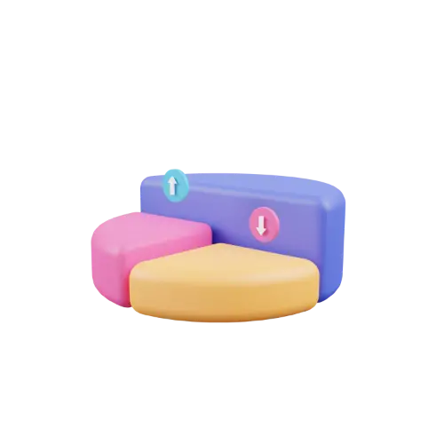

# 🎨 我的設計素材庫
這是一個全自動更新的素材導覽。

<!-- thumbnails-start -->
## 📂 素材目錄樹狀導覽

| 目錄路徑 | 封面 | 統計 |
| :--- | :---: | :---: |
| [　　┗ 3D_Avatars](images/3Ds/3D_Avatars/README.md) |  | `21 Items` |
| [　　┗ 3D_CharacterNurse](images/3Ds/3D_CharacterNurse/README.md) |  | `30 Items` |
| [　　┗ 3D_Ecommercia](images/3Ds/3D_Ecommercia/README.md) |  | `29 Items` |
| [　　┗ 3D_Education](images/3Ds/3D_Education/README.md) |  | `22 Items` |
| [　　┗ 3D_Educations](images/3Ds/3D_Educations/README.md) |  | `40 Items` |
| [　　┗ 3D_Emojis](images/3Ds/3D_Emojis/README.md) |  | `25 Items` |
| [　　┗ 3D_EmojisGestures](images/3Ds/3D_EmojisGestures/README.md) |  | `33 Items` |
| [　　┗ 3D_Finacially](images/3Ds/3D_Finacially/README.md) |  | `76 Items` |
| [　　┗ 3D_Hands](images/3Ds/3D_Hands/README.md) |  | `2 Items` |
| [　　┗ 3D_Heros](images/3Ds/3D_Heros/README.md) |  | `24 Items` |
| [　　┗ 3D_Illustration-Nikuu](images/3Ds/3D_Illustration-Nikuu/README.md) |  | `43 Items` |
| [　　┗ 3D_Illustration-Saly](images/3Ds/3D_Illustration-Saly/README.md) |  | `90 Items` |
| [　　┗ 3D_Illustration-V1](images/3Ds/3D_Illustration-V1/README.md) |  | `6 Items` |
| [　　┗ 3D_Illustration-V2](images/3Ds/3D_Illustration-V2/README.md) |  | `120 Items` |
| [　　┗ 3D_Web-V1](images/3Ds/3D_Web-V1/README.md) |  | `40 Items` |
| [　　┗ 3D_Web-V2](images/3Ds/3D_Web-V2/README.md) |  | `40 Items` |
| [　┗ Animations](images/Animations/README.md) |  | `37 Items` |
| [　┗ DesignSystem](images/DesignSystem/README.md) |  | `71 Items` |
| [　　┗ Components](images/DesignSystem/Components/README.md) |  | `2 Items` |
| [　　　┗ Guideline-iCon](images/DesignSystem/DesignSystemiCons/Guideline-iCon/README.md) |  | `7 Items` |
| [　　　┗ Square-iCon](images/DesignSystem/DesignSystemiCons/Square-iCon/README.md) |  | `87 Items` |
| [　　┗ Adventurer](images/Dicebear/Adventurer/README.md) |  | `23 Items` |
| [　　┗ Adventurer Neutral ](images/Dicebear/Adventurer Neutral /README.md) |  | `20 Items` |
| [　　┗ Avataaars ](images/Dicebear/Avataaars /README.md) |  | `20 Items` |
| [　　┗ Avataaars Neutral ](images/Dicebear/Avataaars Neutral /README.md) |  | `20 Items` |
| [　　┗ Big Ears ](images/Dicebear/Big Ears /README.md) |  | `20 Items` |
| [　　┗ Big Ears Neutral ](images/Dicebear/Big Ears Neutral /README.md) |  | `20 Items` |
| [　　┗ Big Smile ](images/Dicebear/Big Smile /README.md) |  | `20 Items` |
| [　　┗ Bottts ](images/Dicebear/Bottts /README.md) |  | `20 Items` |
| [　　┗ Bottts Neutral ](images/Dicebear/Bottts Neutral /README.md) |  | `20 Items` |
| [　　┗ Croodles ](images/Dicebear/Croodles /README.md) |  | `20 Items` |
| [　　┗ Croodles Netral ](images/Dicebear/Croodles Netral /README.md) |  | `20 Items` |
| [　　┗ Dylan ](images/Dicebear/Dylan /README.md) |  | `19 Items` |
| [　　┗ Fun Emoji ](images/Dicebear/Fun Emoji /README.md) |  | `20 Items` |
| [　　┗ Glass ](images/Dicebear/Glass /README.md) |  | `20 Items` |
| [　　┗ Identicon ](images/Dicebear/Identicon /README.md) |  | `20 Items` |
| [　　┗ Lorelei ](images/Dicebear/Lorelei /README.md) |  | `20 Items` |
| [　　┗ Lorelei Netral ](images/Dicebear/Lorelei Netral /README.md) |  | `20 Items` |
| [　　┗ Micah ](images/Dicebear/Micah /README.md) |  | `20 Items` |
| [　　┗ Miniavs ](images/Dicebear/Miniavs /README.md) |  | `20 Items` |
| [　　┗ Notionists ](images/Dicebear/Notionists /README.md) |  | `17 Items` |
| [　　┗ Notionists Netral ](images/Dicebear/Notionists Netral /README.md) |  | `20 Items` |
| [　　┗ Openpeeps ](images/Dicebear/Openpeeps /README.md) |  | `20 Items` |
| [　　┗ Personas ](images/Dicebear/Personas /README.md) |  | `20 Items` |
| [　　┗ Pixelart ](images/Dicebear/Pixelart /README.md) |  | `20 Items` |
| [　　┗ Pixelart Netral ](images/Dicebear/Pixelart Netral /README.md) |  | `20 Items` |
| [　　┗ Shapes ](images/Dicebear/Shapes /README.md) |  | `20 Items` |
| [　　┗ Thumbs ](images/Dicebear/Thumbs /README.md) |  | `19 Items` |
| [　　┗ Toonhead ](images/Dicebear/Toonhead /README.md) |  | `20 Items` |
| [　┗ FontStyles](images/FontStyles/README.md) |  | `23 Items` |
| [　　　┗ SVG](images/Illustrations/AmazingCatIllustrations/SVG/README.md) |  | `20 Items` |
| [　　┗ Byte Dance](images/Illustrations/Byte Dance/README.md) |  | `15 Items` |
| [　　　┗ SVG](images/Illustrations/Circuitill/SVG/README.md) |  | `29 Items` |
| [　　┗ CorporateScenesillustrationOctetDesignStudio](images/Illustrations/CorporateScenesillustrationOctetDesignStudio/README.md) |  | `1 Items` |
| [　　┗ DeskDudes-illustration](images/Illustrations/DeskDudes-illustration/README.md) |  | `20 Items` |
| [　　┗ DoozyProSvg](images/Illustrations/DoozyProSvg/README.md) |  | `20 Items` |
| [　　┗ ErrorStateillustrationsPixelTrue](images/Illustrations/ErrorStateillustrationsPixelTrue/README.md) |  | `30 Items` |
| [　　┗ GrowwwKit 01](images/Illustrations/GrowwwKit 01/README.md) |  | `8 Items` |
| [　　┗ GrowwwKit 02](images/Illustrations/GrowwwKit 02/README.md) |  | `12 Items` |
| [　　　┗ Business Team](images/Illustrations/Life & Work Flat/Business Team/README.md) |  | `9 Items` |
| [　　　┗ Discover](images/Illustrations/Life & Work Flat/Discover/README.md) |  | `5 Items` |
| [　　　┗ Dolty Christmas](images/Illustrations/Life & Work Flat/Dolty Christmas/README.md) |  | `15 Items` |
| [　　　┗ Education & E-Learning](images/Illustrations/Life & Work Flat/Education & E-Learning/README.md) |  | `11 Items` |
| [　　　┗ Emotration](images/Illustrations/Life & Work Flat/Emotration/README.md) |  | `9 Items` |
| [　　　┗ Frosty](images/Illustrations/Life & Work Flat/Frosty/README.md) |  | `12 Items` |
| [　　　┗ Her adventure](images/Illustrations/Life & Work Flat/Her adventure/README.md) |  | `6 Items` |
| [　　　┗ Merry](images/Illustrations/Life & Work Flat/Merry/README.md) |  | `12 Items` |
| [　　　┗ Peace StopWar](images/Illustrations/Life & Work Flat/Peace StopWar/README.md) |  | `2 Items` |
| [　　　┗ Rock inaround](images/Illustrations/Life & Work Flat/Rock inaround/README.md) |  | `10 Items` |
| [　　　┗ Travel](images/Illustrations/Life & Work Flat/Travel/README.md) |  | `10 Items` |
| [　　　┗ Virtual Reality](images/Illustrations/Life & Work Flat/Virtual Reality/README.md) |  | `10 Items` |
| [　　┗ SigmaProSvg](images/Illustrations/SigmaProSvg/README.md) |  | `4 Items` |
| [　　┗ SketchyProSvg](images/Illustrations/SketchyProSvg/README.md) |  | `21 Items` |
| [　　┗ Social Media Marketing Illustratio](images/Illustrations/Social Media Marketing Illustratio/README.md) |  | `12 Items` |
| [　　┗ Workspace Activity](images/Illustrations/Workspace Activity/README.md) |  | `12 Items` |
| [　　┗ illustrations-Simplicity](images/Illustrations/illustrations-Simplicity/README.md) |  | `32 Items` |
| [　　　┗ Bgs](images/Illustrations/illustrations-Simplicity/Bgs/README.md) |  | `98 Items` |
| [　　┗ Backgrounds](images/Resumes/Backgrounds/README.md) |  | `4 Items` |
| [　　┗ BarrY](images/Resumes/BarrY/README.md) |  | `11 Items` |
| [　　┗ Px-Cursots](images/Resumes/Px-Cursots/README.md) |  | `7 Items` |
| [　　┗ Px-Group](images/Resumes/Px-Group/README.md) |  | `671 Items` |
| [　┗ Svg-Samples](images/Svg-Samples/README.md) |  | `1 Items` |
| [　　┗ Brands](images/Svg-Samples/Brands/README.md) |  | `4 Items` |
| [　　┗ Patterns](images/Svg-Samples/Patterns/README.md) |  | `20 Items` |
| [　　┗ Prints](images/Svg-Samples/Prints/README.md) |  | `3 Items` |
| [　　┗ Ui](images/Svg-Samples/Ui/README.md) |  | `4 Items` |
| [　┗ Svgs](images/Svgs/README.md) |  | `2 Items` |
| [　┗ Ux-meme](images/Ux-meme/README.md) |  | `4 Items` |
| [　　　┗ Black](images/iCons/3D Hand Emojis/Black/README.md) |  | `32 Items` |
| [　　　┗ Default](images/iCons/3D Hand Emojis/Default/README.md) |  | `31 Items` |
| [　　　┗ Light](images/iCons/3D Hand Emojis/Light/README.md) |  | `31 Items` |
| [　　┗ AdobeCreativeSoftwareiiCons](images/iCons/AdobeCreativeSoftwareiiCons/README.md) |  | `27 Items` |
| [　　┗ Ai Icons Text And Image Generation](images/iCons/Ai Icons Text And Image Generation/README.md) |  | `82 Items` |
| [　　┗ Brands](images/iCons/Brands/README.md) |  | `1752 Items` |
| [　　　┗ App](images/iCons/Brands/App/README.md) |  | `1 Items` |
| [　　　　┗ Flags](images/iCons/Brands/County/Flags/README.md) |  | `1 Items` |
| [　　　　┗ flagSq](images/iCons/Brands/County/flagSq/README.md) |  | `21 Items` |
| [　　┗ Browsers](images/iCons/Browsers/README.md) |  | `18 Items` |
| [　　┗ CRM](images/iCons/CRM/README.md) |  | `185 Items` |
| [　　　┗ apps](images/iCons/CandyiCons/apps/README.md) |  | `551 Items` |
| [　　　┗ devices](images/iCons/CandyiCons/devices/README.md) |  | `12 Items` |
| [　　　┗ mimetypes](images/iCons/CandyiCons/mimetypes/README.md) |  | `32 Items` |
| [　　　　┗ 16](images/iCons/CandyiCons/places/16/README.md) |  | `46 Items` |
| [　　　　┗ 48](images/iCons/CandyiCons/places/48/README.md) |  | `1 Items` |
| [　　　┗ preferences](images/iCons/CandyiCons/preferences/README.md) |  | `23 Items` |
| [　　　┗ Dark](images/iCons/CapitaineCursors/Dark/README.md) |  | `94 Items` |
| [　　　┗ Light](images/iCons/CapitaineCursors/Light/README.md) |  | `18 Items` |
| [　　　┗ Communication](images/iCons/Circum/Communication/README.md) |  | `16 Items` |
| [　　　┗ Design](images/iCons/Circum/Design/README.md) |  | `14 Items` |
| [　　　┗ Devices & Electronics](images/iCons/Circum/Devices & Electronics/README.md) |  | `36 Items` |
| [　　　┗ Finances & Payments](images/iCons/Circum/Finances & Payments/README.md) |  | `15 Items` |
| [　　　┗ Food & Drinks](images/iCons/Circum/Food & Drinks/README.md) |  | `11 Items` |
| [　　　┗ Formattings](images/iCons/Circum/Formattings/README.md) |  | `8 Items` |
| [　　　┗ Media Controls](images/iCons/Circum/Media Controls/README.md) |  | `11 Items` |
| [　　　┗ Navigations & Travels](images/iCons/Circum/Navigations & Travels/README.md) |  | `17 Items` |
| [　　　┗ Shopping & Ecommerce](images/iCons/Circum/Shopping & Ecommerce/README.md) |  | `10 Items` |
| [　　　┗ User Interface](images/iCons/Circum/User Interface/README.md) |  | `6 Items` |
| [　　　┗ Weather](images/iCons/Circum/Weather/README.md) |  | `9 Items` |
| [　　┗ Company ](images/iCons/Company /README.md) |  | `81 Items` |
| [　　　┗ Arrow](images/iCons/Coolicons /Arrow/README.md) |  | `72 Items` |
| [　　　┗ Calendar](images/iCons/Coolicons /Calendar/README.md) |  | `14 Items` |
| [　　　┗ Communication](images/iCons/Coolicons /Communication/README.md) |  | `25 Items` |
| [　　　┗ Edit](images/iCons/Coolicons /Edit/README.md) |  | `72 Items` |
| [　　　┗ Environment](images/iCons/Coolicons /Environment/README.md) |  | `13 Items` |
| [　　　┗ File](images/iCons/Coolicons /File/README.md) |  | `39 Items` |
| [　　　┗ Interface](images/iCons/Coolicons /Interface/README.md) |  | `73 Items` |
| [　　　┗ Media](images/iCons/Coolicons /Media/README.md) |  | `22 Items` |
| [　　　┗ Menu](images/iCons/Coolicons /Menu/README.md) |  | `16 Items` |
| [　　　┗ Navigation](images/iCons/Coolicons /Navigation/README.md) |  | `18 Items` |
| [　　　┗ Shape](images/iCons/Coolicons /Shape/README.md) |  | `6 Items` |
| [　　　┗ System](images/iCons/Coolicons /System/README.md) |  | `37 Items` |
| [　　　┗ User](images/iCons/Coolicons /User/README.md) |  | `13 Items` |
| [　　　┗ Warning](images/iCons/Coolicons /Warning/README.md) |  | `20 Items` |
| [　　　┗ Cryptocurrency](images/iCons/Cryptocurrency /Cryptocurrency/README.md) |  | `223 Items` |
| [　　　┗ Cryptocurrency 2](images/iCons/Cryptocurrency /Cryptocurrency 2/README.md) |  | `220 Items` |
| [　　　┗ Cryptocurrency 3](images/iCons/Cryptocurrency /Cryptocurrency 3/README.md) |  | `220 Items` |
| [　　┗ DuoTune](images/iCons/DuoTune/README.md) |  | `285 Items` |
| [　　┗ Fabulous](images/iCons/Fabulous/README.md) |  | `109 Items` |
| [　　┗ Files](images/iCons/Files/README.md) |  | `20 Items` |
| [　　┗ Folders](images/iCons/Folders/README.md) |  | `6 Items` |
| [　　　┗ files-and-document-01](images/iCons/Folders/files-and-document-01/README.md) |  | `48 Items` |
| [　　　┗ files-and-document-02](images/iCons/Folders/files-and-document-02/README.md) |  | `50 Items` |
| [　　　┗ files-and-document-03](images/iCons/Folders/files-and-document-03/README.md) |  | `50 Items` |
| [　　　┗ files-and-document-04](images/iCons/Folders/files-and-document-04/README.md) |  | `70 Items` |
| [　　　┗ files-and-document-05](images/iCons/Folders/files-and-document-05/README.md) |  | `70 Items` |
| [　　┗ Gaming](images/iCons/Gaming/README.md) |  | `50 Items` |
| [　　┗ Glassmorphism ](images/iCons/Glassmorphism /README.md) |  | `33 Items` |
| [　　　┗ Glass ](images/iCons/Glassmorphism /Glass /README.md) |  | `98 Items` |
| [　　　　　┗ Bold](images/iCons/Glassmorphism /Glass /Hicon (Free icon pack) - Glass Icons/Bold/README.md) |  | `4 Items` |
| [　　　　　┗ Glass](images/iCons/Glassmorphism /Glass /Hicon (Free icon pack) - Glass Icons/Glass/README.md) |  | `17 Items` |
| [　　┗ GoogleCloud](images/iCons/GoogleCloud/README.md) |  | `216 Items` |
| [　　　┗ Bold](images/iCons/Hicon /Bold/README.md) |  | `407 Items` |
| [　　　┗ Linear](images/iCons/Hicon /Linear/README.md) |  | `456 Items` |
| [　　　┗ Outline](images/iCons/Hicon /Outline/README.md) |  | `445 Items` |
| [　　　　┗ Bold](images/iCons/Hicon /w/Bold/README.md) |  | `408 Items` |
| [　　　　┗ Linear](images/iCons/Hicon /w/Linear/README.md) |  | `456 Items` |
| [　　　　┗ Outline](images/iCons/Hicon /w/Outline/README.md) |  | `444 Items` |
| [　　┗ Iconbrew ](images/iCons/Iconbrew /README.md) |  | `1134 Items` |
| [　　　┗ Icon pack - IconBrew (Community) 2](images/iCons/Iconbrew /Icon pack - IconBrew (Community) 2/README.md) |  | `360 Items` |
| [　　　　┗ Bold](images/iCons/Iconly /Curved/Bold/README.md) |  | `100 Items` |
| [　　　　┗ Broken](images/iCons/Iconly /Curved/Broken/README.md) |  | `100 Items` |
| [　　　　┗ Bulk](images/iCons/Iconly /Curved/Bulk/README.md) |  | `100 Items` |
| [　　　　┗ Light](images/iCons/Iconly /Curved/Light/README.md) |  | `96 Items` |
| [　　　　┗ Outline](images/iCons/Iconly /Curved/Outline/README.md) |  | `100 Items` |
| [　　　　┗ Two-tone](images/iCons/Iconly /Curved/Two-tone/README.md) |  | `100 Items` |
| [　　　　┗ Bold](images/iCons/Iconly /Regular/Bold/README.md) |  | `99 Items` |
| [　　　　┗ Broken](images/iCons/Iconly /Regular/Broken/README.md) |  | `100 Items` |
| [　　　　┗ Bulk](images/iCons/Iconly /Regular/Bulk/README.md) |  | `100 Items` |
| [　　　　┗ Light](images/iCons/Iconly /Regular/Light/README.md) |  | `94 Items` |
| [　　　　┗ Outline](images/iCons/Iconly /Regular/Outline/README.md) |  | `100 Items` |
| [　　　　┗ Two-tone](images/iCons/Iconly /Regular/Two-tone/README.md) |  | `100 Items` |
| [　　　　┗ Bold](images/iCons/Iconly /Sharp/Bold/README.md) |  | `125 Items` |
| [　　　　┗ Broken](images/iCons/Iconly /Sharp/Broken/README.md) |  | `120 Items` |
| [　　　　┗ Bulk](images/iCons/Iconly /Sharp/Bulk/README.md) |  | `125 Items` |
| [　　　　┗ Light](images/iCons/Iconly /Sharp/Light/README.md) |  | `124 Items` |
| [　　　　┗ Outline](images/iCons/Iconly /Sharp/Outline/README.md) |  | `125 Items` |
| [　　　　┗ Two-tone](images/iCons/Iconly /Sharp/Two-tone/README.md) |  | `125 Items` |
| [　　┗ Iconos Ikon ](images/iCons/Iconos Ikon /README.md) |  | `736 Items` |
| [　　┗ Icons Vector Pixel ](images/iCons/Icons Vector Pixel /README.md) |  | `1325 Items` |
| [　　　┗ Plump](images/iCons/Interface Vector /Plump/README.md) |  | `221 Items` |
| [　　┗ KritaiCon](images/iCons/KritaiCon/README.md) |  | `283 Items` |
| [　　┗ Learns](images/iCons/Learns/README.md) |  | `50 Items` |
| [　　┗ Macos Big Sur ](images/iCons/Macos Big Sur /README.md) |  | `70 Items` |
| [　　┗ Memoji Full ](images/iCons/Memoji Full /README.md) |  | `1651 Items` |
| [　　　┗ arrow](images/iCons/Mingcute Icon /arrow/README.md) |  | `40 Items` |
| [　　　┗ building](images/iCons/Mingcute Icon /building/README.md) |  | `56 Items` |
| [　　　┗ business](images/iCons/Mingcute Icon /business/README.md) |  | `112 Items` |
| [　　　┗ contact](images/iCons/Mingcute Icon /contact/README.md) |  | `40 Items` |
| [　　　┗ design](images/iCons/Mingcute Icon /design/README.md) |  | `64 Items` |
| [　　　┗ device](images/iCons/Mingcute Icon /device/README.md) |  | `98 Items` |
| [　　　┗ editor](images/iCons/Mingcute Icon /editor/README.md) |  | `98 Items` |
| [　　　┗ education](images/iCons/Mingcute Icon /education/README.md) |  | `34 Items` |
| [　　　┗ file](images/iCons/Mingcute Icon /file/README.md) |  | `90 Items` |
| [　　　┗ food](images/iCons/Mingcute Icon /food/README.md) |  | `20 Items` |
| [　　　┗ logo](images/iCons/Mingcute Icon /logo/README.md) |  | `60 Items` |
| [　　　┗ map](images/iCons/Mingcute Icon /map/README.md) |  | `44 Items` |
| [　　　┗ media](images/iCons/Mingcute Icon /media/README.md) |  | `84 Items` |
| [　　　┗ part](images/iCons/Mingcute Icon /part/README.md) |  | `20 Items` |
| [　　　┗ shape](images/iCons/Mingcute Icon /shape/README.md) |  | `20 Items` |
| [　　　┗ system](images/iCons/Mingcute Icon /system/README.md) |  | `116 Items` |
| [　　　┗ transport](images/iCons/Mingcute Icon /transport/README.md) |  | `46 Items` |
| [　　　┗ user](images/iCons/Mingcute Icon /user/README.md) |  | `28 Items` |
| [　　　┗ weather](images/iCons/Mingcute Icon /weather/README.md) |  | `36 Items` |
| [　　┗ Monstars](images/iCons/Monstars/README.md) |  | `28 Items` |
| [　　　　┗ Background](images/iCons/Palse Illustrations/Pulse Illustration Kit/Background/README.md) |  | `7 Items` |
| [　　　　┗ Characters](images/iCons/Palse Illustrations/Pulse Illustration Kit/Characters/README.md) |  | `16 Items` |
| [　　　　┗ Nature](images/iCons/Palse Illustrations/Pulse Illustration Kit/Nature/README.md) |  | `37 Items` |
| [　　　　┗ UI](images/iCons/Palse Illustrations/Pulse Illustration Kit/UI/README.md) |  | `43 Items` |
| [　　　┗ Pulse Illustration Scenes](images/iCons/Palse Illustrations/Pulse Illustration Scenes/README.md) |  | `20 Items` |
| [　　　┗ Pulse Illustration Scenes Outline Style](images/iCons/Palse Illustrations/Pulse Illustration Scenes Outline Style/README.md) |  | `20 Items` |
| [　　┗ Payment And Credit Card ](images/iCons/Payment And Credit Card /README.md) |  | `107 Items` |
| [　　　┗ 16px ](images/iCons/Pixel/16px /README.md) |  | `126 Items` |
| [　　　　　┗ fonts](images/iCons/Pixel/16px /16px/fonts/README.md) |  | `1 Items` |
| [　　　┗ Action](images/iCons/Pixel/Action/README.md) |  | `162 Items` |
| [　　　┗ Base ](images/iCons/Pixel/Base /README.md) |  | `189 Items` |
| [　　　　　┗ fonts](images/iCons/Pixel/Base /baseicons/fonts/README.md) |  | `1 Items` |
| [　　　　　┗ 12](images/iCons/Pixel/Breeze /Actions /12/README.md) |  | `1 Items` |
| [　　　　　┗ 16](images/iCons/Pixel/Breeze /Actions /16/README.md) |  | `798 Items` |
| [　　　　　┗ 22](images/iCons/Pixel/Breeze /Actions /22/README.md) |  | `1208 Items` |
| [　　　　　┗ 32](images/iCons/Pixel/Breeze /Actions /32/README.md) |  | `221 Items` |
| [　　　　　┗ 48](images/iCons/Pixel/Breeze /Actions /48/README.md) |  | `4 Items` |
| [　　　　　┗ 64](images/iCons/Pixel/Breeze /Actions /64/README.md) |  | `4 Items` |
| [　　　　　┗ 16](images/iCons/Pixel/Breeze /Animations /16/README.md) |  | `1 Items` |
| [　　　　　┗ 22](images/iCons/Pixel/Breeze /Animations /22/README.md) |  | `1 Items` |
| [　　　　　┗ 128](images/iCons/Pixel/Breeze /Applets /128/README.md) |  | `17 Items` |
| [　　　　　┗ 16](images/iCons/Pixel/Breeze /Applets /16/README.md) |  | `1 Items` |
| [　　　　　┗ 22](images/iCons/Pixel/Breeze /Applets /22/README.md) |  | `4 Items` |
| [　　　　　┗ 256](images/iCons/Pixel/Breeze /Applets /256/README.md) |  | `44 Items` |
| [　　　　　┗ 32](images/iCons/Pixel/Breeze /Applets /32/README.md) |  | `9 Items` |
| [　　　　　┗ 48](images/iCons/Pixel/Breeze /Applets /48/README.md) |  | `117 Items` |
| [　　　　　┗ 64](images/iCons/Pixel/Breeze /Applets /64/README.md) |  | `50 Items` |
| [　　　　　┗ 16](images/iCons/Pixel/Breeze /Apps /16/README.md) |  | `23 Items` |
| [　　　　　┗ 22](images/iCons/Pixel/Breeze /Apps /22/README.md) |  | `37 Items` |
| [　　　　　┗ 32](images/iCons/Pixel/Breeze /Apps /32/README.md) |  | `26 Items` |
| [　　　　　┗ 48](images/iCons/Pixel/Breeze /Apps /48/README.md) |  | `335 Items` |
| [　　　　　┗ 64](images/iCons/Pixel/Breeze /Apps /64/README.md) |  | `8 Items` |
| [　　　　　┗ 22](images/iCons/Pixel/Breeze /Categories /22/README.md) |  | `1 Items` |
| [　　　　　┗ 32](images/iCons/Pixel/Breeze /Categories /32/README.md) |  | `15 Items` |
| [　　　　　┗ 16](images/iCons/Pixel/Breeze /Devices /16/README.md) |  | `57 Items` |
| [　　　　　┗ 22](images/iCons/Pixel/Breeze /Devices /22/README.md) |  | `49 Items` |
| [　　　　　┗ 32](images/iCons/Pixel/Breeze /Devices /32/README.md) |  | `7 Items` |
| [　　　　　┗ 64](images/iCons/Pixel/Breeze /Devices /64/README.md) |  | `47 Items` |
| [　　　　　┗ 16](images/iCons/Pixel/Breeze /Emblems /16/README.md) |  | `40 Items` |
| [　　　　　┗ 22](images/iCons/Pixel/Breeze /Emblems /22/README.md) |  | `29 Items` |
| [　　　　　┗ 8](images/iCons/Pixel/Breeze /Emblems /8/README.md) |  | `27 Items` |
| [　　　　　┗ 22](images/iCons/Pixel/Breeze /Emotes /22/README.md) |  | `34 Items` |
| [　　　　　┗ 16](images/iCons/Pixel/Breeze /Mimetypes /16/README.md) |  | `204 Items` |
| [　　　　　┗ 22](images/iCons/Pixel/Breeze /Mimetypes /22/README.md) |  | `204 Items` |
| [　　　　　┗ 32](images/iCons/Pixel/Breeze /Mimetypes /32/README.md) |  | `206 Items` |
| [　　　　　┗ 64](images/iCons/Pixel/Breeze /Mimetypes /64/README.md) |  | `206 Items` |
| [　　　　　┗ 16](images/iCons/Pixel/Breeze /Places /16/README.md) |  | `75 Items` |
| [　　　　　┗ 22](images/iCons/Pixel/Breeze /Places /22/README.md) |  | `72 Items` |
| [　　　　　┗ 32](images/iCons/Pixel/Breeze /Places /32/README.md) |  | `83 Items` |
| [　　　　　┗ 48](images/iCons/Pixel/Breeze /Places /48/README.md) |  | `51 Items` |
| [　　　　　┗ 64](images/iCons/Pixel/Breeze /Places /64/README.md) |  | `82 Items` |
| [　　　　　┗ 96](images/iCons/Pixel/Breeze /Places /96/README.md) |  | `82 Items` |
| [　　　　　┗ 22](images/iCons/Pixel/Breeze /Preferences /22/README.md) |  | `95 Items` |
| [　　　　　┗ 32](images/iCons/Pixel/Breeze /Preferences /32/README.md) |  | `134 Items` |
| [　　　　　┗ 16](images/iCons/Pixel/Breeze /Status /16/README.md) |  | `102 Items` |
| [　　　　　┗ 22](images/iCons/Pixel/Breeze /Status /22/README.md) |  | `382 Items` |
| [　　　　　┗ 32](images/iCons/Pixel/Breeze /Status /32/README.md) |  | `54 Items` |
| [　　　　　┗ 48](images/iCons/Pixel/Breeze /Status /48/README.md) |  | `1 Items` |
| [　　　　　┗ 64](images/iCons/Pixel/Breeze /Status /64/README.md) |  | `13 Items` |
| [　　　┗ Business ](images/iCons/Pixel/Business /README.md) |  | `50 Items` |
| [　　　┗ Commerceand Shopping ](images/iCons/Pixel/Commerceand Shopping /README.md) |  | `100 Items` |
| [　　　┗ Cursor ](images/iCons/Pixel/Cursor /README.md) |  | `40 Items` |
| [　　　┗ Emojis ](images/iCons/Pixel/Emojis /README.md) |  | `37 Items` |
| [　　　┗ File ](images/iCons/Pixel/File /README.md) |  | `31 Items` |
| [　　　┗ Fontaudi](images/iCons/Pixel/Fontaudi/README.md) |  | `52 Items` |
| [　　　┗ Fruit](images/iCons/Pixel/Fruit/README.md) |  | `20 Items` |
| [　　　┗ Games](images/iCons/Pixel/Games/README.md) |  | `59 Items` |
| [　　　┗ Handgesture ](images/iCons/Pixel/Handgesture /README.md) |  | `20 Items` |
| [　　　┗ Highquality ](images/iCons/Pixel/Highquality /README.md) |  | `350 Items` |
| [　　　┗ Industrial Sharp](images/iCons/Pixel/Industrial Sharp/README.md) |  | `152 Items` |
| [　　　　　┗ fonts](images/iCons/Pixel/Industrial Sharp/industrialsharp/fonts/README.md) |  | `1 Items` |
| [　　　┗ Interface](images/iCons/Pixel/Interface/README.md) |  | `21 Items` |
| [　　　　┗ oupput](images/iCons/Pixel/Interface/oupput/README.md) |  | `21 Items` |
| [　　　　┗ brands](images/iCons/Pixel/Library/brands/README.md) |  | `38 Items` |
| [　　　　┗ regular](images/iCons/Pixel/Library/regular/README.md) |  | `180 Items` |
| [　　　　┗ solid](images/iCons/Pixel/Library/solid/README.md) |  | `180 Items` |
| [　　　┗ Line](images/iCons/Pixel/Line/README.md) |  | `75 Items` |
| [　　　　　┗ fonts](images/iCons/Pixel/Line/pixel-line/fonts/README.md) |  | `1 Items` |
| [　　　┗ Memory Icons ](images/iCons/Pixel/Memory Icons /README.md) |  | `871 Items` |
| [　　　　　┗ fonts](images/iCons/Pixel/Memory Icons /memorypixel/fonts/README.md) |  | `1 Items` |
| [　　　┗ Nes](images/iCons/Pixel/Nes/README.md) |  | `89 Items` |
| [　　　┗ Offices](images/iCons/Pixel/Offices/README.md) |  | `25 Items` |
| [　　　┗ Pixel Art ](images/iCons/Pixel/Pixel Art /README.md) |  | `470 Items` |
| [　　　　　┗ fonts](images/iCons/Pixel/Pixel Art /pixelarticons/fonts/README.md) |  | `1 Items` |
| [　　　　　┗ Linear](images/iCons/Pixel/Pixel Icon Set /Commerce/Linear/README.md) |  | `50 Items` |
| [　　　　　┗ Solid](images/iCons/Pixel/Pixel Icon Set /Commerce/Solid/README.md) |  | `50 Items` |
| [　　　　　┗ Linear](images/iCons/Pixel/Pixel Icon Set /Contacts/Linear/README.md) |  | `40 Items` |
| [　　　　　┗ Outline](images/iCons/Pixel/Pixel Icon Set /Contacts/Outline/README.md) |  | `50 Items` |
| [　　　　　┗ Solid](images/iCons/Pixel/Pixel Icon Set /Contacts/Solid/README.md) |  | `40 Items` |
| [　　　　　┗ Linear](images/iCons/Pixel/Pixel Icon Set /Food/Linear/README.md) |  | `50 Items` |
| [　　　　　┗ Outline](images/iCons/Pixel/Pixel Icon Set /Food/Outline/README.md) |  | `50 Items` |
| [　　　　　┗ Solid](images/iCons/Pixel/Pixel Icon Set /Food/Solid/README.md) |  | `50 Items` |
| [　　　　　┗ Linear](images/iCons/Pixel/Pixel Icon Set /Interface/Linear/README.md) |  | `50 Items` |
| [　　　　　┗ Outline](images/iCons/Pixel/Pixel Icon Set /Interface/Outline/README.md) |  | `50 Items` |
| [　　　　　┗ Solid](images/iCons/Pixel/Pixel Icon Set /Interface/Solid/README.md) |  | `50 Items` |
| [　　　　　┗ Linear](images/iCons/Pixel/Pixel Icon Set /Text-editor/Linear/README.md) |  | `40 Items` |
| [　　　　　┗ Outline](images/iCons/Pixel/Pixel Icon Set /Text-editor/Outline/README.md) |  | `34 Items` |
| [　　　　　┗ Solid](images/iCons/Pixel/Pixel Icon Set /Text-editor/Solid/README.md) |  | `39 Items` |
| [　　　　　┗ Linear](images/iCons/Pixel/Pixel Icon Set /Weather/Linear/README.md) |  | `30 Items` |
| [　　　　　┗ Outline](images/iCons/Pixel/Pixel Icon Set /Weather/Outline/README.md) |  | `30 Items` |
| [　　　　　┗ Solid](images/iCons/Pixel/Pixel Icon Set /Weather/Solid/README.md) |  | `30 Items` |
| [　　　┗ Plump](images/iCons/Pixel/Plump/README.md) |  | `20 Items` |
| [　　　　┗ Plump](images/iCons/Pixel/Plump/Plump/README.md) |  | `125 Items` |
| [　　　┗ Skware ](images/iCons/Pixel/Skware /README.md) |  | `100 Items` |
| [　　　　　┗ fonts](images/iCons/Pixel/Skware /pixel/fonts/README.md) |  | `1 Items` |
| [　　　┗ Textures ](images/iCons/Pixel/Textures /README.md) |  | `14 Items` |
| [　　　┗ Userinterface ](images/iCons/Pixel/Userinterface /README.md) |  | `83 Items` |
| [　　　┗ Zodiacsigns ](images/iCons/Pixel/Zodiacsigns /README.md) |  | `22 Items` |
| [　　┗ Pixelated Emoji Pack Emoji ](images/iCons/Pixelated Emoji Pack Emoji /README.md) |  | `23 Items` |
| [　　┗ Pro Emoji Pack](images/iCons/Pro Emoji Pack/README.md) |  | `141 Items` |
| [　　　　┗ buildings](images/iCons/Remix /fill/buildings/README.md) |  | `27 Items` |
| [　　　　┗ business](images/iCons/Remix /fill/business/README.md) |  | `85 Items` |
| [　　　　┗ communication](images/iCons/Remix /fill/communication/README.md) |  | `30 Items` |
| [　　　　┗ design](images/iCons/Remix /fill/design/README.md) |  | `82 Items` |
| [　　　　┗ development](images/iCons/Remix /fill/development/README.md) |  | `23 Items` |
| [　　　　┗ device](images/iCons/Remix /fill/device/README.md) |  | `80 Items` |
| [　　　　┗ document](images/iCons/Remix /fill/document/README.md) |  | `100 Items` |
| [　　　　┗ finance](images/iCons/Remix /fill/finance/README.md) |  | `66 Items` |
| [　　　　┗ health](images/iCons/Remix /fill/health/README.md) |  | `30 Items` |
| [　　　　┗ logos](images/iCons/Remix /fill/logos/README.md) |  | `95 Items` |
| [　　　　┗ map](images/iCons/Remix /fill/map/README.md) |  | `85 Items` |
| [　　　　┗ media](images/iCons/Remix /fill/media/README.md) |  | `98 Items` |
| [　　　　┗ others](images/iCons/Remix /fill/others/README.md) |  | `45 Items` |
| [　　　　┗ system](images/iCons/Remix /fill/system/README.md) |  | `149 Items` |
| [　　　　┗ user](images/iCons/Remix /fill/user/README.md) |  | `55 Items` |
| [　　　　┗ weather](images/iCons/Remix /fill/weather/README.md) |  | `35 Items` |
| [　　　　┗ buildings](images/iCons/Remix /line/buildings/README.md) |  | `27 Items` |
| [　　　　┗ business](images/iCons/Remix /line/business/README.md) |  | `87 Items` |
| [　　　　┗ communication](images/iCons/Remix /line/communication/README.md) |  | `30 Items` |
| [　　　　┗ design](images/iCons/Remix /line/design/README.md) |  | `82 Items` |
| [　　　　┗ development](images/iCons/Remix /line/development/README.md) |  | `23 Items` |
| [　　　　┗ device](images/iCons/Remix /line/device/README.md) |  | `80 Items` |
| [　　　　┗ document](images/iCons/Remix /line/document/README.md) |  | `100 Items` |
| [　　　　┗ editor](images/iCons/Remix /line/editor/README.md) |  | `99 Items` |
| [　　　　┗ finance](images/iCons/Remix /line/finance/README.md) |  | `66 Items` |
| [　　　　┗ health](images/iCons/Remix /line/health/README.md) |  | `30 Items` |
| [　　　　┗ logos](images/iCons/Remix /line/logos/README.md) |  | `95 Items` |
| [　　　　┗ map](images/iCons/Remix /line/map/README.md) |  | `85 Items` |
| [　　　　┗ media](images/iCons/Remix /line/media/README.md) |  | `98 Items` |
| [　　　　┗ others](images/iCons/Remix /line/others/README.md) |  | `45 Items` |
| [　　　　┗ system](images/iCons/Remix /line/system/README.md) |  | `149 Items` |
| [　　　　┗ user](images/iCons/Remix /line/user/README.md) |  | `55 Items` |
| [　　　　┗ weather](images/iCons/Remix /line/weather/README.md) |  | `35 Items` |
| [　　┗ Sitemap Cards](images/iCons/Sitemap Cards/README.md) |  | `120 Items` |
| [　　　┗ color](images/iCons/Sketch/color/README.md) |  | `198 Items` |
| [　　　┗ simple](images/iCons/Sketch/simple/README.md) |  | `472 Items` |
| [　　┗ Socialicious](images/iCons/Socialicious/README.md) |  | `74 Items` |
| [　　┗ Ui Ux Graphic Design](images/iCons/Ui Ux Graphic Design/README.md) |  | `1026 Items` |
| [　　┗ Unicons ](images/iCons/Unicons /README.md) |  | `1896 Items` |
| [　　　┗ accessibility](images/iCons/WebSkills/accessibility/README.md) |  | `14 Items` |
| [　　　　┗ algorithms](images/iCons/WebSkills/algorithms-and-data-structures/algorithms/README.md) |  | `12 Items` |
| [　　　　┗ analysis](images/iCons/WebSkills/algorithms-and-data-structures/analysis/README.md) |  | `5 Items` |
| [　　　　┗ data-structures](images/iCons/WebSkills/algorithms-and-data-structures/data-structures/README.md) |  | `11 Items` |
| [　　　　┗ architecture](images/iCons/WebSkills/architecture-and-paradigms/architecture/README.md) |  | `12 Items` |
| [　　　　┗ paradigms](images/iCons/WebSkills/architecture-and-paradigms/paradigms/README.md) |  | `8 Items` |
| [　　　┗ build-tools](images/iCons/WebSkills/build-tools/README.md) |  | `21 Items` |
| [　　　　┗ databases](images/iCons/WebSkills/databases-and-servers/databases/README.md) |  | `23 Items` |
| [　　　　┗ servers](images/iCons/WebSkills/databases-and-servers/servers/README.md) |  | `16 Items` |
| [　　　┗ design-and-ux](images/iCons/WebSkills/design-and-ux/README.md) |  | `22 Items` |
| [　　　┗ frameworks-and-libraries](images/iCons/WebSkills/frameworks-and-libraries/README.md) |  | `6 Items` |
| [　　　　┗ css](images/iCons/WebSkills/fundamentals/css/README.md) |  | `20 Items` |
| [　　　　┗ html](images/iCons/WebSkills/fundamentals/html/README.md) |  | `7 Items` |
| [　　　　┗ javascript](images/iCons/WebSkills/fundamentals/javascript/README.md) |  | `21 Items` |
| [　　　　┗ the-browser](images/iCons/WebSkills/fundamentals/the-browser/README.md) |  | `16 Items` |
| [　　　　┗ apis](images/iCons/WebSkills/progressive-webapps/apis/README.md) |  | `10 Items` |
| [　　　　┗ audits](images/iCons/WebSkills/progressive-webapps/audits/README.md) |  | `3 Items` |
| [　　　　┗ loading-performance](images/iCons/WebSkills/progressive-webapps/loading-performance/README.md) |  | `18 Items` |
| [　　　　┗ rendering-performance](images/iCons/WebSkills/progressive-webapps/rendering-performance/README.md) |  | `18 Items` |
| [　　　　┗ security](images/iCons/WebSkills/progressive-webapps/security/README.md) |  | `6 Items` |
| [　　　　┗ management](images/iCons/WebSkills/team-collaboration/management/README.md) |  | `5 Items` |
| [　　　　┗ version-control](images/iCons/WebSkills/team-collaboration/version-control/README.md) |  | `3 Items` |
| [　　　┗ testing](images/iCons/WebSkills/testing/README.md) |  | `21 Items` |
| [　　　┗ the-modern-web](images/iCons/WebSkills/the-modern-web/README.md) |  | `45 Items` |
| [　　　┗ web-components](images/iCons/WebSkills/web-components/README.md) |  | `8 Items` |
<!-- thumbnails-end -->

---
*Last Sync: 2026-02-27 00:18*