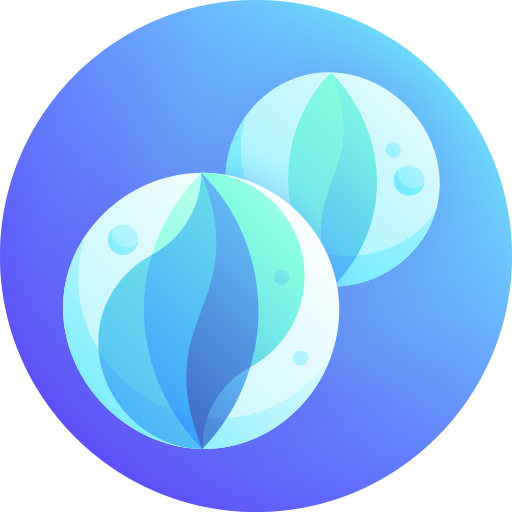

# 🎨 我的設計素材庫
這是一個全自動更新的素材導覽系統。

<!-- thumbnails-start -->
## 📂 素材目錄樹狀導覽

| 目錄路徑 | 封面預覽 | 統計 |
| :--- | :---: | :---: |
| [　┗ `3Ds`](images/3Ds/README.md) | 📁 (導覽層) | - |
| [　　┗ `3D Avatars`](images/3Ds/3D%20Avatars/README.md) | &nbsp;&nbsp;&nbsp; <a href="images/3Ds/3D%20Avatars/README.md">(+17)</a> | `21 Items` |
| [　　┗ `3D Characternurse`](images/3Ds/3D%20Characternurse/README.md) | &nbsp;&nbsp;&nbsp; <a href="images/3Ds/3D%20Characternurse/README.md">(+26)</a> | `30 Items` |
| [　　┗ `3D Ecommercia`](images/3Ds/3D%20Ecommercia/README.md) | &nbsp;&nbsp;&nbsp; <a href="images/3Ds/3D%20Ecommercia/README.md">(+25)</a> | `29 Items` |
| [　　┗ `3D Education`](images/3Ds/3D%20Education/README.md) | &nbsp;&nbsp;&nbsp; <a href="images/3Ds/3D%20Education/README.md">(+18)</a> | `22 Items` |
| [　　┗ `3D Educations`](images/3Ds/3D%20Educations/README.md) | &nbsp;&nbsp;&nbsp; <a href="images/3Ds/3D%20Educations/README.md">(+36)</a> | `40 Items` |
| [　　┗ `3D Emojis`](images/3Ds/3D%20Emojis/README.md) | &nbsp;&nbsp;&nbsp; <a href="images/3Ds/3D%20Emojis/README.md">(+21)</a> | `25 Items` |
| [　　┗ `3D Emojis Gestures`](images/3Ds/3D%20Emojis%20Gestures/README.md) | &nbsp;&nbsp;&nbsp; <a href="images/3Ds/3D%20Emojis%20Gestures/README.md">(+29)</a> | `33 Items` |
| [　　┗ `3D Finacially`](images/3Ds/3D%20Finacially/README.md) | &nbsp;&nbsp;&nbsp; <a href="images/3Ds/3D%20Finacially/README.md">(+72)</a> | `76 Items` |
| [　　┗ `3D Hands`](images/3Ds/3D%20Hands/README.md) | &nbsp;  | `2 Items` |
| [　　┗ `3D Heros`](images/3Ds/3D%20Heros/README.md) | &nbsp;&nbsp;&nbsp; <a href="images/3Ds/3D%20Heros/README.md">(+20)</a> | `24 Items` |
| [　　┗ `3D Illustration Nikuu`](images/3Ds/3D%20Illustration%20Nikuu/README.md) | &nbsp;&nbsp;&nbsp; <a href="images/3Ds/3D%20Illustration%20Nikuu/README.md">(+39)</a> | `43 Items` |
| [　　┗ `3D Illustration Saly`](images/3Ds/3D%20Illustration%20Saly/README.md) | &nbsp;&nbsp;&nbsp; <a href="images/3Ds/3D%20Illustration%20Saly/README.md">(+86)</a> | `90 Items` |
| [　　┗ `3D Illustration V1`](images/3Ds/3D%20Illustration%20V1/README.md) | &nbsp;&nbsp;&nbsp; <a href="images/3Ds/3D%20Illustration%20V1/README.md">(+2)</a> | `6 Items` |
| [　　┗ `3D Illustration V2`](images/3Ds/3D%20Illustration%20V2/README.md) | &nbsp;&nbsp;&nbsp; <a href="images/3Ds/3D%20Illustration%20V2/README.md">(+116)</a> | `120 Items` |
| [　　┗ `3D Web V1`](images/3Ds/3D%20Web%20V1/README.md) | &nbsp;&nbsp;&nbsp; <a href="images/3Ds/3D%20Web%20V1/README.md">(+36)</a> | `40 Items` |
| [　　┗ `3D Web V2`](images/3Ds/3D%20Web%20V2/README.md) | &nbsp;&nbsp;&nbsp; <a href="images/3Ds/3D%20Web%20V2/README.md">(+36)</a> | `40 Items` |
| [　┗ `Animations`](images/Animations/README.md) | &nbsp;&nbsp;&nbsp; <a href="images/Animations/README.md">(+33)</a> | `37 Items` |
| [　┗ `DesignSystem`](images/DesignSystem/README.md) | &nbsp;&nbsp;&nbsp; <a href="images/DesignSystem/README.md">(+67)</a> | `71 Items` |
| [　　┗ `Components`](images/DesignSystem/Components/README.md) | &nbsp;  | `2 Items` |
| [　　┗ `Design System iCons`](images/DesignSystem/Design%20System%20iCons/README.md) | 📁 (導覽層) | - |
| [　　　┗ `Guideline iCon`](images/DesignSystem/Design%20System%20iCons/Guideline%20iCon/README.md) | &nbsp;&nbsp;&nbsp; <a href="images/DesignSystem/Design%20System%20iCons/Guideline%20iCon/README.md">(+3)</a> | `7 Items` |
| [　　　┗ `Square iCon`](images/DesignSystem/Design%20System%20iCons/Square%20iCon/README.md) | &nbsp;&nbsp;&nbsp; <a href="images/DesignSystem/Design%20System%20iCons/Square%20iCon/README.md">(+83)</a> | `87 Items` |
| [　┗ `Dicebear`](images/Dicebear/README.md) | 📁 (導覽層) | - |
| [　　┗ `Adventurer`](images/Dicebear/Adventurer/README.md) | &nbsp;&nbsp;&nbsp; <a href="images/Dicebear/Adventurer/README.md">(+19)</a> | `23 Items` |
| [　　┗ `Adventurer Neutral`](images/Dicebear/Adventurer%20Neutral/README.md) | &nbsp;&nbsp;&nbsp; <a href="images/Dicebear/Adventurer%20Neutral/README.md">(+16)</a> | `20 Items` |
| [　　┗ `Avataaars`](images/Dicebear/Avataaars/README.md) | &nbsp;&nbsp;&nbsp; <a href="images/Dicebear/Avataaars/README.md">(+16)</a> | `20 Items` |
| [　　┗ `Avataaars Neutral`](images/Dicebear/Avataaars%20Neutral/README.md) | &nbsp;&nbsp;&nbsp; <a href="images/Dicebear/Avataaars%20Neutral/README.md">(+16)</a> | `20 Items` |
| [　　┗ `Big Ears`](images/Dicebear/Big%20Ears/README.md) | &nbsp;&nbsp;&nbsp; <a href="images/Dicebear/Big%20Ears/README.md">(+16)</a> | `20 Items` |
| [　　┗ `Big Ears Neutral`](images/Dicebear/Big%20Ears%20Neutral/README.md) | &nbsp;&nbsp;&nbsp; <a href="images/Dicebear/Big%20Ears%20Neutral/README.md">(+16)</a> | `20 Items` |
| [　　┗ `Big Smile`](images/Dicebear/Big%20Smile/README.md) | &nbsp;&nbsp;&nbsp; <a href="images/Dicebear/Big%20Smile/README.md">(+16)</a> | `20 Items` |
| [　　┗ `Bottts`](images/Dicebear/Bottts/README.md) | &nbsp;&nbsp;&nbsp; <a href="images/Dicebear/Bottts/README.md">(+16)</a> | `20 Items` |
| [　　┗ `Bottts Neutral`](images/Dicebear/Bottts%20Neutral/README.md) | &nbsp;&nbsp;&nbsp; <a href="images/Dicebear/Bottts%20Neutral/README.md">(+16)</a> | `20 Items` |
| [　　┗ `Croodles`](images/Dicebear/Croodles/README.md) | &nbsp;&nbsp;&nbsp; <a href="images/Dicebear/Croodles/README.md">(+16)</a> | `20 Items` |
| [　　┗ `Croodles Netral`](images/Dicebear/Croodles%20Netral/README.md) | &nbsp;&nbsp;&nbsp; <a href="images/Dicebear/Croodles%20Netral/README.md">(+16)</a> | `20 Items` |
| [　　┗ `Dylan`](images/Dicebear/Dylan/README.md) | &nbsp;&nbsp;&nbsp; <a href="images/Dicebear/Dylan/README.md">(+15)</a> | `19 Items` |
| [　　┗ `Fun Emoji`](images/Dicebear/Fun%20Emoji/README.md) | &nbsp;&nbsp;&nbsp; <a href="images/Dicebear/Fun%20Emoji/README.md">(+16)</a> | `20 Items` |
| [　　┗ `Glass`](images/Dicebear/Glass/README.md) | &nbsp;&nbsp;&nbsp; <a href="images/Dicebear/Glass/README.md">(+16)</a> | `20 Items` |
| [　　┗ `Identicon`](images/Dicebear/Identicon/README.md) | &nbsp;&nbsp;&nbsp; <a href="images/Dicebear/Identicon/README.md">(+16)</a> | `20 Items` |
| [　　┗ `Lorelei`](images/Dicebear/Lorelei/README.md) | &nbsp;&nbsp;&nbsp; <a href="images/Dicebear/Lorelei/README.md">(+16)</a> | `20 Items` |
| [　　┗ `Lorelei Netral`](images/Dicebear/Lorelei%20Netral/README.md) | &nbsp;&nbsp;&nbsp; <a href="images/Dicebear/Lorelei%20Netral/README.md">(+16)</a> | `20 Items` |
| [　　┗ `Micah`](images/Dicebear/Micah/README.md) | &nbsp;&nbsp;&nbsp; <a href="images/Dicebear/Micah/README.md">(+16)</a> | `20 Items` |
| [　　┗ `Miniavs`](images/Dicebear/Miniavs/README.md) | &nbsp;&nbsp;&nbsp; <a href="images/Dicebear/Miniavs/README.md">(+16)</a> | `20 Items` |
| [　　┗ `Notionists`](images/Dicebear/Notionists/README.md) | &nbsp;&nbsp;&nbsp; <a href="images/Dicebear/Notionists/README.md">(+13)</a> | `17 Items` |
| [　　┗ `Notionists Netral`](images/Dicebear/Notionists%20Netral/README.md) | &nbsp;&nbsp;&nbsp; <a href="images/Dicebear/Notionists%20Netral/README.md">(+16)</a> | `20 Items` |
| [　　┗ `Openpeeps`](images/Dicebear/Openpeeps/README.md) | &nbsp;&nbsp;&nbsp; <a href="images/Dicebear/Openpeeps/README.md">(+16)</a> | `20 Items` |
| [　　┗ `Personas`](images/Dicebear/Personas/README.md) | &nbsp;&nbsp;&nbsp; <a href="images/Dicebear/Personas/README.md">(+16)</a> | `20 Items` |
| [　　┗ `Pixelart`](images/Dicebear/Pixelart/README.md) | &nbsp;&nbsp;&nbsp; <a href="images/Dicebear/Pixelart/README.md">(+16)</a> | `20 Items` |
| [　　┗ `Pixelart Netral`](images/Dicebear/Pixelart%20Netral/README.md) | &nbsp;&nbsp;&nbsp; <a href="images/Dicebear/Pixelart%20Netral/README.md">(+16)</a> | `20 Items` |
| [　　┗ `Shapes`](images/Dicebear/Shapes/README.md) | &nbsp;&nbsp;&nbsp; <a href="images/Dicebear/Shapes/README.md">(+16)</a> | `20 Items` |
| [　　┗ `Thumbs`](images/Dicebear/Thumbs/README.md) | &nbsp;&nbsp;&nbsp; <a href="images/Dicebear/Thumbs/README.md">(+15)</a> | `19 Items` |
| [　　┗ `Toonhead`](images/Dicebear/Toonhead/README.md) | &nbsp;&nbsp;&nbsp; <a href="images/Dicebear/Toonhead/README.md">(+16)</a> | `20 Items` |
| [　┗ `FontStyles`](images/FontStyles/README.md) | &nbsp;&nbsp;&nbsp; <a href="images/FontStyles/README.md">(+19)</a> | `23 Items` |
| [　┗ `Illustrations`](images/Illustrations/README.md) | 📁 (導覽層) | - |
| [　　┗ `Amazing Cat Illustrations`](images/Illustrations/Amazing%20Cat%20Illustrations/README.md) | 📁 (導覽層) | - |
| [　　　┗ `SVG`](images/Illustrations/Amazing%20Cat%20Illustrations/SVG/README.md) | &nbsp;&nbsp;&nbsp; <a href="images/Illustrations/Amazing%20Cat%20Illustrations/SVG/README.md">(+16)</a> | `20 Items` |
| [　　┗ `Byte Dance`](images/Illustrations/Byte%20Dance/README.md) | &nbsp;&nbsp;&nbsp; <a href="images/Illustrations/Byte%20Dance/README.md">(+11)</a> | `15 Items` |
| [　　┗ `Circuitill`](images/Illustrations/Circuitill/README.md) | 📁 (導覽層) | - |
| [　　　┗ `SVG`](images/Illustrations/Circuitill/SVG/README.md) | &nbsp;&nbsp;&nbsp; <a href="images/Illustrations/Circuitill/SVG/README.md">(+25)</a> | `29 Items` |
| [　　┗ `Corporate Scenesillustration Octet Design Studio`](images/Illustrations/Corporate%20Scenesillustration%20Octet%20Design%20Studio/README.md) |   | `1 Items` |
| [　　┗ `Desk Dudes illustration`](images/Illustrations/Desk%20Dudes%20illustration/README.md) | &nbsp;&nbsp;&nbsp; <a href="images/Illustrations/Desk%20Dudes%20illustration/README.md">(+16)</a> | `20 Items` |
| [　　┗ `Doozy Pro Svg`](images/Illustrations/Doozy%20Pro%20Svg/README.md) | &nbsp;&nbsp;&nbsp; <a href="images/Illustrations/Doozy%20Pro%20Svg/README.md">(+16)</a> | `20 Items` |
| [　　┗ `Error Stateillustrations Pixel True`](images/Illustrations/Error%20Stateillustrations%20Pixel%20True/README.md) | &nbsp;&nbsp;&nbsp; <a href="images/Illustrations/Error%20Stateillustrations%20Pixel%20True/README.md">(+26)</a> | `30 Items` |
| [　　┗ `Growww Kit 01`](images/Illustrations/Growww%20Kit%2001/README.md) | &nbsp;&nbsp;&nbsp; <a href="images/Illustrations/Growww%20Kit%2001/README.md">(+4)</a> | `8 Items` |
| [　　┗ `Growww Kit 02`](images/Illustrations/Growww%20Kit%2002/README.md) | &nbsp;&nbsp;&nbsp; <a href="images/Illustrations/Growww%20Kit%2002/README.md">(+8)</a> | `12 Items` |
| [　　┗ `Life & Work Flat`](images/Illustrations/Life%20%26%20Work%20Flat/README.md) | 📁 (導覽層) | - |
| [　　　┗ `Business Team`](images/Illustrations/Life%20%26%20Work%20Flat/Business%20Team/README.md) | &nbsp;&nbsp;&nbsp; <a href="images/Illustrations/Life%20%26%20Work%20Flat/Business%20Team/README.md">(+5)</a> | `9 Items` |
| [　　　┗ `Discover`](images/Illustrations/Life%20%26%20Work%20Flat/Discover/README.md) | &nbsp;&nbsp;&nbsp; <a href="images/Illustrations/Life%20%26%20Work%20Flat/Discover/README.md">(+1)</a> | `5 Items` |
| [　　　┗ `Dolty Christmas`](images/Illustrations/Life%20%26%20Work%20Flat/Dolty%20Christmas/README.md) | &nbsp;&nbsp;&nbsp; <a href="images/Illustrations/Life%20%26%20Work%20Flat/Dolty%20Christmas/README.md">(+11)</a> | `15 Items` |
| [　　　┗ `Education & E-Learning`](images/Illustrations/Life%20%26%20Work%20Flat/Education%20%26%20E-Learning/README.md) | &nbsp;&nbsp;&nbsp; <a href="images/Illustrations/Life%20%26%20Work%20Flat/Education%20%26%20E-Learning/README.md">(+7)</a> | `11 Items` |
| [　　　┗ `Emotration`](images/Illustrations/Life%20%26%20Work%20Flat/Emotration/README.md) | &nbsp;&nbsp;&nbsp; <a href="images/Illustrations/Life%20%26%20Work%20Flat/Emotration/README.md">(+5)</a> | `9 Items` |
| [　　　┗ `Frosty`](images/Illustrations/Life%20%26%20Work%20Flat/Frosty/README.md) | &nbsp;&nbsp;&nbsp; <a href="images/Illustrations/Life%20%26%20Work%20Flat/Frosty/README.md">(+8)</a> | `12 Items` |
| [　　　┗ `Her adventure`](images/Illustrations/Life%20%26%20Work%20Flat/Her%20adventure/README.md) | &nbsp;&nbsp;&nbsp; <a href="images/Illustrations/Life%20%26%20Work%20Flat/Her%20adventure/README.md">(+2)</a> | `6 Items` |
| [　　　┗ `Merry`](images/Illustrations/Life%20%26%20Work%20Flat/Merry/README.md) | &nbsp;&nbsp;&nbsp; <a href="images/Illustrations/Life%20%26%20Work%20Flat/Merry/README.md">(+8)</a> | `12 Items` |
| [　　　┗ `Peace StopWar`](images/Illustrations/Life%20%26%20Work%20Flat/Peace%20StopWar/README.md) | &nbsp;  | `2 Items` |
| [　　　┗ `Rock inaround`](images/Illustrations/Life%20%26%20Work%20Flat/Rock%20inaround/README.md) | &nbsp;&nbsp;&nbsp; <a href="images/Illustrations/Life%20%26%20Work%20Flat/Rock%20inaround/README.md">(+6)</a> | `10 Items` |
| [　　　┗ `Travel`](images/Illustrations/Life%20%26%20Work%20Flat/Travel/README.md) | &nbsp;&nbsp;&nbsp; <a href="images/Illustrations/Life%20%26%20Work%20Flat/Travel/README.md">(+6)</a> | `10 Items` |
| [　　　┗ `Virtual Reality`](images/Illustrations/Life%20%26%20Work%20Flat/Virtual%20Reality/README.md) | &nbsp;&nbsp;&nbsp; <a href="images/Illustrations/Life%20%26%20Work%20Flat/Virtual%20Reality/README.md">(+6)</a> | `10 Items` |
| [　　┗ `Sigma Pro Svg`](images/Illustrations/Sigma%20Pro%20Svg/README.md) | &nbsp;&nbsp;&nbsp;  | `4 Items` |
| [　　┗ `Sketchy Pro Svg`](images/Illustrations/Sketchy%20Pro%20Svg/README.md) | &nbsp;&nbsp;&nbsp; <a href="images/Illustrations/Sketchy%20Pro%20Svg/README.md">(+17)</a> | `21 Items` |
| [　　┗ `Social Media Marketing Illustratio`](images/Illustrations/Social%20Media%20Marketing%20Illustratio/README.md) | &nbsp;&nbsp;&nbsp; <a href="images/Illustrations/Social%20Media%20Marketing%20Illustratio/README.md">(+8)</a> | `12 Items` |
| [　　┗ `Workspace Activity`](images/Illustrations/Workspace%20Activity/README.md) | &nbsp;&nbsp;&nbsp; <a href="images/Illustrations/Workspace%20Activity/README.md">(+8)</a> | `12 Items` |
| [　　┗ `illustrations Simplicity`](images/Illustrations/illustrations%20Simplicity/README.md) | &nbsp;&nbsp;&nbsp; <a href="images/Illustrations/illustrations%20Simplicity/README.md">(+28)</a> | `32 Items` |
| [　　　┗ `Bgs`](images/Illustrations/illustrations%20Simplicity/Bgs/README.md) | &nbsp;&nbsp;&nbsp; <a href="images/Illustrations/illustrations%20Simplicity/Bgs/README.md">(+94)</a> | `98 Items` |
| [　┗ `Resumes`](images/Resumes/README.md) | 📁 (導覽層) | - |
| [　　┗ `Backgrounds`](images/Resumes/Backgrounds/README.md) | &nbsp;&nbsp;&nbsp;  | `4 Items` |
| [　　┗ `Barr Y`](images/Resumes/Barr%20Y/README.md) | &nbsp;&nbsp;&nbsp; <a href="images/Resumes/Barr%20Y/README.md">(+7)</a> | `11 Items` |
| [　　┗ `Px Cursots`](images/Resumes/Px%20Cursots/README.md) | &nbsp;&nbsp;&nbsp; <a href="images/Resumes/Px%20Cursots/README.md">(+3)</a> | `7 Items` |
| [　　┗ `Px Group`](images/Resumes/Px%20Group/README.md) | &nbsp;&nbsp;&nbsp; <a href="images/Resumes/Px%20Group/README.md">(+667)</a> | `671 Items` |
| [　┗ `Svg-Samples`](images/Svg-Samples/README.md) |   | `1 Items` |
| [　　┗ `Brands`](images/Svg-Samples/Brands/README.md) | &nbsp;&nbsp;&nbsp;  | `4 Items` |
| [　　┗ `Patterns`](images/Svg-Samples/Patterns/README.md) | &nbsp;&nbsp;&nbsp; <a href="images/Svg-Samples/Patterns/README.md">(+16)</a> | `20 Items` |
| [　　┗ `Prints`](images/Svg-Samples/Prints/README.md) | &nbsp;&nbsp;  | `3 Items` |
| [　　┗ `Ui`](images/Svg-Samples/Ui/README.md) | &nbsp;&nbsp;&nbsp;  | `4 Items` |
| [　┗ `Svgs`](images/Svgs/README.md) | &nbsp;  | `2 Items` |
| [　┗ `Ux-meme`](images/Ux-meme/README.md) | &nbsp;&nbsp;&nbsp;  | `4 Items` |
| [　┗ `iCons`](images/iCons/README.md) | 📁 (導覽層) | - |
| [　　┗ `3D Hand Emojis`](images/iCons/3D%20Hand%20Emojis/README.md) | 📁 (導覽層) | - |
| [　　　┗ `Black`](images/iCons/3D%20Hand%20Emojis/Black/README.md) | &nbsp;&nbsp;&nbsp; <a href="images/iCons/3D%20Hand%20Emojis/Black/README.md">(+28)</a> | `32 Items` |
| [　　　┗ `Default`](images/iCons/3D%20Hand%20Emojis/Default/README.md) | &nbsp;&nbsp;&nbsp; <a href="images/iCons/3D%20Hand%20Emojis/Default/README.md">(+27)</a> | `31 Items` |
| [　　　┗ `Light`](images/iCons/3D%20Hand%20Emojis/Light/README.md) | &nbsp;&nbsp;&nbsp; <a href="images/iCons/3D%20Hand%20Emojis/Light/README.md">(+27)</a> | `31 Items` |
| [　　┗ `Adobe Creative Software iCons`](images/iCons/Adobe%20Creative%20Software%20iCons/README.md) | &nbsp;&nbsp;&nbsp; <a href="images/iCons/Adobe%20Creative%20Software%20iCons/README.md">(+23)</a> | `27 Items` |
| [　　┗ `Ai Icons Text And Image Generation`](images/iCons/Ai%20Icons%20Text%20And%20Image%20Generation/README.md) | &nbsp;&nbsp;&nbsp; <a href="images/iCons/Ai%20Icons%20Text%20And%20Image%20Generation/README.md">(+78)</a> | `82 Items` |
| [　　┗ `Brands`](images/iCons/Brands/README.md) | &nbsp;&nbsp;&nbsp; <a href="images/iCons/Brands/README.md">(+1748)</a> | `1752 Items` |
| [　　　┗ `App`](images/iCons/Brands/App/README.md) |   | `1 Items` |
| [　　　┗ `County`](images/iCons/Brands/County/README.md) | 📁 (導覽層) | - |
| [　　　　┗ `Flags`](images/iCons/Brands/County/Flags/README.md) |   | `1 Items` |
| [　　　　┗ `flagSq`](images/iCons/Brands/County/flagSq/README.md) | &nbsp;&nbsp;&nbsp; <a href="images/iCons/Brands/County/flagSq/README.md">(+17)</a> | `21 Items` |
| [　　┗ `Browsers`](images/iCons/Browsers/README.md) | &nbsp;&nbsp;&nbsp; <a href="images/iCons/Browsers/README.md">(+14)</a> | `18 Items` |
| [　　┗ `CRM`](images/iCons/CRM/README.md) | &nbsp;&nbsp;&nbsp; <a href="images/iCons/CRM/README.md">(+181)</a> | `185 Items` |
| [　　┗ `CandyiCons`](images/iCons/CandyiCons/README.md) | 📁 (導覽層) | - |
| [　　　┗ `apps`](images/iCons/CandyiCons/apps/README.md) | &nbsp;&nbsp;&nbsp; <a href="images/iCons/CandyiCons/apps/README.md">(+547)</a> | `551 Items` |
| [　　　┗ `devices`](images/iCons/CandyiCons/devices/README.md) | &nbsp;&nbsp;&nbsp; <a href="images/iCons/CandyiCons/devices/README.md">(+8)</a> | `12 Items` |
| [　　　┗ `mimetypes`](images/iCons/CandyiCons/mimetypes/README.md) | &nbsp;&nbsp;&nbsp; <a href="images/iCons/CandyiCons/mimetypes/README.md">(+28)</a> | `32 Items` |
| [　　　┗ `places`](images/iCons/CandyiCons/places/README.md) | 📁 (導覽層) | - |
| [　　　　┗ `16`](images/iCons/CandyiCons/places/16/README.md) | &nbsp;&nbsp;&nbsp; <a href="images/iCons/CandyiCons/places/16/README.md">(+42)</a> | `46 Items` |
| [　　　　┗ `48`](images/iCons/CandyiCons/places/48/README.md) |   | `1 Items` |
| [　　　┗ `preferences`](images/iCons/CandyiCons/preferences/README.md) | &nbsp;&nbsp;&nbsp; <a href="images/iCons/CandyiCons/preferences/README.md">(+19)</a> | `23 Items` |
| [　　┗ `CapitaineCursors`](images/iCons/CapitaineCursors/README.md) | 📁 (導覽層) | - |
| [　　　┗ `Dark`](images/iCons/CapitaineCursors/Dark/README.md) | &nbsp;&nbsp;&nbsp; <a href="images/iCons/CapitaineCursors/Dark/README.md">(+90)</a> | `94 Items` |
| [　　　┗ `Light`](images/iCons/CapitaineCursors/Light/README.md) | &nbsp;&nbsp;&nbsp; <a href="images/iCons/CapitaineCursors/Light/README.md">(+14)</a> | `18 Items` |
| [　　┗ `Circum`](images/iCons/Circum/README.md) | 📁 (導覽層) | - |
| [　　　┗ `Communication`](images/iCons/Circum/Communication/README.md) | &nbsp;&nbsp;&nbsp; <a href="images/iCons/Circum/Communication/README.md">(+12)</a> | `16 Items` |
| [　　　┗ `Design`](images/iCons/Circum/Design/README.md) | &nbsp;&nbsp;&nbsp; <a href="images/iCons/Circum/Design/README.md">(+10)</a> | `14 Items` |
| [　　　┗ `Devices & Electronics`](images/iCons/Circum/Devices%20%26%20Electronics/README.md) | &nbsp;&nbsp;&nbsp; <a href="images/iCons/Circum/Devices%20%26%20Electronics/README.md">(+32)</a> | `36 Items` |
| [　　　┗ `Finances & Payments`](images/iCons/Circum/Finances%20%26%20Payments/README.md) | &nbsp;&nbsp;&nbsp; <a href="images/iCons/Circum/Finances%20%26%20Payments/README.md">(+11)</a> | `15 Items` |
| [　　　┗ `Food & Drinks`](images/iCons/Circum/Food%20%26%20Drinks/README.md) | &nbsp;&nbsp;&nbsp; <a href="images/iCons/Circum/Food%20%26%20Drinks/README.md">(+7)</a> | `11 Items` |
| [　　　┗ `Formattings`](images/iCons/Circum/Formattings/README.md) | &nbsp;&nbsp;&nbsp; <a href="images/iCons/Circum/Formattings/README.md">(+4)</a> | `8 Items` |
| [　　　┗ `Media Controls`](images/iCons/Circum/Media%20Controls/README.md) | &nbsp;&nbsp;&nbsp; <a href="images/iCons/Circum/Media%20Controls/README.md">(+7)</a> | `11 Items` |
| [　　　┗ `Navigations & Travels`](images/iCons/Circum/Navigations%20%26%20Travels/README.md) | &nbsp;&nbsp;&nbsp; <a href="images/iCons/Circum/Navigations%20%26%20Travels/README.md">(+13)</a> | `17 Items` |
| [　　　┗ `Shopping & Ecommerce`](images/iCons/Circum/Shopping%20%26%20Ecommerce/README.md) | &nbsp;&nbsp;&nbsp; <a href="images/iCons/Circum/Shopping%20%26%20Ecommerce/README.md">(+6)</a> | `10 Items` |
| [　　　┗ `User Interface`](images/iCons/Circum/User%20Interface/README.md) | &nbsp;&nbsp;&nbsp; <a href="images/iCons/Circum/User%20Interface/README.md">(+2)</a> | `6 Items` |
| [　　　┗ `Weather`](images/iCons/Circum/Weather/README.md) | &nbsp;&nbsp;&nbsp; <a href="images/iCons/Circum/Weather/README.md">(+5)</a> | `9 Items` |
| [　　┗ `Company`](images/iCons/Company/README.md) | &nbsp;&nbsp;&nbsp; <a href="images/iCons/Company/README.md">(+77)</a> | `81 Items` |
| [　　┗ `Coolicons`](images/iCons/Coolicons/README.md) | 📁 (導覽層) | - |
| [　　　┗ `Arrow`](images/iCons/Coolicons/Arrow/README.md) | &nbsp;&nbsp;&nbsp; <a href="images/iCons/Coolicons/Arrow/README.md">(+68)</a> | `72 Items` |
| [　　　┗ `Calendar`](images/iCons/Coolicons/Calendar/README.md) | &nbsp;&nbsp;&nbsp; <a href="images/iCons/Coolicons/Calendar/README.md">(+10)</a> | `14 Items` |
| [　　　┗ `Communication`](images/iCons/Coolicons/Communication/README.md) | &nbsp;&nbsp;&nbsp; <a href="images/iCons/Coolicons/Communication/README.md">(+21)</a> | `25 Items` |
| [　　　┗ `Edit`](images/iCons/Coolicons/Edit/README.md) | &nbsp;&nbsp;&nbsp; <a href="images/iCons/Coolicons/Edit/README.md">(+68)</a> | `72 Items` |
| [　　　┗ `Environment`](images/iCons/Coolicons/Environment/README.md) | &nbsp;&nbsp;&nbsp; <a href="images/iCons/Coolicons/Environment/README.md">(+9)</a> | `13 Items` |
| [　　　┗ `File`](images/iCons/Coolicons/File/README.md) | &nbsp;&nbsp;&nbsp; <a href="images/iCons/Coolicons/File/README.md">(+35)</a> | `39 Items` |
| [　　　┗ `Interface`](images/iCons/Coolicons/Interface/README.md) | &nbsp;&nbsp;&nbsp; <a href="images/iCons/Coolicons/Interface/README.md">(+69)</a> | `73 Items` |
| [　　　┗ `Media`](images/iCons/Coolicons/Media/README.md) | &nbsp;&nbsp;&nbsp; <a href="images/iCons/Coolicons/Media/README.md">(+18)</a> | `22 Items` |
| [　　　┗ `Menu`](images/iCons/Coolicons/Menu/README.md) | &nbsp;&nbsp;&nbsp; <a href="images/iCons/Coolicons/Menu/README.md">(+12)</a> | `16 Items` |
| [　　　┗ `Navigation`](images/iCons/Coolicons/Navigation/README.md) | &nbsp;&nbsp;&nbsp; <a href="images/iCons/Coolicons/Navigation/README.md">(+14)</a> | `18 Items` |
| [　　　┗ `Shape`](images/iCons/Coolicons/Shape/README.md) | &nbsp;&nbsp;&nbsp; <a href="images/iCons/Coolicons/Shape/README.md">(+2)</a> | `6 Items` |
| [　　　┗ `System`](images/iCons/Coolicons/System/README.md) | &nbsp;&nbsp;&nbsp; <a href="images/iCons/Coolicons/System/README.md">(+33)</a> | `37 Items` |
| [　　　┗ `User`](images/iCons/Coolicons/User/README.md) | &nbsp;&nbsp;&nbsp; <a href="images/iCons/Coolicons/User/README.md">(+9)</a> | `13 Items` |
| [　　　┗ `Warning`](images/iCons/Coolicons/Warning/README.md) | &nbsp;&nbsp;&nbsp; <a href="images/iCons/Coolicons/Warning/README.md">(+16)</a> | `20 Items` |
| [　　┗ `Cryptocurrency`](images/iCons/Cryptocurrency/README.md) | 📁 (導覽層) | - |
| [　　　┗ `Cryptocurrency`](images/iCons/Cryptocurrency/Cryptocurrency/README.md) | &nbsp;&nbsp;&nbsp; <a href="images/iCons/Cryptocurrency/Cryptocurrency/README.md">(+219)</a> | `223 Items` |
| [　　　┗ `Cryptocurrency 2`](images/iCons/Cryptocurrency/Cryptocurrency%202/README.md) | &nbsp;&nbsp;&nbsp; <a href="images/iCons/Cryptocurrency/Cryptocurrency%202/README.md">(+216)</a> | `220 Items` |
| [　　　┗ `Cryptocurrency 3`](images/iCons/Cryptocurrency/Cryptocurrency%203/README.md) | &nbsp;&nbsp;&nbsp; <a href="images/iCons/Cryptocurrency/Cryptocurrency%203/README.md">(+216)</a> | `220 Items` |
| [　　┗ `DuoTune`](images/iCons/DuoTune/README.md) | &nbsp;&nbsp;&nbsp; <a href="images/iCons/DuoTune/README.md">(+281)</a> | `285 Items` |
| [　　┗ `Fabulous`](images/iCons/Fabulous/README.md) | &nbsp;&nbsp;&nbsp; <a href="images/iCons/Fabulous/README.md">(+105)</a> | `109 Items` |
| [　　┗ `Files`](images/iCons/Files/README.md) | &nbsp;&nbsp;&nbsp; <a href="images/iCons/Files/README.md">(+16)</a> | `20 Items` |
| [　　┗ `Folders`](images/iCons/Folders/README.md) | &nbsp;&nbsp;&nbsp; <a href="images/iCons/Folders/README.md">(+2)</a> | `6 Items` |
| [　　　┗ `files-and-document-01`](images/iCons/Folders/files-and-document-01/README.md) | &nbsp;&nbsp;&nbsp; <a href="images/iCons/Folders/files-and-document-01/README.md">(+44)</a> | `48 Items` |
| [　　　┗ `files-and-document-02`](images/iCons/Folders/files-and-document-02/README.md) | &nbsp;&nbsp;&nbsp; <a href="images/iCons/Folders/files-and-document-02/README.md">(+46)</a> | `50 Items` |
| [　　　┗ `files-and-document-03`](images/iCons/Folders/files-and-document-03/README.md) | &nbsp;&nbsp;&nbsp; <a href="images/iCons/Folders/files-and-document-03/README.md">(+46)</a> | `50 Items` |
| [　　　┗ `files-and-document-04`](images/iCons/Folders/files-and-document-04/README.md) | &nbsp;&nbsp;&nbsp; <a href="images/iCons/Folders/files-and-document-04/README.md">(+66)</a> | `70 Items` |
| [　　　┗ `files-and-document-05`](images/iCons/Folders/files-and-document-05/README.md) | &nbsp;&nbsp;&nbsp; <a href="images/iCons/Folders/files-and-document-05/README.md">(+66)</a> | `70 Items` |
| [　　┗ `Gaming`](images/iCons/Gaming/README.md) | &nbsp;&nbsp;&nbsp; <a href="images/iCons/Gaming/README.md">(+46)</a> | `50 Items` |
| [　　┗ `Glassmorphism`](images/iCons/Glassmorphism/README.md) | &nbsp;&nbsp;&nbsp; <a href="images/iCons/Glassmorphism/README.md">(+29)</a> | `33 Items` |
| [　　　┗ `Glass `](images/iCons/Glassmorphism/Glass%20/README.md) | &nbsp;&nbsp;&nbsp; <a href="images/iCons/Glassmorphism/Glass%20/README.md">(+94)</a> | `98 Items` |
| [　　　　┗ `Hicon (Free icon pack) - Glass Icons`](images/iCons/Glassmorphism/Glass%20/Hicon%20%28Free%20icon%20pack%29%20-%20Glass%20Icons/README.md) | 📁 (導覽層) | - |
| [　　　　　┗ `Bold`](images/iCons/Glassmorphism/Glass%20/Hicon%20%28Free%20icon%20pack%29%20-%20Glass%20Icons/Bold/README.md) | &nbsp;&nbsp;&nbsp;  | `4 Items` |
| [　　　　　┗ `Glass`](images/iCons/Glassmorphism/Glass%20/Hicon%20%28Free%20icon%20pack%29%20-%20Glass%20Icons/Glass/README.md) | &nbsp;&nbsp;&nbsp; <a href="images/iCons/Glassmorphism/Glass%20/Hicon%20%28Free%20icon%20pack%29%20-%20Glass%20Icons/Glass/README.md">(+13)</a> | `17 Items` |
| [　　┗ `GoogleCloud`](images/iCons/GoogleCloud/README.md) | &nbsp;&nbsp;&nbsp; <a href="images/iCons/GoogleCloud/README.md">(+212)</a> | `216 Items` |
| [　　┗ `Hicon`](images/iCons/Hicon/README.md) | 📁 (導覽層) | - |
| [　　　┗ `Bold`](images/iCons/Hicon/Bold/README.md) | &nbsp;&nbsp;&nbsp; <a href="images/iCons/Hicon/Bold/README.md">(+403)</a> | `407 Items` |
| [　　　┗ `Linear`](images/iCons/Hicon/Linear/README.md) | &nbsp;&nbsp;&nbsp; <a href="images/iCons/Hicon/Linear/README.md">(+452)</a> | `456 Items` |
| [　　　┗ `Outline`](images/iCons/Hicon/Outline/README.md) | &nbsp;&nbsp;&nbsp; <a href="images/iCons/Hicon/Outline/README.md">(+441)</a> | `445 Items` |
| [　　　┗ `w`](images/iCons/Hicon/w/README.md) | 📁 (導覽層) | - |
| [　　　　┗ `Bold`](images/iCons/Hicon/w/Bold/README.md) | &nbsp;&nbsp;&nbsp; <a href="images/iCons/Hicon/w/Bold/README.md">(+404)</a> | `408 Items` |
| [　　　　┗ `Linear`](images/iCons/Hicon/w/Linear/README.md) | &nbsp;&nbsp;&nbsp; <a href="images/iCons/Hicon/w/Linear/README.md">(+452)</a> | `456 Items` |
| [　　　　┗ `Outline`](images/iCons/Hicon/w/Outline/README.md) | &nbsp;&nbsp;&nbsp; <a href="images/iCons/Hicon/w/Outline/README.md">(+440)</a> | `444 Items` |
| [　　┗ `Interface Vector`](images/iCons/Interface%20Vector/README.md) | 📁 (導覽層) | - |
| [　　　┗ `Plump`](images/iCons/Interface%20Vector/Plump/README.md) | &nbsp;&nbsp;&nbsp; <a href="images/iCons/Interface%20Vector/Plump/README.md">(+217)</a> | `221 Items` |
| [　　┗ `KritaiCon`](images/iCons/KritaiCon/README.md) | &nbsp;&nbsp;&nbsp; <a href="images/iCons/KritaiCon/README.md">(+279)</a> | `283 Items` |
| [　　┗ `Learns`](images/iCons/Learns/README.md) | &nbsp;&nbsp;&nbsp; <a href="images/iCons/Learns/README.md">(+46)</a> | `50 Items` |
| [　　┗ `Macos Big Sur`](images/iCons/Macos%20Big%20Sur/README.md) | &nbsp;&nbsp;&nbsp; <a href="images/iCons/Macos%20Big%20Sur/README.md">(+66)</a> | `70 Items` |
| [　　┗ `Memoji Full`](images/iCons/Memoji%20Full/README.md) | &nbsp;&nbsp;&nbsp; <a href="images/iCons/Memoji%20Full/README.md">(+1647)</a> | `1651 Items` |
| [　　┗ `Mingcute i Con`](images/iCons/Mingcute%20i%20Con/README.md) | 📁 (導覽層) | - |
| [　　　┗ `arrow`](images/iCons/Mingcute%20i%20Con/arrow/README.md) | &nbsp;&nbsp;&nbsp; <a href="images/iCons/Mingcute%20i%20Con/arrow/README.md">(+36)</a> | `40 Items` |
| [　　　┗ `building`](images/iCons/Mingcute%20i%20Con/building/README.md) | &nbsp;&nbsp;&nbsp; <a href="images/iCons/Mingcute%20i%20Con/building/README.md">(+52)</a> | `56 Items` |
| [　　　┗ `business`](images/iCons/Mingcute%20i%20Con/business/README.md) | &nbsp;&nbsp;&nbsp; <a href="images/iCons/Mingcute%20i%20Con/business/README.md">(+108)</a> | `112 Items` |
| [　　　┗ `contact`](images/iCons/Mingcute%20i%20Con/contact/README.md) | &nbsp;&nbsp;&nbsp; <a href="images/iCons/Mingcute%20i%20Con/contact/README.md">(+36)</a> | `40 Items` |
| [　　　┗ `design`](images/iCons/Mingcute%20i%20Con/design/README.md) | &nbsp;&nbsp;&nbsp; <a href="images/iCons/Mingcute%20i%20Con/design/README.md">(+60)</a> | `64 Items` |
| [　　　┗ `device`](images/iCons/Mingcute%20i%20Con/device/README.md) | &nbsp;&nbsp;&nbsp; <a href="images/iCons/Mingcute%20i%20Con/device/README.md">(+94)</a> | `98 Items` |
| [　　　┗ `editor`](images/iCons/Mingcute%20i%20Con/editor/README.md) | &nbsp;&nbsp;&nbsp; <a href="images/iCons/Mingcute%20i%20Con/editor/README.md">(+94)</a> | `98 Items` |
| [　　　┗ `education`](images/iCons/Mingcute%20i%20Con/education/README.md) | &nbsp;&nbsp;&nbsp; <a href="images/iCons/Mingcute%20i%20Con/education/README.md">(+30)</a> | `34 Items` |
| [　　　┗ `file`](images/iCons/Mingcute%20i%20Con/file/README.md) | &nbsp;&nbsp;&nbsp; <a href="images/iCons/Mingcute%20i%20Con/file/README.md">(+86)</a> | `90 Items` |
| [　　　┗ `food`](images/iCons/Mingcute%20i%20Con/food/README.md) | &nbsp;&nbsp;&nbsp; <a href="images/iCons/Mingcute%20i%20Con/food/README.md">(+16)</a> | `20 Items` |
| [　　　┗ `logo`](images/iCons/Mingcute%20i%20Con/logo/README.md) | &nbsp;&nbsp;&nbsp; <a href="images/iCons/Mingcute%20i%20Con/logo/README.md">(+56)</a> | `60 Items` |
| [　　　┗ `map`](images/iCons/Mingcute%20i%20Con/map/README.md) | &nbsp;&nbsp;&nbsp; <a href="images/iCons/Mingcute%20i%20Con/map/README.md">(+40)</a> | `44 Items` |
| [　　　┗ `media`](images/iCons/Mingcute%20i%20Con/media/README.md) | &nbsp;&nbsp;&nbsp; <a href="images/iCons/Mingcute%20i%20Con/media/README.md">(+80)</a> | `84 Items` |
| [　　　┗ `part`](images/iCons/Mingcute%20i%20Con/part/README.md) | &nbsp;&nbsp;&nbsp; <a href="images/iCons/Mingcute%20i%20Con/part/README.md">(+16)</a> | `20 Items` |
| [　　　┗ `shape`](images/iCons/Mingcute%20i%20Con/shape/README.md) | &nbsp;&nbsp;&nbsp; <a href="images/iCons/Mingcute%20i%20Con/shape/README.md">(+16)</a> | `20 Items` |
| [　　　┗ `system`](images/iCons/Mingcute%20i%20Con/system/README.md) | &nbsp;&nbsp;&nbsp; <a href="images/iCons/Mingcute%20i%20Con/system/README.md">(+112)</a> | `116 Items` |
| [　　　┗ `transport`](images/iCons/Mingcute%20i%20Con/transport/README.md) | &nbsp;&nbsp;&nbsp; <a href="images/iCons/Mingcute%20i%20Con/transport/README.md">(+42)</a> | `46 Items` |
| [　　　┗ `user`](images/iCons/Mingcute%20i%20Con/user/README.md) | &nbsp;&nbsp;&nbsp; <a href="images/iCons/Mingcute%20i%20Con/user/README.md">(+24)</a> | `28 Items` |
| [　　　┗ `weather`](images/iCons/Mingcute%20i%20Con/weather/README.md) | &nbsp;&nbsp;&nbsp; <a href="images/iCons/Mingcute%20i%20Con/weather/README.md">(+32)</a> | `36 Items` |
| [　　┗ `Monstars`](images/iCons/Monstars/README.md) | &nbsp;&nbsp;&nbsp; <a href="images/iCons/Monstars/README.md">(+24)</a> | `28 Items` |
| [　　┗ `Palse Illustrations`](images/iCons/Palse%20Illustrations/README.md) | 📁 (導覽層) | - |
| [　　　┗ `Pulse Illustration Kit`](images/iCons/Palse%20Illustrations/Pulse%20Illustration%20Kit/README.md) | 📁 (導覽層) | - |
| [　　　　┗ `Background`](images/iCons/Palse%20Illustrations/Pulse%20Illustration%20Kit/Background/README.md) | &nbsp;&nbsp;&nbsp; <a href="images/iCons/Palse%20Illustrations/Pulse%20Illustration%20Kit/Background/README.md">(+3)</a> | `7 Items` |
| [　　　　┗ `Characters`](images/iCons/Palse%20Illustrations/Pulse%20Illustration%20Kit/Characters/README.md) | &nbsp;&nbsp;&nbsp; <a href="images/iCons/Palse%20Illustrations/Pulse%20Illustration%20Kit/Characters/README.md">(+12)</a> | `16 Items` |
| [　　　　┗ `Nature`](images/iCons/Palse%20Illustrations/Pulse%20Illustration%20Kit/Nature/README.md) | &nbsp;&nbsp;&nbsp; <a href="images/iCons/Palse%20Illustrations/Pulse%20Illustration%20Kit/Nature/README.md">(+33)</a> | `37 Items` |
| [　　　　┗ `UI`](images/iCons/Palse%20Illustrations/Pulse%20Illustration%20Kit/UI/README.md) | &nbsp;&nbsp;&nbsp; <a href="images/iCons/Palse%20Illustrations/Pulse%20Illustration%20Kit/UI/README.md">(+39)</a> | `43 Items` |
| [　　　┗ `Pulse Illustration Scenes`](images/iCons/Palse%20Illustrations/Pulse%20Illustration%20Scenes/README.md) | &nbsp;&nbsp;&nbsp; <a href="images/iCons/Palse%20Illustrations/Pulse%20Illustration%20Scenes/README.md">(+16)</a> | `20 Items` |
| [　　　┗ `Pulse Illustration Scenes Outline Style`](images/iCons/Palse%20Illustrations/Pulse%20Illustration%20Scenes%20Outline%20Style/README.md) | &nbsp;&nbsp;&nbsp; <a href="images/iCons/Palse%20Illustrations/Pulse%20Illustration%20Scenes%20Outline%20Style/README.md">(+16)</a> | `20 Items` |
| [　　┗ `Payment And Credit Card`](images/iCons/Payment%20And%20Credit%20Card/README.md) | &nbsp;&nbsp;&nbsp; <a href="images/iCons/Payment%20And%20Credit%20Card/README.md">(+103)</a> | `107 Items` |
| [　　┗ `Pixel`](images/iCons/Pixel/README.md) | 📁 (導覽層) | - |
| [　　　┗ `16px `](images/iCons/Pixel/16px%20/README.md) | &nbsp;&nbsp;&nbsp; <a href="images/iCons/Pixel/16px%20/README.md">(+122)</a> | `126 Items` |
| [　　　　┗ `16px`](images/iCons/Pixel/16px%20/16px/README.md) | 📁 (導覽層) | - |
| [　　　　　┗ `fonts`](images/iCons/Pixel/16px%20/16px/fonts/README.md) |   | `1 Items` |
| [　　　┗ `Action`](images/iCons/Pixel/Action/README.md) | &nbsp;&nbsp;&nbsp; <a href="images/iCons/Pixel/Action/README.md">(+158)</a> | `162 Items` |
| [　　　┗ `Base `](images/iCons/Pixel/Base%20/README.md) | &nbsp;&nbsp;&nbsp; <a href="images/iCons/Pixel/Base%20/README.md">(+185)</a> | `189 Items` |
| [　　　　┗ `baseicons`](images/iCons/Pixel/Base%20/baseicons/README.md) | 📁 (導覽層) | - |
| [　　　　　┗ `fonts`](images/iCons/Pixel/Base%20/baseicons/fonts/README.md) |   | `1 Items` |
| [　　　┗ `Breeze `](images/iCons/Pixel/Breeze%20/README.md) | 📁 (導覽層) | - |
| [　　　　┗ `Actions `](images/iCons/Pixel/Breeze%20/Actions%20/README.md) | 📁 (導覽層) | - |
| [　　　　　┗ `12`](images/iCons/Pixel/Breeze%20/Actions%20/12/README.md) |   | `1 Items` |
| [　　　　　┗ `16`](images/iCons/Pixel/Breeze%20/Actions%20/16/README.md) | &nbsp;&nbsp;&nbsp; <a href="images/iCons/Pixel/Breeze%20/Actions%20/16/README.md">(+794)</a> | `798 Items` |
| [　　　　　┗ `22`](images/iCons/Pixel/Breeze%20/Actions%20/22/README.md) | &nbsp;&nbsp;&nbsp; <a href="images/iCons/Pixel/Breeze%20/Actions%20/22/README.md">(+1204)</a> | `1208 Items` |
| [　　　　　┗ `32`](images/iCons/Pixel/Breeze%20/Actions%20/32/README.md) | &nbsp;&nbsp;&nbsp; <a href="images/iCons/Pixel/Breeze%20/Actions%20/32/README.md">(+217)</a> | `221 Items` |
| [　　　　　┗ `48`](images/iCons/Pixel/Breeze%20/Actions%20/48/README.md) | &nbsp;&nbsp;&nbsp;  | `4 Items` |
| [　　　　　┗ `64`](images/iCons/Pixel/Breeze%20/Actions%20/64/README.md) | &nbsp;&nbsp;&nbsp;  | `4 Items` |
| [　　　　┗ `Animations `](images/iCons/Pixel/Breeze%20/Animations%20/README.md) | 📁 (導覽層) | - |
| [　　　　　┗ `16`](images/iCons/Pixel/Breeze%20/Animations%20/16/README.md) |   | `1 Items` |
| [　　　　　┗ `22`](images/iCons/Pixel/Breeze%20/Animations%20/22/README.md) |   | `1 Items` |
| [　　　　┗ `Applets `](images/iCons/Pixel/Breeze%20/Applets%20/README.md) | 📁 (導覽層) | - |
| [　　　　　┗ `128`](images/iCons/Pixel/Breeze%20/Applets%20/128/README.md) | &nbsp;&nbsp;&nbsp; <a href="images/iCons/Pixel/Breeze%20/Applets%20/128/README.md">(+13)</a> | `17 Items` |
| [　　　　　┗ `16`](images/iCons/Pixel/Breeze%20/Applets%20/16/README.md) |   | `1 Items` |
| [　　　　　┗ `22`](images/iCons/Pixel/Breeze%20/Applets%20/22/README.md) | &nbsp;&nbsp;&nbsp;  | `4 Items` |
| [　　　　　┗ `256`](images/iCons/Pixel/Breeze%20/Applets%20/256/README.md) | &nbsp;&nbsp;&nbsp; <a href="images/iCons/Pixel/Breeze%20/Applets%20/256/README.md">(+40)</a> | `44 Items` |
| [　　　　　┗ `32`](images/iCons/Pixel/Breeze%20/Applets%20/32/README.md) | &nbsp;&nbsp;&nbsp; <a href="images/iCons/Pixel/Breeze%20/Applets%20/32/README.md">(+5)</a> | `9 Items` |
| [　　　　　┗ `48`](images/iCons/Pixel/Breeze%20/Applets%20/48/README.md) | &nbsp;&nbsp;&nbsp; <a href="images/iCons/Pixel/Breeze%20/Applets%20/48/README.md">(+113)</a> | `117 Items` |
| [　　　　　┗ `64`](images/iCons/Pixel/Breeze%20/Applets%20/64/README.md) | &nbsp;&nbsp;&nbsp; <a href="images/iCons/Pixel/Breeze%20/Applets%20/64/README.md">(+46)</a> | `50 Items` |
| [　　　　┗ `Apps `](images/iCons/Pixel/Breeze%20/Apps%20/README.md) | 📁 (導覽層) | - |
| [　　　　　┗ `16`](images/iCons/Pixel/Breeze%20/Apps%20/16/README.md) | &nbsp;&nbsp;&nbsp; <a href="images/iCons/Pixel/Breeze%20/Apps%20/16/README.md">(+19)</a> | `23 Items` |
| [　　　　　┗ `22`](images/iCons/Pixel/Breeze%20/Apps%20/22/README.md) | &nbsp;&nbsp;&nbsp; <a href="images/iCons/Pixel/Breeze%20/Apps%20/22/README.md">(+33)</a> | `37 Items` |
| [　　　　　┗ `32`](images/iCons/Pixel/Breeze%20/Apps%20/32/README.md) | &nbsp;&nbsp;&nbsp; <a href="images/iCons/Pixel/Breeze%20/Apps%20/32/README.md">(+22)</a> | `26 Items` |
| [　　　　　┗ `48`](images/iCons/Pixel/Breeze%20/Apps%20/48/README.md) | &nbsp;&nbsp;&nbsp; <a href="images/iCons/Pixel/Breeze%20/Apps%20/48/README.md">(+331)</a> | `335 Items` |
| [　　　　　┗ `64`](images/iCons/Pixel/Breeze%20/Apps%20/64/README.md) | &nbsp;&nbsp;&nbsp; <a href="images/iCons/Pixel/Breeze%20/Apps%20/64/README.md">(+4)</a> | `8 Items` |
| [　　　　┗ `Categories `](images/iCons/Pixel/Breeze%20/Categories%20/README.md) | 📁 (導覽層) | - |
| [　　　　　┗ `22`](images/iCons/Pixel/Breeze%20/Categories%20/22/README.md) |   | `1 Items` |
| [　　　　　┗ `32`](images/iCons/Pixel/Breeze%20/Categories%20/32/README.md) | &nbsp;&nbsp;&nbsp; <a href="images/iCons/Pixel/Breeze%20/Categories%20/32/README.md">(+11)</a> | `15 Items` |
| [　　　　┗ `Devices `](images/iCons/Pixel/Breeze%20/Devices%20/README.md) | 📁 (導覽層) | - |
| [　　　　　┗ `16`](images/iCons/Pixel/Breeze%20/Devices%20/16/README.md) | &nbsp;&nbsp;&nbsp; <a href="images/iCons/Pixel/Breeze%20/Devices%20/16/README.md">(+53)</a> | `57 Items` |
| [　　　　　┗ `22`](images/iCons/Pixel/Breeze%20/Devices%20/22/README.md) | &nbsp;&nbsp;&nbsp; <a href="images/iCons/Pixel/Breeze%20/Devices%20/22/README.md">(+45)</a> | `49 Items` |
| [　　　　　┗ `32`](images/iCons/Pixel/Breeze%20/Devices%20/32/README.md) | &nbsp;&nbsp;&nbsp; <a href="images/iCons/Pixel/Breeze%20/Devices%20/32/README.md">(+3)</a> | `7 Items` |
| [　　　　　┗ `64`](images/iCons/Pixel/Breeze%20/Devices%20/64/README.md) | &nbsp;&nbsp;&nbsp; <a href="images/iCons/Pixel/Breeze%20/Devices%20/64/README.md">(+43)</a> | `47 Items` |
| [　　　　┗ `Emblems `](images/iCons/Pixel/Breeze%20/Emblems%20/README.md) | 📁 (導覽層) | - |
| [　　　　　┗ `16`](images/iCons/Pixel/Breeze%20/Emblems%20/16/README.md) | &nbsp;&nbsp;&nbsp; <a href="images/iCons/Pixel/Breeze%20/Emblems%20/16/README.md">(+36)</a> | `40 Items` |
| [　　　　　┗ `22`](images/iCons/Pixel/Breeze%20/Emblems%20/22/README.md) | &nbsp;&nbsp;&nbsp; <a href="images/iCons/Pixel/Breeze%20/Emblems%20/22/README.md">(+25)</a> | `29 Items` |
| [　　　　　┗ `8`](images/iCons/Pixel/Breeze%20/Emblems%20/8/README.md) | &nbsp;&nbsp;&nbsp; <a href="images/iCons/Pixel/Breeze%20/Emblems%20/8/README.md">(+23)</a> | `27 Items` |
| [　　　　┗ `Emotes `](images/iCons/Pixel/Breeze%20/Emotes%20/README.md) | 📁 (導覽層) | - |
| [　　　　　┗ `22`](images/iCons/Pixel/Breeze%20/Emotes%20/22/README.md) | &nbsp;&nbsp;&nbsp; <a href="images/iCons/Pixel/Breeze%20/Emotes%20/22/README.md">(+30)</a> | `34 Items` |
| [　　　　┗ `Mimetypes `](images/iCons/Pixel/Breeze%20/Mimetypes%20/README.md) | 📁 (導覽層) | - |
| [　　　　　┗ `16`](images/iCons/Pixel/Breeze%20/Mimetypes%20/16/README.md) | &nbsp;&nbsp;&nbsp; <a href="images/iCons/Pixel/Breeze%20/Mimetypes%20/16/README.md">(+200)</a> | `204 Items` |
| [　　　　　┗ `22`](images/iCons/Pixel/Breeze%20/Mimetypes%20/22/README.md) | &nbsp;&nbsp;&nbsp; <a href="images/iCons/Pixel/Breeze%20/Mimetypes%20/22/README.md">(+200)</a> | `204 Items` |
| [　　　　　┗ `32`](images/iCons/Pixel/Breeze%20/Mimetypes%20/32/README.md) | &nbsp;&nbsp;&nbsp; <a href="images/iCons/Pixel/Breeze%20/Mimetypes%20/32/README.md">(+202)</a> | `206 Items` |
| [　　　　　┗ `64`](images/iCons/Pixel/Breeze%20/Mimetypes%20/64/README.md) | &nbsp;&nbsp;&nbsp; <a href="images/iCons/Pixel/Breeze%20/Mimetypes%20/64/README.md">(+202)</a> | `206 Items` |
| [　　　　┗ `Places `](images/iCons/Pixel/Breeze%20/Places%20/README.md) | 📁 (導覽層) | - |
| [　　　　　┗ `16`](images/iCons/Pixel/Breeze%20/Places%20/16/README.md) | &nbsp;&nbsp;&nbsp; <a href="images/iCons/Pixel/Breeze%20/Places%20/16/README.md">(+71)</a> | `75 Items` |
| [　　　　　┗ `22`](images/iCons/Pixel/Breeze%20/Places%20/22/README.md) | &nbsp;&nbsp;&nbsp; <a href="images/iCons/Pixel/Breeze%20/Places%20/22/README.md">(+68)</a> | `72 Items` |
| [　　　　　┗ `32`](images/iCons/Pixel/Breeze%20/Places%20/32/README.md) | &nbsp;&nbsp;&nbsp; <a href="images/iCons/Pixel/Breeze%20/Places%20/32/README.md">(+79)</a> | `83 Items` |
| [　　　　　┗ `48`](images/iCons/Pixel/Breeze%20/Places%20/48/README.md) | &nbsp;&nbsp;&nbsp; <a href="images/iCons/Pixel/Breeze%20/Places%20/48/README.md">(+47)</a> | `51 Items` |
| [　　　　　┗ `64`](images/iCons/Pixel/Breeze%20/Places%20/64/README.md) | &nbsp;&nbsp;&nbsp; <a href="images/iCons/Pixel/Breeze%20/Places%20/64/README.md">(+78)</a> | `82 Items` |
| [　　　　　┗ `96`](images/iCons/Pixel/Breeze%20/Places%20/96/README.md) | &nbsp;&nbsp;&nbsp; <a href="images/iCons/Pixel/Breeze%20/Places%20/96/README.md">(+78)</a> | `82 Items` |
| [　　　　┗ `Preferences `](images/iCons/Pixel/Breeze%20/Preferences%20/README.md) | 📁 (導覽層) | - |
| [　　　　　┗ `22`](images/iCons/Pixel/Breeze%20/Preferences%20/22/README.md) | &nbsp;&nbsp;&nbsp; <a href="images/iCons/Pixel/Breeze%20/Preferences%20/22/README.md">(+91)</a> | `95 Items` |
| [　　　　　┗ `32`](images/iCons/Pixel/Breeze%20/Preferences%20/32/README.md) | &nbsp;&nbsp;&nbsp; <a href="images/iCons/Pixel/Breeze%20/Preferences%20/32/README.md">(+130)</a> | `134 Items` |
| [　　　　┗ `Status `](images/iCons/Pixel/Breeze%20/Status%20/README.md) | 📁 (導覽層) | - |
| [　　　　　┗ `16`](images/iCons/Pixel/Breeze%20/Status%20/16/README.md) | &nbsp;&nbsp;&nbsp; <a href="images/iCons/Pixel/Breeze%20/Status%20/16/README.md">(+98)</a> | `102 Items` |
| [　　　　　┗ `22`](images/iCons/Pixel/Breeze%20/Status%20/22/README.md) | &nbsp;&nbsp;&nbsp; <a href="images/iCons/Pixel/Breeze%20/Status%20/22/README.md">(+378)</a> | `382 Items` |
| [　　　　　┗ `32`](images/iCons/Pixel/Breeze%20/Status%20/32/README.md) | &nbsp;&nbsp;&nbsp; <a href="images/iCons/Pixel/Breeze%20/Status%20/32/README.md">(+50)</a> | `54 Items` |
| [　　　　　┗ `48`](images/iCons/Pixel/Breeze%20/Status%20/48/README.md) |   | `1 Items` |
| [　　　　　┗ `64`](images/iCons/Pixel/Breeze%20/Status%20/64/README.md) | &nbsp;&nbsp;&nbsp; <a href="images/iCons/Pixel/Breeze%20/Status%20/64/README.md">(+9)</a> | `13 Items` |
| [　　　┗ `Business `](images/iCons/Pixel/Business%20/README.md) | &nbsp;&nbsp;&nbsp; <a href="images/iCons/Pixel/Business%20/README.md">(+46)</a> | `50 Items` |
| [　　　┗ `Commerceand Shopping `](images/iCons/Pixel/Commerceand%20Shopping%20/README.md) | &nbsp;&nbsp;&nbsp; <a href="images/iCons/Pixel/Commerceand%20Shopping%20/README.md">(+96)</a> | `100 Items` |
| [　　　┗ `Cursor `](images/iCons/Pixel/Cursor%20/README.md) | &nbsp;&nbsp;&nbsp; <a href="images/iCons/Pixel/Cursor%20/README.md">(+36)</a> | `40 Items` |
| [　　　┗ `Emojis `](images/iCons/Pixel/Emojis%20/README.md) | &nbsp;&nbsp;&nbsp; <a href="images/iCons/Pixel/Emojis%20/README.md">(+33)</a> | `37 Items` |
| [　　　┗ `File `](images/iCons/Pixel/File%20/README.md) | &nbsp;&nbsp;&nbsp; <a href="images/iCons/Pixel/File%20/README.md">(+27)</a> | `31 Items` |
| [　　　┗ `Fontaudi`](images/iCons/Pixel/Fontaudi/README.md) | &nbsp;&nbsp;&nbsp; <a href="images/iCons/Pixel/Fontaudi/README.md">(+48)</a> | `52 Items` |
| [　　　┗ `Fruit`](images/iCons/Pixel/Fruit/README.md) | &nbsp;&nbsp;&nbsp; <a href="images/iCons/Pixel/Fruit/README.md">(+16)</a> | `20 Items` |
| [　　　┗ `Games`](images/iCons/Pixel/Games/README.md) | &nbsp;&nbsp;&nbsp; <a href="images/iCons/Pixel/Games/README.md">(+55)</a> | `59 Items` |
| [　　　┗ `Handgesture `](images/iCons/Pixel/Handgesture%20/README.md) | &nbsp;&nbsp;&nbsp; <a href="images/iCons/Pixel/Handgesture%20/README.md">(+16)</a> | `20 Items` |
| [　　　┗ `Highquality `](images/iCons/Pixel/Highquality%20/README.md) | &nbsp;&nbsp;&nbsp; <a href="images/iCons/Pixel/Highquality%20/README.md">(+346)</a> | `350 Items` |
| [　　　┗ `Industrial Sharp`](images/iCons/Pixel/Industrial%20Sharp/README.md) | &nbsp;&nbsp;&nbsp; <a href="images/iCons/Pixel/Industrial%20Sharp/README.md">(+148)</a> | `152 Items` |
| [　　　　┗ `industrialsharp`](images/iCons/Pixel/Industrial%20Sharp/industrialsharp/README.md) | 📁 (導覽層) | - |
| [　　　　　┗ `fonts`](images/iCons/Pixel/Industrial%20Sharp/industrialsharp/fonts/README.md) |   | `1 Items` |
| [　　　┗ `Interface`](images/iCons/Pixel/Interface/README.md) | &nbsp;&nbsp;&nbsp; <a href="images/iCons/Pixel/Interface/README.md">(+17)</a> | `21 Items` |
| [　　　　┗ `oupput`](images/iCons/Pixel/Interface/oupput/README.md) | &nbsp;&nbsp;&nbsp; <a href="images/iCons/Pixel/Interface/oupput/README.md">(+17)</a> | `21 Items` |
| [　　　┗ `Library`](images/iCons/Pixel/Library/README.md) | 📁 (導覽層) | - |
| [　　　　┗ `brands`](images/iCons/Pixel/Library/brands/README.md) | &nbsp;&nbsp;&nbsp; <a href="images/iCons/Pixel/Library/brands/README.md">(+34)</a> | `38 Items` |
| [　　　　┗ `regular`](images/iCons/Pixel/Library/regular/README.md) | &nbsp;&nbsp;&nbsp; <a href="images/iCons/Pixel/Library/regular/README.md">(+176)</a> | `180 Items` |
| [　　　　┗ `solid`](images/iCons/Pixel/Library/solid/README.md) | &nbsp;&nbsp;&nbsp; <a href="images/iCons/Pixel/Library/solid/README.md">(+176)</a> | `180 Items` |
| [　　　┗ `Line`](images/iCons/Pixel/Line/README.md) | &nbsp;&nbsp;&nbsp; <a href="images/iCons/Pixel/Line/README.md">(+71)</a> | `75 Items` |
| [　　　　┗ `pixel-line`](images/iCons/Pixel/Line/pixel-line/README.md) | 📁 (導覽層) | - |
| [　　　　　┗ `fonts`](images/iCons/Pixel/Line/pixel-line/fonts/README.md) |   | `1 Items` |
| [　　　┗ `Memory Icons `](images/iCons/Pixel/Memory%20Icons%20/README.md) | &nbsp;&nbsp;&nbsp; <a href="images/iCons/Pixel/Memory%20Icons%20/README.md">(+867)</a> | `871 Items` |
| [　　　　┗ `memorypixel`](images/iCons/Pixel/Memory%20Icons%20/memorypixel/README.md) | 📁 (導覽層) | - |
| [　　　　　┗ `fonts`](images/iCons/Pixel/Memory%20Icons%20/memorypixel/fonts/README.md) |   | `1 Items` |
| [　　　┗ `Nes`](images/iCons/Pixel/Nes/README.md) | &nbsp;&nbsp;&nbsp; <a href="images/iCons/Pixel/Nes/README.md">(+85)</a> | `89 Items` |
| [　　　┗ `Offices`](images/iCons/Pixel/Offices/README.md) | &nbsp;&nbsp;&nbsp; <a href="images/iCons/Pixel/Offices/README.md">(+21)</a> | `25 Items` |
| [　　　┗ `Pixel Art `](images/iCons/Pixel/Pixel%20Art%20/README.md) | &nbsp;&nbsp;&nbsp; <a href="images/iCons/Pixel/Pixel%20Art%20/README.md">(+466)</a> | `470 Items` |
| [　　　　┗ `pixelarticons`](images/iCons/Pixel/Pixel%20Art%20/pixelarticons/README.md) | 📁 (導覽層) | - |
| [　　　　　┗ `fonts`](images/iCons/Pixel/Pixel%20Art%20/pixelarticons/fonts/README.md) |   | `1 Items` |
| [　　　┗ `Pixel Icon Set `](images/iCons/Pixel/Pixel%20Icon%20Set%20/README.md) | 📁 (導覽層) | - |
| [　　　　┗ `Commerce`](images/iCons/Pixel/Pixel%20Icon%20Set%20/Commerce/README.md) | 📁 (導覽層) | - |
| [　　　　　┗ `Linear`](images/iCons/Pixel/Pixel%20Icon%20Set%20/Commerce/Linear/README.md) | &nbsp;&nbsp;&nbsp; <a href="images/iCons/Pixel/Pixel%20Icon%20Set%20/Commerce/Linear/README.md">(+46)</a> | `50 Items` |
| [　　　　　┗ `Solid`](images/iCons/Pixel/Pixel%20Icon%20Set%20/Commerce/Solid/README.md) | &nbsp;&nbsp;&nbsp; <a href="images/iCons/Pixel/Pixel%20Icon%20Set%20/Commerce/Solid/README.md">(+46)</a> | `50 Items` |
| [　　　　┗ `Contacts`](images/iCons/Pixel/Pixel%20Icon%20Set%20/Contacts/README.md) | 📁 (導覽層) | - |
| [　　　　　┗ `Linear`](images/iCons/Pixel/Pixel%20Icon%20Set%20/Contacts/Linear/README.md) | &nbsp;&nbsp;&nbsp; <a href="images/iCons/Pixel/Pixel%20Icon%20Set%20/Contacts/Linear/README.md">(+36)</a> | `40 Items` |
| [　　　　　┗ `Outline`](images/iCons/Pixel/Pixel%20Icon%20Set%20/Contacts/Outline/README.md) | &nbsp;&nbsp;&nbsp; <a href="images/iCons/Pixel/Pixel%20Icon%20Set%20/Contacts/Outline/README.md">(+46)</a> | `50 Items` |
| [　　　　　┗ `Solid`](images/iCons/Pixel/Pixel%20Icon%20Set%20/Contacts/Solid/README.md) | &nbsp;&nbsp;&nbsp; <a href="images/iCons/Pixel/Pixel%20Icon%20Set%20/Contacts/Solid/README.md">(+36)</a> | `40 Items` |
| [　　　　┗ `Food`](images/iCons/Pixel/Pixel%20Icon%20Set%20/Food/README.md) | 📁 (導覽層) | - |
| [　　　　　┗ `Linear`](images/iCons/Pixel/Pixel%20Icon%20Set%20/Food/Linear/README.md) | &nbsp;&nbsp;&nbsp; <a href="images/iCons/Pixel/Pixel%20Icon%20Set%20/Food/Linear/README.md">(+46)</a> | `50 Items` |
| [　　　　　┗ `Outline`](images/iCons/Pixel/Pixel%20Icon%20Set%20/Food/Outline/README.md) | &nbsp;&nbsp;&nbsp; <a href="images/iCons/Pixel/Pixel%20Icon%20Set%20/Food/Outline/README.md">(+46)</a> | `50 Items` |
| [　　　　　┗ `Solid`](images/iCons/Pixel/Pixel%20Icon%20Set%20/Food/Solid/README.md) | &nbsp;&nbsp;&nbsp; <a href="images/iCons/Pixel/Pixel%20Icon%20Set%20/Food/Solid/README.md">(+46)</a> | `50 Items` |
| [　　　　┗ `Interface`](images/iCons/Pixel/Pixel%20Icon%20Set%20/Interface/README.md) | 📁 (導覽層) | - |
| [　　　　　┗ `Linear`](images/iCons/Pixel/Pixel%20Icon%20Set%20/Interface/Linear/README.md) | &nbsp;&nbsp;&nbsp; <a href="images/iCons/Pixel/Pixel%20Icon%20Set%20/Interface/Linear/README.md">(+46)</a> | `50 Items` |
| [　　　　　┗ `Outline`](images/iCons/Pixel/Pixel%20Icon%20Set%20/Interface/Outline/README.md) | &nbsp;&nbsp;&nbsp; <a href="images/iCons/Pixel/Pixel%20Icon%20Set%20/Interface/Outline/README.md">(+46)</a> | `50 Items` |
| [　　　　　┗ `Solid`](images/iCons/Pixel/Pixel%20Icon%20Set%20/Interface/Solid/README.md) | &nbsp;&nbsp;&nbsp; <a href="images/iCons/Pixel/Pixel%20Icon%20Set%20/Interface/Solid/README.md">(+46)</a> | `50 Items` |
| [　　　　┗ `Text-editor`](images/iCons/Pixel/Pixel%20Icon%20Set%20/Text-editor/README.md) | 📁 (導覽層) | - |
| [　　　　　┗ `Linear`](images/iCons/Pixel/Pixel%20Icon%20Set%20/Text-editor/Linear/README.md) | &nbsp;&nbsp;&nbsp; <a href="images/iCons/Pixel/Pixel%20Icon%20Set%20/Text-editor/Linear/README.md">(+36)</a> | `40 Items` |
| [　　　　　┗ `Outline`](images/iCons/Pixel/Pixel%20Icon%20Set%20/Text-editor/Outline/README.md) | &nbsp;&nbsp;&nbsp; <a href="images/iCons/Pixel/Pixel%20Icon%20Set%20/Text-editor/Outline/README.md">(+30)</a> | `34 Items` |
| [　　　　　┗ `Solid`](images/iCons/Pixel/Pixel%20Icon%20Set%20/Text-editor/Solid/README.md) | &nbsp;&nbsp;&nbsp; <a href="images/iCons/Pixel/Pixel%20Icon%20Set%20/Text-editor/Solid/README.md">(+35)</a> | `39 Items` |
| [　　　　┗ `Weather`](images/iCons/Pixel/Pixel%20Icon%20Set%20/Weather/README.md) | 📁 (導覽層) | - |
| [　　　　　┗ `Linear`](images/iCons/Pixel/Pixel%20Icon%20Set%20/Weather/Linear/README.md) | &nbsp;&nbsp;&nbsp; <a href="images/iCons/Pixel/Pixel%20Icon%20Set%20/Weather/Linear/README.md">(+26)</a> | `30 Items` |
| [　　　　　┗ `Outline`](images/iCons/Pixel/Pixel%20Icon%20Set%20/Weather/Outline/README.md) | &nbsp;&nbsp;&nbsp; <a href="images/iCons/Pixel/Pixel%20Icon%20Set%20/Weather/Outline/README.md">(+26)</a> | `30 Items` |
| [　　　　　┗ `Solid`](images/iCons/Pixel/Pixel%20Icon%20Set%20/Weather/Solid/README.md) | &nbsp;&nbsp;&nbsp; <a href="images/iCons/Pixel/Pixel%20Icon%20Set%20/Weather/Solid/README.md">(+26)</a> | `30 Items` |
| [　　　┗ `Plump`](images/iCons/Pixel/Plump/README.md) | &nbsp;&nbsp;&nbsp; <a href="images/iCons/Pixel/Plump/README.md">(+16)</a> | `20 Items` |
| [　　　　┗ `Plump`](images/iCons/Pixel/Plump/Plump/README.md) | &nbsp;&nbsp;&nbsp; <a href="images/iCons/Pixel/Plump/Plump/README.md">(+121)</a> | `125 Items` |
| [　　　┗ `Skware `](images/iCons/Pixel/Skware%20/README.md) | &nbsp;&nbsp;&nbsp; <a href="images/iCons/Pixel/Skware%20/README.md">(+96)</a> | `100 Items` |
| [　　　　┗ `pixel`](images/iCons/Pixel/Skware%20/pixel/README.md) | 📁 (導覽層) | - |
| [　　　　　┗ `fonts`](images/iCons/Pixel/Skware%20/pixel/fonts/README.md) |   | `1 Items` |
| [　　　┗ `Textures `](images/iCons/Pixel/Textures%20/README.md) | &nbsp;&nbsp;&nbsp; <a href="images/iCons/Pixel/Textures%20/README.md">(+10)</a> | `14 Items` |
| [　　　┗ `Userinterface `](images/iCons/Pixel/Userinterface%20/README.md) | &nbsp;&nbsp;&nbsp; <a href="images/iCons/Pixel/Userinterface%20/README.md">(+79)</a> | `83 Items` |
| [　　　┗ `Zodiacsigns `](images/iCons/Pixel/Zodiacsigns%20/README.md) | &nbsp;&nbsp;&nbsp; <a href="images/iCons/Pixel/Zodiacsigns%20/README.md">(+18)</a> | `22 Items` |
| [　　┗ `Pixelated Emoji Pack Emoji`](images/iCons/Pixelated%20Emoji%20Pack%20Emoji/README.md) | &nbsp;&nbsp;&nbsp; <a href="images/iCons/Pixelated%20Emoji%20Pack%20Emoji/README.md">(+19)</a> | `23 Items` |
| [　　┗ `Pro Emoji Pack`](images/iCons/Pro%20Emoji%20Pack/README.md) | &nbsp;&nbsp;&nbsp; <a href="images/iCons/Pro%20Emoji%20Pack/README.md">(+137)</a> | `141 Items` |
| [　　┗ `Remix`](images/iCons/Remix/README.md) | 📁 (導覽層) | - |
| [　　　┗ `fill`](images/iCons/Remix/fill/README.md) | 📁 (導覽層) | - |
| [　　　　┗ `buildings`](images/iCons/Remix/fill/buildings/README.md) | &nbsp;&nbsp;&nbsp; <a href="images/iCons/Remix/fill/buildings/README.md">(+23)</a> | `27 Items` |
| [　　　　┗ `business`](images/iCons/Remix/fill/business/README.md) | &nbsp;&nbsp;&nbsp; <a href="images/iCons/Remix/fill/business/README.md">(+81)</a> | `85 Items` |
| [　　　　┗ `communication`](images/iCons/Remix/fill/communication/README.md) | &nbsp;&nbsp;&nbsp; <a href="images/iCons/Remix/fill/communication/README.md">(+26)</a> | `30 Items` |
| [　　　　┗ `design`](images/iCons/Remix/fill/design/README.md) | &nbsp;&nbsp;&nbsp; <a href="images/iCons/Remix/fill/design/README.md">(+78)</a> | `82 Items` |
| [　　　　┗ `development`](images/iCons/Remix/fill/development/README.md) | &nbsp;&nbsp;&nbsp; <a href="images/iCons/Remix/fill/development/README.md">(+19)</a> | `23 Items` |
| [　　　　┗ `device`](images/iCons/Remix/fill/device/README.md) | &nbsp;&nbsp;&nbsp; <a href="images/iCons/Remix/fill/device/README.md">(+76)</a> | `80 Items` |
| [　　　　┗ `document`](images/iCons/Remix/fill/document/README.md) | &nbsp;&nbsp;&nbsp; <a href="images/iCons/Remix/fill/document/README.md">(+96)</a> | `100 Items` |
| [　　　　┗ `finance`](images/iCons/Remix/fill/finance/README.md) | &nbsp;&nbsp;&nbsp; <a href="images/iCons/Remix/fill/finance/README.md">(+62)</a> | `66 Items` |
| [　　　　┗ `health`](images/iCons/Remix/fill/health/README.md) | &nbsp;&nbsp;&nbsp; <a href="images/iCons/Remix/fill/health/README.md">(+26)</a> | `30 Items` |
| [　　　　┗ `logos`](images/iCons/Remix/fill/logos/README.md) | &nbsp;&nbsp;&nbsp; <a href="images/iCons/Remix/fill/logos/README.md">(+91)</a> | `95 Items` |
| [　　　　┗ `map`](images/iCons/Remix/fill/map/README.md) | &nbsp;&nbsp;&nbsp; <a href="images/iCons/Remix/fill/map/README.md">(+81)</a> | `85 Items` |
| [　　　　┗ `media`](images/iCons/Remix/fill/media/README.md) | &nbsp;&nbsp;&nbsp; <a href="images/iCons/Remix/fill/media/README.md">(+94)</a> | `98 Items` |
| [　　　　┗ `others`](images/iCons/Remix/fill/others/README.md) | &nbsp;&nbsp;&nbsp; <a href="images/iCons/Remix/fill/others/README.md">(+41)</a> | `45 Items` |
| [　　　　┗ `system`](images/iCons/Remix/fill/system/README.md) | &nbsp;&nbsp;&nbsp; <a href="images/iCons/Remix/fill/system/README.md">(+145)</a> | `149 Items` |
| [　　　　┗ `user`](images/iCons/Remix/fill/user/README.md) | &nbsp;&nbsp;&nbsp; <a href="images/iCons/Remix/fill/user/README.md">(+51)</a> | `55 Items` |
| [　　　　┗ `weather`](images/iCons/Remix/fill/weather/README.md) | &nbsp;&nbsp;&nbsp; <a href="images/iCons/Remix/fill/weather/README.md">(+31)</a> | `35 Items` |
| [　　　┗ `line`](images/iCons/Remix/line/README.md) | 📁 (導覽層) | - |
| [　　　　┗ `buildings`](images/iCons/Remix/line/buildings/README.md) | &nbsp;&nbsp;&nbsp; <a href="images/iCons/Remix/line/buildings/README.md">(+23)</a> | `27 Items` |
| [　　　　┗ `business`](images/iCons/Remix/line/business/README.md) | &nbsp;&nbsp;&nbsp; <a href="images/iCons/Remix/line/business/README.md">(+83)</a> | `87 Items` |
| [　　　　┗ `communication`](images/iCons/Remix/line/communication/README.md) | &nbsp;&nbsp;&nbsp; <a href="images/iCons/Remix/line/communication/README.md">(+26)</a> | `30 Items` |
| [　　　　┗ `design`](images/iCons/Remix/line/design/README.md) | &nbsp;&nbsp;&nbsp; <a href="images/iCons/Remix/line/design/README.md">(+78)</a> | `82 Items` |
| [　　　　┗ `development`](images/iCons/Remix/line/development/README.md) | &nbsp;&nbsp;&nbsp; <a href="images/iCons/Remix/line/development/README.md">(+19)</a> | `23 Items` |
| [　　　　┗ `device`](images/iCons/Remix/line/device/README.md) | &nbsp;&nbsp;&nbsp; <a href="images/iCons/Remix/line/device/README.md">(+76)</a> | `80 Items` |
| [　　　　┗ `document`](images/iCons/Remix/line/document/README.md) | &nbsp;&nbsp;&nbsp; <a href="images/iCons/Remix/line/document/README.md">(+96)</a> | `100 Items` |
| [　　　　┗ `editor`](images/iCons/Remix/line/editor/README.md) | &nbsp;&nbsp;&nbsp; <a href="images/iCons/Remix/line/editor/README.md">(+95)</a> | `99 Items` |
| [　　　　┗ `finance`](images/iCons/Remix/line/finance/README.md) | &nbsp;&nbsp;&nbsp; <a href="images/iCons/Remix/line/finance/README.md">(+62)</a> | `66 Items` |
| [　　　　┗ `health`](images/iCons/Remix/line/health/README.md) | &nbsp;&nbsp;&nbsp; <a href="images/iCons/Remix/line/health/README.md">(+26)</a> | `30 Items` |
| [　　　　┗ `logos`](images/iCons/Remix/line/logos/README.md) | &nbsp;&nbsp;&nbsp; <a href="images/iCons/Remix/line/logos/README.md">(+91)</a> | `95 Items` |
| [　　　　┗ `map`](images/iCons/Remix/line/map/README.md) | &nbsp;&nbsp;&nbsp; <a href="images/iCons/Remix/line/map/README.md">(+81)</a> | `85 Items` |
| [　　　　┗ `media`](images/iCons/Remix/line/media/README.md) | &nbsp;&nbsp;&nbsp; <a href="images/iCons/Remix/line/media/README.md">(+94)</a> | `98 Items` |
| [　　　　┗ `others`](images/iCons/Remix/line/others/README.md) | &nbsp;&nbsp;&nbsp; <a href="images/iCons/Remix/line/others/README.md">(+41)</a> | `45 Items` |
| [　　　　┗ `system`](images/iCons/Remix/line/system/README.md) | &nbsp;&nbsp;&nbsp; <a href="images/iCons/Remix/line/system/README.md">(+145)</a> | `149 Items` |
| [　　　　┗ `user`](images/iCons/Remix/line/user/README.md) | &nbsp;&nbsp;&nbsp; <a href="images/iCons/Remix/line/user/README.md">(+51)</a> | `55 Items` |
| [　　　　┗ `weather`](images/iCons/Remix/line/weather/README.md) | &nbsp;&nbsp;&nbsp; <a href="images/iCons/Remix/line/weather/README.md">(+31)</a> | `35 Items` |
| [　　┗ `Sitemap Cards`](images/iCons/Sitemap%20Cards/README.md) | &nbsp;&nbsp;&nbsp; <a href="images/iCons/Sitemap%20Cards/README.md">(+116)</a> | `120 Items` |
| [　　┗ `Sketch`](images/iCons/Sketch/README.md) | 📁 (導覽層) | - |
| [　　　┗ `color`](images/iCons/Sketch/color/README.md) | &nbsp;&nbsp;&nbsp; <a href="images/iCons/Sketch/color/README.md">(+194)</a> | `198 Items` |
| [　　　┗ `simple`](images/iCons/Sketch/simple/README.md) | &nbsp;&nbsp;&nbsp; <a href="images/iCons/Sketch/simple/README.md">(+468)</a> | `472 Items` |
| [　　┗ `Socialicious`](images/iCons/Socialicious/README.md) | &nbsp;&nbsp;&nbsp; <a href="images/iCons/Socialicious/README.md">(+70)</a> | `74 Items` |
| [　　┗ `Ui Ux Graphic Design`](images/iCons/Ui%20Ux%20Graphic%20Design/README.md) | &nbsp;&nbsp;&nbsp; <a href="images/iCons/Ui%20Ux%20Graphic%20Design/README.md">(+1022)</a> | `1026 Items` |
| [　　┗ `Unicons`](images/iCons/Unicons/README.md) | &nbsp;&nbsp;&nbsp; <a href="images/iCons/Unicons/README.md">(+1892)</a> | `1896 Items` |
| [　　┗ `WebSkills`](images/iCons/WebSkills/README.md) | 📁 (導覽層) | - |
| [　　　┗ `accessibility`](images/iCons/WebSkills/accessibility/README.md) | &nbsp;&nbsp;&nbsp; <a href="images/iCons/WebSkills/accessibility/README.md">(+10)</a> | `14 Items` |
| [　　　┗ `algorithms-and-data-structures`](images/iCons/WebSkills/algorithms-and-data-structures/README.md) | 📁 (導覽層) | - |
| [　　　　┗ `algorithms`](images/iCons/WebSkills/algorithms-and-data-structures/algorithms/README.md) | &nbsp;&nbsp;&nbsp; <a href="images/iCons/WebSkills/algorithms-and-data-structures/algorithms/README.md">(+8)</a> | `12 Items` |
| [　　　　┗ `analysis`](images/iCons/WebSkills/algorithms-and-data-structures/analysis/README.md) | &nbsp;&nbsp;&nbsp; <a href="images/iCons/WebSkills/algorithms-and-data-structures/analysis/README.md">(+1)</a> | `5 Items` |
| [　　　　┗ `data-structures`](images/iCons/WebSkills/algorithms-and-data-structures/data-structures/README.md) | &nbsp;&nbsp;&nbsp; <a href="images/iCons/WebSkills/algorithms-and-data-structures/data-structures/README.md">(+7)</a> | `11 Items` |
| [　　　┗ `architecture-and-paradigms`](images/iCons/WebSkills/architecture-and-paradigms/README.md) | 📁 (導覽層) | - |
| [　　　　┗ `architecture`](images/iCons/WebSkills/architecture-and-paradigms/architecture/README.md) | &nbsp;&nbsp;&nbsp; <a href="images/iCons/WebSkills/architecture-and-paradigms/architecture/README.md">(+8)</a> | `12 Items` |
| [　　　　┗ `paradigms`](images/iCons/WebSkills/architecture-and-paradigms/paradigms/README.md) | &nbsp;&nbsp;&nbsp; <a href="images/iCons/WebSkills/architecture-and-paradigms/paradigms/README.md">(+4)</a> | `8 Items` |
| [　　　┗ `build-tools`](images/iCons/WebSkills/build-tools/README.md) | &nbsp;&nbsp;&nbsp; <a href="images/iCons/WebSkills/build-tools/README.md">(+17)</a> | `21 Items` |
| [　　　┗ `databases-and-servers`](images/iCons/WebSkills/databases-and-servers/README.md) | 📁 (導覽層) | - |
| [　　　　┗ `databases`](images/iCons/WebSkills/databases-and-servers/databases/README.md) | &nbsp;&nbsp;&nbsp; <a href="images/iCons/WebSkills/databases-and-servers/databases/README.md">(+19)</a> | `23 Items` |
| [　　　　┗ `servers`](images/iCons/WebSkills/databases-and-servers/servers/README.md) | &nbsp;&nbsp;&nbsp; <a href="images/iCons/WebSkills/databases-and-servers/servers/README.md">(+12)</a> | `16 Items` |
| [　　　┗ `design-and-ux`](images/iCons/WebSkills/design-and-ux/README.md) | &nbsp;&nbsp;&nbsp; <a href="images/iCons/WebSkills/design-and-ux/README.md">(+18)</a> | `22 Items` |
| [　　　┗ `frameworks-and-libraries`](images/iCons/WebSkills/frameworks-and-libraries/README.md) | &nbsp;&nbsp;&nbsp; <a href="images/iCons/WebSkills/frameworks-and-libraries/README.md">(+2)</a> | `6 Items` |
| [　　　┗ `fundamentals`](images/iCons/WebSkills/fundamentals/README.md) | 📁 (導覽層) | - |
| [　　　　┗ `css`](images/iCons/WebSkills/fundamentals/css/README.md) | &nbsp;&nbsp;&nbsp; <a href="images/iCons/WebSkills/fundamentals/css/README.md">(+16)</a> | `20 Items` |
| [　　　　┗ `html`](images/iCons/WebSkills/fundamentals/html/README.md) | &nbsp;&nbsp;&nbsp; <a href="images/iCons/WebSkills/fundamentals/html/README.md">(+3)</a> | `7 Items` |
| [　　　　┗ `javascript`](images/iCons/WebSkills/fundamentals/javascript/README.md) | &nbsp;&nbsp;&nbsp; <a href="images/iCons/WebSkills/fundamentals/javascript/README.md">(+17)</a> | `21 Items` |
| [　　　　┗ `the-browser`](images/iCons/WebSkills/fundamentals/the-browser/README.md) | &nbsp;&nbsp;&nbsp; <a href="images/iCons/WebSkills/fundamentals/the-browser/README.md">(+12)</a> | `16 Items` |
| [　　　┗ `progressive-webapps`](images/iCons/WebSkills/progressive-webapps/README.md) | 📁 (導覽層) | - |
| [　　　　┗ `apis`](images/iCons/WebSkills/progressive-webapps/apis/README.md) | &nbsp;&nbsp;&nbsp; <a href="images/iCons/WebSkills/progressive-webapps/apis/README.md">(+6)</a> | `10 Items` |
| [　　　　┗ `audits`](images/iCons/WebSkills/progressive-webapps/audits/README.md) | &nbsp;&nbsp;  | `3 Items` |
| [　　　　┗ `loading-performance`](images/iCons/WebSkills/progressive-webapps/loading-performance/README.md) | &nbsp;&nbsp;&nbsp; <a href="images/iCons/WebSkills/progressive-webapps/loading-performance/README.md">(+14)</a> | `18 Items` |
| [　　　　┗ `rendering-performance`](images/iCons/WebSkills/progressive-webapps/rendering-performance/README.md) | &nbsp;&nbsp;&nbsp; <a href="images/iCons/WebSkills/progressive-webapps/rendering-performance/README.md">(+14)</a> | `18 Items` |
| [　　　　┗ `security`](images/iCons/WebSkills/progressive-webapps/security/README.md) | &nbsp;&nbsp;&nbsp; <a href="images/iCons/WebSkills/progressive-webapps/security/README.md">(+2)</a> | `6 Items` |
| [　　　┗ `team-collaboration`](images/iCons/WebSkills/team-collaboration/README.md) | 📁 (導覽層) | - |
| [　　　　┗ `management`](images/iCons/WebSkills/team-collaboration/management/README.md) | &nbsp;&nbsp;&nbsp; <a href="images/iCons/WebSkills/team-collaboration/management/README.md">(+1)</a> | `5 Items` |
| [　　　　┗ `version-control`](images/iCons/WebSkills/team-collaboration/version-control/README.md) | &nbsp;&nbsp;  | `3 Items` |
| [　　　┗ `testing`](images/iCons/WebSkills/testing/README.md) | &nbsp;&nbsp;&nbsp; <a href="images/iCons/WebSkills/testing/README.md">(+17)</a> | `21 Items` |
| [　　　┗ `the-modern-web`](images/iCons/WebSkills/the-modern-web/README.md) | &nbsp;&nbsp;&nbsp; <a href="images/iCons/WebSkills/the-modern-web/README.md">(+41)</a> | `45 Items` |
| [　　　┗ `web-components`](images/iCons/WebSkills/web-components/README.md) | &nbsp;&nbsp;&nbsp; <a href="images/iCons/WebSkills/web-components/README.md">(+4)</a> | `8 Items` |
| [　　┗ `i Conbrew`](images/iCons/i%20Conbrew/README.md) | &nbsp;&nbsp;&nbsp; <a href="images/iCons/i%20Conbrew/README.md">(+1130)</a> | `1134 Items` |
| [　　　┗ `Icon pack - IconBrew (Community) 2`](images/iCons/i%20Conbrew/Icon%20pack%20-%20IconBrew%20%28Community%29%202/README.md) | &nbsp;&nbsp;&nbsp; <a href="images/iCons/i%20Conbrew/Icon%20pack%20-%20IconBrew%20%28Community%29%202/README.md">(+356)</a> | `360 Items` |
| [　　┗ `i Conly`](images/iCons/i%20Conly/README.md) | 📁 (導覽層) | - |
| [　　　┗ `Curved`](images/iCons/i%20Conly/Curved/README.md) | 📁 (導覽層) | - |
| [　　　　┗ `Bold`](images/iCons/i%20Conly/Curved/Bold/README.md) | &nbsp;&nbsp;&nbsp; <a href="images/iCons/i%20Conly/Curved/Bold/README.md">(+96)</a> | `100 Items` |
| [　　　　┗ `Broken`](images/iCons/i%20Conly/Curved/Broken/README.md) | &nbsp;&nbsp;&nbsp; <a href="images/iCons/i%20Conly/Curved/Broken/README.md">(+96)</a> | `100 Items` |
| [　　　　┗ `Bulk`](images/iCons/i%20Conly/Curved/Bulk/README.md) | &nbsp;&nbsp;&nbsp; <a href="images/iCons/i%20Conly/Curved/Bulk/README.md">(+96)</a> | `100 Items` |
| [　　　　┗ `Light`](images/iCons/i%20Conly/Curved/Light/README.md) | &nbsp;&nbsp;&nbsp; <a href="images/iCons/i%20Conly/Curved/Light/README.md">(+92)</a> | `96 Items` |
| [　　　　┗ `Outline`](images/iCons/i%20Conly/Curved/Outline/README.md) | &nbsp;&nbsp;&nbsp; <a href="images/iCons/i%20Conly/Curved/Outline/README.md">(+96)</a> | `100 Items` |
| [　　　　┗ `Two-tone`](images/iCons/i%20Conly/Curved/Two-tone/README.md) | &nbsp;&nbsp;&nbsp; <a href="images/iCons/i%20Conly/Curved/Two-tone/README.md">(+96)</a> | `100 Items` |
| [　　　┗ `Regular`](images/iCons/i%20Conly/Regular/README.md) | 📁 (導覽層) | - |
| [　　　　┗ `Bold`](images/iCons/i%20Conly/Regular/Bold/README.md) | &nbsp;&nbsp;&nbsp; <a href="images/iCons/i%20Conly/Regular/Bold/README.md">(+95)</a> | `99 Items` |
| [　　　　┗ `Broken`](images/iCons/i%20Conly/Regular/Broken/README.md) | &nbsp;&nbsp;&nbsp; <a href="images/iCons/i%20Conly/Regular/Broken/README.md">(+96)</a> | `100 Items` |
| [　　　　┗ `Bulk`](images/iCons/i%20Conly/Regular/Bulk/README.md) | &nbsp;&nbsp;&nbsp; <a href="images/iCons/i%20Conly/Regular/Bulk/README.md">(+96)</a> | `100 Items` |
| [　　　　┗ `Light`](images/iCons/i%20Conly/Regular/Light/README.md) | &nbsp;&nbsp;&nbsp; <a href="images/iCons/i%20Conly/Regular/Light/README.md">(+90)</a> | `94 Items` |
| [　　　　┗ `Outline`](images/iCons/i%20Conly/Regular/Outline/README.md) | &nbsp;&nbsp;&nbsp; <a href="images/iCons/i%20Conly/Regular/Outline/README.md">(+96)</a> | `100 Items` |
| [　　　　┗ `Two-tone`](images/iCons/i%20Conly/Regular/Two-tone/README.md) | &nbsp;&nbsp;&nbsp; <a href="images/iCons/i%20Conly/Regular/Two-tone/README.md">(+96)</a> | `100 Items` |
| [　　　┗ `Sharp`](images/iCons/i%20Conly/Sharp/README.md) | 📁 (導覽層) | - |
| [　　　　┗ `Bold`](images/iCons/i%20Conly/Sharp/Bold/README.md) | &nbsp;&nbsp;&nbsp; <a href="images/iCons/i%20Conly/Sharp/Bold/README.md">(+121)</a> | `125 Items` |
| [　　　　┗ `Broken`](images/iCons/i%20Conly/Sharp/Broken/README.md) | &nbsp;&nbsp;&nbsp; <a href="images/iCons/i%20Conly/Sharp/Broken/README.md">(+116)</a> | `120 Items` |
| [　　　　┗ `Bulk`](images/iCons/i%20Conly/Sharp/Bulk/README.md) | &nbsp;&nbsp;&nbsp; <a href="images/iCons/i%20Conly/Sharp/Bulk/README.md">(+121)</a> | `125 Items` |
| [　　　　┗ `Light`](images/iCons/i%20Conly/Sharp/Light/README.md) | &nbsp;&nbsp;&nbsp; <a href="images/iCons/i%20Conly/Sharp/Light/README.md">(+120)</a> | `124 Items` |
| [　　　　┗ `Outline`](images/iCons/i%20Conly/Sharp/Outline/README.md) | &nbsp;&nbsp;&nbsp; <a href="images/iCons/i%20Conly/Sharp/Outline/README.md">(+121)</a> | `125 Items` |
| [　　　　┗ `Two-tone`](images/iCons/i%20Conly/Sharp/Two-tone/README.md) | &nbsp;&nbsp;&nbsp; <a href="images/iCons/i%20Conly/Sharp/Two-tone/README.md">(+121)</a> | `125 Items` |
| [　　┗ `i Conos Ikon`](images/iCons/i%20Conos%20Ikon/README.md) | &nbsp;&nbsp;&nbsp; <a href="images/iCons/i%20Conos%20Ikon/README.md">(+732)</a> | `736 Items` |
| [　　┗ `i Cons Vector Pixel`](images/iCons/i%20Cons%20Vector%20Pixel/README.md) | &nbsp;&nbsp;&nbsp; <a href="images/iCons/i%20Cons%20Vector%20Pixel/README.md">(+1321)</a> | `1325 Items` |
<!-- thumbnails-end -->

---
*Last Sync: 2026-02-27 04:47*