# My Photo Gallery

# 📸 我的圖庫清單

<!-- thumbnails-start -->

### 📠3d_avatars

| é è¦½ (é»æ“Šæ”¾å¤§) | 檔案詳細資訊 |
| :--- | :--- |
| <a href="images/3Ds/3D_Avatars/3d-female-001-12.webp"></a> | **檔å:** `3d-female-001-12.webp`<br>**尺寸:** 200x200<br>**大å°:** 3.99KB<br>**æ›´æ–°:** 2026-02-26 |
| <a href="images/3Ds/3D_Avatars/3d-female-001-2x-3c.webp"></a> | **檔å:** `3d-female-001-2x-3c.webp`<br>**尺寸:** 400x400<br>**大å°:** 8.17KB<br>**æ›´æ–°:** 2026-02-26 |
| <a href="images/3Ds/3D_Avatars/3d-female-001-2x-7e.png"></a> | **檔å:** `3d-female-001-2x-7e.png`<br>**尺寸:** 400x400<br>**大å°:** 106.69KB<br>**æ›´æ–°:** 2026-02-26 |
| <a href="images/3Ds/3D_Avatars/3d-female-001-d9.png"></a> | **檔å:** `3d-female-001-d9.png`<br>**尺寸:** 200x200<br>**大å°:** 36.44KB<br>**æ›´æ–°:** 2026-02-26 |
| <a href="images/3Ds/3D_Avatars/3d-female-002-2x-2d.webp"></a> | **檔å:** `3d-female-002-2x-2d.webp`<br>**尺寸:** 400x400<br>**大å°:** 7.88KB<br>**æ›´æ–°:** 2026-02-26 |
| <a href="images/3Ds/3D_Avatars/3d-female-002-2x-c2.png"></a> | **檔å:** `3d-female-002-2x-c2.png`<br>**尺寸:** 400x400<br>**大å°:** 122.81KB<br>**æ›´æ–°:** 2026-02-26 |
| <a href="images/3Ds/3D_Avatars/3d-female-002-8a.png"></a> | **檔å:** `3d-female-002-8a.png`<br>**尺寸:** 200x200<br>**大å°:** 39.53KB<br>**æ›´æ–°:** 2026-02-26 |
| <a href="images/3Ds/3D_Avatars/3d-female-002-e3.webp"></a> | **檔å:** `3d-female-002-e3.webp`<br>**尺寸:** 200x200<br>**大å°:** 3.67KB<br>**æ›´æ–°:** 2026-02-26 |
| <a href="images/3Ds/3D_Avatars/3d-female-003-05.webp"></a> | **檔å:** `3d-female-003-05.webp`<br>**尺寸:** 200x200<br>**大å°:** 3.99KB<br>**æ›´æ–°:** 2026-02-26 |
| <a href="images/3Ds/3D_Avatars/3d-female-003-2x-13.png"></a> | **檔å:** `3d-female-003-2x-13.png`<br>**尺寸:** 400x400<br>**大å°:** 125.62KB<br>**æ›´æ–°:** 2026-02-26 |
| <a href="images/3Ds/3D_Avatars/3d-female-003-2x-4c.webp"></a> | **檔å:** `3d-female-003-2x-4c.webp`<br>**尺寸:** 400x400<br>**大å°:** 8.37KB<br>**æ›´æ–°:** 2026-02-26 |
| <a href="images/3Ds/3D_Avatars/3d-female-003-e2.png"></a> | **檔å:** `3d-female-003-e2.png`<br>**尺寸:** 200x200<br>**大å°:** 40.30KB<br>**æ›´æ–°:** 2026-02-26 |
| <a href="images/3Ds/3D_Avatars/3d-female-004-07.png"></a> | **檔å:** `3d-female-004-07.png`<br>**尺寸:** 200x200<br>**大å°:** 40.01KB<br>**æ›´æ–°:** 2026-02-26 |
| <a href="images/3Ds/3D_Avatars/3d-female-004-2x-11.webp"></a> | **檔å:** `3d-female-004-2x-11.webp`<br>**尺寸:** 400x400<br>**大å°:** 8.10KB<br>**æ›´æ–°:** 2026-02-26 |
| <a href="images/3Ds/3D_Avatars/3d-female-004-2x-90.png"></a> | **檔å:** `3d-female-004-2x-90.png`<br>**尺寸:** 400x400<br>**大å°:** 124.99KB<br>**æ›´æ–°:** 2026-02-26 |
| <a href="images/3Ds/3D_Avatars/3d-female-004-71.webp"></a> | **檔å:** `3d-female-004-71.webp`<br>**尺寸:** 200x200<br>**大å°:** 3.75KB<br>**æ›´æ–°:** 2026-02-26 |
| <a href="images/3Ds/3D_Avatars/3d-female-005-2x-0d.png"></a> | **檔å:** `3d-female-005-2x-0d.png`<br>**尺寸:** 400x400<br>**大å°:** 124.11KB<br>**æ›´æ–°:** 2026-02-26 |
| <a href="images/3Ds/3D_Avatars/3d-female-005-2x-34.webp"></a> | **檔å:** `3d-female-005-2x-34.webp`<br>**尺寸:** 400x400<br>**大å°:** 8.49KB<br>**æ›´æ–°:** 2026-02-26 |
| <a href="images/3Ds/3D_Avatars/3d-female-005-48.png"></a> | **檔å:** `3d-female-005-48.png`<br>**尺寸:** 200x200<br>**大å°:** 39.78KB<br>**æ›´æ–°:** 2026-02-26 |
| <a href="images/3Ds/3D_Avatars/3d-female-005-c7.webp"></a> | **檔å:** `3d-female-005-c7.webp`<br>**尺寸:** 200x200<br>**大å°:** 3.87KB<br>**æ›´æ–°:** 2026-02-26 |
| <a href="images/3Ds/3D_Avatars/3d-male-005-08.png"></a> | **檔å:** `3d-male-005-08.png`<br>**尺寸:** 200x200<br>**大å°:** 36.35KB<br>**æ›´æ–°:** 2026-02-26 |

### 📠3d_characternurse

| é è¦½ (é»æ“Šæ”¾å¤§) | 檔案詳細資訊 |
| :--- | :--- |
| <a href="images/3Ds/3D_CharacterNurse/3d_CharacterNurse-1-af.webp"></a> | **檔å:** `3d_CharacterNurse-1-af.webp`<br>**尺寸:** 500x500<br>**大å°:** 9.31KB<br>**æ›´æ–°:** 2026-02-26 |
| <a href="images/3Ds/3D_CharacterNurse/3d_CharacterNurse-1-b9.png"></a> | **檔å:** `3d_CharacterNurse-1-b9.png`<br>**尺寸:** 500x500<br>**大å°:** 66.61KB<br>**æ›´æ–°:** 2026-02-26 |
| <a href="images/3Ds/3D_CharacterNurse/3d_CharacterNurse-10-73.webp"></a> | **檔å:** `3d_CharacterNurse-10-73.webp`<br>**尺寸:** 500x500<br>**大å°:** 10.33KB<br>**æ›´æ–°:** 2026-02-26 |
| <a href="images/3Ds/3D_CharacterNurse/3d_CharacterNurse-10-92.png"></a> | **檔å:** `3d_CharacterNurse-10-92.png`<br>**尺寸:** 500x500<br>**大å°:** 68.37KB<br>**æ›´æ–°:** 2026-02-26 |
| <a href="images/3Ds/3D_CharacterNurse/3d_CharacterNurse-11-e5.webp"></a> | **檔å:** `3d_CharacterNurse-11-e5.webp`<br>**尺寸:** 500x500<br>**大å°:** 8.82KB<br>**æ›´æ–°:** 2026-02-26 |
| <a href="images/3Ds/3D_CharacterNurse/3d_CharacterNurse-11-f8.png"></a> | **檔å:** `3d_CharacterNurse-11-f8.png`<br>**尺寸:** 500x500<br>**大å°:** 54.80KB<br>**æ›´æ–°:** 2026-02-26 |
| <a href="images/3Ds/3D_CharacterNurse/3d_CharacterNurse-12-53.png"></a> | **檔å:** `3d_CharacterNurse-12-53.png`<br>**尺寸:** 500x500<br>**大å°:** 60.51KB<br>**æ›´æ–°:** 2026-02-26 |
| <a href="images/3Ds/3D_CharacterNurse/3d_CharacterNurse-12-f6.webp"></a> | **檔å:** `3d_CharacterNurse-12-f6.webp`<br>**尺寸:** 500x500<br>**大å°:** 8.69KB<br>**æ›´æ–°:** 2026-02-26 |
| <a href="images/3Ds/3D_CharacterNurse/3d_CharacterNurse-13-36.png"></a> | **檔å:** `3d_CharacterNurse-13-36.png`<br>**尺寸:** 500x500<br>**大å°:** 63.06KB<br>**æ›´æ–°:** 2026-02-26 |
| <a href="images/3Ds/3D_CharacterNurse/3d_CharacterNurse-13-c3.webp"></a> | **檔å:** `3d_CharacterNurse-13-c3.webp`<br>**尺寸:** 500x500<br>**大å°:** 9.84KB<br>**æ›´æ–°:** 2026-02-26 |
| <a href="images/3Ds/3D_CharacterNurse/3d_CharacterNurse-14-88.png">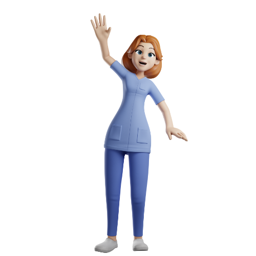</a> | **檔å:** `3d_CharacterNurse-14-88.png`<br>**尺寸:** 500x500<br>**大å°:** 61.29KB<br>**æ›´æ–°:** 2026-02-26 |
| <a href="images/3Ds/3D_CharacterNurse/3d_CharacterNurse-14-c8.webp"></a> | **檔å:** `3d_CharacterNurse-14-c8.webp`<br>**尺寸:** 500x500<br>**大å°:** 9.97KB<br>**æ›´æ–°:** 2026-02-26 |
| <a href="images/3Ds/3D_CharacterNurse/3d_CharacterNurse-15-92.webp"></a> | **檔å:** `3d_CharacterNurse-15-92.webp`<br>**尺寸:** 500x500<br>**大å°:** 10.06KB<br>**æ›´æ–°:** 2026-02-26 |
| <a href="images/3Ds/3D_CharacterNurse/3d_CharacterNurse-15-ec.png"></a> | **檔å:** `3d_CharacterNurse-15-ec.png`<br>**尺寸:** 500x500<br>**大å°:** 66.93KB<br>**æ›´æ–°:** 2026-02-26 |
| <a href="images/3Ds/3D_CharacterNurse/3d_CharacterNurse-2-2c.png"></a> | **檔å:** `3d_CharacterNurse-2-2c.png`<br>**尺寸:** 500x500<br>**大å°:** 63.55KB<br>**æ›´æ–°:** 2026-02-26 |
| <a href="images/3Ds/3D_CharacterNurse/3d_CharacterNurse-2-e0.webp"></a> | **檔å:** `3d_CharacterNurse-2-e0.webp`<br>**尺寸:** 500x500<br>**大å°:** 9.17KB<br>**æ›´æ–°:** 2026-02-26 |
| <a href="images/3Ds/3D_CharacterNurse/3d_CharacterNurse-3-24.png"></a> | **檔å:** `3d_CharacterNurse-3-24.png`<br>**尺寸:** 500x500<br>**大å°:** 65.11KB<br>**æ›´æ–°:** 2026-02-26 |
| <a href="images/3Ds/3D_CharacterNurse/3d_CharacterNurse-3-45.webp"></a> | **檔å:** `3d_CharacterNurse-3-45.webp`<br>**尺寸:** 500x500<br>**大å°:** 9.51KB<br>**æ›´æ–°:** 2026-02-26 |
| <a href="images/3Ds/3D_CharacterNurse/3d_CharacterNurse-4-b4.png"></a> | **檔å:** `3d_CharacterNurse-4-b4.png`<br>**尺寸:** 500x500<br>**大å°:** 82.60KB<br>**æ›´æ–°:** 2026-02-26 |
| <a href="images/3Ds/3D_CharacterNurse/3d_CharacterNurse-4-fc.webp"></a> | **檔å:** `3d_CharacterNurse-4-fc.webp`<br>**尺寸:** 500x500<br>**大å°:** 13.68KB<br>**æ›´æ–°:** 2026-02-26 |
| <a href="images/3Ds/3D_CharacterNurse/3d_CharacterNurse-5-45.png"></a> | **檔å:** `3d_CharacterNurse-5-45.png`<br>**尺寸:** 500x500<br>**大å°:** 58.54KB<br>**æ›´æ–°:** 2026-02-26 |
| <a href="images/3Ds/3D_CharacterNurse/3d_CharacterNurse-5-d0.webp"></a> | **檔å:** `3d_CharacterNurse-5-d0.webp`<br>**尺寸:** 500x500<br>**大å°:** 8.33KB<br>**æ›´æ–°:** 2026-02-26 |
| <a href="images/3Ds/3D_CharacterNurse/3d_CharacterNurse-6-7c.webp"></a> | **檔å:** `3d_CharacterNurse-6-7c.webp`<br>**尺寸:** 500x500<br>**大å°:** 10.46KB<br>**æ›´æ–°:** 2026-02-26 |
| <a href="images/3Ds/3D_CharacterNurse/3d_CharacterNurse-6-fc.png"></a> | **檔å:** `3d_CharacterNurse-6-fc.png`<br>**尺寸:** 500x500<br>**大å°:** 70.88KB<br>**æ›´æ–°:** 2026-02-26 |
| <a href="images/3Ds/3D_CharacterNurse/3d_CharacterNurse-7-3b.png"></a> | **檔å:** `3d_CharacterNurse-7-3b.png`<br>**尺寸:** 500x500<br>**大å°:** 66.29KB<br>**æ›´æ–°:** 2026-02-26 |
| <a href="images/3Ds/3D_CharacterNurse/3d_CharacterNurse-7-e1.webp"></a> | **檔å:** `3d_CharacterNurse-7-e1.webp`<br>**尺寸:** 500x500<br>**大å°:** 9.88KB<br>**æ›´æ–°:** 2026-02-26 |
| <a href="images/3Ds/3D_CharacterNurse/3d_CharacterNurse-8-53.png"></a> | **檔å:** `3d_CharacterNurse-8-53.png`<br>**尺寸:** 500x500<br>**大å°:** 53.08KB<br>**æ›´æ–°:** 2026-02-26 |
| <a href="images/3Ds/3D_CharacterNurse/3d_CharacterNurse-8-77.webp"></a> | **檔å:** `3d_CharacterNurse-8-77.webp`<br>**尺寸:** 500x500<br>**大å°:** 7.26KB<br>**æ›´æ–°:** 2026-02-26 |
| <a href="images/3Ds/3D_CharacterNurse/3d_CharacterNurse-9-7a.png">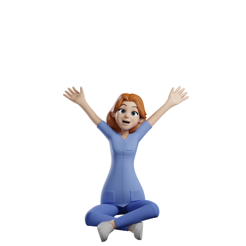</a> | **檔å:** `3d_CharacterNurse-9-7a.png`<br>**尺寸:** 500x500<br>**大å°:** 56.91KB<br>**æ›´æ–°:** 2026-02-26 |
| <a href="images/3Ds/3D_CharacterNurse/3d_CharacterNurse-9-82.webp">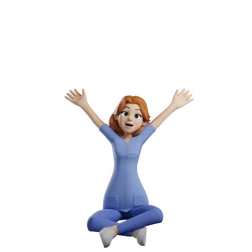</a> | **檔å:** `3d_CharacterNurse-9-82.webp`<br>**尺寸:** 500x500<br>**大å°:** 8.60KB<br>**æ›´æ–°:** 2026-02-26 |

### 📠3d_ecommercia

| é è¦½ (é»æ“Šæ”¾å¤§) | 檔案詳細資訊 |
| :--- | :--- |
| <a href="images/3Ds/3D_Ecommercia/3d-Icon-ecommercia-01-22.webp"></a> | **檔å:** `3d-Icon-ecommercia-01-22.webp`<br>**尺寸:** 500x500<br>**大å°:** 8.33KB<br>**æ›´æ–°:** 2026-02-26 |
| <a href="images/3Ds/3D_Ecommercia/3d-Icon-ecommercia-01-3b.png"></a> | **檔å:** `3d-Icon-ecommercia-01-3b.png`<br>**尺寸:** 500x500<br>**大å°:** 68.35KB<br>**æ›´æ–°:** 2026-02-26 |
| <a href="images/3Ds/3D_Ecommercia/3d-Icon-ecommercia-010-48.webp"></a> | **檔å:** `3d-Icon-ecommercia-010-48.webp`<br>**尺寸:** 500x500<br>**大å°:** 8.90KB<br>**æ›´æ–°:** 2026-02-26 |
| <a href="images/3Ds/3D_Ecommercia/3d-Icon-ecommercia-010-78.png"></a> | **檔å:** `3d-Icon-ecommercia-010-78.png`<br>**尺寸:** 500x500<br>**大å°:** 50.03KB<br>**æ›´æ–°:** 2026-02-26 |
| <a href="images/3Ds/3D_Ecommercia/3d-Icon-ecommercia-011-58.png"></a> | **檔å:** `3d-Icon-ecommercia-011-58.png`<br>**尺寸:** 500x500<br>**大å°:** 44.65KB<br>**æ›´æ–°:** 2026-02-26 |
| <a href="images/3Ds/3D_Ecommercia/3d-Icon-ecommercia-011-cb.webp"></a> | **檔å:** `3d-Icon-ecommercia-011-cb.webp`<br>**尺寸:** 500x500<br>**大å°:** 5.73KB<br>**æ›´æ–°:** 2026-02-26 |
| <a href="images/3Ds/3D_Ecommercia/3d-Icon-ecommercia-012-0b.webp"></a> | **檔å:** `3d-Icon-ecommercia-012-0b.webp`<br>**尺寸:** 500x500<br>**大å°:** 7.35KB<br>**æ›´æ–°:** 2026-02-26 |
| <a href="images/3Ds/3D_Ecommercia/3d-Icon-ecommercia-012-51.png"></a> | **檔å:** `3d-Icon-ecommercia-012-51.png`<br>**尺寸:** 500x500<br>**大å°:** 50.50KB<br>**æ›´æ–°:** 2026-02-26 |
| <a href="images/3Ds/3D_Ecommercia/3d-Icon-ecommercia-013-17.png"></a> | **檔å:** `3d-Icon-ecommercia-013-17.png`<br>**尺寸:** 500x500<br>**大å°:** 73.08KB<br>**æ›´æ–°:** 2026-02-26 |
| <a href="images/3Ds/3D_Ecommercia/3d-Icon-ecommercia-013-31.webp"></a> | **檔å:** `3d-Icon-ecommercia-013-31.webp`<br>**尺寸:** 500x500<br>**大å°:** 7.92KB<br>**æ›´æ–°:** 2026-02-26 |
| <a href="images/3Ds/3D_Ecommercia/3d-Icon-ecommercia-014-61.png">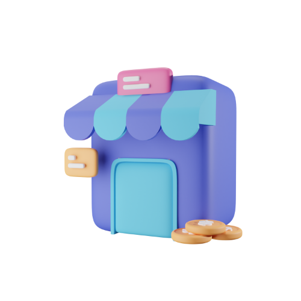</a> | **檔å:** `3d-Icon-ecommercia-014-61.png`<br>**尺寸:** 500x500<br>**大å°:** 62.76KB<br>**æ›´æ–°:** 2026-02-26 |
| <a href="images/3Ds/3D_Ecommercia/3d-Icon-ecommercia-014-9b.webp">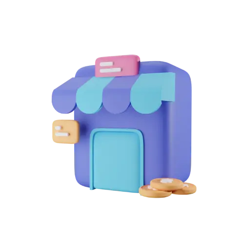</a> | **檔å:** `3d-Icon-ecommercia-014-9b.webp`<br>**尺寸:** 500x500<br>**大å°:** 7.55KB<br>**æ›´æ–°:** 2026-02-26 |
| <a href="images/3Ds/3D_Ecommercia/3d-Icon-ecommercia-015-05.webp"></a> | **檔å:** `3d-Icon-ecommercia-015-05.webp`<br>**尺寸:** 500x500<br>**大å°:** 8.19KB<br>**æ›´æ–°:** 2026-02-26 |
| <a href="images/3Ds/3D_Ecommercia/3d-Icon-ecommercia-02-08.webp"></a> | **檔å:** `3d-Icon-ecommercia-02-08.webp`<br>**尺寸:** 500x500<br>**大å°:** 5.99KB<br>**æ›´æ–°:** 2026-02-26 |
| <a href="images/3Ds/3D_Ecommercia/3d-Icon-ecommercia-02-a8.png"></a> | **檔å:** `3d-Icon-ecommercia-02-a8.png`<br>**尺寸:** 500x500<br>**大å°:** 44.51KB<br>**æ›´æ–°:** 2026-02-26 |
| <a href="images/3Ds/3D_Ecommercia/3d-Icon-ecommercia-03-23.webp"></a> | **檔å:** `3d-Icon-ecommercia-03-23.webp`<br>**尺寸:** 500x500<br>**大å°:** 4.71KB<br>**æ›´æ–°:** 2026-02-26 |
| <a href="images/3Ds/3D_Ecommercia/3d-Icon-ecommercia-03-44.png"></a> | **檔å:** `3d-Icon-ecommercia-03-44.png`<br>**尺寸:** 500x500<br>**大å°:** 48.15KB<br>**æ›´æ–°:** 2026-02-26 |
| <a href="images/3Ds/3D_Ecommercia/3d-Icon-ecommercia-04-19.png"></a> | **檔å:** `3d-Icon-ecommercia-04-19.png`<br>**尺寸:** 500x500<br>**大å°:** 52.05KB<br>**æ›´æ–°:** 2026-02-26 |
| <a href="images/3Ds/3D_Ecommercia/3d-Icon-ecommercia-04-23.webp"></a> | **檔å:** `3d-Icon-ecommercia-04-23.webp`<br>**尺寸:** 500x500<br>**大å°:** 6.15KB<br>**æ›´æ–°:** 2026-02-26 |
| <a href="images/3Ds/3D_Ecommercia/3d-Icon-ecommercia-05-b4.webp"></a> | **檔å:** `3d-Icon-ecommercia-05-b4.webp`<br>**尺寸:** 500x500<br>**大å°:** 12.85KB<br>**æ›´æ–°:** 2026-02-26 |
| <a href="images/3Ds/3D_Ecommercia/3d-Icon-ecommercia-05-bc.png"></a> | **檔å:** `3d-Icon-ecommercia-05-bc.png`<br>**尺寸:** 500x500<br>**大å°:** 87.48KB<br>**æ›´æ–°:** 2026-02-26 |
| <a href="images/3Ds/3D_Ecommercia/3d-Icon-ecommercia-06-02.png"></a> | **檔å:** `3d-Icon-ecommercia-06-02.png`<br>**尺寸:** 500x500<br>**大å°:** 81.63KB<br>**æ›´æ–°:** 2026-02-26 |
| <a href="images/3Ds/3D_Ecommercia/3d-Icon-ecommercia-06-ee.webp"></a> | **檔å:** `3d-Icon-ecommercia-06-ee.webp`<br>**尺寸:** 500x500<br>**大å°:** 9.86KB<br>**æ›´æ–°:** 2026-02-26 |
| <a href="images/3Ds/3D_Ecommercia/3d-Icon-ecommercia-07-17.png"></a> | **檔å:** `3d-Icon-ecommercia-07-17.png`<br>**尺寸:** 500x500<br>**大å°:** 38.34KB<br>**æ›´æ–°:** 2026-02-26 |
| <a href="images/3Ds/3D_Ecommercia/3d-Icon-ecommercia-07-64.webp"></a> | **檔å:** `3d-Icon-ecommercia-07-64.webp`<br>**尺寸:** 500x500<br>**大å°:** 6.46KB<br>**æ›´æ–°:** 2026-02-26 |
| <a href="images/3Ds/3D_Ecommercia/3d-Icon-ecommercia-08-43.webp"></a> | **檔å:** `3d-Icon-ecommercia-08-43.webp`<br>**尺寸:** 500x500<br>**大å°:** 6.25KB<br>**æ›´æ–°:** 2026-02-26 |
| <a href="images/3Ds/3D_Ecommercia/3d-Icon-ecommercia-08-61.png"></a> | **檔å:** `3d-Icon-ecommercia-08-61.png`<br>**尺寸:** 500x500<br>**大å°:** 51.96KB<br>**æ›´æ–°:** 2026-02-26 |
| <a href="images/3Ds/3D_Ecommercia/3d-Icon-ecommercia-09-4c.webp">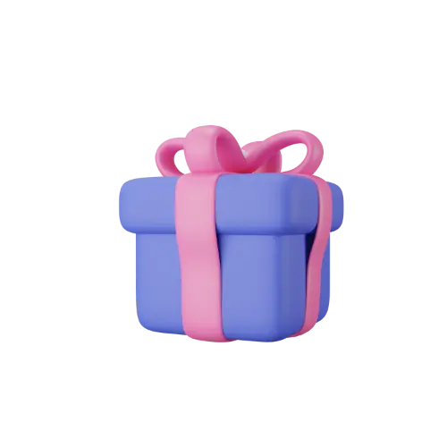</a> | **檔å:** `3d-Icon-ecommercia-09-4c.webp`<br>**尺寸:** 500x500<br>**大å°:** 6.61KB<br>**æ›´æ–°:** 2026-02-26 |
| <a href="images/3Ds/3D_Ecommercia/3d-Icon-ecommercia-09-60.png"></a> | **檔å:** `3d-Icon-ecommercia-09-60.png`<br>**尺寸:** 500x500<br>**大å°:** 48.57KB<br>**æ›´æ–°:** 2026-02-26 |

### 📠3d_education

| é è¦½ (é»æ“Šæ”¾å¤§) | 檔案詳細資訊 |
| :--- | :--- |
| <a href="images/3Ds/3D_Education/BackPack-60.webp"></a> | **檔å:** `BackPack-60.webp`<br>**尺寸:** 3000x3000<br>**大å°:** 81.25KB<br>**æ›´æ–°:** 2026-02-26 |
| <a href="images/3Ds/3D_Education/BackPack-b3.png"></a> | **檔å:** `BackPack-b3.png`<br>**尺寸:** 3000x3000<br>**大å°:** 15.80MB<br>**æ›´æ–°:** 2026-02-26 |
| <a href="images/3Ds/3D_Education/BlackBoard-8c.webp"></a> | **檔å:** `BlackBoard-8c.webp`<br>**尺寸:** 3000x3000<br>**大å°:** 74.36KB<br>**æ›´æ–°:** 2026-02-26 |
| <a href="images/3Ds/3D_Education/BlackBoard-da.png"></a> | **檔å:** `BlackBoard-da.png`<br>**尺寸:** 3000x3000<br>**大å°:** 10.90MB<br>**æ›´æ–°:** 2026-02-26 |
| <a href="images/3Ds/3D_Education/Brush-69.png"></a> | **檔å:** `Brush-69.png`<br>**尺寸:** 3000x3000<br>**大å°:** 10.28MB<br>**æ›´æ–°:** 2026-02-26 |
| <a href="images/3Ds/3D_Education/Brush-b7.webp"></a> | **檔å:** `Brush-b7.webp`<br>**尺寸:** 3000x3000<br>**大å°:** 80.04KB<br>**æ›´æ–°:** 2026-02-26 |
| <a href="images/3Ds/3D_Education/Calculator-19.png"></a> | **檔å:** `Calculator-19.png`<br>**尺寸:** 3000x3000<br>**大å°:** 23.08MB<br>**æ›´æ–°:** 2026-02-26 |
| <a href="images/3Ds/3D_Education/Calculator-89.webp"></a> | **檔å:** `Calculator-89.webp`<br>**尺寸:** 3000x3000<br>**大å°:** 177.73KB<br>**æ›´æ–°:** 2026-02-26 |
| <a href="images/3Ds/3D_Education/Education Certificate-15.webp"></a> | **檔å:** `Education Certificate-15.webp`<br>**尺寸:** 3000x3000<br>**大å°:** 141.17KB<br>**æ›´æ–°:** 2026-02-26 |
| <a href="images/3Ds/3D_Education/Education Certificate-c3.png"></a> | **檔å:** `Education Certificate-c3.png`<br>**尺寸:** 3000x3000<br>**大å°:** 19.72MB<br>**æ›´æ–°:** 2026-02-26 |
| <a href="images/3Ds/3D_Education/Education Trophy-8b.png"></a> | **檔å:** `Education Trophy-8b.png`<br>**尺寸:** 3000x3000<br>**大å°:** 13.99MB<br>**æ›´æ–°:** 2026-02-26 |
| <a href="images/3Ds/3D_Education/Education Trophy-bd.webp"></a> | **檔å:** `Education Trophy-bd.webp`<br>**尺寸:** 3000x3000<br>**大å°:** 133.41KB<br>**æ›´æ–°:** 2026-02-26 |
| <a href="images/3Ds/3D_Education/Grauduation Hat-65.png"></a> | **檔å:** `Grauduation Hat-65.png`<br>**尺寸:** 3000x3000<br>**大å°:** 12.55MB<br>**æ›´æ–°:** 2026-02-26 |
| <a href="images/3Ds/3D_Education/Grauduation Hat-f5.webp"></a> | **檔å:** `Grauduation Hat-f5.webp`<br>**尺寸:** 3000x3000<br>**大å°:** 111.40KB<br>**æ›´æ–°:** 2026-02-26 |
| <a href="images/3Ds/3D_Education/Knowledge-e1.png"></a> | **檔å:** `Knowledge-e1.png`<br>**尺寸:** 3000x3000<br>**大å°:** 12.83MB<br>**æ›´æ–°:** 2026-02-26 |
| <a href="images/3Ds/3D_Education/Knowledge-ef.webp"></a> | **檔å:** `Knowledge-ef.webp`<br>**尺寸:** 3000x3000<br>**大å°:** 154.96KB<br>**æ›´æ–°:** 2026-02-26 |
| <a href="images/3Ds/3D_Education/Medal-b4.webp"></a> | **檔å:** `Medal-b4.webp`<br>**尺寸:** 3000x3000<br>**大å°:** 78.83KB<br>**æ›´æ–°:** 2026-02-26 |
| <a href="images/3Ds/3D_Education/Medal-cd.png"></a> | **檔å:** `Medal-cd.png`<br>**尺寸:** 3000x3000<br>**大å°:** 13.27MB<br>**æ›´æ–°:** 2026-02-26 |
| <a href="images/3Ds/3D_Education/Microscope-80.png"></a> | **檔å:** `Microscope-80.png`<br>**尺寸:** 3000x3000<br>**大å°:** 9.70MB<br>**æ›´æ–°:** 2026-02-26 |
| <a href="images/3Ds/3D_Education/Microscope-b7.webp"></a> | **檔å:** `Microscope-b7.webp`<br>**尺寸:** 3000x3000<br>**大å°:** 82.50KB<br>**æ›´æ–°:** 2026-02-26 |
| <a href="images/3Ds/3D_Education/Pencil And Ruller-06.webp"></a> | **檔å:** `Pencil And Ruller-06.webp`<br>**尺寸:** 3000x3000<br>**大å°:** 116.73KB<br>**æ›´æ–°:** 2026-02-26 |
| <a href="images/3Ds/3D_Education/Pencil And Ruller-d5.png"></a> | **檔å:** `Pencil And Ruller-d5.png`<br>**尺寸:** 3000x3000<br>**大å°:** 14.75MB<br>**æ›´æ–°:** 2026-02-26 |

### 📠3d_educations

| é è¦½ (é»æ“Šæ”¾å¤§) | 檔案詳細資訊 |
| :--- | :--- |
| <a href="images/3Ds/3D_Educations/3d-Icon-education-01-4a.webp"></a> | **檔å:** `3d-Icon-education-01-4a.webp`<br>**尺寸:** 500x500<br>**大å°:** 8.06KB<br>**æ›´æ–°:** 2026-02-26 |
| <a href="images/3Ds/3D_Educations/3d-Icon-education-01-cd.png"></a> | **檔å:** `3d-Icon-education-01-cd.png`<br>**尺寸:** 500x500<br>**大å°:** 83.03KB<br>**æ›´æ–°:** 2026-02-26 |
| <a href="images/3Ds/3D_Educations/3d-Icon-education-010-db.png"></a> | **檔å:** `3d-Icon-education-010-db.png`<br>**尺寸:** 500x500<br>**大å°:** 80.87KB<br>**æ›´æ–°:** 2026-02-26 |
| <a href="images/3Ds/3D_Educations/3d-Icon-education-010-eb.webp"></a> | **檔å:** `3d-Icon-education-010-eb.webp`<br>**尺寸:** 500x500<br>**大å°:** 8.99KB<br>**æ›´æ–°:** 2026-02-26 |
| <a href="images/3Ds/3D_Educations/3d-Icon-education-011-62.webp"></a> | **檔å:** `3d-Icon-education-011-62.webp`<br>**尺寸:** 500x500<br>**大å°:** 10.60KB<br>**æ›´æ–°:** 2026-02-26 |
| <a href="images/3Ds/3D_Educations/3d-Icon-education-011-8e.png"></a> | **檔å:** `3d-Icon-education-011-8e.png`<br>**尺寸:** 500x500<br>**大å°:** 92.69KB<br>**æ›´æ–°:** 2026-02-26 |
| <a href="images/3Ds/3D_Educations/3d-Icon-education-012-25.webp"></a> | **檔å:** `3d-Icon-education-012-25.webp`<br>**尺寸:** 500x500<br>**大å°:** 8.60KB<br>**æ›´æ–°:** 2026-02-26 |
| <a href="images/3Ds/3D_Educations/3d-Icon-education-012-4b.png"></a> | **檔å:** `3d-Icon-education-012-4b.png`<br>**尺寸:** 500x500<br>**大å°:** 88.04KB<br>**æ›´æ–°:** 2026-02-26 |
| <a href="images/3Ds/3D_Educations/3d-Icon-education-013-0a.png">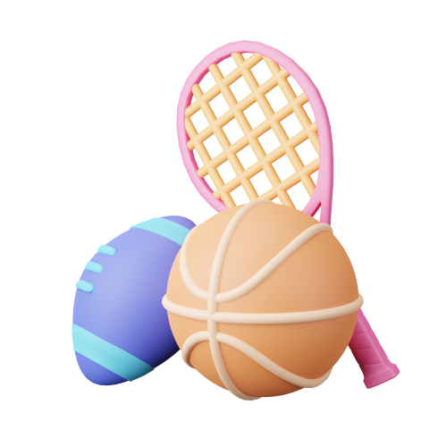</a> | **檔å:** `3d-Icon-education-013-0a.png`<br>**尺寸:** 500x500<br>**大å°:** 111.80KB<br>**æ›´æ–°:** 2026-02-26 |
| <a href="images/3Ds/3D_Educations/3d-Icon-education-013-fa.webp"></a> | **檔å:** `3d-Icon-education-013-fa.webp`<br>**尺寸:** 500x500<br>**大å°:** 18.31KB<br>**æ›´æ–°:** 2026-02-26 |
| <a href="images/3Ds/3D_Educations/3d-Icon-education-014-40.webp"></a> | **檔å:** `3d-Icon-education-014-40.webp`<br>**尺寸:** 500x500<br>**大å°:** 7.92KB<br>**æ›´æ–°:** 2026-02-26 |
| <a href="images/3Ds/3D_Educations/3d-Icon-education-014-f5.png"></a> | **檔å:** `3d-Icon-education-014-f5.png`<br>**尺寸:** 500x500<br>**大å°:** 68.28KB<br>**æ›´æ–°:** 2026-02-26 |
| <a href="images/3Ds/3D_Educations/3d-Icon-education-015-0d.webp"></a> | **檔å:** `3d-Icon-education-015-0d.webp`<br>**尺寸:** 500x500<br>**大å°:** 9.87KB<br>**æ›´æ–°:** 2026-02-26 |
| <a href="images/3Ds/3D_Educations/3d-Icon-education-015-26.png"></a> | **檔å:** `3d-Icon-education-015-26.png`<br>**尺寸:** 500x500<br>**大å°:** 93.61KB<br>**æ›´æ–°:** 2026-02-26 |
| <a href="images/3Ds/3D_Educations/3d-Icon-education-016-86.webp"></a> | **檔å:** `3d-Icon-education-016-86.webp`<br>**尺寸:** 500x500<br>**大å°:** 7.85KB<br>**æ›´æ–°:** 2026-02-26 |
| <a href="images/3Ds/3D_Educations/3d-Icon-education-016-d6.png"></a> | **檔å:** `3d-Icon-education-016-d6.png`<br>**尺寸:** 500x500<br>**大å°:** 66.64KB<br>**æ›´æ–°:** 2026-02-26 |
| <a href="images/3Ds/3D_Educations/3d-Icon-education-017-3c.webp"></a> | **檔å:** `3d-Icon-education-017-3c.webp`<br>**尺寸:** 500x500<br>**大å°:** 9.31KB<br>**æ›´æ–°:** 2026-02-26 |
| <a href="images/3Ds/3D_Educations/3d-Icon-education-017-69.png"></a> | **檔å:** `3d-Icon-education-017-69.png`<br>**尺寸:** 500x500<br>**大å°:** 91.05KB<br>**æ›´æ–°:** 2026-02-26 |
| <a href="images/3Ds/3D_Educations/3d-Icon-education-018-82.webp"></a> | **檔å:** `3d-Icon-education-018-82.webp`<br>**尺寸:** 500x500<br>**大å°:** 11.00KB<br>**æ›´æ–°:** 2026-02-26 |
| <a href="images/3Ds/3D_Educations/3d-Icon-education-018-e7.png"></a> | **檔å:** `3d-Icon-education-018-e7.png`<br>**尺寸:** 500x500<br>**大å°:** 82.87KB<br>**æ›´æ–°:** 2026-02-26 |
| <a href="images/3Ds/3D_Educations/3d-Icon-education-019-77.webp"></a> | **檔å:** `3d-Icon-education-019-77.webp`<br>**尺寸:** 500x500<br>**大å°:** 11.76KB<br>**æ›´æ–°:** 2026-02-26 |
| <a href="images/3Ds/3D_Educations/3d-Icon-education-019-7f.png"></a> | **檔å:** `3d-Icon-education-019-7f.png`<br>**尺寸:** 500x500<br>**大å°:** 83.84KB<br>**æ›´æ–°:** 2026-02-26 |
| <a href="images/3Ds/3D_Educations/3d-Icon-education-02-93.png"></a> | **檔å:** `3d-Icon-education-02-93.png`<br>**尺寸:** 500x500<br>**大å°:** 78.69KB<br>**æ›´æ–°:** 2026-02-26 |
| <a href="images/3Ds/3D_Educations/3d-Icon-education-02-a8.webp"></a> | **檔å:** `3d-Icon-education-02-a8.webp`<br>**尺寸:** 500x500<br>**大å°:** 7.94KB<br>**æ›´æ–°:** 2026-02-26 |
| <a href="images/3Ds/3D_Educations/3d-Icon-education-020-01.png"></a> | **檔å:** `3d-Icon-education-020-01.png`<br>**尺寸:** 500x500<br>**大å°:** 70.18KB<br>**æ›´æ–°:** 2026-02-26 |
| <a href="images/3Ds/3D_Educations/3d-Icon-education-020-a1.webp"></a> | **檔å:** `3d-Icon-education-020-a1.webp`<br>**尺寸:** 500x500<br>**大å°:** 10.19KB<br>**æ›´æ–°:** 2026-02-26 |
| <a href="images/3Ds/3D_Educations/3d-Icon-education-03-15.png"></a> | **檔å:** `3d-Icon-education-03-15.png`<br>**尺寸:** 500x500<br>**大å°:** 95.58KB<br>**æ›´æ–°:** 2026-02-26 |
| <a href="images/3Ds/3D_Educations/3d-Icon-education-03-49.webp"></a> | **檔å:** `3d-Icon-education-03-49.webp`<br>**尺寸:** 500x500<br>**大å°:** 9.59KB<br>**æ›´æ–°:** 2026-02-26 |
| <a href="images/3Ds/3D_Educations/3d-Icon-education-04-0a.webp"></a> | **檔å:** `3d-Icon-education-04-0a.webp`<br>**尺寸:** 500x500<br>**大å°:** 8.94KB<br>**æ›´æ–°:** 2026-02-26 |
| <a href="images/3Ds/3D_Educations/3d-Icon-education-04-59.png"></a> | **檔å:** `3d-Icon-education-04-59.png`<br>**尺寸:** 500x500<br>**大å°:** 88.94KB<br>**æ›´æ–°:** 2026-02-26 |
| <a href="images/3Ds/3D_Educations/3d-Icon-education-05-2b.png"></a> | **檔å:** `3d-Icon-education-05-2b.png`<br>**尺寸:** 500x500<br>**大å°:** 79.17KB<br>**æ›´æ–°:** 2026-02-26 |
| <a href="images/3Ds/3D_Educations/3d-Icon-education-05-c3.webp">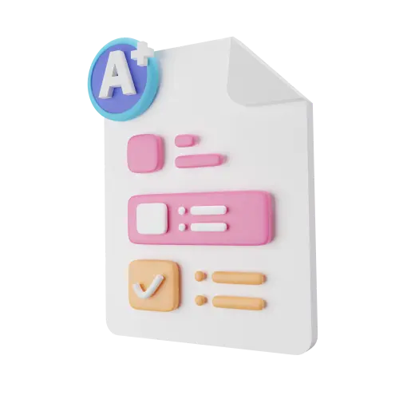</a> | **檔å:** `3d-Icon-education-05-c3.webp`<br>**尺寸:** 500x500<br>**大å°:** 7.25KB<br>**æ›´æ–°:** 2026-02-26 |
| <a href="images/3Ds/3D_Educations/3d-Icon-education-06-35.png"></a> | **檔å:** `3d-Icon-education-06-35.png`<br>**尺寸:** 500x500<br>**大å°:** 89.86KB<br>**æ›´æ–°:** 2026-02-26 |
| <a href="images/3Ds/3D_Educations/3d-Icon-education-06-79.webp"></a> | **檔å:** `3d-Icon-education-06-79.webp`<br>**尺寸:** 500x500<br>**大å°:** 15.95KB<br>**æ›´æ–°:** 2026-02-26 |
| <a href="images/3Ds/3D_Educations/3d-Icon-education-07-49.png"></a> | **檔å:** `3d-Icon-education-07-49.png`<br>**尺寸:** 500x500<br>**大å°:** 73.73KB<br>**æ›´æ–°:** 2026-02-26 |
| <a href="images/3Ds/3D_Educations/3d-Icon-education-07-a5.webp"></a> | **檔å:** `3d-Icon-education-07-a5.webp`<br>**尺寸:** 500x500<br>**大å°:** 10.54KB<br>**æ›´æ–°:** 2026-02-26 |
| <a href="images/3Ds/3D_Educations/3d-Icon-education-08-1d.png"></a> | **檔å:** `3d-Icon-education-08-1d.png`<br>**尺寸:** 500x500<br>**大å°:** 83.89KB<br>**æ›´æ–°:** 2026-02-26 |
| <a href="images/3Ds/3D_Educations/3d-Icon-education-08-8e.webp"></a> | **檔å:** `3d-Icon-education-08-8e.webp`<br>**尺寸:** 500x500<br>**大å°:** 10.51KB<br>**æ›´æ–°:** 2026-02-26 |
| <a href="images/3Ds/3D_Educations/3d-Icon-education-09-51.png"></a> | **檔å:** `3d-Icon-education-09-51.png`<br>**尺寸:** 500x500<br>**大å°:** 97.32KB<br>**æ›´æ–°:** 2026-02-26 |
| <a href="images/3Ds/3D_Educations/3d-Icon-education-09-70.webp">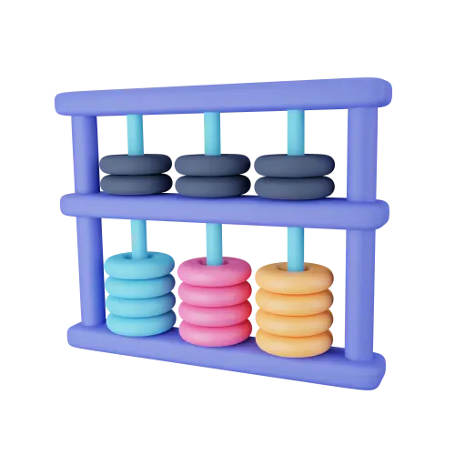</a> | **檔å:** `3d-Icon-education-09-70.webp`<br>**尺寸:** 500x500<br>**大å°:** 16.58KB<br>**æ›´æ–°:** 2026-02-26 |

### 📠3d_emojis

| é è¦½ (é»æ“Šæ”¾å¤§) | 檔案詳細資訊 |
| :--- | :--- |
| <a href="images/3Ds/3D_Emojis/Black-Claps-bf.png"></a> | **檔å:** `Black-Claps-bf.png`<br>**尺寸:** 1000x1000<br>**大å°:** 42.80KB<br>**æ›´æ–°:** 2026-02-26 |
| <a href="images/3Ds/3D_Emojis/Black-Claps_Black-22.png"></a> | **檔å:** `Black-Claps_Black-22.png`<br>**尺寸:** 1000x1000<br>**大å°:** 39.99KB<br>**æ›´æ–°:** 2026-02-26 |
| <a href="images/3Ds/3D_Emojis/Black-Cool-be.png"></a> | **檔å:** `Black-Cool-be.png`<br>**尺寸:** 1000x1000<br>**大å°:** 35.77KB<br>**æ›´æ–°:** 2026-02-26 |
| <a href="images/3Ds/3D_Emojis/Black-CryingWithLaughter-19.png"></a> | **檔å:** `Black-CryingWithLaughter-19.png`<br>**尺寸:** 1000x1000<br>**大å°:** 40.57KB<br>**æ›´æ–°:** 2026-02-26 |
| <a href="images/3Ds/3D_Emojis/Black-Envy-0c.png"></a> | **檔å:** `Black-Envy-0c.png`<br>**尺寸:** 1000x1000<br>**大å°:** 39.95KB<br>**æ›´æ–°:** 2026-02-26 |
| <a href="images/3Ds/3D_Emojis/Black-FaceWithMask-36.png">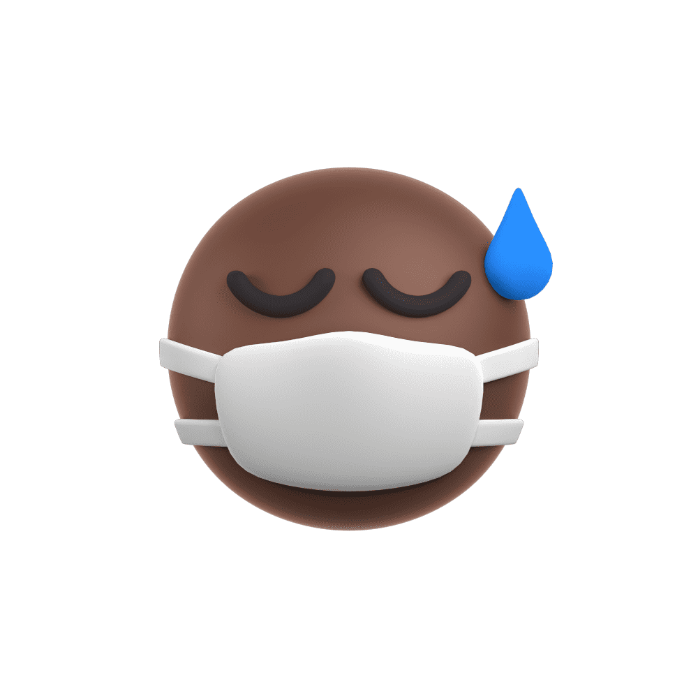</a> | **檔å:** `Black-FaceWithMask-36.png`<br>**尺寸:** 1000x1000<br>**大å°:** 37.65KB<br>**æ›´æ–°:** 2026-02-26 |
| <a href="images/3Ds/3D_Emojis/Black-FaceWithTongue-b5.png"></a> | **檔å:** `Black-FaceWithTongue-b5.png`<br>**尺寸:** 1000x1000<br>**大å°:** 36.74KB<br>**æ›´æ–°:** 2026-02-26 |
| <a href="images/3Ds/3D_Emojis/Black-Festive-ee.png"></a> | **檔å:** `Black-Festive-ee.png`<br>**尺寸:** 1000x1000<br>**大å°:** 49.26KB<br>**æ›´æ–°:** 2026-02-26 |
| <a href="images/3Ds/3D_Emojis/Black-Giggle-5a.png"></a> | **檔å:** `Black-Giggle-5a.png`<br>**尺寸:** 1000x1000<br>**大å°:** 35.87KB<br>**æ›´æ–°:** 2026-02-26 |
| <a href="images/3Ds/3D_Emojis/Black-Hi-fa.png"></a> | **檔å:** `Black-Hi-fa.png`<br>**尺寸:** 1000x1000<br>**大å°:** 39.37KB<br>**æ›´æ–°:** 2026-02-26 |
| <a href="images/3Ds/3D_Emojis/Black-HighFive-61.png"></a> | **檔å:** `Black-HighFive-61.png`<br>**尺寸:** 1000x1000<br>**大å°:** 39.24KB<br>**æ›´æ–°:** 2026-02-26 |
| <a href="images/3Ds/3D_Emojis/Black-Idea-f1.png"></a> | **檔å:** `Black-Idea-f1.png`<br>**尺寸:** 1000x1000<br>**大å°:** 36.07KB<br>**æ›´æ–°:** 2026-02-26 |
| <a href="images/3Ds/3D_Emojis/Black-InLove-1d.png"></a> | **檔å:** `Black-InLove-1d.png`<br>**尺寸:** 1000x1000<br>**大å°:** 39.80KB<br>**æ›´æ–°:** 2026-02-26 |
| <a href="images/3Ds/3D_Emojis/Black-Kiss-42.png"></a> | **檔å:** `Black-Kiss-42.png`<br>**尺寸:** 1000x1000<br>**大å°:** 39.94KB<br>**æ›´æ–°:** 2026-02-26 |
| <a href="images/3Ds/3D_Emojis/Black-Laugh-9b.png"></a> | **檔å:** `Black-Laugh-9b.png`<br>**尺寸:** 1000x1000<br>**大å°:** 34.46KB<br>**æ›´æ–°:** 2026-02-26 |
| <a href="images/3Ds/3D_Emojis/Black-Like-f9.png"></a> | **檔å:** `Black-Like-f9.png`<br>**尺寸:** 1000x1000<br>**大å°:** 39.86KB<br>**æ›´æ–°:** 2026-02-26 |
| <a href="images/3Ds/3D_Emojis/Black-MoneyMouthFace-eb.png"></a> | **檔å:** `Black-MoneyMouthFace-eb.png`<br>**尺寸:** 1000x1000<br>**大å°:** 36.27KB<br>**æ›´æ–°:** 2026-02-26 |
| <a href="images/3Ds/3D_Emojis/Black-Nauseated-eb.png"></a> | **檔å:** `Black-Nauseated-eb.png`<br>**尺寸:** 1000x1000<br>**大å°:** 39.84KB<br>**æ›´æ–°:** 2026-02-26 |
| <a href="images/3Ds/3D_Emojis/Black-Nerdy-52.png"></a> | **檔å:** `Black-Nerdy-52.png`<br>**尺寸:** 1000x1000<br>**大å°:** 34.70KB<br>**æ›´æ–°:** 2026-02-26 |
| <a href="images/3Ds/3D_Emojis/Black-Party-42.png"></a> | **檔å:** `Black-Party-42.png`<br>**尺寸:** 1000x1000<br>**大å°:** 64.40KB<br>**æ›´æ–°:** 2026-02-26 |
| <a href="images/3Ds/3D_Emojis/Black-Puke-c4.png"></a> | **檔å:** `Black-Puke-c4.png`<br>**尺寸:** 1000x1000<br>**大å°:** 37.14KB<br>**æ›´æ–°:** 2026-02-26 |
| <a href="images/3Ds/3D_Emojis/Black-Selfie-be.png">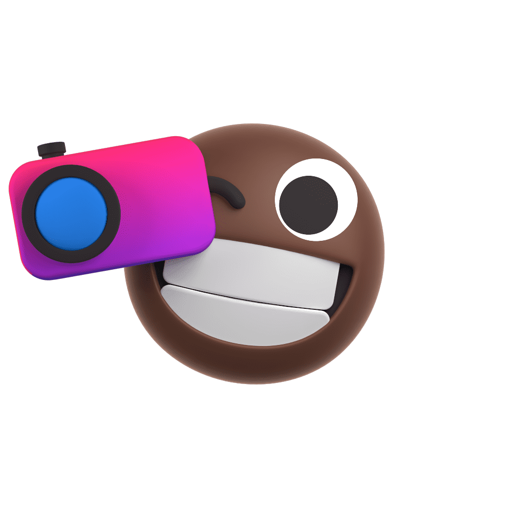</a> | **檔å:** `Black-Selfie-be.png`<br>**尺寸:** 1000x1000<br>**大å°:** 51.59KB<br>**æ›´æ–°:** 2026-02-26 |
| <a href="images/3Ds/3D_Emojis/Black-Sleepy-84.png"></a> | **檔å:** `Black-Sleepy-84.png`<br>**尺寸:** 1000x1000<br>**大å°:** 35.33KB<br>**æ›´æ–°:** 2026-02-26 |
| <a href="images/3Ds/3D_Emojis/Black-StarEyes-84.png"></a> | **檔å:** `Black-StarEyes-84.png`<br>**尺寸:** 1000x1000<br>**大å°:** 45.11KB<br>**æ›´æ–°:** 2026-02-26 |
| <a href="images/3Ds/3D_Emojis/Black-Steaming-77.png"></a> | **檔å:** `Black-Steaming-77.png`<br>**尺寸:** 1000x1000<br>**大å°:** 50.56KB<br>**æ›´æ–°:** 2026-02-26 |

### 📠3d_emojisgestures

| é è¦½ (é»æ“Šæ”¾å¤§) | 檔案詳細資訊 |
| :--- | :--- |
| <a href="images/3Ds/3D_EmojisGestures/Black-Claps-83.png"></a> | **檔å:** `Black-Claps-83.png`<br>**尺寸:** 1000x1000<br>**大å°:** 155.40KB<br>**æ›´æ–°:** 2026-02-26 |
| <a href="images/3Ds/3D_EmojisGestures/Black-GivingRight-f4.png"></a> | **檔å:** `Black-GivingRight-f4.png`<br>**尺寸:** 1000x1000<br>**大å°:** 68.16KB<br>**æ›´æ–°:** 2026-02-26 |
| <a href="images/3Ds/3D_EmojisGestures/Black-HandHoldingPencilRight-7d.png"></a> | **檔å:** `Black-HandHoldingPencilRight-7d.png`<br>**尺寸:** 1000x1000<br>**大å°:** 90.92KB<br>**æ›´æ–°:** 2026-02-26 |
| <a href="images/3Ds/3D_EmojisGestures/Black-Love-a2.png"></a> | **檔å:** `Black-Love-a2.png`<br>**尺寸:** 1000x1000<br>**大å°:** 97.12KB<br>**æ›´æ–°:** 2026-02-26 |
| <a href="images/3Ds/3D_EmojisGestures/Black-OkLeft-43.png"></a> | **檔å:** `Black-OkLeft-43.png`<br>**尺寸:** 1000x1000<br>**大å°:** 85.09KB<br>**æ›´æ–°:** 2026-02-26 |
| <a href="images/3Ds/3D_EmojisGestures/Black-OncomingFist-a6.png"></a> | **檔å:** `Black-OncomingFist-a6.png`<br>**尺寸:** 1000x1000<br>**大å°:** 63.24KB<br>**æ›´æ–°:** 2026-02-26 |
| <a href="images/3Ds/3D_EmojisGestures/Black-PinchingLeft-69.png"></a> | **檔å:** `Black-PinchingLeft-69.png`<br>**尺寸:** 1000x1000<br>**大å°:** 90.47KB<br>**æ›´æ–°:** 2026-02-26 |
| <a href="images/3Ds/3D_EmojisGestures/Black-PinchingRight-ce.png"></a> | **檔å:** `Black-PinchingRight-ce.png`<br>**尺寸:** 1000x1000<br>**大å°:** 88.52KB<br>**æ›´æ–°:** 2026-02-26 |
| <a href="images/3Ds/3D_EmojisGestures/Black-PointUp-2e.png"></a> | **檔å:** `Black-PointUp-2e.png`<br>**尺寸:** 1000x1000<br>**大å°:** 77.93KB<br>**æ›´æ–°:** 2026-02-26 |
| <a href="images/3Ds/3D_EmojisGestures/Black-PointUpFace-6b.png"></a> | **檔å:** `Black-PointUpFace-6b.png`<br>**尺寸:** 1000x1000<br>**大å°:** 89.40KB<br>**æ›´æ–°:** 2026-02-26 |
| <a href="images/3Ds/3D_EmojisGestures/Black-PointingRight-d0.png"></a> | **檔å:** `Black-PointingRight-d0.png`<br>**尺寸:** 1000x1000<br>**大å°:** 76.02KB<br>**æ›´æ–°:** 2026-02-26 |
| <a href="images/3Ds/3D_EmojisGestures/Black-Pray-4e.png"></a> | **檔å:** `Black-Pray-4e.png`<br>**尺寸:** 1000x1000<br>**大å°:** 93.61KB<br>**æ›´æ–°:** 2026-02-26 |
| <a href="images/3Ds/3D_EmojisGestures/Black-PunchRight-fd.png"></a> | **檔å:** `Black-PunchRight-fd.png`<br>**尺寸:** 1000x1000<br>**大å°:** 53.42KB<br>**æ›´æ–°:** 2026-02-26 |
| <a href="images/3Ds/3D_EmojisGestures/Black-RaisedFist-3b.png"></a> | **檔å:** `Black-RaisedFist-3b.png`<br>**尺寸:** 1000x1000<br>**大å°:** 80.67KB<br>**æ›´æ–°:** 2026-02-26 |
| <a href="images/3Ds/3D_EmojisGestures/Black-ThumbsDown-0e.png"></a> | **檔å:** `Black-ThumbsDown-0e.png`<br>**尺寸:** 1000x1000<br>**大å°:** 94.36KB<br>**æ›´æ–°:** 2026-02-26 |
| <a href="images/3Ds/3D_EmojisGestures/Black-VulcanSalute-cc.png"></a> | **檔å:** `Black-VulcanSalute-cc.png`<br>**尺寸:** 1000x1000<br>**大å°:** 104.95KB<br>**æ›´æ–°:** 2026-02-26 |
| <a href="images/3Ds/3D_EmojisGestures/Black-Wave-62.png">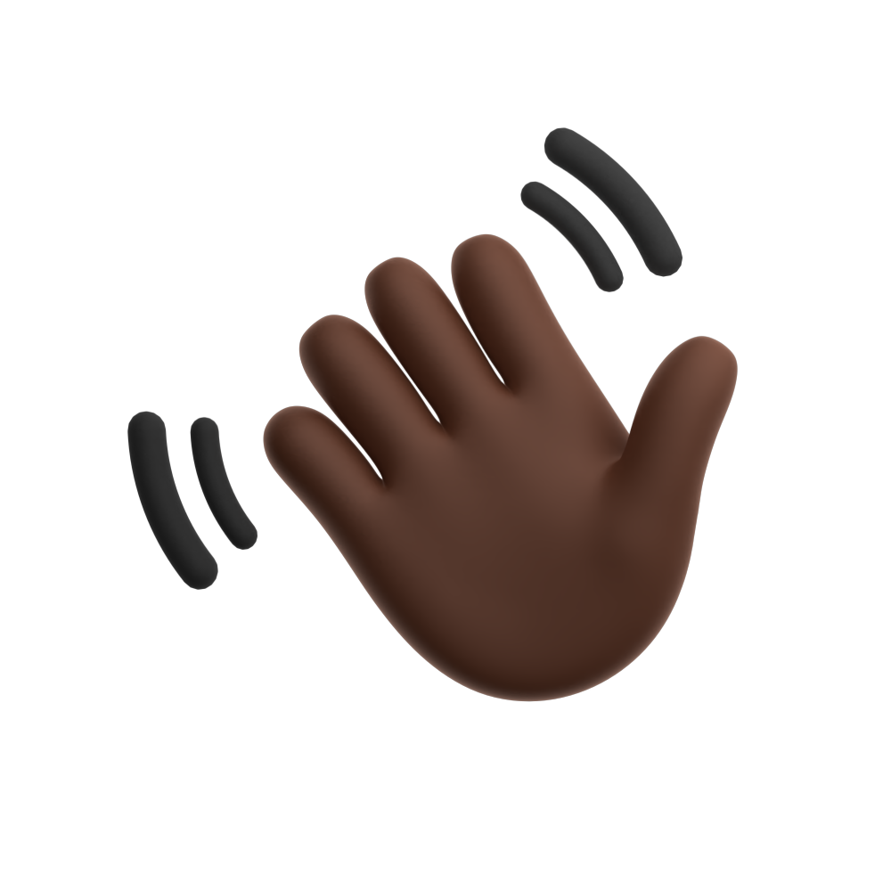</a> | **檔å:** `Black-Wave-62.png`<br>**尺寸:** 1000x1000<br>**大å°:** 152.58KB<br>**æ›´æ–°:** 2026-02-26 |
| <a href="images/3Ds/3D_EmojisGestures/Yellow-CallMe-e2.png"></a> | **檔å:** `Yellow-CallMe-e2.png`<br>**尺寸:** 1000x1000<br>**大å°:** 86.12KB<br>**æ›´æ–°:** 2026-02-26 |
| <a href="images/3Ds/3D_EmojisGestures/Yellow-Claps-89.png"></a> | **檔å:** `Yellow-Claps-89.png`<br>**尺寸:** 1000x1000<br>**大å°:** 171.40KB<br>**æ›´æ–°:** 2026-02-26 |
| <a href="images/3Ds/3D_EmojisGestures/Yellow-Hand-9b.png"></a> | **檔å:** `Yellow-Hand-9b.png`<br>**尺寸:** 1000x1000<br>**大å°:** 116.88KB<br>**æ›´æ–°:** 2026-02-26 |
| <a href="images/3Ds/3D_EmojisGestures/Yellow-HandHoldingPencilRight-2e.png"></a> | **檔å:** `Yellow-HandHoldingPencilRight-2e.png`<br>**尺寸:** 1000x1000<br>**大å°:** 95.96KB<br>**æ›´æ–°:** 2026-02-26 |
| <a href="images/3Ds/3D_EmojisGestures/Yellow-Horns-86.png"></a> | **檔å:** `Yellow-Horns-86.png`<br>**尺寸:** 1000x1000<br>**大å°:** 99.95KB<br>**æ›´æ–°:** 2026-02-26 |
| <a href="images/3Ds/3D_EmojisGestures/Yellow-Love-13.png"></a> | **檔å:** `Yellow-Love-13.png`<br>**尺寸:** 1000x1000<br>**大å°:** 106.74KB<br>**æ›´æ–°:** 2026-02-26 |
| <a href="images/3Ds/3D_EmojisGestures/Yellow-OncomingFist-37.png"></a> | **檔å:** `Yellow-OncomingFist-37.png`<br>**尺寸:** 1000x1000<br>**大å°:** 68.35KB<br>**æ›´æ–°:** 2026-02-26 |
| <a href="images/3Ds/3D_EmojisGestures/Yellow-PointingDown-e9.png"></a> | **檔å:** `Yellow-PointingDown-e9.png`<br>**尺寸:** 1000x1000<br>**大å°:** 86.28KB<br>**æ›´æ–°:** 2026-02-26 |
| <a href="images/3Ds/3D_EmojisGestures/Yellow-PointingLeft-18.png"></a> | **檔å:** `Yellow-PointingLeft-18.png`<br>**尺寸:** 1000x1000<br>**大å°:** 83.91KB<br>**æ›´æ–°:** 2026-02-26 |
| <a href="images/3Ds/3D_EmojisGestures/Yellow-PointingRight-32.png"></a> | **檔å:** `Yellow-PointingRight-32.png`<br>**尺寸:** 1000x1000<br>**大å°:** 84.29KB<br>**æ›´æ–°:** 2026-02-26 |
| <a href="images/3Ds/3D_EmojisGestures/Yellow-Poke-89.png"></a> | **檔å:** `Yellow-Poke-89.png`<br>**尺寸:** 1000x1000<br>**大å°:** 64.03KB<br>**æ›´æ–°:** 2026-02-26 |
| <a href="images/3Ds/3D_EmojisGestures/Yellow-Pray-04.png"></a> | **檔å:** `Yellow-Pray-04.png`<br>**尺寸:** 1000x1000<br>**大å°:** 97.75KB<br>**æ›´æ–°:** 2026-02-26 |
| <a href="images/3Ds/3D_EmojisGestures/Yellow-RaisedFist-60.png"></a> | **檔å:** `Yellow-RaisedFist-60.png`<br>**尺寸:** 1000x1000<br>**大å°:** 89.33KB<br>**æ›´æ–°:** 2026-02-26 |
| <a href="images/3Ds/3D_EmojisGestures/Yellow-ThumbsDown-df.png"></a> | **檔å:** `Yellow-ThumbsDown-df.png`<br>**尺寸:** 1000x1000<br>**大å°:** 102.95KB<br>**æ›´æ–°:** 2026-02-26 |
| <a href="images/3Ds/3D_EmojisGestures/Yellow-Victory-c6.png"></a> | **檔å:** `Yellow-Victory-c6.png`<br>**尺寸:** 1000x1000<br>**大å°:** 104.00KB<br>**æ›´æ–°:** 2026-02-26 |
| <a href="images/3Ds/3D_EmojisGestures/Yellow-Wave-72.png"></a> | **檔å:** `Yellow-Wave-72.png`<br>**尺寸:** 1000x1000<br>**大å°:** 169.31KB<br>**æ›´æ–°:** 2026-02-26 |

### 📠3d_finacially

| é è¦½ (é»æ“Šæ”¾å¤§) | 檔案詳細資訊 |
| :--- | :--- |
| <a href="images/3Ds/3D_Finacially/3d-Icon-finacially-01-19.webp"></a> | **檔å:** `3d-Icon-finacially-01-19.webp`<br>**尺寸:** 500x500<br>**大å°:** 5.37KB<br>**æ›´æ–°:** 2026-02-26 |
| <a href="images/3Ds/3D_Finacially/3d-Icon-finacially-01-b2.png"></a> | **檔å:** `3d-Icon-finacially-01-b2.png`<br>**尺寸:** 500x500<br>**大å°:** 41.06KB<br>**æ›´æ–°:** 2026-02-26 |
| <a href="images/3Ds/3D_Finacially/3d-Icon-finacially-010-8e.png"></a> | **檔å:** `3d-Icon-finacially-010-8e.png`<br>**尺寸:** 500x500<br>**大å°:** 84.70KB<br>**æ›´æ–°:** 2026-02-26 |
| <a href="images/3Ds/3D_Finacially/3d-Icon-finacially-010-c7.webp"></a> | **檔å:** `3d-Icon-finacially-010-c7.webp`<br>**尺寸:** 500x500<br>**大å°:** 9.28KB<br>**æ›´æ–°:** 2026-02-26 |
| <a href="images/3Ds/3D_Finacially/3d-Icon-finacially-011-5d.webp"></a> | **檔å:** `3d-Icon-finacially-011-5d.webp`<br>**尺寸:** 500x500<br>**大å°:** 8.11KB<br>**æ›´æ–°:** 2026-02-26 |
| <a href="images/3Ds/3D_Finacially/3d-Icon-finacially-011-78.png"></a> | **檔å:** `3d-Icon-finacially-011-78.png`<br>**尺寸:** 500x500<br>**大å°:** 60.66KB<br>**æ›´æ–°:** 2026-02-26 |
| <a href="images/3Ds/3D_Finacially/3d-Icon-finacially-012-29.webp"></a> | **檔å:** `3d-Icon-finacially-012-29.webp`<br>**尺寸:** 500x500<br>**大å°:** 8.69KB<br>**æ›´æ–°:** 2026-02-26 |
| <a href="images/3Ds/3D_Finacially/3d-Icon-finacially-012-6c.png"></a> | **檔å:** `3d-Icon-finacially-012-6c.png`<br>**尺寸:** 500x500<br>**大å°:** 84.94KB<br>**æ›´æ–°:** 2026-02-26 |
| <a href="images/3Ds/3D_Finacially/3d-Icon-finacially-013-0c.webp"></a> | **檔å:** `3d-Icon-finacially-013-0c.webp`<br>**尺寸:** 500x500<br>**大å°:** 6.31KB<br>**æ›´æ–°:** 2026-02-26 |
| <a href="images/3Ds/3D_Finacially/3d-Icon-finacially-013-2d.png"></a> | **檔å:** `3d-Icon-finacially-013-2d.png`<br>**尺寸:** 500x500<br>**大å°:** 46.02KB<br>**æ›´æ–°:** 2026-02-26 |
| <a href="images/3Ds/3D_Finacially/3d-Icon-finacially-014-68.webp"></a> | **檔å:** `3d-Icon-finacially-014-68.webp`<br>**尺寸:** 500x500<br>**大å°:** 7.54KB<br>**æ›´æ–°:** 2026-02-26 |
| <a href="images/3Ds/3D_Finacially/3d-Icon-finacially-014-9e.png"></a> | **檔å:** `3d-Icon-finacially-014-9e.png`<br>**尺寸:** 500x500<br>**大å°:** 58.87KB<br>**æ›´æ–°:** 2026-02-26 |
| <a href="images/3Ds/3D_Finacially/3d-Icon-finacially-015-18.png"></a> | **檔å:** `3d-Icon-finacially-015-18.png`<br>**尺寸:** 500x500<br>**大å°:** 67.74KB<br>**æ›´æ–°:** 2026-02-26 |
| <a href="images/3Ds/3D_Finacially/3d-Icon-finacially-015-b9.webp"></a> | **檔å:** `3d-Icon-finacially-015-b9.webp`<br>**尺寸:** 500x500<br>**大å°:** 8.48KB<br>**æ›´æ–°:** 2026-02-26 |
| <a href="images/3Ds/3D_Finacially/3d-Icon-finacially-016-27.png"></a> | **檔å:** `3d-Icon-finacially-016-27.png`<br>**尺寸:** 500x500<br>**大å°:** 64.31KB<br>**æ›´æ–°:** 2026-02-26 |
| <a href="images/3Ds/3D_Finacially/3d-Icon-finacially-016-ee.webp">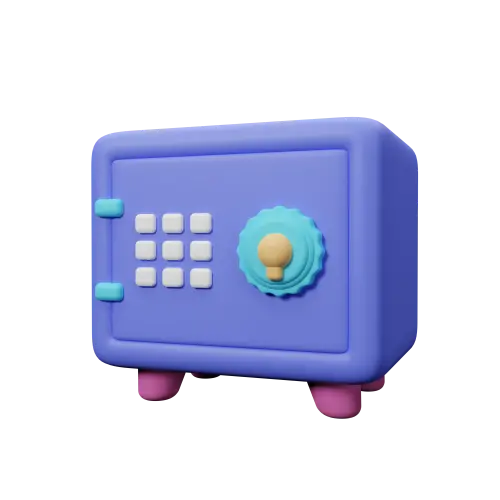</a> | **檔å:** `3d-Icon-finacially-016-ee.webp`<br>**尺寸:** 500x500<br>**大å°:** 7.42KB<br>**æ›´æ–°:** 2026-02-26 |
| <a href="images/3Ds/3D_Finacially/3d-Icon-finacially-017-10.png"></a> | **檔å:** `3d-Icon-finacially-017-10.png`<br>**尺寸:** 500x500<br>**大å°:** 58.56KB<br>**æ›´æ–°:** 2026-02-26 |
| <a href="images/3Ds/3D_Finacially/3d-Icon-finacially-017-43.webp"></a> | **檔å:** `3d-Icon-finacially-017-43.webp`<br>**尺寸:** 500x500<br>**大å°:** 7.10KB<br>**æ›´æ–°:** 2026-02-26 |
| <a href="images/3Ds/3D_Finacially/3d-Icon-finacially-018-4a.webp"></a> | **檔å:** `3d-Icon-finacially-018-4a.webp`<br>**尺寸:** 500x500<br>**大å°:** 11.62KB<br>**æ›´æ–°:** 2026-02-26 |
| <a href="images/3Ds/3D_Finacially/3d-Icon-finacially-018-4f.png"></a> | **檔å:** `3d-Icon-finacially-018-4f.png`<br>**尺寸:** 500x500<br>**大å°:** 82.71KB<br>**æ›´æ–°:** 2026-02-26 |
| <a href="images/3Ds/3D_Finacially/3d-Icon-finacially-019-71.png"></a> | **檔å:** `3d-Icon-finacially-019-71.png`<br>**尺寸:** 500x500<br>**大å°:** 59.31KB<br>**æ›´æ–°:** 2026-02-26 |
| <a href="images/3Ds/3D_Finacially/3d-Icon-finacially-019-8f.webp">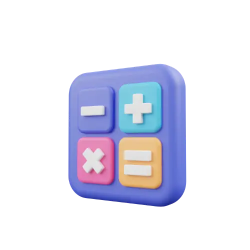</a> | **檔å:** `3d-Icon-finacially-019-8f.webp`<br>**尺寸:** 500x500<br>**大å°:** 6.24KB<br>**æ›´æ–°:** 2026-02-26 |
| <a href="images/3Ds/3D_Finacially/3d-Icon-finacially-02-59.webp"></a> | **檔å:** `3d-Icon-finacially-02-59.webp`<br>**尺寸:** 500x500<br>**大å°:** 6.41KB<br>**æ›´æ–°:** 2026-02-26 |
| <a href="images/3Ds/3D_Finacially/3d-Icon-finacially-02-bc.png"></a> | **檔å:** `3d-Icon-finacially-02-bc.png`<br>**尺寸:** 500x500<br>**大å°:** 46.90KB<br>**æ›´æ–°:** 2026-02-26 |
| <a href="images/3Ds/3D_Finacially/3d-Icon-finacially-020-5d.png"></a> | **檔å:** `3d-Icon-finacially-020-5d.png`<br>**尺寸:** 500x500<br>**大å°:** 61.39KB<br>**æ›´æ–°:** 2026-02-26 |
| <a href="images/3Ds/3D_Finacially/3d-Icon-finacially-020-95.webp"></a> | **檔å:** `3d-Icon-finacially-020-95.webp`<br>**尺寸:** 500x500<br>**大å°:** 9.07KB<br>**æ›´æ–°:** 2026-02-26 |
| <a href="images/3Ds/3D_Finacially/3d-Icon-finacially-021-ad.webp"></a> | **檔å:** `3d-Icon-finacially-021-ad.webp`<br>**尺寸:** 500x500<br>**大å°:** 6.42KB<br>**æ›´æ–°:** 2026-02-26 |
| <a href="images/3Ds/3D_Finacially/3d-Icon-finacially-021-dd.png"></a> | **檔å:** `3d-Icon-finacially-021-dd.png`<br>**尺寸:** 500x500<br>**大å°:** 48.88KB<br>**æ›´æ–°:** 2026-02-26 |
| <a href="images/3Ds/3D_Finacially/3d-Icon-finacially-022-d1.png"></a> | **檔å:** `3d-Icon-finacially-022-d1.png`<br>**尺寸:** 500x500<br>**大å°:** 77.22KB<br>**æ›´æ–°:** 2026-02-26 |
| <a href="images/3Ds/3D_Finacially/3d-Icon-finacially-022-dd.webp"></a> | **檔å:** `3d-Icon-finacially-022-dd.webp`<br>**尺寸:** 500x500<br>**大å°:** 9.90KB<br>**æ›´æ–°:** 2026-02-26 |
| <a href="images/3Ds/3D_Finacially/3d-Icon-finacially-023-b1.webp"></a> | **檔å:** `3d-Icon-finacially-023-b1.webp`<br>**尺寸:** 500x500<br>**大å°:** 9.71KB<br>**æ›´æ–°:** 2026-02-26 |
| <a href="images/3Ds/3D_Finacially/3d-Icon-finacially-023-f8.png"></a> | **檔å:** `3d-Icon-finacially-023-f8.png`<br>**尺寸:** 500x500<br>**大å°:** 91.94KB<br>**æ›´æ–°:** 2026-02-26 |
| <a href="images/3Ds/3D_Finacially/3d-Icon-finacially-024-06.png"></a> | **檔å:** `3d-Icon-finacially-024-06.png`<br>**尺寸:** 500x500<br>**大å°:** 82.09KB<br>**æ›´æ–°:** 2026-02-26 |
| <a href="images/3Ds/3D_Finacially/3d-Icon-finacially-024-46.webp"></a> | **檔å:** `3d-Icon-finacially-024-46.webp`<br>**尺寸:** 500x500<br>**大å°:** 11.90KB<br>**æ›´æ–°:** 2026-02-26 |
| <a href="images/3Ds/3D_Finacially/3d-Icon-finacially-025-99.png"></a> | **檔å:** `3d-Icon-finacially-025-99.png`<br>**尺寸:** 500x500<br>**大å°:** 51.94KB<br>**æ›´æ–°:** 2026-02-26 |
| <a href="images/3Ds/3D_Finacially/3d-Icon-finacially-025-ad.webp"></a> | **檔å:** `3d-Icon-finacially-025-ad.webp`<br>**尺寸:** 500x500<br>**大å°:** 5.99KB<br>**æ›´æ–°:** 2026-02-26 |
| <a href="images/3Ds/3D_Finacially/3d-Icon-finacially-026-27.webp"></a> | **檔å:** `3d-Icon-finacially-026-27.webp`<br>**尺寸:** 500x500<br>**大å°:** 11.38KB<br>**æ›´æ–°:** 2026-02-26 |
| <a href="images/3Ds/3D_Finacially/3d-Icon-finacially-026-29.png"></a> | **檔å:** `3d-Icon-finacially-026-29.png`<br>**尺寸:** 500x500<br>**大å°:** 86.26KB<br>**æ›´æ–°:** 2026-02-26 |
| <a href="images/3Ds/3D_Finacially/3d-Icon-finacially-027-31.webp">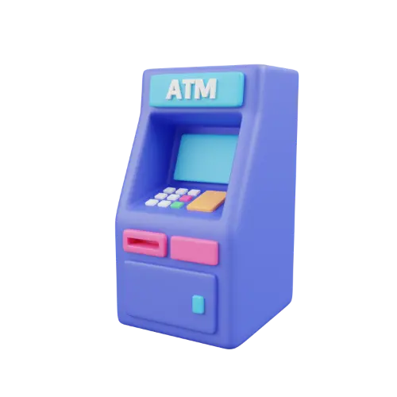</a> | **檔å:** `3d-Icon-finacially-027-31.webp`<br>**尺寸:** 500x500<br>**大å°:** 8.05KB<br>**æ›´æ–°:** 2026-02-26 |
| <a href="images/3Ds/3D_Finacially/3d-Icon-finacially-027-be.png"></a> | **檔å:** `3d-Icon-finacially-027-be.png`<br>**尺寸:** 500x500<br>**大å°:** 70.30KB<br>**æ›´æ–°:** 2026-02-26 |
| <a href="images/3Ds/3D_Finacially/3d-Icon-finacially-028-7b.png"></a> | **檔å:** `3d-Icon-finacially-028-7b.png`<br>**尺寸:** 500x500<br>**大å°:** 51.55KB<br>**æ›´æ–°:** 2026-02-26 |
| <a href="images/3Ds/3D_Finacially/3d-Icon-finacially-028-85.webp"></a> | **檔å:** `3d-Icon-finacially-028-85.webp`<br>**尺寸:** 500x500<br>**大å°:** 7.24KB<br>**æ›´æ–°:** 2026-02-26 |
| <a href="images/3Ds/3D_Finacially/3d-Icon-finacially-029-59.webp"></a> | **檔å:** `3d-Icon-finacially-029-59.webp`<br>**尺寸:** 500x500<br>**大å°:** 11.13KB<br>**æ›´æ–°:** 2026-02-26 |
| <a href="images/3Ds/3D_Finacially/3d-Icon-finacially-029-6a.png"></a> | **檔å:** `3d-Icon-finacially-029-6a.png`<br>**尺寸:** 500x500<br>**大å°:** 71.36KB<br>**æ›´æ–°:** 2026-02-26 |
| <a href="images/3Ds/3D_Finacially/3d-Icon-finacially-03-33.webp"></a> | **檔å:** `3d-Icon-finacially-03-33.webp`<br>**尺寸:** 500x500<br>**大å°:** 6.07KB<br>**æ›´æ–°:** 2026-02-26 |
| <a href="images/3Ds/3D_Finacially/3d-Icon-finacially-03-fa.png"></a> | **檔å:** `3d-Icon-finacially-03-fa.png`<br>**尺寸:** 500x500<br>**大å°:** 59.16KB<br>**æ›´æ–°:** 2026-02-26 |
| <a href="images/3Ds/3D_Finacially/3d-Icon-finacially-030-64.webp"></a> | **檔å:** `3d-Icon-finacially-030-64.webp`<br>**尺寸:** 500x500<br>**大å°:** 8.18KB<br>**æ›´æ–°:** 2026-02-26 |
| <a href="images/3Ds/3D_Finacially/3d-Icon-finacially-030-84.png"></a> | **檔å:** `3d-Icon-finacially-030-84.png`<br>**尺寸:** 500x500<br>**大å°:** 58.85KB<br>**æ›´æ–°:** 2026-02-26 |
| <a href="images/3Ds/3D_Finacially/3d-Icon-finacially-031-36.webp"></a> | **檔å:** `3d-Icon-finacially-031-36.webp`<br>**尺寸:** 500x500<br>**大å°:** 7.03KB<br>**æ›´æ–°:** 2026-02-26 |
| <a href="images/3Ds/3D_Finacially/3d-Icon-finacially-031-cb.png"></a> | **檔å:** `3d-Icon-finacially-031-cb.png`<br>**尺寸:** 500x500<br>**大å°:** 44.08KB<br>**æ›´æ–°:** 2026-02-26 |
| <a href="images/3Ds/3D_Finacially/3d-Icon-finacially-032-26.png"></a> | **檔å:** `3d-Icon-finacially-032-26.png`<br>**尺寸:** 500x500<br>**大å°:** 69.14KB<br>**æ›´æ–°:** 2026-02-26 |
| <a href="images/3Ds/3D_Finacially/3d-Icon-finacially-032-88.webp"></a> | **檔å:** `3d-Icon-finacially-032-88.webp`<br>**尺寸:** 500x500<br>**大å°:** 12.87KB<br>**æ›´æ–°:** 2026-02-26 |
| <a href="images/3Ds/3D_Finacially/3d-Icon-finacially-033-af.png"></a> | **檔å:** `3d-Icon-finacially-033-af.png`<br>**尺寸:** 500x500<br>**大å°:** 85.77KB<br>**æ›´æ–°:** 2026-02-26 |
| <a href="images/3Ds/3D_Finacially/3d-Icon-finacially-033-f2.webp"></a> | **檔å:** `3d-Icon-finacially-033-f2.webp`<br>**尺寸:** 500x500<br>**大å°:** 11.84KB<br>**æ›´æ–°:** 2026-02-26 |
| <a href="images/3Ds/3D_Finacially/3d-Icon-finacially-034-1e.png"></a> | **檔å:** `3d-Icon-finacially-034-1e.png`<br>**尺寸:** 500x500<br>**大å°:** 75.67KB<br>**æ›´æ–°:** 2026-02-26 |
| <a href="images/3Ds/3D_Finacially/3d-Icon-finacially-034-32.webp"></a> | **檔å:** `3d-Icon-finacially-034-32.webp`<br>**尺寸:** 500x500<br>**大å°:** 10.10KB<br>**æ›´æ–°:** 2026-02-26 |
| <a href="images/3Ds/3D_Finacially/3d-Icon-finacially-035-bd.png"></a> | **檔å:** `3d-Icon-finacially-035-bd.png`<br>**尺寸:** 500x500<br>**大å°:** 58.50KB<br>**æ›´æ–°:** 2026-02-26 |
| <a href="images/3Ds/3D_Finacially/3d-Icon-finacially-035-da.webp"></a> | **檔å:** `3d-Icon-finacially-035-da.webp`<br>**尺寸:** 500x500<br>**大å°:** 7.26KB<br>**æ›´æ–°:** 2026-02-26 |
| <a href="images/3Ds/3D_Finacially/3d-Icon-finacially-036-12.png"></a> | **檔å:** `3d-Icon-finacially-036-12.png`<br>**尺寸:** 500x500<br>**大å°:** 85.93KB<br>**æ›´æ–°:** 2026-02-26 |
| <a href="images/3Ds/3D_Finacially/3d-Icon-finacially-036-2a.webp"></a> | **檔å:** `3d-Icon-finacially-036-2a.webp`<br>**尺寸:** 500x500<br>**大å°:** 8.74KB<br>**æ›´æ–°:** 2026-02-26 |
| <a href="images/3Ds/3D_Finacially/3d-Icon-finacially-037-45.webp"></a> | **檔å:** `3d-Icon-finacially-037-45.webp`<br>**尺寸:** 500x500<br>**大å°:** 7.23KB<br>**æ›´æ–°:** 2026-02-26 |
| <a href="images/3Ds/3D_Finacially/3d-Icon-finacially-037-90.png"></a> | **檔å:** `3d-Icon-finacially-037-90.png`<br>**尺寸:** 500x500<br>**大å°:** 47.04KB<br>**æ›´æ–°:** 2026-02-26 |
| <a href="images/3Ds/3D_Finacially/3d-Icon-finacially-038-54.png"></a> | **檔å:** `3d-Icon-finacially-038-54.png`<br>**尺寸:** 500x500<br>**大å°:** 36.98KB<br>**æ›´æ–°:** 2026-02-26 |
| <a href="images/3Ds/3D_Finacially/3d-Icon-finacially-038-7d.webp"></a> | **檔å:** `3d-Icon-finacially-038-7d.webp`<br>**尺寸:** 500x500<br>**大å°:** 4.53KB<br>**æ›´æ–°:** 2026-02-26 |
| <a href="images/3Ds/3D_Finacially/3d-Icon-finacially-04-2f.png"></a> | **檔å:** `3d-Icon-finacially-04-2f.png`<br>**尺寸:** 500x500<br>**大å°:** 54.55KB<br>**æ›´æ–°:** 2026-02-26 |
| <a href="images/3Ds/3D_Finacially/3d-Icon-finacially-04-3a.webp"></a> | **檔å:** `3d-Icon-finacially-04-3a.webp`<br>**尺寸:** 500x500<br>**大å°:** 5.85KB<br>**æ›´æ–°:** 2026-02-26 |
| <a href="images/3Ds/3D_Finacially/3d-Icon-finacially-05-2f.webp"></a> | **檔å:** `3d-Icon-finacially-05-2f.webp`<br>**尺寸:** 500x500<br>**大å°:** 6.91KB<br>**æ›´æ–°:** 2026-02-26 |
| <a href="images/3Ds/3D_Finacially/3d-Icon-finacially-05-98.png">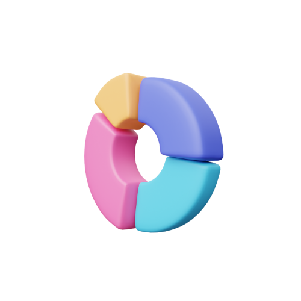</a> | **檔å:** `3d-Icon-finacially-05-98.png`<br>**尺寸:** 500x500<br>**大å°:** 50.14KB<br>**æ›´æ–°:** 2026-02-26 |
| <a href="images/3Ds/3D_Finacially/3d-Icon-finacially-06-15.webp"></a> | **檔å:** `3d-Icon-finacially-06-15.webp`<br>**尺寸:** 500x500<br>**大å°:** 6.29KB<br>**æ›´æ–°:** 2026-02-26 |
| <a href="images/3Ds/3D_Finacially/3d-Icon-finacially-06-37.png"></a> | **檔å:** `3d-Icon-finacially-06-37.png`<br>**尺寸:** 500x500<br>**大å°:** 49.57KB<br>**æ›´æ–°:** 2026-02-26 |
| <a href="images/3Ds/3D_Finacially/3d-Icon-finacially-07-21.png"></a> | **檔å:** `3d-Icon-finacially-07-21.png`<br>**尺寸:** 500x500<br>**大å°:** 103.81KB<br>**æ›´æ–°:** 2026-02-26 |
| <a href="images/3Ds/3D_Finacially/3d-Icon-finacially-07-ff.webp">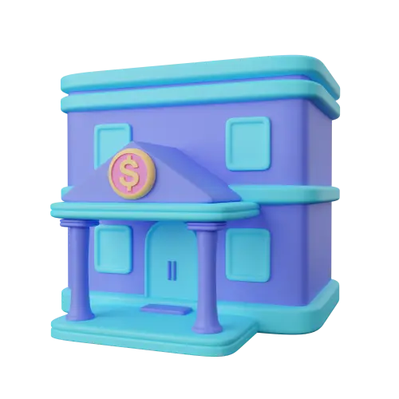</a> | **檔å:** `3d-Icon-finacially-07-ff.webp`<br>**尺寸:** 500x500<br>**大å°:** 10.97KB<br>**æ›´æ–°:** 2026-02-26 |
| <a href="images/3Ds/3D_Finacially/3d-Icon-finacially-08-c9.png"></a> | **檔å:** `3d-Icon-finacially-08-c9.png`<br>**尺寸:** 500x500<br>**大å°:** 69.48KB<br>**æ›´æ–°:** 2026-02-26 |
| <a href="images/3Ds/3D_Finacially/3d-Icon-finacially-08-d1.webp"></a> | **檔å:** `3d-Icon-finacially-08-d1.webp`<br>**尺寸:** 500x500<br>**大å°:** 8.57KB<br>**æ›´æ–°:** 2026-02-26 |
| <a href="images/3Ds/3D_Finacially/3d-Icon-finacially-09-3d.webp"></a> | **檔å:** `3d-Icon-finacially-09-3d.webp`<br>**尺寸:** 500x500<br>**大å°:** 10.24KB<br>**æ›´æ–°:** 2026-02-26 |
| <a href="images/3Ds/3D_Finacially/3d-Icon-finacially-09-5a.png"></a> | **檔å:** `3d-Icon-finacially-09-5a.png`<br>**尺寸:** 500x500<br>**大å°:** 91.07KB<br>**æ›´æ–°:** 2026-02-26 |

### 📠3d_hands

| é è¦½ (é»æ“Šæ”¾å¤§) | 檔案詳細資訊 |
| :--- | :--- |
| <a href="images/3Ds/3D_Hands/3d_Hands-1-12.png"></a> | **檔å:** `3d_Hands-1-12.png`<br>**尺寸:** 500x500<br>**大å°:** 60.94KB<br>**æ›´æ–°:** 2026-02-26 |
| <a href="images/3Ds/3D_Hands/3d_Hands-1-81.webp"></a> | **檔å:** `3d_Hands-1-81.webp`<br>**尺寸:** 500x500<br>**大å°:** 7.44KB<br>**æ›´æ–°:** 2026-02-26 |

### 📠3d_heros

| é è¦½ (é»æ“Šæ”¾å¤§) | 檔案詳細資訊 |
| :--- | :--- |
| <a href="images/3Ds/3D_Heros/hero-1-14.webp"></a> | **檔å:** `hero-1-14.webp`<br>**尺寸:** 500x500<br>**大å°:** 10.78KB<br>**æ›´æ–°:** 2026-02-26 |
| <a href="images/3Ds/3D_Heros/hero-1-c5.png"></a> | **檔å:** `hero-1-c5.png`<br>**尺寸:** 500x500<br>**大å°:** 86.00KB<br>**æ›´æ–°:** 2026-02-26 |
| <a href="images/3Ds/3D_Heros/hero-10-6f.png"></a> | **檔å:** `hero-10-6f.png`<br>**尺寸:** 500x500<br>**大å°:** 41.77KB<br>**æ›´æ–°:** 2026-02-26 |
| <a href="images/3Ds/3D_Heros/hero-10-e9.webp"></a> | **檔å:** `hero-10-e9.webp`<br>**尺寸:** 500x500<br>**大å°:** 11.23KB<br>**æ›´æ–°:** 2026-02-26 |
| <a href="images/3Ds/3D_Heros/hero-11-07.webp">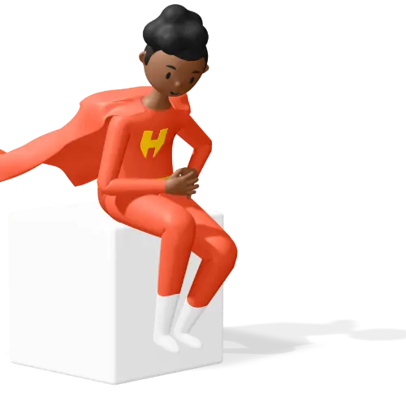</a> | **檔å:** `hero-11-07.webp`<br>**尺寸:** 500x500<br>**大å°:** 13.07KB<br>**æ›´æ–°:** 2026-02-26 |
| <a href="images/3Ds/3D_Heros/hero-11-53.png">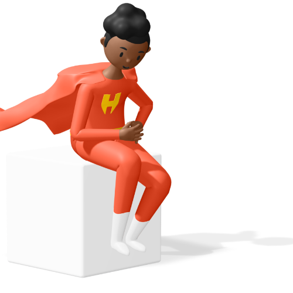</a> | **檔å:** `hero-11-53.png`<br>**尺寸:** 500x500<br>**大å°:** 57.47KB<br>**æ›´æ–°:** 2026-02-26 |
| <a href="images/3Ds/3D_Heros/hero-12-18.png"></a> | **檔å:** `hero-12-18.png`<br>**尺寸:** 500x500<br>**大å°:** 45.89KB<br>**æ›´æ–°:** 2026-02-26 |
| <a href="images/3Ds/3D_Heros/hero-12-92.webp"></a> | **檔å:** `hero-12-92.webp`<br>**尺寸:** 500x500<br>**大å°:** 11.88KB<br>**æ›´æ–°:** 2026-02-26 |
| <a href="images/3Ds/3D_Heros/hero-2-47.webp"></a> | **檔å:** `hero-2-47.webp`<br>**尺寸:** 500x500<br>**大å°:** 15.78KB<br>**æ›´æ–°:** 2026-02-26 |
| <a href="images/3Ds/3D_Heros/hero-2-8d.png">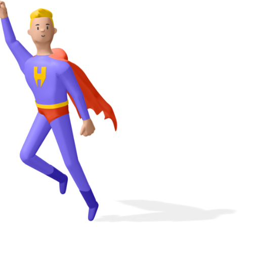</a> | **檔å:** `hero-2-8d.png`<br>**尺寸:** 500x500<br>**大å°:** 52.03KB<br>**æ›´æ–°:** 2026-02-26 |
| <a href="images/3Ds/3D_Heros/hero-3-0a.webp"></a> | **檔å:** `hero-3-0a.webp`<br>**尺寸:** 500x500<br>**大å°:** 13.88KB<br>**æ›´æ–°:** 2026-02-26 |
| <a href="images/3Ds/3D_Heros/hero-3-68.png"></a> | **檔å:** `hero-3-68.png`<br>**尺寸:** 500x500<br>**大å°:** 57.17KB<br>**æ›´æ–°:** 2026-02-26 |
| <a href="images/3Ds/3D_Heros/hero-4-50.webp"></a> | **檔å:** `hero-4-50.webp`<br>**尺寸:** 500x500<br>**大å°:** 13.48KB<br>**æ›´æ–°:** 2026-02-26 |
| <a href="images/3Ds/3D_Heros/hero-4-82.png"></a> | **檔å:** `hero-4-82.png`<br>**尺寸:** 500x500<br>**大å°:** 52.96KB<br>**æ›´æ–°:** 2026-02-26 |
| <a href="images/3Ds/3D_Heros/hero-5-bd.png"></a> | **檔å:** `hero-5-bd.png`<br>**尺寸:** 500x500<br>**大å°:** 63.61KB<br>**æ›´æ–°:** 2026-02-26 |
| <a href="images/3Ds/3D_Heros/hero-5-cf.webp"></a> | **檔å:** `hero-5-cf.webp`<br>**尺寸:** 500x500<br>**大å°:** 13.73KB<br>**æ›´æ–°:** 2026-02-26 |
| <a href="images/3Ds/3D_Heros/hero-6-26.webp">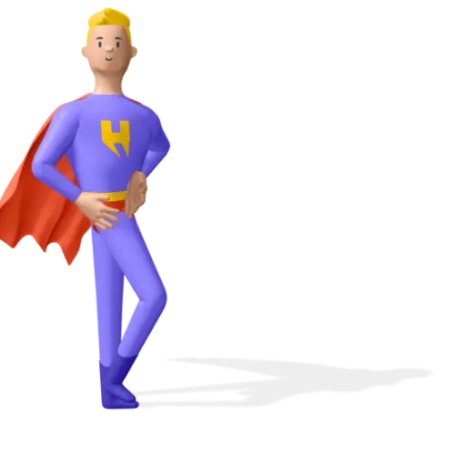</a> | **檔å:** `hero-6-26.webp`<br>**尺寸:** 500x500<br>**大å°:** 12.02KB<br>**æ›´æ–°:** 2026-02-26 |
| <a href="images/3Ds/3D_Heros/hero-6-86.png"></a> | **檔å:** `hero-6-86.png`<br>**尺寸:** 500x500<br>**大å°:** 50.52KB<br>**æ›´æ–°:** 2026-02-26 |
| <a href="images/3Ds/3D_Heros/hero-7-4d.webp"></a> | **檔å:** `hero-7-4d.webp`<br>**尺寸:** 500x500<br>**大å°:** 12.06KB<br>**æ›´æ–°:** 2026-02-26 |
| <a href="images/3Ds/3D_Heros/hero-7-fe.png"></a> | **檔å:** `hero-7-fe.png`<br>**尺寸:** 500x500<br>**大å°:** 81.43KB<br>**æ›´æ–°:** 2026-02-26 |
| <a href="images/3Ds/3D_Heros/hero-8-4d.webp"></a> | **檔å:** `hero-8-4d.webp`<br>**尺寸:** 500x500<br>**大å°:** 12.67KB<br>**æ›´æ–°:** 2026-02-26 |
| <a href="images/3Ds/3D_Heros/hero-8-a7.png"></a> | **檔å:** `hero-8-a7.png`<br>**尺寸:** 500x500<br>**大å°:** 45.11KB<br>**æ›´æ–°:** 2026-02-26 |
| <a href="images/3Ds/3D_Heros/hero-9-59.webp"></a> | **檔å:** `hero-9-59.webp`<br>**尺寸:** 500x500<br>**大å°:** 13.41KB<br>**æ›´æ–°:** 2026-02-26 |
| <a href="images/3Ds/3D_Heros/hero-9-6c.png"></a> | **檔å:** `hero-9-6c.png`<br>**尺寸:** 500x500<br>**大å°:** 51.03KB<br>**æ›´æ–°:** 2026-02-26 |

### 📠3d_illustration-nikuu

| é è¦½ (é»æ“Šæ”¾å¤§) | 檔案詳細資訊 |
| :--- | :--- |
| <a href="images/3Ds/3D_Illustration-Nikuu/Badrun_1-2d.webp"></a> | **檔å:** `Badrun_1-2d.webp`<br>**尺寸:** 3000x3000<br>**大å°:** 136.16KB<br>**æ›´æ–°:** 2026-02-26 |
| <a href="images/3Ds/3D_Illustration-Nikuu/Badrun_1-dd.png"></a> | **檔å:** `Badrun_1-dd.png`<br>**尺寸:** 3000x3000<br>**大å°:** 301.07KB<br>**æ›´æ–°:** 2026-02-26 |
| <a href="images/3Ds/3D_Illustration-Nikuu/Badrun_2-c6.png"></a> | **檔å:** `Badrun_2-c6.png`<br>**尺寸:** 3000x3000<br>**大å°:** 353.07KB<br>**æ›´æ–°:** 2026-02-26 |
| <a href="images/3Ds/3D_Illustration-Nikuu/Badrun_2-e6.webp"></a> | **檔å:** `Badrun_2-e6.webp`<br>**尺寸:** 3000x3000<br>**大å°:** 78.61KB<br>**æ›´æ–°:** 2026-02-26 |
| <a href="images/3Ds/3D_Illustration-Nikuu/Badrun_3-c9.webp">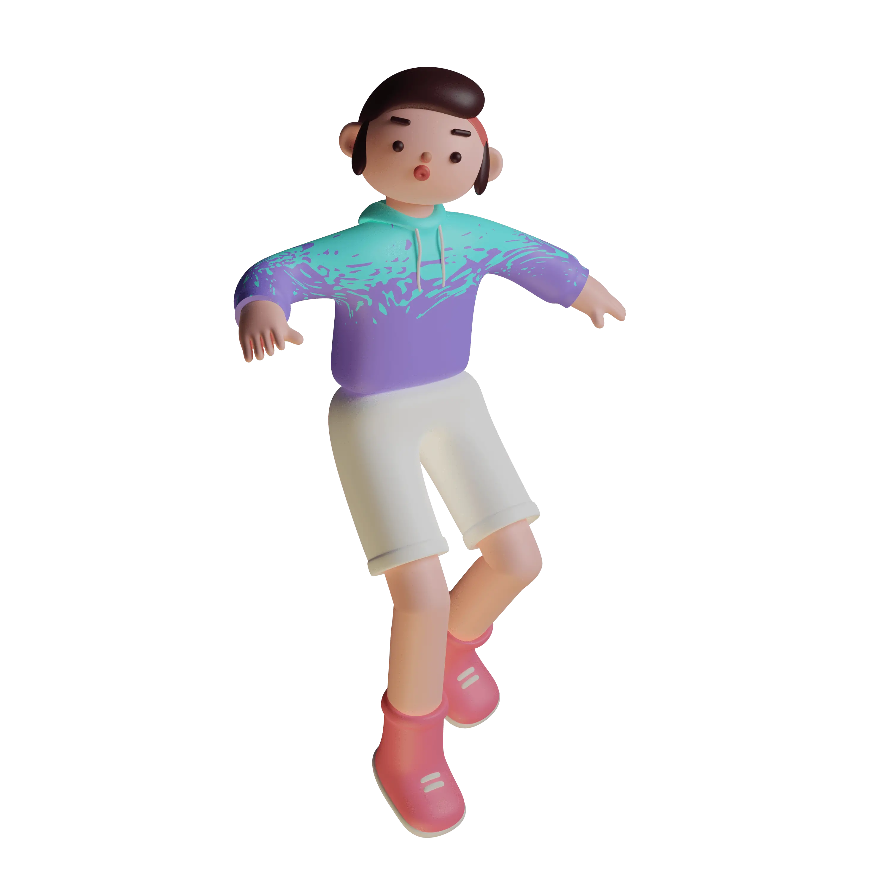</a> | **檔å:** `Badrun_3-c9.webp`<br>**尺寸:** 3000x3000<br>**大å°:** 78.09KB<br>**æ›´æ–°:** 2026-02-26 |
| <a href="images/3Ds/3D_Illustration-Nikuu/Badrun_3-cf.png"></a> | **檔å:** `Badrun_3-cf.png`<br>**尺寸:** 3000x3000<br>**大å°:** 338.18KB<br>**æ›´æ–°:** 2026-02-26 |
| <a href="images/3Ds/3D_Illustration-Nikuu/Badrun_4-5d.png"></a> | **檔å:** `Badrun_4-5d.png`<br>**尺寸:** 3000x3000<br>**大å°:** 401.98KB<br>**æ›´æ–°:** 2026-02-26 |
| <a href="images/3Ds/3D_Illustration-Nikuu/Badrun_4-b7.webp">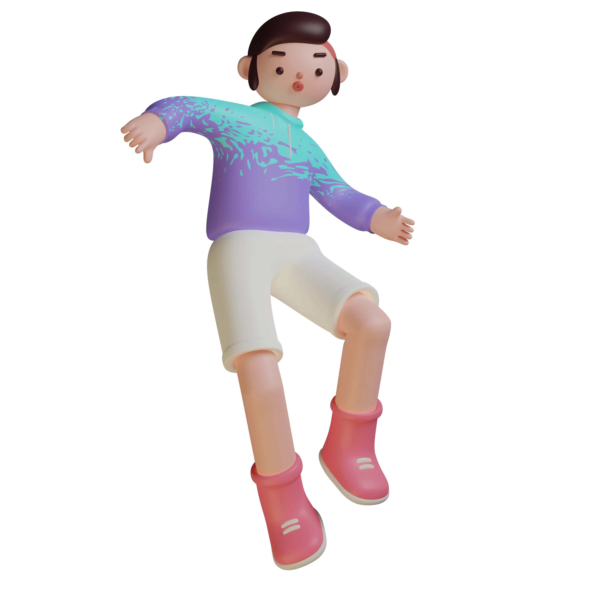</a> | **檔å:** `Badrun_4-b7.webp`<br>**尺寸:** 3000x3000<br>**大å°:** 91.11KB<br>**æ›´æ–°:** 2026-02-26 |
| <a href="images/3Ds/3D_Illustration-Nikuu/Badrun_5-9c.webp"></a> | **檔å:** `Badrun_5-9c.webp`<br>**尺寸:** 3000x3000<br>**大å°:** 89.26KB<br>**æ›´æ–°:** 2026-02-26 |
| <a href="images/3Ds/3D_Illustration-Nikuu/Badrun_5-f0.png">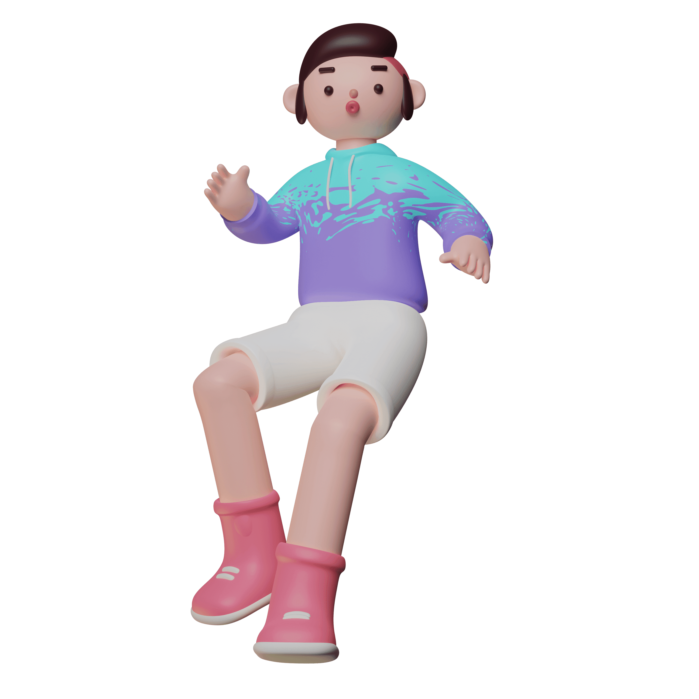</a> | **檔å:** `Badrun_5-f0.png`<br>**尺寸:** 3000x3000<br>**大å°:** 439.27KB<br>**æ›´æ–°:** 2026-02-26 |
| <a href="images/3Ds/3D_Illustration-Nikuu/Ikbal_1-c9.png"></a> | **檔å:** `Ikbal_1-c9.png`<br>**尺寸:** 3000x3000<br>**大å°:** 508.50KB<br>**æ›´æ–°:** 2026-02-26 |
| <a href="images/3Ds/3D_Illustration-Nikuu/Ikbal_1-ea.webp"></a> | **檔å:** `Ikbal_1-ea.webp`<br>**尺寸:** 3000x3000<br>**大å°:** 70.92KB<br>**æ›´æ–°:** 2026-02-26 |
| <a href="images/3Ds/3D_Illustration-Nikuu/Ikbal_2-40.webp"></a> | **檔å:** `Ikbal_2-40.webp`<br>**尺寸:** 3000x3000<br>**大å°:** 70.81KB<br>**æ›´æ–°:** 2026-02-26 |
| <a href="images/3Ds/3D_Illustration-Nikuu/Ikbal_2-d4.png"></a> | **檔å:** `Ikbal_2-d4.png`<br>**尺寸:** 3000x3000<br>**大å°:** 475.16KB<br>**æ›´æ–°:** 2026-02-26 |
| <a href="images/3Ds/3D_Illustration-Nikuu/Ikbal_3-cb.webp"></a> | **檔å:** `Ikbal_3-cb.webp`<br>**尺寸:** 3000x3000<br>**大å°:** 72.58KB<br>**æ›´æ–°:** 2026-02-26 |
| <a href="images/3Ds/3D_Illustration-Nikuu/Ikbal_3-ee.png"></a> | **檔å:** `Ikbal_3-ee.png`<br>**尺寸:** 3000x3000<br>**大å°:** 514.36KB<br>**æ›´æ–°:** 2026-02-26 |
| <a href="images/3Ds/3D_Illustration-Nikuu/Ikbal_4-b1.webp"></a> | **檔å:** `Ikbal_4-b1.webp`<br>**尺寸:** 3000x3000<br>**大å°:** 73.55KB<br>**æ›´æ–°:** 2026-02-26 |
| <a href="images/3Ds/3D_Illustration-Nikuu/Ikbal_4-bc.png"></a> | **檔å:** `Ikbal_4-bc.png`<br>**尺寸:** 3000x3000<br>**大å°:** 553.70KB<br>**æ›´æ–°:** 2026-02-26 |
| <a href="images/3Ds/3D_Illustration-Nikuu/Ikbal_5-8c.webp"></a> | **檔å:** `Ikbal_5-8c.webp`<br>**尺寸:** 3000x3000<br>**大å°:** 71.69KB<br>**æ›´æ–°:** 2026-02-26 |
| <a href="images/3Ds/3D_Illustration-Nikuu/Ikbal_5-bd.png"></a> | **檔å:** `Ikbal_5-bd.png`<br>**尺寸:** 3000x3000<br>**大å°:** 527.20KB<br>**æ›´æ–°:** 2026-02-26 |
| <a href="images/3Ds/3D_Illustration-Nikuu/Marni_1-7c.webp"></a> | **檔å:** `Marni_1-7c.webp`<br>**尺寸:** 3000x3000<br>**大å°:** 69.27KB<br>**æ›´æ–°:** 2026-02-26 |
| <a href="images/3Ds/3D_Illustration-Nikuu/Marni_1-e0.png"></a> | **檔å:** `Marni_1-e0.png`<br>**尺寸:** 3000x3000<br>**大å°:** 445.22KB<br>**æ›´æ–°:** 2026-02-26 |
| <a href="images/3Ds/3D_Illustration-Nikuu/Marni_2-6e.png"></a> | **檔å:** `Marni_2-6e.png`<br>**尺寸:** 3000x3000<br>**大å°:** 388.09KB<br>**æ›´æ–°:** 2026-02-26 |
| <a href="images/3Ds/3D_Illustration-Nikuu/Marni_2-b4.webp"></a> | **檔å:** `Marni_2-b4.webp`<br>**尺寸:** 3000x3000<br>**大å°:** 69.68KB<br>**æ›´æ–°:** 2026-02-26 |
| <a href="images/3Ds/3D_Illustration-Nikuu/Marni_3-9a.png"></a> | **檔å:** `Marni_3-9a.png`<br>**尺寸:** 3000x3000<br>**大å°:** 443.89KB<br>**æ›´æ–°:** 2026-02-26 |
| <a href="images/3Ds/3D_Illustration-Nikuu/Marni_3-e5.webp">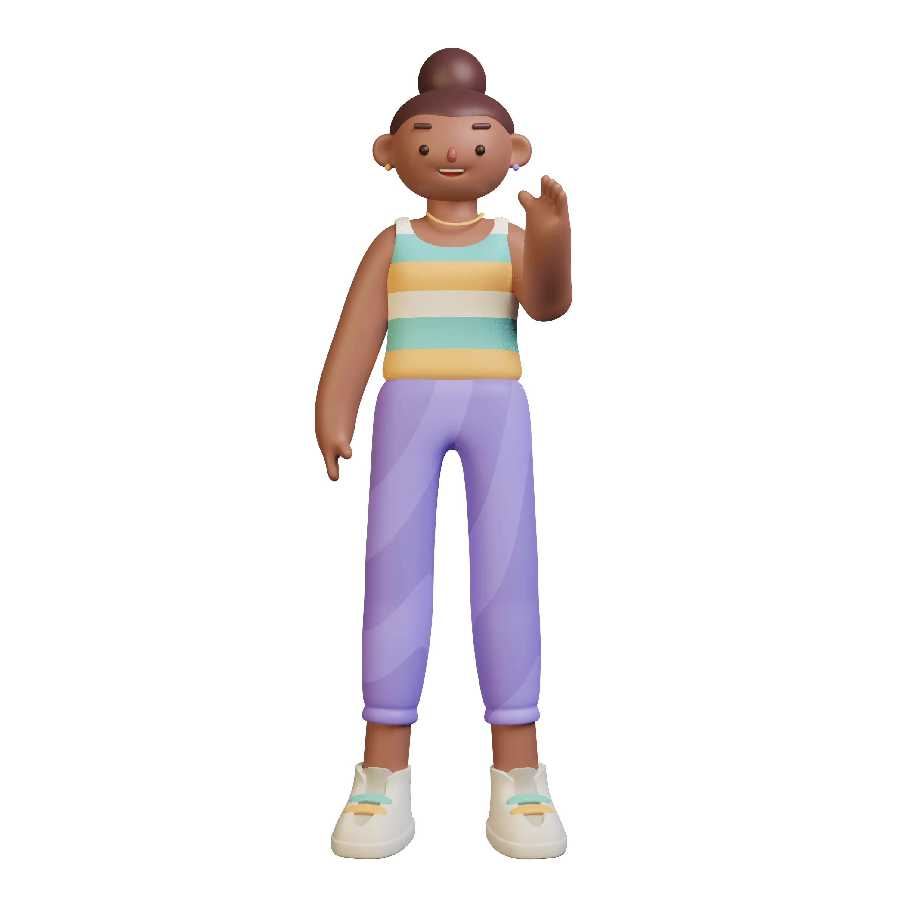</a> | **檔å:** `Marni_3-e5.webp`<br>**尺寸:** 3000x3000<br>**大å°:** 69.52KB<br>**æ›´æ–°:** 2026-02-26 |
| <a href="images/3Ds/3D_Illustration-Nikuu/Marni_4-37.png"></a> | **檔å:** `Marni_4-37.png`<br>**尺寸:** 3000x3000<br>**大å°:** 470.60KB<br>**æ›´æ–°:** 2026-02-26 |
| <a href="images/3Ds/3D_Illustration-Nikuu/Marni_4-d5.webp">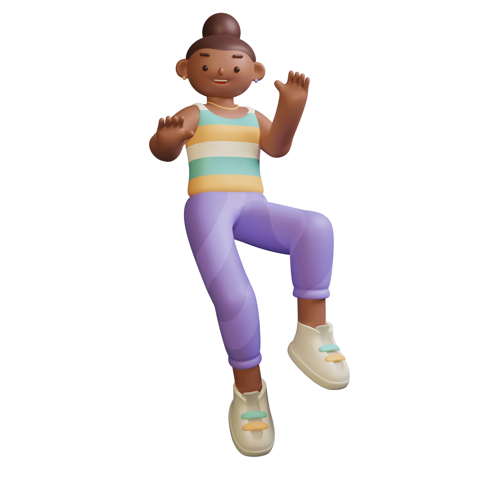</a> | **檔å:** `Marni_4-d5.webp`<br>**尺寸:** 3000x3000<br>**大å°:** 75.60KB<br>**æ›´æ–°:** 2026-02-26 |
| <a href="images/3Ds/3D_Illustration-Nikuu/Marni_5-12.png"></a> | **檔å:** `Marni_5-12.png`<br>**尺寸:** 3000x3000<br>**大å°:** 424.59KB<br>**æ›´æ–°:** 2026-02-26 |
| <a href="images/3Ds/3D_Illustration-Nikuu/Marni_5-a1.webp"></a> | **檔å:** `Marni_5-a1.webp`<br>**尺寸:** 3000x3000<br>**大å°:** 71.32KB<br>**æ›´æ–°:** 2026-02-26 |
| <a href="images/3Ds/3D_Illustration-Nikuu/Other_01-28.webp"></a> | **檔å:** `Other_01-28.webp`<br>**尺寸:** 3000x3000<br>**大å°:** 65.83KB<br>**æ›´æ–°:** 2026-02-26 |
| <a href="images/3Ds/3D_Illustration-Nikuu/Other_01-b3.png"></a> | **檔å:** `Other_01-b3.png`<br>**尺寸:** 3000x3000<br>**大å°:** 860.97KB<br>**æ›´æ–°:** 2026-02-26 |
| <a href="images/3Ds/3D_Illustration-Nikuu/Other_02-4a.png"></a> | **檔å:** `Other_02-4a.png`<br>**尺寸:** 3000x3000<br>**大å°:** 654.80KB<br>**æ›´æ–°:** 2026-02-26 |
| <a href="images/3Ds/3D_Illustration-Nikuu/Other_02-76.webp"></a> | **檔å:** `Other_02-76.webp`<br>**尺寸:** 3000x3000<br>**大å°:** 87.63KB<br>**æ›´æ–°:** 2026-02-26 |
| <a href="images/3Ds/3D_Illustration-Nikuu/Other_03-a0.webp"></a> | **檔å:** `Other_03-a0.webp`<br>**尺寸:** 3000x3000<br>**大å°:** 84.29KB<br>**æ›´æ–°:** 2026-02-26 |
| <a href="images/3Ds/3D_Illustration-Nikuu/Other_03-f6.png"></a> | **檔å:** `Other_03-f6.png`<br>**尺寸:** 3000x3000<br>**大å°:** 676.47KB<br>**æ›´æ–°:** 2026-02-26 |
| <a href="images/3Ds/3D_Illustration-Nikuu/Other_04-8c.webp"></a> | **檔å:** `Other_04-8c.webp`<br>**尺寸:** 3000x3000<br>**大å°:** 73.34KB<br>**æ›´æ–°:** 2026-02-26 |
| <a href="images/3Ds/3D_Illustration-Nikuu/Other_04-8e.png"></a> | **檔å:** `Other_04-8e.png`<br>**尺寸:** 3000x3000<br>**大å°:** 723.20KB<br>**æ›´æ–°:** 2026-02-26 |
| <a href="images/3Ds/3D_Illustration-Nikuu/Other_05-c3.webp"></a> | **檔å:** `Other_05-c3.webp`<br>**尺寸:** 3000x3000<br>**大å°:** 48.53KB<br>**æ›´æ–°:** 2026-02-26 |
| <a href="images/3Ds/3D_Illustration-Nikuu/Other_05-dd.png">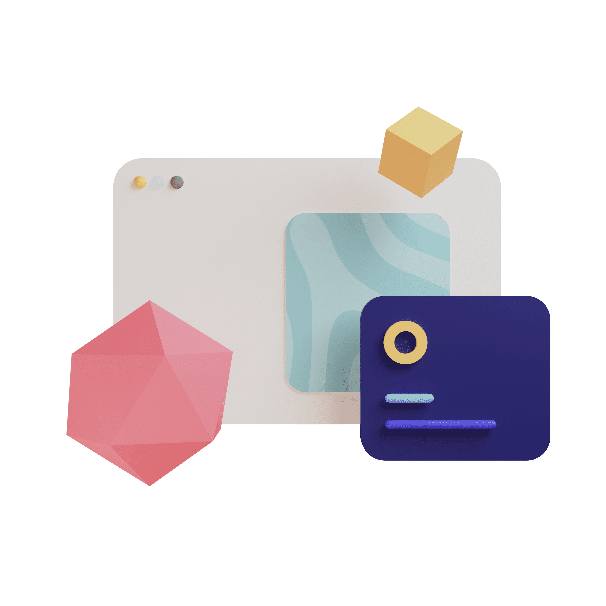</a> | **檔å:** `Other_05-dd.png`<br>**尺寸:** 3000x3000<br>**大å°:** 613.88KB<br>**æ›´æ–°:** 2026-02-26 |
| <a href="images/3Ds/3D_Illustration-Nikuu/Other_06-33.webp"></a> | **檔å:** `Other_06-33.webp`<br>**尺寸:** 3000x3000<br>**大å°:** 73.78KB<br>**æ›´æ–°:** 2026-02-26 |
| <a href="images/3Ds/3D_Illustration-Nikuu/Other_06-b2.png"></a> | **檔å:** `Other_06-b2.png`<br>**尺寸:** 3000x3000<br>**大å°:** 559.96KB<br>**æ›´æ–°:** 2026-02-26 |
| <a href="images/3Ds/3D_Illustration-Nikuu/Other_07-0d.webp"></a> | **檔å:** `Other_07-0d.webp`<br>**尺寸:** 3000x3000<br>**大å°:** 57.95KB<br>**æ›´æ–°:** 2026-02-26 |

### 📠3d_illustration-saly

| é è¦½ (é»æ“Šæ”¾å¤§) | 檔案詳細資訊 |
| :--- | :--- |
| <a href="images/3Ds/3D_Illustration-Saly/Saly_1-70.webp"></a> | **檔å:** `Saly_1-70.webp`<br>**尺寸:** 2160x2160<br>**大å°:** 58.22KB<br>**æ›´æ–°:** 2026-02-26 |
| <a href="images/3Ds/3D_Illustration-Saly/Saly_1-9d.png"></a> | **檔å:** `Saly_1-9d.png`<br>**尺寸:** 2160x2160<br>**大å°:** 214.21KB<br>**æ›´æ–°:** 2026-02-26 |
| <a href="images/3Ds/3D_Illustration-Saly/Saly_10-d9.png">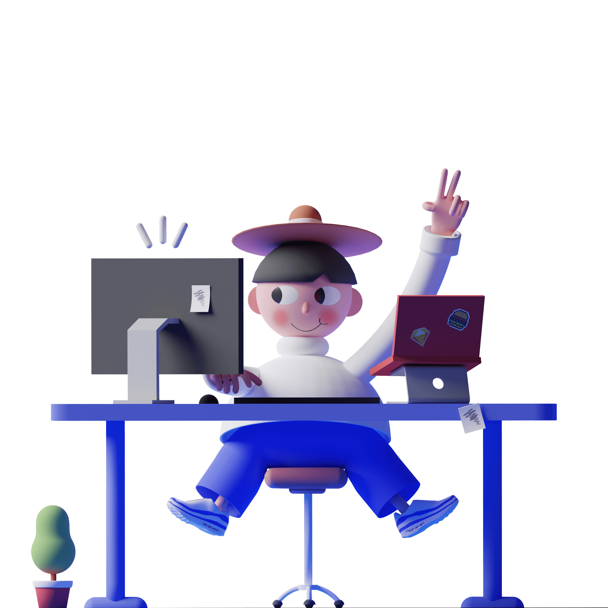</a> | **檔å:** `Saly_10-d9.png`<br>**尺寸:** 2160x2160<br>**大å°:** 241.79KB<br>**æ›´æ–°:** 2026-02-26 |
| <a href="images/3Ds/3D_Illustration-Saly/Saly_10-f0.webp"></a> | **檔å:** `Saly_10-f0.webp`<br>**尺寸:** 2160x2160<br>**大å°:** 93.21KB<br>**æ›´æ–°:** 2026-02-26 |
| <a href="images/3Ds/3D_Illustration-Saly/Saly_11-63.webp"></a> | **檔å:** `Saly_11-63.webp`<br>**尺寸:** 2160x2048<br>**大å°:** 58.65KB<br>**æ›´æ–°:** 2026-02-26 |
| <a href="images/3Ds/3D_Illustration-Saly/Saly_11-a9.png"></a> | **檔å:** `Saly_11-a9.png`<br>**尺寸:** 2160x2048<br>**大å°:** 269.96KB<br>**æ›´æ–°:** 2026-02-26 |
| <a href="images/3Ds/3D_Illustration-Saly/Saly_12-95.webp"></a> | **檔å:** `Saly_12-95.webp`<br>**尺寸:** 2160x2160<br>**大å°:** 52.04KB<br>**æ›´æ–°:** 2026-02-26 |
| <a href="images/3Ds/3D_Illustration-Saly/Saly_12-96.png"></a> | **檔å:** `Saly_12-96.png`<br>**尺寸:** 2160x2160<br>**大å°:** 242.74KB<br>**æ›´æ–°:** 2026-02-26 |
| <a href="images/3Ds/3D_Illustration-Saly/Saly_13-c4.png"></a> | **檔å:** `Saly_13-c4.png`<br>**尺寸:** 2160x2160<br>**大å°:** 156.66KB<br>**æ›´æ–°:** 2026-02-26 |
| <a href="images/3Ds/3D_Illustration-Saly/Saly_13-c4.webp"></a> | **檔å:** `Saly_13-c4.webp`<br>**尺寸:** 2160x2160<br>**大å°:** 43.78KB<br>**æ›´æ–°:** 2026-02-26 |
| <a href="images/3Ds/3D_Illustration-Saly/Saly_14-2f.png"></a> | **檔å:** `Saly_14-2f.png`<br>**尺寸:** 1365x2023<br>**大å°:** 173.28KB<br>**æ›´æ–°:** 2026-02-26 |
| <a href="images/3Ds/3D_Illustration-Saly/Saly_14-84.webp"></a> | **檔å:** `Saly_14-84.webp`<br>**尺寸:** 1365x2023<br>**大å°:** 40.53KB<br>**æ›´æ–°:** 2026-02-26 |
| <a href="images/3Ds/3D_Illustration-Saly/Saly_15-9e.webp"></a> | **檔å:** `Saly_15-9e.webp`<br>**尺寸:** 1520x2182<br>**大å°:** 60.31KB<br>**æ›´æ–°:** 2026-02-26 |
| <a href="images/3Ds/3D_Illustration-Saly/Saly_15-df.png"></a> | **檔å:** `Saly_15-df.png`<br>**尺寸:** 1520x2182<br>**大å°:** 198.55KB<br>**æ›´æ–°:** 2026-02-26 |
| <a href="images/3Ds/3D_Illustration-Saly/Saly_16-37.webp"></a> | **檔å:** `Saly_16-37.webp`<br>**尺寸:** 2624x2086<br>**大å°:** 77.88KB<br>**æ›´æ–°:** 2026-02-26 |
| <a href="images/3Ds/3D_Illustration-Saly/Saly_16-3b.png"></a> | **檔å:** `Saly_16-3b.png`<br>**尺寸:** 2624x2086<br>**大å°:** 397.63KB<br>**æ›´æ–°:** 2026-02-26 |
| <a href="images/3Ds/3D_Illustration-Saly/Saly_17-18.webp"></a> | **檔å:** `Saly_17-18.webp`<br>**尺寸:** 2996x1594<br>**大å°:** 50.85KB<br>**æ›´æ–°:** 2026-02-26 |
| <a href="images/3Ds/3D_Illustration-Saly/Saly_17-8e.png"></a> | **檔å:** `Saly_17-8e.png`<br>**尺寸:** 2996x1594<br>**大å°:** 366.20KB<br>**æ›´æ–°:** 2026-02-26 |
| <a href="images/3Ds/3D_Illustration-Saly/Saly_18-60.webp">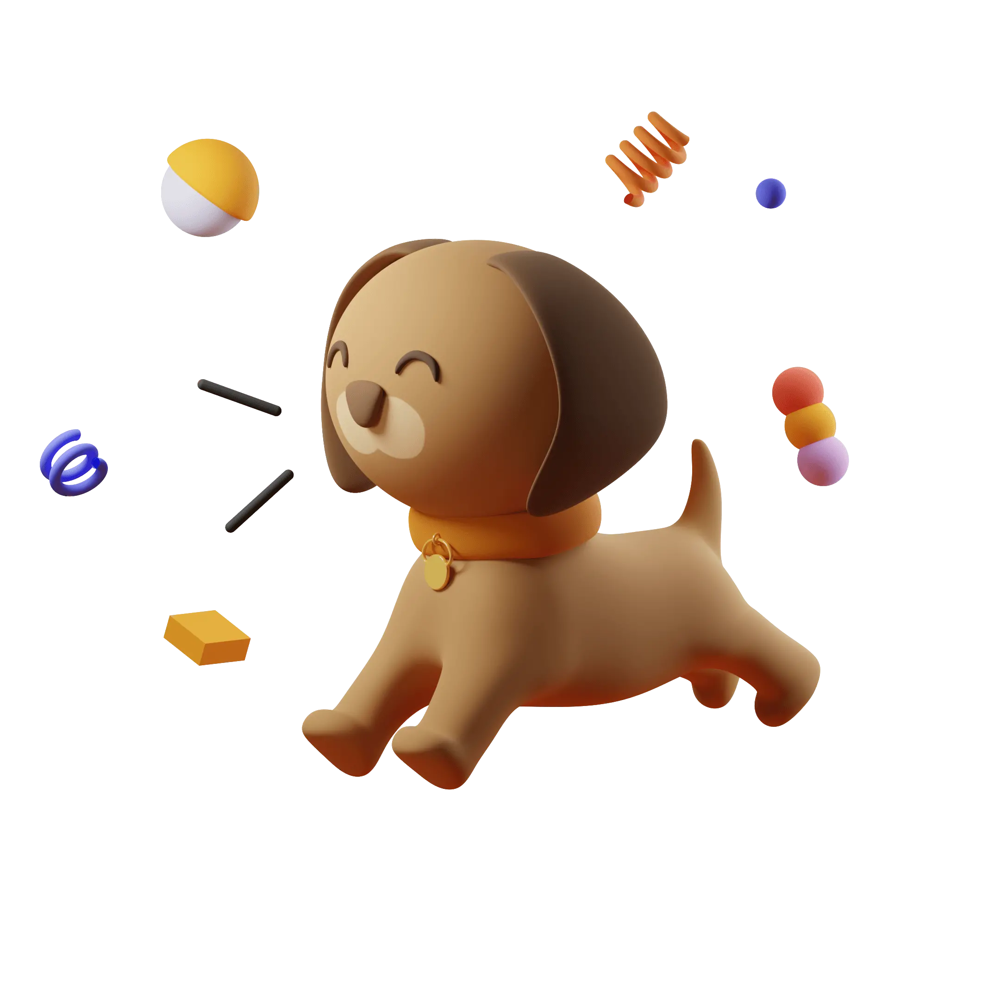</a> | **檔å:** `Saly_18-60.webp`<br>**尺寸:** 2160x2160<br>**大å°:** 59.23KB<br>**æ›´æ–°:** 2026-02-26 |
| <a href="images/3Ds/3D_Illustration-Saly/Saly_18-a2.png"></a> | **檔å:** `Saly_18-a2.png`<br>**尺寸:** 2160x2160<br>**大å°:** 221.96KB<br>**æ›´æ–°:** 2026-02-26 |
| <a href="images/3Ds/3D_Illustration-Saly/Saly_19-3a.png"></a> | **檔å:** `Saly_19-3a.png`<br>**尺寸:** 2160x2160<br>**大å°:** 298.34KB<br>**æ›´æ–°:** 2026-02-26 |
| <a href="images/3Ds/3D_Illustration-Saly/Saly_19-fd.webp"></a> | **檔å:** `Saly_19-fd.webp`<br>**尺寸:** 2160x2160<br>**大å°:** 108.11KB<br>**æ›´æ–°:** 2026-02-26 |
| <a href="images/3Ds/3D_Illustration-Saly/Saly_2-96.png"></a> | **檔å:** `Saly_2-96.png`<br>**尺寸:** 2160x2160<br>**大å°:** 160.32KB<br>**æ›´æ–°:** 2026-02-26 |
| <a href="images/3Ds/3D_Illustration-Saly/Saly_2-ed.webp"></a> | **檔å:** `Saly_2-ed.webp`<br>**尺寸:** 2160x2160<br>**大å°:** 42.89KB<br>**æ›´æ–°:** 2026-02-26 |
| <a href="images/3Ds/3D_Illustration-Saly/Saly_20-4a.png"></a> | **檔å:** `Saly_20-4a.png`<br>**尺寸:** 2160x2160<br>**大å°:** 204.27KB<br>**æ›´æ–°:** 2026-02-26 |
| <a href="images/3Ds/3D_Illustration-Saly/Saly_20-c5.webp"></a> | **檔å:** `Saly_20-c5.webp`<br>**尺寸:** 2160x2160<br>**大å°:** 39.94KB<br>**æ›´æ–°:** 2026-02-26 |
| <a href="images/3Ds/3D_Illustration-Saly/Saly_21-27.png"></a> | **檔å:** `Saly_21-27.png`<br>**尺寸:** 2160x2160<br>**大å°:** 173.42KB<br>**æ›´æ–°:** 2026-02-26 |
| <a href="images/3Ds/3D_Illustration-Saly/Saly_21-2c.webp"></a> | **檔å:** `Saly_21-2c.webp`<br>**尺寸:** 2160x2160<br>**大å°:** 31.36KB<br>**æ›´æ–°:** 2026-02-26 |
| <a href="images/3Ds/3D_Illustration-Saly/Saly_22-25.webp"></a> | **檔å:** `Saly_22-25.webp`<br>**尺寸:** 2160x2160<br>**大å°:** 63.96KB<br>**æ›´æ–°:** 2026-02-26 |
| <a href="images/3Ds/3D_Illustration-Saly/Saly_22-4b.png">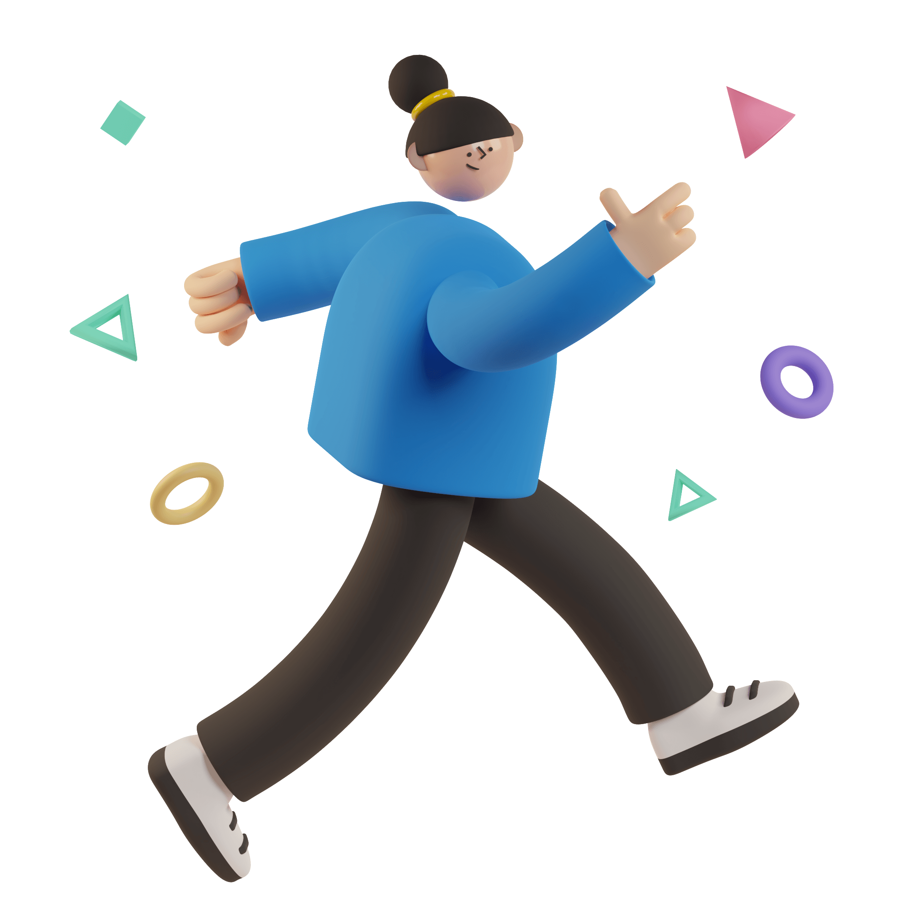</a> | **檔å:** `Saly_22-4b.png`<br>**尺寸:** 2160x2160<br>**大å°:** 233.69KB<br>**æ›´æ–°:** 2026-02-26 |
| <a href="images/3Ds/3D_Illustration-Saly/Saly_23-37.webp"></a> | **檔å:** `Saly_23-37.webp`<br>**尺寸:** 2160x2160<br>**大å°:** 57.82KB<br>**æ›´æ–°:** 2026-02-26 |
| <a href="images/3Ds/3D_Illustration-Saly/Saly_23-42.png"></a> | **檔å:** `Saly_23-42.png`<br>**尺寸:** 2160x2160<br>**大å°:** 165.11KB<br>**æ›´æ–°:** 2026-02-26 |
| <a href="images/3Ds/3D_Illustration-Saly/Saly_24-58.png"></a> | **檔å:** `Saly_24-58.png`<br>**尺寸:** 2160x2160<br>**大å°:** 219.47KB<br>**æ›´æ–°:** 2026-02-26 |
| <a href="images/3Ds/3D_Illustration-Saly/Saly_24-a6.webp"></a> | **檔å:** `Saly_24-a6.webp`<br>**尺寸:** 2160x2160<br>**大å°:** 51.42KB<br>**æ›´æ–°:** 2026-02-26 |
| <a href="images/3Ds/3D_Illustration-Saly/Saly_25-21.png"></a> | **檔å:** `Saly_25-21.png`<br>**尺寸:** 1897x1017<br>**大å°:** 194.61KB<br>**æ›´æ–°:** 2026-02-26 |
| <a href="images/3Ds/3D_Illustration-Saly/Saly_25-22.webp"></a> | **檔å:** `Saly_25-22.webp`<br>**尺寸:** 1897x1017<br>**大å°:** 40.74KB<br>**æ›´æ–°:** 2026-02-26 |
| <a href="images/3Ds/3D_Illustration-Saly/Saly_26-37.webp"></a> | **檔å:** `Saly_26-37.webp`<br>**尺寸:** 1391x1721<br>**大å°:** 54.85KB<br>**æ›´æ–°:** 2026-02-26 |
| <a href="images/3Ds/3D_Illustration-Saly/Saly_26-8f.png"></a> | **檔å:** `Saly_26-8f.png`<br>**尺寸:** 1391x1721<br>**大å°:** 237.84KB<br>**æ›´æ–°:** 2026-02-26 |
| <a href="images/3Ds/3D_Illustration-Saly/Saly_27-a5.webp"></a> | **檔å:** `Saly_27-a5.webp`<br>**尺寸:** 1785x1275<br>**大å°:** 42.33KB<br>**æ›´æ–°:** 2026-02-26 |
| <a href="images/3Ds/3D_Illustration-Saly/Saly_27-c5.png">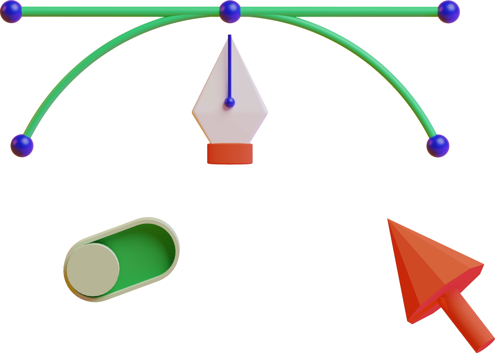</a> | **檔å:** `Saly_27-c5.png`<br>**尺寸:** 1785x1275<br>**大å°:** 72.56KB<br>**æ›´æ–°:** 2026-02-26 |
| <a href="images/3Ds/3D_Illustration-Saly/Saly_29-10.webp"></a> | **檔å:** `Saly_29-10.webp`<br>**尺寸:** 2758x2139<br>**大å°:** 52.71KB<br>**æ›´æ–°:** 2026-02-26 |
| <a href="images/3Ds/3D_Illustration-Saly/Saly_29-f5.png"></a> | **檔å:** `Saly_29-f5.png`<br>**尺寸:** 2758x2139<br>**大å°:** 139.50KB<br>**æ›´æ–°:** 2026-02-26 |
| <a href="images/3Ds/3D_Illustration-Saly/Saly_3-83.webp"></a> | **檔å:** `Saly_3-83.webp`<br>**尺寸:** 2160x2160<br>**大å°:** 87.46KB<br>**æ›´æ–°:** 2026-02-26 |
| <a href="images/3Ds/3D_Illustration-Saly/Saly_3-e1.png"></a> | **檔å:** `Saly_3-e1.png`<br>**尺寸:** 2160x2160<br>**大å°:** 319.81KB<br>**æ›´æ–°:** 2026-02-26 |
| <a href="images/3Ds/3D_Illustration-Saly/Saly_30-42.png"></a> | **檔å:** `Saly_30-42.png`<br>**尺寸:** 2581x1080<br>**大å°:** 73.20KB<br>**æ›´æ–°:** 2026-02-26 |
| <a href="images/3Ds/3D_Illustration-Saly/Saly_30-bb.webp"></a> | **檔å:** `Saly_30-bb.webp`<br>**尺寸:** 2581x1080<br>**大å°:** 33.80KB<br>**æ›´æ–°:** 2026-02-26 |
| <a href="images/3Ds/3D_Illustration-Saly/Saly_31-04.png"></a> | **檔å:** `Saly_31-04.png`<br>**尺寸:** 2160x2160<br>**大å°:** 234.87KB<br>**æ›´æ–°:** 2026-02-26 |
| <a href="images/3Ds/3D_Illustration-Saly/Saly_31-c1.webp"></a> | **檔å:** `Saly_31-c1.webp`<br>**尺寸:** 2160x2160<br>**大å°:** 59.54KB<br>**æ›´æ–°:** 2026-02-26 |
| <a href="images/3Ds/3D_Illustration-Saly/Saly_32-4a.webp"></a> | **檔å:** `Saly_32-4a.webp`<br>**尺寸:** 2160x2160<br>**大å°:** 62.46KB<br>**æ›´æ–°:** 2026-02-26 |
| <a href="images/3Ds/3D_Illustration-Saly/Saly_32-68.png"></a> | **檔å:** `Saly_32-68.png`<br>**尺寸:** 2160x2160<br>**大å°:** 203.35KB<br>**æ›´æ–°:** 2026-02-26 |
| <a href="images/3Ds/3D_Illustration-Saly/Saly_33-43.webp">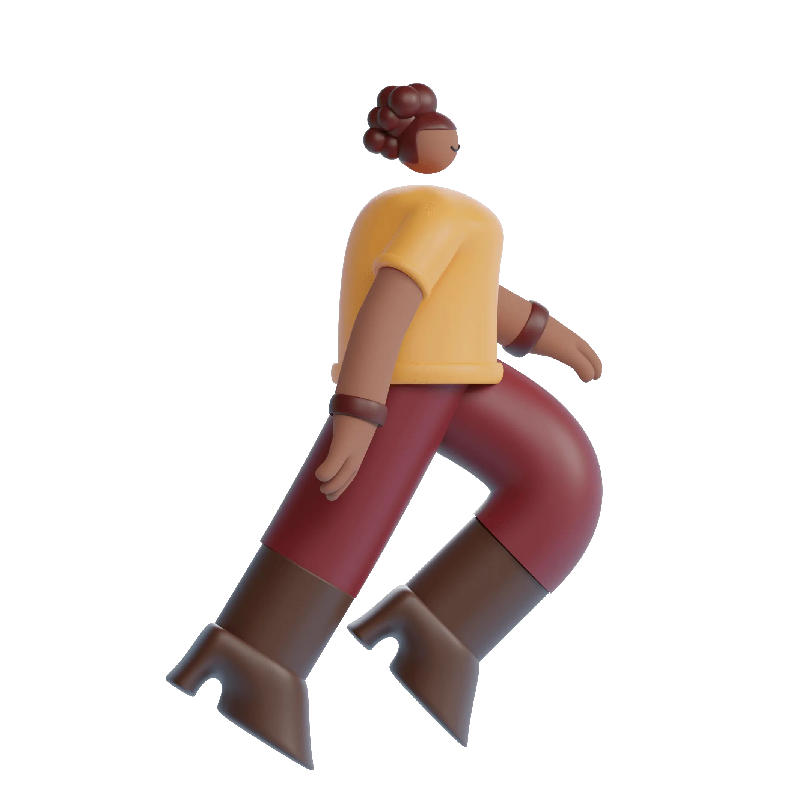</a> | **檔å:** `Saly_33-43.webp`<br>**尺寸:** 2160x2160<br>**大å°:** 47.99KB<br>**æ›´æ–°:** 2026-02-26 |
| <a href="images/3Ds/3D_Illustration-Saly/Saly_33-56.png"></a> | **檔å:** `Saly_33-56.png`<br>**尺寸:** 2160x2160<br>**大å°:** 249.78KB<br>**æ›´æ–°:** 2026-02-26 |
| <a href="images/3Ds/3D_Illustration-Saly/Saly_34-75.png"></a> | **檔å:** `Saly_34-75.png`<br>**尺寸:** 2160x2160<br>**大å°:** 243.66KB<br>**æ›´æ–°:** 2026-02-26 |
| <a href="images/3Ds/3D_Illustration-Saly/Saly_34-9c.webp"></a> | **檔å:** `Saly_34-9c.webp`<br>**尺寸:** 2160x2160<br>**大å°:** 52.64KB<br>**æ›´æ–°:** 2026-02-26 |
| <a href="images/3Ds/3D_Illustration-Saly/Saly_35-39.webp"></a> | **檔å:** `Saly_35-39.webp`<br>**尺寸:** 2160x2160<br>**大å°:** 60.73KB<br>**æ›´æ–°:** 2026-02-26 |
| <a href="images/3Ds/3D_Illustration-Saly/Saly_35-63.png"></a> | **檔å:** `Saly_35-63.png`<br>**尺寸:** 2160x2160<br>**大å°:** 276.42KB<br>**æ›´æ–°:** 2026-02-26 |
| <a href="images/3Ds/3D_Illustration-Saly/Saly_36-30.webp"></a> | **檔å:** `Saly_36-30.webp`<br>**尺寸:** 2160x2160<br>**大å°:** 75.60KB<br>**æ›´æ–°:** 2026-02-26 |
| <a href="images/3Ds/3D_Illustration-Saly/Saly_36-7f.png"></a> | **檔å:** `Saly_36-7f.png`<br>**尺寸:** 2160x2160<br>**大å°:** 334.28KB<br>**æ›´æ–°:** 2026-02-26 |
| <a href="images/3Ds/3D_Illustration-Saly/Saly_37-e5.png">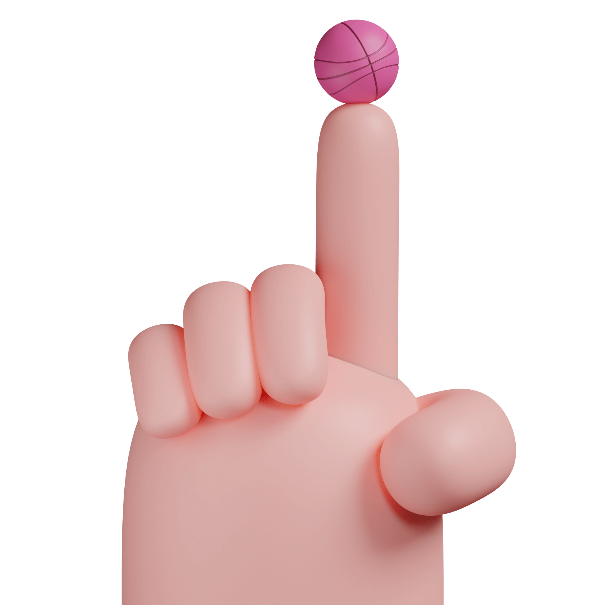</a> | **檔å:** `Saly_37-e5.png`<br>**尺寸:** 2160x2160<br>**大å°:** 355.60KB<br>**æ›´æ–°:** 2026-02-26 |
| <a href="images/3Ds/3D_Illustration-Saly/Saly_37-f4.webp"></a> | **檔å:** `Saly_37-f4.webp`<br>**尺寸:** 2160x2160<br>**大å°:** 34.99KB<br>**æ›´æ–°:** 2026-02-26 |
| <a href="images/3Ds/3D_Illustration-Saly/Saly_38-63.png"></a> | **檔å:** `Saly_38-63.png`<br>**尺寸:** 2160x2160<br>**大å°:** 184.84KB<br>**æ›´æ–°:** 2026-02-26 |
| <a href="images/3Ds/3D_Illustration-Saly/Saly_38-c4.webp"></a> | **檔å:** `Saly_38-c4.webp`<br>**尺寸:** 2160x2160<br>**大å°:** 75.28KB<br>**æ›´æ–°:** 2026-02-26 |
| <a href="images/3Ds/3D_Illustration-Saly/Saly_39-1b.png">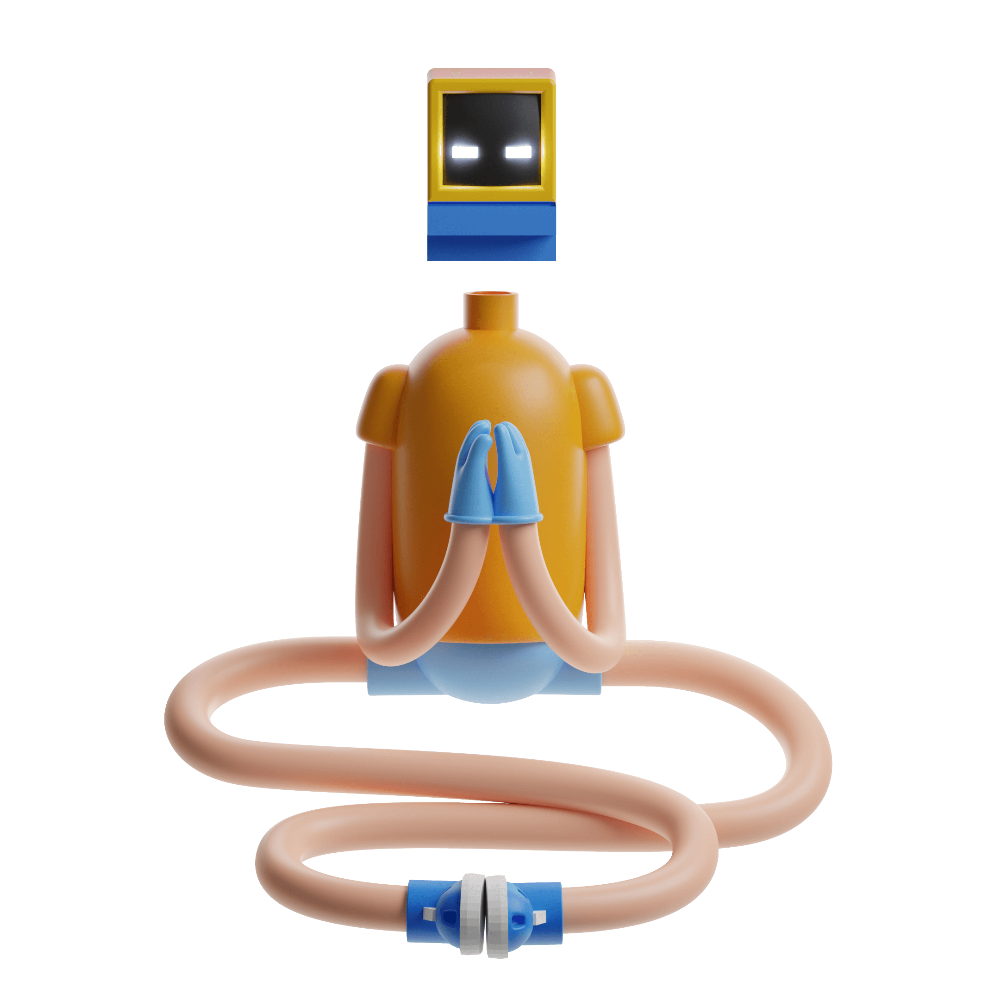</a> | **檔å:** `Saly_39-1b.png`<br>**尺寸:** 2160x2160<br>**大å°:** 246.51KB<br>**æ›´æ–°:** 2026-02-26 |
| <a href="images/3Ds/3D_Illustration-Saly/Saly_39-75.webp"></a> | **檔å:** `Saly_39-75.webp`<br>**尺寸:** 2160x2160<br>**大å°:** 60.40KB<br>**æ›´æ–°:** 2026-02-26 |
| <a href="images/3Ds/3D_Illustration-Saly/Saly_4-08.png"></a> | **檔å:** `Saly_4-08.png`<br>**尺寸:** 2160x2160<br>**大å°:** 126.90KB<br>**æ›´æ–°:** 2026-02-26 |
| <a href="images/3Ds/3D_Illustration-Saly/Saly_4-9e.webp">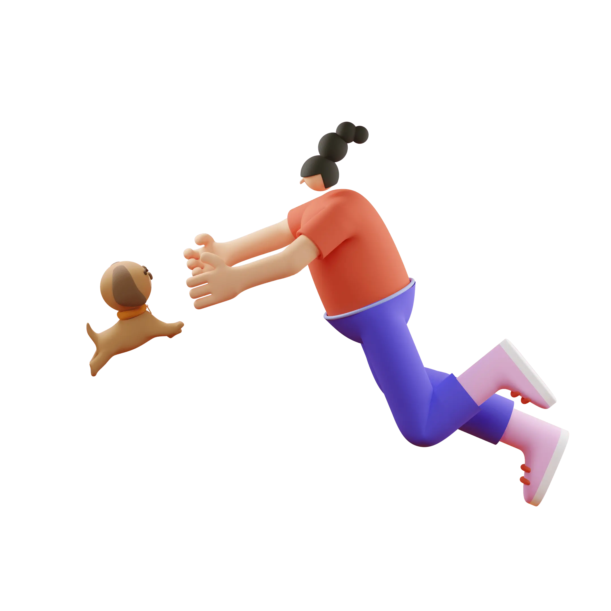</a> | **檔å:** `Saly_4-9e.webp`<br>**尺寸:** 2160x2160<br>**大å°:** 53.07KB<br>**æ›´æ–°:** 2026-02-26 |
| <a href="images/3Ds/3D_Illustration-Saly/Saly_40-51.png"></a> | **檔å:** `Saly_40-51.png`<br>**尺寸:** 1413x1963<br>**大å°:** 180.73KB<br>**æ›´æ–°:** 2026-02-26 |
| <a href="images/3Ds/3D_Illustration-Saly/Saly_40-fd.webp"></a> | **檔å:** `Saly_40-fd.webp`<br>**尺寸:** 1413x1963<br>**大å°:** 48.05KB<br>**æ›´æ–°:** 2026-02-26 |
| <a href="images/3Ds/3D_Illustration-Saly/Saly_41-c0.png"></a> | **檔å:** `Saly_41-c0.png`<br>**尺寸:** 2160x2160<br>**大å°:** 152.35KB<br>**æ›´æ–°:** 2026-02-26 |
| <a href="images/3Ds/3D_Illustration-Saly/Saly_41-e4.webp"></a> | **檔å:** `Saly_41-e4.webp`<br>**尺寸:** 2160x2160<br>**大å°:** 33.82KB<br>**æ›´æ–°:** 2026-02-26 |
| <a href="images/3Ds/3D_Illustration-Saly/Saly_42-85.webp"></a> | **檔å:** `Saly_42-85.webp`<br>**尺寸:** 2160x2160<br>**大å°:** 44.68KB<br>**æ›´æ–°:** 2026-02-26 |
| <a href="images/3Ds/3D_Illustration-Saly/Saly_42-a0.png"></a> | **檔å:** `Saly_42-a0.png`<br>**尺寸:** 2160x2160<br>**大å°:** 332.28KB<br>**æ›´æ–°:** 2026-02-26 |
| <a href="images/3Ds/3D_Illustration-Saly/Saly_43-47.webp"></a> | **檔å:** `Saly_43-47.webp`<br>**尺寸:** 2160x2160<br>**大å°:** 57.81KB<br>**æ›´æ–°:** 2026-02-26 |
| <a href="images/3Ds/3D_Illustration-Saly/Saly_43-74.png"></a> | **檔å:** `Saly_43-74.png`<br>**尺寸:** 2160x2160<br>**大å°:** 279.46KB<br>**æ›´æ–°:** 2026-02-26 |
| <a href="images/3Ds/3D_Illustration-Saly/Saly_44-3d.webp"></a> | **檔å:** `Saly_44-3d.webp`<br>**尺寸:** 2160x2160<br>**大å°:** 84.93KB<br>**æ›´æ–°:** 2026-02-26 |
| <a href="images/3Ds/3D_Illustration-Saly/Saly_44-c0.png"></a> | **檔å:** `Saly_44-c0.png`<br>**尺寸:** 2160x2160<br>**大å°:** 396.48KB<br>**æ›´æ–°:** 2026-02-26 |
| <a href="images/3Ds/3D_Illustration-Saly/Saly_45-6c.png"></a> | **檔å:** `Saly_45-6c.png`<br>**尺寸:** 2160x2160<br>**大å°:** 259.45KB<br>**æ›´æ–°:** 2026-02-26 |
| <a href="images/3Ds/3D_Illustration-Saly/Saly_45-82.webp"></a> | **檔å:** `Saly_45-82.webp`<br>**尺寸:** 2160x2160<br>**大å°:** 45.93KB<br>**æ›´æ–°:** 2026-02-26 |
| <a href="images/3Ds/3D_Illustration-Saly/Saly_5-05.png"></a> | **檔å:** `Saly_5-05.png`<br>**尺寸:** 2160x2160<br>**大å°:** 174.52KB<br>**æ›´æ–°:** 2026-02-26 |
| <a href="images/3Ds/3D_Illustration-Saly/Saly_5-8c.webp"></a> | **檔å:** `Saly_5-8c.webp`<br>**尺寸:** 2160x2160<br>**大å°:** 71.62KB<br>**æ›´æ–°:** 2026-02-26 |
| <a href="images/3Ds/3D_Illustration-Saly/Saly_6-73.png"></a> | **檔å:** `Saly_6-73.png`<br>**尺寸:** 2160x2160<br>**大å°:** 187.64KB<br>**æ›´æ–°:** 2026-02-26 |
| <a href="images/3Ds/3D_Illustration-Saly/Saly_6-89.webp"></a> | **檔å:** `Saly_6-89.webp`<br>**尺寸:** 2160x2160<br>**大å°:** 46.49KB<br>**æ›´æ–°:** 2026-02-26 |
| <a href="images/3Ds/3D_Illustration-Saly/Saly_7-f2.png">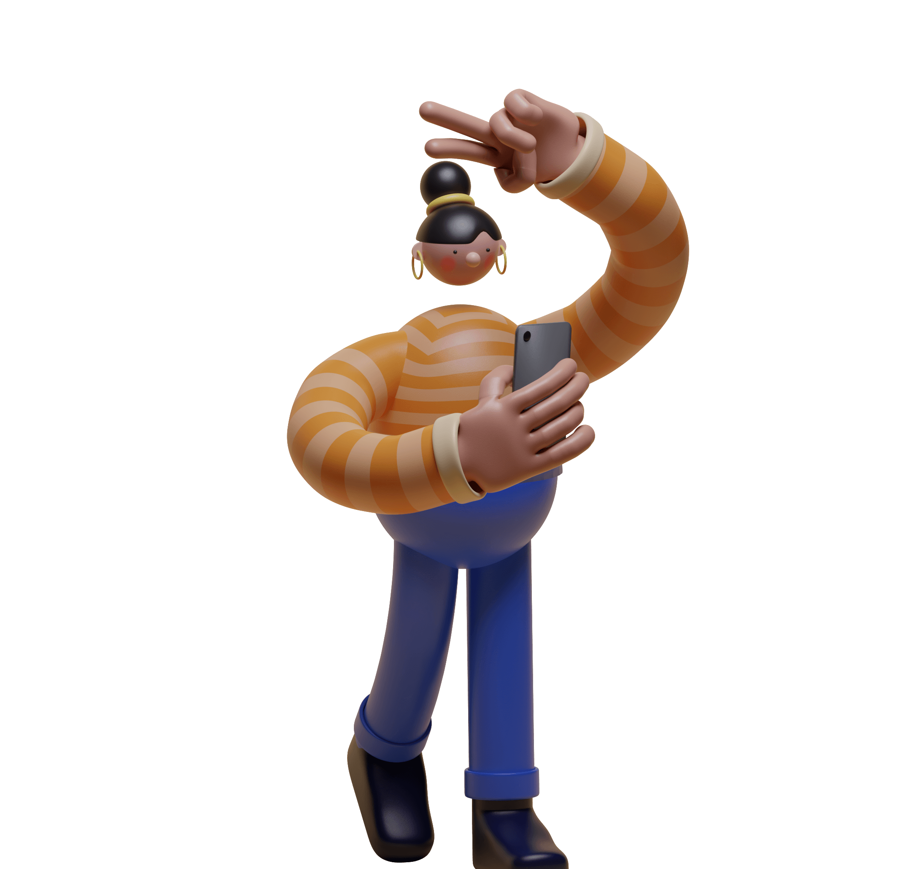</a> | **檔å:** `Saly_7-f2.png`<br>**尺寸:** 2160x2059<br>**大å°:** 232.28KB<br>**æ›´æ–°:** 2026-02-26 |
| <a href="images/3Ds/3D_Illustration-Saly/Saly_7-f9.webp"></a> | **檔å:** `Saly_7-f9.webp`<br>**尺寸:** 2160x2059<br>**大å°:** 56.37KB<br>**æ›´æ–°:** 2026-02-26 |
| <a href="images/3Ds/3D_Illustration-Saly/Saly_8-9b.webp"></a> | **檔å:** `Saly_8-9b.webp`<br>**尺寸:** 2160x2160<br>**大å°:** 30.18KB<br>**æ›´æ–°:** 2026-02-26 |
| <a href="images/3Ds/3D_Illustration-Saly/Saly_8-f2.png"></a> | **檔å:** `Saly_8-f2.png`<br>**尺寸:** 2160x2160<br>**大å°:** 175.01KB<br>**æ›´æ–°:** 2026-02-26 |
| <a href="images/3Ds/3D_Illustration-Saly/Saly_9-4d.png"></a> | **檔å:** `Saly_9-4d.png`<br>**尺寸:** 2160x2082<br>**大å°:** 145.31KB<br>**æ›´æ–°:** 2026-02-26 |
| <a href="images/3Ds/3D_Illustration-Saly/Saly_9-73.webp"></a> | **檔å:** `Saly_9-73.webp`<br>**尺寸:** 2160x2082<br>**大å°:** 46.85KB<br>**æ›´æ–°:** 2026-02-26 |
| <a href="images/3Ds/3D_Illustration-Saly/saly_28-53.png"></a> | **檔å:** `saly_28-53.png`<br>**尺寸:** 1393x1156<br>**大å°:** 32.75KB<br>**æ›´æ–°:** 2026-02-26 |
| <a href="images/3Ds/3D_Illustration-Saly/saly_28-9f.webp"></a> | **檔å:** `saly_28-9f.webp`<br>**尺寸:** 1393x1156<br>**大å°:** 23.25KB<br>**æ›´æ–°:** 2026-02-26 |

### 📠3d_illustration-v1

| é è¦½ (é»æ“Šæ”¾å¤§) | 檔案詳細資訊 |
| :--- | :--- |
| <a href="images/3Ds/3D_Illustration-V1/atm-29.png"></a> | **檔å:** `atm-29.png`<br>**尺寸:** 2000x2000<br>**大å°:** 226.31KB<br>**æ›´æ–°:** 2026-02-26 |
| <a href="images/3Ds/3D_Illustration-V1/atm-5f.webp"></a> | **檔å:** `atm-5f.webp`<br>**尺寸:** 2000x2000<br>**大å°:** 76.48KB<br>**æ›´æ–°:** 2026-02-26 |
| <a href="images/3Ds/3D_Illustration-V1/curve-1f.png"></a> | **檔å:** `curve-1f.png`<br>**尺寸:** 2000x2000<br>**大å°:** 271.52KB<br>**æ›´æ–°:** 2026-02-26 |
| <a href="images/3Ds/3D_Illustration-V1/curve-d1.webp"></a> | **檔å:** `curve-d1.webp`<br>**尺寸:** 2000x2000<br>**大å°:** 79.11KB<br>**æ›´æ–°:** 2026-02-26 |
| <a href="images/3Ds/3D_Illustration-V1/female pose -1-51.png"></a> | **檔å:** `female pose -1-51.png`<br>**尺寸:** 1503x2972<br>**大å°:** 499.42KB<br>**æ›´æ–°:** 2026-02-26 |
| <a href="images/3Ds/3D_Illustration-V1/female pose -1-9f.webp"></a> | **檔å:** `female pose -1-9f.webp`<br>**尺寸:** 1503x2972<br>**大å°:** 154.42KB<br>**æ›´æ–°:** 2026-02-26 |

### 📠3d_illustration-v2

| é è¦½ (é»æ“Šæ”¾å¤§) | 檔案詳細資訊 |
| :--- | :--- |
| <a href="images/3Ds/3D_Illustration-V2/01.ARTIST-9e.webp"></a> | **檔å:** `01.ARTIST-9e.webp`<br>**尺寸:** 2160x2160<br>**大å°:** 128.19KB<br>**æ›´æ–°:** 2026-02-26 |
| <a href="images/3Ds/3D_Illustration-V2/01.ARTIST-dc.png"></a> | **檔å:** `01.ARTIST-dc.png`<br>**尺寸:** 2160x2160<br>**大å°:** 469.66KB<br>**æ›´æ–°:** 2026-02-26 |
| <a href="images/3Ds/3D_Illustration-V2/01.AwardIcon-4c.png"></a> | **檔å:** `01.AwardIcon-4c.png`<br>**尺寸:** 2000x2000<br>**大å°:** 252.18KB<br>**æ›´æ–°:** 2026-02-26 |
| <a href="images/3Ds/3D_Illustration-V2/01.AwardIcon-fe.webp"></a> | **檔å:** `01.AwardIcon-fe.webp`<br>**尺寸:** 2000x2000<br>**大å°:** 97.36KB<br>**æ›´æ–°:** 2026-02-26 |
| <a href="images/3Ds/3D_Illustration-V2/01.OnlinePaymentIcon-1c.webp"></a> | **檔å:** `01.OnlinePaymentIcon-1c.webp`<br>**尺寸:** 2000x2000<br>**大å°:** 102.00KB<br>**æ›´æ–°:** 2026-02-26 |
| <a href="images/3Ds/3D_Illustration-V2/01.OnlinePaymentIcon-61.png"></a> | **檔å:** `01.OnlinePaymentIcon-61.png`<br>**尺寸:** 2000x2000<br>**大å°:** 280.57KB<br>**æ›´æ–°:** 2026-02-26 |
| <a href="images/3Ds/3D_Illustration-V2/02.ASTRONOUT-45.webp"></a> | **檔å:** `02.ASTRONOUT-45.webp`<br>**尺寸:** 2160x2160<br>**大å°:** 179.33KB<br>**æ›´æ–°:** 2026-02-26 |
| <a href="images/3Ds/3D_Illustration-V2/02.ASTRONOUT-64.png"></a> | **檔å:** `02.ASTRONOUT-64.png`<br>**尺寸:** 2160x2160<br>**大å°:** 681.78KB<br>**æ›´æ–°:** 2026-02-26 |
| <a href="images/3Ds/3D_Illustration-V2/02.ClockIcon-54.webp"></a> | **檔å:** `02.ClockIcon-54.webp`<br>**尺寸:** 2000x2000<br>**大å°:** 144.98KB<br>**æ›´æ–°:** 2026-02-26 |
| <a href="images/3Ds/3D_Illustration-V2/02.ClockIcon-87.png"></a> | **檔å:** `02.ClockIcon-87.png`<br>**尺寸:** 2000x2000<br>**大å°:** 472.93KB<br>**æ›´æ–°:** 2026-02-26 |
| <a href="images/3Ds/3D_Illustration-V2/02.SubscriptionIcon-3c.webp"></a> | **檔å:** `02.SubscriptionIcon-3c.webp`<br>**尺寸:** 2000x2000<br>**大å°:** 110.49KB<br>**æ›´æ–°:** 2026-02-26 |
| <a href="images/3Ds/3D_Illustration-V2/02.SubscriptionIcon-a3.png"></a> | **檔å:** `02.SubscriptionIcon-a3.png`<br>**尺寸:** 2000x2000<br>**大å°:** 377.14KB<br>**æ›´æ–°:** 2026-02-26 |
| <a href="images/3Ds/3D_Illustration-V2/03.BABY-cc.png"></a> | **檔å:** `03.BABY-cc.png`<br>**尺寸:** 2160x2160<br>**大å°:** 396.66KB<br>**æ›´æ–°:** 2026-02-26 |
| <a href="images/3Ds/3D_Illustration-V2/03.BABY-e4.webp"></a> | **檔å:** `03.BABY-e4.webp`<br>**尺寸:** 2160x2160<br>**大å°:** 114.98KB<br>**æ›´æ–°:** 2026-02-26 |
| <a href="images/3Ds/3D_Illustration-V2/03.OnlineStoreIcon-3f.webp"></a> | **檔å:** `03.OnlineStoreIcon-3f.webp`<br>**尺寸:** 2000x2000<br>**大å°:** 105.84KB<br>**æ›´æ–°:** 2026-02-26 |
| <a href="images/3Ds/3D_Illustration-V2/03.OnlineStoreIcon-8c.png"></a> | **檔å:** `03.OnlineStoreIcon-8c.png`<br>**尺寸:** 2000x2000<br>**大å°:** 339.15KB<br>**æ›´æ–°:** 2026-02-26 |
| <a href="images/3Ds/3D_Illustration-V2/03.TitleIcon-07.webp"></a> | **檔å:** `03.TitleIcon-07.webp`<br>**尺寸:** 2000x2000<br>**大å°:** 100.22KB<br>**æ›´æ–°:** 2026-02-26 |
| <a href="images/3Ds/3D_Illustration-V2/03.TitleIcon-10.png"></a> | **檔å:** `03.TitleIcon-10.png`<br>**尺寸:** 2000x2000<br>**大å°:** 337.37KB<br>**æ›´æ–°:** 2026-02-26 |
| <a href="images/3Ds/3D_Illustration-V2/04.CustomerService-d4.png"></a> | **檔å:** `04.CustomerService-d4.png`<br>**尺寸:** 2000x2000<br>**大å°:** 412.45KB<br>**æ›´æ–°:** 2026-02-26 |
| <a href="images/3Ds/3D_Illustration-V2/04.CustomerService-eb.webp"></a> | **檔å:** `04.CustomerService-eb.webp`<br>**尺寸:** 2000x2000<br>**大å°:** 114.60KB<br>**æ›´æ–°:** 2026-02-26 |
| <a href="images/3Ds/3D_Illustration-V2/04.STUDENT-87.png"></a> | **檔å:** `04.STUDENT-87.png`<br>**尺寸:** 2160x2160<br>**大å°:** 475.65KB<br>**æ›´æ–°:** 2026-02-26 |
| <a href="images/3Ds/3D_Illustration-V2/04.STUDENT-b6.webp"></a> | **檔å:** `04.STUDENT-b6.webp`<br>**尺寸:** 2160x2160<br>**大å°:** 142.03KB<br>**æ›´æ–°:** 2026-02-26 |
| <a href="images/3Ds/3D_Illustration-V2/04.SocialNetworkIcon-c2.png"></a> | **檔å:** `04.SocialNetworkIcon-c2.png`<br>**尺寸:** 2000x2000<br>**大å°:** 398.46KB<br>**æ›´æ–°:** 2026-02-26 |
| <a href="images/3Ds/3D_Illustration-V2/04.SocialNetworkIcon-de.webp"></a> | **檔å:** `04.SocialNetworkIcon-de.webp`<br>**尺寸:** 2000x2000<br>**大å°:** 120.28KB<br>**æ›´æ–°:** 2026-02-26 |
| <a href="images/3Ds/3D_Illustration-V2/05.DOCTOR-69.webp"></a> | **檔å:** `05.DOCTOR-69.webp`<br>**尺寸:** 2160x2160<br>**大å°:** 134.99KB<br>**æ›´æ–°:** 2026-02-26 |
| <a href="images/3Ds/3D_Illustration-V2/05.DOCTOR-96.png"></a> | **檔å:** `05.DOCTOR-96.png`<br>**尺寸:** 2160x2160<br>**大å°:** 463.73KB<br>**æ›´æ–°:** 2026-02-26 |
| <a href="images/3Ds/3D_Illustration-V2/05.KeywordIcon-17.webp"></a> | **檔å:** `05.KeywordIcon-17.webp`<br>**尺寸:** 2000x2000<br>**大å°:** 115.48KB<br>**æ›´æ–°:** 2026-02-26 |
| <a href="images/3Ds/3D_Illustration-V2/05.KeywordIcon-ee.png"></a> | **檔å:** `05.KeywordIcon-ee.png`<br>**尺寸:** 2000x2000<br>**大å°:** 299.08KB<br>**æ›´æ–°:** 2026-02-26 |
| <a href="images/3Ds/3D_Illustration-V2/05.LikesIcon-76.png"></a> | **檔å:** `05.LikesIcon-76.png`<br>**尺寸:** 2000x2000<br>**大å°:** 355.43KB<br>**æ›´æ–°:** 2026-02-26 |
| <a href="images/3Ds/3D_Illustration-V2/05.LikesIcon-a8.webp"></a> | **檔å:** `05.LikesIcon-a8.webp`<br>**尺寸:** 2000x2000<br>**大å°:** 109.47KB<br>**æ›´æ–°:** 2026-02-26 |
| <a href="images/3Ds/3D_Illustration-V2/06.IdeaIcon-99.webp"></a> | **檔å:** `06.IdeaIcon-99.webp`<br>**尺寸:** 2000x2000<br>**大å°:** 69.09KB<br>**æ›´æ–°:** 2026-02-26 |
| <a href="images/3Ds/3D_Illustration-V2/06.IdeaIcon-f1.png"></a> | **檔å:** `06.IdeaIcon-f1.png`<br>**尺寸:** 2000x2000<br>**大å°:** 192.81KB<br>**æ›´æ–°:** 2026-02-26 |
| <a href="images/3Ds/3D_Illustration-V2/06.POLICE-21.png">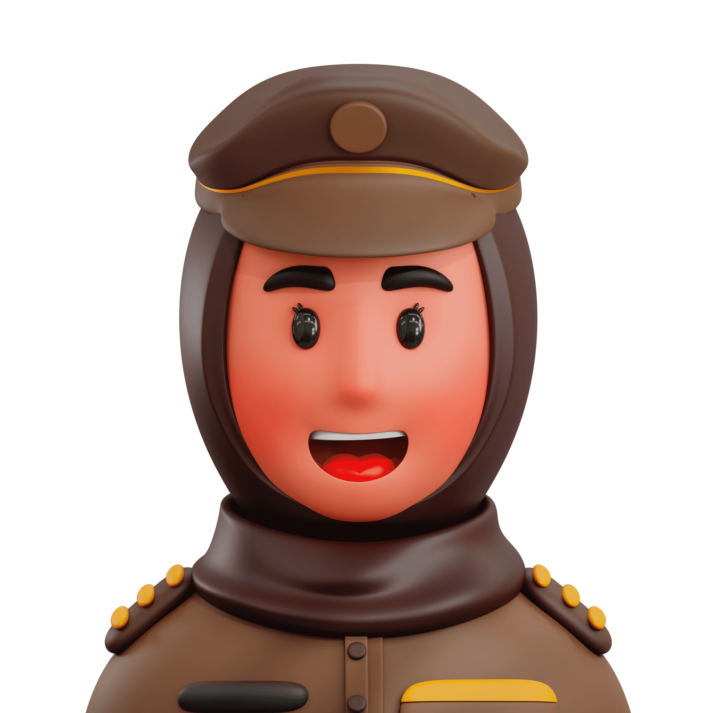</a> | **檔å:** `06.POLICE-21.png`<br>**尺寸:** 2160x2160<br>**大å°:** 478.14KB<br>**æ›´æ–°:** 2026-02-26 |
| <a href="images/3Ds/3D_Illustration-V2/06.POLICE-89.webp"></a> | **檔å:** `06.POLICE-89.webp`<br>**尺寸:** 2160x2160<br>**大å°:** 137.50KB<br>**æ›´æ–°:** 2026-02-26 |
| <a href="images/3Ds/3D_Illustration-V2/06.ProductIcon-8f.webp"></a> | **檔å:** `06.ProductIcon-8f.webp`<br>**尺寸:** 2000x2000<br>**大å°:** 132.06KB<br>**æ›´æ–°:** 2026-02-26 |
| <a href="images/3Ds/3D_Illustration-V2/06.ProductIcon-df.png"></a> | **檔å:** `06.ProductIcon-df.png`<br>**尺寸:** 2000x2000<br>**大å°:** 380.78KB<br>**æ›´æ–°:** 2026-02-26 |
| <a href="images/3Ds/3D_Illustration-V2/07.CallCenterIcon-05.png"></a> | **檔å:** `07.CallCenterIcon-05.png`<br>**尺寸:** 2000x2000<br>**大å°:** 526.74KB<br>**æ›´æ–°:** 2026-02-26 |
| <a href="images/3Ds/3D_Illustration-V2/07.CallCenterIcon-24.webp"></a> | **檔å:** `07.CallCenterIcon-24.webp`<br>**尺寸:** 2000x2000<br>**大å°:** 133.27KB<br>**æ›´æ–°:** 2026-02-26 |
| <a href="images/3Ds/3D_Illustration-V2/07.CorrectionIcon-70.webp"></a> | **檔å:** `07.CorrectionIcon-70.webp`<br>**尺寸:** 2000x2000<br>**大å°:** 99.04KB<br>**æ›´æ–°:** 2026-02-26 |
| <a href="images/3Ds/3D_Illustration-V2/07.CorrectionIcon-89.png"></a> | **檔å:** `07.CorrectionIcon-89.png`<br>**尺寸:** 2000x2000<br>**大å°:** 328.06KB<br>**æ›´æ–°:** 2026-02-26 |
| <a href="images/3Ds/3D_Illustration-V2/07.FARMER-04.png"></a> | **檔å:** `07.FARMER-04.png`<br>**尺寸:** 2160x2160<br>**大å°:** 546.09KB<br>**æ›´æ–°:** 2026-02-26 |
| <a href="images/3Ds/3D_Illustration-V2/07.FARMER-d8.webp"></a> | **檔å:** `07.FARMER-d8.webp`<br>**尺寸:** 2160x2160<br>**大å°:** 138.57KB<br>**æ›´æ–°:** 2026-02-26 |
| <a href="images/3Ds/3D_Illustration-V2/08.DESIGNER-34.png"></a> | **檔å:** `08.DESIGNER-34.png`<br>**尺寸:** 2160x2160<br>**大å°:** 582.90KB<br>**æ›´æ–°:** 2026-02-26 |
| <a href="images/3Ds/3D_Illustration-V2/08.DESIGNER-d8.webp"></a> | **檔å:** `08.DESIGNER-d8.webp`<br>**尺寸:** 2160x2160<br>**大å°:** 137.06KB<br>**æ›´æ–°:** 2026-02-26 |
| <a href="images/3Ds/3D_Illustration-V2/08.SecurityIcon-64.png"></a> | **檔å:** `08.SecurityIcon-64.png`<br>**尺寸:** 2000x2000<br>**大å°:** 369.41KB<br>**æ›´æ–°:** 2026-02-26 |
| <a href="images/3Ds/3D_Illustration-V2/08.SecurityIcon-c0.webp"></a> | **檔å:** `08.SecurityIcon-c0.webp`<br>**尺寸:** 2000x2000<br>**大å°:** 120.51KB<br>**æ›´æ–°:** 2026-02-26 |
| <a href="images/3Ds/3D_Illustration-V2/08.rightIcon-f8.png"></a> | **檔å:** `08.rightIcon-f8.png`<br>**尺寸:** 2000x2000<br>**大å°:** 334.03KB<br>**æ›´æ–°:** 2026-02-26 |
| <a href="images/3Ds/3D_Illustration-V2/08.rightIcon-fb.webp"></a> | **檔å:** `08.rightIcon-fb.webp`<br>**尺寸:** 2000x2000<br>**大å°:** 98.19KB<br>**æ›´æ–°:** 2026-02-26 |
| <a href="images/3Ds/3D_Illustration-V2/09.SEOIcon-e3.webp"></a> | **檔å:** `09.SEOIcon-e3.webp`<br>**尺寸:** 2000x2000<br>**大å°:** 118.94KB<br>**æ›´æ–°:** 2026-02-26 |
| <a href="images/3Ds/3D_Illustration-V2/09.SEOIcon-e7.png"></a> | **檔å:** `09.SEOIcon-e7.png`<br>**尺寸:** 2000x2000<br>**大å°:** 419.15KB<br>**æ›´æ–°:** 2026-02-26 |
| <a href="images/3Ds/3D_Illustration-V2/09.SearchIcon-55.webp"></a> | **檔å:** `09.SearchIcon-55.webp`<br>**尺寸:** 2000x2000<br>**大å°:** 75.04KB<br>**æ›´æ–°:** 2026-02-26 |
| <a href="images/3Ds/3D_Illustration-V2/09.SearchIcon-c8.png"></a> | **檔å:** `09.SearchIcon-c8.png`<br>**尺寸:** 2000x2000<br>**大å°:** 247.91KB<br>**æ›´æ–°:** 2026-02-26 |
| <a href="images/3Ds/3D_Illustration-V2/09.YOUNGWOMAN-6e.webp"></a> | **檔å:** `09.YOUNGWOMAN-6e.webp`<br>**尺寸:** 2160x2160<br>**大å°:** 159.94KB<br>**æ›´æ–°:** 2026-02-26 |
| <a href="images/3Ds/3D_Illustration-V2/09.YOUNGWOMAN-9d.png"></a> | **檔å:** `09.YOUNGWOMAN-9d.png`<br>**尺寸:** 2160x2160<br>**大å°:** 470.33KB<br>**æ›´æ–°:** 2026-02-26 |
| <a href="images/3Ds/3D_Illustration-V2/10.DeliveryIcon-c6.webp"></a> | **檔å:** `10.DeliveryIcon-c6.webp`<br>**尺寸:** 2000x2000<br>**大å°:** 89.80KB<br>**æ›´æ–°:** 2026-02-26 |
| <a href="images/3Ds/3D_Illustration-V2/10.DeliveryIcon-e2.png"></a> | **檔å:** `10.DeliveryIcon-e2.png`<br>**尺寸:** 2000x2000<br>**大å°:** 339.21KB<br>**æ›´æ–°:** 2026-02-26 |
| <a href="images/3Ds/3D_Illustration-V2/10.TrashIcon-12.webp"></a> | **檔å:** `10.TrashIcon-12.webp`<br>**尺寸:** 2000x2000<br>**大å°:** 102.68KB<br>**æ›´æ–°:** 2026-02-26 |
| <a href="images/3Ds/3D_Illustration-V2/10.TrashIcon-2b.png"></a> | **檔å:** `10.TrashIcon-2b.png`<br>**尺寸:** 2000x2000<br>**大å°:** 315.17KB<br>**æ›´æ–°:** 2026-02-26 |
| <a href="images/3Ds/3D_Illustration-V2/10.YOUNGMAN-56.png"></a> | **檔å:** `10.YOUNGMAN-56.png`<br>**尺寸:** 2160x2160<br>**大å°:** 490.20KB<br>**æ›´æ–°:** 2026-02-26 |
| <a href="images/3Ds/3D_Illustration-V2/10.YOUNGMAN-f5.webp"></a> | **檔å:** `10.YOUNGMAN-f5.webp`<br>**尺寸:** 2160x2160<br>**大å°:** 145.67KB<br>**æ›´æ–°:** 2026-02-26 |
| <a href="images/3Ds/3D_Illustration-V2/11.BUSINESSMAN-0f.webp"></a> | **檔å:** `11.BUSINESSMAN-0f.webp`<br>**尺寸:** 2160x2160<br>**大å°:** 135.67KB<br>**æ›´æ–°:** 2026-02-26 |
| <a href="images/3Ds/3D_Illustration-V2/11.BUSINESSMAN-26.png"></a> | **檔å:** `11.BUSINESSMAN-26.png`<br>**尺寸:** 2160x2160<br>**大å°:** 464.33KB<br>**æ›´æ–°:** 2026-02-26 |
| <a href="images/3Ds/3D_Illustration-V2/11.BriefIcon-6e.png"></a> | **檔å:** `11.BriefIcon-6e.png`<br>**尺寸:** 2000x2000<br>**大å°:** 320.56KB<br>**æ›´æ–°:** 2026-02-26 |
| <a href="images/3Ds/3D_Illustration-V2/11.BriefIcon-c8.webp"></a> | **檔å:** `11.BriefIcon-c8.webp`<br>**尺寸:** 2000x2000<br>**大å°:** 96.38KB<br>**æ›´æ–°:** 2026-02-26 |
| <a href="images/3Ds/3D_Illustration-V2/11.DiscountIcon-20.png"></a> | **檔å:** `11.DiscountIcon-20.png`<br>**尺寸:** 2000x2000<br>**大å°:** 333.11KB<br>**æ›´æ–°:** 2026-02-26 |
| <a href="images/3Ds/3D_Illustration-V2/11.DiscountIcon-fa.webp"></a> | **檔å:** `11.DiscountIcon-fa.webp`<br>**尺寸:** 2000x2000<br>**大å°:** 102.65KB<br>**æ›´æ–°:** 2026-02-26 |
| <a href="images/3Ds/3D_Illustration-V2/12.GoalIcon-7d.webp"></a> | **檔å:** `12.GoalIcon-7d.webp`<br>**尺寸:** 2000x2000<br>**大å°:** 97.13KB<br>**æ›´æ–°:** 2026-02-26 |
| <a href="images/3Ds/3D_Illustration-V2/12.GoalIcon-d9.png"></a> | **檔å:** `12.GoalIcon-d9.png`<br>**尺寸:** 2000x2000<br>**大å°:** 305.79KB<br>**æ›´æ–°:** 2026-02-26 |
| <a href="images/3Ds/3D_Illustration-V2/12.MegaphoneIcon-03.webp"></a> | **檔å:** `12.MegaphoneIcon-03.webp`<br>**尺寸:** 2000x2000<br>**大å°:** 92.63KB<br>**æ›´æ–°:** 2026-02-26 |
| <a href="images/3Ds/3D_Illustration-V2/12.MegaphoneIcon-72.png"></a> | **檔å:** `12.MegaphoneIcon-72.png`<br>**尺寸:** 2000x2000<br>**大å°:** 380.52KB<br>**æ›´æ–°:** 2026-02-26 |
| <a href="images/3Ds/3D_Illustration-V2/12.TEACHER-ec.webp"></a> | **檔å:** `12.TEACHER-ec.webp`<br>**尺寸:** 2160x2160<br>**大å°:** 147.71KB<br>**æ›´æ–°:** 2026-02-26 |
| <a href="images/3Ds/3D_Illustration-V2/12.TEACHER-ff.png"></a> | **檔å:** `12.TEACHER-ff.png`<br>**尺寸:** 2160x2160<br>**大å°:** 472.81KB<br>**æ›´æ–°:** 2026-02-26 |
| <a href="images/3Ds/3D_Illustration-V2/13.EmailIcon-14.png"></a> | **檔å:** `13.EmailIcon-14.png`<br>**尺寸:** 2000x2000<br>**大å°:** 335.22KB<br>**æ›´æ–°:** 2026-02-26 |
| <a href="images/3Ds/3D_Illustration-V2/13.EmailIcon-f4.webp"></a> | **檔å:** `13.EmailIcon-f4.webp`<br>**尺寸:** 2000x2000<br>**大å°:** 103.59KB<br>**æ›´æ–°:** 2026-02-26 |
| <a href="images/3Ds/3D_Illustration-V2/13.SEOIcon-73.png"></a> | **檔å:** `13.SEOIcon-73.png`<br>**尺寸:** 2000x2000<br>**大å°:** 232.53KB<br>**æ›´æ–°:** 2026-02-26 |
| <a href="images/3Ds/3D_Illustration-V2/13.SEOIcon-f8.webp"></a> | **檔å:** `13.SEOIcon-f8.webp`<br>**尺寸:** 2000x2000<br>**大å°:** 82.73KB<br>**æ›´æ–°:** 2026-02-26 |
| <a href="images/3Ds/3D_Illustration-V2/13.YOUTUBER-a4.png"></a> | **檔å:** `13.YOUTUBER-a4.png`<br>**尺寸:** 2160x2160<br>**大å°:** 453.32KB<br>**æ›´æ–°:** 2026-02-26 |
| <a href="images/3Ds/3D_Illustration-V2/13.YOUTUBER-bc.webp"></a> | **檔å:** `13.YOUTUBER-bc.webp`<br>**尺寸:** 2160x2160<br>**大å°:** 130.82KB<br>**æ›´æ–°:** 2026-02-26 |
| <a href="images/3Ds/3D_Illustration-V2/14.CHEF-2b.png"></a> | **檔å:** `14.CHEF-2b.png`<br>**尺寸:** 2160x2160<br>**大å°:** 391.59KB<br>**æ›´æ–°:** 2026-02-26 |
| <a href="images/3Ds/3D_Illustration-V2/14.CHEF-ca.webp"></a> | **檔å:** `14.CHEF-ca.webp`<br>**尺寸:** 2160x2160<br>**大å°:** 108.20KB<br>**æ›´æ–°:** 2026-02-26 |
| <a href="images/3Ds/3D_Illustration-V2/14.FeedBackIcon-3a.webp"></a> | **檔å:** `14.FeedBackIcon-3a.webp`<br>**尺寸:** 2000x2000<br>**大å°:** 107.54KB<br>**æ›´æ–°:** 2026-02-26 |
| <a href="images/3Ds/3D_Illustration-V2/14.FeedBackIcon-5d.png"></a> | **檔å:** `14.FeedBackIcon-5d.png`<br>**尺寸:** 2000x2000<br>**大å°:** 349.46KB<br>**æ›´æ–°:** 2026-02-26 |
| <a href="images/3Ds/3D_Illustration-V2/14.RadioIcon-89.webp"></a> | **檔å:** `14.RadioIcon-89.webp`<br>**尺寸:** 2000x2000<br>**大å°:** 86.23KB<br>**æ›´æ–°:** 2026-02-26 |
| <a href="images/3Ds/3D_Illustration-V2/14.RadioIcon-f6.png"></a> | **檔å:** `14.RadioIcon-f6.png`<br>**尺寸:** 2000x2000<br>**大å°:** 231.96KB<br>**æ›´æ–°:** 2026-02-26 |
| <a href="images/3Ds/3D_Illustration-V2/15.IdeaIcon-7e.webp"></a> | **檔å:** `15.IdeaIcon-7e.webp`<br>**尺寸:** 2000x2000<br>**大å°:** 116.88KB<br>**æ›´æ–°:** 2026-02-26 |
| <a href="images/3Ds/3D_Illustration-V2/15.IdeaIcon-fa.png"></a> | **檔å:** `15.IdeaIcon-fa.png`<br>**尺寸:** 2000x2000<br>**大å°:** 379.56KB<br>**æ›´æ–°:** 2026-02-26 |
| <a href="images/3Ds/3D_Illustration-V2/15.PILOT-92.png"></a> | **檔å:** `15.PILOT-92.png`<br>**尺寸:** 2160x2160<br>**大å°:** 463.57KB<br>**æ›´æ–°:** 2026-02-26 |
| <a href="images/3Ds/3D_Illustration-V2/15.PILOT-cb.webp"></a> | **檔å:** `15.PILOT-cb.webp`<br>**尺寸:** 2160x2160<br>**大å°:** 131.44KB<br>**æ›´æ–°:** 2026-02-26 |
| <a href="images/3Ds/3D_Illustration-V2/15.PayPerClickIcon-3e.webp"></a> | **檔å:** `15.PayPerClickIcon-3e.webp`<br>**尺寸:** 2000x2000<br>**大å°:** 126.33KB<br>**æ›´æ–°:** 2026-02-26 |
| <a href="images/3Ds/3D_Illustration-V2/15.PayPerClickIcon-d0.png"></a> | **檔å:** `15.PayPerClickIcon-d0.png`<br>**尺寸:** 2000x2000<br>**大å°:** 448.37KB<br>**æ›´æ–°:** 2026-02-26 |
| <a href="images/3Ds/3D_Illustration-V2/16.ResearchIcon-2b.webp"></a> | **檔å:** `16.ResearchIcon-2b.webp`<br>**尺寸:** 2000x2000<br>**大å°:** 109.05KB<br>**æ›´æ–°:** 2026-02-26 |
| <a href="images/3Ds/3D_Illustration-V2/16.ResearchIcon-6f.png"></a> | **檔å:** `16.ResearchIcon-6f.png`<br>**尺寸:** 2000x2000<br>**大å°:** 367.44KB<br>**æ›´æ–°:** 2026-02-26 |
| <a href="images/3Ds/3D_Illustration-V2/16.SCIENTIST-39.webp"></a> | **檔å:** `16.SCIENTIST-39.webp`<br>**尺寸:** 2160x2160<br>**大å°:** 120.02KB<br>**æ›´æ–°:** 2026-02-26 |
| <a href="images/3Ds/3D_Illustration-V2/16.SCIENTIST-a7.png"></a> | **檔å:** `16.SCIENTIST-a7.png`<br>**尺寸:** 2160x2160<br>**大å°:** 437.20KB<br>**æ›´æ–°:** 2026-02-26 |
| <a href="images/3Ds/3D_Illustration-V2/16.writingIcon-94.png"></a> | **檔å:** `16.writingIcon-94.png`<br>**尺寸:** 2000x2000<br>**大å°:** 309.96KB<br>**æ›´æ–°:** 2026-02-26 |
| <a href="images/3Ds/3D_Illustration-V2/16.writingIcon-cf.webp"></a> | **檔å:** `16.writingIcon-cf.webp`<br>**尺寸:** 2000x2000<br>**大å°:** 103.09KB<br>**æ›´æ–°:** 2026-02-26 |
| <a href="images/3Ds/3D_Illustration-V2/17.ContentIcon-cb.webp"></a> | **檔å:** `17.ContentIcon-cb.webp`<br>**尺寸:** 2000x2000<br>**大å°:** 100.70KB<br>**æ›´æ–°:** 2026-02-26 |
| <a href="images/3Ds/3D_Illustration-V2/17.ContentIcon-db.png"></a> | **檔å:** `17.ContentIcon-db.png`<br>**尺寸:** 2000x2000<br>**大å°:** 362.90KB<br>**æ›´æ–°:** 2026-02-26 |
| <a href="images/3Ds/3D_Illustration-V2/17.SOLDIER-68.png"></a> | **檔å:** `17.SOLDIER-68.png`<br>**尺寸:** 2160x2160<br>**大å°:** 462.32KB<br>**æ›´æ–°:** 2026-02-26 |
| <a href="images/3Ds/3D_Illustration-V2/17.SOLDIER-7f.webp">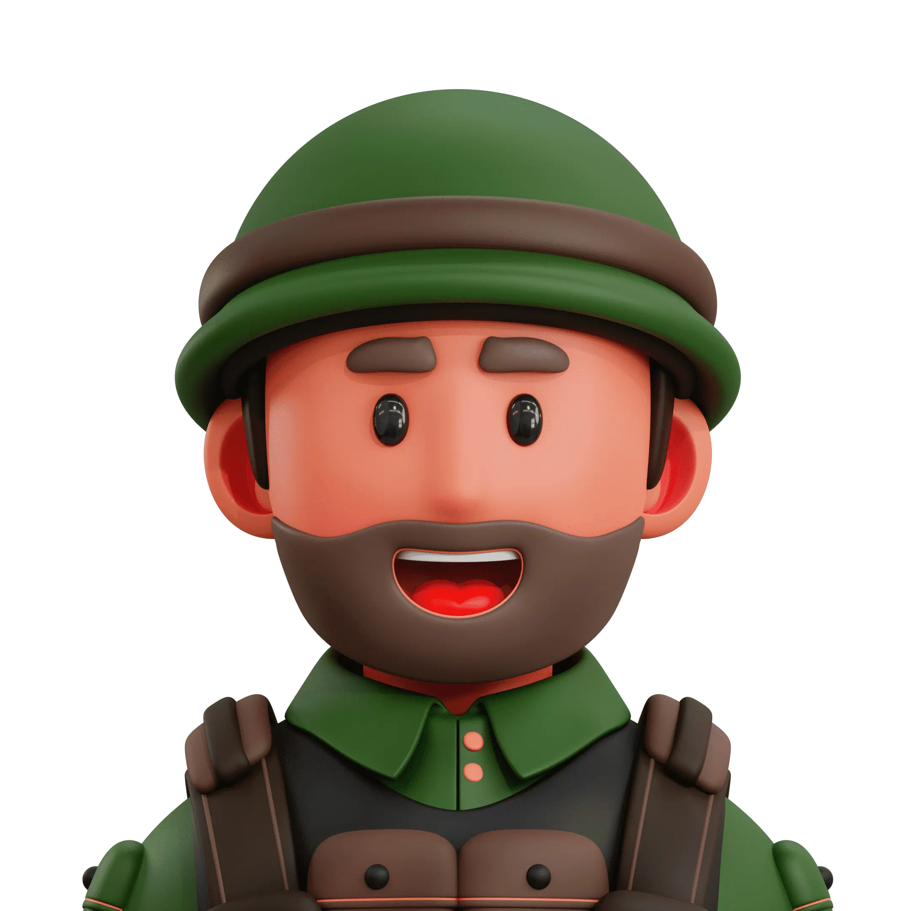</a> | **檔å:** `17.SOLDIER-7f.webp`<br>**尺寸:** 2160x2160<br>**大å°:** 157.03KB<br>**æ›´æ–°:** 2026-02-26 |
| <a href="images/3Ds/3D_Illustration-V2/17.VisionIcon-35.png"></a> | **檔å:** `17.VisionIcon-35.png`<br>**尺寸:** 2000x2000<br>**大å°:** 363.49KB<br>**æ›´æ–°:** 2026-02-26 |
| <a href="images/3Ds/3D_Illustration-V2/17.VisionIcon-e4.webp"></a> | **檔å:** `17.VisionIcon-e4.webp`<br>**尺寸:** 2000x2000<br>**大å°:** 128.40KB<br>**æ›´æ–°:** 2026-02-26 |
| <a href="images/3Ds/3D_Illustration-V2/18.AudioBookIcon-5b.png"></a> | **檔å:** `18.AudioBookIcon-5b.png`<br>**尺寸:** 2000x2000<br>**大å°:** 246.00KB<br>**æ›´æ–°:** 2026-02-26 |
| <a href="images/3Ds/3D_Illustration-V2/18.AudioBookIcon-8e.webp"></a> | **檔å:** `18.AudioBookIcon-8e.webp`<br>**尺寸:** 2000x2000<br>**大å°:** 92.50KB<br>**æ›´æ–°:** 2026-02-26 |
| <a href="images/3Ds/3D_Illustration-V2/18.GAMERS-56.webp"></a> | **檔å:** `18.GAMERS-56.webp`<br>**尺寸:** 2160x2160<br>**大å°:** 161.76KB<br>**æ›´æ–°:** 2026-02-26 |
| <a href="images/3Ds/3D_Illustration-V2/18.GAMERS-b1.png"></a> | **檔å:** `18.GAMERS-b1.png`<br>**尺寸:** 2160x2160<br>**大å°:** 585.28KB<br>**æ›´æ–°:** 2026-02-26 |
| <a href="images/3Ds/3D_Illustration-V2/18.WebsiteIcon-1b.webp"></a> | **檔å:** `18.WebsiteIcon-1b.webp`<br>**尺寸:** 2000x2000<br>**大å°:** 99.97KB<br>**æ›´æ–°:** 2026-02-26 |
| <a href="images/3Ds/3D_Illustration-V2/18.WebsiteIcon-86.png"></a> | **檔å:** `18.WebsiteIcon-86.png`<br>**尺寸:** 2000x2000<br>**大å°:** 327.67KB<br>**æ›´æ–°:** 2026-02-26 |
| <a href="images/3Ds/3D_Illustration-V2/19.AudienceIcon-c9.webp"></a> | **檔å:** `19.AudienceIcon-c9.webp`<br>**尺寸:** 2000x2000<br>**大å°:** 149.57KB<br>**æ›´æ–°:** 2026-02-26 |
| <a href="images/3Ds/3D_Illustration-V2/19.AudienceIcon-f2.png"></a> | **檔å:** `19.AudienceIcon-f2.png`<br>**尺寸:** 2000x2000<br>**大å°:** 392.90KB<br>**æ›´æ–°:** 2026-02-26 |
| <a href="images/3Ds/3D_Illustration-V2/19.DRIVER-20.webp"></a> | **檔å:** `19.DRIVER-20.webp`<br>**尺寸:** 2160x2160<br>**大å°:** 136.43KB<br>**æ›´æ–°:** 2026-02-26 |
| <a href="images/3Ds/3D_Illustration-V2/19.DRIVER-6e.png"></a> | **檔å:** `19.DRIVER-6e.png`<br>**尺寸:** 2160x2160<br>**大å°:** 351.52KB<br>**æ›´æ–°:** 2026-02-26 |
| <a href="images/3Ds/3D_Illustration-V2/19.TypingIcon-12.png"></a> | **檔å:** `19.TypingIcon-12.png`<br>**尺寸:** 2000x2000<br>**大å°:** 340.37KB<br>**æ›´æ–°:** 2026-02-26 |
| <a href="images/3Ds/3D_Illustration-V2/19.TypingIcon-97.webp"></a> | **檔å:** `19.TypingIcon-97.webp`<br>**尺寸:** 2000x2000<br>**大å°:** 104.67KB<br>**æ›´æ–°:** 2026-02-26 |
| <a href="images/3Ds/3D_Illustration-V2/20.InkIcon-49.webp"></a> | **檔å:** `20.InkIcon-49.webp`<br>**尺寸:** 2000x2000<br>**大å°:** 65.96KB<br>**æ›´æ–°:** 2026-02-26 |
| <a href="images/3Ds/3D_Illustration-V2/20.InkIcon-c3.png"></a> | **檔å:** `20.InkIcon-c3.png`<br>**尺寸:** 2000x2000<br>**大å°:** 174.44KB<br>**æ›´æ–°:** 2026-02-26 |
| <a href="images/3Ds/3D_Illustration-V2/20.ShoppingCartIcon-23.png"></a> | **檔å:** `20.ShoppingCartIcon-23.png`<br>**尺寸:** 2000x2000<br>**大å°:** 366.28KB<br>**æ›´æ–°:** 2026-02-26 |
| <a href="images/3Ds/3D_Illustration-V2/20.ShoppingCartIcon-7a.webp"></a> | **檔å:** `20.ShoppingCartIcon-7a.webp`<br>**尺寸:** 2000x2000<br>**大å°:** 122.83KB<br>**æ›´æ–°:** 2026-02-26 |
| <a href="images/3Ds/3D_Illustration-V2/20.TRADER-0c.webp"></a> | **檔å:** `20.TRADER-0c.webp`<br>**尺寸:** 2160x2160<br>**大å°:** 158.42KB<br>**æ›´æ–°:** 2026-02-26 |
| <a href="images/3Ds/3D_Illustration-V2/20.TRADER-e4.png"></a> | **檔å:** `20.TRADER-e4.png`<br>**尺寸:** 2160x2160<br>**大å°:** 550.32KB<br>**æ›´æ–°:** 2026-02-26 |

### 📠3d_web-v1

| é è¦½ (é»æ“Šæ”¾å¤§) | 檔案詳細資訊 |
| :--- | :--- |
| <a href="images/3Ds/3D_Web-V1/3d_web-01-82.png"></a> | **檔å:** `3d_web-01-82.png`<br>**尺寸:** 2000x2000<br>**大å°:** 208.15KB<br>**æ›´æ–°:** 2026-02-26 |
| <a href="images/3Ds/3D_Web-V1/3d_web-010-2f.webp"></a> | **檔å:** `3d_web-010-2f.webp`<br>**尺寸:** 2000x2000<br>**大å°:** 67.20KB<br>**æ›´æ–°:** 2026-02-26 |
| <a href="images/3Ds/3D_Web-V1/3d_web-011-4c.png"></a> | **檔å:** `3d_web-011-4c.png`<br>**尺寸:** 2000x2000<br>**大å°:** 218.81KB<br>**æ›´æ–°:** 2026-02-26 |
| <a href="images/3Ds/3D_Web-V1/3d_web-012-f2.webp"></a> | **檔å:** `3d_web-012-f2.webp`<br>**尺寸:** 2000x2000<br>**大å°:** 63.43KB<br>**æ›´æ–°:** 2026-02-26 |
| <a href="images/3Ds/3D_Web-V1/3d_web-013-df.png"></a> | **檔å:** `3d_web-013-df.png`<br>**尺寸:** 2000x2000<br>**大å°:** 202.15KB<br>**æ›´æ–°:** 2026-02-26 |
| <a href="images/3Ds/3D_Web-V1/3d_web-014-4d.webp">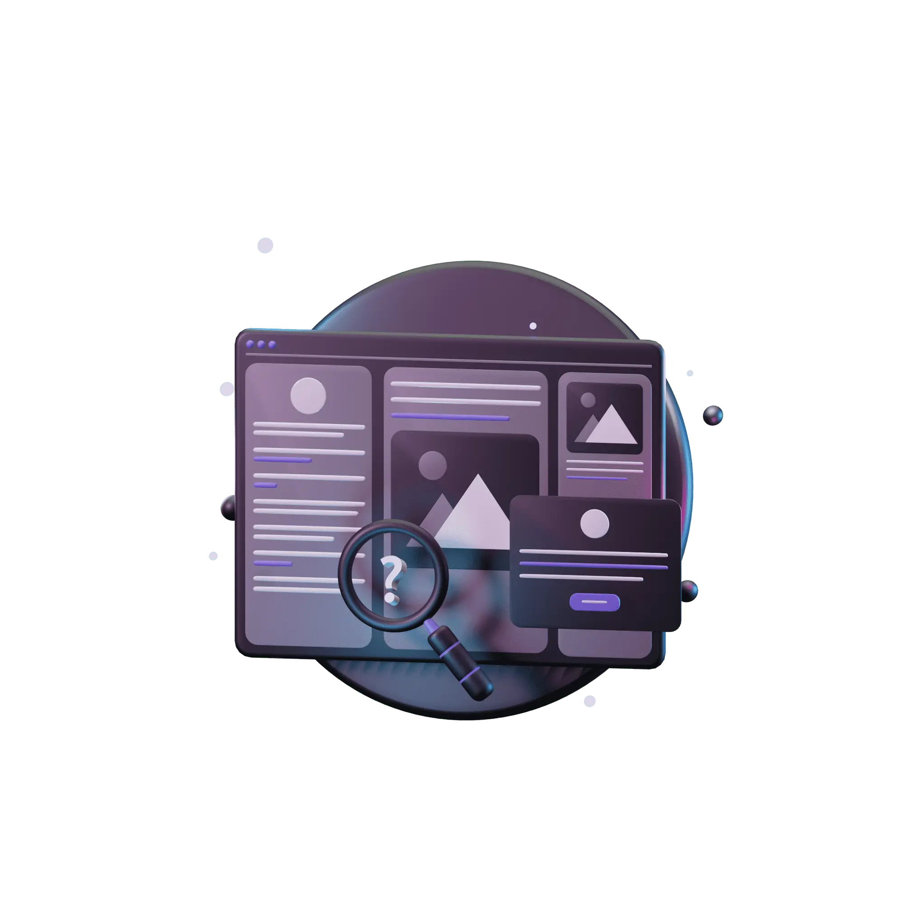</a> | **檔å:** `3d_web-014-4d.webp`<br>**尺寸:** 2000x2000<br>**大å°:** 53.46KB<br>**æ›´æ–°:** 2026-02-26 |
| <a href="images/3Ds/3D_Web-V1/3d_web-015-18.png"></a> | **檔å:** `3d_web-015-18.png`<br>**尺寸:** 2000x2000<br>**大å°:** 263.80KB<br>**æ›´æ–°:** 2026-02-26 |
| <a href="images/3Ds/3D_Web-V1/3d_web-016-16.webp"></a> | **檔å:** `3d_web-016-16.webp`<br>**尺寸:** 2000x2000<br>**大å°:** 98.43KB<br>**æ›´æ–°:** 2026-02-26 |
| <a href="images/3Ds/3D_Web-V1/3d_web-017-73.png"></a> | **檔å:** `3d_web-017-73.png`<br>**尺寸:** 2000x2000<br>**大å°:** 273.82KB<br>**æ›´æ–°:** 2026-02-26 |
| <a href="images/3Ds/3D_Web-V1/3d_web-018-6f.webp"></a> | **檔å:** `3d_web-018-6f.webp`<br>**尺寸:** 2000x2000<br>**大å°:** 75.46KB<br>**æ›´æ–°:** 2026-02-26 |
| <a href="images/3Ds/3D_Web-V1/3d_web-019-b3.png"></a> | **檔å:** `3d_web-019-b3.png`<br>**尺寸:** 2000x2000<br>**大å°:** 220.56KB<br>**æ›´æ–°:** 2026-02-26 |
| <a href="images/3Ds/3D_Web-V1/3d_web-02-0a.webp"></a> | **檔å:** `3d_web-02-0a.webp`<br>**尺寸:** 2000x2000<br>**大å°:** 55.96KB<br>**æ›´æ–°:** 2026-02-26 |
| <a href="images/3Ds/3D_Web-V1/3d_web-020-cf.webp"></a> | **檔å:** `3d_web-020-cf.webp`<br>**尺寸:** 2000x2000<br>**大å°:** 67.19KB<br>**æ›´æ–°:** 2026-02-26 |
| <a href="images/3Ds/3D_Web-V1/3d_web-021-a9.png"></a> | **檔å:** `3d_web-021-a9.png`<br>**尺寸:** 2000x2000<br>**大å°:** 172.53KB<br>**æ›´æ–°:** 2026-02-26 |
| <a href="images/3Ds/3D_Web-V1/3d_web-022-97.webp"></a> | **檔å:** `3d_web-022-97.webp`<br>**尺寸:** 2000x2000<br>**大å°:** 57.28KB<br>**æ›´æ–°:** 2026-02-26 |
| <a href="images/3Ds/3D_Web-V1/3d_web-023-b1.png"></a> | **檔å:** `3d_web-023-b1.png`<br>**尺寸:** 2000x2000<br>**大å°:** 216.45KB<br>**æ›´æ–°:** 2026-02-26 |
| <a href="images/3Ds/3D_Web-V1/3d_web-024-b5.webp"></a> | **檔å:** `3d_web-024-b5.webp`<br>**尺寸:** 2000x2000<br>**大å°:** 59.15KB<br>**æ›´æ–°:** 2026-02-26 |
| <a href="images/3Ds/3D_Web-V1/3d_web-025-5a.png"></a> | **檔å:** `3d_web-025-5a.png`<br>**尺寸:** 2000x2000<br>**大å°:** 172.93KB<br>**æ›´æ–°:** 2026-02-26 |
| <a href="images/3Ds/3D_Web-V1/3d_web-026-1b.webp"></a> | **檔å:** `3d_web-026-1b.webp`<br>**尺寸:** 2000x2000<br>**大å°:** 50.29KB<br>**æ›´æ–°:** 2026-02-26 |
| <a href="images/3Ds/3D_Web-V1/3d_web-027-74.png"></a> | **檔å:** `3d_web-027-74.png`<br>**尺寸:** 2000x2000<br>**大å°:** 168.15KB<br>**æ›´æ–°:** 2026-02-26 |
| <a href="images/3Ds/3D_Web-V1/3d_web-028-79.webp"></a> | **檔å:** `3d_web-028-79.webp`<br>**尺寸:** 2000x2000<br>**大å°:** 53.51KB<br>**æ›´æ–°:** 2026-02-26 |
| <a href="images/3Ds/3D_Web-V1/3d_web-029-7e.png"></a> | **檔å:** `3d_web-029-7e.png`<br>**尺寸:** 2000x2000<br>**大å°:** 263.98KB<br>**æ›´æ–°:** 2026-02-26 |
| <a href="images/3Ds/3D_Web-V1/3d_web-03-36.png"></a> | **檔å:** `3d_web-03-36.png`<br>**尺寸:** 2000x2000<br>**大å°:** 191.99KB<br>**æ›´æ–°:** 2026-02-26 |
| <a href="images/3Ds/3D_Web-V1/3d_web-030-52.webp"></a> | **檔å:** `3d_web-030-52.webp`<br>**尺寸:** 2000x2000<br>**大å°:** 62.93KB<br>**æ›´æ–°:** 2026-02-26 |
| <a href="images/3Ds/3D_Web-V1/3d_web-031-72.png"></a> | **檔å:** `3d_web-031-72.png`<br>**尺寸:** 2000x2000<br>**大å°:** 198.34KB<br>**æ›´æ–°:** 2026-02-26 |
| <a href="images/3Ds/3D_Web-V1/3d_web-032-70.webp"></a> | **檔å:** `3d_web-032-70.webp`<br>**尺寸:** 2000x2000<br>**大å°:** 56.10KB<br>**æ›´æ–°:** 2026-02-26 |
| <a href="images/3Ds/3D_Web-V1/3d_web-033-40.png"></a> | **檔å:** `3d_web-033-40.png`<br>**尺寸:** 2000x2000<br>**大å°:** 249.55KB<br>**æ›´æ–°:** 2026-02-26 |
| <a href="images/3Ds/3D_Web-V1/3d_web-034-24.webp"></a> | **檔å:** `3d_web-034-24.webp`<br>**尺寸:** 2000x2000<br>**大å°:** 64.44KB<br>**æ›´æ–°:** 2026-02-26 |
| <a href="images/3Ds/3D_Web-V1/3d_web-035-04.png"></a> | **檔å:** `3d_web-035-04.png`<br>**尺寸:** 2000x2000<br>**大å°:** 254.89KB<br>**æ›´æ–°:** 2026-02-26 |
| <a href="images/3Ds/3D_Web-V1/3d_web-036-85.webp">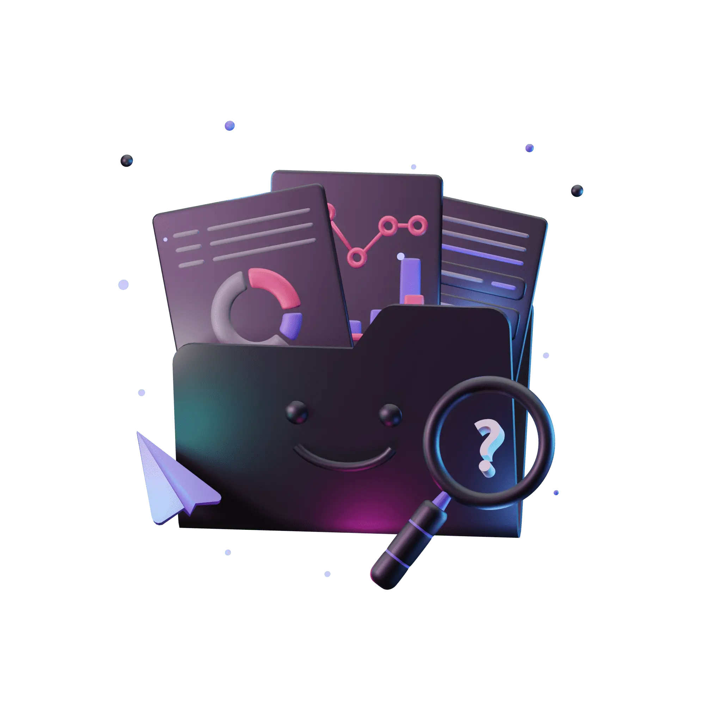</a> | **檔å:** `3d_web-036-85.webp`<br>**尺寸:** 2000x2000<br>**大å°:** 72.11KB<br>**æ›´æ–°:** 2026-02-26 |
| <a href="images/3Ds/3D_Web-V1/3d_web-037-45.png"></a> | **檔å:** `3d_web-037-45.png`<br>**尺寸:** 2000x2000<br>**大å°:** 240.95KB<br>**æ›´æ–°:** 2026-02-26 |
| <a href="images/3Ds/3D_Web-V1/3d_web-038-27.webp"></a> | **檔å:** `3d_web-038-27.webp`<br>**尺寸:** 2000x2000<br>**大å°:** 72.72KB<br>**æ›´æ–°:** 2026-02-26 |
| <a href="images/3Ds/3D_Web-V1/3d_web-039-43.png"></a> | **檔å:** `3d_web-039-43.png`<br>**尺寸:** 2000x2000<br>**大å°:** 123.84KB<br>**æ›´æ–°:** 2026-02-26 |
| <a href="images/3Ds/3D_Web-V1/3d_web-04-3c.webp"></a> | **檔å:** `3d_web-04-3c.webp`<br>**尺寸:** 2000x2000<br>**大å°:** 51.04KB<br>**æ›´æ–°:** 2026-02-26 |
| <a href="images/3Ds/3D_Web-V1/3d_web-040-7a.webp"></a> | **檔å:** `3d_web-040-7a.webp`<br>**尺寸:** 2000x2000<br>**大å°:** 49.27KB<br>**æ›´æ–°:** 2026-02-26 |
| <a href="images/3Ds/3D_Web-V1/3d_web-05-ec.png"></a> | **檔å:** `3d_web-05-ec.png`<br>**尺寸:** 2000x2000<br>**大å°:** 164.65KB<br>**æ›´æ–°:** 2026-02-26 |
| <a href="images/3Ds/3D_Web-V1/3d_web-06-23.webp"></a> | **檔å:** `3d_web-06-23.webp`<br>**尺寸:** 2000x2000<br>**大å°:** 52.03KB<br>**æ›´æ–°:** 2026-02-26 |
| <a href="images/3Ds/3D_Web-V1/3d_web-07-98.png"></a> | **檔å:** `3d_web-07-98.png`<br>**尺寸:** 2000x2000<br>**大å°:** 174.90KB<br>**æ›´æ–°:** 2026-02-26 |
| <a href="images/3Ds/3D_Web-V1/3d_web-08-bd.webp"></a> | **檔å:** `3d_web-08-bd.webp`<br>**尺寸:** 2000x2000<br>**大å°:** 60.62KB<br>**æ›´æ–°:** 2026-02-26 |
| <a href="images/3Ds/3D_Web-V1/3d_web-09-fd.png"></a> | **檔å:** `3d_web-09-fd.png`<br>**尺寸:** 2000x2000<br>**大å°:** 224.94KB<br>**æ›´æ–°:** 2026-02-26 |

### 📠3d_web-v2

| é è¦½ (é»æ“Šæ”¾å¤§) | 檔案詳細資訊 |
| :--- | :--- |
| <a href="images/3Ds/3D_Web-V2/3d-Icon-webs-01-44.webp"></a> | **檔å:** `3d-Icon-webs-01-44.webp`<br>**尺寸:** 500x500<br>**大å°:** 7.71KB<br>**æ›´æ–°:** 2026-02-26 |
| <a href="images/3Ds/3D_Web-V2/3d-Icon-webs-01-f8.png"></a> | **檔å:** `3d-Icon-webs-01-f8.png`<br>**尺寸:** 500x500<br>**大å°:** 78.48KB<br>**æ›´æ–°:** 2026-02-26 |
| <a href="images/3Ds/3D_Web-V2/3d-Icon-webs-010-1f.png"></a> | **檔å:** `3d-Icon-webs-010-1f.png`<br>**尺寸:** 500x500<br>**大å°:** 64.10KB<br>**æ›´æ–°:** 2026-02-26 |
| <a href="images/3Ds/3D_Web-V2/3d-Icon-webs-010-e9.webp"></a> | **檔å:** `3d-Icon-webs-010-e9.webp`<br>**尺寸:** 500x500<br>**大å°:** 6.69KB<br>**æ›´æ–°:** 2026-02-26 |
| <a href="images/3Ds/3D_Web-V2/3d-Icon-webs-011-5e.webp"></a> | **檔å:** `3d-Icon-webs-011-5e.webp`<br>**尺寸:** 500x500<br>**大å°:** 7.17KB<br>**æ›´æ–°:** 2026-02-26 |
| <a href="images/3Ds/3D_Web-V2/3d-Icon-webs-011-98.png"></a> | **檔å:** `3d-Icon-webs-011-98.png`<br>**尺寸:** 500x500<br>**大å°:** 61.75KB<br>**æ›´æ–°:** 2026-02-26 |
| <a href="images/3Ds/3D_Web-V2/3d-Icon-webs-012-0a.webp"></a> | **檔å:** `3d-Icon-webs-012-0a.webp`<br>**尺寸:** 500x500<br>**大å°:** 7.24KB<br>**æ›´æ–°:** 2026-02-26 |
| <a href="images/3Ds/3D_Web-V2/3d-Icon-webs-012-2e.png"></a> | **檔å:** `3d-Icon-webs-012-2e.png`<br>**尺寸:** 500x500<br>**大å°:** 57.80KB<br>**æ›´æ–°:** 2026-02-26 |
| <a href="images/3Ds/3D_Web-V2/3d-Icon-webs-013-a9.png"></a> | **檔å:** `3d-Icon-webs-013-a9.png`<br>**尺寸:** 500x500<br>**大å°:** 51.88KB<br>**æ›´æ–°:** 2026-02-26 |
| <a href="images/3Ds/3D_Web-V2/3d-Icon-webs-013-d9.webp"></a> | **檔å:** `3d-Icon-webs-013-d9.webp`<br>**尺寸:** 500x500<br>**大å°:** 5.37KB<br>**æ›´æ–°:** 2026-02-26 |
| <a href="images/3Ds/3D_Web-V2/3d-Icon-webs-014-cf.webp"></a> | **檔å:** `3d-Icon-webs-014-cf.webp`<br>**尺寸:** 500x500<br>**大å°:** 5.72KB<br>**æ›´æ–°:** 2026-02-26 |
| <a href="images/3Ds/3D_Web-V2/3d-Icon-webs-014-dc.png"></a> | **檔å:** `3d-Icon-webs-014-dc.png`<br>**尺寸:** 500x500<br>**大å°:** 48.42KB<br>**æ›´æ–°:** 2026-02-26 |
| <a href="images/3Ds/3D_Web-V2/3d-Icon-webs-015-64.webp">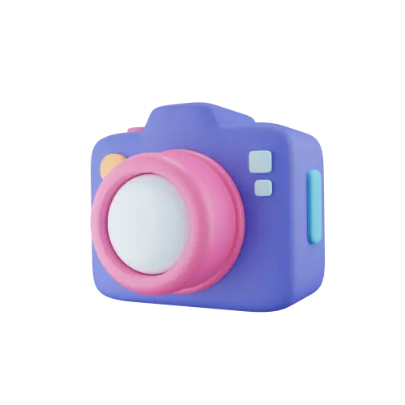</a> | **檔å:** `3d-Icon-webs-015-64.webp`<br>**尺寸:** 500x500<br>**大å°:** 6.42KB<br>**æ›´æ–°:** 2026-02-26 |
| <a href="images/3Ds/3D_Web-V2/3d-Icon-webs-015-82.png"></a> | **檔å:** `3d-Icon-webs-015-82.png`<br>**尺寸:** 500x500<br>**大å°:** 65.90KB<br>**æ›´æ–°:** 2026-02-26 |
| <a href="images/3Ds/3D_Web-V2/3d-Icon-webs-016-19.webp"></a> | **檔å:** `3d-Icon-webs-016-19.webp`<br>**尺寸:** 500x500<br>**大å°:** 7.07KB<br>**æ›´æ–°:** 2026-02-26 |
| <a href="images/3Ds/3D_Web-V2/3d-Icon-webs-016-c8.png"></a> | **檔å:** `3d-Icon-webs-016-c8.png`<br>**尺寸:** 500x500<br>**大å°:** 68.42KB<br>**æ›´æ–°:** 2026-02-26 |
| <a href="images/3Ds/3D_Web-V2/3d-Icon-webs-017-1a.png"></a> | **檔å:** `3d-Icon-webs-017-1a.png`<br>**尺寸:** 500x500<br>**大å°:** 62.38KB<br>**æ›´æ–°:** 2026-02-26 |
| <a href="images/3Ds/3D_Web-V2/3d-Icon-webs-017-5f.webp"></a> | **檔å:** `3d-Icon-webs-017-5f.webp`<br>**尺寸:** 500x500<br>**大å°:** 6.61KB<br>**æ›´æ–°:** 2026-02-26 |
| <a href="images/3Ds/3D_Web-V2/3d-Icon-webs-018-cd.png"></a> | **檔å:** `3d-Icon-webs-018-cd.png`<br>**尺寸:** 500x500<br>**大å°:** 64.20KB<br>**æ›´æ–°:** 2026-02-26 |
| <a href="images/3Ds/3D_Web-V2/3d-Icon-webs-018-eb.webp"></a> | **檔å:** `3d-Icon-webs-018-eb.webp`<br>**尺寸:** 500x500<br>**大å°:** 6.21KB<br>**æ›´æ–°:** 2026-02-26 |
| <a href="images/3Ds/3D_Web-V2/3d-Icon-webs-019-12.webp"></a> | **檔å:** `3d-Icon-webs-019-12.webp`<br>**尺寸:** 500x500<br>**大å°:** 8.26KB<br>**æ›´æ–°:** 2026-02-26 |
| <a href="images/3Ds/3D_Web-V2/3d-Icon-webs-019-e3.png"></a> | **檔å:** `3d-Icon-webs-019-e3.png`<br>**尺寸:** 500x500<br>**大å°:** 67.27KB<br>**æ›´æ–°:** 2026-02-26 |
| <a href="images/3Ds/3D_Web-V2/3d-Icon-webs-02-a4.webp"></a> | **檔å:** `3d-Icon-webs-02-a4.webp`<br>**尺寸:** 500x500<br>**大å°:** 6.29KB<br>**æ›´æ–°:** 2026-02-26 |
| <a href="images/3Ds/3D_Web-V2/3d-Icon-webs-02-b4.png"></a> | **檔å:** `3d-Icon-webs-02-b4.png`<br>**尺寸:** 500x500<br>**大å°:** 57.48KB<br>**æ›´æ–°:** 2026-02-26 |
| <a href="images/3Ds/3D_Web-V2/3d-Icon-webs-020-08.png">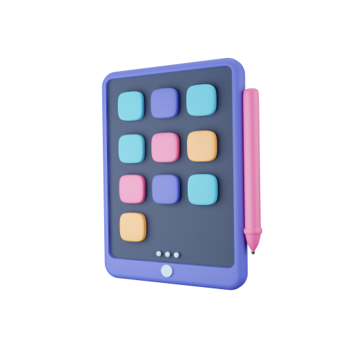</a> | **檔å:** `3d-Icon-webs-020-08.png`<br>**尺寸:** 500x500<br>**大å°:** 68.20KB<br>**æ›´æ–°:** 2026-02-26 |
| <a href="images/3Ds/3D_Web-V2/3d-Icon-webs-020-e7.webp"></a> | **檔å:** `3d-Icon-webs-020-e7.webp`<br>**尺寸:** 500x500<br>**大å°:** 6.94KB<br>**æ›´æ–°:** 2026-02-26 |
| <a href="images/3Ds/3D_Web-V2/3d-Icon-webs-03-d4.png"></a> | **檔å:** `3d-Icon-webs-03-d4.png`<br>**尺寸:** 500x500<br>**大å°:** 53.60KB<br>**æ›´æ–°:** 2026-02-26 |
| <a href="images/3Ds/3D_Web-V2/3d-Icon-webs-03-de.webp"></a> | **檔å:** `3d-Icon-webs-03-de.webp`<br>**尺寸:** 500x500<br>**大å°:** 6.36KB<br>**æ›´æ–°:** 2026-02-26 |
| <a href="images/3Ds/3D_Web-V2/3d-Icon-webs-04-57.png"></a> | **檔å:** `3d-Icon-webs-04-57.png`<br>**尺寸:** 500x500<br>**大å°:** 45.69KB<br>**æ›´æ–°:** 2026-02-26 |
| <a href="images/3Ds/3D_Web-V2/3d-Icon-webs-04-88.webp"></a> | **檔å:** `3d-Icon-webs-04-88.webp`<br>**尺寸:** 500x500<br>**大å°:** 5.68KB<br>**æ›´æ–°:** 2026-02-26 |
| <a href="images/3Ds/3D_Web-V2/3d-Icon-webs-05-00.webp"></a> | **檔å:** `3d-Icon-webs-05-00.webp`<br>**尺寸:** 500x500<br>**大å°:** 7.78KB<br>**æ›´æ–°:** 2026-02-26 |
| <a href="images/3Ds/3D_Web-V2/3d-Icon-webs-05-a1.png"></a> | **檔å:** `3d-Icon-webs-05-a1.png`<br>**尺寸:** 500x500<br>**大å°:** 69.08KB<br>**æ›´æ–°:** 2026-02-26 |
| <a href="images/3Ds/3D_Web-V2/3d-Icon-webs-06-2b.png"></a> | **檔å:** `3d-Icon-webs-06-2b.png`<br>**尺寸:** 500x500<br>**大å°:** 50.42KB<br>**æ›´æ–°:** 2026-02-26 |
| <a href="images/3Ds/3D_Web-V2/3d-Icon-webs-06-eb.webp">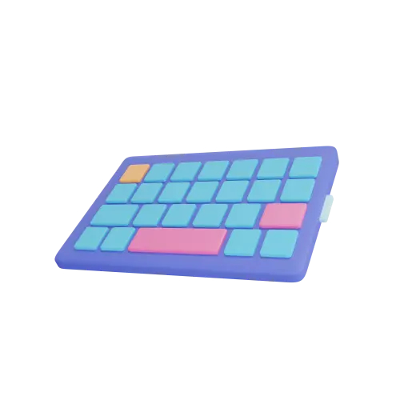</a> | **檔å:** `3d-Icon-webs-06-eb.webp`<br>**尺寸:** 500x500<br>**大å°:** 6.37KB<br>**æ›´æ–°:** 2026-02-26 |
| <a href="images/3Ds/3D_Web-V2/3d-Icon-webs-07-2d.png"></a> | **檔å:** `3d-Icon-webs-07-2d.png`<br>**尺寸:** 500x500<br>**大å°:** 56.30KB<br>**æ›´æ–°:** 2026-02-26 |
| <a href="images/3Ds/3D_Web-V2/3d-Icon-webs-07-b7.webp"></a> | **檔å:** `3d-Icon-webs-07-b7.webp`<br>**尺寸:** 500x500<br>**大å°:** 7.92KB<br>**æ›´æ–°:** 2026-02-26 |
| <a href="images/3Ds/3D_Web-V2/3d-Icon-webs-08-1f.webp"></a> | **檔å:** `3d-Icon-webs-08-1f.webp`<br>**尺寸:** 500x500<br>**大å°:** 6.88KB<br>**æ›´æ–°:** 2026-02-26 |
| <a href="images/3Ds/3D_Web-V2/3d-Icon-webs-08-ea.png"></a> | **檔å:** `3d-Icon-webs-08-ea.png`<br>**尺寸:** 500x500<br>**大å°:** 54.35KB<br>**æ›´æ–°:** 2026-02-26 |
| <a href="images/3Ds/3D_Web-V2/3d-Icon-webs-09-39.webp"></a> | **檔å:** `3d-Icon-webs-09-39.webp`<br>**尺寸:** 500x500<br>**大å°:** 9.22KB<br>**æ›´æ–°:** 2026-02-26 |
| <a href="images/3Ds/3D_Web-V2/3d-Icon-webs-09-d2.png"></a> | **檔å:** `3d-Icon-webs-09-d2.png`<br>**尺寸:** 500x500<br>**大å°:** 43.84KB<br>**æ›´æ–°:** 2026-02-26 |

### 📠Square-icon

| é è¦½ (é»æ“Šæ”¾å¤§) | 檔案詳細資訊 |
| :--- | :--- |
| <a href="images/DesignSystem/DesignSystemiCons/Square-iCon/001-add-d4.png"></a> | **檔å:** `001-add-d4.png`<br>**尺寸:** 512x512<br>**大å°:** 12.03KB<br>**æ›´æ–°:** 2026-02-26 |
| <a href="images/DesignSystem/DesignSystemiCons/Square-iCon/002-alphabet-cd.png"></a> | **檔å:** `002-alphabet-cd.png`<br>**尺寸:** 512x512<br>**大å°:** 10.62KB<br>**æ›´æ–°:** 2026-02-26 |
| <a href="images/DesignSystem/DesignSystemiCons/Square-iCon/003-binoculars-62.png"></a> | **檔å:** `003-binoculars-62.png`<br>**尺寸:** 512x512<br>**大å°:** 13.58KB<br>**æ›´æ–°:** 2026-02-26 |
| <a href="images/DesignSystem/DesignSystemiCons/Square-iCon/004-bold-c5.png"></a> | **檔å:** `004-bold-c5.png`<br>**尺寸:** 512x512<br>**大å°:** 10.19KB<br>**æ›´æ–°:** 2026-02-26 |
| <a href="images/DesignSystem/DesignSystemiCons/Square-iCon/005-quote-ea.png"></a> | **檔å:** `005-quote-ea.png`<br>**尺寸:** 512x512<br>**大å°:** 10.36KB<br>**æ›´æ–°:** 2026-02-26 |
| <a href="images/DesignSystem/DesignSystemiCons/Square-iCon/006-bullet list-bf.png"></a> | **檔å:** `006-bullet list-bf.png`<br>**尺寸:** 512x512<br>**大å°:** 10.00KB<br>**æ›´æ–°:** 2026-02-26 |
| <a href="images/DesignSystem/DesignSystemiCons/Square-iCon/007-calendar-ef.png"></a> | **檔å:** `007-calendar-ef.png`<br>**尺寸:** 512x512<br>**大å°:** 8.33KB<br>**æ›´æ–°:** 2026-02-26 |
| <a href="images/DesignSystem/DesignSystemiCons/Square-iCon/008-clipboard-06.png"></a> | **檔å:** `008-clipboard-06.png`<br>**尺寸:** 512x512<br>**大å°:** 11.41KB<br>**æ›´æ–°:** 2026-02-26 |
| <a href="images/DesignSystem/DesignSystemiCons/Square-iCon/009-code-c3.png"></a> | **檔å:** `009-code-c3.png`<br>**尺寸:** 512x512<br>**大å°:** 9.84KB<br>**æ›´æ–°:** 2026-02-26 |
| <a href="images/DesignSystem/DesignSystemiCons/Square-iCon/010-command-f0.png"></a> | **檔å:** `010-command-f0.png`<br>**尺寸:** 512x512<br>**大å°:** 14.54KB<br>**æ›´æ–°:** 2026-02-26 |
| <a href="images/DesignSystem/DesignSystemiCons/Square-iCon/011-copy-08.png"></a> | **檔å:** `011-copy-08.png`<br>**尺寸:** 512x512<br>**大å°:** 9.07KB<br>**æ›´æ–°:** 2026-02-26 |
| <a href="images/DesignSystem/DesignSystemiCons/Square-iCon/012-crop-8a.png"></a> | **檔å:** `012-crop-8a.png`<br>**尺寸:** 512x512<br>**大å°:** 8.39KB<br>**æ›´æ–°:** 2026-02-26 |
| <a href="images/DesignSystem/DesignSystemiCons/Square-iCon/013-cut-0f.png"></a> | **檔å:** `013-cut-0f.png`<br>**尺寸:** 512x512<br>**大å°:** 15.55KB<br>**æ›´æ–°:** 2026-02-26 |
| <a href="images/DesignSystem/DesignSystemiCons/Square-iCon/014-delete-51.png"></a> | **檔å:** `014-delete-51.png`<br>**尺寸:** 512x512<br>**大å°:** 11.79KB<br>**æ›´æ–°:** 2026-02-26 |
| <a href="images/DesignSystem/DesignSystemiCons/Square-iCon/015-delete-28.png"></a> | **檔å:** `015-delete-28.png`<br>**尺寸:** 512x512<br>**大å°:** 11.99KB<br>**æ›´æ–°:** 2026-02-26 |
| <a href="images/DesignSystem/DesignSystemiCons/Square-iCon/016-edit-ef.png"></a> | **檔å:** `016-edit-ef.png`<br>**尺寸:** 512x512<br>**大å°:** 10.12KB<br>**æ›´æ–°:** 2026-02-26 |
| <a href="images/DesignSystem/DesignSystemiCons/Square-iCon/017-eraser-2e.png"></a> | **檔å:** `017-eraser-2e.png`<br>**尺寸:** 512x512<br>**大å°:** 9.74KB<br>**æ›´æ–°:** 2026-02-26 |
| <a href="images/DesignSystem/DesignSystemiCons/Square-iCon/018-eye-e5.png"></a> | **檔å:** `018-eye-e5.png`<br>**尺寸:** 512x512<br>**大å°:** 12.81KB<br>**æ›´æ–°:** 2026-02-26 |
| <a href="images/DesignSystem/DesignSystemiCons/Square-iCon/019-eye-c6.png"></a> | **檔å:** `019-eye-c6.png`<br>**尺寸:** 512x512<br>**大å°:** 11.79KB<br>**æ›´æ–°:** 2026-02-26 |
| <a href="images/DesignSystem/DesignSystemiCons/Square-iCon/020-filter-b0.png"></a> | **檔å:** `020-filter-b0.png`<br>**尺寸:** 512x512<br>**大å°:** 9.97KB<br>**æ›´æ–°:** 2026-02-26 |
| <a href="images/DesignSystem/DesignSystemiCons/Square-iCon/021-find-32.png"></a> | **檔å:** `021-find-32.png`<br>**尺寸:** 512x512<br>**大å°:** 11.85KB<br>**æ›´æ–°:** 2026-02-26 |
| <a href="images/DesignSystem/DesignSystemiCons/Square-iCon/022-flip-36.png"></a> | **檔å:** `022-flip-36.png`<br>**尺寸:** 512x512<br>**大å°:** 12.04KB<br>**æ›´æ–°:** 2026-02-26 |
| <a href="images/DesignSystem/DesignSystemiCons/Square-iCon/023-flip-80.png"></a> | **檔å:** `023-flip-80.png`<br>**尺寸:** 512x512<br>**大å°:** 11.70KB<br>**æ›´æ–°:** 2026-02-26 |
| <a href="images/DesignSystem/DesignSystemiCons/Square-iCon/024-flip-62.png"></a> | **檔å:** `024-flip-62.png`<br>**尺寸:** 512x512<br>**大å°:** 11.81KB<br>**æ›´æ–°:** 2026-02-26 |
| <a href="images/DesignSystem/DesignSystemiCons/Square-iCon/025-flip-3b.png"></a> | **檔å:** `025-flip-3b.png`<br>**尺寸:** 512x512<br>**大å°:** 11.24KB<br>**æ›´æ–°:** 2026-02-26 |
| <a href="images/DesignSystem/DesignSystemiCons/Square-iCon/026-font-63.png"></a> | **檔å:** `026-font-63.png`<br>**尺寸:** 512x512<br>**大å°:** 9.31KB<br>**æ›´æ–°:** 2026-02-26 |
| <a href="images/DesignSystem/DesignSystemiCons/Square-iCon/027-font-b0.png"></a> | **檔å:** `027-font-b0.png`<br>**尺寸:** 512x512<br>**大å°:** 8.93KB<br>**æ›´æ–°:** 2026-02-26 |
| <a href="images/DesignSystem/DesignSystemiCons/Square-iCon/028-font-01.png"></a> | **檔å:** `028-font-01.png`<br>**尺寸:** 512x512<br>**大å°:** 9.93KB<br>**æ›´æ–°:** 2026-02-26 |
| <a href="images/DesignSystem/DesignSystemiCons/Square-iCon/029-hashtag-37.png"></a> | **檔å:** `029-hashtag-37.png`<br>**尺寸:** 512x512<br>**大å°:** 11.45KB<br>**æ›´æ–°:** 2026-02-26 |
| <a href="images/DesignSystem/DesignSystemiCons/Square-iCon/030-highlighter-33.png"></a> | **檔å:** `030-highlighter-33.png`<br>**尺寸:** 512x512<br>**大å°:** 11.10KB<br>**æ›´æ–°:** 2026-02-26 |
| <a href="images/DesignSystem/DesignSystemiCons/Square-iCon/031-italic-4a.png"></a> | **檔å:** `031-italic-4a.png`<br>**尺寸:** 512x512<br>**大å°:** 9.59KB<br>**æ›´æ–°:** 2026-02-26 |
| <a href="images/DesignSystem/DesignSystemiCons/Square-iCon/032-ligature-f8.png"></a> | **檔å:** `032-ligature-f8.png`<br>**尺寸:** 512x512<br>**大å°:** 9.83KB<br>**æ›´æ–°:** 2026-02-26 |
| <a href="images/DesignSystem/DesignSystemiCons/Square-iCon/033-link-94.png"></a> | **檔å:** `033-link-94.png`<br>**尺寸:** 512x512<br>**大å°:** 15.88KB<br>**æ›´æ–°:** 2026-02-26 |
| <a href="images/DesignSystem/DesignSystemiCons/Square-iCon/034-link-17.png"></a> | **檔å:** `034-link-17.png`<br>**尺寸:** 512x512<br>**大å°:** 13.11KB<br>**æ›´æ–°:** 2026-02-26 |
| <a href="images/DesignSystem/DesignSystemiCons/Square-iCon/035-maximize-3d.png"></a> | **檔å:** `035-maximize-3d.png`<br>**尺寸:** 512x512<br>**大å°:** 9.28KB<br>**æ›´æ–°:** 2026-02-26 |
| <a href="images/DesignSystem/DesignSystemiCons/Square-iCon/036-minimize-3e.png"></a> | **檔å:** `036-minimize-3e.png`<br>**尺寸:** 512x512<br>**大å°:** 9.03KB<br>**æ›´æ–°:** 2026-02-26 |
| <a href="images/DesignSystem/DesignSystemiCons/Square-iCon/037-mirror-89.png"></a> | **檔å:** `037-mirror-89.png`<br>**尺寸:** 512x512<br>**大å°:** 9.90KB<br>**æ›´æ–°:** 2026-02-26 |
| <a href="images/DesignSystem/DesignSystemiCons/Square-iCon/038-number-3c.png"></a> | **檔å:** `038-number-3c.png`<br>**尺寸:** 512x512<br>**大å°:** 10.75KB<br>**æ›´æ–°:** 2026-02-26 |
| <a href="images/DesignSystem/DesignSystemiCons/Square-iCon/039-omega-36.png"></a> | **檔å:** `039-omega-36.png`<br>**尺寸:** 512x512<br>**大å°:** 14.23KB<br>**æ›´æ–°:** 2026-02-26 |
| <a href="images/DesignSystem/DesignSystemiCons/Square-iCon/040-paint bucket-84.png"></a> | **檔å:** `040-paint bucket-84.png`<br>**尺寸:** 512x512<br>**大å°:** 10.62KB<br>**æ›´æ–°:** 2026-02-26 |
| <a href="images/DesignSystem/DesignSystemiCons/Square-iCon/041-paint roller-e8.png"></a> | **檔å:** `041-paint roller-e8.png`<br>**尺寸:** 512x512<br>**大å°:** 9.60KB<br>**æ›´æ–°:** 2026-02-26 |
| <a href="images/DesignSystem/DesignSystemiCons/Square-iCon/042-paperclip-e4.png"></a> | **檔å:** `042-paperclip-e4.png`<br>**尺寸:** 512x512<br>**大å°:** 12.35KB<br>**æ›´æ–°:** 2026-02-26 |
| <a href="images/DesignSystem/DesignSystemiCons/Square-iCon/043-paragraph-07.png"></a> | **檔å:** `043-paragraph-07.png`<br>**尺寸:** 512x512<br>**大å°:** 8.83KB<br>**æ›´æ–°:** 2026-02-26 |
| <a href="images/DesignSystem/DesignSystemiCons/Square-iCon/044-redo-6b.png"></a> | **檔å:** `044-redo-6b.png`<br>**尺寸:** 512x512<br>**大å°:** 13.56KB<br>**æ›´æ–°:** 2026-02-26 |

### 📠Adventurer

| é è¦½ (é»æ“Šæ”¾å¤§) | 檔案詳細資訊 |
| :--- | :--- |
| <a href="images/Dicebear/Adventurer/adventurer-01.jpeg"></a> | **檔å:** `adventurer-01.jpeg`<br>**尺寸:** 128x128<br>**大å°:** 3.58KB<br>**æ›´æ–°:** 2026-02-26 |
| <a href="images/Dicebear/Adventurer/adventurer-01.png"></a> | **檔å:** `adventurer-01.png`<br>**尺寸:** 128x128<br>**大å°:** 6.67KB<br>**æ›´æ–°:** 2026-02-26 |
| <a href="images/Dicebear/Adventurer/adventurer-01.webp"></a> | **檔å:** `adventurer-01.webp`<br>**尺寸:** 128x128<br>**大å°:** 2.41KB<br>**æ›´æ–°:** 2026-02-26 |

### 📠Fontstyles

| é è¦½ (é»æ“Šæ”¾å¤§) | 檔案詳細資訊 |
| :--- | :--- |
| <a href="images/FontStyles/AbolitionAnzeigenGroteskCubanoSharpFatFrankGibsonIndustryIncITCAvantGardeGothicProStencilettaVAGRundschriftDTermina.png"></a> | **檔å:** `AbolitionAnzeigenGroteskCubanoSharpFatFrankGibsonIndustryIncITCAvantGardeGothicProStencilettaVAGRundschriftDTermina.png`<br>**尺寸:** 720x250<br>**大å°:** 87.71KB<br>**æ›´æ–°:** 2026-02-26 |
| <a href="images/FontStyles/Adobe黑体.png"></a> | **檔å:** `Adobe黑体.png`<br>**尺寸:** 1896x300<br>**大å°:** 268.48KB<br>**æ›´æ–°:** 2026-02-26 |
| <a href="images/FontStyles/AntonBalboaRiftSoft.png"></a> | **檔å:** `AntonBalboaRiftSoft.png`<br>**尺寸:** 720x250<br>**大å°:** 46.38KB<br>**æ›´æ–°:** 2026-02-26 |
| <a href="images/FontStyles/Anugrom.png"></a> | **檔å:** `Anugrom.png`<br>**尺寸:** 600x300<br>**大å°:** 19.89KB<br>**æ›´æ–°:** 2026-02-26 |
| <a href="images/FontStyles/Caslon.png"></a> | **檔å:** `Caslon.png`<br>**尺寸:** 450x225<br>**大å°:** 87.88KB<br>**æ›´æ–°:** 2026-02-26 |
| <a href="images/FontStyles/Century.png"></a> | **檔å:** `Century.png`<br>**尺寸:** 450x225<br>**大å°:** 42.25KB<br>**æ›´æ–°:** 2026-02-26 |
| <a href="images/FontStyles/Crete.png"></a> | **檔å:** `Crete.png`<br>**尺寸:** 600x300<br>**大å°:** 13.95KB<br>**æ›´æ–°:** 2026-02-26 |
| <a href="images/FontStyles/FÄngZhèngFÇngSòng.png"></a> | **檔å:** `FÄngZhèngFÇngSòng.png`<br>**尺寸:** 600x300<br>**大å°:** 74.40KB<br>**æ›´æ–°:** 2026-02-26 |
| <a href="images/FontStyles/FÄngZhèngKÇiTÇ.png"></a> | **檔å:** `FÄngZhèngKÇiTÇ.png`<br>**尺寸:** 600x300<br>**大å°:** 87.55KB<br>**æ›´æ–°:** 2026-02-26 |
| <a href="images/FontStyles/FÄngZhèngShÅ«Sòng.png"></a> | **檔å:** `FÄngZhèngShÅ«Sòng.png`<br>**尺寸:** 600x300<br>**大å°:** 75.91KB<br>**æ›´æ–°:** 2026-02-26 |
| <a href="images/FontStyles/Garamond.png"></a> | **檔å:** `Garamond.png`<br>**尺寸:** 450x225<br>**大å°:** 83.76KB<br>**æ›´æ–°:** 2026-02-26 |
| <a href="images/FontStyles/GroupAvoryPEVariable.png"></a> | **檔å:** `GroupAvoryPEVariable.png`<br>**尺寸:** 1896x308<br>**大å°:** 265.94KB<br>**æ›´æ–°:** 2026-02-26 |
| <a href="images/FontStyles/GroupBagatela.png">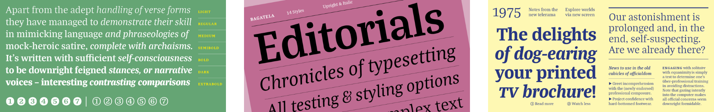</a> | **檔å:** `GroupBagatela.png`<br>**尺寸:** 1896x300<br>**大å°:** 408.89KB<br>**æ›´æ–°:** 2026-02-26 |
| <a href="images/FontStyles/GroupMapRoman.png"></a> | **檔å:** `GroupMapRoman.png`<br>**尺寸:** 1896x300<br>**大å°:** 359.64KB<br>**æ›´æ–°:** 2026-02-26 |
| <a href="images/FontStyles/GroupMarlide.png"></a> | **檔å:** `GroupMarlide.png`<br>**尺寸:** 1920x300<br>**大å°:** 405.71KB<br>**æ›´æ–°:** 2026-02-26 |
| <a href="images/FontStyles/GroupP22ConstructivistPro.png"></a> | **檔å:** `GroupP22ConstructivistPro.png`<br>**尺寸:** 1248x300<br>**大å°:** 83.53KB<br>**æ›´æ–°:** 2026-02-26 |
| <a href="images/FontStyles/MVBSalis.png"></a> | **檔å:** `MVBSalis.png`<br>**尺寸:** 600x300<br>**大å°:** 80.45KB<br>**æ›´æ–°:** 2026-02-26 |
| <a href="images/FontStyles/Sigurd.png"></a> | **檔å:** `Sigurd.png`<br>**尺寸:** 600x300<br>**大å°:** 115.86KB<br>**æ›´æ–°:** 2026-02-26 |
| <a href="images/FontStyles/SourceHanSans.png"></a> | **檔å:** `SourceHanSans.png`<br>**尺寸:** 600x300<br>**大å°:** 47.60KB<br>**æ›´æ–°:** 2026-02-26 |
| <a href="images/FontStyles/TCCaslonPro.png"></a> | **檔å:** `TCCaslonPro.png`<br>**尺寸:** 1896x300<br>**大å°:** 612.38KB<br>**æ›´æ–°:** 2026-02-26 |
| <a href="images/FontStyles/Wireframe.png"></a> | **檔å:** `Wireframe.png`<br>**尺寸:** 600x360<br>**大å°:** 23.70KB<br>**æ›´æ–°:** 2026-02-26 |
| <a href="images/FontStyles/æ–‡é¼UD晶熙黑體GBStd.png"></a> | **檔å:** `æ–‡é¼UD晶熙黑體GBStd.png`<br>**尺寸:** 600x300<br>**大å°:** 64.04KB<br>**æ›´æ–°:** 2026-02-26 |
| <a href="images/FontStyles/æ–‡é¼æ›¸æ—宋體GBStd.png"></a> | **檔å:** `æ–‡é¼æ›¸æ—宋體GBStd.png`<br>**尺寸:** 600x300<br>**大å°:** 116.74KB<br>**æ›´æ–°:** 2026-02-26 |

### 📠Illustrations-simplicity

| é è¦½ (é»æ“Šæ”¾å¤§) | 檔案詳細資訊 |
| :--- | :--- |
| <a href="images/Illustrations/illustrations-Simplicity/Graphics-35-7f.png"></a> | **檔å:** `Graphics-35-7f.png`<br>**尺寸:** 2626x2263<br>**大å°:** 626.72KB<br>**æ›´æ–°:** 2026-02-26 |
| <a href="images/Illustrations/illustrations-Simplicity/Graphics-63-e1.webp"></a> | **檔å:** `Graphics-63-e1.webp`<br>**尺寸:** 2626x2263<br>**大å°:** 231.40KB<br>**æ›´æ–°:** 2026-02-26 |
| <a href="images/Illustrations/illustrations-Simplicity/Graphics01-2e-22.png"></a> | **檔å:** `Graphics01-2e-22.png`<br>**尺寸:** 2846x2242<br>**大å°:** 779.50KB<br>**æ›´æ–°:** 2026-02-26 |
| <a href="images/Illustrations/illustrations-Simplicity/Graphics01-61-66.webp"></a> | **檔å:** `Graphics01-61-66.webp`<br>**尺寸:** 2846x2242<br>**大å°:** 269.94KB<br>**æ›´æ–°:** 2026-02-26 |
| <a href="images/Illustrations/illustrations-Simplicity/Graphics02-3a-a6.webp"></a> | **檔å:** `Graphics02-3a-a6.webp`<br>**尺寸:** 2429x2099<br>**大å°:** 252.23KB<br>**æ›´æ–°:** 2026-02-26 |
| <a href="images/Illustrations/illustrations-Simplicity/Graphics02-5b-ae.png"></a> | **檔å:** `Graphics02-5b-ae.png`<br>**尺寸:** 2429x2099<br>**大å°:** 692.31KB<br>**æ›´æ–°:** 2026-02-26 |
| <a href="images/Illustrations/illustrations-Simplicity/Graphics03-8e-af.png"></a> | **檔å:** `Graphics03-8e-af.png`<br>**尺寸:** 2931x2100<br>**大å°:** 669.43KB<br>**æ›´æ–°:** 2026-02-26 |
| <a href="images/Illustrations/illustrations-Simplicity/Graphics03-d7-13.webp"></a> | **檔å:** `Graphics03-d7-13.webp`<br>**尺寸:** 2931x2100<br>**大å°:** 240.48KB<br>**æ›´æ–°:** 2026-02-26 |
| <a href="images/Illustrations/illustrations-Simplicity/Graphics04-2e-e0.png"></a> | **檔å:** `Graphics04-2e-e0.png`<br>**尺寸:** 2560x2206<br>**大å°:** 750.51KB<br>**æ›´æ–°:** 2026-02-26 |

### 📠Ux-meme

| é è¦½ (é»æ“Šæ”¾å¤§) | 檔案詳細資訊 |
| :--- | :--- |
| <a href="images/Ux-meme/ux-meme-001.jpeg"></a> | **檔å:** `ux-meme-001.jpeg`<br>**尺寸:** 1200x1200<br>**大å°:** 89.07KB<br>**æ›´æ–°:** 2026-02-26 |
| <a href="images/Ux-meme/ux-meme-002.png"></a> | **檔å:** `ux-meme-002.png`<br>**尺寸:** 896x675<br>**大å°:** 850.96KB<br>**æ›´æ–°:** 2026-02-26 |
| <a href="images/Ux-meme/ux-meme-003.png">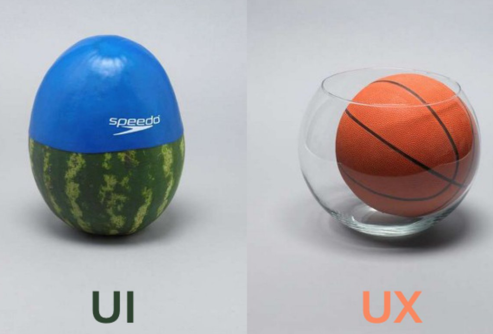</a> | **檔å:** `ux-meme-003.png`<br>**尺寸:** 1084x737<br>**大å°:** 466.80KB<br>**æ›´æ–°:** 2026-02-26 |
| <a href="images/Ux-meme/ux-meme-004.png"></a> | **檔å:** `ux-meme-004.png`<br>**尺寸:** 300x219<br>**大å°:** 33.69KB<br>**æ›´æ–°:** 2026-02-26 |

### 📠Memoji full 

| é è¦½ (é»æ“Šæ”¾å¤§) | 檔案詳細資訊 |
| :--- | :--- |
| <a href="images/iCons/Memoji Full /Character=Angela, Skin tone=Black, Posture=1 Happy.png"></a> | **檔å:** `Character=Angela, Skin tone=Black, Posture=1 Happy.png`<br>**尺寸:** 512x512<br>**大å°:** 111.36KB<br>**æ›´æ–°:** 2026-02-26 |
| <a href="images/iCons/Memoji Full /Character=Angela, Skin tone=Black, Posture=10 Kiss.png"></a> | **檔å:** `Character=Angela, Skin tone=Black, Posture=10 Kiss.png`<br>**尺寸:** 512x512<br>**大å°:** 106.77KB<br>**æ›´æ–°:** 2026-02-26 |
| <a href="images/iCons/Memoji Full /Character=Angela, Skin tone=Black, Posture=11 Party.png"></a> | **檔å:** `Character=Angela, Skin tone=Black, Posture=11 Party.png`<br>**尺寸:** 512x512<br>**大å°:** 126.75KB<br>**æ›´æ–°:** 2026-02-26 |
| <a href="images/iCons/Memoji Full /Character=Angela, Skin tone=Black, Posture=12 Angry.png"></a> | **檔å:** `Character=Angela, Skin tone=Black, Posture=12 Angry.png`<br>**尺寸:** 512x512<br>**大å°:** 98.83KB<br>**æ›´æ–°:** 2026-02-26 |
| <a href="images/iCons/Memoji Full /Character=Angela, Skin tone=Black, Posture=13 Triumph.png"></a> | **檔å:** `Character=Angela, Skin tone=Black, Posture=13 Triumph.png`<br>**尺寸:** 512x512<br>**大å°:** 111.13KB<br>**æ›´æ–°:** 2026-02-26 |
| <a href="images/iCons/Memoji Full /Character=Angela, Skin tone=Black, Posture=14 Bad Word.png"></a> | **檔å:** `Character=Angela, Skin tone=Black, Posture=14 Bad Word.png`<br>**尺寸:** 512x512<br>**大å°:** 104.11KB<br>**æ›´æ–°:** 2026-02-26 |
| <a href="images/iCons/Memoji Full /Character=Angela, Skin tone=Black, Posture=15 Grinning.png"></a> | **檔å:** `Character=Angela, Skin tone=Black, Posture=15 Grinning.png`<br>**尺寸:** 512x512<br>**大å°:** 113.80KB<br>**æ›´æ–°:** 2026-02-26 |
| <a href="images/iCons/Memoji Full /Character=Angela, Skin tone=Black, Posture=16 Winking.png"></a> | **檔å:** `Character=Angela, Skin tone=Black, Posture=16 Winking.png`<br>**尺寸:** 512x512<br>**大å°:** 105.86KB<br>**æ›´æ–°:** 2026-02-26 |
| <a href="images/iCons/Memoji Full /Character=Angela, Skin tone=Black, Posture=17 Happy Winking.png"></a> | **檔å:** `Character=Angela, Skin tone=Black, Posture=17 Happy Winking.png`<br>**尺寸:** 512x512<br>**大å°:** 110.73KB<br>**æ›´æ–°:** 2026-02-26 |
| <a href="images/iCons/Memoji Full /Character=Angela, Skin tone=Black, Posture=18 Shocked.png"></a> | **檔å:** `Character=Angela, Skin tone=Black, Posture=18 Shocked.png`<br>**尺寸:** 512x512<br>**大å°:** 111.25KB<br>**æ›´æ–°:** 2026-02-26 |
| <a href="images/iCons/Memoji Full /Character=Angela, Skin tone=Black, Posture=19 Rolling Eyes.png"></a> | **檔å:** `Character=Angela, Skin tone=Black, Posture=19 Rolling Eyes.png`<br>**尺寸:** 512x512<br>**大å°:** 104.56KB<br>**æ›´æ–°:** 2026-02-26 |
| <a href="images/iCons/Memoji Full /Character=Angela, Skin tone=Black, Posture=2 Luaghing.png"></a> | **檔å:** `Character=Angela, Skin tone=Black, Posture=2 Luaghing.png`<br>**尺寸:** 512x512<br>**大å°:** 114.98KB<br>**æ›´æ–°:** 2026-02-26 |
| <a href="images/iCons/Memoji Full /Character=Angela, Skin tone=Black, Posture=20 Like.png"></a> | **檔å:** `Character=Angela, Skin tone=Black, Posture=20 Like.png`<br>**尺寸:** 512x512<br>**大å°:** 122.02KB<br>**æ›´æ–°:** 2026-02-26 |
| <a href="images/iCons/Memoji Full /Character=Angela, Skin tone=Black, Posture=21 Dislike.png"></a> | **檔å:** `Character=Angela, Skin tone=Black, Posture=21 Dislike.png`<br>**尺寸:** 512x512<br>**大å°:** 116.19KB<br>**æ›´æ–°:** 2026-02-26 |
| <a href="images/iCons/Memoji Full /Character=Angela, Skin tone=Black, Posture=22 Victory.png"></a> | **檔å:** `Character=Angela, Skin tone=Black, Posture=22 Victory.png`<br>**尺寸:** 512x512<br>**大å°:** 119.77KB<br>**æ›´æ–°:** 2026-02-26 |
| <a href="images/iCons/Memoji Full /Character=Angela, Skin tone=Black, Posture=23 Hugging.png"></a> | **檔å:** `Character=Angela, Skin tone=Black, Posture=23 Hugging.png`<br>**尺寸:** 512x512<br>**大å°:** 142.45KB<br>**æ›´æ–°:** 2026-02-26 |
| <a href="images/iCons/Memoji Full /Character=Angela, Skin tone=Black, Posture=24 Fisting.png"></a> | **檔å:** `Character=Angela, Skin tone=Black, Posture=24 Fisting.png`<br>**尺寸:** 512x512<br>**大å°:** 101.17KB<br>**æ›´æ–°:** 2026-02-26 |
| <a href="images/iCons/Memoji Full /Character=Angela, Skin tone=Black, Posture=25 Mouth Covering.png"></a> | **檔å:** `Character=Angela, Skin tone=Black, Posture=25 Mouth Covering.png`<br>**尺寸:** 512x512<br>**大å°:** 114.49KB<br>**æ›´æ–°:** 2026-02-26 |
| <a href="images/iCons/Memoji Full /Character=Angela, Skin tone=Black, Posture=26 Crossing Finger.png"></a> | **檔å:** `Character=Angela, Skin tone=Black, Posture=26 Crossing Finger.png`<br>**尺寸:** 512x512<br>**大å°:** 108.49KB<br>**æ›´æ–°:** 2026-02-26 |
| <a href="images/iCons/Memoji Full /Character=Angela, Skin tone=Black, Posture=27 Sh!.png"></a> | **檔å:** `Character=Angela, Skin tone=Black, Posture=27 Sh!.png`<br>**尺寸:** 512x512<br>**大å°:** 109.41KB<br>**æ›´æ–°:** 2026-02-26 |
| <a href="images/iCons/Memoji Full /Character=Angela, Skin tone=Black, Posture=28 Thinking.png"></a> | **檔å:** `Character=Angela, Skin tone=Black, Posture=28 Thinking.png`<br>**尺寸:** 512x512<br>**大å°:** 110.01KB<br>**æ›´æ–°:** 2026-02-26 |
| <a href="images/iCons/Memoji Full /Character=Angela, Skin tone=Black, Posture=29 Scream.png"></a> | **檔å:** `Character=Angela, Skin tone=Black, Posture=29 Scream.png`<br>**尺寸:** 512x512<br>**大å°:** 122.08KB<br>**æ›´æ–°:** 2026-02-26 |
| <a href="images/iCons/Memoji Full /Character=Angela, Skin tone=Black, Posture=3 Sad.png"></a> | **檔å:** `Character=Angela, Skin tone=Black, Posture=3 Sad.png`<br>**尺寸:** 512x512<br>**大å°:** 103.29KB<br>**æ›´æ–°:** 2026-02-26 |
| <a href="images/iCons/Memoji Full /Character=Angela, Skin tone=Black, Posture=4 Crying.png"></a> | **檔å:** `Character=Angela, Skin tone=Black, Posture=4 Crying.png`<br>**尺寸:** 512x512<br>**大å°:** 108.13KB<br>**æ›´æ–°:** 2026-02-26 |
| <a href="images/iCons/Memoji Full /Character=Angela, Skin tone=Black, Posture=5 Heart Eye.png"></a> | **檔å:** `Character=Angela, Skin tone=Black, Posture=5 Heart Eye.png`<br>**尺寸:** 512x512<br>**大å°:** 110.05KB<br>**æ›´æ–°:** 2026-02-26 |
| <a href="images/iCons/Memoji Full /Character=Angela, Skin tone=Black, Posture=6 Sleeping.png"></a> | **檔å:** `Character=Angela, Skin tone=Black, Posture=6 Sleeping.png`<br>**尺寸:** 512x512<br>**大å°:** 111.14KB<br>**æ›´æ–°:** 2026-02-26 |
| <a href="images/iCons/Memoji Full /Character=Angela, Skin tone=Black, Posture=7 Mind blowing.png"></a> | **檔å:** `Character=Angela, Skin tone=Black, Posture=7 Mind blowing.png`<br>**尺寸:** 510x512<br>**大å°:** 158.36KB<br>**æ›´æ–°:** 2026-02-26 |
| <a href="images/iCons/Memoji Full /Character=Angela, Skin tone=Black, Posture=8 Star Eye.png"></a> | **檔å:** `Character=Angela, Skin tone=Black, Posture=8 Star Eye.png`<br>**尺寸:** 512x512<br>**大å°:** 123.02KB<br>**æ›´æ–°:** 2026-02-26 |
| <a href="images/iCons/Memoji Full /Character=Angela, Skin tone=Black, Posture=9 Lovely.png"></a> | **檔å:** `Character=Angela, Skin tone=Black, Posture=9 Lovely.png`<br>**尺寸:** 512x512<br>**大å°:** 112.62KB<br>**æ›´æ–°:** 2026-02-26 |
| <a href="images/iCons/Memoji Full /Character=Angela, Skin tone=White, Posture=1 Happy.png"></a> | **檔å:** `Character=Angela, Skin tone=White, Posture=1 Happy.png`<br>**尺寸:** 512x512<br>**大å°:** 115.30KB<br>**æ›´æ–°:** 2026-02-26 |
| <a href="images/iCons/Memoji Full /Character=Angela, Skin tone=White, Posture=10 Kiss.png"></a> | **檔å:** `Character=Angela, Skin tone=White, Posture=10 Kiss.png`<br>**尺寸:** 512x512<br>**大å°:** 110.89KB<br>**æ›´æ–°:** 2026-02-26 |
| <a href="images/iCons/Memoji Full /Character=Angela, Skin tone=White, Posture=11 Party.png"></a> | **檔å:** `Character=Angela, Skin tone=White, Posture=11 Party.png`<br>**尺寸:** 512x512<br>**大å°:** 130.77KB<br>**æ›´æ–°:** 2026-02-26 |
| <a href="images/iCons/Memoji Full /Character=Angela, Skin tone=White, Posture=12 Angry.png"></a> | **檔å:** `Character=Angela, Skin tone=White, Posture=12 Angry.png`<br>**尺寸:** 512x512<br>**大å°:** 102.36KB<br>**æ›´æ–°:** 2026-02-26 |
| <a href="images/iCons/Memoji Full /Character=Angela, Skin tone=White, Posture=13 Triumph.png"></a> | **檔å:** `Character=Angela, Skin tone=White, Posture=13 Triumph.png`<br>**尺寸:** 512x512<br>**大å°:** 113.81KB<br>**æ›´æ–°:** 2026-02-26 |
| <a href="images/iCons/Memoji Full /Character=Angela, Skin tone=White, Posture=14 Bad Word.png"></a> | **檔å:** `Character=Angela, Skin tone=White, Posture=14 Bad Word.png`<br>**尺寸:** 512x512<br>**大å°:** 106.65KB<br>**æ›´æ–°:** 2026-02-26 |
| <a href="images/iCons/Memoji Full /Character=Angela, Skin tone=White, Posture=15 Grinning.png"></a> | **檔å:** `Character=Angela, Skin tone=White, Posture=15 Grinning.png`<br>**尺寸:** 512x512<br>**大å°:** 116.71KB<br>**æ›´æ–°:** 2026-02-26 |
| <a href="images/iCons/Memoji Full /Character=Angela, Skin tone=White, Posture=16 Winking.png"></a> | **檔å:** `Character=Angela, Skin tone=White, Posture=16 Winking.png`<br>**尺寸:** 512x512<br>**大å°:** 109.67KB<br>**æ›´æ–°:** 2026-02-26 |
| <a href="images/iCons/Memoji Full /Character=Angela, Skin tone=White, Posture=17 Happy Winking.png"></a> | **檔å:** `Character=Angela, Skin tone=White, Posture=17 Happy Winking.png`<br>**尺寸:** 512x512<br>**大å°:** 114.38KB<br>**æ›´æ–°:** 2026-02-26 |
| <a href="images/iCons/Memoji Full /Character=Angela, Skin tone=White, Posture=18 Shocked.png"></a> | **檔å:** `Character=Angela, Skin tone=White, Posture=18 Shocked.png`<br>**尺寸:** 512x512<br>**大å°:** 115.58KB<br>**æ›´æ–°:** 2026-02-26 |
| <a href="images/iCons/Memoji Full /Character=Angela, Skin tone=White, Posture=19 Rolling Eyes.png"></a> | **檔å:** `Character=Angela, Skin tone=White, Posture=19 Rolling Eyes.png`<br>**尺寸:** 512x512<br>**大å°:** 108.05KB<br>**æ›´æ–°:** 2026-02-26 |
| <a href="images/iCons/Memoji Full /Character=Angela, Skin tone=White, Posture=2 Luaghing.png"></a> | **檔å:** `Character=Angela, Skin tone=White, Posture=2 Luaghing.png`<br>**尺寸:** 512x512<br>**大å°:** 118.36KB<br>**æ›´æ–°:** 2026-02-26 |
| <a href="images/iCons/Memoji Full /Character=Angela, Skin tone=White, Posture=20 Like.png"></a> | **檔å:** `Character=Angela, Skin tone=White, Posture=20 Like.png`<br>**尺寸:** 512x512<br>**大å°:** 126.01KB<br>**æ›´æ–°:** 2026-02-26 |
| <a href="images/iCons/Memoji Full /Character=Angela, Skin tone=White, Posture=21 Dislike.png"></a> | **檔å:** `Character=Angela, Skin tone=White, Posture=21 Dislike.png`<br>**尺寸:** 512x512<br>**大å°:** 120.45KB<br>**æ›´æ–°:** 2026-02-26 |
| <a href="images/iCons/Memoji Full /Character=Angela, Skin tone=White, Posture=22 Victory.png"></a> | **檔å:** `Character=Angela, Skin tone=White, Posture=22 Victory.png`<br>**尺寸:** 512x512<br>**大å°:** 124.26KB<br>**æ›´æ–°:** 2026-02-26 |
| <a href="images/iCons/Memoji Full /Character=Angela, Skin tone=White, Posture=23 Hugging.png"></a> | **檔å:** `Character=Angela, Skin tone=White, Posture=23 Hugging.png`<br>**尺寸:** 512x512<br>**大å°:** 146.84KB<br>**æ›´æ–°:** 2026-02-26 |
| <a href="images/iCons/Memoji Full /Character=Angela, Skin tone=White, Posture=24 Fisting.png"></a> | **檔å:** `Character=Angela, Skin tone=White, Posture=24 Fisting.png`<br>**尺寸:** 512x512<br>**大å°:** 104.63KB<br>**æ›´æ–°:** 2026-02-26 |
| <a href="images/iCons/Memoji Full /Character=Angela, Skin tone=White, Posture=25 Mouth Covering.png"></a> | **檔å:** `Character=Angela, Skin tone=White, Posture=25 Mouth Covering.png`<br>**尺寸:** 512x512<br>**大å°:** 118.49KB<br>**æ›´æ–°:** 2026-02-26 |
| <a href="images/iCons/Memoji Full /Character=Angela, Skin tone=White, Posture=26 Crossing Finger.png"></a> | **檔å:** `Character=Angela, Skin tone=White, Posture=26 Crossing Finger.png`<br>**尺寸:** 512x512<br>**大å°:** 113.15KB<br>**æ›´æ–°:** 2026-02-26 |
| <a href="images/iCons/Memoji Full /Character=Angela, Skin tone=White, Posture=27 Sh!.png"></a> | **檔å:** `Character=Angela, Skin tone=White, Posture=27 Sh!.png`<br>**尺寸:** 512x512<br>**大å°:** 113.01KB<br>**æ›´æ–°:** 2026-02-26 |
| <a href="images/iCons/Memoji Full /Character=Angela, Skin tone=White, Posture=28 Thinking.png"></a> | **檔å:** `Character=Angela, Skin tone=White, Posture=28 Thinking.png`<br>**尺寸:** 512x512<br>**大å°:** 113.44KB<br>**æ›´æ–°:** 2026-02-26 |
| <a href="images/iCons/Memoji Full /Character=Angela, Skin tone=White, Posture=29 Scream.png"></a> | **檔å:** `Character=Angela, Skin tone=White, Posture=29 Scream.png`<br>**尺寸:** 512x512<br>**大å°:** 126.70KB<br>**æ›´æ–°:** 2026-02-26 |
| <a href="images/iCons/Memoji Full /Character=Angela, Skin tone=White, Posture=3 Sad.png"></a> | **檔å:** `Character=Angela, Skin tone=White, Posture=3 Sad.png`<br>**尺寸:** 512x512<br>**大å°:** 106.44KB<br>**æ›´æ–°:** 2026-02-26 |
| <a href="images/iCons/Memoji Full /Character=Angela, Skin tone=White, Posture=4 Crying.png"></a> | **檔å:** `Character=Angela, Skin tone=White, Posture=4 Crying.png`<br>**尺寸:** 512x512<br>**大å°:** 111.70KB<br>**æ›´æ–°:** 2026-02-26 |
| <a href="images/iCons/Memoji Full /Character=Angela, Skin tone=White, Posture=5 Heart Eye.png"></a> | **檔å:** `Character=Angela, Skin tone=White, Posture=5 Heart Eye.png`<br>**尺寸:** 512x512<br>**大å°:** 112.45KB<br>**æ›´æ–°:** 2026-02-26 |
| <a href="images/iCons/Memoji Full /Character=Angela, Skin tone=White, Posture=6 Sleeping.png"></a> | **檔å:** `Character=Angela, Skin tone=White, Posture=6 Sleeping.png`<br>**尺寸:** 512x512<br>**大å°:** 114.16KB<br>**æ›´æ–°:** 2026-02-26 |
| <a href="images/iCons/Memoji Full /Character=Angela, Skin tone=White, Posture=7 Mind blowing.png"></a> | **檔å:** `Character=Angela, Skin tone=White, Posture=7 Mind blowing.png`<br>**尺寸:** 510x512<br>**大å°:** 161.54KB<br>**æ›´æ–°:** 2026-02-26 |
| <a href="images/iCons/Memoji Full /Character=Angela, Skin tone=White, Posture=8 Star Eye.png"></a> | **檔å:** `Character=Angela, Skin tone=White, Posture=8 Star Eye.png`<br>**尺寸:** 512x512<br>**大å°:** 124.97KB<br>**æ›´æ–°:** 2026-02-26 |
| <a href="images/iCons/Memoji Full /Character=Angela, Skin tone=White, Posture=9 Lovely.png"></a> | **檔å:** `Character=Angela, Skin tone=White, Posture=9 Lovely.png`<br>**尺寸:** 512x512<br>**大å°:** 116.22KB<br>**æ›´æ–°:** 2026-02-26 |
| <a href="images/iCons/Memoji Full /Character=Ariana, Skin tone=Black, Posture=1 Happy.png"></a> | **檔å:** `Character=Ariana, Skin tone=Black, Posture=1 Happy.png`<br>**尺寸:** 512x512<br>**大å°:** 96.10KB<br>**æ›´æ–°:** 2026-02-26 |
| <a href="images/iCons/Memoji Full /Character=Ariana, Skin tone=Black, Posture=10 Kiss.png"></a> | **檔å:** `Character=Ariana, Skin tone=Black, Posture=10 Kiss.png`<br>**尺寸:** 512x512<br>**大å°:** 93.31KB<br>**æ›´æ–°:** 2026-02-26 |
| <a href="images/iCons/Memoji Full /Character=Ariana, Skin tone=Black, Posture=11 Party.png"></a> | **檔å:** `Character=Ariana, Skin tone=Black, Posture=11 Party.png`<br>**尺寸:** 512x512<br>**大å°:** 116.39KB<br>**æ›´æ–°:** 2026-02-26 |
| <a href="images/iCons/Memoji Full /Character=Ariana, Skin tone=Black, Posture=12 Angry.png"></a> | **檔å:** `Character=Ariana, Skin tone=Black, Posture=12 Angry.png`<br>**尺寸:** 512x512<br>**大å°:** 97.66KB<br>**æ›´æ–°:** 2026-02-26 |
| <a href="images/iCons/Memoji Full /Character=Ariana, Skin tone=Black, Posture=13 Triumph.png"></a> | **檔å:** `Character=Ariana, Skin tone=Black, Posture=13 Triumph.png`<br>**尺寸:** 512x512<br>**大å°:** 90.94KB<br>**æ›´æ–°:** 2026-02-26 |
| <a href="images/iCons/Memoji Full /Character=Ariana, Skin tone=Black, Posture=14 Bad Word.png"></a> | **檔å:** `Character=Ariana, Skin tone=Black, Posture=14 Bad Word.png`<br>**尺寸:** 512x512<br>**大å°:** 90.97KB<br>**æ›´æ–°:** 2026-02-26 |
| <a href="images/iCons/Memoji Full /Character=Ariana, Skin tone=Black, Posture=15 Grinning.png"></a> | **檔å:** `Character=Ariana, Skin tone=Black, Posture=15 Grinning.png`<br>**尺寸:** 512x512<br>**大å°:** 96.04KB<br>**æ›´æ–°:** 2026-02-26 |
| <a href="images/iCons/Memoji Full /Character=Ariana, Skin tone=Black, Posture=16 Winking.png"></a> | **檔å:** `Character=Ariana, Skin tone=Black, Posture=16 Winking.png`<br>**尺寸:** 512x512<br>**大å°:** 92.90KB<br>**æ›´æ–°:** 2026-02-26 |
| <a href="images/iCons/Memoji Full /Character=Ariana, Skin tone=Black, Posture=17 Happy Winking.png"></a> | **檔å:** `Character=Ariana, Skin tone=Black, Posture=17 Happy Winking.png`<br>**尺寸:** 512x512<br>**大å°:** 96.11KB<br>**æ›´æ–°:** 2026-02-26 |
| <a href="images/iCons/Memoji Full /Character=Ariana, Skin tone=Black, Posture=18 Shocked.png"></a> | **檔å:** `Character=Ariana, Skin tone=Black, Posture=18 Shocked.png`<br>**尺寸:** 512x512<br>**大å°:** 103.71KB<br>**æ›´æ–°:** 2026-02-26 |
| <a href="images/iCons/Memoji Full /Character=Ariana, Skin tone=Black, Posture=19 Rolling Eyes.png"></a> | **檔å:** `Character=Ariana, Skin tone=Black, Posture=19 Rolling Eyes.png`<br>**尺寸:** 512x512<br>**大å°:** 92.87KB<br>**æ›´æ–°:** 2026-02-26 |
| <a href="images/iCons/Memoji Full /Character=Ariana, Skin tone=Black, Posture=2 Luaghing.png"></a> | **檔å:** `Character=Ariana, Skin tone=Black, Posture=2 Luaghing.png`<br>**尺寸:** 512x512<br>**大å°:** 91.41KB<br>**æ›´æ–°:** 2026-02-26 |
| <a href="images/iCons/Memoji Full /Character=Ariana, Skin tone=Black, Posture=20 Like.png"></a> | **檔å:** `Character=Ariana, Skin tone=Black, Posture=20 Like.png`<br>**尺寸:** 512x512<br>**大å°:** 113.17KB<br>**æ›´æ–°:** 2026-02-26 |
| <a href="images/iCons/Memoji Full /Character=Ariana, Skin tone=Black, Posture=21 Dislike.png"></a> | **檔å:** `Character=Ariana, Skin tone=Black, Posture=21 Dislike.png`<br>**尺寸:** 512x512<br>**大å°:** 101.64KB<br>**æ›´æ–°:** 2026-02-26 |
| <a href="images/iCons/Memoji Full /Character=Ariana, Skin tone=Black, Posture=22 Victory.png"></a> | **檔å:** `Character=Ariana, Skin tone=Black, Posture=22 Victory.png`<br>**尺寸:** 512x512<br>**大å°:** 109.75KB<br>**æ›´æ–°:** 2026-02-26 |
| <a href="images/iCons/Memoji Full /Character=Ariana, Skin tone=Black, Posture=23 Hugging.png"></a> | **檔å:** `Character=Ariana, Skin tone=Black, Posture=23 Hugging.png`<br>**尺寸:** 512x512<br>**大å°:** 134.11KB<br>**æ›´æ–°:** 2026-02-26 |
| <a href="images/iCons/Memoji Full /Character=Ariana, Skin tone=Black, Posture=24 Fisting.png"></a> | **檔å:** `Character=Ariana, Skin tone=Black, Posture=24 Fisting.png`<br>**尺寸:** 512x512<br>**大å°:** 102.04KB<br>**æ›´æ–°:** 2026-02-26 |
| <a href="images/iCons/Memoji Full /Character=Ariana, Skin tone=Black, Posture=25 Mouth Covering.png"></a> | **檔å:** `Character=Ariana, Skin tone=Black, Posture=25 Mouth Covering.png`<br>**尺寸:** 512x512<br>**大å°:** 103.73KB<br>**æ›´æ–°:** 2026-02-26 |
| <a href="images/iCons/Memoji Full /Character=Ariana, Skin tone=Black, Posture=26 Crossing Finger.png"></a> | **檔å:** `Character=Ariana, Skin tone=Black, Posture=26 Crossing Finger.png`<br>**尺寸:** 512x512<br>**大å°:** 103.25KB<br>**æ›´æ–°:** 2026-02-26 |
| <a href="images/iCons/Memoji Full /Character=Ariana, Skin tone=Black, Posture=27 Sh!.png"></a> | **檔å:** `Character=Ariana, Skin tone=Black, Posture=27 Sh!.png`<br>**尺寸:** 512x512<br>**大å°:** 87.96KB<br>**æ›´æ–°:** 2026-02-26 |
| <a href="images/iCons/Memoji Full /Character=Ariana, Skin tone=Black, Posture=28 Thinking.png"></a> | **檔å:** `Character=Ariana, Skin tone=Black, Posture=28 Thinking.png`<br>**尺寸:** 512x512<br>**大å°:** 101.66KB<br>**æ›´æ–°:** 2026-02-26 |
| <a href="images/iCons/Memoji Full /Character=Ariana, Skin tone=Black, Posture=29 Scream.png"></a> | **檔å:** `Character=Ariana, Skin tone=Black, Posture=29 Scream.png`<br>**尺寸:** 512x512<br>**大å°:** 118.44KB<br>**æ›´æ–°:** 2026-02-26 |
| <a href="images/iCons/Memoji Full /Character=Ariana, Skin tone=Black, Posture=3 Sad.png"></a> | **檔å:** `Character=Ariana, Skin tone=Black, Posture=3 Sad.png`<br>**尺寸:** 512x512<br>**大å°:** 94.96KB<br>**æ›´æ–°:** 2026-02-26 |
| <a href="images/iCons/Memoji Full /Character=Ariana, Skin tone=Black, Posture=4 Crying.png"></a> | **檔å:** `Character=Ariana, Skin tone=Black, Posture=4 Crying.png`<br>**尺寸:** 512x512<br>**大å°:** 92.95KB<br>**æ›´æ–°:** 2026-02-26 |
| <a href="images/iCons/Memoji Full /Character=Ariana, Skin tone=Black, Posture=5 Heart Eye.png"></a> | **檔å:** `Character=Ariana, Skin tone=Black, Posture=5 Heart Eye.png`<br>**尺寸:** 512x512<br>**大å°:** 105.18KB<br>**æ›´æ–°:** 2026-02-26 |
| <a href="images/iCons/Memoji Full /Character=Ariana, Skin tone=Black, Posture=6 Sleeping.png"></a> | **檔å:** `Character=Ariana, Skin tone=Black, Posture=6 Sleeping.png`<br>**尺寸:** 512x512<br>**大å°:** 88.37KB<br>**æ›´æ–°:** 2026-02-26 |
| <a href="images/iCons/Memoji Full /Character=Ariana, Skin tone=Black, Posture=7 Mind blowing.png"></a> | **檔å:** `Character=Ariana, Skin tone=Black, Posture=7 Mind blowing.png`<br>**尺寸:** 512x512<br>**大å°:** 132.32KB<br>**æ›´æ–°:** 2026-02-26 |
| <a href="images/iCons/Memoji Full /Character=Ariana, Skin tone=Black, Posture=8 Star Eye.png"></a> | **檔å:** `Character=Ariana, Skin tone=Black, Posture=8 Star Eye.png`<br>**尺寸:** 512x512<br>**大å°:** 115.40KB<br>**æ›´æ–°:** 2026-02-26 |
| <a href="images/iCons/Memoji Full /Character=Ariana, Skin tone=Black, Posture=9 Lovely.png"></a> | **檔å:** `Character=Ariana, Skin tone=Black, Posture=9 Lovely.png`<br>**尺寸:** 512x512<br>**大å°:** 96.15KB<br>**æ›´æ–°:** 2026-02-26 |
| <a href="images/iCons/Memoji Full /Character=Ariana, Skin tone=White, Posture=1 Happy.png"></a> | **檔å:** `Character=Ariana, Skin tone=White, Posture=1 Happy.png`<br>**尺寸:** 512x512<br>**大å°:** 105.68KB<br>**æ›´æ–°:** 2026-02-26 |
| <a href="images/iCons/Memoji Full /Character=Ariana, Skin tone=White, Posture=10 Kiss.png"></a> | **檔å:** `Character=Ariana, Skin tone=White, Posture=10 Kiss.png`<br>**尺寸:** 512x512<br>**大å°:** 100.65KB<br>**æ›´æ–°:** 2026-02-26 |
| <a href="images/iCons/Memoji Full /Character=Ariana, Skin tone=White, Posture=11 Party.png"></a> | **檔å:** `Character=Ariana, Skin tone=White, Posture=11 Party.png`<br>**尺寸:** 512x512<br>**大å°:** 125.08KB<br>**æ›´æ–°:** 2026-02-26 |
| <a href="images/iCons/Memoji Full /Character=Ariana, Skin tone=White, Posture=12 Angry.png"></a> | **檔å:** `Character=Ariana, Skin tone=White, Posture=12 Angry.png`<br>**尺寸:** 512x512<br>**大å°:** 106.18KB<br>**æ›´æ–°:** 2026-02-26 |
| <a href="images/iCons/Memoji Full /Character=Ariana, Skin tone=White, Posture=13 Triumph.png"></a> | **檔å:** `Character=Ariana, Skin tone=White, Posture=13 Triumph.png`<br>**尺寸:** 512x512<br>**大å°:** 96.26KB<br>**æ›´æ–°:** 2026-02-26 |
| <a href="images/iCons/Memoji Full /Character=Ariana, Skin tone=White, Posture=14 Bad Word.png"></a> | **檔å:** `Character=Ariana, Skin tone=White, Posture=14 Bad Word.png`<br>**尺寸:** 512x512<br>**大å°:** 95.62KB<br>**æ›´æ–°:** 2026-02-26 |
| <a href="images/iCons/Memoji Full /Character=Ariana, Skin tone=White, Posture=15 Grinning.png"></a> | **檔å:** `Character=Ariana, Skin tone=White, Posture=15 Grinning.png`<br>**尺寸:** 512x512<br>**大å°:** 104.48KB<br>**æ›´æ–°:** 2026-02-26 |
| <a href="images/iCons/Memoji Full /Character=Ariana, Skin tone=White, Posture=16 Winking.png"></a> | **檔å:** `Character=Ariana, Skin tone=White, Posture=16 Winking.png`<br>**尺寸:** 512x512<br>**大å°:** 100.13KB<br>**æ›´æ–°:** 2026-02-26 |
| <a href="images/iCons/Memoji Full /Character=Ariana, Skin tone=White, Posture=17 Happy Winking.png"></a> | **檔å:** `Character=Ariana, Skin tone=White, Posture=17 Happy Winking.png`<br>**尺寸:** 512x512<br>**大å°:** 103.47KB<br>**æ›´æ–°:** 2026-02-26 |
| <a href="images/iCons/Memoji Full /Character=Ariana, Skin tone=White, Posture=18 Shocked.png"></a> | **檔å:** `Character=Ariana, Skin tone=White, Posture=18 Shocked.png`<br>**尺寸:** 512x512<br>**大å°:** 112.93KB<br>**æ›´æ–°:** 2026-02-26 |
| <a href="images/iCons/Memoji Full /Character=Ariana, Skin tone=White, Posture=19 Rolling Eyes.png"></a> | **檔å:** `Character=Ariana, Skin tone=White, Posture=19 Rolling Eyes.png`<br>**尺寸:** 512x512<br>**大å°:** 100.32KB<br>**æ›´æ–°:** 2026-02-26 |
| <a href="images/iCons/Memoji Full /Character=Ariana, Skin tone=White, Posture=2 Luaghing.png"></a> | **檔å:** `Character=Ariana, Skin tone=White, Posture=2 Luaghing.png`<br>**尺寸:** 512x512<br>**大å°:** 98.65KB<br>**æ›´æ–°:** 2026-02-26 |
| <a href="images/iCons/Memoji Full /Character=Ariana, Skin tone=White, Posture=20 Like.png"></a> | **檔å:** `Character=Ariana, Skin tone=White, Posture=20 Like.png`<br>**尺寸:** 512x512<br>**大å°:** 123.82KB<br>**æ›´æ–°:** 2026-02-26 |
| <a href="images/iCons/Memoji Full /Character=Ariana, Skin tone=White, Posture=21 Dislike.png"></a> | **檔å:** `Character=Ariana, Skin tone=White, Posture=21 Dislike.png`<br>**尺寸:** 512x512<br>**大å°:** 111.58KB<br>**æ›´æ–°:** 2026-02-26 |
| <a href="images/iCons/Memoji Full /Character=Ariana, Skin tone=White, Posture=22 Victory.png"></a> | **檔å:** `Character=Ariana, Skin tone=White, Posture=22 Victory.png`<br>**尺寸:** 512x512<br>**大å°:** 119.32KB<br>**æ›´æ–°:** 2026-02-26 |
| <a href="images/iCons/Memoji Full /Character=Ariana, Skin tone=White, Posture=23 Hugging.png"></a> | **檔å:** `Character=Ariana, Skin tone=White, Posture=23 Hugging.png`<br>**尺寸:** 512x512<br>**大å°:** 145.24KB<br>**æ›´æ–°:** 2026-02-26 |
| <a href="images/iCons/Memoji Full /Character=Ariana, Skin tone=White, Posture=24 Fisting.png"></a> | **檔å:** `Character=Ariana, Skin tone=White, Posture=24 Fisting.png`<br>**尺寸:** 512x512<br>**大å°:** 110.23KB<br>**æ›´æ–°:** 2026-02-26 |
| <a href="images/iCons/Memoji Full /Character=Ariana, Skin tone=White, Posture=25 Mouth Covering.png"></a> | **檔å:** `Character=Ariana, Skin tone=White, Posture=25 Mouth Covering.png`<br>**尺寸:** 512x512<br>**大å°:** 112.21KB<br>**æ›´æ–°:** 2026-02-26 |
| <a href="images/iCons/Memoji Full /Character=Ariana, Skin tone=White, Posture=26 Crossing Finger.png"></a> | **檔å:** `Character=Ariana, Skin tone=White, Posture=26 Crossing Finger.png`<br>**尺寸:** 512x512<br>**大å°:** 113.50KB<br>**æ›´æ–°:** 2026-02-26 |
| <a href="images/iCons/Memoji Full /Character=Ariana, Skin tone=White, Posture=27 Sh!.png"></a> | **檔å:** `Character=Ariana, Skin tone=White, Posture=27 Sh!.png`<br>**尺寸:** 512x512<br>**大å°:** 93.89KB<br>**æ›´æ–°:** 2026-02-26 |
| <a href="images/iCons/Memoji Full /Character=Ariana, Skin tone=White, Posture=28 Thinking.png"></a> | **檔å:** `Character=Ariana, Skin tone=White, Posture=28 Thinking.png`<br>**尺寸:** 512x512<br>**大å°:** 110.33KB<br>**æ›´æ–°:** 2026-02-26 |
| <a href="images/iCons/Memoji Full /Character=Ariana, Skin tone=White, Posture=29 Scream.png"></a> | **檔å:** `Character=Ariana, Skin tone=White, Posture=29 Scream.png`<br>**尺寸:** 512x512<br>**大å°:** 129.01KB<br>**æ›´æ–°:** 2026-02-26 |
| <a href="images/iCons/Memoji Full /Character=Ariana, Skin tone=White, Posture=3 Sad.png"></a> | **檔å:** `Character=Ariana, Skin tone=White, Posture=3 Sad.png`<br>**尺寸:** 512x512<br>**大å°:** 101.90KB<br>**æ›´æ–°:** 2026-02-26 |
| <a href="images/iCons/Memoji Full /Character=Ariana, Skin tone=White, Posture=4 Crying.png"></a> | **檔å:** `Character=Ariana, Skin tone=White, Posture=4 Crying.png`<br>**尺寸:** 512x512<br>**大å°:** 99.03KB<br>**æ›´æ–°:** 2026-02-26 |
| <a href="images/iCons/Memoji Full /Character=Ariana, Skin tone=White, Posture=5 Heart Eye.png"></a> | **檔å:** `Character=Ariana, Skin tone=White, Posture=5 Heart Eye.png`<br>**尺寸:** 512x512<br>**大å°:** 111.33KB<br>**æ›´æ–°:** 2026-02-26 |
| <a href="images/iCons/Memoji Full /Character=Ariana, Skin tone=White, Posture=6 Sleeping.png"></a> | **檔å:** `Character=Ariana, Skin tone=White, Posture=6 Sleeping.png`<br>**尺寸:** 512x512<br>**大å°:** 95.52KB<br>**æ›´æ–°:** 2026-02-26 |
| <a href="images/iCons/Memoji Full /Character=Ariana, Skin tone=White, Posture=7 Mind blowing.png"></a> | **檔å:** `Character=Ariana, Skin tone=White, Posture=7 Mind blowing.png`<br>**尺寸:** 512x512<br>**大å°:** 139.42KB<br>**æ›´æ–°:** 2026-02-26 |
| <a href="images/iCons/Memoji Full /Character=Ariana, Skin tone=White, Posture=8 Star Eye.png"></a> | **檔å:** `Character=Ariana, Skin tone=White, Posture=8 Star Eye.png`<br>**尺寸:** 512x512<br>**大å°:** 119.01KB<br>**æ›´æ–°:** 2026-02-26 |
| <a href="images/iCons/Memoji Full /Character=Ariana, Skin tone=White, Posture=9 Lovely.png"></a> | **檔å:** `Character=Ariana, Skin tone=White, Posture=9 Lovely.png`<br>**尺寸:** 512x512<br>**大å°:** 105.66KB<br>**æ›´æ–°:** 2026-02-26 |
| <a href="images/iCons/Memoji Full /Character=Darlene, Skin tone=Black, Posture=1 Happy.png"></a> | **檔å:** `Character=Darlene, Skin tone=Black, Posture=1 Happy.png`<br>**尺寸:** 512x512<br>**大å°:** 99.61KB<br>**æ›´æ–°:** 2026-02-26 |
| <a href="images/iCons/Memoji Full /Character=Darlene, Skin tone=Black, Posture=10 Kiss.png"></a> | **檔å:** `Character=Darlene, Skin tone=Black, Posture=10 Kiss.png`<br>**尺寸:** 512x512<br>**大å°:** 97.63KB<br>**æ›´æ–°:** 2026-02-26 |
| <a href="images/iCons/Memoji Full /Character=Darlene, Skin tone=Black, Posture=11 Party.png"></a> | **檔å:** `Character=Darlene, Skin tone=Black, Posture=11 Party.png`<br>**尺寸:** 512x512<br>**大å°:** 119.90KB<br>**æ›´æ–°:** 2026-02-26 |
| <a href="images/iCons/Memoji Full /Character=Darlene, Skin tone=Black, Posture=12 Angry.png"></a> | **檔å:** `Character=Darlene, Skin tone=Black, Posture=12 Angry.png`<br>**尺寸:** 512x512<br>**大å°:** 89.76KB<br>**æ›´æ–°:** 2026-02-26 |
| <a href="images/iCons/Memoji Full /Character=Darlene, Skin tone=Black, Posture=13 Triumph.png"></a> | **檔å:** `Character=Darlene, Skin tone=Black, Posture=13 Triumph.png`<br>**尺寸:** 512x512<br>**大å°:** 100.02KB<br>**æ›´æ–°:** 2026-02-26 |
| <a href="images/iCons/Memoji Full /Character=Darlene, Skin tone=Black, Posture=14 Bad Word.png"></a> | **檔å:** `Character=Darlene, Skin tone=Black, Posture=14 Bad Word.png`<br>**尺寸:** 512x512<br>**大å°:** 94.56KB<br>**æ›´æ–°:** 2026-02-26 |
| <a href="images/iCons/Memoji Full /Character=Darlene, Skin tone=Black, Posture=15 Grinning.png"></a> | **檔å:** `Character=Darlene, Skin tone=Black, Posture=15 Grinning.png`<br>**尺寸:** 512x512<br>**大å°:** 102.25KB<br>**æ›´æ–°:** 2026-02-26 |
| <a href="images/iCons/Memoji Full /Character=Darlene, Skin tone=Black, Posture=16 Winking.png"></a> | **檔å:** `Character=Darlene, Skin tone=Black, Posture=16 Winking.png`<br>**尺寸:** 512x512<br>**大å°:** 95.62KB<br>**æ›´æ–°:** 2026-02-26 |
| <a href="images/iCons/Memoji Full /Character=Darlene, Skin tone=Black, Posture=17 Happy Winking.png"></a> | **檔å:** `Character=Darlene, Skin tone=Black, Posture=17 Happy Winking.png`<br>**尺寸:** 512x512<br>**大å°:** 99.08KB<br>**æ›´æ–°:** 2026-02-26 |
| <a href="images/iCons/Memoji Full /Character=Darlene, Skin tone=Black, Posture=18 Shocked.png"></a> | **檔å:** `Character=Darlene, Skin tone=Black, Posture=18 Shocked.png`<br>**尺寸:** 512x512<br>**大å°:** 99.21KB<br>**æ›´æ–°:** 2026-02-26 |
| <a href="images/iCons/Memoji Full /Character=Darlene, Skin tone=Black, Posture=19 Rolling Eyes.png"></a> | **檔å:** `Character=Darlene, Skin tone=Black, Posture=19 Rolling Eyes.png`<br>**尺寸:** 512x512<br>**大å°:** 92.92KB<br>**æ›´æ–°:** 2026-02-26 |
| <a href="images/iCons/Memoji Full /Character=Darlene, Skin tone=Black, Posture=2 Luaghing.png"></a> | **檔å:** `Character=Darlene, Skin tone=Black, Posture=2 Luaghing.png`<br>**尺寸:** 512x512<br>**大å°:** 102.51KB<br>**æ›´æ–°:** 2026-02-26 |
| <a href="images/iCons/Memoji Full /Character=Darlene, Skin tone=Black, Posture=20 Like.png"></a> | **檔å:** `Character=Darlene, Skin tone=Black, Posture=20 Like.png`<br>**尺寸:** 512x512<br>**大å°:** 114.72KB<br>**æ›´æ–°:** 2026-02-26 |
| <a href="images/iCons/Memoji Full /Character=Darlene, Skin tone=Black, Posture=21 Dislike.png"></a> | **檔å:** `Character=Darlene, Skin tone=Black, Posture=21 Dislike.png`<br>**尺寸:** 512x512<br>**大å°:** 106.22KB<br>**æ›´æ–°:** 2026-02-26 |
| <a href="images/iCons/Memoji Full /Character=Darlene, Skin tone=Black, Posture=22 Victory.png"></a> | **檔å:** `Character=Darlene, Skin tone=Black, Posture=22 Victory.png`<br>**尺寸:** 512x512<br>**大å°:** 114.16KB<br>**æ›´æ–°:** 2026-02-26 |
| <a href="images/iCons/Memoji Full /Character=Darlene, Skin tone=Black, Posture=23 Hugging.png"></a> | **檔å:** `Character=Darlene, Skin tone=Black, Posture=23 Hugging.png`<br>**尺寸:** 512x512<br>**大å°:** 143.20KB<br>**æ›´æ–°:** 2026-02-26 |
| <a href="images/iCons/Memoji Full /Character=Darlene, Skin tone=Black, Posture=24 Fisting.png"></a> | **檔å:** `Character=Darlene, Skin tone=Black, Posture=24 Fisting.png`<br>**尺寸:** 512x512<br>**大å°:** 102.02KB<br>**æ›´æ–°:** 2026-02-26 |
| <a href="images/iCons/Memoji Full /Character=Darlene, Skin tone=Black, Posture=25 Mouth Covering.png"></a> | **檔å:** `Character=Darlene, Skin tone=Black, Posture=25 Mouth Covering.png`<br>**尺寸:** 512x512<br>**大å°:** 103.06KB<br>**æ›´æ–°:** 2026-02-26 |
| <a href="images/iCons/Memoji Full /Character=Darlene, Skin tone=Black, Posture=26 Crossing Finger.png"></a> | **檔å:** `Character=Darlene, Skin tone=Black, Posture=26 Crossing Finger.png`<br>**尺寸:** 512x512<br>**大å°:** 100.40KB<br>**æ›´æ–°:** 2026-02-26 |
| <a href="images/iCons/Memoji Full /Character=Darlene, Skin tone=Black, Posture=27 Sh!.png"></a> | **檔å:** `Character=Darlene, Skin tone=Black, Posture=27 Sh!.png`<br>**尺寸:** 512x512<br>**大å°:** 86.38KB<br>**æ›´æ–°:** 2026-02-26 |
| <a href="images/iCons/Memoji Full /Character=Darlene, Skin tone=Black, Posture=28 Thinking.png"></a> | **檔å:** `Character=Darlene, Skin tone=Black, Posture=28 Thinking.png`<br>**尺寸:** 512x512<br>**大å°:** 102.22KB<br>**æ›´æ–°:** 2026-02-26 |
| <a href="images/iCons/Memoji Full /Character=Darlene, Skin tone=Black, Posture=29 Scream.png"></a> | **檔å:** `Character=Darlene, Skin tone=Black, Posture=29 Scream.png`<br>**尺寸:** 512x512<br>**大å°:** 118.06KB<br>**æ›´æ–°:** 2026-02-26 |
| <a href="images/iCons/Memoji Full /Character=Darlene, Skin tone=Black, Posture=3 Sad.png"></a> | **檔å:** `Character=Darlene, Skin tone=Black, Posture=3 Sad.png`<br>**尺寸:** 512x512<br>**大å°:** 92.50KB<br>**æ›´æ–°:** 2026-02-26 |
| <a href="images/iCons/Memoji Full /Character=Darlene, Skin tone=Black, Posture=4 Crying.png"></a> | **檔å:** `Character=Darlene, Skin tone=Black, Posture=4 Crying.png`<br>**尺寸:** 512x512<br>**大å°:** 96.77KB<br>**æ›´æ–°:** 2026-02-26 |
| <a href="images/iCons/Memoji Full /Character=Darlene, Skin tone=Black, Posture=5 Heart Eye.png"></a> | **檔å:** `Character=Darlene, Skin tone=Black, Posture=5 Heart Eye.png`<br>**尺寸:** 512x512<br>**大å°:** 100.08KB<br>**æ›´æ–°:** 2026-02-26 |
| <a href="images/iCons/Memoji Full /Character=Darlene, Skin tone=Black, Posture=6 Sleeping.png"></a> | **檔å:** `Character=Darlene, Skin tone=Black, Posture=6 Sleeping.png`<br>**尺寸:** 512x512<br>**大å°:** 97.14KB<br>**æ›´æ–°:** 2026-02-26 |
| <a href="images/iCons/Memoji Full /Character=Darlene, Skin tone=Black, Posture=7 Mind blowing.png"></a> | **檔å:** `Character=Darlene, Skin tone=Black, Posture=7 Mind blowing.png`<br>**尺寸:** 512x512<br>**大å°:** 135.14KB<br>**æ›´æ–°:** 2026-02-26 |
| <a href="images/iCons/Memoji Full /Character=Darlene, Skin tone=Black, Posture=8 Star Eye.png"></a> | **檔å:** `Character=Darlene, Skin tone=Black, Posture=8 Star Eye.png`<br>**尺寸:** 512x512<br>**大å°:** 114.64KB<br>**æ›´æ–°:** 2026-02-26 |
| <a href="images/iCons/Memoji Full /Character=Darlene, Skin tone=Black, Posture=9 Lovely.png"></a> | **檔å:** `Character=Darlene, Skin tone=Black, Posture=9 Lovely.png`<br>**尺寸:** 512x512<br>**大å°:** 106.37KB<br>**æ›´æ–°:** 2026-02-26 |
| <a href="images/iCons/Memoji Full /Character=Darlene, Skin tone=White, Posture=1 Happy.png"></a> | **檔å:** `Character=Darlene, Skin tone=White, Posture=1 Happy.png`<br>**尺寸:** 512x512<br>**大å°:** 101.07KB<br>**æ›´æ–°:** 2026-02-26 |
| <a href="images/iCons/Memoji Full /Character=Darlene, Skin tone=White, Posture=10 Kiss.png"></a> | **檔å:** `Character=Darlene, Skin tone=White, Posture=10 Kiss.png`<br>**尺寸:** 512x512<br>**大å°:** 98.85KB<br>**æ›´æ–°:** 2026-02-26 |
| <a href="images/iCons/Memoji Full /Character=Darlene, Skin tone=White, Posture=11 Party.png"></a> | **檔å:** `Character=Darlene, Skin tone=White, Posture=11 Party.png`<br>**尺寸:** 512x512<br>**大å°:** 117.79KB<br>**æ›´æ–°:** 2026-02-26 |
| <a href="images/iCons/Memoji Full /Character=Darlene, Skin tone=White, Posture=12 Angry.png"></a> | **檔å:** `Character=Darlene, Skin tone=White, Posture=12 Angry.png`<br>**尺寸:** 512x512<br>**大å°:** 89.91KB<br>**æ›´æ–°:** 2026-02-26 |
| <a href="images/iCons/Memoji Full /Character=Darlene, Skin tone=White, Posture=13 Triumph.png"></a> | **檔å:** `Character=Darlene, Skin tone=White, Posture=13 Triumph.png`<br>**尺寸:** 512x512<br>**大å°:** 100.97KB<br>**æ›´æ–°:** 2026-02-26 |
| <a href="images/iCons/Memoji Full /Character=Darlene, Skin tone=White, Posture=14 Bad Word.png"></a> | **檔å:** `Character=Darlene, Skin tone=White, Posture=14 Bad Word.png`<br>**尺寸:** 512x512<br>**大å°:** 93.41KB<br>**æ›´æ–°:** 2026-02-26 |
| <a href="images/iCons/Memoji Full /Character=Darlene, Skin tone=White, Posture=15 Grinning.png"></a> | **檔å:** `Character=Darlene, Skin tone=White, Posture=15 Grinning.png`<br>**尺寸:** 512x512<br>**大å°:** 102.83KB<br>**æ›´æ–°:** 2026-02-26 |
| <a href="images/iCons/Memoji Full /Character=Darlene, Skin tone=White, Posture=16 Winking.png"></a> | **檔å:** `Character=Darlene, Skin tone=White, Posture=16 Winking.png`<br>**尺寸:** 512x512<br>**大å°:** 97.89KB<br>**æ›´æ–°:** 2026-02-26 |
| <a href="images/iCons/Memoji Full /Character=Darlene, Skin tone=White, Posture=17 Happy Winking.png"></a> | **檔å:** `Character=Darlene, Skin tone=White, Posture=17 Happy Winking.png`<br>**尺寸:** 512x512<br>**大å°:** 102.60KB<br>**æ›´æ–°:** 2026-02-26 |
| <a href="images/iCons/Memoji Full /Character=Darlene, Skin tone=White, Posture=18 Shocked.png"></a> | **檔å:** `Character=Darlene, Skin tone=White, Posture=18 Shocked.png`<br>**尺寸:** 512x512<br>**大å°:** 101.28KB<br>**æ›´æ–°:** 2026-02-26 |
| <a href="images/iCons/Memoji Full /Character=Darlene, Skin tone=White, Posture=19 Rolling Eyes.png"></a> | **檔å:** `Character=Darlene, Skin tone=White, Posture=19 Rolling Eyes.png`<br>**尺寸:** 512x512<br>**大å°:** 96.62KB<br>**æ›´æ–°:** 2026-02-26 |
| <a href="images/iCons/Memoji Full /Character=Darlene, Skin tone=White, Posture=2 Luaghing.png"></a> | **檔å:** `Character=Darlene, Skin tone=White, Posture=2 Luaghing.png`<br>**尺寸:** 512x512<br>**大å°:** 103.40KB<br>**æ›´æ–°:** 2026-02-26 |
| <a href="images/iCons/Memoji Full /Character=Darlene, Skin tone=White, Posture=20 Like.png"></a> | **檔å:** `Character=Darlene, Skin tone=White, Posture=20 Like.png`<br>**尺寸:** 512x512<br>**大å°:** 120.00KB<br>**æ›´æ–°:** 2026-02-26 |
| <a href="images/iCons/Memoji Full /Character=Darlene, Skin tone=White, Posture=21 Dislike.png"></a> | **檔å:** `Character=Darlene, Skin tone=White, Posture=21 Dislike.png`<br>**尺寸:** 512x512<br>**大å°:** 108.33KB<br>**æ›´æ–°:** 2026-02-26 |
| <a href="images/iCons/Memoji Full /Character=Darlene, Skin tone=White, Posture=22 Victory.png"></a> | **檔å:** `Character=Darlene, Skin tone=White, Posture=22 Victory.png`<br>**尺寸:** 512x512<br>**大å°:** 118.39KB<br>**æ›´æ–°:** 2026-02-26 |
| <a href="images/iCons/Memoji Full /Character=Darlene, Skin tone=White, Posture=23 Hugging.png"></a> | **檔å:** `Character=Darlene, Skin tone=White, Posture=23 Hugging.png`<br>**尺寸:** 512x512<br>**大å°:** 150.21KB<br>**æ›´æ–°:** 2026-02-26 |
| <a href="images/iCons/Memoji Full /Character=Darlene, Skin tone=White, Posture=24 Fisting.png"></a> | **檔å:** `Character=Darlene, Skin tone=White, Posture=24 Fisting.png`<br>**尺寸:** 512x512<br>**大å°:** 101.52KB<br>**æ›´æ–°:** 2026-02-26 |
| <a href="images/iCons/Memoji Full /Character=Darlene, Skin tone=White, Posture=25 Mouth Covering.png"></a> | **檔å:** `Character=Darlene, Skin tone=White, Posture=25 Mouth Covering.png`<br>**尺寸:** 512x512<br>**大å°:** 104.52KB<br>**æ›´æ–°:** 2026-02-26 |
| <a href="images/iCons/Memoji Full /Character=Darlene, Skin tone=White, Posture=26 Crossing Finger.png"></a> | **檔å:** `Character=Darlene, Skin tone=White, Posture=26 Crossing Finger.png`<br>**尺寸:** 512x512<br>**大å°:** 109.88KB<br>**æ›´æ–°:** 2026-02-26 |
| <a href="images/iCons/Memoji Full /Character=Darlene, Skin tone=White, Posture=27 Sh!.png"></a> | **檔å:** `Character=Darlene, Skin tone=White, Posture=27 Sh!.png`<br>**尺寸:** 512x512<br>**大å°:** 91.68KB<br>**æ›´æ–°:** 2026-02-26 |
| <a href="images/iCons/Memoji Full /Character=Darlene, Skin tone=White, Posture=28 Thinking.png"></a> | **檔å:** `Character=Darlene, Skin tone=White, Posture=28 Thinking.png`<br>**尺寸:** 512x512<br>**大å°:** 109.03KB<br>**æ›´æ–°:** 2026-02-26 |
| <a href="images/iCons/Memoji Full /Character=Darlene, Skin tone=White, Posture=29 Scream.png"></a> | **檔å:** `Character=Darlene, Skin tone=White, Posture=29 Scream.png`<br>**尺寸:** 512x512<br>**大å°:** 122.80KB<br>**æ›´æ–°:** 2026-02-26 |
| <a href="images/iCons/Memoji Full /Character=Darlene, Skin tone=White, Posture=3 Sad.png"></a> | **檔å:** `Character=Darlene, Skin tone=White, Posture=3 Sad.png`<br>**尺寸:** 512x512<br>**大å°:** 94.37KB<br>**æ›´æ–°:** 2026-02-26 |
| <a href="images/iCons/Memoji Full /Character=Darlene, Skin tone=White, Posture=4 Crying.png"></a> | **檔å:** `Character=Darlene, Skin tone=White, Posture=4 Crying.png`<br>**尺寸:** 512x512<br>**大å°:** 97.55KB<br>**æ›´æ–°:** 2026-02-26 |
| <a href="images/iCons/Memoji Full /Character=Darlene, Skin tone=White, Posture=5 Heart Eye.png"></a> | **檔å:** `Character=Darlene, Skin tone=White, Posture=5 Heart Eye.png`<br>**尺寸:** 512x512<br>**大å°:** 99.35KB<br>**æ›´æ–°:** 2026-02-26 |
| <a href="images/iCons/Memoji Full /Character=Darlene, Skin tone=White, Posture=6 Sleeping.png"></a> | **檔å:** `Character=Darlene, Skin tone=White, Posture=6 Sleeping.png`<br>**尺寸:** 512x512<br>**大å°:** 98.13KB<br>**æ›´æ–°:** 2026-02-26 |
| <a href="images/iCons/Memoji Full /Character=Darlene, Skin tone=White, Posture=7 Mind blowing.png"></a> | **檔å:** `Character=Darlene, Skin tone=White, Posture=7 Mind blowing.png`<br>**尺寸:** 512x512<br>**大å°:** 144.99KB<br>**æ›´æ–°:** 2026-02-26 |
| <a href="images/iCons/Memoji Full /Character=Darlene, Skin tone=White, Posture=8 Star Eye.png"></a> | **檔å:** `Character=Darlene, Skin tone=White, Posture=8 Star Eye.png`<br>**尺寸:** 512x512<br>**大å°:** 111.87KB<br>**æ›´æ–°:** 2026-02-26 |
| <a href="images/iCons/Memoji Full /Character=Darlene, Skin tone=White, Posture=9 Lovely.png"></a> | **檔å:** `Character=Darlene, Skin tone=White, Posture=9 Lovely.png`<br>**尺寸:** 512x512<br>**大å°:** 106.41KB<br>**æ›´æ–°:** 2026-02-26 |
| <a href="images/iCons/Memoji Full /Character=Ezra, Skin tone=Black, Posture=1 Happy.png"></a> | **檔å:** `Character=Ezra, Skin tone=Black, Posture=1 Happy.png`<br>**尺寸:** 512x512<br>**大å°:** 78.88KB<br>**æ›´æ–°:** 2026-02-26 |
| <a href="images/iCons/Memoji Full /Character=Ezra, Skin tone=Black, Posture=10 Kiss.png"></a> | **檔å:** `Character=Ezra, Skin tone=Black, Posture=10 Kiss.png`<br>**尺寸:** 512x512<br>**大å°:** 78.41KB<br>**æ›´æ–°:** 2026-02-26 |
| <a href="images/iCons/Memoji Full /Character=Ezra, Skin tone=Black, Posture=11 Party.png"></a> | **檔å:** `Character=Ezra, Skin tone=Black, Posture=11 Party.png`<br>**尺寸:** 512x512<br>**大å°:** 93.33KB<br>**æ›´æ–°:** 2026-02-26 |
| <a href="images/iCons/Memoji Full /Character=Ezra, Skin tone=Black, Posture=12 Angry.png"></a> | **檔å:** `Character=Ezra, Skin tone=Black, Posture=12 Angry.png`<br>**尺寸:** 512x512<br>**大å°:** 68.06KB<br>**æ›´æ–°:** 2026-02-26 |
| <a href="images/iCons/Memoji Full /Character=Ezra, Skin tone=Black, Posture=13 Triumph.png"></a> | **檔å:** `Character=Ezra, Skin tone=Black, Posture=13 Triumph.png`<br>**尺寸:** 512x512<br>**大å°:** 78.45KB<br>**æ›´æ–°:** 2026-02-26 |
| <a href="images/iCons/Memoji Full /Character=Ezra, Skin tone=Black, Posture=14 Bad Word.png"></a> | **檔å:** `Character=Ezra, Skin tone=Black, Posture=14 Bad Word.png`<br>**尺寸:** 512x512<br>**大å°:** 73.10KB<br>**æ›´æ–°:** 2026-02-26 |
| <a href="images/iCons/Memoji Full /Character=Ezra, Skin tone=Black, Posture=15 Grinning.png"></a> | **檔å:** `Character=Ezra, Skin tone=Black, Posture=15 Grinning.png`<br>**尺寸:** 512x512<br>**大å°:** 82.20KB<br>**æ›´æ–°:** 2026-02-26 |
| <a href="images/iCons/Memoji Full /Character=Ezra, Skin tone=Black, Posture=16 Winking.png"></a> | **檔å:** `Character=Ezra, Skin tone=Black, Posture=16 Winking.png`<br>**尺寸:** 512x512<br>**大å°:** 74.53KB<br>**æ›´æ–°:** 2026-02-26 |
| <a href="images/iCons/Memoji Full /Character=Ezra, Skin tone=Black, Posture=17 Happy Winking.png"></a> | **檔å:** `Character=Ezra, Skin tone=Black, Posture=17 Happy Winking.png`<br>**尺寸:** 512x512<br>**大å°:** 80.75KB<br>**æ›´æ–°:** 2026-02-26 |
| <a href="images/iCons/Memoji Full /Character=Ezra, Skin tone=Black, Posture=18 Shocked.png"></a> | **檔å:** `Character=Ezra, Skin tone=Black, Posture=18 Shocked.png`<br>**尺寸:** 512x512<br>**大å°:** 77.83KB<br>**æ›´æ–°:** 2026-02-26 |
| <a href="images/iCons/Memoji Full /Character=Ezra, Skin tone=Black, Posture=19 Rolling Eyes.png"></a> | **檔å:** `Character=Ezra, Skin tone=Black, Posture=19 Rolling Eyes.png`<br>**尺寸:** 512x512<br>**大å°:** 73.37KB<br>**æ›´æ–°:** 2026-02-26 |
| <a href="images/iCons/Memoji Full /Character=Ezra, Skin tone=Black, Posture=2 Luaghing.png"></a> | **檔å:** `Character=Ezra, Skin tone=Black, Posture=2 Luaghing.png`<br>**尺寸:** 512x512<br>**大å°:** 88.45KB<br>**æ›´æ–°:** 2026-02-26 |
| <a href="images/iCons/Memoji Full /Character=Ezra, Skin tone=Black, Posture=20 Like.png"></a> | **檔å:** `Character=Ezra, Skin tone=Black, Posture=20 Like.png`<br>**尺寸:** 512x512<br>**大å°:** 95.20KB<br>**æ›´æ–°:** 2026-02-26 |
| <a href="images/iCons/Memoji Full /Character=Ezra, Skin tone=Black, Posture=21 Dislike.png"></a> | **檔å:** `Character=Ezra, Skin tone=Black, Posture=21 Dislike.png`<br>**尺寸:** 512x512<br>**大å°:** 85.43KB<br>**æ›´æ–°:** 2026-02-26 |
| <a href="images/iCons/Memoji Full /Character=Ezra, Skin tone=Black, Posture=22 Victory.png"></a> | **檔å:** `Character=Ezra, Skin tone=Black, Posture=22 Victory.png`<br>**尺寸:** 512x512<br>**大å°:** 90.68KB<br>**æ›´æ–°:** 2026-02-26 |
| <a href="images/iCons/Memoji Full /Character=Ezra, Skin tone=Black, Posture=23 Hugging.png"></a> | **檔å:** `Character=Ezra, Skin tone=Black, Posture=23 Hugging.png`<br>**尺寸:** 512x512<br>**大å°:** 114.64KB<br>**æ›´æ–°:** 2026-02-26 |
| <a href="images/iCons/Memoji Full /Character=Ezra, Skin tone=Black, Posture=24 Fisting.png"></a> | **檔å:** `Character=Ezra, Skin tone=Black, Posture=24 Fisting.png`<br>**尺寸:** 512x512<br>**大å°:** 75.86KB<br>**æ›´æ–°:** 2026-02-26 |
| <a href="images/iCons/Memoji Full /Character=Ezra, Skin tone=Black, Posture=25 Mouth Covering.png"></a> | **檔å:** `Character=Ezra, Skin tone=Black, Posture=25 Mouth Covering.png`<br>**尺寸:** 512x512<br>**大å°:** 81.93KB<br>**æ›´æ–°:** 2026-02-26 |
| <a href="images/iCons/Memoji Full /Character=Ezra, Skin tone=Black, Posture=26 Crossing Finger.png"></a> | **檔å:** `Character=Ezra, Skin tone=Black, Posture=26 Crossing Finger.png`<br>**尺寸:** 512x512<br>**大å°:** 85.03KB<br>**æ›´æ–°:** 2026-02-26 |
| <a href="images/iCons/Memoji Full /Character=Ezra, Skin tone=Black, Posture=27 Sh!.png"></a> | **檔å:** `Character=Ezra, Skin tone=Black, Posture=27 Sh!.png`<br>**尺寸:** 512x512<br>**大å°:** 74.71KB<br>**æ›´æ–°:** 2026-02-26 |
| <a href="images/iCons/Memoji Full /Character=Ezra, Skin tone=Black, Posture=28 Thinking.png"></a> | **檔å:** `Character=Ezra, Skin tone=Black, Posture=28 Thinking.png`<br>**尺寸:** 512x512<br>**大å°:** 75.26KB<br>**æ›´æ–°:** 2026-02-26 |
| <a href="images/iCons/Memoji Full /Character=Ezra, Skin tone=Black, Posture=29 Scream.png"></a> | **檔å:** `Character=Ezra, Skin tone=Black, Posture=29 Scream.png`<br>**尺寸:** 512x512<br>**大å°:** 89.44KB<br>**æ›´æ–°:** 2026-02-26 |
| <a href="images/iCons/Memoji Full /Character=Ezra, Skin tone=Black, Posture=3 Sad.png"></a> | **檔å:** `Character=Ezra, Skin tone=Black, Posture=3 Sad.png`<br>**尺寸:** 512x512<br>**大å°:** 71.56KB<br>**æ›´æ–°:** 2026-02-26 |
| <a href="images/iCons/Memoji Full /Character=Ezra, Skin tone=Black, Posture=4 Crying.png"></a> | **檔å:** `Character=Ezra, Skin tone=Black, Posture=4 Crying.png`<br>**尺寸:** 512x512<br>**大å°:** 77.67KB<br>**æ›´æ–°:** 2026-02-26 |
| <a href="images/iCons/Memoji Full /Character=Ezra, Skin tone=Black, Posture=5 Heart Eye.png"></a> | **檔å:** `Character=Ezra, Skin tone=Black, Posture=5 Heart Eye.png`<br>**尺寸:** 512x512<br>**大å°:** 93.27KB<br>**æ›´æ–°:** 2026-02-26 |
| <a href="images/iCons/Memoji Full /Character=Ezra, Skin tone=Black, Posture=6 Sleeping.png"></a> | **檔å:** `Character=Ezra, Skin tone=Black, Posture=6 Sleeping.png`<br>**尺寸:** 512x512<br>**大å°:** 79.73KB<br>**æ›´æ–°:** 2026-02-26 |
| <a href="images/iCons/Memoji Full /Character=Ezra, Skin tone=Black, Posture=7 Mind blowing.png"></a> | **檔å:** `Character=Ezra, Skin tone=Black, Posture=7 Mind blowing.png`<br>**尺寸:** 512x512<br>**大å°:** 132.43KB<br>**æ›´æ–°:** 2026-02-26 |
| <a href="images/iCons/Memoji Full /Character=Ezra, Skin tone=Black, Posture=8 Star Eye.png"></a> | **檔å:** `Character=Ezra, Skin tone=Black, Posture=8 Star Eye.png`<br>**尺寸:** 512x512<br>**大å°:** 105.18KB<br>**æ›´æ–°:** 2026-02-26 |
| <a href="images/iCons/Memoji Full /Character=Ezra, Skin tone=Black, Posture=9 Lovely.png"></a> | **檔å:** `Character=Ezra, Skin tone=Black, Posture=9 Lovely.png`<br>**尺寸:** 512x512<br>**大å°:** 86.43KB<br>**æ›´æ–°:** 2026-02-26 |
| <a href="images/iCons/Memoji Full /Character=Ezra, Skin tone=White, Posture=1 Happy.png"></a> | **檔å:** `Character=Ezra, Skin tone=White, Posture=1 Happy.png`<br>**尺寸:** 512x512<br>**大å°:** 98.79KB<br>**æ›´æ–°:** 2026-02-26 |
| <a href="images/iCons/Memoji Full /Character=Ezra, Skin tone=White, Posture=10 Kiss.png"></a> | **檔å:** `Character=Ezra, Skin tone=White, Posture=10 Kiss.png`<br>**尺寸:** 512x512<br>**大å°:** 97.41KB<br>**æ›´æ–°:** 2026-02-26 |
| <a href="images/iCons/Memoji Full /Character=Ezra, Skin tone=White, Posture=11 Party.png"></a> | **檔å:** `Character=Ezra, Skin tone=White, Posture=11 Party.png`<br>**尺寸:** 512x512<br>**大å°:** 112.17KB<br>**æ›´æ–°:** 2026-02-26 |
| <a href="images/iCons/Memoji Full /Character=Ezra, Skin tone=White, Posture=12 Angry.png"></a> | **檔å:** `Character=Ezra, Skin tone=White, Posture=12 Angry.png`<br>**尺寸:** 512x512<br>**大å°:** 87.35KB<br>**æ›´æ–°:** 2026-02-26 |
| <a href="images/iCons/Memoji Full /Character=Ezra, Skin tone=White, Posture=13 Triumph.png"></a> | **檔å:** `Character=Ezra, Skin tone=White, Posture=13 Triumph.png`<br>**尺寸:** 512x512<br>**大å°:** 94.67KB<br>**æ›´æ–°:** 2026-02-26 |
| <a href="images/iCons/Memoji Full /Character=Ezra, Skin tone=White, Posture=14 Bad Word.png"></a> | **檔å:** `Character=Ezra, Skin tone=White, Posture=14 Bad Word.png`<br>**尺寸:** 512x512<br>**大å°:** 91.24KB<br>**æ›´æ–°:** 2026-02-26 |
| <a href="images/iCons/Memoji Full /Character=Ezra, Skin tone=White, Posture=15 Grinning.png"></a> | **檔å:** `Character=Ezra, Skin tone=White, Posture=15 Grinning.png`<br>**尺寸:** 512x512<br>**大å°:** 100.71KB<br>**æ›´æ–°:** 2026-02-26 |
| <a href="images/iCons/Memoji Full /Character=Ezra, Skin tone=White, Posture=16 Winking.png"></a> | **檔å:** `Character=Ezra, Skin tone=White, Posture=16 Winking.png`<br>**尺寸:** 512x512<br>**大å°:** 93.63KB<br>**æ›´æ–°:** 2026-02-26 |
| <a href="images/iCons/Memoji Full /Character=Ezra, Skin tone=White, Posture=17 Happy Winking.png"></a> | **檔å:** `Character=Ezra, Skin tone=White, Posture=17 Happy Winking.png`<br>**尺寸:** 512x512<br>**大å°:** 98.92KB<br>**æ›´æ–°:** 2026-02-26 |
| <a href="images/iCons/Memoji Full /Character=Ezra, Skin tone=White, Posture=18 Shocked.png"></a> | **檔å:** `Character=Ezra, Skin tone=White, Posture=18 Shocked.png`<br>**尺寸:** 512x512<br>**大å°:** 96.84KB<br>**æ›´æ–°:** 2026-02-26 |
| <a href="images/iCons/Memoji Full /Character=Ezra, Skin tone=White, Posture=19 Rolling Eyes.png"></a> | **檔å:** `Character=Ezra, Skin tone=White, Posture=19 Rolling Eyes.png`<br>**尺寸:** 512x512<br>**大å°:** 93.73KB<br>**æ›´æ–°:** 2026-02-26 |
| <a href="images/iCons/Memoji Full /Character=Ezra, Skin tone=White, Posture=2 Luaghing.png"></a> | **檔å:** `Character=Ezra, Skin tone=White, Posture=2 Luaghing.png`<br>**尺寸:** 512x512<br>**大å°:** 106.22KB<br>**æ›´æ–°:** 2026-02-26 |
| <a href="images/iCons/Memoji Full /Character=Ezra, Skin tone=White, Posture=20 Like.png"></a> | **檔å:** `Character=Ezra, Skin tone=White, Posture=20 Like.png`<br>**尺寸:** 512x512<br>**大å°:** 115.35KB<br>**æ›´æ–°:** 2026-02-26 |
| <a href="images/iCons/Memoji Full /Character=Ezra, Skin tone=White, Posture=21 Dislike.png"></a> | **檔å:** `Character=Ezra, Skin tone=White, Posture=21 Dislike.png`<br>**尺寸:** 512x512<br>**大å°:** 105.96KB<br>**æ›´æ–°:** 2026-02-26 |
| <a href="images/iCons/Memoji Full /Character=Ezra, Skin tone=White, Posture=22 Victory.png"></a> | **檔å:** `Character=Ezra, Skin tone=White, Posture=22 Victory.png`<br>**尺寸:** 512x512<br>**大å°:** 110.89KB<br>**æ›´æ–°:** 2026-02-26 |
| <a href="images/iCons/Memoji Full /Character=Ezra, Skin tone=White, Posture=23 Hugging.png"></a> | **檔å:** `Character=Ezra, Skin tone=White, Posture=23 Hugging.png`<br>**尺寸:** 512x512<br>**大å°:** 136.08KB<br>**æ›´æ–°:** 2026-02-26 |
| <a href="images/iCons/Memoji Full /Character=Ezra, Skin tone=White, Posture=24 Fisting.png"></a> | **檔å:** `Character=Ezra, Skin tone=White, Posture=24 Fisting.png`<br>**尺寸:** 512x512<br>**大å°:** 92.05KB<br>**æ›´æ–°:** 2026-02-26 |
| <a href="images/iCons/Memoji Full /Character=Ezra, Skin tone=White, Posture=25 Mouth Covering.png"></a> | **檔å:** `Character=Ezra, Skin tone=White, Posture=25 Mouth Covering.png`<br>**尺寸:** 512x512<br>**大å°:** 100.34KB<br>**æ›´æ–°:** 2026-02-26 |
| <a href="images/iCons/Memoji Full /Character=Ezra, Skin tone=White, Posture=26 Crossing Finger.png"></a> | **檔å:** `Character=Ezra, Skin tone=White, Posture=26 Crossing Finger.png`<br>**尺寸:** 512x512<br>**大å°:** 103.48KB<br>**æ›´æ–°:** 2026-02-26 |
| <a href="images/iCons/Memoji Full /Character=Ezra, Skin tone=White, Posture=27 Sh!.png"></a> | **檔å:** `Character=Ezra, Skin tone=White, Posture=27 Sh!.png`<br>**尺寸:** 512x512<br>**大å°:** 95.11KB<br>**æ›´æ–°:** 2026-02-26 |
| <a href="images/iCons/Memoji Full /Character=Ezra, Skin tone=White, Posture=28 Thinking.png"></a> | **檔å:** `Character=Ezra, Skin tone=White, Posture=28 Thinking.png`<br>**尺寸:** 512x512<br>**大å°:** 93.76KB<br>**æ›´æ–°:** 2026-02-26 |
| <a href="images/iCons/Memoji Full /Character=Ezra, Skin tone=White, Posture=29 Scream.png"></a> | **檔å:** `Character=Ezra, Skin tone=White, Posture=29 Scream.png`<br>**尺寸:** 512x512<br>**大å°:** 107.36KB<br>**æ›´æ–°:** 2026-02-26 |
| <a href="images/iCons/Memoji Full /Character=Ezra, Skin tone=White, Posture=3 Sad.png"></a> | **檔å:** `Character=Ezra, Skin tone=White, Posture=3 Sad.png`<br>**尺寸:** 512x512<br>**大å°:** 91.67KB<br>**æ›´æ–°:** 2026-02-26 |
| <a href="images/iCons/Memoji Full /Character=Ezra, Skin tone=White, Posture=4 Crying.png"></a> | **檔å:** `Character=Ezra, Skin tone=White, Posture=4 Crying.png`<br>**尺寸:** 512x512<br>**大å°:** 97.68KB<br>**æ›´æ–°:** 2026-02-26 |
| <a href="images/iCons/Memoji Full /Character=Ezra, Skin tone=White, Posture=5 Heart Eye.png"></a> | **檔å:** `Character=Ezra, Skin tone=White, Posture=5 Heart Eye.png`<br>**尺寸:** 512x512<br>**大å°:** 107.84KB<br>**æ›´æ–°:** 2026-02-26 |
| <a href="images/iCons/Memoji Full /Character=Ezra, Skin tone=White, Posture=6 Sleeping.png"></a> | **檔å:** `Character=Ezra, Skin tone=White, Posture=6 Sleeping.png`<br>**尺寸:** 512x512<br>**大å°:** 100.49KB<br>**æ›´æ–°:** 2026-02-26 |
| <a href="images/iCons/Memoji Full /Character=Ezra, Skin tone=White, Posture=7 Mind blowing.png"></a> | **檔å:** `Character=Ezra, Skin tone=White, Posture=7 Mind blowing.png`<br>**尺寸:** 512x512<br>**大å°:** 148.84KB<br>**æ›´æ–°:** 2026-02-26 |
| <a href="images/iCons/Memoji Full /Character=Ezra, Skin tone=White, Posture=8 Star Eye.png"></a> | **檔å:** `Character=Ezra, Skin tone=White, Posture=8 Star Eye.png`<br>**尺寸:** 512x512<br>**大å°:** 113.43KB<br>**æ›´æ–°:** 2026-02-26 |
| <a href="images/iCons/Memoji Full /Character=Ezra, Skin tone=White, Posture=9 Lovely.png"></a> | **檔å:** `Character=Ezra, Skin tone=White, Posture=9 Lovely.png`<br>**尺寸:** 512x512<br>**大å°:** 103.09KB<br>**æ›´æ–°:** 2026-02-26 |
| <a href="images/iCons/Memoji Full /Character=Helen, Skin tone=Black, Posture=1 Happy.png"></a> | **檔å:** `Character=Helen, Skin tone=Black, Posture=1 Happy.png`<br>**尺寸:** 512x512<br>**大å°:** 103.49KB<br>**æ›´æ–°:** 2026-02-26 |
| <a href="images/iCons/Memoji Full /Character=Helen, Skin tone=Black, Posture=10 Kiss.png"></a> | **檔å:** `Character=Helen, Skin tone=Black, Posture=10 Kiss.png`<br>**尺寸:** 512x512<br>**大å°:** 98.41KB<br>**æ›´æ–°:** 2026-02-26 |
| <a href="images/iCons/Memoji Full /Character=Helen, Skin tone=Black, Posture=11 Party.png"></a> | **檔å:** `Character=Helen, Skin tone=Black, Posture=11 Party.png`<br>**尺寸:** 512x512<br>**大å°:** 116.87KB<br>**æ›´æ–°:** 2026-02-26 |
| <a href="images/iCons/Memoji Full /Character=Helen, Skin tone=Black, Posture=12 Angry.png"></a> | **檔å:** `Character=Helen, Skin tone=Black, Posture=12 Angry.png`<br>**尺寸:** 512x512<br>**大å°:** 92.65KB<br>**æ›´æ–°:** 2026-02-26 |
| <a href="images/iCons/Memoji Full /Character=Helen, Skin tone=Black, Posture=13 Triumph.png"></a> | **檔å:** `Character=Helen, Skin tone=Black, Posture=13 Triumph.png`<br>**尺寸:** 512x512<br>**大å°:** 106.23KB<br>**æ›´æ–°:** 2026-02-26 |
| <a href="images/iCons/Memoji Full /Character=Helen, Skin tone=Black, Posture=14 Bad Word.png"></a> | **檔å:** `Character=Helen, Skin tone=Black, Posture=14 Bad Word.png`<br>**尺寸:** 512x512<br>**大å°:** 95.47KB<br>**æ›´æ–°:** 2026-02-26 |
| <a href="images/iCons/Memoji Full /Character=Helen, Skin tone=Black, Posture=15 Grinning.png"></a> | **檔å:** `Character=Helen, Skin tone=Black, Posture=15 Grinning.png`<br>**尺寸:** 512x512<br>**大å°:** 104.54KB<br>**æ›´æ–°:** 2026-02-26 |
| <a href="images/iCons/Memoji Full /Character=Helen, Skin tone=Black, Posture=16 Winking.png"></a> | **檔å:** `Character=Helen, Skin tone=Black, Posture=16 Winking.png`<br>**尺寸:** 512x512<br>**大å°:** 99.85KB<br>**æ›´æ–°:** 2026-02-26 |
| <a href="images/iCons/Memoji Full /Character=Helen, Skin tone=Black, Posture=17 Happy Winking.png"></a> | **檔å:** `Character=Helen, Skin tone=Black, Posture=17 Happy Winking.png`<br>**尺寸:** 512x512<br>**大å°:** 103.68KB<br>**æ›´æ–°:** 2026-02-26 |
| <a href="images/iCons/Memoji Full /Character=Helen, Skin tone=Black, Posture=18 Shocked.png"></a> | **檔å:** `Character=Helen, Skin tone=Black, Posture=18 Shocked.png`<br>**尺寸:** 512x512<br>**大å°:** 103.03KB<br>**æ›´æ–°:** 2026-02-26 |
| <a href="images/iCons/Memoji Full /Character=Helen, Skin tone=Black, Posture=19 Rolling Eyes.png"></a> | **檔å:** `Character=Helen, Skin tone=Black, Posture=19 Rolling Eyes.png`<br>**尺寸:** 512x512<br>**大å°:** 98.34KB<br>**æ›´æ–°:** 2026-02-26 |
| <a href="images/iCons/Memoji Full /Character=Helen, Skin tone=Black, Posture=2 Luaghing.png"></a> | **檔å:** `Character=Helen, Skin tone=Black, Posture=2 Luaghing.png`<br>**尺寸:** 512x512<br>**大å°:** 106.99KB<br>**æ›´æ–°:** 2026-02-26 |
| <a href="images/iCons/Memoji Full /Character=Helen, Skin tone=Black, Posture=20 Like.png"></a> | **檔å:** `Character=Helen, Skin tone=Black, Posture=20 Like.png`<br>**尺寸:** 512x512<br>**大å°:** 116.51KB<br>**æ›´æ–°:** 2026-02-26 |
| <a href="images/iCons/Memoji Full /Character=Helen, Skin tone=Black, Posture=21 Dislike.png"></a> | **檔å:** `Character=Helen, Skin tone=Black, Posture=21 Dislike.png`<br>**尺寸:** 512x512<br>**大å°:** 106.50KB<br>**æ›´æ–°:** 2026-02-26 |
| <a href="images/iCons/Memoji Full /Character=Helen, Skin tone=Black, Posture=22 Victory.png"></a> | **檔å:** `Character=Helen, Skin tone=Black, Posture=22 Victory.png`<br>**尺寸:** 512x512<br>**大å°:** 115.14KB<br>**æ›´æ–°:** 2026-02-26 |
| <a href="images/iCons/Memoji Full /Character=Helen, Skin tone=Black, Posture=23 Hugging.png"></a> | **檔å:** `Character=Helen, Skin tone=Black, Posture=23 Hugging.png`<br>**尺寸:** 512x512<br>**大å°:** 142.63KB<br>**æ›´æ–°:** 2026-02-26 |
| <a href="images/iCons/Memoji Full /Character=Helen, Skin tone=Black, Posture=24 Fisting.png"></a> | **檔å:** `Character=Helen, Skin tone=Black, Posture=24 Fisting.png`<br>**尺寸:** 512x512<br>**大å°:** 97.49KB<br>**æ›´æ–°:** 2026-02-26 |
| <a href="images/iCons/Memoji Full /Character=Helen, Skin tone=Black, Posture=25 Mouth Covering.png"></a> | **檔å:** `Character=Helen, Skin tone=Black, Posture=25 Mouth Covering.png`<br>**尺寸:** 512x512<br>**大å°:** 105.43KB<br>**æ›´æ–°:** 2026-02-26 |
| <a href="images/iCons/Memoji Full /Character=Helen, Skin tone=Black, Posture=26 Crossing Finger.png"></a> | **檔å:** `Character=Helen, Skin tone=Black, Posture=26 Crossing Finger.png`<br>**尺寸:** 512x512<br>**大å°:** 107.56KB<br>**æ›´æ–°:** 2026-02-26 |
| <a href="images/iCons/Memoji Full /Character=Helen, Skin tone=Black, Posture=27 Sh!.png"></a> | **檔å:** `Character=Helen, Skin tone=Black, Posture=27 Sh!.png`<br>**尺寸:** 512x512<br>**大å°:** 95.37KB<br>**æ›´æ–°:** 2026-02-26 |
| <a href="images/iCons/Memoji Full /Character=Helen, Skin tone=Black, Posture=28 Thinking.png"></a> | **檔å:** `Character=Helen, Skin tone=Black, Posture=28 Thinking.png`<br>**尺寸:** 512x512<br>**大å°:** 108.53KB<br>**æ›´æ–°:** 2026-02-26 |
| <a href="images/iCons/Memoji Full /Character=Helen, Skin tone=Black, Posture=29 Scream.png"></a> | **檔å:** `Character=Helen, Skin tone=Black, Posture=29 Scream.png`<br>**尺寸:** 512x512<br>**大å°:** 117.87KB<br>**æ›´æ–°:** 2026-02-26 |
| <a href="images/iCons/Memoji Full /Character=Helen, Skin tone=Black, Posture=3 Sad.png"></a> | **檔å:** `Character=Helen, Skin tone=Black, Posture=3 Sad.png`<br>**尺寸:** 512x512<br>**大å°:** 94.61KB<br>**æ›´æ–°:** 2026-02-26 |
| <a href="images/iCons/Memoji Full /Character=Helen, Skin tone=Black, Posture=4 Crying.png"></a> | **檔å:** `Character=Helen, Skin tone=Black, Posture=4 Crying.png`<br>**尺寸:** 512x512<br>**大å°:** 101.11KB<br>**æ›´æ–°:** 2026-02-26 |
| <a href="images/iCons/Memoji Full /Character=Helen, Skin tone=Black, Posture=5 Heart Eye.png"></a> | **檔å:** `Character=Helen, Skin tone=Black, Posture=5 Heart Eye.png`<br>**尺寸:** 512x512<br>**大å°:** 103.24KB<br>**æ›´æ–°:** 2026-02-26 |
| <a href="images/iCons/Memoji Full /Character=Helen, Skin tone=Black, Posture=6 Sleeping.png"></a> | **檔å:** `Character=Helen, Skin tone=Black, Posture=6 Sleeping.png`<br>**尺寸:** 512x512<br>**大å°:** 102.31KB<br>**æ›´æ–°:** 2026-02-26 |
| <a href="images/iCons/Memoji Full /Character=Helen, Skin tone=Black, Posture=7 Mind blowing.png"></a> | **檔å:** `Character=Helen, Skin tone=Black, Posture=7 Mind blowing.png`<br>**尺寸:** 512x512<br>**大å°:** 139.90KB<br>**æ›´æ–°:** 2026-02-26 |
| <a href="images/iCons/Memoji Full /Character=Helen, Skin tone=Black, Posture=8 Star Eye.png"></a> | **檔å:** `Character=Helen, Skin tone=Black, Posture=8 Star Eye.png`<br>**尺寸:** 512x512<br>**大å°:** 118.36KB<br>**æ›´æ–°:** 2026-02-26 |
| <a href="images/iCons/Memoji Full /Character=Helen, Skin tone=Black, Posture=9 Lovely.png"></a> | **檔å:** `Character=Helen, Skin tone=Black, Posture=9 Lovely.png`<br>**尺寸:** 512x512<br>**大å°:** 105.71KB<br>**æ›´æ–°:** 2026-02-26 |
| <a href="images/iCons/Memoji Full /Character=Helen, Skin tone=White, Posture=1 Happy.png"></a> | **檔å:** `Character=Helen, Skin tone=White, Posture=1 Happy.png`<br>**尺寸:** 512x512<br>**大å°:** 109.33KB<br>**æ›´æ–°:** 2026-02-26 |
| <a href="images/iCons/Memoji Full /Character=Helen, Skin tone=White, Posture=10 Kiss.png"></a> | **檔å:** `Character=Helen, Skin tone=White, Posture=10 Kiss.png`<br>**尺寸:** 512x512<br>**大å°:** 104.22KB<br>**æ›´æ–°:** 2026-02-26 |
| <a href="images/iCons/Memoji Full /Character=Helen, Skin tone=White, Posture=11 Party.png"></a> | **檔å:** `Character=Helen, Skin tone=White, Posture=11 Party.png`<br>**尺寸:** 512x512<br>**大å°:** 129.04KB<br>**æ›´æ–°:** 2026-02-26 |
| <a href="images/iCons/Memoji Full /Character=Helen, Skin tone=White, Posture=12 Angry.png"></a> | **檔å:** `Character=Helen, Skin tone=White, Posture=12 Angry.png`<br>**尺寸:** 512x512<br>**大å°:** 99.71KB<br>**æ›´æ–°:** 2026-02-26 |
| <a href="images/iCons/Memoji Full /Character=Helen, Skin tone=White, Posture=13 Triumph.png"></a> | **檔å:** `Character=Helen, Skin tone=White, Posture=13 Triumph.png`<br>**尺寸:** 512x512<br>**大å°:** 110.44KB<br>**æ›´æ–°:** 2026-02-26 |
| <a href="images/iCons/Memoji Full /Character=Helen, Skin tone=White, Posture=14 Bad Word.png"></a> | **檔å:** `Character=Helen, Skin tone=White, Posture=14 Bad Word.png`<br>**尺寸:** 512x512<br>**大å°:** 98.81KB<br>**æ›´æ–°:** 2026-02-26 |
| <a href="images/iCons/Memoji Full /Character=Helen, Skin tone=White, Posture=15 Grinning.png"></a> | **檔å:** `Character=Helen, Skin tone=White, Posture=15 Grinning.png`<br>**尺寸:** 512x512<br>**大å°:** 109.70KB<br>**æ›´æ–°:** 2026-02-26 |
| <a href="images/iCons/Memoji Full /Character=Helen, Skin tone=White, Posture=16 Winking.png"></a> | **檔å:** `Character=Helen, Skin tone=White, Posture=16 Winking.png`<br>**尺寸:** 512x512<br>**大å°:** 105.34KB<br>**æ›´æ–°:** 2026-02-26 |
| <a href="images/iCons/Memoji Full /Character=Helen, Skin tone=White, Posture=17 Happy Winking.png"></a> | **檔å:** `Character=Helen, Skin tone=White, Posture=17 Happy Winking.png`<br>**尺寸:** 512x512<br>**大å°:** 108.91KB<br>**æ›´æ–°:** 2026-02-26 |
| <a href="images/iCons/Memoji Full /Character=Helen, Skin tone=White, Posture=18 Shocked.png"></a> | **檔å:** `Character=Helen, Skin tone=White, Posture=18 Shocked.png`<br>**尺寸:** 512x512<br>**大å°:** 110.51KB<br>**æ›´æ–°:** 2026-02-26 |
| <a href="images/iCons/Memoji Full /Character=Helen, Skin tone=White, Posture=19 Rolling Eyes.png"></a> | **檔å:** `Character=Helen, Skin tone=White, Posture=19 Rolling Eyes.png`<br>**尺寸:** 512x512<br>**大å°:** 105.01KB<br>**æ›´æ–°:** 2026-02-26 |
| <a href="images/iCons/Memoji Full /Character=Helen, Skin tone=White, Posture=2 Luaghing.png"></a> | **檔å:** `Character=Helen, Skin tone=White, Posture=2 Luaghing.png`<br>**尺寸:** 512x512<br>**大å°:** 112.43KB<br>**æ›´æ–°:** 2026-02-26 |
| <a href="images/iCons/Memoji Full /Character=Helen, Skin tone=White, Posture=20 Like.png"></a> | **檔å:** `Character=Helen, Skin tone=White, Posture=20 Like.png`<br>**尺寸:** 512x512<br>**大å°:** 127.12KB<br>**æ›´æ–°:** 2026-02-26 |
| <a href="images/iCons/Memoji Full /Character=Helen, Skin tone=White, Posture=21 Dislike.png"></a> | **檔å:** `Character=Helen, Skin tone=White, Posture=21 Dislike.png`<br>**尺寸:** 512x512<br>**大å°:** 115.32KB<br>**æ›´æ–°:** 2026-02-26 |
| <a href="images/iCons/Memoji Full /Character=Helen, Skin tone=White, Posture=22 Victory.png"></a> | **檔å:** `Character=Helen, Skin tone=White, Posture=22 Victory.png`<br>**尺寸:** 512x512<br>**大å°:** 123.14KB<br>**æ›´æ–°:** 2026-02-26 |
| <a href="images/iCons/Memoji Full /Character=Helen, Skin tone=White, Posture=23 Hugging.png"></a> | **檔å:** `Character=Helen, Skin tone=White, Posture=23 Hugging.png`<br>**尺寸:** 512x512<br>**大å°:** 154.60KB<br>**æ›´æ–°:** 2026-02-26 |
| <a href="images/iCons/Memoji Full /Character=Helen, Skin tone=White, Posture=24 Fisting.png"></a> | **檔å:** `Character=Helen, Skin tone=White, Posture=24 Fisting.png`<br>**尺寸:** 512x512<br>**大å°:** 108.84KB<br>**æ›´æ–°:** 2026-02-26 |
| <a href="images/iCons/Memoji Full /Character=Helen, Skin tone=White, Posture=25 Mouth Covering.png"></a> | **檔å:** `Character=Helen, Skin tone=White, Posture=25 Mouth Covering.png`<br>**尺寸:** 512x512<br>**大å°:** 113.05KB<br>**æ›´æ–°:** 2026-02-26 |
| <a href="images/iCons/Memoji Full /Character=Helen, Skin tone=White, Posture=26 Crossing Finger.png"></a> | **檔å:** `Character=Helen, Skin tone=White, Posture=26 Crossing Finger.png`<br>**尺寸:** 512x512<br>**大å°:** 117.82KB<br>**æ›´æ–°:** 2026-02-26 |
| <a href="images/iCons/Memoji Full /Character=Helen, Skin tone=White, Posture=27 Sh!.png"></a> | **檔å:** `Character=Helen, Skin tone=White, Posture=27 Sh!.png`<br>**尺寸:** 512x512<br>**大å°:** 104.20KB<br>**æ›´æ–°:** 2026-02-26 |
| <a href="images/iCons/Memoji Full /Character=Helen, Skin tone=White, Posture=28 Thinking.png"></a> | **檔å:** `Character=Helen, Skin tone=White, Posture=28 Thinking.png`<br>**尺寸:** 512x512<br>**大å°:** 117.06KB<br>**æ›´æ–°:** 2026-02-26 |
| <a href="images/iCons/Memoji Full /Character=Helen, Skin tone=White, Posture=29 Scream.png"></a> | **檔å:** `Character=Helen, Skin tone=White, Posture=29 Scream.png`<br>**尺寸:** 512x512<br>**大å°:** 129.31KB<br>**æ›´æ–°:** 2026-02-26 |
| <a href="images/iCons/Memoji Full /Character=Helen, Skin tone=White, Posture=3 Sad.png"></a> | **檔å:** `Character=Helen, Skin tone=White, Posture=3 Sad.png`<br>**尺寸:** 512x512<br>**大å°:** 101.11KB<br>**æ›´æ–°:** 2026-02-26 |
| <a href="images/iCons/Memoji Full /Character=Helen, Skin tone=White, Posture=4 Crying.png"></a> | **檔å:** `Character=Helen, Skin tone=White, Posture=4 Crying.png`<br>**尺寸:** 512x512<br>**大å°:** 106.79KB<br>**æ›´æ–°:** 2026-02-26 |
| <a href="images/iCons/Memoji Full /Character=Helen, Skin tone=White, Posture=5 Heart Eye.png"></a> | **檔å:** `Character=Helen, Skin tone=White, Posture=5 Heart Eye.png`<br>**尺寸:** 512x512<br>**大å°:** 109.27KB<br>**æ›´æ–°:** 2026-02-26 |
| <a href="images/iCons/Memoji Full /Character=Helen, Skin tone=White, Posture=6 Sleeping.png"></a> | **檔å:** `Character=Helen, Skin tone=White, Posture=6 Sleeping.png`<br>**尺寸:** 512x512<br>**大å°:** 109.39KB<br>**æ›´æ–°:** 2026-02-26 |
| <a href="images/iCons/Memoji Full /Character=Helen, Skin tone=White, Posture=7 Mind blowing.png"></a> | **檔å:** `Character=Helen, Skin tone=White, Posture=7 Mind blowing.png`<br>**尺寸:** 512x512<br>**大å°:** 147.08KB<br>**æ›´æ–°:** 2026-02-26 |
| <a href="images/iCons/Memoji Full /Character=Helen, Skin tone=White, Posture=8 Star Eye.png"></a> | **檔å:** `Character=Helen, Skin tone=White, Posture=8 Star Eye.png`<br>**尺寸:** 512x512<br>**大å°:** 121.58KB<br>**æ›´æ–°:** 2026-02-26 |
| <a href="images/iCons/Memoji Full /Character=Helen, Skin tone=White, Posture=9 Lovely.png"></a> | **檔å:** `Character=Helen, Skin tone=White, Posture=9 Lovely.png`<br>**尺寸:** 512x512<br>**大å°:** 113.10KB<br>**æ›´æ–°:** 2026-02-26 |
| <a href="images/iCons/Memoji Full /Character=Ishanvi, Skin tone=Black, Posture=1 Happy.png"></a> | **檔å:** `Character=Ishanvi, Skin tone=Black, Posture=1 Happy.png`<br>**尺寸:** 512x512<br>**大å°:** 122.76KB<br>**æ›´æ–°:** 2026-02-26 |
| <a href="images/iCons/Memoji Full /Character=Ishanvi, Skin tone=Black, Posture=10 Kiss.png"></a> | **檔å:** `Character=Ishanvi, Skin tone=Black, Posture=10 Kiss.png`<br>**尺寸:** 512x512<br>**大å°:** 114.57KB<br>**æ›´æ–°:** 2026-02-26 |
| <a href="images/iCons/Memoji Full /Character=Ishanvi, Skin tone=Black, Posture=11 Party.png"></a> | **檔å:** `Character=Ishanvi, Skin tone=Black, Posture=11 Party.png`<br>**尺寸:** 512x512<br>**大å°:** 113.54KB<br>**æ›´æ–°:** 2026-02-26 |
| <a href="images/iCons/Memoji Full /Character=Ishanvi, Skin tone=Black, Posture=12 Angry.png"></a> | **檔å:** `Character=Ishanvi, Skin tone=Black, Posture=12 Angry.png`<br>**尺寸:** 512x512<br>**大å°:** 111.25KB<br>**æ›´æ–°:** 2026-02-26 |
| <a href="images/iCons/Memoji Full /Character=Ishanvi, Skin tone=Black, Posture=13 Triumph.png"></a> | **檔å:** `Character=Ishanvi, Skin tone=Black, Posture=13 Triumph.png`<br>**尺寸:** 512x512<br>**大å°:** 114.58KB<br>**æ›´æ–°:** 2026-02-26 |
| <a href="images/iCons/Memoji Full /Character=Ishanvi, Skin tone=Black, Posture=14 Bad Word.png"></a> | **檔å:** `Character=Ishanvi, Skin tone=Black, Posture=14 Bad Word.png`<br>**尺寸:** 512x512<br>**大å°:** 111.02KB<br>**æ›´æ–°:** 2026-02-26 |
| <a href="images/iCons/Memoji Full /Character=Ishanvi, Skin tone=Black, Posture=15 Grinning.png"></a> | **檔å:** `Character=Ishanvi, Skin tone=Black, Posture=15 Grinning.png`<br>**尺寸:** 512x512<br>**大å°:** 124.38KB<br>**æ›´æ–°:** 2026-02-26 |
| <a href="images/iCons/Memoji Full /Character=Ishanvi, Skin tone=Black, Posture=16 Winking.png"></a> | **檔å:** `Character=Ishanvi, Skin tone=Black, Posture=16 Winking.png`<br>**尺寸:** 512x512<br>**大å°:** 119.39KB<br>**æ›´æ–°:** 2026-02-26 |
| <a href="images/iCons/Memoji Full /Character=Ishanvi, Skin tone=Black, Posture=17 Happy Winking.png"></a> | **檔å:** `Character=Ishanvi, Skin tone=Black, Posture=17 Happy Winking.png`<br>**尺寸:** 512x512<br>**大å°:** 121.75KB<br>**æ›´æ–°:** 2026-02-26 |
| <a href="images/iCons/Memoji Full /Character=Ishanvi, Skin tone=Black, Posture=18 Shocked.png"></a> | **檔å:** `Character=Ishanvi, Skin tone=Black, Posture=18 Shocked.png`<br>**尺寸:** 512x512<br>**大å°:** 126.94KB<br>**æ›´æ–°:** 2026-02-26 |
| <a href="images/iCons/Memoji Full /Character=Ishanvi, Skin tone=Black, Posture=19 Rolling Eyes.png"></a> | **檔å:** `Character=Ishanvi, Skin tone=Black, Posture=19 Rolling Eyes.png`<br>**尺寸:** 512x512<br>**大å°:** 120.69KB<br>**æ›´æ–°:** 2026-02-26 |
| <a href="images/iCons/Memoji Full /Character=Ishanvi, Skin tone=Black, Posture=2 Luaghing.png"></a> | **檔å:** `Character=Ishanvi, Skin tone=Black, Posture=2 Luaghing.png`<br>**尺寸:** 512x512<br>**大å°:** 119.81KB<br>**æ›´æ–°:** 2026-02-26 |
| <a href="images/iCons/Memoji Full /Character=Ishanvi, Skin tone=Black, Posture=20 Like.png"></a> | **檔å:** `Character=Ishanvi, Skin tone=Black, Posture=20 Like.png`<br>**尺寸:** 512x512<br>**大å°:** 130.78KB<br>**æ›´æ–°:** 2026-02-26 |
| <a href="images/iCons/Memoji Full /Character=Ishanvi, Skin tone=Black, Posture=21 Dislike.png"></a> | **檔å:** `Character=Ishanvi, Skin tone=Black, Posture=21 Dislike.png`<br>**尺寸:** 512x512<br>**大å°:** 122.31KB<br>**æ›´æ–°:** 2026-02-26 |
| <a href="images/iCons/Memoji Full /Character=Ishanvi, Skin tone=Black, Posture=22 Victory.png"></a> | **檔å:** `Character=Ishanvi, Skin tone=Black, Posture=22 Victory.png`<br>**尺寸:** 512x512<br>**大å°:** 128.90KB<br>**æ›´æ–°:** 2026-02-26 |
| <a href="images/iCons/Memoji Full /Character=Ishanvi, Skin tone=Black, Posture=23 Hugging.png"></a> | **檔å:** `Character=Ishanvi, Skin tone=Black, Posture=23 Hugging.png`<br>**尺寸:** 512x512<br>**大å°:** 146.42KB<br>**æ›´æ–°:** 2026-02-26 |
| <a href="images/iCons/Memoji Full /Character=Ishanvi, Skin tone=Black, Posture=24 Fisting.png"></a> | **檔å:** `Character=Ishanvi, Skin tone=Black, Posture=24 Fisting.png`<br>**尺寸:** 512x512<br>**大å°:** 100.82KB<br>**æ›´æ–°:** 2026-02-26 |
| <a href="images/iCons/Memoji Full /Character=Ishanvi, Skin tone=Black, Posture=25 Mouth Covering.png"></a> | **檔å:** `Character=Ishanvi, Skin tone=Black, Posture=25 Mouth Covering.png`<br>**尺寸:** 512x512<br>**大å°:** 126.84KB<br>**æ›´æ–°:** 2026-02-26 |
| <a href="images/iCons/Memoji Full /Character=Ishanvi, Skin tone=Black, Posture=26 Crossing Finger.png"></a> | **檔å:** `Character=Ishanvi, Skin tone=Black, Posture=26 Crossing Finger.png`<br>**尺寸:** 512x512<br>**大å°:** 122.59KB<br>**æ›´æ–°:** 2026-02-26 |
| <a href="images/iCons/Memoji Full /Character=Ishanvi, Skin tone=Black, Posture=27 Sh!.png"></a> | **檔å:** `Character=Ishanvi, Skin tone=Black, Posture=27 Sh!.png`<br>**尺寸:** 512x512<br>**大å°:** 119.42KB<br>**æ›´æ–°:** 2026-02-26 |
| <a href="images/iCons/Memoji Full /Character=Ishanvi, Skin tone=Black, Posture=28 Thinking.png"></a> | **檔å:** `Character=Ishanvi, Skin tone=Black, Posture=28 Thinking.png`<br>**尺寸:** 512x512<br>**大å°:** 126.08KB<br>**æ›´æ–°:** 2026-02-26 |
| <a href="images/iCons/Memoji Full /Character=Ishanvi, Skin tone=Black, Posture=29 Scream.png"></a> | **檔å:** `Character=Ishanvi, Skin tone=Black, Posture=29 Scream.png`<br>**尺寸:** 512x512<br>**大å°:** 139.45KB<br>**æ›´æ–°:** 2026-02-26 |
| <a href="images/iCons/Memoji Full /Character=Ishanvi, Skin tone=Black, Posture=3 Sad.png"></a> | **檔å:** `Character=Ishanvi, Skin tone=Black, Posture=3 Sad.png`<br>**尺寸:** 512x512<br>**大å°:** 115.04KB<br>**æ›´æ–°:** 2026-02-26 |
| <a href="images/iCons/Memoji Full /Character=Ishanvi, Skin tone=Black, Posture=4 Crying.png"></a> | **檔å:** `Character=Ishanvi, Skin tone=Black, Posture=4 Crying.png`<br>**尺寸:** 512x512<br>**大å°:** 116.65KB<br>**æ›´æ–°:** 2026-02-26 |
| <a href="images/iCons/Memoji Full /Character=Ishanvi, Skin tone=Black, Posture=5 Heart Eye.png"></a> | **檔å:** `Character=Ishanvi, Skin tone=Black, Posture=5 Heart Eye.png`<br>**尺寸:** 512x512<br>**大å°:** 127.35KB<br>**æ›´æ–°:** 2026-02-26 |
| <a href="images/iCons/Memoji Full /Character=Ishanvi, Skin tone=Black, Posture=6 Sleeping.png"></a> | **檔å:** `Character=Ishanvi, Skin tone=Black, Posture=6 Sleeping.png`<br>**尺寸:** 512x512<br>**大å°:** 113.23KB<br>**æ›´æ–°:** 2026-02-26 |
| <a href="images/iCons/Memoji Full /Character=Ishanvi, Skin tone=Black, Posture=7 Mind blowing.png"></a> | **檔å:** `Character=Ishanvi, Skin tone=Black, Posture=7 Mind blowing.png`<br>**尺寸:** 512x512<br>**大å°:** 152.23KB<br>**æ›´æ–°:** 2026-02-26 |
| <a href="images/iCons/Memoji Full /Character=Ishanvi, Skin tone=Black, Posture=8 Star Eye.png"></a> | **檔å:** `Character=Ishanvi, Skin tone=Black, Posture=8 Star Eye.png`<br>**尺寸:** 512x512<br>**大å°:** 139.12KB<br>**æ›´æ–°:** 2026-02-26 |
| <a href="images/iCons/Memoji Full /Character=Ishanvi, Skin tone=Black, Posture=9 Lovely.png"></a> | **檔å:** `Character=Ishanvi, Skin tone=Black, Posture=9 Lovely.png`<br>**尺寸:** 512x512<br>**大å°:** 123.54KB<br>**æ›´æ–°:** 2026-02-26 |
| <a href="images/iCons/Memoji Full /Character=Ishanvi, Skin tone=White, Posture=1 Happy.png"></a> | **檔å:** `Character=Ishanvi, Skin tone=White, Posture=1 Happy.png`<br>**尺寸:** 512x512<br>**大å°:** 129.11KB<br>**æ›´æ–°:** 2026-02-26 |
| <a href="images/iCons/Memoji Full /Character=Ishanvi, Skin tone=White, Posture=10 Kiss.png"></a> | **檔å:** `Character=Ishanvi, Skin tone=White, Posture=10 Kiss.png`<br>**尺寸:** 512x512<br>**大å°:** 120.94KB<br>**æ›´æ–°:** 2026-02-26 |
| <a href="images/iCons/Memoji Full /Character=Ishanvi, Skin tone=White, Posture=11 Party.png"></a> | **檔å:** `Character=Ishanvi, Skin tone=White, Posture=11 Party.png`<br>**尺寸:** 512x512<br>**大å°:** 121.16KB<br>**æ›´æ–°:** 2026-02-26 |
| <a href="images/iCons/Memoji Full /Character=Ishanvi, Skin tone=White, Posture=12 Angry.png"></a> | **檔å:** `Character=Ishanvi, Skin tone=White, Posture=12 Angry.png`<br>**尺寸:** 512x512<br>**大å°:** 117.00KB<br>**æ›´æ–°:** 2026-02-26 |
| <a href="images/iCons/Memoji Full /Character=Ishanvi, Skin tone=White, Posture=13 Triumph.png"></a> | **檔å:** `Character=Ishanvi, Skin tone=White, Posture=13 Triumph.png`<br>**尺寸:** 512x512<br>**大å°:** 120.09KB<br>**æ›´æ–°:** 2026-02-26 |
| <a href="images/iCons/Memoji Full /Character=Ishanvi, Skin tone=White, Posture=14 Bad Word.png"></a> | **檔å:** `Character=Ishanvi, Skin tone=White, Posture=14 Bad Word.png`<br>**尺寸:** 512x512<br>**大å°:** 115.05KB<br>**æ›´æ–°:** 2026-02-26 |
| <a href="images/iCons/Memoji Full /Character=Ishanvi, Skin tone=White, Posture=15 Grinning.png"></a> | **檔å:** `Character=Ishanvi, Skin tone=White, Posture=15 Grinning.png`<br>**尺寸:** 512x512<br>**大å°:** 130.08KB<br>**æ›´æ–°:** 2026-02-26 |
| <a href="images/iCons/Memoji Full /Character=Ishanvi, Skin tone=White, Posture=16 Winking.png"></a> | **檔å:** `Character=Ishanvi, Skin tone=White, Posture=16 Winking.png`<br>**尺寸:** 512x512<br>**大å°:** 125.72KB<br>**æ›´æ–°:** 2026-02-26 |
| <a href="images/iCons/Memoji Full /Character=Ishanvi, Skin tone=White, Posture=17 Happy Winking.png"></a> | **檔å:** `Character=Ishanvi, Skin tone=White, Posture=17 Happy Winking.png`<br>**尺寸:** 512x512<br>**大å°:** 129.41KB<br>**æ›´æ–°:** 2026-02-26 |
| <a href="images/iCons/Memoji Full /Character=Ishanvi, Skin tone=White, Posture=18 Shocked.png"></a> | **檔å:** `Character=Ishanvi, Skin tone=White, Posture=18 Shocked.png`<br>**尺寸:** 512x512<br>**大å°:** 133.75KB<br>**æ›´æ–°:** 2026-02-26 |
| <a href="images/iCons/Memoji Full /Character=Ishanvi, Skin tone=White, Posture=19 Rolling Eyes.png"></a> | **檔å:** `Character=Ishanvi, Skin tone=White, Posture=19 Rolling Eyes.png`<br>**尺寸:** 512x512<br>**大å°:** 127.87KB<br>**æ›´æ–°:** 2026-02-26 |
| <a href="images/iCons/Memoji Full /Character=Ishanvi, Skin tone=White, Posture=2 Luaghing.png"></a> | **檔å:** `Character=Ishanvi, Skin tone=White, Posture=2 Luaghing.png`<br>**尺寸:** 512x512<br>**大å°:** 125.54KB<br>**æ›´æ–°:** 2026-02-26 |
| <a href="images/iCons/Memoji Full /Character=Ishanvi, Skin tone=White, Posture=20 Like.png"></a> | **檔å:** `Character=Ishanvi, Skin tone=White, Posture=20 Like.png`<br>**尺寸:** 512x512<br>**大å°:** 139.12KB<br>**æ›´æ–°:** 2026-02-26 |
| <a href="images/iCons/Memoji Full /Character=Ishanvi, Skin tone=White, Posture=21 Dislike.png"></a> | **檔å:** `Character=Ishanvi, Skin tone=White, Posture=21 Dislike.png`<br>**尺寸:** 512x512<br>**大å°:** 130.99KB<br>**æ›´æ–°:** 2026-02-26 |
| <a href="images/iCons/Memoji Full /Character=Ishanvi, Skin tone=White, Posture=22 Victory.png"></a> | **檔å:** `Character=Ishanvi, Skin tone=White, Posture=22 Victory.png`<br>**尺寸:** 512x512<br>**大å°:** 137.61KB<br>**æ›´æ–°:** 2026-02-26 |
| <a href="images/iCons/Memoji Full /Character=Ishanvi, Skin tone=White, Posture=23 Hugging.png"></a> | **檔å:** `Character=Ishanvi, Skin tone=White, Posture=23 Hugging.png`<br>**尺寸:** 512x512<br>**大å°:** 156.38KB<br>**æ›´æ–°:** 2026-02-26 |
| <a href="images/iCons/Memoji Full /Character=Ishanvi, Skin tone=White, Posture=24 Fisting.png"></a> | **檔å:** `Character=Ishanvi, Skin tone=White, Posture=24 Fisting.png`<br>**尺寸:** 512x512<br>**大å°:** 108.71KB<br>**æ›´æ–°:** 2026-02-26 |
| <a href="images/iCons/Memoji Full /Character=Ishanvi, Skin tone=White, Posture=25 Mouth Covering.png"></a> | **檔å:** `Character=Ishanvi, Skin tone=White, Posture=25 Mouth Covering.png`<br>**尺寸:** 512x512<br>**大å°:** 134.99KB<br>**æ›´æ–°:** 2026-02-26 |
| <a href="images/iCons/Memoji Full /Character=Ishanvi, Skin tone=White, Posture=26 Crossing Finger.png"></a> | **檔å:** `Character=Ishanvi, Skin tone=White, Posture=26 Crossing Finger.png`<br>**尺寸:** 512x512<br>**大å°:** 132.13KB<br>**æ›´æ–°:** 2026-02-26 |
| <a href="images/iCons/Memoji Full /Character=Ishanvi, Skin tone=White, Posture=27 Sh!.png"></a> | **檔å:** `Character=Ishanvi, Skin tone=White, Posture=27 Sh!.png`<br>**尺寸:** 512x512<br>**大å°:** 126.12KB<br>**æ›´æ–°:** 2026-02-26 |
| <a href="images/iCons/Memoji Full /Character=Ishanvi, Skin tone=White, Posture=28 Thinking.png"></a> | **檔å:** `Character=Ishanvi, Skin tone=White, Posture=28 Thinking.png`<br>**尺寸:** 512x512<br>**大å°:** 133.83KB<br>**æ›´æ–°:** 2026-02-26 |
| <a href="images/iCons/Memoji Full /Character=Ishanvi, Skin tone=White, Posture=29 Scream.png"></a> | **檔å:** `Character=Ishanvi, Skin tone=White, Posture=29 Scream.png`<br>**尺寸:** 512x512<br>**大å°:** 147.07KB<br>**æ›´æ–°:** 2026-02-26 |
| <a href="images/iCons/Memoji Full /Character=Ishanvi, Skin tone=White, Posture=3 Sad.png"></a> | **檔å:** `Character=Ishanvi, Skin tone=White, Posture=3 Sad.png`<br>**尺寸:** 512x512<br>**大å°:** 121.25KB<br>**æ›´æ–°:** 2026-02-26 |
| <a href="images/iCons/Memoji Full /Character=Ishanvi, Skin tone=White, Posture=4 Crying.png"></a> | **檔å:** `Character=Ishanvi, Skin tone=White, Posture=4 Crying.png`<br>**尺寸:** 512x512<br>**大å°:** 122.03KB<br>**æ›´æ–°:** 2026-02-26 |
| <a href="images/iCons/Memoji Full /Character=Ishanvi, Skin tone=White, Posture=5 Heart Eye.png"></a> | **檔å:** `Character=Ishanvi, Skin tone=White, Posture=5 Heart Eye.png`<br>**尺寸:** 512x512<br>**大å°:** 130.81KB<br>**æ›´æ–°:** 2026-02-26 |
| <a href="images/iCons/Memoji Full /Character=Ishanvi, Skin tone=White, Posture=6 Sleeping.png"></a> | **檔å:** `Character=Ishanvi, Skin tone=White, Posture=6 Sleeping.png`<br>**尺寸:** 512x512<br>**大å°:** 119.58KB<br>**æ›´æ–°:** 2026-02-26 |
| <a href="images/iCons/Memoji Full /Character=Ishanvi, Skin tone=White, Posture=7 Mind blowing.png"></a> | **檔å:** `Character=Ishanvi, Skin tone=White, Posture=7 Mind blowing.png`<br>**尺寸:** 512x512<br>**大å°:** 159.49KB<br>**æ›´æ–°:** 2026-02-26 |
| <a href="images/iCons/Memoji Full /Character=Ishanvi, Skin tone=White, Posture=8 Star Eye.png"></a> | **檔å:** `Character=Ishanvi, Skin tone=White, Posture=8 Star Eye.png`<br>**尺寸:** 512x512<br>**大å°:** 140.12KB<br>**æ›´æ–°:** 2026-02-26 |
| <a href="images/iCons/Memoji Full /Character=Ishanvi, Skin tone=White, Posture=9 Lovely.png"></a> | **檔å:** `Character=Ishanvi, Skin tone=White, Posture=9 Lovely.png`<br>**尺寸:** 512x512<br>**大å°:** 129.96KB<br>**æ›´æ–°:** 2026-02-26 |
| <a href="images/iCons/Memoji Full /Character=Jeniffer, Skin tone=Black, Posture=1 Happy.png"></a> | **檔å:** `Character=Jeniffer, Skin tone=Black, Posture=1 Happy.png`<br>**尺寸:** 512x512<br>**大å°:** 124.58KB<br>**æ›´æ–°:** 2026-02-26 |
| <a href="images/iCons/Memoji Full /Character=Jeniffer, Skin tone=Black, Posture=10 Kiss.png"></a> | **檔å:** `Character=Jeniffer, Skin tone=Black, Posture=10 Kiss.png`<br>**尺寸:** 512x512<br>**大å°:** 120.99KB<br>**æ›´æ–°:** 2026-02-26 |
| <a href="images/iCons/Memoji Full /Character=Jeniffer, Skin tone=Black, Posture=11 Party.png"></a> | **檔å:** `Character=Jeniffer, Skin tone=Black, Posture=11 Party.png`<br>**尺寸:** 512x512<br>**大å°:** 141.36KB<br>**æ›´æ–°:** 2026-02-26 |
| <a href="images/iCons/Memoji Full /Character=Jeniffer, Skin tone=Black, Posture=12 Angry.png"></a> | **檔å:** `Character=Jeniffer, Skin tone=Black, Posture=12 Angry.png`<br>**尺寸:** 512x512<br>**大å°:** 116.75KB<br>**æ›´æ–°:** 2026-02-26 |
| <a href="images/iCons/Memoji Full /Character=Jeniffer, Skin tone=Black, Posture=13 Triumph.png"></a> | **檔å:** `Character=Jeniffer, Skin tone=Black, Posture=13 Triumph.png`<br>**尺寸:** 512x512<br>**大å°:** 126.91KB<br>**æ›´æ–°:** 2026-02-26 |
| <a href="images/iCons/Memoji Full /Character=Jeniffer, Skin tone=Black, Posture=14 Bad Word.png"></a> | **檔å:** `Character=Jeniffer, Skin tone=Black, Posture=14 Bad Word.png`<br>**尺寸:** 512x512<br>**大å°:** 120.10KB<br>**æ›´æ–°:** 2026-02-26 |
| <a href="images/iCons/Memoji Full /Character=Jeniffer, Skin tone=Black, Posture=15 Grinning.png"></a> | **檔å:** `Character=Jeniffer, Skin tone=Black, Posture=15 Grinning.png`<br>**尺寸:** 512x512<br>**大å°:** 126.35KB<br>**æ›´æ–°:** 2026-02-26 |
| <a href="images/iCons/Memoji Full /Character=Jeniffer, Skin tone=Black, Posture=16 Winking.png"></a> | **檔å:** `Character=Jeniffer, Skin tone=Black, Posture=16 Winking.png`<br>**尺寸:** 512x512<br>**大å°:** 120.26KB<br>**æ›´æ–°:** 2026-02-26 |
| <a href="images/iCons/Memoji Full /Character=Jeniffer, Skin tone=Black, Posture=17 Happy Winking.png"></a> | **檔å:** `Character=Jeniffer, Skin tone=Black, Posture=17 Happy Winking.png`<br>**尺寸:** 512x512<br>**大å°:** 122.64KB<br>**æ›´æ–°:** 2026-02-26 |
| <a href="images/iCons/Memoji Full /Character=Jeniffer, Skin tone=Black, Posture=18 Shocked.png"></a> | **檔å:** `Character=Jeniffer, Skin tone=Black, Posture=18 Shocked.png`<br>**尺寸:** 512x512<br>**大å°:** 125.18KB<br>**æ›´æ–°:** 2026-02-26 |
| <a href="images/iCons/Memoji Full /Character=Jeniffer, Skin tone=Black, Posture=19 Rolling Eyes.png"></a> | **檔å:** `Character=Jeniffer, Skin tone=Black, Posture=19 Rolling Eyes.png`<br>**尺寸:** 512x512<br>**大å°:** 119.19KB<br>**æ›´æ–°:** 2026-02-26 |
| <a href="images/iCons/Memoji Full /Character=Jeniffer, Skin tone=Black, Posture=2 Luaghing.png"></a> | **檔å:** `Character=Jeniffer, Skin tone=Black, Posture=2 Luaghing.png`<br>**尺寸:** 512x512<br>**大å°:** 126.95KB<br>**æ›´æ–°:** 2026-02-26 |
| <a href="images/iCons/Memoji Full /Character=Jeniffer, Skin tone=Black, Posture=20 Like.png"></a> | **檔å:** `Character=Jeniffer, Skin tone=Black, Posture=20 Like.png`<br>**尺寸:** 512x512<br>**大å°:** 133.44KB<br>**æ›´æ–°:** 2026-02-26 |
| <a href="images/iCons/Memoji Full /Character=Jeniffer, Skin tone=Black, Posture=21 Dislike.png"></a> | **檔å:** `Character=Jeniffer, Skin tone=Black, Posture=21 Dislike.png`<br>**尺寸:** 512x512<br>**大å°:** 127.19KB<br>**æ›´æ–°:** 2026-02-26 |
| <a href="images/iCons/Memoji Full /Character=Jeniffer, Skin tone=Black, Posture=22 Victory.png"></a> | **檔å:** `Character=Jeniffer, Skin tone=Black, Posture=22 Victory.png`<br>**尺寸:** 512x512<br>**大å°:** 132.27KB<br>**æ›´æ–°:** 2026-02-26 |
| <a href="images/iCons/Memoji Full /Character=Jeniffer, Skin tone=Black, Posture=23 Hugging.png"></a> | **檔å:** `Character=Jeniffer, Skin tone=Black, Posture=23 Hugging.png`<br>**尺寸:** 512x512<br>**大å°:** 152.42KB<br>**æ›´æ–°:** 2026-02-26 |
| <a href="images/iCons/Memoji Full /Character=Jeniffer, Skin tone=Black, Posture=24 Fisting.png"></a> | **檔å:** `Character=Jeniffer, Skin tone=Black, Posture=24 Fisting.png`<br>**尺寸:** 512x512<br>**大å°:** 122.02KB<br>**æ›´æ–°:** 2026-02-26 |
| <a href="images/iCons/Memoji Full /Character=Jeniffer, Skin tone=Black, Posture=25 Mouth Covering.png"></a> | **檔å:** `Character=Jeniffer, Skin tone=Black, Posture=25 Mouth Covering.png`<br>**尺寸:** 512x512<br>**大å°:** 128.50KB<br>**æ›´æ–°:** 2026-02-26 |
| <a href="images/iCons/Memoji Full /Character=Jeniffer, Skin tone=Black, Posture=26 Crossing Finger.png"></a> | **檔å:** `Character=Jeniffer, Skin tone=Black, Posture=26 Crossing Finger.png`<br>**尺寸:** 512x512<br>**大å°:** 119.27KB<br>**æ›´æ–°:** 2026-02-26 |
| <a href="images/iCons/Memoji Full /Character=Jeniffer, Skin tone=Black, Posture=27 Sh!.png"></a> | **檔å:** `Character=Jeniffer, Skin tone=Black, Posture=27 Sh!.png`<br>**尺寸:** 504x512<br>**大å°:** 115.67KB<br>**æ›´æ–°:** 2026-02-26 |
| <a href="images/iCons/Memoji Full /Character=Jeniffer, Skin tone=Black, Posture=28 Thinking.png"></a> | **檔å:** `Character=Jeniffer, Skin tone=Black, Posture=28 Thinking.png`<br>**尺寸:** 512x512<br>**大å°:** 122.98KB<br>**æ›´æ–°:** 2026-02-26 |
| <a href="images/iCons/Memoji Full /Character=Jeniffer, Skin tone=Black, Posture=29 Scream.png"></a> | **檔å:** `Character=Jeniffer, Skin tone=Black, Posture=29 Scream.png`<br>**尺寸:** 512x512<br>**大å°:** 139.34KB<br>**æ›´æ–°:** 2026-02-26 |
| <a href="images/iCons/Memoji Full /Character=Jeniffer, Skin tone=Black, Posture=3 Sad.png"></a> | **檔å:** `Character=Jeniffer, Skin tone=Black, Posture=3 Sad.png`<br>**尺寸:** 512x512<br>**大å°:** 118.95KB<br>**æ›´æ–°:** 2026-02-26 |
| <a href="images/iCons/Memoji Full /Character=Jeniffer, Skin tone=Black, Posture=4 Crying.png"></a> | **檔å:** `Character=Jeniffer, Skin tone=Black, Posture=4 Crying.png`<br>**尺寸:** 512x512<br>**大å°:** 120.82KB<br>**æ›´æ–°:** 2026-02-26 |
| <a href="images/iCons/Memoji Full /Character=Jeniffer, Skin tone=Black, Posture=5 Heart Eye.png"></a> | **檔å:** `Character=Jeniffer, Skin tone=Black, Posture=5 Heart Eye.png`<br>**尺寸:** 512x512<br>**大å°:** 124.36KB<br>**æ›´æ–°:** 2026-02-26 |
| <a href="images/iCons/Memoji Full /Character=Jeniffer, Skin tone=Black, Posture=6 Sleeping.png"></a> | **檔å:** `Character=Jeniffer, Skin tone=Black, Posture=6 Sleeping.png`<br>**尺寸:** 512x512<br>**大å°:** 120.33KB<br>**æ›´æ–°:** 2026-02-26 |
| <a href="images/iCons/Memoji Full /Character=Jeniffer, Skin tone=Black, Posture=7 Mind blowing.png"></a> | **檔å:** `Character=Jeniffer, Skin tone=Black, Posture=7 Mind blowing.png`<br>**尺寸:** 508x512<br>**大å°:** 162.66KB<br>**æ›´æ–°:** 2026-02-26 |
| <a href="images/iCons/Memoji Full /Character=Jeniffer, Skin tone=Black, Posture=8 Star Eye.png"></a> | **檔å:** `Character=Jeniffer, Skin tone=Black, Posture=8 Star Eye.png`<br>**尺寸:** 512x512<br>**大å°:** 137.81KB<br>**æ›´æ–°:** 2026-02-26 |
| <a href="images/iCons/Memoji Full /Character=Jeniffer, Skin tone=Black, Posture=9 Lovely.png"></a> | **檔å:** `Character=Jeniffer, Skin tone=Black, Posture=9 Lovely.png`<br>**尺寸:** 512x512<br>**大å°:** 130.15KB<br>**æ›´æ–°:** 2026-02-26 |
| <a href="images/iCons/Memoji Full /Character=Jeniffer, Skin tone=White, Posture=1 Happy.png"></a> | **檔å:** `Character=Jeniffer, Skin tone=White, Posture=1 Happy.png`<br>**尺寸:** 512x512<br>**大å°:** 145.05KB<br>**æ›´æ–°:** 2026-02-26 |
| <a href="images/iCons/Memoji Full /Character=Jeniffer, Skin tone=White, Posture=10 Kiss.png"></a> | **檔å:** `Character=Jeniffer, Skin tone=White, Posture=10 Kiss.png`<br>**尺寸:** 512x512<br>**大å°:** 140.06KB<br>**æ›´æ–°:** 2026-02-26 |
| <a href="images/iCons/Memoji Full /Character=Jeniffer, Skin tone=White, Posture=11 Party.png"></a> | **檔å:** `Character=Jeniffer, Skin tone=White, Posture=11 Party.png`<br>**尺寸:** 512x512<br>**大å°:** 159.82KB<br>**æ›´æ–°:** 2026-02-26 |
| <a href="images/iCons/Memoji Full /Character=Jeniffer, Skin tone=White, Posture=12 Angry.png"></a> | **檔å:** `Character=Jeniffer, Skin tone=White, Posture=12 Angry.png`<br>**尺寸:** 512x512<br>**大å°:** 136.68KB<br>**æ›´æ–°:** 2026-02-26 |
| <a href="images/iCons/Memoji Full /Character=Jeniffer, Skin tone=White, Posture=13 Triumph.png"></a> | **檔å:** `Character=Jeniffer, Skin tone=White, Posture=13 Triumph.png`<br>**尺寸:** 512x512<br>**大å°:** 141.90KB<br>**æ›´æ–°:** 2026-02-26 |
| <a href="images/iCons/Memoji Full /Character=Jeniffer, Skin tone=White, Posture=14 Bad Word.png"></a> | **檔å:** `Character=Jeniffer, Skin tone=White, Posture=14 Bad Word.png`<br>**尺寸:** 512x512<br>**大å°:** 133.89KB<br>**æ›´æ–°:** 2026-02-26 |
| <a href="images/iCons/Memoji Full /Character=Jeniffer, Skin tone=White, Posture=15 Grinning.png"></a> | **檔å:** `Character=Jeniffer, Skin tone=White, Posture=15 Grinning.png`<br>**尺寸:** 512x512<br>**大å°:** 146.07KB<br>**æ›´æ–°:** 2026-02-26 |
| <a href="images/iCons/Memoji Full /Character=Jeniffer, Skin tone=White, Posture=16 Winking.png"></a> | **檔å:** `Character=Jeniffer, Skin tone=White, Posture=16 Winking.png`<br>**尺寸:** 512x512<br>**大å°:** 139.75KB<br>**æ›´æ–°:** 2026-02-26 |
| <a href="images/iCons/Memoji Full /Character=Jeniffer, Skin tone=White, Posture=17 Happy Winking.png"></a> | **檔å:** `Character=Jeniffer, Skin tone=White, Posture=17 Happy Winking.png`<br>**尺寸:** 512x512<br>**大å°:** 142.88KB<br>**æ›´æ–°:** 2026-02-26 |
| <a href="images/iCons/Memoji Full /Character=Jeniffer, Skin tone=White, Posture=18 Shocked.png"></a> | **檔å:** `Character=Jeniffer, Skin tone=White, Posture=18 Shocked.png`<br>**尺寸:** 512x512<br>**大å°:** 145.39KB<br>**æ›´æ–°:** 2026-02-26 |
| <a href="images/iCons/Memoji Full /Character=Jeniffer, Skin tone=White, Posture=19 Rolling Eyes.png"></a> | **檔å:** `Character=Jeniffer, Skin tone=White, Posture=19 Rolling Eyes.png`<br>**尺寸:** 512x512<br>**大å°:** 137.92KB<br>**æ›´æ–°:** 2026-02-26 |
| <a href="images/iCons/Memoji Full /Character=Jeniffer, Skin tone=White, Posture=2 Luaghing.png"></a> | **檔å:** `Character=Jeniffer, Skin tone=White, Posture=2 Luaghing.png`<br>**尺寸:** 512x512<br>**大å°:** 144.15KB<br>**æ›´æ–°:** 2026-02-26 |
| <a href="images/iCons/Memoji Full /Character=Jeniffer, Skin tone=White, Posture=20 Like.png"></a> | **檔å:** `Character=Jeniffer, Skin tone=White, Posture=20 Like.png`<br>**尺寸:** 512x512<br>**大å°:** 153.83KB<br>**æ›´æ–°:** 2026-02-26 |
| <a href="images/iCons/Memoji Full /Character=Jeniffer, Skin tone=White, Posture=21 Dislike.png"></a> | **檔å:** `Character=Jeniffer, Skin tone=White, Posture=21 Dislike.png`<br>**尺寸:** 512x512<br>**大å°:** 147.96KB<br>**æ›´æ–°:** 2026-02-26 |
| <a href="images/iCons/Memoji Full /Character=Jeniffer, Skin tone=White, Posture=22 Victory.png"></a> | **檔å:** `Character=Jeniffer, Skin tone=White, Posture=22 Victory.png`<br>**尺寸:** 512x512<br>**大å°:** 150.94KB<br>**æ›´æ–°:** 2026-02-26 |
| <a href="images/iCons/Memoji Full /Character=Jeniffer, Skin tone=White, Posture=23 Hugging.png"></a> | **檔å:** `Character=Jeniffer, Skin tone=White, Posture=23 Hugging.png`<br>**尺寸:** 512x512<br>**大å°:** 171.63KB<br>**æ›´æ–°:** 2026-02-26 |
| <a href="images/iCons/Memoji Full /Character=Jeniffer, Skin tone=White, Posture=24 Fisting.png"></a> | **檔å:** `Character=Jeniffer, Skin tone=White, Posture=24 Fisting.png`<br>**尺寸:** 512x512<br>**大å°:** 138.06KB<br>**æ›´æ–°:** 2026-02-26 |
| <a href="images/iCons/Memoji Full /Character=Jeniffer, Skin tone=White, Posture=25 Mouth Covering.png"></a> | **檔å:** `Character=Jeniffer, Skin tone=White, Posture=25 Mouth Covering.png`<br>**尺寸:** 512x512<br>**大å°:** 147.53KB<br>**æ›´æ–°:** 2026-02-26 |
| <a href="images/iCons/Memoji Full /Character=Jeniffer, Skin tone=White, Posture=26 Crossing Finger.png"></a> | **檔å:** `Character=Jeniffer, Skin tone=White, Posture=26 Crossing Finger.png`<br>**尺寸:** 512x512<br>**大å°:** 136.42KB<br>**æ›´æ–°:** 2026-02-26 |
| <a href="images/iCons/Memoji Full /Character=Jeniffer, Skin tone=White, Posture=27 Sh!.png"></a> | **檔å:** `Character=Jeniffer, Skin tone=White, Posture=27 Sh!.png`<br>**尺寸:** 504x512<br>**大å°:** 132.34KB<br>**æ›´æ–°:** 2026-02-26 |
| <a href="images/iCons/Memoji Full /Character=Jeniffer, Skin tone=White, Posture=28 Thinking.png"></a> | **檔å:** `Character=Jeniffer, Skin tone=White, Posture=28 Thinking.png`<br>**尺寸:** 512x512<br>**大å°:** 140.02KB<br>**æ›´æ–°:** 2026-02-26 |
| <a href="images/iCons/Memoji Full /Character=Jeniffer, Skin tone=White, Posture=29 Scream.png"></a> | **檔å:** `Character=Jeniffer, Skin tone=White, Posture=29 Scream.png`<br>**尺寸:** 512x512<br>**大å°:** 160.05KB<br>**æ›´æ–°:** 2026-02-26 |
| <a href="images/iCons/Memoji Full /Character=Jeniffer, Skin tone=White, Posture=3 Sad.png"></a> | **檔å:** `Character=Jeniffer, Skin tone=White, Posture=3 Sad.png`<br>**尺寸:** 512x512<br>**大å°:** 139.60KB<br>**æ›´æ–°:** 2026-02-26 |
| <a href="images/iCons/Memoji Full /Character=Jeniffer, Skin tone=White, Posture=4 Crying.png"></a> | **檔å:** `Character=Jeniffer, Skin tone=White, Posture=4 Crying.png`<br>**尺寸:** 512x512<br>**大å°:** 142.61KB<br>**æ›´æ–°:** 2026-02-26 |
| <a href="images/iCons/Memoji Full /Character=Jeniffer, Skin tone=White, Posture=5 Heart Eye.png"></a> | **檔å:** `Character=Jeniffer, Skin tone=White, Posture=5 Heart Eye.png`<br>**尺寸:** 512x512<br>**大å°:** 141.09KB<br>**æ›´æ–°:** 2026-02-26 |
| <a href="images/iCons/Memoji Full /Character=Jeniffer, Skin tone=White, Posture=6 Sleeping.png"></a> | **檔å:** `Character=Jeniffer, Skin tone=White, Posture=6 Sleeping.png`<br>**尺寸:** 512x512<br>**大å°:** 137.52KB<br>**æ›´æ–°:** 2026-02-26 |
| <a href="images/iCons/Memoji Full /Character=Jeniffer, Skin tone=White, Posture=7 Mind blowing.png"></a> | **檔å:** `Character=Jeniffer, Skin tone=White, Posture=7 Mind blowing.png`<br>**尺寸:** 508x512<br>**大å°:** 179.55KB<br>**æ›´æ–°:** 2026-02-26 |
| <a href="images/iCons/Memoji Full /Character=Jeniffer, Skin tone=White, Posture=8 Star Eye.png"></a> | **檔å:** `Character=Jeniffer, Skin tone=White, Posture=8 Star Eye.png`<br>**尺寸:** 512x512<br>**大å°:** 151.10KB<br>**æ›´æ–°:** 2026-02-26 |
| <a href="images/iCons/Memoji Full /Character=Jeniffer, Skin tone=White, Posture=9 Lovely.png"></a> | **檔å:** `Character=Jeniffer, Skin tone=White, Posture=9 Lovely.png`<br>**尺寸:** 512x512<br>**大å°:** 149.42KB<br>**æ›´æ–°:** 2026-02-26 |
| <a href="images/iCons/Memoji Full /Character=Kate, Skin tone=Black, Posture=1 Happy.png"></a> | **檔å:** `Character=Kate, Skin tone=Black, Posture=1 Happy.png`<br>**尺寸:** 512x512<br>**大å°:** 84.25KB<br>**æ›´æ–°:** 2026-02-26 |
| <a href="images/iCons/Memoji Full /Character=Kate, Skin tone=Black, Posture=10 Kiss.png"></a> | **檔å:** `Character=Kate, Skin tone=Black, Posture=10 Kiss.png`<br>**尺寸:** 512x512<br>**大å°:** 81.00KB<br>**æ›´æ–°:** 2026-02-26 |
| <a href="images/iCons/Memoji Full /Character=Kate, Skin tone=Black, Posture=11 Party.png"></a> | **檔å:** `Character=Kate, Skin tone=Black, Posture=11 Party.png`<br>**尺寸:** 512x512<br>**大å°:** 101.47KB<br>**æ›´æ–°:** 2026-02-26 |
| <a href="images/iCons/Memoji Full /Character=Kate, Skin tone=Black, Posture=12 Angry.png"></a> | **檔å:** `Character=Kate, Skin tone=Black, Posture=12 Angry.png`<br>**尺寸:** 512x512<br>**大å°:** 79.97KB<br>**æ›´æ–°:** 2026-02-26 |
| <a href="images/iCons/Memoji Full /Character=Kate, Skin tone=Black, Posture=13 Triumph.png"></a> | **檔å:** `Character=Kate, Skin tone=Black, Posture=13 Triumph.png`<br>**尺寸:** 512x512<br>**大å°:** 79.90KB<br>**æ›´æ–°:** 2026-02-26 |
| <a href="images/iCons/Memoji Full /Character=Kate, Skin tone=Black, Posture=14 Bad Word.png"></a> | **檔å:** `Character=Kate, Skin tone=Black, Posture=14 Bad Word.png`<br>**尺寸:** 512x512<br>**大å°:** 76.99KB<br>**æ›´æ–°:** 2026-02-26 |
| <a href="images/iCons/Memoji Full /Character=Kate, Skin tone=Black, Posture=15 Grinning.png"></a> | **檔å:** `Character=Kate, Skin tone=Black, Posture=15 Grinning.png`<br>**尺寸:** 512x512<br>**大å°:** 85.85KB<br>**æ›´æ–°:** 2026-02-26 |
| <a href="images/iCons/Memoji Full /Character=Kate, Skin tone=Black, Posture=16 Winking.png"></a> | **檔å:** `Character=Kate, Skin tone=Black, Posture=16 Winking.png`<br>**尺寸:** 512x512<br>**大å°:** 80.18KB<br>**æ›´æ–°:** 2026-02-26 |
| <a href="images/iCons/Memoji Full /Character=Kate, Skin tone=Black, Posture=17 Happy Winking.png"></a> | **檔å:** `Character=Kate, Skin tone=Black, Posture=17 Happy Winking.png`<br>**尺寸:** 512x512<br>**大å°:** 84.02KB<br>**æ›´æ–°:** 2026-02-26 |
| <a href="images/iCons/Memoji Full /Character=Kate, Skin tone=Black, Posture=18 Shocked.png"></a> | **檔å:** `Character=Kate, Skin tone=Black, Posture=18 Shocked.png`<br>**尺寸:** 512x512<br>**大å°:** 89.98KB<br>**æ›´æ–°:** 2026-02-26 |
| <a href="images/iCons/Memoji Full /Character=Kate, Skin tone=Black, Posture=19 Rolling Eyes.png"></a> | **檔å:** `Character=Kate, Skin tone=Black, Posture=19 Rolling Eyes.png`<br>**尺寸:** 512x512<br>**大å°:** 79.91KB<br>**æ›´æ–°:** 2026-02-26 |
| <a href="images/iCons/Memoji Full /Character=Kate, Skin tone=Black, Posture=2 Luaghing.png"></a> | **檔å:** `Character=Kate, Skin tone=Black, Posture=2 Luaghing.png`<br>**尺寸:** 512x512<br>**大å°:** 83.12KB<br>**æ›´æ–°:** 2026-02-26 |
| <a href="images/iCons/Memoji Full /Character=Kate, Skin tone=Black, Posture=20 Like.png"></a> | **檔å:** `Character=Kate, Skin tone=Black, Posture=20 Like.png`<br>**尺寸:** 512x512<br>**大å°:** 100.51KB<br>**æ›´æ–°:** 2026-02-26 |
| <a href="images/iCons/Memoji Full /Character=Kate, Skin tone=Black, Posture=21 Dislike.png"></a> | **檔å:** `Character=Kate, Skin tone=Black, Posture=21 Dislike.png`<br>**尺寸:** 512x512<br>**大å°:** 89.60KB<br>**æ›´æ–°:** 2026-02-26 |
| <a href="images/iCons/Memoji Full /Character=Kate, Skin tone=Black, Posture=22 Victory.png"></a> | **檔å:** `Character=Kate, Skin tone=Black, Posture=22 Victory.png`<br>**尺寸:** 512x512<br>**大å°:** 98.71KB<br>**æ›´æ–°:** 2026-02-26 |
| <a href="images/iCons/Memoji Full /Character=Kate, Skin tone=Black, Posture=23 Hugging.png"></a> | **檔å:** `Character=Kate, Skin tone=Black, Posture=23 Hugging.png`<br>**尺寸:** 512x512<br>**大å°:** 120.28KB<br>**æ›´æ–°:** 2026-02-26 |
| <a href="images/iCons/Memoji Full /Character=Kate, Skin tone=Black, Posture=24 Fisting.png"></a> | **檔å:** `Character=Kate, Skin tone=Black, Posture=24 Fisting.png`<br>**尺寸:** 512x512<br>**大å°:** 85.91KB<br>**æ›´æ–°:** 2026-02-26 |
| <a href="images/iCons/Memoji Full /Character=Kate, Skin tone=Black, Posture=25 Mouth Covering.png"></a> | **檔å:** `Character=Kate, Skin tone=Black, Posture=25 Mouth Covering.png`<br>**尺寸:** 512x512<br>**大å°:** 90.47KB<br>**æ›´æ–°:** 2026-02-26 |
| <a href="images/iCons/Memoji Full /Character=Kate, Skin tone=Black, Posture=26 Crossing Finger.png"></a> | **檔å:** `Character=Kate, Skin tone=Black, Posture=26 Crossing Finger.png`<br>**尺寸:** 512x512<br>**大å°:** 88.68KB<br>**æ›´æ–°:** 2026-02-26 |
| <a href="images/iCons/Memoji Full /Character=Kate, Skin tone=Black, Posture=27 Sh!.png"></a> | **檔å:** `Character=Kate, Skin tone=Black, Posture=27 Sh!.png`<br>**尺寸:** 512x512<br>**大å°:** 76.29KB<br>**æ›´æ–°:** 2026-02-26 |
| <a href="images/iCons/Memoji Full /Character=Kate, Skin tone=Black, Posture=28 Thinking.png"></a> | **檔å:** `Character=Kate, Skin tone=Black, Posture=28 Thinking.png`<br>**尺寸:** 512x512<br>**大å°:** 87.02KB<br>**æ›´æ–°:** 2026-02-26 |
| <a href="images/iCons/Memoji Full /Character=Kate, Skin tone=Black, Posture=29 Scream.png"></a> | **檔å:** `Character=Kate, Skin tone=Black, Posture=29 Scream.png`<br>**尺寸:** 512x512<br>**大å°:** 106.24KB<br>**æ›´æ–°:** 2026-02-26 |
| <a href="images/iCons/Memoji Full /Character=Kate, Skin tone=Black, Posture=3 Sad.png"></a> | **檔å:** `Character=Kate, Skin tone=Black, Posture=3 Sad.png`<br>**尺寸:** 512x512<br>**大å°:** 80.03KB<br>**æ›´æ–°:** 2026-02-26 |
| <a href="images/iCons/Memoji Full /Character=Kate, Skin tone=Black, Posture=4 Crying.png"></a> | **檔å:** `Character=Kate, Skin tone=Black, Posture=4 Crying.png`<br>**尺寸:** 512x512<br>**大å°:** 81.80KB<br>**æ›´æ–°:** 2026-02-26 |
| <a href="images/iCons/Memoji Full /Character=Kate, Skin tone=Black, Posture=5 Heart Eye.png"></a> | **檔å:** `Character=Kate, Skin tone=Black, Posture=5 Heart Eye.png`<br>**尺寸:** 512x512<br>**大å°:** 92.24KB<br>**æ›´æ–°:** 2026-02-26 |
| <a href="images/iCons/Memoji Full /Character=Kate, Skin tone=Black, Posture=6 Sleeping.png"></a> | **檔å:** `Character=Kate, Skin tone=Black, Posture=6 Sleeping.png`<br>**尺寸:** 512x512<br>**大å°:** 77.42KB<br>**æ›´æ–°:** 2026-02-26 |
| <a href="images/iCons/Memoji Full /Character=Kate, Skin tone=Black, Posture=7 Mind blowing.png"></a> | **檔å:** `Character=Kate, Skin tone=Black, Posture=7 Mind blowing.png`<br>**尺寸:** 512x512<br>**大å°:** 131.05KB<br>**æ›´æ–°:** 2026-02-26 |
| <a href="images/iCons/Memoji Full /Character=Kate, Skin tone=Black, Posture=8 Star Eye.png"></a> | **檔å:** `Character=Kate, Skin tone=Black, Posture=8 Star Eye.png`<br>**尺寸:** 512x512<br>**大å°:** 103.82KB<br>**æ›´æ–°:** 2026-02-26 |
| <a href="images/iCons/Memoji Full /Character=Kate, Skin tone=Black, Posture=9 Lovely.png"></a> | **檔å:** `Character=Kate, Skin tone=Black, Posture=9 Lovely.png`<br>**尺寸:** 512x512<br>**大å°:** 87.63KB<br>**æ›´æ–°:** 2026-02-26 |
| <a href="images/iCons/Memoji Full /Character=Kate, Skin tone=White, Posture=1 Happy.png"></a> | **檔å:** `Character=Kate, Skin tone=White, Posture=1 Happy.png`<br>**尺寸:** 512x512<br>**大å°:** 98.68KB<br>**æ›´æ–°:** 2026-02-26 |
| <a href="images/iCons/Memoji Full /Character=Kate, Skin tone=White, Posture=10 Kiss.png"></a> | **檔å:** `Character=Kate, Skin tone=White, Posture=10 Kiss.png`<br>**尺寸:** 512x512<br>**大å°:** 94.36KB<br>**æ›´æ–°:** 2026-02-26 |
| <a href="images/iCons/Memoji Full /Character=Kate, Skin tone=White, Posture=11 Party.png"></a> | **檔å:** `Character=Kate, Skin tone=White, Posture=11 Party.png`<br>**尺寸:** 512x512<br>**大å°:** 116.33KB<br>**æ›´æ–°:** 2026-02-26 |
| <a href="images/iCons/Memoji Full /Character=Kate, Skin tone=White, Posture=12 Angry.png"></a> | **檔å:** `Character=Kate, Skin tone=White, Posture=12 Angry.png`<br>**尺寸:** 512x512<br>**大å°:** 98.95KB<br>**æ›´æ–°:** 2026-02-26 |
| <a href="images/iCons/Memoji Full /Character=Kate, Skin tone=White, Posture=13 Triumph.png"></a> | **檔å:** `Character=Kate, Skin tone=White, Posture=13 Triumph.png`<br>**尺寸:** 512x512<br>**大å°:** 91.47KB<br>**æ›´æ–°:** 2026-02-26 |
| <a href="images/iCons/Memoji Full /Character=Kate, Skin tone=White, Posture=14 Bad Word.png"></a> | **檔å:** `Character=Kate, Skin tone=White, Posture=14 Bad Word.png`<br>**尺寸:** 512x512<br>**大å°:** 89.91KB<br>**æ›´æ–°:** 2026-02-26 |
| <a href="images/iCons/Memoji Full /Character=Kate, Skin tone=White, Posture=15 Grinning.png"></a> | **檔å:** `Character=Kate, Skin tone=White, Posture=15 Grinning.png`<br>**尺寸:** 512x512<br>**大å°:** 98.90KB<br>**æ›´æ–°:** 2026-02-26 |
| <a href="images/iCons/Memoji Full /Character=Kate, Skin tone=White, Posture=16 Winking.png"></a> | **檔å:** `Character=Kate, Skin tone=White, Posture=16 Winking.png`<br>**尺寸:** 512x512<br>**大å°:** 94.48KB<br>**æ›´æ–°:** 2026-02-26 |
| <a href="images/iCons/Memoji Full /Character=Kate, Skin tone=White, Posture=17 Happy Winking.png"></a> | **檔å:** `Character=Kate, Skin tone=White, Posture=17 Happy Winking.png`<br>**尺寸:** 512x512<br>**大å°:** 97.72KB<br>**æ›´æ–°:** 2026-02-26 |
| <a href="images/iCons/Memoji Full /Character=Kate, Skin tone=White, Posture=18 Shocked.png"></a> | **檔å:** `Character=Kate, Skin tone=White, Posture=18 Shocked.png`<br>**尺寸:** 512x512<br>**大å°:** 105.75KB<br>**æ›´æ–°:** 2026-02-26 |
| <a href="images/iCons/Memoji Full /Character=Kate, Skin tone=White, Posture=19 Rolling Eyes.png"></a> | **檔å:** `Character=Kate, Skin tone=White, Posture=19 Rolling Eyes.png`<br>**尺寸:** 512x512<br>**大å°:** 94.13KB<br>**æ›´æ–°:** 2026-02-26 |
| <a href="images/iCons/Memoji Full /Character=Kate, Skin tone=White, Posture=2 Luaghing.png"></a> | **檔å:** `Character=Kate, Skin tone=White, Posture=2 Luaghing.png`<br>**尺寸:** 512x512<br>**大å°:** 95.49KB<br>**æ›´æ–°:** 2026-02-26 |
| <a href="images/iCons/Memoji Full /Character=Kate, Skin tone=White, Posture=20 Like.png"></a> | **檔å:** `Character=Kate, Skin tone=White, Posture=20 Like.png`<br>**尺寸:** 512x512<br>**大å°:** 116.82KB<br>**æ›´æ–°:** 2026-02-26 |
| <a href="images/iCons/Memoji Full /Character=Kate, Skin tone=White, Posture=21 Dislike.png"></a> | **檔å:** `Character=Kate, Skin tone=White, Posture=21 Dislike.png`<br>**尺寸:** 512x512<br>**大å°:** 105.18KB<br>**æ›´æ–°:** 2026-02-26 |
| <a href="images/iCons/Memoji Full /Character=Kate, Skin tone=White, Posture=22 Victory.png"></a> | **檔å:** `Character=Kate, Skin tone=White, Posture=22 Victory.png`<br>**尺寸:** 512x512<br>**大å°:** 114.15KB<br>**æ›´æ–°:** 2026-02-26 |
| <a href="images/iCons/Memoji Full /Character=Kate, Skin tone=White, Posture=23 Hugging.png"></a> | **檔å:** `Character=Kate, Skin tone=White, Posture=23 Hugging.png`<br>**尺寸:** 512x512<br>**大å°:** 138.74KB<br>**æ›´æ–°:** 2026-02-26 |
| <a href="images/iCons/Memoji Full /Character=Kate, Skin tone=White, Posture=24 Fisting.png"></a> | **檔å:** `Character=Kate, Skin tone=White, Posture=24 Fisting.png`<br>**尺寸:** 512x512<br>**大å°:** 100.78KB<br>**æ›´æ–°:** 2026-02-26 |
| <a href="images/iCons/Memoji Full /Character=Kate, Skin tone=White, Posture=25 Mouth Covering.png"></a> | **檔å:** `Character=Kate, Skin tone=White, Posture=25 Mouth Covering.png`<br>**尺寸:** 512x512<br>**大å°:** 105.00KB<br>**æ›´æ–°:** 2026-02-26 |
| <a href="images/iCons/Memoji Full /Character=Kate, Skin tone=White, Posture=26 Crossing Finger.png"></a> | **檔å:** `Character=Kate, Skin tone=White, Posture=26 Crossing Finger.png`<br>**尺寸:** 512x512<br>**大å°:** 102.41KB<br>**æ›´æ–°:** 2026-02-26 |
| <a href="images/iCons/Memoji Full /Character=Kate, Skin tone=White, Posture=27 Sh!.png"></a> | **檔å:** `Character=Kate, Skin tone=White, Posture=27 Sh!.png`<br>**尺寸:** 512x512<br>**大å°:** 86.33KB<br>**æ›´æ–°:** 2026-02-26 |
| <a href="images/iCons/Memoji Full /Character=Kate, Skin tone=White, Posture=28 Thinking.png"></a> | **檔å:** `Character=Kate, Skin tone=White, Posture=28 Thinking.png`<br>**尺寸:** 512x512<br>**大å°:** 101.52KB<br>**æ›´æ–°:** 2026-02-26 |
| <a href="images/iCons/Memoji Full /Character=Kate, Skin tone=White, Posture=29 Scream.png"></a> | **檔å:** `Character=Kate, Skin tone=White, Posture=29 Scream.png`<br>**尺寸:** 512x512<br>**大å°:** 122.53KB<br>**æ›´æ–°:** 2026-02-26 |
| <a href="images/iCons/Memoji Full /Character=Kate, Skin tone=White, Posture=3 Sad.png"></a> | **檔å:** `Character=Kate, Skin tone=White, Posture=3 Sad.png`<br>**尺寸:** 512x512<br>**大å°:** 97.12KB<br>**æ›´æ–°:** 2026-02-26 |
| <a href="images/iCons/Memoji Full /Character=Kate, Skin tone=White, Posture=4 Crying.png"></a> | **檔å:** `Character=Kate, Skin tone=White, Posture=4 Crying.png`<br>**尺寸:** 512x512<br>**大å°:** 95.24KB<br>**æ›´æ–°:** 2026-02-26 |
| <a href="images/iCons/Memoji Full /Character=Kate, Skin tone=White, Posture=5 Heart Eye.png"></a> | **檔å:** `Character=Kate, Skin tone=White, Posture=5 Heart Eye.png`<br>**尺寸:** 512x512<br>**大å°:** 105.19KB<br>**æ›´æ–°:** 2026-02-26 |
| <a href="images/iCons/Memoji Full /Character=Kate, Skin tone=White, Posture=6 Sleeping.png"></a> | **檔å:** `Character=Kate, Skin tone=White, Posture=6 Sleeping.png`<br>**尺寸:** 512x512<br>**大å°:** 89.23KB<br>**æ›´æ–°:** 2026-02-26 |
| <a href="images/iCons/Memoji Full /Character=Kate, Skin tone=White, Posture=7 Mind blowing.png"></a> | **檔å:** `Character=Kate, Skin tone=White, Posture=7 Mind blowing.png`<br>**尺寸:** 512x512<br>**大å°:** 138.11KB<br>**æ›´æ–°:** 2026-02-26 |
| <a href="images/iCons/Memoji Full /Character=Kate, Skin tone=White, Posture=8 Star Eye.png"></a> | **檔å:** `Character=Kate, Skin tone=White, Posture=8 Star Eye.png`<br>**尺寸:** 512x512<br>**大å°:** 112.49KB<br>**æ›´æ–°:** 2026-02-26 |
| <a href="images/iCons/Memoji Full /Character=Kate, Skin tone=White, Posture=9 Lovely.png"></a> | **檔å:** `Character=Kate, Skin tone=White, Posture=9 Lovely.png`<br>**尺寸:** 512x512<br>**大å°:** 101.86KB<br>**æ›´æ–°:** 2026-02-26 |
| <a href="images/iCons/Memoji Full /Character=Kim, Skin tone=Black, Posture=1 Happy.png"></a> | **檔å:** `Character=Kim, Skin tone=Black, Posture=1 Happy.png`<br>**尺寸:** 512x512<br>**大å°:** 92.85KB<br>**æ›´æ–°:** 2026-02-26 |
| <a href="images/iCons/Memoji Full /Character=Kim, Skin tone=Black, Posture=10 Kiss.png"></a> | **檔å:** `Character=Kim, Skin tone=Black, Posture=10 Kiss.png`<br>**尺寸:** 512x512<br>**大å°:** 89.77KB<br>**æ›´æ–°:** 2026-02-26 |
| <a href="images/iCons/Memoji Full /Character=Kim, Skin tone=Black, Posture=11 Party.png"></a> | **檔å:** `Character=Kim, Skin tone=Black, Posture=11 Party.png`<br>**尺寸:** 512x512<br>**大å°:** 107.61KB<br>**æ›´æ–°:** 2026-02-26 |
| <a href="images/iCons/Memoji Full /Character=Kim, Skin tone=Black, Posture=12 Angry.png"></a> | **檔å:** `Character=Kim, Skin tone=Black, Posture=12 Angry.png`<br>**尺寸:** 512x512<br>**大å°:** 84.70KB<br>**æ›´æ–°:** 2026-02-26 |
| <a href="images/iCons/Memoji Full /Character=Kim, Skin tone=Black, Posture=13 Triumph.png"></a> | **檔å:** `Character=Kim, Skin tone=Black, Posture=13 Triumph.png`<br>**尺寸:** 512x512<br>**大å°:** 88.24KB<br>**æ›´æ–°:** 2026-02-26 |
| <a href="images/iCons/Memoji Full /Character=Kim, Skin tone=Black, Posture=14 Bad Word.png"></a> | **檔å:** `Character=Kim, Skin tone=Black, Posture=14 Bad Word.png`<br>**尺寸:** 512x512<br>**大å°:** 86.48KB<br>**æ›´æ–°:** 2026-02-26 |
| <a href="images/iCons/Memoji Full /Character=Kim, Skin tone=Black, Posture=15 Grinning.png"></a> | **檔å:** `Character=Kim, Skin tone=Black, Posture=15 Grinning.png`<br>**尺寸:** 512x512<br>**大å°:** 93.96KB<br>**æ›´æ–°:** 2026-02-26 |
| <a href="images/iCons/Memoji Full /Character=Kim, Skin tone=Black, Posture=16 Winking.png"></a> | **檔å:** `Character=Kim, Skin tone=Black, Posture=16 Winking.png`<br>**尺寸:** 512x512<br>**大å°:** 89.31KB<br>**æ›´æ–°:** 2026-02-26 |
| <a href="images/iCons/Memoji Full /Character=Kim, Skin tone=Black, Posture=17 Happy Winking.png"></a> | **檔å:** `Character=Kim, Skin tone=Black, Posture=17 Happy Winking.png`<br>**尺寸:** 512x512<br>**大å°:** 90.81KB<br>**æ›´æ–°:** 2026-02-26 |
| <a href="images/iCons/Memoji Full /Character=Kim, Skin tone=Black, Posture=18 Shocked.png"></a> | **檔å:** `Character=Kim, Skin tone=Black, Posture=18 Shocked.png`<br>**尺寸:** 512x512<br>**大å°:** 96.01KB<br>**æ›´æ–°:** 2026-02-26 |
| <a href="images/iCons/Memoji Full /Character=Kim, Skin tone=Black, Posture=19 Rolling Eyes.png"></a> | **檔å:** `Character=Kim, Skin tone=Black, Posture=19 Rolling Eyes.png`<br>**尺寸:** 512x512<br>**大å°:** 87.70KB<br>**æ›´æ–°:** 2026-02-26 |
| <a href="images/iCons/Memoji Full /Character=Kim, Skin tone=Black, Posture=2 Luaghing.png"></a> | **檔å:** `Character=Kim, Skin tone=Black, Posture=2 Luaghing.png`<br>**尺寸:** 512x512<br>**大å°:** 93.22KB<br>**æ›´æ–°:** 2026-02-26 |
| <a href="images/iCons/Memoji Full /Character=Kim, Skin tone=Black, Posture=20 Like.png"></a> | **檔å:** `Character=Kim, Skin tone=Black, Posture=20 Like.png`<br>**尺寸:** 512x512<br>**大å°:** 107.39KB<br>**æ›´æ–°:** 2026-02-26 |
| <a href="images/iCons/Memoji Full /Character=Kim, Skin tone=Black, Posture=21 Dislike.png"></a> | **檔å:** `Character=Kim, Skin tone=Black, Posture=21 Dislike.png`<br>**尺寸:** 512x512<br>**大å°:** 96.41KB<br>**æ›´æ–°:** 2026-02-26 |
| <a href="images/iCons/Memoji Full /Character=Kim, Skin tone=Black, Posture=22 Victory.png"></a> | **檔å:** `Character=Kim, Skin tone=Black, Posture=22 Victory.png`<br>**尺寸:** 512x512<br>**大å°:** 102.95KB<br>**æ›´æ–°:** 2026-02-26 |
| <a href="images/iCons/Memoji Full /Character=Kim, Skin tone=Black, Posture=23 Hugging.png"></a> | **檔å:** `Character=Kim, Skin tone=Black, Posture=23 Hugging.png`<br>**尺寸:** 512x512<br>**大å°:** 126.55KB<br>**æ›´æ–°:** 2026-02-26 |
| <a href="images/iCons/Memoji Full /Character=Kim, Skin tone=Black, Posture=24 Fisting.png"></a> | **檔å:** `Character=Kim, Skin tone=Black, Posture=24 Fisting.png`<br>**尺寸:** 512x512<br>**大å°:** 89.48KB<br>**æ›´æ–°:** 2026-02-26 |
| <a href="images/iCons/Memoji Full /Character=Kim, Skin tone=Black, Posture=25 Mouth Covering.png"></a> | **檔å:** `Character=Kim, Skin tone=Black, Posture=25 Mouth Covering.png`<br>**尺寸:** 512x512<br>**大å°:** 98.62KB<br>**æ›´æ–°:** 2026-02-26 |
| <a href="images/iCons/Memoji Full /Character=Kim, Skin tone=Black, Posture=26 Crossing Finger.png"></a> | **檔å:** `Character=Kim, Skin tone=Black, Posture=26 Crossing Finger.png`<br>**尺寸:** 512x512<br>**大å°:** 93.37KB<br>**æ›´æ–°:** 2026-02-26 |
| <a href="images/iCons/Memoji Full /Character=Kim, Skin tone=Black, Posture=27 Sh!.png"></a> | **檔å:** `Character=Kim, Skin tone=Black, Posture=27 Sh!.png`<br>**尺寸:** 512x512<br>**大å°:** 86.49KB<br>**æ›´æ–°:** 2026-02-26 |
| <a href="images/iCons/Memoji Full /Character=Kim, Skin tone=Black, Posture=28 Thinking.png"></a> | **檔å:** `Character=Kim, Skin tone=Black, Posture=28 Thinking.png`<br>**尺寸:** 512x512<br>**大å°:** 93.92KB<br>**æ›´æ–°:** 2026-02-26 |
| <a href="images/iCons/Memoji Full /Character=Kim, Skin tone=Black, Posture=29 Scream.png"></a> | **檔å:** `Character=Kim, Skin tone=Black, Posture=29 Scream.png`<br>**尺寸:** 512x512<br>**大å°:** 109.59KB<br>**æ›´æ–°:** 2026-02-26 |
| <a href="images/iCons/Memoji Full /Character=Kim, Skin tone=Black, Posture=3 Sad.png"></a> | **檔å:** `Character=Kim, Skin tone=Black, Posture=3 Sad.png`<br>**尺寸:** 512x512<br>**大å°:** 85.64KB<br>**æ›´æ–°:** 2026-02-26 |
| <a href="images/iCons/Memoji Full /Character=Kim, Skin tone=Black, Posture=4 Crying.png"></a> | **檔å:** `Character=Kim, Skin tone=Black, Posture=4 Crying.png`<br>**尺寸:** 512x512<br>**大å°:** 87.84KB<br>**æ›´æ–°:** 2026-02-26 |
| <a href="images/iCons/Memoji Full /Character=Kim, Skin tone=Black, Posture=5 Heart Eye.png"></a> | **檔å:** `Character=Kim, Skin tone=Black, Posture=5 Heart Eye.png`<br>**尺寸:** 512x512<br>**大å°:** 100.62KB<br>**æ›´æ–°:** 2026-02-26 |
| <a href="images/iCons/Memoji Full /Character=Kim, Skin tone=Black, Posture=6 Sleeping.png"></a> | **檔å:** `Character=Kim, Skin tone=Black, Posture=6 Sleeping.png`<br>**尺寸:** 512x512<br>**大å°:** 87.66KB<br>**æ›´æ–°:** 2026-02-26 |
| <a href="images/iCons/Memoji Full /Character=Kim, Skin tone=Black, Posture=7 Mind blowing.png"></a> | **檔å:** `Character=Kim, Skin tone=Black, Posture=7 Mind blowing.png`<br>**尺寸:** 512x512<br>**大å°:** 135.93KB<br>**æ›´æ–°:** 2026-02-26 |
| <a href="images/iCons/Memoji Full /Character=Kim, Skin tone=Black, Posture=8 Star Eye.png"></a> | **檔å:** `Character=Kim, Skin tone=Black, Posture=8 Star Eye.png`<br>**尺寸:** 512x512<br>**大å°:** 111.52KB<br>**æ›´æ–°:** 2026-02-26 |
| <a href="images/iCons/Memoji Full /Character=Kim, Skin tone=Black, Posture=9 Lovely.png"></a> | **檔å:** `Character=Kim, Skin tone=Black, Posture=9 Lovely.png`<br>**尺寸:** 512x512<br>**大å°:** 95.38KB<br>**æ›´æ–°:** 2026-02-26 |
| <a href="images/iCons/Memoji Full /Character=Kim, Skin tone=White, Posture=1 Happy.png"></a> | **檔å:** `Character=Kim, Skin tone=White, Posture=1 Happy.png`<br>**尺寸:** 512x512<br>**大å°:** 101.67KB<br>**æ›´æ–°:** 2026-02-26 |
| <a href="images/iCons/Memoji Full /Character=Kim, Skin tone=White, Posture=10 Kiss.png"></a> | **檔å:** `Character=Kim, Skin tone=White, Posture=10 Kiss.png`<br>**尺寸:** 512x512<br>**大å°:** 98.66KB<br>**æ›´æ–°:** 2026-02-26 |
| <a href="images/iCons/Memoji Full /Character=Kim, Skin tone=White, Posture=11 Party.png"></a> | **檔å:** `Character=Kim, Skin tone=White, Posture=11 Party.png`<br>**尺寸:** 512x512<br>**大å°:** 117.39KB<br>**æ›´æ–°:** 2026-02-26 |
| <a href="images/iCons/Memoji Full /Character=Kim, Skin tone=White, Posture=12 Angry.png"></a> | **檔å:** `Character=Kim, Skin tone=White, Posture=12 Angry.png`<br>**尺寸:** 512x512<br>**大å°:** 94.31KB<br>**æ›´æ–°:** 2026-02-26 |
| <a href="images/iCons/Memoji Full /Character=Kim, Skin tone=White, Posture=13 Triumph.png"></a> | **檔å:** `Character=Kim, Skin tone=White, Posture=13 Triumph.png`<br>**尺寸:** 512x512<br>**大å°:** 95.99KB<br>**æ›´æ–°:** 2026-02-26 |
| <a href="images/iCons/Memoji Full /Character=Kim, Skin tone=White, Posture=14 Bad Word.png"></a> | **檔å:** `Character=Kim, Skin tone=White, Posture=14 Bad Word.png`<br>**尺寸:** 512x512<br>**大å°:** 93.77KB<br>**æ›´æ–°:** 2026-02-26 |
| <a href="images/iCons/Memoji Full /Character=Kim, Skin tone=White, Posture=15 Grinning.png"></a> | **檔å:** `Character=Kim, Skin tone=White, Posture=15 Grinning.png`<br>**尺寸:** 512x512<br>**大å°:** 101.69KB<br>**æ›´æ–°:** 2026-02-26 |
| <a href="images/iCons/Memoji Full /Character=Kim, Skin tone=White, Posture=16 Winking.png"></a> | **檔å:** `Character=Kim, Skin tone=White, Posture=16 Winking.png`<br>**尺寸:** 512x512<br>**大å°:** 97.65KB<br>**æ›´æ–°:** 2026-02-26 |
| <a href="images/iCons/Memoji Full /Character=Kim, Skin tone=White, Posture=17 Happy Winking.png"></a> | **檔å:** `Character=Kim, Skin tone=White, Posture=17 Happy Winking.png`<br>**尺寸:** 512x512<br>**大å°:** 100.07KB<br>**æ›´æ–°:** 2026-02-26 |
| <a href="images/iCons/Memoji Full /Character=Kim, Skin tone=White, Posture=18 Shocked.png"></a> | **檔å:** `Character=Kim, Skin tone=White, Posture=18 Shocked.png`<br>**尺寸:** 512x512<br>**大å°:** 105.49KB<br>**æ›´æ–°:** 2026-02-26 |
| <a href="images/iCons/Memoji Full /Character=Kim, Skin tone=White, Posture=19 Rolling Eyes.png"></a> | **檔å:** `Character=Kim, Skin tone=White, Posture=19 Rolling Eyes.png`<br>**尺寸:** 512x512<br>**大å°:** 97.22KB<br>**æ›´æ–°:** 2026-02-26 |
| <a href="images/iCons/Memoji Full /Character=Kim, Skin tone=White, Posture=2 Luaghing.png"></a> | **檔å:** `Character=Kim, Skin tone=White, Posture=2 Luaghing.png`<br>**尺寸:** 512x512<br>**大å°:** 101.54KB<br>**æ›´æ–°:** 2026-02-26 |
| <a href="images/iCons/Memoji Full /Character=Kim, Skin tone=White, Posture=20 Like.png"></a> | **檔å:** `Character=Kim, Skin tone=White, Posture=20 Like.png`<br>**尺寸:** 512x512<br>**大å°:** 118.42KB<br>**æ›´æ–°:** 2026-02-26 |
| <a href="images/iCons/Memoji Full /Character=Kim, Skin tone=White, Posture=21 Dislike.png"></a> | **檔å:** `Character=Kim, Skin tone=White, Posture=21 Dislike.png`<br>**尺寸:** 512x512<br>**大å°:** 107.35KB<br>**æ›´æ–°:** 2026-02-26 |
| <a href="images/iCons/Memoji Full /Character=Kim, Skin tone=White, Posture=22 Victory.png"></a> | **檔å:** `Character=Kim, Skin tone=White, Posture=22 Victory.png`<br>**尺寸:** 512x512<br>**大å°:** 114.43KB<br>**æ›´æ–°:** 2026-02-26 |
| <a href="images/iCons/Memoji Full /Character=Kim, Skin tone=White, Posture=23 Hugging.png"></a> | **檔å:** `Character=Kim, Skin tone=White, Posture=23 Hugging.png`<br>**尺寸:** 512x512<br>**大å°:** 138.69KB<br>**æ›´æ–°:** 2026-02-26 |
| <a href="images/iCons/Memoji Full /Character=Kim, Skin tone=White, Posture=24 Fisting.png"></a> | **檔å:** `Character=Kim, Skin tone=White, Posture=24 Fisting.png`<br>**尺寸:** 512x512<br>**大å°:** 98.16KB<br>**æ›´æ–°:** 2026-02-26 |
| <a href="images/iCons/Memoji Full /Character=Kim, Skin tone=White, Posture=25 Mouth Covering.png"></a> | **檔å:** `Character=Kim, Skin tone=White, Posture=25 Mouth Covering.png`<br>**尺寸:** 512x512<br>**大å°:** 107.59KB<br>**æ›´æ–°:** 2026-02-26 |
| <a href="images/iCons/Memoji Full /Character=Kim, Skin tone=White, Posture=26 Crossing Finger.png"></a> | **檔å:** `Character=Kim, Skin tone=White, Posture=26 Crossing Finger.png`<br>**尺寸:** 512x512<br>**大å°:** 102.90KB<br>**æ›´æ–°:** 2026-02-26 |
| <a href="images/iCons/Memoji Full /Character=Kim, Skin tone=White, Posture=27 Sh!.png"></a> | **檔å:** `Character=Kim, Skin tone=White, Posture=27 Sh!.png`<br>**尺寸:** 512x512<br>**大å°:** 94.48KB<br>**æ›´æ–°:** 2026-02-26 |
| <a href="images/iCons/Memoji Full /Character=Kim, Skin tone=White, Posture=28 Thinking.png"></a> | **檔å:** `Character=Kim, Skin tone=White, Posture=28 Thinking.png`<br>**尺寸:** 512x512<br>**大å°:** 105.66KB<br>**æ›´æ–°:** 2026-02-26 |
| <a href="images/iCons/Memoji Full /Character=Kim, Skin tone=White, Posture=29 Scream.png"></a> | **檔å:** `Character=Kim, Skin tone=White, Posture=29 Scream.png`<br>**尺寸:** 512x512<br>**大å°:** 120.38KB<br>**æ›´æ–°:** 2026-02-26 |
| <a href="images/iCons/Memoji Full /Character=Kim, Skin tone=White, Posture=3 Sad.png"></a> | **檔å:** `Character=Kim, Skin tone=White, Posture=3 Sad.png`<br>**尺寸:** 512x512<br>**大å°:** 95.87KB<br>**æ›´æ–°:** 2026-02-26 |
| <a href="images/iCons/Memoji Full /Character=Kim, Skin tone=White, Posture=4 Crying.png"></a> | **檔å:** `Character=Kim, Skin tone=White, Posture=4 Crying.png`<br>**尺寸:** 512x512<br>**大å°:** 96.98KB<br>**æ›´æ–°:** 2026-02-26 |
| <a href="images/iCons/Memoji Full /Character=Kim, Skin tone=White, Posture=5 Heart Eye.png"></a> | **檔å:** `Character=Kim, Skin tone=White, Posture=5 Heart Eye.png`<br>**尺寸:** 512x512<br>**大å°:** 108.07KB<br>**æ›´æ–°:** 2026-02-26 |
| <a href="images/iCons/Memoji Full /Character=Kim, Skin tone=White, Posture=6 Sleeping.png"></a> | **檔å:** `Character=Kim, Skin tone=White, Posture=6 Sleeping.png`<br>**尺寸:** 512x512<br>**大å°:** 97.04KB<br>**æ›´æ–°:** 2026-02-26 |
| <a href="images/iCons/Memoji Full /Character=Kim, Skin tone=White, Posture=7 Mind blowing.png"></a> | **檔å:** `Character=Kim, Skin tone=White, Posture=7 Mind blowing.png`<br>**尺寸:** 512x512<br>**大å°:** 143.92KB<br>**æ›´æ–°:** 2026-02-26 |
| <a href="images/iCons/Memoji Full /Character=Kim, Skin tone=White, Posture=8 Star Eye.png"></a> | **檔å:** `Character=Kim, Skin tone=White, Posture=8 Star Eye.png`<br>**尺寸:** 512x512<br>**大å°:** 115.49KB<br>**æ›´æ–°:** 2026-02-26 |
| <a href="images/iCons/Memoji Full /Character=Kim, Skin tone=White, Posture=9 Lovely.png"></a> | **檔å:** `Character=Kim, Skin tone=White, Posture=9 Lovely.png`<br>**尺寸:** 512x512<br>**大å°:** 103.38KB<br>**æ›´æ–°:** 2026-02-26 |
| <a href="images/iCons/Memoji Full /Character=Kulthum, Skin tone=Black, Posture=1 Happy.png"></a> | **檔å:** `Character=Kulthum, Skin tone=Black, Posture=1 Happy.png`<br>**尺寸:** 512x512<br>**大å°:** 86.44KB<br>**æ›´æ–°:** 2026-02-26 |
| <a href="images/iCons/Memoji Full /Character=Kulthum, Skin tone=Black, Posture=10 Kiss.png"></a> | **檔å:** `Character=Kulthum, Skin tone=Black, Posture=10 Kiss.png`<br>**尺寸:** 512x512<br>**大å°:** 86.75KB<br>**æ›´æ–°:** 2026-02-26 |
| <a href="images/iCons/Memoji Full /Character=Kulthum, Skin tone=Black, Posture=11 Party.png"></a> | **檔å:** `Character=Kulthum, Skin tone=Black, Posture=11 Party.png`<br>**尺寸:** 512x512<br>**大å°:** 102.37KB<br>**æ›´æ–°:** 2026-02-26 |
| <a href="images/iCons/Memoji Full /Character=Kulthum, Skin tone=Black, Posture=12 Angry.png"></a> | **檔å:** `Character=Kulthum, Skin tone=Black, Posture=12 Angry.png`<br>**尺寸:** 512x512<br>**大å°:** 77.70KB<br>**æ›´æ–°:** 2026-02-26 |
| <a href="images/iCons/Memoji Full /Character=Kulthum, Skin tone=Black, Posture=13 Triumph.png"></a> | **檔å:** `Character=Kulthum, Skin tone=Black, Posture=13 Triumph.png`<br>**尺寸:** 512x512<br>**大å°:** 90.18KB<br>**æ›´æ–°:** 2026-02-26 |
| <a href="images/iCons/Memoji Full /Character=Kulthum, Skin tone=Black, Posture=14 Bad Word.png"></a> | **檔å:** `Character=Kulthum, Skin tone=Black, Posture=14 Bad Word.png`<br>**尺寸:** 512x512<br>**大å°:** 83.48KB<br>**æ›´æ–°:** 2026-02-26 |
| <a href="images/iCons/Memoji Full /Character=Kulthum, Skin tone=Black, Posture=15 Grinning.png"></a> | **檔å:** `Character=Kulthum, Skin tone=Black, Posture=15 Grinning.png`<br>**尺寸:** 512x512<br>**大å°:** 91.92KB<br>**æ›´æ–°:** 2026-02-26 |
| <a href="images/iCons/Memoji Full /Character=Kulthum, Skin tone=Black, Posture=16 Winking.png"></a> | **檔å:** `Character=Kulthum, Skin tone=Black, Posture=16 Winking.png`<br>**尺寸:** 512x512<br>**大å°:** 85.44KB<br>**æ›´æ–°:** 2026-02-26 |
| <a href="images/iCons/Memoji Full /Character=Kulthum, Skin tone=Black, Posture=17 Happy Winking.png"></a> | **檔å:** `Character=Kulthum, Skin tone=Black, Posture=17 Happy Winking.png`<br>**尺寸:** 512x512<br>**大å°:** 89.18KB<br>**æ›´æ–°:** 2026-02-26 |
| <a href="images/iCons/Memoji Full /Character=Kulthum, Skin tone=Black, Posture=18 Shocked.png"></a> | **檔å:** `Character=Kulthum, Skin tone=Black, Posture=18 Shocked.png`<br>**尺寸:** 512x512<br>**大å°:** 86.34KB<br>**æ›´æ–°:** 2026-02-26 |
| <a href="images/iCons/Memoji Full /Character=Kulthum, Skin tone=Black, Posture=19 Rolling Eyes.png"></a> | **檔å:** `Character=Kulthum, Skin tone=Black, Posture=19 Rolling Eyes.png`<br>**尺寸:** 512x512<br>**大å°:** 83.06KB<br>**æ›´æ–°:** 2026-02-26 |
| <a href="images/iCons/Memoji Full /Character=Kulthum, Skin tone=Black, Posture=2 Luaghing.png"></a> | **檔å:** `Character=Kulthum, Skin tone=Black, Posture=2 Luaghing.png`<br>**尺寸:** 512x512<br>**大å°:** 95.40KB<br>**æ›´æ–°:** 2026-02-26 |
| <a href="images/iCons/Memoji Full /Character=Kulthum, Skin tone=Black, Posture=20 Like.png"></a> | **檔å:** `Character=Kulthum, Skin tone=Black, Posture=20 Like.png`<br>**尺寸:** 512x512<br>**大å°:** 100.79KB<br>**æ›´æ–°:** 2026-02-26 |
| <a href="images/iCons/Memoji Full /Character=Kulthum, Skin tone=Black, Posture=21 Dislike.png"></a> | **檔å:** `Character=Kulthum, Skin tone=Black, Posture=21 Dislike.png`<br>**尺寸:** 512x512<br>**大å°:** 93.18KB<br>**æ›´æ–°:** 2026-02-26 |
| <a href="images/iCons/Memoji Full /Character=Kulthum, Skin tone=Black, Posture=22 Victory.png"></a> | **檔å:** `Character=Kulthum, Skin tone=Black, Posture=22 Victory.png`<br>**尺寸:** 512x512<br>**大å°:** 95.78KB<br>**æ›´æ–°:** 2026-02-26 |
| <a href="images/iCons/Memoji Full /Character=Kulthum, Skin tone=Black, Posture=23 Hugging.png"></a> | **檔å:** `Character=Kulthum, Skin tone=Black, Posture=23 Hugging.png`<br>**尺寸:** 512x512<br>**大å°:** 120.52KB<br>**æ›´æ–°:** 2026-02-26 |
| <a href="images/iCons/Memoji Full /Character=Kulthum, Skin tone=Black, Posture=24 Fisting.png"></a> | **檔å:** `Character=Kulthum, Skin tone=Black, Posture=24 Fisting.png`<br>**尺寸:** 512x512<br>**大å°:** 86.44KB<br>**æ›´æ–°:** 2026-02-26 |
| <a href="images/iCons/Memoji Full /Character=Kulthum, Skin tone=Black, Posture=25 Mouth Covering.png"></a> | **檔å:** `Character=Kulthum, Skin tone=Black, Posture=25 Mouth Covering.png`<br>**尺寸:** 512x512<br>**大å°:** 90.52KB<br>**æ›´æ–°:** 2026-02-26 |
| <a href="images/iCons/Memoji Full /Character=Kulthum, Skin tone=Black, Posture=26 Crossing Finger.png"></a> | **檔å:** `Character=Kulthum, Skin tone=Black, Posture=26 Crossing Finger.png`<br>**尺寸:** 512x512<br>**大å°:** 92.90KB<br>**æ›´æ–°:** 2026-02-26 |
| <a href="images/iCons/Memoji Full /Character=Kulthum, Skin tone=Black, Posture=27 Sh!.png"></a> | **檔å:** `Character=Kulthum, Skin tone=Black, Posture=27 Sh!.png`<br>**尺寸:** 512x512<br>**大å°:** 84.87KB<br>**æ›´æ–°:** 2026-02-26 |
| <a href="images/iCons/Memoji Full /Character=Kulthum, Skin tone=Black, Posture=28 Thinking.png"></a> | **檔å:** `Character=Kulthum, Skin tone=Black, Posture=28 Thinking.png`<br>**尺寸:** 512x512<br>**大å°:** 89.34KB<br>**æ›´æ–°:** 2026-02-26 |
| <a href="images/iCons/Memoji Full /Character=Kulthum, Skin tone=Black, Posture=29 Scream.png"></a> | **檔å:** `Character=Kulthum, Skin tone=Black, Posture=29 Scream.png`<br>**尺寸:** 512x512<br>**大å°:** 97.25KB<br>**æ›´æ–°:** 2026-02-26 |
| <a href="images/iCons/Memoji Full /Character=Kulthum, Skin tone=Black, Posture=3 Sad.png"></a> | **檔å:** `Character=Kulthum, Skin tone=Black, Posture=3 Sad.png`<br>**尺寸:** 512x512<br>**大å°:** 81.04KB<br>**æ›´æ–°:** 2026-02-26 |
| <a href="images/iCons/Memoji Full /Character=Kulthum, Skin tone=Black, Posture=4 Crying.png"></a> | **檔å:** `Character=Kulthum, Skin tone=Black, Posture=4 Crying.png`<br>**尺寸:** 512x512<br>**大å°:** 87.90KB<br>**æ›´æ–°:** 2026-02-26 |
| <a href="images/iCons/Memoji Full /Character=Kulthum, Skin tone=Black, Posture=5 Heart Eye.png"></a> | **檔å:** `Character=Kulthum, Skin tone=Black, Posture=5 Heart Eye.png`<br>**尺寸:** 512x512<br>**大å°:** 98.93KB<br>**æ›´æ–°:** 2026-02-26 |
| <a href="images/iCons/Memoji Full /Character=Kulthum, Skin tone=Black, Posture=6 Sleeping.png"></a> | **檔å:** `Character=Kulthum, Skin tone=Black, Posture=6 Sleeping.png`<br>**尺寸:** 512x512<br>**大å°:** 89.57KB<br>**æ›´æ–°:** 2026-02-26 |
| <a href="images/iCons/Memoji Full /Character=Kulthum, Skin tone=Black, Posture=7 Mind blowing.png"></a> | **檔å:** `Character=Kulthum, Skin tone=Black, Posture=7 Mind blowing.png`<br>**尺寸:** 512x525<br>**大å°:** 151.73KB<br>**æ›´æ–°:** 2026-02-26 |
| <a href="images/iCons/Memoji Full /Character=Kulthum, Skin tone=Black, Posture=8 Star Eye.png"></a> | **檔å:** `Character=Kulthum, Skin tone=Black, Posture=8 Star Eye.png`<br>**尺寸:** 512x512<br>**大å°:** 113.96KB<br>**æ›´æ–°:** 2026-02-26 |
| <a href="images/iCons/Memoji Full /Character=Kulthum, Skin tone=Black, Posture=9 Lovely.png"></a> | **檔å:** `Character=Kulthum, Skin tone=Black, Posture=9 Lovely.png`<br>**尺寸:** 512x512<br>**大å°:** 93.44KB<br>**æ›´æ–°:** 2026-02-26 |
| <a href="images/iCons/Memoji Full /Character=Kulthum, Skin tone=White, Posture=1 Happy.png"></a> | **檔å:** `Character=Kulthum, Skin tone=White, Posture=1 Happy.png`<br>**尺寸:** 512x512<br>**大å°:** 106.94KB<br>**æ›´æ–°:** 2026-02-26 |
| <a href="images/iCons/Memoji Full /Character=Kulthum, Skin tone=White, Posture=10 Kiss.png"></a> | **檔å:** `Character=Kulthum, Skin tone=White, Posture=10 Kiss.png`<br>**尺寸:** 512x512<br>**大å°:** 108.24KB<br>**æ›´æ–°:** 2026-02-26 |
| <a href="images/iCons/Memoji Full /Character=Kulthum, Skin tone=White, Posture=11 Party.png"></a> | **檔å:** `Character=Kulthum, Skin tone=White, Posture=11 Party.png`<br>**尺寸:** 512x512<br>**大å°:** 123.46KB<br>**æ›´æ–°:** 2026-02-26 |
| <a href="images/iCons/Memoji Full /Character=Kulthum, Skin tone=White, Posture=12 Angry.png"></a> | **檔å:** `Character=Kulthum, Skin tone=White, Posture=12 Angry.png`<br>**尺寸:** 512x512<br>**大å°:** 99.68KB<br>**æ›´æ–°:** 2026-02-26 |
| <a href="images/iCons/Memoji Full /Character=Kulthum, Skin tone=White, Posture=13 Triumph.png"></a> | **檔å:** `Character=Kulthum, Skin tone=White, Posture=13 Triumph.png`<br>**尺寸:** 512x512<br>**大å°:** 112.32KB<br>**æ›´æ–°:** 2026-02-26 |
| <a href="images/iCons/Memoji Full /Character=Kulthum, Skin tone=White, Posture=14 Bad Word.png"></a> | **檔å:** `Character=Kulthum, Skin tone=White, Posture=14 Bad Word.png`<br>**尺寸:** 512x512<br>**大å°:** 105.90KB<br>**æ›´æ–°:** 2026-02-26 |
| <a href="images/iCons/Memoji Full /Character=Kulthum, Skin tone=White, Posture=15 Grinning.png"></a> | **檔å:** `Character=Kulthum, Skin tone=White, Posture=15 Grinning.png`<br>**尺寸:** 512x512<br>**大å°:** 111.76KB<br>**æ›´æ–°:** 2026-02-26 |
| <a href="images/iCons/Memoji Full /Character=Kulthum, Skin tone=White, Posture=16 Winking.png"></a> | **檔å:** `Character=Kulthum, Skin tone=White, Posture=16 Winking.png`<br>**尺寸:** 512x512<br>**大å°:** 108.15KB<br>**æ›´æ–°:** 2026-02-26 |
| <a href="images/iCons/Memoji Full /Character=Kulthum, Skin tone=White, Posture=17 Happy Winking.png"></a> | **檔å:** `Character=Kulthum, Skin tone=White, Posture=17 Happy Winking.png`<br>**尺寸:** 512x512<br>**大å°:** 111.70KB<br>**æ›´æ–°:** 2026-02-26 |
| <a href="images/iCons/Memoji Full /Character=Kulthum, Skin tone=White, Posture=18 Shocked.png"></a> | **檔å:** `Character=Kulthum, Skin tone=White, Posture=18 Shocked.png`<br>**尺寸:** 512x512<br>**大å°:** 105.99KB<br>**æ›´æ–°:** 2026-02-26 |
| <a href="images/iCons/Memoji Full /Character=Kulthum, Skin tone=White, Posture=19 Rolling Eyes.png"></a> | **檔å:** `Character=Kulthum, Skin tone=White, Posture=19 Rolling Eyes.png`<br>**尺寸:** 512x512<br>**大å°:** 107.53KB<br>**æ›´æ–°:** 2026-02-26 |
| <a href="images/iCons/Memoji Full /Character=Kulthum, Skin tone=White, Posture=2 Luaghing.png"></a> | **檔å:** `Character=Kulthum, Skin tone=White, Posture=2 Luaghing.png`<br>**尺寸:** 512x512<br>**大å°:** 117.27KB<br>**æ›´æ–°:** 2026-02-26 |
| <a href="images/iCons/Memoji Full /Character=Kulthum, Skin tone=White, Posture=20 Like.png"></a> | **檔å:** `Character=Kulthum, Skin tone=White, Posture=20 Like.png`<br>**尺寸:** 512x512<br>**大å°:** 123.98KB<br>**æ›´æ–°:** 2026-02-26 |
| <a href="images/iCons/Memoji Full /Character=Kulthum, Skin tone=White, Posture=21 Dislike.png"></a> | **檔å:** `Character=Kulthum, Skin tone=White, Posture=21 Dislike.png`<br>**尺寸:** 512x512<br>**大å°:** 115.97KB<br>**æ›´æ–°:** 2026-02-26 |
| <a href="images/iCons/Memoji Full /Character=Kulthum, Skin tone=White, Posture=22 Victory.png"></a> | **檔å:** `Character=Kulthum, Skin tone=White, Posture=22 Victory.png`<br>**尺寸:** 512x512<br>**大å°:** 117.11KB<br>**æ›´æ–°:** 2026-02-26 |
| <a href="images/iCons/Memoji Full /Character=Kulthum, Skin tone=White, Posture=23 Hugging.png"></a> | **檔å:** `Character=Kulthum, Skin tone=White, Posture=23 Hugging.png`<br>**尺寸:** 512x512<br>**大å°:** 144.27KB<br>**æ›´æ–°:** 2026-02-26 |
| <a href="images/iCons/Memoji Full /Character=Kulthum, Skin tone=White, Posture=24 Fisting.png"></a> | **檔å:** `Character=Kulthum, Skin tone=White, Posture=24 Fisting.png`<br>**尺寸:** 512x512<br>**大å°:** 107.79KB<br>**æ›´æ–°:** 2026-02-26 |
| <a href="images/iCons/Memoji Full /Character=Kulthum, Skin tone=White, Posture=25 Mouth Covering.png"></a> | **檔å:** `Character=Kulthum, Skin tone=White, Posture=25 Mouth Covering.png`<br>**尺寸:** 512x512<br>**大å°:** 112.83KB<br>**æ›´æ–°:** 2026-02-26 |
| <a href="images/iCons/Memoji Full /Character=Kulthum, Skin tone=White, Posture=26 Crossing Finger.png"></a> | **檔å:** `Character=Kulthum, Skin tone=White, Posture=26 Crossing Finger.png`<br>**尺寸:** 512x512<br>**大å°:** 114.60KB<br>**æ›´æ–°:** 2026-02-26 |
| <a href="images/iCons/Memoji Full /Character=Kulthum, Skin tone=White, Posture=27 Sh!.png"></a> | **檔å:** `Character=Kulthum, Skin tone=White, Posture=27 Sh!.png`<br>**尺寸:** 512x512<br>**大å°:** 108.56KB<br>**æ›´æ–°:** 2026-02-26 |
| <a href="images/iCons/Memoji Full /Character=Kulthum, Skin tone=White, Posture=28 Thinking.png"></a> | **檔å:** `Character=Kulthum, Skin tone=White, Posture=28 Thinking.png`<br>**尺寸:** 512x512<br>**大å°:** 110.63KB<br>**æ›´æ–°:** 2026-02-26 |
| <a href="images/iCons/Memoji Full /Character=Kulthum, Skin tone=White, Posture=29 Scream.png"></a> | **檔å:** `Character=Kulthum, Skin tone=White, Posture=29 Scream.png`<br>**尺寸:** 512x512<br>**大å°:** 115.88KB<br>**æ›´æ–°:** 2026-02-26 |
| <a href="images/iCons/Memoji Full /Character=Kulthum, Skin tone=White, Posture=3 Sad.png"></a> | **檔å:** `Character=Kulthum, Skin tone=White, Posture=3 Sad.png`<br>**尺寸:** 512x512<br>**大å°:** 102.87KB<br>**æ›´æ–°:** 2026-02-26 |
| <a href="images/iCons/Memoji Full /Character=Kulthum, Skin tone=White, Posture=4 Crying.png"></a> | **檔å:** `Character=Kulthum, Skin tone=White, Posture=4 Crying.png`<br>**尺寸:** 512x512<br>**大å°:** 111.50KB<br>**æ›´æ–°:** 2026-02-26 |
| <a href="images/iCons/Memoji Full /Character=Kulthum, Skin tone=White, Posture=5 Heart Eye.png"></a> | **檔å:** `Character=Kulthum, Skin tone=White, Posture=5 Heart Eye.png`<br>**尺寸:** 512x512<br>**大å°:** 116.55KB<br>**æ›´æ–°:** 2026-02-26 |
| <a href="images/iCons/Memoji Full /Character=Kulthum, Skin tone=White, Posture=6 Sleeping.png"></a> | **檔å:** `Character=Kulthum, Skin tone=White, Posture=6 Sleeping.png`<br>**尺寸:** 512x512<br>**大å°:** 113.22KB<br>**æ›´æ–°:** 2026-02-26 |
| <a href="images/iCons/Memoji Full /Character=Kulthum, Skin tone=White, Posture=7 Mind blowing.png"></a> | **檔å:** `Character=Kulthum, Skin tone=White, Posture=7 Mind blowing.png`<br>**尺寸:** 512x525<br>**大å°:** 172.63KB<br>**æ›´æ–°:** 2026-02-26 |
| <a href="images/iCons/Memoji Full /Character=Kulthum, Skin tone=White, Posture=8 Star Eye.png"></a> | **檔å:** `Character=Kulthum, Skin tone=White, Posture=8 Star Eye.png`<br>**尺寸:** 512x512<br>**大å°:** 122.56KB<br>**æ›´æ–°:** 2026-02-26 |
| <a href="images/iCons/Memoji Full /Character=Kulthum, Skin tone=White, Posture=9 Lovely.png"></a> | **檔å:** `Character=Kulthum, Skin tone=White, Posture=9 Lovely.png`<br>**尺寸:** 512x512<br>**大å°:** 112.30KB<br>**æ›´æ–°:** 2026-02-26 |
| <a href="images/iCons/Memoji Full /Character=Mary, Skin tone=Black, Posture=1 Happy.png"></a> | **檔å:** `Character=Mary, Skin tone=Black, Posture=1 Happy.png`<br>**尺寸:** 512x512<br>**大å°:** 96.83KB<br>**æ›´æ–°:** 2026-02-26 |
| <a href="images/iCons/Memoji Full /Character=Mary, Skin tone=Black, Posture=10 Kiss.png"></a> | **檔å:** `Character=Mary, Skin tone=Black, Posture=10 Kiss.png`<br>**尺寸:** 512x512<br>**大å°:** 95.43KB<br>**æ›´æ–°:** 2026-02-26 |
| <a href="images/iCons/Memoji Full /Character=Mary, Skin tone=Black, Posture=11 Party.png"></a> | **檔å:** `Character=Mary, Skin tone=Black, Posture=11 Party.png`<br>**尺寸:** 512x512<br>**大å°:** 114.38KB<br>**æ›´æ–°:** 2026-02-26 |
| <a href="images/iCons/Memoji Full /Character=Mary, Skin tone=Black, Posture=12 Angry.png"></a> | **檔å:** `Character=Mary, Skin tone=Black, Posture=12 Angry.png`<br>**尺寸:** 512x512<br>**大å°:** 84.93KB<br>**æ›´æ–°:** 2026-02-26 |
| <a href="images/iCons/Memoji Full /Character=Mary, Skin tone=Black, Posture=13 Triumph.png"></a> | **檔å:** `Character=Mary, Skin tone=Black, Posture=13 Triumph.png`<br>**尺寸:** 512x512<br>**大å°:** 100.91KB<br>**æ›´æ–°:** 2026-02-26 |
| <a href="images/iCons/Memoji Full /Character=Mary, Skin tone=Black, Posture=14 Bad Word.png"></a> | **檔å:** `Character=Mary, Skin tone=Black, Posture=14 Bad Word.png`<br>**尺寸:** 512x512<br>**大å°:** 92.66KB<br>**æ›´æ–°:** 2026-02-26 |
| <a href="images/iCons/Memoji Full /Character=Mary, Skin tone=Black, Posture=15 Grinning.png"></a> | **檔å:** `Character=Mary, Skin tone=Black, Posture=15 Grinning.png`<br>**尺寸:** 512x512<br>**大å°:** 98.97KB<br>**æ›´æ–°:** 2026-02-26 |
| <a href="images/iCons/Memoji Full /Character=Mary, Skin tone=Black, Posture=16 Winking.png"></a> | **檔å:** `Character=Mary, Skin tone=Black, Posture=16 Winking.png`<br>**尺寸:** 512x512<br>**大å°:** 96.29KB<br>**æ›´æ–°:** 2026-02-26 |
| <a href="images/iCons/Memoji Full /Character=Mary, Skin tone=Black, Posture=17 Happy Winking.png"></a> | **檔å:** `Character=Mary, Skin tone=Black, Posture=17 Happy Winking.png`<br>**尺寸:** 512x512<br>**大å°:** 98.32KB<br>**æ›´æ–°:** 2026-02-26 |
| <a href="images/iCons/Memoji Full /Character=Mary, Skin tone=Black, Posture=18 Shocked.png"></a> | **檔å:** `Character=Mary, Skin tone=Black, Posture=18 Shocked.png`<br>**尺寸:** 512x512<br>**大å°:** 94.34KB<br>**æ›´æ–°:** 2026-02-26 |
| <a href="images/iCons/Memoji Full /Character=Mary, Skin tone=Black, Posture=19 Rolling Eyes.png"></a> | **檔å:** `Character=Mary, Skin tone=Black, Posture=19 Rolling Eyes.png`<br>**尺寸:** 512x512<br>**大å°:** 92.13KB<br>**æ›´æ–°:** 2026-02-26 |
| <a href="images/iCons/Memoji Full /Character=Mary, Skin tone=Black, Posture=2 Luaghing.png"></a> | **檔å:** `Character=Mary, Skin tone=Black, Posture=2 Luaghing.png`<br>**尺寸:** 512x512<br>**大å°:** 104.67KB<br>**æ›´æ–°:** 2026-02-26 |
| <a href="images/iCons/Memoji Full /Character=Mary, Skin tone=Black, Posture=20 Like.png"></a> | **檔å:** `Character=Mary, Skin tone=Black, Posture=20 Like.png`<br>**尺寸:** 512x512<br>**大å°:** 108.90KB<br>**æ›´æ–°:** 2026-02-26 |
| <a href="images/iCons/Memoji Full /Character=Mary, Skin tone=Black, Posture=21 Dislike.png"></a> | **檔å:** `Character=Mary, Skin tone=Black, Posture=21 Dislike.png`<br>**尺寸:** 512x512<br>**大å°:** 100.70KB<br>**æ›´æ–°:** 2026-02-26 |
| <a href="images/iCons/Memoji Full /Character=Mary, Skin tone=Black, Posture=22 Victory.png"></a> | **檔å:** `Character=Mary, Skin tone=Black, Posture=22 Victory.png`<br>**尺寸:** 512x512<br>**大å°:** 107.86KB<br>**æ›´æ–°:** 2026-02-26 |
| <a href="images/iCons/Memoji Full /Character=Mary, Skin tone=Black, Posture=23 Hugging.png"></a> | **檔å:** `Character=Mary, Skin tone=Black, Posture=23 Hugging.png`<br>**尺寸:** 512x512<br>**大å°:** 128.58KB<br>**æ›´æ–°:** 2026-02-26 |
| <a href="images/iCons/Memoji Full /Character=Mary, Skin tone=Black, Posture=24 Fisting.png"></a> | **檔å:** `Character=Mary, Skin tone=Black, Posture=24 Fisting.png`<br>**尺寸:** 512x512<br>**大å°:** 99.70KB<br>**æ›´æ–°:** 2026-02-26 |
| <a href="images/iCons/Memoji Full /Character=Mary, Skin tone=Black, Posture=25 Mouth Covering.png"></a> | **檔å:** `Character=Mary, Skin tone=Black, Posture=25 Mouth Covering.png`<br>**尺寸:** 512x512<br>**大å°:** 100.60KB<br>**æ›´æ–°:** 2026-02-26 |
| <a href="images/iCons/Memoji Full /Character=Mary, Skin tone=Black, Posture=26 Crossing Finger.png"></a> | **檔å:** `Character=Mary, Skin tone=Black, Posture=26 Crossing Finger.png`<br>**尺寸:** 512x512<br>**大å°:** 105.71KB<br>**æ›´æ–°:** 2026-02-26 |
| <a href="images/iCons/Memoji Full /Character=Mary, Skin tone=Black, Posture=27 Sh!.png"></a> | **檔å:** `Character=Mary, Skin tone=Black, Posture=27 Sh!.png`<br>**尺寸:** 512x512<br>**大å°:** 94.71KB<br>**æ›´æ–°:** 2026-02-26 |
| <a href="images/iCons/Memoji Full /Character=Mary, Skin tone=Black, Posture=28 Thinking.png"></a> | **檔å:** `Character=Mary, Skin tone=Black, Posture=28 Thinking.png`<br>**尺寸:** 512x512<br>**大å°:** 103.62KB<br>**æ›´æ–°:** 2026-02-26 |
| <a href="images/iCons/Memoji Full /Character=Mary, Skin tone=Black, Posture=29 Scream.png"></a> | **檔å:** `Character=Mary, Skin tone=Black, Posture=29 Scream.png`<br>**尺寸:** 512x512<br>**大å°:** 112.86KB<br>**æ›´æ–°:** 2026-02-26 |
| <a href="images/iCons/Memoji Full /Character=Mary, Skin tone=Black, Posture=3 Sad.png"></a> | **檔å:** `Character=Mary, Skin tone=Black, Posture=3 Sad.png`<br>**尺寸:** 512x512<br>**大å°:** 88.35KB<br>**æ›´æ–°:** 2026-02-26 |
| <a href="images/iCons/Memoji Full /Character=Mary, Skin tone=Black, Posture=4 Crying.png"></a> | **檔å:** `Character=Mary, Skin tone=Black, Posture=4 Crying.png`<br>**尺寸:** 512x512<br>**大å°:** 96.54KB<br>**æ›´æ–°:** 2026-02-26 |
| <a href="images/iCons/Memoji Full /Character=Mary, Skin tone=Black, Posture=5 Heart Eye.png"></a> | **檔å:** `Character=Mary, Skin tone=Black, Posture=5 Heart Eye.png`<br>**尺寸:** 512x512<br>**大å°:** 103.62KB<br>**æ›´æ–°:** 2026-02-26 |
| <a href="images/iCons/Memoji Full /Character=Mary, Skin tone=Black, Posture=6 Sleeping.png"></a> | **檔å:** `Character=Mary, Skin tone=Black, Posture=6 Sleeping.png`<br>**尺寸:** 512x512<br>**大å°:** 94.61KB<br>**æ›´æ–°:** 2026-02-26 |
| <a href="images/iCons/Memoji Full /Character=Mary, Skin tone=Black, Posture=7 Mind blowing.png"></a> | **檔å:** `Character=Mary, Skin tone=Black, Posture=7 Mind blowing.png`<br>**尺寸:** 512x512<br>**大å°:** 145.62KB<br>**æ›´æ–°:** 2026-02-26 |
| <a href="images/iCons/Memoji Full /Character=Mary, Skin tone=Black, Posture=8 Star Eye.png"></a> | **檔å:** `Character=Mary, Skin tone=Black, Posture=8 Star Eye.png`<br>**尺寸:** 512x512<br>**大å°:** 112.28KB<br>**æ›´æ–°:** 2026-02-26 |
| <a href="images/iCons/Memoji Full /Character=Mary, Skin tone=Black, Posture=9 Lovely.png"></a> | **檔å:** `Character=Mary, Skin tone=Black, Posture=9 Lovely.png`<br>**尺寸:** 512x512<br>**大å°:** 104.96KB<br>**æ›´æ–°:** 2026-02-26 |
| <a href="images/iCons/Memoji Full /Character=Mary, Skin tone=White, Posture=1 Happy.png"></a> | **檔å:** `Character=Mary, Skin tone=White, Posture=1 Happy.png`<br>**尺寸:** 512x512<br>**大å°:** 109.65KB<br>**æ›´æ–°:** 2026-02-26 |
| <a href="images/iCons/Memoji Full /Character=Mary, Skin tone=White, Posture=10 Kiss.png"></a> | **檔å:** `Character=Mary, Skin tone=White, Posture=10 Kiss.png`<br>**尺寸:** 512x512<br>**大å°:** 107.69KB<br>**æ›´æ–°:** 2026-02-26 |
| <a href="images/iCons/Memoji Full /Character=Mary, Skin tone=White, Posture=11 Party.png"></a> | **檔å:** `Character=Mary, Skin tone=White, Posture=11 Party.png`<br>**尺寸:** 512x512<br>**大å°:** 124.63KB<br>**æ›´æ–°:** 2026-02-26 |
| <a href="images/iCons/Memoji Full /Character=Mary, Skin tone=White, Posture=12 Angry.png"></a> | **檔å:** `Character=Mary, Skin tone=White, Posture=12 Angry.png`<br>**尺寸:** 512x512<br>**大å°:** 95.93KB<br>**æ›´æ–°:** 2026-02-26 |
| <a href="images/iCons/Memoji Full /Character=Mary, Skin tone=White, Posture=13 Triumph.png"></a> | **檔å:** `Character=Mary, Skin tone=White, Posture=13 Triumph.png`<br>**尺寸:** 512x512<br>**大å°:** 110.14KB<br>**æ›´æ–°:** 2026-02-26 |
| <a href="images/iCons/Memoji Full /Character=Mary, Skin tone=White, Posture=14 Bad Word.png"></a> | **檔å:** `Character=Mary, Skin tone=White, Posture=14 Bad Word.png`<br>**尺寸:** 512x512<br>**大å°:** 100.75KB<br>**æ›´æ–°:** 2026-02-26 |
| <a href="images/iCons/Memoji Full /Character=Mary, Skin tone=White, Posture=15 Grinning.png"></a> | **檔å:** `Character=Mary, Skin tone=White, Posture=15 Grinning.png`<br>**尺寸:** 512x512<br>**大å°:** 110.64KB<br>**æ›´æ–°:** 2026-02-26 |
| <a href="images/iCons/Memoji Full /Character=Mary, Skin tone=White, Posture=16 Winking.png"></a> | **檔å:** `Character=Mary, Skin tone=White, Posture=16 Winking.png`<br>**尺寸:** 512x512<br>**大å°:** 108.45KB<br>**æ›´æ–°:** 2026-02-26 |
| <a href="images/iCons/Memoji Full /Character=Mary, Skin tone=White, Posture=17 Happy Winking.png"></a> | **檔å:** `Character=Mary, Skin tone=White, Posture=17 Happy Winking.png`<br>**尺寸:** 512x512<br>**大å°:** 110.67KB<br>**æ›´æ–°:** 2026-02-26 |
| <a href="images/iCons/Memoji Full /Character=Mary, Skin tone=White, Posture=18 Shocked.png"></a> | **檔å:** `Character=Mary, Skin tone=White, Posture=18 Shocked.png`<br>**尺寸:** 512x512<br>**大å°:** 106.73KB<br>**æ›´æ–°:** 2026-02-26 |
| <a href="images/iCons/Memoji Full /Character=Mary, Skin tone=White, Posture=19 Rolling Eyes.png"></a> | **檔å:** `Character=Mary, Skin tone=White, Posture=19 Rolling Eyes.png`<br>**尺寸:** 512x512<br>**大å°:** 105.42KB<br>**æ›´æ–°:** 2026-02-26 |
| <a href="images/iCons/Memoji Full /Character=Mary, Skin tone=White, Posture=2 Luaghing.png"></a> | **檔å:** `Character=Mary, Skin tone=White, Posture=2 Luaghing.png`<br>**尺寸:** 512x512<br>**大å°:** 117.66KB<br>**æ›´æ–°:** 2026-02-26 |
| <a href="images/iCons/Memoji Full /Character=Mary, Skin tone=White, Posture=20 Like.png"></a> | **檔å:** `Character=Mary, Skin tone=White, Posture=20 Like.png`<br>**尺寸:** 512x512<br>**大å°:** 123.15KB<br>**æ›´æ–°:** 2026-02-26 |
| <a href="images/iCons/Memoji Full /Character=Mary, Skin tone=White, Posture=21 Dislike.png"></a> | **檔å:** `Character=Mary, Skin tone=White, Posture=21 Dislike.png`<br>**尺寸:** 512x512<br>**大å°:** 116.46KB<br>**æ›´æ–°:** 2026-02-26 |
| <a href="images/iCons/Memoji Full /Character=Mary, Skin tone=White, Posture=22 Victory.png"></a> | **檔å:** `Character=Mary, Skin tone=White, Posture=22 Victory.png`<br>**尺寸:** 512x512<br>**大å°:** 122.61KB<br>**æ›´æ–°:** 2026-02-26 |
| <a href="images/iCons/Memoji Full /Character=Mary, Skin tone=White, Posture=23 Hugging.png"></a> | **檔å:** `Character=Mary, Skin tone=White, Posture=23 Hugging.png`<br>**尺寸:** 512x512<br>**大å°:** 143.45KB<br>**æ›´æ–°:** 2026-02-26 |
| <a href="images/iCons/Memoji Full /Character=Mary, Skin tone=White, Posture=24 Fisting.png"></a> | **檔å:** `Character=Mary, Skin tone=White, Posture=24 Fisting.png`<br>**尺寸:** 512x512<br>**大å°:** 112.49KB<br>**æ›´æ–°:** 2026-02-26 |
| <a href="images/iCons/Memoji Full /Character=Mary, Skin tone=White, Posture=25 Mouth Covering.png"></a> | **檔å:** `Character=Mary, Skin tone=White, Posture=25 Mouth Covering.png`<br>**尺寸:** 512x512<br>**大å°:** 114.14KB<br>**æ›´æ–°:** 2026-02-26 |
| <a href="images/iCons/Memoji Full /Character=Mary, Skin tone=White, Posture=26 Crossing Finger.png"></a> | **檔å:** `Character=Mary, Skin tone=White, Posture=26 Crossing Finger.png`<br>**尺寸:** 512x512<br>**大å°:** 119.16KB<br>**æ›´æ–°:** 2026-02-26 |
| <a href="images/iCons/Memoji Full /Character=Mary, Skin tone=White, Posture=27 Sh!.png"></a> | **檔å:** `Character=Mary, Skin tone=White, Posture=27 Sh!.png`<br>**尺寸:** 512x512<br>**大å°:** 110.12KB<br>**æ›´æ–°:** 2026-02-26 |
| <a href="images/iCons/Memoji Full /Character=Mary, Skin tone=White, Posture=28 Thinking.png"></a> | **檔å:** `Character=Mary, Skin tone=White, Posture=28 Thinking.png`<br>**尺寸:** 512x512<br>**大å°:** 116.12KB<br>**æ›´æ–°:** 2026-02-26 |
| <a href="images/iCons/Memoji Full /Character=Mary, Skin tone=White, Posture=29 Scream.png"></a> | **檔å:** `Character=Mary, Skin tone=White, Posture=29 Scream.png`<br>**尺寸:** 512x512<br>**大å°:** 128.26KB<br>**æ›´æ–°:** 2026-02-26 |
| <a href="images/iCons/Memoji Full /Character=Mary, Skin tone=White, Posture=3 Sad.png"></a> | **檔å:** `Character=Mary, Skin tone=White, Posture=3 Sad.png`<br>**尺寸:** 512x512<br>**大å°:** 100.44KB<br>**æ›´æ–°:** 2026-02-26 |
| <a href="images/iCons/Memoji Full /Character=Mary, Skin tone=White, Posture=4 Crying.png"></a> | **檔å:** `Character=Mary, Skin tone=White, Posture=4 Crying.png`<br>**尺寸:** 512x512<br>**大å°:** 107.89KB<br>**æ›´æ–°:** 2026-02-26 |
| <a href="images/iCons/Memoji Full /Character=Mary, Skin tone=White, Posture=5 Heart Eye.png"></a> | **檔å:** `Character=Mary, Skin tone=White, Posture=5 Heart Eye.png`<br>**尺寸:** 512x512<br>**大å°:** 113.33KB<br>**æ›´æ–°:** 2026-02-26 |
| <a href="images/iCons/Memoji Full /Character=Mary, Skin tone=White, Posture=6 Sleeping.png"></a> | **檔å:** `Character=Mary, Skin tone=White, Posture=6 Sleeping.png`<br>**尺寸:** 512x512<br>**大å°:** 108.17KB<br>**æ›´æ–°:** 2026-02-26 |
| <a href="images/iCons/Memoji Full /Character=Mary, Skin tone=White, Posture=7 Mind blowing.png"></a> | **檔å:** `Character=Mary, Skin tone=White, Posture=7 Mind blowing.png`<br>**尺寸:** 512x512<br>**大å°:** 160.35KB<br>**æ›´æ–°:** 2026-02-26 |
| <a href="images/iCons/Memoji Full /Character=Mary, Skin tone=White, Posture=8 Star Eye.png"></a> | **檔å:** `Character=Mary, Skin tone=White, Posture=8 Star Eye.png`<br>**尺寸:** 512x512<br>**大å°:** 119.11KB<br>**æ›´æ–°:** 2026-02-26 |
| <a href="images/iCons/Memoji Full /Character=Mary, Skin tone=White, Posture=9 Lovely.png"></a> | **檔å:** `Character=Mary, Skin tone=White, Posture=9 Lovely.png`<br>**尺寸:** 512x512<br>**大å°:** 116.61KB<br>**æ›´æ–°:** 2026-02-26 |
| <a href="images/iCons/Memoji Full /Character=Monica, Skin tone=Black, Posture=1 Happy.png"></a> | **檔å:** `Character=Monica, Skin tone=Black, Posture=1 Happy.png`<br>**尺寸:** 512x512<br>**大å°:** 106.92KB<br>**æ›´æ–°:** 2026-02-26 |
| <a href="images/iCons/Memoji Full /Character=Monica, Skin tone=Black, Posture=10 Kiss.png"></a> | **檔å:** `Character=Monica, Skin tone=Black, Posture=10 Kiss.png`<br>**尺寸:** 512x512<br>**大å°:** 105.47KB<br>**æ›´æ–°:** 2026-02-26 |
| <a href="images/iCons/Memoji Full /Character=Monica, Skin tone=Black, Posture=11 Party.png"></a> | **檔å:** `Character=Monica, Skin tone=Black, Posture=11 Party.png`<br>**尺寸:** 512x512<br>**大å°:** 127.36KB<br>**æ›´æ–°:** 2026-02-26 |
| <a href="images/iCons/Memoji Full /Character=Monica, Skin tone=Black, Posture=12 Angry.png"></a> | **檔å:** `Character=Monica, Skin tone=Black, Posture=12 Angry.png`<br>**尺寸:** 512x512<br>**大å°:** 84.21KB<br>**æ›´æ–°:** 2026-02-26 |
| <a href="images/iCons/Memoji Full /Character=Monica, Skin tone=Black, Posture=13 Triumph.png"></a> | **檔å:** `Character=Monica, Skin tone=Black, Posture=13 Triumph.png`<br>**尺寸:** 512x512<br>**大å°:** 89.72KB<br>**æ›´æ–°:** 2026-02-26 |
| <a href="images/iCons/Memoji Full /Character=Monica, Skin tone=Black, Posture=14 Bad Word.png"></a> | **檔å:** `Character=Monica, Skin tone=Black, Posture=14 Bad Word.png`<br>**尺寸:** 512x512<br>**大å°:** 99.85KB<br>**æ›´æ–°:** 2026-02-26 |
| <a href="images/iCons/Memoji Full /Character=Monica, Skin tone=Black, Posture=15 Grinning.png"></a> | **檔å:** `Character=Monica, Skin tone=Black, Posture=15 Grinning.png`<br>**尺寸:** 512x512<br>**大å°:** 108.84KB<br>**æ›´æ–°:** 2026-02-26 |
| <a href="images/iCons/Memoji Full /Character=Monica, Skin tone=Black, Posture=16 Winking.png"></a> | **檔å:** `Character=Monica, Skin tone=Black, Posture=16 Winking.png`<br>**尺寸:** 512x512<br>**大å°:** 102.51KB<br>**æ›´æ–°:** 2026-02-26 |
| <a href="images/iCons/Memoji Full /Character=Monica, Skin tone=Black, Posture=17 Happy Winking.png"></a> | **檔å:** `Character=Monica, Skin tone=Black, Posture=17 Happy Winking.png`<br>**尺寸:** 512x512<br>**大å°:** 103.02KB<br>**æ›´æ–°:** 2026-02-26 |
| <a href="images/iCons/Memoji Full /Character=Monica, Skin tone=Black, Posture=18 Shocked.png"></a> | **檔å:** `Character=Monica, Skin tone=Black, Posture=18 Shocked.png`<br>**尺寸:** 512x512<br>**大å°:** 108.90KB<br>**æ›´æ–°:** 2026-02-26 |
| <a href="images/iCons/Memoji Full /Character=Monica, Skin tone=Black, Posture=19 Rolling Eyes.png"></a> | **檔å:** `Character=Monica, Skin tone=Black, Posture=19 Rolling Eyes.png`<br>**尺寸:** 512x512<br>**大å°:** 99.64KB<br>**æ›´æ–°:** 2026-02-26 |
| <a href="images/iCons/Memoji Full /Character=Monica, Skin tone=Black, Posture=2 Luaghing.png"></a> | **檔å:** `Character=Monica, Skin tone=Black, Posture=2 Luaghing.png`<br>**尺寸:** 512x512<br>**大å°:** 108.48KB<br>**æ›´æ–°:** 2026-02-26 |
| <a href="images/iCons/Memoji Full /Character=Monica, Skin tone=Black, Posture=20 Like.png"></a> | **檔å:** `Character=Monica, Skin tone=Black, Posture=20 Like.png`<br>**尺寸:** 512x512<br>**大å°:** 118.92KB<br>**æ›´æ–°:** 2026-02-26 |
| <a href="images/iCons/Memoji Full /Character=Monica, Skin tone=Black, Posture=21 Dislike.png"></a> | **檔å:** `Character=Monica, Skin tone=Black, Posture=21 Dislike.png`<br>**尺寸:** 512x512<br>**大å°:** 109.08KB<br>**æ›´æ–°:** 2026-02-26 |
| <a href="images/iCons/Memoji Full /Character=Monica, Skin tone=Black, Posture=22 Victory.png"></a> | **檔å:** `Character=Monica, Skin tone=Black, Posture=22 Victory.png`<br>**尺寸:** 512x512<br>**大å°:** 119.91KB<br>**æ›´æ–°:** 2026-02-26 |
| <a href="images/iCons/Memoji Full /Character=Monica, Skin tone=Black, Posture=23 Hugging.png"></a> | **檔å:** `Character=Monica, Skin tone=Black, Posture=23 Hugging.png`<br>**尺寸:** 512x512<br>**大å°:** 142.50KB<br>**æ›´æ–°:** 2026-02-26 |
| <a href="images/iCons/Memoji Full /Character=Monica, Skin tone=Black, Posture=24 Fisting.png"></a> | **檔å:** `Character=Monica, Skin tone=Black, Posture=24 Fisting.png`<br>**尺寸:** 512x512<br>**大å°:** 108.98KB<br>**æ›´æ–°:** 2026-02-26 |
| <a href="images/iCons/Memoji Full /Character=Monica, Skin tone=Black, Posture=25 Mouth Covering.png"></a> | **檔å:** `Character=Monica, Skin tone=Black, Posture=25 Mouth Covering.png`<br>**尺寸:** 512x512<br>**大å°:** 112.19KB<br>**æ›´æ–°:** 2026-02-26 |
| <a href="images/iCons/Memoji Full /Character=Monica, Skin tone=Black, Posture=26 Crossing Finger.png"></a> | **檔å:** `Character=Monica, Skin tone=Black, Posture=26 Crossing Finger.png`<br>**尺寸:** 512x512<br>**大å°:** 105.09KB<br>**æ›´æ–°:** 2026-02-26 |
| <a href="images/iCons/Memoji Full /Character=Monica, Skin tone=Black, Posture=27 Sh!.png"></a> | **檔å:** `Character=Monica, Skin tone=Black, Posture=27 Sh!.png`<br>**尺寸:** 512x512<br>**大å°:** 102.21KB<br>**æ›´æ–°:** 2026-02-26 |
| <a href="images/iCons/Memoji Full /Character=Monica, Skin tone=Black, Posture=29 Scream.png"></a> | **檔å:** `Character=Monica, Skin tone=Black, Posture=29 Scream.png`<br>**尺寸:** 512x512<br>**大å°:** 126.10KB<br>**æ›´æ–°:** 2026-02-26 |
| <a href="images/iCons/Memoji Full /Character=Monica, Skin tone=Black, Posture=3 Sad.png"></a> | **檔å:** `Character=Monica, Skin tone=Black, Posture=3 Sad.png`<br>**尺寸:** 512x512<br>**大å°:** 101.72KB<br>**æ›´æ–°:** 2026-02-26 |
| <a href="images/iCons/Memoji Full /Character=Monica, Skin tone=Black, Posture=4 Crying.png"></a> | **檔å:** `Character=Monica, Skin tone=Black, Posture=4 Crying.png`<br>**尺寸:** 512x512<br>**大å°:** 103.43KB<br>**æ›´æ–°:** 2026-02-26 |
| <a href="images/iCons/Memoji Full /Character=Monica, Skin tone=Black, Posture=5 Heart Eye.png"></a> | **檔å:** `Character=Monica, Skin tone=Black, Posture=5 Heart Eye.png`<br>**尺寸:** 512x512<br>**大å°:** 112.73KB<br>**æ›´æ–°:** 2026-02-26 |
| <a href="images/iCons/Memoji Full /Character=Monica, Skin tone=Black, Posture=6 Sleeping.png"></a> | **檔å:** `Character=Monica, Skin tone=Black, Posture=6 Sleeping.png`<br>**尺寸:** 512x512<br>**大å°:** 101.42KB<br>**æ›´æ–°:** 2026-02-26 |
| <a href="images/iCons/Memoji Full /Character=Monica, Skin tone=Black, Posture=7 Mind blowing.png"></a> | **檔å:** `Character=Monica, Skin tone=Black, Posture=7 Mind blowing.png`<br>**尺寸:** 512x512<br>**大å°:** 140.61KB<br>**æ›´æ–°:** 2026-02-26 |
| <a href="images/iCons/Memoji Full /Character=Monica, Skin tone=Black, Posture=8 Star Eye.png"></a> | **檔å:** `Character=Monica, Skin tone=Black, Posture=8 Star Eye.png`<br>**尺寸:** 512x512<br>**大å°:** 126.44KB<br>**æ›´æ–°:** 2026-02-26 |
| <a href="images/iCons/Memoji Full /Character=Monica, Skin tone=Black, Posture=9 Lovely.png"></a> | **檔å:** `Character=Monica, Skin tone=Black, Posture=9 Lovely.png`<br>**尺寸:** 512x512<br>**大å°:** 110.64KB<br>**æ›´æ–°:** 2026-02-26 |
| <a href="images/iCons/Memoji Full /Character=Monica, Skin tone=White, Posture=1 Happy.png"></a> | **檔å:** `Character=Monica, Skin tone=White, Posture=1 Happy.png`<br>**尺寸:** 512x512<br>**大å°:** 115.41KB<br>**æ›´æ–°:** 2026-02-26 |
| <a href="images/iCons/Memoji Full /Character=Monica, Skin tone=White, Posture=10 Kiss.png"></a> | **檔å:** `Character=Monica, Skin tone=White, Posture=10 Kiss.png`<br>**尺寸:** 512x512<br>**大å°:** 113.21KB<br>**æ›´æ–°:** 2026-02-26 |
| <a href="images/iCons/Memoji Full /Character=Monica, Skin tone=White, Posture=11 Party.png"></a> | **檔å:** `Character=Monica, Skin tone=White, Posture=11 Party.png`<br>**尺寸:** 512x512<br>**大å°:** 133.53KB<br>**æ›´æ–°:** 2026-02-26 |
| <a href="images/iCons/Memoji Full /Character=Monica, Skin tone=White, Posture=12 Angry.png"></a> | **檔å:** `Character=Monica, Skin tone=White, Posture=12 Angry.png`<br>**尺寸:** 512x512<br>**大å°:** 109.36KB<br>**æ›´æ–°:** 2026-02-26 |
| <a href="images/iCons/Memoji Full /Character=Monica, Skin tone=White, Posture=13 Triumph.png"></a> | **檔å:** `Character=Monica, Skin tone=White, Posture=13 Triumph.png`<br>**尺寸:** 512x512<br>**大å°:** 112.91KB<br>**æ›´æ–°:** 2026-02-26 |
| <a href="images/iCons/Memoji Full /Character=Monica, Skin tone=White, Posture=14 Bad Word.png"></a> | **檔å:** `Character=Monica, Skin tone=White, Posture=14 Bad Word.png`<br>**尺寸:** 512x512<br>**大å°:** 107.23KB<br>**æ›´æ–°:** 2026-02-26 |
| <a href="images/iCons/Memoji Full /Character=Monica, Skin tone=White, Posture=15 Grinning.png"></a> | **檔å:** `Character=Monica, Skin tone=White, Posture=15 Grinning.png`<br>**尺寸:** 512x512<br>**大å°:** 115.84KB<br>**æ›´æ–°:** 2026-02-26 |
| <a href="images/iCons/Memoji Full /Character=Monica, Skin tone=White, Posture=16 Winking.png"></a> | **檔å:** `Character=Monica, Skin tone=White, Posture=16 Winking.png`<br>**尺寸:** 512x512<br>**大å°:** 111.07KB<br>**æ›´æ–°:** 2026-02-26 |
| <a href="images/iCons/Memoji Full /Character=Monica, Skin tone=White, Posture=18 Shocked.png"></a> | **檔å:** `Character=Monica, Skin tone=White, Posture=18 Shocked.png`<br>**尺寸:** 512x512<br>**大å°:** 109.96KB<br>**æ›´æ–°:** 2026-02-26 |
| <a href="images/iCons/Memoji Full /Character=Monica, Skin tone=White, Posture=19 Rolling Eyes.png"></a> | **檔å:** `Character=Monica, Skin tone=White, Posture=19 Rolling Eyes.png`<br>**尺寸:** 512x512<br>**大å°:** 108.57KB<br>**æ›´æ–°:** 2026-02-26 |
| <a href="images/iCons/Memoji Full /Character=Monica, Skin tone=White, Posture=2 Luaghing.png"></a> | **檔å:** `Character=Monica, Skin tone=White, Posture=2 Luaghing.png`<br>**尺寸:** 512x512<br>**大å°:** 114.72KB<br>**æ›´æ–°:** 2026-02-26 |
| <a href="images/iCons/Memoji Full /Character=Monica, Skin tone=White, Posture=20 Like.png"></a> | **檔å:** `Character=Monica, Skin tone=White, Posture=20 Like.png`<br>**尺寸:** 512x512<br>**大å°:** 128.64KB<br>**æ›´æ–°:** 2026-02-26 |
| <a href="images/iCons/Memoji Full /Character=Monica, Skin tone=White, Posture=21 Dislike.png"></a> | **檔å:** `Character=Monica, Skin tone=White, Posture=21 Dislike.png`<br>**尺寸:** 512x512<br>**大å°:** 117.93KB<br>**æ›´æ–°:** 2026-02-26 |
| <a href="images/iCons/Memoji Full /Character=Monica, Skin tone=White, Posture=22 Victory.png"></a> | **檔å:** `Character=Monica, Skin tone=White, Posture=22 Victory.png`<br>**尺寸:** 512x512<br>**大å°:** 127.79KB<br>**æ›´æ–°:** 2026-02-26 |
| <a href="images/iCons/Memoji Full /Character=Monica, Skin tone=White, Posture=23 Hugging.png"></a> | **檔å:** `Character=Monica, Skin tone=White, Posture=23 Hugging.png`<br>**尺寸:** 512x512<br>**大å°:** 153.74KB<br>**æ›´æ–°:** 2026-02-26 |
| <a href="images/iCons/Memoji Full /Character=Monica, Skin tone=White, Posture=24 Fisting.png"></a> | **檔å:** `Character=Monica, Skin tone=White, Posture=24 Fisting.png`<br>**尺寸:** 512x512<br>**大å°:** 117.01KB<br>**æ›´æ–°:** 2026-02-26 |
| <a href="images/iCons/Memoji Full /Character=Monica, Skin tone=White, Posture=25 Mouth Covering.png"></a> | **檔å:** `Character=Monica, Skin tone=White, Posture=25 Mouth Covering.png`<br>**尺寸:** 512x512<br>**大å°:** 121.20KB<br>**æ›´æ–°:** 2026-02-26 |
| <a href="images/iCons/Memoji Full /Character=Monica, Skin tone=White, Posture=26 Crossing Finger.png"></a> | **檔å:** `Character=Monica, Skin tone=White, Posture=26 Crossing Finger.png`<br>**尺寸:** 512x512<br>**大å°:** 114.96KB<br>**æ›´æ–°:** 2026-02-26 |
| <a href="images/iCons/Memoji Full /Character=Monica, Skin tone=White, Posture=27 Sh!.png"></a> | **檔å:** `Character=Monica, Skin tone=White, Posture=27 Sh!.png`<br>**尺寸:** 512x512<br>**大å°:** 111.28KB<br>**æ›´æ–°:** 2026-02-26 |
| <a href="images/iCons/Memoji Full /Character=Monica, Skin tone=White, Posture=28 Thinking.png"></a> | **檔å:** `Character=Monica, Skin tone=White, Posture=28 Thinking.png`<br>**尺寸:** 512x512<br>**大å°:** 119.95KB<br>**æ›´æ–°:** 2026-02-26 |
| <a href="images/iCons/Memoji Full /Character=Monica, Skin tone=White, Posture=29 Scream.png"></a> | **檔å:** `Character=Monica, Skin tone=White, Posture=29 Scream.png`<br>**尺寸:** 512x512<br>**大å°:** 135.67KB<br>**æ›´æ–°:** 2026-02-26 |
| <a href="images/iCons/Memoji Full /Character=Monica, Skin tone=White, Posture=3 Sad.png"></a> | **檔å:** `Character=Monica, Skin tone=White, Posture=3 Sad.png`<br>**尺寸:** 512x512<br>**大å°:** 110.04KB<br>**æ›´æ–°:** 2026-02-26 |
| <a href="images/iCons/Memoji Full /Character=Monica, Skin tone=White, Posture=4 Crying.png"></a> | **檔å:** `Character=Monica, Skin tone=White, Posture=4 Crying.png`<br>**尺寸:** 512x512<br>**大å°:** 111.68KB<br>**æ›´æ–°:** 2026-02-26 |
| <a href="images/iCons/Memoji Full /Character=Monica, Skin tone=White, Posture=5 Heart Eye.png"></a> | **檔å:** `Character=Monica, Skin tone=White, Posture=5 Heart Eye.png`<br>**尺寸:** 512x512<br>**大å°:** 117.84KB<br>**æ›´æ–°:** 2026-02-26 |
| <a href="images/iCons/Memoji Full /Character=Monica, Skin tone=White, Posture=6 Sleeping.png"></a> | **檔å:** `Character=Monica, Skin tone=White, Posture=6 Sleeping.png`<br>**尺寸:** 512x512<br>**大å°:** 109.55KB<br>**æ›´æ–°:** 2026-02-26 |
| <a href="images/iCons/Memoji Full /Character=Monica, Skin tone=White, Posture=7 Mind blowing.png"></a> | **檔å:** `Character=Monica, Skin tone=White, Posture=7 Mind blowing.png`<br>**尺寸:** 512x512<br>**大å°:** 148.90KB<br>**æ›´æ–°:** 2026-02-26 |
| <a href="images/iCons/Memoji Full /Character=Monica, Skin tone=White, Posture=8 Star Eye.png"></a> | **檔å:** `Character=Monica, Skin tone=White, Posture=8 Star Eye.png`<br>**尺寸:** 512x512<br>**大å°:** 128.09KB<br>**æ›´æ–°:** 2026-02-26 |
| <a href="images/iCons/Memoji Full /Character=Monica, Skin tone=White, Posture=9 Lovely.png"></a> | **檔å:** `Character=Monica, Skin tone=White, Posture=9 Lovely.png`<br>**尺寸:** 512x512<br>**大å°:** 118.31KB<br>**æ›´æ–°:** 2026-02-26 |
| <a href="images/iCons/Memoji Full /Character=Priyanka, Skin tone=Black, Posture=1 Happy.png"></a> | **檔å:** `Character=Priyanka, Skin tone=Black, Posture=1 Happy.png`<br>**尺寸:** 512x512<br>**大å°:** 96.34KB<br>**æ›´æ–°:** 2026-02-26 |
| <a href="images/iCons/Memoji Full /Character=Priyanka, Skin tone=Black, Posture=10 Kiss.png"></a> | **檔å:** `Character=Priyanka, Skin tone=Black, Posture=10 Kiss.png`<br>**尺寸:** 512x512<br>**大å°:** 89.70KB<br>**æ›´æ–°:** 2026-02-26 |
| <a href="images/iCons/Memoji Full /Character=Priyanka, Skin tone=Black, Posture=11 Party.png"></a> | **檔å:** `Character=Priyanka, Skin tone=Black, Posture=11 Party.png`<br>**尺寸:** 512x512<br>**大å°:** 101.69KB<br>**æ›´æ–°:** 2026-02-26 |
| <a href="images/iCons/Memoji Full /Character=Priyanka, Skin tone=Black, Posture=12 Angry.png"></a> | **檔å:** `Character=Priyanka, Skin tone=Black, Posture=12 Angry.png`<br>**尺寸:** 512x512<br>**大å°:** 84.95KB<br>**æ›´æ–°:** 2026-02-26 |
| <a href="images/iCons/Memoji Full /Character=Priyanka, Skin tone=Black, Posture=13 Triumph.png"></a> | **檔å:** `Character=Priyanka, Skin tone=Black, Posture=13 Triumph.png`<br>**尺寸:** 512x512<br>**大å°:** 91.36KB<br>**æ›´æ–°:** 2026-02-26 |
| <a href="images/iCons/Memoji Full /Character=Priyanka, Skin tone=Black, Posture=14 Bad Word.png"></a> | **檔å:** `Character=Priyanka, Skin tone=Black, Posture=14 Bad Word.png`<br>**尺寸:** 512x512<br>**大å°:** 84.62KB<br>**æ›´æ–°:** 2026-02-26 |
| <a href="images/iCons/Memoji Full /Character=Priyanka, Skin tone=Black, Posture=15 Grinning.png"></a> | **檔å:** `Character=Priyanka, Skin tone=Black, Posture=15 Grinning.png`<br>**尺寸:** 512x512<br>**大å°:** 98.35KB<br>**æ›´æ–°:** 2026-02-26 |
| <a href="images/iCons/Memoji Full /Character=Priyanka, Skin tone=Black, Posture=16 Winking.png"></a> | **檔å:** `Character=Priyanka, Skin tone=Black, Posture=16 Winking.png`<br>**尺寸:** 512x512<br>**大å°:** 92.10KB<br>**æ›´æ–°:** 2026-02-26 |
| <a href="images/iCons/Memoji Full /Character=Priyanka, Skin tone=Black, Posture=17 Happy Winking.png"></a> | **檔å:** `Character=Priyanka, Skin tone=Black, Posture=17 Happy Winking.png`<br>**尺寸:** 512x512<br>**大å°:** 93.45KB<br>**æ›´æ–°:** 2026-02-26 |
| <a href="images/iCons/Memoji Full /Character=Priyanka, Skin tone=Black, Posture=18 Shocked.png"></a> | **檔å:** `Character=Priyanka, Skin tone=Black, Posture=18 Shocked.png`<br>**尺寸:** 512x512<br>**大å°:** 99.47KB<br>**æ›´æ–°:** 2026-02-26 |
| <a href="images/iCons/Memoji Full /Character=Priyanka, Skin tone=Black, Posture=19 Rolling Eyes.png"></a> | **檔å:** `Character=Priyanka, Skin tone=Black, Posture=19 Rolling Eyes.png`<br>**尺寸:** 512x512<br>**大å°:** 93.04KB<br>**æ›´æ–°:** 2026-02-26 |
| <a href="images/iCons/Memoji Full /Character=Priyanka, Skin tone=Black, Posture=2 Luaghing.png"></a> | **檔å:** `Character=Priyanka, Skin tone=Black, Posture=2 Luaghing.png`<br>**尺寸:** 512x512<br>**大å°:** 96.60KB<br>**æ›´æ–°:** 2026-02-26 |
| <a href="images/iCons/Memoji Full /Character=Priyanka, Skin tone=Black, Posture=20 Like.png"></a> | **檔å:** `Character=Priyanka, Skin tone=Black, Posture=20 Like.png`<br>**尺寸:** 512x512<br>**大å°:** 110.12KB<br>**æ›´æ–°:** 2026-02-26 |
| <a href="images/iCons/Memoji Full /Character=Priyanka, Skin tone=Black, Posture=21 Dislike.png"></a> | **檔å:** `Character=Priyanka, Skin tone=Black, Posture=21 Dislike.png`<br>**尺寸:** 512x512<br>**大å°:** 97.70KB<br>**æ›´æ–°:** 2026-02-26 |
| <a href="images/iCons/Memoji Full /Character=Priyanka, Skin tone=Black, Posture=22 Victory.png"></a> | **檔å:** `Character=Priyanka, Skin tone=Black, Posture=22 Victory.png`<br>**尺寸:** 512x512<br>**大å°:** 105.88KB<br>**æ›´æ–°:** 2026-02-26 |
| <a href="images/iCons/Memoji Full /Character=Priyanka, Skin tone=Black, Posture=23 Hugging.png"></a> | **檔å:** `Character=Priyanka, Skin tone=Black, Posture=23 Hugging.png`<br>**尺寸:** 512x512<br>**大å°:** 128.67KB<br>**æ›´æ–°:** 2026-02-26 |
| <a href="images/iCons/Memoji Full /Character=Priyanka, Skin tone=Black, Posture=24 Fisting.png"></a> | **檔å:** `Character=Priyanka, Skin tone=Black, Posture=24 Fisting.png`<br>**尺寸:** 512x512<br>**大å°:** 87.87KB<br>**æ›´æ–°:** 2026-02-26 |
| <a href="images/iCons/Memoji Full /Character=Priyanka, Skin tone=Black, Posture=25 Mouth Covering.png"></a> | **檔å:** `Character=Priyanka, Skin tone=Black, Posture=25 Mouth Covering.png`<br>**尺寸:** 512x512<br>**大å°:** 99.02KB<br>**æ›´æ–°:** 2026-02-26 |
| <a href="images/iCons/Memoji Full /Character=Priyanka, Skin tone=Black, Posture=26 Crossing Finger.png"></a> | **檔å:** `Character=Priyanka, Skin tone=Black, Posture=26 Crossing Finger.png`<br>**尺寸:** 512x512<br>**大å°:** 93.30KB<br>**æ›´æ–°:** 2026-02-26 |
| <a href="images/iCons/Memoji Full /Character=Priyanka, Skin tone=Black, Posture=27 Sh!.png"></a> | **檔å:** `Character=Priyanka, Skin tone=Black, Posture=27 Sh!.png`<br>**尺寸:** 512x512<br>**大å°:** 89.85KB<br>**æ›´æ–°:** 2026-02-26 |
| <a href="images/iCons/Memoji Full /Character=Priyanka, Skin tone=Black, Posture=28 Thinking.png"></a> | **檔å:** `Character=Priyanka, Skin tone=Black, Posture=28 Thinking.png`<br>**尺寸:** 512x512<br>**大å°:** 97.22KB<br>**æ›´æ–°:** 2026-02-26 |
| <a href="images/iCons/Memoji Full /Character=Priyanka, Skin tone=Black, Posture=29 Scream.png"></a> | **檔å:** `Character=Priyanka, Skin tone=Black, Posture=29 Scream.png`<br>**尺寸:** 512x512<br>**大å°:** 111.31KB<br>**æ›´æ–°:** 2026-02-26 |
| <a href="images/iCons/Memoji Full /Character=Priyanka, Skin tone=Black, Posture=3 Sad.png"></a> | **檔å:** `Character=Priyanka, Skin tone=Black, Posture=3 Sad.png`<br>**尺寸:** 512x512<br>**大å°:** 89.38KB<br>**æ›´æ–°:** 2026-02-26 |
| <a href="images/iCons/Memoji Full /Character=Priyanka, Skin tone=Black, Posture=4 Crying.png"></a> | **檔å:** `Character=Priyanka, Skin tone=Black, Posture=4 Crying.png`<br>**尺寸:** 512x512<br>**大å°:** 91.36KB<br>**æ›´æ–°:** 2026-02-26 |
| <a href="images/iCons/Memoji Full /Character=Priyanka, Skin tone=Black, Posture=5 Heart Eye.png"></a> | **檔å:** `Character=Priyanka, Skin tone=Black, Posture=5 Heart Eye.png`<br>**尺寸:** 512x512<br>**大å°:** 99.79KB<br>**æ›´æ–°:** 2026-02-26 |
| <a href="images/iCons/Memoji Full /Character=Priyanka, Skin tone=Black, Posture=6 Sleeping.png"></a> | **檔å:** `Character=Priyanka, Skin tone=Black, Posture=6 Sleeping.png`<br>**尺寸:** 512x512<br>**大å°:** 91.13KB<br>**æ›´æ–°:** 2026-02-26 |
| <a href="images/iCons/Memoji Full /Character=Priyanka, Skin tone=Black, Posture=7 Mind blowing.png"></a> | **檔å:** `Character=Priyanka, Skin tone=Black, Posture=7 Mind blowing.png`<br>**尺寸:** 512x512<br>**大å°:** 145.12KB<br>**æ›´æ–°:** 2026-02-26 |
| <a href="images/iCons/Memoji Full /Character=Priyanka, Skin tone=Black, Posture=8 Star Eye.png"></a> | **檔å:** `Character=Priyanka, Skin tone=Black, Posture=8 Star Eye.png`<br>**尺寸:** 512x512<br>**大å°:** 114.47KB<br>**æ›´æ–°:** 2026-02-26 |
| <a href="images/iCons/Memoji Full /Character=Priyanka, Skin tone=Black, Posture=9 Lovely.png"></a> | **檔å:** `Character=Priyanka, Skin tone=Black, Posture=9 Lovely.png`<br>**尺寸:** 512x512<br>**大å°:** 95.14KB<br>**æ›´æ–°:** 2026-02-26 |
| <a href="images/iCons/Memoji Full /Character=Priyanka, Skin tone=White, Posture=1 Happy.png"></a> | **檔å:** `Character=Priyanka, Skin tone=White, Posture=1 Happy.png`<br>**尺寸:** 512x512<br>**大å°:** 101.69KB<br>**æ›´æ–°:** 2026-02-26 |
| <a href="images/iCons/Memoji Full /Character=Priyanka, Skin tone=White, Posture=10 Kiss.png"></a> | **檔å:** `Character=Priyanka, Skin tone=White, Posture=10 Kiss.png`<br>**尺寸:** 512x512<br>**大å°:** 94.00KB<br>**æ›´æ–°:** 2026-02-26 |
| <a href="images/iCons/Memoji Full /Character=Priyanka, Skin tone=White, Posture=11 Party.png"></a> | **檔å:** `Character=Priyanka, Skin tone=White, Posture=11 Party.png`<br>**尺寸:** 512x512<br>**大å°:** 108.13KB<br>**æ›´æ–°:** 2026-02-26 |
| <a href="images/iCons/Memoji Full /Character=Priyanka, Skin tone=White, Posture=12 Angry.png"></a> | **檔å:** `Character=Priyanka, Skin tone=White, Posture=12 Angry.png`<br>**尺寸:** 512x512<br>**大å°:** 89.05KB<br>**æ›´æ–°:** 2026-02-26 |
| <a href="images/iCons/Memoji Full /Character=Priyanka, Skin tone=White, Posture=13 Triumph.png"></a> | **檔å:** `Character=Priyanka, Skin tone=White, Posture=13 Triumph.png`<br>**尺寸:** 512x512<br>**大å°:** 96.15KB<br>**æ›´æ–°:** 2026-02-26 |
| <a href="images/iCons/Memoji Full /Character=Priyanka, Skin tone=White, Posture=14 Bad Word.png"></a> | **檔å:** `Character=Priyanka, Skin tone=White, Posture=14 Bad Word.png`<br>**尺寸:** 512x512<br>**大å°:** 88.98KB<br>**æ›´æ–°:** 2026-02-26 |
| <a href="images/iCons/Memoji Full /Character=Priyanka, Skin tone=White, Posture=15 Grinning.png"></a> | **檔å:** `Character=Priyanka, Skin tone=White, Posture=15 Grinning.png`<br>**尺寸:** 512x512<br>**大å°:** 102.32KB<br>**æ›´æ–°:** 2026-02-26 |
| <a href="images/iCons/Memoji Full /Character=Priyanka, Skin tone=White, Posture=16 Winking.png"></a> | **檔å:** `Character=Priyanka, Skin tone=White, Posture=16 Winking.png`<br>**尺寸:** 512x512<br>**大å°:** 97.70KB<br>**æ›´æ–°:** 2026-02-26 |
| <a href="images/iCons/Memoji Full /Character=Priyanka, Skin tone=White, Posture=17 Happy Winking.png"></a> | **檔å:** `Character=Priyanka, Skin tone=White, Posture=17 Happy Winking.png`<br>**尺寸:** 512x512<br>**大å°:** 97.72KB<br>**æ›´æ–°:** 2026-02-26 |
| <a href="images/iCons/Memoji Full /Character=Priyanka, Skin tone=White, Posture=18 Shocked.png"></a> | **檔å:** `Character=Priyanka, Skin tone=White, Posture=18 Shocked.png`<br>**尺寸:** 512x512<br>**大å°:** 104.50KB<br>**æ›´æ–°:** 2026-02-26 |
| <a href="images/iCons/Memoji Full /Character=Priyanka, Skin tone=White, Posture=19 Rolling Eyes.png"></a> | **檔å:** `Character=Priyanka, Skin tone=White, Posture=19 Rolling Eyes.png`<br>**尺寸:** 512x512<br>**大å°:** 97.73KB<br>**æ›´æ–°:** 2026-02-26 |
| <a href="images/iCons/Memoji Full /Character=Priyanka, Skin tone=White, Posture=2 Luaghing.png"></a> | **檔å:** `Character=Priyanka, Skin tone=White, Posture=2 Luaghing.png`<br>**尺寸:** 512x512<br>**大å°:** 99.88KB<br>**æ›´æ–°:** 2026-02-26 |
| <a href="images/iCons/Memoji Full /Character=Priyanka, Skin tone=White, Posture=20 Like.png"></a> | **檔å:** `Character=Priyanka, Skin tone=White, Posture=20 Like.png`<br>**尺寸:** 512x512<br>**大å°:** 117.66KB<br>**æ›´æ–°:** 2026-02-26 |
| <a href="images/iCons/Memoji Full /Character=Priyanka, Skin tone=White, Posture=21 Dislike.png"></a> | **檔å:** `Character=Priyanka, Skin tone=White, Posture=21 Dislike.png`<br>**尺寸:** 512x512<br>**大å°:** 104.77KB<br>**æ›´æ–°:** 2026-02-26 |
| <a href="images/iCons/Memoji Full /Character=Priyanka, Skin tone=White, Posture=22 Victory.png"></a> | **檔å:** `Character=Priyanka, Skin tone=White, Posture=22 Victory.png`<br>**尺寸:** 512x512<br>**大å°:** 112.86KB<br>**æ›´æ–°:** 2026-02-26 |
| <a href="images/iCons/Memoji Full /Character=Priyanka, Skin tone=White, Posture=23 Hugging.png"></a> | **檔å:** `Character=Priyanka, Skin tone=White, Posture=23 Hugging.png`<br>**尺寸:** 512x512<br>**大å°:** 139.51KB<br>**æ›´æ–°:** 2026-02-26 |
| <a href="images/iCons/Memoji Full /Character=Priyanka, Skin tone=White, Posture=24 Fisting.png"></a> | **檔å:** `Character=Priyanka, Skin tone=White, Posture=24 Fisting.png`<br>**尺寸:** 512x512<br>**大å°:** 93.87KB<br>**æ›´æ–°:** 2026-02-26 |
| <a href="images/iCons/Memoji Full /Character=Priyanka, Skin tone=White, Posture=25 Mouth Covering.png"></a> | **檔å:** `Character=Priyanka, Skin tone=White, Posture=25 Mouth Covering.png`<br>**尺寸:** 512x512<br>**大å°:** 105.28KB<br>**æ›´æ–°:** 2026-02-26 |
| <a href="images/iCons/Memoji Full /Character=Priyanka, Skin tone=White, Posture=26 Crossing Finger.png"></a> | **檔å:** `Character=Priyanka, Skin tone=White, Posture=26 Crossing Finger.png`<br>**尺寸:** 512x512<br>**大å°:** 100.75KB<br>**æ›´æ–°:** 2026-02-26 |
| <a href="images/iCons/Memoji Full /Character=Priyanka, Skin tone=White, Posture=27 Sh!.png"></a> | **檔å:** `Character=Priyanka, Skin tone=White, Posture=27 Sh!.png`<br>**尺寸:** 512x512<br>**大å°:** 95.68KB<br>**æ›´æ–°:** 2026-02-26 |
| <a href="images/iCons/Memoji Full /Character=Priyanka, Skin tone=White, Posture=28 Thinking.png"></a> | **檔å:** `Character=Priyanka, Skin tone=White, Posture=28 Thinking.png`<br>**尺寸:** 512x512<br>**大å°:** 103.61KB<br>**æ›´æ–°:** 2026-02-26 |
| <a href="images/iCons/Memoji Full /Character=Priyanka, Skin tone=White, Posture=29 Scream.png"></a> | **檔å:** `Character=Priyanka, Skin tone=White, Posture=29 Scream.png`<br>**尺寸:** 512x512<br>**大å°:** 118.26KB<br>**æ›´æ–°:** 2026-02-26 |
| <a href="images/iCons/Memoji Full /Character=Priyanka, Skin tone=White, Posture=3 Sad.png"></a> | **檔å:** `Character=Priyanka, Skin tone=White, Posture=3 Sad.png`<br>**尺寸:** 512x512<br>**大å°:** 93.60KB<br>**æ›´æ–°:** 2026-02-26 |
| <a href="images/iCons/Memoji Full /Character=Priyanka, Skin tone=White, Posture=4 Crying.png"></a> | **檔å:** `Character=Priyanka, Skin tone=White, Posture=4 Crying.png`<br>**尺寸:** 512x512<br>**大å°:** 96.18KB<br>**æ›´æ–°:** 2026-02-26 |
| <a href="images/iCons/Memoji Full /Character=Priyanka, Skin tone=White, Posture=5 Heart Eye.png"></a> | **檔å:** `Character=Priyanka, Skin tone=White, Posture=5 Heart Eye.png`<br>**尺寸:** 512x512<br>**大å°:** 103.09KB<br>**æ›´æ–°:** 2026-02-26 |
| <a href="images/iCons/Memoji Full /Character=Priyanka, Skin tone=White, Posture=6 Sleeping.png"></a> | **檔å:** `Character=Priyanka, Skin tone=White, Posture=6 Sleeping.png`<br>**尺寸:** 512x512<br>**大å°:** 96.52KB<br>**æ›´æ–°:** 2026-02-26 |
| <a href="images/iCons/Memoji Full /Character=Priyanka, Skin tone=White, Posture=7 Mind blowing.png"></a> | **檔å:** `Character=Priyanka, Skin tone=White, Posture=7 Mind blowing.png`<br>**尺寸:** 512x512<br>**大å°:** 150.62KB<br>**æ›´æ–°:** 2026-02-26 |
| <a href="images/iCons/Memoji Full /Character=Priyanka, Skin tone=White, Posture=8 Star Eye.png"></a> | **檔å:** `Character=Priyanka, Skin tone=White, Posture=8 Star Eye.png`<br>**尺寸:** 512x512<br>**大å°:** 115.29KB<br>**æ›´æ–°:** 2026-02-26 |
| <a href="images/iCons/Memoji Full /Character=Priyanka, Skin tone=White, Posture=9 Lovely.png"></a> | **檔å:** `Character=Priyanka, Skin tone=White, Posture=9 Lovely.png`<br>**尺寸:** 512x512<br>**大å°:** 100.56KB<br>**æ›´æ–°:** 2026-02-26 |
| <a href="images/iCons/Memoji Full /Character=Rosa, Skin tone=Black, Posture=1 Happy.png"></a> | **檔å:** `Character=Rosa, Skin tone=Black, Posture=1 Happy.png`<br>**尺寸:** 512x512<br>**大å°:** 123.70KB<br>**æ›´æ–°:** 2026-02-26 |
| <a href="images/iCons/Memoji Full /Character=Rosa, Skin tone=Black, Posture=10 Kiss.png"></a> | **檔å:** `Character=Rosa, Skin tone=Black, Posture=10 Kiss.png`<br>**尺寸:** 512x512<br>**大å°:** 117.33KB<br>**æ›´æ–°:** 2026-02-26 |
| <a href="images/iCons/Memoji Full /Character=Rosa, Skin tone=Black, Posture=11 Party.png"></a> | **檔å:** `Character=Rosa, Skin tone=Black, Posture=11 Party.png`<br>**尺寸:** 512x512<br>**大å°:** 140.97KB<br>**æ›´æ–°:** 2026-02-26 |
| <a href="images/iCons/Memoji Full /Character=Rosa, Skin tone=Black, Posture=12 Angry.png"></a> | **檔å:** `Character=Rosa, Skin tone=Black, Posture=12 Angry.png`<br>**尺寸:** 512x512<br>**大å°:** 114.40KB<br>**æ›´æ–°:** 2026-02-26 |
| <a href="images/iCons/Memoji Full /Character=Rosa, Skin tone=Black, Posture=13 Triumph.png"></a> | **檔å:** `Character=Rosa, Skin tone=Black, Posture=13 Triumph.png`<br>**尺寸:** 512x512<br>**大å°:** 122.95KB<br>**æ›´æ–°:** 2026-02-26 |
| <a href="images/iCons/Memoji Full /Character=Rosa, Skin tone=Black, Posture=14 Bad Word.png"></a> | **檔å:** `Character=Rosa, Skin tone=Black, Posture=14 Bad Word.png`<br>**尺寸:** 512x512<br>**大å°:** 114.17KB<br>**æ›´æ–°:** 2026-02-26 |
| <a href="images/iCons/Memoji Full /Character=Rosa, Skin tone=Black, Posture=15 Grinning.png"></a> | **檔å:** `Character=Rosa, Skin tone=Black, Posture=15 Grinning.png`<br>**尺寸:** 512x512<br>**大å°:** 124.25KB<br>**æ›´æ–°:** 2026-02-26 |
| <a href="images/iCons/Memoji Full /Character=Rosa, Skin tone=Black, Posture=16 Winking.png"></a> | **檔å:** `Character=Rosa, Skin tone=Black, Posture=16 Winking.png`<br>**尺寸:** 512x512<br>**大å°:** 120.14KB<br>**æ›´æ–°:** 2026-02-26 |
| <a href="images/iCons/Memoji Full /Character=Rosa, Skin tone=Black, Posture=17 Happy Winking.png"></a> | **檔å:** `Character=Rosa, Skin tone=Black, Posture=17 Happy Winking.png`<br>**尺寸:** 512x512<br>**大å°:** 120.81KB<br>**æ›´æ–°:** 2026-02-26 |
| <a href="images/iCons/Memoji Full /Character=Rosa, Skin tone=Black, Posture=18 Shocked.png"></a> | **檔å:** `Character=Rosa, Skin tone=Black, Posture=18 Shocked.png`<br>**尺寸:** 512x512<br>**大å°:** 124.58KB<br>**æ›´æ–°:** 2026-02-26 |
| <a href="images/iCons/Memoji Full /Character=Rosa, Skin tone=Black, Posture=19 Rolling Eyes.png"></a> | **檔å:** `Character=Rosa, Skin tone=Black, Posture=19 Rolling Eyes.png`<br>**尺寸:** 512x512<br>**大å°:** 119.47KB<br>**æ›´æ–°:** 2026-02-26 |
| <a href="images/iCons/Memoji Full /Character=Rosa, Skin tone=Black, Posture=2 Luaghing.png"></a> | **檔å:** `Character=Rosa, Skin tone=Black, Posture=2 Luaghing.png`<br>**尺寸:** 512x512<br>**大å°:** 121.50KB<br>**æ›´æ–°:** 2026-02-26 |
| <a href="images/iCons/Memoji Full /Character=Rosa, Skin tone=Black, Posture=20 Like.png"></a> | **檔å:** `Character=Rosa, Skin tone=Black, Posture=20 Like.png`<br>**尺寸:** 512x512<br>**大å°:** 138.96KB<br>**æ›´æ–°:** 2026-02-26 |
| <a href="images/iCons/Memoji Full /Character=Rosa, Skin tone=Black, Posture=21 Dislike.png"></a> | **檔å:** `Character=Rosa, Skin tone=Black, Posture=21 Dislike.png`<br>**尺寸:** 512x512<br>**大å°:** 126.73KB<br>**æ›´æ–°:** 2026-02-26 |
| <a href="images/iCons/Memoji Full /Character=Rosa, Skin tone=Black, Posture=22 Victory.png"></a> | **檔å:** `Character=Rosa, Skin tone=Black, Posture=22 Victory.png`<br>**尺寸:** 512x512<br>**大å°:** 133.73KB<br>**æ›´æ–°:** 2026-02-26 |
| <a href="images/iCons/Memoji Full /Character=Rosa, Skin tone=Black, Posture=23 Hugging.png"></a> | **檔å:** `Character=Rosa, Skin tone=Black, Posture=23 Hugging.png`<br>**尺寸:** 512x512<br>**大å°:** 162.58KB<br>**æ›´æ–°:** 2026-02-26 |
| <a href="images/iCons/Memoji Full /Character=Rosa, Skin tone=Black, Posture=24 Fisting.png"></a> | **檔å:** `Character=Rosa, Skin tone=Black, Posture=24 Fisting.png`<br>**尺寸:** 512x512<br>**大å°:** 120.71KB<br>**æ›´æ–°:** 2026-02-26 |
| <a href="images/iCons/Memoji Full /Character=Rosa, Skin tone=Black, Posture=25 Mouth Covering.png"></a> | **檔å:** `Character=Rosa, Skin tone=Black, Posture=25 Mouth Covering.png`<br>**尺寸:** 512x512<br>**大å°:** 124.44KB<br>**æ›´æ–°:** 2026-02-26 |
| <a href="images/iCons/Memoji Full /Character=Rosa, Skin tone=Black, Posture=26 Crossing Finger.png"></a> | **檔å:** `Character=Rosa, Skin tone=Black, Posture=26 Crossing Finger.png`<br>**尺寸:** 512x512<br>**大å°:** 124.17KB<br>**æ›´æ–°:** 2026-02-26 |
| <a href="images/iCons/Memoji Full /Character=Rosa, Skin tone=Black, Posture=27 Sh!.png"></a> | **檔å:** `Character=Rosa, Skin tone=Black, Posture=27 Sh!.png`<br>**尺寸:** 512x512<br>**大å°:** 112.31KB<br>**æ›´æ–°:** 2026-02-26 |
| <a href="images/iCons/Memoji Full /Character=Rosa, Skin tone=Black, Posture=28 Thinking.png"></a> | **檔å:** `Character=Rosa, Skin tone=Black, Posture=28 Thinking.png`<br>**尺寸:** 512x512<br>**大å°:** 126.99KB<br>**æ›´æ–°:** 2026-02-26 |
| <a href="images/iCons/Memoji Full /Character=Rosa, Skin tone=Black, Posture=29 Scream.png"></a> | **檔å:** `Character=Rosa, Skin tone=Black, Posture=29 Scream.png`<br>**尺寸:** 512x512<br>**大å°:** 138.48KB<br>**æ›´æ–°:** 2026-02-26 |
| <a href="images/iCons/Memoji Full /Character=Rosa, Skin tone=Black, Posture=3 Sad.png"></a> | **檔å:** `Character=Rosa, Skin tone=Black, Posture=3 Sad.png`<br>**尺寸:** 512x512<br>**大å°:** 116.29KB<br>**æ›´æ–°:** 2026-02-26 |
| <a href="images/iCons/Memoji Full /Character=Rosa, Skin tone=Black, Posture=4 Crying.png"></a> | **檔å:** `Character=Rosa, Skin tone=Black, Posture=4 Crying.png`<br>**尺寸:** 512x512<br>**大å°:** 119.09KB<br>**æ›´æ–°:** 2026-02-26 |
| <a href="images/iCons/Memoji Full /Character=Rosa, Skin tone=Black, Posture=5 Heart Eye.png"></a> | **檔å:** `Character=Rosa, Skin tone=Black, Posture=5 Heart Eye.png`<br>**尺寸:** 512x512<br>**大å°:** 124.03KB<br>**æ›´æ–°:** 2026-02-26 |
| <a href="images/iCons/Memoji Full /Character=Rosa, Skin tone=Black, Posture=6 Sleeping.png"></a> | **檔å:** `Character=Rosa, Skin tone=Black, Posture=6 Sleeping.png`<br>**尺寸:** 512x512<br>**大å°:** 116.53KB<br>**æ›´æ–°:** 2026-02-26 |
| <a href="images/iCons/Memoji Full /Character=Rosa, Skin tone=Black, Posture=7 Mind blowing.png"></a> | **檔å:** `Character=Rosa, Skin tone=Black, Posture=7 Mind blowing.png`<br>**尺寸:** 512x512<br>**大å°:** 144.41KB<br>**æ›´æ–°:** 2026-02-26 |
| <a href="images/iCons/Memoji Full /Character=Rosa, Skin tone=Black, Posture=8 Star Eye.png"></a> | **檔å:** `Character=Rosa, Skin tone=Black, Posture=8 Star Eye.png`<br>**尺寸:** 512x512<br>**大å°:** 135.41KB<br>**æ›´æ–°:** 2026-02-26 |
| <a href="images/iCons/Memoji Full /Character=Rosa, Skin tone=Black, Posture=9 Lovely.png"></a> | **檔å:** `Character=Rosa, Skin tone=Black, Posture=9 Lovely.png`<br>**尺寸:** 512x512<br>**大å°:** 126.45KB<br>**æ›´æ–°:** 2026-02-26 |
| <a href="images/iCons/Memoji Full /Character=Rosa, Skin tone=White, Posture=1 Happy.png"></a> | **檔å:** `Character=Rosa, Skin tone=White, Posture=1 Happy.png`<br>**尺寸:** 512x512<br>**大å°:** 139.46KB<br>**æ›´æ–°:** 2026-02-26 |
| <a href="images/iCons/Memoji Full /Character=Rosa, Skin tone=White, Posture=10 Kiss.png"></a> | **檔å:** `Character=Rosa, Skin tone=White, Posture=10 Kiss.png`<br>**尺寸:** 512x512<br>**大å°:** 132.60KB<br>**æ›´æ–°:** 2026-02-26 |
| <a href="images/iCons/Memoji Full /Character=Rosa, Skin tone=White, Posture=11 Party.png"></a> | **檔å:** `Character=Rosa, Skin tone=White, Posture=11 Party.png`<br>**尺寸:** 512x512<br>**大å°:** 157.47KB<br>**æ›´æ–°:** 2026-02-26 |
| <a href="images/iCons/Memoji Full /Character=Rosa, Skin tone=White, Posture=12 Angry.png"></a> | **檔å:** `Character=Rosa, Skin tone=White, Posture=12 Angry.png`<br>**尺寸:** 512x512<br>**大å°:** 132.64KB<br>**æ›´æ–°:** 2026-02-26 |
| <a href="images/iCons/Memoji Full /Character=Rosa, Skin tone=White, Posture=13 Triumph.png"></a> | **檔å:** `Character=Rosa, Skin tone=White, Posture=13 Triumph.png`<br>**尺寸:** 512x512<br>**大å°:** 135.94KB<br>**æ›´æ–°:** 2026-02-26 |
| <a href="images/iCons/Memoji Full /Character=Rosa, Skin tone=White, Posture=14 Bad Word.png"></a> | **檔å:** `Character=Rosa, Skin tone=White, Posture=14 Bad Word.png`<br>**尺寸:** 512x512<br>**大å°:** 129.88KB<br>**æ›´æ–°:** 2026-02-26 |
| <a href="images/iCons/Memoji Full /Character=Rosa, Skin tone=White, Posture=15 Grinning.png"></a> | **檔å:** `Character=Rosa, Skin tone=White, Posture=15 Grinning.png`<br>**尺寸:** 512x512<br>**大å°:** 139.79KB<br>**æ›´æ–°:** 2026-02-26 |
| <a href="images/iCons/Memoji Full /Character=Rosa, Skin tone=White, Posture=16 Winking.png"></a> | **檔å:** `Character=Rosa, Skin tone=White, Posture=16 Winking.png`<br>**尺寸:** 512x512<br>**大å°:** 135.05KB<br>**æ›´æ–°:** 2026-02-26 |
| <a href="images/iCons/Memoji Full /Character=Rosa, Skin tone=White, Posture=17 Happy Winking.png"></a> | **檔å:** `Character=Rosa, Skin tone=White, Posture=17 Happy Winking.png`<br>**尺寸:** 512x512<br>**大å°:** 136.98KB<br>**æ›´æ–°:** 2026-02-26 |
| <a href="images/iCons/Memoji Full /Character=Rosa, Skin tone=White, Posture=18 Shocked.png"></a> | **檔å:** `Character=Rosa, Skin tone=White, Posture=18 Shocked.png`<br>**尺寸:** 512x512<br>**大å°:** 142.67KB<br>**æ›´æ–°:** 2026-02-26 |
| <a href="images/iCons/Memoji Full /Character=Rosa, Skin tone=White, Posture=19 Rolling Eyes.png"></a> | **檔å:** `Character=Rosa, Skin tone=White, Posture=19 Rolling Eyes.png`<br>**尺寸:** 512x512<br>**大å°:** 134.76KB<br>**æ›´æ–°:** 2026-02-26 |
| <a href="images/iCons/Memoji Full /Character=Rosa, Skin tone=White, Posture=2 Luaghing.png"></a> | **檔å:** `Character=Rosa, Skin tone=White, Posture=2 Luaghing.png`<br>**尺寸:** 512x512<br>**大å°:** 136.27KB<br>**æ›´æ–°:** 2026-02-26 |
| <a href="images/iCons/Memoji Full /Character=Rosa, Skin tone=White, Posture=20 Like.png"></a> | **檔å:** `Character=Rosa, Skin tone=White, Posture=20 Like.png`<br>**尺寸:** 512x512<br>**大å°:** 156.45KB<br>**æ›´æ–°:** 2026-02-26 |
| <a href="images/iCons/Memoji Full /Character=Rosa, Skin tone=White, Posture=21 Dislike.png"></a> | **檔å:** `Character=Rosa, Skin tone=White, Posture=21 Dislike.png`<br>**尺寸:** 512x512<br>**大å°:** 144.17KB<br>**æ›´æ–°:** 2026-02-26 |
| <a href="images/iCons/Memoji Full /Character=Rosa, Skin tone=White, Posture=22 Victory.png"></a> | **檔å:** `Character=Rosa, Skin tone=White, Posture=22 Victory.png`<br>**尺寸:** 512x512<br>**大å°:** 152.13KB<br>**æ›´æ–°:** 2026-02-26 |
| <a href="images/iCons/Memoji Full /Character=Rosa, Skin tone=White, Posture=23 Hugging.png"></a> | **檔å:** `Character=Rosa, Skin tone=White, Posture=23 Hugging.png`<br>**尺寸:** 512x512<br>**大å°:** 184.52KB<br>**æ›´æ–°:** 2026-02-26 |
| <a href="images/iCons/Memoji Full /Character=Rosa, Skin tone=White, Posture=24 Fisting.png"></a> | **檔å:** `Character=Rosa, Skin tone=White, Posture=24 Fisting.png`<br>**尺寸:** 512x512<br>**大å°:** 140.65KB<br>**æ›´æ–°:** 2026-02-26 |
| <a href="images/iCons/Memoji Full /Character=Rosa, Skin tone=White, Posture=25 Mouth Covering.png"></a> | **檔å:** `Character=Rosa, Skin tone=White, Posture=25 Mouth Covering.png`<br>**尺寸:** 512x512<br>**大å°:** 141.53KB<br>**æ›´æ–°:** 2026-02-26 |
| <a href="images/iCons/Memoji Full /Character=Rosa, Skin tone=White, Posture=26 Crossing Finger.png"></a> | **檔å:** `Character=Rosa, Skin tone=White, Posture=26 Crossing Finger.png`<br>**尺寸:** 512x512<br>**大å°:** 142.90KB<br>**æ›´æ–°:** 2026-02-26 |
| <a href="images/iCons/Memoji Full /Character=Rosa, Skin tone=White, Posture=27 Sh!.png"></a> | **檔å:** `Character=Rosa, Skin tone=White, Posture=27 Sh!.png`<br>**尺寸:** 512x512<br>**大å°:** 127.51KB<br>**æ›´æ–°:** 2026-02-26 |
| <a href="images/iCons/Memoji Full /Character=Rosa, Skin tone=White, Posture=28 Thinking.png"></a> | **檔å:** `Character=Rosa, Skin tone=White, Posture=28 Thinking.png`<br>**尺寸:** 512x512<br>**大å°:** 144.79KB<br>**æ›´æ–°:** 2026-02-26 |
| <a href="images/iCons/Memoji Full /Character=Rosa, Skin tone=White, Posture=29 Scream.png"></a> | **檔å:** `Character=Rosa, Skin tone=White, Posture=29 Scream.png`<br>**尺寸:** 512x512<br>**大å°:** 158.51KB<br>**æ›´æ–°:** 2026-02-26 |
| <a href="images/iCons/Memoji Full /Character=Rosa, Skin tone=White, Posture=3 Sad.png"></a> | **檔å:** `Character=Rosa, Skin tone=White, Posture=3 Sad.png`<br>**尺寸:** 512x512<br>**大å°:** 133.39KB<br>**æ›´æ–°:** 2026-02-26 |
| <a href="images/iCons/Memoji Full /Character=Rosa, Skin tone=White, Posture=4 Crying.png"></a> | **檔å:** `Character=Rosa, Skin tone=White, Posture=4 Crying.png`<br>**尺寸:** 512x512<br>**大å°:** 135.01KB<br>**æ›´æ–°:** 2026-02-26 |
| <a href="images/iCons/Memoji Full /Character=Rosa, Skin tone=White, Posture=5 Heart Eye.png"></a> | **檔å:** `Character=Rosa, Skin tone=White, Posture=5 Heart Eye.png`<br>**尺寸:** 512x512<br>**大å°:** 138.21KB<br>**æ›´æ–°:** 2026-02-26 |
| <a href="images/iCons/Memoji Full /Character=Rosa, Skin tone=White, Posture=6 Sleeping.png"></a> | **檔å:** `Character=Rosa, Skin tone=White, Posture=6 Sleeping.png`<br>**尺寸:** 512x512<br>**大å°:** 131.56KB<br>**æ›´æ–°:** 2026-02-26 |
| <a href="images/iCons/Memoji Full /Character=Rosa, Skin tone=White, Posture=7 Mind blowing.png"></a> | **檔å:** `Character=Rosa, Skin tone=White, Posture=7 Mind blowing.png`<br>**尺寸:** 512x512<br>**大å°:** 152.26KB<br>**æ›´æ–°:** 2026-02-26 |
| <a href="images/iCons/Memoji Full /Character=Rosa, Skin tone=White, Posture=8 Star Eye.png"></a> | **檔å:** `Character=Rosa, Skin tone=White, Posture=8 Star Eye.png`<br>**尺寸:** 512x512<br>**大å°:** 145.16KB<br>**æ›´æ–°:** 2026-02-26 |
| <a href="images/iCons/Memoji Full /Character=Rosa, Skin tone=White, Posture=9 Lovely.png"></a> | **檔å:** `Character=Rosa, Skin tone=White, Posture=9 Lovely.png`<br>**尺寸:** 512x512<br>**大å°:** 141.73KB<br>**æ›´æ–°:** 2026-02-26 |
| <a href="images/iCons/Memoji Full /Mac memoji 1.png"></a> | **檔å:** `Mac memoji 1.png`<br>**尺寸:** 1470x1470<br>**大å°:** 499.61KB<br>**æ›´æ–°:** 2026-02-26 |
| <a href="images/iCons/Memoji Full /Mac memoji 10.png"></a> | **檔å:** `Mac memoji 10.png`<br>**尺寸:** 1472x1470<br>**大å°:** 687.18KB<br>**æ›´æ–°:** 2026-02-26 |
| <a href="images/iCons/Memoji Full /Mac memoji 11.png"></a> | **檔å:** `Mac memoji 11.png`<br>**尺寸:** 1470x1494<br>**大å°:** 559.13KB<br>**æ›´æ–°:** 2026-02-26 |
| <a href="images/iCons/Memoji Full /Mac memoji 12.png"></a> | **檔å:** `Mac memoji 12.png`<br>**尺寸:** 1576x1526<br>**大å°:** 550.50KB<br>**æ›´æ–°:** 2026-02-26 |
| <a href="images/iCons/Memoji Full /Mac memoji 13.png"></a> | **檔å:** `Mac memoji 13.png`<br>**尺寸:** 1470x1494<br>**大å°:** 456.73KB<br>**æ›´æ–°:** 2026-02-26 |
| <a href="images/iCons/Memoji Full /Mac memoji 14.png"></a> | **檔å:** `Mac memoji 14.png`<br>**尺寸:** 1510x1488<br>**大å°:** 524.76KB<br>**æ›´æ–°:** 2026-02-26 |
| <a href="images/iCons/Memoji Full /Mac memoji 15.png"></a> | **檔å:** `Mac memoji 15.png`<br>**尺寸:** 1470x1494<br>**大å°:** 516.63KB<br>**æ›´æ–°:** 2026-02-26 |
| <a href="images/iCons/Memoji Full /Mac memoji 16.png"></a> | **檔å:** `Mac memoji 16.png`<br>**尺寸:** 1470x1494<br>**大å°:** 660.25KB<br>**æ›´æ–°:** 2026-02-26 |
| <a href="images/iCons/Memoji Full /Mac memoji 17.png"></a> | **檔å:** `Mac memoji 17.png`<br>**尺寸:** 1520x1470<br>**大å°:** 470.94KB<br>**æ›´æ–°:** 2026-02-26 |
| <a href="images/iCons/Memoji Full /Mac memoji 18.png"></a> | **檔å:** `Mac memoji 18.png`<br>**尺寸:** 1470x1470<br>**大å°:** 625.73KB<br>**æ›´æ–°:** 2026-02-26 |
| <a href="images/iCons/Memoji Full /Mac memoji 2.png"></a> | **檔å:** `Mac memoji 2.png`<br>**尺寸:** 1470x1470<br>**大å°:** 575.74KB<br>**æ›´æ–°:** 2026-02-26 |
| <a href="images/iCons/Memoji Full /Mac memoji 3.png"></a> | **檔å:** `Mac memoji 3.png`<br>**尺寸:** 1470x1494<br>**大å°:** 371.76KB<br>**æ›´æ–°:** 2026-02-26 |
| <a href="images/iCons/Memoji Full /Mac memoji 4.png"></a> | **檔å:** `Mac memoji 4.png`<br>**尺寸:** 1470x1494<br>**大å°:** 545.40KB<br>**æ›´æ–°:** 2026-02-26 |
| <a href="images/iCons/Memoji Full /Mac memoji 5.png"></a> | **檔å:** `Mac memoji 5.png`<br>**尺寸:** 1532x1526<br>**大å°:** 610.71KB<br>**æ›´æ–°:** 2026-02-26 |
| <a href="images/iCons/Memoji Full /Mac memoji 6.png"></a> | **檔å:** `Mac memoji 6.png`<br>**尺寸:** 1476x1470<br>**大å°:** 676.06KB<br>**æ›´æ–°:** 2026-02-26 |
| <a href="images/iCons/Memoji Full /Mac memoji 7.png"></a> | **檔å:** `Mac memoji 7.png`<br>**尺寸:** 1470x1494<br>**大å°:** 461.29KB<br>**æ›´æ–°:** 2026-02-26 |
| <a href="images/iCons/Memoji Full /Mac memoji 8.png"></a> | **檔å:** `Mac memoji 8.png`<br>**尺寸:** 1470x1470<br>**大å°:** 493.90KB<br>**æ›´æ–°:** 2026-02-26 |
| <a href="images/iCons/Memoji Full /Mac memoji 9.png"></a> | **檔å:** `Mac memoji 9.png`<br>**尺寸:** 1470x1494<br>**大å°:** 518.96KB<br>**æ›´æ–°:** 2026-02-26 |
| <a href="images/iCons/Memoji Full /Mac memoji c 1.png"></a> | **檔å:** `Mac memoji c 1.png`<br>**尺寸:** 1470x1470<br>**大å°:** 384.95KB<br>**æ›´æ–°:** 2026-02-26 |
| <a href="images/iCons/Memoji Full /Mac memoji c 10.png"></a> | **檔å:** `Mac memoji c 10.png`<br>**尺寸:** 1470x1470<br>**大å°:** 540.36KB<br>**æ›´æ–°:** 2026-02-26 |
| <a href="images/iCons/Memoji Full /Mac memoji c 11.png"></a> | **檔å:** `Mac memoji c 11.png`<br>**尺寸:** 1470x1470<br>**大å°:** 389.24KB<br>**æ›´æ–°:** 2026-02-26 |
| <a href="images/iCons/Memoji Full /Mac memoji c 2.png"></a> | **檔å:** `Mac memoji c 2.png`<br>**尺寸:** 1470x1470<br>**大å°:** 526.30KB<br>**æ›´æ–°:** 2026-02-26 |
| <a href="images/iCons/Memoji Full /Mac memoji c 3.png"></a> | **檔å:** `Mac memoji c 3.png`<br>**尺寸:** 1470x1470<br>**大å°:** 356.44KB<br>**æ›´æ–°:** 2026-02-26 |
| <a href="images/iCons/Memoji Full /Mac memoji c 4.png"></a> | **檔å:** `Mac memoji c 4.png`<br>**尺寸:** 1470x1470<br>**大å°:** 521.52KB<br>**æ›´æ–°:** 2026-02-26 |
| <a href="images/iCons/Memoji Full /Mac memoji c 5.png"></a> | **檔å:** `Mac memoji c 5.png`<br>**尺寸:** 1460x1460<br>**大å°:** 425.09KB<br>**æ›´æ–°:** 2026-02-26 |
| <a href="images/iCons/Memoji Full /Mac memoji c 6.png"></a> | **檔å:** `Mac memoji c 6.png`<br>**尺寸:** 1476x1476<br>**大å°:** 472.21KB<br>**æ›´æ–°:** 2026-02-26 |
| <a href="images/iCons/Memoji Full /Mac memoji c 7.png"></a> | **檔å:** `Mac memoji c 7.png`<br>**尺寸:** 1470x1470<br>**大å°:** 419.71KB<br>**æ›´æ–°:** 2026-02-26 |
| <a href="images/iCons/Memoji Full /Mac memoji c 8.png"></a> | **檔å:** `Mac memoji c 8.png`<br>**尺寸:** 1470x1470<br>**大å°:** 395.71KB<br>**æ›´æ–°:** 2026-02-26 |
| <a href="images/iCons/Memoji Full /Mac memoji c 9.png"></a> | **檔å:** `Mac memoji c 9.png`<br>**尺寸:** 1470x1470<br>**大å°:** 535.69KB<br>**æ›´æ–°:** 2026-02-26 |
| <a href="images/iCons/Memoji Full /Person=Alfred, Skin Tone=Black, Posture=1 Happy.png"></a> | **檔å:** `Person=Alfred, Skin Tone=Black, Posture=1 Happy.png`<br>**尺寸:** 512x512<br>**大å°:** 78.22KB<br>**æ›´æ–°:** 2026-02-26 |
| <a href="images/iCons/Memoji Full /Person=Alfred, Skin Tone=Black, Posture=10 Kiss.png"></a> | **檔å:** `Person=Alfred, Skin Tone=Black, Posture=10 Kiss.png`<br>**尺寸:** 512x512<br>**大å°:** 74.41KB<br>**æ›´æ–°:** 2026-02-26 |
| <a href="images/iCons/Memoji Full /Person=Alfred, Skin Tone=Black, Posture=11 Party.png"></a> | **檔å:** `Person=Alfred, Skin Tone=Black, Posture=11 Party.png`<br>**尺寸:** 512x512<br>**大å°:** 95.38KB<br>**æ›´æ–°:** 2026-02-26 |
| <a href="images/iCons/Memoji Full /Person=Alfred, Skin Tone=Black, Posture=12 Angry.png"></a> | **檔å:** `Person=Alfred, Skin Tone=Black, Posture=12 Angry.png`<br>**尺寸:** 512x512<br>**大å°:** 61.08KB<br>**æ›´æ–°:** 2026-02-26 |
| <a href="images/iCons/Memoji Full /Person=Alfred, Skin Tone=Black, Posture=13 Triumph.png"></a> | **檔å:** `Person=Alfred, Skin Tone=Black, Posture=13 Triumph.png`<br>**尺寸:** 512x512<br>**大å°:** 81.63KB<br>**æ›´æ–°:** 2026-02-26 |
| <a href="images/iCons/Memoji Full /Person=Alfred, Skin Tone=Black, Posture=14 Bad Word.png"></a> | **檔å:** `Person=Alfred, Skin Tone=Black, Posture=14 Bad Word.png`<br>**尺寸:** 512x512<br>**大å°:** 73.24KB<br>**æ›´æ–°:** 2026-02-26 |
| <a href="images/iCons/Memoji Full /Person=Alfred, Skin Tone=Black, Posture=15 Grinning.png"></a> | **檔å:** `Person=Alfred, Skin Tone=Black, Posture=15 Grinning.png`<br>**尺寸:** 512x512<br>**大å°:** 79.97KB<br>**æ›´æ–°:** 2026-02-26 |
| <a href="images/iCons/Memoji Full /Person=Alfred, Skin Tone=Black, Posture=16 Winking.png"></a> | **檔å:** `Person=Alfred, Skin Tone=Black, Posture=16 Winking.png`<br>**尺寸:** 512x512<br>**大å°:** 78.93KB<br>**æ›´æ–°:** 2026-02-26 |
| <a href="images/iCons/Memoji Full /Person=Alfred, Skin Tone=Black, Posture=17 Happy Winking.png"></a> | **檔å:** `Person=Alfred, Skin Tone=Black, Posture=17 Happy Winking.png`<br>**尺寸:** 512x512<br>**大å°:** 80.94KB<br>**æ›´æ–°:** 2026-02-26 |
| <a href="images/iCons/Memoji Full /Person=Alfred, Skin Tone=Black, Posture=18 Shocked.png"></a> | **檔å:** `Person=Alfred, Skin Tone=Black, Posture=18 Shocked.png`<br>**尺寸:** 512x512<br>**大å°:** 73.47KB<br>**æ›´æ–°:** 2026-02-26 |
| <a href="images/iCons/Memoji Full /Person=Alfred, Skin Tone=Black, Posture=19 Rolling Eyes.png"></a> | **檔å:** `Person=Alfred, Skin Tone=Black, Posture=19 Rolling Eyes.png`<br>**尺寸:** 512x512<br>**大å°:** 74.09KB<br>**æ›´æ–°:** 2026-02-26 |
| <a href="images/iCons/Memoji Full /Person=Alfred, Skin Tone=Black, Posture=2 Luaghing.png"></a> | **檔å:** `Person=Alfred, Skin Tone=Black, Posture=2 Luaghing.png`<br>**尺寸:** 512x512<br>**大å°:** 84.16KB<br>**æ›´æ–°:** 2026-02-26 |
| <a href="images/iCons/Memoji Full /Person=Alfred, Skin Tone=Black, Posture=20 Like.png"></a> | **檔å:** `Person=Alfred, Skin Tone=Black, Posture=20 Like.png`<br>**尺寸:** 512x512<br>**大å°:** 94.73KB<br>**æ›´æ–°:** 2026-02-26 |
| <a href="images/iCons/Memoji Full /Person=Alfred, Skin Tone=Black, Posture=21 Dislike.png"></a> | **檔å:** `Person=Alfred, Skin Tone=Black, Posture=21 Dislike.png`<br>**尺寸:** 512x512<br>**大å°:** 81.73KB<br>**æ›´æ–°:** 2026-02-26 |
| <a href="images/iCons/Memoji Full /Person=Alfred, Skin Tone=Black, Posture=22 Victory.png"></a> | **檔å:** `Person=Alfred, Skin Tone=Black, Posture=22 Victory.png`<br>**尺寸:** 512x512<br>**大å°:** 88.58KB<br>**æ›´æ–°:** 2026-02-26 |
| <a href="images/iCons/Memoji Full /Person=Alfred, Skin Tone=Black, Posture=23 Hugging.png"></a> | **檔å:** `Person=Alfred, Skin Tone=Black, Posture=23 Hugging.png`<br>**尺寸:** 512x512<br>**大å°:** 116.24KB<br>**æ›´æ–°:** 2026-02-26 |
| <a href="images/iCons/Memoji Full /Person=Alfred, Skin Tone=Black, Posture=24 Fisting.png"></a> | **檔å:** `Person=Alfred, Skin Tone=Black, Posture=24 Fisting.png`<br>**尺寸:** 512x512<br>**大å°:** 84.01KB<br>**æ›´æ–°:** 2026-02-26 |
| <a href="images/iCons/Memoji Full /Person=Alfred, Skin Tone=Black, Posture=25 Mouth Covering.png"></a> | **檔å:** `Person=Alfred, Skin Tone=Black, Posture=25 Mouth Covering.png`<br>**尺寸:** 512x512<br>**大å°:** 80.73KB<br>**æ›´æ–°:** 2026-02-26 |
| <a href="images/iCons/Memoji Full /Person=Alfred, Skin Tone=Black, Posture=26 Crossing Finger.png"></a> | **檔å:** `Person=Alfred, Skin Tone=Black, Posture=26 Crossing Finger.png`<br>**尺寸:** 512x512<br>**大å°:** 85.84KB<br>**æ›´æ–°:** 2026-02-26 |
| <a href="images/iCons/Memoji Full /Person=Alfred, Skin Tone=Black, Posture=27 Sh!.png"></a> | **檔å:** `Person=Alfred, Skin Tone=Black, Posture=27 Sh!.png`<br>**尺寸:** 512x512<br>**大å°:** 77.33KB<br>**æ›´æ–°:** 2026-02-26 |
| <a href="images/iCons/Memoji Full /Person=Alfred, Skin Tone=Black, Posture=28 Thinking.png"></a> | **檔å:** `Person=Alfred, Skin Tone=Black, Posture=28 Thinking.png`<br>**尺寸:** 512x512<br>**大å°:** 88.87KB<br>**æ›´æ–°:** 2026-02-26 |
| <a href="images/iCons/Memoji Full /Person=Alfred, Skin Tone=Black, Posture=29 Scream.png"></a> | **檔å:** `Person=Alfred, Skin Tone=Black, Posture=29 Scream.png`<br>**尺寸:** 512x512<br>**大å°:** 94.47KB<br>**æ›´æ–°:** 2026-02-26 |
| <a href="images/iCons/Memoji Full /Person=Alfred, Skin Tone=Black, Posture=3 Sad.png"></a> | **檔å:** `Person=Alfred, Skin Tone=Black, Posture=3 Sad.png`<br>**尺寸:** 512x512<br>**大å°:** 67.82KB<br>**æ›´æ–°:** 2026-02-26 |
| <a href="images/iCons/Memoji Full /Person=Alfred, Skin Tone=Black, Posture=4 Crying.png"></a> | **檔å:** `Person=Alfred, Skin Tone=Black, Posture=4 Crying.png`<br>**尺寸:** 512x512<br>**大å°:** 80.53KB<br>**æ›´æ–°:** 2026-02-26 |
| <a href="images/iCons/Memoji Full /Person=Alfred, Skin Tone=Black, Posture=5 Heart Eye.png"></a> | **檔å:** `Person=Alfred, Skin Tone=Black, Posture=5 Heart Eye.png`<br>**尺寸:** 512x512<br>**大å°:** 89.63KB<br>**æ›´æ–°:** 2026-02-26 |
| <a href="images/iCons/Memoji Full /Person=Alfred, Skin Tone=Black, Posture=6 Sleeping.png"></a> | **檔å:** `Person=Alfred, Skin Tone=Black, Posture=6 Sleeping.png`<br>**尺寸:** 512x512<br>**大å°:** 76.21KB<br>**æ›´æ–°:** 2026-02-26 |
| <a href="images/iCons/Memoji Full /Person=Alfred, Skin Tone=Black, Posture=7 Mind blowing.png"></a> | **檔å:** `Person=Alfred, Skin Tone=Black, Posture=7 Mind blowing.png`<br>**尺寸:** 512x512<br>**大å°:** 129.07KB<br>**æ›´æ–°:** 2026-02-26 |
| <a href="images/iCons/Memoji Full /Person=Alfred, Skin Tone=Black, Posture=8 Star Eye.png"></a> | **檔å:** `Person=Alfred, Skin Tone=Black, Posture=8 Star Eye.png`<br>**尺寸:** 512x512<br>**大å°:** 102.85KB<br>**æ›´æ–°:** 2026-02-26 |
| <a href="images/iCons/Memoji Full /Person=Alfred, Skin Tone=Black, Posture=9 Lovely.png"></a> | **檔å:** `Person=Alfred, Skin Tone=Black, Posture=9 Lovely.png`<br>**尺寸:** 512x512<br>**大å°:** 82.09KB<br>**æ›´æ–°:** 2026-02-26 |
| <a href="images/iCons/Memoji Full /Person=Alfred, Skin Tone=White, Posture=1 Happy.png"></a> | **檔å:** `Person=Alfred, Skin Tone=White, Posture=1 Happy.png`<br>**尺寸:** 512x512<br>**大å°:** 81.43KB<br>**æ›´æ–°:** 2026-02-26 |
| <a href="images/iCons/Memoji Full /Person=Alfred, Skin Tone=White, Posture=10 Kiss.png"></a> | **檔å:** `Person=Alfred, Skin Tone=White, Posture=10 Kiss.png`<br>**尺寸:** 512x512<br>**大å°:** 75.98KB<br>**æ›´æ–°:** 2026-02-26 |
| <a href="images/iCons/Memoji Full /Person=Alfred, Skin Tone=White, Posture=11 Party.png"></a> | **檔å:** `Person=Alfred, Skin Tone=White, Posture=11 Party.png`<br>**尺寸:** 512x512<br>**大å°:** 99.80KB<br>**æ›´æ–°:** 2026-02-26 |
| <a href="images/iCons/Memoji Full /Person=Alfred, Skin Tone=White, Posture=12 Angry.png"></a> | **檔å:** `Person=Alfred, Skin Tone=White, Posture=12 Angry.png`<br>**尺寸:** 512x512<br>**大å°:** 64.11KB<br>**æ›´æ–°:** 2026-02-26 |
| <a href="images/iCons/Memoji Full /Person=Alfred, Skin Tone=White, Posture=13 Triumph.png"></a> | **檔å:** `Person=Alfred, Skin Tone=White, Posture=13 Triumph.png`<br>**尺寸:** 512x512<br>**大å°:** 83.17KB<br>**æ›´æ–°:** 2026-02-26 |
| <a href="images/iCons/Memoji Full /Person=Alfred, Skin Tone=White, Posture=14 Bad Word.png"></a> | **檔å:** `Person=Alfred, Skin Tone=White, Posture=14 Bad Word.png`<br>**尺寸:** 512x512<br>**大å°:** 74.66KB<br>**æ›´æ–°:** 2026-02-26 |
| <a href="images/iCons/Memoji Full /Person=Alfred, Skin Tone=White, Posture=15 Grinning.png"></a> | **檔å:** `Person=Alfred, Skin Tone=White, Posture=15 Grinning.png`<br>**尺寸:** 512x512<br>**大å°:** 83.71KB<br>**æ›´æ–°:** 2026-02-26 |
| <a href="images/iCons/Memoji Full /Person=Alfred, Skin Tone=White, Posture=16 Winking.png"></a> | **檔å:** `Person=Alfred, Skin Tone=White, Posture=16 Winking.png`<br>**尺寸:** 512x512<br>**大å°:** 81.83KB<br>**æ›´æ–°:** 2026-02-26 |
| <a href="images/iCons/Memoji Full /Person=Alfred, Skin Tone=White, Posture=17 Happy Winking.png"></a> | **檔å:** `Person=Alfred, Skin Tone=White, Posture=17 Happy Winking.png`<br>**尺寸:** 512x512<br>**大å°:** 84.14KB<br>**æ›´æ–°:** 2026-02-26 |
| <a href="images/iCons/Memoji Full /Person=Alfred, Skin Tone=White, Posture=18 Shocked.png"></a> | **檔å:** `Person=Alfred, Skin Tone=White, Posture=18 Shocked.png`<br>**尺寸:** 512x512<br>**大å°:** 76.93KB<br>**æ›´æ–°:** 2026-02-26 |
| <a href="images/iCons/Memoji Full /Person=Alfred, Skin Tone=White, Posture=19 Rolling Eyes.png"></a> | **檔å:** `Person=Alfred, Skin Tone=White, Posture=19 Rolling Eyes.png`<br>**尺寸:** 512x512<br>**大å°:** 75.79KB<br>**æ›´æ–°:** 2026-02-26 |
| <a href="images/iCons/Memoji Full /Person=Alfred, Skin Tone=White, Posture=2 Luaghing.png"></a> | **檔å:** `Person=Alfred, Skin Tone=White, Posture=2 Luaghing.png`<br>**尺寸:** 512x512<br>**大å°:** 85.36KB<br>**æ›´æ–°:** 2026-02-26 |
| <a href="images/iCons/Memoji Full /Person=Alfred, Skin Tone=White, Posture=20 Like.png"></a> | **檔å:** `Person=Alfred, Skin Tone=White, Posture=20 Like.png`<br>**尺寸:** 512x512<br>**大å°:** 100.75KB<br>**æ›´æ–°:** 2026-02-26 |
| <a href="images/iCons/Memoji Full /Person=Alfred, Skin Tone=White, Posture=21 Dislike.png"></a> | **檔å:** `Person=Alfred, Skin Tone=White, Posture=21 Dislike.png`<br>**尺寸:** 512x512<br>**大å°:** 86.90KB<br>**æ›´æ–°:** 2026-02-26 |
| <a href="images/iCons/Memoji Full /Person=Alfred, Skin Tone=White, Posture=22 Victory.png"></a> | **檔å:** `Person=Alfred, Skin Tone=White, Posture=22 Victory.png`<br>**尺寸:** 512x512<br>**大å°:** 94.32KB<br>**æ›´æ–°:** 2026-02-26 |
| <a href="images/iCons/Memoji Full /Person=Alfred, Skin Tone=White, Posture=23 Hugging.png"></a> | **檔å:** `Person=Alfred, Skin Tone=White, Posture=23 Hugging.png`<br>**尺寸:** 512x512<br>**大å°:** 126.36KB<br>**æ›´æ–°:** 2026-02-26 |
| <a href="images/iCons/Memoji Full /Person=Alfred, Skin Tone=White, Posture=24 Fisting.png"></a> | **檔å:** `Person=Alfred, Skin Tone=White, Posture=24 Fisting.png`<br>**尺寸:** 512x512<br>**大å°:** 90.41KB<br>**æ›´æ–°:** 2026-02-26 |
| <a href="images/iCons/Memoji Full /Person=Alfred, Skin Tone=White, Posture=25 Mouth Covering.png"></a> | **檔å:** `Person=Alfred, Skin Tone=White, Posture=25 Mouth Covering.png`<br>**尺寸:** 512x512<br>**大å°:** 86.25KB<br>**æ›´æ–°:** 2026-02-26 |
| <a href="images/iCons/Memoji Full /Person=Alfred, Skin Tone=White, Posture=26 Crossing Finger.png"></a> | **檔å:** `Person=Alfred, Skin Tone=White, Posture=26 Crossing Finger.png`<br>**尺寸:** 512x512<br>**大å°:** 92.46KB<br>**æ›´æ–°:** 2026-02-26 |
| <a href="images/iCons/Memoji Full /Person=Alfred, Skin Tone=White, Posture=27 Sh!.png"></a> | **檔å:** `Person=Alfred, Skin Tone=White, Posture=27 Sh!.png`<br>**尺寸:** 512x512<br>**大å°:** 82.58KB<br>**æ›´æ–°:** 2026-02-26 |
| <a href="images/iCons/Memoji Full /Person=Alfred, Skin Tone=White, Posture=28 Thinking.png"></a> | **檔å:** `Person=Alfred, Skin Tone=White, Posture=28 Thinking.png`<br>**尺寸:** 512x512<br>**大å°:** 92.04KB<br>**æ›´æ–°:** 2026-02-26 |
| <a href="images/iCons/Memoji Full /Person=Alfred, Skin Tone=White, Posture=29 Scream.png"></a> | **檔å:** `Person=Alfred, Skin Tone=White, Posture=29 Scream.png`<br>**尺寸:** 512x512<br>**大å°:** 101.44KB<br>**æ›´æ–°:** 2026-02-26 |
| <a href="images/iCons/Memoji Full /Person=Alfred, Skin Tone=White, Posture=3 Sad.png"></a> | **檔å:** `Person=Alfred, Skin Tone=White, Posture=3 Sad.png`<br>**尺寸:** 512x512<br>**大å°:** 70.92KB<br>**æ›´æ–°:** 2026-02-26 |
| <a href="images/iCons/Memoji Full /Person=Alfred, Skin Tone=White, Posture=4 Crying.png"></a> | **檔å:** `Person=Alfred, Skin Tone=White, Posture=4 Crying.png`<br>**尺寸:** 512x512<br>**大å°:** 82.15KB<br>**æ›´æ–°:** 2026-02-26 |
| <a href="images/iCons/Memoji Full /Person=Alfred, Skin Tone=White, Posture=5 Heart Eye.png"></a> | **檔å:** `Person=Alfred, Skin Tone=White, Posture=5 Heart Eye.png`<br>**尺寸:** 512x512<br>**大å°:** 89.81KB<br>**æ›´æ–°:** 2026-02-26 |
| <a href="images/iCons/Memoji Full /Person=Alfred, Skin Tone=White, Posture=6 Sleeping.png"></a> | **檔å:** `Person=Alfred, Skin Tone=White, Posture=6 Sleeping.png`<br>**尺寸:** 512x512<br>**大å°:** 81.21KB<br>**æ›´æ–°:** 2026-02-26 |
| <a href="images/iCons/Memoji Full /Person=Alfred, Skin Tone=White, Posture=7 Mind blowing.png"></a> | **檔å:** `Person=Alfred, Skin Tone=White, Posture=7 Mind blowing.png`<br>**尺寸:** 512x512<br>**大å°:** 139.78KB<br>**æ›´æ–°:** 2026-02-26 |
| <a href="images/iCons/Memoji Full /Person=Alfred, Skin Tone=White, Posture=8 Star Eye.png"></a> | **檔å:** `Person=Alfred, Skin Tone=White, Posture=8 Star Eye.png`<br>**尺寸:** 512x512<br>**大å°:** 101.43KB<br>**æ›´æ–°:** 2026-02-26 |
| <a href="images/iCons/Memoji Full /Person=Alfred, Skin Tone=White, Posture=9 Lovely.png"></a> | **檔å:** `Person=Alfred, Skin Tone=White, Posture=9 Lovely.png`<br>**尺寸:** 512x512<br>**大å°:** 85.07KB<br>**æ›´æ–°:** 2026-02-26 |
| <a href="images/iCons/Memoji Full /Person=Chris, Skin Tone=Black, Posture=1 Happy.png"></a> | **檔å:** `Person=Chris, Skin Tone=Black, Posture=1 Happy.png`<br>**尺寸:** 512x512<br>**大å°:** 71.36KB<br>**æ›´æ–°:** 2026-02-26 |
| <a href="images/iCons/Memoji Full /Person=Chris, Skin Tone=Black, Posture=10 Kiss.png"></a> | **檔å:** `Person=Chris, Skin Tone=Black, Posture=10 Kiss.png`<br>**尺寸:** 512x512<br>**大å°:** 68.45KB<br>**æ›´æ–°:** 2026-02-26 |
| <a href="images/iCons/Memoji Full /Person=Chris, Skin Tone=Black, Posture=11 Party.png"></a> | **檔å:** `Person=Chris, Skin Tone=Black, Posture=11 Party.png`<br>**尺寸:** 512x512<br>**大å°:** 88.08KB<br>**æ›´æ–°:** 2026-02-26 |
| <a href="images/iCons/Memoji Full /Person=Chris, Skin Tone=Black, Posture=12 Angry.png"></a> | **檔å:** `Person=Chris, Skin Tone=Black, Posture=12 Angry.png`<br>**尺寸:** 512x512<br>**大å°:** 64.04KB<br>**æ›´æ–°:** 2026-02-26 |
| <a href="images/iCons/Memoji Full /Person=Chris, Skin Tone=Black, Posture=13 Triumph.png"></a> | **檔å:** `Person=Chris, Skin Tone=Black, Posture=13 Triumph.png`<br>**尺寸:** 512x512<br>**大å°:** 72.26KB<br>**æ›´æ–°:** 2026-02-26 |
| <a href="images/iCons/Memoji Full /Person=Chris, Skin Tone=Black, Posture=14 Bad Word.png"></a> | **檔å:** `Person=Chris, Skin Tone=Black, Posture=14 Bad Word.png`<br>**尺寸:** 512x512<br>**大å°:** 63.57KB<br>**æ›´æ–°:** 2026-02-26 |
| <a href="images/iCons/Memoji Full /Person=Chris, Skin Tone=Black, Posture=15 Grinning.png"></a> | **檔å:** `Person=Chris, Skin Tone=Black, Posture=15 Grinning.png`<br>**尺寸:** 512x512<br>**大å°:** 74.31KB<br>**æ›´æ–°:** 2026-02-26 |
| <a href="images/iCons/Memoji Full /Person=Chris, Skin Tone=Black, Posture=16 Winking.png"></a> | **檔å:** `Person=Chris, Skin Tone=Black, Posture=16 Winking.png`<br>**尺寸:** 512x512<br>**大å°:** 68.25KB<br>**æ›´æ–°:** 2026-02-26 |
| <a href="images/iCons/Memoji Full /Person=Chris, Skin Tone=Black, Posture=17 Happy Winking.png"></a> | **檔å:** `Person=Chris, Skin Tone=Black, Posture=17 Happy Winking.png`<br>**尺寸:** 512x512<br>**大å°:** 74.35KB<br>**æ›´æ–°:** 2026-02-26 |
| <a href="images/iCons/Memoji Full /Person=Chris, Skin Tone=Black, Posture=18 Shocked.png"></a> | **檔å:** `Person=Chris, Skin Tone=Black, Posture=18 Shocked.png`<br>**尺寸:** 512x512<br>**大å°:** 74.34KB<br>**æ›´æ–°:** 2026-02-26 |
| <a href="images/iCons/Memoji Full /Person=Chris, Skin Tone=Black, Posture=19 Rolling Eyes.png"></a> | **檔å:** `Person=Chris, Skin Tone=Black, Posture=19 Rolling Eyes.png`<br>**尺寸:** 512x512<br>**大å°:** 67.16KB<br>**æ›´æ–°:** 2026-02-26 |
| <a href="images/iCons/Memoji Full /Person=Chris, Skin Tone=Black, Posture=2 Luaghing.png"></a> | **檔å:** `Person=Chris, Skin Tone=Black, Posture=2 Luaghing.png`<br>**尺寸:** 512x512<br>**大å°:** 73.45KB<br>**æ›´æ–°:** 2026-02-26 |
| <a href="images/iCons/Memoji Full /Person=Chris, Skin Tone=Black, Posture=20 Like.png"></a> | **檔å:** `Person=Chris, Skin Tone=Black, Posture=20 Like.png`<br>**尺寸:** 512x512<br>**大å°:** 88.62KB<br>**æ›´æ–°:** 2026-02-26 |
| <a href="images/iCons/Memoji Full /Person=Chris, Skin Tone=Black, Posture=21 Dislike.png"></a> | **檔å:** `Person=Chris, Skin Tone=Black, Posture=21 Dislike.png`<br>**尺寸:** 512x512<br>**大å°:** 78.91KB<br>**æ›´æ–°:** 2026-02-26 |
| <a href="images/iCons/Memoji Full /Person=Chris, Skin Tone=Black, Posture=22 Victory.png"></a> | **檔å:** `Person=Chris, Skin Tone=Black, Posture=22 Victory.png`<br>**尺寸:** 512x512<br>**大å°:** 85.19KB<br>**æ›´æ–°:** 2026-02-26 |
| <a href="images/iCons/Memoji Full /Person=Chris, Skin Tone=Black, Posture=23 Hugging.png"></a> | **檔å:** `Person=Chris, Skin Tone=Black, Posture=23 Hugging.png`<br>**尺寸:** 512x512<br>**大å°:** 110.29KB<br>**æ›´æ–°:** 2026-02-26 |
| <a href="images/iCons/Memoji Full /Person=Chris, Skin Tone=Black, Posture=24 Fisting.png"></a> | **檔å:** `Person=Chris, Skin Tone=Black, Posture=24 Fisting.png`<br>**尺寸:** 512x512<br>**大å°:** 73.22KB<br>**æ›´æ–°:** 2026-02-26 |
| <a href="images/iCons/Memoji Full /Person=Chris, Skin Tone=Black, Posture=25 Mouth Covering.png"></a> | **檔å:** `Person=Chris, Skin Tone=Black, Posture=25 Mouth Covering.png`<br>**尺寸:** 512x512<br>**大å°:** 79.70KB<br>**æ›´æ–°:** 2026-02-26 |
| <a href="images/iCons/Memoji Full /Person=Chris, Skin Tone=Black, Posture=26 Crossing Finger.png"></a> | **檔å:** `Person=Chris, Skin Tone=Black, Posture=26 Crossing Finger.png`<br>**尺寸:** 512x512<br>**大å°:** 75.77KB<br>**æ›´æ–°:** 2026-02-26 |
| <a href="images/iCons/Memoji Full /Person=Chris, Skin Tone=Black, Posture=27 Sh!.png"></a> | **檔å:** `Person=Chris, Skin Tone=Black, Posture=27 Sh!.png`<br>**尺寸:** 512x512<br>**大å°:** 68.88KB<br>**æ›´æ–°:** 2026-02-26 |
| <a href="images/iCons/Memoji Full /Person=Chris, Skin Tone=Black, Posture=28 Thinking.png"></a> | **檔å:** `Person=Chris, Skin Tone=Black, Posture=28 Thinking.png`<br>**尺寸:** 512x512<br>**大å°:** 76.60KB<br>**æ›´æ–°:** 2026-02-26 |
| <a href="images/iCons/Memoji Full /Person=Chris, Skin Tone=Black, Posture=29 Scream.png"></a> | **檔å:** `Person=Chris, Skin Tone=Black, Posture=29 Scream.png`<br>**尺寸:** 512x512<br>**大å°:** 92.68KB<br>**æ›´æ–°:** 2026-02-26 |
| <a href="images/iCons/Memoji Full /Person=Chris, Skin Tone=Black, Posture=3 Sad.png"></a> | **檔å:** `Person=Chris, Skin Tone=Black, Posture=3 Sad.png`<br>**尺寸:** 512x512<br>**大å°:** 66.39KB<br>**æ›´æ–°:** 2026-02-26 |
| <a href="images/iCons/Memoji Full /Person=Chris, Skin Tone=Black, Posture=4 Crying.png"></a> | **檔å:** `Person=Chris, Skin Tone=Black, Posture=4 Crying.png`<br>**尺寸:** 512x512<br>**大å°:** 71.11KB<br>**æ›´æ–°:** 2026-02-26 |
| <a href="images/iCons/Memoji Full /Person=Chris, Skin Tone=Black, Posture=5 Heart Eye.png"></a> | **檔å:** `Person=Chris, Skin Tone=Black, Posture=5 Heart Eye.png`<br>**尺寸:** 512x512<br>**大å°:** 82.97KB<br>**æ›´æ–°:** 2026-02-26 |
| <a href="images/iCons/Memoji Full /Person=Chris, Skin Tone=Black, Posture=6 Sleeping.png"></a> | **檔å:** `Person=Chris, Skin Tone=Black, Posture=6 Sleeping.png`<br>**尺寸:** 512x512<br>**大å°:** 68.25KB<br>**æ›´æ–°:** 2026-02-26 |
| <a href="images/iCons/Memoji Full /Person=Chris, Skin Tone=Black, Posture=7 Mind blowing.png"></a> | **檔å:** `Person=Chris, Skin Tone=Black, Posture=7 Mind blowing.png`<br>**尺寸:** 512x512<br>**大å°:** 131.42KB<br>**æ›´æ–°:** 2026-02-26 |
| <a href="images/iCons/Memoji Full /Person=Chris, Skin Tone=Black, Posture=8 Star Eye.png"></a> | **檔å:** `Person=Chris, Skin Tone=Black, Posture=8 Star Eye.png`<br>**尺寸:** 512x512<br>**大å°:** 95.19KB<br>**æ›´æ–°:** 2026-02-26 |
| <a href="images/iCons/Memoji Full /Person=Chris, Skin Tone=Black, Posture=9 Lovely.png"></a> | **檔å:** `Person=Chris, Skin Tone=Black, Posture=9 Lovely.png`<br>**尺寸:** 512x512<br>**大å°:** 76.27KB<br>**æ›´æ–°:** 2026-02-26 |
| <a href="images/iCons/Memoji Full /Person=Chris, Skin Tone=White, Posture=1 Happy.png"></a> | **檔å:** `Person=Chris, Skin Tone=White, Posture=1 Happy.png`<br>**尺寸:** 512x512<br>**大å°:** 79.59KB<br>**æ›´æ–°:** 2026-02-26 |
| <a href="images/iCons/Memoji Full /Person=Chris, Skin Tone=White, Posture=10 Kiss.png"></a> | **檔å:** `Person=Chris, Skin Tone=White, Posture=10 Kiss.png`<br>**尺寸:** 512x512<br>**大å°:** 76.32KB<br>**æ›´æ–°:** 2026-02-26 |
| <a href="images/iCons/Memoji Full /Person=Chris, Skin Tone=White, Posture=11 Party.png"></a> | **檔å:** `Person=Chris, Skin Tone=White, Posture=11 Party.png`<br>**尺寸:** 512x512<br>**大å°:** 95.59KB<br>**æ›´æ–°:** 2026-02-26 |
| <a href="images/iCons/Memoji Full /Person=Chris, Skin Tone=White, Posture=12 Angry.png"></a> | **檔å:** `Person=Chris, Skin Tone=White, Posture=12 Angry.png`<br>**尺寸:** 512x512<br>**大å°:** 72.76KB<br>**æ›´æ–°:** 2026-02-26 |
| <a href="images/iCons/Memoji Full /Person=Chris, Skin Tone=White, Posture=13 Triumph.png"></a> | **檔å:** `Person=Chris, Skin Tone=White, Posture=13 Triumph.png`<br>**尺寸:** 512x512<br>**大å°:** 77.39KB<br>**æ›´æ–°:** 2026-02-26 |
| <a href="images/iCons/Memoji Full /Person=Chris, Skin Tone=White, Posture=14 Bad Word.png"></a> | **檔å:** `Person=Chris, Skin Tone=White, Posture=14 Bad Word.png`<br>**尺寸:** 512x512<br>**大å°:** 70.04KB<br>**æ›´æ–°:** 2026-02-26 |
| <a href="images/iCons/Memoji Full /Person=Chris, Skin Tone=White, Posture=15 Grinning.png"></a> | **檔å:** `Person=Chris, Skin Tone=White, Posture=15 Grinning.png`<br>**尺寸:** 512x512<br>**大å°:** 82.22KB<br>**æ›´æ–°:** 2026-02-26 |
| <a href="images/iCons/Memoji Full /Person=Chris, Skin Tone=White, Posture=16 Winking.png"></a> | **檔å:** `Person=Chris, Skin Tone=White, Posture=16 Winking.png`<br>**尺寸:** 512x512<br>**大å°:** 76.80KB<br>**æ›´æ–°:** 2026-02-26 |
| <a href="images/iCons/Memoji Full /Person=Chris, Skin Tone=White, Posture=17 Happy Winking.png"></a> | **檔å:** `Person=Chris, Skin Tone=White, Posture=17 Happy Winking.png`<br>**尺寸:** 512x512<br>**大å°:** 81.42KB<br>**æ›´æ–°:** 2026-02-26 |
| <a href="images/iCons/Memoji Full /Person=Chris, Skin Tone=White, Posture=18 Shocked.png"></a> | **檔å:** `Person=Chris, Skin Tone=White, Posture=18 Shocked.png`<br>**尺寸:** 512x512<br>**大å°:** 83.07KB<br>**æ›´æ–°:** 2026-02-26 |
| <a href="images/iCons/Memoji Full /Person=Chris, Skin Tone=White, Posture=19 Rolling Eyes.png"></a> | **檔å:** `Person=Chris, Skin Tone=White, Posture=19 Rolling Eyes.png`<br>**尺寸:** 512x512<br>**大å°:** 75.26KB<br>**æ›´æ–°:** 2026-02-26 |
| <a href="images/iCons/Memoji Full /Person=Chris, Skin Tone=White, Posture=2 Luaghing.png"></a> | **檔å:** `Person=Chris, Skin Tone=White, Posture=2 Luaghing.png`<br>**尺寸:** 512x512<br>**大å°:** 80.00KB<br>**æ›´æ–°:** 2026-02-26 |
| <a href="images/iCons/Memoji Full /Person=Chris, Skin Tone=White, Posture=20 Like.png"></a> | **檔å:** `Person=Chris, Skin Tone=White, Posture=20 Like.png`<br>**尺寸:** 512x512<br>**大å°:** 97.76KB<br>**æ›´æ–°:** 2026-02-26 |
| <a href="images/iCons/Memoji Full /Person=Chris, Skin Tone=White, Posture=21 Dislike.png"></a> | **檔å:** `Person=Chris, Skin Tone=White, Posture=21 Dislike.png`<br>**尺寸:** 512x512<br>**大å°:** 88.46KB<br>**æ›´æ–°:** 2026-02-26 |
| <a href="images/iCons/Memoji Full /Person=Chris, Skin Tone=White, Posture=22 Victory.png"></a> | **檔å:** `Person=Chris, Skin Tone=White, Posture=22 Victory.png`<br>**尺寸:** 512x512<br>**大å°:** 93.82KB<br>**æ›´æ–°:** 2026-02-26 |
| <a href="images/iCons/Memoji Full /Person=Chris, Skin Tone=White, Posture=23 Hugging.png"></a> | **檔å:** `Person=Chris, Skin Tone=White, Posture=23 Hugging.png`<br>**尺寸:** 512x512<br>**大å°:** 121.19KB<br>**æ›´æ–°:** 2026-02-26 |
| <a href="images/iCons/Memoji Full /Person=Chris, Skin Tone=White, Posture=24 Fisting.png"></a> | **檔å:** `Person=Chris, Skin Tone=White, Posture=24 Fisting.png`<br>**尺寸:** 512x512<br>**大å°:** 82.07KB<br>**æ›´æ–°:** 2026-02-26 |
| <a href="images/iCons/Memoji Full /Person=Chris, Skin Tone=White, Posture=25 Mouth Covering.png"></a> | **檔å:** `Person=Chris, Skin Tone=White, Posture=25 Mouth Covering.png`<br>**尺寸:** 512x512<br>**大å°:** 87.46KB<br>**æ›´æ–°:** 2026-02-26 |
| <a href="images/iCons/Memoji Full /Person=Chris, Skin Tone=White, Posture=26 Crossing Finger.png"></a> | **檔å:** `Person=Chris, Skin Tone=White, Posture=26 Crossing Finger.png`<br>**尺寸:** 512x512<br>**大å°:** 85.07KB<br>**æ›´æ–°:** 2026-02-26 |
| <a href="images/iCons/Memoji Full /Person=Chris, Skin Tone=White, Posture=27 Sh!.png"></a> | **檔å:** `Person=Chris, Skin Tone=White, Posture=27 Sh!.png`<br>**尺寸:** 512x512<br>**大å°:** 75.32KB<br>**æ›´æ–°:** 2026-02-26 |
| <a href="images/iCons/Memoji Full /Person=Chris, Skin Tone=White, Posture=28 Thinking.png"></a> | **檔å:** `Person=Chris, Skin Tone=White, Posture=28 Thinking.png`<br>**尺寸:** 512x512<br>**大å°:** 84.04KB<br>**æ›´æ–°:** 2026-02-26 |
| <a href="images/iCons/Memoji Full /Person=Chris, Skin Tone=White, Posture=29 Scream.png"></a> | **檔å:** `Person=Chris, Skin Tone=White, Posture=29 Scream.png`<br>**尺寸:** 512x512<br>**大å°:** 99.34KB<br>**æ›´æ–°:** 2026-02-26 |
| <a href="images/iCons/Memoji Full /Person=Chris, Skin Tone=White, Posture=3 Sad.png"></a> | **檔å:** `Person=Chris, Skin Tone=White, Posture=3 Sad.png`<br>**尺寸:** 512x512<br>**大å°:** 75.13KB<br>**æ›´æ–°:** 2026-02-26 |
| <a href="images/iCons/Memoji Full /Person=Chris, Skin Tone=White, Posture=4 Crying.png"></a> | **檔å:** `Person=Chris, Skin Tone=White, Posture=4 Crying.png`<br>**尺寸:** 512x512<br>**大å°:** 79.62KB<br>**æ›´æ–°:** 2026-02-26 |
| <a href="images/iCons/Memoji Full /Person=Chris, Skin Tone=White, Posture=5 Heart Eye.png"></a> | **檔å:** `Person=Chris, Skin Tone=White, Posture=5 Heart Eye.png`<br>**尺寸:** 512x512<br>**大å°:** 90.78KB<br>**æ›´æ–°:** 2026-02-26 |
| <a href="images/iCons/Memoji Full /Person=Chris, Skin Tone=White, Posture=6 Sleeping.png"></a> | **檔å:** `Person=Chris, Skin Tone=White, Posture=6 Sleeping.png`<br>**尺寸:** 512x512<br>**大å°:** 75.88KB<br>**æ›´æ–°:** 2026-02-26 |
| <a href="images/iCons/Memoji Full /Person=Chris, Skin Tone=White, Posture=7 Mind blowing.png"></a> | **檔å:** `Person=Chris, Skin Tone=White, Posture=7 Mind blowing.png`<br>**尺寸:** 512x512<br>**大å°:** 140.40KB<br>**æ›´æ–°:** 2026-02-26 |
| <a href="images/iCons/Memoji Full /Person=Chris, Skin Tone=White, Posture=8 Star Eye.png"></a> | **檔å:** `Person=Chris, Skin Tone=White, Posture=8 Star Eye.png`<br>**尺寸:** 512x512<br>**大å°:** 98.80KB<br>**æ›´æ–°:** 2026-02-26 |
| <a href="images/iCons/Memoji Full /Person=Chris, Skin Tone=White, Posture=9 Lovely.png"></a> | **檔å:** `Person=Chris, Skin Tone=White, Posture=9 Lovely.png`<br>**尺寸:** 512x512<br>**大å°:** 82.70KB<br>**æ›´æ–°:** 2026-02-26 |
| <a href="images/iCons/Memoji Full /Person=Donald, Skin Tone=Black, Posture=1 Happy.png"></a> | **檔å:** `Person=Donald, Skin Tone=Black, Posture=1 Happy.png`<br>**尺寸:** 512x512<br>**大å°:** 89.41KB<br>**æ›´æ–°:** 2026-02-26 |
| <a href="images/iCons/Memoji Full /Person=Donald, Skin Tone=Black, Posture=10 Kiss.png"></a> | **檔å:** `Person=Donald, Skin Tone=Black, Posture=10 Kiss.png`<br>**尺寸:** 512x512<br>**大å°:** 86.63KB<br>**æ›´æ–°:** 2026-02-26 |
| <a href="images/iCons/Memoji Full /Person=Donald, Skin Tone=Black, Posture=11 Party.png"></a> | **檔å:** `Person=Donald, Skin Tone=Black, Posture=11 Party.png`<br>**尺寸:** 512x512<br>**大å°:** 110.18KB<br>**æ›´æ–°:** 2026-02-26 |
| <a href="images/iCons/Memoji Full /Person=Donald, Skin Tone=Black, Posture=12 Angry.png"></a> | **檔å:** `Person=Donald, Skin Tone=Black, Posture=12 Angry.png`<br>**尺寸:** 512x512<br>**大å°:** 81.39KB<br>**æ›´æ–°:** 2026-02-26 |
| <a href="images/iCons/Memoji Full /Person=Donald, Skin Tone=Black, Posture=13 Triumph.png"></a> | **檔å:** `Person=Donald, Skin Tone=Black, Posture=13 Triumph.png`<br>**尺寸:** 512x512<br>**大å°:** 91.88KB<br>**æ›´æ–°:** 2026-02-26 |
| <a href="images/iCons/Memoji Full /Person=Donald, Skin Tone=Black, Posture=14 Bad Word.png"></a> | **檔å:** `Person=Donald, Skin Tone=Black, Posture=14 Bad Word.png`<br>**尺寸:** 512x512<br>**大å°:** 82.38KB<br>**æ›´æ–°:** 2026-02-26 |
| <a href="images/iCons/Memoji Full /Person=Donald, Skin Tone=Black, Posture=15 Grinning.png"></a> | **檔å:** `Person=Donald, Skin Tone=Black, Posture=15 Grinning.png`<br>**尺寸:** 512x512<br>**大å°:** 91.62KB<br>**æ›´æ–°:** 2026-02-26 |
| <a href="images/iCons/Memoji Full /Person=Donald, Skin Tone=Black, Posture=16 Winking.png"></a> | **檔å:** `Person=Donald, Skin Tone=Black, Posture=16 Winking.png`<br>**尺寸:** 512x512<br>**大å°:** 86.55KB<br>**æ›´æ–°:** 2026-02-26 |
| <a href="images/iCons/Memoji Full /Person=Donald, Skin Tone=Black, Posture=17 Happy Winking.png"></a> | **檔å:** `Person=Donald, Skin Tone=Black, Posture=17 Happy Winking.png`<br>**尺寸:** 512x512<br>**大å°:** 89.37KB<br>**æ›´æ–°:** 2026-02-26 |
| <a href="images/iCons/Memoji Full /Person=Donald, Skin Tone=Black, Posture=18 Shocked.png"></a> | **檔å:** `Person=Donald, Skin Tone=Black, Posture=18 Shocked.png`<br>**尺寸:** 512x512<br>**大å°:** 91.23KB<br>**æ›´æ–°:** 2026-02-26 |
| <a href="images/iCons/Memoji Full /Person=Donald, Skin Tone=Black, Posture=19 Rolling Eyes.png"></a> | **檔å:** `Person=Donald, Skin Tone=Black, Posture=19 Rolling Eyes.png`<br>**尺寸:** 512x512<br>**大å°:** 85.19KB<br>**æ›´æ–°:** 2026-02-26 |
| <a href="images/iCons/Memoji Full /Person=Donald, Skin Tone=Black, Posture=2 Luaghing.png"></a> | **檔å:** `Person=Donald, Skin Tone=Black, Posture=2 Luaghing.png`<br>**尺寸:** 512x512<br>**大å°:** 90.71KB<br>**æ›´æ–°:** 2026-02-26 |
| <a href="images/iCons/Memoji Full /Person=Donald, Skin Tone=Black, Posture=20 Like.png"></a> | **檔å:** `Person=Donald, Skin Tone=Black, Posture=20 Like.png`<br>**尺寸:** 512x512<br>**大å°:** 104.99KB<br>**æ›´æ–°:** 2026-02-26 |
| <a href="images/iCons/Memoji Full /Person=Donald, Skin Tone=Black, Posture=21 Dislike.png"></a> | **檔å:** `Person=Donald, Skin Tone=Black, Posture=21 Dislike.png`<br>**尺寸:** 512x512<br>**大å°:** 97.91KB<br>**æ›´æ–°:** 2026-02-26 |
| <a href="images/iCons/Memoji Full /Person=Donald, Skin Tone=Black, Posture=22 Victory.png"></a> | **檔å:** `Person=Donald, Skin Tone=Black, Posture=22 Victory.png`<br>**尺寸:** 512x512<br>**大å°:** 102.85KB<br>**æ›´æ–°:** 2026-02-26 |
| <a href="images/iCons/Memoji Full /Person=Donald, Skin Tone=Black, Posture=23 Hugging.png"></a> | **檔å:** `Person=Donald, Skin Tone=Black, Posture=23 Hugging.png`<br>**尺寸:** 512x512<br>**大å°:** 131.97KB<br>**æ›´æ–°:** 2026-02-26 |
| <a href="images/iCons/Memoji Full /Person=Donald, Skin Tone=Black, Posture=24 Fisting.png"></a> | **檔å:** `Person=Donald, Skin Tone=Black, Posture=24 Fisting.png`<br>**尺寸:** 512x512<br>**大å°:** 92.98KB<br>**æ›´æ–°:** 2026-02-26 |
| <a href="images/iCons/Memoji Full /Person=Donald, Skin Tone=Black, Posture=25 Mouth Covering.png"></a> | **檔å:** `Person=Donald, Skin Tone=Black, Posture=25 Mouth Covering.png`<br>**尺寸:** 512x512<br>**大å°:** 93.95KB<br>**æ›´æ–°:** 2026-02-26 |
| <a href="images/iCons/Memoji Full /Person=Donald, Skin Tone=Black, Posture=26 Crossing Finger.png"></a> | **檔å:** `Person=Donald, Skin Tone=Black, Posture=26 Crossing Finger.png`<br>**尺寸:** 512x512<br>**大å°:** 94.48KB<br>**æ›´æ–°:** 2026-02-26 |
| <a href="images/iCons/Memoji Full /Person=Donald, Skin Tone=Black, Posture=27 Sh!.png"></a> | **檔å:** `Person=Donald, Skin Tone=Black, Posture=27 Sh!.png`<br>**尺寸:** 512x512<br>**大å°:** 82.90KB<br>**æ›´æ–°:** 2026-02-26 |
| <a href="images/iCons/Memoji Full /Person=Donald, Skin Tone=Black, Posture=28 Thinking.png"></a> | **檔å:** `Person=Donald, Skin Tone=Black, Posture=28 Thinking.png`<br>**尺寸:** 512x512<br>**大å°:** 95.52KB<br>**æ›´æ–°:** 2026-02-26 |
| <a href="images/iCons/Memoji Full /Person=Donald, Skin Tone=Black, Posture=29 Scream.png"></a> | **檔å:** `Person=Donald, Skin Tone=Black, Posture=29 Scream.png`<br>**尺寸:** 512x512<br>**大å°:** 108.94KB<br>**æ›´æ–°:** 2026-02-26 |
| <a href="images/iCons/Memoji Full /Person=Donald, Skin Tone=Black, Posture=3 Sad.png"></a> | **檔å:** `Person=Donald, Skin Tone=Black, Posture=3 Sad.png`<br>**尺寸:** 512x512<br>**大å°:** 83.87KB<br>**æ›´æ–°:** 2026-02-26 |
| <a href="images/iCons/Memoji Full /Person=Donald, Skin Tone=Black, Posture=4 Crying.png"></a> | **檔å:** `Person=Donald, Skin Tone=Black, Posture=4 Crying.png`<br>**尺寸:** 512x512<br>**大å°:** 87.61KB<br>**æ›´æ–°:** 2026-02-26 |
| <a href="images/iCons/Memoji Full /Person=Donald, Skin Tone=Black, Posture=5 Heart Eye.png"></a> | **檔å:** `Person=Donald, Skin Tone=Black, Posture=5 Heart Eye.png`<br>**尺寸:** 512x512<br>**大å°:** 88.79KB<br>**æ›´æ–°:** 2026-02-26 |
| <a href="images/iCons/Memoji Full /Person=Donald, Skin Tone=Black, Posture=6 Sleeping.png"></a> | **檔å:** `Person=Donald, Skin Tone=Black, Posture=6 Sleeping.png`<br>**尺寸:** 512x512<br>**大å°:** 87.34KB<br>**æ›´æ–°:** 2026-02-26 |
| <a href="images/iCons/Memoji Full /Person=Donald, Skin Tone=Black, Posture=7 Mind blowing.png"></a> | **檔å:** `Person=Donald, Skin Tone=Black, Posture=7 Mind blowing.png`<br>**尺寸:** 512x512<br>**大å°:** 141.49KB<br>**æ›´æ–°:** 2026-02-26 |
| <a href="images/iCons/Memoji Full /Person=Donald, Skin Tone=Black, Posture=8 Star Eye.png"></a> | **檔å:** `Person=Donald, Skin Tone=Black, Posture=8 Star Eye.png`<br>**尺寸:** 512x512<br>**大å°:** 103.60KB<br>**æ›´æ–°:** 2026-02-26 |
| <a href="images/iCons/Memoji Full /Person=Donald, Skin Tone=Black, Posture=9 Lovely.png"></a> | **檔å:** `Person=Donald, Skin Tone=Black, Posture=9 Lovely.png`<br>**尺寸:** 512x512<br>**大å°:** 95.09KB<br>**æ›´æ–°:** 2026-02-26 |
| <a href="images/iCons/Memoji Full /Person=Donald, Skin Tone=White, Posture=1 Happy.png"></a> | **檔å:** `Person=Donald, Skin Tone=White, Posture=1 Happy.png`<br>**尺寸:** 512x512<br>**大å°:** 100.52KB<br>**æ›´æ–°:** 2026-02-26 |
| <a href="images/iCons/Memoji Full /Person=Donald, Skin Tone=White, Posture=10 Kiss.png"></a> | **檔å:** `Person=Donald, Skin Tone=White, Posture=10 Kiss.png`<br>**尺寸:** 512x512<br>**大å°:** 96.38KB<br>**æ›´æ–°:** 2026-02-26 |
| <a href="images/iCons/Memoji Full /Person=Donald, Skin Tone=White, Posture=11 Party.png"></a> | **檔å:** `Person=Donald, Skin Tone=White, Posture=11 Party.png`<br>**尺寸:** 512x512<br>**大å°:** 121.74KB<br>**æ›´æ–°:** 2026-02-26 |
| <a href="images/iCons/Memoji Full /Person=Donald, Skin Tone=White, Posture=12 Angry.png"></a> | **檔å:** `Person=Donald, Skin Tone=White, Posture=12 Angry.png`<br>**尺寸:** 512x512<br>**大å°:** 94.58KB<br>**æ›´æ–°:** 2026-02-26 |
| <a href="images/iCons/Memoji Full /Person=Donald, Skin Tone=White, Posture=13 Triumph.png"></a> | **檔å:** `Person=Donald, Skin Tone=White, Posture=13 Triumph.png`<br>**尺寸:** 512x512<br>**大å°:** 100.14KB<br>**æ›´æ–°:** 2026-02-26 |
| <a href="images/iCons/Memoji Full /Person=Donald, Skin Tone=White, Posture=14 Bad Word.png"></a> | **檔å:** `Person=Donald, Skin Tone=White, Posture=14 Bad Word.png`<br>**尺寸:** 512x512<br>**大å°:** 91.08KB<br>**æ›´æ–°:** 2026-02-26 |
| <a href="images/iCons/Memoji Full /Person=Donald, Skin Tone=White, Posture=15 Grinning.png"></a> | **檔å:** `Person=Donald, Skin Tone=White, Posture=15 Grinning.png`<br>**尺寸:** 512x512<br>**大å°:** 101.82KB<br>**æ›´æ–°:** 2026-02-26 |
| <a href="images/iCons/Memoji Full /Person=Donald, Skin Tone=White, Posture=16 Winking.png"></a> | **檔å:** `Person=Donald, Skin Tone=White, Posture=16 Winking.png`<br>**尺寸:** 512x512<br>**大å°:** 97.96KB<br>**æ›´æ–°:** 2026-02-26 |
| <a href="images/iCons/Memoji Full /Person=Donald, Skin Tone=White, Posture=17 Happy Winking.png"></a> | **檔å:** `Person=Donald, Skin Tone=White, Posture=17 Happy Winking.png`<br>**尺寸:** 512x512<br>**大å°:** 100.59KB<br>**æ›´æ–°:** 2026-02-26 |
| <a href="images/iCons/Memoji Full /Person=Donald, Skin Tone=White, Posture=18 Shocked.png"></a> | **檔å:** `Person=Donald, Skin Tone=White, Posture=18 Shocked.png`<br>**尺寸:** 512x512<br>**大å°:** 103.86KB<br>**æ›´æ–°:** 2026-02-26 |
| <a href="images/iCons/Memoji Full /Person=Donald, Skin Tone=White, Posture=19 Rolling Eyes.png"></a> | **檔å:** `Person=Donald, Skin Tone=White, Posture=19 Rolling Eyes.png`<br>**尺寸:** 512x512<br>**大å°:** 95.91KB<br>**æ›´æ–°:** 2026-02-26 |
| <a href="images/iCons/Memoji Full /Person=Donald, Skin Tone=White, Posture=2 Luaghing.png"></a> | **檔å:** `Person=Donald, Skin Tone=White, Posture=2 Luaghing.png`<br>**尺寸:** 512x512<br>**大å°:** 101.10KB<br>**æ›´æ–°:** 2026-02-26 |
| <a href="images/iCons/Memoji Full /Person=Donald, Skin Tone=White, Posture=20 Like.png"></a> | **檔å:** `Person=Donald, Skin Tone=White, Posture=20 Like.png`<br>**尺寸:** 512x512<br>**大å°:** 118.03KB<br>**æ›´æ–°:** 2026-02-26 |
| <a href="images/iCons/Memoji Full /Person=Donald, Skin Tone=White, Posture=21 Dislike.png"></a> | **檔å:** `Person=Donald, Skin Tone=White, Posture=21 Dislike.png`<br>**尺寸:** 512x512<br>**大å°:** 111.49KB<br>**æ›´æ–°:** 2026-02-26 |
| <a href="images/iCons/Memoji Full /Person=Donald, Skin Tone=White, Posture=22 Victory.png"></a> | **檔å:** `Person=Donald, Skin Tone=White, Posture=22 Victory.png`<br>**尺寸:** 512x512<br>**大å°:** 114.86KB<br>**æ›´æ–°:** 2026-02-26 |
| <a href="images/iCons/Memoji Full /Person=Donald, Skin Tone=White, Posture=23 Hugging.png"></a> | **檔å:** `Person=Donald, Skin Tone=White, Posture=23 Hugging.png`<br>**尺寸:** 512x512<br>**大å°:** 147.42KB<br>**æ›´æ–°:** 2026-02-26 |
| <a href="images/iCons/Memoji Full /Person=Donald, Skin Tone=White, Posture=24 Fisting.png"></a> | **檔å:** `Person=Donald, Skin Tone=White, Posture=24 Fisting.png`<br>**尺寸:** 512x512<br>**大å°:** 105.35KB<br>**æ›´æ–°:** 2026-02-26 |
| <a href="images/iCons/Memoji Full /Person=Donald, Skin Tone=White, Posture=25 Mouth Covering.png"></a> | **檔å:** `Person=Donald, Skin Tone=White, Posture=25 Mouth Covering.png`<br>**尺寸:** 512x512<br>**大å°:** 104.48KB<br>**æ›´æ–°:** 2026-02-26 |
| <a href="images/iCons/Memoji Full /Person=Donald, Skin Tone=White, Posture=26 Crossing Finger.png"></a> | **檔å:** `Person=Donald, Skin Tone=White, Posture=26 Crossing Finger.png`<br>**尺寸:** 512x512<br>**大å°:** 104.53KB<br>**æ›´æ–°:** 2026-02-26 |
| <a href="images/iCons/Memoji Full /Person=Donald, Skin Tone=White, Posture=27 Sh!.png"></a> | **檔å:** `Person=Donald, Skin Tone=White, Posture=27 Sh!.png`<br>**尺寸:** 512x512<br>**大å°:** 93.43KB<br>**æ›´æ–°:** 2026-02-26 |
| <a href="images/iCons/Memoji Full /Person=Donald, Skin Tone=White, Posture=28 Thinking.png"></a> | **檔å:** `Person=Donald, Skin Tone=White, Posture=28 Thinking.png`<br>**尺寸:** 512x512<br>**大å°:** 107.06KB<br>**æ›´æ–°:** 2026-02-26 |
| <a href="images/iCons/Memoji Full /Person=Donald, Skin Tone=White, Posture=29 Scream.png"></a> | **檔å:** `Person=Donald, Skin Tone=White, Posture=29 Scream.png`<br>**尺寸:** 512x512<br>**大å°:** 120.75KB<br>**æ›´æ–°:** 2026-02-26 |
| <a href="images/iCons/Memoji Full /Person=Donald, Skin Tone=White, Posture=3 Sad.png"></a> | **檔å:** `Person=Donald, Skin Tone=White, Posture=3 Sad.png`<br>**尺寸:** 512x512<br>**大å°:** 95.60KB<br>**æ›´æ–°:** 2026-02-26 |
| <a href="images/iCons/Memoji Full /Person=Donald, Skin Tone=White, Posture=4 Crying.png"></a> | **檔å:** `Person=Donald, Skin Tone=White, Posture=4 Crying.png`<br>**尺寸:** 512x512<br>**大å°:** 97.54KB<br>**æ›´æ–°:** 2026-02-26 |
| <a href="images/iCons/Memoji Full /Person=Donald, Skin Tone=White, Posture=5 Heart Eye.png"></a> | **檔å:** `Person=Donald, Skin Tone=White, Posture=5 Heart Eye.png`<br>**尺寸:** 512x512<br>**大å°:** 97.61KB<br>**æ›´æ–°:** 2026-02-26 |
| <a href="images/iCons/Memoji Full /Person=Donald, Skin Tone=White, Posture=6 Sleeping.png"></a> | **檔å:** `Person=Donald, Skin Tone=White, Posture=6 Sleeping.png`<br>**尺寸:** 512x512<br>**大å°:** 97.31KB<br>**æ›´æ–°:** 2026-02-26 |
| <a href="images/iCons/Memoji Full /Person=Donald, Skin Tone=White, Posture=7 Mind blowing.png"></a> | **檔å:** `Person=Donald, Skin Tone=White, Posture=7 Mind blowing.png`<br>**尺寸:** 512x512<br>**大å°:** 149.37KB<br>**æ›´æ–°:** 2026-02-26 |
| <a href="images/iCons/Memoji Full /Person=Donald, Skin Tone=White, Posture=8 Star Eye.png"></a> | **檔å:** `Person=Donald, Skin Tone=White, Posture=8 Star Eye.png`<br>**尺寸:** 512x512<br>**大å°:** 110.73KB<br>**æ›´æ–°:** 2026-02-26 |
| <a href="images/iCons/Memoji Full /Person=Donald, Skin Tone=White, Posture=9 Lovely.png"></a> | **檔å:** `Person=Donald, Skin Tone=White, Posture=9 Lovely.png`<br>**尺寸:** 512x512<br>**大å°:** 104.56KB<br>**æ›´æ–°:** 2026-02-26 |
| <a href="images/iCons/Memoji Full /Person=Ed, Skin Tone=Black, Posture=1 Happy.png"></a> | **檔å:** `Person=Ed, Skin Tone=Black, Posture=1 Happy.png`<br>**尺寸:** 512x512<br>**大å°:** 90.64KB<br>**æ›´æ–°:** 2026-02-26 |
| <a href="images/iCons/Memoji Full /Person=Ed, Skin Tone=Black, Posture=10 Kiss.png"></a> | **檔å:** `Person=Ed, Skin Tone=Black, Posture=10 Kiss.png`<br>**尺寸:** 512x512<br>**大å°:** 86.27KB<br>**æ›´æ–°:** 2026-02-26 |
| <a href="images/iCons/Memoji Full /Person=Ed, Skin Tone=Black, Posture=11 Party.png"></a> | **檔å:** `Person=Ed, Skin Tone=Black, Posture=11 Party.png`<br>**尺寸:** 512x512<br>**大å°:** 113.21KB<br>**æ›´æ–°:** 2026-02-26 |
| <a href="images/iCons/Memoji Full /Person=Ed, Skin Tone=Black, Posture=12 Angry.png"></a> | **檔å:** `Person=Ed, Skin Tone=Black, Posture=12 Angry.png`<br>**尺寸:** 512x512<br>**大å°:** 78.90KB<br>**æ›´æ–°:** 2026-02-26 |
| <a href="images/iCons/Memoji Full /Person=Ed, Skin Tone=Black, Posture=13 Triumph.png"></a> | **檔å:** `Person=Ed, Skin Tone=Black, Posture=13 Triumph.png`<br>**尺寸:** 512x512<br>**大å°:** 95.50KB<br>**æ›´æ–°:** 2026-02-26 |
| <a href="images/iCons/Memoji Full /Person=Ed, Skin Tone=Black, Posture=14 Bad Word.png"></a> | **檔å:** `Person=Ed, Skin Tone=Black, Posture=14 Bad Word.png`<br>**尺寸:** 512x512<br>**大å°:** 83.26KB<br>**æ›´æ–°:** 2026-02-26 |
| <a href="images/iCons/Memoji Full /Person=Ed, Skin Tone=Black, Posture=15 Grinning.png"></a> | **檔å:** `Person=Ed, Skin Tone=Black, Posture=15 Grinning.png`<br>**尺寸:** 512x512<br>**大å°:** 92.02KB<br>**æ›´æ–°:** 2026-02-26 |
| <a href="images/iCons/Memoji Full /Person=Ed, Skin Tone=Black, Posture=16 Winking.png"></a> | **檔å:** `Person=Ed, Skin Tone=Black, Posture=16 Winking.png`<br>**尺寸:** 512x512<br>**大å°:** 90.16KB<br>**æ›´æ–°:** 2026-02-26 |
| <a href="images/iCons/Memoji Full /Person=Ed, Skin Tone=Black, Posture=17 Happy Winking.png"></a> | **檔å:** `Person=Ed, Skin Tone=Black, Posture=17 Happy Winking.png`<br>**尺寸:** 512x512<br>**大å°:** 92.37KB<br>**æ›´æ–°:** 2026-02-26 |
| <a href="images/iCons/Memoji Full /Person=Ed, Skin Tone=Black, Posture=18 Shocked.png"></a> | **檔å:** `Person=Ed, Skin Tone=Black, Posture=18 Shocked.png`<br>**尺寸:** 512x512<br>**大å°:** 89.86KB<br>**æ›´æ–°:** 2026-02-26 |
| <a href="images/iCons/Memoji Full /Person=Ed, Skin Tone=Black, Posture=19 Rolling Eyes.png"></a> | **檔å:** `Person=Ed, Skin Tone=Black, Posture=19 Rolling Eyes.png`<br>**尺寸:** 512x512<br>**大å°:** 86.66KB<br>**æ›´æ–°:** 2026-02-26 |
| <a href="images/iCons/Memoji Full /Person=Ed, Skin Tone=Black, Posture=2 Luaghing.png"></a> | **檔å:** `Person=Ed, Skin Tone=Black, Posture=2 Luaghing.png`<br>**尺寸:** 512x512<br>**大å°:** 94.31KB<br>**æ›´æ–°:** 2026-02-26 |
| <a href="images/iCons/Memoji Full /Person=Ed, Skin Tone=Black, Posture=20 Like.png"></a> | **檔å:** `Person=Ed, Skin Tone=Black, Posture=20 Like.png`<br>**尺寸:** 512x512<br>**大å°:** 107.76KB<br>**æ›´æ–°:** 2026-02-26 |
| <a href="images/iCons/Memoji Full /Person=Ed, Skin Tone=Black, Posture=21 Dislike.png"></a> | **檔å:** `Person=Ed, Skin Tone=Black, Posture=21 Dislike.png`<br>**尺寸:** 512x512<br>**大å°:** 98.00KB<br>**æ›´æ–°:** 2026-02-26 |
| <a href="images/iCons/Memoji Full /Person=Ed, Skin Tone=Black, Posture=22 Victory.png"></a> | **檔å:** `Person=Ed, Skin Tone=Black, Posture=22 Victory.png`<br>**尺寸:** 512x512<br>**大å°:** 104.01KB<br>**æ›´æ–°:** 2026-02-26 |
| <a href="images/iCons/Memoji Full /Person=Ed, Skin Tone=Black, Posture=23 Hugging.png"></a> | **檔å:** `Person=Ed, Skin Tone=Black, Posture=23 Hugging.png`<br>**尺寸:** 512x512<br>**大å°:** 137.53KB<br>**æ›´æ–°:** 2026-02-26 |
| <a href="images/iCons/Memoji Full /Person=Ed, Skin Tone=Black, Posture=24 Fisting.png"></a> | **檔å:** `Person=Ed, Skin Tone=Black, Posture=24 Fisting.png`<br>**尺寸:** 512x512<br>**大å°:** 97.14KB<br>**æ›´æ–°:** 2026-02-26 |
| <a href="images/iCons/Memoji Full /Person=Ed, Skin Tone=Black, Posture=25 Mouth Covering.png"></a> | **檔å:** `Person=Ed, Skin Tone=Black, Posture=25 Mouth Covering.png`<br>**尺寸:** 512x512<br>**大å°:** 93.29KB<br>**æ›´æ–°:** 2026-02-26 |
| <a href="images/iCons/Memoji Full /Person=Ed, Skin Tone=Black, Posture=26 Crossing Finger.png"></a> | **檔å:** `Person=Ed, Skin Tone=Black, Posture=26 Crossing Finger.png`<br>**尺寸:** 512x512<br>**大å°:** 103.72KB<br>**æ›´æ–°:** 2026-02-26 |
| <a href="images/iCons/Memoji Full /Person=Ed, Skin Tone=Black, Posture=27 Sh!.png"></a> | **檔å:** `Person=Ed, Skin Tone=Black, Posture=27 Sh!.png`<br>**尺寸:** 512x512<br>**大å°:** 88.36KB<br>**æ›´æ–°:** 2026-02-26 |
| <a href="images/iCons/Memoji Full /Person=Ed, Skin Tone=Black, Posture=28 Thinking.png"></a> | **檔å:** `Person=Ed, Skin Tone=Black, Posture=28 Thinking.png`<br>**尺寸:** 512x512<br>**大å°:** 102.67KB<br>**æ›´æ–°:** 2026-02-26 |
| <a href="images/iCons/Memoji Full /Person=Ed, Skin Tone=Black, Posture=29 Scream.png"></a> | **檔å:** `Person=Ed, Skin Tone=Black, Posture=29 Scream.png`<br>**尺寸:** 512x512<br>**大å°:** 108.34KB<br>**æ›´æ–°:** 2026-02-26 |
| <a href="images/iCons/Memoji Full /Person=Ed, Skin Tone=Black, Posture=3 Sad.png"></a> | **檔å:** `Person=Ed, Skin Tone=Black, Posture=3 Sad.png`<br>**尺寸:** 512x512<br>**大å°:** 82.28KB<br>**æ›´æ–°:** 2026-02-26 |
| <a href="images/iCons/Memoji Full /Person=Ed, Skin Tone=Black, Posture=4 Crying.png"></a> | **檔å:** `Person=Ed, Skin Tone=Black, Posture=4 Crying.png`<br>**尺寸:** 512x512<br>**大å°:** 87.76KB<br>**æ›´æ–°:** 2026-02-26 |
| <a href="images/iCons/Memoji Full /Person=Ed, Skin Tone=Black, Posture=5 Heart Eye.png"></a> | **檔å:** `Person=Ed, Skin Tone=Black, Posture=5 Heart Eye.png`<br>**尺寸:** 512x512<br>**大å°:** 93.71KB<br>**æ›´æ–°:** 2026-02-26 |
| <a href="images/iCons/Memoji Full /Person=Ed, Skin Tone=Black, Posture=6 Sleeping.png"></a> | **檔å:** `Person=Ed, Skin Tone=Black, Posture=6 Sleeping.png`<br>**尺寸:** 512x512<br>**大å°:** 92.05KB<br>**æ›´æ–°:** 2026-02-26 |
| <a href="images/iCons/Memoji Full /Person=Ed, Skin Tone=Black, Posture=7 Mind blowing.png"></a> | **檔å:** `Person=Ed, Skin Tone=Black, Posture=7 Mind blowing.png`<br>**尺寸:** 512x512<br>**大å°:** 143.30KB<br>**æ›´æ–°:** 2026-02-26 |
| <a href="images/iCons/Memoji Full /Person=Ed, Skin Tone=Black, Posture=8 Star Eye.png"></a> | **檔å:** `Person=Ed, Skin Tone=Black, Posture=8 Star Eye.png`<br>**尺寸:** 512x512<br>**大å°:** 104.92KB<br>**æ›´æ–°:** 2026-02-26 |
| <a href="images/iCons/Memoji Full /Person=Ed, Skin Tone=Black, Posture=9 Lovely.png"></a> | **檔å:** `Person=Ed, Skin Tone=Black, Posture=9 Lovely.png`<br>**尺寸:** 512x512<br>**大å°:** 95.11KB<br>**æ›´æ–°:** 2026-02-26 |
| <a href="images/iCons/Memoji Full /Person=Ed, Skin Tone=White, Posture=1 Happy.png"></a> | **檔å:** `Person=Ed, Skin Tone=White, Posture=1 Happy.png`<br>**尺寸:** 512x512<br>**大å°:** 87.41KB<br>**æ›´æ–°:** 2026-02-26 |
| <a href="images/iCons/Memoji Full /Person=Ed, Skin Tone=White, Posture=10 Kiss.png"></a> | **檔å:** `Person=Ed, Skin Tone=White, Posture=10 Kiss.png`<br>**尺寸:** 512x512<br>**大å°:** 81.22KB<br>**æ›´æ–°:** 2026-02-26 |
| <a href="images/iCons/Memoji Full /Person=Ed, Skin Tone=White, Posture=11 Party.png"></a> | **檔å:** `Person=Ed, Skin Tone=White, Posture=11 Party.png`<br>**尺寸:** 512x512<br>**大å°:** 107.88KB<br>**æ›´æ–°:** 2026-02-26 |
| <a href="images/iCons/Memoji Full /Person=Ed, Skin Tone=White, Posture=12 Angry.png"></a> | **檔å:** `Person=Ed, Skin Tone=White, Posture=12 Angry.png`<br>**尺寸:** 512x512<br>**大å°:** 72.75KB<br>**æ›´æ–°:** 2026-02-26 |
| <a href="images/iCons/Memoji Full /Person=Ed, Skin Tone=White, Posture=13 Triumph.png"></a> | **檔å:** `Person=Ed, Skin Tone=White, Posture=13 Triumph.png`<br>**尺寸:** 512x512<br>**大å°:** 90.80KB<br>**æ›´æ–°:** 2026-02-26 |
| <a href="images/iCons/Memoji Full /Person=Ed, Skin Tone=White, Posture=14 Bad Word.png"></a> | **檔å:** `Person=Ed, Skin Tone=White, Posture=14 Bad Word.png`<br>**尺寸:** 512x512<br>**大å°:** 78.68KB<br>**æ›´æ–°:** 2026-02-26 |
| <a href="images/iCons/Memoji Full /Person=Ed, Skin Tone=White, Posture=15 Grinning.png"></a> | **檔å:** `Person=Ed, Skin Tone=White, Posture=15 Grinning.png`<br>**尺寸:** 512x512<br>**大å°:** 89.74KB<br>**æ›´æ–°:** 2026-02-26 |
| <a href="images/iCons/Memoji Full /Person=Ed, Skin Tone=White, Posture=16 Winking.png"></a> | **檔å:** `Person=Ed, Skin Tone=White, Posture=16 Winking.png`<br>**尺寸:** 512x512<br>**大å°:** 85.17KB<br>**æ›´æ–°:** 2026-02-26 |
| <a href="images/iCons/Memoji Full /Person=Ed, Skin Tone=White, Posture=17 Happy Winking.png"></a> | **檔å:** `Person=Ed, Skin Tone=White, Posture=17 Happy Winking.png`<br>**尺寸:** 512x512<br>**大å°:** 88.30KB<br>**æ›´æ–°:** 2026-02-26 |
| <a href="images/iCons/Memoji Full /Person=Ed, Skin Tone=White, Posture=18 Shocked.png"></a> | **檔å:** `Person=Ed, Skin Tone=White, Posture=18 Shocked.png`<br>**尺寸:** 512x512<br>**大å°:** 85.30KB<br>**æ›´æ–°:** 2026-02-26 |
| <a href="images/iCons/Memoji Full /Person=Ed, Skin Tone=White, Posture=19 Rolling Eyes.png"></a> | **檔å:** `Person=Ed, Skin Tone=White, Posture=19 Rolling Eyes.png`<br>**尺寸:** 512x512<br>**大å°:** 83.19KB<br>**æ›´æ–°:** 2026-02-26 |
| <a href="images/iCons/Memoji Full /Person=Ed, Skin Tone=White, Posture=2 Luaghing.png"></a> | **檔å:** `Person=Ed, Skin Tone=White, Posture=2 Luaghing.png`<br>**尺寸:** 512x512<br>**大å°:** 90.35KB<br>**æ›´æ–°:** 2026-02-26 |
| <a href="images/iCons/Memoji Full /Person=Ed, Skin Tone=White, Posture=20 Like.png"></a> | **檔å:** `Person=Ed, Skin Tone=White, Posture=20 Like.png`<br>**尺寸:** 512x512<br>**大å°:** 106.71KB<br>**æ›´æ–°:** 2026-02-26 |
| <a href="images/iCons/Memoji Full /Person=Ed, Skin Tone=White, Posture=21 Dislike.png"></a> | **檔å:** `Person=Ed, Skin Tone=White, Posture=21 Dislike.png`<br>**尺寸:** 512x512<br>**大å°:** 96.59KB<br>**æ›´æ–°:** 2026-02-26 |
| <a href="images/iCons/Memoji Full /Person=Ed, Skin Tone=White, Posture=22 Victory.png"></a> | **檔å:** `Person=Ed, Skin Tone=White, Posture=22 Victory.png`<br>**尺寸:** 512x512<br>**大å°:** 101.42KB<br>**æ›´æ–°:** 2026-02-26 |
| <a href="images/iCons/Memoji Full /Person=Ed, Skin Tone=White, Posture=23 Hugging.png"></a> | **檔å:** `Person=Ed, Skin Tone=White, Posture=23 Hugging.png`<br>**尺寸:** 512x512<br>**大å°:** 137.35KB<br>**æ›´æ–°:** 2026-02-26 |
| <a href="images/iCons/Memoji Full /Person=Ed, Skin Tone=White, Posture=24 Fisting.png"></a> | **檔å:** `Person=Ed, Skin Tone=White, Posture=24 Fisting.png`<br>**尺寸:** 512x512<br>**大å°:** 94.10KB<br>**æ›´æ–°:** 2026-02-26 |
| <a href="images/iCons/Memoji Full /Person=Ed, Skin Tone=White, Posture=25 Mouth Covering.png"></a> | **檔å:** `Person=Ed, Skin Tone=White, Posture=25 Mouth Covering.png`<br>**尺寸:** 512x512<br>**大å°:** 90.24KB<br>**æ›´æ–°:** 2026-02-26 |
| <a href="images/iCons/Memoji Full /Person=Ed, Skin Tone=White, Posture=26 Crossing Finger.png"></a> | **檔å:** `Person=Ed, Skin Tone=White, Posture=26 Crossing Finger.png`<br>**尺寸:** 512x512<br>**大å°:** 98.53KB<br>**æ›´æ–°:** 2026-02-26 |
| <a href="images/iCons/Memoji Full /Person=Ed, Skin Tone=White, Posture=27 Sh!.png"></a> | **檔å:** `Person=Ed, Skin Tone=White, Posture=27 Sh!.png`<br>**尺寸:** 512x512<br>**大å°:** 88.58KB<br>**æ›´æ–°:** 2026-02-26 |
| <a href="images/iCons/Memoji Full /Person=Ed, Skin Tone=White, Posture=28 Thinking.png"></a> | **檔å:** `Person=Ed, Skin Tone=White, Posture=28 Thinking.png`<br>**尺寸:** 512x512<br>**大å°:** 98.89KB<br>**æ›´æ–°:** 2026-02-26 |
| <a href="images/iCons/Memoji Full /Person=Ed, Skin Tone=White, Posture=29 Scream.png"></a> | **檔å:** `Person=Ed, Skin Tone=White, Posture=29 Scream.png`<br>**尺寸:** 512x512<br>**大å°:** 107.11KB<br>**æ›´æ–°:** 2026-02-26 |
| <a href="images/iCons/Memoji Full /Person=Ed, Skin Tone=White, Posture=3 Sad.png"></a> | **檔å:** `Person=Ed, Skin Tone=White, Posture=3 Sad.png`<br>**尺寸:** 512x512<br>**大å°:** 79.78KB<br>**æ›´æ–°:** 2026-02-26 |
| <a href="images/iCons/Memoji Full /Person=Ed, Skin Tone=White, Posture=4 Crying.png"></a> | **檔å:** `Person=Ed, Skin Tone=White, Posture=4 Crying.png`<br>**尺寸:** 512x512<br>**大å°:** 84.35KB<br>**æ›´æ–°:** 2026-02-26 |
| <a href="images/iCons/Memoji Full /Person=Ed, Skin Tone=White, Posture=5 Heart Eye.png"></a> | **檔å:** `Person=Ed, Skin Tone=White, Posture=5 Heart Eye.png`<br>**尺寸:** 512x512<br>**大å°:** 88.16KB<br>**æ›´æ–°:** 2026-02-26 |
| <a href="images/iCons/Memoji Full /Person=Ed, Skin Tone=White, Posture=6 Sleeping.png"></a> | **檔å:** `Person=Ed, Skin Tone=White, Posture=6 Sleeping.png`<br>**尺寸:** 512x512<br>**大å°:** 88.49KB<br>**æ›´æ–°:** 2026-02-26 |
| <a href="images/iCons/Memoji Full /Person=Ed, Skin Tone=White, Posture=7 Mind blowing.png"></a> | **檔å:** `Person=Ed, Skin Tone=White, Posture=7 Mind blowing.png`<br>**尺寸:** 512x512<br>**大å°:** 148.74KB<br>**æ›´æ–°:** 2026-02-26 |
| <a href="images/iCons/Memoji Full /Person=Ed, Skin Tone=White, Posture=8 Star Eye.png"></a> | **檔å:** `Person=Ed, Skin Tone=White, Posture=8 Star Eye.png`<br>**尺寸:** 512x512<br>**大å°:** 102.60KB<br>**æ›´æ–°:** 2026-02-26 |
| <a href="images/iCons/Memoji Full /Person=Ed, Skin Tone=White, Posture=9 Lovely.png"></a> | **檔å:** `Person=Ed, Skin Tone=White, Posture=9 Lovely.png`<br>**尺寸:** 512x512<br>**大å°:** 93.09KB<br>**æ›´æ–°:** 2026-02-26 |
| <a href="images/iCons/Memoji Full /Person=Francis, Skin Tone=Black, Posture=1 Happy.png"></a> | **檔å:** `Person=Francis, Skin Tone=Black, Posture=1 Happy.png`<br>**尺寸:** 512x512<br>**大å°:** 78.46KB<br>**æ›´æ–°:** 2026-02-26 |
| <a href="images/iCons/Memoji Full /Person=Francis, Skin Tone=Black, Posture=10 Kiss.png"></a> | **檔å:** `Person=Francis, Skin Tone=Black, Posture=10 Kiss.png`<br>**尺寸:** 512x512<br>**大å°:** 75.97KB<br>**æ›´æ–°:** 2026-02-26 |
| <a href="images/iCons/Memoji Full /Person=Francis, Skin Tone=Black, Posture=11 Party.png"></a> | **檔å:** `Person=Francis, Skin Tone=Black, Posture=11 Party.png`<br>**尺寸:** 512x512<br>**大å°:** 96.92KB<br>**æ›´æ–°:** 2026-02-26 |
| <a href="images/iCons/Memoji Full /Person=Francis, Skin Tone=Black, Posture=12 Angry.png"></a> | **檔å:** `Person=Francis, Skin Tone=Black, Posture=12 Angry.png`<br>**尺寸:** 512x512<br>**大å°:** 74.16KB<br>**æ›´æ–°:** 2026-02-26 |
| <a href="images/iCons/Memoji Full /Person=Francis, Skin Tone=Black, Posture=13 Triumph.png"></a> | **檔å:** `Person=Francis, Skin Tone=Black, Posture=13 Triumph.png`<br>**尺寸:** 512x512<br>**大å°:** 77.31KB<br>**æ›´æ–°:** 2026-02-26 |
| <a href="images/iCons/Memoji Full /Person=Francis, Skin Tone=Black, Posture=14 Bad Word.png"></a> | **檔å:** `Person=Francis, Skin Tone=Black, Posture=14 Bad Word.png`<br>**尺寸:** 512x512<br>**大å°:** 73.13KB<br>**æ›´æ–°:** 2026-02-26 |
| <a href="images/iCons/Memoji Full /Person=Francis, Skin Tone=Black, Posture=15 Grinning.png"></a> | **檔å:** `Person=Francis, Skin Tone=Black, Posture=15 Grinning.png`<br>**尺寸:** 512x512<br>**大å°:** 80.65KB<br>**æ›´æ–°:** 2026-02-26 |
| <a href="images/iCons/Memoji Full /Person=Francis, Skin Tone=Black, Posture=16 Winking.png"></a> | **檔å:** `Person=Francis, Skin Tone=Black, Posture=16 Winking.png`<br>**尺寸:** 512x512<br>**大å°:** 75.62KB<br>**æ›´æ–°:** 2026-02-26 |
| <a href="images/iCons/Memoji Full /Person=Francis, Skin Tone=Black, Posture=17 Happy Winking.png"></a> | **檔å:** `Person=Francis, Skin Tone=Black, Posture=17 Happy Winking.png`<br>**尺寸:** 512x512<br>**大å°:** 80.20KB<br>**æ›´æ–°:** 2026-02-26 |
| <a href="images/iCons/Memoji Full /Person=Francis, Skin Tone=Black, Posture=18 Shocked.png"></a> | **檔å:** `Person=Francis, Skin Tone=Black, Posture=18 Shocked.png`<br>**尺寸:** 512x512<br>**大å°:** 83.68KB<br>**æ›´æ–°:** 2026-02-26 |
| <a href="images/iCons/Memoji Full /Person=Francis, Skin Tone=Black, Posture=19 Rolling Eyes.png"></a> | **檔å:** `Person=Francis, Skin Tone=Black, Posture=19 Rolling Eyes.png`<br>**尺寸:** 512x512<br>**大å°:** 74.86KB<br>**æ›´æ–°:** 2026-02-26 |
| <a href="images/iCons/Memoji Full /Person=Francis, Skin Tone=Black, Posture=2 Luaghing.png"></a> | **檔å:** `Person=Francis, Skin Tone=Black, Posture=2 Luaghing.png`<br>**尺寸:** 512x512<br>**大å°:** 79.80KB<br>**æ›´æ–°:** 2026-02-26 |
| <a href="images/iCons/Memoji Full /Person=Francis, Skin Tone=Black, Posture=20 Like.png"></a> | **檔å:** `Person=Francis, Skin Tone=Black, Posture=20 Like.png`<br>**尺寸:** 512x512<br>**大å°:** 95.05KB<br>**æ›´æ–°:** 2026-02-26 |
| <a href="images/iCons/Memoji Full /Person=Francis, Skin Tone=Black, Posture=21 Dislike.png"></a> | **檔å:** `Person=Francis, Skin Tone=Black, Posture=21 Dislike.png`<br>**尺寸:** 512x512<br>**大å°:** 84.19KB<br>**æ›´æ–°:** 2026-02-26 |
| <a href="images/iCons/Memoji Full /Person=Francis, Skin Tone=Black, Posture=22 Victory.png"></a> | **檔å:** `Person=Francis, Skin Tone=Black, Posture=22 Victory.png`<br>**尺寸:** 512x512<br>**大å°:** 91.13KB<br>**æ›´æ–°:** 2026-02-26 |
| <a href="images/iCons/Memoji Full /Person=Francis, Skin Tone=Black, Posture=23 Hugging.png"></a> | **檔å:** `Person=Francis, Skin Tone=Black, Posture=23 Hugging.png`<br>**尺寸:** 512x512<br>**大å°:** 115.35KB<br>**æ›´æ–°:** 2026-02-26 |
| <a href="images/iCons/Memoji Full /Person=Francis, Skin Tone=Black, Posture=24 Fisting.png"></a> | **檔å:** `Person=Francis, Skin Tone=Black, Posture=24 Fisting.png`<br>**尺寸:** 512x512<br>**大å°:** 81.31KB<br>**æ›´æ–°:** 2026-02-26 |
| <a href="images/iCons/Memoji Full /Person=Francis, Skin Tone=Black, Posture=25 Mouth Covering.png"></a> | **檔å:** `Person=Francis, Skin Tone=Black, Posture=25 Mouth Covering.png`<br>**尺寸:** 512x512<br>**大å°:** 83.40KB<br>**æ›´æ–°:** 2026-02-26 |
| <a href="images/iCons/Memoji Full /Person=Francis, Skin Tone=Black, Posture=26 Crossing Finger.png"></a> | **檔å:** `Person=Francis, Skin Tone=Black, Posture=26 Crossing Finger.png`<br>**尺寸:** 512x512<br>**大å°:** 82.31KB<br>**æ›´æ–°:** 2026-02-26 |
| <a href="images/iCons/Memoji Full /Person=Francis, Skin Tone=Black, Posture=27 Sh!.png"></a> | **檔å:** `Person=Francis, Skin Tone=Black, Posture=27 Sh!.png`<br>**尺寸:** 512x512<br>**大å°:** 69.47KB<br>**æ›´æ–°:** 2026-02-26 |
| <a href="images/iCons/Memoji Full /Person=Francis, Skin Tone=Black, Posture=28 Thinking.png"></a> | **檔å:** `Person=Francis, Skin Tone=Black, Posture=28 Thinking.png`<br>**尺寸:** 512x512<br>**大å°:** 83.93KB<br>**æ›´æ–°:** 2026-02-26 |
| <a href="images/iCons/Memoji Full /Person=Francis, Skin Tone=Black, Posture=29 Scream.png"></a> | **檔å:** `Person=Francis, Skin Tone=Black, Posture=29 Scream.png`<br>**尺寸:** 512x512<br>**大å°:** 98.72KB<br>**æ›´æ–°:** 2026-02-26 |
| <a href="images/iCons/Memoji Full /Person=Francis, Skin Tone=Black, Posture=3 Sad.png"></a> | **檔å:** `Person=Francis, Skin Tone=Black, Posture=3 Sad.png`<br>**尺寸:** 512x512<br>**大å°:** 74.36KB<br>**æ›´æ–°:** 2026-02-26 |
| <a href="images/iCons/Memoji Full /Person=Francis, Skin Tone=Black, Posture=4 Crying.png"></a> | **檔å:** `Person=Francis, Skin Tone=Black, Posture=4 Crying.png`<br>**尺寸:** 512x512<br>**大å°:** 77.62KB<br>**æ›´æ–°:** 2026-02-26 |
| <a href="images/iCons/Memoji Full /Person=Francis, Skin Tone=Black, Posture=5 Heart Eye.png"></a> | **檔å:** `Person=Francis, Skin Tone=Black, Posture=5 Heart Eye.png`<br>**尺寸:** 512x512<br>**大å°:** 88.98KB<br>**æ›´æ–°:** 2026-02-26 |
| <a href="images/iCons/Memoji Full /Person=Francis, Skin Tone=Black, Posture=6 Sleeping.png"></a> | **檔å:** `Person=Francis, Skin Tone=Black, Posture=6 Sleeping.png`<br>**尺寸:** 512x512<br>**大å°:** 74.34KB<br>**æ›´æ–°:** 2026-02-26 |
| <a href="images/iCons/Memoji Full /Person=Francis, Skin Tone=Black, Posture=7 Mind blowing.png"></a> | **檔å:** `Person=Francis, Skin Tone=Black, Posture=7 Mind blowing.png`<br>**尺寸:** 512x512<br>**大å°:** 128.33KB<br>**æ›´æ–°:** 2026-02-26 |
| <a href="images/iCons/Memoji Full /Person=Francis, Skin Tone=Black, Posture=8 Star Eye.png"></a> | **檔å:** `Person=Francis, Skin Tone=Black, Posture=8 Star Eye.png`<br>**尺寸:** 512x512<br>**大å°:** 100.97KB<br>**æ›´æ–°:** 2026-02-26 |
| <a href="images/iCons/Memoji Full /Person=Francis, Skin Tone=Black, Posture=9 Lovely.png"></a> | **檔å:** `Person=Francis, Skin Tone=Black, Posture=9 Lovely.png`<br>**尺寸:** 512x512<br>**大å°:** 83.14KB<br>**æ›´æ–°:** 2026-02-26 |
| <a href="images/iCons/Memoji Full /Person=Francis, Skin Tone=White, Posture=1 Happy.png"></a> | **檔å:** `Person=Francis, Skin Tone=White, Posture=1 Happy.png`<br>**尺寸:** 512x512<br>**大å°:** 84.29KB<br>**æ›´æ–°:** 2026-02-26 |
| <a href="images/iCons/Memoji Full /Person=Francis, Skin Tone=White, Posture=10 Kiss.png"></a> | **檔å:** `Person=Francis, Skin Tone=White, Posture=10 Kiss.png`<br>**尺寸:** 512x512<br>**大å°:** 80.14KB<br>**æ›´æ–°:** 2026-02-26 |
| <a href="images/iCons/Memoji Full /Person=Francis, Skin Tone=White, Posture=11 Party.png"></a> | **檔å:** `Person=Francis, Skin Tone=White, Posture=11 Party.png`<br>**尺寸:** 512x512<br>**大å°:** 101.91KB<br>**æ›´æ–°:** 2026-02-26 |
| <a href="images/iCons/Memoji Full /Person=Francis, Skin Tone=White, Posture=12 Angry.png"></a> | **檔å:** `Person=Francis, Skin Tone=White, Posture=12 Angry.png`<br>**尺寸:** 512x512<br>**大å°:** 79.23KB<br>**æ›´æ–°:** 2026-02-26 |
| <a href="images/iCons/Memoji Full /Person=Francis, Skin Tone=White, Posture=13 Triumph.png"></a> | **檔å:** `Person=Francis, Skin Tone=White, Posture=13 Triumph.png`<br>**尺寸:** 512x512<br>**大å°:** 82.29KB<br>**æ›´æ–°:** 2026-02-26 |
| <a href="images/iCons/Memoji Full /Person=Francis, Skin Tone=White, Posture=14 Bad Word.png"></a> | **檔å:** `Person=Francis, Skin Tone=White, Posture=14 Bad Word.png`<br>**尺寸:** 512x512<br>**大å°:** 75.09KB<br>**æ›´æ–°:** 2026-02-26 |
| <a href="images/iCons/Memoji Full /Person=Francis, Skin Tone=White, Posture=15 Grinning.png"></a> | **檔å:** `Person=Francis, Skin Tone=White, Posture=15 Grinning.png`<br>**尺寸:** 512x512<br>**大å°:** 85.94KB<br>**æ›´æ–°:** 2026-02-26 |
| <a href="images/iCons/Memoji Full /Person=Francis, Skin Tone=White, Posture=16 Winking.png"></a> | **檔å:** `Person=Francis, Skin Tone=White, Posture=16 Winking.png`<br>**尺寸:** 512x512<br>**大å°:** 80.65KB<br>**æ›´æ–°:** 2026-02-26 |
| <a href="images/iCons/Memoji Full /Person=Francis, Skin Tone=White, Posture=17 Happy Winking.png"></a> | **檔å:** `Person=Francis, Skin Tone=White, Posture=17 Happy Winking.png`<br>**尺寸:** 512x512<br>**大å°:** 86.16KB<br>**æ›´æ–°:** 2026-02-26 |
| <a href="images/iCons/Memoji Full /Person=Francis, Skin Tone=White, Posture=18 Shocked.png"></a> | **檔å:** `Person=Francis, Skin Tone=White, Posture=18 Shocked.png`<br>**尺寸:** 512x512<br>**大å°:** 88.38KB<br>**æ›´æ–°:** 2026-02-26 |
| <a href="images/iCons/Memoji Full /Person=Francis, Skin Tone=White, Posture=19 Rolling Eyes.png"></a> | **檔å:** `Person=Francis, Skin Tone=White, Posture=19 Rolling Eyes.png`<br>**尺寸:** 512x512<br>**大å°:** 79.94KB<br>**æ›´æ–°:** 2026-02-26 |
| <a href="images/iCons/Memoji Full /Person=Francis, Skin Tone=White, Posture=2 Luaghing.png"></a> | **檔å:** `Person=Francis, Skin Tone=White, Posture=2 Luaghing.png`<br>**尺寸:** 512x512<br>**大å°:** 85.13KB<br>**æ›´æ–°:** 2026-02-26 |
| <a href="images/iCons/Memoji Full /Person=Francis, Skin Tone=White, Posture=20 Like.png"></a> | **檔å:** `Person=Francis, Skin Tone=White, Posture=20 Like.png`<br>**尺寸:** 512x512<br>**大å°:** 103.31KB<br>**æ›´æ–°:** 2026-02-26 |
| <a href="images/iCons/Memoji Full /Person=Francis, Skin Tone=White, Posture=21 Dislike.png"></a> | **檔å:** `Person=Francis, Skin Tone=White, Posture=21 Dislike.png`<br>**尺寸:** 512x512<br>**大å°:** 91.48KB<br>**æ›´æ–°:** 2026-02-26 |
| <a href="images/iCons/Memoji Full /Person=Francis, Skin Tone=White, Posture=22 Victory.png"></a> | **檔å:** `Person=Francis, Skin Tone=White, Posture=22 Victory.png`<br>**尺寸:** 512x512<br>**大å°:** 98.78KB<br>**æ›´æ–°:** 2026-02-26 |
| <a href="images/iCons/Memoji Full /Person=Francis, Skin Tone=White, Posture=23 Hugging.png"></a> | **檔å:** `Person=Francis, Skin Tone=White, Posture=23 Hugging.png`<br>**尺寸:** 512x512<br>**大å°:** 127.21KB<br>**æ›´æ–°:** 2026-02-26 |
| <a href="images/iCons/Memoji Full /Person=Francis, Skin Tone=White, Posture=24 Fisting.png"></a> | **檔å:** `Person=Francis, Skin Tone=White, Posture=24 Fisting.png`<br>**尺寸:** 512x512<br>**大å°:** 87.85KB<br>**æ›´æ–°:** 2026-02-26 |
| <a href="images/iCons/Memoji Full /Person=Francis, Skin Tone=White, Posture=25 Mouth Covering.png"></a> | **檔å:** `Person=Francis, Skin Tone=White, Posture=25 Mouth Covering.png`<br>**尺寸:** 512x512<br>**大å°:** 89.07KB<br>**æ›´æ–°:** 2026-02-26 |
| <a href="images/iCons/Memoji Full /Person=Francis, Skin Tone=White, Posture=26 Crossing Finger.png"></a> | **檔å:** `Person=Francis, Skin Tone=White, Posture=26 Crossing Finger.png`<br>**尺寸:** 512x512<br>**大å°:** 90.26KB<br>**æ›´æ–°:** 2026-02-26 |
| <a href="images/iCons/Memoji Full /Person=Francis, Skin Tone=White, Posture=27 Sh!.png"></a> | **檔å:** `Person=Francis, Skin Tone=White, Posture=27 Sh!.png`<br>**尺寸:** 512x512<br>**大å°:** 77.57KB<br>**æ›´æ–°:** 2026-02-26 |
| <a href="images/iCons/Memoji Full /Person=Francis, Skin Tone=White, Posture=28 Thinking.png"></a> | **檔å:** `Person=Francis, Skin Tone=White, Posture=28 Thinking.png`<br>**尺寸:** 512x512<br>**大å°:** 90.53KB<br>**æ›´æ–°:** 2026-02-26 |
| <a href="images/iCons/Memoji Full /Person=Francis, Skin Tone=White, Posture=29 Scream.png"></a> | **檔å:** `Person=Francis, Skin Tone=White, Posture=29 Scream.png`<br>**尺寸:** 512x512<br>**大å°:** 107.61KB<br>**æ›´æ–°:** 2026-02-26 |
| <a href="images/iCons/Memoji Full /Person=Francis, Skin Tone=White, Posture=3 Sad.png"></a> | **檔å:** `Person=Francis, Skin Tone=White, Posture=3 Sad.png`<br>**尺寸:** 512x512<br>**大å°:** 78.69KB<br>**æ›´æ–°:** 2026-02-26 |
| <a href="images/iCons/Memoji Full /Person=Francis, Skin Tone=White, Posture=4 Crying.png"></a> | **檔å:** `Person=Francis, Skin Tone=White, Posture=4 Crying.png`<br>**尺寸:** 512x512<br>**大å°:** 83.19KB<br>**æ›´æ–°:** 2026-02-26 |
| <a href="images/iCons/Memoji Full /Person=Francis, Skin Tone=White, Posture=5 Heart Eye.png"></a> | **檔å:** `Person=Francis, Skin Tone=White, Posture=5 Heart Eye.png`<br>**尺寸:** 512x512<br>**大å°:** 92.63KB<br>**æ›´æ–°:** 2026-02-26 |
| <a href="images/iCons/Memoji Full /Person=Francis, Skin Tone=White, Posture=6 Sleeping.png"></a> | **檔å:** `Person=Francis, Skin Tone=White, Posture=6 Sleeping.png`<br>**尺寸:** 512x512<br>**大å°:** 81.55KB<br>**æ›´æ–°:** 2026-02-26 |
| <a href="images/iCons/Memoji Full /Person=Francis, Skin Tone=White, Posture=7 Mind blowing.png"></a> | **檔å:** `Person=Francis, Skin Tone=White, Posture=7 Mind blowing.png`<br>**尺寸:** 512x512<br>**大å°:** 137.80KB<br>**æ›´æ–°:** 2026-02-26 |
| <a href="images/iCons/Memoji Full /Person=Francis, Skin Tone=White, Posture=8 Star Eye.png"></a> | **檔å:** `Person=Francis, Skin Tone=White, Posture=8 Star Eye.png`<br>**尺寸:** 512x512<br>**大å°:** 100.72KB<br>**æ›´æ–°:** 2026-02-26 |
| <a href="images/iCons/Memoji Full /Person=Francis, Skin Tone=White, Posture=9 Lovely.png"></a> | **檔å:** `Person=Francis, Skin Tone=White, Posture=9 Lovely.png`<br>**尺寸:** 512x512<br>**大å°:** 89.57KB<br>**æ›´æ–°:** 2026-02-26 |
| <a href="images/iCons/Memoji Full /Person=George, Skin Tone=Black, Posture=1 Happy.png"></a> | **檔å:** `Person=George, Skin Tone=Black, Posture=1 Happy.png`<br>**尺寸:** 512x512<br>**大å°:** 98.79KB<br>**æ›´æ–°:** 2026-02-26 |
| <a href="images/iCons/Memoji Full /Person=George, Skin Tone=Black, Posture=10 Kiss.png"></a> | **檔å:** `Person=George, Skin Tone=Black, Posture=10 Kiss.png`<br>**尺寸:** 512x512<br>**大å°:** 92.72KB<br>**æ›´æ–°:** 2026-02-26 |
| <a href="images/iCons/Memoji Full /Person=George, Skin Tone=Black, Posture=11 Party.png"></a> | **檔å:** `Person=George, Skin Tone=Black, Posture=11 Party.png`<br>**尺寸:** 512x512<br>**大å°:** 114.67KB<br>**æ›´æ–°:** 2026-02-26 |
| <a href="images/iCons/Memoji Full /Person=George, Skin Tone=Black, Posture=12 Angry.png"></a> | **檔å:** `Person=George, Skin Tone=Black, Posture=12 Angry.png`<br>**尺寸:** 512x512<br>**大å°:** 89.31KB<br>**æ›´æ–°:** 2026-02-26 |
| <a href="images/iCons/Memoji Full /Person=George, Skin Tone=Black, Posture=13 Triumph.png"></a> | **檔å:** `Person=George, Skin Tone=Black, Posture=13 Triumph.png`<br>**尺寸:** 512x512<br>**大å°:** 95.77KB<br>**æ›´æ–°:** 2026-02-26 |
| <a href="images/iCons/Memoji Full /Person=George, Skin Tone=Black, Posture=14 Bad Word.png"></a> | **檔å:** `Person=George, Skin Tone=Black, Posture=14 Bad Word.png`<br>**尺寸:** 512x512<br>**大å°:** 87.58KB<br>**æ›´æ–°:** 2026-02-26 |
| <a href="images/iCons/Memoji Full /Person=George, Skin Tone=Black, Posture=15 Grinning.png"></a> | **檔å:** `Person=George, Skin Tone=Black, Posture=15 Grinning.png`<br>**尺寸:** 512x512<br>**大å°:** 99.47KB<br>**æ›´æ–°:** 2026-02-26 |
| <a href="images/iCons/Memoji Full /Person=George, Skin Tone=Black, Posture=16 Winking.png"></a> | **檔å:** `Person=George, Skin Tone=Black, Posture=16 Winking.png`<br>**尺寸:** 512x512<br>**大å°:** 95.44KB<br>**æ›´æ–°:** 2026-02-26 |
| <a href="images/iCons/Memoji Full /Person=George, Skin Tone=Black, Posture=17 Happy Winking.png"></a> | **檔å:** `Person=George, Skin Tone=Black, Posture=17 Happy Winking.png`<br>**尺寸:** 512x512<br>**大å°:** 98.88KB<br>**æ›´æ–°:** 2026-02-26 |
| <a href="images/iCons/Memoji Full /Person=George, Skin Tone=Black, Posture=18 Shocked.png"></a> | **檔å:** `Person=George, Skin Tone=Black, Posture=18 Shocked.png`<br>**尺寸:** 512x512<br>**大å°:** 99.72KB<br>**æ›´æ–°:** 2026-02-26 |
| <a href="images/iCons/Memoji Full /Person=George, Skin Tone=Black, Posture=19 Rolling Eyes.png"></a> | **檔å:** `Person=George, Skin Tone=Black, Posture=19 Rolling Eyes.png`<br>**尺寸:** 512x512<br>**大å°:** 93.33KB<br>**æ›´æ–°:** 2026-02-26 |
| <a href="images/iCons/Memoji Full /Person=George, Skin Tone=Black, Posture=2 Luaghing.png"></a> | **檔å:** `Person=George, Skin Tone=Black, Posture=2 Luaghing.png`<br>**尺寸:** 512x512<br>**大å°:** 98.47KB<br>**æ›´æ–°:** 2026-02-26 |
| <a href="images/iCons/Memoji Full /Person=George, Skin Tone=Black, Posture=20 Like.png"></a> | **檔å:** `Person=George, Skin Tone=Black, Posture=20 Like.png`<br>**尺寸:** 512x512<br>**大å°:** 114.65KB<br>**æ›´æ–°:** 2026-02-26 |
| <a href="images/iCons/Memoji Full /Person=George, Skin Tone=Black, Posture=21 Dislike.png"></a> | **檔å:** `Person=George, Skin Tone=Black, Posture=21 Dislike.png`<br>**尺寸:** 512x512<br>**大å°:** 105.00KB<br>**æ›´æ–°:** 2026-02-26 |
| <a href="images/iCons/Memoji Full /Person=George, Skin Tone=Black, Posture=22 Victory.png"></a> | **檔å:** `Person=George, Skin Tone=Black, Posture=22 Victory.png`<br>**尺寸:** 512x512<br>**大å°:** 111.80KB<br>**æ›´æ–°:** 2026-02-26 |
| <a href="images/iCons/Memoji Full /Person=George, Skin Tone=Black, Posture=23 Hugging.png"></a> | **檔å:** `Person=George, Skin Tone=Black, Posture=23 Hugging.png`<br>**尺寸:** 512x512<br>**大å°:** 140.17KB<br>**æ›´æ–°:** 2026-02-26 |
| <a href="images/iCons/Memoji Full /Person=George, Skin Tone=Black, Posture=24 Fisting.png"></a> | **檔å:** `Person=George, Skin Tone=Black, Posture=24 Fisting.png`<br>**尺寸:** 512x512<br>**大å°:** 95.73KB<br>**æ›´æ–°:** 2026-02-26 |
| <a href="images/iCons/Memoji Full /Person=George, Skin Tone=Black, Posture=25 Mouth Covering.png"></a> | **檔å:** `Person=George, Skin Tone=Black, Posture=25 Mouth Covering.png`<br>**尺寸:** 512x512<br>**大å°:** 98.35KB<br>**æ›´æ–°:** 2026-02-26 |
| <a href="images/iCons/Memoji Full /Person=George, Skin Tone=Black, Posture=26 Crossing Finger.png"></a> | **檔å:** `Person=George, Skin Tone=Black, Posture=26 Crossing Finger.png`<br>**尺寸:** 512x512<br>**大å°:** 102.89KB<br>**æ›´æ–°:** 2026-02-26 |
| <a href="images/iCons/Memoji Full /Person=George, Skin Tone=Black, Posture=27 Sh!.png"></a> | **檔å:** `Person=George, Skin Tone=Black, Posture=27 Sh!.png`<br>**尺寸:** 512x512<br>**大å°:** 87.89KB<br>**æ›´æ–°:** 2026-02-26 |
| <a href="images/iCons/Memoji Full /Person=George, Skin Tone=Black, Posture=28 Thinking.png"></a> | **檔å:** `Person=George, Skin Tone=Black, Posture=28 Thinking.png`<br>**尺寸:** 512x512<br>**大å°:** 101.79KB<br>**æ›´æ–°:** 2026-02-26 |
| <a href="images/iCons/Memoji Full /Person=George, Skin Tone=Black, Posture=29 Scream.png"></a> | **檔å:** `Person=George, Skin Tone=Black, Posture=29 Scream.png`<br>**尺寸:** 512x512<br>**大å°:** 115.88KB<br>**æ›´æ–°:** 2026-02-26 |
| <a href="images/iCons/Memoji Full /Person=George, Skin Tone=Black, Posture=3 Sad.png"></a> | **檔å:** `Person=George, Skin Tone=Black, Posture=3 Sad.png`<br>**尺寸:** 512x512<br>**大å°:** 91.48KB<br>**æ›´æ–°:** 2026-02-26 |
| <a href="images/iCons/Memoji Full /Person=George, Skin Tone=Black, Posture=4 Crying.png"></a> | **檔å:** `Person=George, Skin Tone=Black, Posture=4 Crying.png`<br>**尺寸:** 512x512<br>**大å°:** 95.06KB<br>**æ›´æ–°:** 2026-02-26 |
| <a href="images/iCons/Memoji Full /Person=George, Skin Tone=Black, Posture=5 Heart Eye.png"></a> | **檔å:** `Person=George, Skin Tone=Black, Posture=5 Heart Eye.png`<br>**尺寸:** 512x512<br>**大å°:** 97.34KB<br>**æ›´æ–°:** 2026-02-26 |
| <a href="images/iCons/Memoji Full /Person=George, Skin Tone=Black, Posture=6 Sleeping.png"></a> | **檔å:** `Person=George, Skin Tone=Black, Posture=6 Sleeping.png`<br>**尺寸:** 512x512<br>**大å°:** 95.12KB<br>**æ›´æ–°:** 2026-02-26 |
| <a href="images/iCons/Memoji Full /Person=George, Skin Tone=Black, Posture=7 Mind blowing.png"></a> | **檔å:** `Person=George, Skin Tone=Black, Posture=7 Mind blowing.png`<br>**尺寸:** 512x512<br>**大å°:** 145.30KB<br>**æ›´æ–°:** 2026-02-26 |
| <a href="images/iCons/Memoji Full /Person=George, Skin Tone=Black, Posture=8 Star Eye.png"></a> | **檔å:** `Person=George, Skin Tone=Black, Posture=8 Star Eye.png`<br>**尺寸:** 512x512<br>**大å°:** 111.49KB<br>**æ›´æ–°:** 2026-02-26 |
| <a href="images/iCons/Memoji Full /Person=George, Skin Tone=Black, Posture=9 Lovely.png"></a> | **檔å:** `Person=George, Skin Tone=Black, Posture=9 Lovely.png`<br>**尺寸:** 512x512<br>**大å°:** 102.14KB<br>**æ›´æ–°:** 2026-02-26 |
| <a href="images/iCons/Memoji Full /Person=George, Skin Tone=White, Posture=1 Happy.png"></a> | **檔å:** `Person=George, Skin Tone=White, Posture=1 Happy.png`<br>**尺寸:** 512x512<br>**大å°:** 107.44KB<br>**æ›´æ–°:** 2026-02-26 |
| <a href="images/iCons/Memoji Full /Person=George, Skin Tone=White, Posture=10 Kiss.png"></a> | **檔å:** `Person=George, Skin Tone=White, Posture=10 Kiss.png`<br>**尺寸:** 512x512<br>**大å°:** 100.72KB<br>**æ›´æ–°:** 2026-02-26 |
| <a href="images/iCons/Memoji Full /Person=George, Skin Tone=White, Posture=11 Party.png"></a> | **檔å:** `Person=George, Skin Tone=White, Posture=11 Party.png`<br>**尺寸:** 512x512<br>**大å°:** 124.18KB<br>**æ›´æ–°:** 2026-02-26 |
| <a href="images/iCons/Memoji Full /Person=George, Skin Tone=White, Posture=12 Angry.png"></a> | **檔å:** `Person=George, Skin Tone=White, Posture=12 Angry.png`<br>**尺寸:** 512x512<br>**大å°:** 100.89KB<br>**æ›´æ–°:** 2026-02-26 |
| <a href="images/iCons/Memoji Full /Person=George, Skin Tone=White, Posture=13 Triumph.png"></a> | **檔å:** `Person=George, Skin Tone=White, Posture=13 Triumph.png`<br>**尺寸:** 512x512<br>**大å°:** 101.75KB<br>**æ›´æ–°:** 2026-02-26 |
| <a href="images/iCons/Memoji Full /Person=George, Skin Tone=White, Posture=14 Bad Word.png"></a> | **檔å:** `Person=George, Skin Tone=White, Posture=14 Bad Word.png`<br>**尺寸:** 512x512<br>**大å°:** 93.94KB<br>**æ›´æ–°:** 2026-02-26 |
| <a href="images/iCons/Memoji Full /Person=George, Skin Tone=White, Posture=15 Grinning.png"></a> | **檔å:** `Person=George, Skin Tone=White, Posture=15 Grinning.png`<br>**尺寸:** 512x512<br>**大å°:** 107.70KB<br>**æ›´æ–°:** 2026-02-26 |
| <a href="images/iCons/Memoji Full /Person=George, Skin Tone=White, Posture=16 Winking.png"></a> | **檔å:** `Person=George, Skin Tone=White, Posture=16 Winking.png`<br>**尺寸:** 512x512<br>**大å°:** 103.98KB<br>**æ›´æ–°:** 2026-02-26 |
| <a href="images/iCons/Memoji Full /Person=George, Skin Tone=White, Posture=17 Happy Winking.png"></a> | **檔å:** `Person=George, Skin Tone=White, Posture=17 Happy Winking.png`<br>**尺寸:** 512x512<br>**大å°:** 108.12KB<br>**æ›´æ–°:** 2026-02-26 |
| <a href="images/iCons/Memoji Full /Person=George, Skin Tone=White, Posture=18 Shocked.png"></a> | **檔å:** `Person=George, Skin Tone=White, Posture=18 Shocked.png`<br>**尺寸:** 512x512<br>**大å°:** 111.53KB<br>**æ›´æ–°:** 2026-02-26 |
| <a href="images/iCons/Memoji Full /Person=George, Skin Tone=White, Posture=19 Rolling Eyes.png"></a> | **檔å:** `Person=George, Skin Tone=White, Posture=19 Rolling Eyes.png`<br>**尺寸:** 512x512<br>**大å°:** 101.86KB<br>**æ›´æ–°:** 2026-02-26 |
| <a href="images/iCons/Memoji Full /Person=George, Skin Tone=White, Posture=2 Luaghing.png"></a> | **檔å:** `Person=George, Skin Tone=White, Posture=2 Luaghing.png`<br>**尺寸:** 512x512<br>**大å°:** 105.86KB<br>**æ›´æ–°:** 2026-02-26 |
| <a href="images/iCons/Memoji Full /Person=George, Skin Tone=White, Posture=20 Like.png"></a> | **檔å:** `Person=George, Skin Tone=White, Posture=20 Like.png`<br>**尺寸:** 512x512<br>**大å°:** 126.09KB<br>**æ›´æ–°:** 2026-02-26 |
| <a href="images/iCons/Memoji Full /Person=George, Skin Tone=White, Posture=21 Dislike.png"></a> | **檔å:** `Person=George, Skin Tone=White, Posture=21 Dislike.png`<br>**尺寸:** 512x512<br>**大å°:** 116.77KB<br>**æ›´æ–°:** 2026-02-26 |
| <a href="images/iCons/Memoji Full /Person=George, Skin Tone=White, Posture=22 Victory.png"></a> | **檔å:** `Person=George, Skin Tone=White, Posture=22 Victory.png`<br>**尺寸:** 512x512<br>**大å°:** 122.13KB<br>**æ›´æ–°:** 2026-02-26 |
| <a href="images/iCons/Memoji Full /Person=George, Skin Tone=White, Posture=23 Hugging.png"></a> | **檔å:** `Person=George, Skin Tone=White, Posture=23 Hugging.png`<br>**尺寸:** 512x512<br>**大å°:** 151.34KB<br>**æ›´æ–°:** 2026-02-26 |
| <a href="images/iCons/Memoji Full /Person=George, Skin Tone=White, Posture=24 Fisting.png"></a> | **檔å:** `Person=George, Skin Tone=White, Posture=24 Fisting.png`<br>**尺寸:** 512x512<br>**大å°:** 108.19KB<br>**æ›´æ–°:** 2026-02-26 |
| <a href="images/iCons/Memoji Full /Person=George, Skin Tone=White, Posture=25 Mouth Covering.png"></a> | **檔å:** `Person=George, Skin Tone=White, Posture=25 Mouth Covering.png`<br>**尺寸:** 512x512<br>**大å°:** 107.17KB<br>**æ›´æ–°:** 2026-02-26 |
| <a href="images/iCons/Memoji Full /Person=George, Skin Tone=White, Posture=26 Crossing Finger.png"></a> | **檔å:** `Person=George, Skin Tone=White, Posture=26 Crossing Finger.png`<br>**尺寸:** 512x512<br>**大å°:** 112.53KB<br>**æ›´æ–°:** 2026-02-26 |
| <a href="images/iCons/Memoji Full /Person=George, Skin Tone=White, Posture=27 Sh!.png"></a> | **檔å:** `Person=George, Skin Tone=White, Posture=27 Sh!.png`<br>**尺寸:** 512x512<br>**大å°:** 95.76KB<br>**æ›´æ–°:** 2026-02-26 |
| <a href="images/iCons/Memoji Full /Person=George, Skin Tone=White, Posture=28 Thinking.png"></a> | **檔å:** `Person=George, Skin Tone=White, Posture=28 Thinking.png`<br>**尺寸:** 512x512<br>**大å°:** 112.31KB<br>**æ›´æ–°:** 2026-02-26 |
| <a href="images/iCons/Memoji Full /Person=George, Skin Tone=White, Posture=29 Scream.png"></a> | **檔å:** `Person=George, Skin Tone=White, Posture=29 Scream.png`<br>**尺寸:** 512x512<br>**大å°:** 127.19KB<br>**æ›´æ–°:** 2026-02-26 |
| <a href="images/iCons/Memoji Full /Person=George, Skin Tone=White, Posture=3 Sad.png"></a> | **檔å:** `Person=George, Skin Tone=White, Posture=3 Sad.png`<br>**尺寸:** 512x512<br>**大å°:** 101.79KB<br>**æ›´æ–°:** 2026-02-26 |
| <a href="images/iCons/Memoji Full /Person=George, Skin Tone=White, Posture=4 Crying.png"></a> | **檔å:** `Person=George, Skin Tone=White, Posture=4 Crying.png`<br>**尺寸:** 512x512<br>**大å°:** 101.97KB<br>**æ›´æ–°:** 2026-02-26 |
| <a href="images/iCons/Memoji Full /Person=George, Skin Tone=White, Posture=5 Heart Eye.png"></a> | **檔å:** `Person=George, Skin Tone=White, Posture=5 Heart Eye.png`<br>**尺寸:** 512x512<br>**大å°:** 105.87KB<br>**æ›´æ–°:** 2026-02-26 |
| <a href="images/iCons/Memoji Full /Person=George, Skin Tone=White, Posture=6 Sleeping.png"></a> | **檔å:** `Person=George, Skin Tone=White, Posture=6 Sleeping.png`<br>**尺寸:** 512x512<br>**大å°:** 102.91KB<br>**æ›´æ–°:** 2026-02-26 |
| <a href="images/iCons/Memoji Full /Person=George, Skin Tone=White, Posture=7 Mind blowing.png"></a> | **檔å:** `Person=George, Skin Tone=White, Posture=7 Mind blowing.png`<br>**尺寸:** 512x512<br>**大å°:** 153.79KB<br>**æ›´æ–°:** 2026-02-26 |
| <a href="images/iCons/Memoji Full /Person=George, Skin Tone=White, Posture=8 Star Eye.png"></a> | **檔å:** `Person=George, Skin Tone=White, Posture=8 Star Eye.png`<br>**尺寸:** 512x512<br>**大å°:** 117.88KB<br>**æ›´æ–°:** 2026-02-26 |
| <a href="images/iCons/Memoji Full /Person=George, Skin Tone=White, Posture=9 Lovely.png"></a> | **檔å:** `Person=George, Skin Tone=White, Posture=9 Lovely.png`<br>**尺寸:** 512x512<br>**大å°:** 109.24KB<br>**æ›´æ–°:** 2026-02-26 |
| <a href="images/iCons/Memoji Full /Person=John, Skin Tone=Black, Posture=1 Happy.png"></a> | **檔å:** `Person=John, Skin Tone=Black, Posture=1 Happy.png`<br>**尺寸:** 512x512<br>**大å°:** 90.88KB<br>**æ›´æ–°:** 2026-02-26 |
| <a href="images/iCons/Memoji Full /Person=John, Skin Tone=Black, Posture=10 Kiss.png"></a> | **檔å:** `Person=John, Skin Tone=Black, Posture=10 Kiss.png`<br>**尺寸:** 512x512<br>**大å°:** 85.88KB<br>**æ›´æ–°:** 2026-02-26 |
| <a href="images/iCons/Memoji Full /Person=John, Skin Tone=Black, Posture=11 Party.png"></a> | **檔å:** `Person=John, Skin Tone=Black, Posture=11 Party.png`<br>**尺寸:** 512x512<br>**大å°:** 106.27KB<br>**æ›´æ–°:** 2026-02-26 |
| <a href="images/iCons/Memoji Full /Person=John, Skin Tone=Black, Posture=12 Angry.png"></a> | **檔å:** `Person=John, Skin Tone=Black, Posture=12 Angry.png`<br>**尺寸:** 512x512<br>**大å°:** 71.87KB<br>**æ›´æ–°:** 2026-02-26 |
| <a href="images/iCons/Memoji Full /Person=John, Skin Tone=Black, Posture=13 Triumph.png"></a> | **檔å:** `Person=John, Skin Tone=Black, Posture=13 Triumph.png`<br>**尺寸:** 512x512<br>**大å°:** 91.62KB<br>**æ›´æ–°:** 2026-02-26 |
| <a href="images/iCons/Memoji Full /Person=John, Skin Tone=Black, Posture=14 Bad Word.png"></a> | **檔å:** `Person=John, Skin Tone=Black, Posture=14 Bad Word.png`<br>**尺寸:** 512x512<br>**大å°:** 82.35KB<br>**æ›´æ–°:** 2026-02-26 |
| <a href="images/iCons/Memoji Full /Person=John, Skin Tone=Black, Posture=15 Grinning.png"></a> | **檔å:** `Person=John, Skin Tone=Black, Posture=15 Grinning.png`<br>**尺寸:** 512x512<br>**大å°:** 91.85KB<br>**æ›´æ–°:** 2026-02-26 |
| <a href="images/iCons/Memoji Full /Person=John, Skin Tone=Black, Posture=16 Winking.png"></a> | **檔å:** `Person=John, Skin Tone=Black, Posture=16 Winking.png`<br>**尺寸:** 512x512<br>**大å°:** 93.48KB<br>**æ›´æ–°:** 2026-02-26 |
| <a href="images/iCons/Memoji Full /Person=John, Skin Tone=Black, Posture=17 Happy Winking.png"></a> | **檔å:** `Person=John, Skin Tone=Black, Posture=17 Happy Winking.png`<br>**尺寸:** 512x512<br>**大å°:** 93.56KB<br>**æ›´æ–°:** 2026-02-26 |
| <a href="images/iCons/Memoji Full /Person=John, Skin Tone=Black, Posture=18 Shocked.png"></a> | **檔å:** `Person=John, Skin Tone=Black, Posture=18 Shocked.png`<br>**尺寸:** 512x512<br>**大å°:** 83.71KB<br>**æ›´æ–°:** 2026-02-26 |
| <a href="images/iCons/Memoji Full /Person=John, Skin Tone=Black, Posture=19 Rolling Eyes.png"></a> | **檔å:** `Person=John, Skin Tone=Black, Posture=19 Rolling Eyes.png`<br>**尺寸:** 512x512<br>**大å°:** 85.94KB<br>**æ›´æ–°:** 2026-02-26 |
| <a href="images/iCons/Memoji Full /Person=John, Skin Tone=Black, Posture=2 Luaghing.png"></a> | **檔å:** `Person=John, Skin Tone=Black, Posture=2 Luaghing.png`<br>**尺寸:** 512x512<br>**大å°:** 94.58KB<br>**æ›´æ–°:** 2026-02-26 |
| <a href="images/iCons/Memoji Full /Person=John, Skin Tone=Black, Posture=20 Like.png"></a> | **檔å:** `Person=John, Skin Tone=Black, Posture=20 Like.png`<br>**尺寸:** 512x512<br>**大å°:** 108.35KB<br>**æ›´æ–°:** 2026-02-26 |
| <a href="images/iCons/Memoji Full /Person=John, Skin Tone=Black, Posture=21 Dislike.png"></a> | **檔å:** `Person=John, Skin Tone=Black, Posture=21 Dislike.png`<br>**尺寸:** 512x512<br>**大å°:** 93.53KB<br>**æ›´æ–°:** 2026-02-26 |
| <a href="images/iCons/Memoji Full /Person=John, Skin Tone=Black, Posture=22 Victory.png"></a> | **檔å:** `Person=John, Skin Tone=Black, Posture=22 Victory.png`<br>**尺寸:** 512x512<br>**大å°:** 99.24KB<br>**æ›´æ–°:** 2026-02-26 |
| <a href="images/iCons/Memoji Full /Person=John, Skin Tone=Black, Posture=23 Hugging.png"></a> | **檔å:** `Person=John, Skin Tone=Black, Posture=23 Hugging.png`<br>**尺寸:** 512x512<br>**大å°:** 129.90KB<br>**æ›´æ–°:** 2026-02-26 |
| <a href="images/iCons/Memoji Full /Person=John, Skin Tone=Black, Posture=24 Fisting.png"></a> | **檔å:** `Person=John, Skin Tone=Black, Posture=24 Fisting.png`<br>**尺寸:** 512x512<br>**大å°:** 97.72KB<br>**æ›´æ–°:** 2026-02-26 |
| <a href="images/iCons/Memoji Full /Person=John, Skin Tone=Black, Posture=25 Mouth Covering.png"></a> | **檔å:** `Person=John, Skin Tone=Black, Posture=25 Mouth Covering.png`<br>**尺寸:** 512x512<br>**大å°:** 91.14KB<br>**æ›´æ–°:** 2026-02-26 |
| <a href="images/iCons/Memoji Full /Person=John, Skin Tone=Black, Posture=26 Crossing Finger.png"></a> | **檔å:** `Person=John, Skin Tone=Black, Posture=26 Crossing Finger.png`<br>**尺寸:** 512x512<br>**大å°:** 98.34KB<br>**æ›´æ–°:** 2026-02-26 |
| <a href="images/iCons/Memoji Full /Person=John, Skin Tone=Black, Posture=27 Sh!.png"></a> | **檔å:** `Person=John, Skin Tone=Black, Posture=27 Sh!.png`<br>**尺寸:** 512x512<br>**大å°:** 87.85KB<br>**æ›´æ–°:** 2026-02-26 |
| <a href="images/iCons/Memoji Full /Person=John, Skin Tone=Black, Posture=28 Thinking.png"></a> | **檔å:** `Person=John, Skin Tone=Black, Posture=28 Thinking.png`<br>**尺寸:** 512x512<br>**大å°:** 102.30KB<br>**æ›´æ–°:** 2026-02-26 |
| <a href="images/iCons/Memoji Full /Person=John, Skin Tone=Black, Posture=29 Scream.png"></a> | **檔å:** `Person=John, Skin Tone=Black, Posture=29 Scream.png`<br>**尺寸:** 512x512<br>**大å°:** 104.49KB<br>**æ›´æ–°:** 2026-02-26 |
| <a href="images/iCons/Memoji Full /Person=John, Skin Tone=Black, Posture=3 Sad.png"></a> | **檔å:** `Person=John, Skin Tone=Black, Posture=3 Sad.png`<br>**尺寸:** 512x512<br>**大å°:** 79.82KB<br>**æ›´æ–°:** 2026-02-26 |
| <a href="images/iCons/Memoji Full /Person=John, Skin Tone=Black, Posture=4 Crying.png"></a> | **檔å:** `Person=John, Skin Tone=Black, Posture=4 Crying.png`<br>**尺寸:** 512x512<br>**大å°:** 92.04KB<br>**æ›´æ–°:** 2026-02-26 |
| <a href="images/iCons/Memoji Full /Person=John, Skin Tone=Black, Posture=5 Heart Eye.png"></a> | **檔å:** `Person=John, Skin Tone=Black, Posture=5 Heart Eye.png`<br>**尺寸:** 512x512<br>**大å°:** 102.84KB<br>**æ›´æ–°:** 2026-02-26 |
| <a href="images/iCons/Memoji Full /Person=John, Skin Tone=Black, Posture=6 Sleeping.png"></a> | **檔å:** `Person=John, Skin Tone=Black, Posture=6 Sleeping.png`<br>**尺寸:** 512x512<br>**大å°:** 87.83KB<br>**æ›´æ–°:** 2026-02-26 |
| <a href="images/iCons/Memoji Full /Person=John, Skin Tone=Black, Posture=7 Mind blowing.png"></a> | **檔å:** `Person=John, Skin Tone=Black, Posture=7 Mind blowing.png`<br>**尺寸:** 512x512<br>**大å°:** 131.66KB<br>**æ›´æ–°:** 2026-02-26 |
| <a href="images/iCons/Memoji Full /Person=John, Skin Tone=Black, Posture=8 Star Eye.png"></a> | **檔å:** `Person=John, Skin Tone=Black, Posture=8 Star Eye.png`<br>**尺寸:** 512x512<br>**大å°:** 114.40KB<br>**æ›´æ–°:** 2026-02-26 |
| <a href="images/iCons/Memoji Full /Person=John, Skin Tone=Black, Posture=9 Lovely.png"></a> | **檔å:** `Person=John, Skin Tone=Black, Posture=9 Lovely.png`<br>**尺寸:** 512x512<br>**大å°:** 91.00KB<br>**æ›´æ–°:** 2026-02-26 |
| <a href="images/iCons/Memoji Full /Person=John, Skin Tone=White, Posture=1 Happy.png"></a> | **檔å:** `Person=John, Skin Tone=White, Posture=1 Happy.png`<br>**尺寸:** 512x512<br>**大å°:** 92.77KB<br>**æ›´æ–°:** 2026-02-26 |
| <a href="images/iCons/Memoji Full /Person=John, Skin Tone=White, Posture=10 Kiss.png"></a> | **檔å:** `Person=John, Skin Tone=White, Posture=10 Kiss.png`<br>**尺寸:** 512x512<br>**大å°:** 87.37KB<br>**æ›´æ–°:** 2026-02-26 |
| <a href="images/iCons/Memoji Full /Person=John, Skin Tone=White, Posture=11 Party.png"></a> | **檔å:** `Person=John, Skin Tone=White, Posture=11 Party.png`<br>**尺寸:** 512x512<br>**大å°:** 109.99KB<br>**æ›´æ–°:** 2026-02-26 |
| <a href="images/iCons/Memoji Full /Person=John, Skin Tone=White, Posture=12 Angry.png"></a> | **檔å:** `Person=John, Skin Tone=White, Posture=12 Angry.png`<br>**尺寸:** 512x512<br>**大å°:** 73.48KB<br>**æ›´æ–°:** 2026-02-26 |
| <a href="images/iCons/Memoji Full /Person=John, Skin Tone=White, Posture=13 Triumph.png"></a> | **檔å:** `Person=John, Skin Tone=White, Posture=13 Triumph.png`<br>**尺寸:** 512x512<br>**大å°:** 92.42KB<br>**æ›´æ–°:** 2026-02-26 |
| <a href="images/iCons/Memoji Full /Person=John, Skin Tone=White, Posture=14 Bad Word.png"></a> | **檔å:** `Person=John, Skin Tone=White, Posture=14 Bad Word.png`<br>**尺寸:** 512x512<br>**大å°:** 82.61KB<br>**æ›´æ–°:** 2026-02-26 |
| <a href="images/iCons/Memoji Full /Person=John, Skin Tone=White, Posture=15 Grinning.png"></a> | **檔å:** `Person=John, Skin Tone=White, Posture=15 Grinning.png`<br>**尺寸:** 512x512<br>**大å°:** 94.59KB<br>**æ›´æ–°:** 2026-02-26 |
| <a href="images/iCons/Memoji Full /Person=John, Skin Tone=White, Posture=16 Winking.png"></a> | **檔å:** `Person=John, Skin Tone=White, Posture=16 Winking.png`<br>**尺寸:** 512x512<br>**大å°:** 93.13KB<br>**æ›´æ–°:** 2026-02-26 |
| <a href="images/iCons/Memoji Full /Person=John, Skin Tone=White, Posture=17 Happy Winking.png"></a> | **檔å:** `Person=John, Skin Tone=White, Posture=17 Happy Winking.png`<br>**尺寸:** 512x512<br>**大å°:** 95.02KB<br>**æ›´æ–°:** 2026-02-26 |
| <a href="images/iCons/Memoji Full /Person=John, Skin Tone=White, Posture=18 Shocked.png"></a> | **檔å:** `Person=John, Skin Tone=White, Posture=18 Shocked.png`<br>**尺寸:** 512x512<br>**大å°:** 85.82KB<br>**æ›´æ–°:** 2026-02-26 |
| <a href="images/iCons/Memoji Full /Person=John, Skin Tone=White, Posture=19 Rolling Eyes.png"></a> | **檔å:** `Person=John, Skin Tone=White, Posture=19 Rolling Eyes.png`<br>**尺寸:** 512x512<br>**大å°:** 87.48KB<br>**æ›´æ–°:** 2026-02-26 |
| <a href="images/iCons/Memoji Full /Person=John, Skin Tone=White, Posture=2 Luaghing.png"></a> | **檔å:** `Person=John, Skin Tone=White, Posture=2 Luaghing.png`<br>**尺寸:** 512x512<br>**大å°:** 96.03KB<br>**æ›´æ–°:** 2026-02-26 |
| <a href="images/iCons/Memoji Full /Person=John, Skin Tone=White, Posture=20 Like.png"></a> | **檔å:** `Person=John, Skin Tone=White, Posture=20 Like.png`<br>**尺寸:** 512x512<br>**大å°:** 112.58KB<br>**æ›´æ–°:** 2026-02-26 |
| <a href="images/iCons/Memoji Full /Person=John, Skin Tone=White, Posture=21 Dislike.png"></a> | **檔å:** `Person=John, Skin Tone=White, Posture=21 Dislike.png`<br>**尺寸:** 512x512<br>**大å°:** 96.94KB<br>**æ›´æ–°:** 2026-02-26 |
| <a href="images/iCons/Memoji Full /Person=John, Skin Tone=White, Posture=22 Victory.png"></a> | **檔å:** `Person=John, Skin Tone=White, Posture=22 Victory.png`<br>**尺寸:** 512x512<br>**大å°:** 104.60KB<br>**æ›´æ–°:** 2026-02-26 |
| <a href="images/iCons/Memoji Full /Person=John, Skin Tone=White, Posture=23 Hugging.png"></a> | **檔å:** `Person=John, Skin Tone=White, Posture=23 Hugging.png`<br>**尺寸:** 512x512<br>**大å°:** 138.01KB<br>**æ›´æ–°:** 2026-02-26 |
| <a href="images/iCons/Memoji Full /Person=John, Skin Tone=White, Posture=24 Fisting.png"></a> | **檔å:** `Person=John, Skin Tone=White, Posture=24 Fisting.png`<br>**尺寸:** 512x512<br>**大å°:** 102.86KB<br>**æ›´æ–°:** 2026-02-26 |
| <a href="images/iCons/Memoji Full /Person=John, Skin Tone=White, Posture=25 Mouth Covering.png"></a> | **檔å:** `Person=John, Skin Tone=White, Posture=25 Mouth Covering.png`<br>**尺寸:** 512x512<br>**大å°:** 93.06KB<br>**æ›´æ–°:** 2026-02-26 |
| <a href="images/iCons/Memoji Full /Person=John, Skin Tone=White, Posture=26 Crossing Finger.png"></a> | **檔å:** `Person=John, Skin Tone=White, Posture=26 Crossing Finger.png`<br>**尺寸:** 512x512<br>**大å°:** 101.37KB<br>**æ›´æ–°:** 2026-02-26 |
| <a href="images/iCons/Memoji Full /Person=John, Skin Tone=White, Posture=27 Sh!.png"></a> | **檔å:** `Person=John, Skin Tone=White, Posture=27 Sh!.png`<br>**尺寸:** 512x512<br>**大å°:** 90.54KB<br>**æ›´æ–°:** 2026-02-26 |
| <a href="images/iCons/Memoji Full /Person=John, Skin Tone=White, Posture=28 Thinking.png"></a> | **檔å:** `Person=John, Skin Tone=White, Posture=28 Thinking.png`<br>**尺寸:** 512x512<br>**大å°:** 103.70KB<br>**æ›´æ–°:** 2026-02-26 |
| <a href="images/iCons/Memoji Full /Person=John, Skin Tone=White, Posture=29 Scream.png"></a> | **檔å:** `Person=John, Skin Tone=White, Posture=29 Scream.png`<br>**尺寸:** 512x512<br>**大å°:** 108.83KB<br>**æ›´æ–°:** 2026-02-26 |
| <a href="images/iCons/Memoji Full /Person=John, Skin Tone=White, Posture=3 Sad.png"></a> | **檔å:** `Person=John, Skin Tone=White, Posture=3 Sad.png`<br>**尺寸:** 512x512<br>**大å°:** 80.52KB<br>**æ›´æ–°:** 2026-02-26 |
| <a href="images/iCons/Memoji Full /Person=John, Skin Tone=White, Posture=4 Crying.png"></a> | **檔å:** `Person=John, Skin Tone=White, Posture=4 Crying.png`<br>**尺寸:** 512x512<br>**大å°:** 92.77KB<br>**æ›´æ–°:** 2026-02-26 |
| <a href="images/iCons/Memoji Full /Person=John, Skin Tone=White, Posture=5 Heart Eye.png"></a> | **檔å:** `Person=John, Skin Tone=White, Posture=5 Heart Eye.png`<br>**尺寸:** 512x512<br>**大å°:** 101.55KB<br>**æ›´æ–°:** 2026-02-26 |
| <a href="images/iCons/Memoji Full /Person=John, Skin Tone=White, Posture=6 Sleeping.png"></a> | **檔å:** `Person=John, Skin Tone=White, Posture=6 Sleeping.png`<br>**尺寸:** 512x512<br>**大å°:** 91.78KB<br>**æ›´æ–°:** 2026-02-26 |
| <a href="images/iCons/Memoji Full /Person=John, Skin Tone=White, Posture=7 Mind blowing.png"></a> | **檔å:** `Person=John, Skin Tone=White, Posture=7 Mind blowing.png`<br>**尺寸:** 512x512<br>**大å°:** 142.20KB<br>**æ›´æ–°:** 2026-02-26 |
| <a href="images/iCons/Memoji Full /Person=John, Skin Tone=White, Posture=8 Star Eye.png"></a> | **檔å:** `Person=John, Skin Tone=White, Posture=8 Star Eye.png`<br>**尺寸:** 512x512<br>**大å°:** 112.73KB<br>**æ›´æ–°:** 2026-02-26 |
| <a href="images/iCons/Memoji Full /Person=John, Skin Tone=White, Posture=9 Lovely.png"></a> | **檔å:** `Person=John, Skin Tone=White, Posture=9 Lovely.png`<br>**尺寸:** 512x512<br>**大å°:** 93.79KB<br>**æ›´æ–°:** 2026-02-26 |
| <a href="images/iCons/Memoji Full /Person=Justin, Skin Tone=Black, Posture=1 Happy.png"></a> | **檔å:** `Person=Justin, Skin Tone=Black, Posture=1 Happy.png`<br>**尺寸:** 512x512<br>**大å°:** 94.34KB<br>**æ›´æ–°:** 2026-02-26 |
| <a href="images/iCons/Memoji Full /Person=Justin, Skin Tone=Black, Posture=10 Kiss.png"></a> | **檔å:** `Person=Justin, Skin Tone=Black, Posture=10 Kiss.png`<br>**尺寸:** 512x512<br>**大å°:** 92.53KB<br>**æ›´æ–°:** 2026-02-26 |
| <a href="images/iCons/Memoji Full /Person=Justin, Skin Tone=Black, Posture=11 Party.png"></a> | **檔å:** `Person=Justin, Skin Tone=Black, Posture=11 Party.png`<br>**尺寸:** 512x512<br>**大å°:** 113.75KB<br>**æ›´æ–°:** 2026-02-26 |
| <a href="images/iCons/Memoji Full /Person=Justin, Skin Tone=Black, Posture=12 Angry.png"></a> | **檔å:** `Person=Justin, Skin Tone=Black, Posture=12 Angry.png`<br>**尺寸:** 512x512<br>**大å°:** 88.66KB<br>**æ›´æ–°:** 2026-02-26 |
| <a href="images/iCons/Memoji Full /Person=Justin, Skin Tone=Black, Posture=13 Triumph.png"></a> | **檔å:** `Person=Justin, Skin Tone=Black, Posture=13 Triumph.png`<br>**尺寸:** 512x512<br>**大å°:** 94.25KB<br>**æ›´æ–°:** 2026-02-26 |
| <a href="images/iCons/Memoji Full /Person=Justin, Skin Tone=Black, Posture=14 Bad Word.png"></a> | **檔å:** `Person=Justin, Skin Tone=Black, Posture=14 Bad Word.png`<br>**尺寸:** 512x512<br>**大å°:** 90.99KB<br>**æ›´æ–°:** 2026-02-26 |
| <a href="images/iCons/Memoji Full /Person=Justin, Skin Tone=Black, Posture=15 Grinning.png"></a> | **檔å:** `Person=Justin, Skin Tone=Black, Posture=15 Grinning.png`<br>**尺寸:** 512x512<br>**大å°:** 97.04KB<br>**æ›´æ–°:** 2026-02-26 |
| <a href="images/iCons/Memoji Full /Person=Justin, Skin Tone=Black, Posture=16 Winking.png"></a> | **檔å:** `Person=Justin, Skin Tone=Black, Posture=16 Winking.png`<br>**尺寸:** 512x512<br>**大å°:** 91.56KB<br>**æ›´æ–°:** 2026-02-26 |
| <a href="images/iCons/Memoji Full /Person=Justin, Skin Tone=Black, Posture=17 Happy Winking.png"></a> | **檔å:** `Person=Justin, Skin Tone=Black, Posture=17 Happy Winking.png`<br>**尺寸:** 512x512<br>**大å°:** 94.35KB<br>**æ›´æ–°:** 2026-02-26 |
| <a href="images/iCons/Memoji Full /Person=Justin, Skin Tone=Black, Posture=18 Shocked.png"></a> | **檔å:** `Person=Justin, Skin Tone=Black, Posture=18 Shocked.png`<br>**尺寸:** 512x512<br>**大å°:** 96.53KB<br>**æ›´æ–°:** 2026-02-26 |
| <a href="images/iCons/Memoji Full /Person=Justin, Skin Tone=Black, Posture=19 Rolling Eyes.png"></a> | **檔å:** `Person=Justin, Skin Tone=Black, Posture=19 Rolling Eyes.png`<br>**尺寸:** 512x512<br>**大å°:** 89.87KB<br>**æ›´æ–°:** 2026-02-26 |
| <a href="images/iCons/Memoji Full /Person=Justin, Skin Tone=Black, Posture=2 Luaghing.png"></a> | **檔å:** `Person=Justin, Skin Tone=Black, Posture=2 Luaghing.png`<br>**尺寸:** 512x512<br>**大å°:** 94.71KB<br>**æ›´æ–°:** 2026-02-26 |
| <a href="images/iCons/Memoji Full /Person=Justin, Skin Tone=Black, Posture=20 Like.png"></a> | **檔å:** `Person=Justin, Skin Tone=Black, Posture=20 Like.png`<br>**尺寸:** 512x512<br>**大å°:** 110.42KB<br>**æ›´æ–°:** 2026-02-26 |
| <a href="images/iCons/Memoji Full /Person=Justin, Skin Tone=Black, Posture=21 Dislike.png"></a> | **檔å:** `Person=Justin, Skin Tone=Black, Posture=21 Dislike.png`<br>**尺寸:** 512x512<br>**大å°:** 98.12KB<br>**æ›´æ–°:** 2026-02-26 |
| <a href="images/iCons/Memoji Full /Person=Justin, Skin Tone=Black, Posture=22 Victory.png"></a> | **檔å:** `Person=Justin, Skin Tone=Black, Posture=22 Victory.png`<br>**尺寸:** 512x512<br>**大å°:** 107.83KB<br>**æ›´æ–°:** 2026-02-26 |
| <a href="images/iCons/Memoji Full /Person=Justin, Skin Tone=Black, Posture=23 Hugging.png"></a> | **檔å:** `Person=Justin, Skin Tone=Black, Posture=23 Hugging.png`<br>**尺寸:** 512x512<br>**大å°:** 132.94KB<br>**æ›´æ–°:** 2026-02-26 |
| <a href="images/iCons/Memoji Full /Person=Justin, Skin Tone=Black, Posture=24 Fisting.png"></a> | **檔å:** `Person=Justin, Skin Tone=Black, Posture=24 Fisting.png`<br>**尺寸:** 512x512<br>**大å°:** 97.19KB<br>**æ›´æ–°:** 2026-02-26 |
| <a href="images/iCons/Memoji Full /Person=Justin, Skin Tone=Black, Posture=25 Mouth Covering.png"></a> | **檔å:** `Person=Justin, Skin Tone=Black, Posture=25 Mouth Covering.png`<br>**尺寸:** 512x512<br>**大å°:** 101.24KB<br>**æ›´æ–°:** 2026-02-26 |
| <a href="images/iCons/Memoji Full /Person=Justin, Skin Tone=Black, Posture=26 Crossing Finger.png"></a> | **檔å:** `Person=Justin, Skin Tone=Black, Posture=26 Crossing Finger.png`<br>**尺寸:** 512x512<br>**大å°:** 98.07KB<br>**æ›´æ–°:** 2026-02-26 |
| <a href="images/iCons/Memoji Full /Person=Justin, Skin Tone=Black, Posture=27 Sh!.png"></a> | **檔å:** `Person=Justin, Skin Tone=Black, Posture=27 Sh!.png`<br>**尺寸:** 512x512<br>**大å°:** 90.78KB<br>**æ›´æ–°:** 2026-02-26 |
| <a href="images/iCons/Memoji Full /Person=Justin, Skin Tone=Black, Posture=28 Thinking.png"></a> | **檔å:** `Person=Justin, Skin Tone=Black, Posture=28 Thinking.png`<br>**尺寸:** 512x512<br>**大å°:** 99.26KB<br>**æ›´æ–°:** 2026-02-26 |
| <a href="images/iCons/Memoji Full /Person=Justin, Skin Tone=Black, Posture=29 Scream.png"></a> | **檔å:** `Person=Justin, Skin Tone=Black, Posture=29 Scream.png`<br>**尺寸:** 512x512<br>**大å°:** 114.98KB<br>**æ›´æ–°:** 2026-02-26 |
| <a href="images/iCons/Memoji Full /Person=Justin, Skin Tone=Black, Posture=3 Sad.png"></a> | **檔å:** `Person=Justin, Skin Tone=Black, Posture=3 Sad.png`<br>**尺寸:** 512x512<br>**大å°:** 88.41KB<br>**æ›´æ–°:** 2026-02-26 |
| <a href="images/iCons/Memoji Full /Person=Justin, Skin Tone=Black, Posture=4 Crying.png"></a> | **檔å:** `Person=Justin, Skin Tone=Black, Posture=4 Crying.png`<br>**尺寸:** 512x512<br>**大å°:** 92.33KB<br>**æ›´æ–°:** 2026-02-26 |
| <a href="images/iCons/Memoji Full /Person=Justin, Skin Tone=Black, Posture=5 Heart Eye.png"></a> | **檔å:** `Person=Justin, Skin Tone=Black, Posture=5 Heart Eye.png`<br>**尺寸:** 512x512<br>**大å°:** 106.54KB<br>**æ›´æ–°:** 2026-02-26 |
| <a href="images/iCons/Memoji Full /Person=Justin, Skin Tone=Black, Posture=6 Sleeping.png"></a> | **檔å:** `Person=Justin, Skin Tone=Black, Posture=6 Sleeping.png`<br>**尺寸:** 512x512<br>**大å°:** 90.40KB<br>**æ›´æ–°:** 2026-02-26 |
| <a href="images/iCons/Memoji Full /Person=Justin, Skin Tone=Black, Posture=7 Mind blowing.png"></a> | **檔å:** `Person=Justin, Skin Tone=Black, Posture=7 Mind blowing.png`<br>**尺寸:** 512x512<br>**大å°:** 126.28KB<br>**æ›´æ–°:** 2026-02-26 |
| <a href="images/iCons/Memoji Full /Person=Justin, Skin Tone=Black, Posture=8 Star Eye.png"></a> | **檔å:** `Person=Justin, Skin Tone=Black, Posture=8 Star Eye.png`<br>**尺寸:** 512x512<br>**大å°:** 118.21KB<br>**æ›´æ–°:** 2026-02-26 |
| <a href="images/iCons/Memoji Full /Person=Justin, Skin Tone=Black, Posture=9 Lovely.png"></a> | **檔å:** `Person=Justin, Skin Tone=Black, Posture=9 Lovely.png`<br>**尺寸:** 512x512<br>**大å°:** 100.17KB<br>**æ›´æ–°:** 2026-02-26 |
| <a href="images/iCons/Memoji Full /Person=Justin, Skin Tone=White, Posture=1 Happy.png"></a> | **檔å:** `Person=Justin, Skin Tone=White, Posture=1 Happy.png`<br>**尺寸:** 512x512<br>**大å°:** 114.98KB<br>**æ›´æ–°:** 2026-02-26 |
| <a href="images/iCons/Memoji Full /Person=Justin, Skin Tone=White, Posture=10 Kiss.png"></a> | **檔å:** `Person=Justin, Skin Tone=White, Posture=10 Kiss.png`<br>**尺寸:** 512x512<br>**大å°:** 111.79KB<br>**æ›´æ–°:** 2026-02-26 |
| <a href="images/iCons/Memoji Full /Person=Justin, Skin Tone=White, Posture=11 Party.png"></a> | **檔å:** `Person=Justin, Skin Tone=White, Posture=11 Party.png`<br>**尺寸:** 512x512<br>**大å°:** 134.86KB<br>**æ›´æ–°:** 2026-02-26 |
| <a href="images/iCons/Memoji Full /Person=Justin, Skin Tone=White, Posture=12 Angry.png"></a> | **檔å:** `Person=Justin, Skin Tone=White, Posture=12 Angry.png`<br>**尺寸:** 512x512<br>**大å°:** 112.40KB<br>**æ›´æ–°:** 2026-02-26 |
| <a href="images/iCons/Memoji Full /Person=Justin, Skin Tone=White, Posture=13 Triumph.png"></a> | **檔å:** `Person=Justin, Skin Tone=White, Posture=13 Triumph.png`<br>**尺寸:** 512x512<br>**大å°:** 112.47KB<br>**æ›´æ–°:** 2026-02-26 |
| <a href="images/iCons/Memoji Full /Person=Justin, Skin Tone=White, Posture=14 Bad Word.png"></a> | **檔å:** `Person=Justin, Skin Tone=White, Posture=14 Bad Word.png`<br>**尺寸:** 512x512<br>**大å°:** 107.97KB<br>**æ›´æ–°:** 2026-02-26 |
| <a href="images/iCons/Memoji Full /Person=Justin, Skin Tone=White, Posture=15 Grinning.png"></a> | **檔å:** `Person=Justin, Skin Tone=White, Posture=15 Grinning.png`<br>**尺寸:** 512x512<br>**大å°:** 117.07KB<br>**æ›´æ–°:** 2026-02-26 |
| <a href="images/iCons/Memoji Full /Person=Justin, Skin Tone=White, Posture=16 Winking.png"></a> | **檔å:** `Person=Justin, Skin Tone=White, Posture=16 Winking.png`<br>**尺寸:** 512x512<br>**大å°:** 112.40KB<br>**æ›´æ–°:** 2026-02-26 |
| <a href="images/iCons/Memoji Full /Person=Justin, Skin Tone=White, Posture=17 Happy Winking.png"></a> | **檔å:** `Person=Justin, Skin Tone=White, Posture=17 Happy Winking.png`<br>**尺寸:** 512x512<br>**大å°:** 114.86KB<br>**æ›´æ–°:** 2026-02-26 |
| <a href="images/iCons/Memoji Full /Person=Justin, Skin Tone=White, Posture=18 Shocked.png"></a> | **檔å:** `Person=Justin, Skin Tone=White, Posture=18 Shocked.png`<br>**尺寸:** 512x512<br>**大å°:** 118.61KB<br>**æ›´æ–°:** 2026-02-26 |
| <a href="images/iCons/Memoji Full /Person=Justin, Skin Tone=White, Posture=19 Rolling Eyes.png"></a> | **檔å:** `Person=Justin, Skin Tone=White, Posture=19 Rolling Eyes.png`<br>**尺寸:** 512x512<br>**大å°:** 109.45KB<br>**æ›´æ–°:** 2026-02-26 |
| <a href="images/iCons/Memoji Full /Person=Justin, Skin Tone=White, Posture=2 Luaghing.png"></a> | **檔å:** `Person=Justin, Skin Tone=White, Posture=2 Luaghing.png`<br>**尺寸:** 512x512<br>**大å°:** 112.83KB<br>**æ›´æ–°:** 2026-02-26 |
| <a href="images/iCons/Memoji Full /Person=Justin, Skin Tone=White, Posture=20 Like.png"></a> | **檔å:** `Person=Justin, Skin Tone=White, Posture=20 Like.png`<br>**尺寸:** 512x512<br>**大å°:** 134.12KB<br>**æ›´æ–°:** 2026-02-26 |
| <a href="images/iCons/Memoji Full /Person=Justin, Skin Tone=White, Posture=21 Dislike.png"></a> | **檔å:** `Person=Justin, Skin Tone=White, Posture=21 Dislike.png`<br>**尺寸:** 512x512<br>**大å°:** 121.97KB<br>**æ›´æ–°:** 2026-02-26 |
| <a href="images/iCons/Memoji Full /Person=Justin, Skin Tone=White, Posture=22 Victory.png"></a> | **檔å:** `Person=Justin, Skin Tone=White, Posture=22 Victory.png`<br>**尺寸:** 512x512<br>**大å°:** 130.79KB<br>**æ›´æ–°:** 2026-02-26 |
| <a href="images/iCons/Memoji Full /Person=Justin, Skin Tone=White, Posture=23 Hugging.png"></a> | **檔å:** `Person=Justin, Skin Tone=White, Posture=23 Hugging.png`<br>**尺寸:** 512x512<br>**大å°:** 158.23KB<br>**æ›´æ–°:** 2026-02-26 |
| <a href="images/iCons/Memoji Full /Person=Justin, Skin Tone=White, Posture=24 Fisting.png"></a> | **檔å:** `Person=Justin, Skin Tone=White, Posture=24 Fisting.png`<br>**尺寸:** 512x512<br>**大å°:** 120.01KB<br>**æ›´æ–°:** 2026-02-26 |
| <a href="images/iCons/Memoji Full /Person=Justin, Skin Tone=White, Posture=25 Mouth Covering.png"></a> | **檔å:** `Person=Justin, Skin Tone=White, Posture=25 Mouth Covering.png`<br>**尺寸:** 512x512<br>**大å°:** 121.99KB<br>**æ›´æ–°:** 2026-02-26 |
| <a href="images/iCons/Memoji Full /Person=Justin, Skin Tone=White, Posture=26 Crossing Finger.png"></a> | **檔å:** `Person=Justin, Skin Tone=White, Posture=26 Crossing Finger.png`<br>**尺寸:** 512x512<br>**大å°:** 119.61KB<br>**æ›´æ–°:** 2026-02-26 |
| <a href="images/iCons/Memoji Full /Person=Justin, Skin Tone=White, Posture=27 Sh!.png"></a> | **檔å:** `Person=Justin, Skin Tone=White, Posture=27 Sh!.png`<br>**尺寸:** 512x512<br>**大å°:** 109.87KB<br>**æ›´æ–°:** 2026-02-26 |
| <a href="images/iCons/Memoji Full /Person=Justin, Skin Tone=White, Posture=28 Thinking.png"></a> | **檔å:** `Person=Justin, Skin Tone=White, Posture=28 Thinking.png`<br>**尺寸:** 512x512<br>**大å°:** 121.71KB<br>**æ›´æ–°:** 2026-02-26 |
| <a href="images/iCons/Memoji Full /Person=Justin, Skin Tone=White, Posture=29 Scream.png"></a> | **檔å:** `Person=Justin, Skin Tone=White, Posture=29 Scream.png`<br>**尺寸:** 512x512<br>**大å°:** 137.33KB<br>**æ›´æ–°:** 2026-02-26 |
| <a href="images/iCons/Memoji Full /Person=Justin, Skin Tone=White, Posture=3 Sad.png"></a> | **檔å:** `Person=Justin, Skin Tone=White, Posture=3 Sad.png`<br>**尺寸:** 512x512<br>**大å°:** 110.13KB<br>**æ›´æ–°:** 2026-02-26 |
| <a href="images/iCons/Memoji Full /Person=Justin, Skin Tone=White, Posture=4 Crying.png"></a> | **檔å:** `Person=Justin, Skin Tone=White, Posture=4 Crying.png`<br>**尺寸:** 512x512<br>**大å°:** 112.20KB<br>**æ›´æ–°:** 2026-02-26 |
| <a href="images/iCons/Memoji Full /Person=Justin, Skin Tone=White, Posture=5 Heart Eye.png"></a> | **檔å:** `Person=Justin, Skin Tone=White, Posture=5 Heart Eye.png`<br>**尺寸:** 512x512<br>**大å°:** 123.45KB<br>**æ›´æ–°:** 2026-02-26 |
| <a href="images/iCons/Memoji Full /Person=Justin, Skin Tone=White, Posture=6 Sleeping.png"></a> | **檔å:** `Person=Justin, Skin Tone=White, Posture=6 Sleeping.png`<br>**尺寸:** 512x512<br>**大å°:** 109.17KB<br>**æ›´æ–°:** 2026-02-26 |
| <a href="images/iCons/Memoji Full /Person=Justin, Skin Tone=White, Posture=7 Mind blowing.png"></a> | **檔å:** `Person=Justin, Skin Tone=White, Posture=7 Mind blowing.png`<br>**尺寸:** 512x512<br>**大å°:** 135.88KB<br>**æ›´æ–°:** 2026-02-26 |
| <a href="images/iCons/Memoji Full /Person=Justin, Skin Tone=White, Posture=8 Star Eye.png"></a> | **檔å:** `Person=Justin, Skin Tone=White, Posture=8 Star Eye.png`<br>**尺寸:** 512x512<br>**大å°:** 130.65KB<br>**æ›´æ–°:** 2026-02-26 |
| <a href="images/iCons/Memoji Full /Person=Justin, Skin Tone=White, Posture=9 Lovely.png"></a> | **檔å:** `Person=Justin, Skin Tone=White, Posture=9 Lovely.png`<br>**尺寸:** 512x512<br>**大å°:** 117.96KB<br>**æ›´æ–°:** 2026-02-26 |
| <a href="images/iCons/Memoji Full /Person=Karim, Skin Tone=Black, Posture=1 Happy.png"></a> | **檔å:** `Person=Karim, Skin Tone=Black, Posture=1 Happy.png`<br>**尺寸:** 512x512<br>**大å°:** 92.33KB<br>**æ›´æ–°:** 2026-02-26 |
| <a href="images/iCons/Memoji Full /Person=Karim, Skin Tone=Black, Posture=10 Kiss.png"></a> | **檔å:** `Person=Karim, Skin Tone=Black, Posture=10 Kiss.png`<br>**尺寸:** 512x512<br>**大å°:** 89.19KB<br>**æ›´æ–°:** 2026-02-26 |
| <a href="images/iCons/Memoji Full /Person=Karim, Skin Tone=Black, Posture=11 Party.png"></a> | **檔å:** `Person=Karim, Skin Tone=Black, Posture=11 Party.png`<br>**尺寸:** 512x512<br>**大å°:** 102.78KB<br>**æ›´æ–°:** 2026-02-26 |
| <a href="images/iCons/Memoji Full /Person=Karim, Skin Tone=Black, Posture=12 Angry.png"></a> | **檔å:** `Person=Karim, Skin Tone=Black, Posture=12 Angry.png`<br>**尺寸:** 512x512<br>**大å°:** 83.29KB<br>**æ›´æ–°:** 2026-02-26 |
| <a href="images/iCons/Memoji Full /Person=Karim, Skin Tone=Black, Posture=13 Triumph.png"></a> | **檔å:** `Person=Karim, Skin Tone=Black, Posture=13 Triumph.png`<br>**尺寸:** 512x512<br>**大å°:** 94.59KB<br>**æ›´æ–°:** 2026-02-26 |
| <a href="images/iCons/Memoji Full /Person=Karim, Skin Tone=Black, Posture=14 Bad Word.png"></a> | **檔å:** `Person=Karim, Skin Tone=Black, Posture=14 Bad Word.png`<br>**尺寸:** 512x512<br>**大å°:** 86.45KB<br>**æ›´æ–°:** 2026-02-26 |
| <a href="images/iCons/Memoji Full /Person=Karim, Skin Tone=Black, Posture=15 Grinning.png"></a> | **檔å:** `Person=Karim, Skin Tone=Black, Posture=15 Grinning.png`<br>**尺寸:** 512x512<br>**大å°:** 95.31KB<br>**æ›´æ–°:** 2026-02-26 |
| <a href="images/iCons/Memoji Full /Person=Karim, Skin Tone=Black, Posture=16 Winking.png"></a> | **檔å:** `Person=Karim, Skin Tone=Black, Posture=16 Winking.png`<br>**尺寸:** 512x512<br>**大å°:** 93.42KB<br>**æ›´æ–°:** 2026-02-26 |
| <a href="images/iCons/Memoji Full /Person=Karim, Skin Tone=Black, Posture=17 Happy Winking.png"></a> | **檔å:** `Person=Karim, Skin Tone=Black, Posture=17 Happy Winking.png`<br>**尺寸:** 512x512<br>**大å°:** 94.03KB<br>**æ›´æ–°:** 2026-02-26 |
| <a href="images/iCons/Memoji Full /Person=Karim, Skin Tone=Black, Posture=18 Shocked.png"></a> | **檔å:** `Person=Karim, Skin Tone=Black, Posture=18 Shocked.png`<br>**尺寸:** 512x512<br>**大å°:** 88.56KB<br>**æ›´æ–°:** 2026-02-26 |
| <a href="images/iCons/Memoji Full /Person=Karim, Skin Tone=Black, Posture=19 Rolling Eyes.png"></a> | **檔å:** `Person=Karim, Skin Tone=Black, Posture=19 Rolling Eyes.png`<br>**尺寸:** 512x512<br>**大å°:** 87.16KB<br>**æ›´æ–°:** 2026-02-26 |
| <a href="images/iCons/Memoji Full /Person=Karim, Skin Tone=Black, Posture=2 Luaghing.png"></a> | **檔å:** `Person=Karim, Skin Tone=Black, Posture=2 Luaghing.png`<br>**尺寸:** 512x512<br>**大å°:** 96.70KB<br>**æ›´æ–°:** 2026-02-26 |
| <a href="images/iCons/Memoji Full /Person=Karim, Skin Tone=Black, Posture=20 Like.png"></a> | **檔å:** `Person=Karim, Skin Tone=Black, Posture=20 Like.png`<br>**尺寸:** 512x512<br>**大å°:** 104.09KB<br>**æ›´æ–°:** 2026-02-26 |
| <a href="images/iCons/Memoji Full /Person=Karim, Skin Tone=Black, Posture=21 Dislike.png"></a> | **檔å:** `Person=Karim, Skin Tone=Black, Posture=21 Dislike.png`<br>**尺寸:** 512x512<br>**大å°:** 94.45KB<br>**æ›´æ–°:** 2026-02-26 |
| <a href="images/iCons/Memoji Full /Person=Karim, Skin Tone=Black, Posture=22 Victory.png"></a> | **檔å:** `Person=Karim, Skin Tone=Black, Posture=22 Victory.png`<br>**尺寸:** 512x512<br>**大å°:** 99.16KB<br>**æ›´æ–°:** 2026-02-26 |
| <a href="images/iCons/Memoji Full /Person=Karim, Skin Tone=Black, Posture=23 Hugging.png"></a> | **檔å:** `Person=Karim, Skin Tone=Black, Posture=23 Hugging.png`<br>**尺寸:** 512x512<br>**大å°:** 122.50KB<br>**æ›´æ–°:** 2026-02-26 |
| <a href="images/iCons/Memoji Full /Person=Karim, Skin Tone=Black, Posture=24 Fisting.png"></a> | **檔å:** `Person=Karim, Skin Tone=Black, Posture=24 Fisting.png`<br>**尺寸:** 512x512<br>**大å°:** 88.48KB<br>**æ›´æ–°:** 2026-02-26 |
| <a href="images/iCons/Memoji Full /Person=Karim, Skin Tone=Black, Posture=25 Mouth Covering.png"></a> | **檔å:** `Person=Karim, Skin Tone=Black, Posture=25 Mouth Covering.png`<br>**尺寸:** 512x512<br>**大å°:** 93.93KB<br>**æ›´æ–°:** 2026-02-26 |
| <a href="images/iCons/Memoji Full /Person=Karim, Skin Tone=Black, Posture=26 Crossing Finger.png"></a> | **檔å:** `Person=Karim, Skin Tone=Black, Posture=26 Crossing Finger.png`<br>**尺寸:** 512x512<br>**大å°:** 90.35KB<br>**æ›´æ–°:** 2026-02-26 |
| <a href="images/iCons/Memoji Full /Person=Karim, Skin Tone=Black, Posture=27 Sh!.png"></a> | **檔å:** `Person=Karim, Skin Tone=Black, Posture=27 Sh!.png`<br>**尺寸:** 512x512<br>**大å°:** 91.04KB<br>**æ›´æ–°:** 2026-02-26 |
| <a href="images/iCons/Memoji Full /Person=Karim, Skin Tone=Black, Posture=28 Thinking.png"></a> | **檔å:** `Person=Karim, Skin Tone=Black, Posture=28 Thinking.png`<br>**尺寸:** 512x512<br>**大å°:** 94.47KB<br>**æ›´æ–°:** 2026-02-26 |
| <a href="images/iCons/Memoji Full /Person=Karim, Skin Tone=Black, Posture=29 Scream.png"></a> | **檔å:** `Person=Karim, Skin Tone=Black, Posture=29 Scream.png`<br>**尺寸:** 512x512<br>**大å°:** 104.35KB<br>**æ›´æ–°:** 2026-02-26 |
| <a href="images/iCons/Memoji Full /Person=Karim, Skin Tone=Black, Posture=3 Sad.png"></a> | **檔å:** `Person=Karim, Skin Tone=Black, Posture=3 Sad.png`<br>**尺寸:** 512x512<br>**大å°:** 85.26KB<br>**æ›´æ–°:** 2026-02-26 |
| <a href="images/iCons/Memoji Full /Person=Karim, Skin Tone=Black, Posture=4 Crying.png"></a> | **檔å:** `Person=Karim, Skin Tone=Black, Posture=4 Crying.png`<br>**尺寸:** 512x512<br>**大å°:** 92.86KB<br>**æ›´æ–°:** 2026-02-26 |
| <a href="images/iCons/Memoji Full /Person=Karim, Skin Tone=Black, Posture=5 Heart Eye.png"></a> | **檔å:** `Person=Karim, Skin Tone=Black, Posture=5 Heart Eye.png`<br>**尺寸:** 512x512<br>**大å°:** 106.20KB<br>**æ›´æ–°:** 2026-02-26 |
| <a href="images/iCons/Memoji Full /Person=Karim, Skin Tone=Black, Posture=6 Sleeping.png"></a> | **檔å:** `Person=Karim, Skin Tone=Black, Posture=6 Sleeping.png`<br>**尺寸:** 512x512<br>**大å°:** 91.89KB<br>**æ›´æ–°:** 2026-02-26 |
| <a href="images/iCons/Memoji Full /Person=Karim, Skin Tone=Black, Posture=7 Mind blowing.png"></a> | **檔å:** `Person=Karim, Skin Tone=Black, Posture=7 Mind blowing.png`<br>**尺寸:** 512x512<br>**大å°:** 141.87KB<br>**æ›´æ–°:** 2026-02-26 |
| <a href="images/iCons/Memoji Full /Person=Karim, Skin Tone=Black, Posture=8 Star Eye.png"></a> | **檔å:** `Person=Karim, Skin Tone=Black, Posture=8 Star Eye.png`<br>**尺寸:** 512x512<br>**大å°:** 117.17KB<br>**æ›´æ–°:** 2026-02-26 |
| <a href="images/iCons/Memoji Full /Person=Karim, Skin Tone=Black, Posture=9 Lovely.png"></a> | **檔å:** `Person=Karim, Skin Tone=Black, Posture=9 Lovely.png`<br>**尺寸:** 512x512<br>**大å°:** 99.24KB<br>**æ›´æ–°:** 2026-02-26 |
| <a href="images/iCons/Memoji Full /Person=Karim, Skin Tone=White, Posture=1 Happy.png"></a> | **檔å:** `Person=Karim, Skin Tone=White, Posture=1 Happy.png`<br>**尺寸:** 512x512<br>**大å°:** 96.97KB<br>**æ›´æ–°:** 2026-02-26 |
| <a href="images/iCons/Memoji Full /Person=Karim, Skin Tone=White, Posture=10 Kiss.png"></a> | **檔å:** `Person=Karim, Skin Tone=White, Posture=10 Kiss.png`<br>**尺寸:** 512x512<br>**大å°:** 93.32KB<br>**æ›´æ–°:** 2026-02-26 |
| <a href="images/iCons/Memoji Full /Person=Karim, Skin Tone=White, Posture=11 Party.png"></a> | **檔å:** `Person=Karim, Skin Tone=White, Posture=11 Party.png`<br>**尺寸:** 512x512<br>**大å°:** 108.51KB<br>**æ›´æ–°:** 2026-02-26 |
| <a href="images/iCons/Memoji Full /Person=Karim, Skin Tone=White, Posture=12 Angry.png"></a> | **檔å:** `Person=Karim, Skin Tone=White, Posture=12 Angry.png`<br>**尺寸:** 512x512<br>**大å°:** 87.43KB<br>**æ›´æ–°:** 2026-02-26 |
| <a href="images/iCons/Memoji Full /Person=Karim, Skin Tone=White, Posture=13 Triumph.png"></a> | **檔å:** `Person=Karim, Skin Tone=White, Posture=13 Triumph.png`<br>**尺寸:** 512x512<br>**大å°:** 99.68KB<br>**æ›´æ–°:** 2026-02-26 |
| <a href="images/iCons/Memoji Full /Person=Karim, Skin Tone=White, Posture=14 Bad Word.png"></a> | **檔å:** `Person=Karim, Skin Tone=White, Posture=14 Bad Word.png`<br>**尺寸:** 512x512<br>**大å°:** 89.54KB<br>**æ›´æ–°:** 2026-02-26 |
| <a href="images/iCons/Memoji Full /Person=Karim, Skin Tone=White, Posture=15 Grinning.png"></a> | **檔å:** `Person=Karim, Skin Tone=White, Posture=15 Grinning.png`<br>**尺寸:** 512x512<br>**大å°:** 99.51KB<br>**æ›´æ–°:** 2026-02-26 |
| <a href="images/iCons/Memoji Full /Person=Karim, Skin Tone=White, Posture=16 Winking.png"></a> | **檔å:** `Person=Karim, Skin Tone=White, Posture=16 Winking.png`<br>**尺寸:** 512x512<br>**大å°:** 98.44KB<br>**æ›´æ–°:** 2026-02-26 |
| <a href="images/iCons/Memoji Full /Person=Karim, Skin Tone=White, Posture=17 Happy Winking.png"></a> | **檔å:** `Person=Karim, Skin Tone=White, Posture=17 Happy Winking.png`<br>**尺寸:** 512x512<br>**大å°:** 99.02KB<br>**æ›´æ–°:** 2026-02-26 |
| <a href="images/iCons/Memoji Full /Person=Karim, Skin Tone=White, Posture=18 Shocked.png"></a> | **檔å:** `Person=Karim, Skin Tone=White, Posture=18 Shocked.png`<br>**尺寸:** 512x512<br>**大å°:** 93.75KB<br>**æ›´æ–°:** 2026-02-26 |
| <a href="images/iCons/Memoji Full /Person=Karim, Skin Tone=White, Posture=19 Rolling Eyes.png"></a> | **檔å:** `Person=Karim, Skin Tone=White, Posture=19 Rolling Eyes.png`<br>**尺寸:** 512x512<br>**大å°:** 92.25KB<br>**æ›´æ–°:** 2026-02-26 |
| <a href="images/iCons/Memoji Full /Person=Karim, Skin Tone=White, Posture=2 Luaghing.png"></a> | **檔å:** `Person=Karim, Skin Tone=White, Posture=2 Luaghing.png`<br>**尺寸:** 512x512<br>**大å°:** 101.33KB<br>**æ›´æ–°:** 2026-02-26 |
| <a href="images/iCons/Memoji Full /Person=Karim, Skin Tone=White, Posture=20 Like.png"></a> | **檔å:** `Person=Karim, Skin Tone=White, Posture=20 Like.png`<br>**尺寸:** 512x512<br>**大å°:** 111.92KB<br>**æ›´æ–°:** 2026-02-26 |
| <a href="images/iCons/Memoji Full /Person=Karim, Skin Tone=White, Posture=21 Dislike.png"></a> | **檔å:** `Person=Karim, Skin Tone=White, Posture=21 Dislike.png`<br>**尺寸:** 512x512<br>**大å°:** 101.67KB<br>**æ›´æ–°:** 2026-02-26 |
| <a href="images/iCons/Memoji Full /Person=Karim, Skin Tone=White, Posture=22 Victory.png"></a> | **檔å:** `Person=Karim, Skin Tone=White, Posture=22 Victory.png`<br>**尺寸:** 512x512<br>**大å°:** 106.19KB<br>**æ›´æ–°:** 2026-02-26 |
| <a href="images/iCons/Memoji Full /Person=Karim, Skin Tone=White, Posture=23 Hugging.png"></a> | **檔å:** `Person=Karim, Skin Tone=White, Posture=23 Hugging.png`<br>**尺寸:** 512x512<br>**大å°:** 133.26KB<br>**æ›´æ–°:** 2026-02-26 |
| <a href="images/iCons/Memoji Full /Person=Karim, Skin Tone=White, Posture=24 Fisting.png"></a> | **檔å:** `Person=Karim, Skin Tone=White, Posture=24 Fisting.png`<br>**尺寸:** 512x512<br>**大å°:** 95.62KB<br>**æ›´æ–°:** 2026-02-26 |
| <a href="images/iCons/Memoji Full /Person=Karim, Skin Tone=White, Posture=25 Mouth Covering.png"></a> | **檔å:** `Person=Karim, Skin Tone=White, Posture=25 Mouth Covering.png`<br>**尺寸:** 512x512<br>**大å°:** 100.37KB<br>**æ›´æ–°:** 2026-02-26 |
| <a href="images/iCons/Memoji Full /Person=Karim, Skin Tone=White, Posture=26 Crossing Finger.png"></a> | **檔å:** `Person=Karim, Skin Tone=White, Posture=26 Crossing Finger.png`<br>**尺寸:** 512x512<br>**大å°:** 97.50KB<br>**æ›´æ–°:** 2026-02-26 |
| <a href="images/iCons/Memoji Full /Person=Karim, Skin Tone=White, Posture=27 Sh!.png"></a> | **檔å:** `Person=Karim, Skin Tone=White, Posture=27 Sh!.png`<br>**尺寸:** 512x512<br>**大å°:** 97.02KB<br>**æ›´æ–°:** 2026-02-26 |
| <a href="images/iCons/Memoji Full /Person=Karim, Skin Tone=White, Posture=28 Thinking.png"></a> | **檔å:** `Person=Karim, Skin Tone=White, Posture=28 Thinking.png`<br>**尺寸:** 512x512<br>**大å°:** 100.99KB<br>**æ›´æ–°:** 2026-02-26 |
| <a href="images/iCons/Memoji Full /Person=Karim, Skin Tone=White, Posture=29 Scream.png"></a> | **檔å:** `Person=Karim, Skin Tone=White, Posture=29 Scream.png`<br>**尺寸:** 512x512<br>**大å°:** 112.00KB<br>**æ›´æ–°:** 2026-02-26 |
| <a href="images/iCons/Memoji Full /Person=Karim, Skin Tone=White, Posture=3 Sad.png"></a> | **檔å:** `Person=Karim, Skin Tone=White, Posture=3 Sad.png`<br>**尺寸:** 512x512<br>**大å°:** 89.61KB<br>**æ›´æ–°:** 2026-02-26 |
| <a href="images/iCons/Memoji Full /Person=Karim, Skin Tone=White, Posture=4 Crying.png"></a> | **檔å:** `Person=Karim, Skin Tone=White, Posture=4 Crying.png`<br>**尺寸:** 512x512<br>**大å°:** 97.98KB<br>**æ›´æ–°:** 2026-02-26 |
| <a href="images/iCons/Memoji Full /Person=Karim, Skin Tone=White, Posture=5 Heart Eye.png"></a> | **檔å:** `Person=Karim, Skin Tone=White, Posture=5 Heart Eye.png`<br>**尺寸:** 512x512<br>**大å°:** 108.06KB<br>**æ›´æ–°:** 2026-02-26 |
| <a href="images/iCons/Memoji Full /Person=Karim, Skin Tone=White, Posture=6 Sleeping.png"></a> | **檔å:** `Person=Karim, Skin Tone=White, Posture=6 Sleeping.png`<br>**尺寸:** 512x512<br>**大å°:** 97.17KB<br>**æ›´æ–°:** 2026-02-26 |
| <a href="images/iCons/Memoji Full /Person=Karim, Skin Tone=White, Posture=7 Mind blowing.png"></a> | **檔å:** `Person=Karim, Skin Tone=White, Posture=7 Mind blowing.png`<br>**尺寸:** 512x512<br>**大å°:** 147.85KB<br>**æ›´æ–°:** 2026-02-26 |
| <a href="images/iCons/Memoji Full /Person=Karim, Skin Tone=White, Posture=8 Star Eye.png"></a> | **檔å:** `Person=Karim, Skin Tone=White, Posture=8 Star Eye.png`<br>**尺寸:** 512x512<br>**大å°:** 115.51KB<br>**æ›´æ–°:** 2026-02-26 |
| <a href="images/iCons/Memoji Full /Person=Karim, Skin Tone=White, Posture=9 Lovely.png"></a> | **檔å:** `Person=Karim, Skin Tone=White, Posture=9 Lovely.png`<br>**尺寸:** 512x512<br>**大å°:** 103.59KB<br>**æ›´æ–°:** 2026-02-26 |
| <a href="images/iCons/Memoji Full /Person=Krishna, Skin Tone=Black, Posture=1 Happy.png"></a> | **檔å:** `Person=Krishna, Skin Tone=Black, Posture=1 Happy.png`<br>**尺寸:** 512x512<br>**大å°:** 78.85KB<br>**æ›´æ–°:** 2026-02-26 |
| <a href="images/iCons/Memoji Full /Person=Krishna, Skin Tone=Black, Posture=10 Kiss.png"></a> | **檔å:** `Person=Krishna, Skin Tone=Black, Posture=10 Kiss.png`<br>**尺寸:** 512x512<br>**大å°:** 78.67KB<br>**æ›´æ–°:** 2026-02-26 |
| <a href="images/iCons/Memoji Full /Person=Krishna, Skin Tone=Black, Posture=11 Party.png"></a> | **檔å:** `Person=Krishna, Skin Tone=Black, Posture=11 Party.png`<br>**尺寸:** 512x512<br>**大å°:** 96.24KB<br>**æ›´æ–°:** 2026-02-26 |
| <a href="images/iCons/Memoji Full /Person=Krishna, Skin Tone=Black, Posture=12 Angry.png"></a> | **檔å:** `Person=Krishna, Skin Tone=Black, Posture=12 Angry.png`<br>**尺寸:** 512x512<br>**大å°:** 74.95KB<br>**æ›´æ–°:** 2026-02-26 |
| <a href="images/iCons/Memoji Full /Person=Krishna, Skin Tone=Black, Posture=13 Triumph.png"></a> | **檔å:** `Person=Krishna, Skin Tone=Black, Posture=13 Triumph.png`<br>**尺寸:** 512x512<br>**大å°:** 82.04KB<br>**æ›´æ–°:** 2026-02-26 |
| <a href="images/iCons/Memoji Full /Person=Krishna, Skin Tone=Black, Posture=14 Bad Word.png"></a> | **檔å:** `Person=Krishna, Skin Tone=Black, Posture=14 Bad Word.png`<br>**尺寸:** 512x512<br>**大å°:** 74.99KB<br>**æ›´æ–°:** 2026-02-26 |
| <a href="images/iCons/Memoji Full /Person=Krishna, Skin Tone=Black, Posture=15 Grinning.png"></a> | **檔å:** `Person=Krishna, Skin Tone=Black, Posture=15 Grinning.png`<br>**尺寸:** 512x512<br>**大å°:** 84.65KB<br>**æ›´æ–°:** 2026-02-26 |
| <a href="images/iCons/Memoji Full /Person=Krishna, Skin Tone=Black, Posture=16 Winking.png"></a> | **檔å:** `Person=Krishna, Skin Tone=Black, Posture=16 Winking.png`<br>**尺寸:** 512x512<br>**大å°:** 75.34KB<br>**æ›´æ–°:** 2026-02-26 |
| <a href="images/iCons/Memoji Full /Person=Krishna, Skin Tone=Black, Posture=17 Happy Winking.png"></a> | **檔å:** `Person=Krishna, Skin Tone=Black, Posture=17 Happy Winking.png`<br>**尺寸:** 512x512<br>**大å°:** 81.72KB<br>**æ›´æ–°:** 2026-02-26 |
| <a href="images/iCons/Memoji Full /Person=Krishna, Skin Tone=Black, Posture=18 Shocked.png"></a> | **檔å:** `Person=Krishna, Skin Tone=Black, Posture=18 Shocked.png`<br>**尺寸:** 512x512<br>**大å°:** 82.36KB<br>**æ›´æ–°:** 2026-02-26 |
| <a href="images/iCons/Memoji Full /Person=Krishna, Skin Tone=Black, Posture=19 Rolling Eyes.png"></a> | **檔å:** `Person=Krishna, Skin Tone=Black, Posture=19 Rolling Eyes.png`<br>**尺寸:** 512x512<br>**大å°:** 74.86KB<br>**æ›´æ–°:** 2026-02-26 |
| <a href="images/iCons/Memoji Full /Person=Krishna, Skin Tone=Black, Posture=2 Luaghing.png"></a> | **檔å:** `Person=Krishna, Skin Tone=Black, Posture=2 Luaghing.png`<br>**尺寸:** 512x512<br>**大å°:** 86.75KB<br>**æ›´æ–°:** 2026-02-26 |
| <a href="images/iCons/Memoji Full /Person=Krishna, Skin Tone=Black, Posture=20 Like.png"></a> | **檔å:** `Person=Krishna, Skin Tone=Black, Posture=20 Like.png`<br>**尺寸:** 512x512<br>**大å°:** 96.86KB<br>**æ›´æ–°:** 2026-02-26 |
| <a href="images/iCons/Memoji Full /Person=Krishna, Skin Tone=Black, Posture=21 Dislike.png"></a> | **檔å:** `Person=Krishna, Skin Tone=Black, Posture=21 Dislike.png`<br>**尺寸:** 512x512<br>**大å°:** 85.47KB<br>**æ›´æ–°:** 2026-02-26 |
| <a href="images/iCons/Memoji Full /Person=Krishna, Skin Tone=Black, Posture=22 Victory.png"></a> | **檔å:** `Person=Krishna, Skin Tone=Black, Posture=22 Victory.png`<br>**尺寸:** 512x512<br>**大å°:** 91.66KB<br>**æ›´æ–°:** 2026-02-26 |
| <a href="images/iCons/Memoji Full /Person=Krishna, Skin Tone=Black, Posture=23 Hugging.png"></a> | **檔å:** `Person=Krishna, Skin Tone=Black, Posture=23 Hugging.png`<br>**尺寸:** 512x512<br>**大å°:** 116.88KB<br>**æ›´æ–°:** 2026-02-26 |
| <a href="images/iCons/Memoji Full /Person=Krishna, Skin Tone=Black, Posture=24 Fisting.png"></a> | **檔å:** `Person=Krishna, Skin Tone=Black, Posture=24 Fisting.png`<br>**尺寸:** 512x512<br>**大å°:** 83.45KB<br>**æ›´æ–°:** 2026-02-26 |
| <a href="images/iCons/Memoji Full /Person=Krishna, Skin Tone=Black, Posture=25 Mouth Covering.png"></a> | **檔å:** `Person=Krishna, Skin Tone=Black, Posture=25 Mouth Covering.png`<br>**尺寸:** 512x512<br>**大å°:** 83.39KB<br>**æ›´æ–°:** 2026-02-26 |
| <a href="images/iCons/Memoji Full /Person=Krishna, Skin Tone=Black, Posture=26 Crossing Finger.png"></a> | **檔å:** `Person=Krishna, Skin Tone=Black, Posture=26 Crossing Finger.png`<br>**尺寸:** 512x512<br>**大å°:** 83.56KB<br>**æ›´æ–°:** 2026-02-26 |
| <a href="images/iCons/Memoji Full /Person=Krishna, Skin Tone=Black, Posture=27 Sh!.png"></a> | **檔å:** `Person=Krishna, Skin Tone=Black, Posture=27 Sh!.png`<br>**尺寸:** 512x512<br>**大å°:** 78.22KB<br>**æ›´æ–°:** 2026-02-26 |
| <a href="images/iCons/Memoji Full /Person=Krishna, Skin Tone=Black, Posture=28 Thinking.png"></a> | **檔å:** `Person=Krishna, Skin Tone=Black, Posture=28 Thinking.png`<br>**尺寸:** 512x512<br>**大å°:** 84.21KB<br>**æ›´æ–°:** 2026-02-26 |
| <a href="images/iCons/Memoji Full /Person=Krishna, Skin Tone=Black, Posture=29 Scream.png"></a> | **檔å:** `Person=Krishna, Skin Tone=Black, Posture=29 Scream.png`<br>**尺寸:** 512x512<br>**大å°:** 96.35KB<br>**æ›´æ–°:** 2026-02-26 |
| <a href="images/iCons/Memoji Full /Person=Krishna, Skin Tone=Black, Posture=3 Sad.png"></a> | **檔å:** `Person=Krishna, Skin Tone=Black, Posture=3 Sad.png`<br>**尺寸:** 512x512<br>**大å°:** 77.57KB<br>**æ›´æ–°:** 2026-02-26 |
| <a href="images/iCons/Memoji Full /Person=Krishna, Skin Tone=Black, Posture=4 Crying.png"></a> | **檔å:** `Person=Krishna, Skin Tone=Black, Posture=4 Crying.png`<br>**尺寸:** 512x512<br>**大å°:** 82.08KB<br>**æ›´æ–°:** 2026-02-26 |
| <a href="images/iCons/Memoji Full /Person=Krishna, Skin Tone=Black, Posture=5 Heart Eye.png"></a> | **檔å:** `Person=Krishna, Skin Tone=Black, Posture=5 Heart Eye.png`<br>**尺寸:** 512x512<br>**大å°:** 92.55KB<br>**æ›´æ–°:** 2026-02-26 |
| <a href="images/iCons/Memoji Full /Person=Krishna, Skin Tone=Black, Posture=6 Sleeping.png"></a> | **檔å:** `Person=Krishna, Skin Tone=Black, Posture=6 Sleeping.png`<br>**尺寸:** 512x512<br>**大å°:** 79.57KB<br>**æ›´æ–°:** 2026-02-26 |
| <a href="images/iCons/Memoji Full /Person=Krishna, Skin Tone=Black, Posture=7 Mind blowing.png"></a> | **檔å:** `Person=Krishna, Skin Tone=Black, Posture=7 Mind blowing.png`<br>**尺寸:** 512x512<br>**大å°:** 133.96KB<br>**æ›´æ–°:** 2026-02-26 |
| <a href="images/iCons/Memoji Full /Person=Krishna, Skin Tone=Black, Posture=8 Star Eye.png"></a> | **檔å:** `Person=Krishna, Skin Tone=Black, Posture=8 Star Eye.png`<br>**尺寸:** 512x512<br>**大å°:** 102.56KB<br>**æ›´æ–°:** 2026-02-26 |
| <a href="images/iCons/Memoji Full /Person=Krishna, Skin Tone=Black, Posture=9 Lovely.png"></a> | **檔å:** `Person=Krishna, Skin Tone=Black, Posture=9 Lovely.png`<br>**尺寸:** 512x512<br>**大å°:** 87.35KB<br>**æ›´æ–°:** 2026-02-26 |
| <a href="images/iCons/Memoji Full /Person=Krishna, Skin Tone=White, Posture=1 Happy.png"></a> | **檔å:** `Person=Krishna, Skin Tone=White, Posture=1 Happy.png`<br>**尺寸:** 512x512<br>**大å°:** 96.48KB<br>**æ›´æ–°:** 2026-02-26 |
| <a href="images/iCons/Memoji Full /Person=Krishna, Skin Tone=White, Posture=10 Kiss.png"></a> | **檔å:** `Person=Krishna, Skin Tone=White, Posture=10 Kiss.png`<br>**尺寸:** 512x512<br>**大å°:** 95.65KB<br>**æ›´æ–°:** 2026-02-26 |
| <a href="images/iCons/Memoji Full /Person=Krishna, Skin Tone=White, Posture=11 Party.png"></a> | **檔å:** `Person=Krishna, Skin Tone=White, Posture=11 Party.png`<br>**尺寸:** 512x512<br>**大å°:** 114.21KB<br>**æ›´æ–°:** 2026-02-26 |
| <a href="images/iCons/Memoji Full /Person=Krishna, Skin Tone=White, Posture=12 Angry.png"></a> | **檔å:** `Person=Krishna, Skin Tone=White, Posture=12 Angry.png`<br>**尺寸:** 512x512<br>**大å°:** 94.94KB<br>**æ›´æ–°:** 2026-02-26 |
| <a href="images/iCons/Memoji Full /Person=Krishna, Skin Tone=White, Posture=13 Triumph.png"></a> | **檔å:** `Person=Krishna, Skin Tone=White, Posture=13 Triumph.png`<br>**尺寸:** 512x512<br>**大å°:** 99.65KB<br>**æ›´æ–°:** 2026-02-26 |
| <a href="images/iCons/Memoji Full /Person=Krishna, Skin Tone=White, Posture=14 Bad Word.png"></a> | **檔å:** `Person=Krishna, Skin Tone=White, Posture=14 Bad Word.png`<br>**尺寸:** 512x512<br>**大å°:** 91.31KB<br>**æ›´æ–°:** 2026-02-26 |
| <a href="images/iCons/Memoji Full /Person=Krishna, Skin Tone=White, Posture=15 Grinning.png"></a> | **檔å:** `Person=Krishna, Skin Tone=White, Posture=15 Grinning.png`<br>**尺寸:** 512x512<br>**大å°:** 100.44KB<br>**æ›´æ–°:** 2026-02-26 |
| <a href="images/iCons/Memoji Full /Person=Krishna, Skin Tone=White, Posture=16 Winking.png"></a> | **檔å:** `Person=Krishna, Skin Tone=White, Posture=16 Winking.png`<br>**尺寸:** 512x512<br>**大å°:** 94.69KB<br>**æ›´æ–°:** 2026-02-26 |
| <a href="images/iCons/Memoji Full /Person=Krishna, Skin Tone=White, Posture=17 Happy Winking.png"></a> | **檔å:** `Person=Krishna, Skin Tone=White, Posture=17 Happy Winking.png`<br>**尺寸:** 512x512<br>**大å°:** 101.24KB<br>**æ›´æ–°:** 2026-02-26 |
| <a href="images/iCons/Memoji Full /Person=Krishna, Skin Tone=White, Posture=18 Shocked.png"></a> | **檔å:** `Person=Krishna, Skin Tone=White, Posture=18 Shocked.png`<br>**尺寸:** 512x512<br>**大å°:** 101.37KB<br>**æ›´æ–°:** 2026-02-26 |
| <a href="images/iCons/Memoji Full /Person=Krishna, Skin Tone=White, Posture=19 Rolling Eyes.png"></a> | **檔å:** `Person=Krishna, Skin Tone=White, Posture=19 Rolling Eyes.png`<br>**尺寸:** 512x512<br>**大å°:** 95.45KB<br>**æ›´æ–°:** 2026-02-26 |
| <a href="images/iCons/Memoji Full /Person=Krishna, Skin Tone=White, Posture=2 Luaghing.png"></a> | **檔å:** `Person=Krishna, Skin Tone=White, Posture=2 Luaghing.png`<br>**尺寸:** 512x512<br>**大å°:** 104.04KB<br>**æ›´æ–°:** 2026-02-26 |
| <a href="images/iCons/Memoji Full /Person=Krishna, Skin Tone=White, Posture=20 Like.png"></a> | **檔å:** `Person=Krishna, Skin Tone=White, Posture=20 Like.png`<br>**尺寸:** 512x512<br>**大å°:** 119.58KB<br>**æ›´æ–°:** 2026-02-26 |
| <a href="images/iCons/Memoji Full /Person=Krishna, Skin Tone=White, Posture=21 Dislike.png"></a> | **檔å:** `Person=Krishna, Skin Tone=White, Posture=21 Dislike.png`<br>**尺寸:** 512x512<br>**大å°:** 108.49KB<br>**æ›´æ–°:** 2026-02-26 |
| <a href="images/iCons/Memoji Full /Person=Krishna, Skin Tone=White, Posture=22 Victory.png"></a> | **檔å:** `Person=Krishna, Skin Tone=White, Posture=22 Victory.png`<br>**尺寸:** 512x512<br>**大å°:** 114.06KB<br>**æ›´æ–°:** 2026-02-26 |
| <a href="images/iCons/Memoji Full /Person=Krishna, Skin Tone=White, Posture=23 Hugging.png"></a> | **檔å:** `Person=Krishna, Skin Tone=White, Posture=23 Hugging.png`<br>**尺寸:** 512x512<br>**大å°:** 144.73KB<br>**æ›´æ–°:** 2026-02-26 |
| <a href="images/iCons/Memoji Full /Person=Krishna, Skin Tone=White, Posture=24 Fisting.png"></a> | **檔å:** `Person=Krishna, Skin Tone=White, Posture=24 Fisting.png`<br>**尺寸:** 512x512<br>**大å°:** 104.27KB<br>**æ›´æ–°:** 2026-02-26 |
| <a href="images/iCons/Memoji Full /Person=Krishna, Skin Tone=White, Posture=25 Mouth Covering.png"></a> | **檔å:** `Person=Krishna, Skin Tone=White, Posture=25 Mouth Covering.png`<br>**尺寸:** 512x512<br>**大å°:** 102.92KB<br>**æ›´æ–°:** 2026-02-26 |
| <a href="images/iCons/Memoji Full /Person=Krishna, Skin Tone=White, Posture=26 Crossing Finger.png"></a> | **檔å:** `Person=Krishna, Skin Tone=White, Posture=26 Crossing Finger.png`<br>**尺寸:** 512x512<br>**大å°:** 105.71KB<br>**æ›´æ–°:** 2026-02-26 |
| <a href="images/iCons/Memoji Full /Person=Krishna, Skin Tone=White, Posture=27 Sh!.png"></a> | **檔å:** `Person=Krishna, Skin Tone=White, Posture=27 Sh!.png`<br>**尺寸:** 512x512<br>**大å°:** 96.87KB<br>**æ›´æ–°:** 2026-02-26 |
| <a href="images/iCons/Memoji Full /Person=Krishna, Skin Tone=White, Posture=28 Thinking.png"></a> | **檔å:** `Person=Krishna, Skin Tone=White, Posture=28 Thinking.png`<br>**尺寸:** 512x512<br>**大å°:** 105.76KB<br>**æ›´æ–°:** 2026-02-26 |
| <a href="images/iCons/Memoji Full /Person=Krishna, Skin Tone=White, Posture=29 Scream.png"></a> | **檔å:** `Person=Krishna, Skin Tone=White, Posture=29 Scream.png`<br>**尺寸:** 512x512<br>**大å°:** 119.55KB<br>**æ›´æ–°:** 2026-02-26 |
| <a href="images/iCons/Memoji Full /Person=Krishna, Skin Tone=White, Posture=3 Sad.png"></a> | **檔å:** `Person=Krishna, Skin Tone=White, Posture=3 Sad.png`<br>**尺寸:** 512x512<br>**大å°:** 96.24KB<br>**æ›´æ–°:** 2026-02-26 |
| <a href="images/iCons/Memoji Full /Person=Krishna, Skin Tone=White, Posture=4 Crying.png"></a> | **檔å:** `Person=Krishna, Skin Tone=White, Posture=4 Crying.png`<br>**尺寸:** 512x512<br>**大å°:** 101.24KB<br>**æ›´æ–°:** 2026-02-26 |
| <a href="images/iCons/Memoji Full /Person=Krishna, Skin Tone=White, Posture=5 Heart Eye.png"></a> | **檔å:** `Person=Krishna, Skin Tone=White, Posture=5 Heart Eye.png`<br>**尺寸:** 512x512<br>**大å°:** 106.87KB<br>**æ›´æ–°:** 2026-02-26 |
| <a href="images/iCons/Memoji Full /Person=Krishna, Skin Tone=White, Posture=6 Sleeping.png"></a> | **檔å:** `Person=Krishna, Skin Tone=White, Posture=6 Sleeping.png`<br>**尺寸:** 512x512<br>**大å°:** 97.51KB<br>**æ›´æ–°:** 2026-02-26 |
| <a href="images/iCons/Memoji Full /Person=Krishna, Skin Tone=White, Posture=7 Mind blowing.png"></a> | **檔å:** `Person=Krishna, Skin Tone=White, Posture=7 Mind blowing.png`<br>**尺寸:** 512x512<br>**大å°:** 141.97KB<br>**æ›´æ–°:** 2026-02-26 |
| <a href="images/iCons/Memoji Full /Person=Krishna, Skin Tone=White, Posture=8 Star Eye.png"></a> | **檔å:** `Person=Krishna, Skin Tone=White, Posture=8 Star Eye.png`<br>**尺寸:** 512x512<br>**大å°:** 114.08KB<br>**æ›´æ–°:** 2026-02-26 |
| <a href="images/iCons/Memoji Full /Person=Krishna, Skin Tone=White, Posture=9 Lovely.png"></a> | **檔å:** `Person=Krishna, Skin Tone=White, Posture=9 Lovely.png`<br>**尺寸:** 512x512<br>**大å°:** 101.53KB<br>**æ›´æ–°:** 2026-02-26 |
| <a href="images/iCons/Memoji Full /Person=Mattew, Skin Tone=Black, Posture=1 Happy.png"></a> | **檔å:** `Person=Mattew, Skin Tone=Black, Posture=1 Happy.png`<br>**尺寸:** 512x512<br>**大å°:** 92.99KB<br>**æ›´æ–°:** 2026-02-26 |
| <a href="images/iCons/Memoji Full /Person=Mattew, Skin Tone=Black, Posture=10 Kiss.png"></a> | **檔å:** `Person=Mattew, Skin Tone=Black, Posture=10 Kiss.png`<br>**尺寸:** 512x512<br>**大å°:** 88.69KB<br>**æ›´æ–°:** 2026-02-26 |
| <a href="images/iCons/Memoji Full /Person=Mattew, Skin Tone=Black, Posture=11 Party.png"></a> | **檔å:** `Person=Mattew, Skin Tone=Black, Posture=11 Party.png`<br>**尺寸:** 512x512<br>**大å°:** 110.87KB<br>**æ›´æ–°:** 2026-02-26 |
| <a href="images/iCons/Memoji Full /Person=Mattew, Skin Tone=Black, Posture=12 Angry.png"></a> | **檔å:** `Person=Mattew, Skin Tone=Black, Posture=12 Angry.png`<br>**尺寸:** 512x512<br>**大å°:** 86.23KB<br>**æ›´æ–°:** 2026-02-26 |
| <a href="images/iCons/Memoji Full /Person=Mattew, Skin Tone=Black, Posture=13 Triumph.png"></a> | **檔å:** `Person=Mattew, Skin Tone=Black, Posture=13 Triumph.png`<br>**尺寸:** 512x512<br>**大å°:** 93.26KB<br>**æ›´æ–°:** 2026-02-26 |
| <a href="images/iCons/Memoji Full /Person=Mattew, Skin Tone=Black, Posture=14 Bad Word.png"></a> | **檔å:** `Person=Mattew, Skin Tone=Black, Posture=14 Bad Word.png`<br>**尺寸:** 512x512<br>**大å°:** 83.23KB<br>**æ›´æ–°:** 2026-02-26 |
| <a href="images/iCons/Memoji Full /Person=Mattew, Skin Tone=Black, Posture=15 Grinning.png"></a> | **檔å:** `Person=Mattew, Skin Tone=Black, Posture=15 Grinning.png`<br>**尺寸:** 512x512<br>**大å°:** 94.58KB<br>**æ›´æ–°:** 2026-02-26 |
| <a href="images/iCons/Memoji Full /Person=Mattew, Skin Tone=Black, Posture=16 Winking.png"></a> | **檔å:** `Person=Mattew, Skin Tone=Black, Posture=16 Winking.png`<br>**尺寸:** 512x512<br>**大å°:** 88.95KB<br>**æ›´æ–°:** 2026-02-26 |
| <a href="images/iCons/Memoji Full /Person=Mattew, Skin Tone=Black, Posture=17 Happy Winking.png"></a> | **檔å:** `Person=Mattew, Skin Tone=Black, Posture=17 Happy Winking.png`<br>**尺寸:** 512x512<br>**大å°:** 93.89KB<br>**æ›´æ–°:** 2026-02-26 |
| <a href="images/iCons/Memoji Full /Person=Mattew, Skin Tone=Black, Posture=18 Shocked.png"></a> | **檔å:** `Person=Mattew, Skin Tone=Black, Posture=18 Shocked.png`<br>**尺寸:** 512x512<br>**大å°:** 94.90KB<br>**æ›´æ–°:** 2026-02-26 |
| <a href="images/iCons/Memoji Full /Person=Mattew, Skin Tone=Black, Posture=19 Rolling Eyes.png"></a> | **檔å:** `Person=Mattew, Skin Tone=Black, Posture=19 Rolling Eyes.png`<br>**尺寸:** 512x512<br>**大å°:** 88.99KB<br>**æ›´æ–°:** 2026-02-26 |
| <a href="images/iCons/Memoji Full /Person=Mattew, Skin Tone=Black, Posture=2 Luaghing.png"></a> | **檔å:** `Person=Mattew, Skin Tone=Black, Posture=2 Luaghing.png`<br>**尺寸:** 512x512<br>**大å°:** 93.21KB<br>**æ›´æ–°:** 2026-02-26 |
| <a href="images/iCons/Memoji Full /Person=Mattew, Skin Tone=Black, Posture=20 Like.png"></a> | **檔å:** `Person=Mattew, Skin Tone=Black, Posture=20 Like.png`<br>**尺寸:** 512x512<br>**大å°:** 110.05KB<br>**æ›´æ–°:** 2026-02-26 |
| <a href="images/iCons/Memoji Full /Person=Mattew, Skin Tone=Black, Posture=21 Dislike.png"></a> | **檔å:** `Person=Mattew, Skin Tone=Black, Posture=21 Dislike.png`<br>**尺寸:** 512x512<br>**大å°:** 101.29KB<br>**æ›´æ–°:** 2026-02-26 |
| <a href="images/iCons/Memoji Full /Person=Mattew, Skin Tone=Black, Posture=22 Victory.png"></a> | **檔å:** `Person=Mattew, Skin Tone=Black, Posture=22 Victory.png`<br>**尺寸:** 512x512<br>**大å°:** 107.84KB<br>**æ›´æ–°:** 2026-02-26 |
| <a href="images/iCons/Memoji Full /Person=Mattew, Skin Tone=Black, Posture=23 Hugging.png"></a> | **檔å:** `Person=Mattew, Skin Tone=Black, Posture=23 Hugging.png`<br>**尺寸:** 512x512<br>**大å°:** 135.32KB<br>**æ›´æ–°:** 2026-02-26 |
| <a href="images/iCons/Memoji Full /Person=Mattew, Skin Tone=Black, Posture=24 Fisting.png"></a> | **檔å:** `Person=Mattew, Skin Tone=Black, Posture=24 Fisting.png`<br>**尺寸:** 512x512<br>**大å°:** 95.24KB<br>**æ›´æ–°:** 2026-02-26 |
| <a href="images/iCons/Memoji Full /Person=Mattew, Skin Tone=Black, Posture=25 Mouth Covering.png"></a> | **檔å:** `Person=Mattew, Skin Tone=Black, Posture=25 Mouth Covering.png`<br>**尺寸:** 512x512<br>**大å°:** 95.51KB<br>**æ›´æ–°:** 2026-02-26 |
| <a href="images/iCons/Memoji Full /Person=Mattew, Skin Tone=Black, Posture=26 Crossing Finger.png"></a> | **檔å:** `Person=Mattew, Skin Tone=Black, Posture=26 Crossing Finger.png`<br>**尺寸:** 512x512<br>**大å°:** 98.37KB<br>**æ›´æ–°:** 2026-02-26 |
| <a href="images/iCons/Memoji Full /Person=Mattew, Skin Tone=Black, Posture=27 Sh!.png"></a> | **檔å:** `Person=Mattew, Skin Tone=Black, Posture=27 Sh!.png`<br>**尺寸:** 512x512<br>**大å°:** 83.69KB<br>**æ›´æ–°:** 2026-02-26 |
| <a href="images/iCons/Memoji Full /Person=Mattew, Skin Tone=Black, Posture=28 Thinking.png"></a> | **檔å:** `Person=Mattew, Skin Tone=Black, Posture=28 Thinking.png`<br>**尺寸:** 512x512<br>**大å°:** 97.84KB<br>**æ›´æ–°:** 2026-02-26 |
| <a href="images/iCons/Memoji Full /Person=Mattew, Skin Tone=Black, Posture=29 Scream.png"></a> | **檔å:** `Person=Mattew, Skin Tone=Black, Posture=29 Scream.png`<br>**尺寸:** 512x512<br>**大å°:** 113.33KB<br>**æ›´æ–°:** 2026-02-26 |
| <a href="images/iCons/Memoji Full /Person=Mattew, Skin Tone=Black, Posture=3 Sad.png"></a> | **檔å:** `Person=Mattew, Skin Tone=Black, Posture=3 Sad.png`<br>**尺寸:** 512x512<br>**大å°:** 87.09KB<br>**æ›´æ–°:** 2026-02-26 |
| <a href="images/iCons/Memoji Full /Person=Mattew, Skin Tone=Black, Posture=4 Crying.png"></a> | **檔å:** `Person=Mattew, Skin Tone=Black, Posture=4 Crying.png`<br>**尺寸:** 512x512<br>**大å°:** 90.30KB<br>**æ›´æ–°:** 2026-02-26 |
| <a href="images/iCons/Memoji Full /Person=Mattew, Skin Tone=Black, Posture=5 Heart Eye.png"></a> | **檔å:** `Person=Mattew, Skin Tone=Black, Posture=5 Heart Eye.png`<br>**尺寸:** 512x512<br>**大å°:** 92.70KB<br>**æ›´æ–°:** 2026-02-26 |
| <a href="images/iCons/Memoji Full /Person=Mattew, Skin Tone=Black, Posture=6 Sleeping.png"></a> | **檔å:** `Person=Mattew, Skin Tone=Black, Posture=6 Sleeping.png`<br>**尺寸:** 512x512<br>**大å°:** 89.76KB<br>**æ›´æ–°:** 2026-02-26 |
| <a href="images/iCons/Memoji Full /Person=Mattew, Skin Tone=Black, Posture=7 Mind blowing.png"></a> | **檔å:** `Person=Mattew, Skin Tone=Black, Posture=7 Mind blowing.png`<br>**尺寸:** 512x512<br>**大å°:** 141.14KB<br>**æ›´æ–°:** 2026-02-26 |
| <a href="images/iCons/Memoji Full /Person=Mattew, Skin Tone=Black, Posture=8 Star Eye.png"></a> | **檔å:** `Person=Mattew, Skin Tone=Black, Posture=8 Star Eye.png`<br>**尺寸:** 512x512<br>**大å°:** 107.20KB<br>**æ›´æ–°:** 2026-02-26 |
| <a href="images/iCons/Memoji Full /Person=Mattew, Skin Tone=Black, Posture=9 Lovely.png"></a> | **檔å:** `Person=Mattew, Skin Tone=Black, Posture=9 Lovely.png`<br>**尺寸:** 512x512<br>**大å°:** 97.87KB<br>**æ›´æ–°:** 2026-02-26 |
| <a href="images/iCons/Memoji Full /Person=Mattew, Skin Tone=White, Posture=1 Happy.png"></a> | **檔å:** `Person=Mattew, Skin Tone=White, Posture=1 Happy.png`<br>**尺寸:** 512x512<br>**大å°:** 100.36KB<br>**æ›´æ–°:** 2026-02-26 |
| <a href="images/iCons/Memoji Full /Person=Mattew, Skin Tone=White, Posture=10 Kiss.png"></a> | **檔å:** `Person=Mattew, Skin Tone=White, Posture=10 Kiss.png`<br>**尺寸:** 512x512<br>**大å°:** 95.43KB<br>**æ›´æ–°:** 2026-02-26 |
| <a href="images/iCons/Memoji Full /Person=Mattew, Skin Tone=White, Posture=11 Party.png"></a> | **檔å:** `Person=Mattew, Skin Tone=White, Posture=11 Party.png`<br>**尺寸:** 512x512<br>**大å°:** 117.96KB<br>**æ›´æ–°:** 2026-02-26 |
| <a href="images/iCons/Memoji Full /Person=Mattew, Skin Tone=White, Posture=12 Angry.png"></a> | **檔å:** `Person=Mattew, Skin Tone=White, Posture=12 Angry.png`<br>**尺寸:** 512x512<br>**大å°:** 94.37KB<br>**æ›´æ–°:** 2026-02-26 |
| <a href="images/iCons/Memoji Full /Person=Mattew, Skin Tone=White, Posture=13 Triumph.png"></a> | **檔å:** `Person=Mattew, Skin Tone=White, Posture=13 Triumph.png`<br>**尺寸:** 512x512<br>**大å°:** 100.21KB<br>**æ›´æ–°:** 2026-02-26 |
| <a href="images/iCons/Memoji Full /Person=Mattew, Skin Tone=White, Posture=14 Bad Word.png"></a> | **檔å:** `Person=Mattew, Skin Tone=White, Posture=14 Bad Word.png`<br>**尺寸:** 512x512<br>**大å°:** 88.69KB<br>**æ›´æ–°:** 2026-02-26 |
| <a href="images/iCons/Memoji Full /Person=Mattew, Skin Tone=White, Posture=15 Grinning.png"></a> | **檔å:** `Person=Mattew, Skin Tone=White, Posture=15 Grinning.png`<br>**尺寸:** 512x512<br>**大å°:** 101.22KB<br>**æ›´æ–°:** 2026-02-26 |
| <a href="images/iCons/Memoji Full /Person=Mattew, Skin Tone=White, Posture=16 Winking.png"></a> | **檔å:** `Person=Mattew, Skin Tone=White, Posture=16 Winking.png`<br>**尺寸:** 512x512<br>**大å°:** 96.90KB<br>**æ›´æ–°:** 2026-02-26 |
| <a href="images/iCons/Memoji Full /Person=Mattew, Skin Tone=White, Posture=17 Happy Winking.png"></a> | **檔å:** `Person=Mattew, Skin Tone=White, Posture=17 Happy Winking.png`<br>**尺寸:** 512x512<br>**大å°:** 100.54KB<br>**æ›´æ–°:** 2026-02-26 |
| <a href="images/iCons/Memoji Full /Person=Mattew, Skin Tone=White, Posture=18 Shocked.png"></a> | **檔å:** `Person=Mattew, Skin Tone=White, Posture=18 Shocked.png`<br>**尺寸:** 512x512<br>**大å°:** 103.77KB<br>**æ›´æ–°:** 2026-02-26 |
| <a href="images/iCons/Memoji Full /Person=Mattew, Skin Tone=White, Posture=19 Rolling Eyes.png"></a> | **檔å:** `Person=Mattew, Skin Tone=White, Posture=19 Rolling Eyes.png`<br>**尺寸:** 512x512<br>**大å°:** 96.13KB<br>**æ›´æ–°:** 2026-02-26 |
| <a href="images/iCons/Memoji Full /Person=Mattew, Skin Tone=White, Posture=2 Luaghing.png"></a> | **檔å:** `Person=Mattew, Skin Tone=White, Posture=2 Luaghing.png`<br>**尺寸:** 512x512<br>**大å°:** 98.96KB<br>**æ›´æ–°:** 2026-02-26 |
| <a href="images/iCons/Memoji Full /Person=Mattew, Skin Tone=White, Posture=20 Like.png"></a> | **檔å:** `Person=Mattew, Skin Tone=White, Posture=20 Like.png`<br>**尺寸:** 512x512<br>**大å°:** 119.04KB<br>**æ›´æ–°:** 2026-02-26 |
| <a href="images/iCons/Memoji Full /Person=Mattew, Skin Tone=White, Posture=21 Dislike.png"></a> | **檔å:** `Person=Mattew, Skin Tone=White, Posture=21 Dislike.png`<br>**尺寸:** 512x512<br>**大å°:** 111.94KB<br>**æ›´æ–°:** 2026-02-26 |
| <a href="images/iCons/Memoji Full /Person=Mattew, Skin Tone=White, Posture=22 Victory.png"></a> | **檔å:** `Person=Mattew, Skin Tone=White, Posture=22 Victory.png`<br>**尺寸:** 512x512<br>**大å°:** 117.57KB<br>**æ›´æ–°:** 2026-02-26 |
| <a href="images/iCons/Memoji Full /Person=Mattew, Skin Tone=White, Posture=23 Hugging.png"></a> | **檔å:** `Person=Mattew, Skin Tone=White, Posture=23 Hugging.png`<br>**尺寸:** 512x512<br>**大å°:** 146.96KB<br>**æ›´æ–°:** 2026-02-26 |
| <a href="images/iCons/Memoji Full /Person=Mattew, Skin Tone=White, Posture=24 Fisting.png"></a> | **檔å:** `Person=Mattew, Skin Tone=White, Posture=24 Fisting.png`<br>**尺寸:** 512x512<br>**大å°:** 104.00KB<br>**æ›´æ–°:** 2026-02-26 |
| <a href="images/iCons/Memoji Full /Person=Mattew, Skin Tone=White, Posture=25 Mouth Covering.png"></a> | **檔å:** `Person=Mattew, Skin Tone=White, Posture=25 Mouth Covering.png`<br>**尺寸:** 512x512<br>**大å°:** 104.08KB<br>**æ›´æ–°:** 2026-02-26 |
| <a href="images/iCons/Memoji Full /Person=Mattew, Skin Tone=White, Posture=26 Crossing Finger.png"></a> | **檔å:** `Person=Mattew, Skin Tone=White, Posture=26 Crossing Finger.png`<br>**尺寸:** 512x512<br>**大å°:** 107.91KB<br>**æ›´æ–°:** 2026-02-26 |
| <a href="images/iCons/Memoji Full /Person=Mattew, Skin Tone=White, Posture=27 Sh!.png"></a> | **檔å:** `Person=Mattew, Skin Tone=White, Posture=27 Sh!.png`<br>**尺寸:** 512x512<br>**大å°:** 91.25KB<br>**æ›´æ–°:** 2026-02-26 |
| <a href="images/iCons/Memoji Full /Person=Mattew, Skin Tone=White, Posture=28 Thinking.png"></a> | **檔å:** `Person=Mattew, Skin Tone=White, Posture=28 Thinking.png`<br>**尺寸:** 512x512<br>**大å°:** 107.41KB<br>**æ›´æ–°:** 2026-02-26 |
| <a href="images/iCons/Memoji Full /Person=Mattew, Skin Tone=White, Posture=29 Scream.png"></a> | **檔å:** `Person=Mattew, Skin Tone=White, Posture=29 Scream.png`<br>**尺寸:** 512x512<br>**大å°:** 124.33KB<br>**æ›´æ–°:** 2026-02-26 |
| <a href="images/iCons/Memoji Full /Person=Mattew, Skin Tone=White, Posture=3 Sad.png"></a> | **檔å:** `Person=Mattew, Skin Tone=White, Posture=3 Sad.png`<br>**尺寸:** 512x512<br>**大å°:** 95.28KB<br>**æ›´æ–°:** 2026-02-26 |
| <a href="images/iCons/Memoji Full /Person=Mattew, Skin Tone=White, Posture=4 Crying.png"></a> | **檔å:** `Person=Mattew, Skin Tone=White, Posture=4 Crying.png`<br>**尺寸:** 512x512<br>**大å°:** 96.73KB<br>**æ›´æ–°:** 2026-02-26 |
| <a href="images/iCons/Memoji Full /Person=Mattew, Skin Tone=White, Posture=5 Heart Eye.png"></a> | **檔å:** `Person=Mattew, Skin Tone=White, Posture=5 Heart Eye.png`<br>**尺寸:** 512x512<br>**大å°:** 97.92KB<br>**æ›´æ–°:** 2026-02-26 |
| <a href="images/iCons/Memoji Full /Person=Mattew, Skin Tone=White, Posture=6 Sleeping.png"></a> | **檔å:** `Person=Mattew, Skin Tone=White, Posture=6 Sleeping.png`<br>**尺寸:** 512x512<br>**大å°:** 95.57KB<br>**æ›´æ–°:** 2026-02-26 |
| <a href="images/iCons/Memoji Full /Person=Mattew, Skin Tone=White, Posture=7 Mind blowing.png"></a> | **檔å:** `Person=Mattew, Skin Tone=White, Posture=7 Mind blowing.png`<br>**尺寸:** 512x512<br>**大å°:** 149.68KB<br>**æ›´æ–°:** 2026-02-26 |
| <a href="images/iCons/Memoji Full /Person=Mattew, Skin Tone=White, Posture=8 Star Eye.png"></a> | **檔å:** `Person=Mattew, Skin Tone=White, Posture=8 Star Eye.png`<br>**尺寸:** 512x512<br>**大å°:** 110.83KB<br>**æ›´æ–°:** 2026-02-26 |
| <a href="images/iCons/Memoji Full /Person=Mattew, Skin Tone=White, Posture=9 Lovely.png"></a> | **檔å:** `Person=Mattew, Skin Tone=White, Posture=9 Lovely.png`<br>**尺寸:** 512x512<br>**大å°:** 104.29KB<br>**æ›´æ–°:** 2026-02-26 |
| <a href="images/iCons/Memoji Full /Person=Michael, Skin Tone=Black, Posture=1 Happy.png"></a> | **檔å:** `Person=Michael, Skin Tone=Black, Posture=1 Happy.png`<br>**尺寸:** 512x512<br>**大å°:** 72.12KB<br>**æ›´æ–°:** 2026-02-26 |
| <a href="images/iCons/Memoji Full /Person=Michael, Skin Tone=Black, Posture=10 Kiss.png"></a> | **檔å:** `Person=Michael, Skin Tone=Black, Posture=10 Kiss.png`<br>**尺寸:** 512x512<br>**大å°:** 67.57KB<br>**æ›´æ–°:** 2026-02-26 |
| <a href="images/iCons/Memoji Full /Person=Michael, Skin Tone=Black, Posture=11 Party.png"></a> | **檔å:** `Person=Michael, Skin Tone=Black, Posture=11 Party.png`<br>**尺寸:** 512x512<br>**大å°:** 87.48KB<br>**æ›´æ–°:** 2026-02-26 |
| <a href="images/iCons/Memoji Full /Person=Michael, Skin Tone=Black, Posture=12 Angry.png"></a> | **檔å:** `Person=Michael, Skin Tone=Black, Posture=12 Angry.png`<br>**尺寸:** 512x512<br>**大å°:** 64.28KB<br>**æ›´æ–°:** 2026-02-26 |
| <a href="images/iCons/Memoji Full /Person=Michael, Skin Tone=Black, Posture=13 Triumph.png"></a> | **檔å:** `Person=Michael, Skin Tone=Black, Posture=13 Triumph.png`<br>**尺寸:** 512x512<br>**大å°:** 71.35KB<br>**æ›´æ–°:** 2026-02-26 |
| <a href="images/iCons/Memoji Full /Person=Michael, Skin Tone=Black, Posture=14 Bad Word.png"></a> | **檔å:** `Person=Michael, Skin Tone=Black, Posture=14 Bad Word.png`<br>**尺寸:** 512x512<br>**大å°:** 64.47KB<br>**æ›´æ–°:** 2026-02-26 |
| <a href="images/iCons/Memoji Full /Person=Michael, Skin Tone=Black, Posture=15 Grinning.png"></a> | **檔å:** `Person=Michael, Skin Tone=Black, Posture=15 Grinning.png`<br>**尺寸:** 512x512<br>**大å°:** 74.59KB<br>**æ›´æ–°:** 2026-02-26 |
| <a href="images/iCons/Memoji Full /Person=Michael, Skin Tone=Black, Posture=16 Winking.png"></a> | **檔å:** `Person=Michael, Skin Tone=Black, Posture=16 Winking.png`<br>**尺寸:** 512x512<br>**大å°:** 68.19KB<br>**æ›´æ–°:** 2026-02-26 |
| <a href="images/iCons/Memoji Full /Person=Michael, Skin Tone=Black, Posture=17 Happy Winking.png"></a> | **檔å:** `Person=Michael, Skin Tone=Black, Posture=17 Happy Winking.png`<br>**尺寸:** 512x512<br>**大å°:** 73.19KB<br>**æ›´æ–°:** 2026-02-26 |
| <a href="images/iCons/Memoji Full /Person=Michael, Skin Tone=Black, Posture=18 Shocked.png"></a> | **檔å:** `Person=Michael, Skin Tone=Black, Posture=18 Shocked.png`<br>**尺寸:** 512x512<br>**大å°:** 75.48KB<br>**æ›´æ–°:** 2026-02-26 |
| <a href="images/iCons/Memoji Full /Person=Michael, Skin Tone=Black, Posture=19 Rolling Eyes.png"></a> | **檔å:** `Person=Michael, Skin Tone=Black, Posture=19 Rolling Eyes.png`<br>**尺寸:** 512x512<br>**大å°:** 67.93KB<br>**æ›´æ–°:** 2026-02-26 |
| <a href="images/iCons/Memoji Full /Person=Michael, Skin Tone=Black, Posture=2 Luaghing.png"></a> | **檔å:** `Person=Michael, Skin Tone=Black, Posture=2 Luaghing.png`<br>**尺寸:** 512x512<br>**大å°:** 73.77KB<br>**æ›´æ–°:** 2026-02-26 |
| <a href="images/iCons/Memoji Full /Person=Michael, Skin Tone=Black, Posture=20 Like.png"></a> | **檔å:** `Person=Michael, Skin Tone=Black, Posture=20 Like.png`<br>**尺寸:** 512x512<br>**大å°:** 89.12KB<br>**æ›´æ–°:** 2026-02-26 |
| <a href="images/iCons/Memoji Full /Person=Michael, Skin Tone=Black, Posture=21 Dislike.png"></a> | **檔å:** `Person=Michael, Skin Tone=Black, Posture=21 Dislike.png`<br>**尺寸:** 512x512<br>**大å°:** 77.28KB<br>**æ›´æ–°:** 2026-02-26 |
| <a href="images/iCons/Memoji Full /Person=Michael, Skin Tone=Black, Posture=22 Victory.png"></a> | **檔å:** `Person=Michael, Skin Tone=Black, Posture=22 Victory.png`<br>**尺寸:** 512x512<br>**大å°:** 84.69KB<br>**æ›´æ–°:** 2026-02-26 |
| <a href="images/iCons/Memoji Full /Person=Michael, Skin Tone=Black, Posture=23 Hugging.png"></a> | **檔å:** `Person=Michael, Skin Tone=Black, Posture=23 Hugging.png`<br>**尺寸:** 512x512<br>**大å°:** 110.65KB<br>**æ›´æ–°:** 2026-02-26 |
| <a href="images/iCons/Memoji Full /Person=Michael, Skin Tone=Black, Posture=24 Fisting.png"></a> | **檔å:** `Person=Michael, Skin Tone=Black, Posture=24 Fisting.png`<br>**尺寸:** 512x512<br>**大å°:** 73.57KB<br>**æ›´æ–°:** 2026-02-26 |
| <a href="images/iCons/Memoji Full /Person=Michael, Skin Tone=Black, Posture=25 Mouth Covering.png"></a> | **檔å:** `Person=Michael, Skin Tone=Black, Posture=25 Mouth Covering.png`<br>**尺寸:** 512x512<br>**大å°:** 77.88KB<br>**æ›´æ–°:** 2026-02-26 |
| <a href="images/iCons/Memoji Full /Person=Michael, Skin Tone=Black, Posture=26 Crossing Finger.png"></a> | **檔å:** `Person=Michael, Skin Tone=Black, Posture=26 Crossing Finger.png`<br>**尺寸:** 512x512<br>**大å°:** 76.38KB<br>**æ›´æ–°:** 2026-02-26 |
| <a href="images/iCons/Memoji Full /Person=Michael, Skin Tone=Black, Posture=27 Sh!.png"></a> | **檔å:** `Person=Michael, Skin Tone=Black, Posture=27 Sh!.png`<br>**尺寸:** 512x512<br>**大å°:** 68.39KB<br>**æ›´æ–°:** 2026-02-26 |
| <a href="images/iCons/Memoji Full /Person=Michael, Skin Tone=Black, Posture=28 Thinking.png"></a> | **檔å:** `Person=Michael, Skin Tone=Black, Posture=28 Thinking.png`<br>**尺寸:** 512x512<br>**大å°:** 76.53KB<br>**æ›´æ–°:** 2026-02-26 |
| <a href="images/iCons/Memoji Full /Person=Michael, Skin Tone=Black, Posture=29 Scream.png"></a> | **檔å:** `Person=Michael, Skin Tone=Black, Posture=29 Scream.png`<br>**尺寸:** 512x512<br>**大å°:** 92.01KB<br>**æ›´æ–°:** 2026-02-26 |
| <a href="images/iCons/Memoji Full /Person=Michael, Skin Tone=Black, Posture=3 Sad.png"></a> | **檔å:** `Person=Michael, Skin Tone=Black, Posture=3 Sad.png`<br>**尺寸:** 512x512<br>**大å°:** 67.14KB<br>**æ›´æ–°:** 2026-02-26 |
| <a href="images/iCons/Memoji Full /Person=Michael, Skin Tone=Black, Posture=4 Crying.png"></a> | **檔å:** `Person=Michael, Skin Tone=Black, Posture=4 Crying.png`<br>**尺寸:** 512x512<br>**大å°:** 71.75KB<br>**æ›´æ–°:** 2026-02-26 |
| <a href="images/iCons/Memoji Full /Person=Michael, Skin Tone=Black, Posture=5 Heart Eye.png"></a> | **檔å:** `Person=Michael, Skin Tone=Black, Posture=5 Heart Eye.png`<br>**尺寸:** 512x512<br>**大å°:** 82.33KB<br>**æ›´æ–°:** 2026-02-26 |
| <a href="images/iCons/Memoji Full /Person=Michael, Skin Tone=Black, Posture=6 Sleeping.png"></a> | **檔å:** `Person=Michael, Skin Tone=Black, Posture=6 Sleeping.png`<br>**尺寸:** 512x512<br>**大å°:** 68.92KB<br>**æ›´æ–°:** 2026-02-26 |
| <a href="images/iCons/Memoji Full /Person=Michael, Skin Tone=Black, Posture=7 Mind blowing.png"></a> | **檔å:** `Person=Michael, Skin Tone=Black, Posture=7 Mind blowing.png`<br>**尺寸:** 512x512<br>**大å°:** 132.57KB<br>**æ›´æ–°:** 2026-02-26 |
| <a href="images/iCons/Memoji Full /Person=Michael, Skin Tone=Black, Posture=8 Star Eye.png"></a> | **檔å:** `Person=Michael, Skin Tone=Black, Posture=8 Star Eye.png`<br>**尺寸:** 512x512<br>**大å°:** 93.74KB<br>**æ›´æ–°:** 2026-02-26 |
| <a href="images/iCons/Memoji Full /Person=Michael, Skin Tone=Black, Posture=9 Lovely.png"></a> | **檔å:** `Person=Michael, Skin Tone=Black, Posture=9 Lovely.png`<br>**尺寸:** 512x512<br>**大å°:** 74.70KB<br>**æ›´æ–°:** 2026-02-26 |
| <a href="images/iCons/Memoji Full /Person=Michael, Skin Tone=White, Posture=1 Happy.png"></a> | **檔å:** `Person=Michael, Skin Tone=White, Posture=1 Happy.png`<br>**尺寸:** 512x512<br>**大å°:** 80.63KB<br>**æ›´æ–°:** 2026-02-26 |
| <a href="images/iCons/Memoji Full /Person=Michael, Skin Tone=White, Posture=10 Kiss.png"></a> | **檔å:** `Person=Michael, Skin Tone=White, Posture=10 Kiss.png`<br>**尺寸:** 512x512<br>**大å°:** 76.12KB<br>**æ›´æ–°:** 2026-02-26 |
| <a href="images/iCons/Memoji Full /Person=Michael, Skin Tone=White, Posture=11 Party.png"></a> | **檔å:** `Person=Michael, Skin Tone=White, Posture=11 Party.png`<br>**尺寸:** 512x512<br>**大å°:** 96.30KB<br>**æ›´æ–°:** 2026-02-26 |
| <a href="images/iCons/Memoji Full /Person=Michael, Skin Tone=White, Posture=12 Angry.png"></a> | **檔å:** `Person=Michael, Skin Tone=White, Posture=12 Angry.png`<br>**尺寸:** 512x512<br>**大å°:** 72.38KB<br>**æ›´æ–°:** 2026-02-26 |
| <a href="images/iCons/Memoji Full /Person=Michael, Skin Tone=White, Posture=13 Triumph.png"></a> | **檔å:** `Person=Michael, Skin Tone=White, Posture=13 Triumph.png`<br>**尺寸:** 512x512<br>**大å°:** 78.85KB<br>**æ›´æ–°:** 2026-02-26 |
| <a href="images/iCons/Memoji Full /Person=Michael, Skin Tone=White, Posture=14 Bad Word.png"></a> | **檔å:** `Person=Michael, Skin Tone=White, Posture=14 Bad Word.png`<br>**尺寸:** 512x512<br>**大å°:** 70.49KB<br>**æ›´æ–°:** 2026-02-26 |
| <a href="images/iCons/Memoji Full /Person=Michael, Skin Tone=White, Posture=15 Grinning.png"></a> | **檔å:** `Person=Michael, Skin Tone=White, Posture=15 Grinning.png`<br>**尺寸:** 512x512<br>**大å°:** 83.05KB<br>**æ›´æ–°:** 2026-02-26 |
| <a href="images/iCons/Memoji Full /Person=Michael, Skin Tone=White, Posture=16 Winking.png"></a> | **檔å:** `Person=Michael, Skin Tone=White, Posture=16 Winking.png`<br>**尺寸:** 512x512<br>**大å°:** 76.70KB<br>**æ›´æ–°:** 2026-02-26 |
| <a href="images/iCons/Memoji Full /Person=Michael, Skin Tone=White, Posture=17 Happy Winking.png"></a> | **檔å:** `Person=Michael, Skin Tone=White, Posture=17 Happy Winking.png`<br>**尺寸:** 512x512<br>**大å°:** 81.10KB<br>**æ›´æ–°:** 2026-02-26 |
| <a href="images/iCons/Memoji Full /Person=Michael, Skin Tone=White, Posture=18 Shocked.png"></a> | **檔å:** `Person=Michael, Skin Tone=White, Posture=18 Shocked.png`<br>**尺寸:** 512x512<br>**大å°:** 83.43KB<br>**æ›´æ–°:** 2026-02-26 |
| <a href="images/iCons/Memoji Full /Person=Michael, Skin Tone=White, Posture=19 Rolling Eyes.png"></a> | **檔å:** `Person=Michael, Skin Tone=White, Posture=19 Rolling Eyes.png`<br>**尺寸:** 512x512<br>**大å°:** 77.00KB<br>**æ›´æ–°:** 2026-02-26 |
| <a href="images/iCons/Memoji Full /Person=Michael, Skin Tone=White, Posture=2 Luaghing.png"></a> | **檔å:** `Person=Michael, Skin Tone=White, Posture=2 Luaghing.png`<br>**尺寸:** 512x512<br>**大å°:** 81.22KB<br>**æ›´æ–°:** 2026-02-26 |
| <a href="images/iCons/Memoji Full /Person=Michael, Skin Tone=White, Posture=20 Like.png"></a> | **檔å:** `Person=Michael, Skin Tone=White, Posture=20 Like.png`<br>**尺寸:** 512x512<br>**大å°:** 99.44KB<br>**æ›´æ–°:** 2026-02-26 |
| <a href="images/iCons/Memoji Full /Person=Michael, Skin Tone=White, Posture=21 Dislike.png"></a> | **檔å:** `Person=Michael, Skin Tone=White, Posture=21 Dislike.png`<br>**尺寸:** 512x512<br>**大å°:** 88.55KB<br>**æ›´æ–°:** 2026-02-26 |
| <a href="images/iCons/Memoji Full /Person=Michael, Skin Tone=White, Posture=22 Victory.png"></a> | **檔å:** `Person=Michael, Skin Tone=White, Posture=22 Victory.png`<br>**尺寸:** 512x512<br>**大å°:** 94.82KB<br>**æ›´æ–°:** 2026-02-26 |
| <a href="images/iCons/Memoji Full /Person=Michael, Skin Tone=White, Posture=23 Hugging.png"></a> | **檔å:** `Person=Michael, Skin Tone=White, Posture=23 Hugging.png`<br>**尺寸:** 512x512<br>**大å°:** 122.50KB<br>**æ›´æ–°:** 2026-02-26 |
| <a href="images/iCons/Memoji Full /Person=Michael, Skin Tone=White, Posture=24 Fisting.png"></a> | **檔å:** `Person=Michael, Skin Tone=White, Posture=24 Fisting.png`<br>**尺寸:** 512x512<br>**大å°:** 83.17KB<br>**æ›´æ–°:** 2026-02-26 |
| <a href="images/iCons/Memoji Full /Person=Michael, Skin Tone=White, Posture=25 Mouth Covering.png"></a> | **檔å:** `Person=Michael, Skin Tone=White, Posture=25 Mouth Covering.png`<br>**尺寸:** 512x512<br>**大å°:** 86.71KB<br>**æ›´æ–°:** 2026-02-26 |
| <a href="images/iCons/Memoji Full /Person=Michael, Skin Tone=White, Posture=26 Crossing Finger.png"></a> | **檔å:** `Person=Michael, Skin Tone=White, Posture=26 Crossing Finger.png`<br>**尺寸:** 512x512<br>**大å°:** 84.60KB<br>**æ›´æ–°:** 2026-02-26 |
| <a href="images/iCons/Memoji Full /Person=Michael, Skin Tone=White, Posture=27 Sh!.png"></a> | **檔å:** `Person=Michael, Skin Tone=White, Posture=27 Sh!.png`<br>**尺寸:** 512x512<br>**大å°:** 76.00KB<br>**æ›´æ–°:** 2026-02-26 |
| <a href="images/iCons/Memoji Full /Person=Michael, Skin Tone=White, Posture=28 Thinking.png"></a> | **檔å:** `Person=Michael, Skin Tone=White, Posture=28 Thinking.png`<br>**尺寸:** 512x512<br>**大å°:** 86.18KB<br>**æ›´æ–°:** 2026-02-26 |
| <a href="images/iCons/Memoji Full /Person=Michael, Skin Tone=White, Posture=29 Scream.png"></a> | **檔å:** `Person=Michael, Skin Tone=White, Posture=29 Scream.png`<br>**尺寸:** 512x512<br>**大å°:** 101.77KB<br>**æ›´æ–°:** 2026-02-26 |
| <a href="images/iCons/Memoji Full /Person=Michael, Skin Tone=White, Posture=3 Sad.png"></a> | **檔å:** `Person=Michael, Skin Tone=White, Posture=3 Sad.png`<br>**尺寸:** 512x512<br>**大å°:** 75.95KB<br>**æ›´æ–°:** 2026-02-26 |
| <a href="images/iCons/Memoji Full /Person=Michael, Skin Tone=White, Posture=4 Crying.png"></a> | **檔å:** `Person=Michael, Skin Tone=White, Posture=4 Crying.png`<br>**尺寸:** 512x512<br>**大å°:** 79.53KB<br>**æ›´æ–°:** 2026-02-26 |
| <a href="images/iCons/Memoji Full /Person=Michael, Skin Tone=White, Posture=5 Heart Eye.png"></a> | **檔å:** `Person=Michael, Skin Tone=White, Posture=5 Heart Eye.png`<br>**尺寸:** 512x512<br>**大å°:** 88.91KB<br>**æ›´æ–°:** 2026-02-26 |
| <a href="images/iCons/Memoji Full /Person=Michael, Skin Tone=White, Posture=6 Sleeping.png"></a> | **檔å:** `Person=Michael, Skin Tone=White, Posture=6 Sleeping.png`<br>**尺寸:** 512x512<br>**大å°:** 77.42KB<br>**æ›´æ–°:** 2026-02-26 |
| <a href="images/iCons/Memoji Full /Person=Michael, Skin Tone=White, Posture=7 Mind blowing.png"></a> | **檔å:** `Person=Michael, Skin Tone=White, Posture=7 Mind blowing.png`<br>**尺寸:** 512x512<br>**大å°:** 139.33KB<br>**æ›´æ–°:** 2026-02-26 |
| <a href="images/iCons/Memoji Full /Person=Michael, Skin Tone=White, Posture=8 Star Eye.png"></a> | **檔å:** `Person=Michael, Skin Tone=White, Posture=8 Star Eye.png`<br>**尺寸:** 512x512<br>**大å°:** 97.34KB<br>**æ›´æ–°:** 2026-02-26 |
| <a href="images/iCons/Memoji Full /Person=Michael, Skin Tone=White, Posture=9 Lovely.png"></a> | **檔å:** `Person=Michael, Skin Tone=White, Posture=9 Lovely.png`<br>**尺寸:** 512x512<br>**大å°:** 83.27KB<br>**æ›´æ–°:** 2026-02-26 |
| <a href="images/iCons/Memoji Full /Person=Salman, Skin Tone=Black, Posture=1 Happy.png"></a> | **檔å:** `Person=Salman, Skin Tone=Black, Posture=1 Happy.png`<br>**尺寸:** 512x512<br>**大å°:** 90.97KB<br>**æ›´æ–°:** 2026-02-26 |
| <a href="images/iCons/Memoji Full /Person=Salman, Skin Tone=Black, Posture=10 Kiss.png"></a> | **檔å:** `Person=Salman, Skin Tone=Black, Posture=10 Kiss.png`<br>**尺寸:** 512x512<br>**大å°:** 91.48KB<br>**æ›´æ–°:** 2026-02-26 |
| <a href="images/iCons/Memoji Full /Person=Salman, Skin Tone=Black, Posture=11 Party.png"></a> | **檔å:** `Person=Salman, Skin Tone=Black, Posture=11 Party.png`<br>**尺寸:** 512x512<br>**大å°:** 108.13KB<br>**æ›´æ–°:** 2026-02-26 |
| <a href="images/iCons/Memoji Full /Person=Salman, Skin Tone=Black, Posture=12 Angry.png"></a> | **檔å:** `Person=Salman, Skin Tone=Black, Posture=12 Angry.png`<br>**尺寸:** 512x512<br>**大å°:** 90.46KB<br>**æ›´æ–°:** 2026-02-26 |
| <a href="images/iCons/Memoji Full /Person=Salman, Skin Tone=Black, Posture=13 Triumph.png"></a> | **檔å:** `Person=Salman, Skin Tone=Black, Posture=13 Triumph.png`<br>**尺寸:** 512x512<br>**大å°:** 94.12KB<br>**æ›´æ–°:** 2026-02-26 |
| <a href="images/iCons/Memoji Full /Person=Salman, Skin Tone=Black, Posture=14 Bad Word.png"></a> | **檔å:** `Person=Salman, Skin Tone=Black, Posture=14 Bad Word.png`<br>**尺寸:** 512x512<br>**大å°:** 87.49KB<br>**æ›´æ–°:** 2026-02-26 |
| <a href="images/iCons/Memoji Full /Person=Salman, Skin Tone=Black, Posture=15 Grinning.png"></a> | **檔å:** `Person=Salman, Skin Tone=Black, Posture=15 Grinning.png`<br>**尺寸:** 512x512<br>**大å°:** 96.46KB<br>**æ›´æ–°:** 2026-02-26 |
| <a href="images/iCons/Memoji Full /Person=Salman, Skin Tone=Black, Posture=16 Winking.png"></a> | **檔å:** `Person=Salman, Skin Tone=Black, Posture=16 Winking.png`<br>**尺寸:** 512x512<br>**大å°:** 88.25KB<br>**æ›´æ–°:** 2026-02-26 |
| <a href="images/iCons/Memoji Full /Person=Salman, Skin Tone=Black, Posture=17 Happy Winking.png"></a> | **檔å:** `Person=Salman, Skin Tone=Black, Posture=17 Happy Winking.png`<br>**尺寸:** 512x512<br>**大å°:** 95.81KB<br>**æ›´æ–°:** 2026-02-26 |
| <a href="images/iCons/Memoji Full /Person=Salman, Skin Tone=Black, Posture=18 Shocked.png"></a> | **檔å:** `Person=Salman, Skin Tone=Black, Posture=18 Shocked.png`<br>**尺寸:** 512x512<br>**大å°:** 95.90KB<br>**æ›´æ–°:** 2026-02-26 |
| <a href="images/iCons/Memoji Full /Person=Salman, Skin Tone=Black, Posture=19 Rolling Eyes.png"></a> | **檔å:** `Person=Salman, Skin Tone=Black, Posture=19 Rolling Eyes.png`<br>**尺寸:** 512x512<br>**大å°:** 89.17KB<br>**æ›´æ–°:** 2026-02-26 |
| <a href="images/iCons/Memoji Full /Person=Salman, Skin Tone=Black, Posture=2 Luaghing.png"></a> | **檔å:** `Person=Salman, Skin Tone=Black, Posture=2 Luaghing.png`<br>**尺寸:** 512x512<br>**大å°:** 97.65KB<br>**æ›´æ–°:** 2026-02-26 |
| <a href="images/iCons/Memoji Full /Person=Salman, Skin Tone=Black, Posture=20 Like.png"></a> | **檔å:** `Person=Salman, Skin Tone=Black, Posture=20 Like.png`<br>**尺寸:** 512x512<br>**大å°:** 110.35KB<br>**æ›´æ–°:** 2026-02-26 |
| <a href="images/iCons/Memoji Full /Person=Salman, Skin Tone=Black, Posture=21 Dislike.png"></a> | **檔å:** `Person=Salman, Skin Tone=Black, Posture=21 Dislike.png`<br>**尺寸:** 512x512<br>**大å°:** 99.08KB<br>**æ›´æ–°:** 2026-02-26 |
| <a href="images/iCons/Memoji Full /Person=Salman, Skin Tone=Black, Posture=22 Victory.png"></a> | **檔å:** `Person=Salman, Skin Tone=Black, Posture=22 Victory.png`<br>**尺寸:** 512x512<br>**大å°:** 105.87KB<br>**æ›´æ–°:** 2026-02-26 |
| <a href="images/iCons/Memoji Full /Person=Salman, Skin Tone=Black, Posture=23 Hugging.png"></a> | **檔å:** `Person=Salman, Skin Tone=Black, Posture=23 Hugging.png`<br>**尺寸:** 512x512<br>**大å°:** 132.22KB<br>**æ›´æ–°:** 2026-02-26 |
| <a href="images/iCons/Memoji Full /Person=Salman, Skin Tone=Black, Posture=24 Fisting.png"></a> | **檔å:** `Person=Salman, Skin Tone=Black, Posture=24 Fisting.png`<br>**尺寸:** 512x512<br>**大å°:** 97.14KB<br>**æ›´æ–°:** 2026-02-26 |
| <a href="images/iCons/Memoji Full /Person=Salman, Skin Tone=Black, Posture=25 Mouth Covering.png"></a> | **檔å:** `Person=Salman, Skin Tone=Black, Posture=25 Mouth Covering.png`<br>**尺寸:** 512x512<br>**大å°:** 95.99KB<br>**æ›´æ–°:** 2026-02-26 |
| <a href="images/iCons/Memoji Full /Person=Salman, Skin Tone=Black, Posture=26 Crossing Finger.png"></a> | **檔å:** `Person=Salman, Skin Tone=Black, Posture=26 Crossing Finger.png`<br>**尺寸:** 512x512<br>**大å°:** 95.76KB<br>**æ›´æ–°:** 2026-02-26 |
| <a href="images/iCons/Memoji Full /Person=Salman, Skin Tone=Black, Posture=27 Sh!.png"></a> | **檔å:** `Person=Salman, Skin Tone=Black, Posture=27 Sh!.png`<br>**尺寸:** 512x512<br>**大å°:** 87.66KB<br>**æ›´æ–°:** 2026-02-26 |
| <a href="images/iCons/Memoji Full /Person=Salman, Skin Tone=Black, Posture=28 Thinking.png"></a> | **檔å:** `Person=Salman, Skin Tone=Black, Posture=28 Thinking.png`<br>**尺寸:** 512x512<br>**大å°:** 97.20KB<br>**æ›´æ–°:** 2026-02-26 |
| <a href="images/iCons/Memoji Full /Person=Salman, Skin Tone=Black, Posture=29 Scream.png"></a> | **檔å:** `Person=Salman, Skin Tone=Black, Posture=29 Scream.png`<br>**尺寸:** 512x512<br>**大å°:** 109.32KB<br>**æ›´æ–°:** 2026-02-26 |
| <a href="images/iCons/Memoji Full /Person=Salman, Skin Tone=Black, Posture=3 Sad.png"></a> | **檔å:** `Person=Salman, Skin Tone=Black, Posture=3 Sad.png`<br>**尺寸:** 512x512<br>**大å°:** 92.15KB<br>**æ›´æ–°:** 2026-02-26 |
| <a href="images/iCons/Memoji Full /Person=Salman, Skin Tone=Black, Posture=4 Crying.png"></a> | **檔å:** `Person=Salman, Skin Tone=Black, Posture=4 Crying.png`<br>**尺寸:** 512x512<br>**大å°:** 96.61KB<br>**æ›´æ–°:** 2026-02-26 |
| <a href="images/iCons/Memoji Full /Person=Salman, Skin Tone=Black, Posture=5 Heart Eye.png"></a> | **檔å:** `Person=Salman, Skin Tone=Black, Posture=5 Heart Eye.png`<br>**尺寸:** 512x512<br>**大å°:** 103.71KB<br>**æ›´æ–°:** 2026-02-26 |
| <a href="images/iCons/Memoji Full /Person=Salman, Skin Tone=Black, Posture=6 Sleeping.png"></a> | **檔å:** `Person=Salman, Skin Tone=Black, Posture=6 Sleeping.png`<br>**尺寸:** 512x512<br>**大å°:** 92.28KB<br>**æ›´æ–°:** 2026-02-26 |
| <a href="images/iCons/Memoji Full /Person=Salman, Skin Tone=Black, Posture=7 Mind blowing.png"></a> | **檔å:** `Person=Salman, Skin Tone=Black, Posture=7 Mind blowing.png`<br>**尺寸:** 512x512<br>**大å°:** 137.53KB<br>**æ›´æ–°:** 2026-02-26 |
| <a href="images/iCons/Memoji Full /Person=Salman, Skin Tone=Black, Posture=8 Star Eye.png"></a> | **檔å:** `Person=Salman, Skin Tone=Black, Posture=8 Star Eye.png`<br>**尺寸:** 512x512<br>**大å°:** 111.50KB<br>**æ›´æ–°:** 2026-02-26 |
| <a href="images/iCons/Memoji Full /Person=Salman, Skin Tone=Black, Posture=9 Lovely.png"></a> | **檔å:** `Person=Salman, Skin Tone=Black, Posture=9 Lovely.png`<br>**尺寸:** 512x512<br>**大å°:** 98.53KB<br>**æ›´æ–°:** 2026-02-26 |
| <a href="images/iCons/Memoji Full /Person=Salman, Skin Tone=White, Posture=1 Happy.png"></a> | **檔å:** `Person=Salman, Skin Tone=White, Posture=1 Happy.png`<br>**尺寸:** 512x512<br>**大å°:** 95.83KB<br>**æ›´æ–°:** 2026-02-26 |
| <a href="images/iCons/Memoji Full /Person=Salman, Skin Tone=White, Posture=10 Kiss.png"></a> | **檔å:** `Person=Salman, Skin Tone=White, Posture=10 Kiss.png`<br>**尺寸:** 512x512<br>**大å°:** 94.50KB<br>**æ›´æ–°:** 2026-02-26 |
| <a href="images/iCons/Memoji Full /Person=Salman, Skin Tone=White, Posture=11 Party.png"></a> | **檔å:** `Person=Salman, Skin Tone=White, Posture=11 Party.png`<br>**尺寸:** 512x512<br>**大å°:** 110.54KB<br>**æ›´æ–°:** 2026-02-26 |
| <a href="images/iCons/Memoji Full /Person=Salman, Skin Tone=White, Posture=12 Angry.png"></a> | **檔å:** `Person=Salman, Skin Tone=White, Posture=12 Angry.png`<br>**尺寸:** 512x512<br>**大å°:** 93.25KB<br>**æ›´æ–°:** 2026-02-26 |
| <a href="images/iCons/Memoji Full /Person=Salman, Skin Tone=White, Posture=13 Triumph.png"></a> | **檔å:** `Person=Salman, Skin Tone=White, Posture=13 Triumph.png`<br>**尺寸:** 512x512<br>**大å°:** 96.13KB<br>**æ›´æ–°:** 2026-02-26 |
| <a href="images/iCons/Memoji Full /Person=Salman, Skin Tone=White, Posture=14 Bad Word.png"></a> | **檔å:** `Person=Salman, Skin Tone=White, Posture=14 Bad Word.png`<br>**尺寸:** 512x512<br>**大å°:** 88.14KB<br>**æ›´æ–°:** 2026-02-26 |
| <a href="images/iCons/Memoji Full /Person=Salman, Skin Tone=White, Posture=15 Grinning.png"></a> | **檔å:** `Person=Salman, Skin Tone=White, Posture=15 Grinning.png`<br>**尺寸:** 512x512<br>**大å°:** 98.95KB<br>**æ›´æ–°:** 2026-02-26 |
| <a href="images/iCons/Memoji Full /Person=Salman, Skin Tone=White, Posture=16 Winking.png"></a> | **檔å:** `Person=Salman, Skin Tone=White, Posture=16 Winking.png`<br>**尺寸:** 512x512<br>**大å°:** 92.85KB<br>**æ›´æ–°:** 2026-02-26 |
| <a href="images/iCons/Memoji Full /Person=Salman, Skin Tone=White, Posture=17 Happy Winking.png"></a> | **檔å:** `Person=Salman, Skin Tone=White, Posture=17 Happy Winking.png`<br>**尺寸:** 512x512<br>**大å°:** 99.38KB<br>**æ›´æ–°:** 2026-02-26 |
| <a href="images/iCons/Memoji Full /Person=Salman, Skin Tone=White, Posture=18 Shocked.png"></a> | **檔å:** `Person=Salman, Skin Tone=White, Posture=18 Shocked.png`<br>**尺寸:** 512x512<br>**大å°:** 100.18KB<br>**æ›´æ–°:** 2026-02-26 |
| <a href="images/iCons/Memoji Full /Person=Salman, Skin Tone=White, Posture=19 Rolling Eyes.png"></a> | **檔å:** `Person=Salman, Skin Tone=White, Posture=19 Rolling Eyes.png`<br>**尺寸:** 512x512<br>**大å°:** 92.11KB<br>**æ›´æ–°:** 2026-02-26 |
| <a href="images/iCons/Memoji Full /Person=Salman, Skin Tone=White, Posture=2 Luaghing.png"></a> | **檔å:** `Person=Salman, Skin Tone=White, Posture=2 Luaghing.png`<br>**尺寸:** 512x512<br>**大å°:** 101.44KB<br>**æ›´æ–°:** 2026-02-26 |
| <a href="images/iCons/Memoji Full /Person=Salman, Skin Tone=White, Posture=20 Like.png"></a> | **檔å:** `Person=Salman, Skin Tone=White, Posture=20 Like.png`<br>**尺寸:** 512x512<br>**大å°:** 117.17KB<br>**æ›´æ–°:** 2026-02-26 |
| <a href="images/iCons/Memoji Full /Person=Salman, Skin Tone=White, Posture=21 Dislike.png"></a> | **檔å:** `Person=Salman, Skin Tone=White, Posture=21 Dislike.png`<br>**尺寸:** 512x512<br>**大å°:** 105.83KB<br>**æ›´æ–°:** 2026-02-26 |
| <a href="images/iCons/Memoji Full /Person=Salman, Skin Tone=White, Posture=22 Victory.png"></a> | **檔å:** `Person=Salman, Skin Tone=White, Posture=22 Victory.png`<br>**尺寸:** 512x512<br>**大å°:** 111.26KB<br>**æ›´æ–°:** 2026-02-26 |
| <a href="images/iCons/Memoji Full /Person=Salman, Skin Tone=White, Posture=23 Hugging.png"></a> | **檔å:** `Person=Salman, Skin Tone=White, Posture=23 Hugging.png`<br>**尺寸:** 512x512<br>**大å°:** 140.25KB<br>**æ›´æ–°:** 2026-02-26 |
| <a href="images/iCons/Memoji Full /Person=Salman, Skin Tone=White, Posture=24 Fisting.png"></a> | **檔å:** `Person=Salman, Skin Tone=White, Posture=24 Fisting.png`<br>**尺寸:** 512x512<br>**大å°:** 101.49KB<br>**æ›´æ–°:** 2026-02-26 |
| <a href="images/iCons/Memoji Full /Person=Salman, Skin Tone=White, Posture=25 Mouth Covering.png"></a> | **檔å:** `Person=Salman, Skin Tone=White, Posture=25 Mouth Covering.png`<br>**尺寸:** 512x512<br>**大å°:** 100.41KB<br>**æ›´æ–°:** 2026-02-26 |
| <a href="images/iCons/Memoji Full /Person=Salman, Skin Tone=White, Posture=26 Crossing Finger.png"></a> | **檔å:** `Person=Salman, Skin Tone=White, Posture=26 Crossing Finger.png`<br>**尺寸:** 512x512<br>**大å°:** 101.57KB<br>**æ›´æ–°:** 2026-02-26 |
| <a href="images/iCons/Memoji Full /Person=Salman, Skin Tone=White, Posture=27 Sh!.png"></a> | **檔å:** `Person=Salman, Skin Tone=White, Posture=27 Sh!.png`<br>**尺寸:** 512x512<br>**大å°:** 93.12KB<br>**æ›´æ–°:** 2026-02-26 |
| <a href="images/iCons/Memoji Full /Person=Salman, Skin Tone=White, Posture=28 Thinking.png"></a> | **檔å:** `Person=Salman, Skin Tone=White, Posture=28 Thinking.png`<br>**尺寸:** 512x512<br>**大å°:** 102.78KB<br>**æ›´æ–°:** 2026-02-26 |
| <a href="images/iCons/Memoji Full /Person=Salman, Skin Tone=White, Posture=29 Scream.png"></a> | **檔å:** `Person=Salman, Skin Tone=White, Posture=29 Scream.png`<br>**尺寸:** 512x512<br>**大å°:** 115.16KB<br>**æ›´æ–°:** 2026-02-26 |
| <a href="images/iCons/Memoji Full /Person=Salman, Skin Tone=White, Posture=3 Sad.png"></a> | **檔å:** `Person=Salman, Skin Tone=White, Posture=3 Sad.png`<br>**尺寸:** 512x512<br>**大å°:** 95.94KB<br>**æ›´æ–°:** 2026-02-26 |
| <a href="images/iCons/Memoji Full /Person=Salman, Skin Tone=White, Posture=4 Crying.png"></a> | **檔å:** `Person=Salman, Skin Tone=White, Posture=4 Crying.png`<br>**尺寸:** 512x512<br>**大å°:** 99.85KB<br>**æ›´æ–°:** 2026-02-26 |
| <a href="images/iCons/Memoji Full /Person=Salman, Skin Tone=White, Posture=5 Heart Eye.png"></a> | **檔å:** `Person=Salman, Skin Tone=White, Posture=5 Heart Eye.png`<br>**尺寸:** 512x512<br>**大å°:** 105.01KB<br>**æ›´æ–°:** 2026-02-26 |
| <a href="images/iCons/Memoji Full /Person=Salman, Skin Tone=White, Posture=6 Sleeping.png"></a> | **檔å:** `Person=Salman, Skin Tone=White, Posture=6 Sleeping.png`<br>**尺寸:** 512x512<br>**大å°:** 95.69KB<br>**æ›´æ–°:** 2026-02-26 |
| <a href="images/iCons/Memoji Full /Person=Salman, Skin Tone=White, Posture=7 Mind blowing.png"></a> | **檔å:** `Person=Salman, Skin Tone=White, Posture=7 Mind blowing.png`<br>**尺寸:** 512x512<br>**大å°:** 144.25KB<br>**æ›´æ–°:** 2026-02-26 |
| <a href="images/iCons/Memoji Full /Person=Salman, Skin Tone=White, Posture=8 Star Eye.png"></a> | **檔å:** `Person=Salman, Skin Tone=White, Posture=8 Star Eye.png`<br>**尺寸:** 512x512<br>**大å°:** 112.15KB<br>**æ›´æ–°:** 2026-02-26 |
| <a href="images/iCons/Memoji Full /Person=Salman, Skin Tone=White, Posture=9 Lovely.png"></a> | **檔å:** `Person=Salman, Skin Tone=White, Posture=9 Lovely.png`<br>**尺寸:** 512x512<br>**大å°:** 100.89KB<br>**æ›´æ–°:** 2026-02-26 |
| <a href="images/iCons/Memoji Full /Person=Usman, Skin Tone=Black, Posture=1 Happy.png"></a> | **檔å:** `Person=Usman, Skin Tone=Black, Posture=1 Happy.png`<br>**尺寸:** 512x512<br>**大å°:** 96.20KB<br>**æ›´æ–°:** 2026-02-26 |
| <a href="images/iCons/Memoji Full /Person=Usman, Skin Tone=Black, Posture=10 Kiss.png"></a> | **檔å:** `Person=Usman, Skin Tone=Black, Posture=10 Kiss.png`<br>**尺寸:** 512x512<br>**大å°:** 95.25KB<br>**æ›´æ–°:** 2026-02-26 |
| <a href="images/iCons/Memoji Full /Person=Usman, Skin Tone=Black, Posture=11 Party.png"></a> | **檔å:** `Person=Usman, Skin Tone=Black, Posture=11 Party.png`<br>**尺寸:** 512x512<br>**大å°:** 107.16KB<br>**æ›´æ–°:** 2026-02-26 |
| <a href="images/iCons/Memoji Full /Person=Usman, Skin Tone=Black, Posture=12 Angry.png"></a> | **檔å:** `Person=Usman, Skin Tone=Black, Posture=12 Angry.png`<br>**尺寸:** 512x512<br>**大å°:** 87.45KB<br>**æ›´æ–°:** 2026-02-26 |
| <a href="images/iCons/Memoji Full /Person=Usman, Skin Tone=Black, Posture=13 Triumph.png"></a> | **檔å:** `Person=Usman, Skin Tone=Black, Posture=13 Triumph.png`<br>**尺寸:** 512x512<br>**大å°:** 101.27KB<br>**æ›´æ–°:** 2026-02-26 |
| <a href="images/iCons/Memoji Full /Person=Usman, Skin Tone=Black, Posture=14 Bad Word.png"></a> | **檔å:** `Person=Usman, Skin Tone=Black, Posture=14 Bad Word.png`<br>**尺寸:** 512x512<br>**大å°:** 92.43KB<br>**æ›´æ–°:** 2026-02-26 |
| <a href="images/iCons/Memoji Full /Person=Usman, Skin Tone=Black, Posture=15 Grinning.png"></a> | **檔å:** `Person=Usman, Skin Tone=Black, Posture=15 Grinning.png`<br>**尺寸:** 512x512<br>**大å°:** 99.41KB<br>**æ›´æ–°:** 2026-02-26 |
| <a href="images/iCons/Memoji Full /Person=Usman, Skin Tone=Black, Posture=16 Winking.png"></a> | **檔å:** `Person=Usman, Skin Tone=Black, Posture=16 Winking.png`<br>**尺寸:** 512x512<br>**大å°:** 97.38KB<br>**æ›´æ–°:** 2026-02-26 |
| <a href="images/iCons/Memoji Full /Person=Usman, Skin Tone=Black, Posture=17 Happy Winking.png"></a> | **檔å:** `Person=Usman, Skin Tone=Black, Posture=17 Happy Winking.png`<br>**尺寸:** 512x512<br>**大å°:** 99.48KB<br>**æ›´æ–°:** 2026-02-26 |
| <a href="images/iCons/Memoji Full /Person=Usman, Skin Tone=Black, Posture=18 Shocked.png"></a> | **檔å:** `Person=Usman, Skin Tone=Black, Posture=18 Shocked.png`<br>**尺寸:** 512x512<br>**大å°:** 92.94KB<br>**æ›´æ–°:** 2026-02-26 |
| <a href="images/iCons/Memoji Full /Person=Usman, Skin Tone=Black, Posture=19 Rolling Eyes.png"></a> | **檔å:** `Person=Usman, Skin Tone=Black, Posture=19 Rolling Eyes.png`<br>**尺寸:** 512x512<br>**大å°:** 92.08KB<br>**æ›´æ–°:** 2026-02-26 |
| <a href="images/iCons/Memoji Full /Person=Usman, Skin Tone=Black, Posture=2 Luaghing.png"></a> | **檔å:** `Person=Usman, Skin Tone=Black, Posture=2 Luaghing.png`<br>**尺寸:** 512x512<br>**大å°:** 98.97KB<br>**æ›´æ–°:** 2026-02-26 |
| <a href="images/iCons/Memoji Full /Person=Usman, Skin Tone=Black, Posture=20 Like.png"></a> | **檔å:** `Person=Usman, Skin Tone=Black, Posture=20 Like.png`<br>**尺寸:** 512x512<br>**大å°:** 108.58KB<br>**æ›´æ–°:** 2026-02-26 |
| <a href="images/iCons/Memoji Full /Person=Usman, Skin Tone=Black, Posture=21 Dislike.png"></a> | **檔å:** `Person=Usman, Skin Tone=Black, Posture=21 Dislike.png`<br>**尺寸:** 512x512<br>**大å°:** 101.38KB<br>**æ›´æ–°:** 2026-02-26 |
| <a href="images/iCons/Memoji Full /Person=Usman, Skin Tone=Black, Posture=22 Victory.png"></a> | **檔å:** `Person=Usman, Skin Tone=Black, Posture=22 Victory.png`<br>**尺寸:** 512x512<br>**大å°:** 105.71KB<br>**æ›´æ–°:** 2026-02-26 |
| <a href="images/iCons/Memoji Full /Person=Usman, Skin Tone=Black, Posture=23 Hugging.png"></a> | **檔å:** `Person=Usman, Skin Tone=Black, Posture=23 Hugging.png`<br>**尺寸:** 512x512<br>**大å°:** 129.80KB<br>**æ›´æ–°:** 2026-02-26 |
| <a href="images/iCons/Memoji Full /Person=Usman, Skin Tone=Black, Posture=24 Fisting.png"></a> | **檔å:** `Person=Usman, Skin Tone=Black, Posture=24 Fisting.png`<br>**尺寸:** 512x512<br>**大å°:** 91.65KB<br>**æ›´æ–°:** 2026-02-26 |
| <a href="images/iCons/Memoji Full /Person=Usman, Skin Tone=Black, Posture=25 Mouth Covering.png"></a> | **檔å:** `Person=Usman, Skin Tone=Black, Posture=25 Mouth Covering.png`<br>**尺寸:** 512x512<br>**大å°:** 100.85KB<br>**æ›´æ–°:** 2026-02-26 |
| <a href="images/iCons/Memoji Full /Person=Usman, Skin Tone=Black, Posture=26 Crossing Finger.png"></a> | **檔å:** `Person=Usman, Skin Tone=Black, Posture=26 Crossing Finger.png`<br>**尺寸:** 512x512<br>**大å°:** 95.49KB<br>**æ›´æ–°:** 2026-02-26 |
| <a href="images/iCons/Memoji Full /Person=Usman, Skin Tone=Black, Posture=27 Sh!.png"></a> | **檔å:** `Person=Usman, Skin Tone=Black, Posture=27 Sh!.png`<br>**尺寸:** 512x512<br>**大å°:** 93.61KB<br>**æ›´æ–°:** 2026-02-26 |
| <a href="images/iCons/Memoji Full /Person=Usman, Skin Tone=Black, Posture=28 Thinking.png"></a> | **檔å:** `Person=Usman, Skin Tone=Black, Posture=28 Thinking.png`<br>**尺寸:** 512x512<br>**大å°:** 100.55KB<br>**æ›´æ–°:** 2026-02-26 |
| <a href="images/iCons/Memoji Full /Person=Usman, Skin Tone=Black, Posture=29 Scream.png"></a> | **檔å:** `Person=Usman, Skin Tone=Black, Posture=29 Scream.png`<br>**尺寸:** 512x512<br>**大å°:** 110.34KB<br>**æ›´æ–°:** 2026-02-26 |
| <a href="images/iCons/Memoji Full /Person=Usman, Skin Tone=Black, Posture=3 Sad.png"></a> | **檔å:** `Person=Usman, Skin Tone=Black, Posture=3 Sad.png`<br>**尺寸:** 512x512<br>**大å°:** 90.26KB<br>**æ›´æ–°:** 2026-02-26 |
| <a href="images/iCons/Memoji Full /Person=Usman, Skin Tone=Black, Posture=4 Crying.png"></a> | **檔å:** `Person=Usman, Skin Tone=Black, Posture=4 Crying.png`<br>**尺寸:** 512x512<br>**大å°:** 97.49KB<br>**æ›´æ–°:** 2026-02-26 |
| <a href="images/iCons/Memoji Full /Person=Usman, Skin Tone=Black, Posture=5 Heart Eye.png"></a> | **檔å:** `Person=Usman, Skin Tone=Black, Posture=5 Heart Eye.png`<br>**尺寸:** 512x512<br>**大å°:** 104.38KB<br>**æ›´æ–°:** 2026-02-26 |
| <a href="images/iCons/Memoji Full /Person=Usman, Skin Tone=Black, Posture=6 Sleeping.png"></a> | **檔å:** `Person=Usman, Skin Tone=Black, Posture=6 Sleeping.png`<br>**尺寸:** 512x512<br>**大å°:** 96.43KB<br>**æ›´æ–°:** 2026-02-26 |
| <a href="images/iCons/Memoji Full /Person=Usman, Skin Tone=Black, Posture=7 Mind blowing.png"></a> | **檔å:** `Person=Usman, Skin Tone=Black, Posture=7 Mind blowing.png`<br>**尺寸:** 512x512<br>**大å°:** 145.21KB<br>**æ›´æ–°:** 2026-02-26 |
| <a href="images/iCons/Memoji Full /Person=Usman, Skin Tone=Black, Posture=8 Star Eye.png"></a> | **檔å:** `Person=Usman, Skin Tone=Black, Posture=8 Star Eye.png`<br>**尺寸:** 512x512<br>**大å°:** 115.64KB<br>**æ›´æ–°:** 2026-02-26 |
| <a href="images/iCons/Memoji Full /Person=Usman, Skin Tone=Black, Posture=9 Lovely.png"></a> | **檔å:** `Person=Usman, Skin Tone=Black, Posture=9 Lovely.png`<br>**尺寸:** 512x512<br>**大å°:** 106.29KB<br>**æ›´æ–°:** 2026-02-26 |
| <a href="images/iCons/Memoji Full /Person=Usman, Skin Tone=White, Posture=1 Happy.png"></a> | **檔å:** `Person=Usman, Skin Tone=White, Posture=1 Happy.png`<br>**尺寸:** 512x512<br>**大å°:** 101.53KB<br>**æ›´æ–°:** 2026-02-26 |
| <a href="images/iCons/Memoji Full /Person=Usman, Skin Tone=White, Posture=10 Kiss.png"></a> | **檔å:** `Person=Usman, Skin Tone=White, Posture=10 Kiss.png`<br>**尺寸:** 512x512<br>**大å°:** 99.30KB<br>**æ›´æ–°:** 2026-02-26 |
| <a href="images/iCons/Memoji Full /Person=Usman, Skin Tone=White, Posture=11 Party.png"></a> | **檔å:** `Person=Usman, Skin Tone=White, Posture=11 Party.png`<br>**尺寸:** 512x512<br>**大å°:** 113.29KB<br>**æ›´æ–°:** 2026-02-26 |
| <a href="images/iCons/Memoji Full /Person=Usman, Skin Tone=White, Posture=12 Angry.png"></a> | **檔å:** `Person=Usman, Skin Tone=White, Posture=12 Angry.png`<br>**尺寸:** 512x512<br>**大å°:** 92.83KB<br>**æ›´æ–°:** 2026-02-26 |
| <a href="images/iCons/Memoji Full /Person=Usman, Skin Tone=White, Posture=13 Triumph.png"></a> | **檔å:** `Person=Usman, Skin Tone=White, Posture=13 Triumph.png`<br>**尺寸:** 512x512<br>**大å°:** 104.05KB<br>**æ›´æ–°:** 2026-02-26 |
| <a href="images/iCons/Memoji Full /Person=Usman, Skin Tone=White, Posture=14 Bad Word.png"></a> | **檔å:** `Person=Usman, Skin Tone=White, Posture=14 Bad Word.png`<br>**尺寸:** 512x512<br>**大å°:** 94.48KB<br>**æ›´æ–°:** 2026-02-26 |
| <a href="images/iCons/Memoji Full /Person=Usman, Skin Tone=White, Posture=15 Grinning.png"></a> | **檔å:** `Person=Usman, Skin Tone=White, Posture=15 Grinning.png`<br>**尺寸:** 512x512<br>**大å°:** 103.99KB<br>**æ›´æ–°:** 2026-02-26 |
| <a href="images/iCons/Memoji Full /Person=Usman, Skin Tone=White, Posture=16 Winking.png"></a> | **檔å:** `Person=Usman, Skin Tone=White, Posture=16 Winking.png`<br>**尺寸:** 512x512<br>**大å°:** 102.26KB<br>**æ›´æ–°:** 2026-02-26 |
| <a href="images/iCons/Memoji Full /Person=Usman, Skin Tone=White, Posture=17 Happy Winking.png"></a> | **檔å:** `Person=Usman, Skin Tone=White, Posture=17 Happy Winking.png`<br>**尺寸:** 512x512<br>**大å°:** 104.70KB<br>**æ›´æ–°:** 2026-02-26 |
| <a href="images/iCons/Memoji Full /Person=Usman, Skin Tone=White, Posture=18 Shocked.png"></a> | **檔å:** `Person=Usman, Skin Tone=White, Posture=18 Shocked.png`<br>**尺寸:** 512x512<br>**大å°:** 98.35KB<br>**æ›´æ–°:** 2026-02-26 |
| <a href="images/iCons/Memoji Full /Person=Usman, Skin Tone=White, Posture=19 Rolling Eyes.png"></a> | **檔å:** `Person=Usman, Skin Tone=White, Posture=19 Rolling Eyes.png`<br>**尺寸:** 512x512<br>**大å°:** 96.92KB<br>**æ›´æ–°:** 2026-02-26 |
| <a href="images/iCons/Memoji Full /Person=Usman, Skin Tone=White, Posture=2 Luaghing.png"></a> | **檔å:** `Person=Usman, Skin Tone=White, Posture=2 Luaghing.png`<br>**尺寸:** 512x512<br>**大å°:** 104.91KB<br>**æ›´æ–°:** 2026-02-26 |
| <a href="images/iCons/Memoji Full /Person=Usman, Skin Tone=White, Posture=20 Like.png"></a> | **檔å:** `Person=Usman, Skin Tone=White, Posture=20 Like.png`<br>**尺寸:** 512x512<br>**大å°:** 116.66KB<br>**æ›´æ–°:** 2026-02-26 |
| <a href="images/iCons/Memoji Full /Person=Usman, Skin Tone=White, Posture=21 Dislike.png"></a> | **檔å:** `Person=Usman, Skin Tone=White, Posture=21 Dislike.png`<br>**尺寸:** 512x512<br>**大å°:** 108.50KB<br>**æ›´æ–°:** 2026-02-26 |
| <a href="images/iCons/Memoji Full /Person=Usman, Skin Tone=White, Posture=22 Victory.png"></a> | **檔å:** `Person=Usman, Skin Tone=White, Posture=22 Victory.png`<br>**尺寸:** 512x512<br>**大å°:** 111.49KB<br>**æ›´æ–°:** 2026-02-26 |
| <a href="images/iCons/Memoji Full /Person=Usman, Skin Tone=White, Posture=23 Hugging.png"></a> | **檔å:** `Person=Usman, Skin Tone=White, Posture=23 Hugging.png`<br>**尺寸:** 512x512<br>**大å°:** 140.00KB<br>**æ›´æ–°:** 2026-02-26 |
| <a href="images/iCons/Memoji Full /Person=Usman, Skin Tone=White, Posture=24 Fisting.png"></a> | **檔å:** `Person=Usman, Skin Tone=White, Posture=24 Fisting.png`<br>**尺寸:** 512x512<br>**大å°:** 98.64KB<br>**æ›´æ–°:** 2026-02-26 |
| <a href="images/iCons/Memoji Full /Person=Usman, Skin Tone=White, Posture=25 Mouth Covering.png"></a> | **檔å:** `Person=Usman, Skin Tone=White, Posture=25 Mouth Covering.png`<br>**尺寸:** 512x512<br>**大å°:** 106.06KB<br>**æ›´æ–°:** 2026-02-26 |
| <a href="images/iCons/Memoji Full /Person=Usman, Skin Tone=White, Posture=26 Crossing Finger.png"></a> | **檔å:** `Person=Usman, Skin Tone=White, Posture=26 Crossing Finger.png`<br>**尺寸:** 512x512<br>**大å°:** 102.04KB<br>**æ›´æ–°:** 2026-02-26 |
| <a href="images/iCons/Memoji Full /Person=Usman, Skin Tone=White, Posture=27 Sh!.png"></a> | **檔å:** `Person=Usman, Skin Tone=White, Posture=27 Sh!.png`<br>**尺寸:** 512x512<br>**大å°:** 99.80KB<br>**æ›´æ–°:** 2026-02-26 |
| <a href="images/iCons/Memoji Full /Person=Usman, Skin Tone=White, Posture=28 Thinking.png"></a> | **檔å:** `Person=Usman, Skin Tone=White, Posture=28 Thinking.png`<br>**尺寸:** 512x512<br>**大å°:** 106.12KB<br>**æ›´æ–°:** 2026-02-26 |
| <a href="images/iCons/Memoji Full /Person=Usman, Skin Tone=White, Posture=29 Scream.png"></a> | **檔å:** `Person=Usman, Skin Tone=White, Posture=29 Scream.png`<br>**尺寸:** 512x512<br>**大å°:** 117.49KB<br>**æ›´æ–°:** 2026-02-26 |
| <a href="images/iCons/Memoji Full /Person=Usman, Skin Tone=White, Posture=3 Sad.png"></a> | **檔å:** `Person=Usman, Skin Tone=White, Posture=3 Sad.png`<br>**尺寸:** 512x512<br>**大å°:** 95.66KB<br>**æ›´æ–°:** 2026-02-26 |
| <a href="images/iCons/Memoji Full /Person=Usman, Skin Tone=White, Posture=4 Crying.png"></a> | **檔å:** `Person=Usman, Skin Tone=White, Posture=4 Crying.png`<br>**尺寸:** 512x512<br>**大å°:** 102.34KB<br>**æ›´æ–°:** 2026-02-26 |
| <a href="images/iCons/Memoji Full /Person=Usman, Skin Tone=White, Posture=5 Heart Eye.png"></a> | **檔å:** `Person=Usman, Skin Tone=White, Posture=5 Heart Eye.png`<br>**尺寸:** 512x512<br>**大å°:** 107.94KB<br>**æ›´æ–°:** 2026-02-26 |
| <a href="images/iCons/Memoji Full /Person=Usman, Skin Tone=White, Posture=6 Sleeping.png"></a> | **檔å:** `Person=Usman, Skin Tone=White, Posture=6 Sleeping.png`<br>**尺寸:** 512x512<br>**大å°:** 101.04KB<br>**æ›´æ–°:** 2026-02-26 |
| <a href="images/iCons/Memoji Full /Person=Usman, Skin Tone=White, Posture=7 Mind blowing.png"></a> | **檔å:** `Person=Usman, Skin Tone=White, Posture=7 Mind blowing.png`<br>**尺寸:** 512x512<br>**大å°:** 151.70KB<br>**æ›´æ–°:** 2026-02-26 |
| <a href="images/iCons/Memoji Full /Person=Usman, Skin Tone=White, Posture=8 Star Eye.png"></a> | **檔å:** `Person=Usman, Skin Tone=White, Posture=8 Star Eye.png`<br>**尺寸:** 512x512<br>**大å°:** 117.04KB<br>**æ›´æ–°:** 2026-02-26 |
| <a href="images/iCons/Memoji Full /Person=Usman, Skin Tone=White, Posture=9 Lovely.png"></a> | **檔å:** `Person=Usman, Skin Tone=White, Posture=9 Lovely.png`<br>**尺寸:** 512x512<br>**大å°:** 110.73KB<br>**æ›´æ–°:** 2026-02-26 |
<!-- thumbnails-end -->


                              
## :art: &nbsp; Materials 常用素æ
  將一些素ææ•´åˆæˆåœ–床         方便寫文章或者文章使用時使用。


<p>
   
 
 
 
 
 
 
 
 
 
 
 
 
 
 
 
 
 
 
 
 
 
 

 
 
 
 
 
 
 
 
 
 
 
 
 
 
 
 
 
 
 
 
 
 
 

  </p>

  ### :card_file_box: &nbsp; ç´ æé¡å‹
   * [3Ds][1]
   * [Animations][2]
   * [Font Styles][3] 
   * [iCons][4]
   * [Illustrations][5]
   * [Web Design System][6]
   * [MeMe 梗圖][7]
  
  [1]: images/3Ds            "3Ds"
  [2]: images/Animations     "Animations"
  [3]: images/FontStyles     "Font Styles"
  [4]: images/iCons          "iCons"
  [5]: images/Illustrations  "Illustrations"
  [6]: images/DesignSystem   "Web Design System"
  [7]: images/Ux-meme        "Ux-meme"

  &nbsp;


  ### :rocket: &nbsp; 線上圖床，使用 PicList 上傳
  * 上傳檔案åªæœ‰ SVGã€PNGã€JPG 或者 WEBP。
  * å¯ä»¥é€é Git 下載整包 或 ç›´æ¥é€é網å€ä¾†å¼•å…¥ä¸‹è¼‰ã€‚

  &nbsp;

  ### :link: &nbsp; **線上網å€**：
  http://cdn.jsdelivr.net/gh/ <big> `{UserName}` </big> / <big> `{Path}` </big> / <big> `{FileName}` </big>


  > 
  > 
  > 


  > 
  > 
  > 
  

  ğŸ–¼ï¸  <small> [以å‰åšçš„圖床](https://codepen.io/barry199002/full/KKojxXX/13341a19a81088f2e3546004117a64e4) </small>
    


<!--  
âœ–ï¸  :heavy_multiplication_x:  â• :heavy_plus_sign: top
top â– :heavy_minus_sign:  â— :heavy_division_sign: top
top â™¾ï¸  :infinity:    
âš ï¸  :warning:  🚫  :no_entry_sign: top
  â€¼ï¸  :bangbang:  â‰ï¸  :interrobang: top
top â“ :question:  â” :grey_question: top
top â• :grey_exclamation:  â— :exclamation:
:heavy_exclamation_mark:  top
top ã€°ï¸  :wavy_dash:   x
💱 :currency_exchange: 💲 :heavy_dollar_sign:
🔙  :back:  🔚 :end: top
top 🔛 :on:  🔜 :soon:  top
top 🔠:top:     top

💬 :speech_balloon:
ğŸ‘ï¸â€ğŸ—¨ï¸ :eye_speech_bubble:
ğŸ—¨ï¸  :left_speech_bubble:
💭 :thought_balloon:
ğŸ—¯ï¸ :right_anger_bubble:
🤖 :robot:
👋 :wave:
👌 :ok_hand:
âœŒï¸  :v:
👈 :point_left:
👉 :point_right:
👆 :point_up_2:
🖕 :fu:
👠:+1:
🌠:earth_africa:
🌠:earth_americas:
🌠:earth_asia:
🌠:globe_with_meridians:
ğŸ—ºï¸  :world_map:
🌠:foggy:
🌃 :night_with_stars:
ğŸ™ï¸ :cityscape:
🌄 :sunrise_over_mountains:
🌅 :sunrise:
🌆 :city_sunset:
🌇 :city_sunrise:
🌉 :bridge_at_night:
🗾 :japan:
🌌 :milky_way:
🌠  :stars:
â­ :star:  top
🌟 :star2:
🈠:balloon:
ğŸŸï¸ :tickets:
🮠:video_game:
🯠:dart:
🪀 :yo_yo:
ğŸ :gift:
🉠:tada:
🆠:trophy:
🧭 :compass:
🪠:cookie:
⌛ :hourglass:
â³ :hourglass_flowing_sand:
⌚ :watch:
â° :alarm_clock:
â±ï¸  :stopwatch:
🚀 :rocket:
ğŸ–¼ï¸  :framed_picture:
📟 :pager:
📠 :fax:
📱 :iphone:
📲 :calling:
💻 :computer:
ğŸ–±ï¸  :computer_mouse:
ğŸ–²ï¸  :trackball:
📔 :notebook_with_decorative_cover:
📚 :books:
📓 :notebook:
🔖 :bookmark:
📑 :bookmark_tabs:
ğŸ·ï¸  :label:
📰 :newspaper:
📜 :scroll:
📒 :ledger:
🧾 :receipt: 💹 :chart:
📤 :outbox_tray:
âœ‰ï¸  :envelope:  📧 :e-mail:
📨 :incoming_envelope: 📩 :envelope_with_arrow:
📤 :outbox_tray: 📥 :inbox_tray:
📦 :package: 📫 :mailbox:  📪  :mailbox_closed:  📬 :mailbox_with_mail:
âœï¸  :pencil2:
📠:memo:  📅 :date:  📆 :calendar:
💼 :briefcase: 📠:file_folder:  📂 :open_file_folder:  ğŸ—‚ï¸  :card_index_dividers:
ğŸ—’ï¸  :spiral_notepad:  ğŸ—“ï¸  :spiral_calendar:
📇 :card_index:
:chart_with_upwards_trend:
📉 :chart_with_downwards_trend:
📊 :bar_chart:
📋 :clipboard:
📌 :pushpin:
📠:round_pushpin:
📠:paperclip:
ğŸ–‡ï¸  :paperclips:
📠:straight_ruler:
📠:triangular_ruler:
âœ‚ï¸  :scissors:
ğŸ—ƒï¸  :card_file_box:
ğŸ—„ï¸  :file_cabinet:
ğŸ—‘ï¸  :wastebasket:
🧺 :basket:
🔒 :lock:  🔓 :unlock:  â˜‘ï¸  :ballot_box_with_check: âœ”ï¸  :heavy_check_mark:
🧻 :roll_of_paper:  â­•  :o:  ⌠ :x:  ✅  :white_check_mark:  â :negative_squared_cross_mark:
Â©ï¸  :copyright: Â®ï¸  :registered:  â„¢ï¸  :tm:
---
:card_index:
:bulb:
:memo:
:card_file_box:
:iphone:
:mag:
:label:
:page_facing_up:
:technologist:
:pencil2:

:money_
<kbd>

</kbd>

<kbd>

</kbd>

<kbd>

</kbd>

<kbd>

</kbd>

<kbd>
  
</kbd>

<kbd>
  
</kbd>

<kbd>

</kbd>

<kbd>

</kbd>

<kbd>

</kbd>

<kbd>

</kbd>

<kbd>

</kbd>

<kbd>

</kbd>

<kbd>

</kbd>

<kbd>

</kbd>

<kbd>

</kbd>

<kbd>
 
</kbd>

<kbd>

</kbd>


  <br/>


  
``` html

```      


``` markdown
  
``` 
 
 -->  
