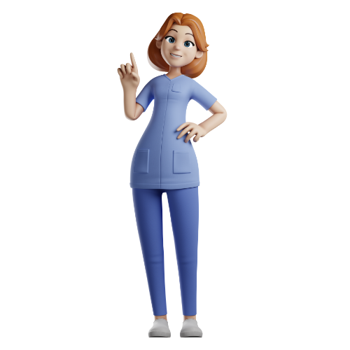
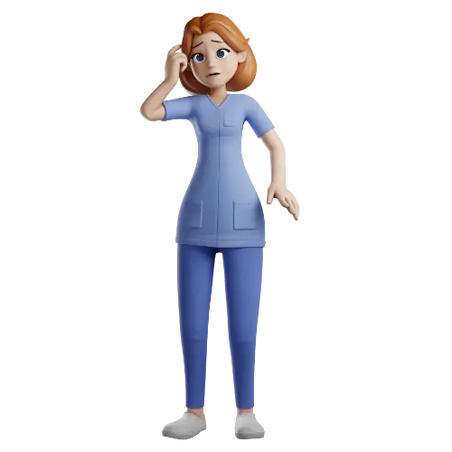
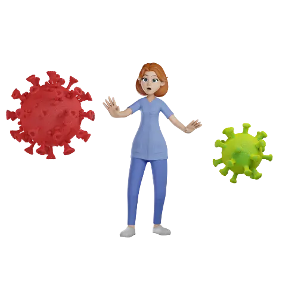
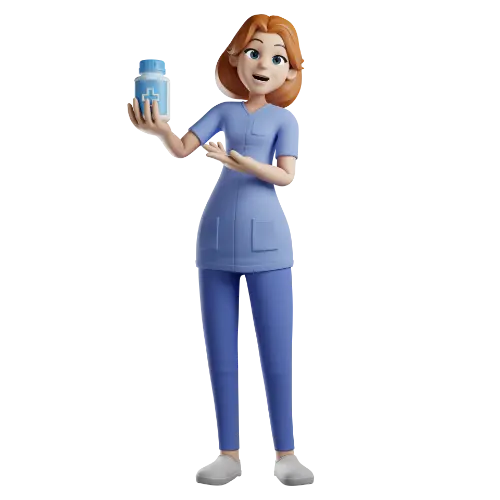
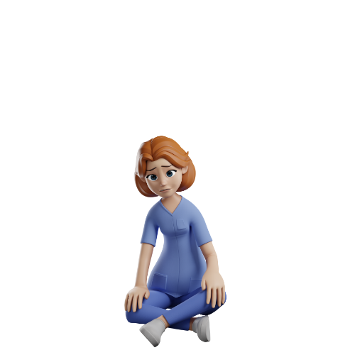
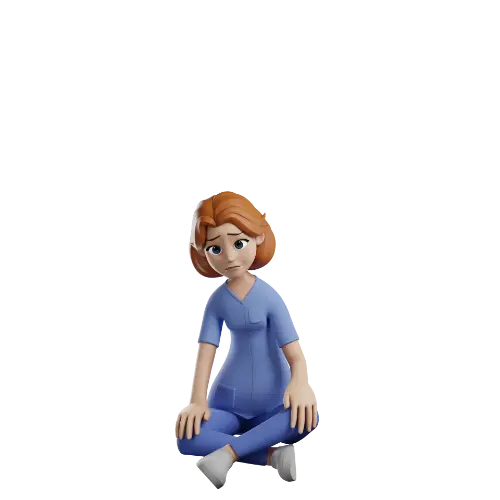

# 🖼️ 素材分類：3D Characternurse

> [🏠 主目錄](../../../README.md) / [images](../../README.md) / [3Ds](../README.md) / **3D Characternurse**

本目錄共有 `30` 個檔案

| 🎨 預覽 (點擊放大)  | 📋 檔案詳細資訊與連結 |
| :--- | :--- |
|  | **📂 檔名:** `3d_CharacterNurse-1-af.webp` 🖼️ **尺寸:** `500x500 px` ⚖️ **大小:** `9.31KB` 📅 **更新:** `2026-03-03`  🚀 **jsDelivr Markdown:** `` 🔗 **直接連結 (Url):** <code>https://cdn.jsdelivr.net/gh/barry028/materials@main/images/3Ds/3D%20Characternurse/3d_CharacterNurse-1-af.webp</code> 📥 [檢視原始檔](3d_CharacterNurse-1-af.webp) |
|  | **📂 檔名:** `3d_CharacterNurse-1-b9.png` 🖼️ **尺寸:** `500x500 px` ⚖️ **大小:** `66.61KB` 📅 **更新:** `2026-03-03`  🚀 **jsDelivr Markdown:** `` 🔗 **直接連結 (Url):** <code>https://cdn.jsdelivr.net/gh/barry028/materials@main/images/3Ds/3D%20Characternurse/3d_CharacterNurse-1-b9.png</code> 📥 [檢視原始檔](3d_CharacterNurse-1-b9.png) |
|  | **📂 檔名:** `3d_CharacterNurse-10-73.webp` 🖼️ **尺寸:** `500x500 px` ⚖️ **大小:** `10.33KB` 📅 **更新:** `2026-03-03`  🚀 **jsDelivr Markdown:** `` 🔗 **直接連結 (Url):** <code>https://cdn.jsdelivr.net/gh/barry028/materials@main/images/3Ds/3D%20Characternurse/3d_CharacterNurse-10-73.webp</code> 📥 [檢視原始檔](3d_CharacterNurse-10-73.webp) |
|  | **📂 檔名:** `3d_CharacterNurse-10-92.png` 🖼️ **尺寸:** `500x500 px` ⚖️ **大小:** `68.37KB` 📅 **更新:** `2026-03-03`  🚀 **jsDelivr Markdown:** `` 🔗 **直接連結 (Url):** <code>https://cdn.jsdelivr.net/gh/barry028/materials@main/images/3Ds/3D%20Characternurse/3d_CharacterNurse-10-92.png</code> 📥 [檢視原始檔](3d_CharacterNurse-10-92.png) |
|  | **📂 檔名:** `3d_CharacterNurse-11-e5.webp` 🖼️ **尺寸:** `500x500 px` ⚖️ **大小:** `8.82KB` 📅 **更新:** `2026-03-03`  🚀 **jsDelivr Markdown:** `` 🔗 **直接連結 (Url):** <code>https://cdn.jsdelivr.net/gh/barry028/materials@main/images/3Ds/3D%20Characternurse/3d_CharacterNurse-11-e5.webp</code> 📥 [檢視原始檔](3d_CharacterNurse-11-e5.webp) |
|  | **📂 檔名:** `3d_CharacterNurse-11-f8.png` 🖼️ **尺寸:** `500x500 px` ⚖️ **大小:** `54.80KB` 📅 **更新:** `2026-03-03`  🚀 **jsDelivr Markdown:** `` 🔗 **直接連結 (Url):** <code>https://cdn.jsdelivr.net/gh/barry028/materials@main/images/3Ds/3D%20Characternurse/3d_CharacterNurse-11-f8.png</code> 📥 [檢視原始檔](3d_CharacterNurse-11-f8.png) |
|  | **📂 檔名:** `3d_CharacterNurse-12-53.png` 🖼️ **尺寸:** `500x500 px` ⚖️ **大小:** `60.51KB` 📅 **更新:** `2026-03-03`  🚀 **jsDelivr Markdown:** `` 🔗 **直接連結 (Url):** <code>https://cdn.jsdelivr.net/gh/barry028/materials@main/images/3Ds/3D%20Characternurse/3d_CharacterNurse-12-53.png</code> 📥 [檢視原始檔](3d_CharacterNurse-12-53.png) |
|  | **📂 檔名:** `3d_CharacterNurse-12-f6.webp` 🖼️ **尺寸:** `500x500 px` ⚖️ **大小:** `8.69KB` 📅 **更新:** `2026-03-03`  🚀 **jsDelivr Markdown:** `` 🔗 **直接連結 (Url):** <code>https://cdn.jsdelivr.net/gh/barry028/materials@main/images/3Ds/3D%20Characternurse/3d_CharacterNurse-12-f6.webp</code> 📥 [檢視原始檔](3d_CharacterNurse-12-f6.webp) |
|  | **📂 檔名:** `3d_CharacterNurse-13-36.png` 🖼️ **尺寸:** `500x500 px` ⚖️ **大小:** `63.06KB` 📅 **更新:** `2026-03-03`  🚀 **jsDelivr Markdown:** `` 🔗 **直接連結 (Url):** <code>https://cdn.jsdelivr.net/gh/barry028/materials@main/images/3Ds/3D%20Characternurse/3d_CharacterNurse-13-36.png</code> 📥 [檢視原始檔](3d_CharacterNurse-13-36.png) |
|  | **📂 檔名:** `3d_CharacterNurse-13-c3.webp` 🖼️ **尺寸:** `500x500 px` ⚖️ **大小:** `9.84KB` 📅 **更新:** `2026-03-03`  🚀 **jsDelivr Markdown:** `` 🔗 **直接連結 (Url):** <code>https://cdn.jsdelivr.net/gh/barry028/materials@main/images/3Ds/3D%20Characternurse/3d_CharacterNurse-13-c3.webp</code> 📥 [檢視原始檔](3d_CharacterNurse-13-c3.webp) |
|  | **📂 檔名:** `3d_CharacterNurse-14-88.png` 🖼️ **尺寸:** `500x500 px` ⚖️ **大小:** `61.29KB` 📅 **更新:** `2026-03-03`  🚀 **jsDelivr Markdown:** `` 🔗 **直接連結 (Url):** <code>https://cdn.jsdelivr.net/gh/barry028/materials@main/images/3Ds/3D%20Characternurse/3d_CharacterNurse-14-88.png</code> 📥 [檢視原始檔](3d_CharacterNurse-14-88.png) |
|  | **📂 檔名:** `3d_CharacterNurse-14-c8.webp` 🖼️ **尺寸:** `500x500 px` ⚖️ **大小:** `9.97KB` 📅 **更新:** `2026-03-03`  🚀 **jsDelivr Markdown:** `` 🔗 **直接連結 (Url):** <code>https://cdn.jsdelivr.net/gh/barry028/materials@main/images/3Ds/3D%20Characternurse/3d_CharacterNurse-14-c8.webp</code> 📥 [檢視原始檔](3d_CharacterNurse-14-c8.webp) |
|  | **📂 檔名:** `3d_CharacterNurse-15-92.webp` 🖼️ **尺寸:** `500x500 px` ⚖️ **大小:** `10.06KB` 📅 **更新:** `2026-03-03`  🚀 **jsDelivr Markdown:** `` 🔗 **直接連結 (Url):** <code>https://cdn.jsdelivr.net/gh/barry028/materials@main/images/3Ds/3D%20Characternurse/3d_CharacterNurse-15-92.webp</code> 📥 [檢視原始檔](3d_CharacterNurse-15-92.webp) |
|  | **📂 檔名:** `3d_CharacterNurse-15-ec.png` 🖼️ **尺寸:** `500x500 px` ⚖️ **大小:** `66.93KB` 📅 **更新:** `2026-03-03`  🚀 **jsDelivr Markdown:** `` 🔗 **直接連結 (Url):** <code>https://cdn.jsdelivr.net/gh/barry028/materials@main/images/3Ds/3D%20Characternurse/3d_CharacterNurse-15-ec.png</code> 📥 [檢視原始檔](3d_CharacterNurse-15-ec.png) |
|  | **📂 檔名:** `3d_CharacterNurse-2-2c.png` 🖼️ **尺寸:** `500x500 px` ⚖️ **大小:** `63.55KB` 📅 **更新:** `2026-03-03`  🚀 **jsDelivr Markdown:** `` 🔗 **直接連結 (Url):** <code>https://cdn.jsdelivr.net/gh/barry028/materials@main/images/3Ds/3D%20Characternurse/3d_CharacterNurse-2-2c.png</code> 📥 [檢視原始檔](3d_CharacterNurse-2-2c.png) |
|  | **📂 檔名:** `3d_CharacterNurse-2-e0.webp` 🖼️ **尺寸:** `500x500 px` ⚖️ **大小:** `9.17KB` 📅 **更新:** `2026-03-03`  🚀 **jsDelivr Markdown:** `` 🔗 **直接連結 (Url):** <code>https://cdn.jsdelivr.net/gh/barry028/materials@main/images/3Ds/3D%20Characternurse/3d_CharacterNurse-2-e0.webp</code> 📥 [檢視原始檔](3d_CharacterNurse-2-e0.webp) |
|  | **📂 檔名:** `3d_CharacterNurse-3-24.png` 🖼️ **尺寸:** `500x500 px` ⚖️ **大小:** `65.11KB` 📅 **更新:** `2026-03-03`  🚀 **jsDelivr Markdown:** `` 🔗 **直接連結 (Url):** <code>https://cdn.jsdelivr.net/gh/barry028/materials@main/images/3Ds/3D%20Characternurse/3d_CharacterNurse-3-24.png</code> 📥 [檢視原始檔](3d_CharacterNurse-3-24.png) |
|  | **📂 檔名:** `3d_CharacterNurse-3-45.webp` 🖼️ **尺寸:** `500x500 px` ⚖️ **大小:** `9.51KB` 📅 **更新:** `2026-03-03`  🚀 **jsDelivr Markdown:** `` 🔗 **直接連結 (Url):** <code>https://cdn.jsdelivr.net/gh/barry028/materials@main/images/3Ds/3D%20Characternurse/3d_CharacterNurse-3-45.webp</code> 📥 [檢視原始檔](3d_CharacterNurse-3-45.webp) |
|  | **📂 檔名:** `3d_CharacterNurse-4-b4.png` 🖼️ **尺寸:** `500x500 px` ⚖️ **大小:** `82.60KB` 📅 **更新:** `2026-03-03`  🚀 **jsDelivr Markdown:** `` 🔗 **直接連結 (Url):** <code>https://cdn.jsdelivr.net/gh/barry028/materials@main/images/3Ds/3D%20Characternurse/3d_CharacterNurse-4-b4.png</code> 📥 [檢視原始檔](3d_CharacterNurse-4-b4.png) |
|  | **📂 檔名:** `3d_CharacterNurse-4-fc.webp` 🖼️ **尺寸:** `500x500 px` ⚖️ **大小:** `13.68KB` 📅 **更新:** `2026-03-03`  🚀 **jsDelivr Markdown:** `` 🔗 **直接連結 (Url):** <code>https://cdn.jsdelivr.net/gh/barry028/materials@main/images/3Ds/3D%20Characternurse/3d_CharacterNurse-4-fc.webp</code> 📥 [檢視原始檔](3d_CharacterNurse-4-fc.webp) |
|  | **📂 檔名:** `3d_CharacterNurse-5-45.png` 🖼️ **尺寸:** `500x500 px` ⚖️ **大小:** `58.54KB` 📅 **更新:** `2026-03-03`  🚀 **jsDelivr Markdown:** `` 🔗 **直接連結 (Url):** <code>https://cdn.jsdelivr.net/gh/barry028/materials@main/images/3Ds/3D%20Characternurse/3d_CharacterNurse-5-45.png</code> 📥 [檢視原始檔](3d_CharacterNurse-5-45.png) |
|  | **📂 檔名:** `3d_CharacterNurse-5-d0.webp` 🖼️ **尺寸:** `500x500 px` ⚖️ **大小:** `8.33KB` 📅 **更新:** `2026-03-03`  🚀 **jsDelivr Markdown:** `` 🔗 **直接連結 (Url):** <code>https://cdn.jsdelivr.net/gh/barry028/materials@main/images/3Ds/3D%20Characternurse/3d_CharacterNurse-5-d0.webp</code> 📥 [檢視原始檔](3d_CharacterNurse-5-d0.webp) |
|  | **📂 檔名:** `3d_CharacterNurse-6-7c.webp` 🖼️ **尺寸:** `500x500 px` ⚖️ **大小:** `10.46KB` 📅 **更新:** `2026-03-03`  🚀 **jsDelivr Markdown:** `` 🔗 **直接連結 (Url):** <code>https://cdn.jsdelivr.net/gh/barry028/materials@main/images/3Ds/3D%20Characternurse/3d_CharacterNurse-6-7c.webp</code> 📥 [檢視原始檔](3d_CharacterNurse-6-7c.webp) |
|  | **📂 檔名:** `3d_CharacterNurse-6-fc.png` 🖼️ **尺寸:** `500x500 px` ⚖️ **大小:** `70.88KB` 📅 **更新:** `2026-03-03`  🚀 **jsDelivr Markdown:** `` 🔗 **直接連結 (Url):** <code>https://cdn.jsdelivr.net/gh/barry028/materials@main/images/3Ds/3D%20Characternurse/3d_CharacterNurse-6-fc.png</code> 📥 [檢視原始檔](3d_CharacterNurse-6-fc.png) |
|  | **📂 檔名:** `3d_CharacterNurse-7-3b.png` 🖼️ **尺寸:** `500x500 px` ⚖️ **大小:** `66.29KB` 📅 **更新:** `2026-03-03`  🚀 **jsDelivr Markdown:** `` 🔗 **直接連結 (Url):** <code>https://cdn.jsdelivr.net/gh/barry028/materials@main/images/3Ds/3D%20Characternurse/3d_CharacterNurse-7-3b.png</code> 📥 [檢視原始檔](3d_CharacterNurse-7-3b.png) |
|  | **📂 檔名:** `3d_CharacterNurse-7-e1.webp` 🖼️ **尺寸:** `500x500 px` ⚖️ **大小:** `9.88KB` 📅 **更新:** `2026-03-03`  🚀 **jsDelivr Markdown:** `` 🔗 **直接連結 (Url):** <code>https://cdn.jsdelivr.net/gh/barry028/materials@main/images/3Ds/3D%20Characternurse/3d_CharacterNurse-7-e1.webp</code> 📥 [檢視原始檔](3d_CharacterNurse-7-e1.webp) |
|  | **📂 檔名:** `3d_CharacterNurse-8-53.png` 🖼️ **尺寸:** `500x500 px` ⚖️ **大小:** `53.08KB` 📅 **更新:** `2026-03-03`  🚀 **jsDelivr Markdown:** `` 🔗 **直接連結 (Url):** <code>https://cdn.jsdelivr.net/gh/barry028/materials@main/images/3Ds/3D%20Characternurse/3d_CharacterNurse-8-53.png</code> 📥 [檢視原始檔](3d_CharacterNurse-8-53.png) |
|  | **📂 檔名:** `3d_CharacterNurse-8-77.webp` 🖼️ **尺寸:** `500x500 px` ⚖️ **大小:** `7.26KB` 📅 **更新:** `2026-03-03`  🚀 **jsDelivr Markdown:** `` 🔗 **直接連結 (Url):** <code>https://cdn.jsdelivr.net/gh/barry028/materials@main/images/3Ds/3D%20Characternurse/3d_CharacterNurse-8-77.webp</code> 📥 [檢視原始檔](3d_CharacterNurse-8-77.webp) |
|  | **📂 檔名:** `3d_CharacterNurse-9-7a.png` 🖼️ **尺寸:** `500x500 px` ⚖️ **大小:** `56.91KB` 📅 **更新:** `2026-03-03`  🚀 **jsDelivr Markdown:** `` 🔗 **直接連結 (Url):** <code>https://cdn.jsdelivr.net/gh/barry028/materials@main/images/3Ds/3D%20Characternurse/3d_CharacterNurse-9-7a.png</code> 📥 [檢視原始檔](3d_CharacterNurse-9-7a.png) |
|  | **📂 檔名:** `3d_CharacterNurse-9-82.webp` 🖼️ **尺寸:** `500x500 px` ⚖️ **大小:** `8.60KB` 📅 **更新:** `2026-03-03`  🚀 **jsDelivr Markdown:** `` 🔗 **直接連結 (Url):** <code>https://cdn.jsdelivr.net/gh/barry028/materials@main/images/3Ds/3D%20Characternurse/3d_CharacterNurse-9-82.webp</code> 📥 [檢視原始檔](3d_CharacterNurse-9-82.webp) |