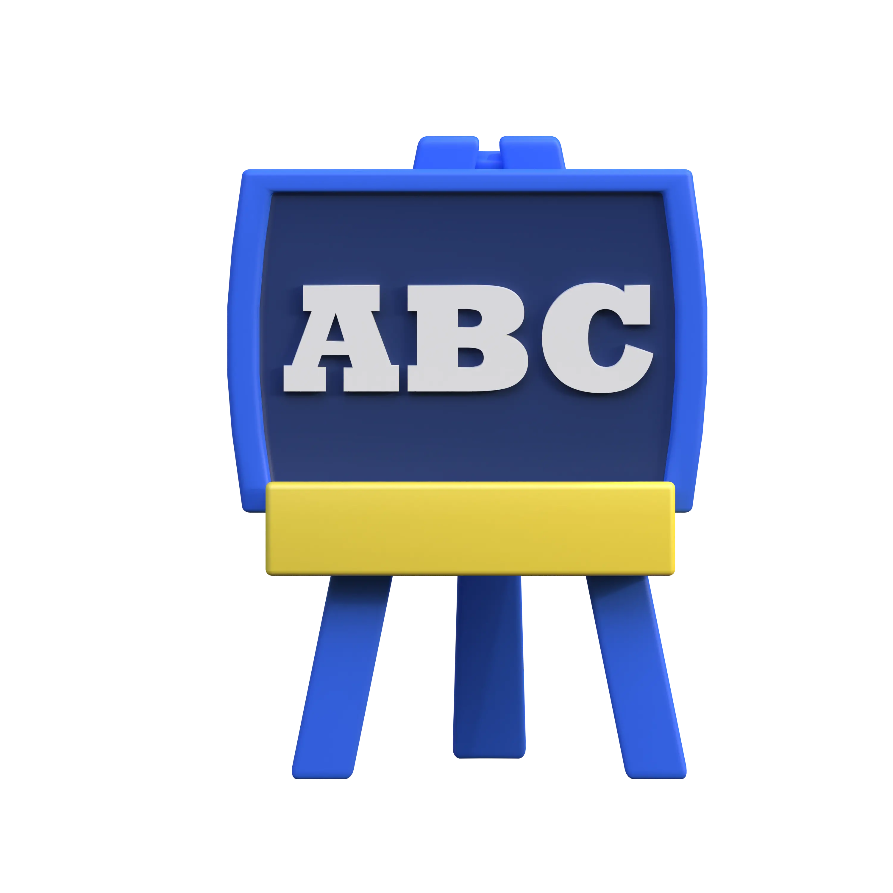
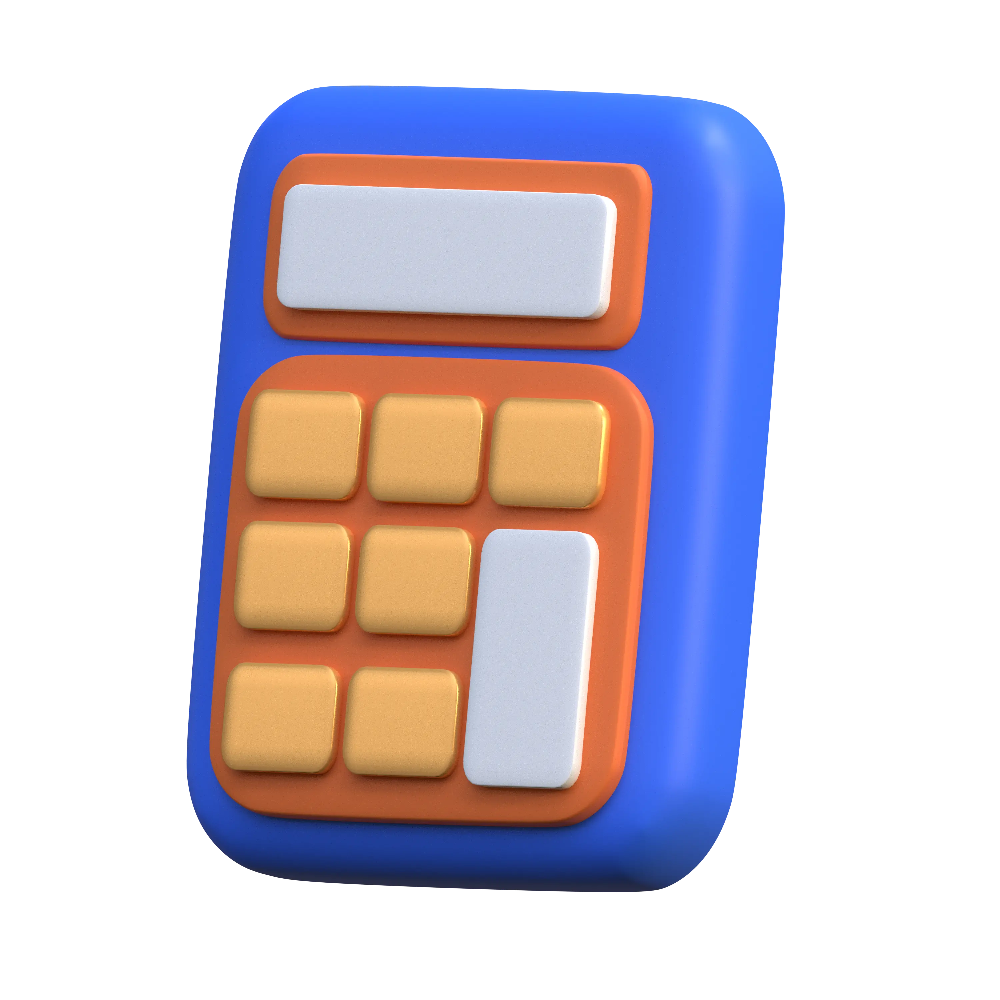
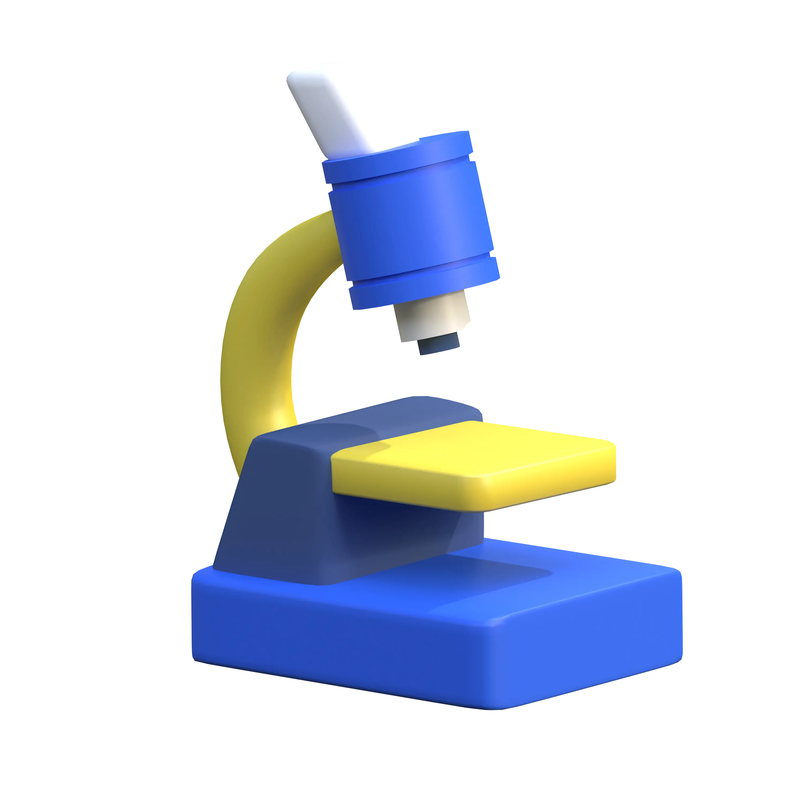

# 🖼️ 素材分類：3D Education

> [🏠 主目錄](../../../README.md) / [images](../../README.md) / [3Ds](../README.md) / **3D Education**

本目錄共有 `22` 個檔案

| 🎨 預覽 (點擊放大)  | 📋 檔案詳細資訊與連結 |
| :--- | :--- |
|  | **📂 檔名:** `BackPack-60.webp` 🖼️ **尺寸:** `3000x3000 px` ⚖️ **大小:** `81.25KB` 📅 **更新:** `2026-03-03`  🚀 **jsDelivr Markdown:** `` 🔗 **直接連結 (Url):** <code>https://cdn.jsdelivr.net/gh/barry028/materials@main/images/3Ds/3D%20Education/BackPack-60.webp</code> 📥 [檢視原始檔](BackPack-60.webp) |
|  | **📂 檔名:** `BackPack-b3.png` 🖼️ **尺寸:** `3000x3000 px` ⚖️ **大小:** `15.80MB` 📅 **更新:** `2026-03-03`  🚀 **jsDelivr Markdown:** `` 🔗 **直接連結 (Url):** <code>https://cdn.jsdelivr.net/gh/barry028/materials@main/images/3Ds/3D%20Education/BackPack-b3.png</code> 📥 [檢視原始檔](BackPack-b3.png) |
|  | **📂 檔名:** `BlackBoard-8c.webp` 🖼️ **尺寸:** `3000x3000 px` ⚖️ **大小:** `74.36KB` 📅 **更新:** `2026-03-03`  🚀 **jsDelivr Markdown:** `` 🔗 **直接連結 (Url):** <code>https://cdn.jsdelivr.net/gh/barry028/materials@main/images/3Ds/3D%20Education/BlackBoard-8c.webp</code> 📥 [檢視原始檔](BlackBoard-8c.webp) |
|  | **📂 檔名:** `BlackBoard-da.png` 🖼️ **尺寸:** `3000x3000 px` ⚖️ **大小:** `10.90MB` 📅 **更新:** `2026-03-03`  🚀 **jsDelivr Markdown:** `` 🔗 **直接連結 (Url):** <code>https://cdn.jsdelivr.net/gh/barry028/materials@main/images/3Ds/3D%20Education/BlackBoard-da.png</code> 📥 [檢視原始檔](BlackBoard-da.png) |
|  | **📂 檔名:** `Brush-69.png` 🖼️ **尺寸:** `3000x3000 px` ⚖️ **大小:** `10.28MB` 📅 **更新:** `2026-03-03`  🚀 **jsDelivr Markdown:** `` 🔗 **直接連結 (Url):** <code>https://cdn.jsdelivr.net/gh/barry028/materials@main/images/3Ds/3D%20Education/Brush-69.png</code> 📥 [檢視原始檔](Brush-69.png) |
|  | **📂 檔名:** `Brush-b7.webp` 🖼️ **尺寸:** `3000x3000 px` ⚖️ **大小:** `80.04KB` 📅 **更新:** `2026-03-03`  🚀 **jsDelivr Markdown:** `` 🔗 **直接連結 (Url):** <code>https://cdn.jsdelivr.net/gh/barry028/materials@main/images/3Ds/3D%20Education/Brush-b7.webp</code> 📥 [檢視原始檔](Brush-b7.webp) |
|  | **📂 檔名:** `Calculator-19.png` 🖼️ **尺寸:** `3000x3000 px` ⚖️ **大小:** `23.08MB` 📅 **更新:** `2026-03-03`  🚀 **jsDelivr Markdown:** `` 🔗 **直接連結 (Url):** <code>https://cdn.jsdelivr.net/gh/barry028/materials@main/images/3Ds/3D%20Education/Calculator-19.png</code> 📥 [檢視原始檔](Calculator-19.png) |
|  | **📂 檔名:** `Calculator-89.webp` 🖼️ **尺寸:** `3000x3000 px` ⚖️ **大小:** `177.73KB` 📅 **更新:** `2026-03-03`  🚀 **jsDelivr Markdown:** `` 🔗 **直接連結 (Url):** <code>https://cdn.jsdelivr.net/gh/barry028/materials@main/images/3Ds/3D%20Education/Calculator-89.webp</code> 📥 [檢視原始檔](Calculator-89.webp) |
|  | **📂 檔名:** `Education Certificate-15.webp` 🖼️ **尺寸:** `3000x3000 px` ⚖️ **大小:** `141.17KB` 📅 **更新:** `2026-03-03`  🚀 **jsDelivr Markdown:** `` 🔗 **直接連結 (Url):** <code>https://cdn.jsdelivr.net/gh/barry028/materials@main/images/3Ds/3D%20Education/Education%20Certificate-15.webp</code> 📥 [檢視原始檔](Education%20Certificate-15.webp) |
|  | **📂 檔名:** `Education Certificate-c3.png` 🖼️ **尺寸:** `3000x3000 px` ⚖️ **大小:** `19.72MB` 📅 **更新:** `2026-03-03`  🚀 **jsDelivr Markdown:** `` 🔗 **直接連結 (Url):** <code>https://cdn.jsdelivr.net/gh/barry028/materials@main/images/3Ds/3D%20Education/Education%20Certificate-c3.png</code> 📥 [檢視原始檔](Education%20Certificate-c3.png) |
|  | **📂 檔名:** `Education Trophy-8b.png` 🖼️ **尺寸:** `3000x3000 px` ⚖️ **大小:** `13.99MB` 📅 **更新:** `2026-03-03`  🚀 **jsDelivr Markdown:** `` 🔗 **直接連結 (Url):** <code>https://cdn.jsdelivr.net/gh/barry028/materials@main/images/3Ds/3D%20Education/Education%20Trophy-8b.png</code> 📥 [檢視原始檔](Education%20Trophy-8b.png) |
|  | **📂 檔名:** `Education Trophy-bd.webp` 🖼️ **尺寸:** `3000x3000 px` ⚖️ **大小:** `133.41KB` 📅 **更新:** `2026-03-03`  🚀 **jsDelivr Markdown:** `` 🔗 **直接連結 (Url):** <code>https://cdn.jsdelivr.net/gh/barry028/materials@main/images/3Ds/3D%20Education/Education%20Trophy-bd.webp</code> 📥 [檢視原始檔](Education%20Trophy-bd.webp) |
|  | **📂 檔名:** `Grauduation Hat-65.png` 🖼️ **尺寸:** `3000x3000 px` ⚖️ **大小:** `12.55MB` 📅 **更新:** `2026-03-03`  🚀 **jsDelivr Markdown:** `` 🔗 **直接連結 (Url):** <code>https://cdn.jsdelivr.net/gh/barry028/materials@main/images/3Ds/3D%20Education/Grauduation%20Hat-65.png</code> 📥 [檢視原始檔](Grauduation%20Hat-65.png) |
|  | **📂 檔名:** `Grauduation Hat-f5.webp` 🖼️ **尺寸:** `3000x3000 px` ⚖️ **大小:** `111.40KB` 📅 **更新:** `2026-03-03`  🚀 **jsDelivr Markdown:** `` 🔗 **直接連結 (Url):** <code>https://cdn.jsdelivr.net/gh/barry028/materials@main/images/3Ds/3D%20Education/Grauduation%20Hat-f5.webp</code> 📥 [檢視原始檔](Grauduation%20Hat-f5.webp) |
|  | **📂 檔名:** `Knowledge-e1.png` 🖼️ **尺寸:** `3000x3000 px` ⚖️ **大小:** `12.83MB` 📅 **更新:** `2026-03-03`  🚀 **jsDelivr Markdown:** `` 🔗 **直接連結 (Url):** <code>https://cdn.jsdelivr.net/gh/barry028/materials@main/images/3Ds/3D%20Education/Knowledge-e1.png</code> 📥 [檢視原始檔](Knowledge-e1.png) |
|  | **📂 檔名:** `Knowledge-ef.webp` 🖼️ **尺寸:** `3000x3000 px` ⚖️ **大小:** `154.96KB` 📅 **更新:** `2026-03-03`  🚀 **jsDelivr Markdown:** `` 🔗 **直接連結 (Url):** <code>https://cdn.jsdelivr.net/gh/barry028/materials@main/images/3Ds/3D%20Education/Knowledge-ef.webp</code> 📥 [檢視原始檔](Knowledge-ef.webp) |
|  | **📂 檔名:** `Medal-b4.webp` 🖼️ **尺寸:** `3000x3000 px` ⚖️ **大小:** `78.83KB` 📅 **更新:** `2026-03-03`  🚀 **jsDelivr Markdown:** `` 🔗 **直接連結 (Url):** <code>https://cdn.jsdelivr.net/gh/barry028/materials@main/images/3Ds/3D%20Education/Medal-b4.webp</code> 📥 [檢視原始檔](Medal-b4.webp) |
|  | **📂 檔名:** `Medal-cd.png` 🖼️ **尺寸:** `3000x3000 px` ⚖️ **大小:** `13.27MB` 📅 **更新:** `2026-03-03`  🚀 **jsDelivr Markdown:** `` 🔗 **直接連結 (Url):** <code>https://cdn.jsdelivr.net/gh/barry028/materials@main/images/3Ds/3D%20Education/Medal-cd.png</code> 📥 [檢視原始檔](Medal-cd.png) |
|  | **📂 檔名:** `Microscope-80.png` 🖼️ **尺寸:** `3000x3000 px` ⚖️ **大小:** `9.70MB` 📅 **更新:** `2026-03-03`  🚀 **jsDelivr Markdown:** `` 🔗 **直接連結 (Url):** <code>https://cdn.jsdelivr.net/gh/barry028/materials@main/images/3Ds/3D%20Education/Microscope-80.png</code> 📥 [檢視原始檔](Microscope-80.png) |
|  | **📂 檔名:** `Microscope-b7.webp` 🖼️ **尺寸:** `3000x3000 px` ⚖️ **大小:** `82.50KB` 📅 **更新:** `2026-03-03`  🚀 **jsDelivr Markdown:** `` 🔗 **直接連結 (Url):** <code>https://cdn.jsdelivr.net/gh/barry028/materials@main/images/3Ds/3D%20Education/Microscope-b7.webp</code> 📥 [檢視原始檔](Microscope-b7.webp) |
|  | **📂 檔名:** `Pencil And Ruller-06.webp` 🖼️ **尺寸:** `3000x3000 px` ⚖️ **大小:** `116.73KB` 📅 **更新:** `2026-03-03`  🚀 **jsDelivr Markdown:** `` 🔗 **直接連結 (Url):** <code>https://cdn.jsdelivr.net/gh/barry028/materials@main/images/3Ds/3D%20Education/Pencil%20And%20Ruller-06.webp</code> 📥 [檢視原始檔](Pencil%20And%20Ruller-06.webp) |
|  | **📂 檔名:** `Pencil And Ruller-d5.png` 🖼️ **尺寸:** `3000x3000 px` ⚖️ **大小:** `14.75MB` 📅 **更新:** `2026-03-03`  🚀 **jsDelivr Markdown:** `` 🔗 **直接連結 (Url):** <code>https://cdn.jsdelivr.net/gh/barry028/materials@main/images/3Ds/3D%20Education/Pencil%20And%20Ruller-d5.png</code> 📥 [檢視原始檔](Pencil%20And%20Ruller-d5.png) |