# 🖼️ 素材分類：3D Finacially

> [🏠 主目錄](../../../README.md) / [images](../../README.md) / [3Ds](../README.md) / **3D Finacially**

本目錄共有 `76` 個檔案

| 🎨 預覽 (點擊放大)  | 📋 檔案詳細資訊與連結 |
| :--- | :--- |
| <a href="3d-Icon-finacially-01-19.webp">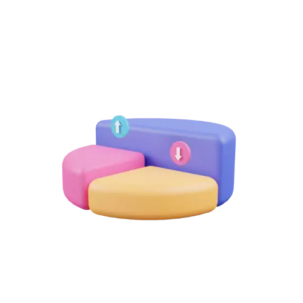</a> | **📂 檔名:** `3d-Icon-finacially-01-19.webp` 🖼️ **尺寸:** `500x500 px` ⚖️ **大小:** `5.37KB` 📅 **更新:** `2026-03-01`  🚀 **jsDelivr Markdown:** `` 🔗 **直接連結 (Url):** <code>https://cdn.jsdelivr.net/gh/barry028/materials@main/images/3Ds/3D%20Finacially/3d-Icon-finacially-01-19.webp</code> 📥 [檢視原始檔](3d-Icon-finacially-01-19.webp) |
| <a href="3d-Icon-finacially-01-b2.png">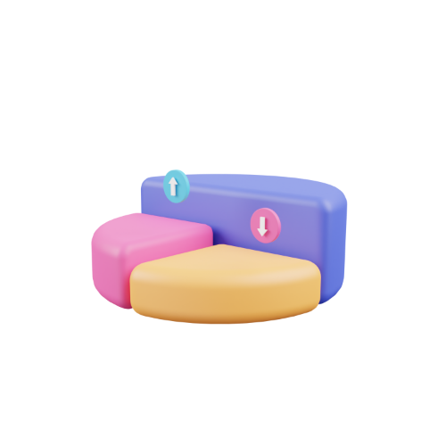</a> | **📂 檔名:** `3d-Icon-finacially-01-b2.png` 🖼️ **尺寸:** `500x500 px` ⚖️ **大小:** `41.06KB` 📅 **更新:** `2026-03-01`  🚀 **jsDelivr Markdown:** `` 🔗 **直接連結 (Url):** <code>https://cdn.jsdelivr.net/gh/barry028/materials@main/images/3Ds/3D%20Finacially/3d-Icon-finacially-01-b2.png</code> 📥 [檢視原始檔](3d-Icon-finacially-01-b2.png) |
|  | **📂 檔名:** `3d-Icon-finacially-010-8e.png` 🖼️ **尺寸:** `500x500 px` ⚖️ **大小:** `84.70KB` 📅 **更新:** `2026-03-01`  🚀 **jsDelivr Markdown:** `` 🔗 **直接連結 (Url):** <code>https://cdn.jsdelivr.net/gh/barry028/materials@main/images/3Ds/3D%20Finacially/3d-Icon-finacially-010-8e.png</code> 📥 [檢視原始檔](3d-Icon-finacially-010-8e.png) |
|  | **📂 檔名:** `3d-Icon-finacially-010-c7.webp` 🖼️ **尺寸:** `500x500 px` ⚖️ **大小:** `9.28KB` 📅 **更新:** `2026-03-01`  🚀 **jsDelivr Markdown:** `` 🔗 **直接連結 (Url):** <code>https://cdn.jsdelivr.net/gh/barry028/materials@main/images/3Ds/3D%20Finacially/3d-Icon-finacially-010-c7.webp</code> 📥 [檢視原始檔](3d-Icon-finacially-010-c7.webp) |
|  | **📂 檔名:** `3d-Icon-finacially-011-5d.webp` 🖼️ **尺寸:** `500x500 px` ⚖️ **大小:** `8.11KB` 📅 **更新:** `2026-03-01`  🚀 **jsDelivr Markdown:** `` 🔗 **直接連結 (Url):** <code>https://cdn.jsdelivr.net/gh/barry028/materials@main/images/3Ds/3D%20Finacially/3d-Icon-finacially-011-5d.webp</code> 📥 [檢視原始檔](3d-Icon-finacially-011-5d.webp) |
|  | **📂 檔名:** `3d-Icon-finacially-011-78.png` 🖼️ **尺寸:** `500x500 px` ⚖️ **大小:** `60.66KB` 📅 **更新:** `2026-03-01`  🚀 **jsDelivr Markdown:** `` 🔗 **直接連結 (Url):** <code>https://cdn.jsdelivr.net/gh/barry028/materials@main/images/3Ds/3D%20Finacially/3d-Icon-finacially-011-78.png</code> 📥 [檢視原始檔](3d-Icon-finacially-011-78.png) |
|  | **📂 檔名:** `3d-Icon-finacially-012-29.webp` 🖼️ **尺寸:** `500x500 px` ⚖️ **大小:** `8.69KB` 📅 **更新:** `2026-03-01`  🚀 **jsDelivr Markdown:** `` 🔗 **直接連結 (Url):** <code>https://cdn.jsdelivr.net/gh/barry028/materials@main/images/3Ds/3D%20Finacially/3d-Icon-finacially-012-29.webp</code> 📥 [檢視原始檔](3d-Icon-finacially-012-29.webp) |
|  | **📂 檔名:** `3d-Icon-finacially-012-6c.png` 🖼️ **尺寸:** `500x500 px` ⚖️ **大小:** `84.94KB` 📅 **更新:** `2026-03-01`  🚀 **jsDelivr Markdown:** `` 🔗 **直接連結 (Url):** <code>https://cdn.jsdelivr.net/gh/barry028/materials@main/images/3Ds/3D%20Finacially/3d-Icon-finacially-012-6c.png</code> 📥 [檢視原始檔](3d-Icon-finacially-012-6c.png) |
|  | **📂 檔名:** `3d-Icon-finacially-013-0c.webp` 🖼️ **尺寸:** `500x500 px` ⚖️ **大小:** `6.31KB` 📅 **更新:** `2026-03-01`  🚀 **jsDelivr Markdown:** `` 🔗 **直接連結 (Url):** <code>https://cdn.jsdelivr.net/gh/barry028/materials@main/images/3Ds/3D%20Finacially/3d-Icon-finacially-013-0c.webp</code> 📥 [檢視原始檔](3d-Icon-finacially-013-0c.webp) |
|  | **📂 檔名:** `3d-Icon-finacially-013-2d.png` 🖼️ **尺寸:** `500x500 px` ⚖️ **大小:** `46.02KB` 📅 **更新:** `2026-03-01`  🚀 **jsDelivr Markdown:** `` 🔗 **直接連結 (Url):** <code>https://cdn.jsdelivr.net/gh/barry028/materials@main/images/3Ds/3D%20Finacially/3d-Icon-finacially-013-2d.png</code> 📥 [檢視原始檔](3d-Icon-finacially-013-2d.png) |
|  | **📂 檔名:** `3d-Icon-finacially-014-68.webp` 🖼️ **尺寸:** `500x500 px` ⚖️ **大小:** `7.54KB` 📅 **更新:** `2026-03-01`  🚀 **jsDelivr Markdown:** `` 🔗 **直接連結 (Url):** <code>https://cdn.jsdelivr.net/gh/barry028/materials@main/images/3Ds/3D%20Finacially/3d-Icon-finacially-014-68.webp</code> 📥 [檢視原始檔](3d-Icon-finacially-014-68.webp) |
|  | **📂 檔名:** `3d-Icon-finacially-014-9e.png` 🖼️ **尺寸:** `500x500 px` ⚖️ **大小:** `58.87KB` 📅 **更新:** `2026-03-01`  🚀 **jsDelivr Markdown:** `` 🔗 **直接連結 (Url):** <code>https://cdn.jsdelivr.net/gh/barry028/materials@main/images/3Ds/3D%20Finacially/3d-Icon-finacially-014-9e.png</code> 📥 [檢視原始檔](3d-Icon-finacially-014-9e.png) |
|  | **📂 檔名:** `3d-Icon-finacially-015-18.png` 🖼️ **尺寸:** `500x500 px` ⚖️ **大小:** `67.74KB` 📅 **更新:** `2026-03-01`  🚀 **jsDelivr Markdown:** `` 🔗 **直接連結 (Url):** <code>https://cdn.jsdelivr.net/gh/barry028/materials@main/images/3Ds/3D%20Finacially/3d-Icon-finacially-015-18.png</code> 📥 [檢視原始檔](3d-Icon-finacially-015-18.png) |
|  | **📂 檔名:** `3d-Icon-finacially-015-b9.webp` 🖼️ **尺寸:** `500x500 px` ⚖️ **大小:** `8.48KB` 📅 **更新:** `2026-03-01`  🚀 **jsDelivr Markdown:** `` 🔗 **直接連結 (Url):** <code>https://cdn.jsdelivr.net/gh/barry028/materials@main/images/3Ds/3D%20Finacially/3d-Icon-finacially-015-b9.webp</code> 📥 [檢視原始檔](3d-Icon-finacially-015-b9.webp) |
|  | **📂 檔名:** `3d-Icon-finacially-016-27.png` 🖼️ **尺寸:** `500x500 px` ⚖️ **大小:** `64.31KB` 📅 **更新:** `2026-03-01`  🚀 **jsDelivr Markdown:** `` 🔗 **直接連結 (Url):** <code>https://cdn.jsdelivr.net/gh/barry028/materials@main/images/3Ds/3D%20Finacially/3d-Icon-finacially-016-27.png</code> 📥 [檢視原始檔](3d-Icon-finacially-016-27.png) |
|  | **📂 檔名:** `3d-Icon-finacially-016-ee.webp` 🖼️ **尺寸:** `500x500 px` ⚖️ **大小:** `7.42KB` 📅 **更新:** `2026-03-01`  🚀 **jsDelivr Markdown:** `` 🔗 **直接連結 (Url):** <code>https://cdn.jsdelivr.net/gh/barry028/materials@main/images/3Ds/3D%20Finacially/3d-Icon-finacially-016-ee.webp</code> 📥 [檢視原始檔](3d-Icon-finacially-016-ee.webp) |
| <a href="3d-Icon-finacially-017-10.png">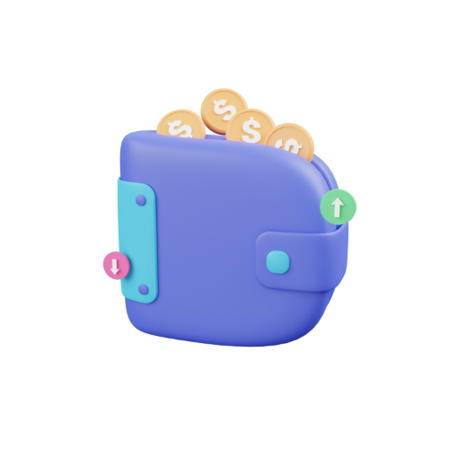</a> | **📂 檔名:** `3d-Icon-finacially-017-10.png` 🖼️ **尺寸:** `500x500 px` ⚖️ **大小:** `58.56KB` 📅 **更新:** `2026-03-01`  🚀 **jsDelivr Markdown:** `` 🔗 **直接連結 (Url):** <code>https://cdn.jsdelivr.net/gh/barry028/materials@main/images/3Ds/3D%20Finacially/3d-Icon-finacially-017-10.png</code> 📥 [檢視原始檔](3d-Icon-finacially-017-10.png) |
| <a href="3d-Icon-finacially-017-43.webp">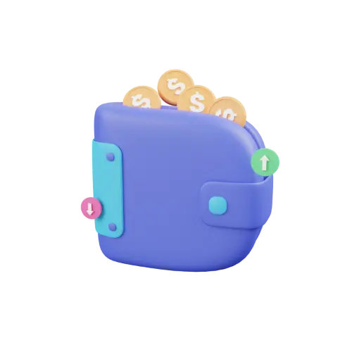</a> | **📂 檔名:** `3d-Icon-finacially-017-43.webp` 🖼️ **尺寸:** `500x500 px` ⚖️ **大小:** `7.10KB` 📅 **更新:** `2026-03-01`  🚀 **jsDelivr Markdown:** `` 🔗 **直接連結 (Url):** <code>https://cdn.jsdelivr.net/gh/barry028/materials@main/images/3Ds/3D%20Finacially/3d-Icon-finacially-017-43.webp</code> 📥 [檢視原始檔](3d-Icon-finacially-017-43.webp) |
|  | **📂 檔名:** `3d-Icon-finacially-018-4a.webp` 🖼️ **尺寸:** `500x500 px` ⚖️ **大小:** `11.62KB` 📅 **更新:** `2026-03-01`  🚀 **jsDelivr Markdown:** `` 🔗 **直接連結 (Url):** <code>https://cdn.jsdelivr.net/gh/barry028/materials@main/images/3Ds/3D%20Finacially/3d-Icon-finacially-018-4a.webp</code> 📥 [檢視原始檔](3d-Icon-finacially-018-4a.webp) |
|  | **📂 檔名:** `3d-Icon-finacially-018-4f.png` 🖼️ **尺寸:** `500x500 px` ⚖️ **大小:** `82.71KB` 📅 **更新:** `2026-03-01`  🚀 **jsDelivr Markdown:** `` 🔗 **直接連結 (Url):** <code>https://cdn.jsdelivr.net/gh/barry028/materials@main/images/3Ds/3D%20Finacially/3d-Icon-finacially-018-4f.png</code> 📥 [檢視原始檔](3d-Icon-finacially-018-4f.png) |
|  | **📂 檔名:** `3d-Icon-finacially-019-71.png` 🖼️ **尺寸:** `500x500 px` ⚖️ **大小:** `59.31KB` 📅 **更新:** `2026-03-01`  🚀 **jsDelivr Markdown:** `` 🔗 **直接連結 (Url):** <code>https://cdn.jsdelivr.net/gh/barry028/materials@main/images/3Ds/3D%20Finacially/3d-Icon-finacially-019-71.png</code> 📥 [檢視原始檔](3d-Icon-finacially-019-71.png) |
|  | **📂 檔名:** `3d-Icon-finacially-019-8f.webp` 🖼️ **尺寸:** `500x500 px` ⚖️ **大小:** `6.24KB` 📅 **更新:** `2026-03-01`  🚀 **jsDelivr Markdown:** `` 🔗 **直接連結 (Url):** <code>https://cdn.jsdelivr.net/gh/barry028/materials@main/images/3Ds/3D%20Finacially/3d-Icon-finacially-019-8f.webp</code> 📥 [檢視原始檔](3d-Icon-finacially-019-8f.webp) |
| <a href="3d-Icon-finacially-02-59.webp">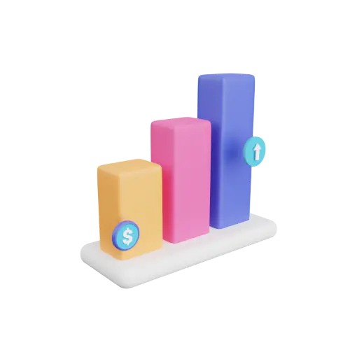</a> | **📂 檔名:** `3d-Icon-finacially-02-59.webp` 🖼️ **尺寸:** `500x500 px` ⚖️ **大小:** `6.41KB` 📅 **更新:** `2026-03-01`  🚀 **jsDelivr Markdown:** `` 🔗 **直接連結 (Url):** <code>https://cdn.jsdelivr.net/gh/barry028/materials@main/images/3Ds/3D%20Finacially/3d-Icon-finacially-02-59.webp</code> 📥 [檢視原始檔](3d-Icon-finacially-02-59.webp) |
|  | **📂 檔名:** `3d-Icon-finacially-02-bc.png` 🖼️ **尺寸:** `500x500 px` ⚖️ **大小:** `46.90KB` 📅 **更新:** `2026-03-01`  🚀 **jsDelivr Markdown:** `` 🔗 **直接連結 (Url):** <code>https://cdn.jsdelivr.net/gh/barry028/materials@main/images/3Ds/3D%20Finacially/3d-Icon-finacially-02-bc.png</code> 📥 [檢視原始檔](3d-Icon-finacially-02-bc.png) |
|  | **📂 檔名:** `3d-Icon-finacially-020-5d.png` 🖼️ **尺寸:** `500x500 px` ⚖️ **大小:** `61.39KB` 📅 **更新:** `2026-03-01`  🚀 **jsDelivr Markdown:** `` 🔗 **直接連結 (Url):** <code>https://cdn.jsdelivr.net/gh/barry028/materials@main/images/3Ds/3D%20Finacially/3d-Icon-finacially-020-5d.png</code> 📥 [檢視原始檔](3d-Icon-finacially-020-5d.png) |
|  | **📂 檔名:** `3d-Icon-finacially-020-95.webp` 🖼️ **尺寸:** `500x500 px` ⚖️ **大小:** `9.07KB` 📅 **更新:** `2026-03-01`  🚀 **jsDelivr Markdown:** `` 🔗 **直接連結 (Url):** <code>https://cdn.jsdelivr.net/gh/barry028/materials@main/images/3Ds/3D%20Finacially/3d-Icon-finacially-020-95.webp</code> 📥 [檢視原始檔](3d-Icon-finacially-020-95.webp) |
| <a href="3d-Icon-finacially-021-ad.webp">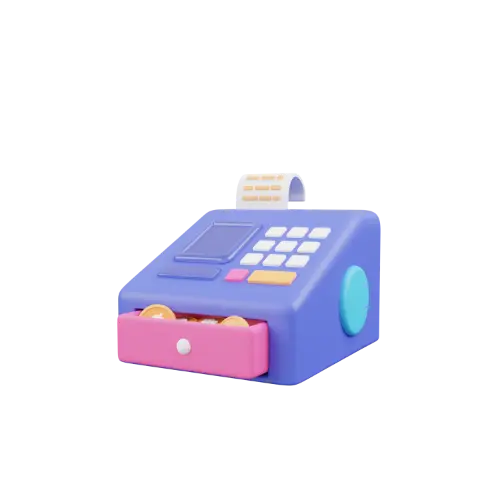</a> | **📂 檔名:** `3d-Icon-finacially-021-ad.webp` 🖼️ **尺寸:** `500x500 px` ⚖️ **大小:** `6.42KB` 📅 **更新:** `2026-03-01`  🚀 **jsDelivr Markdown:** `` 🔗 **直接連結 (Url):** <code>https://cdn.jsdelivr.net/gh/barry028/materials@main/images/3Ds/3D%20Finacially/3d-Icon-finacially-021-ad.webp</code> 📥 [檢視原始檔](3d-Icon-finacially-021-ad.webp) |
|  | **📂 檔名:** `3d-Icon-finacially-021-dd.png` 🖼️ **尺寸:** `500x500 px` ⚖️ **大小:** `48.88KB` 📅 **更新:** `2026-03-01`  🚀 **jsDelivr Markdown:** `` 🔗 **直接連結 (Url):** <code>https://cdn.jsdelivr.net/gh/barry028/materials@main/images/3Ds/3D%20Finacially/3d-Icon-finacially-021-dd.png</code> 📥 [檢視原始檔](3d-Icon-finacially-021-dd.png) |
|  | **📂 檔名:** `3d-Icon-finacially-022-d1.png` 🖼️ **尺寸:** `500x500 px` ⚖️ **大小:** `77.22KB` 📅 **更新:** `2026-03-01`  🚀 **jsDelivr Markdown:** `` 🔗 **直接連結 (Url):** <code>https://cdn.jsdelivr.net/gh/barry028/materials@main/images/3Ds/3D%20Finacially/3d-Icon-finacially-022-d1.png</code> 📥 [檢視原始檔](3d-Icon-finacially-022-d1.png) |
|  | **📂 檔名:** `3d-Icon-finacially-022-dd.webp` 🖼️ **尺寸:** `500x500 px` ⚖️ **大小:** `9.90KB` 📅 **更新:** `2026-03-01`  🚀 **jsDelivr Markdown:** `` 🔗 **直接連結 (Url):** <code>https://cdn.jsdelivr.net/gh/barry028/materials@main/images/3Ds/3D%20Finacially/3d-Icon-finacially-022-dd.webp</code> 📥 [檢視原始檔](3d-Icon-finacially-022-dd.webp) |
|  | **📂 檔名:** `3d-Icon-finacially-023-b1.webp` 🖼️ **尺寸:** `500x500 px` ⚖️ **大小:** `9.71KB` 📅 **更新:** `2026-03-01`  🚀 **jsDelivr Markdown:** `` 🔗 **直接連結 (Url):** <code>https://cdn.jsdelivr.net/gh/barry028/materials@main/images/3Ds/3D%20Finacially/3d-Icon-finacially-023-b1.webp</code> 📥 [檢視原始檔](3d-Icon-finacially-023-b1.webp) |
|  | **📂 檔名:** `3d-Icon-finacially-023-f8.png` 🖼️ **尺寸:** `500x500 px` ⚖️ **大小:** `91.94KB` 📅 **更新:** `2026-03-01`  🚀 **jsDelivr Markdown:** `` 🔗 **直接連結 (Url):** <code>https://cdn.jsdelivr.net/gh/barry028/materials@main/images/3Ds/3D%20Finacially/3d-Icon-finacially-023-f8.png</code> 📥 [檢視原始檔](3d-Icon-finacially-023-f8.png) |
|  | **📂 檔名:** `3d-Icon-finacially-024-06.png` 🖼️ **尺寸:** `500x500 px` ⚖️ **大小:** `82.09KB` 📅 **更新:** `2026-03-01`  🚀 **jsDelivr Markdown:** `` 🔗 **直接連結 (Url):** <code>https://cdn.jsdelivr.net/gh/barry028/materials@main/images/3Ds/3D%20Finacially/3d-Icon-finacially-024-06.png</code> 📥 [檢視原始檔](3d-Icon-finacially-024-06.png) |
|  | **📂 檔名:** `3d-Icon-finacially-024-46.webp` 🖼️ **尺寸:** `500x500 px` ⚖️ **大小:** `11.90KB` 📅 **更新:** `2026-03-01`  🚀 **jsDelivr Markdown:** `` 🔗 **直接連結 (Url):** <code>https://cdn.jsdelivr.net/gh/barry028/materials@main/images/3Ds/3D%20Finacially/3d-Icon-finacially-024-46.webp</code> 📥 [檢視原始檔](3d-Icon-finacially-024-46.webp) |
|  | **📂 檔名:** `3d-Icon-finacially-025-99.png` 🖼️ **尺寸:** `500x500 px` ⚖️ **大小:** `51.94KB` 📅 **更新:** `2026-03-01`  🚀 **jsDelivr Markdown:** `` 🔗 **直接連結 (Url):** <code>https://cdn.jsdelivr.net/gh/barry028/materials@main/images/3Ds/3D%20Finacially/3d-Icon-finacially-025-99.png</code> 📥 [檢視原始檔](3d-Icon-finacially-025-99.png) |
|  | **📂 檔名:** `3d-Icon-finacially-025-ad.webp` 🖼️ **尺寸:** `500x500 px` ⚖️ **大小:** `5.99KB` 📅 **更新:** `2026-03-01`  🚀 **jsDelivr Markdown:** `` 🔗 **直接連結 (Url):** <code>https://cdn.jsdelivr.net/gh/barry028/materials@main/images/3Ds/3D%20Finacially/3d-Icon-finacially-025-ad.webp</code> 📥 [檢視原始檔](3d-Icon-finacially-025-ad.webp) |
| <a href="3d-Icon-finacially-026-27.webp">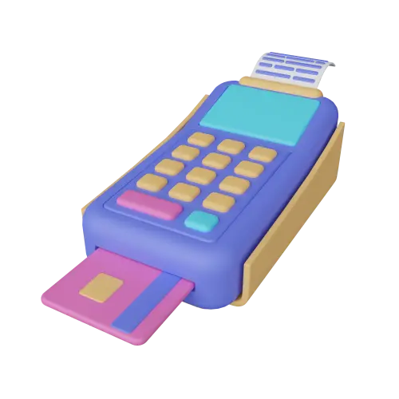</a> | **📂 檔名:** `3d-Icon-finacially-026-27.webp` 🖼️ **尺寸:** `500x500 px` ⚖️ **大小:** `11.38KB` 📅 **更新:** `2026-03-01`  🚀 **jsDelivr Markdown:** `` 🔗 **直接連結 (Url):** <code>https://cdn.jsdelivr.net/gh/barry028/materials@main/images/3Ds/3D%20Finacially/3d-Icon-finacially-026-27.webp</code> 📥 [檢視原始檔](3d-Icon-finacially-026-27.webp) |
|  | **📂 檔名:** `3d-Icon-finacially-026-29.png` 🖼️ **尺寸:** `500x500 px` ⚖️ **大小:** `86.26KB` 📅 **更新:** `2026-03-01`  🚀 **jsDelivr Markdown:** `` 🔗 **直接連結 (Url):** <code>https://cdn.jsdelivr.net/gh/barry028/materials@main/images/3Ds/3D%20Finacially/3d-Icon-finacially-026-29.png</code> 📥 [檢視原始檔](3d-Icon-finacially-026-29.png) |
|  | **📂 檔名:** `3d-Icon-finacially-027-31.webp` 🖼️ **尺寸:** `500x500 px` ⚖️ **大小:** `8.05KB` 📅 **更新:** `2026-03-01`  🚀 **jsDelivr Markdown:** `` 🔗 **直接連結 (Url):** <code>https://cdn.jsdelivr.net/gh/barry028/materials@main/images/3Ds/3D%20Finacially/3d-Icon-finacially-027-31.webp</code> 📥 [檢視原始檔](3d-Icon-finacially-027-31.webp) |
|  | **📂 檔名:** `3d-Icon-finacially-027-be.png` 🖼️ **尺寸:** `500x500 px` ⚖️ **大小:** `70.30KB` 📅 **更新:** `2026-03-01`  🚀 **jsDelivr Markdown:** `` 🔗 **直接連結 (Url):** <code>https://cdn.jsdelivr.net/gh/barry028/materials@main/images/3Ds/3D%20Finacially/3d-Icon-finacially-027-be.png</code> 📥 [檢視原始檔](3d-Icon-finacially-027-be.png) |
|  | **📂 檔名:** `3d-Icon-finacially-028-7b.png` 🖼️ **尺寸:** `500x500 px` ⚖️ **大小:** `51.55KB` 📅 **更新:** `2026-03-01`  🚀 **jsDelivr Markdown:** `` 🔗 **直接連結 (Url):** <code>https://cdn.jsdelivr.net/gh/barry028/materials@main/images/3Ds/3D%20Finacially/3d-Icon-finacially-028-7b.png</code> 📥 [檢視原始檔](3d-Icon-finacially-028-7b.png) |
|  | **📂 檔名:** `3d-Icon-finacially-028-85.webp` 🖼️ **尺寸:** `500x500 px` ⚖️ **大小:** `7.24KB` 📅 **更新:** `2026-03-01`  🚀 **jsDelivr Markdown:** `` 🔗 **直接連結 (Url):** <code>https://cdn.jsdelivr.net/gh/barry028/materials@main/images/3Ds/3D%20Finacially/3d-Icon-finacially-028-85.webp</code> 📥 [檢視原始檔](3d-Icon-finacially-028-85.webp) |
|  | **📂 檔名:** `3d-Icon-finacially-029-59.webp` 🖼️ **尺寸:** `500x500 px` ⚖️ **大小:** `11.13KB` 📅 **更新:** `2026-03-01`  🚀 **jsDelivr Markdown:** `` 🔗 **直接連結 (Url):** <code>https://cdn.jsdelivr.net/gh/barry028/materials@main/images/3Ds/3D%20Finacially/3d-Icon-finacially-029-59.webp</code> 📥 [檢視原始檔](3d-Icon-finacially-029-59.webp) |
|  | **📂 檔名:** `3d-Icon-finacially-029-6a.png` 🖼️ **尺寸:** `500x500 px` ⚖️ **大小:** `71.36KB` 📅 **更新:** `2026-03-01`  🚀 **jsDelivr Markdown:** `` 🔗 **直接連結 (Url):** <code>https://cdn.jsdelivr.net/gh/barry028/materials@main/images/3Ds/3D%20Finacially/3d-Icon-finacially-029-6a.png</code> 📥 [檢視原始檔](3d-Icon-finacially-029-6a.png) |
| <a href="3d-Icon-finacially-03-33.webp">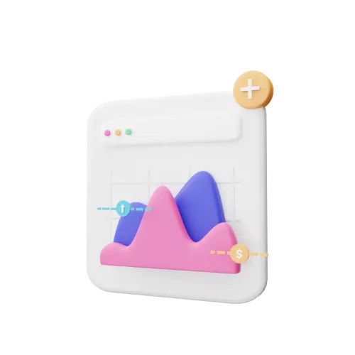</a> | **📂 檔名:** `3d-Icon-finacially-03-33.webp` 🖼️ **尺寸:** `500x500 px` ⚖️ **大小:** `6.07KB` 📅 **更新:** `2026-03-01`  🚀 **jsDelivr Markdown:** `` 🔗 **直接連結 (Url):** <code>https://cdn.jsdelivr.net/gh/barry028/materials@main/images/3Ds/3D%20Finacially/3d-Icon-finacially-03-33.webp</code> 📥 [檢視原始檔](3d-Icon-finacially-03-33.webp) |
| <a href="3d-Icon-finacially-03-fa.png">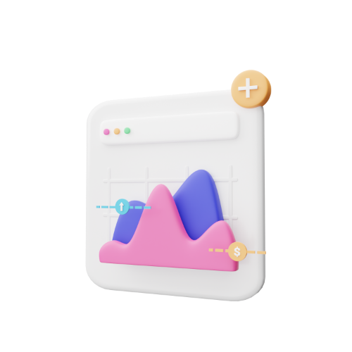</a> | **📂 檔名:** `3d-Icon-finacially-03-fa.png` 🖼️ **尺寸:** `500x500 px` ⚖️ **大小:** `59.16KB` 📅 **更新:** `2026-03-01`  🚀 **jsDelivr Markdown:** `` 🔗 **直接連結 (Url):** <code>https://cdn.jsdelivr.net/gh/barry028/materials@main/images/3Ds/3D%20Finacially/3d-Icon-finacially-03-fa.png</code> 📥 [檢視原始檔](3d-Icon-finacially-03-fa.png) |
|  | **📂 檔名:** `3d-Icon-finacially-030-64.webp` 🖼️ **尺寸:** `500x500 px` ⚖️ **大小:** `8.18KB` 📅 **更新:** `2026-03-01`  🚀 **jsDelivr Markdown:** `` 🔗 **直接連結 (Url):** <code>https://cdn.jsdelivr.net/gh/barry028/materials@main/images/3Ds/3D%20Finacially/3d-Icon-finacially-030-64.webp</code> 📥 [檢視原始檔](3d-Icon-finacially-030-64.webp) |
|  | **📂 檔名:** `3d-Icon-finacially-030-84.png` 🖼️ **尺寸:** `500x500 px` ⚖️ **大小:** `58.85KB` 📅 **更新:** `2026-03-01`  🚀 **jsDelivr Markdown:** `` 🔗 **直接連結 (Url):** <code>https://cdn.jsdelivr.net/gh/barry028/materials@main/images/3Ds/3D%20Finacially/3d-Icon-finacially-030-84.png</code> 📥 [檢視原始檔](3d-Icon-finacially-030-84.png) |
|  | **📂 檔名:** `3d-Icon-finacially-031-36.webp` 🖼️ **尺寸:** `500x500 px` ⚖️ **大小:** `7.03KB` 📅 **更新:** `2026-03-01`  🚀 **jsDelivr Markdown:** `` 🔗 **直接連結 (Url):** <code>https://cdn.jsdelivr.net/gh/barry028/materials@main/images/3Ds/3D%20Finacially/3d-Icon-finacially-031-36.webp</code> 📥 [檢視原始檔](3d-Icon-finacially-031-36.webp) |
|  | **📂 檔名:** `3d-Icon-finacially-031-cb.png` 🖼️ **尺寸:** `500x500 px` ⚖️ **大小:** `44.08KB` 📅 **更新:** `2026-03-01`  🚀 **jsDelivr Markdown:** `` 🔗 **直接連結 (Url):** <code>https://cdn.jsdelivr.net/gh/barry028/materials@main/images/3Ds/3D%20Finacially/3d-Icon-finacially-031-cb.png</code> 📥 [檢視原始檔](3d-Icon-finacially-031-cb.png) |
|  | **📂 檔名:** `3d-Icon-finacially-032-26.png` 🖼️ **尺寸:** `500x500 px` ⚖️ **大小:** `69.14KB` 📅 **更新:** `2026-03-01`  🚀 **jsDelivr Markdown:** `` 🔗 **直接連結 (Url):** <code>https://cdn.jsdelivr.net/gh/barry028/materials@main/images/3Ds/3D%20Finacially/3d-Icon-finacially-032-26.png</code> 📥 [檢視原始檔](3d-Icon-finacially-032-26.png) |
|  | **📂 檔名:** `3d-Icon-finacially-032-88.webp` 🖼️ **尺寸:** `500x500 px` ⚖️ **大小:** `12.87KB` 📅 **更新:** `2026-03-01`  🚀 **jsDelivr Markdown:** `` 🔗 **直接連結 (Url):** <code>https://cdn.jsdelivr.net/gh/barry028/materials@main/images/3Ds/3D%20Finacially/3d-Icon-finacially-032-88.webp</code> 📥 [檢視原始檔](3d-Icon-finacially-032-88.webp) |
|  | **📂 檔名:** `3d-Icon-finacially-033-af.png` 🖼️ **尺寸:** `500x500 px` ⚖️ **大小:** `85.77KB` 📅 **更新:** `2026-03-01`  🚀 **jsDelivr Markdown:** `` 🔗 **直接連結 (Url):** <code>https://cdn.jsdelivr.net/gh/barry028/materials@main/images/3Ds/3D%20Finacially/3d-Icon-finacially-033-af.png</code> 📥 [檢視原始檔](3d-Icon-finacially-033-af.png) |
|  | **📂 檔名:** `3d-Icon-finacially-033-f2.webp` 🖼️ **尺寸:** `500x500 px` ⚖️ **大小:** `11.84KB` 📅 **更新:** `2026-03-01`  🚀 **jsDelivr Markdown:** `` 🔗 **直接連結 (Url):** <code>https://cdn.jsdelivr.net/gh/barry028/materials@main/images/3Ds/3D%20Finacially/3d-Icon-finacially-033-f2.webp</code> 📥 [檢視原始檔](3d-Icon-finacially-033-f2.webp) |
|  | **📂 檔名:** `3d-Icon-finacially-034-1e.png` 🖼️ **尺寸:** `500x500 px` ⚖️ **大小:** `75.67KB` 📅 **更新:** `2026-03-01`  🚀 **jsDelivr Markdown:** `` 🔗 **直接連結 (Url):** <code>https://cdn.jsdelivr.net/gh/barry028/materials@main/images/3Ds/3D%20Finacially/3d-Icon-finacially-034-1e.png</code> 📥 [檢視原始檔](3d-Icon-finacially-034-1e.png) |
|  | **📂 檔名:** `3d-Icon-finacially-034-32.webp` 🖼️ **尺寸:** `500x500 px` ⚖️ **大小:** `10.10KB` 📅 **更新:** `2026-03-01`  🚀 **jsDelivr Markdown:** `` 🔗 **直接連結 (Url):** <code>https://cdn.jsdelivr.net/gh/barry028/materials@main/images/3Ds/3D%20Finacially/3d-Icon-finacially-034-32.webp</code> 📥 [檢視原始檔](3d-Icon-finacially-034-32.webp) |
|  | **📂 檔名:** `3d-Icon-finacially-035-bd.png` 🖼️ **尺寸:** `500x500 px` ⚖️ **大小:** `58.50KB` 📅 **更新:** `2026-03-01`  🚀 **jsDelivr Markdown:** `` 🔗 **直接連結 (Url):** <code>https://cdn.jsdelivr.net/gh/barry028/materials@main/images/3Ds/3D%20Finacially/3d-Icon-finacially-035-bd.png</code> 📥 [檢視原始檔](3d-Icon-finacially-035-bd.png) |
|  | **📂 檔名:** `3d-Icon-finacially-035-da.webp` 🖼️ **尺寸:** `500x500 px` ⚖️ **大小:** `7.26KB` 📅 **更新:** `2026-03-01`  🚀 **jsDelivr Markdown:** `` 🔗 **直接連結 (Url):** <code>https://cdn.jsdelivr.net/gh/barry028/materials@main/images/3Ds/3D%20Finacially/3d-Icon-finacially-035-da.webp</code> 📥 [檢視原始檔](3d-Icon-finacially-035-da.webp) |
|  | **📂 檔名:** `3d-Icon-finacially-036-12.png` 🖼️ **尺寸:** `500x500 px` ⚖️ **大小:** `85.93KB` 📅 **更新:** `2026-03-01`  🚀 **jsDelivr Markdown:** `` 🔗 **直接連結 (Url):** <code>https://cdn.jsdelivr.net/gh/barry028/materials@main/images/3Ds/3D%20Finacially/3d-Icon-finacially-036-12.png</code> 📥 [檢視原始檔](3d-Icon-finacially-036-12.png) |
|  | **📂 檔名:** `3d-Icon-finacially-036-2a.webp` 🖼️ **尺寸:** `500x500 px` ⚖️ **大小:** `8.74KB` 📅 **更新:** `2026-03-01`  🚀 **jsDelivr Markdown:** `` 🔗 **直接連結 (Url):** <code>https://cdn.jsdelivr.net/gh/barry028/materials@main/images/3Ds/3D%20Finacially/3d-Icon-finacially-036-2a.webp</code> 📥 [檢視原始檔](3d-Icon-finacially-036-2a.webp) |
| <a href="3d-Icon-finacially-037-45.webp">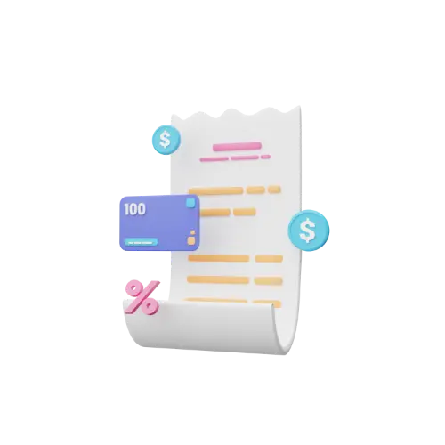</a> | **📂 檔名:** `3d-Icon-finacially-037-45.webp` 🖼️ **尺寸:** `500x500 px` ⚖️ **大小:** `7.23KB` 📅 **更新:** `2026-03-01`  🚀 **jsDelivr Markdown:** `` 🔗 **直接連結 (Url):** <code>https://cdn.jsdelivr.net/gh/barry028/materials@main/images/3Ds/3D%20Finacially/3d-Icon-finacially-037-45.webp</code> 📥 [檢視原始檔](3d-Icon-finacially-037-45.webp) |
| <a href="3d-Icon-finacially-037-90.png">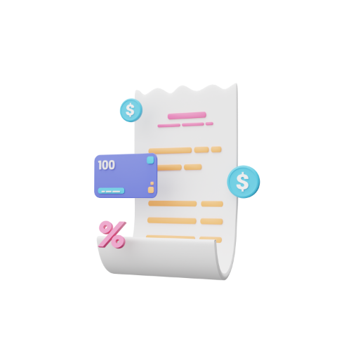</a> | **📂 檔名:** `3d-Icon-finacially-037-90.png` 🖼️ **尺寸:** `500x500 px` ⚖️ **大小:** `47.04KB` 📅 **更新:** `2026-03-01`  🚀 **jsDelivr Markdown:** `` 🔗 **直接連結 (Url):** <code>https://cdn.jsdelivr.net/gh/barry028/materials@main/images/3Ds/3D%20Finacially/3d-Icon-finacially-037-90.png</code> 📥 [檢視原始檔](3d-Icon-finacially-037-90.png) |
|  | **📂 檔名:** `3d-Icon-finacially-038-54.png` 🖼️ **尺寸:** `500x500 px` ⚖️ **大小:** `36.98KB` 📅 **更新:** `2026-03-01`  🚀 **jsDelivr Markdown:** `` 🔗 **直接連結 (Url):** <code>https://cdn.jsdelivr.net/gh/barry028/materials@main/images/3Ds/3D%20Finacially/3d-Icon-finacially-038-54.png</code> 📥 [檢視原始檔](3d-Icon-finacially-038-54.png) |
|  | **📂 檔名:** `3d-Icon-finacially-038-7d.webp` 🖼️ **尺寸:** `500x500 px` ⚖️ **大小:** `4.53KB` 📅 **更新:** `2026-03-01`  🚀 **jsDelivr Markdown:** `` 🔗 **直接連結 (Url):** <code>https://cdn.jsdelivr.net/gh/barry028/materials@main/images/3Ds/3D%20Finacially/3d-Icon-finacially-038-7d.webp</code> 📥 [檢視原始檔](3d-Icon-finacially-038-7d.webp) |
|  | **📂 檔名:** `3d-Icon-finacially-04-2f.png` 🖼️ **尺寸:** `500x500 px` ⚖️ **大小:** `54.55KB` 📅 **更新:** `2026-03-01`  🚀 **jsDelivr Markdown:** `` 🔗 **直接連結 (Url):** <code>https://cdn.jsdelivr.net/gh/barry028/materials@main/images/3Ds/3D%20Finacially/3d-Icon-finacially-04-2f.png</code> 📥 [檢視原始檔](3d-Icon-finacially-04-2f.png) |
| <a href="3d-Icon-finacially-04-3a.webp">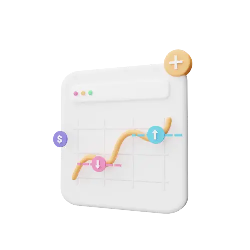</a> | **📂 檔名:** `3d-Icon-finacially-04-3a.webp` 🖼️ **尺寸:** `500x500 px` ⚖️ **大小:** `5.85KB` 📅 **更新:** `2026-03-01`  🚀 **jsDelivr Markdown:** `` 🔗 **直接連結 (Url):** <code>https://cdn.jsdelivr.net/gh/barry028/materials@main/images/3Ds/3D%20Finacially/3d-Icon-finacially-04-3a.webp</code> 📥 [檢視原始檔](3d-Icon-finacially-04-3a.webp) |
| <a href="3d-Icon-finacially-05-2f.webp">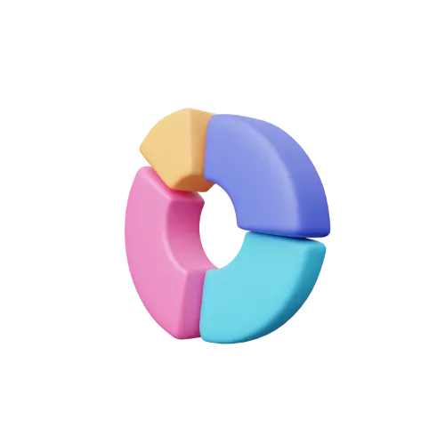</a> | **📂 檔名:** `3d-Icon-finacially-05-2f.webp` 🖼️ **尺寸:** `500x500 px` ⚖️ **大小:** `6.91KB` 📅 **更新:** `2026-03-01`  🚀 **jsDelivr Markdown:** `` 🔗 **直接連結 (Url):** <code>https://cdn.jsdelivr.net/gh/barry028/materials@main/images/3Ds/3D%20Finacially/3d-Icon-finacially-05-2f.webp</code> 📥 [檢視原始檔](3d-Icon-finacially-05-2f.webp) |
| <a href="3d-Icon-finacially-05-98.png">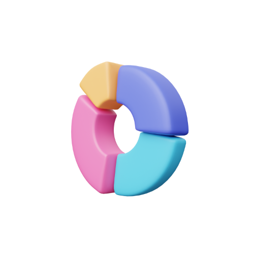</a> | **📂 檔名:** `3d-Icon-finacially-05-98.png` 🖼️ **尺寸:** `500x500 px` ⚖️ **大小:** `50.14KB` 📅 **更新:** `2026-03-01`  🚀 **jsDelivr Markdown:** `` 🔗 **直接連結 (Url):** <code>https://cdn.jsdelivr.net/gh/barry028/materials@main/images/3Ds/3D%20Finacially/3d-Icon-finacially-05-98.png</code> 📥 [檢視原始檔](3d-Icon-finacially-05-98.png) |
|  | **📂 檔名:** `3d-Icon-finacially-06-15.webp` 🖼️ **尺寸:** `500x500 px` ⚖️ **大小:** `6.29KB` 📅 **更新:** `2026-03-01`  🚀 **jsDelivr Markdown:** `` 🔗 **直接連結 (Url):** <code>https://cdn.jsdelivr.net/gh/barry028/materials@main/images/3Ds/3D%20Finacially/3d-Icon-finacially-06-15.webp</code> 📥 [檢視原始檔](3d-Icon-finacially-06-15.webp) |
|  | **📂 檔名:** `3d-Icon-finacially-06-37.png` 🖼️ **尺寸:** `500x500 px` ⚖️ **大小:** `49.57KB` 📅 **更新:** `2026-03-01`  🚀 **jsDelivr Markdown:** `` 🔗 **直接連結 (Url):** <code>https://cdn.jsdelivr.net/gh/barry028/materials@main/images/3Ds/3D%20Finacially/3d-Icon-finacially-06-37.png</code> 📥 [檢視原始檔](3d-Icon-finacially-06-37.png) |
|  | **📂 檔名:** `3d-Icon-finacially-07-21.png` 🖼️ **尺寸:** `500x500 px` ⚖️ **大小:** `103.81KB` 📅 **更新:** `2026-03-01`  🚀 **jsDelivr Markdown:** `` 🔗 **直接連結 (Url):** <code>https://cdn.jsdelivr.net/gh/barry028/materials@main/images/3Ds/3D%20Finacially/3d-Icon-finacially-07-21.png</code> 📥 [檢視原始檔](3d-Icon-finacially-07-21.png) |
|  | **📂 檔名:** `3d-Icon-finacially-07-ff.webp` 🖼️ **尺寸:** `500x500 px` ⚖️ **大小:** `10.97KB` 📅 **更新:** `2026-03-01`  🚀 **jsDelivr Markdown:** `` 🔗 **直接連結 (Url):** <code>https://cdn.jsdelivr.net/gh/barry028/materials@main/images/3Ds/3D%20Finacially/3d-Icon-finacially-07-ff.webp</code> 📥 [檢視原始檔](3d-Icon-finacially-07-ff.webp) |
|  | **📂 檔名:** `3d-Icon-finacially-08-c9.png` 🖼️ **尺寸:** `500x500 px` ⚖️ **大小:** `69.48KB` 📅 **更新:** `2026-03-01`  🚀 **jsDelivr Markdown:** `` 🔗 **直接連結 (Url):** <code>https://cdn.jsdelivr.net/gh/barry028/materials@main/images/3Ds/3D%20Finacially/3d-Icon-finacially-08-c9.png</code> 📥 [檢視原始檔](3d-Icon-finacially-08-c9.png) |
|  | **📂 檔名:** `3d-Icon-finacially-08-d1.webp` 🖼️ **尺寸:** `500x500 px` ⚖️ **大小:** `8.57KB` 📅 **更新:** `2026-03-01`  🚀 **jsDelivr Markdown:** `` 🔗 **直接連結 (Url):** <code>https://cdn.jsdelivr.net/gh/barry028/materials@main/images/3Ds/3D%20Finacially/3d-Icon-finacially-08-d1.webp</code> 📥 [檢視原始檔](3d-Icon-finacially-08-d1.webp) |
|  | **📂 檔名:** `3d-Icon-finacially-09-3d.webp` 🖼️ **尺寸:** `500x500 px` ⚖️ **大小:** `10.24KB` 📅 **更新:** `2026-03-01`  🚀 **jsDelivr Markdown:** `` 🔗 **直接連結 (Url):** <code>https://cdn.jsdelivr.net/gh/barry028/materials@main/images/3Ds/3D%20Finacially/3d-Icon-finacially-09-3d.webp</code> 📥 [檢視原始檔](3d-Icon-finacially-09-3d.webp) |
|  | **📂 檔名:** `3d-Icon-finacially-09-5a.png` 🖼️ **尺寸:** `500x500 px` ⚖️ **大小:** `91.07KB` 📅 **更新:** `2026-03-01`  🚀 **jsDelivr Markdown:** `` 🔗 **直接連結 (Url):** <code>https://cdn.jsdelivr.net/gh/barry028/materials@main/images/3Ds/3D%20Finacially/3d-Icon-finacially-09-5a.png</code> 📥 [檢視原始檔](3d-Icon-finacially-09-5a.png) |