# 🖼️ 素材分類：3D Web V2

> [🏠 主目錄](../../../README.md) / [images](../../README.md) / [3Ds](../README.md) / **3D Web V2**

本目錄共有 `40` 個檔案

| 🎨 預覽 (點擊放大)  | 📋 檔案詳細資訊與連結 |
| :--- | :--- |
|  | **📂 檔名:** `3d-Icon-webs-01-44.webp` 🖼️ **尺寸:** `500x500 px` ⚖️ **大小:** `7.71KB` 📅 **更新:** `2026-03-02`  🚀 **jsDelivr Markdown:** `` 🔗 **直接連結 (Url):** <code>https://cdn.jsdelivr.net/gh/barry028/materials@main/images/3Ds/3D%20Web%20V2/3d-Icon-webs-01-44.webp</code> 📥 [檢視原始檔](3d-Icon-webs-01-44.webp) |
|  | **📂 檔名:** `3d-Icon-webs-01-f8.png` 🖼️ **尺寸:** `500x500 px` ⚖️ **大小:** `78.48KB` 📅 **更新:** `2026-03-02`  🚀 **jsDelivr Markdown:** `` 🔗 **直接連結 (Url):** <code>https://cdn.jsdelivr.net/gh/barry028/materials@main/images/3Ds/3D%20Web%20V2/3d-Icon-webs-01-f8.png</code> 📥 [檢視原始檔](3d-Icon-webs-01-f8.png) |
|  | **📂 檔名:** `3d-Icon-webs-010-1f.png` 🖼️ **尺寸:** `500x500 px` ⚖️ **大小:** `64.10KB` 📅 **更新:** `2026-03-02`  🚀 **jsDelivr Markdown:** `` 🔗 **直接連結 (Url):** <code>https://cdn.jsdelivr.net/gh/barry028/materials@main/images/3Ds/3D%20Web%20V2/3d-Icon-webs-010-1f.png</code> 📥 [檢視原始檔](3d-Icon-webs-010-1f.png) |
|  | **📂 檔名:** `3d-Icon-webs-010-e9.webp` 🖼️ **尺寸:** `500x500 px` ⚖️ **大小:** `6.69KB` 📅 **更新:** `2026-03-02`  🚀 **jsDelivr Markdown:** `` 🔗 **直接連結 (Url):** <code>https://cdn.jsdelivr.net/gh/barry028/materials@main/images/3Ds/3D%20Web%20V2/3d-Icon-webs-010-e9.webp</code> 📥 [檢視原始檔](3d-Icon-webs-010-e9.webp) |
|  | **📂 檔名:** `3d-Icon-webs-011-5e.webp` 🖼️ **尺寸:** `500x500 px` ⚖️ **大小:** `7.17KB` 📅 **更新:** `2026-03-02`  🚀 **jsDelivr Markdown:** `` 🔗 **直接連結 (Url):** <code>https://cdn.jsdelivr.net/gh/barry028/materials@main/images/3Ds/3D%20Web%20V2/3d-Icon-webs-011-5e.webp</code> 📥 [檢視原始檔](3d-Icon-webs-011-5e.webp) |
|  | **📂 檔名:** `3d-Icon-webs-011-98.png` 🖼️ **尺寸:** `500x500 px` ⚖️ **大小:** `61.75KB` 📅 **更新:** `2026-03-02`  🚀 **jsDelivr Markdown:** `` 🔗 **直接連結 (Url):** <code>https://cdn.jsdelivr.net/gh/barry028/materials@main/images/3Ds/3D%20Web%20V2/3d-Icon-webs-011-98.png</code> 📥 [檢視原始檔](3d-Icon-webs-011-98.png) |
|  | **📂 檔名:** `3d-Icon-webs-012-0a.webp` 🖼️ **尺寸:** `500x500 px` ⚖️ **大小:** `7.24KB` 📅 **更新:** `2026-03-02`  🚀 **jsDelivr Markdown:** `` 🔗 **直接連結 (Url):** <code>https://cdn.jsdelivr.net/gh/barry028/materials@main/images/3Ds/3D%20Web%20V2/3d-Icon-webs-012-0a.webp</code> 📥 [檢視原始檔](3d-Icon-webs-012-0a.webp) |
|  | **📂 檔名:** `3d-Icon-webs-012-2e.png` 🖼️ **尺寸:** `500x500 px` ⚖️ **大小:** `57.80KB` 📅 **更新:** `2026-03-02`  🚀 **jsDelivr Markdown:** `` 🔗 **直接連結 (Url):** <code>https://cdn.jsdelivr.net/gh/barry028/materials@main/images/3Ds/3D%20Web%20V2/3d-Icon-webs-012-2e.png</code> 📥 [檢視原始檔](3d-Icon-webs-012-2e.png) |
|  | **📂 檔名:** `3d-Icon-webs-013-a9.png` 🖼️ **尺寸:** `500x500 px` ⚖️ **大小:** `51.88KB` 📅 **更新:** `2026-03-02`  🚀 **jsDelivr Markdown:** `` 🔗 **直接連結 (Url):** <code>https://cdn.jsdelivr.net/gh/barry028/materials@main/images/3Ds/3D%20Web%20V2/3d-Icon-webs-013-a9.png</code> 📥 [檢視原始檔](3d-Icon-webs-013-a9.png) |
|  | **📂 檔名:** `3d-Icon-webs-013-d9.webp` 🖼️ **尺寸:** `500x500 px` ⚖️ **大小:** `5.37KB` 📅 **更新:** `2026-03-02`  🚀 **jsDelivr Markdown:** `` 🔗 **直接連結 (Url):** <code>https://cdn.jsdelivr.net/gh/barry028/materials@main/images/3Ds/3D%20Web%20V2/3d-Icon-webs-013-d9.webp</code> 📥 [檢視原始檔](3d-Icon-webs-013-d9.webp) |
| <a href="3d-Icon-webs-014-cf.webp">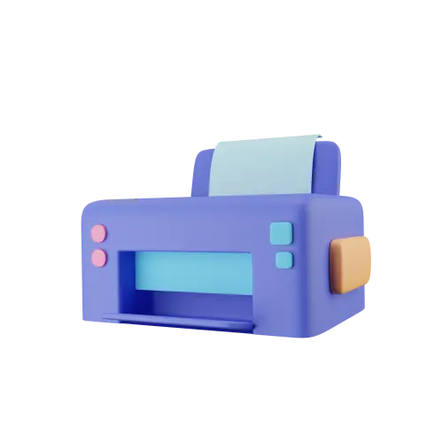</a> | **📂 檔名:** `3d-Icon-webs-014-cf.webp` 🖼️ **尺寸:** `500x500 px` ⚖️ **大小:** `5.72KB` 📅 **更新:** `2026-03-02`  🚀 **jsDelivr Markdown:** `` 🔗 **直接連結 (Url):** <code>https://cdn.jsdelivr.net/gh/barry028/materials@main/images/3Ds/3D%20Web%20V2/3d-Icon-webs-014-cf.webp</code> 📥 [檢視原始檔](3d-Icon-webs-014-cf.webp) |
| <a href="3d-Icon-webs-014-dc.png">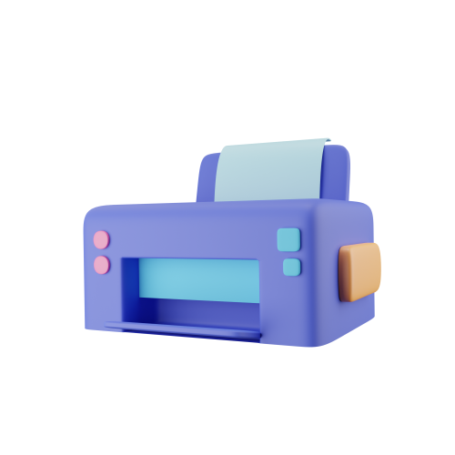</a> | **📂 檔名:** `3d-Icon-webs-014-dc.png` 🖼️ **尺寸:** `500x500 px` ⚖️ **大小:** `48.42KB` 📅 **更新:** `2026-03-02`  🚀 **jsDelivr Markdown:** `` 🔗 **直接連結 (Url):** <code>https://cdn.jsdelivr.net/gh/barry028/materials@main/images/3Ds/3D%20Web%20V2/3d-Icon-webs-014-dc.png</code> 📥 [檢視原始檔](3d-Icon-webs-014-dc.png) |
| <a href="3d-Icon-webs-015-64.webp">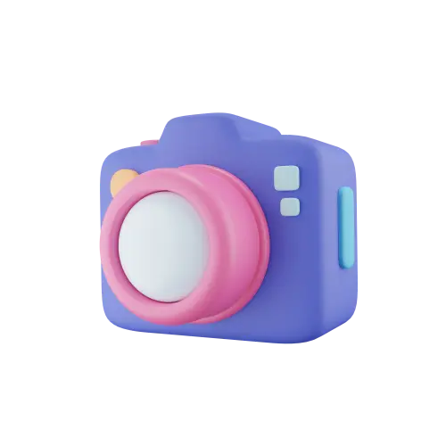</a> | **📂 檔名:** `3d-Icon-webs-015-64.webp` 🖼️ **尺寸:** `500x500 px` ⚖️ **大小:** `6.42KB` 📅 **更新:** `2026-03-02`  🚀 **jsDelivr Markdown:** `` 🔗 **直接連結 (Url):** <code>https://cdn.jsdelivr.net/gh/barry028/materials@main/images/3Ds/3D%20Web%20V2/3d-Icon-webs-015-64.webp</code> 📥 [檢視原始檔](3d-Icon-webs-015-64.webp) |
|  | **📂 檔名:** `3d-Icon-webs-015-82.png` 🖼️ **尺寸:** `500x500 px` ⚖️ **大小:** `65.90KB` 📅 **更新:** `2026-03-02`  🚀 **jsDelivr Markdown:** `` 🔗 **直接連結 (Url):** <code>https://cdn.jsdelivr.net/gh/barry028/materials@main/images/3Ds/3D%20Web%20V2/3d-Icon-webs-015-82.png</code> 📥 [檢視原始檔](3d-Icon-webs-015-82.png) |
| <a href="3d-Icon-webs-016-19.webp">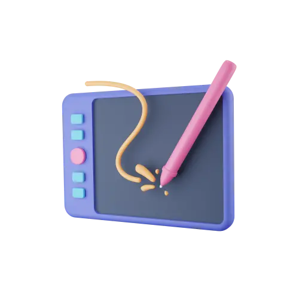</a> | **📂 檔名:** `3d-Icon-webs-016-19.webp` 🖼️ **尺寸:** `500x500 px` ⚖️ **大小:** `7.07KB` 📅 **更新:** `2026-03-02`  🚀 **jsDelivr Markdown:** `` 🔗 **直接連結 (Url):** <code>https://cdn.jsdelivr.net/gh/barry028/materials@main/images/3Ds/3D%20Web%20V2/3d-Icon-webs-016-19.webp</code> 📥 [檢視原始檔](3d-Icon-webs-016-19.webp) |
| <a href="3d-Icon-webs-016-c8.png">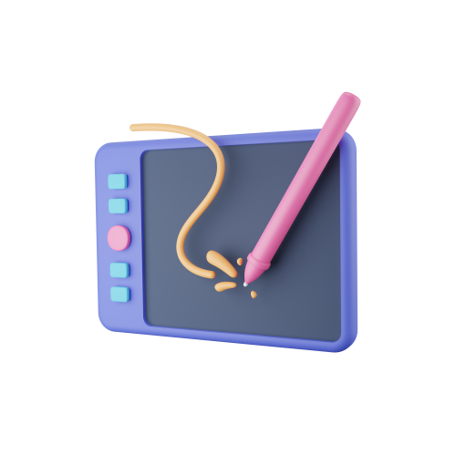</a> | **📂 檔名:** `3d-Icon-webs-016-c8.png` 🖼️ **尺寸:** `500x500 px` ⚖️ **大小:** `68.42KB` 📅 **更新:** `2026-03-02`  🚀 **jsDelivr Markdown:** `` 🔗 **直接連結 (Url):** <code>https://cdn.jsdelivr.net/gh/barry028/materials@main/images/3Ds/3D%20Web%20V2/3d-Icon-webs-016-c8.png</code> 📥 [檢視原始檔](3d-Icon-webs-016-c8.png) |
|  | **📂 檔名:** `3d-Icon-webs-017-1a.png` 🖼️ **尺寸:** `500x500 px` ⚖️ **大小:** `62.38KB` 📅 **更新:** `2026-03-02`  🚀 **jsDelivr Markdown:** `` 🔗 **直接連結 (Url):** <code>https://cdn.jsdelivr.net/gh/barry028/materials@main/images/3Ds/3D%20Web%20V2/3d-Icon-webs-017-1a.png</code> 📥 [檢視原始檔](3d-Icon-webs-017-1a.png) |
| <a href="3d-Icon-webs-017-5f.webp">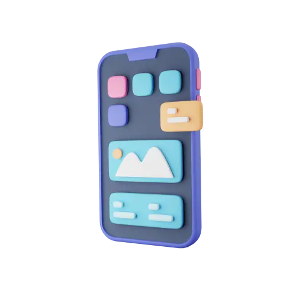</a> | **📂 檔名:** `3d-Icon-webs-017-5f.webp` 🖼️ **尺寸:** `500x500 px` ⚖️ **大小:** `6.61KB` 📅 **更新:** `2026-03-02`  🚀 **jsDelivr Markdown:** `` 🔗 **直接連結 (Url):** <code>https://cdn.jsdelivr.net/gh/barry028/materials@main/images/3Ds/3D%20Web%20V2/3d-Icon-webs-017-5f.webp</code> 📥 [檢視原始檔](3d-Icon-webs-017-5f.webp) |
|  | **📂 檔名:** `3d-Icon-webs-018-cd.png` 🖼️ **尺寸:** `500x500 px` ⚖️ **大小:** `64.20KB` 📅 **更新:** `2026-03-02`  🚀 **jsDelivr Markdown:** `` 🔗 **直接連結 (Url):** <code>https://cdn.jsdelivr.net/gh/barry028/materials@main/images/3Ds/3D%20Web%20V2/3d-Icon-webs-018-cd.png</code> 📥 [檢視原始檔](3d-Icon-webs-018-cd.png) |
|  | **📂 檔名:** `3d-Icon-webs-018-eb.webp` 🖼️ **尺寸:** `500x500 px` ⚖️ **大小:** `6.21KB` 📅 **更新:** `2026-03-02`  🚀 **jsDelivr Markdown:** `` 🔗 **直接連結 (Url):** <code>https://cdn.jsdelivr.net/gh/barry028/materials@main/images/3Ds/3D%20Web%20V2/3d-Icon-webs-018-eb.webp</code> 📥 [檢視原始檔](3d-Icon-webs-018-eb.webp) |
|  | **📂 檔名:** `3d-Icon-webs-019-12.webp` 🖼️ **尺寸:** `500x500 px` ⚖️ **大小:** `8.26KB` 📅 **更新:** `2026-03-02`  🚀 **jsDelivr Markdown:** `` 🔗 **直接連結 (Url):** <code>https://cdn.jsdelivr.net/gh/barry028/materials@main/images/3Ds/3D%20Web%20V2/3d-Icon-webs-019-12.webp</code> 📥 [檢視原始檔](3d-Icon-webs-019-12.webp) |
|  | **📂 檔名:** `3d-Icon-webs-019-e3.png` 🖼️ **尺寸:** `500x500 px` ⚖️ **大小:** `67.27KB` 📅 **更新:** `2026-03-02`  🚀 **jsDelivr Markdown:** `` 🔗 **直接連結 (Url):** <code>https://cdn.jsdelivr.net/gh/barry028/materials@main/images/3Ds/3D%20Web%20V2/3d-Icon-webs-019-e3.png</code> 📥 [檢視原始檔](3d-Icon-webs-019-e3.png) |
|  | **📂 檔名:** `3d-Icon-webs-02-a4.webp` 🖼️ **尺寸:** `500x500 px` ⚖️ **大小:** `6.29KB` 📅 **更新:** `2026-03-02`  🚀 **jsDelivr Markdown:** `` 🔗 **直接連結 (Url):** <code>https://cdn.jsdelivr.net/gh/barry028/materials@main/images/3Ds/3D%20Web%20V2/3d-Icon-webs-02-a4.webp</code> 📥 [檢視原始檔](3d-Icon-webs-02-a4.webp) |
|  | **📂 檔名:** `3d-Icon-webs-02-b4.png` 🖼️ **尺寸:** `500x500 px` ⚖️ **大小:** `57.48KB` 📅 **更新:** `2026-03-02`  🚀 **jsDelivr Markdown:** `` 🔗 **直接連結 (Url):** <code>https://cdn.jsdelivr.net/gh/barry028/materials@main/images/3Ds/3D%20Web%20V2/3d-Icon-webs-02-b4.png</code> 📥 [檢視原始檔](3d-Icon-webs-02-b4.png) |
| <a href="3d-Icon-webs-020-08.png">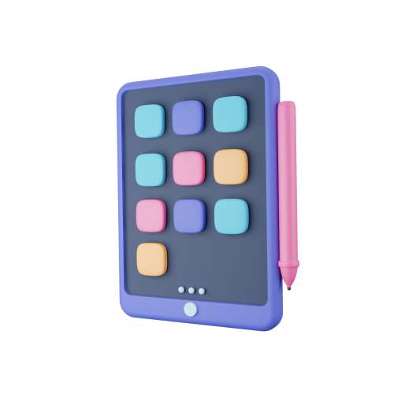</a> | **📂 檔名:** `3d-Icon-webs-020-08.png` 🖼️ **尺寸:** `500x500 px` ⚖️ **大小:** `68.20KB` 📅 **更新:** `2026-03-02`  🚀 **jsDelivr Markdown:** `` 🔗 **直接連結 (Url):** <code>https://cdn.jsdelivr.net/gh/barry028/materials@main/images/3Ds/3D%20Web%20V2/3d-Icon-webs-020-08.png</code> 📥 [檢視原始檔](3d-Icon-webs-020-08.png) |
|  | **📂 檔名:** `3d-Icon-webs-020-e7.webp` 🖼️ **尺寸:** `500x500 px` ⚖️ **大小:** `6.94KB` 📅 **更新:** `2026-03-02`  🚀 **jsDelivr Markdown:** `` 🔗 **直接連結 (Url):** <code>https://cdn.jsdelivr.net/gh/barry028/materials@main/images/3Ds/3D%20Web%20V2/3d-Icon-webs-020-e7.webp</code> 📥 [檢視原始檔](3d-Icon-webs-020-e7.webp) |
|  | **📂 檔名:** `3d-Icon-webs-03-d4.png` 🖼️ **尺寸:** `500x500 px` ⚖️ **大小:** `53.60KB` 📅 **更新:** `2026-03-02`  🚀 **jsDelivr Markdown:** `` 🔗 **直接連結 (Url):** <code>https://cdn.jsdelivr.net/gh/barry028/materials@main/images/3Ds/3D%20Web%20V2/3d-Icon-webs-03-d4.png</code> 📥 [檢視原始檔](3d-Icon-webs-03-d4.png) |
|  | **📂 檔名:** `3d-Icon-webs-03-de.webp` 🖼️ **尺寸:** `500x500 px` ⚖️ **大小:** `6.36KB` 📅 **更新:** `2026-03-02`  🚀 **jsDelivr Markdown:** `` 🔗 **直接連結 (Url):** <code>https://cdn.jsdelivr.net/gh/barry028/materials@main/images/3Ds/3D%20Web%20V2/3d-Icon-webs-03-de.webp</code> 📥 [檢視原始檔](3d-Icon-webs-03-de.webp) |
| <a href="3d-Icon-webs-04-57.png">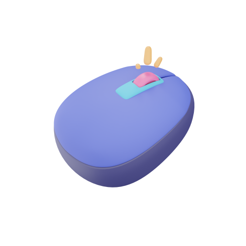</a> | **📂 檔名:** `3d-Icon-webs-04-57.png` 🖼️ **尺寸:** `500x500 px` ⚖️ **大小:** `45.69KB` 📅 **更新:** `2026-03-02`  🚀 **jsDelivr Markdown:** `` 🔗 **直接連結 (Url):** <code>https://cdn.jsdelivr.net/gh/barry028/materials@main/images/3Ds/3D%20Web%20V2/3d-Icon-webs-04-57.png</code> 📥 [檢視原始檔](3d-Icon-webs-04-57.png) |
| <a href="3d-Icon-webs-04-88.webp">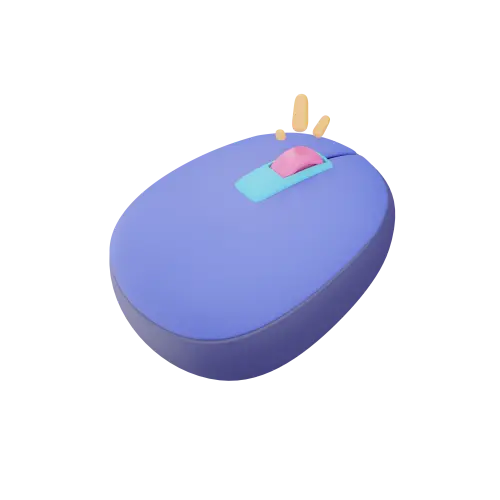</a> | **📂 檔名:** `3d-Icon-webs-04-88.webp` 🖼️ **尺寸:** `500x500 px` ⚖️ **大小:** `5.68KB` 📅 **更新:** `2026-03-02`  🚀 **jsDelivr Markdown:** `` 🔗 **直接連結 (Url):** <code>https://cdn.jsdelivr.net/gh/barry028/materials@main/images/3Ds/3D%20Web%20V2/3d-Icon-webs-04-88.webp</code> 📥 [檢視原始檔](3d-Icon-webs-04-88.webp) |
|  | **📂 檔名:** `3d-Icon-webs-05-00.webp` 🖼️ **尺寸:** `500x500 px` ⚖️ **大小:** `7.78KB` 📅 **更新:** `2026-03-02`  🚀 **jsDelivr Markdown:** `` 🔗 **直接連結 (Url):** <code>https://cdn.jsdelivr.net/gh/barry028/materials@main/images/3Ds/3D%20Web%20V2/3d-Icon-webs-05-00.webp</code> 📥 [檢視原始檔](3d-Icon-webs-05-00.webp) |
|  | **📂 檔名:** `3d-Icon-webs-05-a1.png` 🖼️ **尺寸:** `500x500 px` ⚖️ **大小:** `69.08KB` 📅 **更新:** `2026-03-02`  🚀 **jsDelivr Markdown:** `` 🔗 **直接連結 (Url):** <code>https://cdn.jsdelivr.net/gh/barry028/materials@main/images/3Ds/3D%20Web%20V2/3d-Icon-webs-05-a1.png</code> 📥 [檢視原始檔](3d-Icon-webs-05-a1.png) |
| <a href="3d-Icon-webs-06-2b.png">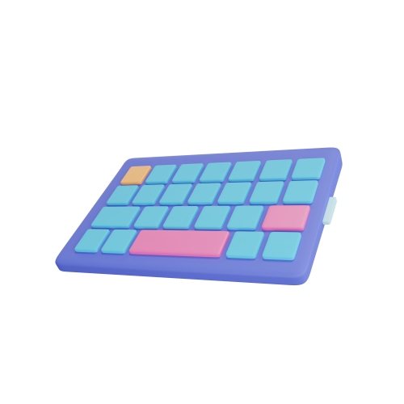</a> | **📂 檔名:** `3d-Icon-webs-06-2b.png` 🖼️ **尺寸:** `500x500 px` ⚖️ **大小:** `50.42KB` 📅 **更新:** `2026-03-02`  🚀 **jsDelivr Markdown:** `` 🔗 **直接連結 (Url):** <code>https://cdn.jsdelivr.net/gh/barry028/materials@main/images/3Ds/3D%20Web%20V2/3d-Icon-webs-06-2b.png</code> 📥 [檢視原始檔](3d-Icon-webs-06-2b.png) |
|  | **📂 檔名:** `3d-Icon-webs-06-eb.webp` 🖼️ **尺寸:** `500x500 px` ⚖️ **大小:** `6.37KB` 📅 **更新:** `2026-03-02`  🚀 **jsDelivr Markdown:** `` 🔗 **直接連結 (Url):** <code>https://cdn.jsdelivr.net/gh/barry028/materials@main/images/3Ds/3D%20Web%20V2/3d-Icon-webs-06-eb.webp</code> 📥 [檢視原始檔](3d-Icon-webs-06-eb.webp) |
|  | **📂 檔名:** `3d-Icon-webs-07-2d.png` 🖼️ **尺寸:** `500x500 px` ⚖️ **大小:** `56.30KB` 📅 **更新:** `2026-03-02`  🚀 **jsDelivr Markdown:** `` 🔗 **直接連結 (Url):** <code>https://cdn.jsdelivr.net/gh/barry028/materials@main/images/3Ds/3D%20Web%20V2/3d-Icon-webs-07-2d.png</code> 📥 [檢視原始檔](3d-Icon-webs-07-2d.png) |
| <a href="3d-Icon-webs-07-b7.webp">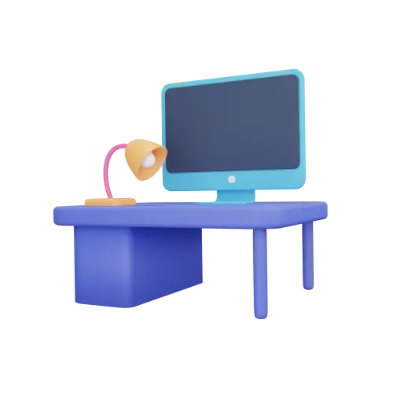</a> | **📂 檔名:** `3d-Icon-webs-07-b7.webp` 🖼️ **尺寸:** `500x500 px` ⚖️ **大小:** `7.92KB` 📅 **更新:** `2026-03-02`  🚀 **jsDelivr Markdown:** `` 🔗 **直接連結 (Url):** <code>https://cdn.jsdelivr.net/gh/barry028/materials@main/images/3Ds/3D%20Web%20V2/3d-Icon-webs-07-b7.webp</code> 📥 [檢視原始檔](3d-Icon-webs-07-b7.webp) |
| <a href="3d-Icon-webs-08-1f.webp">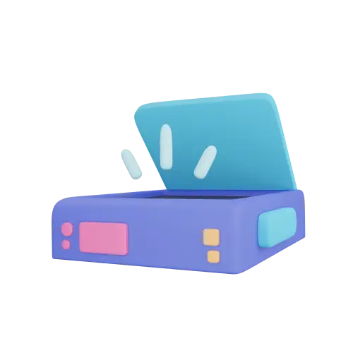</a> | **📂 檔名:** `3d-Icon-webs-08-1f.webp` 🖼️ **尺寸:** `500x500 px` ⚖️ **大小:** `6.88KB` 📅 **更新:** `2026-03-02`  🚀 **jsDelivr Markdown:** `` 🔗 **直接連結 (Url):** <code>https://cdn.jsdelivr.net/gh/barry028/materials@main/images/3Ds/3D%20Web%20V2/3d-Icon-webs-08-1f.webp</code> 📥 [檢視原始檔](3d-Icon-webs-08-1f.webp) |
|  | **📂 檔名:** `3d-Icon-webs-08-ea.png` 🖼️ **尺寸:** `500x500 px` ⚖️ **大小:** `54.35KB` 📅 **更新:** `2026-03-02`  🚀 **jsDelivr Markdown:** `` 🔗 **直接連結 (Url):** <code>https://cdn.jsdelivr.net/gh/barry028/materials@main/images/3Ds/3D%20Web%20V2/3d-Icon-webs-08-ea.png</code> 📥 [檢視原始檔](3d-Icon-webs-08-ea.png) |
|  | **📂 檔名:** `3d-Icon-webs-09-39.webp` 🖼️ **尺寸:** `500x500 px` ⚖️ **大小:** `9.22KB` 📅 **更新:** `2026-03-02`  🚀 **jsDelivr Markdown:** `` 🔗 **直接連結 (Url):** <code>https://cdn.jsdelivr.net/gh/barry028/materials@main/images/3Ds/3D%20Web%20V2/3d-Icon-webs-09-39.webp</code> 📥 [檢視原始檔](3d-Icon-webs-09-39.webp) |
| <a href="3d-Icon-webs-09-d2.png">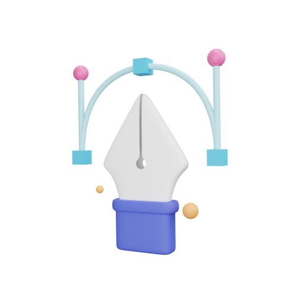</a> | **📂 檔名:** `3d-Icon-webs-09-d2.png` 🖼️ **尺寸:** `500x500 px` ⚖️ **大小:** `43.84KB` 📅 **更新:** `2026-03-02`  🚀 **jsDelivr Markdown:** `` 🔗 **直接連結 (Url):** <code>https://cdn.jsdelivr.net/gh/barry028/materials@main/images/3Ds/3D%20Web%20V2/3d-Icon-webs-09-d2.png</code> 📥 [檢視原始檔](3d-Icon-webs-09-d2.png) |