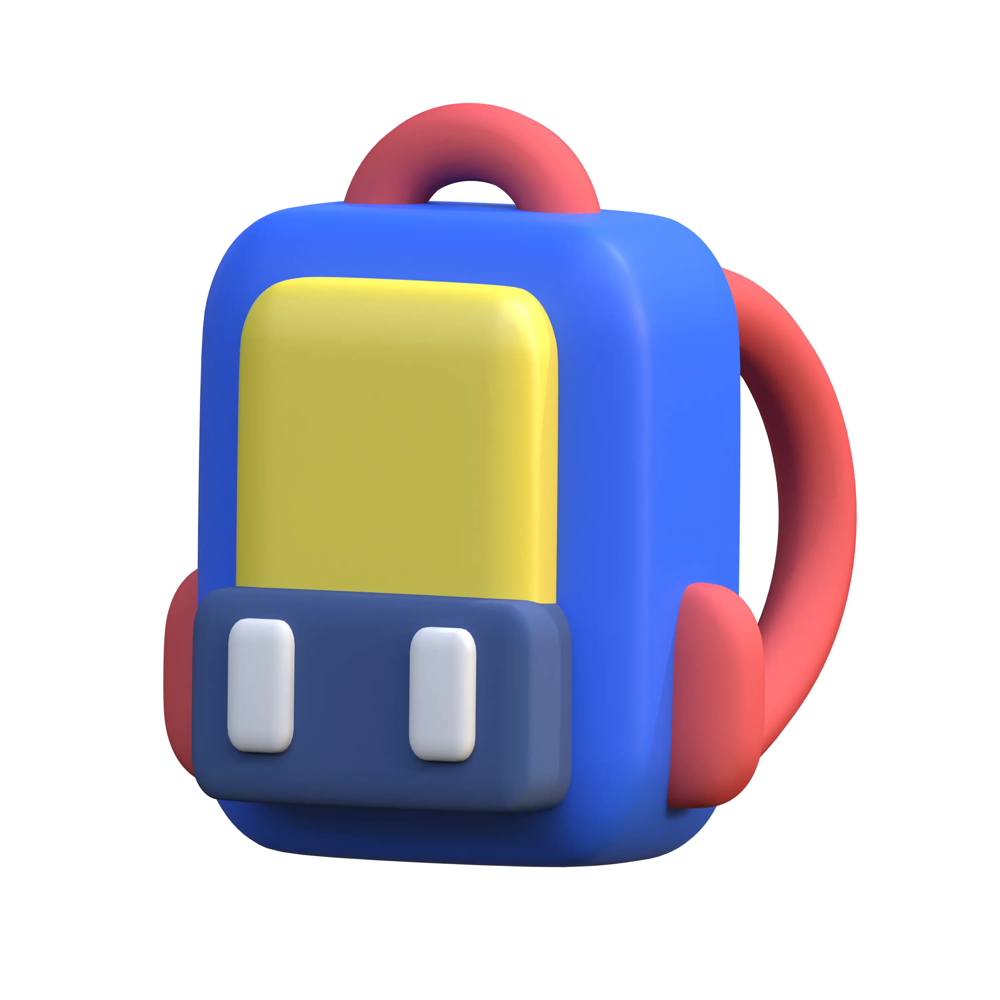

# 🖼️ 3D_Education Gallery

[⬅️ 回到首頁](../../README.md)

| 預覽 | 詳細資訊 |
| :--- | :--- |
|  | **BackPack-60.webp** 3000x3000 | 81.25KB 更新: 2026-02-26 |
|  | **BackPack-b3.png** 3000x3000 | 15.80MB 更新: 2026-02-26 |
|  | **BlackBoard-8c.webp** 3000x3000 | 74.36KB 更新: 2026-02-26 |
|  | **BlackBoard-da.png** 3000x3000 | 10.90MB 更新: 2026-02-26 |
|  | **Brush-69.png** 3000x3000 | 10.28MB 更新: 2026-02-26 |
|  | **Brush-b7.webp** 3000x3000 | 80.04KB 更新: 2026-02-26 |
|  | **Calculator-19.png** 3000x3000 | 23.08MB 更新: 2026-02-26 |
|  | **Calculator-89.webp** 3000x3000 | 177.73KB 更新: 2026-02-26 |
|  | **Education Certificate-15.webp** 3000x3000 | 141.17KB 更新: 2026-02-26 |
|  | **Education Certificate-c3.png** 3000x3000 | 19.72MB 更新: 2026-02-26 |
|  | **Education Trophy-8b.png** 3000x3000 | 13.99MB 更新: 2026-02-26 |
|  | **Education Trophy-bd.webp** 3000x3000 | 133.41KB 更新: 2026-02-26 |
|  | **Grauduation Hat-65.png** 3000x3000 | 12.55MB 更新: 2026-02-26 |
|  | **Grauduation Hat-f5.webp** 3000x3000 | 111.40KB 更新: 2026-02-26 |
|  | **Knowledge-e1.png** 3000x3000 | 12.83MB 更新: 2026-02-26 |
|  | **Knowledge-ef.webp** 3000x3000 | 154.96KB 更新: 2026-02-26 |
|  | **Medal-b4.webp** 3000x3000 | 78.83KB 更新: 2026-02-26 |
|  | **Medal-cd.png** 3000x3000 | 13.27MB 更新: 2026-02-26 |
|  | **Microscope-80.png** 3000x3000 | 9.70MB 更新: 2026-02-26 |
|  | **Microscope-b7.webp** 3000x3000 | 82.50KB 更新: 2026-02-26 |
|  | **Pencil And Ruller-06.webp** 3000x3000 | 116.73KB 更新: 2026-02-26 |
|  | **Pencil And Ruller-d5.png** 3000x3000 | 14.75MB 更新: 2026-02-26 |