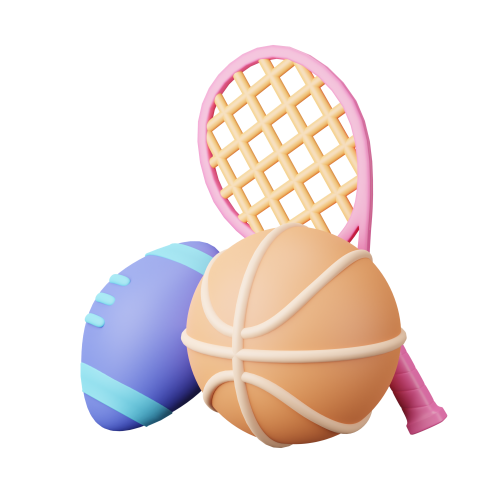
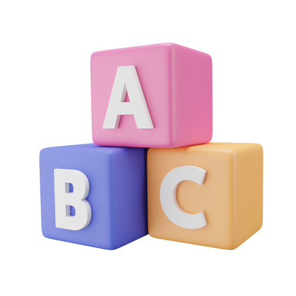
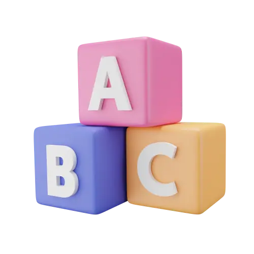
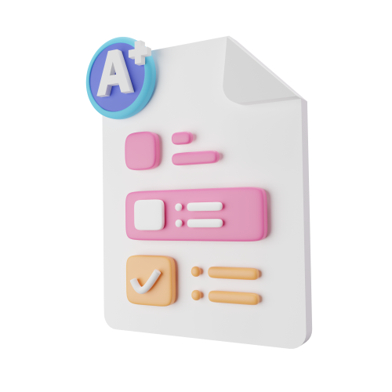
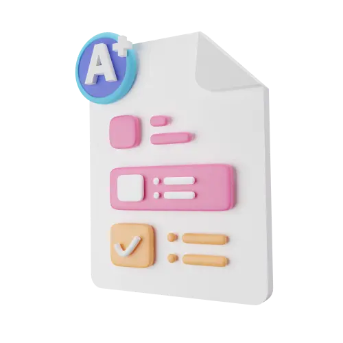
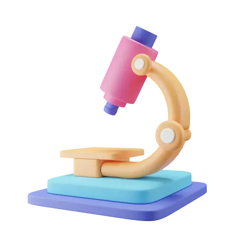
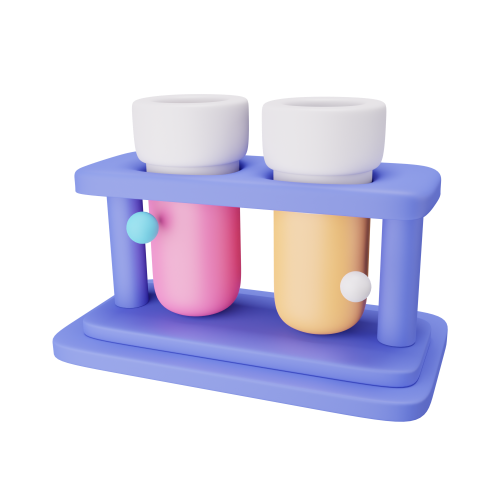
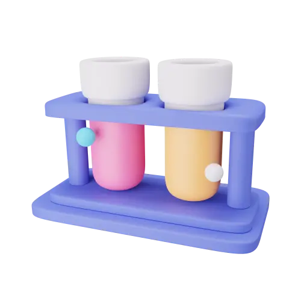
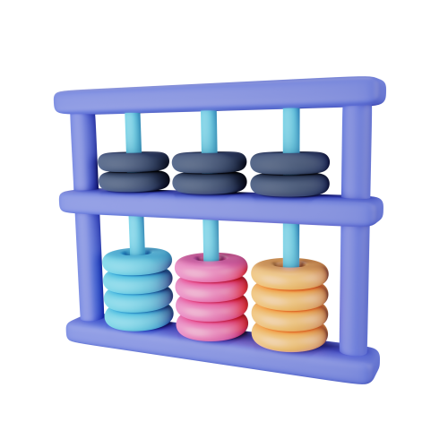
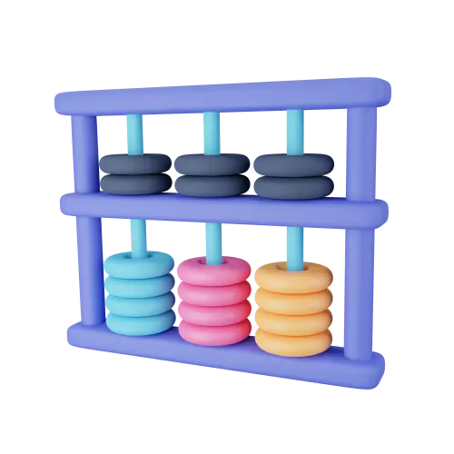

# 🖼️ 素材分類：3D_Educations

> [🏠 主目錄](../../../README.md) / [images](../../README.md) / [3Ds](../README.md) / **3D_Educations**

本目錄共有 `40` 個檔案

| 🎨 預覽 (點擊放大)  | 📋 檔案詳細資訊與連結 |
| :--- | :--- |
|  | **📂 檔名:** `3d-Icon-education-01-4a.webp` 🖼️ **尺寸:** `500x500 px` ⚖️ **大小:** `8.06KB` 📅 **更新:** `2026-02-27`  🚀 **jsDelivr Markdown:** <code></code> 🔗 **直接連結 (Url):** <code>https://cdn.jsdelivr.netbarry028/materials@main/images/3Ds/3D_Educations/3d-Icon-education-01-4a.webp</code> 📥 [檢視原始檔](3d-Icon-education-01-4a.webp) |
|  | **📂 檔名:** `3d-Icon-education-01-cd.png` 🖼️ **尺寸:** `500x500 px` ⚖️ **大小:** `83.03KB` 📅 **更新:** `2026-02-27`  🚀 **jsDelivr Markdown:** <code></code> 🔗 **直接連結 (Url):** <code>https://cdn.jsdelivr.netbarry028/materials@main/images/3Ds/3D_Educations/3d-Icon-education-01-cd.png</code> 📥 [檢視原始檔](3d-Icon-education-01-cd.png) |
|  | **📂 檔名:** `3d-Icon-education-010-db.png` 🖼️ **尺寸:** `500x500 px` ⚖️ **大小:** `80.87KB` 📅 **更新:** `2026-02-27`  🚀 **jsDelivr Markdown:** <code></code> 🔗 **直接連結 (Url):** <code>https://cdn.jsdelivr.netbarry028/materials@main/images/3Ds/3D_Educations/3d-Icon-education-010-db.png</code> 📥 [檢視原始檔](3d-Icon-education-010-db.png) |
|  | **📂 檔名:** `3d-Icon-education-010-eb.webp` 🖼️ **尺寸:** `500x500 px` ⚖️ **大小:** `8.99KB` 📅 **更新:** `2026-02-27`  🚀 **jsDelivr Markdown:** <code></code> 🔗 **直接連結 (Url):** <code>https://cdn.jsdelivr.netbarry028/materials@main/images/3Ds/3D_Educations/3d-Icon-education-010-eb.webp</code> 📥 [檢視原始檔](3d-Icon-education-010-eb.webp) |
|  | **📂 檔名:** `3d-Icon-education-011-62.webp` 🖼️ **尺寸:** `500x500 px` ⚖️ **大小:** `10.60KB` 📅 **更新:** `2026-02-27`  🚀 **jsDelivr Markdown:** <code></code> 🔗 **直接連結 (Url):** <code>https://cdn.jsdelivr.netbarry028/materials@main/images/3Ds/3D_Educations/3d-Icon-education-011-62.webp</code> 📥 [檢視原始檔](3d-Icon-education-011-62.webp) |
|  | **📂 檔名:** `3d-Icon-education-011-8e.png` 🖼️ **尺寸:** `500x500 px` ⚖️ **大小:** `92.69KB` 📅 **更新:** `2026-02-27`  🚀 **jsDelivr Markdown:** <code></code> 🔗 **直接連結 (Url):** <code>https://cdn.jsdelivr.netbarry028/materials@main/images/3Ds/3D_Educations/3d-Icon-education-011-8e.png</code> 📥 [檢視原始檔](3d-Icon-education-011-8e.png) |
|  | **📂 檔名:** `3d-Icon-education-012-25.webp` 🖼️ **尺寸:** `500x500 px` ⚖️ **大小:** `8.60KB` 📅 **更新:** `2026-02-27`  🚀 **jsDelivr Markdown:** <code></code> 🔗 **直接連結 (Url):** <code>https://cdn.jsdelivr.netbarry028/materials@main/images/3Ds/3D_Educations/3d-Icon-education-012-25.webp</code> 📥 [檢視原始檔](3d-Icon-education-012-25.webp) |
|  | **📂 檔名:** `3d-Icon-education-012-4b.png` 🖼️ **尺寸:** `500x500 px` ⚖️ **大小:** `88.04KB` 📅 **更新:** `2026-02-27`  🚀 **jsDelivr Markdown:** <code></code> 🔗 **直接連結 (Url):** <code>https://cdn.jsdelivr.netbarry028/materials@main/images/3Ds/3D_Educations/3d-Icon-education-012-4b.png</code> 📥 [檢視原始檔](3d-Icon-education-012-4b.png) |
|  | **📂 檔名:** `3d-Icon-education-013-0a.png` 🖼️ **尺寸:** `500x500 px` ⚖️ **大小:** `111.80KB` 📅 **更新:** `2026-02-27`  🚀 **jsDelivr Markdown:** <code></code> 🔗 **直接連結 (Url):** <code>https://cdn.jsdelivr.netbarry028/materials@main/images/3Ds/3D_Educations/3d-Icon-education-013-0a.png</code> 📥 [檢視原始檔](3d-Icon-education-013-0a.png) |
|  | **📂 檔名:** `3d-Icon-education-013-fa.webp` 🖼️ **尺寸:** `500x500 px` ⚖️ **大小:** `18.31KB` 📅 **更新:** `2026-02-27`  🚀 **jsDelivr Markdown:** <code></code> 🔗 **直接連結 (Url):** <code>https://cdn.jsdelivr.netbarry028/materials@main/images/3Ds/3D_Educations/3d-Icon-education-013-fa.webp</code> 📥 [檢視原始檔](3d-Icon-education-013-fa.webp) |
|  | **📂 檔名:** `3d-Icon-education-014-40.webp` 🖼️ **尺寸:** `500x500 px` ⚖️ **大小:** `7.92KB` 📅 **更新:** `2026-02-27`  🚀 **jsDelivr Markdown:** <code></code> 🔗 **直接連結 (Url):** <code>https://cdn.jsdelivr.netbarry028/materials@main/images/3Ds/3D_Educations/3d-Icon-education-014-40.webp</code> 📥 [檢視原始檔](3d-Icon-education-014-40.webp) |
|  | **📂 檔名:** `3d-Icon-education-014-f5.png` 🖼️ **尺寸:** `500x500 px` ⚖️ **大小:** `68.28KB` 📅 **更新:** `2026-02-27`  🚀 **jsDelivr Markdown:** <code></code> 🔗 **直接連結 (Url):** <code>https://cdn.jsdelivr.netbarry028/materials@main/images/3Ds/3D_Educations/3d-Icon-education-014-f5.png</code> 📥 [檢視原始檔](3d-Icon-education-014-f5.png) |
|  | **📂 檔名:** `3d-Icon-education-015-0d.webp` 🖼️ **尺寸:** `500x500 px` ⚖️ **大小:** `9.87KB` 📅 **更新:** `2026-02-27`  🚀 **jsDelivr Markdown:** <code></code> 🔗 **直接連結 (Url):** <code>https://cdn.jsdelivr.netbarry028/materials@main/images/3Ds/3D_Educations/3d-Icon-education-015-0d.webp</code> 📥 [檢視原始檔](3d-Icon-education-015-0d.webp) |
|  | **📂 檔名:** `3d-Icon-education-015-26.png` 🖼️ **尺寸:** `500x500 px` ⚖️ **大小:** `93.61KB` 📅 **更新:** `2026-02-27`  🚀 **jsDelivr Markdown:** <code></code> 🔗 **直接連結 (Url):** <code>https://cdn.jsdelivr.netbarry028/materials@main/images/3Ds/3D_Educations/3d-Icon-education-015-26.png</code> 📥 [檢視原始檔](3d-Icon-education-015-26.png) |
|  | **📂 檔名:** `3d-Icon-education-016-86.webp` 🖼️ **尺寸:** `500x500 px` ⚖️ **大小:** `7.85KB` 📅 **更新:** `2026-02-27`  🚀 **jsDelivr Markdown:** <code></code> 🔗 **直接連結 (Url):** <code>https://cdn.jsdelivr.netbarry028/materials@main/images/3Ds/3D_Educations/3d-Icon-education-016-86.webp</code> 📥 [檢視原始檔](3d-Icon-education-016-86.webp) |
|  | **📂 檔名:** `3d-Icon-education-016-d6.png` 🖼️ **尺寸:** `500x500 px` ⚖️ **大小:** `66.64KB` 📅 **更新:** `2026-02-27`  🚀 **jsDelivr Markdown:** <code></code> 🔗 **直接連結 (Url):** <code>https://cdn.jsdelivr.netbarry028/materials@main/images/3Ds/3D_Educations/3d-Icon-education-016-d6.png</code> 📥 [檢視原始檔](3d-Icon-education-016-d6.png) |
|  | **📂 檔名:** `3d-Icon-education-017-3c.webp` 🖼️ **尺寸:** `500x500 px` ⚖️ **大小:** `9.31KB` 📅 **更新:** `2026-02-27`  🚀 **jsDelivr Markdown:** <code></code> 🔗 **直接連結 (Url):** <code>https://cdn.jsdelivr.netbarry028/materials@main/images/3Ds/3D_Educations/3d-Icon-education-017-3c.webp</code> 📥 [檢視原始檔](3d-Icon-education-017-3c.webp) |
|  | **📂 檔名:** `3d-Icon-education-017-69.png` 🖼️ **尺寸:** `500x500 px` ⚖️ **大小:** `91.05KB` 📅 **更新:** `2026-02-27`  🚀 **jsDelivr Markdown:** <code></code> 🔗 **直接連結 (Url):** <code>https://cdn.jsdelivr.netbarry028/materials@main/images/3Ds/3D_Educations/3d-Icon-education-017-69.png</code> 📥 [檢視原始檔](3d-Icon-education-017-69.png) |
|  | **📂 檔名:** `3d-Icon-education-018-82.webp` 🖼️ **尺寸:** `500x500 px` ⚖️ **大小:** `11.00KB` 📅 **更新:** `2026-02-27`  🚀 **jsDelivr Markdown:** <code></code> 🔗 **直接連結 (Url):** <code>https://cdn.jsdelivr.netbarry028/materials@main/images/3Ds/3D_Educations/3d-Icon-education-018-82.webp</code> 📥 [檢視原始檔](3d-Icon-education-018-82.webp) |
|  | **📂 檔名:** `3d-Icon-education-018-e7.png` 🖼️ **尺寸:** `500x500 px` ⚖️ **大小:** `82.87KB` 📅 **更新:** `2026-02-27`  🚀 **jsDelivr Markdown:** <code></code> 🔗 **直接連結 (Url):** <code>https://cdn.jsdelivr.netbarry028/materials@main/images/3Ds/3D_Educations/3d-Icon-education-018-e7.png</code> 📥 [檢視原始檔](3d-Icon-education-018-e7.png) |
|  | **📂 檔名:** `3d-Icon-education-019-77.webp` 🖼️ **尺寸:** `500x500 px` ⚖️ **大小:** `11.76KB` 📅 **更新:** `2026-02-27`  🚀 **jsDelivr Markdown:** <code></code> 🔗 **直接連結 (Url):** <code>https://cdn.jsdelivr.netbarry028/materials@main/images/3Ds/3D_Educations/3d-Icon-education-019-77.webp</code> 📥 [檢視原始檔](3d-Icon-education-019-77.webp) |
|  | **📂 檔名:** `3d-Icon-education-019-7f.png` 🖼️ **尺寸:** `500x500 px` ⚖️ **大小:** `83.84KB` 📅 **更新:** `2026-02-27`  🚀 **jsDelivr Markdown:** <code></code> 🔗 **直接連結 (Url):** <code>https://cdn.jsdelivr.netbarry028/materials@main/images/3Ds/3D_Educations/3d-Icon-education-019-7f.png</code> 📥 [檢視原始檔](3d-Icon-education-019-7f.png) |
|  | **📂 檔名:** `3d-Icon-education-02-93.png` 🖼️ **尺寸:** `500x500 px` ⚖️ **大小:** `78.69KB` 📅 **更新:** `2026-02-27`  🚀 **jsDelivr Markdown:** <code></code> 🔗 **直接連結 (Url):** <code>https://cdn.jsdelivr.netbarry028/materials@main/images/3Ds/3D_Educations/3d-Icon-education-02-93.png</code> 📥 [檢視原始檔](3d-Icon-education-02-93.png) |
|  | **📂 檔名:** `3d-Icon-education-02-a8.webp` 🖼️ **尺寸:** `500x500 px` ⚖️ **大小:** `7.94KB` 📅 **更新:** `2026-02-27`  🚀 **jsDelivr Markdown:** <code></code> 🔗 **直接連結 (Url):** <code>https://cdn.jsdelivr.netbarry028/materials@main/images/3Ds/3D_Educations/3d-Icon-education-02-a8.webp</code> 📥 [檢視原始檔](3d-Icon-education-02-a8.webp) |
|  | **📂 檔名:** `3d-Icon-education-020-01.png` 🖼️ **尺寸:** `500x500 px` ⚖️ **大小:** `70.18KB` 📅 **更新:** `2026-02-27`  🚀 **jsDelivr Markdown:** <code></code> 🔗 **直接連結 (Url):** <code>https://cdn.jsdelivr.netbarry028/materials@main/images/3Ds/3D_Educations/3d-Icon-education-020-01.png</code> 📥 [檢視原始檔](3d-Icon-education-020-01.png) |
|  | **📂 檔名:** `3d-Icon-education-020-a1.webp` 🖼️ **尺寸:** `500x500 px` ⚖️ **大小:** `10.19KB` 📅 **更新:** `2026-02-27`  🚀 **jsDelivr Markdown:** <code></code> 🔗 **直接連結 (Url):** <code>https://cdn.jsdelivr.netbarry028/materials@main/images/3Ds/3D_Educations/3d-Icon-education-020-a1.webp</code> 📥 [檢視原始檔](3d-Icon-education-020-a1.webp) |
|  | **📂 檔名:** `3d-Icon-education-03-15.png` 🖼️ **尺寸:** `500x500 px` ⚖️ **大小:** `95.58KB` 📅 **更新:** `2026-02-27`  🚀 **jsDelivr Markdown:** <code></code> 🔗 **直接連結 (Url):** <code>https://cdn.jsdelivr.netbarry028/materials@main/images/3Ds/3D_Educations/3d-Icon-education-03-15.png</code> 📥 [檢視原始檔](3d-Icon-education-03-15.png) |
|  | **📂 檔名:** `3d-Icon-education-03-49.webp` 🖼️ **尺寸:** `500x500 px` ⚖️ **大小:** `9.59KB` 📅 **更新:** `2026-02-27`  🚀 **jsDelivr Markdown:** <code></code> 🔗 **直接連結 (Url):** <code>https://cdn.jsdelivr.netbarry028/materials@main/images/3Ds/3D_Educations/3d-Icon-education-03-49.webp</code> 📥 [檢視原始檔](3d-Icon-education-03-49.webp) |
|  | **📂 檔名:** `3d-Icon-education-04-0a.webp` 🖼️ **尺寸:** `500x500 px` ⚖️ **大小:** `8.94KB` 📅 **更新:** `2026-02-27`  🚀 **jsDelivr Markdown:** <code></code> 🔗 **直接連結 (Url):** <code>https://cdn.jsdelivr.netbarry028/materials@main/images/3Ds/3D_Educations/3d-Icon-education-04-0a.webp</code> 📥 [檢視原始檔](3d-Icon-education-04-0a.webp) |
|  | **📂 檔名:** `3d-Icon-education-04-59.png` 🖼️ **尺寸:** `500x500 px` ⚖️ **大小:** `88.94KB` 📅 **更新:** `2026-02-27`  🚀 **jsDelivr Markdown:** <code></code> 🔗 **直接連結 (Url):** <code>https://cdn.jsdelivr.netbarry028/materials@main/images/3Ds/3D_Educations/3d-Icon-education-04-59.png</code> 📥 [檢視原始檔](3d-Icon-education-04-59.png) |
|  | **📂 檔名:** `3d-Icon-education-05-2b.png` 🖼️ **尺寸:** `500x500 px` ⚖️ **大小:** `79.17KB` 📅 **更新:** `2026-02-27`  🚀 **jsDelivr Markdown:** <code></code> 🔗 **直接連結 (Url):** <code>https://cdn.jsdelivr.netbarry028/materials@main/images/3Ds/3D_Educations/3d-Icon-education-05-2b.png</code> 📥 [檢視原始檔](3d-Icon-education-05-2b.png) |
|  | **📂 檔名:** `3d-Icon-education-05-c3.webp` 🖼️ **尺寸:** `500x500 px` ⚖️ **大小:** `7.25KB` 📅 **更新:** `2026-02-27`  🚀 **jsDelivr Markdown:** <code></code> 🔗 **直接連結 (Url):** <code>https://cdn.jsdelivr.netbarry028/materials@main/images/3Ds/3D_Educations/3d-Icon-education-05-c3.webp</code> 📥 [檢視原始檔](3d-Icon-education-05-c3.webp) |
|  | **📂 檔名:** `3d-Icon-education-06-35.png` 🖼️ **尺寸:** `500x500 px` ⚖️ **大小:** `89.86KB` 📅 **更新:** `2026-02-27`  🚀 **jsDelivr Markdown:** <code></code> 🔗 **直接連結 (Url):** <code>https://cdn.jsdelivr.netbarry028/materials@main/images/3Ds/3D_Educations/3d-Icon-education-06-35.png</code> 📥 [檢視原始檔](3d-Icon-education-06-35.png) |
|  | **📂 檔名:** `3d-Icon-education-06-79.webp` 🖼️ **尺寸:** `500x500 px` ⚖️ **大小:** `15.95KB` 📅 **更新:** `2026-02-27`  🚀 **jsDelivr Markdown:** <code></code> 🔗 **直接連結 (Url):** <code>https://cdn.jsdelivr.netbarry028/materials@main/images/3Ds/3D_Educations/3d-Icon-education-06-79.webp</code> 📥 [檢視原始檔](3d-Icon-education-06-79.webp) |
|  | **📂 檔名:** `3d-Icon-education-07-49.png` 🖼️ **尺寸:** `500x500 px` ⚖️ **大小:** `73.73KB` 📅 **更新:** `2026-02-27`  🚀 **jsDelivr Markdown:** <code></code> 🔗 **直接連結 (Url):** <code>https://cdn.jsdelivr.netbarry028/materials@main/images/3Ds/3D_Educations/3d-Icon-education-07-49.png</code> 📥 [檢視原始檔](3d-Icon-education-07-49.png) |
|  | **📂 檔名:** `3d-Icon-education-07-a5.webp` 🖼️ **尺寸:** `500x500 px` ⚖️ **大小:** `10.54KB` 📅 **更新:** `2026-02-27`  🚀 **jsDelivr Markdown:** <code></code> 🔗 **直接連結 (Url):** <code>https://cdn.jsdelivr.netbarry028/materials@main/images/3Ds/3D_Educations/3d-Icon-education-07-a5.webp</code> 📥 [檢視原始檔](3d-Icon-education-07-a5.webp) |
|  | **📂 檔名:** `3d-Icon-education-08-1d.png` 🖼️ **尺寸:** `500x500 px` ⚖️ **大小:** `83.89KB` 📅 **更新:** `2026-02-27`  🚀 **jsDelivr Markdown:** <code></code> 🔗 **直接連結 (Url):** <code>https://cdn.jsdelivr.netbarry028/materials@main/images/3Ds/3D_Educations/3d-Icon-education-08-1d.png</code> 📥 [檢視原始檔](3d-Icon-education-08-1d.png) |
|  | **📂 檔名:** `3d-Icon-education-08-8e.webp` 🖼️ **尺寸:** `500x500 px` ⚖️ **大小:** `10.51KB` 📅 **更新:** `2026-02-27`  🚀 **jsDelivr Markdown:** <code></code> 🔗 **直接連結 (Url):** <code>https://cdn.jsdelivr.netbarry028/materials@main/images/3Ds/3D_Educations/3d-Icon-education-08-8e.webp</code> 📥 [檢視原始檔](3d-Icon-education-08-8e.webp) |
|  | **📂 檔名:** `3d-Icon-education-09-51.png` 🖼️ **尺寸:** `500x500 px` ⚖️ **大小:** `97.32KB` 📅 **更新:** `2026-02-27`  🚀 **jsDelivr Markdown:** <code></code> 🔗 **直接連結 (Url):** <code>https://cdn.jsdelivr.netbarry028/materials@main/images/3Ds/3D_Educations/3d-Icon-education-09-51.png</code> 📥 [檢視原始檔](3d-Icon-education-09-51.png) |
|  | **📂 檔名:** `3d-Icon-education-09-70.webp` 🖼️ **尺寸:** `500x500 px` ⚖️ **大小:** `16.58KB` 📅 **更新:** `2026-02-27`  🚀 **jsDelivr Markdown:** <code></code> 🔗 **直接連結 (Url):** <code>https://cdn.jsdelivr.netbarry028/materials@main/images/3Ds/3D_Educations/3d-Icon-education-09-70.webp</code> 📥 [檢視原始檔](3d-Icon-education-09-70.webp) |