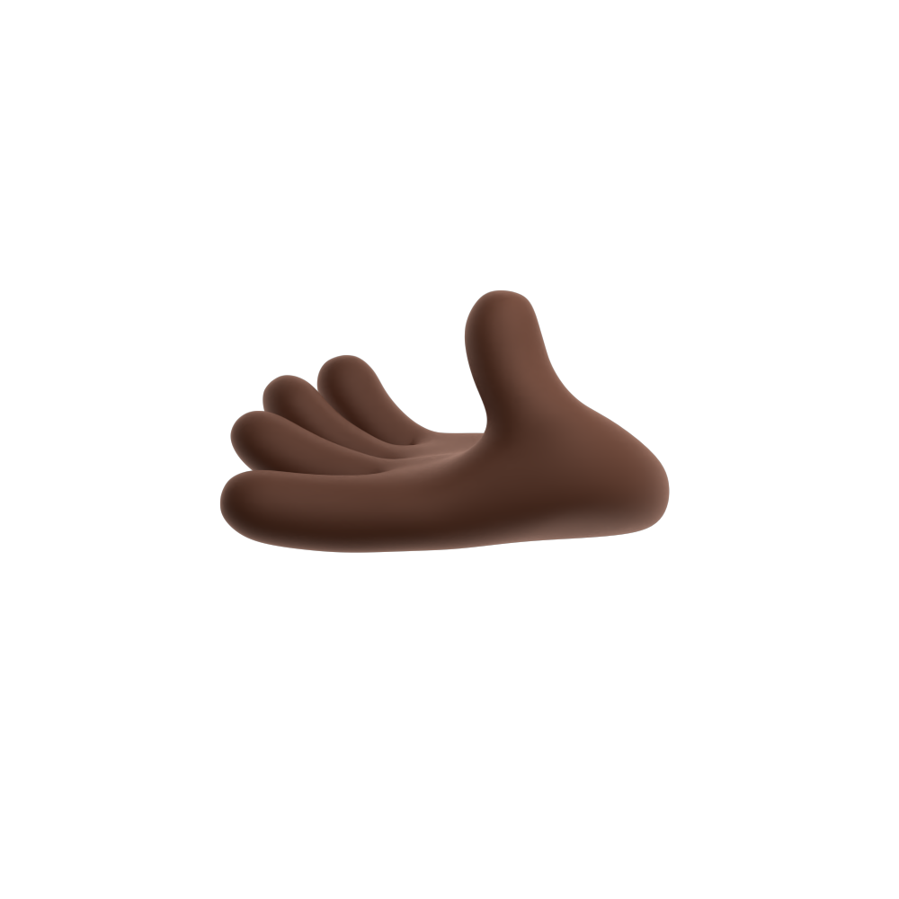
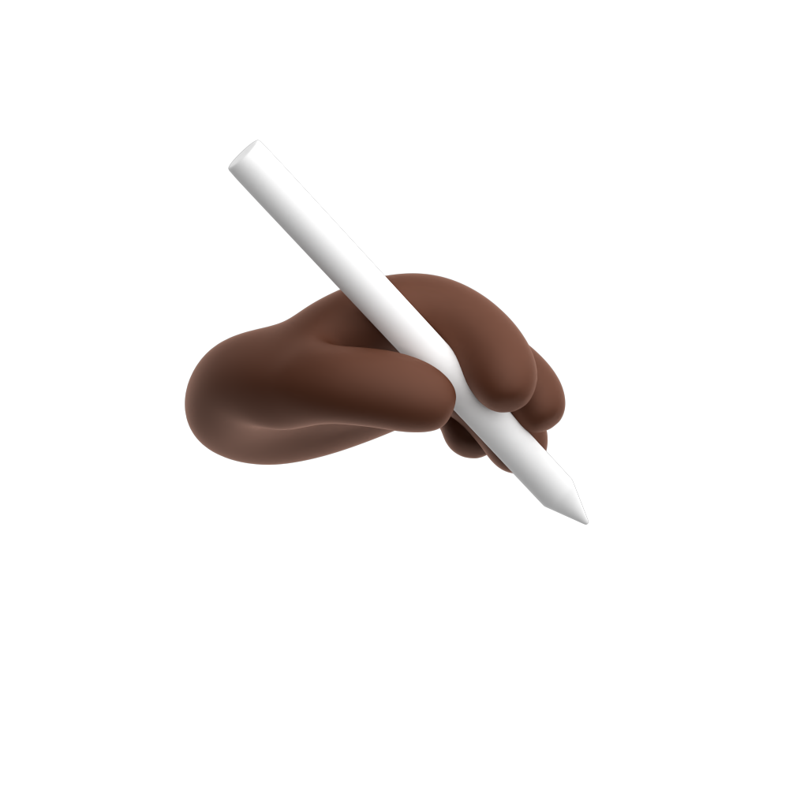
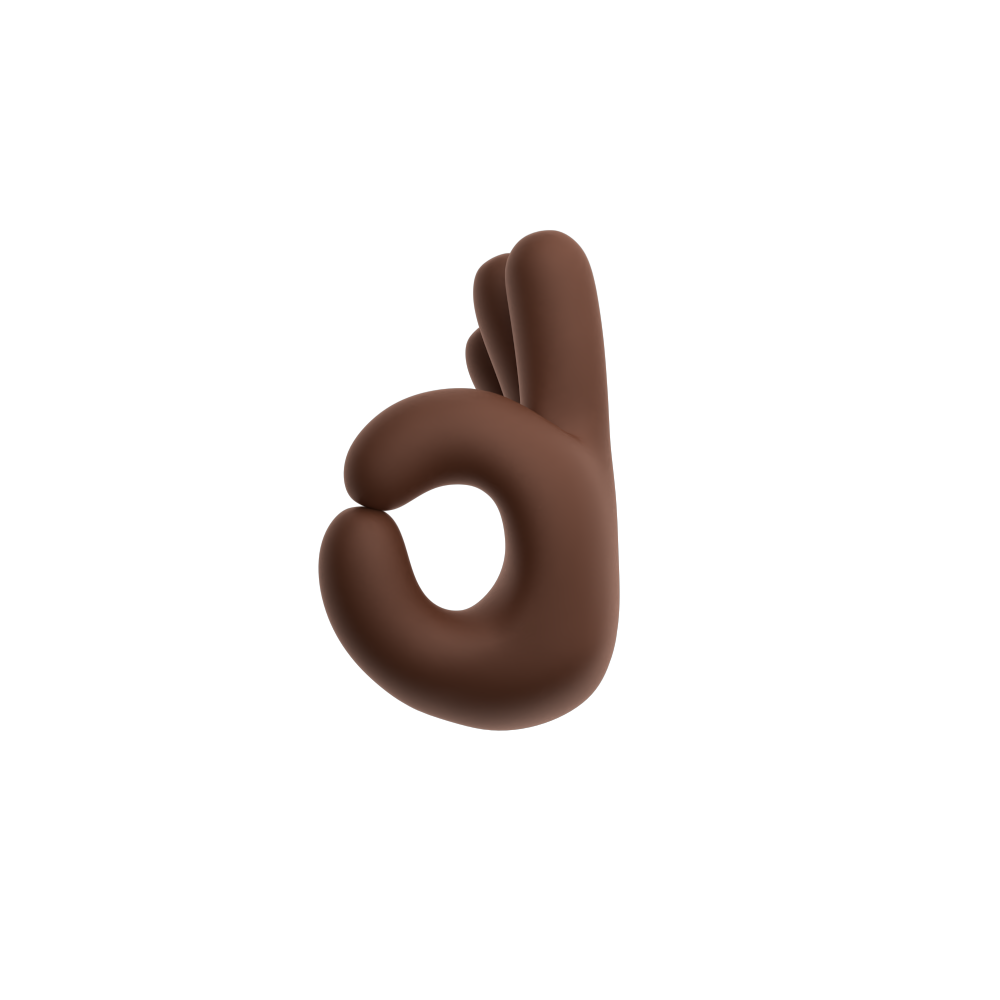
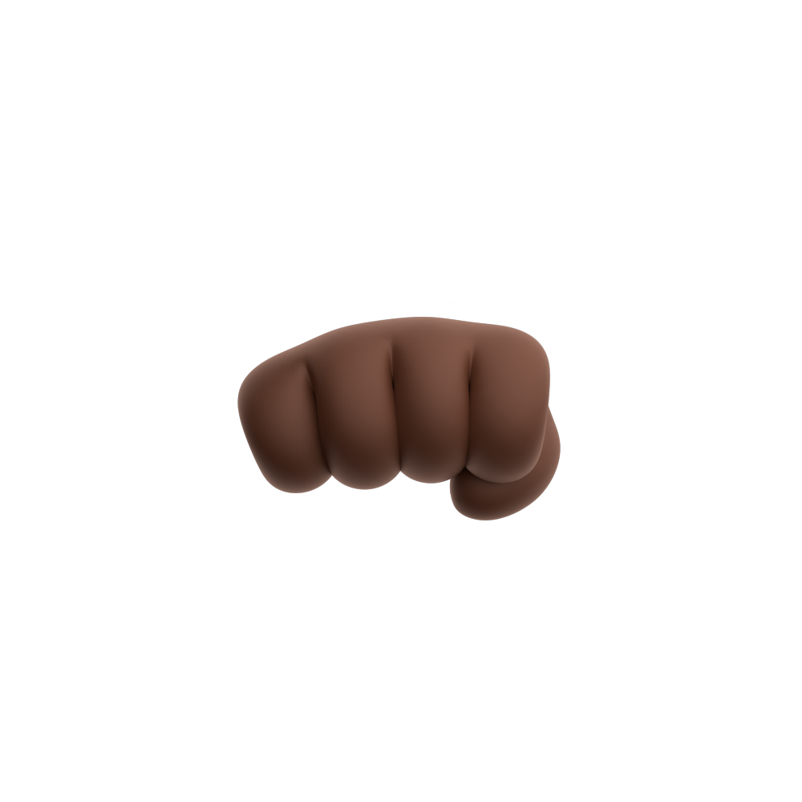
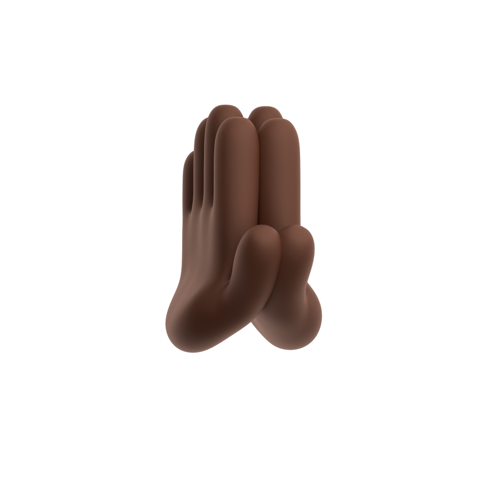
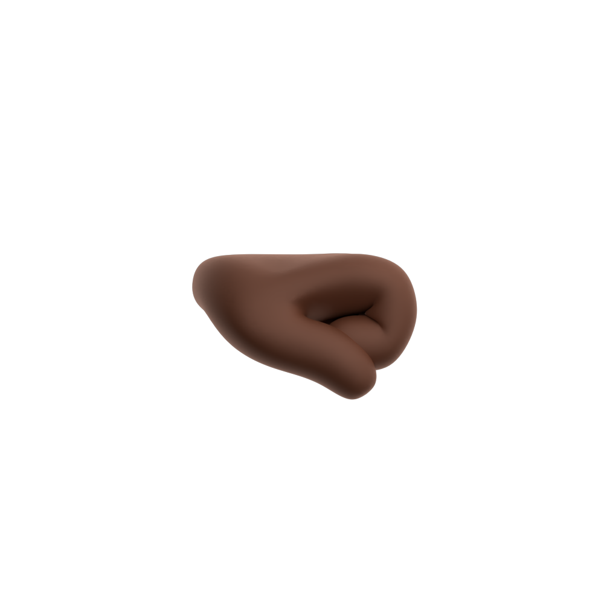
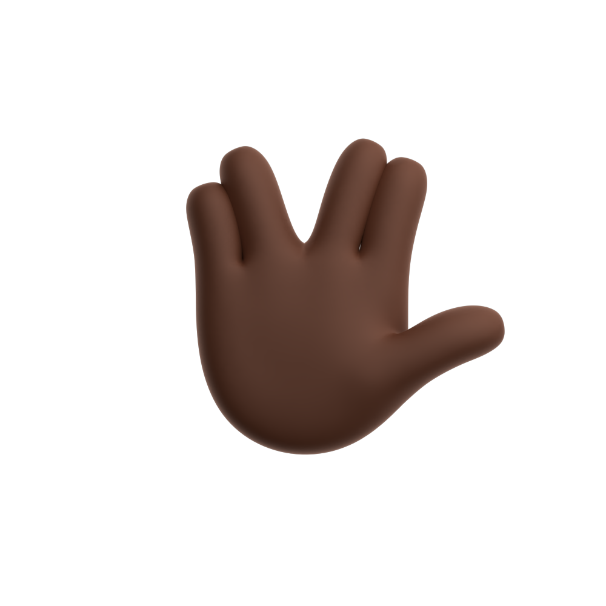
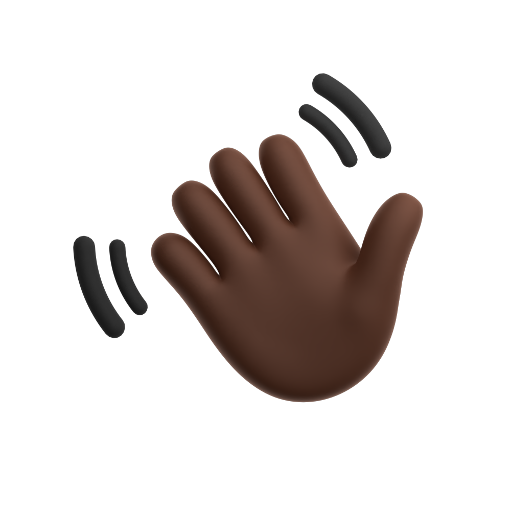
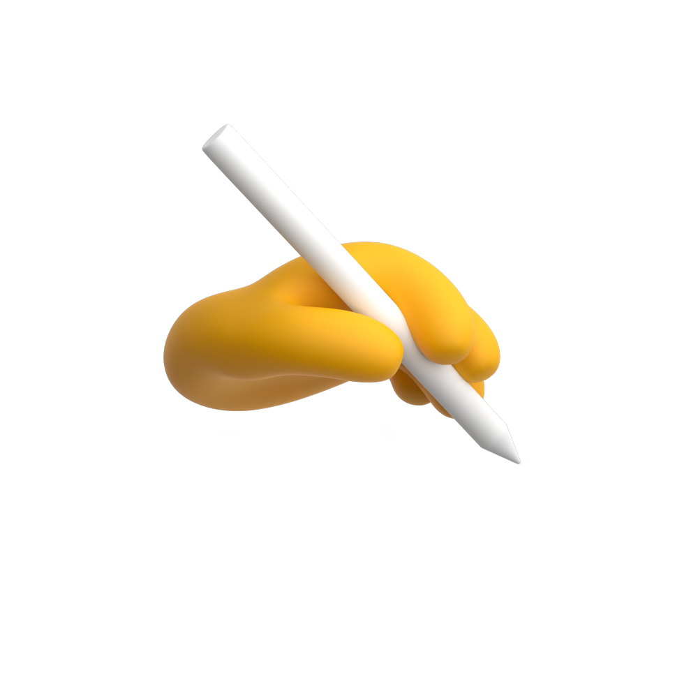
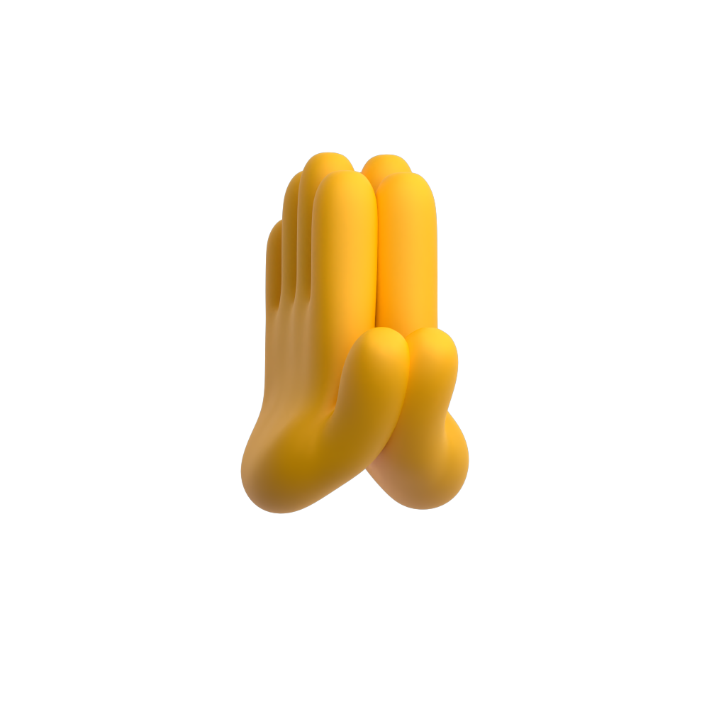

# 🖼️ 素材分類：3D_EmojisGestures

> [🏠 主目錄](../../../README.md) / **3D_EmojisGestures**

本目錄共有 `33` 個檔案

| 🎨 預覽 (點擊放大) | 📋 檔案詳細資訊 |
| :--- | :--- |
|  | **📂 檔名:** `Black-Claps-83.png` 🖼️ **尺寸:** `1000x1000 px` ⚖️ **大小:** `155.40KB` 📅 **更新:** `2026-02-27`  🔗 [直接查看原始檔](Black-Claps-83.png) |
|  | **📂 檔名:** `Black-GivingRight-f4.png` 🖼️ **尺寸:** `1000x1000 px` ⚖️ **大小:** `68.16KB` 📅 **更新:** `2026-02-27`  🔗 [直接查看原始檔](Black-GivingRight-f4.png) |
|  | **📂 檔名:** `Black-HandHoldingPencilRight-7d.png` 🖼️ **尺寸:** `1000x1000 px` ⚖️ **大小:** `90.92KB` 📅 **更新:** `2026-02-27`  🔗 [直接查看原始檔](Black-HandHoldingPencilRight-7d.png) |
|  | **📂 檔名:** `Black-Love-a2.png` 🖼️ **尺寸:** `1000x1000 px` ⚖️ **大小:** `97.12KB` 📅 **更新:** `2026-02-27`  🔗 [直接查看原始檔](Black-Love-a2.png) |
|  | **📂 檔名:** `Black-OkLeft-43.png` 🖼️ **尺寸:** `1000x1000 px` ⚖️ **大小:** `85.09KB` 📅 **更新:** `2026-02-27`  🔗 [直接查看原始檔](Black-OkLeft-43.png) |
|  | **📂 檔名:** `Black-OncomingFist-a6.png` 🖼️ **尺寸:** `1000x1000 px` ⚖️ **大小:** `63.24KB` 📅 **更新:** `2026-02-27`  🔗 [直接查看原始檔](Black-OncomingFist-a6.png) |
|  | **📂 檔名:** `Black-PinchingLeft-69.png` 🖼️ **尺寸:** `1000x1000 px` ⚖️ **大小:** `90.47KB` 📅 **更新:** `2026-02-27`  🔗 [直接查看原始檔](Black-PinchingLeft-69.png) |
|  | **📂 檔名:** `Black-PinchingRight-ce.png` 🖼️ **尺寸:** `1000x1000 px` ⚖️ **大小:** `88.52KB` 📅 **更新:** `2026-02-27`  🔗 [直接查看原始檔](Black-PinchingRight-ce.png) |
|  | **📂 檔名:** `Black-PointUp-2e.png` 🖼️ **尺寸:** `1000x1000 px` ⚖️ **大小:** `77.93KB` 📅 **更新:** `2026-02-27`  🔗 [直接查看原始檔](Black-PointUp-2e.png) |
|  | **📂 檔名:** `Black-PointUpFace-6b.png` 🖼️ **尺寸:** `1000x1000 px` ⚖️ **大小:** `89.40KB` 📅 **更新:** `2026-02-27`  🔗 [直接查看原始檔](Black-PointUpFace-6b.png) |
|  | **📂 檔名:** `Black-PointingRight-d0.png` 🖼️ **尺寸:** `1000x1000 px` ⚖️ **大小:** `76.02KB` 📅 **更新:** `2026-02-27`  🔗 [直接查看原始檔](Black-PointingRight-d0.png) |
|  | **📂 檔名:** `Black-Pray-4e.png` 🖼️ **尺寸:** `1000x1000 px` ⚖️ **大小:** `93.61KB` 📅 **更新:** `2026-02-27`  🔗 [直接查看原始檔](Black-Pray-4e.png) |
|  | **📂 檔名:** `Black-PunchRight-fd.png` 🖼️ **尺寸:** `1000x1000 px` ⚖️ **大小:** `53.42KB` 📅 **更新:** `2026-02-27`  🔗 [直接查看原始檔](Black-PunchRight-fd.png) |
|  | **📂 檔名:** `Black-RaisedFist-3b.png` 🖼️ **尺寸:** `1000x1000 px` ⚖️ **大小:** `80.67KB` 📅 **更新:** `2026-02-27`  🔗 [直接查看原始檔](Black-RaisedFist-3b.png) |
|  | **📂 檔名:** `Black-ThumbsDown-0e.png` 🖼️ **尺寸:** `1000x1000 px` ⚖️ **大小:** `94.36KB` 📅 **更新:** `2026-02-27`  🔗 [直接查看原始檔](Black-ThumbsDown-0e.png) |
|  | **📂 檔名:** `Black-VulcanSalute-cc.png` 🖼️ **尺寸:** `1000x1000 px` ⚖️ **大小:** `104.95KB` 📅 **更新:** `2026-02-27`  🔗 [直接查看原始檔](Black-VulcanSalute-cc.png) |
|  | **📂 檔名:** `Black-Wave-62.png` 🖼️ **尺寸:** `1000x1000 px` ⚖️ **大小:** `152.58KB` 📅 **更新:** `2026-02-27`  🔗 [直接查看原始檔](Black-Wave-62.png) |
|  | **📂 檔名:** `Yellow-CallMe-e2.png` 🖼️ **尺寸:** `1000x1000 px` ⚖️ **大小:** `86.12KB` 📅 **更新:** `2026-02-27`  🔗 [直接查看原始檔](Yellow-CallMe-e2.png) |
|  | **📂 檔名:** `Yellow-Claps-89.png` 🖼️ **尺寸:** `1000x1000 px` ⚖️ **大小:** `171.40KB` 📅 **更新:** `2026-02-27`  🔗 [直接查看原始檔](Yellow-Claps-89.png) |
|  | **📂 檔名:** `Yellow-Hand-9b.png` 🖼️ **尺寸:** `1000x1000 px` ⚖️ **大小:** `116.88KB` 📅 **更新:** `2026-02-27`  🔗 [直接查看原始檔](Yellow-Hand-9b.png) |
|  | **📂 檔名:** `Yellow-HandHoldingPencilRight-2e.png` 🖼️ **尺寸:** `1000x1000 px` ⚖️ **大小:** `95.96KB` 📅 **更新:** `2026-02-27`  🔗 [直接查看原始檔](Yellow-HandHoldingPencilRight-2e.png) |
|  | **📂 檔名:** `Yellow-Horns-86.png` 🖼️ **尺寸:** `1000x1000 px` ⚖️ **大小:** `99.95KB` 📅 **更新:** `2026-02-27`  🔗 [直接查看原始檔](Yellow-Horns-86.png) |
|  | **📂 檔名:** `Yellow-Love-13.png` 🖼️ **尺寸:** `1000x1000 px` ⚖️ **大小:** `106.74KB` 📅 **更新:** `2026-02-27`  🔗 [直接查看原始檔](Yellow-Love-13.png) |
|  | **📂 檔名:** `Yellow-OncomingFist-37.png` 🖼️ **尺寸:** `1000x1000 px` ⚖️ **大小:** `68.35KB` 📅 **更新:** `2026-02-27`  🔗 [直接查看原始檔](Yellow-OncomingFist-37.png) |
|  | **📂 檔名:** `Yellow-PointingDown-e9.png` 🖼️ **尺寸:** `1000x1000 px` ⚖️ **大小:** `86.28KB` 📅 **更新:** `2026-02-27`  🔗 [直接查看原始檔](Yellow-PointingDown-e9.png) |
|  | **📂 檔名:** `Yellow-PointingLeft-18.png` 🖼️ **尺寸:** `1000x1000 px` ⚖️ **大小:** `83.91KB` 📅 **更新:** `2026-02-27`  🔗 [直接查看原始檔](Yellow-PointingLeft-18.png) |
|  | **📂 檔名:** `Yellow-PointingRight-32.png` 🖼️ **尺寸:** `1000x1000 px` ⚖️ **大小:** `84.29KB` 📅 **更新:** `2026-02-27`  🔗 [直接查看原始檔](Yellow-PointingRight-32.png) |
|  | **📂 檔名:** `Yellow-Poke-89.png` 🖼️ **尺寸:** `1000x1000 px` ⚖️ **大小:** `64.03KB` 📅 **更新:** `2026-02-27`  🔗 [直接查看原始檔](Yellow-Poke-89.png) |
|  | **📂 檔名:** `Yellow-Pray-04.png` 🖼️ **尺寸:** `1000x1000 px` ⚖️ **大小:** `97.75KB` 📅 **更新:** `2026-02-27`  🔗 [直接查看原始檔](Yellow-Pray-04.png) |
|  | **📂 檔名:** `Yellow-RaisedFist-60.png` 🖼️ **尺寸:** `1000x1000 px` ⚖️ **大小:** `89.33KB` 📅 **更新:** `2026-02-27`  🔗 [直接查看原始檔](Yellow-RaisedFist-60.png) |
|  | **📂 檔名:** `Yellow-ThumbsDown-df.png` 🖼️ **尺寸:** `1000x1000 px` ⚖️ **大小:** `102.95KB` 📅 **更新:** `2026-02-27`  🔗 [直接查看原始檔](Yellow-ThumbsDown-df.png) |
|  | **📂 檔名:** `Yellow-Victory-c6.png` 🖼️ **尺寸:** `1000x1000 px` ⚖️ **大小:** `104.00KB` 📅 **更新:** `2026-02-27`  🔗 [直接查看原始檔](Yellow-Victory-c6.png) |
|  | **📂 檔名:** `Yellow-Wave-72.png` 🖼️ **尺寸:** `1000x1000 px` ⚖️ **大小:** `169.31KB` 📅 **更新:** `2026-02-27`  🔗 [直接查看原始檔](Yellow-Wave-72.png) |