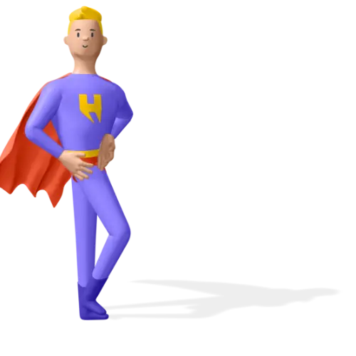

# 🖼️ 素材分類：3D_Heros

> [🏠 主目錄](../../../README.md) / **3D_Heros**

本目錄共有 `24` 個檔案

| 🎨 預覽 (點擊放大) | 📋 檔案詳細資訊與連結 |
| :--- | :--- |
|  | **📂 檔名:** `hero-1-14.webp` 🖼️ **尺寸:** `500x500 px` ⚖️ **大小:** `10.78KB` 📅 **更新:** `2026-02-27`  🔗 **複製 Markdown 語法:** `` 📥 [檢視原始檔](hero-1-14.webp) |
|  | **📂 檔名:** `hero-1-c5.png` 🖼️ **尺寸:** `500x500 px` ⚖️ **大小:** `86.00KB` 📅 **更新:** `2026-02-27`  🔗 **複製 Markdown 語法:** `` 📥 [檢視原始檔](hero-1-c5.png) |
|  | **📂 檔名:** `hero-10-6f.png` 🖼️ **尺寸:** `500x500 px` ⚖️ **大小:** `41.77KB` 📅 **更新:** `2026-02-27`  🔗 **複製 Markdown 語法:** `` 📥 [檢視原始檔](hero-10-6f.png) |
|  | **📂 檔名:** `hero-10-e9.webp` 🖼️ **尺寸:** `500x500 px` ⚖️ **大小:** `11.23KB` 📅 **更新:** `2026-02-27`  🔗 **複製 Markdown 語法:** `` 📥 [檢視原始檔](hero-10-e9.webp) |
|  | **📂 檔名:** `hero-11-07.webp` 🖼️ **尺寸:** `500x500 px` ⚖️ **大小:** `13.07KB` 📅 **更新:** `2026-02-27`  🔗 **複製 Markdown 語法:** `` 📥 [檢視原始檔](hero-11-07.webp) |
|  | **📂 檔名:** `hero-11-53.png` 🖼️ **尺寸:** `500x500 px` ⚖️ **大小:** `57.47KB` 📅 **更新:** `2026-02-27`  🔗 **複製 Markdown 語法:** `` 📥 [檢視原始檔](hero-11-53.png) |
|  | **📂 檔名:** `hero-12-18.png` 🖼️ **尺寸:** `500x500 px` ⚖️ **大小:** `45.89KB` 📅 **更新:** `2026-02-27`  🔗 **複製 Markdown 語法:** `` 📥 [檢視原始檔](hero-12-18.png) |
|  | **📂 檔名:** `hero-12-92.webp` 🖼️ **尺寸:** `500x500 px` ⚖️ **大小:** `11.88KB` 📅 **更新:** `2026-02-27`  🔗 **複製 Markdown 語法:** `` 📥 [檢視原始檔](hero-12-92.webp) |
|  | **📂 檔名:** `hero-2-47.webp` 🖼️ **尺寸:** `500x500 px` ⚖️ **大小:** `15.78KB` 📅 **更新:** `2026-02-27`  🔗 **複製 Markdown 語法:** `` 📥 [檢視原始檔](hero-2-47.webp) |
|  | **📂 檔名:** `hero-2-8d.png` 🖼️ **尺寸:** `500x500 px` ⚖️ **大小:** `52.03KB` 📅 **更新:** `2026-02-27`  🔗 **複製 Markdown 語法:** `` 📥 [檢視原始檔](hero-2-8d.png) |
|  | **📂 檔名:** `hero-3-0a.webp` 🖼️ **尺寸:** `500x500 px` ⚖️ **大小:** `13.88KB` 📅 **更新:** `2026-02-27`  🔗 **複製 Markdown 語法:** `` 📥 [檢視原始檔](hero-3-0a.webp) |
|  | **📂 檔名:** `hero-3-68.png` 🖼️ **尺寸:** `500x500 px` ⚖️ **大小:** `57.17KB` 📅 **更新:** `2026-02-27`  🔗 **複製 Markdown 語法:** `` 📥 [檢視原始檔](hero-3-68.png) |
|  | **📂 檔名:** `hero-4-50.webp` 🖼️ **尺寸:** `500x500 px` ⚖️ **大小:** `13.48KB` 📅 **更新:** `2026-02-27`  🔗 **複製 Markdown 語法:** `` 📥 [檢視原始檔](hero-4-50.webp) |
|  | **📂 檔名:** `hero-4-82.png` 🖼️ **尺寸:** `500x500 px` ⚖️ **大小:** `52.96KB` 📅 **更新:** `2026-02-27`  🔗 **複製 Markdown 語法:** `` 📥 [檢視原始檔](hero-4-82.png) |
|  | **📂 檔名:** `hero-5-bd.png` 🖼️ **尺寸:** `500x500 px` ⚖️ **大小:** `63.61KB` 📅 **更新:** `2026-02-27`  🔗 **複製 Markdown 語法:** `` 📥 [檢視原始檔](hero-5-bd.png) |
|  | **📂 檔名:** `hero-5-cf.webp` 🖼️ **尺寸:** `500x500 px` ⚖️ **大小:** `13.73KB` 📅 **更新:** `2026-02-27`  🔗 **複製 Markdown 語法:** `` 📥 [檢視原始檔](hero-5-cf.webp) |
|  | **📂 檔名:** `hero-6-26.webp` 🖼️ **尺寸:** `500x500 px` ⚖️ **大小:** `12.02KB` 📅 **更新:** `2026-02-27`  🔗 **複製 Markdown 語法:** `` 📥 [檢視原始檔](hero-6-26.webp) |
|  | **📂 檔名:** `hero-6-86.png` 🖼️ **尺寸:** `500x500 px` ⚖️ **大小:** `50.52KB` 📅 **更新:** `2026-02-27`  🔗 **複製 Markdown 語法:** `` 📥 [檢視原始檔](hero-6-86.png) |
|  | **📂 檔名:** `hero-7-4d.webp` 🖼️ **尺寸:** `500x500 px` ⚖️ **大小:** `12.06KB` 📅 **更新:** `2026-02-27`  🔗 **複製 Markdown 語法:** `` 📥 [檢視原始檔](hero-7-4d.webp) |
|  | **📂 檔名:** `hero-7-fe.png` 🖼️ **尺寸:** `500x500 px` ⚖️ **大小:** `81.43KB` 📅 **更新:** `2026-02-27`  🔗 **複製 Markdown 語法:** `` 📥 [檢視原始檔](hero-7-fe.png) |
|  | **📂 檔名:** `hero-8-4d.webp` 🖼️ **尺寸:** `500x500 px` ⚖️ **大小:** `12.67KB` 📅 **更新:** `2026-02-27`  🔗 **複製 Markdown 語法:** `` 📥 [檢視原始檔](hero-8-4d.webp) |
|  | **📂 檔名:** `hero-8-a7.png` 🖼️ **尺寸:** `500x500 px` ⚖️ **大小:** `45.11KB` 📅 **更新:** `2026-02-27`  🔗 **複製 Markdown 語法:** `` 📥 [檢視原始檔](hero-8-a7.png) |
|  | **📂 檔名:** `hero-9-59.webp` 🖼️ **尺寸:** `500x500 px` ⚖️ **大小:** `13.41KB` 📅 **更新:** `2026-02-27`  🔗 **複製 Markdown 語法:** `` 📥 [檢視原始檔](hero-9-59.webp) |
|  | **📂 檔名:** `hero-9-6c.png` 🖼️ **尺寸:** `500x500 px` ⚖️ **大小:** `51.03KB` 📅 **更新:** `2026-02-27`  🔗 **複製 Markdown 語法:** `` 📥 [檢視原始檔](hero-9-6c.png) |