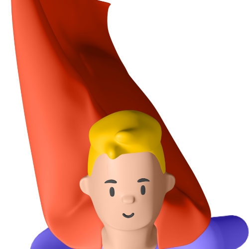
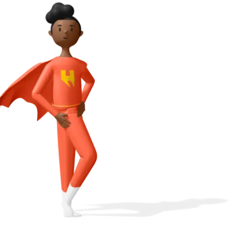
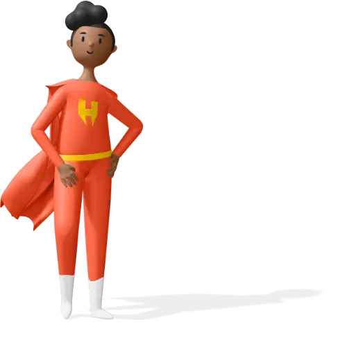

# 🖼️ 3D_Heros Gallery

[⬅️ 回到首頁](../../README.md)

| 預覽 | 詳細資訊 |
| :--- | :--- |
|  | **hero-1-14.webp** 500x500 | 10.78KB 更新: 2026-02-26 |
|  | **hero-1-c5.png** 500x500 | 86.00KB 更新: 2026-02-26 |
|  | **hero-10-6f.png** 500x500 | 41.77KB 更新: 2026-02-26 |
|  | **hero-10-e9.webp** 500x500 | 11.23KB 更新: 2026-02-26 |
|  | **hero-11-07.webp** 500x500 | 13.07KB 更新: 2026-02-26 |
|  | **hero-11-53.png** 500x500 | 57.47KB 更新: 2026-02-26 |
|  | **hero-12-18.png** 500x500 | 45.89KB 更新: 2026-02-26 |
|  | **hero-12-92.webp** 500x500 | 11.88KB 更新: 2026-02-26 |
|  | **hero-2-47.webp** 500x500 | 15.78KB 更新: 2026-02-26 |
|  | **hero-2-8d.png** 500x500 | 52.03KB 更新: 2026-02-26 |
|  | **hero-3-0a.webp** 500x500 | 13.88KB 更新: 2026-02-26 |
|  | **hero-3-68.png** 500x500 | 57.17KB 更新: 2026-02-26 |
|  | **hero-4-50.webp** 500x500 | 13.48KB 更新: 2026-02-26 |
|  | **hero-4-82.png** 500x500 | 52.96KB 更新: 2026-02-26 |
|  | **hero-5-bd.png** 500x500 | 63.61KB 更新: 2026-02-26 |
|  | **hero-5-cf.webp** 500x500 | 13.73KB 更新: 2026-02-26 |
|  | **hero-6-26.webp** 500x500 | 12.02KB 更新: 2026-02-26 |
|  | **hero-6-86.png** 500x500 | 50.52KB 更新: 2026-02-26 |
|  | **hero-7-4d.webp** 500x500 | 12.06KB 更新: 2026-02-26 |
|  | **hero-7-fe.png** 500x500 | 81.43KB 更新: 2026-02-26 |
|  | **hero-8-4d.webp** 500x500 | 12.67KB 更新: 2026-02-26 |
|  | **hero-8-a7.png** 500x500 | 45.11KB 更新: 2026-02-26 |
|  | **hero-9-59.webp** 500x500 | 13.41KB 更新: 2026-02-26 |
|  | **hero-9-6c.png** 500x500 | 51.03KB 更新: 2026-02-26 |