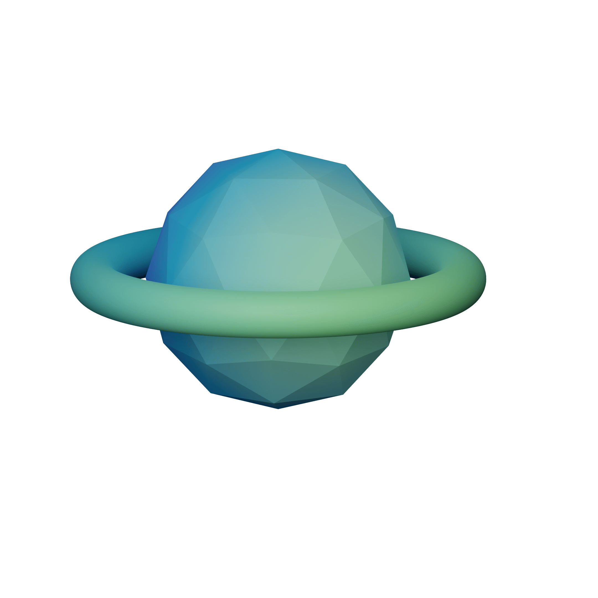
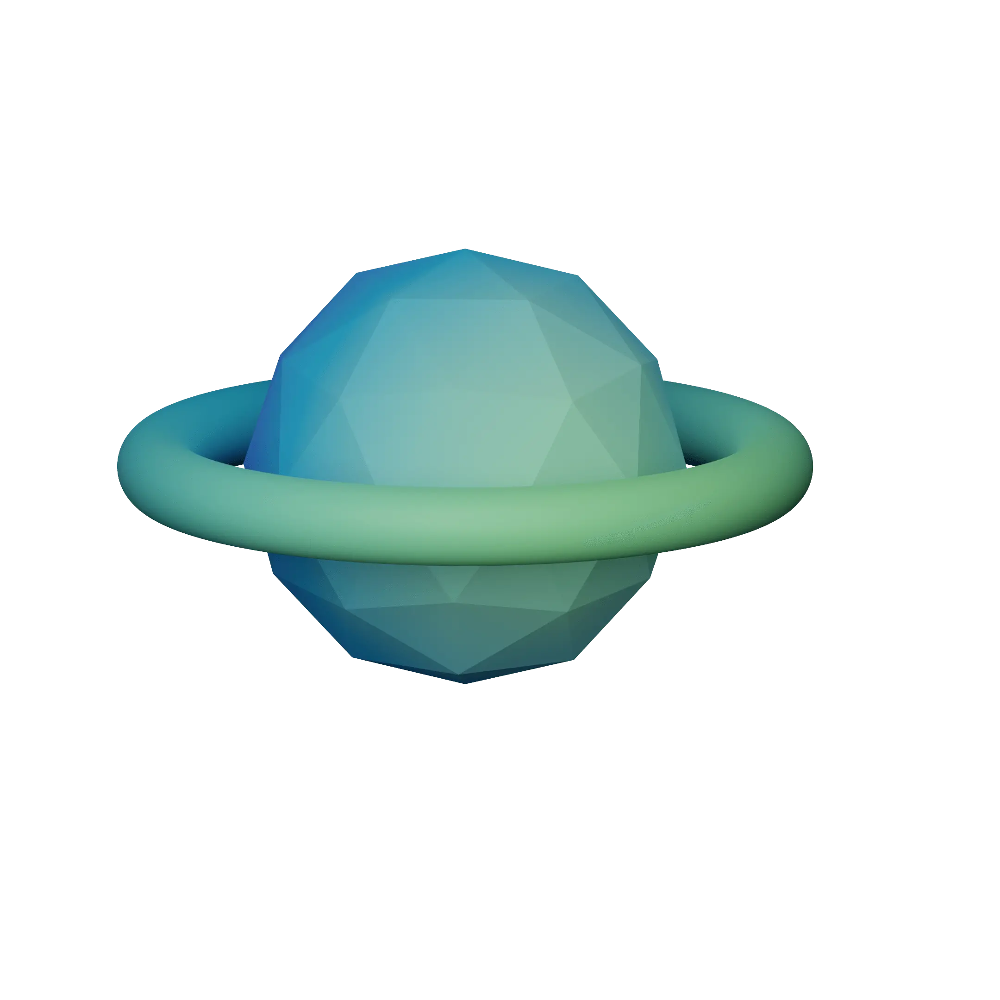
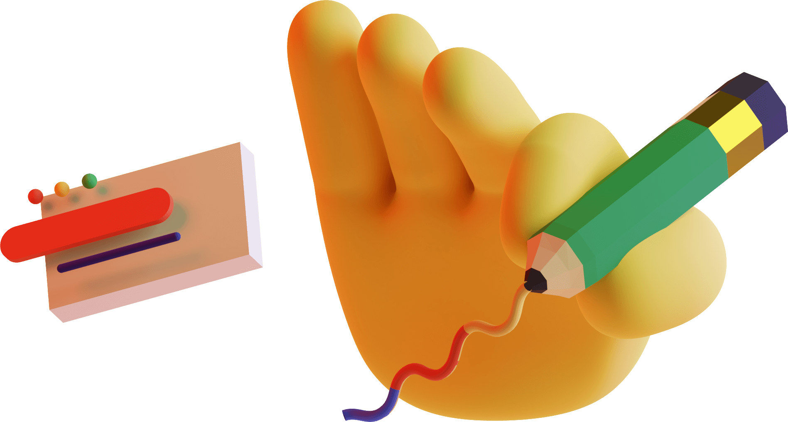
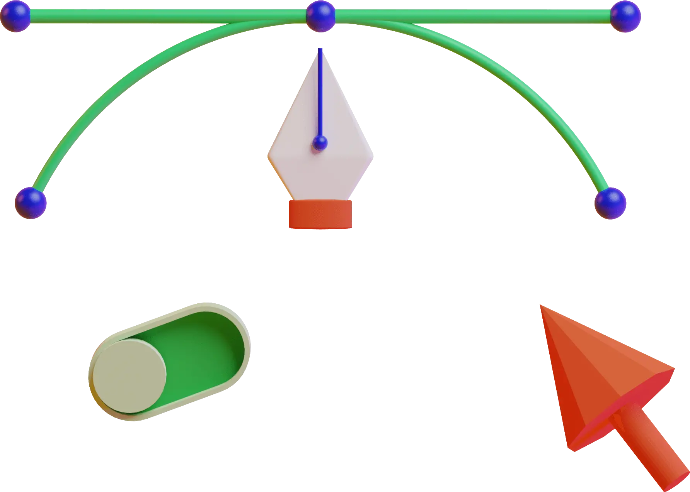
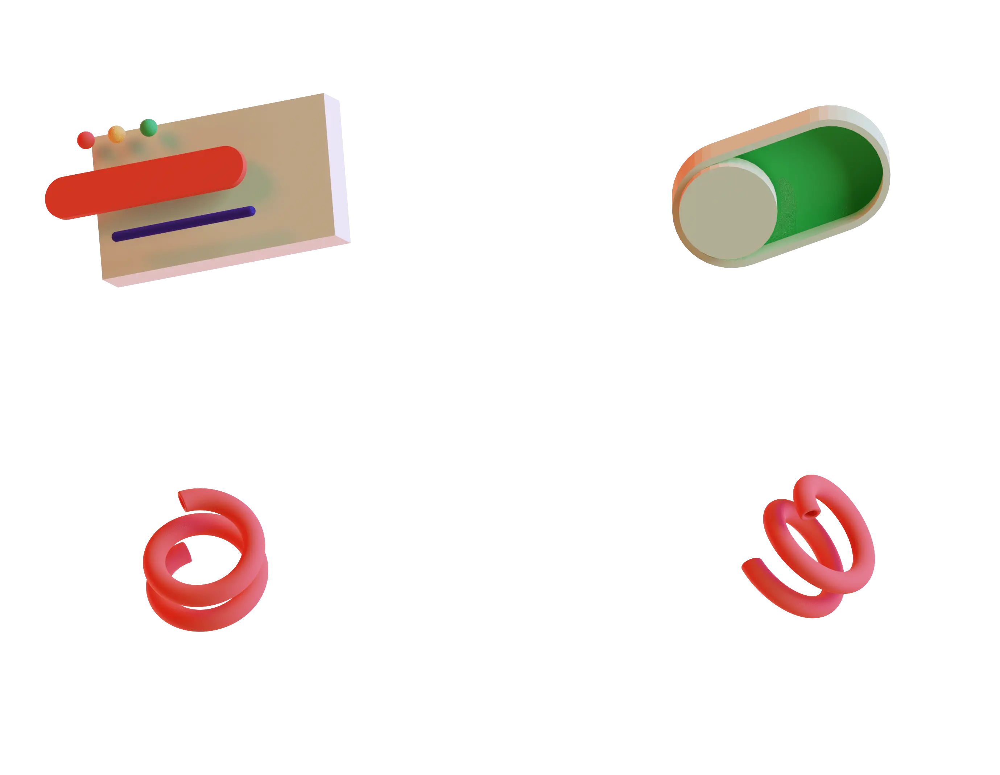
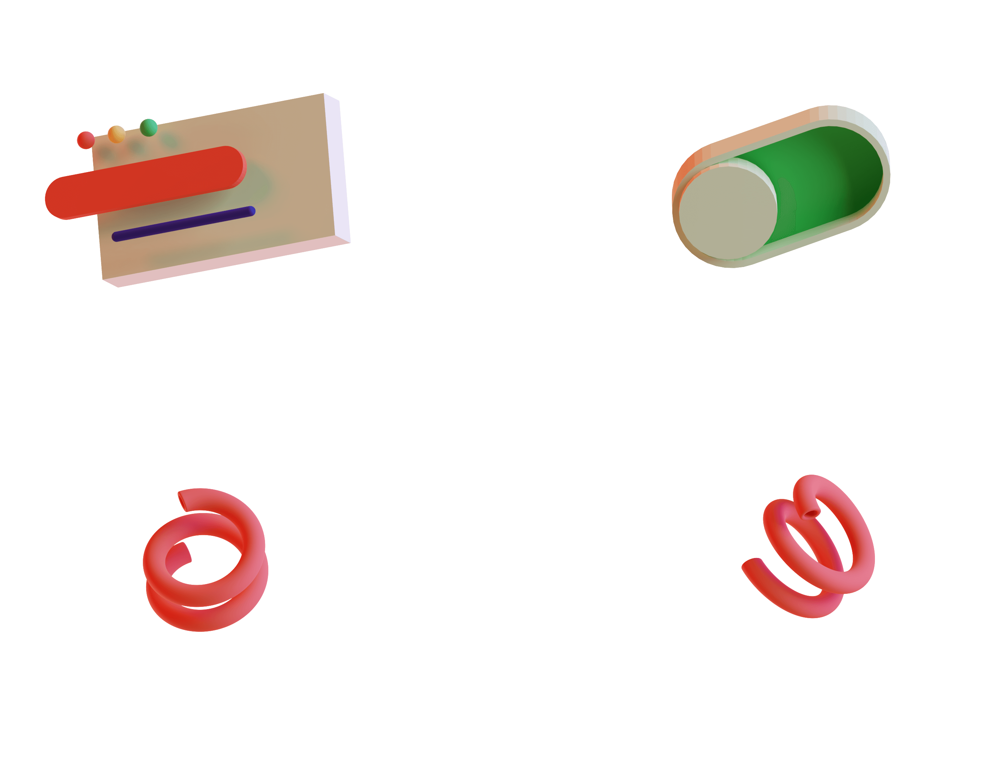
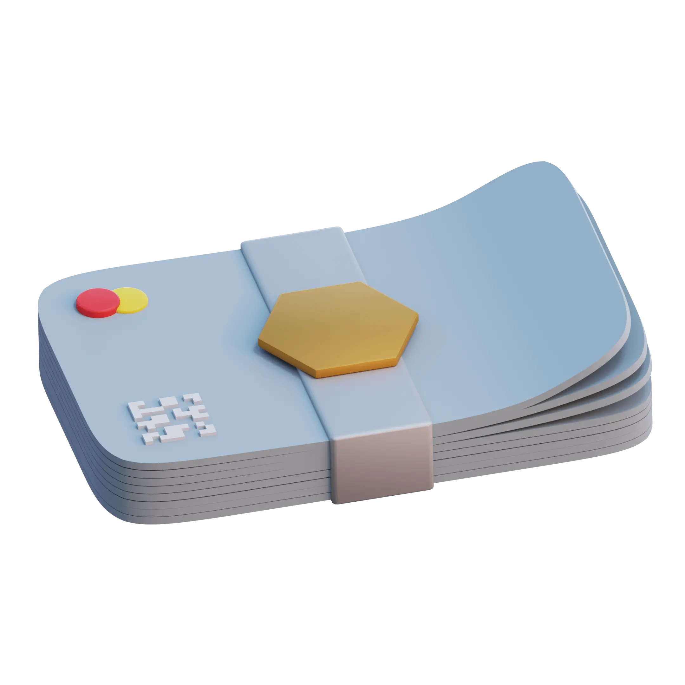

# 🖼️ 3D_Illustration-Saly

[⬅️ 返回主目錄](../../../README.md)

| 預覽 | 資訊 |
| :--- | :--- |
|  | **Saly_1-70.webp** |
|  | **Saly_1-9d.png** |
|  | **Saly_10-d9.png** |
|  | **Saly_10-f0.webp** |
|  | **Saly_11-63.webp** |
|  | **Saly_11-a9.png** |
|  | **Saly_12-95.webp** |
|  | **Saly_12-96.png** |
|  | **Saly_13-c4.png** |
|  | **Saly_13-c4.webp** |
|  | **Saly_14-2f.png** |
|  | **Saly_14-84.webp** |
|  | **Saly_15-9e.webp** |
|  | **Saly_15-df.png** |
|  | **Saly_16-37.webp** |
|  | **Saly_16-3b.png** |
|  | **Saly_17-18.webp** |
|  | **Saly_17-8e.png** |
|  | **Saly_18-60.webp** |
|  | **Saly_18-a2.png** |
|  | **Saly_19-3a.png** |
|  | **Saly_19-fd.webp** |
|  | **Saly_2-96.png** |
|  | **Saly_2-ed.webp** |
|  | **Saly_20-4a.png** |
|  | **Saly_20-c5.webp** |
|  | **Saly_21-27.png** |
|  | **Saly_21-2c.webp** |
|  | **Saly_22-25.webp** |
|  | **Saly_22-4b.png** |
|  | **Saly_23-37.webp** |
|  | **Saly_23-42.png** |
|  | **Saly_24-58.png** |
|  | **Saly_24-a6.webp** |
|  | **Saly_25-21.png** |
|  | **Saly_25-22.webp** |
|  | **Saly_26-37.webp** |
|  | **Saly_26-8f.png** |
|  | **Saly_27-a5.webp** |
|  | **Saly_27-c5.png** |
|  | **Saly_29-10.webp** |
|  | **Saly_29-f5.png** |
|  | **Saly_3-83.webp** |
|  | **Saly_3-e1.png** |
|  | **Saly_30-42.png** |
|  | **Saly_30-bb.webp** |
|  | **Saly_31-04.png** |
|  | **Saly_31-c1.webp** |
|  | **Saly_32-4a.webp** |
|  | **Saly_32-68.png** |
|  | **Saly_33-43.webp** |
|  | **Saly_33-56.png** |
|  | **Saly_34-75.png** |
|  | **Saly_34-9c.webp** |
|  | **Saly_35-39.webp** |
|  | **Saly_35-63.png** |
|  | **Saly_36-30.webp** |
|  | **Saly_36-7f.png** |
|  | **Saly_37-e5.png** |
|  | **Saly_37-f4.webp** |
|  | **Saly_38-63.png** |
|  | **Saly_38-c4.webp** |
|  | **Saly_39-1b.png** |
|  | **Saly_39-75.webp** |
|  | **Saly_4-08.png** |
|  | **Saly_4-9e.webp** |
|  | **Saly_40-51.png** |
|  | **Saly_40-fd.webp** |
|  | **Saly_41-c0.png** |
|  | **Saly_41-e4.webp** |
|  | **Saly_42-85.webp** |
|  | **Saly_42-a0.png** |
|  | **Saly_43-47.webp** |
|  | **Saly_43-74.png** |
|  | **Saly_44-3d.webp** |
|  | **Saly_44-c0.png** |
|  | **Saly_45-6c.png** |
|  | **Saly_45-82.webp** |
|  | **Saly_5-05.png** |
|  | **Saly_5-8c.webp** |
|  | **Saly_6-73.png** |
|  | **Saly_6-89.webp** |
|  | **Saly_7-f2.png** |
|  | **Saly_7-f9.webp** |
|  | **Saly_8-9b.webp** |
|  | **Saly_8-f2.png** |
|  | **Saly_9-4d.png** |
|  | **Saly_9-73.webp** |
|  | **saly_28-53.png** |
|  | **saly_28-9f.webp** |