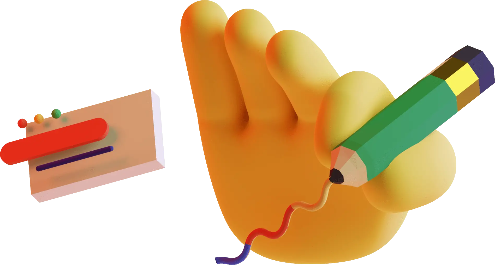

# 🖼️ 素材分類：3D_Illustration-Saly

> [🏠 主目錄](../../../README.md) / **3D_Illustration-Saly**

本目錄共有 `90` 個檔案

| 🎨 預覽 (點擊放大) | 📋 檔案詳細資訊 |
| :--- | :--- |
|  | **📂 檔名:** `Saly_1-70.webp` 🖼️ **尺寸:** `2160x2160 px` ⚖️ **大小:** `58.22KB` 📅 **更新:** `2026-02-27`  🔗 [直接查看原始檔](Saly_1-70.webp) |
|  | **📂 檔名:** `Saly_1-9d.png` 🖼️ **尺寸:** `2160x2160 px` ⚖️ **大小:** `214.21KB` 📅 **更新:** `2026-02-27`  🔗 [直接查看原始檔](Saly_1-9d.png) |
|  | **📂 檔名:** `Saly_10-d9.png` 🖼️ **尺寸:** `2160x2160 px` ⚖️ **大小:** `241.79KB` 📅 **更新:** `2026-02-27`  🔗 [直接查看原始檔](Saly_10-d9.png) |
|  | **📂 檔名:** `Saly_10-f0.webp` 🖼️ **尺寸:** `2160x2160 px` ⚖️ **大小:** `93.21KB` 📅 **更新:** `2026-02-27`  🔗 [直接查看原始檔](Saly_10-f0.webp) |
|  | **📂 檔名:** `Saly_11-63.webp` 🖼️ **尺寸:** `2160x2048 px` ⚖️ **大小:** `58.65KB` 📅 **更新:** `2026-02-27`  🔗 [直接查看原始檔](Saly_11-63.webp) |
|  | **📂 檔名:** `Saly_11-a9.png` 🖼️ **尺寸:** `2160x2048 px` ⚖️ **大小:** `269.96KB` 📅 **更新:** `2026-02-27`  🔗 [直接查看原始檔](Saly_11-a9.png) |
|  | **📂 檔名:** `Saly_12-95.webp` 🖼️ **尺寸:** `2160x2160 px` ⚖️ **大小:** `52.04KB` 📅 **更新:** `2026-02-27`  🔗 [直接查看原始檔](Saly_12-95.webp) |
|  | **📂 檔名:** `Saly_12-96.png` 🖼️ **尺寸:** `2160x2160 px` ⚖️ **大小:** `242.74KB` 📅 **更新:** `2026-02-27`  🔗 [直接查看原始檔](Saly_12-96.png) |
|  | **📂 檔名:** `Saly_13-c4.png` 🖼️ **尺寸:** `2160x2160 px` ⚖️ **大小:** `156.66KB` 📅 **更新:** `2026-02-27`  🔗 [直接查看原始檔](Saly_13-c4.png) |
|  | **📂 檔名:** `Saly_13-c4.webp` 🖼️ **尺寸:** `2160x2160 px` ⚖️ **大小:** `43.78KB` 📅 **更新:** `2026-02-27`  🔗 [直接查看原始檔](Saly_13-c4.webp) |
|  | **📂 檔名:** `Saly_14-2f.png` 🖼️ **尺寸:** `1365x2023 px` ⚖️ **大小:** `173.28KB` 📅 **更新:** `2026-02-27`  🔗 [直接查看原始檔](Saly_14-2f.png) |
|  | **📂 檔名:** `Saly_14-84.webp` 🖼️ **尺寸:** `1365x2023 px` ⚖️ **大小:** `40.53KB` 📅 **更新:** `2026-02-27`  🔗 [直接查看原始檔](Saly_14-84.webp) |
|  | **📂 檔名:** `Saly_15-9e.webp` 🖼️ **尺寸:** `1520x2182 px` ⚖️ **大小:** `60.31KB` 📅 **更新:** `2026-02-27`  🔗 [直接查看原始檔](Saly_15-9e.webp) |
|  | **📂 檔名:** `Saly_15-df.png` 🖼️ **尺寸:** `1520x2182 px` ⚖️ **大小:** `198.55KB` 📅 **更新:** `2026-02-27`  🔗 [直接查看原始檔](Saly_15-df.png) |
|  | **📂 檔名:** `Saly_16-37.webp` 🖼️ **尺寸:** `2624x2086 px` ⚖️ **大小:** `77.88KB` 📅 **更新:** `2026-02-27`  🔗 [直接查看原始檔](Saly_16-37.webp) |
|  | **📂 檔名:** `Saly_16-3b.png` 🖼️ **尺寸:** `2624x2086 px` ⚖️ **大小:** `397.63KB` 📅 **更新:** `2026-02-27`  🔗 [直接查看原始檔](Saly_16-3b.png) |
|  | **📂 檔名:** `Saly_17-18.webp` 🖼️ **尺寸:** `2996x1594 px` ⚖️ **大小:** `50.85KB` 📅 **更新:** `2026-02-27`  🔗 [直接查看原始檔](Saly_17-18.webp) |
|  | **📂 檔名:** `Saly_17-8e.png` 🖼️ **尺寸:** `2996x1594 px` ⚖️ **大小:** `366.20KB` 📅 **更新:** `2026-02-27`  🔗 [直接查看原始檔](Saly_17-8e.png) |
|  | **📂 檔名:** `Saly_18-60.webp` 🖼️ **尺寸:** `2160x2160 px` ⚖️ **大小:** `59.23KB` 📅 **更新:** `2026-02-27`  🔗 [直接查看原始檔](Saly_18-60.webp) |
|  | **📂 檔名:** `Saly_18-a2.png` 🖼️ **尺寸:** `2160x2160 px` ⚖️ **大小:** `221.96KB` 📅 **更新:** `2026-02-27`  🔗 [直接查看原始檔](Saly_18-a2.png) |
|  | **📂 檔名:** `Saly_19-3a.png` 🖼️ **尺寸:** `2160x2160 px` ⚖️ **大小:** `298.34KB` 📅 **更新:** `2026-02-27`  🔗 [直接查看原始檔](Saly_19-3a.png) |
|  | **📂 檔名:** `Saly_19-fd.webp` 🖼️ **尺寸:** `2160x2160 px` ⚖️ **大小:** `108.11KB` 📅 **更新:** `2026-02-27`  🔗 [直接查看原始檔](Saly_19-fd.webp) |
|  | **📂 檔名:** `Saly_2-96.png` 🖼️ **尺寸:** `2160x2160 px` ⚖️ **大小:** `160.32KB` 📅 **更新:** `2026-02-27`  🔗 [直接查看原始檔](Saly_2-96.png) |
|  | **📂 檔名:** `Saly_2-ed.webp` 🖼️ **尺寸:** `2160x2160 px` ⚖️ **大小:** `42.89KB` 📅 **更新:** `2026-02-27`  🔗 [直接查看原始檔](Saly_2-ed.webp) |
|  | **📂 檔名:** `Saly_20-4a.png` 🖼️ **尺寸:** `2160x2160 px` ⚖️ **大小:** `204.27KB` 📅 **更新:** `2026-02-27`  🔗 [直接查看原始檔](Saly_20-4a.png) |
|  | **📂 檔名:** `Saly_20-c5.webp` 🖼️ **尺寸:** `2160x2160 px` ⚖️ **大小:** `39.94KB` 📅 **更新:** `2026-02-27`  🔗 [直接查看原始檔](Saly_20-c5.webp) |
|  | **📂 檔名:** `Saly_21-27.png` 🖼️ **尺寸:** `2160x2160 px` ⚖️ **大小:** `173.42KB` 📅 **更新:** `2026-02-27`  🔗 [直接查看原始檔](Saly_21-27.png) |
|  | **📂 檔名:** `Saly_21-2c.webp` 🖼️ **尺寸:** `2160x2160 px` ⚖️ **大小:** `31.36KB` 📅 **更新:** `2026-02-27`  🔗 [直接查看原始檔](Saly_21-2c.webp) |
|  | **📂 檔名:** `Saly_22-25.webp` 🖼️ **尺寸:** `2160x2160 px` ⚖️ **大小:** `63.96KB` 📅 **更新:** `2026-02-27`  🔗 [直接查看原始檔](Saly_22-25.webp) |
|  | **📂 檔名:** `Saly_22-4b.png` 🖼️ **尺寸:** `2160x2160 px` ⚖️ **大小:** `233.69KB` 📅 **更新:** `2026-02-27`  🔗 [直接查看原始檔](Saly_22-4b.png) |
|  | **📂 檔名:** `Saly_23-37.webp` 🖼️ **尺寸:** `2160x2160 px` ⚖️ **大小:** `57.82KB` 📅 **更新:** `2026-02-27`  🔗 [直接查看原始檔](Saly_23-37.webp) |
|  | **📂 檔名:** `Saly_23-42.png` 🖼️ **尺寸:** `2160x2160 px` ⚖️ **大小:** `165.11KB` 📅 **更新:** `2026-02-27`  🔗 [直接查看原始檔](Saly_23-42.png) |
|  | **📂 檔名:** `Saly_24-58.png` 🖼️ **尺寸:** `2160x2160 px` ⚖️ **大小:** `219.47KB` 📅 **更新:** `2026-02-27`  🔗 [直接查看原始檔](Saly_24-58.png) |
|  | **📂 檔名:** `Saly_24-a6.webp` 🖼️ **尺寸:** `2160x2160 px` ⚖️ **大小:** `51.42KB` 📅 **更新:** `2026-02-27`  🔗 [直接查看原始檔](Saly_24-a6.webp) |
|  | **📂 檔名:** `Saly_25-21.png` 🖼️ **尺寸:** `1897x1017 px` ⚖️ **大小:** `194.61KB` 📅 **更新:** `2026-02-27`  🔗 [直接查看原始檔](Saly_25-21.png) |
|  | **📂 檔名:** `Saly_25-22.webp` 🖼️ **尺寸:** `1897x1017 px` ⚖️ **大小:** `40.74KB` 📅 **更新:** `2026-02-27`  🔗 [直接查看原始檔](Saly_25-22.webp) |
|  | **📂 檔名:** `Saly_26-37.webp` 🖼️ **尺寸:** `1391x1721 px` ⚖️ **大小:** `54.85KB` 📅 **更新:** `2026-02-27`  🔗 [直接查看原始檔](Saly_26-37.webp) |
|  | **📂 檔名:** `Saly_26-8f.png` 🖼️ **尺寸:** `1391x1721 px` ⚖️ **大小:** `237.84KB` 📅 **更新:** `2026-02-27`  🔗 [直接查看原始檔](Saly_26-8f.png) |
|  | **📂 檔名:** `Saly_27-a5.webp` 🖼️ **尺寸:** `1785x1275 px` ⚖️ **大小:** `42.33KB` 📅 **更新:** `2026-02-27`  🔗 [直接查看原始檔](Saly_27-a5.webp) |
|  | **📂 檔名:** `Saly_27-c5.png` 🖼️ **尺寸:** `1785x1275 px` ⚖️ **大小:** `72.56KB` 📅 **更新:** `2026-02-27`  🔗 [直接查看原始檔](Saly_27-c5.png) |
|  | **📂 檔名:** `Saly_29-10.webp` 🖼️ **尺寸:** `2758x2139 px` ⚖️ **大小:** `52.71KB` 📅 **更新:** `2026-02-27`  🔗 [直接查看原始檔](Saly_29-10.webp) |
|  | **📂 檔名:** `Saly_29-f5.png` 🖼️ **尺寸:** `2758x2139 px` ⚖️ **大小:** `139.50KB` 📅 **更新:** `2026-02-27`  🔗 [直接查看原始檔](Saly_29-f5.png) |
|  | **📂 檔名:** `Saly_3-83.webp` 🖼️ **尺寸:** `2160x2160 px` ⚖️ **大小:** `87.46KB` 📅 **更新:** `2026-02-27`  🔗 [直接查看原始檔](Saly_3-83.webp) |
|  | **📂 檔名:** `Saly_3-e1.png` 🖼️ **尺寸:** `2160x2160 px` ⚖️ **大小:** `319.81KB` 📅 **更新:** `2026-02-27`  🔗 [直接查看原始檔](Saly_3-e1.png) |
|  | **📂 檔名:** `Saly_30-42.png` 🖼️ **尺寸:** `2581x1080 px` ⚖️ **大小:** `73.20KB` 📅 **更新:** `2026-02-27`  🔗 [直接查看原始檔](Saly_30-42.png) |
|  | **📂 檔名:** `Saly_30-bb.webp` 🖼️ **尺寸:** `2581x1080 px` ⚖️ **大小:** `33.80KB` 📅 **更新:** `2026-02-27`  🔗 [直接查看原始檔](Saly_30-bb.webp) |
|  | **📂 檔名:** `Saly_31-04.png` 🖼️ **尺寸:** `2160x2160 px` ⚖️ **大小:** `234.87KB` 📅 **更新:** `2026-02-27`  🔗 [直接查看原始檔](Saly_31-04.png) |
|  | **📂 檔名:** `Saly_31-c1.webp` 🖼️ **尺寸:** `2160x2160 px` ⚖️ **大小:** `59.54KB` 📅 **更新:** `2026-02-27`  🔗 [直接查看原始檔](Saly_31-c1.webp) |
|  | **📂 檔名:** `Saly_32-4a.webp` 🖼️ **尺寸:** `2160x2160 px` ⚖️ **大小:** `62.46KB` 📅 **更新:** `2026-02-27`  🔗 [直接查看原始檔](Saly_32-4a.webp) |
|  | **📂 檔名:** `Saly_32-68.png` 🖼️ **尺寸:** `2160x2160 px` ⚖️ **大小:** `203.35KB` 📅 **更新:** `2026-02-27`  🔗 [直接查看原始檔](Saly_32-68.png) |
|  | **📂 檔名:** `Saly_33-43.webp` 🖼️ **尺寸:** `2160x2160 px` ⚖️ **大小:** `47.99KB` 📅 **更新:** `2026-02-27`  🔗 [直接查看原始檔](Saly_33-43.webp) |
|  | **📂 檔名:** `Saly_33-56.png` 🖼️ **尺寸:** `2160x2160 px` ⚖️ **大小:** `249.78KB` 📅 **更新:** `2026-02-27`  🔗 [直接查看原始檔](Saly_33-56.png) |
|  | **📂 檔名:** `Saly_34-75.png` 🖼️ **尺寸:** `2160x2160 px` ⚖️ **大小:** `243.66KB` 📅 **更新:** `2026-02-27`  🔗 [直接查看原始檔](Saly_34-75.png) |
|  | **📂 檔名:** `Saly_34-9c.webp` 🖼️ **尺寸:** `2160x2160 px` ⚖️ **大小:** `52.64KB` 📅 **更新:** `2026-02-27`  🔗 [直接查看原始檔](Saly_34-9c.webp) |
|  | **📂 檔名:** `Saly_35-39.webp` 🖼️ **尺寸:** `2160x2160 px` ⚖️ **大小:** `60.73KB` 📅 **更新:** `2026-02-27`  🔗 [直接查看原始檔](Saly_35-39.webp) |
|  | **📂 檔名:** `Saly_35-63.png` 🖼️ **尺寸:** `2160x2160 px` ⚖️ **大小:** `276.42KB` 📅 **更新:** `2026-02-27`  🔗 [直接查看原始檔](Saly_35-63.png) |
|  | **📂 檔名:** `Saly_36-30.webp` 🖼️ **尺寸:** `2160x2160 px` ⚖️ **大小:** `75.60KB` 📅 **更新:** `2026-02-27`  🔗 [直接查看原始檔](Saly_36-30.webp) |
|  | **📂 檔名:** `Saly_36-7f.png` 🖼️ **尺寸:** `2160x2160 px` ⚖️ **大小:** `334.28KB` 📅 **更新:** `2026-02-27`  🔗 [直接查看原始檔](Saly_36-7f.png) |
|  | **📂 檔名:** `Saly_37-e5.png` 🖼️ **尺寸:** `2160x2160 px` ⚖️ **大小:** `355.60KB` 📅 **更新:** `2026-02-27`  🔗 [直接查看原始檔](Saly_37-e5.png) |
|  | **📂 檔名:** `Saly_37-f4.webp` 🖼️ **尺寸:** `2160x2160 px` ⚖️ **大小:** `34.99KB` 📅 **更新:** `2026-02-27`  🔗 [直接查看原始檔](Saly_37-f4.webp) |
|  | **📂 檔名:** `Saly_38-63.png` 🖼️ **尺寸:** `2160x2160 px` ⚖️ **大小:** `184.84KB` 📅 **更新:** `2026-02-27`  🔗 [直接查看原始檔](Saly_38-63.png) |
|  | **📂 檔名:** `Saly_38-c4.webp` 🖼️ **尺寸:** `2160x2160 px` ⚖️ **大小:** `75.28KB` 📅 **更新:** `2026-02-27`  🔗 [直接查看原始檔](Saly_38-c4.webp) |
|  | **📂 檔名:** `Saly_39-1b.png` 🖼️ **尺寸:** `2160x2160 px` ⚖️ **大小:** `246.51KB` 📅 **更新:** `2026-02-27`  🔗 [直接查看原始檔](Saly_39-1b.png) |
|  | **📂 檔名:** `Saly_39-75.webp` 🖼️ **尺寸:** `2160x2160 px` ⚖️ **大小:** `60.40KB` 📅 **更新:** `2026-02-27`  🔗 [直接查看原始檔](Saly_39-75.webp) |
|  | **📂 檔名:** `Saly_4-08.png` 🖼️ **尺寸:** `2160x2160 px` ⚖️ **大小:** `126.90KB` 📅 **更新:** `2026-02-27`  🔗 [直接查看原始檔](Saly_4-08.png) |
|  | **📂 檔名:** `Saly_4-9e.webp` 🖼️ **尺寸:** `2160x2160 px` ⚖️ **大小:** `53.07KB` 📅 **更新:** `2026-02-27`  🔗 [直接查看原始檔](Saly_4-9e.webp) |
|  | **📂 檔名:** `Saly_40-51.png` 🖼️ **尺寸:** `1413x1963 px` ⚖️ **大小:** `180.73KB` 📅 **更新:** `2026-02-27`  🔗 [直接查看原始檔](Saly_40-51.png) |
|  | **📂 檔名:** `Saly_40-fd.webp` 🖼️ **尺寸:** `1413x1963 px` ⚖️ **大小:** `48.05KB` 📅 **更新:** `2026-02-27`  🔗 [直接查看原始檔](Saly_40-fd.webp) |
|  | **📂 檔名:** `Saly_41-c0.png` 🖼️ **尺寸:** `2160x2160 px` ⚖️ **大小:** `152.35KB` 📅 **更新:** `2026-02-27`  🔗 [直接查看原始檔](Saly_41-c0.png) |
|  | **📂 檔名:** `Saly_41-e4.webp` 🖼️ **尺寸:** `2160x2160 px` ⚖️ **大小:** `33.82KB` 📅 **更新:** `2026-02-27`  🔗 [直接查看原始檔](Saly_41-e4.webp) |
|  | **📂 檔名:** `Saly_42-85.webp` 🖼️ **尺寸:** `2160x2160 px` ⚖️ **大小:** `44.68KB` 📅 **更新:** `2026-02-27`  🔗 [直接查看原始檔](Saly_42-85.webp) |
|  | **📂 檔名:** `Saly_42-a0.png` 🖼️ **尺寸:** `2160x2160 px` ⚖️ **大小:** `332.28KB` 📅 **更新:** `2026-02-27`  🔗 [直接查看原始檔](Saly_42-a0.png) |
|  | **📂 檔名:** `Saly_43-47.webp` 🖼️ **尺寸:** `2160x2160 px` ⚖️ **大小:** `57.81KB` 📅 **更新:** `2026-02-27`  🔗 [直接查看原始檔](Saly_43-47.webp) |
|  | **📂 檔名:** `Saly_43-74.png` 🖼️ **尺寸:** `2160x2160 px` ⚖️ **大小:** `279.46KB` 📅 **更新:** `2026-02-27`  🔗 [直接查看原始檔](Saly_43-74.png) |
|  | **📂 檔名:** `Saly_44-3d.webp` 🖼️ **尺寸:** `2160x2160 px` ⚖️ **大小:** `84.93KB` 📅 **更新:** `2026-02-27`  🔗 [直接查看原始檔](Saly_44-3d.webp) |
|  | **📂 檔名:** `Saly_44-c0.png` 🖼️ **尺寸:** `2160x2160 px` ⚖️ **大小:** `396.48KB` 📅 **更新:** `2026-02-27`  🔗 [直接查看原始檔](Saly_44-c0.png) |
|  | **📂 檔名:** `Saly_45-6c.png` 🖼️ **尺寸:** `2160x2160 px` ⚖️ **大小:** `259.45KB` 📅 **更新:** `2026-02-27`  🔗 [直接查看原始檔](Saly_45-6c.png) |
|  | **📂 檔名:** `Saly_45-82.webp` 🖼️ **尺寸:** `2160x2160 px` ⚖️ **大小:** `45.93KB` 📅 **更新:** `2026-02-27`  🔗 [直接查看原始檔](Saly_45-82.webp) |
|  | **📂 檔名:** `Saly_5-05.png` 🖼️ **尺寸:** `2160x2160 px` ⚖️ **大小:** `174.52KB` 📅 **更新:** `2026-02-27`  🔗 [直接查看原始檔](Saly_5-05.png) |
|  | **📂 檔名:** `Saly_5-8c.webp` 🖼️ **尺寸:** `2160x2160 px` ⚖️ **大小:** `71.62KB` 📅 **更新:** `2026-02-27`  🔗 [直接查看原始檔](Saly_5-8c.webp) |
|  | **📂 檔名:** `Saly_6-73.png` 🖼️ **尺寸:** `2160x2160 px` ⚖️ **大小:** `187.64KB` 📅 **更新:** `2026-02-27`  🔗 [直接查看原始檔](Saly_6-73.png) |
|  | **📂 檔名:** `Saly_6-89.webp` 🖼️ **尺寸:** `2160x2160 px` ⚖️ **大小:** `46.49KB` 📅 **更新:** `2026-02-27`  🔗 [直接查看原始檔](Saly_6-89.webp) |
|  | **📂 檔名:** `Saly_7-f2.png` 🖼️ **尺寸:** `2160x2059 px` ⚖️ **大小:** `232.28KB` 📅 **更新:** `2026-02-27`  🔗 [直接查看原始檔](Saly_7-f2.png) |
|  | **📂 檔名:** `Saly_7-f9.webp` 🖼️ **尺寸:** `2160x2059 px` ⚖️ **大小:** `56.37KB` 📅 **更新:** `2026-02-27`  🔗 [直接查看原始檔](Saly_7-f9.webp) |
|  | **📂 檔名:** `Saly_8-9b.webp` 🖼️ **尺寸:** `2160x2160 px` ⚖️ **大小:** `30.18KB` 📅 **更新:** `2026-02-27`  🔗 [直接查看原始檔](Saly_8-9b.webp) |
|  | **📂 檔名:** `Saly_8-f2.png` 🖼️ **尺寸:** `2160x2160 px` ⚖️ **大小:** `175.01KB` 📅 **更新:** `2026-02-27`  🔗 [直接查看原始檔](Saly_8-f2.png) |
|  | **📂 檔名:** `Saly_9-4d.png` 🖼️ **尺寸:** `2160x2082 px` ⚖️ **大小:** `145.31KB` 📅 **更新:** `2026-02-27`  🔗 [直接查看原始檔](Saly_9-4d.png) |
|  | **📂 檔名:** `Saly_9-73.webp` 🖼️ **尺寸:** `2160x2082 px` ⚖️ **大小:** `46.85KB` 📅 **更新:** `2026-02-27`  🔗 [直接查看原始檔](Saly_9-73.webp) |
|  | **📂 檔名:** `saly_28-53.png` 🖼️ **尺寸:** `1393x1156 px` ⚖️ **大小:** `32.75KB` 📅 **更新:** `2026-02-27`  🔗 [直接查看原始檔](saly_28-53.png) |
|  | **📂 檔名:** `saly_28-9f.webp` 🖼️ **尺寸:** `1393x1156 px` ⚖️ **大小:** `23.25KB` 📅 **更新:** `2026-02-27`  🔗 [直接查看原始檔](saly_28-9f.webp) |