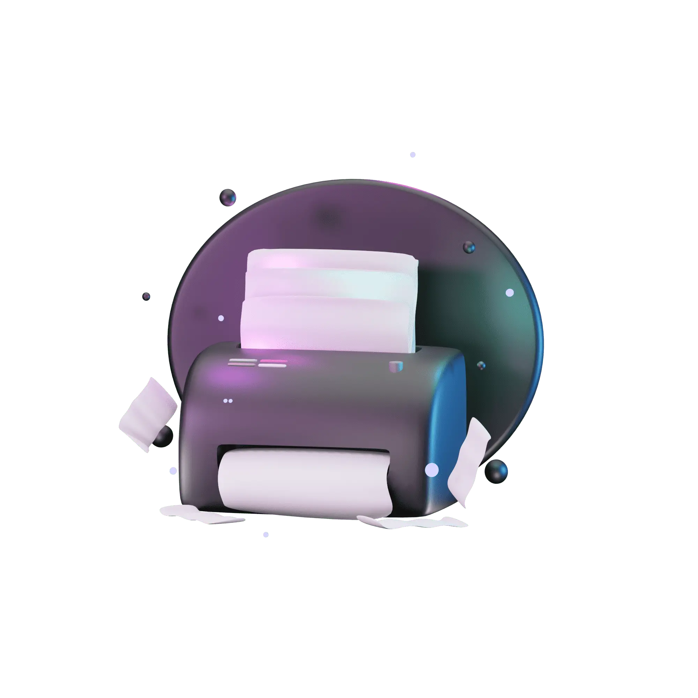
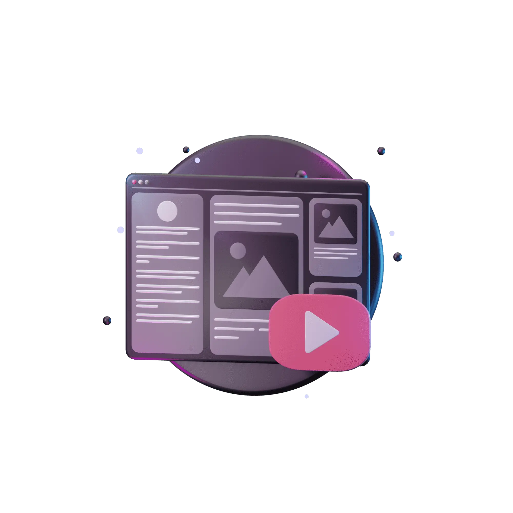
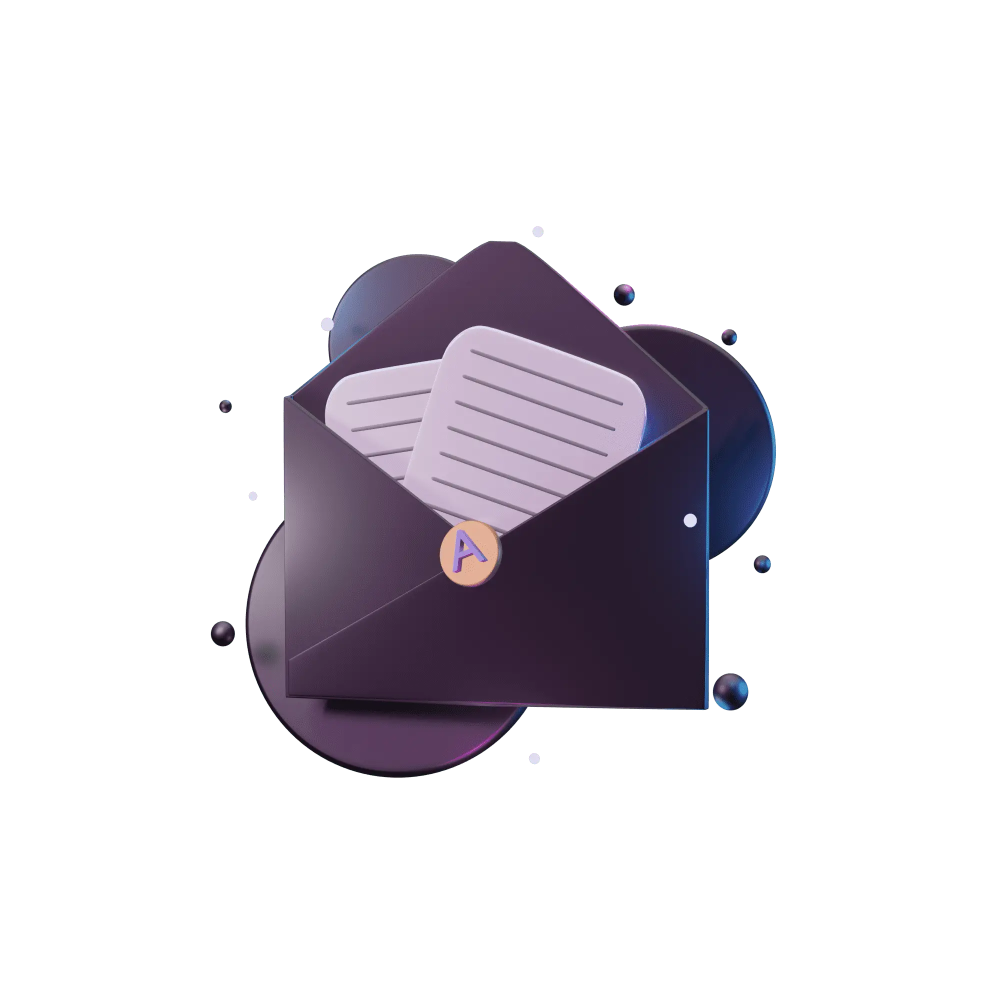

# 🖼️ 素材分類：3D_Web-V1

> [🏠 主目錄](../../../README.md) / [images](../../README.md) / [3Ds](../README.md) / **3D_Web-V1**

本目錄共有 `40` 個檔案

| 🎨 預覽 (點擊放大)  | 📋 檔案詳細資訊與連結 |
| :--- | :--- |
|  | **📂 檔名:** `3d_web-01-82.png` 🖼️ **尺寸:** `2000x2000 px` ⚖️ **大小:** `208.15KB` 📅 **更新:** `2026-02-27`  🚀 **jsDelivr Markdown:** `` 🔗 **直接連結 (Url):** <code>https://cdn.jsdelivr.net/gh/barry028/materials@main/images/3Ds/3D_Web-V1/3d_web-01-82.png</code> 📥 [檢視原始檔](3d_web-01-82.png) |
|  | **📂 檔名:** `3d_web-010-2f.webp` 🖼️ **尺寸:** `2000x2000 px` ⚖️ **大小:** `67.20KB` 📅 **更新:** `2026-02-27`  🚀 **jsDelivr Markdown:** `` 🔗 **直接連結 (Url):** <code>https://cdn.jsdelivr.net/gh/barry028/materials@main/images/3Ds/3D_Web-V1/3d_web-010-2f.webp</code> 📥 [檢視原始檔](3d_web-010-2f.webp) |
|  | **📂 檔名:** `3d_web-011-4c.png` 🖼️ **尺寸:** `2000x2000 px` ⚖️ **大小:** `218.81KB` 📅 **更新:** `2026-02-27`  🚀 **jsDelivr Markdown:** `` 🔗 **直接連結 (Url):** <code>https://cdn.jsdelivr.net/gh/barry028/materials@main/images/3Ds/3D_Web-V1/3d_web-011-4c.png</code> 📥 [檢視原始檔](3d_web-011-4c.png) |
|  | **📂 檔名:** `3d_web-012-f2.webp` 🖼️ **尺寸:** `2000x2000 px` ⚖️ **大小:** `63.43KB` 📅 **更新:** `2026-02-27`  🚀 **jsDelivr Markdown:** `` 🔗 **直接連結 (Url):** <code>https://cdn.jsdelivr.net/gh/barry028/materials@main/images/3Ds/3D_Web-V1/3d_web-012-f2.webp</code> 📥 [檢視原始檔](3d_web-012-f2.webp) |
|  | **📂 檔名:** `3d_web-013-df.png` 🖼️ **尺寸:** `2000x2000 px` ⚖️ **大小:** `202.15KB` 📅 **更新:** `2026-02-27`  🚀 **jsDelivr Markdown:** `` 🔗 **直接連結 (Url):** <code>https://cdn.jsdelivr.net/gh/barry028/materials@main/images/3Ds/3D_Web-V1/3d_web-013-df.png</code> 📥 [檢視原始檔](3d_web-013-df.png) |
|  | **📂 檔名:** `3d_web-014-4d.webp` 🖼️ **尺寸:** `2000x2000 px` ⚖️ **大小:** `53.46KB` 📅 **更新:** `2026-02-27`  🚀 **jsDelivr Markdown:** `` 🔗 **直接連結 (Url):** <code>https://cdn.jsdelivr.net/gh/barry028/materials@main/images/3Ds/3D_Web-V1/3d_web-014-4d.webp</code> 📥 [檢視原始檔](3d_web-014-4d.webp) |
|  | **📂 檔名:** `3d_web-015-18.png` 🖼️ **尺寸:** `2000x2000 px` ⚖️ **大小:** `263.80KB` 📅 **更新:** `2026-02-27`  🚀 **jsDelivr Markdown:** `` 🔗 **直接連結 (Url):** <code>https://cdn.jsdelivr.net/gh/barry028/materials@main/images/3Ds/3D_Web-V1/3d_web-015-18.png</code> 📥 [檢視原始檔](3d_web-015-18.png) |
|  | **📂 檔名:** `3d_web-016-16.webp` 🖼️ **尺寸:** `2000x2000 px` ⚖️ **大小:** `98.43KB` 📅 **更新:** `2026-02-27`  🚀 **jsDelivr Markdown:** `` 🔗 **直接連結 (Url):** <code>https://cdn.jsdelivr.net/gh/barry028/materials@main/images/3Ds/3D_Web-V1/3d_web-016-16.webp</code> 📥 [檢視原始檔](3d_web-016-16.webp) |
|  | **📂 檔名:** `3d_web-017-73.png` 🖼️ **尺寸:** `2000x2000 px` ⚖️ **大小:** `273.82KB` 📅 **更新:** `2026-02-27`  🚀 **jsDelivr Markdown:** `` 🔗 **直接連結 (Url):** <code>https://cdn.jsdelivr.net/gh/barry028/materials@main/images/3Ds/3D_Web-V1/3d_web-017-73.png</code> 📥 [檢視原始檔](3d_web-017-73.png) |
|  | **📂 檔名:** `3d_web-018-6f.webp` 🖼️ **尺寸:** `2000x2000 px` ⚖️ **大小:** `75.46KB` 📅 **更新:** `2026-02-27`  🚀 **jsDelivr Markdown:** `` 🔗 **直接連結 (Url):** <code>https://cdn.jsdelivr.net/gh/barry028/materials@main/images/3Ds/3D_Web-V1/3d_web-018-6f.webp</code> 📥 [檢視原始檔](3d_web-018-6f.webp) |
|  | **📂 檔名:** `3d_web-019-b3.png` 🖼️ **尺寸:** `2000x2000 px` ⚖️ **大小:** `220.56KB` 📅 **更新:** `2026-02-27`  🚀 **jsDelivr Markdown:** `` 🔗 **直接連結 (Url):** <code>https://cdn.jsdelivr.net/gh/barry028/materials@main/images/3Ds/3D_Web-V1/3d_web-019-b3.png</code> 📥 [檢視原始檔](3d_web-019-b3.png) |
|  | **📂 檔名:** `3d_web-02-0a.webp` 🖼️ **尺寸:** `2000x2000 px` ⚖️ **大小:** `55.96KB` 📅 **更新:** `2026-02-27`  🚀 **jsDelivr Markdown:** `` 🔗 **直接連結 (Url):** <code>https://cdn.jsdelivr.net/gh/barry028/materials@main/images/3Ds/3D_Web-V1/3d_web-02-0a.webp</code> 📥 [檢視原始檔](3d_web-02-0a.webp) |
|  | **📂 檔名:** `3d_web-020-cf.webp` 🖼️ **尺寸:** `2000x2000 px` ⚖️ **大小:** `67.19KB` 📅 **更新:** `2026-02-27`  🚀 **jsDelivr Markdown:** `` 🔗 **直接連結 (Url):** <code>https://cdn.jsdelivr.net/gh/barry028/materials@main/images/3Ds/3D_Web-V1/3d_web-020-cf.webp</code> 📥 [檢視原始檔](3d_web-020-cf.webp) |
|  | **📂 檔名:** `3d_web-021-a9.png` 🖼️ **尺寸:** `2000x2000 px` ⚖️ **大小:** `172.53KB` 📅 **更新:** `2026-02-27`  🚀 **jsDelivr Markdown:** `` 🔗 **直接連結 (Url):** <code>https://cdn.jsdelivr.net/gh/barry028/materials@main/images/3Ds/3D_Web-V1/3d_web-021-a9.png</code> 📥 [檢視原始檔](3d_web-021-a9.png) |
|  | **📂 檔名:** `3d_web-022-97.webp` 🖼️ **尺寸:** `2000x2000 px` ⚖️ **大小:** `57.28KB` 📅 **更新:** `2026-02-27`  🚀 **jsDelivr Markdown:** `` 🔗 **直接連結 (Url):** <code>https://cdn.jsdelivr.net/gh/barry028/materials@main/images/3Ds/3D_Web-V1/3d_web-022-97.webp</code> 📥 [檢視原始檔](3d_web-022-97.webp) |
|  | **📂 檔名:** `3d_web-023-b1.png` 🖼️ **尺寸:** `2000x2000 px` ⚖️ **大小:** `216.45KB` 📅 **更新:** `2026-02-27`  🚀 **jsDelivr Markdown:** `` 🔗 **直接連結 (Url):** <code>https://cdn.jsdelivr.net/gh/barry028/materials@main/images/3Ds/3D_Web-V1/3d_web-023-b1.png</code> 📥 [檢視原始檔](3d_web-023-b1.png) |
|  | **📂 檔名:** `3d_web-024-b5.webp` 🖼️ **尺寸:** `2000x2000 px` ⚖️ **大小:** `59.15KB` 📅 **更新:** `2026-02-27`  🚀 **jsDelivr Markdown:** `` 🔗 **直接連結 (Url):** <code>https://cdn.jsdelivr.net/gh/barry028/materials@main/images/3Ds/3D_Web-V1/3d_web-024-b5.webp</code> 📥 [檢視原始檔](3d_web-024-b5.webp) |
|  | **📂 檔名:** `3d_web-025-5a.png` 🖼️ **尺寸:** `2000x2000 px` ⚖️ **大小:** `172.93KB` 📅 **更新:** `2026-02-27`  🚀 **jsDelivr Markdown:** `` 🔗 **直接連結 (Url):** <code>https://cdn.jsdelivr.net/gh/barry028/materials@main/images/3Ds/3D_Web-V1/3d_web-025-5a.png</code> 📥 [檢視原始檔](3d_web-025-5a.png) |
|  | **📂 檔名:** `3d_web-026-1b.webp` 🖼️ **尺寸:** `2000x2000 px` ⚖️ **大小:** `50.29KB` 📅 **更新:** `2026-02-27`  🚀 **jsDelivr Markdown:** `` 🔗 **直接連結 (Url):** <code>https://cdn.jsdelivr.net/gh/barry028/materials@main/images/3Ds/3D_Web-V1/3d_web-026-1b.webp</code> 📥 [檢視原始檔](3d_web-026-1b.webp) |
|  | **📂 檔名:** `3d_web-027-74.png` 🖼️ **尺寸:** `2000x2000 px` ⚖️ **大小:** `168.15KB` 📅 **更新:** `2026-02-27`  🚀 **jsDelivr Markdown:** `` 🔗 **直接連結 (Url):** <code>https://cdn.jsdelivr.net/gh/barry028/materials@main/images/3Ds/3D_Web-V1/3d_web-027-74.png</code> 📥 [檢視原始檔](3d_web-027-74.png) |
|  | **📂 檔名:** `3d_web-028-79.webp` 🖼️ **尺寸:** `2000x2000 px` ⚖️ **大小:** `53.51KB` 📅 **更新:** `2026-02-27`  🚀 **jsDelivr Markdown:** `` 🔗 **直接連結 (Url):** <code>https://cdn.jsdelivr.net/gh/barry028/materials@main/images/3Ds/3D_Web-V1/3d_web-028-79.webp</code> 📥 [檢視原始檔](3d_web-028-79.webp) |
|  | **📂 檔名:** `3d_web-029-7e.png` 🖼️ **尺寸:** `2000x2000 px` ⚖️ **大小:** `263.98KB` 📅 **更新:** `2026-02-27`  🚀 **jsDelivr Markdown:** `` 🔗 **直接連結 (Url):** <code>https://cdn.jsdelivr.net/gh/barry028/materials@main/images/3Ds/3D_Web-V1/3d_web-029-7e.png</code> 📥 [檢視原始檔](3d_web-029-7e.png) |
|  | **📂 檔名:** `3d_web-03-36.png` 🖼️ **尺寸:** `2000x2000 px` ⚖️ **大小:** `191.99KB` 📅 **更新:** `2026-02-27`  🚀 **jsDelivr Markdown:** `` 🔗 **直接連結 (Url):** <code>https://cdn.jsdelivr.net/gh/barry028/materials@main/images/3Ds/3D_Web-V1/3d_web-03-36.png</code> 📥 [檢視原始檔](3d_web-03-36.png) |
|  | **📂 檔名:** `3d_web-030-52.webp` 🖼️ **尺寸:** `2000x2000 px` ⚖️ **大小:** `62.93KB` 📅 **更新:** `2026-02-27`  🚀 **jsDelivr Markdown:** `` 🔗 **直接連結 (Url):** <code>https://cdn.jsdelivr.net/gh/barry028/materials@main/images/3Ds/3D_Web-V1/3d_web-030-52.webp</code> 📥 [檢視原始檔](3d_web-030-52.webp) |
|  | **📂 檔名:** `3d_web-031-72.png` 🖼️ **尺寸:** `2000x2000 px` ⚖️ **大小:** `198.34KB` 📅 **更新:** `2026-02-27`  🚀 **jsDelivr Markdown:** `` 🔗 **直接連結 (Url):** <code>https://cdn.jsdelivr.net/gh/barry028/materials@main/images/3Ds/3D_Web-V1/3d_web-031-72.png</code> 📥 [檢視原始檔](3d_web-031-72.png) |
|  | **📂 檔名:** `3d_web-032-70.webp` 🖼️ **尺寸:** `2000x2000 px` ⚖️ **大小:** `56.10KB` 📅 **更新:** `2026-02-27`  🚀 **jsDelivr Markdown:** `` 🔗 **直接連結 (Url):** <code>https://cdn.jsdelivr.net/gh/barry028/materials@main/images/3Ds/3D_Web-V1/3d_web-032-70.webp</code> 📥 [檢視原始檔](3d_web-032-70.webp) |
|  | **📂 檔名:** `3d_web-033-40.png` 🖼️ **尺寸:** `2000x2000 px` ⚖️ **大小:** `249.55KB` 📅 **更新:** `2026-02-27`  🚀 **jsDelivr Markdown:** `` 🔗 **直接連結 (Url):** <code>https://cdn.jsdelivr.net/gh/barry028/materials@main/images/3Ds/3D_Web-V1/3d_web-033-40.png</code> 📥 [檢視原始檔](3d_web-033-40.png) |
|  | **📂 檔名:** `3d_web-034-24.webp` 🖼️ **尺寸:** `2000x2000 px` ⚖️ **大小:** `64.44KB` 📅 **更新:** `2026-02-27`  🚀 **jsDelivr Markdown:** `` 🔗 **直接連結 (Url):** <code>https://cdn.jsdelivr.net/gh/barry028/materials@main/images/3Ds/3D_Web-V1/3d_web-034-24.webp</code> 📥 [檢視原始檔](3d_web-034-24.webp) |
|  | **📂 檔名:** `3d_web-035-04.png` 🖼️ **尺寸:** `2000x2000 px` ⚖️ **大小:** `254.89KB` 📅 **更新:** `2026-02-27`  🚀 **jsDelivr Markdown:** `` 🔗 **直接連結 (Url):** <code>https://cdn.jsdelivr.net/gh/barry028/materials@main/images/3Ds/3D_Web-V1/3d_web-035-04.png</code> 📥 [檢視原始檔](3d_web-035-04.png) |
|  | **📂 檔名:** `3d_web-036-85.webp` 🖼️ **尺寸:** `2000x2000 px` ⚖️ **大小:** `72.11KB` 📅 **更新:** `2026-02-27`  🚀 **jsDelivr Markdown:** `` 🔗 **直接連結 (Url):** <code>https://cdn.jsdelivr.net/gh/barry028/materials@main/images/3Ds/3D_Web-V1/3d_web-036-85.webp</code> 📥 [檢視原始檔](3d_web-036-85.webp) |
|  | **📂 檔名:** `3d_web-037-45.png` 🖼️ **尺寸:** `2000x2000 px` ⚖️ **大小:** `240.95KB` 📅 **更新:** `2026-02-27`  🚀 **jsDelivr Markdown:** `` 🔗 **直接連結 (Url):** <code>https://cdn.jsdelivr.net/gh/barry028/materials@main/images/3Ds/3D_Web-V1/3d_web-037-45.png</code> 📥 [檢視原始檔](3d_web-037-45.png) |
|  | **📂 檔名:** `3d_web-038-27.webp` 🖼️ **尺寸:** `2000x2000 px` ⚖️ **大小:** `72.72KB` 📅 **更新:** `2026-02-27`  🚀 **jsDelivr Markdown:** `` 🔗 **直接連結 (Url):** <code>https://cdn.jsdelivr.net/gh/barry028/materials@main/images/3Ds/3D_Web-V1/3d_web-038-27.webp</code> 📥 [檢視原始檔](3d_web-038-27.webp) |
|  | **📂 檔名:** `3d_web-039-43.png` 🖼️ **尺寸:** `2000x2000 px` ⚖️ **大小:** `123.84KB` 📅 **更新:** `2026-02-27`  🚀 **jsDelivr Markdown:** `` 🔗 **直接連結 (Url):** <code>https://cdn.jsdelivr.net/gh/barry028/materials@main/images/3Ds/3D_Web-V1/3d_web-039-43.png</code> 📥 [檢視原始檔](3d_web-039-43.png) |
|  | **📂 檔名:** `3d_web-04-3c.webp` 🖼️ **尺寸:** `2000x2000 px` ⚖️ **大小:** `51.04KB` 📅 **更新:** `2026-02-27`  🚀 **jsDelivr Markdown:** `` 🔗 **直接連結 (Url):** <code>https://cdn.jsdelivr.net/gh/barry028/materials@main/images/3Ds/3D_Web-V1/3d_web-04-3c.webp</code> 📥 [檢視原始檔](3d_web-04-3c.webp) |
|  | **📂 檔名:** `3d_web-040-7a.webp` 🖼️ **尺寸:** `2000x2000 px` ⚖️ **大小:** `49.27KB` 📅 **更新:** `2026-02-27`  🚀 **jsDelivr Markdown:** `` 🔗 **直接連結 (Url):** <code>https://cdn.jsdelivr.net/gh/barry028/materials@main/images/3Ds/3D_Web-V1/3d_web-040-7a.webp</code> 📥 [檢視原始檔](3d_web-040-7a.webp) |
|  | **📂 檔名:** `3d_web-05-ec.png` 🖼️ **尺寸:** `2000x2000 px` ⚖️ **大小:** `164.65KB` 📅 **更新:** `2026-02-27`  🚀 **jsDelivr Markdown:** `` 🔗 **直接連結 (Url):** <code>https://cdn.jsdelivr.net/gh/barry028/materials@main/images/3Ds/3D_Web-V1/3d_web-05-ec.png</code> 📥 [檢視原始檔](3d_web-05-ec.png) |
|  | **📂 檔名:** `3d_web-06-23.webp` 🖼️ **尺寸:** `2000x2000 px` ⚖️ **大小:** `52.03KB` 📅 **更新:** `2026-02-27`  🚀 **jsDelivr Markdown:** `` 🔗 **直接連結 (Url):** <code>https://cdn.jsdelivr.net/gh/barry028/materials@main/images/3Ds/3D_Web-V1/3d_web-06-23.webp</code> 📥 [檢視原始檔](3d_web-06-23.webp) |
|  | **📂 檔名:** `3d_web-07-98.png` 🖼️ **尺寸:** `2000x2000 px` ⚖️ **大小:** `174.90KB` 📅 **更新:** `2026-02-27`  🚀 **jsDelivr Markdown:** `` 🔗 **直接連結 (Url):** <code>https://cdn.jsdelivr.net/gh/barry028/materials@main/images/3Ds/3D_Web-V1/3d_web-07-98.png</code> 📥 [檢視原始檔](3d_web-07-98.png) |
|  | **📂 檔名:** `3d_web-08-bd.webp` 🖼️ **尺寸:** `2000x2000 px` ⚖️ **大小:** `60.62KB` 📅 **更新:** `2026-02-27`  🚀 **jsDelivr Markdown:** `` 🔗 **直接連結 (Url):** <code>https://cdn.jsdelivr.net/gh/barry028/materials@main/images/3Ds/3D_Web-V1/3d_web-08-bd.webp</code> 📥 [檢視原始檔](3d_web-08-bd.webp) |
|  | **📂 檔名:** `3d_web-09-fd.png` 🖼️ **尺寸:** `2000x2000 px` ⚖️ **大小:** `224.94KB` 📅 **更新:** `2026-02-27`  🚀 **jsDelivr Markdown:** `` 🔗 **直接連結 (Url):** <code>https://cdn.jsdelivr.net/gh/barry028/materials@main/images/3Ds/3D_Web-V1/3d_web-09-fd.png</code> 📥 [檢視原始檔](3d_web-09-fd.png) |