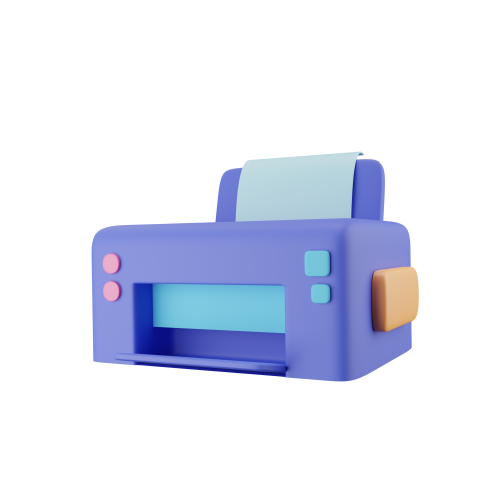
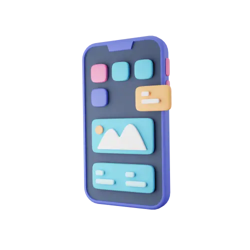
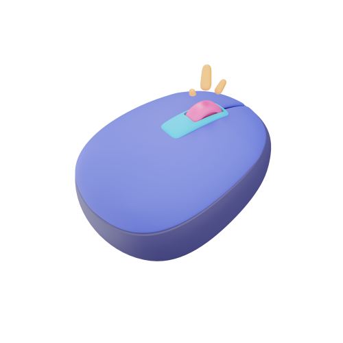
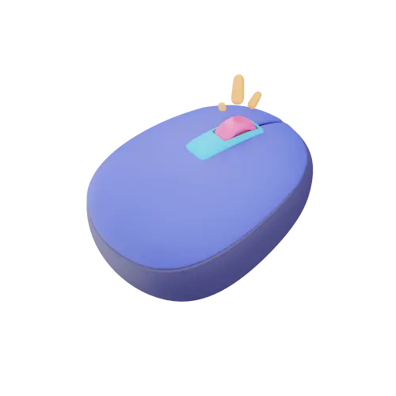
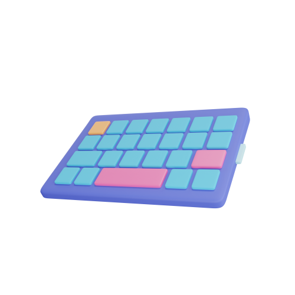
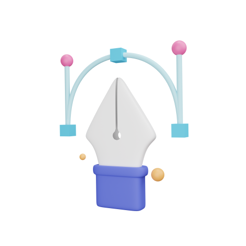

# 🖼️ 3D_Web-V2

[⬅️ 返回主目錄](../../../README.md)

| 預覽 | 資訊 |
| :--- | :--- |
|  | **3d-Icon-webs-01-44.webp** |
|  | **3d-Icon-webs-01-f8.png** |
|  | **3d-Icon-webs-010-1f.png** |
|  | **3d-Icon-webs-010-e9.webp** |
|  | **3d-Icon-webs-011-5e.webp** |
|  | **3d-Icon-webs-011-98.png** |
|  | **3d-Icon-webs-012-0a.webp** |
|  | **3d-Icon-webs-012-2e.png** |
|  | **3d-Icon-webs-013-a9.png** |
|  | **3d-Icon-webs-013-d9.webp** |
|  | **3d-Icon-webs-014-cf.webp** |
|  | **3d-Icon-webs-014-dc.png** |
|  | **3d-Icon-webs-015-64.webp** |
|  | **3d-Icon-webs-015-82.png** |
|  | **3d-Icon-webs-016-19.webp** |
|  | **3d-Icon-webs-016-c8.png** |
|  | **3d-Icon-webs-017-1a.png** |
|  | **3d-Icon-webs-017-5f.webp** |
|  | **3d-Icon-webs-018-cd.png** |
|  | **3d-Icon-webs-018-eb.webp** |
|  | **3d-Icon-webs-019-12.webp** |
|  | **3d-Icon-webs-019-e3.png** |
|  | **3d-Icon-webs-02-a4.webp** |
|  | **3d-Icon-webs-02-b4.png** |
|  | **3d-Icon-webs-020-08.png** |
|  | **3d-Icon-webs-020-e7.webp** |
|  | **3d-Icon-webs-03-d4.png** |
|  | **3d-Icon-webs-03-de.webp** |
|  | **3d-Icon-webs-04-57.png** |
|  | **3d-Icon-webs-04-88.webp** |
|  | **3d-Icon-webs-05-00.webp** |
|  | **3d-Icon-webs-05-a1.png** |
|  | **3d-Icon-webs-06-2b.png** |
|  | **3d-Icon-webs-06-eb.webp** |
|  | **3d-Icon-webs-07-2d.png** |
|  | **3d-Icon-webs-07-b7.webp** |
|  | **3d-Icon-webs-08-1f.webp** |
|  | **3d-Icon-webs-08-ea.png** |
|  | **3d-Icon-webs-09-39.webp** |
|  | **3d-Icon-webs-09-d2.png** |