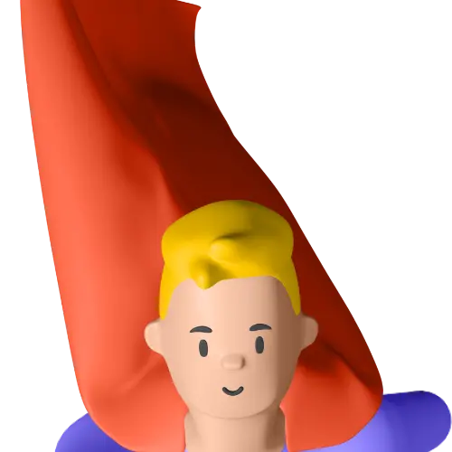
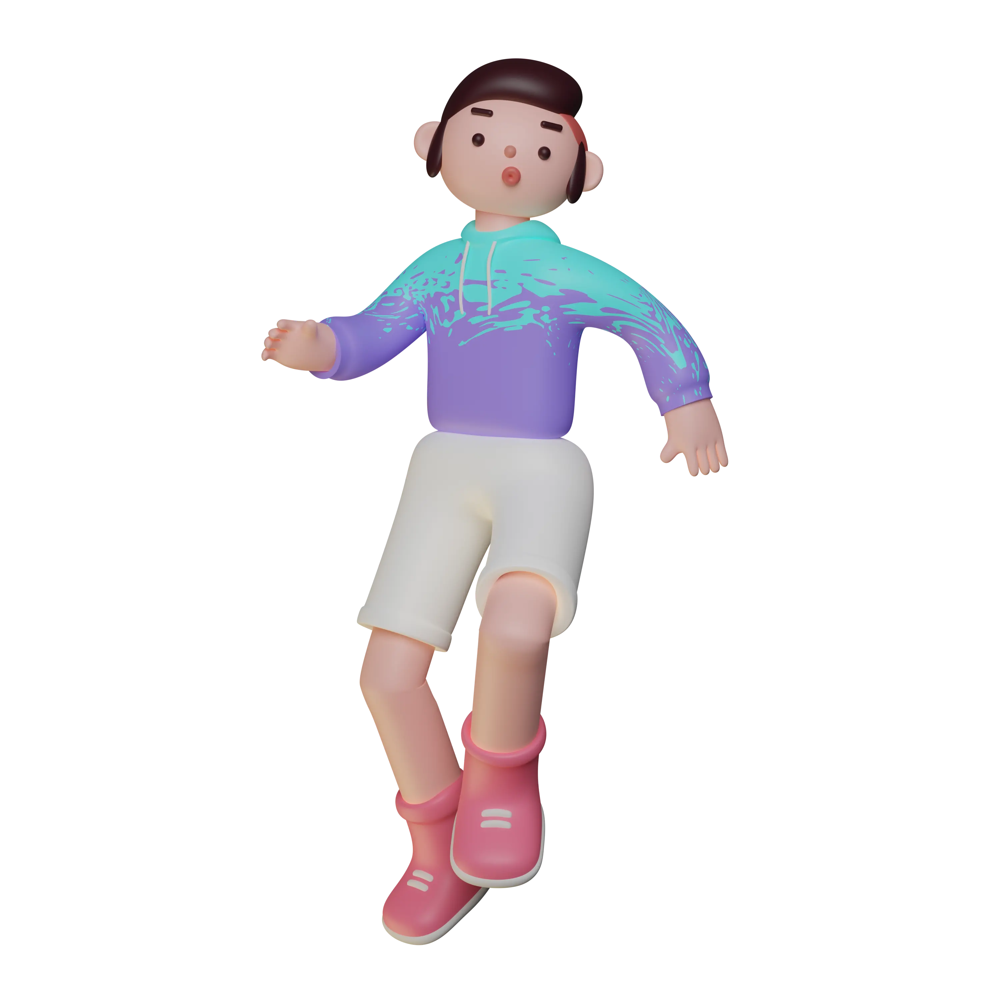
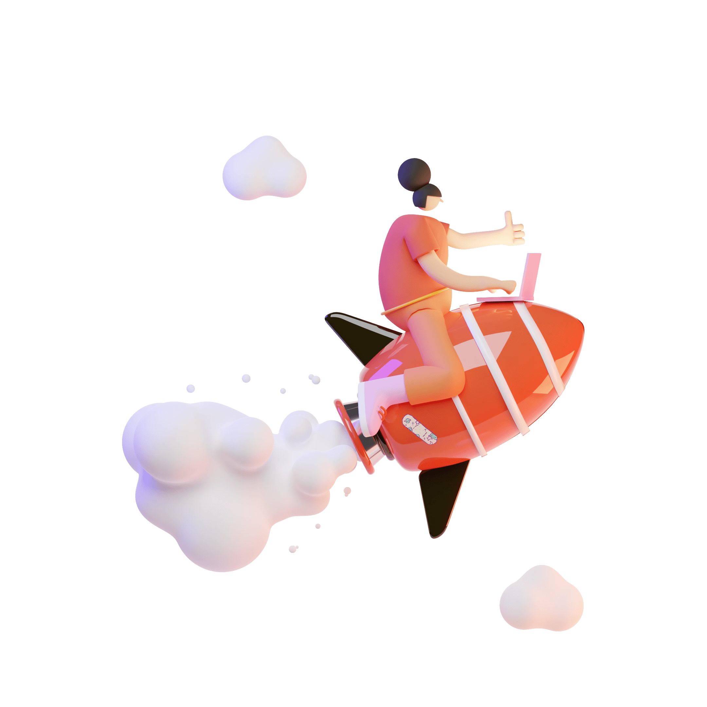

# 📂 目錄：3Ds

> [🏠 主目錄](../../README.md) / [images](../README.md) / **3Ds**

此目錄目前沒有直接存放圖片，請選擇下方子分類：

### 🗂️ 子分類列表

| 分類名稱 | 封面預覽 | 統計 |
| :--- | :--- | :--- |
| [📠**3D_Avatars**](3D_Avatars/README.md) | &nbsp;&nbsp; | 共 `21` 張 |
| [📠**3D_CharacterNurse**](3D_CharacterNurse/README.md) | &nbsp;&nbsp; | 共 `30` 張 |
| [📠**3D_Ecommercia**](3D_Ecommercia/README.md) | &nbsp;&nbsp; | 共 `29` 張 |
| [📠**3D_Education**](3D_Education/README.md) | &nbsp;&nbsp; | 共 `22` 張 |
| [📠**3D_Educations**](3D_Educations/README.md) | &nbsp;&nbsp; | 共 `40` 張 |
| [📠**3D_Emojis**](3D_Emojis/README.md) | &nbsp;&nbsp; | 共 `25` 張 |
| [📠**3D_EmojisGestures**](3D_EmojisGestures/README.md) | &nbsp;&nbsp; | 共 `33` 張 |
| [📠**3D_Finacially**](3D_Finacially/README.md) | &nbsp;&nbsp; | 共 `76` 張 |
| [📠**3D_Hands**](3D_Hands/README.md) | &nbsp; | 共 `2` 張 |
| [📠**3D_Heros**](3D_Heros/README.md) | &nbsp;&nbsp; | 共 `24` 張 |
| [📠**3D_Illustration-Nikuu**](3D_Illustration-Nikuu/README.md) | &nbsp;&nbsp; | 共 `43` 張 |
| [📠**3D_Illustration-Saly**](3D_Illustration-Saly/README.md) | &nbsp;&nbsp; | 共 `90` 張 |
| [📠**3D_Illustration-V1**](3D_Illustration-V1/README.md) | &nbsp;&nbsp; | 共 `6` 張 |
| [📠**3D_Illustration-V2**](3D_Illustration-V2/README.md) | &nbsp;&nbsp; | 共 `120` 張 |
| [📠**3D_Web-V1**](3D_Web-V1/README.md) | &nbsp;&nbsp; | 共 `40` 張 |
| [📠**3D_Web-V2**](3D_Web-V2/README.md) | &nbsp;&nbsp; | 共 `40` 張 |