# 🖼️ Animations

[⬅️ 返回主目錄](../../README.md)

| 預覽 | 資訊 |
| :--- | :--- |
|  | **AnimatedSvg-Background.svg** |
|  | **BackgroundSvgPattern.svg** |
|  | **BarrYUFO.svg** |
|  | **Bell_Demo_CSS_only.svg** |
|  | **Bell_Demo_JS.svg** |
|  | **Bell_Demo_JS_On_Click.svg** |
|  | **Bell_Demo_JS_On_Mouse_Over.svg** |
|  | **Bell_Demo_JS_On_Scroll.svg** |
| <a href="Bg-Patternpad.svg">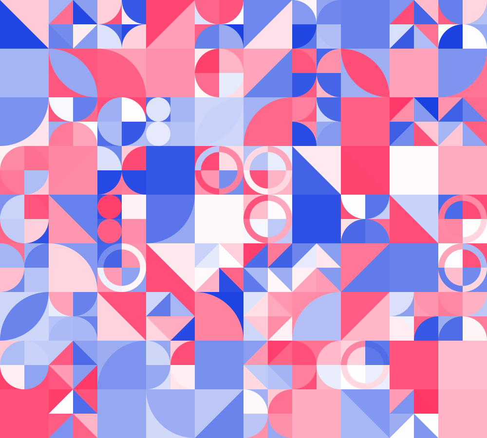</a> | **Bg-Patternpad.svg** |
|  | **Bg-Shape-001.svg** |
|  | **Bg-ine-001.svg** |
| <a href="Svg-animated-loaders.svg"></a> | **Svg-animated-loaders.svg** |
| <a href="Svg-background-animation-interactive.svg">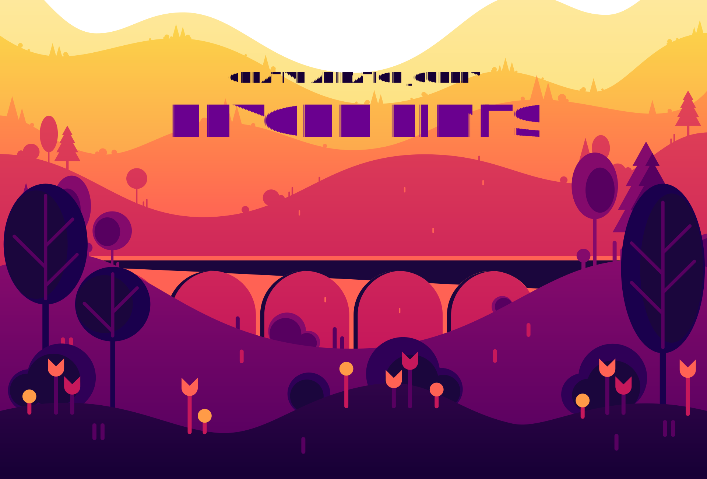</a> | **Svg-background-animation-interactive.svg** |
| <a href="Svg-background-geometric-shapes.svg"></a> | **Svg-background-geometric-shapes.svg** |
| <a href="Svg-background.svg"></a> | **Svg-background.svg** |
| <a href="Svg-texture-background-geometric.svg"></a> | **Svg-texture-background-geometric.svg** |
| <a href="anim_calc.svg"></a> | **anim_calc.svg** |
|  | **anim_process1.svg** |
| <a href="anim_process3.svg">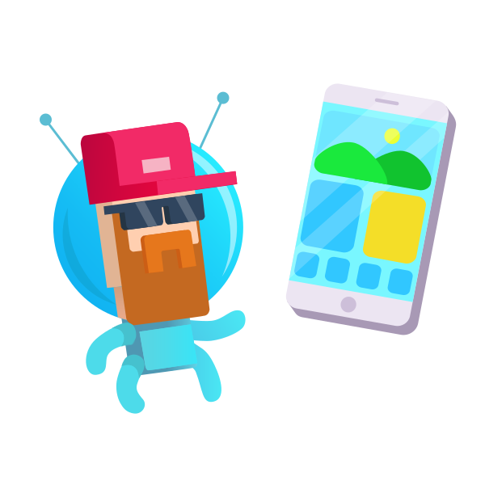</a> | **anim_process3.svg** |
| <a href="anim_spaceship.svg">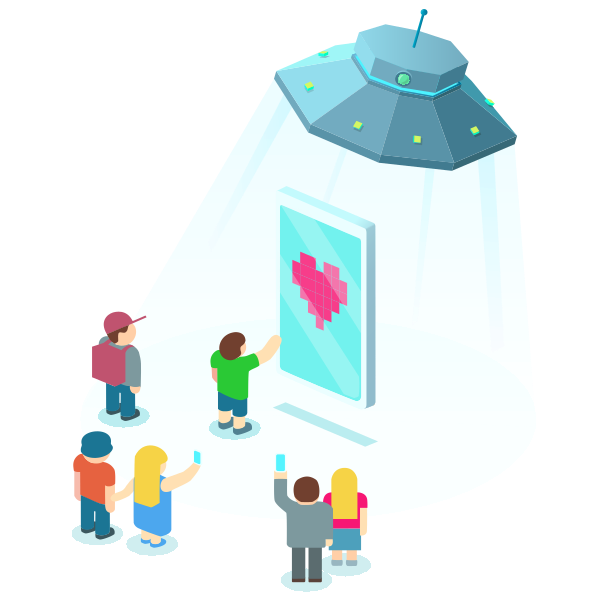</a> | **anim_spaceship.svg** |
| <a href="anim_team.svg"></a> | **anim_team.svg** |
| <a href="animated-svg-background-css.svg">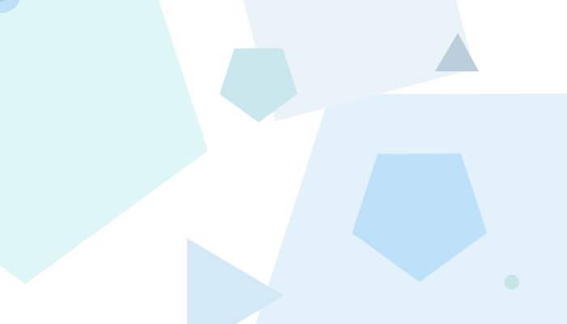</a> | **animated-svg-background-css.svg** |
| <a href="ico_service_animation.svg">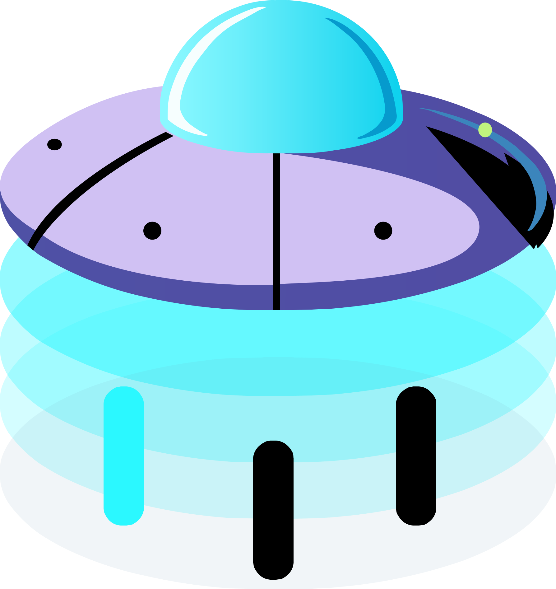</a> | **ico_service_animation.svg** |
| <a href="ico_service_animation01.svg">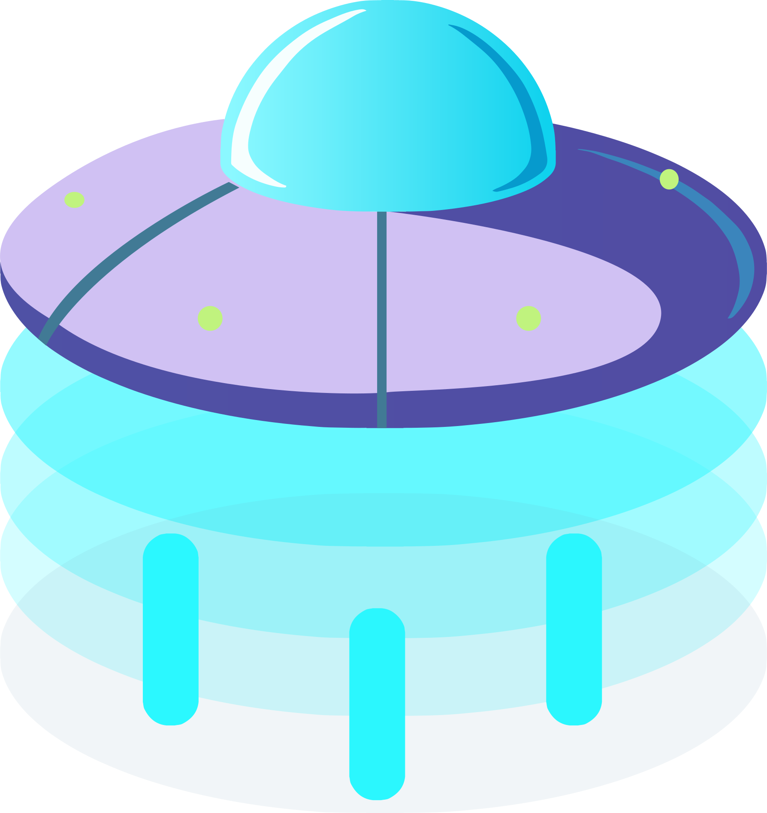</a> | **ico_service_animation01.svg** |
|  | **ico_service_art.svg** |
|  | **ico_service_uxui.svg** |
| <a href="illus001.svg">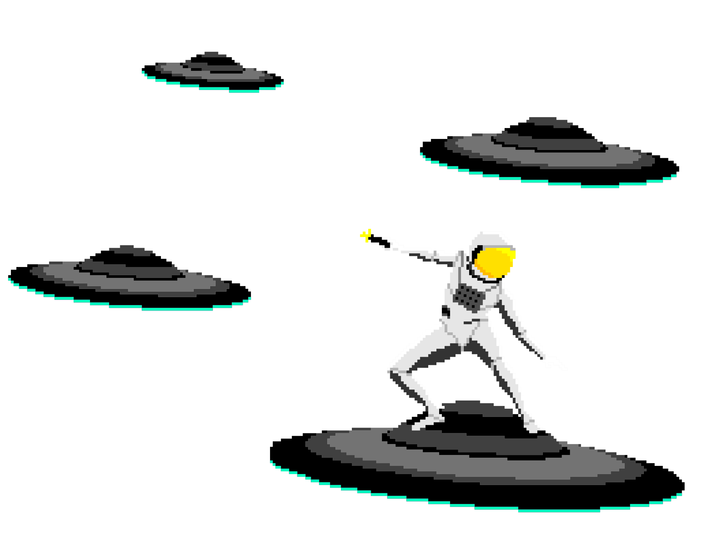</a> | **illus001.svg** |
| <a href="neumorphism-design-example.svg"></a> | **neumorphism-design-example.svg** |
| <a href="pixel-rocket.svg"></a> | **pixel-rocket.svg** |
|  | **pixel.svg** |
| <a href="rocket.svg">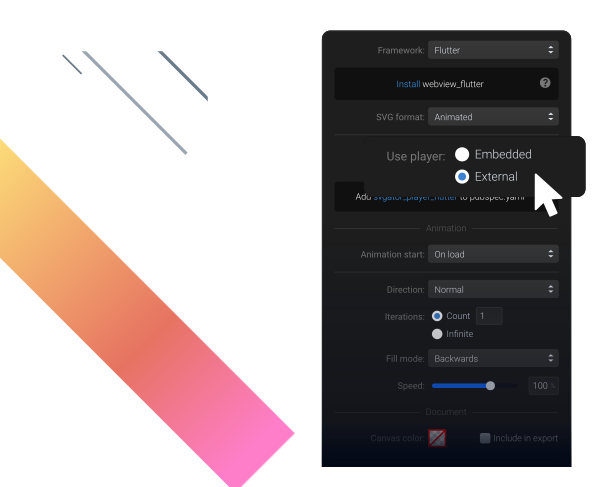</a> | **rocket.svg** |
|  | **rotate.svg** |
| <a href="sample.svg"></a> | **sample.svg** |
| <a href="sofrware.svg">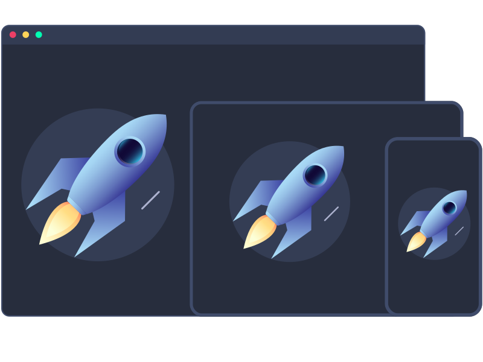</a> | **sofrware.svg** |
|  | **space.svg** |
|  | **squareAdv.svg** |
|  | **use-Svg-as-background-image-particle-strokes.svg** |