# 🖼️ 素材分類：Animations

> [🏠 主目錄](../../README.md) / [images](../README.md) / **Animations**

本目錄共有 `37` 個檔案

| 🎨 預覽 (點擊放大)  | 📋 檔案詳細資訊與連結 |
| :--- | :--- |
|  | **📂 檔名:** `BackgroundSvgPattern.svg` ✨ **格式:** `Vector (SVG)` ⚖️ **大小:** `31.56KB` 📅 **更新:** `2026-02-28`  🚀 **jsDelivr Markdown:** `` 🔗 **直接連結 (Url):** <code>https://cdn.jsdelivr.net/gh/barry028/materials@main/images/Animations/BackgroundSvgPattern.svg</code> 📥 [檢視原始檔](BackgroundSvgPattern.svg) |
|  | **📂 檔名:** `BarrYUFO.svg` ✨ **格式:** `Vector (SVG)` ⚖️ **大小:** `236.68KB` 📅 **更新:** `2026-02-28`  🚀 **jsDelivr Markdown:** `` 🔗 **直接連結 (Url):** <code>https://cdn.jsdelivr.net/gh/barry028/materials@main/images/Animations/BarrYUFO.svg</code> 📥 [檢視原始檔](BarrYUFO.svg) |
|  | **📂 檔名:** `Bell_Demo_CSS_only.svg` ✨ **格式:** `Vector (SVG)` ⚖️ **大小:** `51.92KB` 📅 **更新:** `2026-02-28`  🚀 **jsDelivr Markdown:** `` 🔗 **直接連結 (Url):** <code>https://cdn.jsdelivr.net/gh/barry028/materials@main/images/Animations/Bell_Demo_CSS_only.svg</code> 📥 [檢視原始檔](Bell_Demo_CSS_only.svg) |
|  | **📂 檔名:** `Bell_Demo_JS.svg` ✨ **格式:** `Vector (SVG)` ⚖️ **大小:** `78.38KB` 📅 **更新:** `2026-02-28`  🚀 **jsDelivr Markdown:** `` 🔗 **直接連結 (Url):** <code>https://cdn.jsdelivr.net/gh/barry028/materials@main/images/Animations/Bell_Demo_JS.svg</code> 📥 [檢視原始檔](Bell_Demo_JS.svg) |
|  | **📂 檔名:** `Bell_Demo_JS_On_Click.svg` ✨ **格式:** `Vector (SVG)` ⚖️ **大小:** `78.45KB` 📅 **更新:** `2026-02-28`  🚀 **jsDelivr Markdown:** `` 🔗 **直接連結 (Url):** <code>https://cdn.jsdelivr.net/gh/barry028/materials@main/images/Animations/Bell_Demo_JS_On_Click.svg</code> 📥 [檢視原始檔](Bell_Demo_JS_On_Click.svg) |
|  | **📂 檔名:** `Bell_Demo_JS_On_Mouse_Over.svg` ✨ **格式:** `Vector (SVG)` ⚖️ **大小:** `78.43KB` 📅 **更新:** `2026-02-28`  🚀 **jsDelivr Markdown:** `` 🔗 **直接連結 (Url):** <code>https://cdn.jsdelivr.net/gh/barry028/materials@main/images/Animations/Bell_Demo_JS_On_Mouse_Over.svg</code> 📥 [檢視原始檔](Bell_Demo_JS_On_Mouse_Over.svg) |
|  | **📂 檔名:** `Bell_Demo_JS_On_Scroll.svg` ✨ **格式:** `Vector (SVG)` ⚖️ **大小:** `78.43KB` 📅 **更新:** `2026-02-28`  🚀 **jsDelivr Markdown:** `` 🔗 **直接連結 (Url):** <code>https://cdn.jsdelivr.net/gh/barry028/materials@main/images/Animations/Bell_Demo_JS_On_Scroll.svg</code> 📥 [檢視原始檔](Bell_Demo_JS_On_Scroll.svg) |
|  | **📂 檔名:** `anim_calc.svg` ✨ **格式:** `Vector (SVG)` ⚖️ **大小:** `79.83KB` 📅 **更新:** `2026-02-28`  🚀 **jsDelivr Markdown:** `` 🔗 **直接連結 (Url):** <code>https://cdn.jsdelivr.net/gh/barry028/materials@main/images/Animations/anim_calc.svg</code> 📥 [檢視原始檔](anim_calc.svg) |
|  | **📂 檔名:** `anim_process1.svg` ✨ **格式:** `Vector (SVG)` ⚖️ **大小:** `31.65KB` 📅 **更新:** `2026-02-28`  🚀 **jsDelivr Markdown:** `` 🔗 **直接連結 (Url):** <code>https://cdn.jsdelivr.net/gh/barry028/materials@main/images/Animations/anim_process1.svg</code> 📥 [檢視原始檔](anim_process1.svg) |
|  | **📂 檔名:** `anim_process3.svg` ✨ **格式:** `Vector (SVG)` ⚖️ **大小:** `22.17KB` 📅 **更新:** `2026-02-28`  🚀 **jsDelivr Markdown:** `` 🔗 **直接連結 (Url):** <code>https://cdn.jsdelivr.net/gh/barry028/materials@main/images/Animations/anim_process3.svg</code> 📥 [檢視原始檔](anim_process3.svg) |
|  | **📂 檔名:** `anim_spaceship.svg` ✨ **格式:** `Vector (SVG)` ⚖️ **大小:** `44.13KB` 📅 **更新:** `2026-02-28`  🚀 **jsDelivr Markdown:** `` 🔗 **直接連結 (Url):** <code>https://cdn.jsdelivr.net/gh/barry028/materials@main/images/Animations/anim_spaceship.svg</code> 📥 [檢視原始檔](anim_spaceship.svg) |
|  | **📂 檔名:** `anim_team.svg` ✨ **格式:** `Vector (SVG)` ⚖️ **大小:** `67.09KB` 📅 **更新:** `2026-02-28`  🚀 **jsDelivr Markdown:** `` 🔗 **直接連結 (Url):** <code>https://cdn.jsdelivr.net/gh/barry028/materials@main/images/Animations/anim_team.svg</code> 📥 [檢視原始檔](anim_team.svg) |
|  | **📂 檔名:** `animated_svg_background_css.svg` ✨ **格式:** `Vector (SVG)` ⚖️ **大小:** `5.77KB` 📅 **更新:** `2026-02-28`  🚀 **jsDelivr Markdown:** `` 🔗 **直接連結 (Url):** <code>https://cdn.jsdelivr.net/gh/barry028/materials@main/images/Animations/animated_svg_background_css.svg</code> 📥 [檢視原始檔](animated_svg_background_css.svg) |
|  | **📂 檔名:** `animatedsvg_background.svg` ✨ **格式:** `Vector (SVG)` ⚖️ **大小:** `46.27KB` 📅 **更新:** `2026-02-28`  🚀 **jsDelivr Markdown:** `` 🔗 **直接連結 (Url):** <code>https://cdn.jsdelivr.net/gh/barry028/materials@main/images/Animations/animatedsvg_background.svg</code> 📥 [檢視原始檔](animatedsvg_background.svg) |
|  | **📂 檔名:** `bg_ine_001.svg` ✨ **格式:** `Vector (SVG)` ⚖️ **大小:** `6.07KB` 📅 **更新:** `2026-02-28`  🚀 **jsDelivr Markdown:** `` 🔗 **直接連結 (Url):** <code>https://cdn.jsdelivr.net/gh/barry028/materials@main/images/Animations/bg_ine_001.svg</code> 📥 [檢視原始檔](bg_ine_001.svg) |
|  | **📂 檔名:** `bg_patternpad.svg` ✨ **格式:** `Vector (SVG)` ⚖️ **大小:** `40.27KB` 📅 **更新:** `2026-02-28`  🚀 **jsDelivr Markdown:** `` 🔗 **直接連結 (Url):** <code>https://cdn.jsdelivr.net/gh/barry028/materials@main/images/Animations/bg_patternpad.svg</code> 📥 [檢視原始檔](bg_patternpad.svg) |
|  | **📂 檔名:** `bg_shape_001.svg` ✨ **格式:** `Vector (SVG)` ⚖️ **大小:** `43.65KB` 📅 **更新:** `2026-02-28`  🚀 **jsDelivr Markdown:** `` 🔗 **直接連結 (Url):** <code>https://cdn.jsdelivr.net/gh/barry028/materials@main/images/Animations/bg_shape_001.svg</code> 📥 [檢視原始檔](bg_shape_001.svg) |
|  | **📂 檔名:** `ico_service_animation.svg` ✨ **格式:** `Vector (SVG)` ⚖️ **大小:** `6.53KB` 📅 **更新:** `2026-02-28`  🚀 **jsDelivr Markdown:** `` 🔗 **直接連結 (Url):** <code>https://cdn.jsdelivr.net/gh/barry028/materials@main/images/Animations/ico_service_animation.svg</code> 📥 [檢視原始檔](ico_service_animation.svg) |
|  | **📂 檔名:** `ico_service_animation01.svg` ✨ **格式:** `Vector (SVG)` ⚖️ **大小:** `15.26KB` 📅 **更新:** `2026-02-28`  🚀 **jsDelivr Markdown:** `` 🔗 **直接連結 (Url):** <code>https://cdn.jsdelivr.net/gh/barry028/materials@main/images/Animations/ico_service_animation01.svg</code> 📥 [檢視原始檔](ico_service_animation01.svg) |
|  | **📂 檔名:** `ico_service_art.svg` ✨ **格式:** `Vector (SVG)` ⚖️ **大小:** `9.23KB` 📅 **更新:** `2026-02-28`  🚀 **jsDelivr Markdown:** `` 🔗 **直接連結 (Url):** <code>https://cdn.jsdelivr.net/gh/barry028/materials@main/images/Animations/ico_service_art.svg</code> 📥 [檢視原始檔](ico_service_art.svg) |
|  | **📂 檔名:** `ico_service_uxui.svg` ✨ **格式:** `Vector (SVG)` ⚖️ **大小:** `5.66KB` 📅 **更新:** `2026-02-28`  🚀 **jsDelivr Markdown:** `` 🔗 **直接連結 (Url):** <code>https://cdn.jsdelivr.net/gh/barry028/materials@main/images/Animations/ico_service_uxui.svg</code> 📥 [檢視原始檔](ico_service_uxui.svg) |
|  | **📂 檔名:** `illus001.svg` ✨ **格式:** `Vector (SVG)` ⚖️ **大小:** `44.11KB` 📅 **更新:** `2026-02-28`  🚀 **jsDelivr Markdown:** `` 🔗 **直接連結 (Url):** <code>https://cdn.jsdelivr.net/gh/barry028/materials@main/images/Animations/illus001.svg</code> 📥 [檢視原始檔](illus001.svg) |
|  | **📂 檔名:** `neumorphism_design_example.svg` ✨ **格式:** `Vector (SVG)` ⚖️ **大小:** `109.99KB` 📅 **更新:** `2026-02-28`  🚀 **jsDelivr Markdown:** `` 🔗 **直接連結 (Url):** <code>https://cdn.jsdelivr.net/gh/barry028/materials@main/images/Animations/neumorphism_design_example.svg</code> 📥 [檢視原始檔](neumorphism_design_example.svg) |
|  | **📂 檔名:** `pixel.svg` ✨ **格式:** `Vector (SVG)` ⚖️ **大小:** `59.70KB` 📅 **更新:** `2026-02-28`  🚀 **jsDelivr Markdown:** `` 🔗 **直接連結 (Url):** <code>https://cdn.jsdelivr.net/gh/barry028/materials@main/images/Animations/pixel.svg</code> 📥 [檢視原始檔](pixel.svg) |
|  | **📂 檔名:** `pixel_rocket.svg` ✨ **格式:** `Vector (SVG)` ⚖️ **大小:** `230.89KB` 📅 **更新:** `2026-02-28`  🚀 **jsDelivr Markdown:** `` 🔗 **直接連結 (Url):** <code>https://cdn.jsdelivr.net/gh/barry028/materials@main/images/Animations/pixel_rocket.svg</code> 📥 [檢視原始檔](pixel_rocket.svg) |
|  | **📂 檔名:** `rocket.svg` ✨ **格式:** `Vector (SVG)` ⚖️ **大小:** `169.28KB` 📅 **更新:** `2026-02-28`  🚀 **jsDelivr Markdown:** `` 🔗 **直接連結 (Url):** <code>https://cdn.jsdelivr.net/gh/barry028/materials@main/images/Animations/rocket.svg</code> 📥 [檢視原始檔](rocket.svg) |
|  | **📂 檔名:** `rotate.svg` ✨ **格式:** `Vector (SVG)` ⚖️ **大小:** `1.13KB` 📅 **更新:** `2026-02-28`  🚀 **jsDelivr Markdown:** `` 🔗 **直接連結 (Url):** <code>https://cdn.jsdelivr.net/gh/barry028/materials@main/images/Animations/rotate.svg</code> 📥 [檢視原始檔](rotate.svg) |
|  | **📂 檔名:** `sample.svg` ✨ **格式:** `Vector (SVG)` ⚖️ **大小:** `23.26KB` 📅 **更新:** `2026-02-28`  🚀 **jsDelivr Markdown:** `` 🔗 **直接連結 (Url):** <code>https://cdn.jsdelivr.net/gh/barry028/materials@main/images/Animations/sample.svg</code> 📥 [檢視原始檔](sample.svg) |
|  | **📂 檔名:** `sofrware.svg` ✨ **格式:** `Vector (SVG)` ⚖️ **大小:** `53.73KB` 📅 **更新:** `2026-02-28`  🚀 **jsDelivr Markdown:** `` 🔗 **直接連結 (Url):** <code>https://cdn.jsdelivr.net/gh/barry028/materials@main/images/Animations/sofrware.svg</code> 📥 [檢視原始檔](sofrware.svg) |
|  | **📂 檔名:** `space.svg` ✨ **格式:** `Vector (SVG)` ⚖️ **大小:** `111.27KB` 📅 **更新:** `2026-02-28`  🚀 **jsDelivr Markdown:** `` 🔗 **直接連結 (Url):** <code>https://cdn.jsdelivr.net/gh/barry028/materials@main/images/Animations/space.svg</code> 📥 [檢視原始檔](space.svg) |
|  | **📂 檔名:** `squareAdv.svg` ✨ **格式:** `Vector (SVG)` ⚖️ **大小:** `28.49KB` 📅 **更新:** `2026-02-28`  🚀 **jsDelivr Markdown:** `` 🔗 **直接連結 (Url):** <code>https://cdn.jsdelivr.net/gh/barry028/materials@main/images/Animations/squareAdv.svg</code> 📥 [檢視原始檔](squareAdv.svg) |
|  | **📂 檔名:** `svg_animated_loaders.svg` ✨ **格式:** `Vector (SVG)` ⚖️ **大小:** `31.85KB` 📅 **更新:** `2026-02-28`  🚀 **jsDelivr Markdown:** `` 🔗 **直接連結 (Url):** <code>https://cdn.jsdelivr.net/gh/barry028/materials@main/images/Animations/svg_animated_loaders.svg</code> 📥 [檢視原始檔](svg_animated_loaders.svg) |
|  | **📂 檔名:** `svg_background.svg` ✨ **格式:** `Vector (SVG)` ⚖️ **大小:** `50.88KB` 📅 **更新:** `2026-02-28`  🚀 **jsDelivr Markdown:** `` 🔗 **直接連結 (Url):** <code>https://cdn.jsdelivr.net/gh/barry028/materials@main/images/Animations/svg_background.svg</code> 📥 [檢視原始檔](svg_background.svg) |
|  | **📂 檔名:** `svg_background_animation_interactive.svg` ✨ **格式:** `Vector (SVG)` ⚖️ **大小:** `117.44KB` 📅 **更新:** `2026-02-28`  🚀 **jsDelivr Markdown:** `` 🔗 **直接連結 (Url):** <code>https://cdn.jsdelivr.net/gh/barry028/materials@main/images/Animations/svg_background_animation_interactive.svg</code> 📥 [檢視原始檔](svg_background_animation_interactive.svg) |
|  | **📂 檔名:** `svg_background_geometric_shapes.svg` ✨ **格式:** `Vector (SVG)` ⚖️ **大小:** `6.42KB` 📅 **更新:** `2026-02-28`  🚀 **jsDelivr Markdown:** `` 🔗 **直接連結 (Url):** <code>https://cdn.jsdelivr.net/gh/barry028/materials@main/images/Animations/svg_background_geometric_shapes.svg</code> 📥 [檢視原始檔](svg_background_geometric_shapes.svg) |
|  | **📂 檔名:** `svg_texture_background_geometric.svg` ✨ **格式:** `Vector (SVG)` ⚖️ **大小:** `49.98KB` 📅 **更新:** `2026-02-28`  🚀 **jsDelivr Markdown:** `` 🔗 **直接連結 (Url):** <code>https://cdn.jsdelivr.net/gh/barry028/materials@main/images/Animations/svg_texture_background_geometric.svg</code> 📥 [檢視原始檔](svg_texture_background_geometric.svg) |
|  | **📂 檔名:** `use_svg_as_background_image_particle_strokes.svg` ✨ **格式:** `Vector (SVG)` ⚖️ **大小:** `7.83KB` 📅 **更新:** `2026-02-28`  🚀 **jsDelivr Markdown:** `` 🔗 **直接連結 (Url):** <code>https://cdn.jsdelivr.net/gh/barry028/materials@main/images/Animations/use_svg_as_background_image_particle_strokes.svg</code> 📥 [檢視原始檔](use_svg_as_background_image_particle_strokes.svg) |