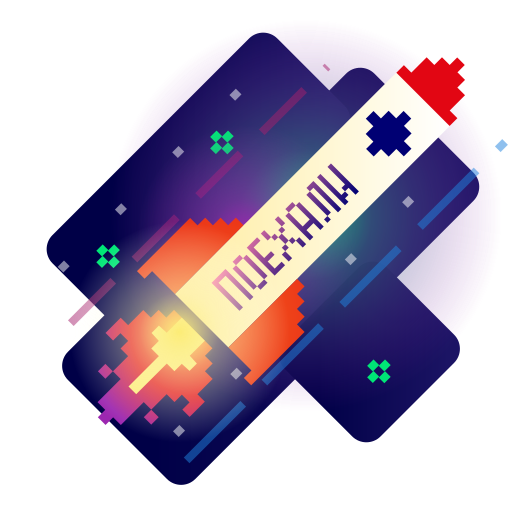
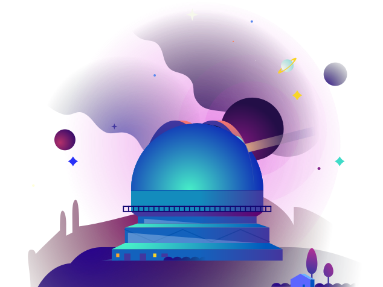

# 🖼️ Animations 素材庫

[⬅️ 返回主目錄](../../README.md)

| 預覽 (點擊放大) | 檔案資訊 |
| :--- | :--- |
|  | **AnimatedSvg-Background.svg** Vector (SVG) | 46.27KB |
|  | **BackgroundSvgPattern.svg** Vector (SVG) | 31.56KB |
|  | **BarrYUFO.svg** Vector (SVG) | 236.68KB |
|  | **Bell_Demo_CSS_only.svg** Vector (SVG) | 51.92KB |
|  | **Bell_Demo_JS.svg** Vector (SVG) | 78.38KB |
|  | **Bell_Demo_JS_On_Click.svg** Vector (SVG) | 78.45KB |
|  | **Bell_Demo_JS_On_Mouse_Over.svg** Vector (SVG) | 78.43KB |
|  | **Bell_Demo_JS_On_Scroll.svg** Vector (SVG) | 78.43KB |
|  | **Bg-Patternpad.svg** Vector (SVG) | 40.27KB |
|  | **Bg-Shape-001.svg** Vector (SVG) | 43.65KB |
|  | **Bg-ine-001.svg** Vector (SVG) | 6.07KB |
|  | **Svg-animated-loaders.svg** Vector (SVG) | 31.85KB |
|  | **Svg-background-animation-interactive.svg** Vector (SVG) | 117.44KB |
|  | **Svg-background-geometric-shapes.svg** Vector (SVG) | 6.42KB |
|  | **Svg-background.svg** Vector (SVG) | 50.88KB |
|  | **Svg-texture-background-geometric.svg** Vector (SVG) | 49.98KB |
|  | **anim_calc.svg** Vector (SVG) | 79.83KB |
|  | **anim_process1.svg** Vector (SVG) | 31.65KB |
|  | **anim_process3.svg** Vector (SVG) | 22.17KB |
|  | **anim_spaceship.svg** Vector (SVG) | 44.13KB |
|  | **anim_team.svg** Vector (SVG) | 67.09KB |
|  | **animated-svg-background-css.svg** Vector (SVG) | 5.77KB |
|  | **ico_service_animation.svg** Vector (SVG) | 6.53KB |
|  | **ico_service_animation01.svg** Vector (SVG) | 15.26KB |
|  | **ico_service_art.svg** Vector (SVG) | 9.23KB |
|  | **ico_service_uxui.svg** Vector (SVG) | 5.66KB |
|  | **illus001.svg** Vector (SVG) | 44.11KB |
|  | **neumorphism-design-example.svg** Vector (SVG) | 109.99KB |
|  | **pixel-rocket.svg** Vector (SVG) | 230.89KB |
|  | **pixel.svg** Vector (SVG) | 59.70KB |
|  | **rocket.svg** Vector (SVG) | 169.28KB |
|  | **rotate.svg** Vector (SVG) | 1.13KB |
|  | **sample.svg** Vector (SVG) | 23.26KB |
|  | **sofrware.svg** Vector (SVG) | 53.73KB |
|  | **space.svg** Vector (SVG) | 111.27KB |
|  | **squareAdv.svg** Vector (SVG) | 28.49KB |
|  | **use-Svg-as-background-image-particle-strokes.svg** Vector (SVG) | 7.83KB |