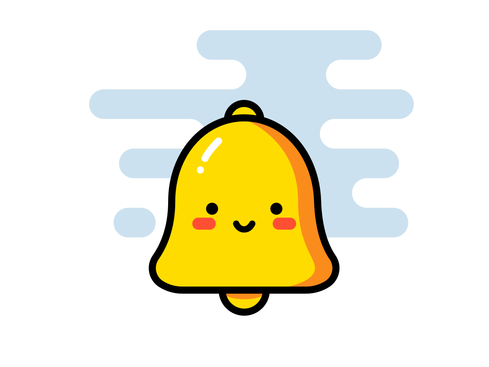

# 🖼️ 素材分類：Animations

> [🏠 主目錄](../../README.md) / **Animations**

本目錄共有 `37` 個檔案

| 🎨 預覽 (點擊放大) | 📋 檔案詳細資訊 |
| :--- | :--- |
|  | **📂 檔名:** `AnimatedSvg-Background.svg` ✨ **格式:** `Vector (SVG)` ⚖️ **大小:** `46.27KB` 📅 **更新:** `2026-02-27`  🔗 [直接查看原始檔](AnimatedSvg-Background.svg) |
|  | **📂 檔名:** `BackgroundSvgPattern.svg` ✨ **格式:** `Vector (SVG)` ⚖️ **大小:** `31.56KB` 📅 **更新:** `2026-02-27`  🔗 [直接查看原始檔](BackgroundSvgPattern.svg) |
|  | **📂 檔名:** `BarrYUFO.svg` ✨ **格式:** `Vector (SVG)` ⚖️ **大小:** `236.68KB` 📅 **更新:** `2026-02-27`  🔗 [直接查看原始檔](BarrYUFO.svg) |
|  | **📂 檔名:** `Bell_Demo_CSS_only.svg` ✨ **格式:** `Vector (SVG)` ⚖️ **大小:** `51.92KB` 📅 **更新:** `2026-02-27`  🔗 [直接查看原始檔](Bell_Demo_CSS_only.svg) |
|  | **📂 檔名:** `Bell_Demo_JS.svg` ✨ **格式:** `Vector (SVG)` ⚖️ **大小:** `78.38KB` 📅 **更新:** `2026-02-27`  🔗 [直接查看原始檔](Bell_Demo_JS.svg) |
|  | **📂 檔名:** `Bell_Demo_JS_On_Click.svg` ✨ **格式:** `Vector (SVG)` ⚖️ **大小:** `78.45KB` 📅 **更新:** `2026-02-27`  🔗 [直接查看原始檔](Bell_Demo_JS_On_Click.svg) |
|  | **📂 檔名:** `Bell_Demo_JS_On_Mouse_Over.svg` ✨ **格式:** `Vector (SVG)` ⚖️ **大小:** `78.43KB` 📅 **更新:** `2026-02-27`  🔗 [直接查看原始檔](Bell_Demo_JS_On_Mouse_Over.svg) |
|  | **📂 檔名:** `Bell_Demo_JS_On_Scroll.svg` ✨ **格式:** `Vector (SVG)` ⚖️ **大小:** `78.43KB` 📅 **更新:** `2026-02-27`  🔗 [直接查看原始檔](Bell_Demo_JS_On_Scroll.svg) |
|  | **📂 檔名:** `Bg-Patternpad.svg` ✨ **格式:** `Vector (SVG)` ⚖️ **大小:** `40.27KB` 📅 **更新:** `2026-02-27`  🔗 [直接查看原始檔](Bg-Patternpad.svg) |
|  | **📂 檔名:** `Bg-Shape-001.svg` ✨ **格式:** `Vector (SVG)` ⚖️ **大小:** `43.65KB` 📅 **更新:** `2026-02-27`  🔗 [直接查看原始檔](Bg-Shape-001.svg) |
|  | **📂 檔名:** `Bg-ine-001.svg` ✨ **格式:** `Vector (SVG)` ⚖️ **大小:** `6.07KB` 📅 **更新:** `2026-02-27`  🔗 [直接查看原始檔](Bg-ine-001.svg) |
|  | **📂 檔名:** `Svg-animated-loaders.svg` ✨ **格式:** `Vector (SVG)` ⚖️ **大小:** `31.85KB` 📅 **更新:** `2026-02-27`  🔗 [直接查看原始檔](Svg-animated-loaders.svg) |
|  | **📂 檔名:** `Svg-background-animation-interactive.svg` ✨ **格式:** `Vector (SVG)` ⚖️ **大小:** `117.44KB` 📅 **更新:** `2026-02-27`  🔗 [直接查看原始檔](Svg-background-animation-interactive.svg) |
|  | **📂 檔名:** `Svg-background-geometric-shapes.svg` ✨ **格式:** `Vector (SVG)` ⚖️ **大小:** `6.42KB` 📅 **更新:** `2026-02-27`  🔗 [直接查看原始檔](Svg-background-geometric-shapes.svg) |
|  | **📂 檔名:** `Svg-background.svg` ✨ **格式:** `Vector (SVG)` ⚖️ **大小:** `50.88KB` 📅 **更新:** `2026-02-27`  🔗 [直接查看原始檔](Svg-background.svg) |
|  | **📂 檔名:** `Svg-texture-background-geometric.svg` ✨ **格式:** `Vector (SVG)` ⚖️ **大小:** `49.98KB` 📅 **更新:** `2026-02-27`  🔗 [直接查看原始檔](Svg-texture-background-geometric.svg) |
|  | **📂 檔名:** `anim_calc.svg` ✨ **格式:** `Vector (SVG)` ⚖️ **大小:** `79.83KB` 📅 **更新:** `2026-02-27`  🔗 [直接查看原始檔](anim_calc.svg) |
|  | **📂 檔名:** `anim_process1.svg` ✨ **格式:** `Vector (SVG)` ⚖️ **大小:** `31.65KB` 📅 **更新:** `2026-02-27`  🔗 [直接查看原始檔](anim_process1.svg) |
|  | **📂 檔名:** `anim_process3.svg` ✨ **格式:** `Vector (SVG)` ⚖️ **大小:** `22.17KB` 📅 **更新:** `2026-02-27`  🔗 [直接查看原始檔](anim_process3.svg) |
|  | **📂 檔名:** `anim_spaceship.svg` ✨ **格式:** `Vector (SVG)` ⚖️ **大小:** `44.13KB` 📅 **更新:** `2026-02-27`  🔗 [直接查看原始檔](anim_spaceship.svg) |
|  | **📂 檔名:** `anim_team.svg` ✨ **格式:** `Vector (SVG)` ⚖️ **大小:** `67.09KB` 📅 **更新:** `2026-02-27`  🔗 [直接查看原始檔](anim_team.svg) |
|  | **📂 檔名:** `animated-svg-background-css.svg` ✨ **格式:** `Vector (SVG)` ⚖️ **大小:** `5.77KB` 📅 **更新:** `2026-02-27`  🔗 [直接查看原始檔](animated-svg-background-css.svg) |
|  | **📂 檔名:** `ico_service_animation.svg` ✨ **格式:** `Vector (SVG)` ⚖️ **大小:** `6.53KB` 📅 **更新:** `2026-02-27`  🔗 [直接查看原始檔](ico_service_animation.svg) |
|  | **📂 檔名:** `ico_service_animation01.svg` ✨ **格式:** `Vector (SVG)` ⚖️ **大小:** `15.26KB` 📅 **更新:** `2026-02-27`  🔗 [直接查看原始檔](ico_service_animation01.svg) |
|  | **📂 檔名:** `ico_service_art.svg` ✨ **格式:** `Vector (SVG)` ⚖️ **大小:** `9.23KB` 📅 **更新:** `2026-02-27`  🔗 [直接查看原始檔](ico_service_art.svg) |
|  | **📂 檔名:** `ico_service_uxui.svg` ✨ **格式:** `Vector (SVG)` ⚖️ **大小:** `5.66KB` 📅 **更新:** `2026-02-27`  🔗 [直接查看原始檔](ico_service_uxui.svg) |
|  | **📂 檔名:** `illus001.svg` ✨ **格式:** `Vector (SVG)` ⚖️ **大小:** `44.11KB` 📅 **更新:** `2026-02-27`  🔗 [直接查看原始檔](illus001.svg) |
|  | **📂 檔名:** `neumorphism-design-example.svg` ✨ **格式:** `Vector (SVG)` ⚖️ **大小:** `109.99KB` 📅 **更新:** `2026-02-27`  🔗 [直接查看原始檔](neumorphism-design-example.svg) |
|  | **📂 檔名:** `pixel-rocket.svg` ✨ **格式:** `Vector (SVG)` ⚖️ **大小:** `230.89KB` 📅 **更新:** `2026-02-27`  🔗 [直接查看原始檔](pixel-rocket.svg) |
|  | **📂 檔名:** `pixel.svg` ✨ **格式:** `Vector (SVG)` ⚖️ **大小:** `59.70KB` 📅 **更新:** `2026-02-27`  🔗 [直接查看原始檔](pixel.svg) |
|  | **📂 檔名:** `rocket.svg` ✨ **格式:** `Vector (SVG)` ⚖️ **大小:** `169.28KB` 📅 **更新:** `2026-02-27`  🔗 [直接查看原始檔](rocket.svg) |
|  | **📂 檔名:** `rotate.svg` ✨ **格式:** `Vector (SVG)` ⚖️ **大小:** `1.13KB` 📅 **更新:** `2026-02-27`  🔗 [直接查看原始檔](rotate.svg) |
|  | **📂 檔名:** `sample.svg` ✨ **格式:** `Vector (SVG)` ⚖️ **大小:** `23.26KB` 📅 **更新:** `2026-02-27`  🔗 [直接查看原始檔](sample.svg) |
|  | **📂 檔名:** `sofrware.svg` ✨ **格式:** `Vector (SVG)` ⚖️ **大小:** `53.73KB` 📅 **更新:** `2026-02-27`  🔗 [直接查看原始檔](sofrware.svg) |
|  | **📂 檔名:** `space.svg` ✨ **格式:** `Vector (SVG)` ⚖️ **大小:** `111.27KB` 📅 **更新:** `2026-02-27`  🔗 [直接查看原始檔](space.svg) |
|  | **📂 檔名:** `squareAdv.svg` ✨ **格式:** `Vector (SVG)` ⚖️ **大小:** `28.49KB` 📅 **更新:** `2026-02-27`  🔗 [直接查看原始檔](squareAdv.svg) |
|  | **📂 檔名:** `use-Svg-as-background-image-particle-strokes.svg` ✨ **格式:** `Vector (SVG)` ⚖️ **大小:** `7.83KB` 📅 **更新:** `2026-02-27`  🔗 [直接查看原始檔](use-Svg-as-background-image-particle-strokes.svg) |