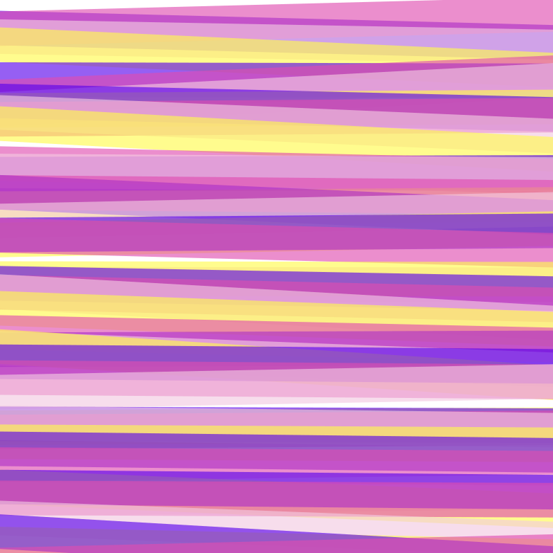

# 🖼️ Animations Gallery

[⬅️ 回到首頁](../../README.md)

| 預覽 | 詳細資訊 |
| :--- | :--- |
|  | **AnimatedSvg-Background.svg** VectorxVector | 46.27KB 更新: 2026-02-26 |
|  | **BackgroundSvgPattern.svg** VectorxVector | 31.56KB 更新: 2026-02-26 |
|  | **BarrYUFO.svg** VectorxVector | 236.68KB 更新: 2026-02-26 |
|  | **Bell_Demo_CSS_only.svg** VectorxVector | 51.92KB 更新: 2026-02-26 |
|  | **Bell_Demo_JS.svg** VectorxVector | 78.38KB 更新: 2026-02-26 |
|  | **Bell_Demo_JS_On_Click.svg** VectorxVector | 78.45KB 更新: 2026-02-26 |
|  | **Bell_Demo_JS_On_Mouse_Over.svg** VectorxVector | 78.43KB 更新: 2026-02-26 |
|  | **Bell_Demo_JS_On_Scroll.svg** VectorxVector | 78.43KB 更新: 2026-02-26 |
|  | **Bg-Patternpad.svg** VectorxVector | 40.27KB 更新: 2026-02-26 |
|  | **Bg-Shape-001.svg** VectorxVector | 43.65KB 更新: 2026-02-26 |
|  | **Bg-ine-001.svg** VectorxVector | 6.07KB 更新: 2026-02-26 |
|  | **Svg-animated-loaders.svg** VectorxVector | 31.85KB 更新: 2026-02-26 |
|  | **Svg-background-animation-interactive.svg** VectorxVector | 117.44KB 更新: 2026-02-26 |
|  | **Svg-background-geometric-shapes.svg** VectorxVector | 6.42KB 更新: 2026-02-26 |
|  | **Svg-background.svg** VectorxVector | 50.88KB 更新: 2026-02-26 |
|  | **Svg-texture-background-geometric.svg** VectorxVector | 49.98KB 更新: 2026-02-26 |
|  | **anim_calc.svg** VectorxVector | 79.83KB 更新: 2026-02-26 |
|  | **anim_process1.svg** VectorxVector | 31.65KB 更新: 2026-02-26 |
|  | **anim_process3.svg** VectorxVector | 22.17KB 更新: 2026-02-26 |
|  | **anim_spaceship.svg** VectorxVector | 44.13KB 更新: 2026-02-26 |
|  | **anim_team.svg** VectorxVector | 67.09KB 更新: 2026-02-26 |
|  | **animated-svg-background-css.svg** VectorxVector | 5.77KB 更新: 2026-02-26 |
|  | **ico_service_animation.svg** VectorxVector | 6.53KB 更新: 2026-02-26 |
|  | **ico_service_animation01.svg** VectorxVector | 15.26KB 更新: 2026-02-26 |
|  | **ico_service_art.svg** VectorxVector | 9.23KB 更新: 2026-02-26 |
|  | **ico_service_uxui.svg** VectorxVector | 5.66KB 更新: 2026-02-26 |
|  | **illus001.svg** VectorxVector | 44.11KB 更新: 2026-02-26 |
|  | **neumorphism-design-example.svg** VectorxVector | 109.99KB 更新: 2026-02-26 |
|  | **pixel-rocket.svg** VectorxVector | 230.89KB 更新: 2026-02-26 |
|  | **pixel.svg** VectorxVector | 59.70KB 更新: 2026-02-26 |
|  | **rocket.svg** VectorxVector | 169.28KB 更新: 2026-02-26 |
|  | **rotate.svg** VectorxVector | 1.13KB 更新: 2026-02-26 |
|  | **sample.svg** VectorxVector | 23.26KB 更新: 2026-02-26 |
|  | **sofrware.svg** VectorxVector | 53.73KB 更新: 2026-02-26 |
|  | **space.svg** VectorxVector | 111.27KB 更新: 2026-02-26 |
|  | **squareAdv.svg** VectorxVector | 28.49KB 更新: 2026-02-26 |
|  | **use-Svg-as-background-image-particle-strokes.svg** VectorxVector | 7.83KB 更新: 2026-02-26 |