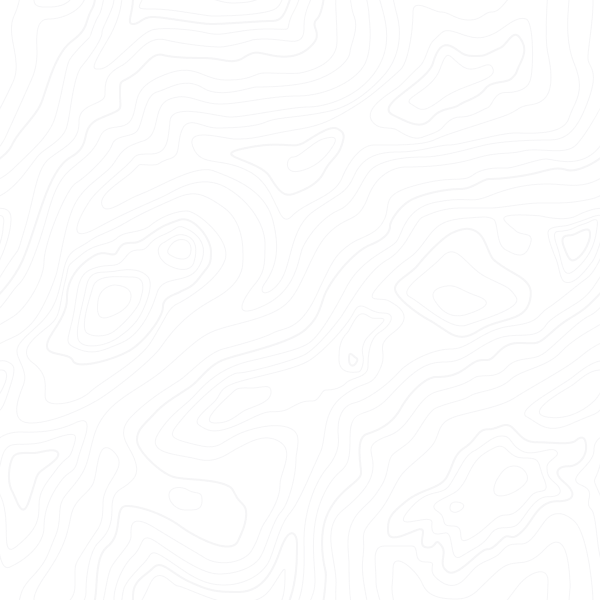
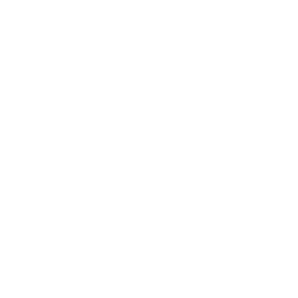

# 🖼️ 素材分類：Components

> [🏠 主目錄](../../../README.md) / [images](../../README.md) / [Design System](../README.md) / **Components**

本目錄共有 `2` 個檔案

| 🎨 預覽 (點擊放大)  | 📋 檔案詳細資訊與連結 |
| :--- | :--- |
|  | **📂 檔名:** `wave-pattern-8f.svg` ✨ **格式:** `Vector (SVG)` ⚖️ **大小:** `89.44KB` 📅 **更新:** `2026-03-01`  🚀 **jsDelivr Markdown:** `` 🔗 **直接連結 (Url):** <code>https://cdn.jsdelivr.net/gh/barry028/materials@main/images/Design%20System/Components/wave-pattern-8f.svg</code> 📥 [檢視原始檔](wave-pattern-8f.svg) |
|  | **📂 檔名:** `wave-pattern-light-78.svg` ✨ **格式:** `Vector (SVG)` ⚖️ **大小:** `89.43KB` 📅 **更新:** `2026-03-01`  🚀 **jsDelivr Markdown:** `` 🔗 **直接連結 (Url):** <code>https://cdn.jsdelivr.net/gh/barry028/materials@main/images/Design%20System/Components/wave-pattern-light-78.svg</code> 📥 [檢視原始檔](wave-pattern-light-78.svg) |