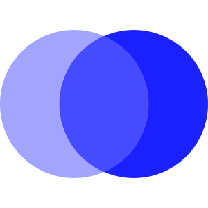
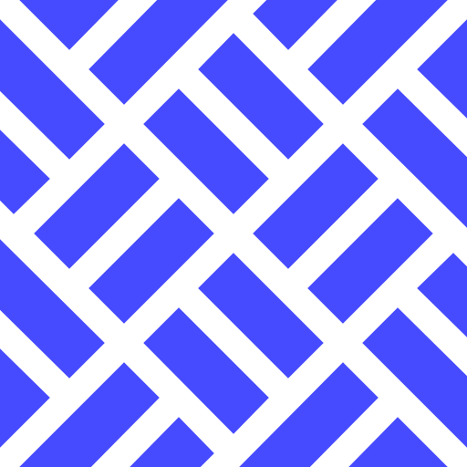
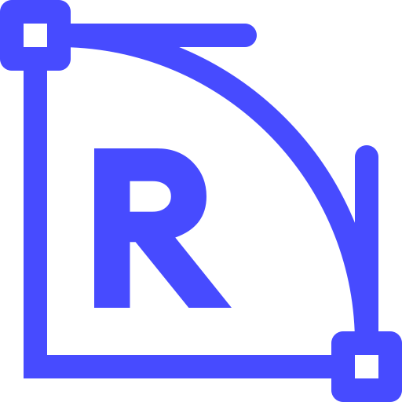

# 🖼️ 素材分類：Guideline iCon

> [🏠 主目錄](../../../../README.md) / [images](../../../README.md) / [Design System](../../README.md) / [Design System iCons](../README.md) / **Guideline iCon**

本目錄共有 `7` 個檔案

| 🎨 預覽 (點擊放大)  | 📋 檔案詳細資訊與連結 |
| :--- | :--- |
|  | **📂 檔名:** `case-converter-ae.svg` ✨ **格式:** `Vector (SVG)` ⚖️ **大小:** `1.21KB` 📅 **更新:** `2026-03-02`  🚀 **jsDelivr Markdown:** `` 🔗 **直接連結 (Url):** <code>https://cdn.jsdelivr.net/gh/barry028/materials@main/images/Design%20System/Design%20System%20iCons/Guideline%20iCon/case-converter-ae.svg</code> 📥 [檢視原始檔](case-converter-ae.svg) |
|  | **📂 檔名:** `coding-tools-60.svg` ✨ **格式:** `Vector (SVG)` ⚖️ **大小:** `7.77KB` 📅 **更新:** `2026-03-02`  🚀 **jsDelivr Markdown:** `` 🔗 **直接連結 (Url):** <code>https://cdn.jsdelivr.net/gh/barry028/materials@main/images/Design%20System/Design%20System%20iCons/Guideline%20iCon/coding-tools-60.svg</code> 📥 [檢視原始檔](coding-tools-60.svg) |
|  | **📂 檔名:** `color-mixer-b6.svg` ✨ **格式:** `Vector (SVG)` ⚖️ **大小:** `877.00B` 📅 **更新:** `2026-03-02`  🚀 **jsDelivr Markdown:** `` 🔗 **直接連結 (Url):** <code>https://cdn.jsdelivr.net/gh/barry028/materials@main/images/Design%20System/Design%20System%20iCons/Guideline%20iCon/color-mixer-b6.svg</code> 📥 [檢視原始檔](color-mixer-b6.svg) |
|  | **📂 檔名:** `color-shades-generator-4b.svg` ✨ **格式:** `Vector (SVG)` ⚖️ **大小:** `2.84KB` 📅 **更新:** `2026-03-02`  🚀 **jsDelivr Markdown:** `` 🔗 **直接連結 (Url):** <code>https://cdn.jsdelivr.net/gh/barry028/materials@main/images/Design%20System/Design%20System%20iCons/Guideline%20iCon/color-shades-generator-4b.svg</code> 📥 [檢視原始檔](color-shades-generator-4b.svg) |
|  | **📂 檔名:** `color-tools-d4.svg` ✨ **格式:** `Vector (SVG)` ⚖️ **大小:** `5.39KB` 📅 **更新:** `2026-03-02`  🚀 **jsDelivr Markdown:** `` 🔗 **直接連結 (Url):** <code>https://cdn.jsdelivr.net/gh/barry028/materials@main/images/Design%20System/Design%20System%20iCons/Guideline%20iCon/color-tools-d4.svg</code> 📥 [檢視原始檔](color-tools-d4.svg) |
|  | **📂 檔名:** `css-background-pattern-generator-0e.svg` ✨ **格式:** `Vector (SVG)` ⚖️ **大小:** `3.34KB` 📅 **更新:** `2026-03-02`  🚀 **jsDelivr Markdown:** `` 🔗 **直接連結 (Url):** <code>https://cdn.jsdelivr.net/gh/barry028/materials@main/images/Design%20System/Design%20System%20iCons/Guideline%20iCon/css-background-pattern-generator-0e.svg</code> 📥 [檢視原始檔](css-background-pattern-generator-0e.svg) |
|  | **📂 檔名:** `css-border-radius-generator-b0.svg` ✨ **格式:** `Vector (SVG)` ⚖️ **大小:** `1.67KB` 📅 **更新:** `2026-03-02`  🚀 **jsDelivr Markdown:** `` 🔗 **直接連結 (Url):** <code>https://cdn.jsdelivr.net/gh/barry028/materials@main/images/Design%20System/Design%20System%20iCons/Guideline%20iCon/css-border-radius-generator-b0.svg</code> 📥 [檢視原始檔](css-border-radius-generator-b0.svg) |