# 🖼️ 素材分類：Design System

> [🏠 主目錄](../../README.md) / [images](../README.md) / **Design System**

本目錄共有 `71` 個檔案

| 🎨 預覽 (點擊放大)  | 📋 檔案詳細資訊與連結 |
| :--- | :--- |
| <a href="docs-accordion-8d.svg">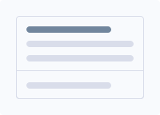</a> | **📂 檔名:** `docs-accordion-8d.svg` ✨ **格式:** `Vector (SVG)` ⚖️ **大小:** `633.00B` 📅 **更新:** `2026-02-27`  🚀 **jsDelivr Markdown:** `` 🔗 **直接連結 (Url):** <code>https://cdn.jsdelivr.net/gh/barry028/materials@main/images/Design%20System/docs-accordion-8d.svg</code> 📥 [檢視原始檔](docs-accordion-8d.svg) |
| <a href="docs-alerts-89.svg">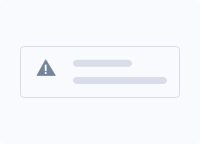</a> | **📂 檔名:** `docs-alerts-89.svg` ✨ **格式:** `Vector (SVG)` ⚖️ **大小:** `732.00B` 📅 **更新:** `2026-02-27`  🚀 **jsDelivr Markdown:** `` 🔗 **直接連結 (Url):** <code>https://cdn.jsdelivr.net/gh/barry028/materials@main/images/Design%20System/docs-alerts-89.svg</code> 📥 [檢視原始檔](docs-alerts-89.svg) |
|  | **📂 檔名:** `docs-avatars-94.svg` ✨ **格式:** `Vector (SVG)` ⚖️ **大小:** `593.00B` 📅 **更新:** `2026-02-27`  🚀 **jsDelivr Markdown:** `` 🔗 **直接連結 (Url):** <code>https://cdn.jsdelivr.net/gh/barry028/materials@main/images/Design%20System/docs-avatars-94.svg</code> 📥 [檢視原始檔](docs-avatars-94.svg) |
| <a href="docs-badge-8d.svg">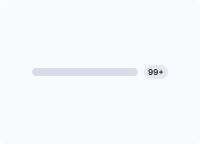</a> | **📂 檔名:** `docs-badge-8d.svg` ✨ **格式:** `Vector (SVG)` ⚖️ **大小:** `1.21KB` 📅 **更新:** `2026-02-27`  🚀 **jsDelivr Markdown:** `` 🔗 **直接連結 (Url):** <code>https://cdn.jsdelivr.net/gh/barry028/materials@main/images/Design%20System/docs-badge-8d.svg</code> 📥 [檢視原始檔](docs-badge-8d.svg) |
|  | **📂 檔名:** `docs-basic-forms-10.svg` ✨ **格式:** `Vector (SVG)` ⚖️ **大小:** `319.00B` 📅 **更新:** `2026-02-27`  🚀 **jsDelivr Markdown:** `` 🔗 **直接連結 (Url):** <code>https://cdn.jsdelivr.net/gh/barry028/materials@main/images/Design%20System/docs-basic-forms-10.svg</code> 📥 [檢視原始檔](docs-basic-forms-10.svg) |
|  | **📂 檔名:** `docs-breadcrumb-27.svg` ✨ **格式:** `Vector (SVG)` ⚖️ **大小:** `384.00B` 📅 **更新:** `2026-02-27`  🚀 **jsDelivr Markdown:** `` 🔗 **直接連結 (Url):** <code>https://cdn.jsdelivr.net/gh/barry028/materials@main/images/Design%20System/docs-breadcrumb-27.svg</code> 📥 [檢視原始檔](docs-breadcrumb-27.svg) |
|  | **📂 檔名:** `docs-bs-icons-d8.svg` ✨ **格式:** `Vector (SVG)` ⚖️ **大小:** `2.97KB` 📅 **更新:** `2026-02-27`  🚀 **jsDelivr Markdown:** `` 🔗 **直接連結 (Url):** <code>https://cdn.jsdelivr.net/gh/barry028/materials@main/images/Design%20System/docs-bs-icons-d8.svg</code> 📥 [檢視原始檔](docs-bs-icons-d8.svg) |
|  | **📂 檔名:** `docs-buttons-ff.svg` ✨ **格式:** `Vector (SVG)` ⚖️ **大小:** `310.00B` 📅 **更新:** `2026-02-27`  🚀 **jsDelivr Markdown:** `` 🔗 **直接連結 (Url):** <code>https://cdn.jsdelivr.net/gh/barry028/materials@main/images/Design%20System/docs-buttons-ff.svg</code> 📥 [檢視原始檔](docs-buttons-ff.svg) |
|  | **📂 檔名:** `docs-cards-ea.svg` ✨ **格式:** `Vector (SVG)` ⚖️ **大小:** `1.32KB` 📅 **更新:** `2026-02-27`  🚀 **jsDelivr Markdown:** `` 🔗 **直接連結 (Url):** <code>https://cdn.jsdelivr.net/gh/barry028/materials@main/images/Design%20System/docs-cards-ea.svg</code> 📥 [檢視原始檔](docs-cards-ea.svg) |
| <a href="docs-checks-and-switches-dd.svg">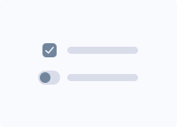</a> | **📂 檔名:** `docs-checks-and-switches-dd.svg` ✨ **格式:** `Vector (SVG)` ⚖️ **大小:** `737.00B` 📅 **更新:** `2026-02-27`  🚀 **jsDelivr Markdown:** `` 🔗 **直接連結 (Url):** <code>https://cdn.jsdelivr.net/gh/barry028/materials@main/images/Design%20System/docs-checks-and-switches-dd.svg</code> 📥 [檢視原始檔](docs-checks-and-switches-dd.svg) |
|  | **📂 檔名:** `docs-collapse-6f.svg` ✨ **格式:** `Vector (SVG)` ⚖️ **大小:** `1.17KB` 📅 **更新:** `2026-02-27`  🚀 **jsDelivr Markdown:** `` 🔗 **直接連結 (Url):** <code>https://cdn.jsdelivr.net/gh/barry028/materials@main/images/Design%20System/docs-collapse-6f.svg</code> 📥 [檢視原始檔](docs-collapse-6f.svg) |
| <a href="docs-colors-af.svg">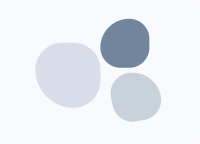</a> | **📂 檔名:** `docs-colors-af.svg` ✨ **格式:** `Vector (SVG)` ⚖️ **大小:** `838.00B` 📅 **更新:** `2026-02-27`  🚀 **jsDelivr Markdown:** `` 🔗 **直接連結 (Url):** <code>https://cdn.jsdelivr.net/gh/barry028/materials@main/images/Design%20System/docs-colors-af.svg</code> 📥 [檢視原始檔](docs-colors-af.svg) |
|  | **📂 檔名:** `docs-column-divider-04.svg` ✨ **格式:** `Vector (SVG)` ⚖️ **大小:** `416.00B` 📅 **更新:** `2026-02-27`  🚀 **jsDelivr Markdown:** `` 🔗 **直接連結 (Url):** <code>https://cdn.jsdelivr.net/gh/barry028/materials@main/images/Design%20System/docs-column-divider-04.svg</code> 📥 [檢視原始檔](docs-column-divider-04.svg) |
| <a href="docs-countdown-02.svg">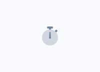</a> | **📂 檔名:** `docs-countdown-02.svg` ✨ **格式:** `Vector (SVG)` ⚖️ **大小:** `711.00B` 📅 **更新:** `2026-02-27`  🚀 **jsDelivr Markdown:** `` 🔗 **直接連結 (Url):** <code>https://cdn.jsdelivr.net/gh/barry028/materials@main/images/Design%20System/docs-countdown-02.svg</code> 📥 [檢視原始檔](docs-countdown-02.svg) |
| <a href="docs-devices-04.svg">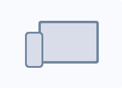</a> | **📂 檔名:** `docs-devices-04.svg` ✨ **格式:** `Vector (SVG)` ⚖️ **大小:** `443.00B` 📅 **更新:** `2026-02-27`  🚀 **jsDelivr Markdown:** `` 🔗 **直接連結 (Url):** <code>https://cdn.jsdelivr.net/gh/barry028/materials@main/images/Design%20System/docs-devices-04.svg</code> 📥 [檢視原始檔](docs-devices-04.svg) |
|  | **📂 檔名:** `docs-divider-a1.svg` ✨ **格式:** `Vector (SVG)` ⚖️ **大小:** `710.00B` 📅 **更新:** `2026-02-27`  🚀 **jsDelivr Markdown:** `` 🔗 **直接連結 (Url):** <code>https://cdn.jsdelivr.net/gh/barry028/materials@main/images/Design%20System/docs-divider-a1.svg</code> 📥 [檢視原始檔](docs-divider-a1.svg) |
|  | **📂 檔名:** `docs-dropdowns-8a.svg` ✨ **格式:** `Vector (SVG)` ⚖️ **大小:** `1.51KB` 📅 **更新:** `2026-02-27`  🚀 **jsDelivr Markdown:** `` 🔗 **直接連結 (Url):** <code>https://cdn.jsdelivr.net/gh/barry028/materials@main/images/Design%20System/docs-dropdowns-8a.svg</code> 📥 [檢視原始檔](docs-dropdowns-8a.svg) |
| <a href="docs-fslightbox-59.svg">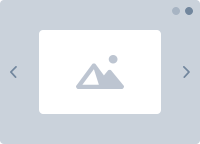</a> | **📂 檔名:** `docs-fslightbox-59.svg` ✨ **格式:** `Vector (SVG)` ⚖️ **大小:** `1.30KB` 📅 **更新:** `2026-02-27`  🚀 **jsDelivr Markdown:** `` 🔗 **直接連結 (Url):** <code>https://cdn.jsdelivr.net/gh/barry028/materials@main/images/Design%20System/docs-fslightbox-59.svg</code> 📥 [檢視原始檔](docs-fslightbox-59.svg) |
|  | **📂 檔名:** `docs-go-to-56.svg` ✨ **格式:** `Vector (SVG)` ⚖️ **大小:** `381.00B` 📅 **更新:** `2026-02-27`  🚀 **jsDelivr Markdown:** `` 🔗 **直接連結 (Url):** <code>https://cdn.jsdelivr.net/gh/barry028/materials@main/images/Design%20System/docs-go-to-56.svg</code> 📥 [檢視原始檔](docs-go-to-56.svg) |
|  | **📂 檔名:** `docs-heading-df.svg` ✨ **格式:** `Vector (SVG)` ⚖️ **大小:** `1.47KB` 📅 **更新:** `2026-02-27`  🚀 **jsDelivr Markdown:** `` 🔗 **直接連結 (Url):** <code>https://cdn.jsdelivr.net/gh/barry028/materials@main/images/Design%20System/docs-heading-df.svg</code> 📥 [檢視原始檔](docs-heading-df.svg) |
|  | **📂 檔名:** `docs-input-group-8e.svg` ✨ **格式:** `Vector (SVG)` ⚖️ **大小:** `460.00B` 📅 **更新:** `2026-02-27`  🚀 **jsDelivr Markdown:** `` 🔗 **直接連結 (Url):** <code>https://cdn.jsdelivr.net/gh/barry028/materials@main/images/Design%20System/docs-input-group-8e.svg</code> 📥 [檢視原始檔](docs-input-group-8e.svg) |
|  | **📂 檔名:** `docs-list-group-a7.svg` ✨ **格式:** `Vector (SVG)` ⚖️ **大小:** `508.00B` 📅 **更新:** `2026-02-27`  🚀 **jsDelivr Markdown:** `` 🔗 **直接連結 (Url):** <code>https://cdn.jsdelivr.net/gh/barry028/materials@main/images/Design%20System/docs-list-group-a7.svg</code> 📥 [檢視原始檔](docs-list-group-a7.svg) |
|  | **📂 檔名:** `docs-lists-c6.svg` ✨ **格式:** `Vector (SVG)` ⚖️ **大小:** `677.00B` 📅 **更新:** `2026-02-27`  🚀 **jsDelivr Markdown:** `` 🔗 **直接連結 (Url):** <code>https://cdn.jsdelivr.net/gh/barry028/materials@main/images/Design%20System/docs-lists-c6.svg</code> 📥 [檢視原始檔](docs-lists-c6.svg) |
| <a href="docs-mask-7a.svg">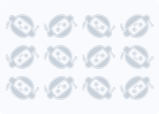</a> | **📂 檔名:** `docs-mask-7a.svg` ✨ **格式:** `Vector (SVG)` ⚖️ **大小:** `51.61KB` 📅 **更新:** `2026-02-27`  🚀 **jsDelivr Markdown:** `` 🔗 **直接連結 (Url):** <code>https://cdn.jsdelivr.net/gh/barry028/materials@main/images/Design%20System/docs-mask-7a.svg</code> 📥 [檢視原始檔](docs-mask-7a.svg) |
|  | **📂 檔名:** `docs-mega-menu-6d.svg` ✨ **格式:** `Vector (SVG)` ⚖️ **大小:** `1.49KB` 📅 **更新:** `2026-02-27`  🚀 **jsDelivr Markdown:** `` 🔗 **直接連結 (Url):** <code>https://cdn.jsdelivr.net/gh/barry028/materials@main/images/Design%20System/docs-mega-menu-6d.svg</code> 📥 [檢視原始檔](docs-mega-menu-6d.svg) |
|  | **📂 檔名:** `docs-modal-5a.svg` ✨ **格式:** `Vector (SVG)` ⚖️ **大小:** `1.43KB` 📅 **更新:** `2026-02-27`  🚀 **jsDelivr Markdown:** `` 🔗 **直接連結 (Url):** <code>https://cdn.jsdelivr.net/gh/barry028/materials@main/images/Design%20System/docs-modal-5a.svg</code> 📥 [檢視原始檔](docs-modal-5a.svg) |
|  | **📂 檔名:** `docs-navbar-d6.svg` ✨ **格式:** `Vector (SVG)` ⚖️ **大小:** `909.00B` 📅 **更新:** `2026-02-27`  🚀 **jsDelivr Markdown:** `` 🔗 **直接連結 (Url):** <code>https://cdn.jsdelivr.net/gh/barry028/materials@main/images/Design%20System/docs-navbar-d6.svg</code> 📥 [檢視原始檔](docs-navbar-d6.svg) |
|  | **📂 檔名:** `docs-navs-95.svg` ✨ **格式:** `Vector (SVG)` ⚖️ **大小:** `375.00B` 📅 **更新:** `2026-02-27`  🚀 **jsDelivr Markdown:** `` 🔗 **直接連結 (Url):** <code>https://cdn.jsdelivr.net/gh/barry028/materials@main/images/Design%20System/docs-navs-95.svg</code> 📥 [檢視原始檔](docs-navs-95.svg) |
|  | **📂 檔名:** `docs-offcanvas-ef.svg` ✨ **格式:** `Vector (SVG)` ⚖️ **大小:** `1.31KB` 📅 **更新:** `2026-02-27`  🚀 **jsDelivr Markdown:** `` 🔗 **直接連結 (Url):** <code>https://cdn.jsdelivr.net/gh/barry028/materials@main/images/Design%20System/docs-offcanvas-ef.svg</code> 📥 [檢視原始檔](docs-offcanvas-ef.svg) |
| <a href="docs-pagination-6f.svg">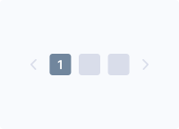</a> | **📂 檔名:** `docs-pagination-6f.svg` ✨ **格式:** `Vector (SVG)` ⚖️ **大小:** `1.01KB` 📅 **更新:** `2026-02-27`  🚀 **jsDelivr Markdown:** `` 🔗 **直接連結 (Url):** <code>https://cdn.jsdelivr.net/gh/barry028/materials@main/images/Design%20System/docs-pagination-6f.svg</code> 📥 [檢視原始檔](docs-pagination-6f.svg) |
|  | **📂 檔名:** `docs-popovers-af.svg` ✨ **格式:** `Vector (SVG)` ⚖️ **大小:** `2.01KB` 📅 **更新:** `2026-02-27`  🚀 **jsDelivr Markdown:** `` 🔗 **直接連結 (Url):** <code>https://cdn.jsdelivr.net/gh/barry028/materials@main/images/Design%20System/docs-popovers-af.svg</code> 📥 [檢視原始檔](docs-popovers-af.svg) |
| <a href="docs-progress-15.svg">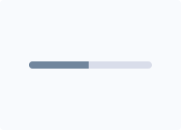</a> | **📂 檔名:** `docs-progress-15.svg` ✨ **格式:** `Vector (SVG)` ⚖️ **大小:** `312.00B` 📅 **更新:** `2026-02-27`  🚀 **jsDelivr Markdown:** `` 🔗 **直接連結 (Url):** <code>https://cdn.jsdelivr.net/gh/barry028/materials@main/images/Design%20System/docs-progress-15.svg</code> 📥 [檢視原始檔](docs-progress-15.svg) |
|  | **📂 檔名:** `docs-scrollspy-ec.svg` ✨ **格式:** `Vector (SVG)` ⚖️ **大小:** `820.00B` 📅 **更新:** `2026-02-27`  🚀 **jsDelivr Markdown:** `` 🔗 **直接連結 (Url):** <code>https://cdn.jsdelivr.net/gh/barry028/materials@main/images/Design%20System/docs-scrollspy-ec.svg</code> 📥 [檢視原始檔](docs-scrollspy-ec.svg) |
|  | **📂 檔名:** `docs-shapes-87.svg` ✨ **格式:** `Vector (SVG)` ⚖️ **大小:** `242.00B` 📅 **更新:** `2026-02-27`  🚀 **jsDelivr Markdown:** `` 🔗 **直接連結 (Url):** <code>https://cdn.jsdelivr.net/gh/barry028/materials@main/images/Design%20System/docs-shapes-87.svg</code> 📥 [檢視原始檔](docs-shapes-87.svg) |
| <a href="docs-sliding-img-ac.svg">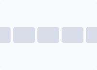</a> | **📂 檔名:** `docs-sliding-img-ac.svg` ✨ **格式:** `Vector (SVG)` ⚖️ **大小:** `639.00B` 📅 **更新:** `2026-02-27`  🚀 **jsDelivr Markdown:** `` 🔗 **直接連結 (Url):** <code>https://cdn.jsdelivr.net/gh/barry028/materials@main/images/Design%20System/docs-sliding-img-ac.svg</code> 📥 [檢視原始檔](docs-sliding-img-ac.svg) |
|  | **📂 檔名:** `docs-spinners-d0.svg` ✨ **格式:** `Vector (SVG)` ⚖️ **大小:** `792.00B` 📅 **更新:** `2026-02-27`  🚀 **jsDelivr Markdown:** `` 🔗 **直接連結 (Url):** <code>https://cdn.jsdelivr.net/gh/barry028/materials@main/images/Design%20System/docs-spinners-d0.svg</code> 📥 [檢視原始檔](docs-spinners-d0.svg) |
|  | **📂 檔名:** `docs-steps-23.svg` ✨ **格式:** `Vector (SVG)` ⚖️ **大小:** `739.00B` 📅 **更新:** `2026-02-27`  🚀 **jsDelivr Markdown:** `` 🔗 **直接連結 (Url):** <code>https://cdn.jsdelivr.net/gh/barry028/materials@main/images/Design%20System/docs-steps-23.svg</code> 📥 [檢視原始檔](docs-steps-23.svg) |
| <a href="docs-sticky-block-ff.svg">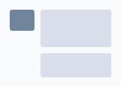</a> | **📂 檔名:** `docs-sticky-block-ff.svg` ✨ **格式:** `Vector (SVG)` ⚖️ **大小:** `379.00B` 📅 **更新:** `2026-02-27`  🚀 **jsDelivr Markdown:** `` 🔗 **直接連結 (Url):** <code>https://cdn.jsdelivr.net/gh/barry028/materials@main/images/Design%20System/docs-sticky-block-ff.svg</code> 📥 [檢視原始檔](docs-sticky-block-ff.svg) |
|  | **📂 檔名:** `docs-swiper-c9.svg` ✨ **格式:** `Vector (SVG)` ⚖️ **大小:** `1.38KB` 📅 **更新:** `2026-02-27`  🚀 **jsDelivr Markdown:** `` 🔗 **直接連結 (Url):** <code>https://cdn.jsdelivr.net/gh/barry028/materials@main/images/Design%20System/docs-swiper-c9.svg</code> 📥 [檢視原始檔](docs-swiper-c9.svg) |
| <a href="docs-tab-9e.svg">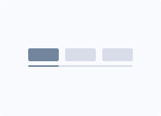</a> | **📂 檔名:** `docs-tab-9e.svg` ✨ **格式:** `Vector (SVG)` ⚖️ **大小:** `509.00B` 📅 **更新:** `2026-02-27`  🚀 **jsDelivr Markdown:** `` 🔗 **直接連結 (Url):** <code>https://cdn.jsdelivr.net/gh/barry028/materials@main/images/Design%20System/docs-tab-9e.svg</code> 📥 [檢視原始檔](docs-tab-9e.svg) |
|  | **📂 檔名:** `docs-tables-e5.svg` ✨ **格式:** `Vector (SVG)` ⚖️ **大小:** `699.00B` 📅 **更新:** `2026-02-27`  🚀 **jsDelivr Markdown:** `` 🔗 **直接連結 (Url):** <code>https://cdn.jsdelivr.net/gh/barry028/materials@main/images/Design%20System/docs-tables-e5.svg</code> 📥 [檢視原始檔](docs-tables-e5.svg) |
|  | **📂 檔名:** `docs-toasts-2d.svg` ✨ **格式:** `Vector (SVG)` ⚖️ **大小:** `887.00B` 📅 **更新:** `2026-02-27`  🚀 **jsDelivr Markdown:** `` 🔗 **直接連結 (Url):** <code>https://cdn.jsdelivr.net/gh/barry028/materials@main/images/Design%20System/docs-toasts-2d.svg</code> 📥 [檢視原始檔](docs-toasts-2d.svg) |
|  | **📂 檔名:** `docs-tooltips-93.svg` ✨ **格式:** `Vector (SVG)` ⚖️ **大小:** `1.37KB` 📅 **更新:** `2026-02-27`  🚀 **jsDelivr Markdown:** `` 🔗 **直接連結 (Url):** <code>https://cdn.jsdelivr.net/gh/barry028/materials@main/images/Design%20System/docs-tooltips-93.svg</code> 📥 [檢視原始檔](docs-tooltips-93.svg) |
|  | **📂 檔名:** `docs-typography-06.svg` ✨ **格式:** `Vector (SVG)` ⚖️ **大小:** `1.02KB` 📅 **更新:** `2026-02-27`  🚀 **jsDelivr Markdown:** `` 🔗 **直接連結 (Url):** <code>https://cdn.jsdelivr.net/gh/barry028/materials@main/images/Design%20System/docs-typography-06.svg</code> 📥 [檢視原始檔](docs-typography-06.svg) |
|  | **📂 檔名:** `snippets-cards-grid-d1.svg` ✨ **格式:** `Vector (SVG)` ⚖️ **大小:** `5.00KB` 📅 **更新:** `2026-02-27`  🚀 **jsDelivr Markdown:** `` 🔗 **直接連結 (Url):** <code>https://cdn.jsdelivr.net/gh/barry028/materials@main/images/Design%20System/snippets-cards-grid-d1.svg</code> 📥 [檢視原始檔](snippets-cards-grid-d1.svg) |
|  | **📂 檔名:** `snippets-cards-list-5b.svg` ✨ **格式:** `Vector (SVG)` ⚖️ **大小:** `3.58KB` 📅 **更新:** `2026-02-27`  🚀 **jsDelivr Markdown:** `` 🔗 **直接連結 (Url):** <code>https://cdn.jsdelivr.net/gh/barry028/materials@main/images/Design%20System/snippets-cards-list-5b.svg</code> 📥 [檢視原始檔](snippets-cards-list-5b.svg) |
|  | **📂 檔名:** `snippets-clients-e5.svg` ✨ **格式:** `Vector (SVG)` ⚖️ **大小:** `7.89KB` 📅 **更新:** `2026-02-27`  🚀 **jsDelivr Markdown:** `` 🔗 **直接連結 (Url):** <code>https://cdn.jsdelivr.net/gh/barry028/materials@main/images/Design%20System/snippets-clients-e5.svg</code> 📥 [檢視原始檔](snippets-clients-e5.svg) |
|  | **📂 檔名:** `snippets-comments-ed.svg` ✨ **格式:** `Vector (SVG)` ⚖️ **大小:** `4.29KB` 📅 **更新:** `2026-02-27`  🚀 **jsDelivr Markdown:** `` 🔗 **直接連結 (Url):** <code>https://cdn.jsdelivr.net/gh/barry028/materials@main/images/Design%20System/snippets-comments-ed.svg</code> 📥 [檢視原始檔](snippets-comments-ed.svg) |
|  | **📂 檔名:** `snippets-contact-sections-0a.svg` ✨ **格式:** `Vector (SVG)` ⚖️ **大小:** `6.64KB` 📅 **更新:** `2026-02-27`  🚀 **jsDelivr Markdown:** `` 🔗 **直接連結 (Url):** <code>https://cdn.jsdelivr.net/gh/barry028/materials@main/images/Design%20System/snippets-contact-sections-0a.svg</code> 📥 [檢視原始檔](snippets-contact-sections-0a.svg) |
|  | **📂 檔名:** `snippets-content-sections-ca.svg` ✨ **格式:** `Vector (SVG)` ⚖️ **大小:** `15.84KB` 📅 **更新:** `2026-02-27`  🚀 **jsDelivr Markdown:** `` 🔗 **直接連結 (Url):** <code>https://cdn.jsdelivr.net/gh/barry028/materials@main/images/Design%20System/snippets-content-sections-ca.svg</code> 📥 [檢視原始檔](snippets-content-sections-ca.svg) |
|  | **📂 檔名:** `snippets-cta-c7.svg` ✨ **格式:** `Vector (SVG)` ⚖️ **大小:** `10.78KB` 📅 **更新:** `2026-02-27`  🚀 **jsDelivr Markdown:** `` 🔗 **直接連結 (Url):** <code>https://cdn.jsdelivr.net/gh/barry028/materials@main/images/Design%20System/snippets-cta-c7.svg</code> 📥 [檢視原始檔](snippets-cta-c7.svg) |
|  | **📂 檔名:** `snippets-faq-15.svg` ✨ **格式:** `Vector (SVG)` ⚖️ **大小:** `8.49KB` 📅 **更新:** `2026-02-27`  🚀 **jsDelivr Markdown:** `` 🔗 **直接連結 (Url):** <code>https://cdn.jsdelivr.net/gh/barry028/materials@main/images/Design%20System/snippets-faq-15.svg</code> 📥 [檢視原始檔](snippets-faq-15.svg) |
|  | **📂 檔名:** `snippets-features-general-86.svg` ✨ **格式:** `Vector (SVG)` ⚖️ **大小:** `8.61KB` 📅 **更新:** `2026-02-27`  🚀 **jsDelivr Markdown:** `` 🔗 **直接連結 (Url):** <code>https://cdn.jsdelivr.net/gh/barry028/materials@main/images/Design%20System/snippets-features-general-86.svg</code> 📥 [檢視原始檔](snippets-features-general-86.svg) |
| <a href="snippets-features-navs-cf.svg">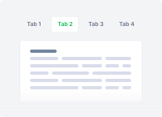</a> | **📂 檔名:** `snippets-features-navs-cf.svg` ✨ **格式:** `Vector (SVG)` ⚖️ **大小:** `6.62KB` 📅 **更新:** `2026-02-27`  🚀 **jsDelivr Markdown:** `` 🔗 **直接連結 (Url):** <code>https://cdn.jsdelivr.net/gh/barry028/materials@main/images/Design%20System/snippets-features-navs-cf.svg</code> 📥 [檢視原始檔](snippets-features-navs-cf.svg) |
|  | **📂 檔名:** `snippets-features-stats-be.svg` ✨ **格式:** `Vector (SVG)` ⚖️ **大小:** `24.66KB` 📅 **更新:** `2026-02-27`  🚀 **jsDelivr Markdown:** `` 🔗 **直接連結 (Url):** <code>https://cdn.jsdelivr.net/gh/barry028/materials@main/images/Design%20System/snippets-features-stats-be.svg</code> 📥 [檢視原始檔](snippets-features-stats-be.svg) |
|  | **📂 檔名:** `snippets-features-step-83.svg` ✨ **格式:** `Vector (SVG)` ⚖️ **大小:** `3.35KB` 📅 **更新:** `2026-02-27`  🚀 **jsDelivr Markdown:** `` 🔗 **直接連結 (Url):** <code>https://cdn.jsdelivr.net/gh/barry028/materials@main/images/Design%20System/snippets-features-step-83.svg</code> 📥 [檢視原始檔](snippets-features-step-83.svg) |
|  | **📂 檔名:** `snippets-footer-6c.svg` ✨ **格式:** `Vector (SVG)` ⚖️ **大小:** `3.39KB` 📅 **更新:** `2026-02-27`  🚀 **jsDelivr Markdown:** `` 🔗 **直接連結 (Url):** <code>https://cdn.jsdelivr.net/gh/barry028/materials@main/images/Design%20System/snippets-footer-6c.svg</code> 📥 [檢視原始檔](snippets-footer-6c.svg) |
|  | **📂 檔名:** `snippets-form-layouts-authentication-da.svg` ✨ **格式:** `Vector (SVG)` ⚖️ **大小:** `1.98KB` 📅 **更新:** `2026-02-27`  🚀 **jsDelivr Markdown:** `` 🔗 **直接連結 (Url):** <code>https://cdn.jsdelivr.net/gh/barry028/materials@main/images/Design%20System/snippets-form-layouts-authentication-da.svg</code> 📥 [檢視原始檔](snippets-form-layouts-authentication-da.svg) |
|  | **📂 檔名:** `snippets-form-layouts-feedback-a2.svg` ✨ **格式:** `Vector (SVG)` ⚖️ **大小:** `6.30KB` 📅 **更新:** `2026-02-27`  🚀 **jsDelivr Markdown:** `` 🔗 **直接連結 (Url):** <code>https://cdn.jsdelivr.net/gh/barry028/materials@main/images/Design%20System/snippets-form-layouts-feedback-a2.svg</code> 📥 [檢視原始檔](snippets-form-layouts-feedback-a2.svg) |
|  | **📂 檔名:** `snippets-form-layouts-filters-77.svg` ✨ **格式:** `Vector (SVG)` ⚖️ **大小:** `2.86KB` 📅 **更新:** `2026-02-27`  🚀 **jsDelivr Markdown:** `` 🔗 **直接連結 (Url):** <code>https://cdn.jsdelivr.net/gh/barry028/materials@main/images/Design%20System/snippets-form-layouts-filters-77.svg</code> 📥 [檢視原始檔](snippets-form-layouts-filters-77.svg) |
|  | **📂 檔名:** `snippets-form-layouts-search-77.svg` ✨ **格式:** `Vector (SVG)` ⚖️ **大小:** `1.24KB` 📅 **更新:** `2026-02-27`  🚀 **jsDelivr Markdown:** `` 🔗 **直接連結 (Url):** <code>https://cdn.jsdelivr.net/gh/barry028/materials@main/images/Design%20System/snippets-form-layouts-search-77.svg</code> 📥 [檢視原始檔](snippets-form-layouts-search-77.svg) |
|  | **📂 檔名:** `snippets-form-layouts-subscribe-af.svg` ✨ **格式:** `Vector (SVG)` ⚖️ **大小:** `10.26KB` 📅 **更新:** `2026-02-27`  🚀 **jsDelivr Markdown:** `` 🔗 **直接連結 (Url):** <code>https://cdn.jsdelivr.net/gh/barry028/materials@main/images/Design%20System/snippets-form-layouts-subscribe-af.svg</code> 📥 [檢視原始檔](snippets-form-layouts-subscribe-af.svg) |
|  | **📂 檔名:** `snippets-gallery-c7.svg` ✨ **格式:** `Vector (SVG)` ⚖️ **大小:** `7.14KB` 📅 **更新:** `2026-02-27`  🚀 **jsDelivr Markdown:** `` 🔗 **直接連結 (Url):** <code>https://cdn.jsdelivr.net/gh/barry028/materials@main/images/Design%20System/snippets-gallery-c7.svg</code> 📥 [檢視原始檔](snippets-gallery-c7.svg) |
| <a href="snippets-hero-sections-15.svg">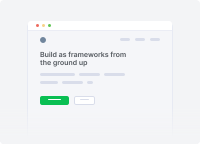</a> | **📂 檔名:** `snippets-hero-sections-15.svg` ✨ **格式:** `Vector (SVG)` ⚖️ **大小:** `10.70KB` 📅 **更新:** `2026-02-27`  🚀 **jsDelivr Markdown:** `` 🔗 **直接連結 (Url):** <code>https://cdn.jsdelivr.net/gh/barry028/materials@main/images/Design%20System/snippets-hero-sections-15.svg</code> 📥 [檢視原始檔](snippets-hero-sections-15.svg) |
|  | **📂 檔名:** `snippets-icon-blocks-3c.svg` ✨ **格式:** `Vector (SVG)` ⚖️ **大小:** `4.92KB` 📅 **更新:** `2026-02-27`  🚀 **jsDelivr Markdown:** `` 🔗 **直接連結 (Url):** <code>https://cdn.jsdelivr.net/gh/barry028/materials@main/images/Design%20System/snippets-icon-blocks-3c.svg</code> 📥 [檢視原始檔](snippets-icon-blocks-3c.svg) |
|  | **📂 檔名:** `snippets-navbar-ee.svg` ✨ **格式:** `Vector (SVG)` ⚖️ **大小:** `3.34KB` 📅 **更新:** `2026-02-27`  🚀 **jsDelivr Markdown:** `` 🔗 **直接連結 (Url):** <code>https://cdn.jsdelivr.net/gh/barry028/materials@main/images/Design%20System/snippets-navbar-ee.svg</code> 📥 [檢視原始檔](snippets-navbar-ee.svg) |
|  | **📂 檔名:** `snippets-pricing-80.svg` ✨ **格式:** `Vector (SVG)` ⚖️ **大小:** `10.98KB` 📅 **更新:** `2026-02-27`  🚀 **jsDelivr Markdown:** `` 🔗 **直接連結 (Url):** <code>https://cdn.jsdelivr.net/gh/barry028/materials@main/images/Design%20System/snippets-pricing-80.svg</code> 📥 [檢視原始檔](snippets-pricing-80.svg) |
|  | **📂 檔名:** `snippets-sidebar-examples-6f.svg` ✨ **格式:** `Vector (SVG)` ⚖️ **大小:** `1.98KB` 📅 **更新:** `2026-02-27`  🚀 **jsDelivr Markdown:** `` 🔗 **直接連結 (Url):** <code>https://cdn.jsdelivr.net/gh/barry028/materials@main/images/Design%20System/snippets-sidebar-examples-6f.svg</code> 📥 [檢視原始檔](snippets-sidebar-examples-6f.svg) |
|  | **📂 檔名:** `snippets-team-sections-d6.svg` ✨ **格式:** `Vector (SVG)` ⚖️ **大小:** `5.16KB` 📅 **更新:** `2026-02-27`  🚀 **jsDelivr Markdown:** `` 🔗 **直接連結 (Url):** <code>https://cdn.jsdelivr.net/gh/barry028/materials@main/images/Design%20System/snippets-team-sections-d6.svg</code> 📥 [檢視原始檔](snippets-team-sections-d6.svg) |
|  | **📂 檔名:** `snippets-testimonials-ff.svg` ✨ **格式:** `Vector (SVG)` ⚖️ **大小:** `10.58KB` 📅 **更新:** `2026-02-27`  🚀 **jsDelivr Markdown:** `` 🔗 **直接連結 (Url):** <code>https://cdn.jsdelivr.net/gh/barry028/materials@main/images/Design%20System/snippets-testimonials-ff.svg</code> 📥 [檢視原始檔](snippets-testimonials-ff.svg) |
|  | **📂 檔名:** `snippets-user-profile-36.svg` ✨ **格式:** `Vector (SVG)` ⚖️ **大小:** `2.71KB` 📅 **更新:** `2026-02-27`  🚀 **jsDelivr Markdown:** `` 🔗 **直接連結 (Url):** <code>https://cdn.jsdelivr.net/gh/barry028/materials@main/images/Design%20System/snippets-user-profile-36.svg</code> 📥 [檢視原始檔](snippets-user-profile-36.svg) |