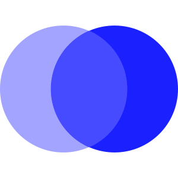
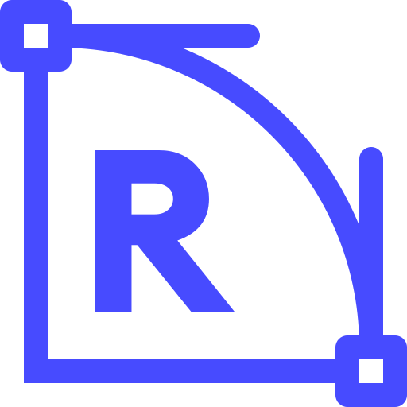

# 🖼️ Guideline-iCon Gallery

[⬅️ 回到首頁](../../README.md)

| 預覽 | 詳細資訊 |
| :--- | :--- |
|  | **case-converter-ae.svg** Vector (SVG) \| 1.21KB 更新: 2026-02-26 |
|  | **coding-tools-60.svg** Vector (SVG) \| 7.77KB 更新: 2026-02-26 |
|  | **color-mixer-b6.svg** Vector (SVG) \| 877.00B 更新: 2026-02-26 |
|  | **color-shades-generator-4b.svg** Vector (SVG) \| 2.84KB 更新: 2026-02-26 |
|  | **color-tools-d4.svg** Vector (SVG) \| 5.39KB 更新: 2026-02-26 |
|  | **css-background-pattern-generator-0e.svg** Vector (SVG) \| 3.34KB 更新: 2026-02-26 |
|  | **css-border-radius-generator-b0.svg** Vector (SVG) \| 1.67KB 更新: 2026-02-26 |