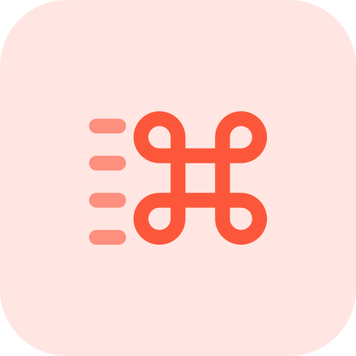
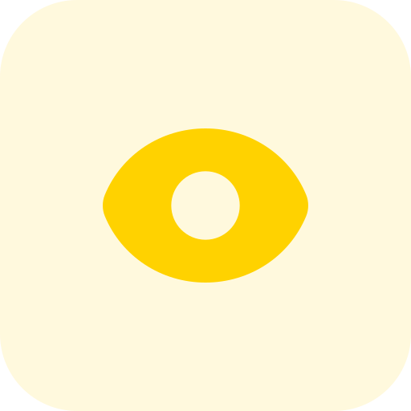
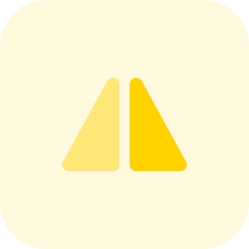
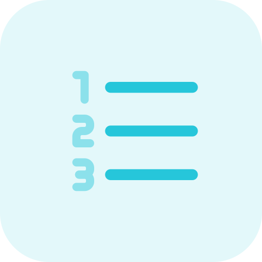
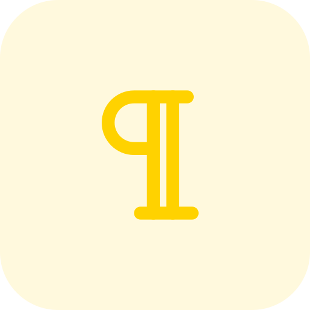

# 🖼️ Square-iCon

[⬅️ 返回主目錄](../../../../README.md)

| 預覽 | 資訊 |
| :--- | :--- |
|  | **001-add-77.svg** |
|  | **001-add-d4.png** |
|  | **002-alphabet-07.svg** |
|  | **002-alphabet-cd.png** |
|  | **003-binoculars-0e.svg** |
|  | **003-binoculars-62.png** |
|  | **004-bold-c5.png** |
|  | **004-bold-cd.svg** |
|  | **005-quote-9f.svg** |
|  | **005-quote-ea.png** |
|  | **006-bullet list-bf.png** |
|  | **006-bullet list-d0.svg** |
|  | **007-calendar-05.svg** |
|  | **007-calendar-ef.png** |
|  | **008-clipboard-06.png** |
|  | **008-clipboard-4c.svg** |
|  | **009-code-b4.svg** |
|  | **009-code-c3.png** |
|  | **010-command-f0.png** |
|  | **010-command-ff.svg** |
|  | **011-copy-08.png** |
|  | **011-copy-1c.svg** |
|  | **012-crop-8a.png** |
|  | **012-crop-ac.svg** |
|  | **013-cut-0f.png** |
|  | **013-cut-ed.svg** |
|  | **014-delete-51.png** |
|  | **014-delete-99.svg** |
|  | **015-delete-28.png** |
|  | **015-delete-70.svg** |
|  | **016-edit-b4.svg** |
|  | **016-edit-ef.png** |
|  | **017-eraser-2e.png** |
|  | **017-eraser-4b.svg** |
|  | **018-eye-9c.svg** |
|  | **018-eye-e5.png** |
|  | **019-eye-4e.svg** |
|  | **019-eye-c6.png** |
|  | **020-filter-46.svg** |
|  | **020-filter-b0.png** |
|  | **021-find-32.png** |
|  | **021-find-d7.svg** |
|  | **022-flip-36.png** |
|  | **022-flip-81.svg** |
|  | **023-flip-55.svg** |
|  | **023-flip-80.png** |
|  | **024-flip-30.svg** |
|  | **024-flip-62.png** |
|  | **025-flip-3b.png** |
|  | **025-flip-f2.svg** |
|  | **026-font-63.png** |
|  | **026-font-70.svg** |
|  | **027-font-b0.png** |
|  | **027-font-de.svg** |
|  | **028-font-00.svg** |
|  | **028-font-01.png** |
|  | **029-hashtag-29.svg** |
|  | **029-hashtag-37.png** |
|  | **030-highlighter-33.png** |
|  | **030-highlighter-37.svg** |
|  | **031-italic-4a.png** |
|  | **031-italic-5b.svg** |
|  | **032-ligature-8f.svg** |
|  | **032-ligature-f8.png** |
|  | **033-link-94.png** |
|  | **033-link-c0.svg** |
|  | **034-link-17.png** |
|  | **034-link-68.svg** |
|  | **035-maximize-3d.png** |
|  | **035-maximize-49.svg** |
|  | **036-minimize-3e.png** |
|  | **036-minimize-ab.svg** |
|  | **037-mirror-89.png** |
|  | **037-mirror-f7.svg** |
|  | **038-number-3c.png** |
|  | **038-number-92.svg** |
|  | **039-omega-36.png** |
|  | **039-omega-44.svg** |
|  | **040-paint bucket-84.png** |
|  | **040-paint-bucket-b4.svg** |
|  | **041-paint roller-e8.png** |
|  | **041-paint-roller-5e.svg** |
|  | **042-paperclip-b3.svg** |
|  | **042-paperclip-e4.png** |
|  | **043-paragraph-00.svg** |
|  | **043-paragraph-07.png** |
|  | **044-redo-6b.png** |