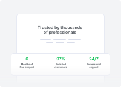

# 🖼️ DesignSystem

[⬅️ 返回主目錄](../../README.md)

| 預覽 | 資訊 |
| :--- | :--- |
|  | **docs-accordion-8d.svg** |
|  | **docs-alerts-89.svg** |
|  | **docs-avatars-94.svg** |
|  | **docs-badge-8d.svg** |
|  | **docs-basic-forms-10.svg** |
|  | **docs-breadcrumb-27.svg** |
|  | **docs-bs-icons-d8.svg** |
|  | **docs-buttons-ff.svg** |
|  | **docs-cards-ea.svg** |
|  | **docs-checks-and-switches-dd.svg** |
|  | **docs-collapse-6f.svg** |
|  | **docs-colors-af.svg** |
|  | **docs-column-divider-04.svg** |
|  | **docs-countdown-02.svg** |
|  | **docs-devices-04.svg** |
|  | **docs-divider-a1.svg** |
|  | **docs-dropdowns-8a.svg** |
|  | **docs-fslightbox-59.svg** |
|  | **docs-go-to-56.svg** |
|  | **docs-heading-df.svg** |
|  | **docs-input-group-8e.svg** |
|  | **docs-list-group-a7.svg** |
|  | **docs-lists-c6.svg** |
|  | **docs-mask-7a.svg** |
|  | **docs-mega-menu-6d.svg** |
|  | **docs-modal-5a.svg** |
|  | **docs-navbar-d6.svg** |
|  | **docs-navs-95.svg** |
|  | **docs-offcanvas-ef.svg** |
|  | **docs-pagination-6f.svg** |
|  | **docs-popovers-af.svg** |
|  | **docs-progress-15.svg** |
|  | **docs-scrollspy-ec.svg** |
|  | **docs-shapes-87.svg** |
|  | **docs-sliding-img-ac.svg** |
|  | **docs-spinners-d0.svg** |
|  | **docs-steps-23.svg** |
|  | **docs-sticky-block-ff.svg** |
|  | **docs-swiper-c9.svg** |
|  | **docs-tab-9e.svg** |
|  | **docs-tables-e5.svg** |
|  | **docs-toasts-2d.svg** |
|  | **docs-tooltips-93.svg** |
|  | **docs-typography-06.svg** |
|  | **snippets-cards-grid-d1.svg** |
|  | **snippets-cards-list-5b.svg** |
|  | **snippets-clients-e5.svg** |
|  | **snippets-comments-ed.svg** |
|  | **snippets-contact-sections-0a.svg** |
|  | **snippets-content-sections-ca.svg** |
|  | **snippets-cta-c7.svg** |
|  | **snippets-faq-15.svg** |
|  | **snippets-features-general-86.svg** |
|  | **snippets-features-navs-cf.svg** |
|  | **snippets-features-stats-be.svg** |
|  | **snippets-features-step-83.svg** |
|  | **snippets-footer-6c.svg** |
|  | **snippets-form-layouts-authentication-da.svg** |
|  | **snippets-form-layouts-feedback-a2.svg** |
|  | **snippets-form-layouts-filters-77.svg** |
|  | **snippets-form-layouts-search-77.svg** |
|  | **snippets-form-layouts-subscribe-af.svg** |
|  | **snippets-gallery-c7.svg** |
|  | **snippets-hero-sections-15.svg** |
|  | **snippets-icon-blocks-3c.svg** |
|  | **snippets-navbar-ee.svg** |
|  | **snippets-pricing-80.svg** |
|  | **snippets-sidebar-examples-6f.svg** |
|  | **snippets-team-sections-d6.svg** |
|  | **snippets-testimonials-ff.svg** |
|  | **snippets-user-profile-36.svg** |