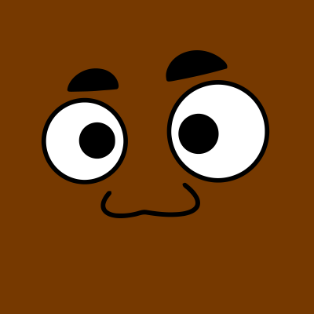
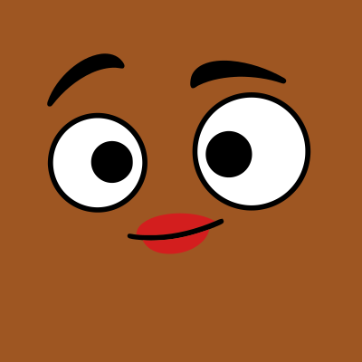
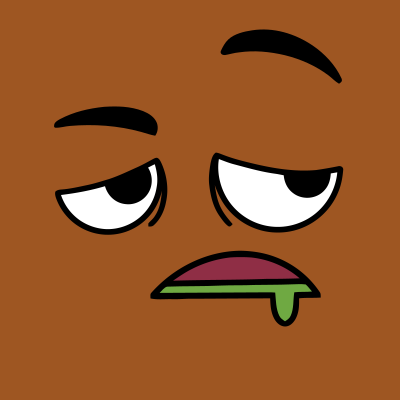

# 🖼️ 素材分類：Adventurer Neutral 

> [🏠 主目錄](../../../README.md) / [images](../../README.md) / [Dicebear](../README.md) / **Adventurer Neutral **

本目錄共有 `20` 個檔案

| 🎨 預覽 (點擊放大) &nbsp;&nbsp;&nbsp;&nbsp;&nbsp;&nbsp;&nbsp;&nbsp;&nbsp;&nbsp;&nbsp;&nbsp;&nbsp;&nbsp;&nbsp;&nbsp;&nbsp;&nbsp;&nbsp;&nbsp;&nbsp;&nbsp;&nbsp;&nbsp;&nbsp;&nbsp;&nbsp;&nbsp;&nbsp;&nbsp;&nbsp;&nbsp;&nbsp;&nbsp;&nbsp;&nbsp;&nbsp;&nbsp;&nbsp;&nbsp; | 📋 檔案詳細資訊與連結 |
| :--- | :--- |
|  | **📂 檔名:** `adventurerNeutral-01.svg` ✨ **格式:** `Vector (SVG)` ⚖️ **大小:** `4.16KB` 📅 **更新:** `2026-02-27`  🚀 **jsDelivr Markdown:** `` 🔗 **直接連結 (Url):** <code>https://cdn.jsdelivr.net/gh/barry028/materials@main/images/Dicebear/Adventurer%20Neutral%20/adventurerNeutral-01.svg</code> 📥 [檢視原始檔](adventurerNeutral-01.svg) |
|  | **📂 檔名:** `adventurerNeutral-010.svg` ✨ **格式:** `Vector (SVG)` ⚖️ **大小:** `5.18KB` 📅 **更新:** `2026-02-27`  🚀 **jsDelivr Markdown:** `` 🔗 **直接連結 (Url):** <code>https://cdn.jsdelivr.net/gh/barry028/materials@main/images/Dicebear/Adventurer%20Neutral%20/adventurerNeutral-010.svg</code> 📥 [檢視原始檔](adventurerNeutral-010.svg) |
|  | **📂 檔名:** `adventurerNeutral-011.svg` ✨ **格式:** `Vector (SVG)` ⚖️ **大小:** `5.96KB` 📅 **更新:** `2026-02-27`  🚀 **jsDelivr Markdown:** `` 🔗 **直接連結 (Url):** <code>https://cdn.jsdelivr.net/gh/barry028/materials@main/images/Dicebear/Adventurer%20Neutral%20/adventurerNeutral-011.svg</code> 📥 [檢視原始檔](adventurerNeutral-011.svg) |
|  | **📂 檔名:** `adventurerNeutral-012.svg` ✨ **格式:** `Vector (SVG)` ⚖️ **大小:** `3.83KB` 📅 **更新:** `2026-02-27`  🚀 **jsDelivr Markdown:** `` 🔗 **直接連結 (Url):** <code>https://cdn.jsdelivr.net/gh/barry028/materials@main/images/Dicebear/Adventurer%20Neutral%20/adventurerNeutral-012.svg</code> 📥 [檢視原始檔](adventurerNeutral-012.svg) |
|  | **📂 檔名:** `adventurerNeutral-013.svg` ✨ **格式:** `Vector (SVG)` ⚖️ **大小:** `6.71KB` 📅 **更新:** `2026-02-27`  🚀 **jsDelivr Markdown:** `` 🔗 **直接連結 (Url):** <code>https://cdn.jsdelivr.net/gh/barry028/materials@main/images/Dicebear/Adventurer%20Neutral%20/adventurerNeutral-013.svg</code> 📥 [檢視原始檔](adventurerNeutral-013.svg) |
|  | **📂 檔名:** `adventurerNeutral-014.svg` ✨ **格式:** `Vector (SVG)` ⚖️ **大小:** `3.30KB` 📅 **更新:** `2026-02-27`  🚀 **jsDelivr Markdown:** `` 🔗 **直接連結 (Url):** <code>https://cdn.jsdelivr.net/gh/barry028/materials@main/images/Dicebear/Adventurer%20Neutral%20/adventurerNeutral-014.svg</code> 📥 [檢視原始檔](adventurerNeutral-014.svg) |
|  | **📂 檔名:** `adventurerNeutral-015.svg` ✨ **格式:** `Vector (SVG)` ⚖️ **大小:** `6.84KB` 📅 **更新:** `2026-02-27`  🚀 **jsDelivr Markdown:** `` 🔗 **直接連結 (Url):** <code>https://cdn.jsdelivr.net/gh/barry028/materials@main/images/Dicebear/Adventurer%20Neutral%20/adventurerNeutral-015.svg</code> 📥 [檢視原始檔](adventurerNeutral-015.svg) |
|  | **📂 檔名:** `adventurerNeutral-016.svg` ✨ **格式:** `Vector (SVG)` ⚖️ **大小:** `5.63KB` 📅 **更新:** `2026-02-27`  🚀 **jsDelivr Markdown:** `` 🔗 **直接連結 (Url):** <code>https://cdn.jsdelivr.net/gh/barry028/materials@main/images/Dicebear/Adventurer%20Neutral%20/adventurerNeutral-016.svg</code> 📥 [檢視原始檔](adventurerNeutral-016.svg) |
|  | **📂 檔名:** `adventurerNeutral-017.svg` ✨ **格式:** `Vector (SVG)` ⚖️ **大小:** `3.87KB` 📅 **更新:** `2026-02-27`  🚀 **jsDelivr Markdown:** `` 🔗 **直接連結 (Url):** <code>https://cdn.jsdelivr.net/gh/barry028/materials@main/images/Dicebear/Adventurer%20Neutral%20/adventurerNeutral-017.svg</code> 📥 [檢視原始檔](adventurerNeutral-017.svg) |
|  | **📂 檔名:** `adventurerNeutral-018.svg` ✨ **格式:** `Vector (SVG)` ⚖️ **大小:** `5.31KB` 📅 **更新:** `2026-02-27`  🚀 **jsDelivr Markdown:** `` 🔗 **直接連結 (Url):** <code>https://cdn.jsdelivr.net/gh/barry028/materials@main/images/Dicebear/Adventurer%20Neutral%20/adventurerNeutral-018.svg</code> 📥 [檢視原始檔](adventurerNeutral-018.svg) |
|  | **📂 檔名:** `adventurerNeutral-019.svg` ✨ **格式:** `Vector (SVG)` ⚖️ **大小:** `4.81KB` 📅 **更新:** `2026-02-27`  🚀 **jsDelivr Markdown:** `` 🔗 **直接連結 (Url):** <code>https://cdn.jsdelivr.net/gh/barry028/materials@main/images/Dicebear/Adventurer%20Neutral%20/adventurerNeutral-019.svg</code> 📥 [檢視原始檔](adventurerNeutral-019.svg) |
|  | **📂 檔名:** `adventurerNeutral-02.svg` ✨ **格式:** `Vector (SVG)` ⚖️ **大小:** `3.16KB` 📅 **更新:** `2026-02-27`  🚀 **jsDelivr Markdown:** `` 🔗 **直接連結 (Url):** <code>https://cdn.jsdelivr.net/gh/barry028/materials@main/images/Dicebear/Adventurer%20Neutral%20/adventurerNeutral-02.svg</code> 📥 [檢視原始檔](adventurerNeutral-02.svg) |
|  | **📂 檔名:** `adventurerNeutral-020.svg` ✨ **格式:** `Vector (SVG)` ⚖️ **大小:** `3.68KB` 📅 **更新:** `2026-02-27`  🚀 **jsDelivr Markdown:** `` 🔗 **直接連結 (Url):** <code>https://cdn.jsdelivr.net/gh/barry028/materials@main/images/Dicebear/Adventurer%20Neutral%20/adventurerNeutral-020.svg</code> 📥 [檢視原始檔](adventurerNeutral-020.svg) |
|  | **📂 檔名:** `adventurerNeutral-03.svg` ✨ **格式:** `Vector (SVG)` ⚖️ **大小:** `5.57KB` 📅 **更新:** `2026-02-27`  🚀 **jsDelivr Markdown:** `` 🔗 **直接連結 (Url):** <code>https://cdn.jsdelivr.net/gh/barry028/materials@main/images/Dicebear/Adventurer%20Neutral%20/adventurerNeutral-03.svg</code> 📥 [檢視原始檔](adventurerNeutral-03.svg) |
|  | **📂 檔名:** `adventurerNeutral-04.svg` ✨ **格式:** `Vector (SVG)` ⚖️ **大小:** `3.82KB` 📅 **更新:** `2026-02-27`  🚀 **jsDelivr Markdown:** `` 🔗 **直接連結 (Url):** <code>https://cdn.jsdelivr.net/gh/barry028/materials@main/images/Dicebear/Adventurer%20Neutral%20/adventurerNeutral-04.svg</code> 📥 [檢視原始檔](adventurerNeutral-04.svg) |
|  | **📂 檔名:** `adventurerNeutral-05.svg` ✨ **格式:** `Vector (SVG)` ⚖️ **大小:** `3.89KB` 📅 **更新:** `2026-02-27`  🚀 **jsDelivr Markdown:** `` 🔗 **直接連結 (Url):** <code>https://cdn.jsdelivr.net/gh/barry028/materials@main/images/Dicebear/Adventurer%20Neutral%20/adventurerNeutral-05.svg</code> 📥 [檢視原始檔](adventurerNeutral-05.svg) |
|  | **📂 檔名:** `adventurerNeutral-06.svg` ✨ **格式:** `Vector (SVG)` ⚖️ **大小:** `4.51KB` 📅 **更新:** `2026-02-27`  🚀 **jsDelivr Markdown:** `` 🔗 **直接連結 (Url):** <code>https://cdn.jsdelivr.net/gh/barry028/materials@main/images/Dicebear/Adventurer%20Neutral%20/adventurerNeutral-06.svg</code> 📥 [檢視原始檔](adventurerNeutral-06.svg) |
|  | **📂 檔名:** `adventurerNeutral-07.svg` ✨ **格式:** `Vector (SVG)` ⚖️ **大小:** `6.37KB` 📅 **更新:** `2026-02-27`  🚀 **jsDelivr Markdown:** `` 🔗 **直接連結 (Url):** <code>https://cdn.jsdelivr.net/gh/barry028/materials@main/images/Dicebear/Adventurer%20Neutral%20/adventurerNeutral-07.svg</code> 📥 [檢視原始檔](adventurerNeutral-07.svg) |
|  | **📂 檔名:** `adventurerNeutral-08.svg` ✨ **格式:** `Vector (SVG)` ⚖️ **大小:** `2.90KB` 📅 **更新:** `2026-02-27`  🚀 **jsDelivr Markdown:** `` 🔗 **直接連結 (Url):** <code>https://cdn.jsdelivr.net/gh/barry028/materials@main/images/Dicebear/Adventurer%20Neutral%20/adventurerNeutral-08.svg</code> 📥 [檢視原始檔](adventurerNeutral-08.svg) |
|  | **📂 檔名:** `adventurerNeutral-09.svg` ✨ **格式:** `Vector (SVG)` ⚖️ **大小:** `4.21KB` 📅 **更新:** `2026-02-27`  🚀 **jsDelivr Markdown:** `` 🔗 **直接連結 (Url):** <code>https://cdn.jsdelivr.net/gh/barry028/materials@main/images/Dicebear/Adventurer%20Neutral%20/adventurerNeutral-09.svg</code> 📥 [檢視原始檔](adventurerNeutral-09.svg) |