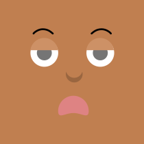
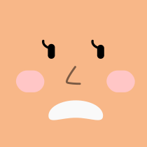
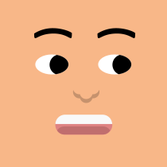
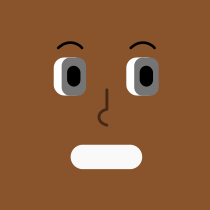
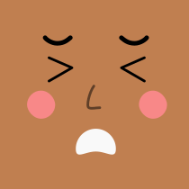
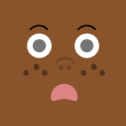
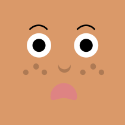
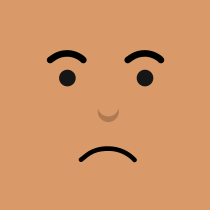
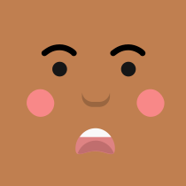

# 🖼️ 素材分類：Big Ears Neutral

> [🏠 主目錄](../../../README.md) / [images](../../README.md) / [Dicebear](../README.md) / **Big Ears Neutral**

本目錄共有 `20` 個檔案

| 🎨 預覽 (點擊放大)  | 📋 檔案詳細資訊與連結 |
| :--- | :--- |
|  | **📂 檔名:** `bigEarsNeutral-1771674494895.svg` ✨ **格式:** `Vector (SVG)` ⚖️ **大小:** `1.89KB` 📅 **更新:** `2026-03-01`  🚀 **jsDelivr Markdown:** `` 🔗 **直接連結 (Url):** <code>https://cdn.jsdelivr.net/gh/barry028/materials@main/images/Dicebear/Big%20Ears%20Neutral/bigEarsNeutral-1771674494895.svg</code> 📥 [檢視原始檔](bigEarsNeutral-1771674494895.svg) |
|  | **📂 檔名:** `bigEarsNeutral-1771674496648.svg` ✨ **格式:** `Vector (SVG)` ⚖️ **大小:** `2.04KB` 📅 **更新:** `2026-03-01`  🚀 **jsDelivr Markdown:** `` 🔗 **直接連結 (Url):** <code>https://cdn.jsdelivr.net/gh/barry028/materials@main/images/Dicebear/Big%20Ears%20Neutral/bigEarsNeutral-1771674496648.svg</code> 📥 [檢視原始檔](bigEarsNeutral-1771674496648.svg) |
|  | **📂 檔名:** `bigEarsNeutral-1771674498922.svg` ✨ **格式:** `Vector (SVG)` ⚖️ **大小:** `1.81KB` 📅 **更新:** `2026-03-01`  🚀 **jsDelivr Markdown:** `` 🔗 **直接連結 (Url):** <code>https://cdn.jsdelivr.net/gh/barry028/materials@main/images/Dicebear/Big%20Ears%20Neutral/bigEarsNeutral-1771674498922.svg</code> 📥 [檢視原始檔](bigEarsNeutral-1771674498922.svg) |
|  | **📂 檔名:** `bigEarsNeutral-1771674500903.svg` ✨ **格式:** `Vector (SVG)` ⚖️ **大小:** `2.08KB` 📅 **更新:** `2026-03-01`  🚀 **jsDelivr Markdown:** `` 🔗 **直接連結 (Url):** <code>https://cdn.jsdelivr.net/gh/barry028/materials@main/images/Dicebear/Big%20Ears%20Neutral/bigEarsNeutral-1771674500903.svg</code> 📥 [檢視原始檔](bigEarsNeutral-1771674500903.svg) |
|  | **📂 檔名:** `bigEarsNeutral-1771674503182.svg` ✨ **格式:** `Vector (SVG)` ⚖️ **大小:** `2.50KB` 📅 **更新:** `2026-03-01`  🚀 **jsDelivr Markdown:** `` 🔗 **直接連結 (Url):** <code>https://cdn.jsdelivr.net/gh/barry028/materials@main/images/Dicebear/Big%20Ears%20Neutral/bigEarsNeutral-1771674503182.svg</code> 📥 [檢視原始檔](bigEarsNeutral-1771674503182.svg) |
|  | **📂 檔名:** `bigEarsNeutral-1771674505141.svg` ✨ **格式:** `Vector (SVG)` ⚖️ **大小:** `1.95KB` 📅 **更新:** `2026-03-01`  🚀 **jsDelivr Markdown:** `` 🔗 **直接連結 (Url):** <code>https://cdn.jsdelivr.net/gh/barry028/materials@main/images/Dicebear/Big%20Ears%20Neutral/bigEarsNeutral-1771674505141.svg</code> 📥 [檢視原始檔](bigEarsNeutral-1771674505141.svg) |
|  | **📂 檔名:** `bigEarsNeutral-1771674506373.svg` ✨ **格式:** `Vector (SVG)` ⚖️ **大小:** `2.42KB` 📅 **更新:** `2026-03-01`  🚀 **jsDelivr Markdown:** `` 🔗 **直接連結 (Url):** <code>https://cdn.jsdelivr.net/gh/barry028/materials@main/images/Dicebear/Big%20Ears%20Neutral/bigEarsNeutral-1771674506373.svg</code> 📥 [檢視原始檔](bigEarsNeutral-1771674506373.svg) |
|  | **📂 檔名:** `bigEarsNeutral-1771674507702.svg` ✨ **格式:** `Vector (SVG)` ⚖️ **大小:** `2.18KB` 📅 **更新:** `2026-03-01`  🚀 **jsDelivr Markdown:** `` 🔗 **直接連結 (Url):** <code>https://cdn.jsdelivr.net/gh/barry028/materials@main/images/Dicebear/Big%20Ears%20Neutral/bigEarsNeutral-1771674507702.svg</code> 📥 [檢視原始檔](bigEarsNeutral-1771674507702.svg) |
|  | **📂 檔名:** `bigEarsNeutral-1771674509652.svg` ✨ **格式:** `Vector (SVG)` ⚖️ **大小:** `2.21KB` 📅 **更新:** `2026-03-01`  🚀 **jsDelivr Markdown:** `` 🔗 **直接連結 (Url):** <code>https://cdn.jsdelivr.net/gh/barry028/materials@main/images/Dicebear/Big%20Ears%20Neutral/bigEarsNeutral-1771674509652.svg</code> 📥 [檢視原始檔](bigEarsNeutral-1771674509652.svg) |
|  | **📂 檔名:** `bigEarsNeutral-1771674510921.svg` ✨ **格式:** `Vector (SVG)` ⚖️ **大小:** `1.91KB` 📅 **更新:** `2026-03-01`  🚀 **jsDelivr Markdown:** `` 🔗 **直接連結 (Url):** <code>https://cdn.jsdelivr.net/gh/barry028/materials@main/images/Dicebear/Big%20Ears%20Neutral/bigEarsNeutral-1771674510921.svg</code> 📥 [檢視原始檔](bigEarsNeutral-1771674510921.svg) |
|  | **📂 檔名:** `bigEarsNeutral-1771674512609.svg` ✨ **格式:** `Vector (SVG)` ⚖️ **大小:** `2.46KB` 📅 **更新:** `2026-03-01`  🚀 **jsDelivr Markdown:** `` 🔗 **直接連結 (Url):** <code>https://cdn.jsdelivr.net/gh/barry028/materials@main/images/Dicebear/Big%20Ears%20Neutral/bigEarsNeutral-1771674512609.svg</code> 📥 [檢視原始檔](bigEarsNeutral-1771674512609.svg) |
|  | **📂 檔名:** `bigEarsNeutral-1771674516362.svg` ✨ **格式:** `Vector (SVG)` ⚖️ **大小:** `2.10KB` 📅 **更新:** `2026-03-01`  🚀 **jsDelivr Markdown:** `` 🔗 **直接連結 (Url):** <code>https://cdn.jsdelivr.net/gh/barry028/materials@main/images/Dicebear/Big%20Ears%20Neutral/bigEarsNeutral-1771674516362.svg</code> 📥 [檢視原始檔](bigEarsNeutral-1771674516362.svg) |
|  | **📂 檔名:** `bigEarsNeutral-1771674518142.svg` ✨ **格式:** `Vector (SVG)` ⚖️ **大小:** `2.06KB` 📅 **更新:** `2026-03-01`  🚀 **jsDelivr Markdown:** `` 🔗 **直接連結 (Url):** <code>https://cdn.jsdelivr.net/gh/barry028/materials@main/images/Dicebear/Big%20Ears%20Neutral/bigEarsNeutral-1771674518142.svg</code> 📥 [檢視原始檔](bigEarsNeutral-1771674518142.svg) |
|  | **📂 檔名:** `bigEarsNeutral-1771674519455.svg` ✨ **格式:** `Vector (SVG)` ⚖️ **大小:** `2.20KB` 📅 **更新:** `2026-03-01`  🚀 **jsDelivr Markdown:** `` 🔗 **直接連結 (Url):** <code>https://cdn.jsdelivr.net/gh/barry028/materials@main/images/Dicebear/Big%20Ears%20Neutral/bigEarsNeutral-1771674519455.svg</code> 📥 [檢視原始檔](bigEarsNeutral-1771674519455.svg) |
|  | **📂 檔名:** `bigEarsNeutral-1771674520914.svg` ✨ **格式:** `Vector (SVG)` ⚖️ **大小:** `2.27KB` 📅 **更新:** `2026-03-01`  🚀 **jsDelivr Markdown:** `` 🔗 **直接連結 (Url):** <code>https://cdn.jsdelivr.net/gh/barry028/materials@main/images/Dicebear/Big%20Ears%20Neutral/bigEarsNeutral-1771674520914.svg</code> 📥 [檢視原始檔](bigEarsNeutral-1771674520914.svg) |
|  | **📂 檔名:** `bigEarsNeutral-1771674522345.svg` ✨ **格式:** `Vector (SVG)` ⚖️ **大小:** `2.38KB` 📅 **更新:** `2026-03-01`  🚀 **jsDelivr Markdown:** `` 🔗 **直接連結 (Url):** <code>https://cdn.jsdelivr.net/gh/barry028/materials@main/images/Dicebear/Big%20Ears%20Neutral/bigEarsNeutral-1771674522345.svg</code> 📥 [檢視原始檔](bigEarsNeutral-1771674522345.svg) |
|  | **📂 檔名:** `bigEarsNeutral-1771674524407.svg` ✨ **格式:** `Vector (SVG)` ⚖️ **大小:** `1.98KB` 📅 **更新:** `2026-03-01`  🚀 **jsDelivr Markdown:** `` 🔗 **直接連結 (Url):** <code>https://cdn.jsdelivr.net/gh/barry028/materials@main/images/Dicebear/Big%20Ears%20Neutral/bigEarsNeutral-1771674524407.svg</code> 📥 [檢視原始檔](bigEarsNeutral-1771674524407.svg) |
|  | **📂 檔名:** `bigEarsNeutral-1771674525525.svg` ✨ **格式:** `Vector (SVG)` ⚖️ **大小:** `1.90KB` 📅 **更新:** `2026-03-01`  🚀 **jsDelivr Markdown:** `` 🔗 **直接連結 (Url):** <code>https://cdn.jsdelivr.net/gh/barry028/materials@main/images/Dicebear/Big%20Ears%20Neutral/bigEarsNeutral-1771674525525.svg</code> 📥 [檢視原始檔](bigEarsNeutral-1771674525525.svg) |
|  | **📂 檔名:** `bigEarsNeutral-1771674526644.svg` ✨ **格式:** `Vector (SVG)` ⚖️ **大小:** `2.28KB` 📅 **更新:** `2026-03-01`  🚀 **jsDelivr Markdown:** `` 🔗 **直接連結 (Url):** <code>https://cdn.jsdelivr.net/gh/barry028/materials@main/images/Dicebear/Big%20Ears%20Neutral/bigEarsNeutral-1771674526644.svg</code> 📥 [檢視原始檔](bigEarsNeutral-1771674526644.svg) |
|  | **📂 檔名:** `bigEarsNeutral-1771674528284.svg` ✨ **格式:** `Vector (SVG)` ⚖️ **大小:** `2.44KB` 📅 **更新:** `2026-03-01`  🚀 **jsDelivr Markdown:** `` 🔗 **直接連結 (Url):** <code>https://cdn.jsdelivr.net/gh/barry028/materials@main/images/Dicebear/Big%20Ears%20Neutral/bigEarsNeutral-1771674528284.svg</code> 📥 [檢視原始檔](bigEarsNeutral-1771674528284.svg) |