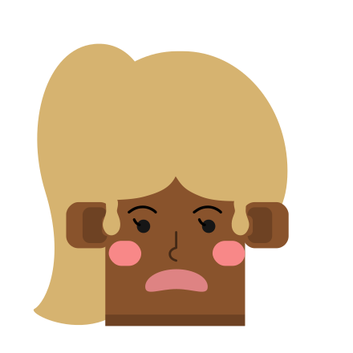

# 🖼️ 素材分類：Big Ears 

> [🏠 主目錄](../../../README.md) / [images](../../README.md) / [Dicebear](../README.md) / **Big Ears **

本目錄共有 `20` 個檔案

| 🎨 預覽 (點擊放大)  | 📋 檔案詳細資訊與連結 |
| :--- | :--- |
|  | **📂 檔名:** `bigEars-1771674432740.svg` ✨ **格式:** `Vector (SVG)` ⚖️ **大小:** `4.25KB` 📅 **更新:** `2026-02-27`  🚀 **jsDelivr Markdown:** `` 🔗 **直接連結 (Url):** <code>https://cdn.jsdelivr.net/gh/barry028/materials@main/images/Dicebear/Big%20Ears%20/bigEars-1771674432740.svg</code> 📥 [檢視原始檔](bigEars-1771674432740.svg) |
|  | **📂 檔名:** `bigEars-1771674436885.svg` ✨ **格式:** `Vector (SVG)` ⚖️ **大小:** `4.32KB` 📅 **更新:** `2026-02-27`  🚀 **jsDelivr Markdown:** `` 🔗 **直接連結 (Url):** <code>https://cdn.jsdelivr.net/gh/barry028/materials@main/images/Dicebear/Big%20Ears%20/bigEars-1771674436885.svg</code> 📥 [檢視原始檔](bigEars-1771674436885.svg) |
|  | **📂 檔名:** `bigEars-1771674438179.svg` ✨ **格式:** `Vector (SVG)` ⚖️ **大小:** `5.63KB` 📅 **更新:** `2026-02-27`  🚀 **jsDelivr Markdown:** `` 🔗 **直接連結 (Url):** <code>https://cdn.jsdelivr.net/gh/barry028/materials@main/images/Dicebear/Big%20Ears%20/bigEars-1771674438179.svg</code> 📥 [檢視原始檔](bigEars-1771674438179.svg) |
|  | **📂 檔名:** `bigEars-1771674439301.svg` ✨ **格式:** `Vector (SVG)` ⚖️ **大小:** `3.85KB` 📅 **更新:** `2026-02-27`  🚀 **jsDelivr Markdown:** `` 🔗 **直接連結 (Url):** <code>https://cdn.jsdelivr.net/gh/barry028/materials@main/images/Dicebear/Big%20Ears%20/bigEars-1771674439301.svg</code> 📥 [檢視原始檔](bigEars-1771674439301.svg) |
|  | **📂 檔名:** `bigEars-1771674440865.svg` ✨ **格式:** `Vector (SVG)` ⚖️ **大小:** `3.63KB` 📅 **更新:** `2026-02-27`  🚀 **jsDelivr Markdown:** `` 🔗 **直接連結 (Url):** <code>https://cdn.jsdelivr.net/gh/barry028/materials@main/images/Dicebear/Big%20Ears%20/bigEars-1771674440865.svg</code> 📥 [檢視原始檔](bigEars-1771674440865.svg) |
|  | **📂 檔名:** `bigEars-1771674442199.svg` ✨ **格式:** `Vector (SVG)` ⚖️ **大小:** `3.97KB` 📅 **更新:** `2026-02-27`  🚀 **jsDelivr Markdown:** `` 🔗 **直接連結 (Url):** <code>https://cdn.jsdelivr.net/gh/barry028/materials@main/images/Dicebear/Big%20Ears%20/bigEars-1771674442199.svg</code> 📥 [檢視原始檔](bigEars-1771674442199.svg) |
|  | **📂 檔名:** `bigEars-1771674444625.svg` ✨ **格式:** `Vector (SVG)` ⚖️ **大小:** `4.72KB` 📅 **更新:** `2026-02-27`  🚀 **jsDelivr Markdown:** `` 🔗 **直接連結 (Url):** <code>https://cdn.jsdelivr.net/gh/barry028/materials@main/images/Dicebear/Big%20Ears%20/bigEars-1771674444625.svg</code> 📥 [檢視原始檔](bigEars-1771674444625.svg) |
|  | **📂 檔名:** `bigEars-1771674445910.svg` ✨ **格式:** `Vector (SVG)` ⚖️ **大小:** `4.36KB` 📅 **更新:** `2026-02-27`  🚀 **jsDelivr Markdown:** `` 🔗 **直接連結 (Url):** <code>https://cdn.jsdelivr.net/gh/barry028/materials@main/images/Dicebear/Big%20Ears%20/bigEars-1771674445910.svg</code> 📥 [檢視原始檔](bigEars-1771674445910.svg) |
|  | **📂 檔名:** `bigEars-1771674449494.svg` ✨ **格式:** `Vector (SVG)` ⚖️ **大小:** `4.19KB` 📅 **更新:** `2026-02-27`  🚀 **jsDelivr Markdown:** `` 🔗 **直接連結 (Url):** <code>https://cdn.jsdelivr.net/gh/barry028/materials@main/images/Dicebear/Big%20Ears%20/bigEars-1771674449494.svg</code> 📥 [檢視原始檔](bigEars-1771674449494.svg) |
|  | **📂 檔名:** `bigEars-1771674451065.svg` ✨ **格式:** `Vector (SVG)` ⚖️ **大小:** `4.13KB` 📅 **更新:** `2026-02-27`  🚀 **jsDelivr Markdown:** `` 🔗 **直接連結 (Url):** <code>https://cdn.jsdelivr.net/gh/barry028/materials@main/images/Dicebear/Big%20Ears%20/bigEars-1771674451065.svg</code> 📥 [檢視原始檔](bigEars-1771674451065.svg) |
|  | **📂 檔名:** `bigEars-1771674452512.svg` ✨ **格式:** `Vector (SVG)` ⚖️ **大小:** `4.09KB` 📅 **更新:** `2026-02-27`  🚀 **jsDelivr Markdown:** `` 🔗 **直接連結 (Url):** <code>https://cdn.jsdelivr.net/gh/barry028/materials@main/images/Dicebear/Big%20Ears%20/bigEars-1771674452512.svg</code> 📥 [檢視原始檔](bigEars-1771674452512.svg) |
|  | **📂 檔名:** `bigEars-1771674453678.svg` ✨ **格式:** `Vector (SVG)` ⚖️ **大小:** `6.87KB` 📅 **更新:** `2026-02-27`  🚀 **jsDelivr Markdown:** `` 🔗 **直接連結 (Url):** <code>https://cdn.jsdelivr.net/gh/barry028/materials@main/images/Dicebear/Big%20Ears%20/bigEars-1771674453678.svg</code> 📥 [檢視原始檔](bigEars-1771674453678.svg) |
|  | **📂 檔名:** `bigEars-1771674455082.svg` ✨ **格式:** `Vector (SVG)` ⚖️ **大小:** `4.29KB` 📅 **更新:** `2026-02-27`  🚀 **jsDelivr Markdown:** `` 🔗 **直接連結 (Url):** <code>https://cdn.jsdelivr.net/gh/barry028/materials@main/images/Dicebear/Big%20Ears%20/bigEars-1771674455082.svg</code> 📥 [檢視原始檔](bigEars-1771674455082.svg) |
|  | **📂 檔名:** `bigEars-1771674456771.svg` ✨ **格式:** `Vector (SVG)` ⚖️ **大小:** `5.89KB` 📅 **更新:** `2026-02-27`  🚀 **jsDelivr Markdown:** `` 🔗 **直接連結 (Url):** <code>https://cdn.jsdelivr.net/gh/barry028/materials@main/images/Dicebear/Big%20Ears%20/bigEars-1771674456771.svg</code> 📥 [檢視原始檔](bigEars-1771674456771.svg) |
|  | **📂 檔名:** `bigEars-1771674458489.svg` ✨ **格式:** `Vector (SVG)` ⚖️ **大小:** `4.66KB` 📅 **更新:** `2026-02-27`  🚀 **jsDelivr Markdown:** `` 🔗 **直接連結 (Url):** <code>https://cdn.jsdelivr.net/gh/barry028/materials@main/images/Dicebear/Big%20Ears%20/bigEars-1771674458489.svg</code> 📥 [檢視原始檔](bigEars-1771674458489.svg) |
|  | **📂 檔名:** `bigEars-1771674459890.svg` ✨ **格式:** `Vector (SVG)` ⚖️ **大小:** `4.38KB` 📅 **更新:** `2026-02-27`  🚀 **jsDelivr Markdown:** `` 🔗 **直接連結 (Url):** <code>https://cdn.jsdelivr.net/gh/barry028/materials@main/images/Dicebear/Big%20Ears%20/bigEars-1771674459890.svg</code> 📥 [檢視原始檔](bigEars-1771674459890.svg) |
|  | **📂 檔名:** `bigEars-1771674464574.svg` ✨ **格式:** `Vector (SVG)` ⚖️ **大小:** `4.37KB` 📅 **更新:** `2026-02-27`  🚀 **jsDelivr Markdown:** `` 🔗 **直接連結 (Url):** <code>https://cdn.jsdelivr.net/gh/barry028/materials@main/images/Dicebear/Big%20Ears%20/bigEars-1771674464574.svg</code> 📥 [檢視原始檔](bigEars-1771674464574.svg) |
|  | **📂 檔名:** `bigEars-1771674466557.svg` ✨ **格式:** `Vector (SVG)` ⚖️ **大小:** `3.85KB` 📅 **更新:** `2026-02-27`  🚀 **jsDelivr Markdown:** `` 🔗 **直接連結 (Url):** <code>https://cdn.jsdelivr.net/gh/barry028/materials@main/images/Dicebear/Big%20Ears%20/bigEars-1771674466557.svg</code> 📥 [檢視原始檔](bigEars-1771674466557.svg) |
|  | **📂 檔名:** `bigEars-1771674468281.svg` ✨ **格式:** `Vector (SVG)` ⚖️ **大小:** `4.22KB` 📅 **更新:** `2026-02-27`  🚀 **jsDelivr Markdown:** `` 🔗 **直接連結 (Url):** <code>https://cdn.jsdelivr.net/gh/barry028/materials@main/images/Dicebear/Big%20Ears%20/bigEars-1771674468281.svg</code> 📥 [檢視原始檔](bigEars-1771674468281.svg) |
|  | **📂 檔名:** `bigEars-1771674470026.svg` ✨ **格式:** `Vector (SVG)` ⚖️ **大小:** `3.94KB` 📅 **更新:** `2026-02-27`  🚀 **jsDelivr Markdown:** `` 🔗 **直接連結 (Url):** <code>https://cdn.jsdelivr.net/gh/barry028/materials@main/images/Dicebear/Big%20Ears%20/bigEars-1771674470026.svg</code> 📥 [檢視原始檔](bigEars-1771674470026.svg) |