# 🖼️ 素材分類：Croodles Netral

> [🏠 主目錄](../../../README.md) / [images](../../README.md) / [Dicebear](../README.md) / **Croodles Netral**

本目錄共有 `20` 個檔案

| 🎨 預覽 (點擊放大)  | 📋 檔案詳細資訊與連結 |
| :--- | :--- |
| <a href="croodlesNeutral-1771675281089.svg">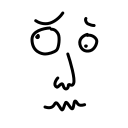</a> | **📂 檔名:** `croodlesNeutral-1771675281089.svg` ✨ **格式:** `Vector (SVG)` ⚖️ **大小:** `2.06KB` 📅 **更新:** `2026-03-01`  🚀 **jsDelivr Markdown:** `` 🔗 **直接連結 (Url):** <code>https://cdn.jsdelivr.net/gh/barry028/materials@main/images/Dicebear/Croodles%20Netral/croodlesNeutral-1771675281089.svg</code> 📥 [檢視原始檔](croodlesNeutral-1771675281089.svg) |
| <a href="croodlesNeutral-1771675282907.svg">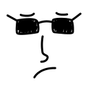</a> | **📂 檔名:** `croodlesNeutral-1771675282907.svg` ✨ **格式:** `Vector (SVG)` ⚖️ **大小:** `2.55KB` 📅 **更新:** `2026-03-01`  🚀 **jsDelivr Markdown:** `` 🔗 **直接連結 (Url):** <code>https://cdn.jsdelivr.net/gh/barry028/materials@main/images/Dicebear/Croodles%20Netral/croodlesNeutral-1771675282907.svg</code> 📥 [檢視原始檔](croodlesNeutral-1771675282907.svg) |
|  | **📂 檔名:** `croodlesNeutral-1771675284426.svg` ✨ **格式:** `Vector (SVG)` ⚖️ **大小:** `1.84KB` 📅 **更新:** `2026-03-01`  🚀 **jsDelivr Markdown:** `` 🔗 **直接連結 (Url):** <code>https://cdn.jsdelivr.net/gh/barry028/materials@main/images/Dicebear/Croodles%20Netral/croodlesNeutral-1771675284426.svg</code> 📥 [檢視原始檔](croodlesNeutral-1771675284426.svg) |
|  | **📂 檔名:** `croodlesNeutral-1771675286218.svg` ✨ **格式:** `Vector (SVG)` ⚖️ **大小:** `1.87KB` 📅 **更新:** `2026-03-01`  🚀 **jsDelivr Markdown:** `` 🔗 **直接連結 (Url):** <code>https://cdn.jsdelivr.net/gh/barry028/materials@main/images/Dicebear/Croodles%20Netral/croodlesNeutral-1771675286218.svg</code> 📥 [檢視原始檔](croodlesNeutral-1771675286218.svg) |
| <a href="croodlesNeutral-1771675288135.svg">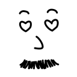</a> | **📂 檔名:** `croodlesNeutral-1771675288135.svg` ✨ **格式:** `Vector (SVG)` ⚖️ **大小:** `2.28KB` 📅 **更新:** `2026-03-01`  🚀 **jsDelivr Markdown:** `` 🔗 **直接連結 (Url):** <code>https://cdn.jsdelivr.net/gh/barry028/materials@main/images/Dicebear/Croodles%20Netral/croodlesNeutral-1771675288135.svg</code> 📥 [檢視原始檔](croodlesNeutral-1771675288135.svg) |
| <a href="croodlesNeutral-1771675289789.svg">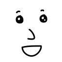</a> | **📂 檔名:** `croodlesNeutral-1771675289789.svg` ✨ **格式:** `Vector (SVG)` ⚖️ **大小:** `2.61KB` 📅 **更新:** `2026-03-01`  🚀 **jsDelivr Markdown:** `` 🔗 **直接連結 (Url):** <code>https://cdn.jsdelivr.net/gh/barry028/materials@main/images/Dicebear/Croodles%20Netral/croodlesNeutral-1771675289789.svg</code> 📥 [檢視原始檔](croodlesNeutral-1771675289789.svg) |
| <a href="croodlesNeutral-1771675291319.svg">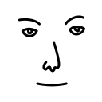</a> | **📂 檔名:** `croodlesNeutral-1771675291319.svg` ✨ **格式:** `Vector (SVG)` ⚖️ **大小:** `1.88KB` 📅 **更新:** `2026-03-01`  🚀 **jsDelivr Markdown:** `` 🔗 **直接連結 (Url):** <code>https://cdn.jsdelivr.net/gh/barry028/materials@main/images/Dicebear/Croodles%20Netral/croodlesNeutral-1771675291319.svg</code> 📥 [檢視原始檔](croodlesNeutral-1771675291319.svg) |
|  | **📂 檔名:** `croodlesNeutral-1771675293223.svg` ✨ **格式:** `Vector (SVG)` ⚖️ **大小:** `2.20KB` 📅 **更新:** `2026-03-01`  🚀 **jsDelivr Markdown:** `` 🔗 **直接連結 (Url):** <code>https://cdn.jsdelivr.net/gh/barry028/materials@main/images/Dicebear/Croodles%20Netral/croodlesNeutral-1771675293223.svg</code> 📥 [檢視原始檔](croodlesNeutral-1771675293223.svg) |
|  | **📂 檔名:** `croodlesNeutral-1771675296038.svg` ✨ **格式:** `Vector (SVG)` ⚖️ **大小:** `2.62KB` 📅 **更新:** `2026-03-01`  🚀 **jsDelivr Markdown:** `` 🔗 **直接連結 (Url):** <code>https://cdn.jsdelivr.net/gh/barry028/materials@main/images/Dicebear/Croodles%20Netral/croodlesNeutral-1771675296038.svg</code> 📥 [檢視原始檔](croodlesNeutral-1771675296038.svg) |
| <a href="croodlesNeutral-1771675297800.svg">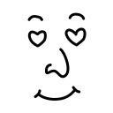</a> | **📂 檔名:** `croodlesNeutral-1771675297800.svg` ✨ **格式:** `Vector (SVG)` ⚖️ **大小:** `1.91KB` 📅 **更新:** `2026-03-01`  🚀 **jsDelivr Markdown:** `` 🔗 **直接連結 (Url):** <code>https://cdn.jsdelivr.net/gh/barry028/materials@main/images/Dicebear/Croodles%20Netral/croodlesNeutral-1771675297800.svg</code> 📥 [檢視原始檔](croodlesNeutral-1771675297800.svg) |
| <a href="croodlesNeutral-1771675299697.svg">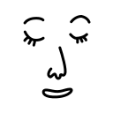</a> | **📂 檔名:** `croodlesNeutral-1771675299697.svg` ✨ **格式:** `Vector (SVG)` ⚖️ **大小:** `1.90KB` 📅 **更新:** `2026-03-01`  🚀 **jsDelivr Markdown:** `` 🔗 **直接連結 (Url):** <code>https://cdn.jsdelivr.net/gh/barry028/materials@main/images/Dicebear/Croodles%20Netral/croodlesNeutral-1771675299697.svg</code> 📥 [檢視原始檔](croodlesNeutral-1771675299697.svg) |
| <a href="croodlesNeutral-1771675301335.svg">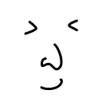</a> | **📂 檔名:** `croodlesNeutral-1771675301335.svg` ✨ **格式:** `Vector (SVG)` ⚖️ **大小:** `1.59KB` 📅 **更新:** `2026-03-01`  🚀 **jsDelivr Markdown:** `` 🔗 **直接連結 (Url):** <code>https://cdn.jsdelivr.net/gh/barry028/materials@main/images/Dicebear/Croodles%20Netral/croodlesNeutral-1771675301335.svg</code> 📥 [檢視原始檔](croodlesNeutral-1771675301335.svg) |
| <a href="croodlesNeutral-1771675303833.svg">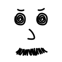</a> | **📂 檔名:** `croodlesNeutral-1771675303833.svg` ✨ **格式:** `Vector (SVG)` ⚖️ **大小:** `2.42KB` 📅 **更新:** `2026-03-01`  🚀 **jsDelivr Markdown:** `` 🔗 **直接連結 (Url):** <code>https://cdn.jsdelivr.net/gh/barry028/materials@main/images/Dicebear/Croodles%20Netral/croodlesNeutral-1771675303833.svg</code> 📥 [檢視原始檔](croodlesNeutral-1771675303833.svg) |
| <a href="croodlesNeutral-1771675307259.svg">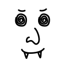</a> | **📂 檔名:** `croodlesNeutral-1771675307259.svg` ✨ **格式:** `Vector (SVG)` ⚖️ **大小:** `2.11KB` 📅 **更新:** `2026-03-01`  🚀 **jsDelivr Markdown:** `` 🔗 **直接連結 (Url):** <code>https://cdn.jsdelivr.net/gh/barry028/materials@main/images/Dicebear/Croodles%20Netral/croodlesNeutral-1771675307259.svg</code> 📥 [檢視原始檔](croodlesNeutral-1771675307259.svg) |
| <a href="croodlesNeutral-1771675308839.svg">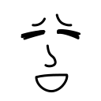</a> | **📂 檔名:** `croodlesNeutral-1771675308839.svg` ✨ **格式:** `Vector (SVG)` ⚖️ **大小:** `1.87KB` 📅 **更新:** `2026-03-01`  🚀 **jsDelivr Markdown:** `` 🔗 **直接連結 (Url):** <code>https://cdn.jsdelivr.net/gh/barry028/materials@main/images/Dicebear/Croodles%20Netral/croodlesNeutral-1771675308839.svg</code> 📥 [檢視原始檔](croodlesNeutral-1771675308839.svg) |
|  | **📂 檔名:** `croodlesNeutral-1771675310317.svg` ✨ **格式:** `Vector (SVG)` ⚖️ **大小:** `1.93KB` 📅 **更新:** `2026-03-01`  🚀 **jsDelivr Markdown:** `` 🔗 **直接連結 (Url):** <code>https://cdn.jsdelivr.net/gh/barry028/materials@main/images/Dicebear/Croodles%20Netral/croodlesNeutral-1771675310317.svg</code> 📥 [檢視原始檔](croodlesNeutral-1771675310317.svg) |
| <a href="croodlesNeutral-1771675313504.svg">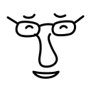</a> | **📂 檔名:** `croodlesNeutral-1771675313504.svg` ✨ **格式:** `Vector (SVG)` ⚖️ **大小:** `2.08KB` 📅 **更新:** `2026-03-01`  🚀 **jsDelivr Markdown:** `` 🔗 **直接連結 (Url):** <code>https://cdn.jsdelivr.net/gh/barry028/materials@main/images/Dicebear/Croodles%20Netral/croodlesNeutral-1771675313504.svg</code> 📥 [檢視原始檔](croodlesNeutral-1771675313504.svg) |
| <a href="croodlesNeutral-1771675315994.svg">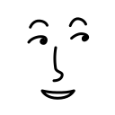</a> | **📂 檔名:** `croodlesNeutral-1771675315994.svg` ✨ **格式:** `Vector (SVG)` ⚖️ **大小:** `1.79KB` 📅 **更新:** `2026-03-01`  🚀 **jsDelivr Markdown:** `` 🔗 **直接連結 (Url):** <code>https://cdn.jsdelivr.net/gh/barry028/materials@main/images/Dicebear/Croodles%20Netral/croodlesNeutral-1771675315994.svg</code> 📥 [檢視原始檔](croodlesNeutral-1771675315994.svg) |
| <a href="croodlesNeutral-1771675318946.svg">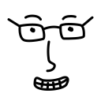</a> | **📂 檔名:** `croodlesNeutral-1771675318946.svg` ✨ **格式:** `Vector (SVG)` ⚖️ **大小:** `2.19KB` 📅 **更新:** `2026-03-01`  🚀 **jsDelivr Markdown:** `` 🔗 **直接連結 (Url):** <code>https://cdn.jsdelivr.net/gh/barry028/materials@main/images/Dicebear/Croodles%20Netral/croodlesNeutral-1771675318946.svg</code> 📥 [檢視原始檔](croodlesNeutral-1771675318946.svg) |
| <a href="croodlesNeutral-1771675321758.svg">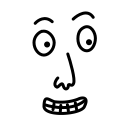</a> | **📂 檔名:** `croodlesNeutral-1771675321758.svg` ✨ **格式:** `Vector (SVG)` ⚖️ **大小:** `2.04KB` 📅 **更新:** `2026-03-01`  🚀 **jsDelivr Markdown:** `` 🔗 **直接連結 (Url):** <code>https://cdn.jsdelivr.net/gh/barry028/materials@main/images/Dicebear/Croodles%20Netral/croodlesNeutral-1771675321758.svg</code> 📥 [檢視原始檔](croodlesNeutral-1771675321758.svg) |