# 🖼️ 素材分類：Croodles

> [🏠 主目錄](../../../README.md) / [images](../../README.md) / [Dicebear](../README.md) / **Croodles**

本目錄共有 `20` 個檔案

| 🎨 預覽 (點擊放大)  | 📋 檔案詳細資訊與連結 |
| :--- | :--- |
| <a href="croodles-1771675022391.svg">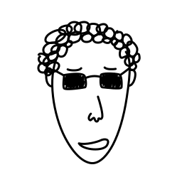</a> | **📂 檔名:** `croodles-1771675022391.svg` ✨ **格式:** `Vector (SVG)` ⚖️ **大小:** `6.65KB` 📅 **更新:** `2026-03-04`  🚀 **jsDelivr Markdown:** `` 🔗 **直接連結 (Url):** <code>https://cdn.jsdelivr.net/gh/barry028/materials@main/images/Dicebear/Croodles/croodles-1771675022391.svg</code> 📥 [檢視原始檔](croodles-1771675022391.svg) |
|  | **📂 檔名:** `croodles-1771675024998.svg` ✨ **格式:** `Vector (SVG)` ⚖️ **大小:** `3.96KB` 📅 **更新:** `2026-03-04`  🚀 **jsDelivr Markdown:** `` 🔗 **直接連結 (Url):** <code>https://cdn.jsdelivr.net/gh/barry028/materials@main/images/Dicebear/Croodles/croodles-1771675024998.svg</code> 📥 [檢視原始檔](croodles-1771675024998.svg) |
| <a href="croodles-1771675026409.svg">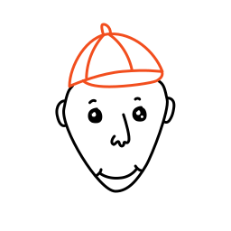</a> | **📂 檔名:** `croodles-1771675026409.svg` ✨ **格式:** `Vector (SVG)` ⚖️ **大小:** `4.13KB` 📅 **更新:** `2026-03-04`  🚀 **jsDelivr Markdown:** `` 🔗 **直接連結 (Url):** <code>https://cdn.jsdelivr.net/gh/barry028/materials@main/images/Dicebear/Croodles/croodles-1771675026409.svg</code> 📥 [檢視原始檔](croodles-1771675026409.svg) |
| <a href="croodles-1771675027481.svg">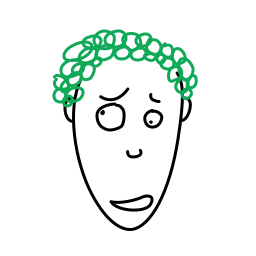</a> | **📂 檔名:** `croodles-1771675027481.svg` ✨ **格式:** `Vector (SVG)` ⚖️ **大小:** `5.92KB` 📅 **更新:** `2026-03-04`  🚀 **jsDelivr Markdown:** `` 🔗 **直接連結 (Url):** <code>https://cdn.jsdelivr.net/gh/barry028/materials@main/images/Dicebear/Croodles/croodles-1771675027481.svg</code> 📥 [檢視原始檔](croodles-1771675027481.svg) |
| <a href="croodles-1771675029311.svg">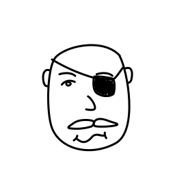</a> | **📂 檔名:** `croodles-1771675029311.svg` ✨ **格式:** `Vector (SVG)` ⚖️ **大小:** `3.66KB` 📅 **更新:** `2026-03-04`  🚀 **jsDelivr Markdown:** `` 🔗 **直接連結 (Url):** <code>https://cdn.jsdelivr.net/gh/barry028/materials@main/images/Dicebear/Croodles/croodles-1771675029311.svg</code> 📥 [檢視原始檔](croodles-1771675029311.svg) |
| <a href="croodles-1771675030555.svg">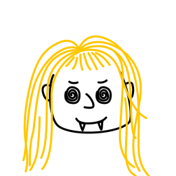</a> | **📂 檔名:** `croodles-1771675030555.svg` ✨ **格式:** `Vector (SVG)` ⚖️ **大小:** `4.32KB` 📅 **更新:** `2026-03-04`  🚀 **jsDelivr Markdown:** `` 🔗 **直接連結 (Url):** <code>https://cdn.jsdelivr.net/gh/barry028/materials@main/images/Dicebear/Croodles/croodles-1771675030555.svg</code> 📥 [檢視原始檔](croodles-1771675030555.svg) |
| <a href="croodles-1771675032603.svg">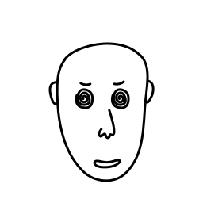</a> | **📂 檔名:** `croodles-1771675032603.svg` ✨ **格式:** `Vector (SVG)` ⚖️ **大小:** `3.14KB` 📅 **更新:** `2026-03-04`  🚀 **jsDelivr Markdown:** `` 🔗 **直接連結 (Url):** <code>https://cdn.jsdelivr.net/gh/barry028/materials@main/images/Dicebear/Croodles/croodles-1771675032603.svg</code> 📥 [檢視原始檔](croodles-1771675032603.svg) |
| <a href="croodles-1771675033935.svg">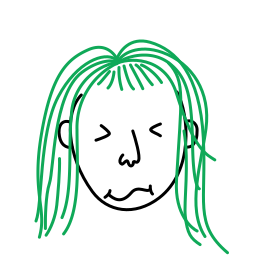</a> | **📂 檔名:** `croodles-1771675033935.svg` ✨ **格式:** `Vector (SVG)` ⚖️ **大小:** `3.80KB` 📅 **更新:** `2026-03-04`  🚀 **jsDelivr Markdown:** `` 🔗 **直接連結 (Url):** <code>https://cdn.jsdelivr.net/gh/barry028/materials@main/images/Dicebear/Croodles/croodles-1771675033935.svg</code> 📥 [檢視原始檔](croodles-1771675033935.svg) |
| <a href="croodles-1771675036087.svg">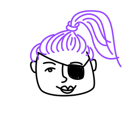</a> | **📂 檔名:** `croodles-1771675036087.svg` ✨ **格式:** `Vector (SVG)` ⚖️ **大小:** `4.52KB` 📅 **更新:** `2026-03-04`  🚀 **jsDelivr Markdown:** `` 🔗 **直接連結 (Url):** <code>https://cdn.jsdelivr.net/gh/barry028/materials@main/images/Dicebear/Croodles/croodles-1771675036087.svg</code> 📥 [檢視原始檔](croodles-1771675036087.svg) |
| <a href="croodles-1771675037368.svg">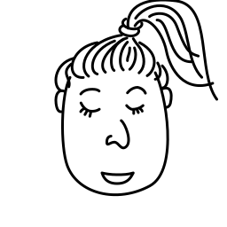</a> | **📂 檔名:** `croodles-1771675037368.svg` ✨ **格式:** `Vector (SVG)` ⚖️ **大小:** `3.93KB` 📅 **更新:** `2026-03-04`  🚀 **jsDelivr Markdown:** `` 🔗 **直接連結 (Url):** <code>https://cdn.jsdelivr.net/gh/barry028/materials@main/images/Dicebear/Croodles/croodles-1771675037368.svg</code> 📥 [檢視原始檔](croodles-1771675037368.svg) |
| <a href="croodles-1771675039168.svg">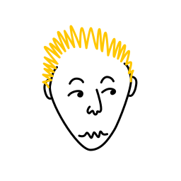</a> | **📂 檔名:** `croodles-1771675039168.svg` ✨ **格式:** `Vector (SVG)` ⚖️ **大小:** `3.68KB` 📅 **更新:** `2026-03-04`  🚀 **jsDelivr Markdown:** `` 🔗 **直接連結 (Url):** <code>https://cdn.jsdelivr.net/gh/barry028/materials@main/images/Dicebear/Croodles/croodles-1771675039168.svg</code> 📥 [檢視原始檔](croodles-1771675039168.svg) |
| <a href="croodles-1771675041743.svg">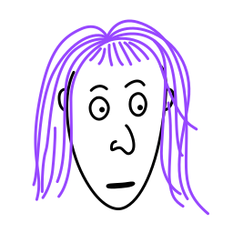</a> | **📂 檔名:** `croodles-1771675041743.svg` ✨ **格式:** `Vector (SVG)` ⚖️ **大小:** `4.07KB` 📅 **更新:** `2026-03-04`  🚀 **jsDelivr Markdown:** `` 🔗 **直接連結 (Url):** <code>https://cdn.jsdelivr.net/gh/barry028/materials@main/images/Dicebear/Croodles/croodles-1771675041743.svg</code> 📥 [檢視原始檔](croodles-1771675041743.svg) |
| <a href="croodles-1771675043666.svg">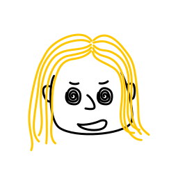</a> | **📂 檔名:** `croodles-1771675043666.svg` ✨ **格式:** `Vector (SVG)` ⚖️ **大小:** `4.14KB` 📅 **更新:** `2026-03-04`  🚀 **jsDelivr Markdown:** `` 🔗 **直接連結 (Url):** <code>https://cdn.jsdelivr.net/gh/barry028/materials@main/images/Dicebear/Croodles/croodles-1771675043666.svg</code> 📥 [檢視原始檔](croodles-1771675043666.svg) |
|  | **📂 檔名:** `croodles-1771675044633.svg` ✨ **格式:** `Vector (SVG)` ⚖️ **大小:** `3.52KB` 📅 **更新:** `2026-03-04`  🚀 **jsDelivr Markdown:** `` 🔗 **直接連結 (Url):** <code>https://cdn.jsdelivr.net/gh/barry028/materials@main/images/Dicebear/Croodles/croodles-1771675044633.svg</code> 📥 [檢視原始檔](croodles-1771675044633.svg) |
| <a href="croodles-1771675046848.svg">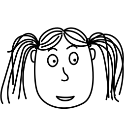</a> | **📂 檔名:** `croodles-1771675046848.svg` ✨ **格式:** `Vector (SVG)` ⚖️ **大小:** `4.28KB` 📅 **更新:** `2026-03-04`  🚀 **jsDelivr Markdown:** `` 🔗 **直接連結 (Url):** <code>https://cdn.jsdelivr.net/gh/barry028/materials@main/images/Dicebear/Croodles/croodles-1771675046848.svg</code> 📥 [檢視原始檔](croodles-1771675046848.svg) |
| <a href="croodles-1771675048883.svg">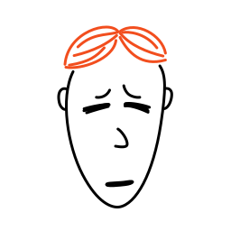</a> | **📂 檔名:** `croodles-1771675048883.svg` ✨ **格式:** `Vector (SVG)` ⚖️ **大小:** `3.27KB` 📅 **更新:** `2026-03-04`  🚀 **jsDelivr Markdown:** `` 🔗 **直接連結 (Url):** <code>https://cdn.jsdelivr.net/gh/barry028/materials@main/images/Dicebear/Croodles/croodles-1771675048883.svg</code> 📥 [檢視原始檔](croodles-1771675048883.svg) |
|  | **📂 檔名:** `croodles-1771675050425.svg` ✨ **格式:** `Vector (SVG)` ⚖️ **大小:** `4.09KB` 📅 **更新:** `2026-03-04`  🚀 **jsDelivr Markdown:** `` 🔗 **直接連結 (Url):** <code>https://cdn.jsdelivr.net/gh/barry028/materials@main/images/Dicebear/Croodles/croodles-1771675050425.svg</code> 📥 [檢視原始檔](croodles-1771675050425.svg) |
| <a href="croodles-1771675051655.svg">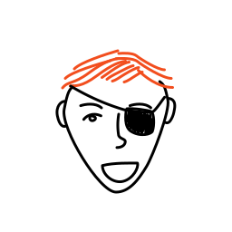</a> | **📂 檔名:** `croodles-1771675051655.svg` ✨ **格式:** `Vector (SVG)` ⚖️ **大小:** `3.88KB` 📅 **更新:** `2026-03-04`  🚀 **jsDelivr Markdown:** `` 🔗 **直接連結 (Url):** <code>https://cdn.jsdelivr.net/gh/barry028/materials@main/images/Dicebear/Croodles/croodles-1771675051655.svg</code> 📥 [檢視原始檔](croodles-1771675051655.svg) |
| <a href="croodles-1771675052949.svg">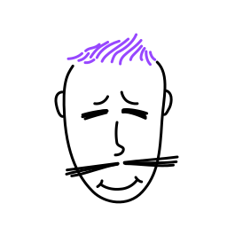</a> | **📂 檔名:** `croodles-1771675052949.svg` ✨ **格式:** `Vector (SVG)` ⚖️ **大小:** `3.72KB` 📅 **更新:** `2026-03-04`  🚀 **jsDelivr Markdown:** `` 🔗 **直接連結 (Url):** <code>https://cdn.jsdelivr.net/gh/barry028/materials@main/images/Dicebear/Croodles/croodles-1771675052949.svg</code> 📥 [檢視原始檔](croodles-1771675052949.svg) |
| <a href="croodles-1771675054071.svg">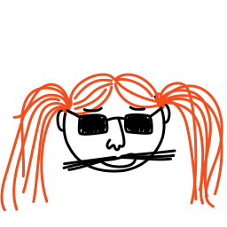</a> | **📂 檔名:** `croodles-1771675054071.svg` ✨ **格式:** `Vector (SVG)` ⚖️ **大小:** `5.34KB` 📅 **更新:** `2026-03-04`  🚀 **jsDelivr Markdown:** `` 🔗 **直接連結 (Url):** <code>https://cdn.jsdelivr.net/gh/barry028/materials@main/images/Dicebear/Croodles/croodles-1771675054071.svg</code> 📥 [檢視原始檔](croodles-1771675054071.svg) |