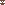
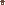

# 🖼️ 素材分類：Identicon 

> [🏠 主目錄](../../../README.md) / [images](../../README.md) / [Dicebear](../README.md) / **Identicon **

本目錄共有 `20` 個檔案

| 🎨 預覽 (點擊放大) | 📋 檔案詳細資訊與連結 |
| :--- | :--- |
|  | **📂 檔名:** `identicon-1771675635859.svg` ✨ **格式:** `Vector (SVG)` ⚖️ **大小:** `1.12KB` | 📅 **更新:** `2026-02-27`  🚀 **jsDelivr Markdown:** `` 🔗 **直接連結 (Url):** `https://cdn.jsdelivr.netbarry028/materials@main/images/Dicebear/Identicon%20/identicon-1771675635859.svg` 📥 [檢視原始檔](identicon-1771675635859.svg) |
|  | **📂 檔名:** `identicon-1771675638226.svg` ✨ **格式:** `Vector (SVG)` ⚖️ **大小:** `1.12KB` | 📅 **更新:** `2026-02-27`  🚀 **jsDelivr Markdown:** `` 🔗 **直接連結 (Url):** `https://cdn.jsdelivr.netbarry028/materials@main/images/Dicebear/Identicon%20/identicon-1771675638226.svg` 📥 [檢視原始檔](identicon-1771675638226.svg) |
|  | **📂 檔名:** `identicon-1771675642108.svg` ✨ **格式:** `Vector (SVG)` ⚖️ **大小:** `1.13KB` | 📅 **更新:** `2026-02-27`  🚀 **jsDelivr Markdown:** `` 🔗 **直接連結 (Url):** `https://cdn.jsdelivr.netbarry028/materials@main/images/Dicebear/Identicon%20/identicon-1771675642108.svg` 📥 [檢視原始檔](identicon-1771675642108.svg) |
|  | **📂 檔名:** `identicon-1771675643988.svg` ✨ **格式:** `Vector (SVG)` ⚖️ **大小:** `1.12KB` | 📅 **更新:** `2026-02-27`  🚀 **jsDelivr Markdown:** `` 🔗 **直接連結 (Url):** `https://cdn.jsdelivr.netbarry028/materials@main/images/Dicebear/Identicon%20/identicon-1771675643988.svg` 📥 [檢視原始檔](identicon-1771675643988.svg) |
|  | **📂 檔名:** `identicon-1771675684910.svg` ✨ **格式:** `Vector (SVG)` ⚖️ **大小:** `1.11KB` | 📅 **更新:** `2026-02-27`  🚀 **jsDelivr Markdown:** `` 🔗 **直接連結 (Url):** `https://cdn.jsdelivr.netbarry028/materials@main/images/Dicebear/Identicon%20/identicon-1771675684910.svg` 📥 [檢視原始檔](identicon-1771675684910.svg) |
|  | **📂 檔名:** `identicon-1771675686005.svg` ✨ **格式:** `Vector (SVG)` ⚖️ **大小:** `1.13KB` | 📅 **更新:** `2026-02-27`  🚀 **jsDelivr Markdown:** `` 🔗 **直接連結 (Url):** `https://cdn.jsdelivr.netbarry028/materials@main/images/Dicebear/Identicon%20/identicon-1771675686005.svg` 📥 [檢視原始檔](identicon-1771675686005.svg) |
|  | **📂 檔名:** `identicon-1771675687010.svg` ✨ **格式:** `Vector (SVG)` ⚖️ **大小:** `1.11KB` | 📅 **更新:** `2026-02-27`  🚀 **jsDelivr Markdown:** `` 🔗 **直接連結 (Url):** `https://cdn.jsdelivr.netbarry028/materials@main/images/Dicebear/Identicon%20/identicon-1771675687010.svg` 📥 [檢視原始檔](identicon-1771675687010.svg) |
|  | **📂 檔名:** `identicon-1771675688705.svg` ✨ **格式:** `Vector (SVG)` ⚖️ **大小:** `1.12KB` | 📅 **更新:** `2026-02-27`  🚀 **jsDelivr Markdown:** `` 🔗 **直接連結 (Url):** `https://cdn.jsdelivr.netbarry028/materials@main/images/Dicebear/Identicon%20/identicon-1771675688705.svg` 📥 [檢視原始檔](identicon-1771675688705.svg) |
|  | **📂 檔名:** `identicon-1771675691387.svg` ✨ **格式:** `Vector (SVG)` ⚖️ **大小:** `1.10KB` | 📅 **更新:** `2026-02-27`  🚀 **jsDelivr Markdown:** `` 🔗 **直接連結 (Url):** `https://cdn.jsdelivr.netbarry028/materials@main/images/Dicebear/Identicon%20/identicon-1771675691387.svg` 📥 [檢視原始檔](identicon-1771675691387.svg) |
|  | **📂 檔名:** `identicon-1771675692587.svg` ✨ **格式:** `Vector (SVG)` ⚖️ **大小:** `1.11KB` | 📅 **更新:** `2026-02-27`  🚀 **jsDelivr Markdown:** `` 🔗 **直接連結 (Url):** `https://cdn.jsdelivr.netbarry028/materials@main/images/Dicebear/Identicon%20/identicon-1771675692587.svg` 📥 [檢視原始檔](identicon-1771675692587.svg) |
|  | **📂 檔名:** `identicon-1771675693546.svg` ✨ **格式:** `Vector (SVG)` ⚖️ **大小:** `1.12KB` | 📅 **更新:** `2026-02-27`  🚀 **jsDelivr Markdown:** `` 🔗 **直接連結 (Url):** `https://cdn.jsdelivr.netbarry028/materials@main/images/Dicebear/Identicon%20/identicon-1771675693546.svg` 📥 [檢視原始檔](identicon-1771675693546.svg) |
|  | **📂 檔名:** `identicon-1771675694737.svg` ✨ **格式:** `Vector (SVG)` ⚖️ **大小:** `1.09KB` | 📅 **更新:** `2026-02-27`  🚀 **jsDelivr Markdown:** `` 🔗 **直接連結 (Url):** `https://cdn.jsdelivr.netbarry028/materials@main/images/Dicebear/Identicon%20/identicon-1771675694737.svg` 📥 [檢視原始檔](identicon-1771675694737.svg) |
|  | **📂 檔名:** `identicon-1771675696479.svg` ✨ **格式:** `Vector (SVG)` ⚖️ **大小:** `1.12KB` | 📅 **更新:** `2026-02-27`  🚀 **jsDelivr Markdown:** `` 🔗 **直接連結 (Url):** `https://cdn.jsdelivr.netbarry028/materials@main/images/Dicebear/Identicon%20/identicon-1771675696479.svg` 📥 [檢視原始檔](identicon-1771675696479.svg) |
|  | **📂 檔名:** `identicon-1771675697874.svg` ✨ **格式:** `Vector (SVG)` ⚖️ **大小:** `1.16KB` | 📅 **更新:** `2026-02-27`  🚀 **jsDelivr Markdown:** `` 🔗 **直接連結 (Url):** `https://cdn.jsdelivr.netbarry028/materials@main/images/Dicebear/Identicon%20/identicon-1771675697874.svg` 📥 [檢視原始檔](identicon-1771675697874.svg) |
|  | **📂 檔名:** `identicon-1771675699075.svg` ✨ **格式:** `Vector (SVG)` ⚖️ **大小:** `1.09KB` | 📅 **更新:** `2026-02-27`  🚀 **jsDelivr Markdown:** `` 🔗 **直接連結 (Url):** `https://cdn.jsdelivr.netbarry028/materials@main/images/Dicebear/Identicon%20/identicon-1771675699075.svg` 📥 [檢視原始檔](identicon-1771675699075.svg) |
|  | **📂 檔名:** `identicon-1771675700241.svg` ✨ **格式:** `Vector (SVG)` ⚖️ **大小:** `1.09KB` | 📅 **更新:** `2026-02-27`  🚀 **jsDelivr Markdown:** `` 🔗 **直接連結 (Url):** `https://cdn.jsdelivr.netbarry028/materials@main/images/Dicebear/Identicon%20/identicon-1771675700241.svg` 📥 [檢視原始檔](identicon-1771675700241.svg) |
|  | **📂 檔名:** `identicon-1771675702417.svg` ✨ **格式:** `Vector (SVG)` ⚖️ **大小:** `1.16KB` | 📅 **更新:** `2026-02-27`  🚀 **jsDelivr Markdown:** `` 🔗 **直接連結 (Url):** `https://cdn.jsdelivr.netbarry028/materials@main/images/Dicebear/Identicon%20/identicon-1771675702417.svg` 📥 [檢視原始檔](identicon-1771675702417.svg) |
|  | **📂 檔名:** `identicon-1771675704569.svg` ✨ **格式:** `Vector (SVG)` ⚖️ **大小:** `1.11KB` | 📅 **更新:** `2026-02-27`  🚀 **jsDelivr Markdown:** `` 🔗 **直接連結 (Url):** `https://cdn.jsdelivr.netbarry028/materials@main/images/Dicebear/Identicon%20/identicon-1771675704569.svg` 📥 [檢視原始檔](identicon-1771675704569.svg) |
|  | **📂 檔名:** `identicon-1771675706205.svg` ✨ **格式:** `Vector (SVG)` ⚖️ **大小:** `1.13KB` | 📅 **更新:** `2026-02-27`  🚀 **jsDelivr Markdown:** `` 🔗 **直接連結 (Url):** `https://cdn.jsdelivr.netbarry028/materials@main/images/Dicebear/Identicon%20/identicon-1771675706205.svg` 📥 [檢視原始檔](identicon-1771675706205.svg) |
|  | **📂 檔名:** `identicon-1771675707339.svg` ✨ **格式:** `Vector (SVG)` ⚖️ **大小:** `1.12KB` | 📅 **更新:** `2026-02-27`  🚀 **jsDelivr Markdown:** `` 🔗 **直接連結 (Url):** `https://cdn.jsdelivr.netbarry028/materials@main/images/Dicebear/Identicon%20/identicon-1771675707339.svg` 📥 [檢視原始檔](identicon-1771675707339.svg) |