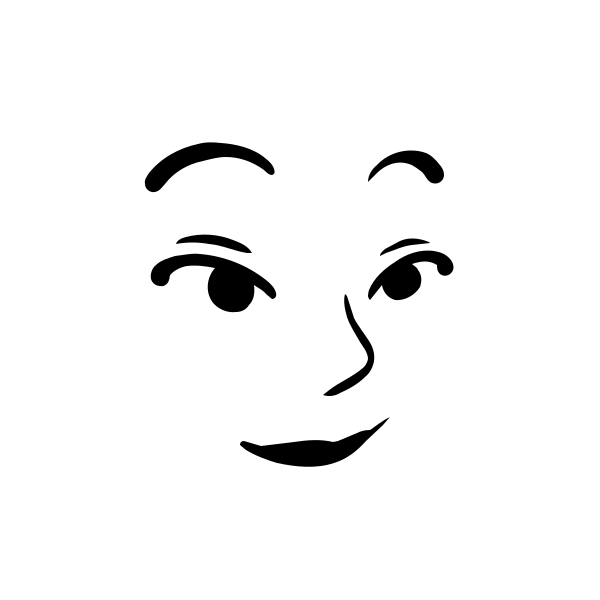
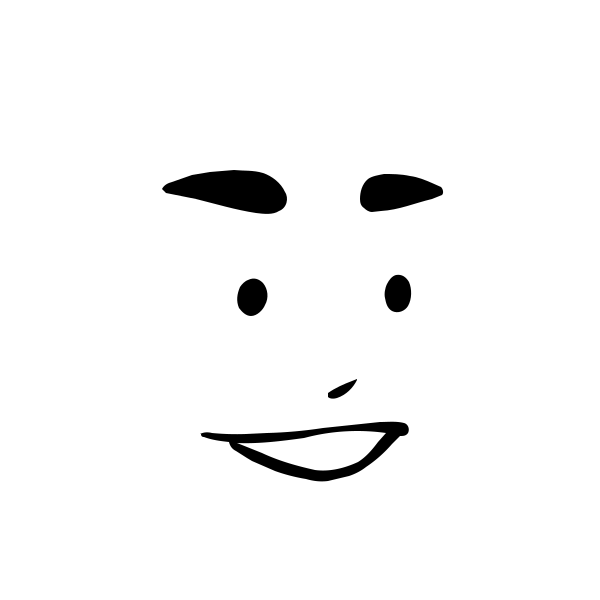
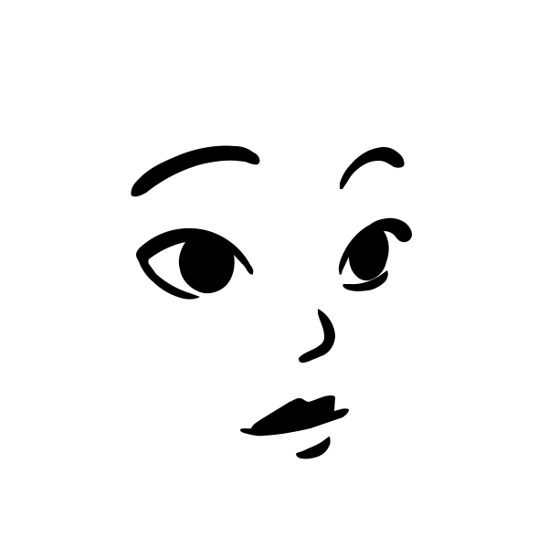
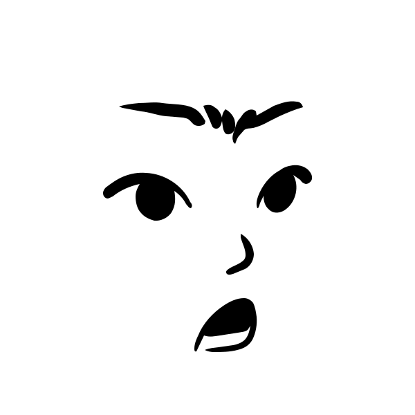
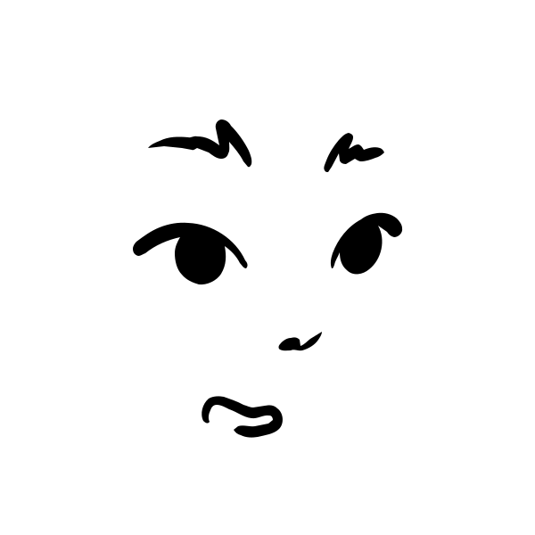
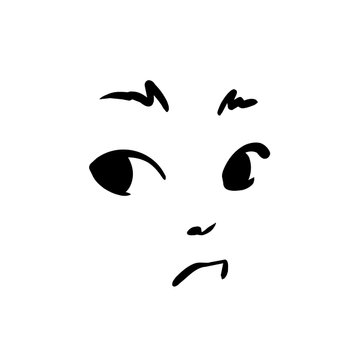
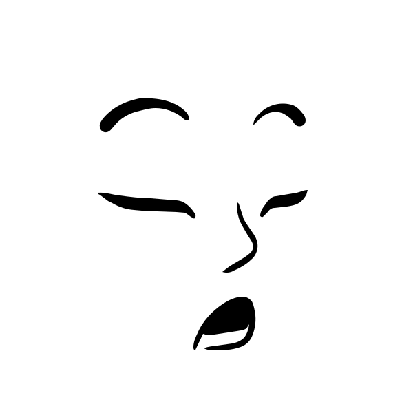

# 🖼️ Lorelei Netral  素材庫

[⬅️ 返回主目錄](../../README.md)

| 預覽 (點擊放大) | 檔案資訊 |
| :--- | :--- |
|  | **loreleiNeutral-1771675765788.svg** Vector (SVG) | 2.56KB |
|  | **loreleiNeutral-1771675767398.svg** Vector (SVG) | 2.45KB |
|  | **loreleiNeutral-1771675768877.svg** Vector (SVG) | 2.27KB |
|  | **loreleiNeutral-1771675770208.svg** Vector (SVG) | 2.43KB |
|  | **loreleiNeutral-1771675772559.svg** Vector (SVG) | 2.58KB |
|  | **loreleiNeutral-1771675774101.svg** Vector (SVG) | 2.65KB |
|  | **loreleiNeutral-1771675776383.svg** Vector (SVG) | 2.88KB |
|  | **loreleiNeutral-1771675778044.svg** Vector (SVG) | 2.69KB |
|  | **loreleiNeutral-1771675781173.svg** Vector (SVG) | 2.61KB |
|  | **loreleiNeutral-1771675782596.svg** Vector (SVG) | 2.79KB |
|  | **loreleiNeutral-1771675784032.svg** Vector (SVG) | 2.58KB |
|  | **loreleiNeutral-1771675785880.svg** Vector (SVG) | 2.61KB |
|  | **loreleiNeutral-1771675787817.svg** Vector (SVG) | 2.23KB |
|  | **loreleiNeutral-1771675789373.svg** Vector (SVG) | 3.18KB |
|  | **loreleiNeutral-1771675791848.svg** Vector (SVG) | 2.54KB |
|  | **loreleiNeutral-1771675793447.svg** Vector (SVG) | 2.38KB |
|  | **loreleiNeutral-1771675795600.svg** Vector (SVG) | 2.48KB |
|  | **loreleiNeutral-1771675797242.svg** Vector (SVG) | 2.48KB |
|  | **loreleiNeutral-1771675799394.svg** Vector (SVG) | 2.37KB |
|  | **loreleiNeutral-1771675800839.svg** Vector (SVG) | 2.59KB |