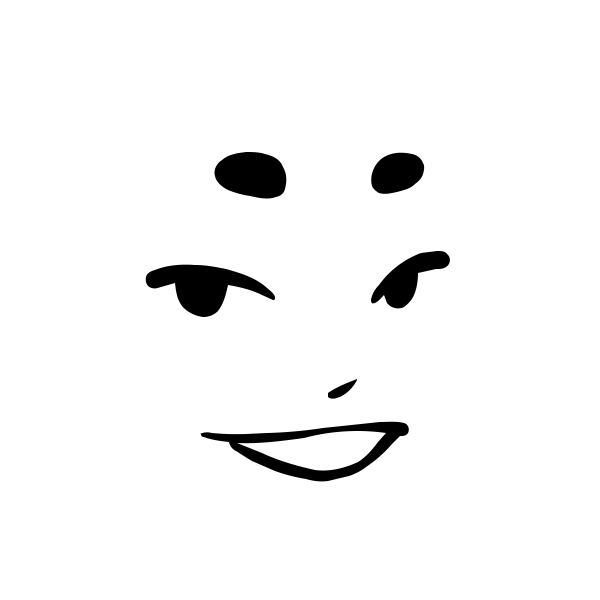
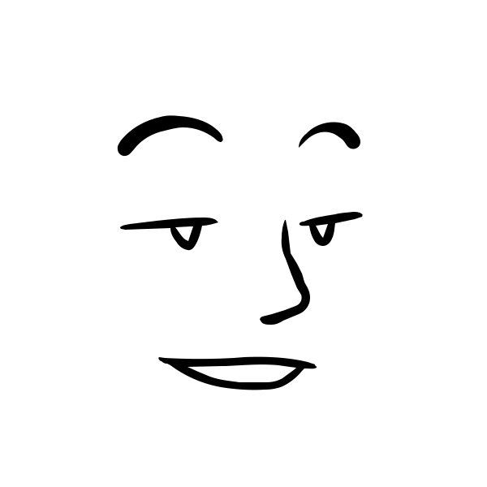
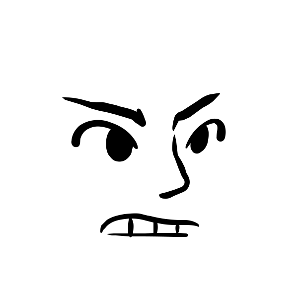
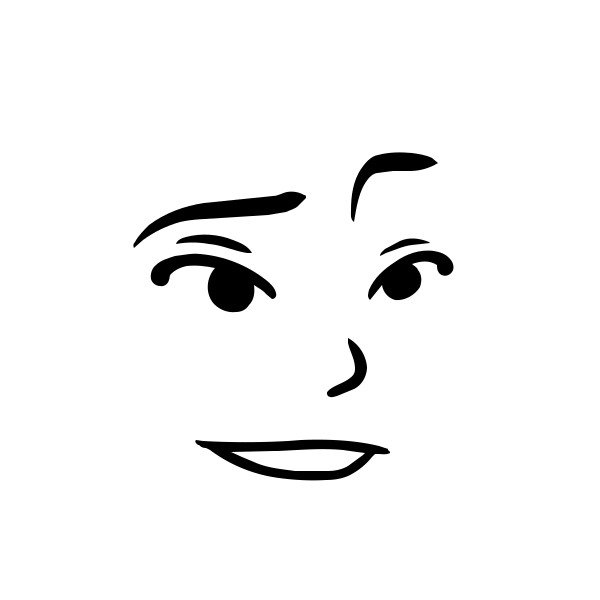
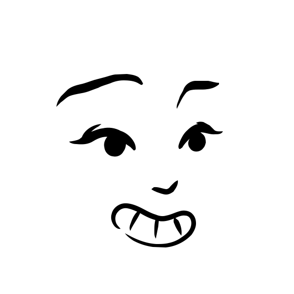
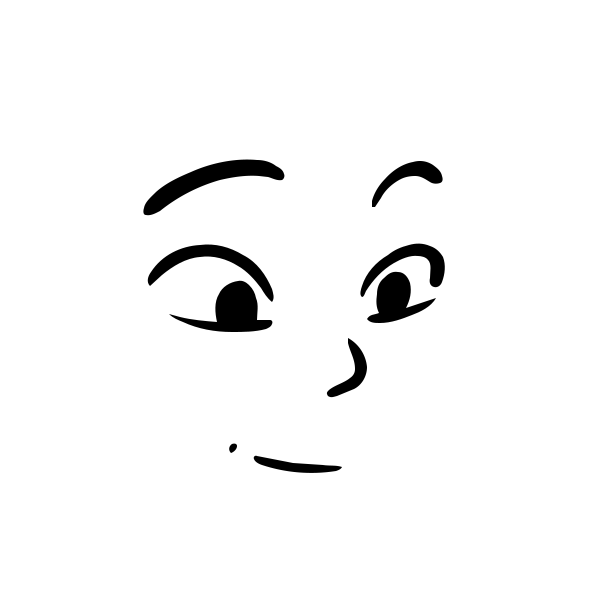
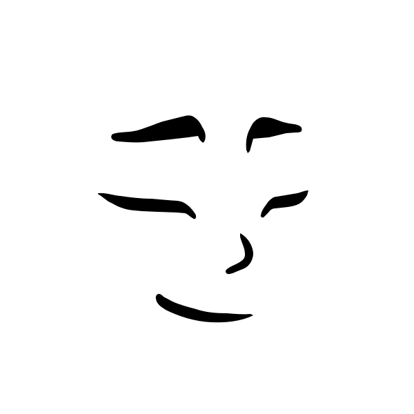
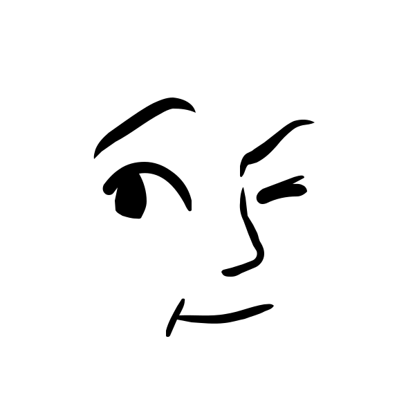
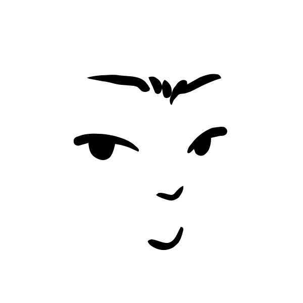
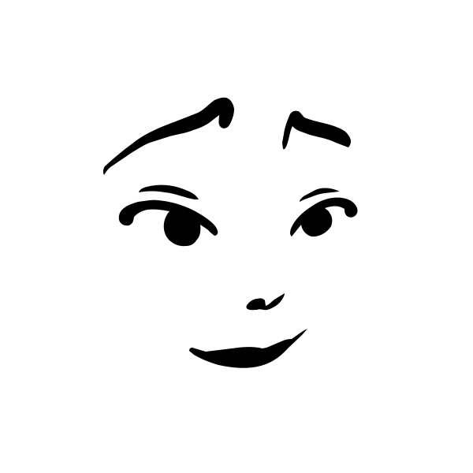

# 🖼️ 素材分類：Lorelei Netral

> [🏠 主目錄](../../../README.md) / [images](../../README.md) / [Dicebear](../README.md) / **Lorelei Netral**

本目錄共有 `20` 個檔案

| 🎨 預覽 (點擊放大)  | 📋 檔案詳細資訊與連結 |
| :--- | :--- |
|  | **📂 檔名:** `loreleiNeutral-1771675765788.svg` ✨ **格式:** `Vector (SVG)` ⚖️ **大小:** `2.56KB` 📅 **更新:** `2026-02-27`  🚀 **jsDelivr Markdown:** `` 🔗 **直接連結 (Url):** <code>https://cdn.jsdelivr.net/gh/barry028/materials@main/images/Dicebear/Lorelei%20Netral/loreleiNeutral-1771675765788.svg</code> 📥 [檢視原始檔](loreleiNeutral-1771675765788.svg) |
|  | **📂 檔名:** `loreleiNeutral-1771675767398.svg` ✨ **格式:** `Vector (SVG)` ⚖️ **大小:** `2.45KB` 📅 **更新:** `2026-02-27`  🚀 **jsDelivr Markdown:** `` 🔗 **直接連結 (Url):** <code>https://cdn.jsdelivr.net/gh/barry028/materials@main/images/Dicebear/Lorelei%20Netral/loreleiNeutral-1771675767398.svg</code> 📥 [檢視原始檔](loreleiNeutral-1771675767398.svg) |
|  | **📂 檔名:** `loreleiNeutral-1771675768877.svg` ✨ **格式:** `Vector (SVG)` ⚖️ **大小:** `2.27KB` 📅 **更新:** `2026-02-27`  🚀 **jsDelivr Markdown:** `` 🔗 **直接連結 (Url):** <code>https://cdn.jsdelivr.net/gh/barry028/materials@main/images/Dicebear/Lorelei%20Netral/loreleiNeutral-1771675768877.svg</code> 📥 [檢視原始檔](loreleiNeutral-1771675768877.svg) |
|  | **📂 檔名:** `loreleiNeutral-1771675770208.svg` ✨ **格式:** `Vector (SVG)` ⚖️ **大小:** `2.43KB` 📅 **更新:** `2026-02-27`  🚀 **jsDelivr Markdown:** `` 🔗 **直接連結 (Url):** <code>https://cdn.jsdelivr.net/gh/barry028/materials@main/images/Dicebear/Lorelei%20Netral/loreleiNeutral-1771675770208.svg</code> 📥 [檢視原始檔](loreleiNeutral-1771675770208.svg) |
|  | **📂 檔名:** `loreleiNeutral-1771675772559.svg` ✨ **格式:** `Vector (SVG)` ⚖️ **大小:** `2.58KB` 📅 **更新:** `2026-02-27`  🚀 **jsDelivr Markdown:** `` 🔗 **直接連結 (Url):** <code>https://cdn.jsdelivr.net/gh/barry028/materials@main/images/Dicebear/Lorelei%20Netral/loreleiNeutral-1771675772559.svg</code> 📥 [檢視原始檔](loreleiNeutral-1771675772559.svg) |
|  | **📂 檔名:** `loreleiNeutral-1771675774101.svg` ✨ **格式:** `Vector (SVG)` ⚖️ **大小:** `2.65KB` 📅 **更新:** `2026-02-27`  🚀 **jsDelivr Markdown:** `` 🔗 **直接連結 (Url):** <code>https://cdn.jsdelivr.net/gh/barry028/materials@main/images/Dicebear/Lorelei%20Netral/loreleiNeutral-1771675774101.svg</code> 📥 [檢視原始檔](loreleiNeutral-1771675774101.svg) |
|  | **📂 檔名:** `loreleiNeutral-1771675776383.svg` ✨ **格式:** `Vector (SVG)` ⚖️ **大小:** `2.88KB` 📅 **更新:** `2026-02-27`  🚀 **jsDelivr Markdown:** `` 🔗 **直接連結 (Url):** <code>https://cdn.jsdelivr.net/gh/barry028/materials@main/images/Dicebear/Lorelei%20Netral/loreleiNeutral-1771675776383.svg</code> 📥 [檢視原始檔](loreleiNeutral-1771675776383.svg) |
|  | **📂 檔名:** `loreleiNeutral-1771675778044.svg` ✨ **格式:** `Vector (SVG)` ⚖️ **大小:** `2.69KB` 📅 **更新:** `2026-02-27`  🚀 **jsDelivr Markdown:** `` 🔗 **直接連結 (Url):** <code>https://cdn.jsdelivr.net/gh/barry028/materials@main/images/Dicebear/Lorelei%20Netral/loreleiNeutral-1771675778044.svg</code> 📥 [檢視原始檔](loreleiNeutral-1771675778044.svg) |
|  | **📂 檔名:** `loreleiNeutral-1771675781173.svg` ✨ **格式:** `Vector (SVG)` ⚖️ **大小:** `2.61KB` 📅 **更新:** `2026-02-27`  🚀 **jsDelivr Markdown:** `` 🔗 **直接連結 (Url):** <code>https://cdn.jsdelivr.net/gh/barry028/materials@main/images/Dicebear/Lorelei%20Netral/loreleiNeutral-1771675781173.svg</code> 📥 [檢視原始檔](loreleiNeutral-1771675781173.svg) |
|  | **📂 檔名:** `loreleiNeutral-1771675782596.svg` ✨ **格式:** `Vector (SVG)` ⚖️ **大小:** `2.79KB` 📅 **更新:** `2026-02-27`  🚀 **jsDelivr Markdown:** `` 🔗 **直接連結 (Url):** <code>https://cdn.jsdelivr.net/gh/barry028/materials@main/images/Dicebear/Lorelei%20Netral/loreleiNeutral-1771675782596.svg</code> 📥 [檢視原始檔](loreleiNeutral-1771675782596.svg) |
|  | **📂 檔名:** `loreleiNeutral-1771675784032.svg` ✨ **格式:** `Vector (SVG)` ⚖️ **大小:** `2.58KB` 📅 **更新:** `2026-02-27`  🚀 **jsDelivr Markdown:** `` 🔗 **直接連結 (Url):** <code>https://cdn.jsdelivr.net/gh/barry028/materials@main/images/Dicebear/Lorelei%20Netral/loreleiNeutral-1771675784032.svg</code> 📥 [檢視原始檔](loreleiNeutral-1771675784032.svg) |
|  | **📂 檔名:** `loreleiNeutral-1771675785880.svg` ✨ **格式:** `Vector (SVG)` ⚖️ **大小:** `2.61KB` 📅 **更新:** `2026-02-27`  🚀 **jsDelivr Markdown:** `` 🔗 **直接連結 (Url):** <code>https://cdn.jsdelivr.net/gh/barry028/materials@main/images/Dicebear/Lorelei%20Netral/loreleiNeutral-1771675785880.svg</code> 📥 [檢視原始檔](loreleiNeutral-1771675785880.svg) |
|  | **📂 檔名:** `loreleiNeutral-1771675787817.svg` ✨ **格式:** `Vector (SVG)` ⚖️ **大小:** `2.23KB` 📅 **更新:** `2026-02-27`  🚀 **jsDelivr Markdown:** `` 🔗 **直接連結 (Url):** <code>https://cdn.jsdelivr.net/gh/barry028/materials@main/images/Dicebear/Lorelei%20Netral/loreleiNeutral-1771675787817.svg</code> 📥 [檢視原始檔](loreleiNeutral-1771675787817.svg) |
|  | **📂 檔名:** `loreleiNeutral-1771675789373.svg` ✨ **格式:** `Vector (SVG)` ⚖️ **大小:** `3.18KB` 📅 **更新:** `2026-02-27`  🚀 **jsDelivr Markdown:** `` 🔗 **直接連結 (Url):** <code>https://cdn.jsdelivr.net/gh/barry028/materials@main/images/Dicebear/Lorelei%20Netral/loreleiNeutral-1771675789373.svg</code> 📥 [檢視原始檔](loreleiNeutral-1771675789373.svg) |
|  | **📂 檔名:** `loreleiNeutral-1771675791848.svg` ✨ **格式:** `Vector (SVG)` ⚖️ **大小:** `2.54KB` 📅 **更新:** `2026-02-27`  🚀 **jsDelivr Markdown:** `` 🔗 **直接連結 (Url):** <code>https://cdn.jsdelivr.net/gh/barry028/materials@main/images/Dicebear/Lorelei%20Netral/loreleiNeutral-1771675791848.svg</code> 📥 [檢視原始檔](loreleiNeutral-1771675791848.svg) |
|  | **📂 檔名:** `loreleiNeutral-1771675793447.svg` ✨ **格式:** `Vector (SVG)` ⚖️ **大小:** `2.38KB` 📅 **更新:** `2026-02-27`  🚀 **jsDelivr Markdown:** `` 🔗 **直接連結 (Url):** <code>https://cdn.jsdelivr.net/gh/barry028/materials@main/images/Dicebear/Lorelei%20Netral/loreleiNeutral-1771675793447.svg</code> 📥 [檢視原始檔](loreleiNeutral-1771675793447.svg) |
|  | **📂 檔名:** `loreleiNeutral-1771675795600.svg` ✨ **格式:** `Vector (SVG)` ⚖️ **大小:** `2.48KB` 📅 **更新:** `2026-02-27`  🚀 **jsDelivr Markdown:** `` 🔗 **直接連結 (Url):** <code>https://cdn.jsdelivr.net/gh/barry028/materials@main/images/Dicebear/Lorelei%20Netral/loreleiNeutral-1771675795600.svg</code> 📥 [檢視原始檔](loreleiNeutral-1771675795600.svg) |
|  | **📂 檔名:** `loreleiNeutral-1771675797242.svg` ✨ **格式:** `Vector (SVG)` ⚖️ **大小:** `2.48KB` 📅 **更新:** `2026-02-27`  🚀 **jsDelivr Markdown:** `` 🔗 **直接連結 (Url):** <code>https://cdn.jsdelivr.net/gh/barry028/materials@main/images/Dicebear/Lorelei%20Netral/loreleiNeutral-1771675797242.svg</code> 📥 [檢視原始檔](loreleiNeutral-1771675797242.svg) |
|  | **📂 檔名:** `loreleiNeutral-1771675799394.svg` ✨ **格式:** `Vector (SVG)` ⚖️ **大小:** `2.37KB` 📅 **更新:** `2026-02-27`  🚀 **jsDelivr Markdown:** `` 🔗 **直接連結 (Url):** <code>https://cdn.jsdelivr.net/gh/barry028/materials@main/images/Dicebear/Lorelei%20Netral/loreleiNeutral-1771675799394.svg</code> 📥 [檢視原始檔](loreleiNeutral-1771675799394.svg) |
|  | **📂 檔名:** `loreleiNeutral-1771675800839.svg` ✨ **格式:** `Vector (SVG)` ⚖️ **大小:** `2.59KB` 📅 **更新:** `2026-02-27`  🚀 **jsDelivr Markdown:** `` 🔗 **直接連結 (Url):** <code>https://cdn.jsdelivr.net/gh/barry028/materials@main/images/Dicebear/Lorelei%20Netral/loreleiNeutral-1771675800839.svg</code> 📥 [檢視原始檔](loreleiNeutral-1771675800839.svg) |