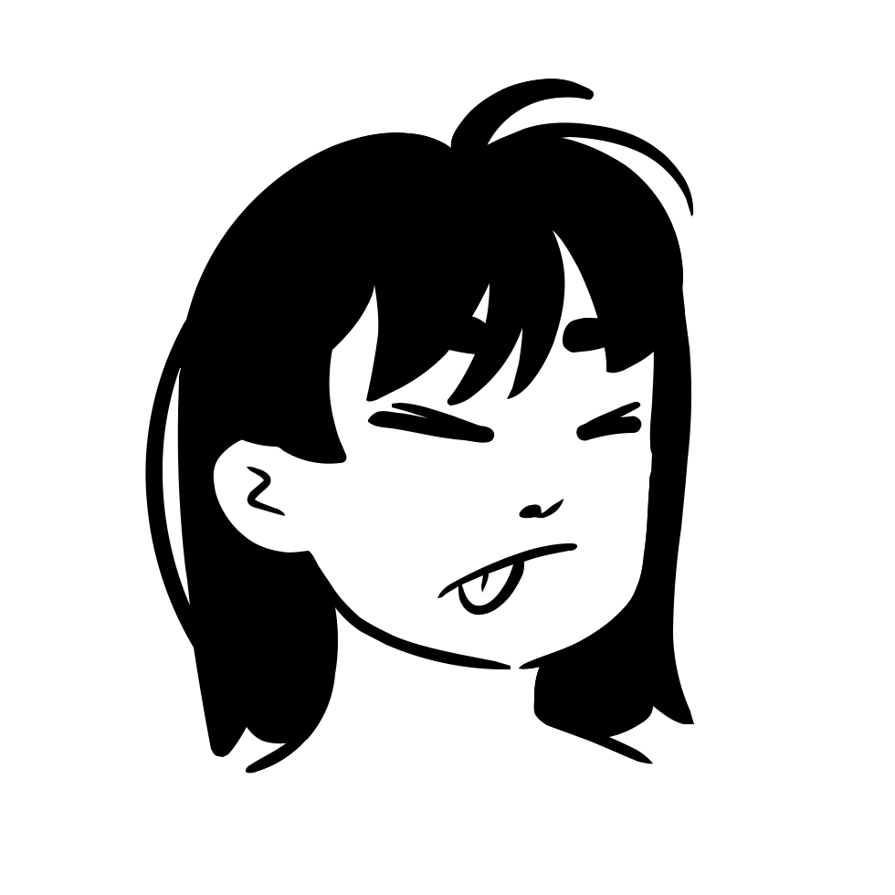
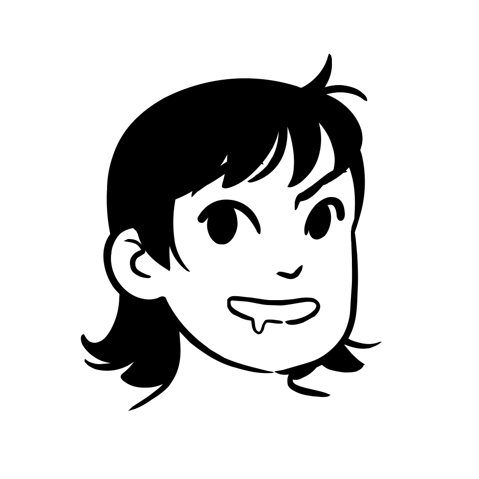
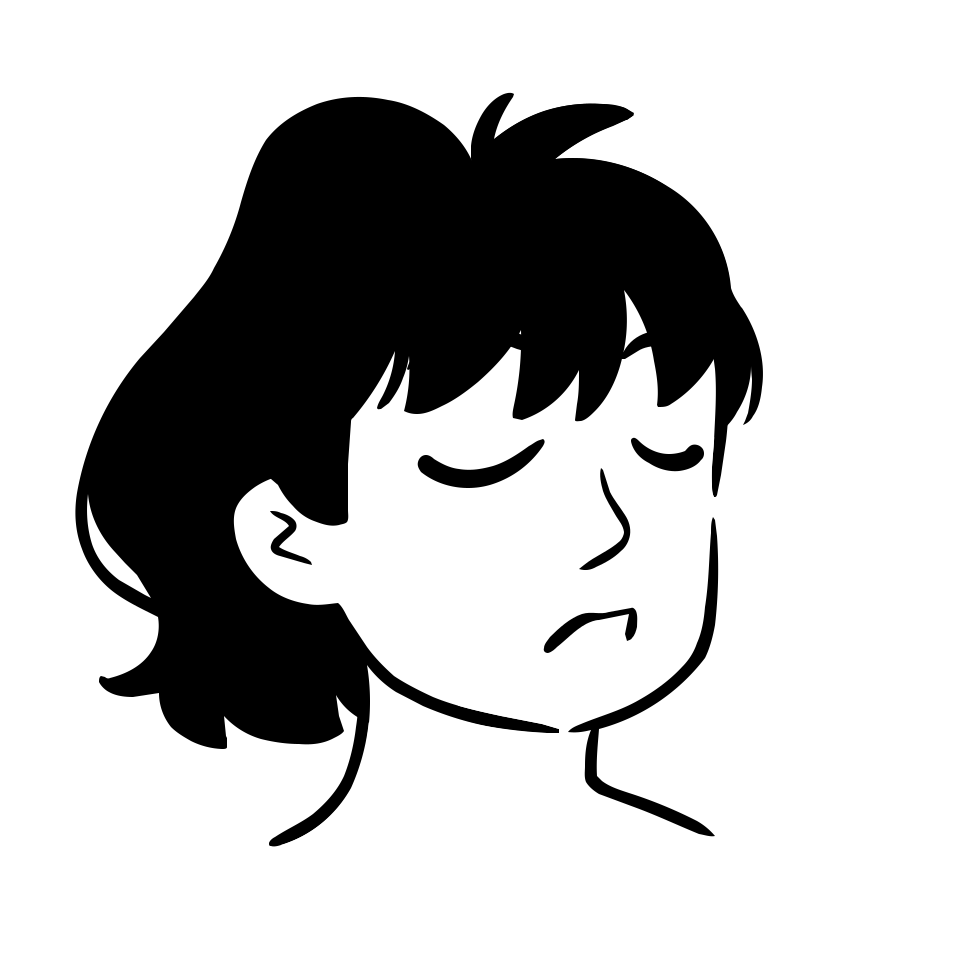
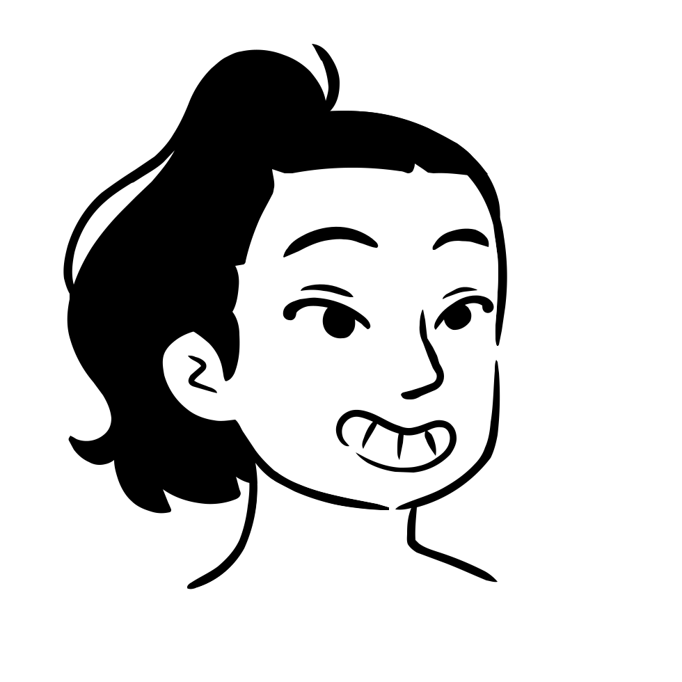
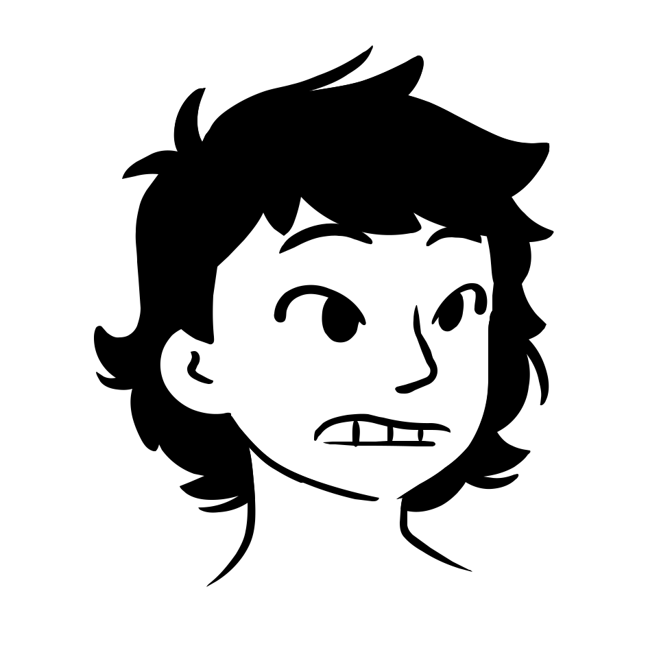
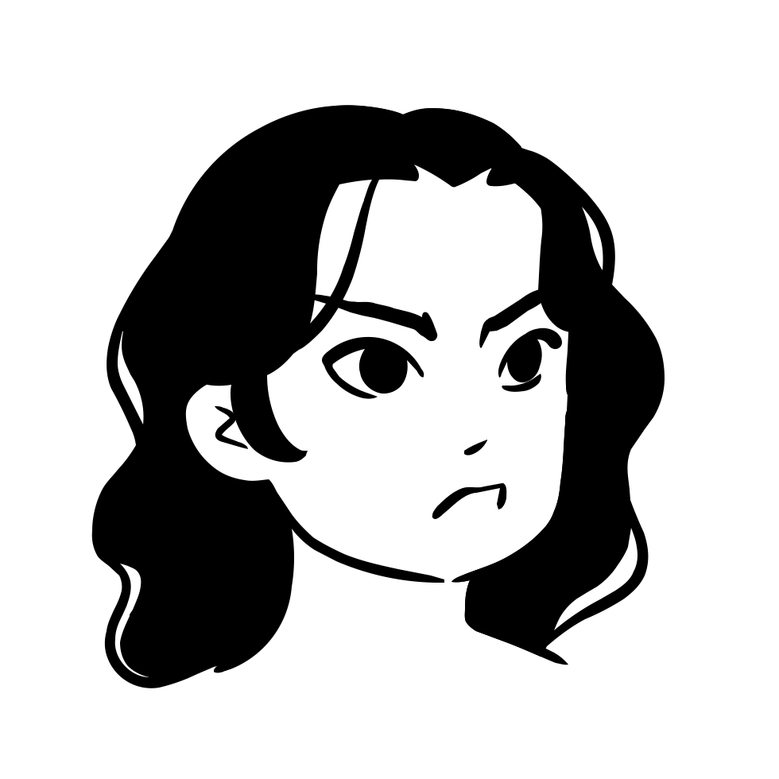
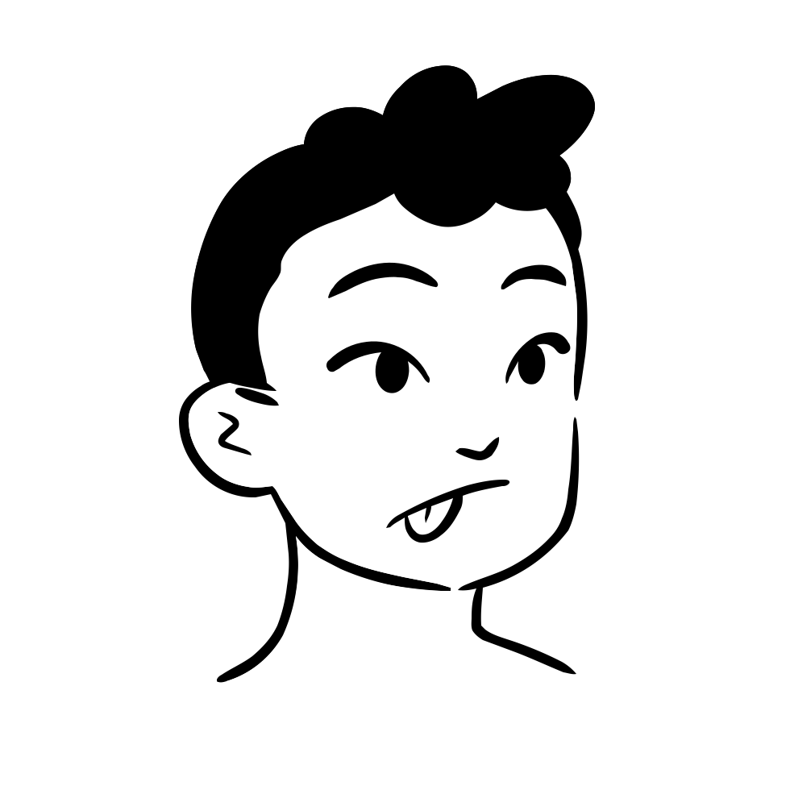
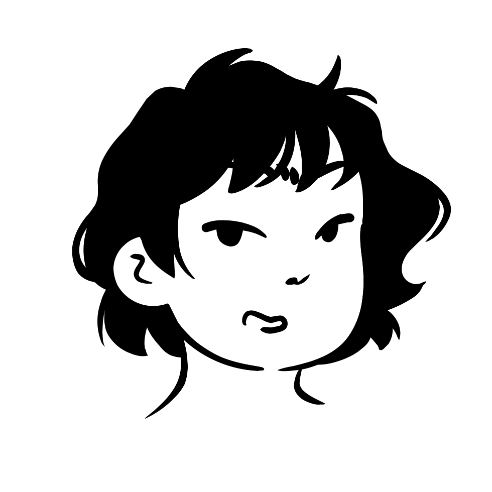
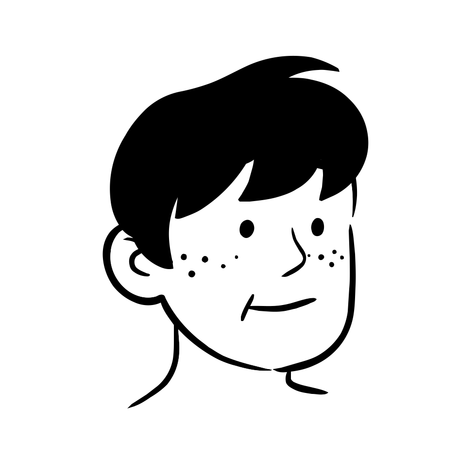

# 🖼️ 素材分類：Lorelei

> [🏠 主目錄](../../../README.md) / [images](../../README.md) / [Dicebear](../README.md) / **Lorelei**

本目錄共有 `20` 個檔案

| 🎨 預覽 (點擊放大)  | 📋 檔案詳細資訊與連結 |
| :--- | :--- |
|  | **📂 檔名:** `lorelei-1771675715940.svg` ✨ **格式:** `Vector (SVG)` ⚖️ **大小:** `6.17KB` 📅 **更新:** `2026-03-01`  🚀 **jsDelivr Markdown:** `` 🔗 **直接連結 (Url):** <code>https://cdn.jsdelivr.net/gh/barry028/materials@main/images/Dicebear/Lorelei/lorelei-1771675715940.svg</code> 📥 [檢視原始檔](lorelei-1771675715940.svg) |
|  | **📂 檔名:** `lorelei-1771675716585.svg` ✨ **格式:** `Vector (SVG)` ⚖️ **大小:** `5.52KB` 📅 **更新:** `2026-03-01`  🚀 **jsDelivr Markdown:** `` 🔗 **直接連結 (Url):** <code>https://cdn.jsdelivr.net/gh/barry028/materials@main/images/Dicebear/Lorelei/lorelei-1771675716585.svg</code> 📥 [檢視原始檔](lorelei-1771675716585.svg) |
|  | **📂 檔名:** `lorelei-1771675718288.svg` ✨ **格式:** `Vector (SVG)` ⚖️ **大小:** `6.51KB` 📅 **更新:** `2026-03-01`  🚀 **jsDelivr Markdown:** `` 🔗 **直接連結 (Url):** <code>https://cdn.jsdelivr.net/gh/barry028/materials@main/images/Dicebear/Lorelei/lorelei-1771675718288.svg</code> 📥 [檢視原始檔](lorelei-1771675718288.svg) |
|  | **📂 檔名:** `lorelei-1771675719318.svg` ✨ **格式:** `Vector (SVG)` ⚖️ **大小:** `6.55KB` 📅 **更新:** `2026-03-01`  🚀 **jsDelivr Markdown:** `` 🔗 **直接連結 (Url):** <code>https://cdn.jsdelivr.net/gh/barry028/materials@main/images/Dicebear/Lorelei/lorelei-1771675719318.svg</code> 📥 [檢視原始檔](lorelei-1771675719318.svg) |
|  | **📂 檔名:** `lorelei-1771675721258.svg` ✨ **格式:** `Vector (SVG)` ⚖️ **大小:** `5.73KB` 📅 **更新:** `2026-03-01`  🚀 **jsDelivr Markdown:** `` 🔗 **直接連結 (Url):** <code>https://cdn.jsdelivr.net/gh/barry028/materials@main/images/Dicebear/Lorelei/lorelei-1771675721258.svg</code> 📥 [檢視原始檔](lorelei-1771675721258.svg) |
|  | **📂 檔名:** `lorelei-1771675724745.svg` ✨ **格式:** `Vector (SVG)` ⚖️ **大小:** `6.45KB` 📅 **更新:** `2026-03-01`  🚀 **jsDelivr Markdown:** `` 🔗 **直接連結 (Url):** <code>https://cdn.jsdelivr.net/gh/barry028/materials@main/images/Dicebear/Lorelei/lorelei-1771675724745.svg</code> 📥 [檢視原始檔](lorelei-1771675724745.svg) |
|  | **📂 檔名:** `lorelei-1771675726280.svg` ✨ **格式:** `Vector (SVG)` ⚖️ **大小:** `5.20KB` 📅 **更新:** `2026-03-01`  🚀 **jsDelivr Markdown:** `` 🔗 **直接連結 (Url):** <code>https://cdn.jsdelivr.net/gh/barry028/materials@main/images/Dicebear/Lorelei/lorelei-1771675726280.svg</code> 📥 [檢視原始檔](lorelei-1771675726280.svg) |
|  | **📂 檔名:** `lorelei-1771675727745.svg` ✨ **格式:** `Vector (SVG)` ⚖️ **大小:** `6.52KB` 📅 **更新:** `2026-03-01`  🚀 **jsDelivr Markdown:** `` 🔗 **直接連結 (Url):** <code>https://cdn.jsdelivr.net/gh/barry028/materials@main/images/Dicebear/Lorelei/lorelei-1771675727745.svg</code> 📥 [檢視原始檔](lorelei-1771675727745.svg) |
|  | **📂 檔名:** `lorelei-1771675729777.svg` ✨ **格式:** `Vector (SVG)` ⚖️ **大小:** `6.73KB` 📅 **更新:** `2026-03-01`  🚀 **jsDelivr Markdown:** `` 🔗 **直接連結 (Url):** <code>https://cdn.jsdelivr.net/gh/barry028/materials@main/images/Dicebear/Lorelei/lorelei-1771675729777.svg</code> 📥 [檢視原始檔](lorelei-1771675729777.svg) |
|  | **📂 檔名:** `lorelei-1771675731810.svg` ✨ **格式:** `Vector (SVG)` ⚖️ **大小:** `6.82KB` 📅 **更新:** `2026-03-01`  🚀 **jsDelivr Markdown:** `` 🔗 **直接連結 (Url):** <code>https://cdn.jsdelivr.net/gh/barry028/materials@main/images/Dicebear/Lorelei/lorelei-1771675731810.svg</code> 📥 [檢視原始檔](lorelei-1771675731810.svg) |
|  | **📂 檔名:** `lorelei-1771675733136.svg` ✨ **格式:** `Vector (SVG)` ⚖️ **大小:** `5.22KB` 📅 **更新:** `2026-03-01`  🚀 **jsDelivr Markdown:** `` 🔗 **直接連結 (Url):** <code>https://cdn.jsdelivr.net/gh/barry028/materials@main/images/Dicebear/Lorelei/lorelei-1771675733136.svg</code> 📥 [檢視原始檔](lorelei-1771675733136.svg) |
|  | **📂 檔名:** `lorelei-1771675734156.svg` ✨ **格式:** `Vector (SVG)` ⚖️ **大小:** `5.98KB` 📅 **更新:** `2026-03-01`  🚀 **jsDelivr Markdown:** `` 🔗 **直接連結 (Url):** <code>https://cdn.jsdelivr.net/gh/barry028/materials@main/images/Dicebear/Lorelei/lorelei-1771675734156.svg</code> 📥 [檢視原始檔](lorelei-1771675734156.svg) |
|  | **📂 檔名:** `lorelei-1771675736323.svg` ✨ **格式:** `Vector (SVG)` ⚖️ **大小:** `4.42KB` 📅 **更新:** `2026-03-01`  🚀 **jsDelivr Markdown:** `` 🔗 **直接連結 (Url):** <code>https://cdn.jsdelivr.net/gh/barry028/materials@main/images/Dicebear/Lorelei/lorelei-1771675736323.svg</code> 📥 [檢視原始檔](lorelei-1771675736323.svg) |
|  | **📂 檔名:** `lorelei-1771675737939.svg` ✨ **格式:** `Vector (SVG)` ⚖️ **大小:** `6.95KB` 📅 **更新:** `2026-03-01`  🚀 **jsDelivr Markdown:** `` 🔗 **直接連結 (Url):** <code>https://cdn.jsdelivr.net/gh/barry028/materials@main/images/Dicebear/Lorelei/lorelei-1771675737939.svg</code> 📥 [檢視原始檔](lorelei-1771675737939.svg) |
|  | **📂 檔名:** `lorelei-1771675742255.svg` ✨ **格式:** `Vector (SVG)` ⚖️ **大小:** `5.96KB` 📅 **更新:** `2026-03-01`  🚀 **jsDelivr Markdown:** `` 🔗 **直接連結 (Url):** <code>https://cdn.jsdelivr.net/gh/barry028/materials@main/images/Dicebear/Lorelei/lorelei-1771675742255.svg</code> 📥 [檢視原始檔](lorelei-1771675742255.svg) |
|  | **📂 檔名:** `lorelei-1771675743278.svg` ✨ **格式:** `Vector (SVG)` ⚖️ **大小:** `6.65KB` 📅 **更新:** `2026-03-01`  🚀 **jsDelivr Markdown:** `` 🔗 **直接連結 (Url):** <code>https://cdn.jsdelivr.net/gh/barry028/materials@main/images/Dicebear/Lorelei/lorelei-1771675743278.svg</code> 📥 [檢視原始檔](lorelei-1771675743278.svg) |
|  | **📂 檔名:** `lorelei-1771675744911.svg` ✨ **格式:** `Vector (SVG)` ⚖️ **大小:** `6.01KB` 📅 **更新:** `2026-03-01`  🚀 **jsDelivr Markdown:** `` 🔗 **直接連結 (Url):** <code>https://cdn.jsdelivr.net/gh/barry028/materials@main/images/Dicebear/Lorelei/lorelei-1771675744911.svg</code> 📥 [檢視原始檔](lorelei-1771675744911.svg) |
|  | **📂 檔名:** `lorelei-1771675746962.svg` ✨ **格式:** `Vector (SVG)` ⚖️ **大小:** `6.67KB` 📅 **更新:** `2026-03-01`  🚀 **jsDelivr Markdown:** `` 🔗 **直接連結 (Url):** <code>https://cdn.jsdelivr.net/gh/barry028/materials@main/images/Dicebear/Lorelei/lorelei-1771675746962.svg</code> 📥 [檢視原始檔](lorelei-1771675746962.svg) |
|  | **📂 檔名:** `lorelei-1771675749522.svg` ✨ **格式:** `Vector (SVG)` ⚖️ **大小:** `5.28KB` 📅 **更新:** `2026-03-01`  🚀 **jsDelivr Markdown:** `` 🔗 **直接連結 (Url):** <code>https://cdn.jsdelivr.net/gh/barry028/materials@main/images/Dicebear/Lorelei/lorelei-1771675749522.svg</code> 📥 [檢視原始檔](lorelei-1771675749522.svg) |
|  | **📂 檔名:** `lorelei-1771675751679.svg` ✨ **格式:** `Vector (SVG)` ⚖️ **大小:** `6.22KB` 📅 **更新:** `2026-03-01`  🚀 **jsDelivr Markdown:** `` 🔗 **直接連結 (Url):** <code>https://cdn.jsdelivr.net/gh/barry028/materials@main/images/Dicebear/Lorelei/lorelei-1771675751679.svg</code> 📥 [檢視原始檔](lorelei-1771675751679.svg) |