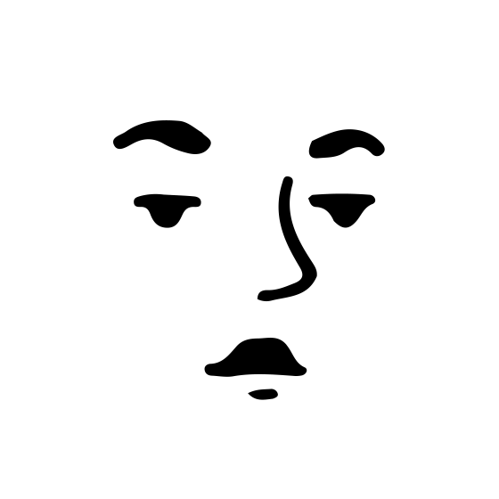
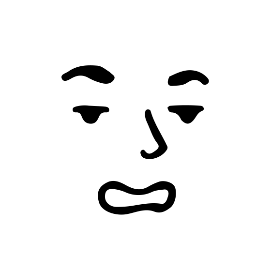

# 🖼️ 素材分類：Notionists Netral 

> [🏠 主目錄](../../../README.md) / [images](../../README.md) / [Dicebear](../README.md) / **Notionists Netral **

本目錄共有 `20` 個檔案

| 🎨 預覽 (點擊放大)  | 📋 檔案詳細資訊與連結 |
| :--- | :--- |
|  | **📂 檔名:** `notionistsNeutral-1771676262259.svg` ✨ **格式:** `Vector (SVG)` ⚖️ **大小:** `2.27KB` 📅 **更新:** `2026-02-27`  🚀 **jsDelivr Markdown:** <code></code> 🔗 **直接連結 (Url):** <code>https://cdn.jsdelivr.netbarry028/materials@main/images/Dicebear/Notionists%20Netral%20/notionistsNeutral-1771676262259.svg</code> 📥 [檢視原始檔](notionistsNeutral-1771676262259.svg) |
|  | **📂 檔名:** `notionistsNeutral-1771676265630.svg` ✨ **格式:** `Vector (SVG)` ⚖️ **大小:** `2.78KB` 📅 **更新:** `2026-02-27`  🚀 **jsDelivr Markdown:** <code></code> 🔗 **直接連結 (Url):** <code>https://cdn.jsdelivr.netbarry028/materials@main/images/Dicebear/Notionists%20Netral%20/notionistsNeutral-1771676265630.svg</code> 📥 [檢視原始檔](notionistsNeutral-1771676265630.svg) |
|  | **📂 檔名:** `notionistsNeutral-1771676267481.svg` ✨ **格式:** `Vector (SVG)` ⚖️ **大小:** `3.29KB` 📅 **更新:** `2026-02-27`  🚀 **jsDelivr Markdown:** <code></code> 🔗 **直接連結 (Url):** <code>https://cdn.jsdelivr.netbarry028/materials@main/images/Dicebear/Notionists%20Netral%20/notionistsNeutral-1771676267481.svg</code> 📥 [檢視原始檔](notionistsNeutral-1771676267481.svg) |
|  | **📂 檔名:** `notionistsNeutral-1771676269194.svg` ✨ **格式:** `Vector (SVG)` ⚖️ **大小:** `4.50KB` 📅 **更新:** `2026-02-27`  🚀 **jsDelivr Markdown:** <code></code> 🔗 **直接連結 (Url):** <code>https://cdn.jsdelivr.netbarry028/materials@main/images/Dicebear/Notionists%20Netral%20/notionistsNeutral-1771676269194.svg</code> 📥 [檢視原始檔](notionistsNeutral-1771676269194.svg) |
|  | **📂 檔名:** `notionistsNeutral-1771676271176.svg` ✨ **格式:** `Vector (SVG)` ⚖️ **大小:** `2.23KB` 📅 **更新:** `2026-02-27`  🚀 **jsDelivr Markdown:** <code></code> 🔗 **直接連結 (Url):** <code>https://cdn.jsdelivr.netbarry028/materials@main/images/Dicebear/Notionists%20Netral%20/notionistsNeutral-1771676271176.svg</code> 📥 [檢視原始檔](notionistsNeutral-1771676271176.svg) |
|  | **📂 檔名:** `notionistsNeutral-1771676273116.svg` ✨ **格式:** `Vector (SVG)` ⚖️ **大小:** `2.58KB` 📅 **更新:** `2026-02-27`  🚀 **jsDelivr Markdown:** <code></code> 🔗 **直接連結 (Url):** <code>https://cdn.jsdelivr.netbarry028/materials@main/images/Dicebear/Notionists%20Netral%20/notionistsNeutral-1771676273116.svg</code> 📥 [檢視原始檔](notionistsNeutral-1771676273116.svg) |
|  | **📂 檔名:** `notionistsNeutral-1771676274616.svg` ✨ **格式:** `Vector (SVG)` ⚖️ **大小:** `2.57KB` 📅 **更新:** `2026-02-27`  🚀 **jsDelivr Markdown:** <code></code> 🔗 **直接連結 (Url):** <code>https://cdn.jsdelivr.netbarry028/materials@main/images/Dicebear/Notionists%20Netral%20/notionistsNeutral-1771676274616.svg</code> 📥 [檢視原始檔](notionistsNeutral-1771676274616.svg) |
|  | **📂 檔名:** `notionistsNeutral-1771676275779.svg` ✨ **格式:** `Vector (SVG)` ⚖️ **大小:** `2.99KB` 📅 **更新:** `2026-02-27`  🚀 **jsDelivr Markdown:** <code></code> 🔗 **直接連結 (Url):** <code>https://cdn.jsdelivr.netbarry028/materials@main/images/Dicebear/Notionists%20Netral%20/notionistsNeutral-1771676275779.svg</code> 📥 [檢視原始檔](notionistsNeutral-1771676275779.svg) |
|  | **📂 檔名:** `notionistsNeutral-1771676278237.svg` ✨ **格式:** `Vector (SVG)` ⚖️ **大小:** `2.65KB` 📅 **更新:** `2026-02-27`  🚀 **jsDelivr Markdown:** <code></code> 🔗 **直接連結 (Url):** <code>https://cdn.jsdelivr.netbarry028/materials@main/images/Dicebear/Notionists%20Netral%20/notionistsNeutral-1771676278237.svg</code> 📥 [檢視原始檔](notionistsNeutral-1771676278237.svg) |
|  | **📂 檔名:** `notionistsNeutral-1771676280503.svg` ✨ **格式:** `Vector (SVG)` ⚖️ **大小:** `2.77KB` 📅 **更新:** `2026-02-27`  🚀 **jsDelivr Markdown:** <code></code> 🔗 **直接連結 (Url):** <code>https://cdn.jsdelivr.netbarry028/materials@main/images/Dicebear/Notionists%20Netral%20/notionistsNeutral-1771676280503.svg</code> 📥 [檢視原始檔](notionistsNeutral-1771676280503.svg) |
|  | **📂 檔名:** `notionistsNeutral-1771676281714.svg` ✨ **格式:** `Vector (SVG)` ⚖️ **大小:** `4.07KB` 📅 **更新:** `2026-02-27`  🚀 **jsDelivr Markdown:** <code></code> 🔗 **直接連結 (Url):** <code>https://cdn.jsdelivr.netbarry028/materials@main/images/Dicebear/Notionists%20Netral%20/notionistsNeutral-1771676281714.svg</code> 📥 [檢視原始檔](notionistsNeutral-1771676281714.svg) |
|  | **📂 檔名:** `notionistsNeutral-1771676284066.svg` ✨ **格式:** `Vector (SVG)` ⚖️ **大小:** `3.18KB` 📅 **更新:** `2026-02-27`  🚀 **jsDelivr Markdown:** <code></code> 🔗 **直接連結 (Url):** <code>https://cdn.jsdelivr.netbarry028/materials@main/images/Dicebear/Notionists%20Netral%20/notionistsNeutral-1771676284066.svg</code> 📥 [檢視原始檔](notionistsNeutral-1771676284066.svg) |
|  | **📂 檔名:** `notionistsNeutral-1771676285889.svg` ✨ **格式:** `Vector (SVG)` ⚖️ **大小:** `3.66KB` 📅 **更新:** `2026-02-27`  🚀 **jsDelivr Markdown:** <code></code> 🔗 **直接連結 (Url):** <code>https://cdn.jsdelivr.netbarry028/materials@main/images/Dicebear/Notionists%20Netral%20/notionistsNeutral-1771676285889.svg</code> 📥 [檢視原始檔](notionistsNeutral-1771676285889.svg) |
|  | **📂 檔名:** `notionistsNeutral-1771676287068.svg` ✨ **格式:** `Vector (SVG)` ⚖️ **大小:** `3.94KB` 📅 **更新:** `2026-02-27`  🚀 **jsDelivr Markdown:** <code></code> 🔗 **直接連結 (Url):** <code>https://cdn.jsdelivr.netbarry028/materials@main/images/Dicebear/Notionists%20Netral%20/notionistsNeutral-1771676287068.svg</code> 📥 [檢視原始檔](notionistsNeutral-1771676287068.svg) |
|  | **📂 檔名:** `notionistsNeutral-1771676288472.svg` ✨ **格式:** `Vector (SVG)` ⚖️ **大小:** `3.14KB` 📅 **更新:** `2026-02-27`  🚀 **jsDelivr Markdown:** <code></code> 🔗 **直接連結 (Url):** <code>https://cdn.jsdelivr.netbarry028/materials@main/images/Dicebear/Notionists%20Netral%20/notionistsNeutral-1771676288472.svg</code> 📥 [檢視原始檔](notionistsNeutral-1771676288472.svg) |
|  | **📂 檔名:** `notionistsNeutral-1771676289555.svg` ✨ **格式:** `Vector (SVG)` ⚖️ **大小:** `2.63KB` 📅 **更新:** `2026-02-27`  🚀 **jsDelivr Markdown:** <code></code> 🔗 **直接連結 (Url):** <code>https://cdn.jsdelivr.netbarry028/materials@main/images/Dicebear/Notionists%20Netral%20/notionistsNeutral-1771676289555.svg</code> 📥 [檢視原始檔](notionistsNeutral-1771676289555.svg) |
|  | **📂 檔名:** `notionistsNeutral-1771676291145.svg` ✨ **格式:** `Vector (SVG)` ⚖️ **大小:** `3.47KB` 📅 **更新:** `2026-02-27`  🚀 **jsDelivr Markdown:** <code></code> 🔗 **直接連結 (Url):** <code>https://cdn.jsdelivr.netbarry028/materials@main/images/Dicebear/Notionists%20Netral%20/notionistsNeutral-1771676291145.svg</code> 📥 [檢視原始檔](notionistsNeutral-1771676291145.svg) |
|  | **📂 檔名:** `notionistsNeutral-1771676292560.svg` ✨ **格式:** `Vector (SVG)` ⚖️ **大小:** `2.93KB` 📅 **更新:** `2026-02-27`  🚀 **jsDelivr Markdown:** <code></code> 🔗 **直接連結 (Url):** <code>https://cdn.jsdelivr.netbarry028/materials@main/images/Dicebear/Notionists%20Netral%20/notionistsNeutral-1771676292560.svg</code> 📥 [檢視原始檔](notionistsNeutral-1771676292560.svg) |
|  | **📂 檔名:** `notionistsNeutral-1771676293892.svg` ✨ **格式:** `Vector (SVG)` ⚖️ **大小:** `3.09KB` 📅 **更新:** `2026-02-27`  🚀 **jsDelivr Markdown:** <code></code> 🔗 **直接連結 (Url):** <code>https://cdn.jsdelivr.netbarry028/materials@main/images/Dicebear/Notionists%20Netral%20/notionistsNeutral-1771676293892.svg</code> 📥 [檢視原始檔](notionistsNeutral-1771676293892.svg) |
|  | **📂 檔名:** `notionistsNeutral-1771676295233.svg` ✨ **格式:** `Vector (SVG)` ⚖️ **大小:** `2.43KB` 📅 **更新:** `2026-02-27`  🚀 **jsDelivr Markdown:** <code></code> 🔗 **直接連結 (Url):** <code>https://cdn.jsdelivr.netbarry028/materials@main/images/Dicebear/Notionists%20Netral%20/notionistsNeutral-1771676295233.svg</code> 📥 [檢視原始檔](notionistsNeutral-1771676295233.svg) |