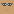
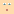

# 🖼️ 素材分類：Pixelart Netral

> [🏠 主目錄](../../../README.md) / [images](../../README.md) / [Dicebear](../README.md) / **Pixelart Netral**

本目錄共有 `20` 個檔案

| 🎨 預覽 (點擊放大)  | 📋 檔案詳細資訊與連結 |
| :--- | :--- |
|  | **📂 檔名:** `pixelArtNeutral-1771676420980.svg` ✨ **格式:** `Vector (SVG)` ⚖️ **大小:** `1.32KB` 📅 **更新:** `2026-03-03`  🚀 **jsDelivr Markdown:** `` 🔗 **直接連結 (Url):** <code>https://cdn.jsdelivr.net/gh/barry028/materials@main/images/Dicebear/Pixelart%20Netral/pixelArtNeutral-1771676420980.svg</code> 📥 [檢視原始檔](pixelArtNeutral-1771676420980.svg) |
|  | **📂 檔名:** `pixelArtNeutral-1771676422204.svg` ✨ **格式:** `Vector (SVG)` ⚖️ **大小:** `1.29KB` 📅 **更新:** `2026-03-03`  🚀 **jsDelivr Markdown:** `` 🔗 **直接連結 (Url):** <code>https://cdn.jsdelivr.net/gh/barry028/materials@main/images/Dicebear/Pixelart%20Netral/pixelArtNeutral-1771676422204.svg</code> 📥 [檢視原始檔](pixelArtNeutral-1771676422204.svg) |
|  | **📂 檔名:** `pixelArtNeutral-1771676423221.svg` ✨ **格式:** `Vector (SVG)` ⚖️ **大小:** `1.52KB` 📅 **更新:** `2026-03-03`  🚀 **jsDelivr Markdown:** `` 🔗 **直接連結 (Url):** <code>https://cdn.jsdelivr.net/gh/barry028/materials@main/images/Dicebear/Pixelart%20Netral/pixelArtNeutral-1771676423221.svg</code> 📥 [檢視原始檔](pixelArtNeutral-1771676423221.svg) |
|  | **📂 檔名:** `pixelArtNeutral-1771676424351.svg` ✨ **格式:** `Vector (SVG)` ⚖️ **大小:** `1.33KB` 📅 **更新:** `2026-03-03`  🚀 **jsDelivr Markdown:** `` 🔗 **直接連結 (Url):** <code>https://cdn.jsdelivr.net/gh/barry028/materials@main/images/Dicebear/Pixelart%20Netral/pixelArtNeutral-1771676424351.svg</code> 📥 [檢視原始檔](pixelArtNeutral-1771676424351.svg) |
|  | **📂 檔名:** `pixelArtNeutral-1771676425786.svg` ✨ **格式:** `Vector (SVG)` ⚖️ **大小:** `1.47KB` 📅 **更新:** `2026-03-03`  🚀 **jsDelivr Markdown:** `` 🔗 **直接連結 (Url):** <code>https://cdn.jsdelivr.net/gh/barry028/materials@main/images/Dicebear/Pixelart%20Netral/pixelArtNeutral-1771676425786.svg</code> 📥 [檢視原始檔](pixelArtNeutral-1771676425786.svg) |
|  | **📂 檔名:** `pixelArtNeutral-1771676426810.svg` ✨ **格式:** `Vector (SVG)` ⚖️ **大小:** `1.39KB` 📅 **更新:** `2026-03-03`  🚀 **jsDelivr Markdown:** `` 🔗 **直接連結 (Url):** <code>https://cdn.jsdelivr.net/gh/barry028/materials@main/images/Dicebear/Pixelart%20Netral/pixelArtNeutral-1771676426810.svg</code> 📥 [檢視原始檔](pixelArtNeutral-1771676426810.svg) |
|  | **📂 檔名:** `pixelArtNeutral-1771676427829.svg` ✨ **格式:** `Vector (SVG)` ⚖️ **大小:** `1.27KB` 📅 **更新:** `2026-03-03`  🚀 **jsDelivr Markdown:** `` 🔗 **直接連結 (Url):** <code>https://cdn.jsdelivr.net/gh/barry028/materials@main/images/Dicebear/Pixelart%20Netral/pixelArtNeutral-1771676427829.svg</code> 📥 [檢視原始檔](pixelArtNeutral-1771676427829.svg) |
|  | **📂 檔名:** `pixelArtNeutral-1771676429149.svg` ✨ **格式:** `Vector (SVG)` ⚖️ **大小:** `1.27KB` 📅 **更新:** `2026-03-03`  🚀 **jsDelivr Markdown:** `` 🔗 **直接連結 (Url):** <code>https://cdn.jsdelivr.net/gh/barry028/materials@main/images/Dicebear/Pixelart%20Netral/pixelArtNeutral-1771676429149.svg</code> 📥 [檢視原始檔](pixelArtNeutral-1771676429149.svg) |
|  | **📂 檔名:** `pixelArtNeutral-1771676431925.svg` ✨ **格式:** `Vector (SVG)` ⚖️ **大小:** `1.42KB` 📅 **更新:** `2026-03-03`  🚀 **jsDelivr Markdown:** `` 🔗 **直接連結 (Url):** <code>https://cdn.jsdelivr.net/gh/barry028/materials@main/images/Dicebear/Pixelart%20Netral/pixelArtNeutral-1771676431925.svg</code> 📥 [檢視原始檔](pixelArtNeutral-1771676431925.svg) |
|  | **📂 檔名:** `pixelArtNeutral-1771676432951.svg` ✨ **格式:** `Vector (SVG)` ⚖️ **大小:** `1.33KB` 📅 **更新:** `2026-03-03`  🚀 **jsDelivr Markdown:** `` 🔗 **直接連結 (Url):** <code>https://cdn.jsdelivr.net/gh/barry028/materials@main/images/Dicebear/Pixelart%20Netral/pixelArtNeutral-1771676432951.svg</code> 📥 [檢視原始檔](pixelArtNeutral-1771676432951.svg) |
|  | **📂 檔名:** `pixelArtNeutral-1771676433981.svg` ✨ **格式:** `Vector (SVG)` ⚖️ **大小:** `1.27KB` 📅 **更新:** `2026-03-03`  🚀 **jsDelivr Markdown:** `` 🔗 **直接連結 (Url):** <code>https://cdn.jsdelivr.net/gh/barry028/materials@main/images/Dicebear/Pixelart%20Netral/pixelArtNeutral-1771676433981.svg</code> 📥 [檢視原始檔](pixelArtNeutral-1771676433981.svg) |
|  | **📂 檔名:** `pixelArtNeutral-1771676434903.svg` ✨ **格式:** `Vector (SVG)` ⚖️ **大小:** `1.46KB` 📅 **更新:** `2026-03-03`  🚀 **jsDelivr Markdown:** `` 🔗 **直接連結 (Url):** <code>https://cdn.jsdelivr.net/gh/barry028/materials@main/images/Dicebear/Pixelart%20Netral/pixelArtNeutral-1771676434903.svg</code> 📥 [檢視原始檔](pixelArtNeutral-1771676434903.svg) |
|  | **📂 檔名:** `pixelArtNeutral-1771676436648.svg` ✨ **格式:** `Vector (SVG)` ⚖️ **大小:** `1.60KB` 📅 **更新:** `2026-03-03`  🚀 **jsDelivr Markdown:** `` 🔗 **直接連結 (Url):** <code>https://cdn.jsdelivr.net/gh/barry028/materials@main/images/Dicebear/Pixelart%20Netral/pixelArtNeutral-1771676436648.svg</code> 📥 [檢視原始檔](pixelArtNeutral-1771676436648.svg) |
|  | **📂 檔名:** `pixelArtNeutral-1771676437664.svg` ✨ **格式:** `Vector (SVG)` ⚖️ **大小:** `1.28KB` 📅 **更新:** `2026-03-03`  🚀 **jsDelivr Markdown:** `` 🔗 **直接連結 (Url):** <code>https://cdn.jsdelivr.net/gh/barry028/materials@main/images/Dicebear/Pixelart%20Netral/pixelArtNeutral-1771676437664.svg</code> 📥 [檢視原始檔](pixelArtNeutral-1771676437664.svg) |
|  | **📂 檔名:** `pixelArtNeutral-1771676438896.svg` ✨ **格式:** `Vector (SVG)` ⚖️ **大小:** `1.28KB` 📅 **更新:** `2026-03-03`  🚀 **jsDelivr Markdown:** `` 🔗 **直接連結 (Url):** <code>https://cdn.jsdelivr.net/gh/barry028/materials@main/images/Dicebear/Pixelart%20Netral/pixelArtNeutral-1771676438896.svg</code> 📥 [檢視原始檔](pixelArtNeutral-1771676438896.svg) |
|  | **📂 檔名:** `pixelArtNeutral-1771676440430.svg` ✨ **格式:** `Vector (SVG)` ⚖️ **大小:** `1.27KB` 📅 **更新:** `2026-03-03`  🚀 **jsDelivr Markdown:** `` 🔗 **直接連結 (Url):** <code>https://cdn.jsdelivr.net/gh/barry028/materials@main/images/Dicebear/Pixelart%20Netral/pixelArtNeutral-1771676440430.svg</code> 📥 [檢視原始檔](pixelArtNeutral-1771676440430.svg) |
|  | **📂 檔名:** `pixelArtNeutral-1771676442897.svg` ✨ **格式:** `Vector (SVG)` ⚖️ **大小:** `1.27KB` 📅 **更新:** `2026-03-03`  🚀 **jsDelivr Markdown:** `` 🔗 **直接連結 (Url):** <code>https://cdn.jsdelivr.net/gh/barry028/materials@main/images/Dicebear/Pixelart%20Netral/pixelArtNeutral-1771676442897.svg</code> 📥 [檢視原始檔](pixelArtNeutral-1771676442897.svg) |
|  | **📂 檔名:** `pixelArtNeutral-1771676444214.svg` ✨ **格式:** `Vector (SVG)` ⚖️ **大小:** `1.28KB` 📅 **更新:** `2026-03-03`  🚀 **jsDelivr Markdown:** `` 🔗 **直接連結 (Url):** <code>https://cdn.jsdelivr.net/gh/barry028/materials@main/images/Dicebear/Pixelart%20Netral/pixelArtNeutral-1771676444214.svg</code> 📥 [檢視原始檔](pixelArtNeutral-1771676444214.svg) |
|  | **📂 檔名:** `pixelArtNeutral-1771676445482.svg` ✨ **格式:** `Vector (SVG)` ⚖️ **大小:** `1.33KB` 📅 **更新:** `2026-03-03`  🚀 **jsDelivr Markdown:** `` 🔗 **直接連結 (Url):** <code>https://cdn.jsdelivr.net/gh/barry028/materials@main/images/Dicebear/Pixelart%20Netral/pixelArtNeutral-1771676445482.svg</code> 📥 [檢視原始檔](pixelArtNeutral-1771676445482.svg) |
|  | **📂 檔名:** `pixelArtNeutral-1771676446980.svg` ✨ **格式:** `Vector (SVG)` ⚖️ **大小:** `1.33KB` 📅 **更新:** `2026-03-03`  🚀 **jsDelivr Markdown:** `` 🔗 **直接連結 (Url):** <code>https://cdn.jsdelivr.net/gh/barry028/materials@main/images/Dicebear/Pixelart%20Netral/pixelArtNeutral-1771676446980.svg</code> 📥 [檢視原始檔](pixelArtNeutral-1771676446980.svg) |