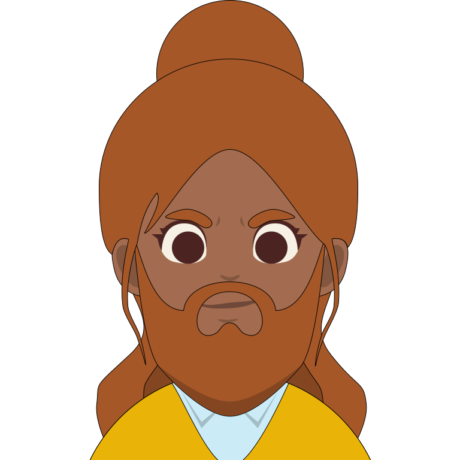
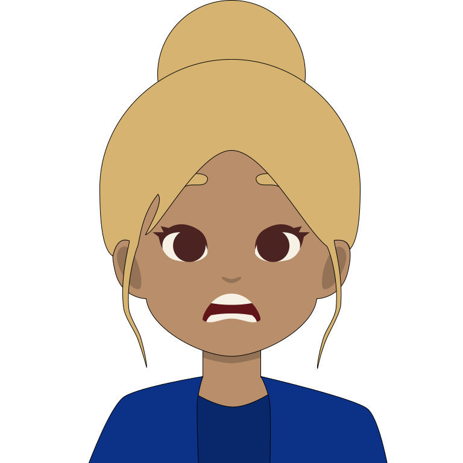
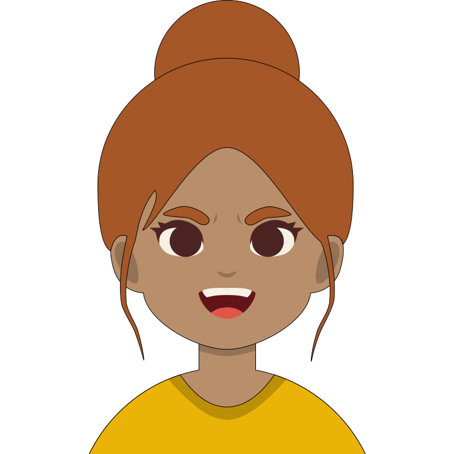
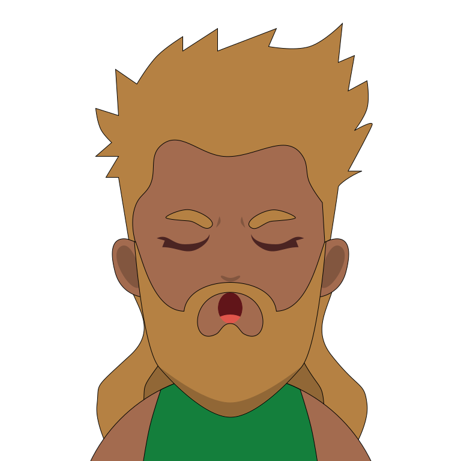
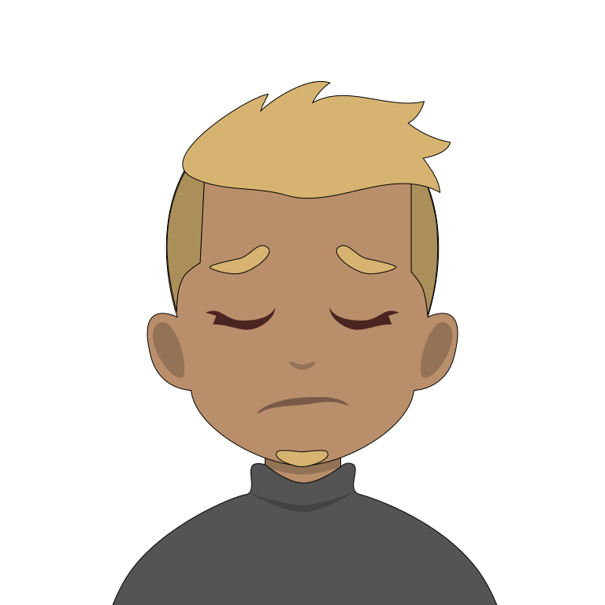
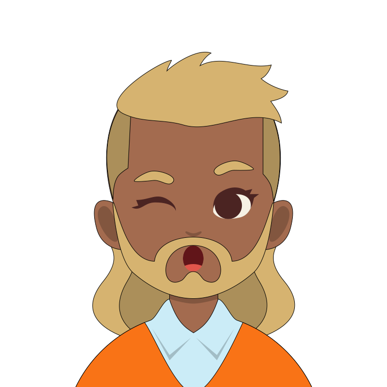
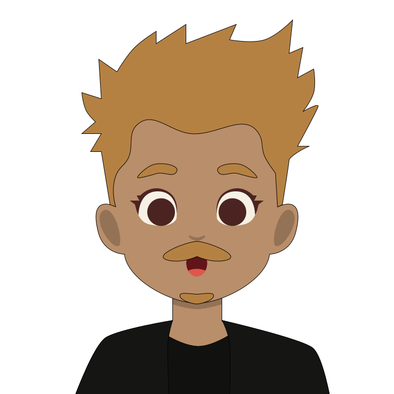

# 🖼️ 素材分類：Toonhead

> [🏠 主目錄](../../../README.md) / [images](../../README.md) / [Dicebear](../README.md) / **Toonhead**

本目錄共有 `20` 個檔案

| 🎨 預覽 (點擊放大)  | 📋 檔案詳細資訊與連結 |
| :--- | :--- |
|  | **📂 檔名:** `toonHead-1771676535353.svg` ✨ **格式:** `Vector (SVG)` ⚖️ **大小:** `6.09KB` 📅 **更新:** `2026-03-01`  🚀 **jsDelivr Markdown:** `` 🔗 **直接連結 (Url):** <code>https://cdn.jsdelivr.net/gh/barry028/materials@main/images/Dicebear/Toonhead/toonHead-1771676535353.svg</code> 📥 [檢視原始檔](toonHead-1771676535353.svg) |
|  | **📂 檔名:** `toonHead-1771676537002.svg` ✨ **格式:** `Vector (SVG)` ⚖️ **大小:** `6.91KB` 📅 **更新:** `2026-03-01`  🚀 **jsDelivr Markdown:** `` 🔗 **直接連結 (Url):** <code>https://cdn.jsdelivr.net/gh/barry028/materials@main/images/Dicebear/Toonhead/toonHead-1771676537002.svg</code> 📥 [檢視原始檔](toonHead-1771676537002.svg) |
|  | **📂 檔名:** `toonHead-1771676539367.svg` ✨ **格式:** `Vector (SVG)` ⚖️ **大小:** `5.70KB` 📅 **更新:** `2026-03-01`  🚀 **jsDelivr Markdown:** `` 🔗 **直接連結 (Url):** <code>https://cdn.jsdelivr.net/gh/barry028/materials@main/images/Dicebear/Toonhead/toonHead-1771676539367.svg</code> 📥 [檢視原始檔](toonHead-1771676539367.svg) |
|  | **📂 檔名:** `toonHead-1771676541090.svg` ✨ **格式:** `Vector (SVG)` ⚖️ **大小:** `5.15KB` 📅 **更新:** `2026-03-01`  🚀 **jsDelivr Markdown:** `` 🔗 **直接連結 (Url):** <code>https://cdn.jsdelivr.net/gh/barry028/materials@main/images/Dicebear/Toonhead/toonHead-1771676541090.svg</code> 📥 [檢視原始檔](toonHead-1771676541090.svg) |
|  | **📂 檔名:** `toonHead-1771676543022.svg` ✨ **格式:** `Vector (SVG)` ⚖️ **大小:** `6.41KB` 📅 **更新:** `2026-03-01`  🚀 **jsDelivr Markdown:** `` 🔗 **直接連結 (Url):** <code>https://cdn.jsdelivr.net/gh/barry028/materials@main/images/Dicebear/Toonhead/toonHead-1771676543022.svg</code> 📥 [檢視原始檔](toonHead-1771676543022.svg) |
|  | **📂 檔名:** `toonHead-1771676544194.svg` ✨ **格式:** `Vector (SVG)` ⚖️ **大小:** `8.68KB` 📅 **更新:** `2026-03-01`  🚀 **jsDelivr Markdown:** `` 🔗 **直接連結 (Url):** <code>https://cdn.jsdelivr.net/gh/barry028/materials@main/images/Dicebear/Toonhead/toonHead-1771676544194.svg</code> 📥 [檢視原始檔](toonHead-1771676544194.svg) |
|  | **📂 檔名:** `toonHead-1771676545492.svg` ✨ **格式:** `Vector (SVG)` ⚖️ **大小:** `6.72KB` 📅 **更新:** `2026-03-01`  🚀 **jsDelivr Markdown:** `` 🔗 **直接連結 (Url):** <code>https://cdn.jsdelivr.net/gh/barry028/materials@main/images/Dicebear/Toonhead/toonHead-1771676545492.svg</code> 📥 [檢視原始檔](toonHead-1771676545492.svg) |
|  | **📂 檔名:** `toonHead-1771676546420.svg` ✨ **格式:** `Vector (SVG)` ⚖️ **大小:** `6.98KB` 📅 **更新:** `2026-03-01`  🚀 **jsDelivr Markdown:** `` 🔗 **直接連結 (Url):** <code>https://cdn.jsdelivr.net/gh/barry028/materials@main/images/Dicebear/Toonhead/toonHead-1771676546420.svg</code> 📥 [檢視原始檔](toonHead-1771676546420.svg) |
|  | **📂 檔名:** `toonHead-1771676548665.svg` ✨ **格式:** `Vector (SVG)` ⚖️ **大小:** `7.86KB` 📅 **更新:** `2026-03-01`  🚀 **jsDelivr Markdown:** `` 🔗 **直接連結 (Url):** <code>https://cdn.jsdelivr.net/gh/barry028/materials@main/images/Dicebear/Toonhead/toonHead-1771676548665.svg</code> 📥 [檢視原始檔](toonHead-1771676548665.svg) |
|  | **📂 檔名:** `toonHead-1771676549876.svg` ✨ **格式:** `Vector (SVG)` ⚖️ **大小:** `4.42KB` 📅 **更新:** `2026-03-01`  🚀 **jsDelivr Markdown:** `` 🔗 **直接連結 (Url):** <code>https://cdn.jsdelivr.net/gh/barry028/materials@main/images/Dicebear/Toonhead/toonHead-1771676549876.svg</code> 📥 [檢視原始檔](toonHead-1771676549876.svg) |
|  | **📂 檔名:** `toonHead-1771676550922.svg` ✨ **格式:** `Vector (SVG)` ⚖️ **大小:** `6.57KB` 📅 **更新:** `2026-03-01`  🚀 **jsDelivr Markdown:** `` 🔗 **直接連結 (Url):** <code>https://cdn.jsdelivr.net/gh/barry028/materials@main/images/Dicebear/Toonhead/toonHead-1771676550922.svg</code> 📥 [檢視原始檔](toonHead-1771676550922.svg) |
|  | **📂 檔名:** `toonHead-1771676551960.svg` ✨ **格式:** `Vector (SVG)` ⚖️ **大小:** `4.33KB` 📅 **更新:** `2026-03-01`  🚀 **jsDelivr Markdown:** `` 🔗 **直接連結 (Url):** <code>https://cdn.jsdelivr.net/gh/barry028/materials@main/images/Dicebear/Toonhead/toonHead-1771676551960.svg</code> 📥 [檢視原始檔](toonHead-1771676551960.svg) |
|  | **📂 檔名:** `toonHead-1771676553683.svg` ✨ **格式:** `Vector (SVG)` ⚖️ **大小:** `6.58KB` 📅 **更新:** `2026-03-01`  🚀 **jsDelivr Markdown:** `` 🔗 **直接連結 (Url):** <code>https://cdn.jsdelivr.net/gh/barry028/materials@main/images/Dicebear/Toonhead/toonHead-1771676553683.svg</code> 📥 [檢視原始檔](toonHead-1771676553683.svg) |
|  | **📂 檔名:** `toonHead-1771676554581.svg` ✨ **格式:** `Vector (SVG)` ⚖️ **大小:** `5.96KB` 📅 **更新:** `2026-03-01`  🚀 **jsDelivr Markdown:** `` 🔗 **直接連結 (Url):** <code>https://cdn.jsdelivr.net/gh/barry028/materials@main/images/Dicebear/Toonhead/toonHead-1771676554581.svg</code> 📥 [檢視原始檔](toonHead-1771676554581.svg) |
|  | **📂 檔名:** `toonHead-1771676555650.svg` ✨ **格式:** `Vector (SVG)` ⚖️ **大小:** `5.08KB` 📅 **更新:** `2026-03-01`  🚀 **jsDelivr Markdown:** `` 🔗 **直接連結 (Url):** <code>https://cdn.jsdelivr.net/gh/barry028/materials@main/images/Dicebear/Toonhead/toonHead-1771676555650.svg</code> 📥 [檢視原始檔](toonHead-1771676555650.svg) |
|  | **📂 檔名:** `toonHead-1771676557610.svg` ✨ **格式:** `Vector (SVG)` ⚖️ **大小:** `5.30KB` 📅 **更新:** `2026-03-01`  🚀 **jsDelivr Markdown:** `` 🔗 **直接連結 (Url):** <code>https://cdn.jsdelivr.net/gh/barry028/materials@main/images/Dicebear/Toonhead/toonHead-1771676557610.svg</code> 📥 [檢視原始檔](toonHead-1771676557610.svg) |
|  | **📂 檔名:** `toonHead-1771676559684.svg` ✨ **格式:** `Vector (SVG)` ⚖️ **大小:** `4.62KB` 📅 **更新:** `2026-03-01`  🚀 **jsDelivr Markdown:** `` 🔗 **直接連結 (Url):** <code>https://cdn.jsdelivr.net/gh/barry028/materials@main/images/Dicebear/Toonhead/toonHead-1771676559684.svg</code> 📥 [檢視原始檔](toonHead-1771676559684.svg) |
|  | **📂 檔名:** `toonHead-1771676561102.svg` ✨ **格式:** `Vector (SVG)` ⚖️ **大小:** `7.43KB` 📅 **更新:** `2026-03-01`  🚀 **jsDelivr Markdown:** `` 🔗 **直接連結 (Url):** <code>https://cdn.jsdelivr.net/gh/barry028/materials@main/images/Dicebear/Toonhead/toonHead-1771676561102.svg</code> 📥 [檢視原始檔](toonHead-1771676561102.svg) |
|  | **📂 檔名:** `toonHead-1771676562621.svg` ✨ **格式:** `Vector (SVG)` ⚖️ **大小:** `4.86KB` 📅 **更新:** `2026-03-01`  🚀 **jsDelivr Markdown:** `` 🔗 **直接連結 (Url):** <code>https://cdn.jsdelivr.net/gh/barry028/materials@main/images/Dicebear/Toonhead/toonHead-1771676562621.svg</code> 📥 [檢視原始檔](toonHead-1771676562621.svg) |
|  | **📂 檔名:** `toonHead-1771676563921.svg` ✨ **格式:** `Vector (SVG)` ⚖️ **大小:** `4.75KB` 📅 **更新:** `2026-03-01`  🚀 **jsDelivr Markdown:** `` 🔗 **直接連結 (Url):** <code>https://cdn.jsdelivr.net/gh/barry028/materials@main/images/Dicebear/Toonhead/toonHead-1771676563921.svg</code> 📥 [檢視原始檔](toonHead-1771676563921.svg) |