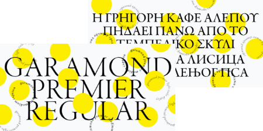
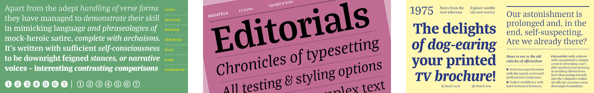
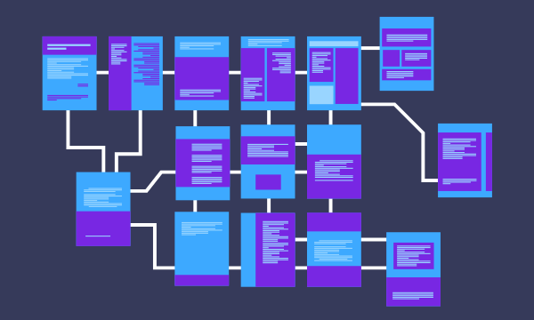

# 🖼️ 素材分類：Font Styles

> [🏠 主目錄](../../README.md) / [images](../README.md) / **Font Styles**

本目錄共有 `23` 個檔案

| 🎨 預覽 (點擊放大)  | 📋 檔案詳細資訊與連結 |
| :--- | :--- |
|  | **📂 檔名:** `AbolitionAnzeigen.png` 🖼️ **尺寸:** `720x250 px` ⚖️ **大小:** `87.71KB` 📅 **更新:** `2026-02-27`  🚀 **jsDelivr Markdown:** `` 🔗 **直接連結 (Url):** <code>https://cdn.jsdelivr.net/gh/barry028/materials@main/images/Font%20Styles/AbolitionAnzeigen.png</code> 📥 [檢視原始檔](AbolitionAnzeigen.png) |
|  | **📂 檔名:** `Adobe黑体.png` 🖼️ **尺寸:** `1896x300 px` ⚖️ **大小:** `268.48KB` 📅 **更新:** `2026-02-27`  🚀 **jsDelivr Markdown:** `` 🔗 **直接連結 (Url):** <code>https://cdn.jsdelivr.net/gh/barry028/materials@main/images/Font%20Styles/Adobe%E9%BB%91%E4%BD%93.png</code> 📥 [檢視原始檔](Adobe%E9%BB%91%E4%BD%93.png) |
|  | **📂 檔名:** `AntonBalboaRiftSoft.png` 🖼️ **尺寸:** `720x250 px` ⚖️ **大小:** `46.38KB` 📅 **更新:** `2026-02-27`  🚀 **jsDelivr Markdown:** `` 🔗 **直接連結 (Url):** <code>https://cdn.jsdelivr.net/gh/barry028/materials@main/images/Font%20Styles/AntonBalboaRiftSoft.png</code> 📥 [檢視原始檔](AntonBalboaRiftSoft.png) |
|  | **📂 檔名:** `Anugrom.png` 🖼️ **尺寸:** `600x300 px` ⚖️ **大小:** `19.89KB` 📅 **更新:** `2026-02-27`  🚀 **jsDelivr Markdown:** `` 🔗 **直接連結 (Url):** <code>https://cdn.jsdelivr.net/gh/barry028/materials@main/images/Font%20Styles/Anugrom.png</code> 📥 [檢視原始檔](Anugrom.png) |
|  | **📂 檔名:** `Caslon.png` 🖼️ **尺寸:** `450x225 px` ⚖️ **大小:** `87.88KB` 📅 **更新:** `2026-02-27`  🚀 **jsDelivr Markdown:** `` 🔗 **直接連結 (Url):** <code>https://cdn.jsdelivr.net/gh/barry028/materials@main/images/Font%20Styles/Caslon.png</code> 📥 [檢視原始檔](Caslon.png) |
|  | **📂 檔名:** `Century.png` 🖼️ **尺寸:** `450x225 px` ⚖️ **大小:** `42.25KB` 📅 **更新:** `2026-02-27`  🚀 **jsDelivr Markdown:** `` 🔗 **直接連結 (Url):** <code>https://cdn.jsdelivr.net/gh/barry028/materials@main/images/Font%20Styles/Century.png</code> 📥 [檢視原始檔](Century.png) |
|  | **📂 檔名:** `Crete.png` 🖼️ **尺寸:** `600x300 px` ⚖️ **大小:** `13.95KB` 📅 **更新:** `2026-02-27`  🚀 **jsDelivr Markdown:** `` 🔗 **直接連結 (Url):** <code>https://cdn.jsdelivr.net/gh/barry028/materials@main/images/Font%20Styles/Crete.png</code> 📥 [檢視原始檔](Crete.png) |
|  | **📂 檔名:** `FāngZhèngFǎngSòng.png` 🖼️ **尺寸:** `600x300 px` ⚖️ **大小:** `74.40KB` 📅 **更新:** `2026-02-27`  🚀 **jsDelivr Markdown:** `` 🔗 **直接連結 (Url):** <code>https://cdn.jsdelivr.net/gh/barry028/materials@main/images/Font%20Styles/F%C4%81ngZh%C3%A8ngF%C7%8EngS%C3%B2ng.png</code> 📥 [檢視原始檔](F%C4%81ngZh%C3%A8ngF%C7%8EngS%C3%B2ng.png) |
|  | **📂 檔名:** `FāngZhèngKǎiTǐ.png` 🖼️ **尺寸:** `600x300 px` ⚖️ **大小:** `87.55KB` 📅 **更新:** `2026-02-27`  🚀 **jsDelivr Markdown:** `` 🔗 **直接連結 (Url):** <code>https://cdn.jsdelivr.net/gh/barry028/materials@main/images/Font%20Styles/F%C4%81ngZh%C3%A8ngK%C7%8EiT%C7%90.png</code> 📥 [檢視原始檔](F%C4%81ngZh%C3%A8ngK%C7%8EiT%C7%90.png) |
|  | **📂 檔名:** `FāngZhèngShūSòng.png` 🖼️ **尺寸:** `600x300 px` ⚖️ **大小:** `75.91KB` 📅 **更新:** `2026-02-27`  🚀 **jsDelivr Markdown:** `` 🔗 **直接連結 (Url):** <code>https://cdn.jsdelivr.net/gh/barry028/materials@main/images/Font%20Styles/F%C4%81ngZh%C3%A8ngSh%C5%ABS%C3%B2ng.png</code> 📥 [檢視原始檔](F%C4%81ngZh%C3%A8ngSh%C5%ABS%C3%B2ng.png) |
|  | **📂 檔名:** `Garamond.png` 🖼️ **尺寸:** `450x225 px` ⚖️ **大小:** `83.76KB` 📅 **更新:** `2026-02-27`  🚀 **jsDelivr Markdown:** `` 🔗 **直接連結 (Url):** <code>https://cdn.jsdelivr.net/gh/barry028/materials@main/images/Font%20Styles/Garamond.png</code> 📥 [檢視原始檔](Garamond.png) |
|  | **📂 檔名:** `GroupAvoryPEVariable.png` 🖼️ **尺寸:** `1896x308 px` ⚖️ **大小:** `265.94KB` 📅 **更新:** `2026-02-27`  🚀 **jsDelivr Markdown:** `` 🔗 **直接連結 (Url):** <code>https://cdn.jsdelivr.net/gh/barry028/materials@main/images/Font%20Styles/GroupAvoryPEVariable.png</code> 📥 [檢視原始檔](GroupAvoryPEVariable.png) |
|  | **📂 檔名:** `GroupBagatela.png` 🖼️ **尺寸:** `1896x300 px` ⚖️ **大小:** `408.89KB` 📅 **更新:** `2026-02-27`  🚀 **jsDelivr Markdown:** `` 🔗 **直接連結 (Url):** <code>https://cdn.jsdelivr.net/gh/barry028/materials@main/images/Font%20Styles/GroupBagatela.png</code> 📥 [檢視原始檔](GroupBagatela.png) |
|  | **📂 檔名:** `GroupMapRoman.png` 🖼️ **尺寸:** `1896x300 px` ⚖️ **大小:** `359.64KB` 📅 **更新:** `2026-02-27`  🚀 **jsDelivr Markdown:** `` 🔗 **直接連結 (Url):** <code>https://cdn.jsdelivr.net/gh/barry028/materials@main/images/Font%20Styles/GroupMapRoman.png</code> 📥 [檢視原始檔](GroupMapRoman.png) |
|  | **📂 檔名:** `GroupMarlide.png` 🖼️ **尺寸:** `1920x300 px` ⚖️ **大小:** `405.71KB` 📅 **更新:** `2026-02-27`  🚀 **jsDelivr Markdown:** `` 🔗 **直接連結 (Url):** <code>https://cdn.jsdelivr.net/gh/barry028/materials@main/images/Font%20Styles/GroupMarlide.png</code> 📥 [檢視原始檔](GroupMarlide.png) |
|  | **📂 檔名:** `GroupP22ConstructivistPro.png` 🖼️ **尺寸:** `1248x300 px` ⚖️ **大小:** `83.53KB` 📅 **更新:** `2026-02-27`  🚀 **jsDelivr Markdown:** `` 🔗 **直接連結 (Url):** <code>https://cdn.jsdelivr.net/gh/barry028/materials@main/images/Font%20Styles/GroupP22ConstructivistPro.png</code> 📥 [檢視原始檔](GroupP22ConstructivistPro.png) |
|  | **📂 檔名:** `MVBSalis.png` 🖼️ **尺寸:** `600x300 px` ⚖️ **大小:** `80.45KB` 📅 **更新:** `2026-02-27`  🚀 **jsDelivr Markdown:** `` 🔗 **直接連結 (Url):** <code>https://cdn.jsdelivr.net/gh/barry028/materials@main/images/Font%20Styles/MVBSalis.png</code> 📥 [檢視原始檔](MVBSalis.png) |
|  | **📂 檔名:** `Sigurd.png` 🖼️ **尺寸:** `600x300 px` ⚖️ **大小:** `115.86KB` 📅 **更新:** `2026-02-27`  🚀 **jsDelivr Markdown:** `` 🔗 **直接連結 (Url):** <code>https://cdn.jsdelivr.net/gh/barry028/materials@main/images/Font%20Styles/Sigurd.png</code> 📥 [檢視原始檔](Sigurd.png) |
|  | **📂 檔名:** `SourceHanSans.png` 🖼️ **尺寸:** `600x300 px` ⚖️ **大小:** `47.60KB` 📅 **更新:** `2026-02-27`  🚀 **jsDelivr Markdown:** `` 🔗 **直接連結 (Url):** <code>https://cdn.jsdelivr.net/gh/barry028/materials@main/images/Font%20Styles/SourceHanSans.png</code> 📥 [檢視原始檔](SourceHanSans.png) |
|  | **📂 檔名:** `TCCaslonPro.png` 🖼️ **尺寸:** `1896x300 px` ⚖️ **大小:** `612.38KB` 📅 **更新:** `2026-02-27`  🚀 **jsDelivr Markdown:** `` 🔗 **直接連結 (Url):** <code>https://cdn.jsdelivr.net/gh/barry028/materials@main/images/Font%20Styles/TCCaslonPro.png</code> 📥 [檢視原始檔](TCCaslonPro.png) |
|  | **📂 檔名:** `Wireframe.png` 🖼️ **尺寸:** `600x360 px` ⚖️ **大小:** `23.70KB` 📅 **更新:** `2026-02-27`  🚀 **jsDelivr Markdown:** `` 🔗 **直接連結 (Url):** <code>https://cdn.jsdelivr.net/gh/barry028/materials@main/images/Font%20Styles/Wireframe.png</code> 📥 [檢視原始檔](Wireframe.png) |
|  | **📂 檔名:** `文鼎UD晶熙黑體GBStd.png` 🖼️ **尺寸:** `600x300 px` ⚖️ **大小:** `64.04KB` 📅 **更新:** `2026-02-27`  🚀 **jsDelivr Markdown:** `` 🔗 **直接連結 (Url):** <code>https://cdn.jsdelivr.net/gh/barry028/materials@main/images/Font%20Styles/%E6%96%87%E9%BC%8EUD%E6%99%B6%E7%86%99%E9%BB%91%E9%AB%94GBStd.png</code> 📥 [檢視原始檔](%E6%96%87%E9%BC%8EUD%E6%99%B6%E7%86%99%E9%BB%91%E9%AB%94GBStd.png) |
|  | **📂 檔名:** `文鼎書林宋體GBStd.png` 🖼️ **尺寸:** `600x300 px` ⚖️ **大小:** `116.74KB` 📅 **更新:** `2026-02-27`  🚀 **jsDelivr Markdown:** `` 🔗 **直接連結 (Url):** <code>https://cdn.jsdelivr.net/gh/barry028/materials@main/images/Font%20Styles/%E6%96%87%E9%BC%8E%E6%9B%B8%E6%9E%97%E5%AE%8B%E9%AB%94GBStd.png</code> 📥 [檢視原始檔](%E6%96%87%E9%BC%8E%E6%9B%B8%E6%9E%97%E5%AE%8B%E9%AB%94GBStd.png) |