# 🖼️ FontStyles 素材庫

[⬅️ 返回主目錄](../../README.md)

| 預覽 (點擊放大) | 檔案資訊 |
| :--- | :--- |
|  | **AbolitionAnzeigenGroteskCubanoSharpFatFrankGibsonIndustryIncITCAvantGardeGothicProStencilettaVAGRundschriftDTermina.png** 720x250 | 87.71KB |
| <a href="Adobe黑体.png">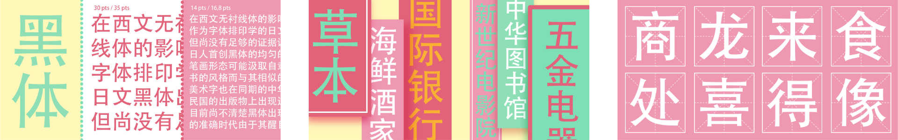</a> | **Adobe黑体.png** 1896x300 | 268.48KB |
|  | **AntonBalboaRiftSoft.png** 720x250 | 46.38KB |
|  | **Anugrom.png** 600x300 | 19.89KB |
|  | **Caslon.png** 450x225 | 87.88KB |
| <a href="Century.png">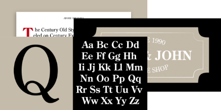</a> | **Century.png** 450x225 | 42.25KB |
|  | **Crete.png** 600x300 | 13.95KB |
| <a href="FāngZhèngFǎngSòng.png">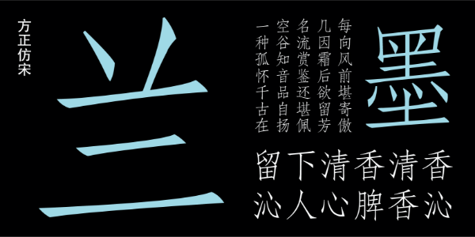</a> | **FāngZhèngFǎngSòng.png** 600x300 | 74.40KB |
| <a href="FāngZhèngKǎiTǐ.png">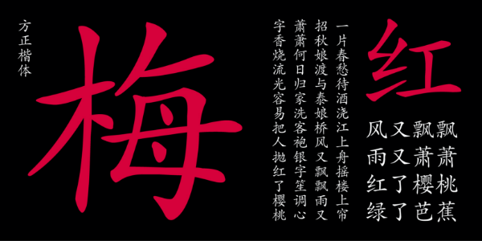</a> | **FāngZhèngKǎiTǐ.png** 600x300 | 87.55KB |
| <a href="FāngZhèngShūSòng.png">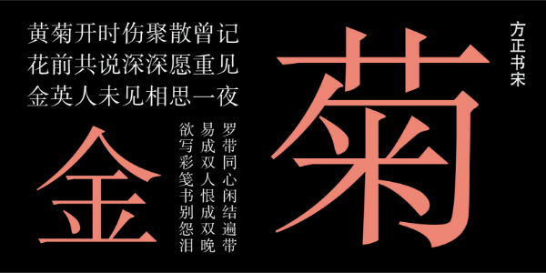</a> | **FāngZhèngShūSòng.png** 600x300 | 75.91KB |
| <a href="Garamond.png">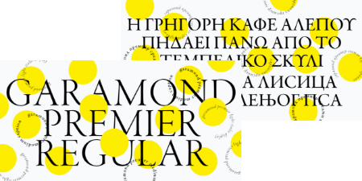</a> | **Garamond.png** 450x225 | 83.76KB |
| <a href="GroupAvoryPEVariable.png">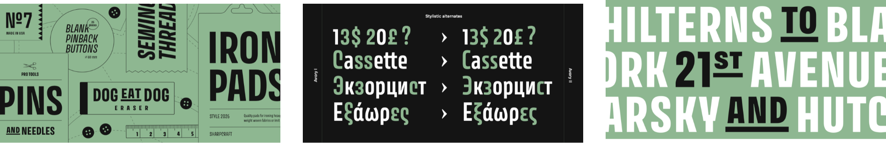</a> | **GroupAvoryPEVariable.png** 1896x308 | 265.94KB |
| <a href="GroupBagatela.png">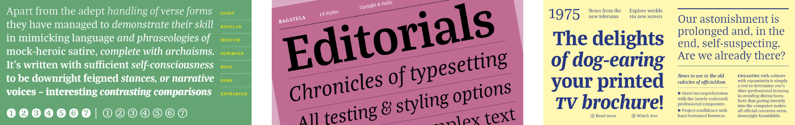</a> | **GroupBagatela.png** 1896x300 | 408.89KB |
|  | **GroupMapRoman.png** 1896x300 | 359.64KB |
| <a href="GroupMarlide.png">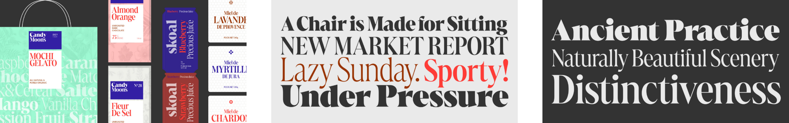</a> | **GroupMarlide.png** 1920x300 | 405.71KB |
| <a href="GroupP22ConstructivistPro.png">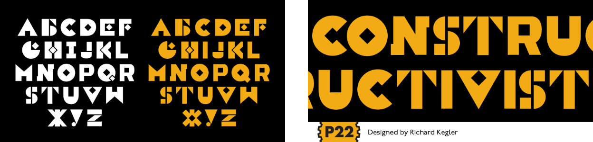</a> | **GroupP22ConstructivistPro.png** 1248x300 | 83.53KB |
| <a href="MVBSalis.png">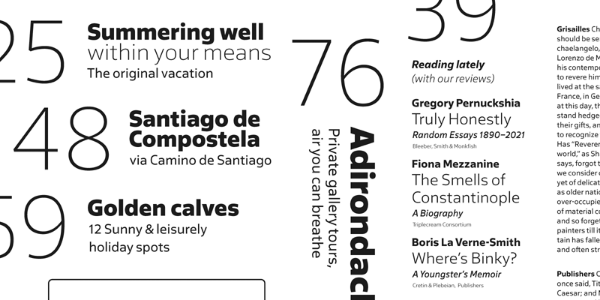</a> | **MVBSalis.png** 600x300 | 80.45KB |
| <a href="Sigurd.png">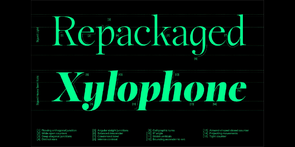</a> | **Sigurd.png** 600x300 | 115.86KB |
|  | **SourceHanSans.png** 600x300 | 47.60KB |
|  | **TCCaslonPro.png** 1896x300 | 612.38KB |
| <a href="Wireframe.png">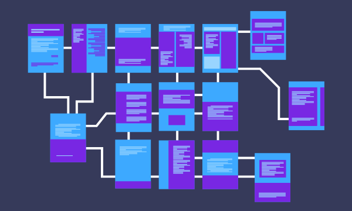</a> | **Wireframe.png** 600x360 | 23.70KB |
|  | **文鼎UD晶熙黑體GBStd.png** 600x300 | 64.04KB |
|  | **文鼎書林宋體GBStd.png** 600x300 | 116.74KB |