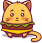
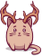
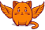

# 🖼️ 素材分類：SVG

> [🏠 主目錄](../../../../README.md) / [images](../../../README.md) / [Illustrations](../../README.md) / [Amazing Cat Illustrations](../README.md) / **SVG**

本目錄共有 `20` 個檔案

| 🎨 預覽 (點擊放大)  | 📋 檔案詳細資訊與連結 |
| :--- | :--- |
|  | **📂 檔名:** `alien-mushroom.svg` ✨ **格式:** `Vector (SVG)` ⚖️ **大小:** `30.05KB` 📅 **更新:** `2026-03-02`  🚀 **jsDelivr Markdown:** `` 🔗 **直接連結 (Url):** <code>https://cdn.jsdelivr.net/gh/barry028/materials@main/images/Illustrations/Amazing%20Cat%20Illustrations/SVG/alien-mushroom.svg</code> 📥 [檢視原始檔](alien-mushroom.svg) |
|  | **📂 檔名:** `alieny.svg` ✨ **格式:** `Vector (SVG)` ⚖️ **大小:** `27.47KB` 📅 **更新:** `2026-03-02`  🚀 **jsDelivr Markdown:** `` 🔗 **直接連結 (Url):** <code>https://cdn.jsdelivr.net/gh/barry028/materials@main/images/Illustrations/Amazing%20Cat%20Illustrations/SVG/alieny.svg</code> 📥 [檢視原始檔](alieny.svg) |
|  | **📂 檔名:** `amanita.svg` ✨ **格式:** `Vector (SVG)` ⚖️ **大小:** `36.64KB` 📅 **更新:** `2026-03-02`  🚀 **jsDelivr Markdown:** `` 🔗 **直接連結 (Url):** <code>https://cdn.jsdelivr.net/gh/barry028/materials@main/images/Illustrations/Amazing%20Cat%20Illustrations/SVG/amanita.svg</code> 📥 [檢視原始檔](amanita.svg) |
|  | **📂 檔名:** `amused.svg` ✨ **格式:** `Vector (SVG)` ⚖️ **大小:** `17.89KB` 📅 **更新:** `2026-03-02`  🚀 **jsDelivr Markdown:** `` 🔗 **直接連結 (Url):** <code>https://cdn.jsdelivr.net/gh/barry028/materials@main/images/Illustrations/Amazing%20Cat%20Illustrations/SVG/amused.svg</code> 📥 [檢視原始檔](amused.svg) |
|  | **📂 檔名:** `angel.svg` ✨ **格式:** `Vector (SVG)` ⚖️ **大小:** `30.29KB` 📅 **更新:** `2026-03-02`  🚀 **jsDelivr Markdown:** `` 🔗 **直接連結 (Url):** <code>https://cdn.jsdelivr.net/gh/barry028/materials@main/images/Illustrations/Amazing%20Cat%20Illustrations/SVG/angel.svg</code> 📥 [檢視原始檔](angel.svg) |
|  | **📂 檔名:** `angry.svg` ✨ **格式:** `Vector (SVG)` ⚖️ **大小:** `19.10KB` 📅 **更新:** `2026-03-02`  🚀 **jsDelivr Markdown:** `` 🔗 **直接連結 (Url):** <code>https://cdn.jsdelivr.net/gh/barry028/materials@main/images/Illustrations/Amazing%20Cat%20Illustrations/SVG/angry.svg</code> 📥 [檢視原始檔](angry.svg) |
|  | **📂 檔名:** `avocado.svg` ✨ **格式:** `Vector (SVG)` ⚖️ **大小:** `22.25KB` 📅 **更新:** `2026-03-02`  🚀 **jsDelivr Markdown:** `` 🔗 **直接連結 (Url):** <code>https://cdn.jsdelivr.net/gh/barry028/materials@main/images/Illustrations/Amazing%20Cat%20Illustrations/SVG/avocado.svg</code> 📥 [檢視原始檔](avocado.svg) |
|  | **📂 檔名:** `burger.svg` ✨ **格式:** `Vector (SVG)` ⚖️ **大小:** `30.35KB` 📅 **更新:** `2026-03-02`  🚀 **jsDelivr Markdown:** `` 🔗 **直接連結 (Url):** <code>https://cdn.jsdelivr.net/gh/barry028/materials@main/images/Illustrations/Amazing%20Cat%20Illustrations/SVG/burger.svg</code> 📥 [檢視原始檔](burger.svg) |
|  | **📂 檔名:** `butterfly.svg` ✨ **格式:** `Vector (SVG)` ⚖️ **大小:** `28.42KB` 📅 **更新:** `2026-03-02`  🚀 **jsDelivr Markdown:** `` 🔗 **直接連結 (Url):** <code>https://cdn.jsdelivr.net/gh/barry028/materials@main/images/Illustrations/Amazing%20Cat%20Illustrations/SVG/butterfly.svg</code> 📥 [檢視原始檔](butterfly.svg) |
|  | **📂 檔名:** `carrot.svg` ✨ **格式:** `Vector (SVG)` ⚖️ **大小:** `41.44KB` 📅 **更新:** `2026-03-02`  🚀 **jsDelivr Markdown:** `` 🔗 **直接連結 (Url):** <code>https://cdn.jsdelivr.net/gh/barry028/materials@main/images/Illustrations/Amazing%20Cat%20Illustrations/SVG/carrot.svg</code> 📥 [檢視原始檔](carrot.svg) |
|  | **📂 檔名:** `cat-background-big.svg` ✨ **格式:** `Vector (SVG)` ⚖️ **大小:** `46.81KB` 📅 **更新:** `2026-03-02`  🚀 **jsDelivr Markdown:** `` 🔗 **直接連結 (Url):** <code>https://cdn.jsdelivr.net/gh/barry028/materials@main/images/Illustrations/Amazing%20Cat%20Illustrations/SVG/cat-background-big.svg</code> 📥 [檢視原始檔](cat-background-big.svg) |
|  | **📂 檔名:** `contented.svg` ✨ **格式:** `Vector (SVG)` ⚖️ **大小:** `18.59KB` 📅 **更新:** `2026-03-02`  🚀 **jsDelivr Markdown:** `` 🔗 **直接連結 (Url):** <code>https://cdn.jsdelivr.net/gh/barry028/materials@main/images/Illustrations/Amazing%20Cat%20Illustrations/SVG/contented.svg</code> 📥 [檢視原始檔](contented.svg) |
|  | **📂 檔名:** `cupcake.svg` ✨ **格式:** `Vector (SVG)` ⚖️ **大小:** `40.72KB` 📅 **更新:** `2026-03-02`  🚀 **jsDelivr Markdown:** `` 🔗 **直接連結 (Url):** <code>https://cdn.jsdelivr.net/gh/barry028/materials@main/images/Illustrations/Amazing%20Cat%20Illustrations/SVG/cupcake.svg</code> 📥 [檢視原始檔](cupcake.svg) |
|  | **📂 檔名:** `death-cup.svg` ✨ **格式:** `Vector (SVG)` ⚖️ **大小:** `30.69KB` 📅 **更新:** `2026-03-02`  🚀 **jsDelivr Markdown:** `` 🔗 **直接連結 (Url):** <code>https://cdn.jsdelivr.net/gh/barry028/materials@main/images/Illustrations/Amazing%20Cat%20Illustrations/SVG/death-cup.svg</code> 📥 [檢視原始檔](death-cup.svg) |
|  | **📂 檔名:** `deer.svg` ✨ **格式:** `Vector (SVG)` ⚖️ **大小:** `35.55KB` 📅 **更新:** `2026-03-02`  🚀 **jsDelivr Markdown:** `` 🔗 **直接連結 (Url):** <code>https://cdn.jsdelivr.net/gh/barry028/materials@main/images/Illustrations/Amazing%20Cat%20Illustrations/SVG/deer.svg</code> 📥 [檢視原始檔](deer.svg) |
|  | **📂 檔名:** `demon.svg` ✨ **格式:** `Vector (SVG)` ⚖️ **大小:** `24.81KB` 📅 **更新:** `2026-03-02`  🚀 **jsDelivr Markdown:** `` 🔗 **直接連結 (Url):** <code>https://cdn.jsdelivr.net/gh/barry028/materials@main/images/Illustrations/Amazing%20Cat%20Illustrations/SVG/demon.svg</code> 📥 [檢視原始檔](demon.svg) |
|  | **📂 檔名:** `dragon.svg` ✨ **格式:** `Vector (SVG)` ⚖️ **大小:** `28.50KB` 📅 **更新:** `2026-03-02`  🚀 **jsDelivr Markdown:** `` 🔗 **直接連結 (Url):** <code>https://cdn.jsdelivr.net/gh/barry028/materials@main/images/Illustrations/Amazing%20Cat%20Illustrations/SVG/dragon.svg</code> 📥 [檢視原始檔](dragon.svg) |
|  | **📂 檔名:** `enchanter.svg` ✨ **格式:** `Vector (SVG)` ⚖️ **大小:** `33.23KB` 📅 **更新:** `2026-03-02`  🚀 **jsDelivr Markdown:** `` 🔗 **直接連結 (Url):** <code>https://cdn.jsdelivr.net/gh/barry028/materials@main/images/Illustrations/Amazing%20Cat%20Illustrations/SVG/enchanter.svg</code> 📥 [檢視原始檔](enchanter.svg) |
|  | **📂 檔名:** `firecat.svg` ✨ **格式:** `Vector (SVG)` ⚖️ **大小:** `38.93KB` 📅 **更新:** `2026-03-02`  🚀 **jsDelivr Markdown:** `` 🔗 **直接連結 (Url):** <code>https://cdn.jsdelivr.net/gh/barry028/materials@main/images/Illustrations/Amazing%20Cat%20Illustrations/SVG/firecat.svg</code> 📥 [檢視原始檔](firecat.svg) |
|  | **📂 檔名:** `flora.svg` ✨ **格式:** `Vector (SVG)` ⚖️ **大小:** `40.59KB` 📅 **更新:** `2026-03-02`  🚀 **jsDelivr Markdown:** `` 🔗 **直接連結 (Url):** <code>https://cdn.jsdelivr.net/gh/barry028/materials@main/images/Illustrations/Amazing%20Cat%20Illustrations/SVG/flora.svg</code> 📥 [檢視原始檔](flora.svg) |