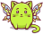

# 🖼️ SVG

[⬅️ 返回主目錄](../../../../README.md)

| 預覽 | 資訊 |
| :--- | :--- |
|  | **alien-mushroom.svg** |
|  | **alieny.svg** |
|  | **amanita.svg** |
|  | **amused.svg** |
|  | **angel.svg** |
|  | **angry.svg** |
|  | **avocado.svg** |
|  | **burger.svg** |
|  | **butterfly.svg** |
|  | **carrot.svg** |
|  | **cat-background-big.svg** |
|  | **contented.svg** |
|  | **cupcake.svg** |
|  | **death-cup.svg** |
|  | **deer.svg** |
|  | **demon.svg** |
|  | **dragon.svg** |
|  | **enchanter.svg** |
|  | **firecat.svg** |
|  | **flora.svg** |