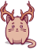

# 🖼️ 素材分類：SVG

> [🏠 主目錄](../../../../README.md) / **SVG**

本目錄共有 `20` 個檔案

| 🎨 預覽 (點擊放大) | 📋 檔案詳細資訊 |
| :--- | :--- |
|  | **📂 檔名:** `alien-mushroom.svg` ✨ **格式:** `Vector (SVG)` ⚖️ **大小:** `30.05KB` 📅 **更新:** `2026-02-27`  🔗 [直接查看原始檔](alien-mushroom.svg) |
|  | **📂 檔名:** `alieny.svg` ✨ **格式:** `Vector (SVG)` ⚖️ **大小:** `27.47KB` 📅 **更新:** `2026-02-27`  🔗 [直接查看原始檔](alieny.svg) |
|  | **📂 檔名:** `amanita.svg` ✨ **格式:** `Vector (SVG)` ⚖️ **大小:** `36.64KB` 📅 **更新:** `2026-02-27`  🔗 [直接查看原始檔](amanita.svg) |
|  | **📂 檔名:** `amused.svg` ✨ **格式:** `Vector (SVG)` ⚖️ **大小:** `17.89KB` 📅 **更新:** `2026-02-27`  🔗 [直接查看原始檔](amused.svg) |
|  | **📂 檔名:** `angel.svg` ✨ **格式:** `Vector (SVG)` ⚖️ **大小:** `30.29KB` 📅 **更新:** `2026-02-27`  🔗 [直接查看原始檔](angel.svg) |
|  | **📂 檔名:** `angry.svg` ✨ **格式:** `Vector (SVG)` ⚖️ **大小:** `19.10KB` 📅 **更新:** `2026-02-27`  🔗 [直接查看原始檔](angry.svg) |
|  | **📂 檔名:** `avocado.svg` ✨ **格式:** `Vector (SVG)` ⚖️ **大小:** `22.25KB` 📅 **更新:** `2026-02-27`  🔗 [直接查看原始檔](avocado.svg) |
|  | **📂 檔名:** `burger.svg` ✨ **格式:** `Vector (SVG)` ⚖️ **大小:** `30.35KB` 📅 **更新:** `2026-02-27`  🔗 [直接查看原始檔](burger.svg) |
|  | **📂 檔名:** `butterfly.svg` ✨ **格式:** `Vector (SVG)` ⚖️ **大小:** `28.42KB` 📅 **更新:** `2026-02-27`  🔗 [直接查看原始檔](butterfly.svg) |
|  | **📂 檔名:** `carrot.svg` ✨ **格式:** `Vector (SVG)` ⚖️ **大小:** `41.44KB` 📅 **更新:** `2026-02-27`  🔗 [直接查看原始檔](carrot.svg) |
|  | **📂 檔名:** `cat-background-big.svg` ✨ **格式:** `Vector (SVG)` ⚖️ **大小:** `46.81KB` 📅 **更新:** `2026-02-27`  🔗 [直接查看原始檔](cat-background-big.svg) |
|  | **📂 檔名:** `contented.svg` ✨ **格式:** `Vector (SVG)` ⚖️ **大小:** `18.59KB` 📅 **更新:** `2026-02-27`  🔗 [直接查看原始檔](contented.svg) |
|  | **📂 檔名:** `cupcake.svg` ✨ **格式:** `Vector (SVG)` ⚖️ **大小:** `40.72KB` 📅 **更新:** `2026-02-27`  🔗 [直接查看原始檔](cupcake.svg) |
|  | **📂 檔名:** `death-cup.svg` ✨ **格式:** `Vector (SVG)` ⚖️ **大小:** `30.69KB` 📅 **更新:** `2026-02-27`  🔗 [直接查看原始檔](death-cup.svg) |
|  | **📂 檔名:** `deer.svg` ✨ **格式:** `Vector (SVG)` ⚖️ **大小:** `35.55KB` 📅 **更新:** `2026-02-27`  🔗 [直接查看原始檔](deer.svg) |
|  | **📂 檔名:** `demon.svg` ✨ **格式:** `Vector (SVG)` ⚖️ **大小:** `24.81KB` 📅 **更新:** `2026-02-27`  🔗 [直接查看原始檔](demon.svg) |
|  | **📂 檔名:** `dragon.svg` ✨ **格式:** `Vector (SVG)` ⚖️ **大小:** `28.50KB` 📅 **更新:** `2026-02-27`  🔗 [直接查看原始檔](dragon.svg) |
|  | **📂 檔名:** `enchanter.svg` ✨ **格式:** `Vector (SVG)` ⚖️ **大小:** `33.23KB` 📅 **更新:** `2026-02-27`  🔗 [直接查看原始檔](enchanter.svg) |
|  | **📂 檔名:** `firecat.svg` ✨ **格式:** `Vector (SVG)` ⚖️ **大小:** `38.93KB` 📅 **更新:** `2026-02-27`  🔗 [直接查看原始檔](firecat.svg) |
|  | **📂 檔名:** `flora.svg` ✨ **格式:** `Vector (SVG)` ⚖️ **大小:** `40.59KB` 📅 **更新:** `2026-02-27`  🔗 [直接查看原始檔](flora.svg) |