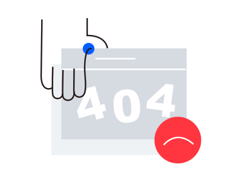
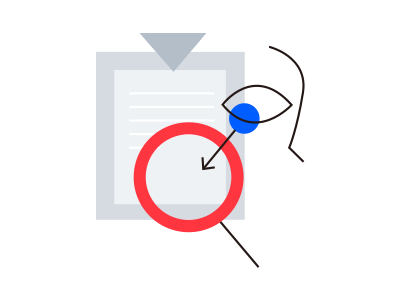

# 🖼️ 素材分類：Byte Dance

> [🏠 主目錄](../../../README.md) / **Byte Dance**

本目錄共有 `15` 個檔案

| 🎨 預覽 (點擊放大) | 📋 檔案詳細資訊 |
| :--- | :--- |
|  | **📂 檔名:** `404.svg` ✨ **格式:** `Vector (SVG)` ⚖️ **大小:** `2.71KB` 📅 **更新:** `2026-02-27`  🔗 [直接查看原始檔](404.svg) |
|  | **📂 檔名:** `bug fix.svg` ✨ **格式:** `Vector (SVG)` ⚖️ **大小:** `1.70KB` 📅 **更新:** `2026-02-27`  🔗 [直接查看原始檔](bug%20fix.svg) |
|  | **📂 檔名:** `loading failed.svg` ✨ **格式:** `Vector (SVG)` ⚖️ **大小:** `1.47KB` 📅 **更新:** `2026-02-27`  🔗 [直接查看原始檔](loading%20failed.svg) |
|  | **📂 檔名:** `no accounts followed.svg` ✨ **格式:** `Vector (SVG)` ⚖️ **大小:** `1.77KB` 📅 **更新:** `2026-02-27`  🔗 [直接查看原始檔](no%20accounts%20followed.svg) |
|  | **📂 檔名:** `no agenda.svg` ✨ **格式:** `Vector (SVG)` ⚖️ **大小:** `1.03KB` 📅 **更新:** `2026-02-27`  🔗 [直接查看原始檔](no%20agenda.svg) |
|  | **📂 檔名:** `no announcement.svg` ✨ **格式:** `Vector (SVG)` ⚖️ **大小:** `1.53KB` 📅 **更新:** `2026-02-27`  🔗 [直接查看原始檔](no%20announcement.svg) |
|  | **📂 檔名:** `no emails yet.svg` ✨ **格式:** `Vector (SVG)` ⚖️ **大小:** `1.66KB` 📅 **更新:** `2026-02-27`  🔗 [直接查看原始檔](no%20emails%20yet.svg) |
|  | **📂 檔名:** `no messages yet.svg` ✨ **格式:** `Vector (SVG)` ⚖️ **大小:** `968.00B` 📅 **更新:** `2026-02-27`  🔗 [直接查看原始檔](no%20messages%20yet.svg) |
|  | **📂 檔名:** `no network connection.svg` ✨ **格式:** `Vector (SVG)` ⚖️ **大小:** `1.30KB` 📅 **更新:** `2026-02-27`  🔗 [直接查看原始檔](no%20network%20connection.svg) |
|  | **📂 檔名:** `no permission.svg` ✨ **格式:** `Vector (SVG)` ⚖️ **大小:** `1.72KB` 📅 **更新:** `2026-02-27`  🔗 [直接查看原始檔](no%20permission.svg) |
|  | **📂 檔名:** `no result.svg` ✨ **格式:** `Vector (SVG)` ⚖️ **大小:** `1.25KB` 📅 **更新:** `2026-02-27`  🔗 [直接查看原始檔](no%20result.svg) |
|  | **📂 檔名:** `no schedule.svg` ✨ **格式:** `Vector (SVG)` ⚖️ **大小:** `1.63KB` 📅 **更新:** `2026-02-27`  🔗 [直接查看原始檔](no%20schedule.svg) |
|  | **📂 檔名:** `no search results.svg` ✨ **格式:** `Vector (SVG)` ⚖️ **大小:** `2.86KB` 📅 **更新:** `2026-02-27`  🔗 [直接查看原始檔](no%20search%20results.svg) |
|  | **📂 檔名:** `searching.svg` ✨ **格式:** `Vector (SVG)` ⚖️ **大小:** `1.50KB` 📅 **更新:** `2026-02-27`  🔗 [直接查看原始檔](searching.svg) |
|  | **📂 檔名:** `under construction.svg` ✨ **格式:** `Vector (SVG)` ⚖️ **大小:** `3.15KB` 📅 **更新:** `2026-02-27`  🔗 [直接查看原始檔](under%20construction.svg) |