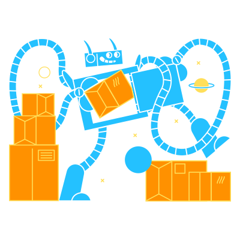
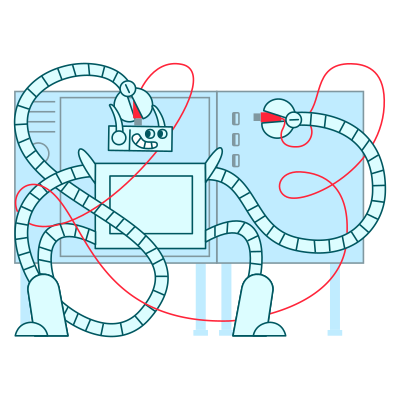
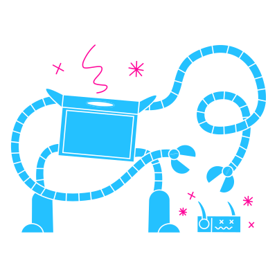

# 📂 目錄：Circuitill

> [🏠 主目錄](../../../README.md) / [images](../../README.md) / [Illustrations](../README.md) / **Circuitill**

此目錄目前沒有直接存放圖片，請選擇下方子分類：

### 🗂️ 子分類列表

| 分類名稱 | 封面預覽 | 統計 |
| :--- | :--- | :--- |
| [📠**SVG**](SVG/README.md) | &nbsp;&nbsp;&nbsp;&nbsp;&nbsp;&nbsp;&nbsp;&nbsp;&nbsp;&nbsp;&nbsp;&nbsp;&nbsp;&nbsp;&nbsp;&nbsp;&nbsp;&nbsp;&nbsp; | 共 `29` 張 |