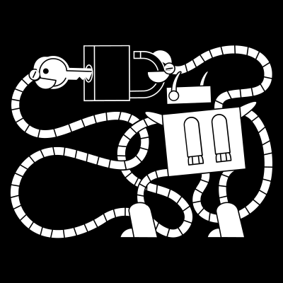
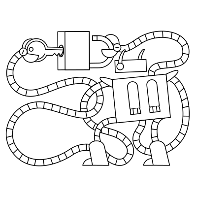
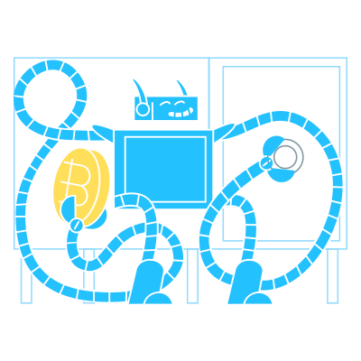

# 🖼️ 素材分類：SVG

> [🏠 主目錄](../../../../README.md) / **SVG**

本目錄共有 `29` 個檔案

| 🎨 預覽 (點擊放大) | 📋 檔案詳細資訊 |
| :--- | :--- |
|  | **📂 檔名:** `Circuit1aGrowwwKit.svg` ✨ **格式:** `Vector (SVG)` ⚖️ **大小:** `25.57KB` 📅 **更新:** `2026-02-27`  🔗 [直接查看原始檔](Circuit1aGrowwwKit.svg) |
|  | **📂 檔名:** `Circuit1bGrowwwKit.svg` ✨ **格式:** `Vector (SVG)` ⚖️ **大小:** `11.35KB` 📅 **更新:** `2026-02-27`  🔗 [直接查看原始檔](Circuit1bGrowwwKit.svg) |
|  | **📂 檔名:** `Circuit1cGrowwwKit.svg` ✨ **格式:** `Vector (SVG)` ⚖️ **大小:** `11.24KB` 📅 **更新:** `2026-02-27`  🔗 [直接查看原始檔](Circuit1cGrowwwKit.svg) |
|  | **📂 檔名:** `Circuit1dGrowwwKit.svg` ✨ **格式:** `Vector (SVG)` ⚖️ **大小:** `27.71KB` 📅 **更新:** `2026-02-27`  🔗 [直接查看原始檔](Circuit1dGrowwwKit.svg) |
|  | **📂 檔名:** `Circuit2aGrowwwKit.svg` ✨ **格式:** `Vector (SVG)` ⚖️ **大小:** `23.57KB` 📅 **更新:** `2026-02-27`  🔗 [直接查看原始檔](Circuit2aGrowwwKit.svg) |
|  | **📂 檔名:** `Circuit2bGrowwwKit.svg` ✨ **格式:** `Vector (SVG)` ⚖️ **大小:** `14.75KB` 📅 **更新:** `2026-02-27`  🔗 [直接查看原始檔](Circuit2bGrowwwKit.svg) |
|  | **📂 檔名:** `Circuit2cGrowwwKit.svg` ✨ **格式:** `Vector (SVG)` ⚖️ **大小:** `14.83KB` 📅 **更新:** `2026-02-27`  🔗 [直接查看原始檔](Circuit2cGrowwwKit.svg) |
|  | **📂 檔名:** `Circuit2dGrowwwKit.svg` ✨ **格式:** `Vector (SVG)` ⚖️ **大小:** `33.77KB` 📅 **更新:** `2026-02-27`  🔗 [直接查看原始檔](Circuit2dGrowwwKit.svg) |
|  | **📂 檔名:** `Circuit3aGrowwwKit.svg` ✨ **格式:** `Vector (SVG)` ⚖️ **大小:** `25.75KB` 📅 **更新:** `2026-02-27`  🔗 [直接查看原始檔](Circuit3aGrowwwKit.svg) |
|  | **📂 檔名:** `Circuit3bGrowwwKit.svg` ✨ **格式:** `Vector (SVG)` ⚖️ **大小:** `13.11KB` 📅 **更新:** `2026-02-27`  🔗 [直接查看原始檔](Circuit3bGrowwwKit.svg) |
|  | **📂 檔名:** `Circuit3cGrowwwKit.svg` ✨ **格式:** `Vector (SVG)` ⚖️ **大小:** `12.93KB` 📅 **更新:** `2026-02-27`  🔗 [直接查看原始檔](Circuit3cGrowwwKit.svg) |
|  | **📂 檔名:** `Circuit3dGrowwwKit.svg` ✨ **格式:** `Vector (SVG)` ⚖️ **大小:** `30.22KB` 📅 **更新:** `2026-02-27`  🔗 [直接查看原始檔](Circuit3dGrowwwKit.svg) |
|  | **📂 檔名:** `Circuit4aGrowwwKit.svg` ✨ **格式:** `Vector (SVG)` ⚖️ **大小:** `25.59KB` 📅 **更新:** `2026-02-27`  🔗 [直接查看原始檔](Circuit4aGrowwwKit.svg) |
|  | **📂 檔名:** `Circuit4bGrowwwKit.svg` ✨ **格式:** `Vector (SVG)` ⚖️ **大小:** `14.34KB` 📅 **更新:** `2026-02-27`  🔗 [直接查看原始檔](Circuit4bGrowwwKit.svg) |
|  | **📂 檔名:** `Circuit4cGrowwwKit.svg` ✨ **格式:** `Vector (SVG)` ⚖️ **大小:** `13.57KB` 📅 **更新:** `2026-02-27`  🔗 [直接查看原始檔](Circuit4cGrowwwKit.svg) |
|  | **📂 檔名:** `Circuit4dGrowwwKit.svg` ✨ **格式:** `Vector (SVG)` ⚖️ **大小:** `26.29KB` 📅 **更新:** `2026-02-27`  🔗 [直接查看原始檔](Circuit4dGrowwwKit.svg) |
|  | **📂 檔名:** `Circuit5aGrowwwKit.svg` ✨ **格式:** `Vector (SVG)` ⚖️ **大小:** `19.68KB` 📅 **更新:** `2026-02-27`  🔗 [直接查看原始檔](Circuit5aGrowwwKit.svg) |
|  | **📂 檔名:** `Circuit5bGrowwwKit.svg` ✨ **格式:** `Vector (SVG)` ⚖️ **大小:** `11.83KB` 📅 **更新:** `2026-02-27`  🔗 [直接查看原始檔](Circuit5bGrowwwKit.svg) |
|  | **📂 檔名:** `Circuit5cGrowwwKit.svg` ✨ **格式:** `Vector (SVG)` ⚖️ **大小:** `11.68KB` 📅 **更新:** `2026-02-27`  🔗 [直接查看原始檔](Circuit5cGrowwwKit.svg) |
|  | **📂 檔名:** `Circuit5dGrowwwKit.svg` ✨ **格式:** `Vector (SVG)` ⚖️ **大小:** `19.80KB` 📅 **更新:** `2026-02-27`  🔗 [直接查看原始檔](Circuit5dGrowwwKit.svg) |
|  | **📂 檔名:** `Circuit6aGrowwwKit.svg` ✨ **格式:** `Vector (SVG)` ⚖️ **大小:** `29.70KB` 📅 **更新:** `2026-02-27`  🔗 [直接查看原始檔](Circuit6aGrowwwKit.svg) |
|  | **📂 檔名:** `Circuit6bGrowwwKit.svg` ✨ **格式:** `Vector (SVG)` ⚖️ **大小:** `11.06KB` 📅 **更新:** `2026-02-27`  🔗 [直接查看原始檔](Circuit6bGrowwwKit.svg) |
|  | **📂 檔名:** `Circuit6cGrowwwKit.svg` ✨ **格式:** `Vector (SVG)` ⚖️ **大小:** `10.56KB` 📅 **更新:** `2026-02-27`  🔗 [直接查看原始檔](Circuit6cGrowwwKit.svg) |
|  | **📂 檔名:** `Circuit6dGrowwwKit.svg` ✨ **格式:** `Vector (SVG)` ⚖️ **大小:** `25.29KB` 📅 **更新:** `2026-02-27`  🔗 [直接查看原始檔](Circuit6dGrowwwKit.svg) |
|  | **📂 檔名:** `Circuit7aGrowwwKit.svg` ✨ **格式:** `Vector (SVG)` ⚖️ **大小:** `33.52KB` 📅 **更新:** `2026-02-27`  🔗 [直接查看原始檔](Circuit7aGrowwwKit.svg) |
|  | **📂 檔名:** `Circuit7bGrowwwKit.svg` ✨ **格式:** `Vector (SVG)` ⚖️ **大小:** `14.48KB` 📅 **更新:** `2026-02-27`  🔗 [直接查看原始檔](Circuit7bGrowwwKit.svg) |
|  | **📂 檔名:** `Circuit7cGrowwwKit.svg` ✨ **格式:** `Vector (SVG)` ⚖️ **大小:** `13.87KB` 📅 **更新:** `2026-02-27`  🔗 [直接查看原始檔](Circuit7cGrowwwKit.svg) |
|  | **📂 檔名:** `Circuit7dGrowwwKit.svg` ✨ **格式:** `Vector (SVG)` ⚖️ **大小:** `27.79KB` 📅 **更新:** `2026-02-27`  🔗 [直接查看原始檔](Circuit7dGrowwwKit.svg) |
|  | **📂 檔名:** `Circuit8aGrowwwKit.svg` ✨ **格式:** `Vector (SVG)` ⚖️ **大小:** `23.58KB` 📅 **更新:** `2026-02-27`  🔗 [直接查看原始檔](Circuit8aGrowwwKit.svg) |